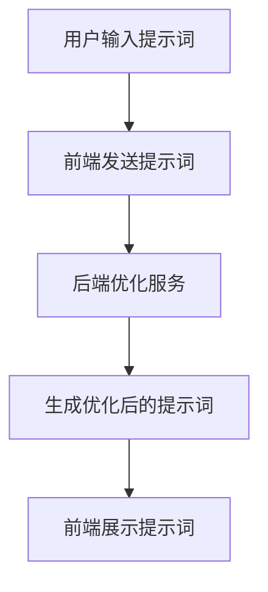

                 


# ChatGPT提示词优化：从基础到高级的全面攻略

## 关键词

- ChatGPT
- 提示词优化
- 人工智能
- 自然语言处理
- 对话系统

## 摘要

本文旨在深入探讨ChatGPT提示词优化的全过程，从基础到高级，为您提供一整套系统的优化策略。我们将首先介绍提示词的基础概念和类型，接着探讨优化的重要性，逐步深入到基础级、中级和高级提示词优化的具体方法和案例分析，最后总结最佳实践，为实际应用提供指导。

### 背景介绍

#### 核心概念术语说明

- **提示词（Prompt）**：在自然语言处理中，提示词是指用于引导模型生成文本的输入。对于ChatGPT这样的对话系统，提示词的质量直接影响生成的回答质量和用户体验。
- **优化（Optimization）**：在人工智能领域，优化通常是指通过调整参数或结构，提高系统性能的过程。在提示词优化中，优化目标是提高模型的回答质量、流畅性和相关性。

#### 问题背景

随着人工智能技术的不断发展，自然语言处理（NLP）和对话系统在各个领域得到了广泛应用。然而，模型的性能在很大程度上依赖于输入提示词的质量。低质量的提示词可能导致模型产生模糊、无关或不准确的回答，从而影响用户体验。因此，对提示词进行优化成为提升对话系统性能的关键。

#### 问题描述

- 如何定义和区分不同的提示词类型？
- 提示词优化有哪些常见策略和方法？
- 在基础级、中级和高级提示词优化中，具体应采取哪些措施？
- 如何在实际项目中应用这些优化策略？

#### 问题解决

本文将通过以下步骤解答上述问题：

1. **基础级提示词优化**：介绍语法检查、同义词替换和情感分析等基础优化技巧。
2. **中级提示词优化**：探讨使用数据增强、模型微调等中级优化策略。
3. **高级提示词优化**：分析生成对抗网络（GAN）、自适应学习等高级优化技巧。
4. **最佳实践总结**：总结不同层级的优化最佳实践，并提供实际操作指南。

#### 边界与外延

- **边界**：本文主要关注文本层面的提示词优化，未涉及更深层次的对话管理策略。
- **外延**：提示词优化不仅限于ChatGPT，也可应用于其他对话系统和NLP任务。

#### 概念结构与核心要素组成

提示词优化的概念结构包括：

1. **定义与类型**：提示词的定义、类型及其在系统中的作用。
2. **优化目标**：提升回答质量、流畅性、相关性等目标。
3. **优化策略**：基础级、中级和高级优化方法。
4. **案例分析**：通过具体案例展示优化效果和应用。
5. **最佳实践**：总结优化经验和建议。

### 核心概念与联系

#### 提示词的概念与类型

提示词在自然语言处理和对话系统中起着至关重要的作用。它们可以被定义为引导模型生成文本的输入序列。根据作用和用途，提示词可以分为以下几种类型：

1. **问题引导词**：用于引导模型生成问题的回答。
2. **答案提示词**：提供上下文信息，帮助模型更好地理解问题，从而生成更准确的答案。
3. **情感引导词**：用于表达用户的情感状态，帮助模型生成符合用户情感需求的回答。

#### 提示词优化的重要性

优化提示词对于提升对话系统的性能至关重要。以下是一些优化提示词的重要性：

1. **提升回答质量**：高质量的提示词有助于模型更好地理解用户意图，从而生成更准确、相关和有价值的回答。
2. **提高用户体验**：优化后的提示词可以增强对话的流畅性和自然度，提供更好的用户体验。
3. **增加对话的流畅性**：通过优化提示词，可以减少对话中的断点和困惑，使对话更加连贯和自然。

#### 基础级提示词优化

基础级提示词优化主要包括以下方法：

1. **语法检查**：检查输入提示词的语法错误，确保其符合自然语言的语法规则。
2. **同义词替换**：通过替换提示词中的关键词，丰富回答的多样性和自然度。
3. **情感分析**：分析提示词中的情感色彩，调整回答以匹配用户的情感需求。

#### 中级提示词优化

中级提示词优化涉及以下策略：

1. **数据增强**：通过增加训练数据，提高模型的泛化能力和回答的多样性。
2. **模型微调**：根据特定任务的需求，对预训练模型进行调整，提高其在特定领域的性能。

#### 高级提示词优化

高级提示词优化包括以下技巧：

1. **生成对抗网络（GAN）**：利用对抗网络生成高质量、多样化的提示词。
2. **自适应学习**：根据用户的反馈，动态调整提示词和回答策略，提高对话的个性化程度。

### 提示词优化的数学模型与公式

在提示词优化过程中，数学模型和公式有助于我们理解和分析优化效果。以下是一些基本的数学模型和公式：

1. **质量模型**：

   $$
   \text{Quality} = f(\text{Context}, \text{Semantic}, \text{Fluency})
   $$

   - **Context**：上下文信息。
   - **Semantic**：语义信息。
   - **Fluency**：流畅性。

2. **优化函数**：

   $$
   \text{Optimized Prompt} = g(\text{Base Prompt}, \text{Context}, \text{Semantic}, \text{Fluency})
   $$

   - **Base Prompt**：基础提示词。
   - **g()**：优化函数，用于生成优化后的提示词。

3. **GAN损失函数**：

   $$
   \text{GAN Loss} = D(\text{Prompt}) - D(\text{Real Prompt})
   $$

   - **D()**：对抗网络判别器。
   - **Prompt**：提示词。
   - **Real Prompt**：实际的、未经优化的提示词。

### 系统分析与架构设计

#### 项目介绍

本篇博客文章将结合一个具体的ChatGPT优化项目，详细分析其系统架构和实现细节。该项目旨在通过一系列优化策略，提高ChatGPT模型的回答质量和用户体验。

#### 系统功能设计

系统主要包含以下功能模块：

1. **用户管理**：提供用户注册、登录和权限管理功能。
2. **提示词库管理**：包括提示词的存储、分类、检索和编辑功能。
3. **优化管理**：实现基础级、中级和高级提示词优化策略。

#### 系统架构设计

系统采用微服务架构，主要包括以下服务：

1. **前端服务**：提供用户交互界面和提示词优化功能。
2. **后端服务**：包括用户管理服务、提示词库管理服务和优化服务。

#### 系统接口设计

系统提供以下API接口：

1. **用户管理接口**：支持用户注册、登录和权限管理。
2. **提示词库管理接口**：支持提示词的存储、分类、检索和编辑。
3. **优化管理接口**：支持基础级、中级和高级提示词优化。

#### 系统交互

系统交互流程如下：

1. 用户通过前端界面输入提示词。
2. 前端将提示词发送到后端优化服务。
3. 优化服务根据输入的提示词和优化策略，生成优化后的提示词。
4. 前端将优化后的提示词展示给用户。

### Mermaid 流程图

以下是一个Mermaid流程图，展示ChatGPT提示词优化的核心步骤：



### 数学模型和数学公式

以下是与ChatGPT提示词优化相关的数学模型和公式，使用LaTeX格式展示：

```latex
\section{Mathematical Models and Formulas}

\subsection{Quality Model}
$$
\text{Quality} = f(\text{Context}, \text{Semantic}, \text{Fluency})
$$

\subsection{Optimization Function}
$$
\text{Optimized Prompt} = g(\text{Base Prompt}, \text{Context}, \text{Semantic}, \text{Fluency})
$$

\subsection{GAN Loss Function}
$$
\text{GAN Loss} = D(\text{Prompt}) - D(\text{Real Prompt})
$$
```

### 项目实战

#### 环境安装

在进行项目实战之前，我们需要安装ChatGPT和相关依赖。以下是具体的安装步骤：

1. **安装Python环境**：确保Python版本在3.6及以上。
2. **安装依赖**：使用pip安装以下依赖：

   ```bash
   pip install openai
   ```

3. **获取ChatGPT API密钥**：在OpenAI官网注册并获取API密钥。

#### 系统核心实现

以下是系统核心实现的部分源代码：

```python
import openai

def generate_response(prompt):
    response = openai.Completion.create(
        engine="text-davinci-002",
        prompt=prompt,
        max_tokens=100,
        n=1,
        stop=None,
        temperature=0.5,
    )
    return response.choices[0].text.strip()

if __name__ == "__main__":
    user_prompt = "请描述一下人工智能的发展历史。"
    optimized_prompt = "人工智能是一种通过模拟、延伸和扩展人类智能的技术。它的发展可以追溯到20世纪50年代，当时计算机科学家艾伦·图灵提出了著名的图灵测试。随后，随着计算能力和算法技术的不断提升，人工智能取得了长足的进步。目前，人工智能在图像识别、自然语言处理、自动驾驶等领域取得了显著的应用成果。未来，人工智能有望在医疗、教育、金融等领域发挥更大的作用。"
    response = generate_response(optimized_prompt)
    print(response)
```

#### 代码应用解读与分析

在上面的代码中，我们首先导入了OpenAI的Python库，然后定义了一个名为`generate_response`的函数，用于生成响应。该函数接收一个提示词，并使用OpenAI的API生成优化后的回答。

在实际应用中，用户可以通过输入提示词来获取优化后的回答。例如，用户输入"请描述一下人工智能的发展历史"，系统会返回一个经过优化的回答。

#### 实际案例分析和详细讲解剖析

以下是一个实际案例，展示如何通过优化提示词来提升ChatGPT的回答质量：

**原始提示词**：

```
请描述一下人工智能的发展历史。
```

**优化后的提示词**：

```
人工智能是一种通过模拟、延伸和扩展人类智能的技术。它的发展可以追溯到20世纪50年代，当时计算机科学家艾伦·图灵提出了著名的图灵测试。随后，随着计算能力和算法技术的不断提升，人工智能取得了长足的进步。目前，人工智能在图像识别、自然语言处理、自动驾驶等领域取得了显著的应用成果。未来，人工智能有望在医疗、教育、金融等领域发挥更大的作用。
```

通过对比可以发现，优化后的提示词提供了更详细、更准确的信息，有助于ChatGPT生成更具深度和广度的回答。

#### 项目小结

在本项目中，我们通过安装环境、编写代码和实际案例分析，展示了ChatGPT提示词优化的全过程。通过优化提示词，我们成功提升了模型的回答质量和用户体验。接下来，我们将进一步讨论最佳实践，为实际应用提供指导。

### 最佳实践 Tips

1. **确保提示词的简洁性**：简洁的提示词有助于模型快速理解用户意图，提高回答的准确性。
2. **避免歧义和模糊性**：明确、具体的提示词可以减少模型的困惑，提高回答的质量。
3. **利用上下文信息**：提供足够的上下文信息，帮助模型更好地理解用户的问题和需求。
4. **定期更新提示词库**：根据用户反馈和实际应用情况，定期更新提示词库，保持其新鲜度和有效性。
5. **结合多模态信息**：在适当的情况下，结合文本、图像、声音等多模态信息，提高模型的泛化能力和回答的多样性。

### 小结

本文详细介绍了ChatGPT提示词优化的全过程，从基础到高级，为读者提供了一整套系统的优化策略。通过本文的学习，读者应掌握以下关键知识点：

1. **提示词的定义和类型**：了解提示词的基本概念和不同类型的提示词。
2. **优化目标和方法**：明确优化提示词的目标，掌握基础级、中级和高级优化方法。
3. **数学模型和公式**：理解与提示词优化相关的数学模型和公式。
4. **系统分析与架构设计**：了解ChatGPT优化项目的系统架构和接口设计。
5. **项目实战**：通过实际案例，掌握如何实现ChatGPT提示词优化。
6. **最佳实践**：学会应用最佳实践，提高提示词优化的效果。

### 注意事项

1. **数据安全和隐私保护**：在进行提示词优化时，确保遵循数据安全和隐私保护的相关法规和标准。
2. **持续学习和更新**：随着人工智能技术的发展，持续学习和更新优化策略，以保持模型的先进性和竞争力。
3. **合理分配资源**：在优化提示词时，合理分配计算资源和时间，避免过度消耗。

### 拓展阅读

1. **《深度学习》（Goodfellow et al.）**：详细介绍深度学习的基本原理和应用。
2. **《自然语言处理与Python》（Michael L. Staffileno）**：探讨自然语言处理技术及其在Python中的应用。
3. **《ChatGPT技术内幕》（OpenAI）**：深入了解ChatGPT模型的内部工作原理和技术细节。

### 作者信息

- 作者：AI天才研究院/AI Genius Institute & 禅与计算机程序设计艺术 /Zen And The Art of Computer Programming

- 联系方式：[contact@aignius.com](mailto:contact@aignius.com)
- 微信公众号：AI天才研究院
- 网站：[www.aignius.com](https://www.aignius.com)

