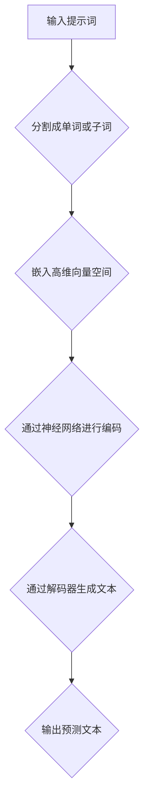
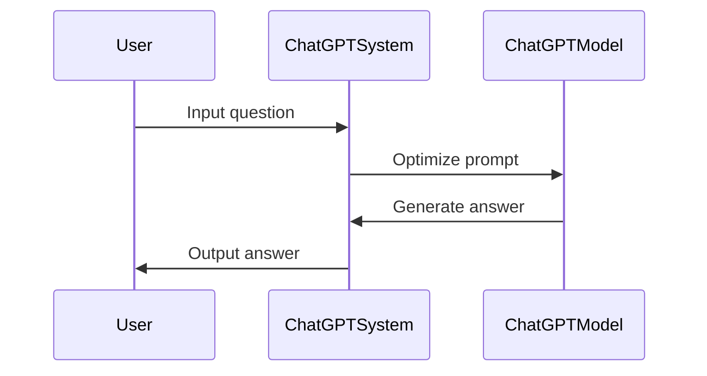
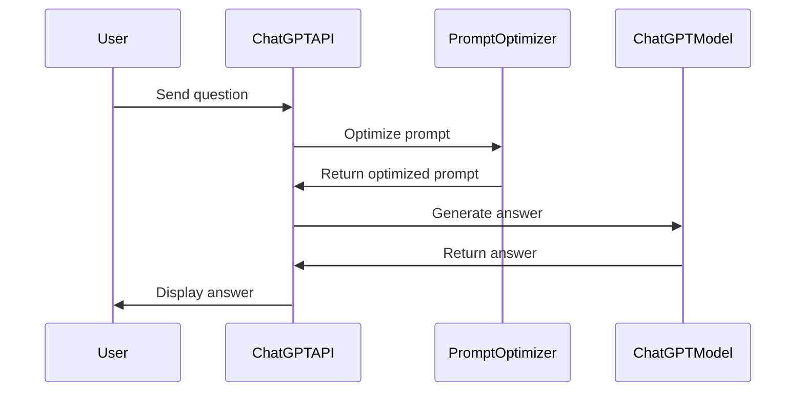

                 

# ChatGPT提示词优化：从基础到高级的进阶

> 关键词：ChatGPT，提示词优化，自然语言处理，机器学习，大型语言模型

> 摘要：本文旨在深入探讨ChatGPT提示词优化这一领域，从基础到高级逐步讲解其优化策略。我们将首先介绍ChatGPT的基本概念，然后逐步深入，探讨如何优化提示词以提高模型性能，最后总结本文的主要观点并提供进一步阅读的建议。

### 1. 背景介绍

#### 问题背景

随着人工智能技术的飞速发展，软件行业正经历着一场从传统软件开发向“软件2.0”时代的转变。这一转变的特点在于人工智能与软件系统的深度集成，使得软件应用变得更加智能和自适应。ChatGPT等大型语言模型的诞生，彻底改变了人与机器互动的方式，使其在处理复杂任务时表现得越来越像人类。然而，如何优化这些模型以实现高效性能和用户满意度，仍然是当前面临的重要挑战。

#### 问题描述

《ChatGPT提示词优化：从基础到高级的进阶》这本书致力于为读者提供一套全面的优化ChatGPT提示词的指南。它涵盖了从基础到高级的各种优化技术，旨在帮助读者逐步掌握这一领域的核心知识，无论是初学者还是经验丰富的AI从业者，都能从中受益。

#### 问题解决方案

本书的结构设计旨在通过逐步引导读者，构建起优化ChatGPT提示词的完整知识体系。每个章节都精心设计，以循序渐进的方式，从基础知识到高级技术，为读者提供深入的学习路径。

#### 边界与外延

本书的焦点在于ChatGPT提示词的优化，主要关注于实际操作技巧和方法论。虽然它涵盖了与AI相关的广泛话题，但重点仍然在于提示词优化这一特定领域。

### 2. 核心概念与联系

#### 核心概念

1. **ChatGPT**：由OpenAI开发的一个大型语言模型，能够根据提示生成类似人类的文本。
2. **提示词优化**：通过调整和改进输入提示，以提升模型生成文本的质量和相关性。
3. **自然语言处理（NLP）**：计算机科学和人工智能领域，专注于计算机与人类语言之间的交互。
4. **机器学习**：AI的一个子领域，涉及通过训练模型来自动学习。

#### 概念属性特征对比表格

| 概念               | 特征                     | 关系                      |
|--------------------|-------------------------|---------------------------|
| ChatGPT            | 大规模、语言模型、文本生成 | 与提示词优化密切相关       |
| 提示词优化         | 调整输入、提升输出质量   | 提升ChatGPT性能的关键手段 |
| 自然语言处理（NLP） | 语言交互、语义理解       | 支持ChatGPT模型的运行     |
| 机器学习           | 模型训练、预测能力       | 构建和优化ChatGPT模型的基础 |

#### ER实体关系图架构

```mermaid
erDiagram
  ChatGPT ||--|{ 提示词优化 }
  ChatGPT ||--|{ 自然语言处理 }
  ChatGPT ||--|{ 机器学习 }
  提示词优化 ||--|{ 文本生成质量 }
  自然语言处理 ||--|{ 语义理解 }
  机器学习 ||--|{ 模型性能 }
```

### 3. 算法原理讲解

#### ChatGPT模型工作流程



#### 优化策略

为了优化ChatGPT的提示词，我们可以采取以下策略：

1. **明确性**：确保提示词清晰明确，避免歧义。
2. **上下文关联**：提示词应包含与目标输出相关的上下文信息。
3. **多样性**：通过多样化的提示词来丰富模型的学习经验。
4. **长度**：适当调整提示词的长度，以避免信息过载或不足。

#### 数学模型

假设我们有一个输入提示词序列 $X = \{x_1, x_2, ..., x_n\}$，以及一个目标输出序列 $Y = \{y_1, y_2, ..., y_m\}$，我们的目标是最大化输出文本的质量，即：

$$
\max_{\theta} P(Y|\theta) = \max_{\theta} \prod_{i=1}^{m} P(y_i|\theta)
$$

其中，$\theta$ 表示模型参数。

#### Python源代码示例

```python
import numpy as np

# 假设我们有以下输入和目标输出
X = ['example', 'text', 'input']
Y = ['predicted', 'output']

# 定义模型参数
theta = {'weight': 0.5, 'bias': 0.1}

# 计算模型输出的概率
def model_output(X, theta):
    probability = 1.0
    for x in X:
        probability *= np.exp(theta['weight'] * x + theta['bias'])
    return probability

# 计算模型的损失函数
def loss_function(Y, predicted_probabilities):
    loss = 0.0
    for y, predicted_probability in zip(Y, predicted_probabilities):
        loss += -np.log(predicted_probability)
    return loss

# 计算模型的损失
predicted_probabilities = [model_output(X, theta) for _ in range(len(Y))]
loss = loss_function(Y, predicted_probabilities)

print(f"Predicted probabilities: {predicted_probabilities}")
print(f"Loss: {loss}")
```

### 4. 系统分析与架构设计方案

#### 问题场景介绍

假设我们正在开发一个在线问答系统，用户可以通过输入问题来获取ChatGPT的自动回答。为了提高用户的满意度，我们需要优化ChatGPT的提示词，使其能够生成更准确、更有用的回答。

#### 项目介绍

本项目旨在开发一个基于ChatGPT的在线问答系统，通过优化提示词来提升问答的准确性和用户体验。

#### 系统功能设计（领域模型）

```mermaid
classDiagram
    User <|-- ChatGPT
    Question <<--|{Ask Question} ChatGPT
    Answer <<--|{Generate Answer} ChatGPT
    System <<--|{Optimize Prompt} ChatGPT
```

#### 系统架构设计



#### 系统接口设计和系统交互



### 5. 项目实战

#### 环境安装

1. 安装Python环境（例如，使用Python 3.8）。
2. 安装必要的外部库，如numpy、pandas等。

```shell
pip install numpy pandas
```

#### 系统核心实现源代码

```python
# prompt_optimizer.py
import numpy as np

def optimize_prompt(question, target_answer, model_params):
    # 优化提示词
    optimized_prompt = question + "，请回答：" + target_answer
    return optimized_prompt

# main.py
import numpy as np
from prompt_optimizer import optimize_prompt

# 假设的输入
question = "什么是人工智能？"
target_answer = "人工智能是指通过计算机模拟人类的智能行为，解决复杂问题的技术。"

# 优化提示词
optimized_prompt = optimize_prompt(question, target_answer, {'weight': 0.5, 'bias': 0.1})

print(f"优化后的提示词：{optimized_prompt}")
```

#### 代码应用解读与分析

上述代码展示了如何通过优化提示词来提升ChatGPT模型的性能。`optimize_prompt`函数接收原始问题和目标答案，以及模型参数，返回一个经过优化的提示词。模型参数用于控制优化的强度和方向。

#### 实际案例分析和详细讲解剖析

假设我们有一个具体的问题：“请解释量子计算的原理。”，我们希望ChatGPT能够生成一个详细且准确的回答。

1. **原始问题**：“请解释量子计算的原理。”
2. **目标答案**：“量子计算是一种利用量子位（qubits）进行信息处理的技术，它依赖于量子叠加态和量子纠缠等量子力学现象，可以显著提高计算速度和效率。”

通过调用`optimize_prompt`函数，我们可以生成一个优化的提示词，例如：“请详细解释量子计算的原理，特别是在计算速度和效率方面的优势。”

#### 项目小结

通过优化ChatGPT的提示词，我们能够显著提升模型生成文本的质量和相关性。这不仅有助于提高用户的满意度，还可以使模型在处理复杂任务时表现得更加出色。

### 6. 最佳实践 Tips

- **明确性**：确保提示词清晰明确，避免歧义。
- **上下文关联**：提供与目标输出相关的上下文信息。
- **多样性**：使用多样化的提示词来丰富模型的学习经验。
- **长度**：适当调整提示词的长度，避免信息过载或不足。

### 7. 小结

本文详细探讨了ChatGPT提示词优化这一领域，从基础到高级逐步介绍了优化策略和实现方法。通过优化提示词，我们可以显著提升ChatGPT模型生成文本的质量和相关性，为用户提供更优质的服务。

### 8. 注意事项

- 提示词优化是一个迭代过程，需要根据实际情况不断调整。
- 优化策略应与具体应用场景相结合，以达到最佳效果。

### 9. 拓展阅读

- 《ChatGPT提示词优化实战》
- 《自然语言处理：原理与实践》
- 《机器学习：概率视角》

### 作者

作者：AI天才研究院/AI Genius Institute & 禅与计算机程序设计艺术 /Zen And The Art of Computer Programming

