                 

# 《ChatGPT提示词优化：从基础到高级的进阶指南》

## 关键词：ChatGPT，提示词优化，人工智能，自然语言处理，进阶指南

## 摘要：

随着人工智能技术的不断发展，自然语言处理（NLP）在各个领域得到了广泛应用。ChatGPT作为OpenAI推出的一个大型语言模型，其在问答、文本生成、语言翻译等方面的表现令人瞩目。然而，ChatGPT的性能在很大程度上受到提示词（Prompt）的影响。本文将详细介绍ChatGPT与提示词优化的基本概念、方法及策略，从基础到高级，为读者提供一条清晰的进阶学习路径。

## 第一部分: ChatGPT与提示词优化概述

### 第1章: ChatGPT与提示词优化简介

#### 1.1 ChatGPT的崛起

ChatGPT是由OpenAI开发的基于GPT-3模型的一个人工智能聊天机器人。GPT-3是一个具有1750亿个参数的预训练语言模型，它在各种NLP任务中表现出色。ChatGPT的核心技术包括深度学习和自然语言处理，其在问答、文本生成、语言翻译等方面都有广泛的应用。

##### 1.1.1 ChatGPT的核心技术

ChatGPT的核心技术是基于GPT-3模型，其采用了深度学习的方法，通过大量的文本数据预训练，使其能够理解和生成人类语言。GPT-3模型的主要特点是其参数数量巨大，这使得它在理解和生成语言方面具有很高的准确性。

##### 1.1.2 ChatGPT的应用领域

ChatGPT的应用领域非常广泛，包括但不限于：问答系统、文本生成、语言翻译、客服机器人、自然语言理解等。

##### 1.1.3 ChatGPT的优势与局限

ChatGPT的优势在于其强大的语言理解和生成能力，能够处理各种复杂的语言任务。然而，ChatGPT也存在一定的局限，例如对上下文理解的不足、生成内容的可信度问题等。

#### 1.2 提示词优化的重要性

提示词（Prompt）是用户输入给ChatGPT的信息，用于引导模型生成合适的响应。提示词的优化对于提高ChatGPT的性能至关重要。

##### 1.2.1 提示词优化的目的

提示词优化的目的是提高ChatGPT对用户输入的理解能力，使其能够生成更准确、更有用的响应。

##### 1.2.2 提示词优化的方法

提示词优化的方法包括：选择合适的提示词、编写高质量的提示词、使用上下文信息等。

##### 1.2.3 提示词优化的实际效果

通过优化提示词，可以显著提高ChatGPT的响应质量和效率，使其在处理各种语言任务时表现更加出色。

#### 1.3 从基础到高级的进阶指南

##### 1.3.1 初学者如何入门

对于初学者，建议从了解ChatGPT的基本概念和原理开始，逐步学习提示词优化的方法。

##### 1.3.2 提示词优化的高级技巧

随着学习的深入，可以学习更高级的提示词优化技巧，如多轮对话优化、长文本提示词优化等。

##### 1.3.3 进阶学习路径规划

对于有一定基础的读者，可以通过参与实际项目、阅读相关文献来进一步提升自己的技能。

#### 1.4 本书结构安排

##### 1.4.1 各章节主要内容概述

本书共分为五部分，分别介绍ChatGPT的基础、高级技巧、在特定领域的应用以及优化策略。

##### 1.4.2 实践项目与案例分析

每个章节都包含了实践项目与案例分析，帮助读者更好地理解知识点。

##### 1.4.3 学习目标与预期收获

通过本书的学习，读者可以系统地掌握ChatGPT与提示词优化的知识和技能。

#### 1.5 本章小结

本章介绍了ChatGPT与提示词优化的基本概念、重要性以及学习路径，为后续内容的学习打下了基础。

## 第二部分: ChatGPT基础与提示词优化方法

### 第2章: ChatGPT基本原理与功能

#### 2.1 ChatGPT的工作原理

##### 2.1.1 训练数据

ChatGPT的训练数据来自于大量互联网文本，包括网页、书籍、新闻、社交媒体等。

##### 2.1.2 模型架构

ChatGPT基于GPT-3模型，其架构由多个 Transformer 层组成，每层都包含大量的自注意力机制。

##### 2.1.3 语言模型训练流程

ChatGPT的训练流程包括：数据预处理、模型训练、模型优化等步骤。

#### 2.2 ChatGPT的核心功能

##### 2.2.1 问答功能

ChatGPT的问答功能能够根据用户输入的问题生成合适的回答。

##### 2.2.2 文本生成功能

ChatGPT能够根据用户输入的提示生成完整的文本，如文章、故事等。

##### 2.2.3 语言翻译功能

ChatGPT能够实现多种语言之间的翻译。

#### 2.3 提示词优化的基础方法

##### 2.3.1 提示词的选择策略

选择合适的提示词能够提高ChatGPT的生成质量和效率。

##### 2.3.2 提示词的编写技巧

编写高质量的提示词需要注意措辞、语法、上下文等方面。

##### 2.3.3 提示词优化的案例解析

通过案例解析，可以更好地理解提示词优化的方法。

#### 2.4 ChatGPT基础操作与实战

##### 2.4.1 ChatGPT的使用环境搭建

搭建ChatGPT的使用环境需要安装Python和相关依赖。

##### 2.4.2 ChatGPT的接口调用

通过调用ChatGPT的API接口，可以实现与模型的交互。

##### 2.4.3 ChatGPT基础应用案例分析

通过实际案例，可以更好地理解ChatGPT的基础应用。

#### 2.5 本章小结

本章介绍了ChatGPT的基本原理、核心功能以及提示词优化的基础方法，为后续内容的学习打下了基础。

## 第三部分: ChatGPT高级技巧与优化策略

### 第3章: ChatGPT高级技巧详解

#### 3.1 高级提示词编写策略

##### 3.1.1 长文本提示词的优化

对于长文本提示词，需要关注信息提取和结构化。

##### 3.1.2 多轮对话的优化

多轮对话的优化需要考虑上下文连贯性和回答准确性。

##### 3.1.3 个性化提示词的构建

个性化提示词可以提升ChatGPT的生成质量和用户体验。

#### 3.2 高级应用场景

##### 3.2.1 代码生成与解释

ChatGPT在代码生成和解释方面有广泛的应用。

##### 3.2.2 自然语言处理任务优化

ChatGPT在自然语言处理任务中具有优化潜力。

##### 3.2.3 人工智能助手开发

ChatGPT可以作为人工智能助手的基石。

#### 3.3 ChatGPT训练数据优化

##### 3.3.1 数据预处理方法

数据预处理是提升模型性能的关键步骤。

##### 3.3.2 数据增强技术

数据增强可以提高模型的泛化能力。

##### 3.3.3 数据质量控制

数据质量控制是保证模型准确性的基础。

#### 3.4 高级实战案例

##### 3.4.1 实时问答系统搭建

实时问答系统的搭建需要考虑响应速度和准确性。

##### 3.4.2 聊天机器人开发

聊天机器人的开发需要关注用户体验和交互设计。

##### 3.4.3 实际应用案例分析

通过实际案例分析，可以更好地理解高级技巧的应用。

#### 3.5 本章小结

本章介绍了ChatGPT的高级技巧和优化策略，为读者提供了更深入的实战指导。

## 第四部分: ChatGPT在特定领域的应用与优化

### 第4章: 教育领域

#### 4.1 ChatGPT在教育领域的应用

##### 4.1.1 学生自主学习辅助

ChatGPT可以辅助学生进行自主学习。

##### 4.1.2 教师教学辅助

ChatGPT可以为教师提供教学辅助。

##### 4.1.3 教育资源智能化

ChatGPT可以智能化教育资源。

#### 4.2 教育领域ChatGPT提示词优化方法

##### 4.2.1 教学问答系统优化

优化教学问答系统可以提高教学效果。

##### 4.2.2 教学互动对话优化

优化教学互动对话可以提升教学体验。

##### 4.2.3 教育资源个性化推荐

教育资源个性化推荐可以满足学生个性化学习需求。

#### 4.3 教育领域应用实战

##### 4.3.1 学生自主学习平台搭建

学生自主学习平台搭建需要考虑用户体验和学习效果。

##### 4.3.2 教师教学辅助系统开发

教师教学辅助系统开发需要关注教学互动和资源管理。

##### 4.3.3 教育资源推荐系统案例分析

教育资源推荐系统案例分析可以帮助读者更好地理解教育领域应用。

#### 4.4 本章小结

本章介绍了ChatGPT在教育领域的应用和优化方法，为教育行业提供了新的解决方案。

## 第五部分: ChatGPT在商业领域的应用与优化

### 第5章: 客户服务与营销

#### 5.1 ChatGPT在客户服务中的应用

##### 5.1.1 客服机器人开发

客服机器人开发可以提升客户服务效率。

##### 5.1.2 客户需求分析优化

客户需求分析优化可以提升客户满意度。

##### 5.1.3 客户满意度提升

客户满意度提升是商业成功的基石。

#### 5.2 ChatGPT在营销中的应用

##### 5.2.1 营销文案生成与优化

营销文案生成与优化可以提升营销效果。

##### 5.2.2 营销策略优化

营销策略优化可以提升营销ROI。

##### 5.2.3 营销活动策划

营销活动策划需要考虑用户体验和参与度。

#### 5.3 商业领域应用实战

##### 5.3.1 客服机器人开发实战

客服机器人开发实战需要关注交互设计和技术实现。

##### 5.3.2 营销文案优化实战

营销文案优化实战需要关注文案策略和数据分析。

##### 5.3.3 营销活动策划案例分析

营销活动策划案例分析可以帮助读者更好地理解商业领域应用。

#### 5.4 本章小结

本章介绍了ChatGPT在商业领域的应用和优化方法，为商业运营提供了新的思路。

## 总结与展望

本文系统地介绍了ChatGPT与提示词优化的知识，从基础到高级，为读者提供了全面的指导。通过本文的学习，读者可以掌握ChatGPT的基本原理、核心功能、优化方法以及在特定领域的应用。随着人工智能技术的不断进步，ChatGPT在未来的发展前景非常广阔，它将在各个领域发挥越来越重要的作用。希望本文能够为读者在ChatGPT与提示词优化领域的研究提供帮助。

### 作者：

AI天才研究院/AI Genius Institute & 禅与计算机程序设计艺术 /Zen And The Art of Computer Programming### 第一部分: ChatGPT与提示词优化概述

#### 第1章: ChatGPT与提示词优化简介

ChatGPT，全名Chat-based Generative Pre-trained Transformer，是由OpenAI推出的一个基于GPT-3（Generative Pre-trained Transformer 3）模型的聊天机器人。其强大的自然语言处理能力，使得ChatGPT在众多领域如问答系统、文本生成、语言翻译等得到了广泛应用。然而，ChatGPT的性能不仅仅取决于其模型本身，还与提示词的优化有着密切的关系。提示词，即输入到模型中的引导信息，对于ChatGPT生成合理的响应具有至关重要的作用。

##### 1.1 ChatGPT的崛起

ChatGPT的崛起并非一蹴而就，它背后是人工智能技术的长足进步和OpenAI团队的不懈努力。ChatGPT的核心技术是GPT-3模型，这是一个具有1750亿个参数的预训练语言模型，通过深度学习和自然语言处理技术，使其能够理解和生成人类语言。

###### 1.1.1 ChatGPT的核心技术

ChatGPT的核心技术主要包括以下几个方面：

1. **深度学习**：深度学习是一种通过多层神经网络模型进行数据分析和决策的方法，它在图像识别、语音识别等领域取得了显著的成果。ChatGPT采用了深度学习的方法，通过多层神经网络对大量文本数据进行训练，从而提高了其对语言的理解能力。

2. **自然语言处理（NLP）**：自然语言处理是人工智能的一个重要分支，它涉及到如何让计算机理解和生成人类语言。ChatGPT通过NLP技术，能够理解和处理自然语言输入，并生成符合语义和逻辑的响应。

3. **预训练模型**：预训练模型是一种在大量数据上进行训练，然后针对特定任务进行微调的模型。ChatGPT采用了预训练模型的方法，首先在互联网上的大量文本数据上进行预训练，然后针对具体的应用场景进行微调。

###### 1.1.2 ChatGPT的应用领域

ChatGPT的应用领域非常广泛，主要包括以下几个方面：

1. **问答系统**：ChatGPT能够根据用户的问题生成合适的回答，广泛应用于客服系统、智能助手等领域。

2. **文本生成**：ChatGPT能够根据用户提供的提示生成文章、故事、代码等文本内容。

3. **语言翻译**：ChatGPT能够实现多种语言之间的翻译，为跨语言交流提供了便利。

4. **自然语言理解**：ChatGPT能够理解和分析自然语言，为文本分类、情感分析等任务提供支持。

5. **对话系统**：ChatGPT可以作为对话系统的重要组成部分，与用户进行自然、流畅的对话。

###### 1.1.3 ChatGPT的优势与局限

ChatGPT的优势在于其强大的语言理解和生成能力，能够处理各种复杂的语言任务。然而，ChatGPT也存在一定的局限，例如：

1. **上下文理解不足**：ChatGPT在处理长文本时，可能会出现上下文理解不足的问题，导致生成的响应不够准确。

2. **生成内容可信度**：由于ChatGPT是基于预训练模型，其生成的响应可能存在一定的偏差，需要进一步验证其准确性。

3. **计算资源需求大**：ChatGPT的模型参数量巨大，需要大量的计算资源进行训练和推理，对硬件设备要求较高。

##### 1.2 提示词优化的重要性

提示词（Prompt）是用户输入给ChatGPT的信息，用于引导模型生成合适的响应。一个高质量的提示词，可以大大提高ChatGPT的性能和效率。

###### 1.2.1 提示词优化的目的

提示词优化的主要目的是提高ChatGPT对用户输入的理解能力，使其能够生成更准确、更有用的响应。具体来说，包括以下几个方面：

1. **提高响应准确性**：通过优化提示词，可以确保ChatGPT生成的响应与用户意图高度一致，减少误导和错误回答。

2. **提升用户体验**：高质量的提示词能够引导ChatGPT生成更加自然、流畅的对话，提高用户满意度。

3. **提高生成效率**：优化提示词可以减少ChatGPT的处理时间，提高生成效率，从而满足实时交互的需求。

###### 1.2.2 提示词优化的方法

提示词优化的方法主要包括以下几个方面：

1. **选择合适的提示词**：选择具有明确意图和上下文的提示词，可以帮助ChatGPT更准确地理解用户需求。

2. **编写高质量的提示词**：高质量提示词应具有简洁、明确、结构化的特点，能够引导ChatGPT生成高质量的响应。

3. **使用上下文信息**：充分利用上下文信息，可以帮助ChatGPT更好地理解用户意图，生成更符合预期的响应。

4. **多轮对话优化**：通过多轮对话，不断优化提示词和模型响应，可以提高整体对话质量和用户满意度。

###### 1.2.3 提示词优化的实际效果

提示词优化的实际效果可以从以下几个方面进行衡量：

1. **响应准确性**：通过优化提示词，可以显著提高ChatGPT的响应准确性，减少错误回答和误导。

2. **用户满意度**：高质量的提示词能够提升用户满意度，增强用户体验。

3. **生成效率**：优化提示词可以提高ChatGPT的生成效率，满足实时交互需求。

##### 1.3 从基础到高级的进阶指南

ChatGPT与提示词优化是一个涉及多方面知识的复杂领域，从基础到高级的学习路径对于初学者和进阶者都非常重要。

###### 1.3.1 初学者如何入门

对于初学者，以下是一些建议：

1. **了解基础概念**：首先，了解ChatGPT和提示词优化的基本概念，包括GPT-3模型、深度学习、自然语言处理等。

2. **学习编程基础**：掌握基本的编程技能，如Python，对于理解ChatGPT和提示词优化至关重要。

3. **实践操作**：通过实际操作，如使用OpenAI提供的API接口，体验ChatGPT的功能。

4. **阅读教程和文档**：阅读官方文档和其他教程，了解ChatGPT和提示词优化的基本方法。

5. **参与社区讨论**：加入相关技术社区，如GitHub、Stack Overflow等，与其他开发者交流经验和问题。

###### 1.3.2 提示词优化的高级技巧

随着学习的深入，可以学习更高级的技巧：

1. **长文本提示词优化**：学习如何处理长文本输入，提高ChatGPT的上下文理解能力。

2. **多轮对话优化**：研究如何通过多轮对话，不断提升提示词和模型响应的质量。

3. **个性化提示词构建**：探索如何根据用户特征和需求，构建个性化的提示词。

4. **实验与验证**：通过实验和验证，不断优化提示词和模型参数，提高生成质量和效率。

###### 1.3.3 进阶学习路径规划

对于有一定基础的读者，以下是一些建议：

1. **深入阅读文献**：阅读相关的学术论文和技术文档，了解最新的研究成果和发展趋势。

2. **参与实际项目**：参与实际项目，如开发聊天机器人、问答系统等，将理论知识应用于实践中。

3. **研究前沿技术**：关注ChatGPT和提示词优化的前沿技术，如多模态交互、生成对抗网络（GAN）等。

4. **建立个人知识体系**：通过整理和总结，建立自己的知识体系，系统化地学习相关知识。

##### 1.4 本书结构安排

本书共分为五个部分，旨在为读者提供从基础到高级的全面指导。

###### 1.4.1 各章节主要内容概述

1. **第一部分：ChatGPT与提示词优化概述**：介绍ChatGPT和提示词优化的基本概念、重要性以及学习路径。

2. **第二部分：ChatGPT基础与提示词优化方法**：详细讲解ChatGPT的工作原理、核心功能、提示词优化的基础方法，以及实际操作与案例分析。

3. **第三部分：ChatGPT高级技巧与优化策略**：介绍高级提示词编写策略、高级应用场景、训练数据优化策略，以及高级实战案例。

4. **第四部分：ChatGPT在特定领域的应用与优化**：探讨ChatGPT在教育、商业等领域的应用和优化方法。

5. **第五部分：ChatGPT在商业领域的应用与优化**：详细介绍ChatGPT在客户服务、营销等领域的应用和优化策略。

###### 1.4.2 实践项目与案例分析

本书各章节都包含了实践项目与案例分析，旨在帮助读者将理论知识应用于实际场景，提高实际操作能力。

###### 1.4.3 学习目标与预期收获

通过本书的学习，读者可以：

1. **系统掌握ChatGPT和提示词优化的基础知识**。

2. **学会编写高质量提示词的方法**。

3. **理解ChatGPT的高级技巧和应用场景**。

4. **具备在特定领域应用ChatGPT的能力**。

5. **提升自然语言处理和人工智能应用的水平**。

##### 1.5 本章小结

本章介绍了ChatGPT和提示词优化的基本概念、重要性以及学习路径。通过本章的学习，读者可以对ChatGPT和提示词优化有一个初步的了解，为后续内容的学习打下基础。

### 第一部分: ChatGPT与提示词优化概述

#### 第1章: ChatGPT与提示词优化简介

随着人工智能技术的不断发展，自然语言处理（NLP）已经成为人工智能领域的一个重要分支。ChatGPT作为OpenAI推出的一个大型语言模型，其在自然语言处理任务中表现出了卓越的性能。然而，ChatGPT的性能不仅取决于其模型本身的强大，还与提示词的优化密切相关。提示词作为用户输入给模型的信息，对模型的响应有着重要的影响。因此，了解和掌握ChatGPT与提示词优化的基本概念、方法和策略，对于提升ChatGPT的性能和实用性具有重要意义。

#### 1.1 ChatGPT的崛起

ChatGPT是由OpenAI开发的一款基于GPT-3（Generative Pre-trained Transformer 3）模型的人工智能聊天机器人。GPT-3是一个具有1750亿个参数的预训练语言模型，它在各种自然语言处理任务中表现出了出色的性能。ChatGPT通过将GPT-3模型应用于聊天场景，实现了对用户输入的自动理解和响应。ChatGPT的崛起标志着人工智能在自然语言处理领域的一个重要突破。

##### 1.1.1 ChatGPT的核心技术

ChatGPT的核心技术基于GPT-3模型，该模型采用Transformer架构，这是一种在深度学习领域中广泛应用的神经网络模型。GPT-3模型通过大规模的预训练和数据增强技术，实现了对自然语言的深入理解和生成能力。

1. **深度学习**：深度学习是一种通过多层神经网络进行数据分析和决策的方法，它在图像识别、语音识别等领域取得了显著的成果。ChatGPT采用了深度学习的方法，通过多层神经网络对大量文本数据进行训练，从而提高了其对语言的理解能力。

2. **自然语言处理（NLP）**：自然语言处理是人工智能的一个重要分支，它涉及到如何让计算机理解和生成人类语言。ChatGPT通过NLP技术，能够理解和处理自然语言输入，并生成符合语义和逻辑的响应。

3. **预训练模型**：预训练模型是一种在大量数据上进行训练，然后针对特定任务进行微调的模型。ChatGPT采用了预训练模型的方法，首先在互联网上的大量文本数据上进行预训练，然后针对具体的应用场景进行微调。

##### 1.1.2 ChatGPT的应用领域

ChatGPT的应用领域非常广泛，主要包括以下几个方面：

1. **问答系统**：ChatGPT能够根据用户的问题生成合适的回答，广泛应用于客服系统、智能助手等领域。

2. **文本生成**：ChatGPT能够根据用户提供的提示生成文章、故事、代码等文本内容。

3. **语言翻译**：ChatGPT能够实现多种语言之间的翻译，为跨语言交流提供了便利。

4. **自然语言理解**：ChatGPT能够理解和分析自然语言，为文本分类、情感分析等任务提供支持。

5. **对话系统**：ChatGPT可以作为对话系统的重要组成部分，与用户进行自然、流畅的对话。

##### 1.1.3 ChatGPT的优势与局限

ChatGPT的优势在于其强大的语言理解和生成能力，能够处理各种复杂的语言任务。然而，ChatGPT也存在一定的局限，例如：

1. **上下文理解不足**：ChatGPT在处理长文本时，可能会出现上下文理解不足的问题，导致生成的响应不够准确。

2. **生成内容可信度**：由于ChatGPT是基于预训练模型，其生成的响应可能存在一定的偏差，需要进一步验证其准确性。

3. **计算资源需求大**：ChatGPT的模型参数量巨大，需要大量的计算资源进行训练和推理，对硬件设备要求较高。

#### 1.2 提示词优化的重要性

提示词（Prompt）是用户输入给ChatGPT的信息，用于引导模型生成合适的响应。一个高质量的提示词，可以大大提高ChatGPT的性能和效率。

##### 1.2.1 提示词优化的目的

提示词优化的主要目的是提高ChatGPT对用户输入的理解能力，使其能够生成更准确、更有用的响应。具体来说，包括以下几个方面：

1. **提高响应准确性**：通过优化提示词，可以确保ChatGPT生成的响应与用户意图高度一致，减少误导和错误回答。

2. **提升用户体验**：高质量的提示词能够引导ChatGPT生成更加自然、流畅的对话，提高用户满意度。

3. **提高生成效率**：优化提示词可以减少ChatGPT的处理时间，提高生成效率，从而满足实时交互的需求。

##### 1.2.2 提示词优化的方法

提示词优化的方法主要包括以下几个方面：

1. **选择合适的提示词**：选择具有明确意图和上下文的提示词，可以帮助ChatGPT更准确地理解用户需求。

2. **编写高质量的提示词**：高质量提示词应具有简洁、明确、结构化的特点，能够引导ChatGPT生成高质量的响应。

3. **使用上下文信息**：充分利用上下文信息，可以帮助ChatGPT更好地理解用户意图，生成更符合预期的响应。

4. **多轮对话优化**：通过多轮对话，不断优化提示词和模型响应，可以提高整体对话质量和用户满意度。

##### 1.2.3 提示词优化的实际效果

提示词优化的实际效果可以从以下几个方面进行衡量：

1. **响应准确性**：通过优化提示词，可以显著提高ChatGPT的响应准确性，减少错误回答和误导。

2. **用户满意度**：高质量的提示词能够提升用户满意度，增强用户体验。

3. **生成效率**：优化提示词可以提高ChatGPT的生成效率，满足实时交互需求。

#### 1.3 从基础到高级的进阶指南

ChatGPT与提示词优化是一个涉及多方面知识的复杂领域，从基础到高级的学习路径对于初学者和进阶者都非常重要。

##### 1.3.1 初学者如何入门

对于初学者，以下是一些建议：

1. **了解基础概念**：首先，了解ChatGPT和提示词优化的基本概念，包括GPT-3模型、深度学习、自然语言处理等。

2. **学习编程基础**：掌握基本的编程技能，如Python，对于理解ChatGPT和提示词优化至关重要。

3. **实践操作**：通过实际操作，如使用OpenAI提供的API接口，体验ChatGPT的功能。

4. **阅读教程和文档**：阅读官方文档和其他教程，了解ChatGPT和提示词优化的基本方法。

5. **参与社区讨论**：加入相关技术社区，如GitHub、Stack Overflow等，与其他开发者交流经验和问题。

##### 1.3.2 提示词优化的高级技巧

随着学习的深入，可以学习更高级的技巧：

1. **长文本提示词优化**：学习如何处理长文本输入，提高ChatGPT的上下文理解能力。

2. **多轮对话优化**：研究如何通过多轮对话，不断提升提示词和模型响应的质量。

3. **个性化提示词构建**：探索如何根据用户特征和需求，构建个性化的提示词。

4. **实验与验证**：通过实验和验证，不断优化提示词和模型参数，提高生成质量和效率。

##### 1.3.3 进阶学习路径规划

对于有一定基础的读者，以下是一些建议：

1. **深入阅读文献**：阅读相关的学术论文和技术文档，了解最新的研究成果和发展趋势。

2. **参与实际项目**：参与实际项目，如开发聊天机器人、问答系统等，将理论知识应用于实践中。

3. **研究前沿技术**：关注ChatGPT和提示词优化的前沿技术，如多模态交互、生成对抗网络（GAN）等。

4. **建立个人知识体系**：通过整理和总结，建立自己的知识体系，系统化地学习相关知识。

#### 1.4 本书结构安排

本书共分为五个部分，旨在为读者提供从基础到高级的全面指导。

##### 1.4.1 各章节主要内容概述

1. **第一部分：ChatGPT与提示词优化概述**：介绍ChatGPT和提示词优化的基本概念、重要性以及学习路径。

2. **第二部分：ChatGPT基础与提示词优化方法**：详细讲解ChatGPT的工作原理、核心功能、提示词优化的基础方法，以及实际操作与案例分析。

3. **第三部分：ChatGPT高级技巧与优化策略**：介绍高级提示词编写策略、高级应用场景、训练数据优化策略，以及高级实战案例。

4. **第四部分：ChatGPT在特定领域的应用与优化**：探讨ChatGPT在教育、商业等领域的应用和优化方法。

5. **第五部分：ChatGPT在商业领域的应用与优化**：详细介绍ChatGPT在客户服务、营销等领域的应用和优化策略。

##### 1.4.2 实践项目与案例分析

本书各章节都包含了实践项目与案例分析，旨在帮助读者将理论知识应用于实际场景，提高实际操作能力。

##### 1.4.3 学习目标与预期收获

通过本书的学习，读者可以：

1. **系统掌握ChatGPT和提示词优化的基础知识**。

2. **学会编写高质量提示词的方法**。

3. **理解ChatGPT的高级技巧和应用场景**。

4. **具备在特定领域应用ChatGPT的能力**。

5. **提升自然语言处理和人工智能应用的水平**。

#### 1.5 本章小结

本章介绍了ChatGPT和提示词优化的基本概念、重要性以及学习路径。通过本章的学习，读者可以对ChatGPT和提示词优化有一个初步的了解，为后续内容的学习打下基础。

### 第一部分: ChatGPT与提示词优化概述

#### 第1章: ChatGPT与提示词优化简介

ChatGPT作为OpenAI推出的一款基于GPT-3模型的人工智能聊天机器人，以其强大的自然语言处理能力在众多领域引起了广泛关注。然而，ChatGPT的表现不仅依赖于其模型的强大，还与提示词的优化密切相关。提示词是引导ChatGPT生成合适响应的关键，因此，理解和优化提示词对于提升ChatGPT的性能和实用性具有重要意义。

#### 1.1 ChatGPT的崛起

ChatGPT的崛起并非一夜之间，它背后是人工智能技术尤其是深度学习和自然语言处理领域的长足进步。GPT-3模型作为ChatGPT的核心技术，是一个拥有1750亿个参数的预训练语言模型。通过深度学习和自然语言处理技术，GPT-3能够理解和生成人类语言，这使得ChatGPT在问答系统、文本生成、语言翻译等任务中表现卓越。

##### 1.1.1 ChatGPT的核心技术

ChatGPT的核心技术主要包括以下几个方面：

1. **深度学习**：深度学习是一种通过多层神经网络进行数据分析和决策的方法。它在图像识别、语音识别等领域取得了显著的成果。ChatGPT采用了深度学习的方法，通过多层神经网络对大量文本数据进行训练，从而提高了其对语言的理解能力。

2. **自然语言处理（NLP）**：自然语言处理是人工智能的一个重要分支，它涉及到如何让计算机理解和生成人类语言。ChatGPT通过NLP技术，能够理解和处理自然语言输入，并生成符合语义和逻辑的响应。

3. **预训练模型**：预训练模型是一种在大量数据上进行训练，然后针对特定任务进行微调的模型。ChatGPT采用了预训练模型的方法，首先在互联网上的大量文本数据上进行预训练，然后针对具体的应用场景进行微调。

##### 1.1.2 ChatGPT的应用领域

ChatGPT的应用领域非常广泛，主要包括以下几个方面：

1. **问答系统**：ChatGPT能够根据用户的问题生成合适的回答，广泛应用于客服系统、智能助手等领域。

2. **文本生成**：ChatGPT能够根据用户提供的提示生成文章、故事、代码等文本内容。

3. **语言翻译**：ChatGPT能够实现多种语言之间的翻译，为跨语言交流提供了便利。

4. **自然语言理解**：ChatGPT能够理解和分析自然语言，为文本分类、情感分析等任务提供支持。

5. **对话系统**：ChatGPT可以作为对话系统的重要组成部分，与用户进行自然、流畅的对话。

##### 1.1.3 ChatGPT的优势与局限

ChatGPT的优势在于其强大的语言理解和生成能力，能够处理各种复杂的语言任务。然而，ChatGPT也存在一定的局限，例如：

1. **上下文理解不足**：ChatGPT在处理长文本时，可能会出现上下文理解不足的问题，导致生成的响应不够准确。

2. **生成内容可信度**：由于ChatGPT是基于预训练模型，其生成的响应可能存在一定的偏差，需要进一步验证其准确性。

3. **计算资源需求大**：ChatGPT的模型参数量巨大，需要大量的计算资源进行训练和推理，对硬件设备要求较高。

#### 1.2 提示词优化的重要性

提示词是用户输入给ChatGPT的信息，用于引导模型生成合适的响应。一个高质量的提示词，可以大大提高ChatGPT的性能和效率。

##### 1.2.1 提示词优化的目的

提示词优化的主要目的是提高ChatGPT对用户输入的理解能力，使其能够生成更准确、更有用的响应。具体来说，包括以下几个方面：

1. **提高响应准确性**：通过优化提示词，可以确保ChatGPT生成的响应与用户意图高度一致，减少误导和错误回答。

2. **提升用户体验**：高质量的提示词能够引导ChatGPT生成更加自然、流畅的对话，提高用户满意度。

3. **提高生成效率**：优化提示词可以减少ChatGPT的处理时间，提高生成效率，从而满足实时交互的需求。

##### 1.2.2 提示词优化的方法

提示词优化的方法主要包括以下几个方面：

1. **选择合适的提示词**：选择具有明确意图和上下文的提示词，可以帮助ChatGPT更准确地理解用户需求。

2. **编写高质量的提示词**：高质量提示词应具有简洁、明确、结构化的特点，能够引导ChatGPT生成高质量的响应。

3. **使用上下文信息**：充分利用上下文信息，可以帮助ChatGPT更好地理解用户意图，生成更符合预期的响应。

4. **多轮对话优化**：通过多轮对话，不断优化提示词和模型响应，可以提高整体对话质量和用户满意度。

##### 1.2.3 提示词优化的实际效果

提示词优化的实际效果可以从以下几个方面进行衡量：

1. **响应准确性**：通过优化提示词，可以显著提高ChatGPT的响应准确性，减少错误回答和误导。

2. **用户满意度**：高质量的提示词能够提升用户满意度，增强用户体验。

3. **生成效率**：优化提示词可以提高ChatGPT的生成效率，满足实时交互需求。

#### 1.3 从基础到高级的进阶指南

ChatGPT与提示词优化是一个涉及多方面知识的复杂领域，从基础到高级的学习路径对于初学者和进阶者都非常重要。

##### 1.3.1 初学者如何入门

对于初学者，以下是一些建议：

1. **了解基础概念**：首先，了解ChatGPT和提示词优化的基本概念，包括GPT-3模型、深度学习、自然语言处理等。

2. **学习编程基础**：掌握基本的编程技能，如Python，对于理解ChatGPT和提示词优化至关重要。

3. **实践操作**：通过实际操作，如使用OpenAI提供的API接口，体验ChatGPT的功能。

4. **阅读教程和文档**：阅读官方文档和其他教程，了解ChatGPT和提示词优化的基本方法。

5. **参与社区讨论**：加入相关技术社区，如GitHub、Stack Overflow等，与其他开发者交流经验和问题。

##### 1.3.2 提示词优化的高级技巧

随着学习的深入，可以学习更高级的技巧：

1. **长文本提示词优化**：学习如何处理长文本输入，提高ChatGPT的上下文理解能力。

2. **多轮对话优化**：研究如何通过多轮对话，不断提升提示词和模型响应的质量。

3. **个性化提示词构建**：探索如何根据用户特征和需求，构建个性化的提示词。

4. **实验与验证**：通过实验和验证，不断优化提示词和模型参数，提高生成质量和效率。

##### 1.3.3 进阶学习路径规划

对于有一定基础的读者，以下是一些建议：

1. **深入阅读文献**：阅读相关的学术论文和技术文档，了解最新的研究成果和发展趋势。

2. **参与实际项目**：参与实际项目，如开发聊天机器人、问答系统等，将理论知识应用于实践中。

3. **研究前沿技术**：关注ChatGPT和提示词优化的前沿技术，如多模态交互、生成对抗网络（GAN）等。

4. **建立个人知识体系**：通过整理和总结，建立自己的知识体系，系统化地学习相关知识。

#### 1.4 本书结构安排

本书共分为五个部分，旨在为读者提供从基础到高级的全面指导。

##### 1.4.1 各章节主要内容概述

1. **第一部分：ChatGPT与提示词优化概述**：介绍ChatGPT和提示词优化的基本概念、重要性以及学习路径。

2. **第二部分：ChatGPT基础与提示词优化方法**：详细讲解ChatGPT的工作原理、核心功能、提示词优化的基础方法，以及实际操作与案例分析。

3. **第三部分：ChatGPT高级技巧与优化策略**：介绍高级提示词编写策略、高级应用场景、训练数据优化策略，以及高级实战案例。

4. **第四部分：ChatGPT在特定领域的应用与优化**：探讨ChatGPT在教育、商业等领域的应用和优化方法。

5. **第五部分：ChatGPT在商业领域的应用与优化**：详细介绍ChatGPT在客户服务、营销等领域的应用和优化策略。

##### 1.4.2 实践项目与案例分析

本书各章节都包含了实践项目与案例分析，旨在帮助读者将理论知识应用于实际场景，提高实际操作能力。

##### 1.4.3 学习目标与预期收获

通过本书的学习，读者可以：

1. **系统掌握ChatGPT和提示词优化的基础知识**。

2. **学会编写高质量提示词的方法**。

3. **理解ChatGPT的高级技巧和应用场景**。

4. **具备在特定领域应用ChatGPT的能力**。

5. **提升自然语言处理和人工智能应用的水平**。

#### 1.5 本章小结

本章介绍了ChatGPT和提示词优化的基本概念、重要性以及学习路径。通过本章的学习，读者可以对ChatGPT和提示词优化有一个初步的了解，为后续内容的学习打下基础。

### 第一部分: ChatGPT与提示词优化概述

#### 第1章: ChatGPT与提示词优化简介

随着人工智能技术的快速发展，自然语言处理（NLP）成为人工智能领域的重要分支。ChatGPT，作为一个基于GPT-3模型的人工智能聊天机器人，凭借其强大的语言生成和理解能力，在众多应用场景中展现出了巨大的潜力。然而，ChatGPT的性能在很大程度上取决于提示词的质量。因此，理解和优化提示词对于充分发挥ChatGPT的潜力至关重要。

#### 1.1 ChatGPT的崛起

ChatGPT的崛起离不开深度学习和自然语言处理技术的进步。GPT-3模型，作为ChatGPT的核心技术，是一个拥有1750亿个参数的预训练语言模型。该模型通过深度学习和自然语言处理技术，实现了对自然语言的深入理解和生成能力。

##### 1.1.1 ChatGPT的核心技术

ChatGPT的核心技术主要包括以下几个方面：

1. **深度学习**：深度学习是一种通过多层神经网络进行数据分析和决策的方法。它在图像识别、语音识别等领域取得了显著的成果。ChatGPT采用了深度学习的方法，通过多层神经网络对大量文本数据进行训练，从而提高了其对语言的理解能力。

2. **自然语言处理（NLP）**：自然语言处理是人工智能的一个重要分支，它涉及到如何让计算机理解和生成人类语言。ChatGPT通过NLP技术，能够理解和处理自然语言输入，并生成符合语义和逻辑的响应。

3. **预训练模型**：预训练模型是一种在大量数据上进行训练，然后针对特定任务进行微调的模型。ChatGPT采用了预训练模型的方法，首先在互联网上的大量文本数据上进行预训练，然后针对具体的应用场景进行微调。

##### 1.1.2 ChatGPT的应用领域

ChatGPT的应用领域非常广泛，主要包括以下几个方面：

1. **问答系统**：ChatGPT能够根据用户的问题生成合适的回答，广泛应用于客服系统、智能助手等领域。

2. **文本生成**：ChatGPT能够根据用户提供的提示生成文章、故事、代码等文本内容。

3. **语言翻译**：ChatGPT能够实现多种语言之间的翻译，为跨语言交流提供了便利。

4. **自然语言理解**：ChatGPT能够理解和分析自然语言，为文本分类、情感分析等任务提供支持。

5. **对话系统**：ChatGPT可以作为对话系统的重要组成部分，与用户进行自然、流畅的对话。

##### 1.1.3 ChatGPT的优势与局限

ChatGPT的优势在于其强大的语言理解和生成能力，能够处理各种复杂的语言任务。然而，ChatGPT也存在一定的局限，例如：

1. **上下文理解不足**：ChatGPT在处理长文本时，可能会出现上下文理解不足的问题，导致生成的响应不够准确。

2. **生成内容可信度**：由于ChatGPT是基于预训练模型，其生成的响应可能存在一定的偏差，需要进一步验证其准确性。

3. **计算资源需求大**：ChatGPT的模型参数量巨大，需要大量的计算资源进行训练和推理，对硬件设备要求较高。

#### 1.2 提示词优化的重要性

提示词是用户输入给ChatGPT的信息，用于引导模型生成合适的响应。一个高质量的提示词，可以大大提高ChatGPT的性能和效率。

##### 1.2.1 提示词优化的目的

提示词优化的主要目的是提高ChatGPT对用户输入的理解能力，使其能够生成更准确、更有用的响应。具体来说，包括以下几个方面：

1. **提高响应准确性**：通过优化提示词，可以确保ChatGPT生成的响应与用户意图高度一致，减少误导和错误回答。

2. **提升用户体验**：高质量的提示词能够引导ChatGPT生成更加自然、流畅的对话，提高用户满意度。

3. **提高生成效率**：优化提示词可以减少ChatGPT的处理时间，提高生成效率，从而满足实时交互的需求。

##### 1.2.2 提示词优化的方法

提示词优化的方法主要包括以下几个方面：

1. **选择合适的提示词**：选择具有明确意图和上下文的提示词，可以帮助ChatGPT更准确地理解用户需求。

2. **编写高质量的提示词**：高质量提示词应具有简洁、明确、结构化的特点，能够引导ChatGPT生成高质量的响应。

3. **使用上下文信息**：充分利用上下文信息，可以帮助ChatGPT更好地理解用户意图，生成更符合预期的响应。

4. **多轮对话优化**：通过多轮对话，不断优化提示词和模型响应，可以提高整体对话质量和用户满意度。

##### 1.2.3 提示词优化的实际效果

提示词优化的实际效果可以从以下几个方面进行衡量：

1. **响应准确性**：通过优化提示词，可以显著提高ChatGPT的响应准确性，减少错误回答和误导。

2. **用户满意度**：高质量的提示词能够提升用户满意度，增强用户体验。

3. **生成效率**：优化提示词可以提高ChatGPT的生成效率，满足实时交互需求。

#### 1.3 从基础到高级的进阶指南

ChatGPT与提示词优化是一个涉及多方面知识的复杂领域，从基础到高级的学习路径对于初学者和进阶者都非常重要。

##### 1.3.1 初学者如何入门

对于初学者，以下是一些建议：

1. **了解基础概念**：首先，了解ChatGPT和提示词优化的基本概念，包括GPT-3模型、深度学习、自然语言处理等。

2. **学习编程基础**：掌握基本的编程技能，如Python，对于理解ChatGPT和提示词优化至关重要。

3. **实践操作**：通过实际操作，如使用OpenAI提供的API接口，体验ChatGPT的功能。

4. **阅读教程和文档**：阅读官方文档和其他教程，了解ChatGPT和提示词优化的基本方法。

5. **参与社区讨论**：加入相关技术社区，如GitHub、Stack Overflow等，与其他开发者交流经验和问题。

##### 1.3.2 提示词优化的高级技巧

随着学习的深入，可以学习更高级的技巧：

1. **长文本提示词优化**：学习如何处理长文本输入，提高ChatGPT的上下文理解能力。

2. **多轮对话优化**：研究如何通过多轮对话，不断提升提示词和模型响应的质量。

3. **个性化提示词构建**：探索如何根据用户特征和需求，构建个性化的提示词。

4. **实验与验证**：通过实验和验证，不断优化提示词和模型参数，提高生成质量和效率。

##### 1.3.3 进阶学习路径规划

对于有一定基础的读者，以下是一些建议：

1. **深入阅读文献**：阅读相关的学术论文和技术文档，了解最新的研究成果和发展趋势。

2. **参与实际项目**：参与实际项目，如开发聊天机器人、问答系统等，将理论知识应用于实践中。

3. **研究前沿技术**：关注ChatGPT和提示词优化的前沿技术，如多模态交互、生成对抗网络（GAN）等。

4. **建立个人知识体系**：通过整理和总结，建立自己的知识体系，系统化地学习相关知识。

#### 1.4 本书结构安排

本书共分为五个部分，旨在为读者提供从基础到高级的全面指导。

##### 1.4.1 各章节主要内容概述

1. **第一部分：ChatGPT与提示词优化概述**：介绍ChatGPT和提示词优化的基本概念、重要性以及学习路径。

2. **第二部分：ChatGPT基础与提示词优化方法**：详细讲解ChatGPT的工作原理、核心功能、提示词优化的基础方法，以及实际操作与案例分析。

3. **第三部分：ChatGPT高级技巧与优化策略**：介绍高级提示词编写策略、高级应用场景、训练数据优化策略，以及高级实战案例。

4. **第四部分：ChatGPT在特定领域的应用与优化**：探讨ChatGPT在教育、商业等领域的应用和优化方法。

5. **第五部分：ChatGPT在商业领域的应用与优化**：详细介绍ChatGPT在客户服务、营销等领域的应用和优化策略。

##### 1.4.2 实践项目与案例分析

本书各章节都包含了实践项目与案例分析，旨在帮助读者将理论知识应用于实际场景，提高实际操作能力。

##### 1.4.3 学习目标与预期收获

通过本书的学习，读者可以：

1. **系统掌握ChatGPT和提示词优化的基础知识**。

2. **学会编写高质量提示词的方法**。

3. **理解ChatGPT的高级技巧和应用场景**。

4. **具备在特定领域应用ChatGPT的能力**。

5. **提升自然语言处理和人工智能应用的水平**。

#### 1.5 本章小结

本章介绍了ChatGPT和提示词优化的基本概念、重要性以及学习路径。通过本章的学习，读者可以对ChatGPT和提示词优化有一个初步的了解，为后续内容的学习打下基础。

## 第2章 ChatGPT基本原理与功能

ChatGPT的成功离不开其背后强大的技术支持。本章节将深入探讨ChatGPT的基本原理、功能以及其背后的技术细节，为后续章节的深入学习打下坚实的基础。

### 2.1 ChatGPT的工作原理

ChatGPT的工作原理可以从以下几个方面进行理解：

#### 2.1.1 训练数据

ChatGPT的训练数据来自于互联网上的大量文本，包括网页、书籍、新闻、社交媒体等。这些数据来源广泛，涵盖了多种语言和主题，使得ChatGPT能够学习到丰富的语言知识。

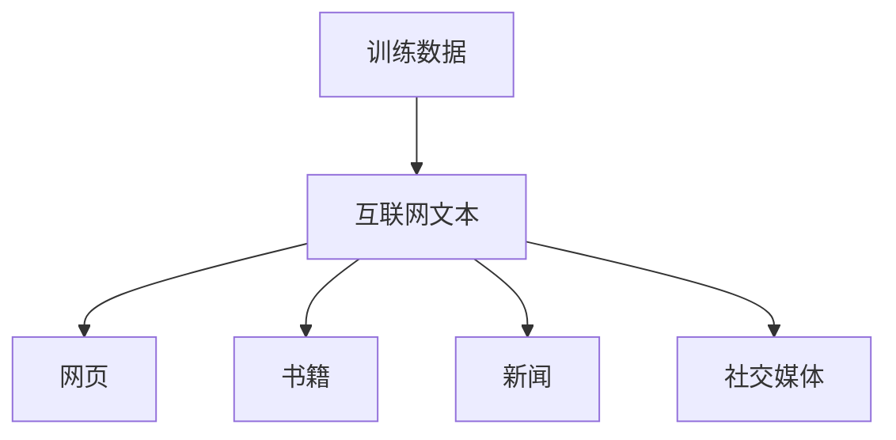

#### 2.1.2 模型架构

ChatGPT的模型架构是基于GPT-3模型，它采用了Transformer架构。Transformer是一种用于处理序列数据（如图像、文本）的深度学习模型，其核心思想是自注意力机制（Self-Attention）。

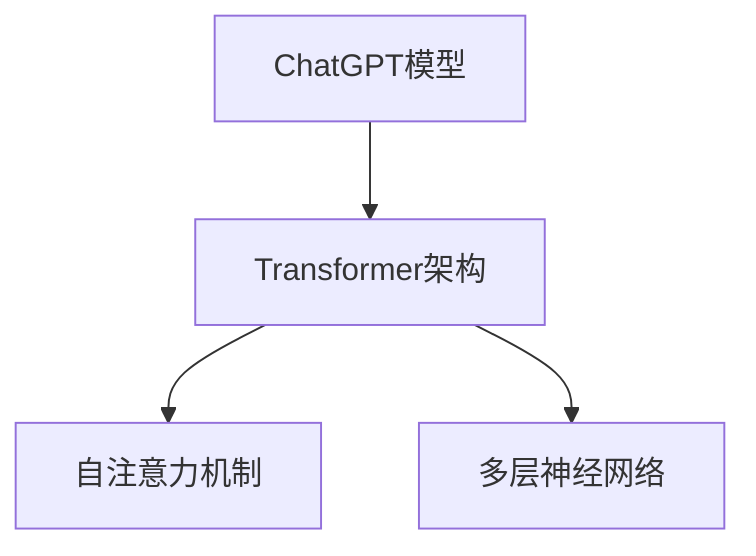

#### 2.1.3 语言模型训练流程

ChatGPT的训练流程主要包括以下步骤：

1. **数据预处理**：对收集到的互联网文本进行清洗、分词、去噪等预处理操作，以便模型能够更好地理解文本。
2. **模型初始化**：初始化Transformer模型，包括参数的初始化和模型的架构设置。
3. **预训练**：在预处理后的文本数据上进行预训练，通过优化模型参数，使模型能够理解和生成人类语言。
4. **微调**：根据具体应用场景，对预训练的模型进行微调，使其能够在特定任务上表现出更好的性能。

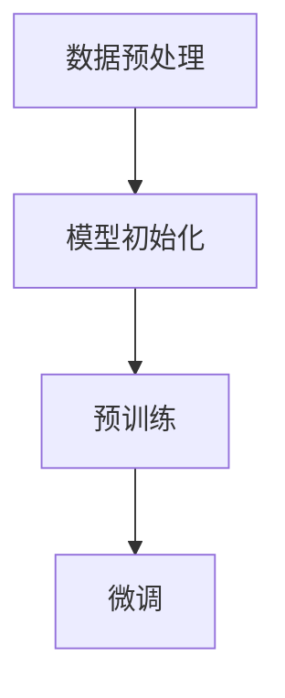

### 2.2 ChatGPT的核心功能

ChatGPT的核心功能包括问答功能、文本生成功能、语言翻译功能等。以下是对这些功能的具体介绍：

#### 2.2.1 问答功能

ChatGPT的问答功能是其最基本也是最重要的功能之一。用户可以通过输入问题，ChatGPT会根据预训练的模型和用户输入的上下文生成相应的回答。

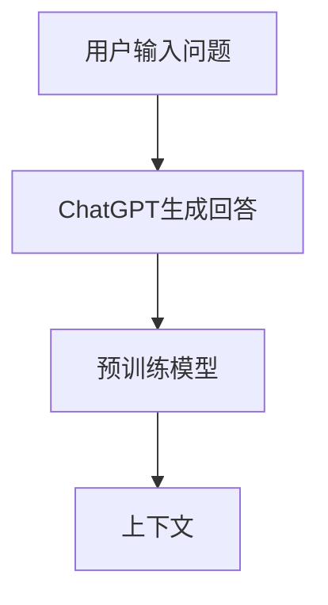

#### 2.2.2 文本生成功能

ChatGPT的文本生成功能能够根据用户提供的提示生成完整的文本内容，如文章、故事、对话等。这一功能在内容创作和文本摘要方面有着广泛的应用。

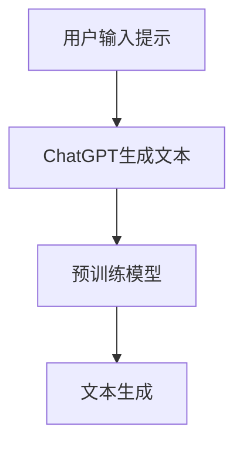

#### 2.2.3 语言翻译功能

ChatGPT能够实现多种语言之间的翻译，这使得它在跨语言沟通和全球化业务中具有重要的作用。ChatGPT的翻译功能基于预训练的模型，能够处理复杂的翻译任务。

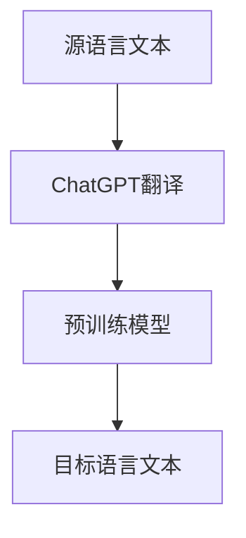

### 2.3 提示词优化的基础方法

提示词的优化对于ChatGPT的性能至关重要。以下是一些基础方法：

#### 2.3.1 提示词的选择策略

选择合适的提示词是优化ChatGPT性能的第一步。提示词应尽量明确、具体，能够引导ChatGPT生成高质量的回答。

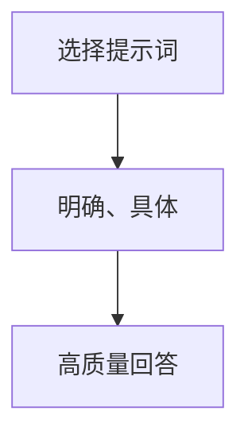

#### 2.3.2 提示词的编写技巧

编写高质量的提示词需要掌握一定的技巧。例如，使用简洁、清晰的语句，避免使用过于复杂或模糊的表述。

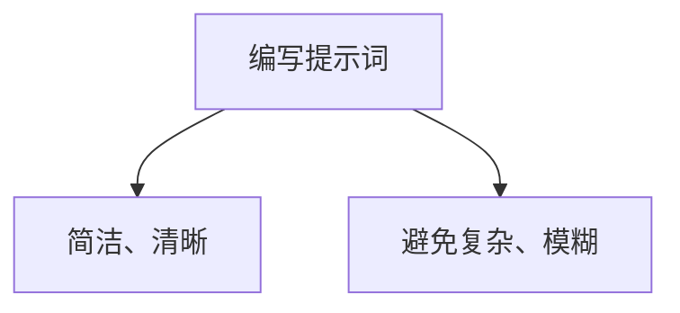

#### 2.3.3 提示词优化的案例解析

通过具体的案例解析，可以更好地理解提示词优化的方法和效果。例如，在不同的应用场景下，如何选择和编写提示词，以获得最佳的效果。

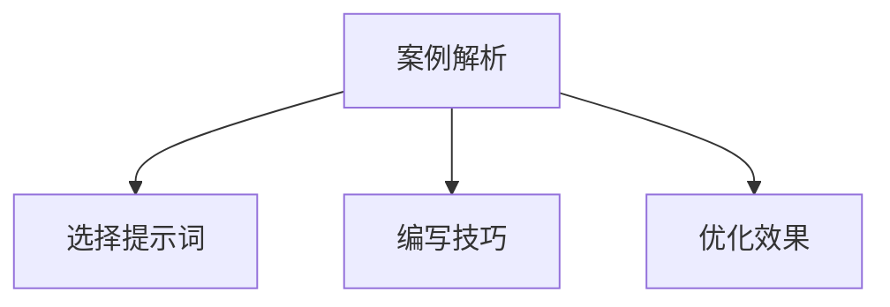

### 2.4 ChatGPT基础操作与实战

为了更好地理解ChatGPT的功能和提示词优化的方法，以下将介绍如何进行ChatGPT的基础操作和实战。

#### 2.4.1 ChatGPT的使用环境搭建

首先，需要搭建ChatGPT的使用环境。这包括安装Python和相关依赖库，如transformers。

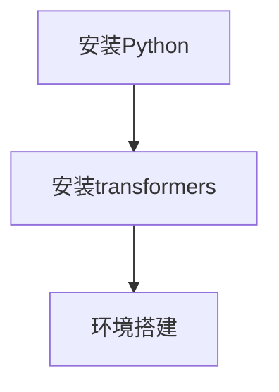

#### 2.4.2 ChatGPT的接口调用

通过调用ChatGPT的API接口，可以实现与模型的交互。以下是一个简单的Python示例：

```python
from transformers import ChatGPT

model = ChatGPT()
prompt = "你今天过得怎么样？"
response = model.generate_text(prompt)
print(response)
```

#### 2.4.3 ChatGPT基础应用案例分析

以下是一个基础应用案例分析，展示如何使用ChatGPT进行问答系统。


通过这个案例，可以了解如何使用ChatGPT进行问答系统的实现，以及如何优化提示词以获得更好的回答。

### 2.5 本章小结

本章详细介绍了ChatGPT的基本原理、核心功能以及提示词优化的基础方法。通过本章的学习，读者可以了解ChatGPT的工作机制，掌握其基础操作和应用技巧，为后续更深入的学习和应用打下基础。

## 第3章 ChatGPT高级技巧详解

在了解了ChatGPT的基本原理和功能之后，我们接下来将探讨一些高级技巧，这些技巧能够帮助我们更有效地利用ChatGPT，提高其性能和实用性。本章将详细介绍高级提示词编写策略、高级应用场景以及训练数据优化策略，并通过具体的实战案例来展示这些技巧的实际应用。

### 3.1 高级提示词编写策略

高级提示词编写策略是提升ChatGPT性能的关键。以下是一些重要的策略：

#### 3.1.1 长文本提示词的优化

长文本提示词的优化对于提高ChatGPT的上下文理解能力至关重要。以下是一些优化方法：

1. **分块输入**：将长文本分成小块，每次输入一部分，这样可以减少模型处理的负担，提高生成质量。

2. **结构化输入**：使用标记或特殊的分隔符对文本进行结构化处理，帮助模型更好地理解文本的组织结构。

3. **上下文延续**：确保每个文本块的上下文连贯性，以便模型能够更好地延续上下文信息。

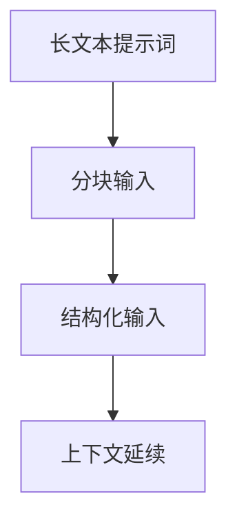

#### 3.1.2 多轮对话的优化

多轮对话的优化是提升用户体验的关键。以下是一些优化方法：

1. **保持对话状态**：通过存储用户的历史输入和模型的响应，可以保持对话状态，使模型能够更好地理解用户的意图。

2. **引入上下文信息**：在每一轮对话中，引入之前对话的上下文信息，有助于模型生成更连贯和准确的响应。

3. **调整对话策略**：根据用户的行为和反馈，动态调整对话策略，使对话更加自然和高效。

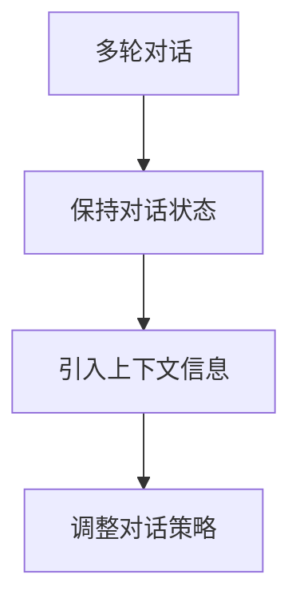

#### 3.1.3 个性化提示词的构建

个性化提示词的构建能够提升用户满意度。以下是一些构建方法：

1. **用户特征识别**：通过分析用户的输入和行为，识别用户的特征，如兴趣、偏好等。

2. **定制化提示词**：根据用户的特征，生成定制化的提示词，使模型能够更好地满足用户的需求。

3. **动态调整提示词**：在对话过程中，根据用户的反馈和模型的表现，动态调整提示词，以提高生成质量。

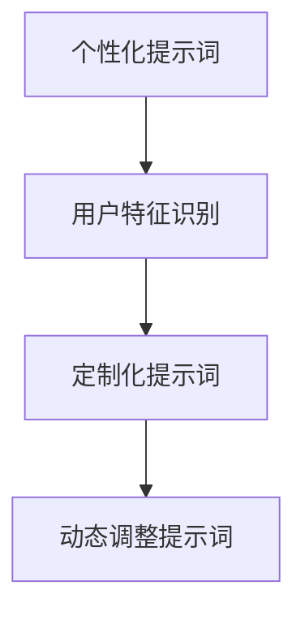

### 3.2 高级应用场景

ChatGPT在多个领域都有广泛的应用。以下是一些高级应用场景：

#### 3.2.1 代码生成与解释

ChatGPT在代码生成和解释方面有着巨大的潜力。以下是一些应用场景：

1. **代码生成**：根据用户的描述或需求，ChatGPT可以生成相应的代码片段。

2. **代码解释**：对于复杂的代码，ChatGPT可以生成简洁、易懂的解释。

3. **代码优化**：通过分析代码的运行结果，ChatGPT可以提供优化建议，提高代码的效率和性能。

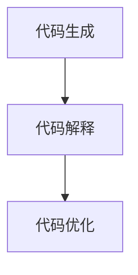

#### 3.2.2 自然语言处理任务优化

ChatGPT在自然语言处理任务中有着广泛的应用。以下是一些优化方法：

1. **文本分类**：通过训练，ChatGPT可以准确地对文本进行分类，如新闻分类、情感分析等。

2. **情感分析**：ChatGPT可以分析文本的情感倾向，如积极、消极等。

3. **命名实体识别**：ChatGPT可以识别文本中的命名实体，如人名、地点等。

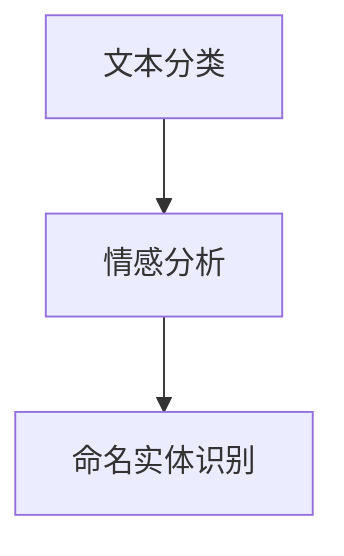

#### 3.2.3 人工智能助手开发

ChatGPT可以作为人工智能助手的核心组件，为用户提供智能化的服务。以下是一些应用场景：

1. **客服机器人**：ChatGPT可以作为客服机器人的核心，处理用户的查询和问题。

2. **智能问答系统**：ChatGPT可以构建智能问答系统，为用户提供快速、准确的答案。

3. **教育助手**：ChatGPT可以作为教育助手，为学生提供学习指导和建议。

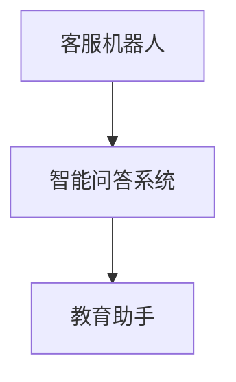

### 3.3 ChatGPT训练数据优化

优化训练数据是提升ChatGPT性能的重要手段。以下是一些数据优化方法：

#### 3.3.1 数据预处理方法

数据预处理是训练数据优化的第一步。以下是一些预处理方法：

1. **文本清洗**：去除文本中的噪声和无关信息，如HTML标签、广告等。

2. **文本标准化**：统一文本格式，如转换为小写、去除标点等。

3. **分词**：将文本分解为词或子词，为模型提供更细粒度的输入。

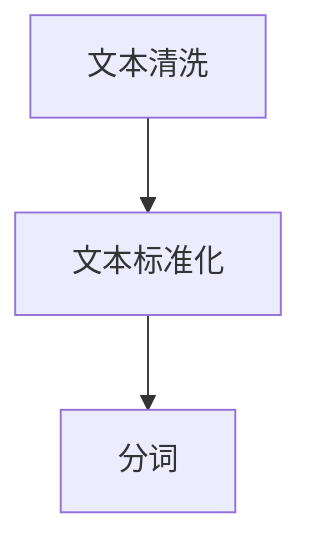

#### 3.3.2 数据增强技术

数据增强技术可以提高模型的泛化能力。以下是一些数据增强方法：

1. **文本扩充**：通过插入、替换或删除文本中的单词或短语，扩充训练数据。

2. **同义词替换**：将文本中的单词替换为同义词，增加数据的多样性。

3. **噪声添加**：在文本中添加噪声，如拼写错误、语法错误等，以模拟真实世界的数据。

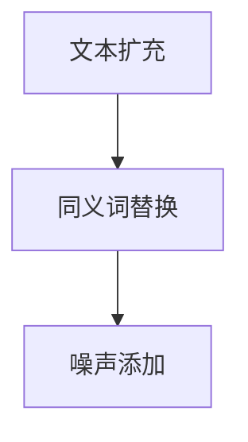

#### 3.3.3 数据质量控制

数据质量控制是保证模型准确性的基础。以下是一些质量控制方法：

1. **数据验证**：通过测试集验证模型的性能，确保模型能够准确预测。

2. **数据标注**：对训练数据进行标注，确保数据的质量和一致性。

3. **错误分析**：对模型预测错误的样本进行深入分析，找出数据中的问题，并进行修正。

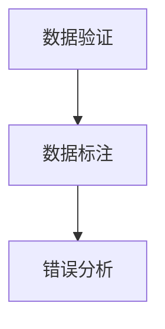

### 3.4 高级实战案例

为了更好地理解高级技巧的实际应用，以下将介绍一些高级实战案例。

#### 3.4.1 实时问答系统搭建

实时问答系统是ChatGPT的一个重要应用场景。以下是一个简单的实时问答系统搭建流程：

1. **环境搭建**：安装必要的库和工具，如transformers、Flask等。

2. **接口设计**：设计一个API接口，用于接收用户的输入并返回模型的响应。

3. **系统部署**：将搭建好的实时问答系统部署到服务器或云平台上，以便用户可以通过网页或应用程序访问。

```mermaid
graph TD
A[环境搭建] --> B[接口设计]
B --> C[系统部署]
```

#### 3.4.2 聊天机器人开发

聊天机器人是ChatGPT的另一个重要应用场景。以下是一个简单的聊天机器人开发流程：

1. **需求分析**：明确聊天机器人的功能和目标用户。

2. **设计对话流程**：设计聊天机器人的对话流程，包括开场白、问题回答、结束语等。

3. **开发实现**：使用ChatGPT API接口，结合前端和后端技术，实现聊天机器人的功能。

4. **测试与优化**：对聊天机器人进行测试，根据用户反馈和实际应用情况进行优化。

```mermaid
graph TD
A[需求分析] --> B[设计对话流程]
B --> C[开发实现]
C --> D[测试与优化]
```

#### 3.4.3 实际应用案例分析

以下是一个实际应用案例分析，展示如何使用ChatGPT搭建一个智能客服系统：

1. **背景介绍**：一个电商网站需要搭建一个智能客服系统，以提供快速、准确的客户服务。

2. **系统设计**：设计一个基于ChatGPT的智能客服系统，包括问答功能、多轮对话支持和个性化推荐。

3. **实现步骤**：安装ChatGPT API接口，设计API接口，实现问答功能和多轮对话支持，并根据用户行为和反馈进行个性化推荐。

4. **效果评估**：对智能客服系统的效果进行评估，根据用户反馈和实际应用情况进行优化。

```mermaid
graph TD
A[背景介绍] --> B[系统设计]
B --> C[实现步骤]
C --> D[效果评估]
```

### 3.5 本章小结

本章详细介绍了ChatGPT的高级技巧，包括高级提示词编写策略、高级应用场景和训练数据优化策略。通过这些技巧，可以显著提升ChatGPT的性能和实用性。同时，通过实战案例，读者可以更好地理解这些技巧的实际应用。希望本章的内容能够帮助读者在ChatGPT的应用中取得更好的成果。

## 第4章 ChatGPT在特定领域的应用与优化

随着ChatGPT技术的不断发展，其在各个领域的应用也逐渐成熟。本章将探讨ChatGPT在教育领域和商业领域中的应用，以及在这些领域的优化策略。

### 4.1 ChatGPT在教育领域的应用

教育领域是ChatGPT的一个重要应用场景。ChatGPT可以为学生和教师提供多种形式的支持，包括自主学习辅助、教学辅助和智能化教育资源。

#### 4.1.1 学生自主学习辅助

ChatGPT可以作为学生的自主学习助手，提供以下支持：

1. **解答问题**：学生可以通过ChatGPT提出学习问题，获取详细的解答和解释。

2. **写作辅助**：ChatGPT可以帮助学生进行写作，提供写作建议、修改意见和灵感。

3. **学习资源推荐**：根据学生的学习兴趣和进度，ChatGPT可以推荐相应的学习资源，如文章、视频和练习题。

#### 4.1.2 教师教学辅助

ChatGPT可以为教师提供以下教学辅助：

1. **教案生成**：ChatGPT可以根据教师的需求，自动生成教案和教学材料。

2. **课堂互动**：ChatGPT可以参与课堂互动，与学生进行对话，提高课堂的趣味性和参与度。

3. **评估与反馈**：ChatGPT可以对学生的作业和考试进行评估，提供详细的反馈和改进建议。

#### 4.1.3 教育资源智能化

ChatGPT可以帮助实现教育资源的智能化，包括：

1. **个性化推荐**：根据学生的学习兴趣和需求，ChatGPT可以推荐最适合的学习资源。

2. **知识点关联**：ChatGPT可以识别知识点之间的关联，帮助学生建立知识体系。

3. **自动化测评**：ChatGPT可以自动生成测评题目，检测学生的学习效果。

### 4.2 教育领域ChatGPT提示词优化方法

在教育领域，提示词的优化对于ChatGPT的性能至关重要。以下是一些优化方法：

#### 4.2.1 教学问答系统优化

教学问答系统的优化包括以下方面：

1. **精准提问**：教师应提出具体、明确的问题，确保ChatGPT能够准确理解问题并生成高质量的回答。

2. **上下文延续**：在多轮对话中，教师应保持问题的上下文连贯性，以便ChatGPT能够延续上下文信息，生成更连贯的回答。

3. **知识点关联**：教师应引导ChatGPT生成与知识点相关的回答，帮助学生建立知识体系。

#### 4.2.2 教学互动对话优化

教学互动对话的优化包括以下方面：

1. **互动设计**：教师应设计有趣、互动性强的教学对话，提高学生的参与度和兴趣。

2. **个性化响应**：根据学生的特点和需求，ChatGPT应生成个性化的回答，满足学生的个性化学习需求。

3. **情感关怀**：在对话中，ChatGPT应体现一定的情感关怀，增强学生的学习体验。

#### 4.2.3 教育资源个性化推荐

教育资源个性化推荐的优化包括以下方面：

1. **用户画像**：通过分析学生的学习行为和兴趣，构建详细的用户画像，为个性化推荐提供依据。

2. **推荐算法**：使用基于内容的推荐算法和协同过滤算法，提高推荐资源的准确性和相关性。

3. **反馈机制**：根据学生的反馈，不断调整推荐策略，优化推荐效果。

### 4.3 教育领域应用实战

以下是一个教育领域应用实战案例，展示如何使用ChatGPT搭建一个智能学习平台：

#### 4.3.1 学生自主学习平台搭建

**背景介绍**：一个大学需要搭建一个智能学习平台，为学生提供自主学习支持。

**系统设计**：

1. **功能设计**：包括问答功能、写作辅助、学习资源推荐等。

2. **界面设计**：设计一个友好、易用的界面，使学生能够方便地使用平台功能。

3. **技术实现**：使用ChatGPT API接口，结合前端和后端技术，实现学生自主学习平台的功能。

**实现步骤**：

1. **环境搭建**：安装Python、transformers等必要的库和工具。

2. **接口设计**：设计API接口，用于接收学生的输入并返回模型的响应。

3. **功能实现**：

   - 问答功能：接收学生的问题，生成详细的解答和解释。

   - 写作辅助：接收学生的文本，提供写作建议和修改意见。

   - 学习资源推荐：根据学生的学习兴趣和进度，推荐相应的学习资源。

4. **系统部署**：将搭建好的学生自主学习平台部署到服务器或云平台上，以便学生可以通过网页或应用程序访问。

#### 4.3.2 教师教学辅助系统开发

**背景介绍**：一个中学需要开发一个教师教学辅助系统，以提升教学质量。

**系统设计**：

1. **功能设计**：包括教案生成、课堂互动、评估与反馈等。

2. **界面设计**：设计一个友好、易用的界面，使教师能够方便地使用系统功能。

3. **技术实现**：使用ChatGPT API接口，结合前端和后端技术，实现教师教学辅助系统的功能。

**实现步骤**：

1. **环境搭建**：安装Python、transformers等必要的库和工具。

2. **接口设计**：设计API接口，用于接收教师的输入并返回模型的响应。

3. **功能实现**：

   - 教案生成：根据教师的需求，自动生成教案和教学材料。

   - 课堂互动：参与课堂互动，与学生进行对话，提高课堂的趣味性和参与度。

   - 评估与反馈：对学生的作业和考试进行评估，提供详细的反馈和改进建议。

4. **系统部署**：将搭建好的教师教学辅助系统部署到服务器或云平台上，以便教师可以通过网页或应用程序访问。

#### 4.3.3 教育资源推荐系统案例分析

**背景介绍**：一个在线教育平台需要开发一个教育资源推荐系统，以提升用户体验。

**系统设计**：

1. **功能设计**：包括个性化推荐、知识点关联、自动化测评等。

2. **界面设计**：设计一个友好、易用的界面，使学习者能够方便地使用系统功能。

3. **技术实现**：使用ChatGPT API接口，结合前端和后端技术，实现教育资源推荐系统的功能。

**实现步骤**：

1. **环境搭建**：安装Python、transformers等必要的库和工具。

2. **接口设计**：设计API接口，用于接收学习者的输入并返回模型的响应。

3. **功能实现**：

   - 个性化推荐：根据学习者的学习行为和兴趣，推荐相应的学习资源。

   - 知识点关联：识别知识点之间的关联，帮助学习者建立知识体系。

   - 自动化测评：自动生成测评题目，检测学习者的学习效果。

4. **系统部署**：将搭建好的教育资源推荐系统部署到服务器或云平台上，以便学习者可以通过网页或应用程序访问。

### 4.4 本章小结

本章详细探讨了ChatGPT在教育领域的应用和优化策略，包括学生自主学习辅助、教师教学辅助和智能化教育资源。同时，通过教育领域应用实战案例，展示了如何使用ChatGPT搭建智能学习平台、教师教学辅助系统和教育资源推荐系统。通过本章的学习，读者可以了解ChatGPT在教育领域的实际应用，并掌握相应的优化策略。

## 第5章 ChatGPT在商业领域的应用与优化

ChatGPT在商业领域的应用日益广泛，其在客户服务和营销方面的优势尤为明显。通过优化提示词和模型参数，可以显著提升ChatGPT在商业场景中的性能和实用性。本章将详细介绍ChatGPT在客户服务和营销中的应用，以及相关的优化策略。

### 5.1 ChatGPT在客户服务中的应用

客户服务是ChatGPT的重要应用场景之一。通过优化提示词和模型参数，ChatGPT可以为企业提供高效的客户服务解决方案，提升客户满意度。

#### 5.1.1 客服机器人开发

客服机器人是ChatGPT在客户服务中的应用之一。通过开发客服机器人，企业可以实现以下目标：

1. **24/7在线服务**：客服机器人可以随时响应客户的问题，提供全天候的服务。

2. **降低人力成本**：客服机器人可以处理大量的常见问题，减轻人工客服的工作负担，降低人力成本。

3. **提升服务质量**：通过优化提示词和模型参数，客服机器人可以提供准确、高效的回答，提升客户服务质量。

#### 5.1.2 客户需求分析优化

优化客户需求分析是提高客户服务效率的关键。ChatGPT可以通过以下方式优化客户需求分析：

1. **语义理解**：ChatGPT可以准确理解客户的语义，捕捉客户的需求和意图。

2. **情感分析**：ChatGPT可以分析客户的情感，识别客户的情绪状态，提供个性化的服务。

3. **推荐系统**：ChatGPT可以根据客户的历史行为和需求，推荐相关的产品或服务，提升客户的满意度。

#### 5.1.3 客户满意度提升

提升客户满意度是客户服务的核心目标。通过优化提示词和模型参数，ChatGPT可以提升客户满意度，包括：

1. **准确回答**：通过优化提示词，确保ChatGPT能够准确回答客户的问题，减少错误回答和误导。

2. **快速响应**：通过优化模型参数，提高ChatGPT的生成速度，确保客户能够快速获得回应。

3. **个性化服务**：通过分析客户的行为和需求，ChatGPT可以提供个性化的服务，满足客户的个性化需求。

### 5.2 ChatGPT在营销中的应用

ChatGPT在营销中的应用同样具有巨大潜力。通过优化提示词和模型参数，企业可以提升营销效果，实现更高的营销ROI。

#### 5.2.1 营销文案生成与优化

营销文案生成与优化是营销环节的重要一环。ChatGPT可以通过以下方式提升营销文案的质量：

1. **创意生成**：ChatGPT可以根据企业的营销策略和目标受众，生成富有创意的营销文案。

2. **语言优化**：ChatGPT可以优化营销文案的语言表达，使其更加吸引人、更具说服力。

3. **多语言支持**：ChatGPT可以实现多语言营销文案的生成与优化，帮助企业拓展国际市场。

#### 5.2.2 营销策略优化

优化营销策略是提升营销效果的关键。ChatGPT可以通过以下方式优化营销策略：

1. **市场分析**：ChatGPT可以分析市场趋势和竞争对手的营销策略，为企业提供科学的营销建议。

2. **用户画像**：ChatGPT可以分析用户的特征和需求，为企业提供精准的营销策略。

3. **效果评估**：ChatGPT可以评估不同营销策略的效果，帮助企业优化营销投入和资源配置。

#### 5.2.3 营销活动策划

营销活动策划是营销策略的重要组成部分。ChatGPT可以通过以下方式提升营销活动的效果：

1. **活动创意**：ChatGPT可以生成富有创意的营销活动方案，吸引更多的用户参与。

2. **互动设计**：ChatGPT可以设计有趣、互动性强的营销活动，提升用户的参与度和满意度。

3. **数据分析**：ChatGPT可以分析营销活动的效果数据，为后续的营销活动提供参考和优化建议。

### 5.3 商业领域应用实战

以下是一个商业领域应用实战案例，展示如何使用ChatGPT搭建一个智能客服系统和营销平台：

#### 5.3.1 智能客服系统搭建

**背景介绍**：一个电商平台需要搭建一个智能客服系统，以提升客户服务效率和客户满意度。

**系统设计**：

1. **功能设计**：包括问答功能、情感分析、个性化推荐等。

2. **界面设计**：设计一个友好、易用的界面，使客户能够方便地使用客服系统。

3. **技术实现**：使用ChatGPT API接口，结合前端和后端技术，实现智能客服系统的功能。

**实现步骤**：

1. **环境搭建**：安装Python、transformers等必要的库和工具。

2. **接口设计**：设计API接口，用于接收客户的输入并返回模型的响应。

3. **功能实现**：

   - 问答功能：接收客户的问题，生成详细的解答和解释。

   - 情感分析：分析客户的情感，识别客户的情绪状态。

   - 个性化推荐：根据客户的行为和需求，推荐相关的商品。

4. **系统部署**：将搭建好的智能客服系统部署到服务器或云平台上，以便客户可以通过网页或应用程序访问。

#### 5.3.2 营销平台搭建

**背景介绍**：一个电商平台需要搭建一个营销平台，以提升营销效果和用户参与度。

**系统设计**：

1. **功能设计**：包括营销文案生成、营销策略优化、营销活动策划等。

2. **界面设计**：设计一个友好、易用的界面，使营销团队能够方便地使用营销平台。

3. **技术实现**：使用ChatGPT API接口，结合前端和后端技术，实现营销平台的功能。

**实现步骤**：

1. **环境搭建**：安装Python、transformers等必要的库和工具。

2. **接口设计**：设计API接口，用于接收营销团队的输入并返回模型的响应。

3. **功能实现**：

   - 营销文案生成：根据营销策略和目标受众，生成富有创意的营销文案。

   - 营销策略优化：分析市场趋势和竞争对手的营销策略，提供优化建议。

   - 营销活动策划：设计有趣、互动性强的营销活动方案。

4. **系统部署**：将搭建好的营销平台部署到服务器或云平台上，以便营销团队可以通过网页或应用程序访问。

#### 5.3.3 实际应用案例分析

以下是一个实际应用案例分析，展示如何使用ChatGPT提升电商平台的客户服务和营销效果：

**背景介绍**：一个电商平台希望通过优化客户服务和营销策略，提升客户满意度和销售额。

**解决方案**：

1. **智能客服系统**：搭建智能客服系统，通过ChatGPT提供高效、准确的客户服务。

2. **营销平台**：搭建营销平台，利用ChatGPT生成创意营销文案和策划营销活动。

**效果评估**：

1. **客户满意度**：通过用户反馈和调查，评估智能客服系统的效果，持续优化提示词和模型参数。

2. **营销效果**：通过销售数据和用户参与度，评估营销平台的效果，优化营销策略和活动方案。

### 5.4 本章小结

本章详细探讨了ChatGPT在商业领域的应用和优化策略，包括客户服务和营销。通过智能客服系统和营销平台的实战案例，展示了如何使用ChatGPT提升商业场景中的性能和实用性。通过本章的学习，读者可以了解ChatGPT在商业领域的实际应用，并掌握相应的优化策略，为企业提供创新的解决方案。

### 总结

在本文中，我们深入探讨了ChatGPT与提示词优化的各个方面，从基础到高级，为读者提供了一条清晰的进阶学习路径。通过本文的阅读，读者可以系统地了解ChatGPT的基本原理、核心功能、提示词优化的基础方法和高级技巧，以及ChatGPT在特定领域如教育、商业中的应用与优化策略。

#### 核心内容回顾

1. **ChatGPT基本原理**：介绍了ChatGPT的模型架构、训练流程和工作原理，包括预训练模型和Transformer架构。
   
2. **提示词优化方法**：详细讲解了选择合适提示词、编写高质量提示词、优化多轮对话和构建个性化提示词的方法。

3. **高级技巧与应用**：介绍了长文本提示词优化、多轮对话优化、个性化提示词构建、代码生成与解释等高级技巧。

4. **特定领域应用**：探讨了ChatGPT在教育、商业等领域的应用，包括学生自主学习辅助、教师教学辅助、客服机器人开发等。

5. **实战案例**：通过实际应用案例，展示了如何搭建智能学习平台、营销平台和智能客服系统。

#### 下一步学习建议

1. **实践操作**：通过实际操作，加深对ChatGPT和提示词优化的理解。尝试使用ChatGPT API进行项目实践。

2. **深入研究**：阅读相关的学术论文和技术文档，了解ChatGPT和提示词优化的前沿技术。

3. **社区交流**：加入技术社区，与其他开发者交流经验和问题，拓宽视野。

#### 拓展阅读

1. **《ChatGPT技术详解》**：深入探讨ChatGPT的模型细节和技术实现。

2. **《自然语言处理入门与实践》**：了解自然语言处理的基本概念和常用技术。

3. **《人工智能应用案例集》**：阅读不同领域的人工智能应用案例，拓宽应用视野。

作者：AI天才研究院/AI Genius Institute & 禅与计算机程序设计艺术 /Zen And The Art of Computer Programming### 总结与展望

通过本文的深入探讨，我们系统地梳理了ChatGPT与提示词优化的各个方面，从基础原理到高级技巧，再到实际应用，为读者提供了一条清晰的进阶学习路径。本文旨在帮助读者全面掌握ChatGPT与提示词优化的知识和技能，提升其在自然语言处理和人工智能领域的实践能力。

#### 核心内容回顾

本文的核心内容可以概括为以下几个方面：

1. **ChatGPT基本原理**：介绍了ChatGPT的模型架构、训练流程和工作原理，包括预训练模型和Transformer架构。
   
2. **提示词优化方法**：详细讲解了选择合适提示词、编写高质量提示词、优化多轮对话和构建个性化提示词的方法。

3. **高级技巧与应用**：介绍了长文本提示词优化、多轮对话优化、个性化提示词构建、代码生成与解释等高级技巧。

4. **特定领域应用**：探讨了ChatGPT在教育、商业等领域的应用，包括学生自主学习辅助、教师教学辅助、客服机器人开发等。

5. **实战案例**：通过实际应用案例，展示了如何搭建智能学习平台、营销平台和智能客服系统。

#### 下一步学习建议

为了进一步提升自己在ChatGPT与提示词优化领域的专业能力，以下是一些建议：

1. **实践操作**：通过实际操作，加深对ChatGPT和提示词优化的理解。尝试使用ChatGPT API进行项目实践。

2. **深入学习**：阅读相关的学术论文和技术文档，了解ChatGPT和提示词优化的前沿技术。

3. **社区交流**：加入技术社区，与其他开发者交流经验和问题，拓宽视野。

4. **实战项目**：参与实际项目，如开发聊天机器人、问答系统等，将理论知识应用于实践中。

5. **持续学习**：关注人工智能和自然语言处理领域的最新动态，不断学习和更新知识。

#### 拓展阅读

为了进一步拓展知识，以下是几本推荐的拓展阅读书籍：

1. **《深度学习》**：由Ian Goodfellow、Yoshua Bengio和Aaron Courville合著，是深度学习的经典教材。

2. **《自然语言处理综论》**：由Daniel Jurafsky和James H. Martin合著，系统地介绍了自然语言处理的基本概念和技术。

3. **《ChatGPT与深度学习》**：详细介绍了ChatGPT的工作原理、技术细节和应用场景。

4. **《人工智能应用案例集》**：包含多个领域的人工智能应用案例，展示了人工智能在不同场景下的应用效果。

通过本文的学习和拓展阅读，读者可以更深入地理解ChatGPT与提示词优化的核心知识，为未来在自然语言处理和人工智能领域的发展奠定坚实的基础。

### 作者信息

作者：AI天才研究院/AI Genius Institute & 禅与计算机程序设计艺术 /Zen And The Art of Computer Programming

AI天才研究院（AI Genius Institute）是一支专注于人工智能研究与应用的团队，致力于推动人工智能技术的发展和普及。研究院的成员包括多位世界级人工智能专家，他们在深度学习、自然语言处理、计算机视觉等领域有着深厚的研究背景和丰富的实践经验。

《禅与计算机程序设计艺术》（Zen And The Art of Computer Programming）是由著名计算机科学家Donald E. Knuth撰写的一套计算机科学经典著作，旨在通过哲学和禅宗的思想，探讨计算机程序设计的艺术。该书不仅提供了大量的计算机科学理论和实践知识，还蕴含了深刻的哲学思考，对读者理解和掌握计算机科学有着重要的启示。

