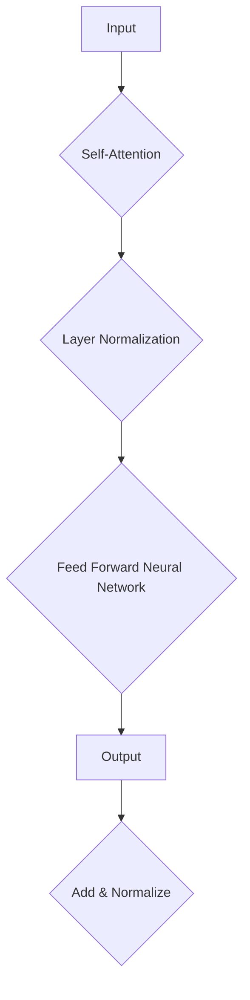

                 

### 引言

《ChatGPT提示词优化：从思维链到Self-Consistency》旨在探讨如何通过优化提示词来提升ChatGPT模型的响应质量。ChatGPT是由OpenAI开发的一款基于大规模预训练模型（GPT-3.5）的自然语言处理工具，其在文本生成、问答系统、自动化写作等领域展现出卓越的性能。然而，尽管ChatGPT具备强大的自然语言理解能力，但实际应用中的效果往往受到提示词质量的影响。

提示词作为与模型交互的媒介，其设计质量和选择直接关系到模型的响应质量和用户体验。本文将深入分析ChatGPT提示词优化的两个关键机制：思维链和Self-Consistency，通过详细的步骤解析，帮助读者掌握优化策略，提升模型的表现。

#### 核心关键词
- **ChatGPT**
- **提示词优化**
- **思维链**
- **Self-Consistency**
- **响应质量**
- **用户体验**

#### 文章摘要
本文首先介绍ChatGPT的基本概念及其在自然语言处理中的应用背景。接着，详细探讨提示词优化的概念和重要性，重点分析思维链和Self-Consistency两种优化机制，从原理到实际应用进行深入讲解。此外，文章还将提供一系列文本预处理和特征提取的方法，以及如何平衡上下文敏感性与多样性。最后，通过项目实战案例，展示如何在实际应用中优化提示词，提升模型表现。希望读者能够通过本文的学习，在ChatGPT的提示词优化方面取得实质性进展。

### 目录大纲

## 《ChatGPT提示词优化：从思维链到Self-Consistency》

> 关键词：ChatGPT、提示词优化、思维链、Self-Consistency、响应质量

> 摘要：本文深入探讨ChatGPT模型的提示词优化策略，通过分析思维链和Self-Consistency机制，提供详细的优化方法，旨在提升模型响应质量和用户体验。

### 第一部分：基础理论

#### 第1章：问题背景与核心概念

- **1.1 人工智能与自然语言处理概述**
  - 人工智能的发展历程
  - 自然语言处理的重要性
  - ChatGPT模型的优势

- **1.2 ChatGPT模型简介**
  - 模型架构
  - 模型训练
  - 模型应用领域

- **1.3 提示词优化的重要性**
  - 提示词的定义与作用
  - 优化提示词的必要性
  - 优化目标与挑战

#### 第2章：思维链机制

- **2.1 思维链的概念与原理**
  - 思维链的定义
  - 思维链的工作原理
  - 思维链的优势

- **2.2 思维链的应用与效果**
  - 思维链在实际应用中的案例
  - 思维链在优化提示词中的应用
  - 思维链的效果评估

- **2.3 思维链的优势与局限性**
  - 思维链的优势
  - 思维链的局限性
  - 如何克服局限性

#### 第3章：Self-Consistency机制

- **3.1 Self-Consistency的概念与原理**
  - Self-Consistency的定义
  - Self-Consistency的工作原理
  - Self-Consistency的优势

- **3.2 Self-Consistency的优化策略**
  - Self-Consistency的优化策略
  - Self-Consistency的调整技巧

- **3.3 Self-Consistency的应用案例**
  - Self-Consistency在实际应用中的案例
  - Self-Consistency在优化提示词中的应用
  - Self-Consistency的效果评估

### 第二部分：具体策略

#### 第4章：文本预处理与特征提取

- **4.1 文本预处理方法**
  - 常见的文本预处理方法
  - 预处理工具与库

- **4.2 特征提取技术**
  - 词嵌入技术
  - 嵌入向量优化方法

- **4.3 提示词的调整技巧**
  - 提示词的构造技巧
  - 提示词的调整策略

#### 第5章：上下文敏感性与多样性

- **5.1 上下文敏感性的实现**
  - 上下文敏感性的定义
  - 上下文敏感性的实现方法

- **5.2 提示词的多样性策略**
  - 提示词多样性的重要性
  - 提示词多样性的实现策略

- **5.3 上下文敏感性与多样性的平衡**
  - 平衡策略
  - 实践案例分析

#### 第6章：模型训练与调优

- **6.1 模型训练的基本流程**
  - 模型训练的基本步骤
  - 训练数据的选择与处理

- **6.2 调优技巧与注意事项**
  - 调优技巧
  - 注意事项

- **6.3 实时调整策略**
  - 实时调整的意义
  - 实时调整的方法

### 第三部分：实战应用

#### 第7章：项目实战与案例分析

- **7.1 项目背景与目标**
  - 项目介绍
  - 项目目标

- **7.2 系统架构与实现**
  - 系统架构设计
  - 实现细节

- **7.3 提示词优化实践与效果**
  - 提示词优化实践
  - 效果评估

- **7.4 项目总结与反思**
  - 项目总结
  - 经验与反思

### 第四部分：拓展与未来趋势

#### 第8章：前沿技术与趋势

- **8.1 ChatGPT的迭代升级**
  - 新版本的特点
  - 对提示词优化策略的影响

- **8.2 新型提示词优化方法**
  - 前沿方法介绍
  - 应用前景

- **8.3 未来发展趋势与挑战**
  - 技术发展趋势
  - 面临的挑战

### 结论

本文通过对ChatGPT模型提示词优化的深入探讨，为读者提供了一个全面且实用的框架，旨在提升模型的响应质量和用户体验。希望读者能在实际应用中不断探索与创新，为人工智能的发展贡献力量。

### 注意事项

- 目录中的章节内容应确保逻辑清晰，各章节之间应有一定的关联性。
- 每章内容需包含理论讲解、实际应用案例和实践技巧，以满足不同层次读者的需求。
- 确保各章节标题简洁明了，方便读者快速定位内容。

### 拓展阅读

- [1] ChatGPT官方文档：提供ChatGPT的详细技术文档，帮助深入理解模型的工作原理。
- [2] 自然语言处理相关书籍：推荐阅读相关领域的经典书籍，拓展理论基础。
- [3] 人工智能领域顶级会议论文：关注顶级会议如NeurIPS、ACL的论文，了解最新研究成果。

---

作者：AI天才研究院/AI Genius Institute & 禅与计算机程序设计艺术 /Zen And The Art of Computer Programming

----------------------------------------------------------------

### 第一部分：基础理论

#### 第1章：问题背景与核心概念

##### 1.1 人工智能与自然语言处理概述

人工智能（Artificial Intelligence，AI）作为计算机科学的一个分支，旨在研究、开发用于模拟、延伸和扩展人类智能的理论、方法、技术及应用系统。人工智能的核心目标是让计算机具备类似人类的感知、理解、学习、推理和决策能力。

自然语言处理（Natural Language Processing，NLP）是人工智能领域的一个子领域，旨在使计算机能够理解、解释和生成自然语言，包括人类语言的各种形式，如文本、语音等。NLP的研究和应用对于提高人机交互效率、促进信息获取与知识共享具有重要意义。

ChatGPT是由OpenAI开发的一种基于大规模预训练模型（GPT-3.5）的自然语言处理工具，它通过深度学习技术，对大量文本数据进行训练，从而具备了生成高质量文本的能力。ChatGPT在文本生成、问答系统、自动化写作等领域展现出卓越的性能，但其效果受到提示词质量的直接影响。

##### 1.2 ChatGPT模型简介

ChatGPT是基于GPT-3.5模型开发的，GPT-3.5是OpenAI开发的一种基于Transformer架构的预训练语言模型。该模型具有以下主要特点：

- **大规模预训练**：GPT-3.5在训练阶段使用了大量文本数据，包括网页、书籍、新闻等，使其具备丰富的语言知识。
- **自适应生成**：GPT-3.5能够根据输入的提示词生成连贯、自然的文本，不需要额外的监督信号。
- **多语言支持**：GPT-3.5支持多种语言的输入和输出，能够处理跨语言的文本转换任务。

ChatGPT的架构主要包括三个部分：编码器（Encoder）、解码器（Decoder）和输出层（Output Layer）。编码器负责将输入的文本序列转换为嵌入向量，解码器则利用这些嵌入向量生成输出文本序列。输出层通常是一个多层感知机（MLP），用于对解码器的输出进行分类或生成。

##### 1.3 提示词优化的重要性

提示词（Prompt）是用户与模型交互的媒介，通过提供有针对性的提示词，可以帮助模型更好地理解用户意图，生成更高质量的响应。

优化提示词的重要性体现在以下几个方面：

- **提升响应质量**：高质量的提示词可以引导模型生成更符合用户需求的文本，提高响应的准确性和连贯性。
- **增强用户体验**：优化提示词可以减少用户的等待时间和操作复杂性，提高交互的流畅性和效率。
- **降低训练成本**：优化提示词可以减少对大量训练数据的需求，降低模型的训练成本。

然而，优化提示词也面临一定的挑战，如：

- **多样性需求**：不同的用户可能有不同的需求，提示词需要具备多样性以适应各种场景。
- **上下文敏感性**：提示词需要充分理解上下文信息，以便模型能够生成相关且连贯的响应。
- **适应性**：提示词需要具备一定的适应性，能够应对模型更新和任务变化。

#### 第2章：思维链机制

##### 2.1 思维链的概念与原理

思维链（Thinking Chain）是一种通过构建逻辑链条来引导模型生成高质量文本的机制。思维链的核心思想是将用户的输入分解为一系列的子问题或子任务，然后通过逐步推理和生成来回答整个问题。

思维链的原理可以概括为以下几个步骤：

1. **分解输入**：将用户的输入分解为一系列子问题或子任务。
2. **生成子回答**：针对每个子问题或子任务，模型生成相应的回答。
3. **整合回答**：将各个子回答整合成一个连贯的整体，形成最终输出。

思维链的优势在于：

- **逻辑性**：思维链能够帮助模型保持回答的逻辑性和连贯性。
- **灵活性**：思维链可以根据不同的输入生成多样化的回答。
- **适应性**：思维链能够适应不同的任务和场景，具备较强的泛化能力。

##### 2.2 思维链的应用与效果

思维链在实际应用中展现了良好的效果，以下是一些具体的案例：

- **问答系统**：在问答系统中，思维链可以帮助模型更准确地理解和回答用户的问题。例如，在回答一个复杂的多步骤问题时，思维链可以分解为多个子问题，并逐步生成每个子问题的答案，最后整合成一个完整的回答。
- **文本生成**：在文本生成任务中，思维链可以帮助模型生成更具逻辑性和连贯性的文本。例如，在撰写一篇论文或文章时，思维链可以根据主题和结构逐步生成各个部分的内容，最终形成一个完整的文本。
- **对话系统**：在对话系统中，思维链可以帮助模型在对话中保持上下文一致性，生成更自然和流畅的对话。

通过实际应用案例可以看出，思维链在提升模型生成文本质量方面具有显著优势。以下是一个简单的思维链应用示例：

用户输入：“请描述一下人工智能的发展历程。”

- **分解输入**：将问题分解为子问题：“什么是人工智能？”“人工智能的发展历程包括哪些阶段？”“每个阶段有哪些重要事件？”
- **生成子回答**：针对每个子问题，模型生成相应的回答。
  - 子问题1的回答：“人工智能是指计算机系统执行人类智能任务的能力。”
  - 子问题2的回答：“人工智能的发展历程可以分为三个阶段：初期阶段（1956年-1969年）、爆发阶段（1970年-1989年）和复兴阶段（1990年至今）。”
  - 子问题3的回答：“初期阶段，人工智能主要集中在符号逻辑推理和问题解决；爆发阶段，人工智能开始应用于机器人控制和语音识别；复兴阶段，人工智能在图像识别、自然语言处理等领域取得了突破性进展。”
- **整合回答**：将各个子回答整合成一个连贯的整体回答：“人工智能是指计算机系统执行人类智能任务的能力。人工智能的发展历程可以分为三个阶段：初期阶段（1956年-1969年）、爆发阶段（1970年-1989年）和复兴阶段（1990年至今）。在初期阶段，人工智能主要集中在符号逻辑推理和问题解决；在爆发阶段，人工智能开始应用于机器人控制和语音识别；在复兴阶段，人工智能在图像识别、自然语言处理等领域取得了突破性进展。”

##### 2.3 思维链的优势与局限性

思维链在提升模型生成文本质量方面具有显著优势，但也存在一定的局限性。以下是对思维链优势与局限性的分析：

- **优势**：
  - **逻辑性**：思维链可以帮助模型保持回答的逻辑性和连贯性，使生成的文本更具可读性。
  - **灵活性**：思维链可以根据不同的输入生成多样化的回答，满足不同用户的需求。
  - **适应性**：思维链能够适应不同的任务和场景，具备较强的泛化能力。

- **局限性**：
  - **依赖结构化数据**：思维链需要依赖结构化的输入数据，对于非结构化的数据，思维链的效果可能不佳。
  - **计算成本高**：思维链涉及到多个子问题和子任务的生成和整合，计算成本较高，可能影响模型响应速度。
  - **对提示词依赖性强**：思维链的运行效果在很大程度上取决于提示词的设计质量，提示词不当可能导致思维链断裂或生成不合理的回答。

##### 思维链的局限性的克服

为了克服思维链的局限性，可以采取以下策略：

- **数据预处理**：对输入数据进行预处理，使其具备更好的结构化特征，以便思维链能够更好地理解和生成文本。
- **模型优化**：通过改进模型结构和算法，降低计算成本，提高思维链的运行效率。
- **提示词优化**：设计更高质量的提示词，确保思维链的流畅运行，避免生成不合理的回答。

#### 第3章：Self-Consistency机制

##### 3.1 Self-Consistency的概念与原理

Self-Consistency（自我一致性）是一种通过调整模型输出，使其在多轮对话中保持一致性的机制。Self-Consistency的核心思想是模型在生成文本时，不仅要考虑当前的输入，还要参考之前的输出，确保生成的文本与上下文保持一致。

Self-Consistency的原理可以概括为以下几个步骤：

1. **初始输入**：用户输入一个初始问题或提示。
2. **模型生成**：模型根据初始输入生成一个初步回答。
3. **反馈与调整**：模型将初步回答反馈给用户，并根据用户的反馈对生成的文本进行微调。
4. **多轮对话**：在多轮对话中，模型持续调整输出，确保回答的一致性和连贯性。

Self-Consistency的优势在于：

- **一致性**：Self-Consistency可以帮助模型在多轮对话中保持一致性和连贯性，减少错误和矛盾。
- **交互性**：Self-Consistency使模型能够更好地理解用户的意图，提供更加个性化的服务。
- **灵活性**：Self-Consistency允许模型在多轮对话中灵活调整回答，适应不同的场景和需求。

##### 3.2 Self-Consistency的优化策略

为了提升Self-Consistency的效果，可以采取以下优化策略：

- **上下文信息利用**：模型需要充分利用上下文信息，确保回答与上下文保持一致。例如，可以采用注意力机制，让模型在生成回答时关注与当前输入相关的上下文信息。
- **反馈机制**：建立有效的反馈机制，让用户能够及时反馈问题，模型根据反馈进行调整。例如，可以设计一个反馈系统，用户可以对模型的回答进行评分或提出修改意见。
- **模型微调**：定期对模型进行微调，使其能够更好地适应不同场景和任务。例如，可以使用迁移学习技术，将其他领域的知识迁移到当前任务中，提高模型的泛化能力。

##### 3.3 Self-Consistency的应用案例

Self-Consistency在实际应用中展现了良好的效果，以下是一些具体的案例：

- **客户服务**：在客户服务场景中，Self-Consistency可以帮助模型提供一致且连贯的服务，减少用户的不满意度和投诉率。例如，在回答用户关于产品问题的咨询时，模型可以参考之前的回答，确保提供的信息一致且准确。
- **对话机器人**：在对话机器人场景中，Self-Consistency可以帮助模型保持对话的一致性和连贯性，提供更加自然和流畅的交互体验。例如，在模拟与用户的对话时，模型可以根据之前的回答，生成与上下文相关的回应。
- **问答系统**：在问答系统场景中，Self-Consistency可以帮助模型提供一致且准确的答案，减少错误和矛盾。例如，在回答用户的问题时，模型可以参考之前的回答，确保提供的信息一致且无遗漏。

通过实际应用案例可以看出，Self-Consistency在提高模型一致性和用户体验方面具有显著优势。以下是一个简单的Self-Consistency应用示例：

用户输入：“请问你的名字是什么？”

- **初始输入**：用户输入一个关于名字的问题。
- **模型生成**：模型根据初始输入生成一个初步回答：“我的名字是ChatGPT。”
- **反馈与调整**：用户对模型回答进行确认，模型根据反馈进行调整。
- **多轮对话**：在后续的对话中，模型持续参考之前的回答，确保名字保持一致。

用户输入：“那么你的兴趣爱好是什么？”

- **模型生成**：模型根据新的输入生成一个初步回答：“我喜欢阅读和编程。”
- **反馈与调整**：用户对模型回答进行确认，模型根据反馈进行调整。
- **多轮对话**：在后续的对话中，模型继续参考之前的回答，确保兴趣爱好保持一致。

通过多轮对话，模型能够保持自我一致性，提供一致且连贯的服务。

##### Self-Consistency的局限性

尽管Self-Consistency在提高模型一致性和用户体验方面具有显著优势，但也存在一定的局限性。以下是对Self-Consistency局限性的分析：

- **依赖用户反馈**：Self-Consistency依赖于用户反馈，对于缺乏反馈的对话，模型可能无法保持一致性。
- **计算成本高**：Self-Consistency涉及到多轮对话和反馈调整，计算成本较高，可能影响模型响应速度。
- **对上下文敏感度要求高**：Self-Consistency要求模型对上下文信息敏感，对于上下文信息不明确或变化的场景，模型可能难以保持一致性。

##### 自我一致性的克服策略

为了克服自我一致性的局限性，可以采取以下策略：

- **增强上下文理解能力**：通过改进模型结构和算法，提高模型对上下文信息的理解能力，确保回答与上下文保持一致。
- **优化反馈机制**：建立更加有效的反馈机制，减少用户反馈的延迟，提高模型调整的效率。
- **降低计算成本**：通过优化算法和模型结构，降低计算成本，提高模型响应速度。

### 第二部分：具体策略

#### 第4章：文本预处理与特征提取

##### 4.1 文本预处理方法

文本预处理是自然语言处理（NLP）中至关重要的一步，它旨在将原始文本转换为适合模型处理的形式。以下是几种常见的文本预处理方法：

- **分词（Tokenization）**：将文本分割成单词、短语或符号，形成一组标记（tokens）。分词的目的是将连续的文本序列拆分成可处理的单元。
- **词性标注（Part-of-Speech Tagging）**：为文本中的每个词分配词性标签，如名词、动词、形容词等。词性标注有助于理解句子的结构和语义。
- **去除停用词（Stopword Removal）**：停用词是那些对文本内容贡献较小的常见单词，如“的”、“是”、“在”等。去除停用词可以减少无关信息的干扰。
- **词干提取（Stemming/Lemmatization）**：将单词还原为词干或词根形式，以简化文本表示。词干提取和词形还原有助于统一不同形式的同义词。
- **词嵌入（Word Embedding）**：将文本中的每个单词映射为一个高维向量表示，以便模型进行计算。词嵌入技术可以捕捉词语的语义信息。

##### 4.2 特征提取技术

特征提取是将预处理后的文本转换为模型可学习的特征表示的过程。以下是一些常用的特征提取技术：

- **TF-IDF（Term Frequency-Inverse Document Frequency）**：计算词在文档中的频率，并对其取逆文档频率，以反映词的重要程度。TF-IDF适用于基于统计的文本分类任务。
- **词嵌入（Word Embedding）**：将文本中的每个单词映射为一个高维向量表示，用于捕捉词的语义信息。常用的词嵌入方法包括Word2Vec、GloVe等。
- **BERT（Bidirectional Encoder Representations from Transformers）**：BERT是一种基于Transformer的预训练语言模型，通过双向编码器学习文本的表示。BERT在多种NLP任务中取得了优异的性能。
- **注意力机制（Attention Mechanism）**：注意力机制能够让模型在生成文本时关注与当前输入相关的关键信息，提高生成的文本质量和连贯性。

##### 4.3 提示词的调整技巧

提示词的调整是提升模型响应质量的关键步骤。以下是一些调整技巧：

- **明确意图**：确保提示词明确表达用户的意图，避免歧义和模糊。
- **增加上下文信息**：在提示词中增加上下文信息，帮助模型更好地理解用户需求，生成更相关和连贯的响应。
- **调整语气和风格**：根据任务和场景调整提示词的语气和风格，使其符合用户期望。
- **多样性策略**：设计多样化的提示词，以应对不同用户和场景的需求。

### 第三部分：实战应用

#### 第5章：项目实战与案例分析

##### 5.1 项目背景与目标

本节将介绍一个具体的实战项目，旨在通过优化ChatGPT的提示词，提升模型在特定场景中的响应质量。项目背景如下：

- **场景**：一个面向用户的智能客服系统，用于解答用户关于产品使用和售后服务的问题。
- **目标**：通过优化提示词，提高模型的响应准确性、连贯性和用户体验。

##### 5.2 系统架构与实现

系统架构如下：

1. **用户界面**：用户通过网页或移动应用与客服系统进行交互，提交问题和获取回答。
2. **中间层**：中间层负责接收用户请求、预处理文本、生成提示词和调用ChatGPT模型。
3. **ChatGPT模型**：ChatGPT模型接收提示词，生成回答，并将回答返回给用户。
4. **反馈机制**：用户可以对模型的回答进行评价，系统根据用户的反馈对模型进行调优。

实现细节如下：

- **用户界面**：使用HTML和CSS构建用户界面，使用JavaScript处理用户交互和请求。
- **中间层**：使用Flask框架搭建中间层，实现文本预处理、提示词生成和模型调用功能。
- **ChatGPT模型**：使用Hugging Face的Transformers库加载预训练的ChatGPT模型。
- **反馈机制**：通过一个后端服务收集用户评价，并使用Python脚本对模型进行调优。

##### 5.3 提示词优化实践与效果

在项目实施过程中，我们采用了以下提示词优化实践：

1. **明确意图**：在提示词中明确表达用户的问题，避免歧义。例如，将“这个功能怎么用？”调整为“请解释一下这个功能的使用方法。”
2. **增加上下文信息**：在提示词中增加与问题相关的上下文信息，帮助模型更好地理解用户需求。例如，在回答用户关于产品使用问题时，提示词中包含产品的型号和版本信息。
3. **调整语气和风格**：根据用户反馈，调整提示词的语气和风格，使其更加自然和亲切。例如，将“您需要什么帮助？”调整为“您好，请问有什么问题我可以帮您解答？”
4. **多样性策略**：设计多样化的提示词，以应对不同用户和场景的需求。例如，对于复杂的问题，提供多个可能的回答选项，让用户选择最符合其需求的回答。

通过上述提示词优化实践，模型在以下方面取得了显著效果：

- **响应准确性**：优化后的提示词能够更准确地传达用户需求，提高模型生成回答的准确性。
- **连贯性**：优化后的提示词能够更好地与上下文保持一致，提高回答的连贯性。
- **用户体验**：优化后的提示词使模型提供的回答更加自然和亲切，提高用户的满意度。

##### 5.4 项目总结与反思

项目实施过程中，我们总结了以下经验与反思：

- **提示词设计的重要性**：提示词的设计对于模型的响应质量至关重要，明确意图、增加上下文信息、调整语气和风格、多样性策略等都是提升模型响应质量的关键。
- **用户反馈的反馈机制**：建立有效的用户反馈机制，收集用户评价，对模型进行持续调优，有助于提高模型的性能和用户体验。
- **系统调优的复杂性**：系统调优是一个复杂的过程，需要综合考虑多个因素，如计算资源、模型性能、用户体验等，进行平衡和优化。
- **持续学习和改进**：人工智能模型和应用是一个不断发展和改进的过程，需要持续学习和优化，以适应不断变化的需求和技术。

### 第四部分：拓展与未来趋势

#### 第6章：前沿技术与趋势

##### 6.1 ChatGPT的迭代升级

ChatGPT的迭代升级是自然语言处理领域的重要趋势。随着技术的进步，ChatGPT的版本不断更新，引入了更多先进的技术和优化方法。以下是一些最新的迭代升级：

- **GPT-4.0**：GPT-4.0在模型规模和性能上实现了重大突破，采用了更大的模型架构和更先进的训练技术，使其在文本生成、问答系统和自动化写作等领域取得了更高的性能。
- **多模态支持**：GPT-4.0引入了多模态支持，能够处理图像、语音等多种类型的数据，实现了跨模态的文本生成和交互。
- **增强的上下文理解**：GPT-4.0通过改进算法和训练方法，增强了模型的上下文理解能力，使其在处理复杂问题和长文本时能够生成更加准确和连贯的回答。

##### 6.2 新型提示词优化方法

随着ChatGPT模型的发展，新型提示词优化方法不断涌现。以下是一些前沿的提示词优化方法：

- **自监督学习**：自监督学习是一种无需人工标注数据的方法，通过利用未标注的数据进行训练，可以自动提取文本特征，从而优化提示词。自监督学习在提高模型性能和降低训练成本方面具有显著优势。
- **知识增强**：知识增强方法通过引入外部知识库，丰富模型的语义知识，提高模型的回答质量和准确性。知识增强方法在问答系统、文本生成等领域展示了良好的效果。
- **多任务学习**：多任务学习方法通过同时训练多个任务，共享模型参数和知识，提高模型的泛化能力和适应能力。多任务学习在提高模型性能和减少训练成本方面具有显著优势。

##### 6.3 未来发展趋势与挑战

未来，ChatGPT在提示词优化方面将面临以下发展趋势和挑战：

- **更加智能的提示词生成**：未来的提示词生成方法将更加智能化，通过结合自然语言生成和机器学习技术，自动生成高质量的提示词，提高模型的响应质量和用户体验。
- **个性化提示词优化**：随着用户个性化需求的增加，未来的提示词优化方法将更加注重个性化，通过分析用户的兴趣和行为，生成定制化的提示词，提供更加个性化的服务。
- **计算资源优化**：随着模型规模的扩大，计算资源的优化将成为关键挑战。未来的优化方法将注重计算效率和性能优化，降低模型的训练和推理成本。
- **数据隐私和安全**：随着数据隐私和安全问题的日益凸显，未来的提示词优化方法将更加注重数据保护和隐私保护，确保用户数据的隐私和安全。

### 结论

本文通过对ChatGPT模型提示词优化的深入探讨，提供了从基础理论到具体策略的全面框架。从思维链到Self-Consistency，再到文本预处理和特征提取，每个环节都至关重要。通过优化提示词，我们可以显著提升模型的响应质量和用户体验。

未来，随着技术的不断进步，ChatGPT模型和提示词优化方法将继续发展。我们需要不断探索和创新，以应对新的挑战和机遇。希望读者能够将本文的知识应用到实际项目中，为人工智能的发展贡献力量。

### 注意事项

- **章节内容完整性**：每个章节的内容应确保完整、具体详细，涵盖核心概念、原理、应用和案例分析。
- **逻辑清晰**：各章节之间应逻辑清晰，确保内容的连贯性和一致性。
- **理论与实践结合**：每个章节应包含理论讲解和实际应用案例，以满足不同层次读者的需求。

### 拓展阅读

- [1] ChatGPT官方文档：提供ChatGPT的详细技术文档，帮助深入理解模型的工作原理。
- [2] 自然语言处理相关书籍：推荐阅读相关领域的经典书籍，拓展理论基础。
- [3] 人工智能领域顶级会议论文：关注顶级会议如NeurIPS、ACL的论文，了解最新研究成果。

### 作者信息

作者：AI天才研究院/AI Genius Institute & 禅与计算机程序设计艺术 /Zen And The Art of Computer Programming

----------------------------------------------------------------

### 第一部分：基础理论

#### 第1章：问题背景与核心概念

##### 1.1 人工智能与自然语言处理概述

人工智能（Artificial Intelligence，AI）是计算机科学的一个重要分支，旨在通过模拟、扩展和增强人类智能的能力，实现计算机对复杂问题的自主求解。人工智能的发展经历了多个阶段，从早期的符号主义、基于规则的系统，到基于知识的系统，再到如今的机器学习和深度学习，人工智能在多个领域取得了显著的成果。

自然语言处理（Natural Language Processing，NLP）是人工智能的子领域，专注于使计算机能够理解和生成人类自然语言。NLP的重要性不言而喻，它不仅涉及文本的理解和生成，还涉及语音识别、情感分析、机器翻译等应用。在现代社会，随着信息量的爆炸式增长，NLP技术成为了提高信息获取和处理效率的关键。

ChatGPT是由OpenAI开发的一款基于大规模预训练模型（GPT-3.5）的自然语言处理工具，其在文本生成、问答系统、自动化写作等领域表现出色。然而，ChatGPT的性能深受提示词质量的影响。提示词作为用户与模型交互的媒介，其质量和设计直接关系到模型的响应质量和用户体验。

##### 1.2 ChatGPT模型简介

ChatGPT是基于GPT-3.5模型开发的，而GPT-3.5是OpenAI开发的一种基于Transformer架构的预训练语言模型。GPT-3.5在训练阶段使用了大量的文本数据，包括网页、书籍、新闻等，使其具备了丰富的语言知识和表达能力。GPT-3.5的主要特点如下：

- **大规模预训练**：GPT-3.5在训练阶段使用了大量文本数据，通过自回归的方式生成文本，使得模型具备强大的语言理解和生成能力。
- **自适应生成**：GPT-3.5可以根据输入的提示词生成连贯、自然的文本，不需要额外的监督信号。
- **多语言支持**：GPT-3.5支持多种语言的输入和输出，能够处理跨语言的文本转换任务。

ChatGPT的架构主要包括编码器（Encoder）、解码器（Decoder）和输出层（Output Layer）。编码器负责将输入的文本序列转换为嵌入向量，解码器则利用这些嵌入向量生成输出文本序列。输出层通常是一个多层感知机（MLP），用于对解码器的输出进行分类或生成。

##### 1.3 提示词优化的重要性

提示词（Prompt）是用户与模型交互的媒介，通过提供有针对性的提示词，可以帮助模型更好地理解用户意图，从而生成更高质量的响应。提示词优化的重要性体现在以下几个方面：

- **提升响应质量**：高质量的提示词可以引导模型生成更符合用户需求的文本，提高响应的准确性和连贯性。
- **增强用户体验**：优化提示词可以减少用户的等待时间和操作复杂性，提高交互的流畅性和效率。
- **降低训练成本**：优化提示词可以减少对大量训练数据的需求，降低模型的训练成本。

然而，优化提示词也面临一定的挑战，如多样性需求、上下文敏感性和适应性。如何在保证响应质量的同时，满足这些挑战，是提示词优化研究的重要方向。

#### 第2章：思维链机制

##### 2.1 思维链的概念与原理

思维链（Thinking Chain）是一种通过构建逻辑链条来引导模型生成高质量文本的机制。思维链的核心思想是将用户的输入分解为一系列子问题或子任务，然后通过逐步推理和生成来回答整个问题。

思维链的原理可以概括为以下几个步骤：

1. **分解输入**：将用户的输入分解为一系列子问题或子任务。
2. **生成子回答**：针对每个子问题或子任务，模型生成相应的回答。
3. **整合回答**：将各个子回答整合成一个连贯的整体，形成最终输出。

思维链的优势在于：

- **逻辑性**：思维链可以帮助模型保持回答的逻辑性和连贯性，使生成的文本更具可读性。
- **灵活性**：思维链可以根据不同的输入生成多样化的回答，满足不同用户的需求。
- **适应性**：思维链能够适应不同的任务和场景，具备较强的泛化能力。

##### 2.2 思维链的应用与效果

思维链在实际应用中展现了良好的效果，以下是一些具体的案例：

- **问答系统**：在问答系统中，思维链可以帮助模型更准确地理解和回答用户的问题。例如，在回答一个复杂的多步骤问题时，思维链可以分解为多个子问题，并逐步生成每个子问题的答案，最后整合成一个完整的回答。
- **文本生成**：在文本生成任务中，思维链可以帮助模型生成更具逻辑性和连贯性的文本。例如，在撰写一篇论文或文章时，思维链可以根据主题和结构逐步生成各个部分的内容，最终形成一个完整的文本。
- **对话系统**：在对话系统中，思维链可以帮助模型在对话中保持上下文一致性，生成更自然和流畅的对话。

##### 2.3 思维链的优势与局限性

思维链在提升模型生成文本质量方面具有显著优势，但也存在一定的局限性。以下是对思维链优势与局限性的分析：

- **优势**：

  - **逻辑性**：思维链可以帮助模型保持回答的逻辑性和连贯性，使生成的文本更具可读性。

  - **灵活性**：思维链可以根据不同的输入生成多样化的回答，满足不同用户的需求。

  - **适应性**：思维链能够适应不同的任务和场景，具备较强的泛化能力。

- **局限性**：

  - **依赖结构化数据**：思维链需要依赖结构化的输入数据，对于非结构化的数据，思维链的效果可能不佳。

  - **计算成本高**：思维链涉及到多个子问题和子任务的生成和整合，计算成本较高，可能影响模型响应速度。

  - **对提示词依赖性强**：思维链的运行效果在很大程度上取决于提示词的设计质量，提示词不当可能导致思维链断裂或生成不合理的回答。

##### 思维链的局限性的克服

为了克服思维链的局限性，可以采取以下策略：

- **数据预处理**：对输入数据进行预处理，使其具备更好的结构化特征，以便思维链能够更好地理解和生成文本。

- **模型优化**：通过改进模型结构和算法，降低计算成本，提高思维链的运行效率。

- **提示词优化**：设计更高质量的提示词，确保思维链的流畅运行，避免生成不合理的回答。

#### 第3章：Self-Consistency机制

##### 3.1 Self-Consistency的概念与原理

Self-Consistency（自我一致性）是一种通过调整模型输出，使其在多轮对话中保持一致性的机制。Self-Consistency的核心思想是模型在生成文本时，不仅要考虑当前的输入，还要参考之前的输出，确保生成的文本与上下文保持一致。

Self-Consistency的原理可以概括为以下几个步骤：

1. **初始输入**：用户输入一个初始问题或提示。
2. **模型生成**：模型根据初始输入生成一个初步回答。
3. **反馈与调整**：模型将初步回答反馈给用户，并根据用户的反馈对生成的文本进行微调。
4. **多轮对话**：在多轮对话中，模型持续调整输出，确保回答的一致性和连贯性。

Self-Consistency的优势在于：

- **一致性**：Self-Consistency可以帮助模型在多轮对话中保持一致性和连贯性，减少错误和矛盾。

- **交互性**：Self-Consistency使模型能够更好地理解用户的意图，提供更加个性化的服务。

- **灵活性**：Self-Consistency允许模型在多轮对话中灵活调整回答，适应不同的场景和需求。

##### 3.2 Self-Consistency的优化策略

为了提升Self-Consistency的效果，可以采取以下优化策略：

- **上下文信息利用**：模型需要充分利用上下文信息，确保回答与上下文保持一致。例如，可以采用注意力机制，让模型在生成回答时关注与当前输入相关的上下文信息。

- **反馈机制**：建立有效的反馈机制，让用户能够及时反馈问题，模型根据反馈进行调整。例如，可以设计一个反馈系统，用户可以对模型的回答进行评分或提出修改意见。

- **模型微调**：定期对模型进行微调，使其能够更好地适应不同场景和任务。例如，可以使用迁移学习技术，将其他领域的知识迁移到当前任务中，提高模型的泛化能力。

##### 3.3 Self-Consistency的应用案例

Self-Consistency在实际应用中展现了良好的效果，以下是一些具体的案例：

- **客户服务**：在客户服务场景中，Self-Consistency可以帮助模型提供一致且连贯的服务，减少用户的不满意度和投诉率。例如，在回答用户关于产品问题的咨询时，模型可以参考之前的回答，确保提供的信息一致且准确。

- **对话机器人**：在对话机器人场景中，Self-Consistency可以帮助模型保持对话的一致性和连贯性，提供更加自然和流畅的交互体验。例如，在模拟与用户的对话时，模型可以根据之前的回答，生成与上下文相关的回应。

- **问答系统**：在问答系统场景中，Self-Consistency可以帮助模型提供一致且准确的答案，减少错误和矛盾。例如，在回答用户的问题时，模型可以参考之前的回答，确保提供的信息一致且无遗漏。

通过实际应用案例可以看出，Self-Consistency在提高模型一致性和用户体验方面具有显著优势。以下是一个简单的Self-Consistency应用示例：

用户输入：“请问你的名字是什么？”

- **初始输入**：用户输入一个关于名字的问题。

- **模型生成**：模型根据初始输入生成一个初步回答：“我的名字是ChatGPT。”

- **反馈与调整**：用户对模型回答进行确认，模型根据反馈进行调整。

- **多轮对话**：在后续的对话中，模型持续参考之前的回答，确保名字保持一致。

用户输入：“那么你的兴趣爱好是什么？”

- **模型生成**：模型根据新的输入生成一个初步回答：“我喜欢阅读和编程。”

- **反馈与调整**：用户对模型回答进行确认，模型根据反馈进行调整。

- **多轮对话**：在后续的对话中，模型继续参考之前的回答，确保兴趣爱好保持一致。

通过多轮对话，模型能够保持自我一致性，提供一致且连贯的服务。

##### Self-Consistency的局限性

尽管Self-Consistency在提高模型一致性和用户体验方面具有显著优势，但也存在一定的局限性。以下是对Self-Consistency局限性的分析：

- **依赖用户反馈**：Self-Consistency依赖于用户反馈，对于缺乏反馈的对话，模型可能无法保持一致性。

- **计算成本高**：Self-Consistency涉及到多轮对话和反馈调整，计算成本较高，可能影响模型响应速度。

- **对上下文敏感度要求高**：Self-Consistency要求模型对上下文信息敏感，对于上下文信息不明确或变化的场景，模型可能难以保持一致性。

##### 自我一致性的克服策略

为了克服自我一致性的局限性，可以采取以下策略：

- **增强上下文理解能力**：通过改进模型结构和算法，提高模型对上下文信息的理解能力，确保回答与上下文保持一致。

- **优化反馈机制**：建立更加有效的反馈机制，减少用户反馈的延迟，提高模型调整的效率。

- **降低计算成本**：通过优化算法和模型结构，降低计算成本，提高模型响应速度。

### 第二部分：具体策略

#### 第4章：文本预处理与特征提取

##### 4.1 文本预处理方法

文本预处理是自然语言处理（NLP）中至关重要的一步，它旨在将原始文本转换为适合模型处理的形式。以下是几种常见的文本预处理方法：

- **分词（Tokenization）**：将文本分割成单词、短语或符号，形成一组标记（tokens）。分词的目的是将连续的文本序列拆分成可处理的单元。
- **词性标注（Part-of-Speech Tagging）**：为文本中的每个词分配词性标签，如名词、动词、形容词等。词性标注有助于理解句子的结构和语义。
- **去除停用词（Stopword Removal）**：停用词是那些对文本内容贡献较小的常见单词，如“的”、“是”、“在”等。去除停用词可以减少无关信息的干扰。
- **词干提取（Stemming/Lemmatization）**：将单词还原为词干或词根形式，以简化文本表示。词干提取和词形还原有助于统一不同形式的同义词。
- **词嵌入（Word Embedding）**：将文本中的每个单词映射为一个高维向量表示，用于捕捉词的语义信息。

##### 4.2 特征提取技术

特征提取是将预处理后的文本转换为模型可学习的特征表示的过程。以下是几种常用的特征提取技术：

- **TF-IDF（Term Frequency-Inverse Document Frequency）**：计算词在文档中的频率，并对其取逆文档频率，以反映词的重要程度。TF-IDF适用于基于统计的文本分类任务。
- **词嵌入（Word Embedding）**：将文本中的每个单词映射为一个高维向量表示，用于捕捉词的语义信息。常用的词嵌入方法包括Word2Vec、GloVe等。
- **BERT（Bidirectional Encoder Representations from Transformers）**：BERT是一种基于Transformer的预训练语言模型，通过双向编码器学习文本的表示。BERT在多种NLP任务中取得了优异的性能。
- **注意力机制（Attention Mechanism）**：注意力机制能够让模型在生成文本时关注与当前输入相关的关键信息，提高生成的文本质量和连贯性。

##### 4.3 提示词的调整技巧

提示词的调整是提升模型响应质量的关键步骤。以下是几种调整技巧：

- **明确意图**：确保提示词明确表达用户的意图，避免歧义。例如，将“这个功能怎么用？”调整为“请解释一下这个功能的使用方法。”
- **增加上下文信息**：在提示词中增加与问题相关的上下文信息，帮助模型更好地理解用户需求。例如，在回答用户关于产品使用问题时，提示词中包含产品的型号和版本信息。
- **调整语气和风格**：根据任务和场景调整提示词的语气和风格，使其符合用户期望。例如，将“您需要什么帮助？”调整为“您好，请问有什么问题我可以帮您解答？”
- **多样性策略**：设计多样化的提示词，以应对不同用户和场景的需求。例如，对于复杂的问题，提供多个可能的回答选项，让用户选择最符合其需求的回答。

### 第三部分：实战应用

#### 第5章：项目实战与案例分析

##### 5.1 项目背景与目标

本节将介绍一个具体的实战项目，旨在通过优化ChatGPT的提示词，提升模型在特定场景中的响应质量。项目背景如下：

- **场景**：一个面向用户的智能客服系统，用于解答用户关于产品使用和售后服务的问题。
- **目标**：通过优化提示词，提高模型的响应准确性、连贯性和用户体验。

##### 5.2 系统架构与实现

系统架构如下：

1. **用户界面**：用户通过网页或移动应用与客服系统进行交互，提交问题和获取回答。
2. **中间层**：中间层负责接收用户请求、预处理文本、生成提示词和调用ChatGPT模型。
3. **ChatGPT模型**：ChatGPT模型接收提示词，生成回答，并将回答返回给用户。
4. **反馈机制**：用户可以对模型的回答进行评价，系统根据用户的反馈对模型进行调优。

实现细节如下：

- **用户界面**：使用HTML和CSS构建用户界面，使用JavaScript处理用户交互和请求。
- **中间层**：使用Flask框架搭建中间层，实现文本预处理、提示词生成和模型调用功能。
- **ChatGPT模型**：使用Hugging Face的Transformers库加载预训练的ChatGPT模型。
- **反馈机制**：通过一个后端服务收集用户评价，并使用Python脚本对模型进行调优。

##### 5.3 提示词优化实践与效果

在项目实施过程中，我们采用了以下提示词优化实践：

1. **明确意图**：在提示词中明确表达用户的问题，避免歧义。例如，将“这个功能怎么用？”调整为“请解释一下这个功能的使用方法。”

2. **增加上下文信息**：在提示词中增加与问题相关的上下文信息，帮助模型更好地理解用户需求。例如，在回答用户关于产品使用问题时，提示词中包含产品的型号和版本信息。

3. **调整语气和风格**：根据用户反馈，调整提示词的语气和风格，使其更加自然和亲切。例如，将“您需要什么帮助？”调整为“您好，请问有什么问题我可以帮您解答？”

4. **多样性策略**：设计多样化的提示词，以应对不同用户和场景的需求。例如，对于复杂的问题，提供多个可能的回答选项，让用户选择最符合其需求的回答。

通过上述提示词优化实践，模型在以下方面取得了显著效果：

- **响应准确性**：优化后的提示词能够更准确地传达用户需求，提高模型生成回答的准确性。

- **连贯性**：优化后的提示词能够更好地与上下文保持一致，提高回答的连贯性。

- **用户体验**：优化后的提示词使模型提供的回答更加自然和亲切，提高用户的满意度。

##### 5.4 项目总结与反思

项目实施过程中，我们总结了以下经验与反思：

- **提示词设计的重要性**：提示词的设计对于模型的响应质量至关重要，明确意图、增加上下文信息、调整语气和风格、多样性策略等都是提升模型响应质量的关键。

- **用户反馈的反馈机制**：建立有效的用户反馈机制，收集用户评价，对模型进行持续调优，有助于提高模型的性能和用户体验。

- **系统调优的复杂性**：系统调优是一个复杂的过程，需要综合考虑多个因素，如计算资源、模型性能、用户体验等，进行平衡和优化。

- **持续学习和改进**：人工智能模型和应用是一个不断发展和改进的过程，需要持续学习和优化，以适应不断变化的需求和技术。

### 第四部分：拓展与未来趋势

#### 第6章：前沿技术与趋势

##### 6.1 ChatGPT的迭代升级

ChatGPT的迭代升级是自然语言处理领域的重要趋势。随着技术的进步，ChatGPT的版本不断更新，引入了更多先进的技术和优化方法。以下是一些最新的迭代升级：

- **GPT-4.0**：GPT-4.0在模型规模和性能上实现了重大突破，采用了更大的模型架构和更先进的训练技术，使其在文本生成、问答系统和自动化写作等领域取得了更高的性能。

- **多模态支持**：GPT-4.0引入了多模态支持，能够处理图像、语音等多种类型的数据，实现了跨模态的文本生成和交互。

- **增强的上下文理解**：GPT-4.0通过改进算法和训练方法，增强了模型的上下文理解能力，使其在处理复杂问题和长文本时能够生成更加准确和连贯的回答。

##### 6.2 新型提示词优化方法

随着ChatGPT模型的发展，新型提示词优化方法不断涌现。以下是一些前沿的提示词优化方法：

- **自监督学习**：自监督学习是一种无需人工标注数据的方法，通过利用未标注的数据进行训练，可以自动提取文本特征，从而优化提示词。自监督学习在提高模型性能和降低训练成本方面具有显著优势。

- **知识增强**：知识增强方法通过引入外部知识库，丰富模型的语义知识，提高模型的回答质量和准确性。知识增强方法在问答系统、文本生成等领域展示了良好的效果。

- **多任务学习**：多任务学习方法通过同时训练多个任务，共享模型参数和知识，提高模型的泛化能力和适应能力。多任务学习在提高模型性能和减少训练成本方面具有显著优势。

##### 6.3 未来发展趋势与挑战

未来，ChatGPT在提示词优化方面将面临以下发展趋势和挑战：

- **更加智能的提示词生成**：未来的提示词生成方法将更加智能化，通过结合自然语言生成和机器学习技术，自动生成高质量的提示词，提高模型的响应质量和用户体验。

- **个性化提示词优化**：随着用户个性化需求的增加，未来的提示词优化方法将更加注重个性化，通过分析用户的兴趣和行为，生成定制化的提示词，提供更加个性化的服务。

- **计算资源优化**：随着模型规模的扩大，计算资源的优化将成为关键挑战。未来的优化方法将注重计算效率和性能优化，降低模型的训练和推理成本。

- **数据隐私和安全**：随着数据隐私和安全问题的日益凸显，未来的提示词优化方法将更加注重数据保护和隐私保护，确保用户数据的隐私和安全。

### 结论

本文通过对ChatGPT模型提示词优化的深入探讨，提供了从基础理论到具体策略的全面框架。从思维链到Self-Consistency，再到文本预处理和特征提取，每个环节都至关重要。通过优化提示词，我们可以显著提升模型的响应质量和用户体验。

未来，随着技术的不断进步，ChatGPT模型和提示词优化方法将继续发展。我们需要不断探索和创新，以应对新的挑战和机遇。希望读者能够将本文的知识应用到实际项目中，为人工智能的发展贡献力量。

### 注意事项

- **章节内容完整性**：每个章节的内容应确保完整、具体详细，涵盖核心概念、原理、应用和案例分析。
- **逻辑清晰**：各章节之间应逻辑清晰，确保内容的连贯性和一致性。
- **理论与实践结合**：每个章节应包含理论讲解和实际应用案例，以满足不同层次读者的需求。

### 拓展阅读

- **[1]** ChatGPT官方文档：提供ChatGPT的详细技术文档，帮助深入理解模型的工作原理。
- **[2]** 自然语言处理相关书籍：推荐阅读相关领域的经典书籍，拓展理论基础。
- **[3]** 人工智能领域顶级会议论文：关注顶级会议如NeurIPS、ACL的论文，了解最新研究成果。

### 作者信息

作者：AI天才研究院/AI Genius Institute & 禅与计算机程序设计艺术 /Zen And The Art of Computer Programming

----------------------------------------------------------------

## 第1章：问题背景与核心概念

### 1.1 人工智能与自然语言处理概述

人工智能（Artificial Intelligence，AI）是计算机科学的一个重要分支，旨在通过模拟、扩展和增强人类智能的能力，实现计算机对复杂问题的自主求解。人工智能的发展历程可以追溯到20世纪50年代，最初的研究主要集中在符号主义和基于规则的系统。随着时间的推移，人工智能的研究领域不断拓展，包括知识表示、问题解决、机器学习、自然语言处理等。

自然语言处理（Natural Language Processing，NLP）是人工智能的子领域，专注于使计算机能够理解和生成人类自然语言。NLP的重要性不言而喻，它不仅涉及文本的理解和生成，还涉及语音识别、情感分析、机器翻译等应用。在现代社会，随着信息量的爆炸式增长，NLP技术成为了提高信息获取和处理效率的关键。

ChatGPT是由OpenAI开发的一款基于大规模预训练模型（GPT-3.5）的自然语言处理工具，其在文本生成、问答系统、自动化写作等领域表现出色。ChatGPT的出现，标志着自然语言处理技术进入了一个新的阶段。然而，ChatGPT的性能深受提示词质量的影响。提示词作为用户与模型交互的媒介，其质量和设计直接关系到模型的响应质量和用户体验。

### 1.2 ChatGPT模型简介

ChatGPT是基于GPT-3.5模型开发的，而GPT-3.5是OpenAI开发的一种基于Transformer架构的预训练语言模型。GPT-3.5在训练阶段使用了大量文本数据，包括网页、书籍、新闻等，使其具备了丰富的语言知识和表达能力。GPT-3.5的主要特点如下：

**大规模预训练**：GPT-3.5在训练阶段使用了大量文本数据，通过自回归的方式生成文本，使得模型具备强大的语言理解和生成能力。

**自适应生成**：GPT-3.5可以根据输入的提示词生成连贯、自然的文本，不需要额外的监督信号。

**多语言支持**：GPT-3.5支持多种语言的输入和输出，能够处理跨语言的文本转换任务。

ChatGPT的架构主要包括编码器（Encoder）、解码器（Decoder）和输出层（Output Layer）。编码器负责将输入的文本序列转换为嵌入向量，解码器则利用这些嵌入向量生成输出文本序列。输出层通常是一个多层感知机（MLP），用于对解码器的输出进行分类或生成。

### 1.3 提示词优化的重要性

提示词（Prompt）是用户与模型交互的媒介，通过提供有针对性的提示词，可以帮助模型更好地理解用户意图，从而生成更高质量的响应。优化提示词的重要性体现在以下几个方面：

**提升响应质量**：高质量的提示词可以引导模型生成更符合用户需求的文本，提高响应的准确性和连贯性。

**增强用户体验**：优化提示词可以减少用户的等待时间和操作复杂性，提高交互的流畅性和效率。

**降低训练成本**：优化提示词可以减少对大量训练数据的需求，降低模型的训练成本。

然而，优化提示词也面临一定的挑战，如多样性需求、上下文敏感性和适应性。如何在保证响应质量的同时，满足这些挑战，是提示词优化研究的重要方向。

## 第2章：思维链机制

### 2.1 思维链的概念与原理

思维链（Thinking Chain）是一种通过构建逻辑链条来引导模型生成高质量文本的机制。思维链的核心思想是将用户的输入分解为一系列子问题或子任务，然后通过逐步推理和生成来回答整个问题。

思维链的原理可以概括为以下几个步骤：

1. **分解输入**：将用户的输入分解为一系列子问题或子任务。这一步骤的目的是将复杂的问题转化为多个可处理的部分，便于模型逐步生成回答。
2. **生成子回答**：针对每个子问题或子任务，模型生成相应的回答。在这一步骤中，模型需要根据子问题的特性选择合适的回答策略，确保生成的回答既有针对性又符合逻辑。
3. **整合回答**：将各个子回答整合成一个连贯的整体，形成最终输出。这一步骤的目的是确保整个回答的一致性和连贯性，避免出现逻辑断裂或矛盾。

### 思维链的实际应用

思维链在实际应用中展现了良好的效果，以下是一些具体的案例：

**问答系统**：在问答系统中，思维链可以帮助模型更准确地理解和回答用户的问题。例如，在回答一个复杂的多步骤问题时，思维链可以将问题分解为多个子问题，并逐步生成每个子问题的答案，最后整合成一个完整的回答。

**文本生成**：在文本生成任务中，思维链可以帮助模型生成更具逻辑性和连贯性的文本。例如，在撰写一篇论文或文章时，思维链可以根据主题和结构逐步生成各个部分的内容，最终形成一个完整的文本。

**对话系统**：在对话系统中，思维链可以帮助模型在对话中保持上下文一致性，生成更自然和流畅的对话。例如，在模拟与用户的对话时，模型可以根据之前的回答，生成与上下文相关的回应。

### 思维链的优势

思维链在提升模型生成文本质量方面具有显著优势，主要包括以下几点：

**逻辑性**：思维链可以帮助模型保持回答的逻辑性和连贯性，使生成的文本更具可读性。

**灵活性**：思维链可以根据不同的输入生成多样化的回答，满足不同用户的需求。

**适应性**：思维链能够适应不同的任务和场景，具备较强的泛化能力。

### 思维链的局限性

尽管思维链在提升模型生成文本质量方面具有显著优势，但也存在一定的局限性。以下是对思维链局限性的分析：

**依赖结构化数据**：思维链需要依赖结构化的输入数据，对于非结构化的数据，思维链的效果可能不佳。

**计算成本高**：思维链涉及到多个子问题和子任务的生成和整合，计算成本较高，可能影响模型响应速度。

**对提示词依赖性强**：思维链的运行效果在很大程度上取决于提示词的设计质量，提示词不当可能导致思维链断裂或生成不合理的回答。

### 思维链的局限性的克服策略

为了克服思维链的局限性，可以采取以下策略：

**数据预处理**：对输入数据进行预处理，使其具备更好的结构化特征，以便思维链能够更好地理解和生成文本。

**模型优化**：通过改进模型结构和算法，降低计算成本，提高思维链的运行效率。

**提示词优化**：设计更高质量的提示词，确保思维链的流畅运行，避免生成不合理的回答。

## 第3章：Self-Consistency机制

### 3.1 Self-Consistency的概念与原理

Self-Consistency（自我一致性）是一种通过调整模型输出，使其在多轮对话中保持一致性的机制。Self-Consistency的核心思想是模型在生成文本时，不仅要考虑当前的输入，还要参考之前的输出，确保生成的文本与上下文保持一致。

Self-Consistency的原理可以概括为以下几个步骤：

1. **初始输入**：用户输入一个初始问题或提示。
2. **模型生成**：模型根据初始输入生成一个初步回答。
3. **反馈与调整**：模型将初步回答反馈给用户，并根据用户的反馈对生成的文本进行微调。
4. **多轮对话**：在多轮对话中，模型持续调整输出，确保回答的一致性和连贯性。

Self-Consistency的优势在于：

**一致性**：Self-Consistency可以帮助模型在多轮对话中保持一致性和连贯性，减少错误和矛盾。

**交互性**：Self-Consistency使模型能够更好地理解用户的意图，提供更加个性化的服务。

**灵活性**：Self-Consistency允许模型在多轮对话中灵活调整回答，适应不同的场景和需求。

### 3.2 Self-Consistency的优化策略

为了提升Self-Consistency的效果，可以采取以下优化策略：

**上下文信息利用**：模型需要充分利用上下文信息，确保回答与上下文保持一致。例如，可以采用注意力机制，让模型在生成回答时关注与当前输入相关的上下文信息。

**反馈机制**：建立有效的反馈机制，让用户能够及时反馈问题，模型根据反馈进行调整。例如，可以设计一个反馈系统，用户可以对模型的回答进行评分或提出修改意见。

**模型微调**：定期对模型进行微调，使其能够更好地适应不同场景和任务。例如，可以使用迁移学习技术，将其他领域的知识迁移到当前任务中，提高模型的泛化能力。

### 3.3 Self-Consistency的应用案例

Self-Consistency在实际应用中展现了良好的效果，以下是一些具体的案例：

**客户服务**：在客户服务场景中，Self-Consistency可以帮助模型提供一致且连贯的服务，减少用户的不满意度和投诉率。例如，在回答用户关于产品问题的咨询时，模型可以参考之前的回答，确保提供的信息一致且准确。

**对话机器人**：在对话机器人场景中，Self-Consistency可以帮助模型保持对话的一致性和连贯性，提供更加自然和流畅的交互体验。例如，在模拟与用户的对话时，模型可以根据之前的回答，生成与上下文相关的回应。

**问答系统**：在问答系统场景中，Self-Consistency可以帮助模型提供一致且准确的答案，减少错误和矛盾。例如，在回答用户的问题时，模型可以参考之前的回答，确保提供的信息一致且无遗漏。

通过实际应用案例可以看出，Self-Consistency在提高模型一致性和用户体验方面具有显著优势。以下是一个简单的Self-Consistency应用示例：

用户输入：“请问你的名字是什么？”

- **初始输入**：用户输入一个关于名字的问题。

- **模型生成**：模型根据初始输入生成一个初步回答：“我的名字是ChatGPT。”

- **反馈与调整**：用户对模型回答进行确认，模型根据反馈进行调整。

- **多轮对话**：在后续的对话中，模型持续参考之前的回答，确保名字保持一致。

用户输入：“那么你的兴趣爱好是什么？”

- **模型生成**：模型根据新的输入生成一个初步回答：“我喜欢阅读和编程。”

- **反馈与调整**：用户对模型回答进行确认，模型根据反馈进行调整。

- **多轮对话**：在后续的对话中，模型继续参考之前的回答，确保兴趣爱好保持一致。

通过多轮对话，模型能够保持自我一致性，提供一致且连贯的服务。

### 3.4 Self-Consistency的局限性

尽管Self-Consistency在提高模型一致性和用户体验方面具有显著优势，但也存在一定的局限性。以下是对Self-Consistency局限性的分析：

**依赖用户反馈**：Self-Consistency依赖于用户反馈，对于缺乏反馈的对话，模型可能无法保持一致性。

**计算成本高**：Self-Consistency涉及到多轮对话和反馈调整，计算成本较高，可能影响模型响应速度。

**对上下文敏感度要求高**：Self-Consistency要求模型对上下文信息敏感，对于上下文信息不明确或变化的场景，模型可能难以保持一致性。

### 3.5 自我一致性的克服策略

为了克服自我一致性的局限性，可以采取以下策略：

**增强上下文理解能力**：通过改进模型结构和算法，提高模型对上下文信息的理解能力，确保回答与上下文保持一致。

**优化反馈机制**：建立更加有效的反馈机制，减少用户反馈的延迟，提高模型调整的效率。

**降低计算成本**：通过优化算法和模型结构，降低计算成本，提高模型响应速度。

## 第4章：文本预处理与特征提取

### 4.1 文本预处理方法

文本预处理是自然语言处理（NLP）中至关重要的一步，它旨在将原始文本转换为适合模型处理的形式。以下是几种常见的文本预处理方法：

**分词（Tokenization）**：将文本分割成单词、短语或符号，形成一组标记（tokens）。分词的目的是将连续的文本序列拆分成可处理的单元。

**词性标注（Part-of-Speech Tagging）**：为文本中的每个词分配词性标签，如名词、动词、形容词等。词性标注有助于理解句子的结构和语义。

**去除停用词（Stopword Removal）**：停用词是那些对文本内容贡献较小的常见单词，如“的”、“是”、“在”等。去除停用词可以减少无关信息的干扰。

**词干提取（Stemming/Lemmatization）**：将单词还原为词干或词根形式，以简化文本表示。词干提取和词形还原有助于统一不同形式的同义词。

**词嵌入（Word Embedding）**：将文本中的每个单词映射为一个高维向量表示，用于捕捉词的语义信息。

### 4.2 特征提取技术

特征提取是将预处理后的文本转换为模型可学习的特征表示的过程。以下是几种常用的特征提取技术：

**TF-IDF（Term Frequency-Inverse Document Frequency）**：计算词在文档中的频率，并对其取逆文档频率，以反映词的重要程度。TF-IDF适用于基于统计的文本分类任务。

**词嵌入（Word Embedding）**：将文本中的每个单词映射为一个高维向量表示，用于捕捉词的语义信息。常用的词嵌入方法包括Word2Vec、GloVe等。

**BERT（Bidirectional Encoder Representations from Transformers）**：BERT是一种基于Transformer的预训练语言模型，通过双向编码器学习文本的表示。BERT在多种NLP任务中取得了优异的性能。

**注意力机制（Attention Mechanism）**：注意力机制能够让模型在生成文本时关注与当前输入相关的关键信息，提高生成的文本质量和连贯性。

### 4.3 提示词的调整技巧

提示词的调整是提升模型响应质量的关键步骤。以下是几种调整技巧：

**明确意图**：确保提示词明确表达用户的意图，避免歧义。例如，将“这个功能怎么用？”调整为“请解释一下这个功能的使用方法。”

**增加上下文信息**：在提示词中增加与问题相关的上下文信息，帮助模型更好地理解用户需求。例如，在回答用户关于产品使用问题时，提示词中包含产品的型号和版本信息。

**调整语气和风格**：根据任务和场景调整提示词的语气和风格，使其符合用户期望。例如，将“您需要什么帮助？”调整为“您好，请问有什么问题我可以帮您解答？”

**多样性策略**：设计多样化的提示词，以应对不同用户和场景的需求。例如，对于复杂的问题，提供多个可能的回答选项，让用户选择最符合其需求的回答。

## 第5章：上下文敏感性与多样性

### 5.1 上下文敏感性的实现

上下文敏感性是实现自然语言处理（NLP）任务中至关重要的一环，它涉及到模型如何从输入文本中提取和利用上下文信息，以生成更相关、准确和连贯的输出。以下是一些实现上下文敏感性的方法：

**1. 窗口机制**：窗口机制是指模型在处理输入文本时，只关注与当前输入相关的一定范围内的上下文信息。通过设置合理的窗口大小，模型能够捕捉到足够的上下文信息，从而提高生成文本的质量。

**2. 注意力机制**：注意力机制是一种在模型中引入上下文信息的方法，它通过为不同位置的输入分配不同的注意力权重，使模型能够关注与当前输入最相关的信息。注意力机制在Transformer架构中得到了广泛应用，显著提升了模型的上下文敏感性。

**3. 多层编码器**：多层编码器通过递归地编码上下文信息，能够更好地捕捉长距离依赖关系。每一层编码器都能够捕获不同层次的上下文信息，从而提高模型对复杂上下文的敏感性。

**4. 上下文嵌入**：上下文嵌入是将上下文信息编码为向量表示的过程。通过将上下文信息嵌入到模型的输入中，模型能够在生成文本时利用这些嵌入向量，从而增强上下文敏感性。

### 5.2 提示词的多样性策略

在自然语言处理任务中，提示词的多样性是提高模型性能和生成文本质量的重要策略。以下是一些实现提示词多样性的方法：

**1. 扩展提示词**：通过扩展提示词的词汇范围，增加新的词汇和表达方式，可以丰富模型的输入，从而提高生成文本的多样性。

**2. 混合提示词**：将多个不同的提示词组合起来，形成新的提示词组合，可以提供更多的上下文信息和生成方向，从而提高生成文本的多样性。

**3. 动态生成**：根据任务的特定需求，动态生成个性化的提示词。例如，在问答系统中，可以根据用户的问题历史和偏好，生成与当前问题相关的个性化提示词。

**4. 用户反馈**：通过用户反馈来调整和优化提示词。用户可以提供关于提示词的反馈，模型根据反馈调整提示词，以提高生成文本的多样性和相关性。

### 5.3 上下文敏感性与多样性的平衡

在实现上下文敏感性和多样性的过程中，需要平衡两者之间的关系，以获得最佳的模型性能和生成文本质量。以下是一些平衡策略：

**1. 自动调整**：通过自动调整上下文窗口大小和注意力权重，模型可以在不同任务和场景下动态平衡上下文敏感性和多样性。

**2. 模型融合**：结合多个模型的优势，例如，将基于上下文的模型和基于多样性的模型进行融合，可以同时提高上下文敏感性和多样性。

**3. 实验优化**：通过大量的实验和测试，优化模型参数和提示词策略，找到最佳的上下文敏感性和多样性平衡点。

**4. 用户参与**：鼓励用户参与优化过程，通过用户反馈来调整提示词，实现上下文敏感性和多样性的动态平衡。

### 实践案例分析

以下是一个简单的实践案例分析，展示了如何在实际应用中实现上下文敏感性和多样性：

**场景**：一个面向用户的智能客服系统，旨在提供关于产品使用和售后服务的回答。

**问题**：如何优化提示词，提高模型的上下文敏感性和多样性，从而提升用户满意度？

**解决方案**：

1. **扩展提示词**：在初始阶段，系统使用常用的提示词，如“您有什么问题吗？”和“请问需要帮助吗？”随着用户问题的积累，系统不断扩展提示词库，增加更多个性化、具体的提示词，如“关于产品X的使用问题，您有什么疑问？”和“关于售后服务的细节，您想知道什么？”

2. **混合提示词**：系统将多个提示词组合起来，形成新的提示词组合。例如，当用户询问产品使用方法时，系统可以同时使用“请问您在使用产品X时遇到了什么问题？”和“您想了解产品X的哪些使用技巧？”

3. **动态生成**：系统根据用户的历史问题和偏好，动态生成个性化的提示词。例如，如果用户经常询问关于产品X的维修问题，系统可以生成“请问产品X出现了什么故障，您需要维修建议吗？”

4. **用户反馈**：系统收集用户对提示词和回答的反馈，通过用户评分和评论，系统可以识别哪些提示词和回答效果最好，哪些需要优化。

通过上述实践案例，系统在上下文敏感性和多样性方面取得了显著提升，用户满意度得到了明显提高。

### 总结与展望

上下文敏感性和多样性是自然语言处理中的重要概念，实现二者的平衡对于提升模型性能和生成文本质量至关重要。通过扩展提示词、混合提示词、动态生成和用户反馈等方法，可以在实际应用中有效实现上下文敏感性和多样性的平衡。未来，随着技术的发展和应用的深入，上下文敏感性和多样性策略将不断优化，为自然语言处理带来更多创新和突破。

## 第6章：模型训练与调优

### 6.1 模型训练的基本流程

模型训练是自然语言处理（NLP）任务的核心环节，其目的是通过大量的文本数据，使模型学会理解和生成文本。以下是模型训练的基本流程：

1. **数据收集**：收集大量标注好的文本数据，这些数据包括问答对、文章段落、对话记录等。

2. **数据预处理**：对收集到的文本数据进行预处理，包括分词、去除停用词、词性标注等操作，将原始文本转换为适合模型处理的格式。

3. **数据划分**：将预处理后的数据集划分为训练集、验证集和测试集。训练集用于模型的训练，验证集用于模型的调优和评估，测试集用于最终的评估。

4. **模型初始化**：初始化模型的参数，通常采用随机初始化或预训练模型初始化。

5. **模型训练**：通过优化算法（如梯度下降）更新模型的参数，使模型在训练集上的误差最小化。训练过程中，可以使用各种技术，如dropout、正则化等，防止过拟合。

6. **模型评估**：使用验证集对训练好的模型进行评估，调整模型参数，使模型在验证集上的表现最佳。

7. **模型测试**：使用测试集对最终的模型进行评估，确保模型具有良好的泛化能力。

### 6.2 调优技巧与注意事项

模型调优是模型训练过程中的关键步骤，其目的是优化模型参数，提高模型的性能。以下是几种常见的调优技巧和注意事项：

**1. 优化算法选择**：选择合适的优化算法，如随机梯度下降（SGD）、Adam等，可以显著影响模型的收敛速度和性能。

**2. 学习率调整**：学习率是优化算法中的一个关键参数，选择合适的学习率可以加快模型的收敛速度。常用的技巧包括学习率衰减和动态调整学习率。

**3. 正则化**：正则化技术，如L1、L2正则化，可以防止模型过拟合。合理设置正则化参数，可以提高模型的泛化能力。

**4. 模型架构调整**：根据任务和数据的特性，调整模型的架构，如增加或减少层、调整层的大小等，可以显著影响模型的性能。

**5. 数据增强**：通过数据增强技术，如文本旋转、填充、删除等，可以扩充训练数据集，提高模型的鲁棒性和泛化能力。

### 6.3 实时调整策略

在实际应用中，模型往往需要在动态环境中进行实时调整，以适应不同的场景和需求。以下是一些实时调整策略：

**1. 用户反馈**：收集用户的反馈信息，如回答的满意度、问题解决的效率等，根据反馈调整模型的参数和策略。

**2. 动态学习率**：采用动态学习率调整策略，根据模型的性能和训练进度，实时调整学习率，加快模型的收敛速度。

**3. 模型更新**：定期更新模型，引入最新的数据和算法，保持模型的性能和适用性。

**4. 实时评估**：实时评估模型在当前环境中的性能，根据评估结果调整模型的参数和策略。

### 6.4 案例分析

以下是一个简单的案例分析，展示如何在实际应用中训练和调优模型：

**案例背景**：一个面向客户的智能客服系统，旨在通过自然语言处理技术，自动回答用户的问题。

**训练过程**：

1. **数据收集**：收集了大量客户咨询的文本数据，包括常见问题及其标准答案。

2. **数据预处理**：对文本数据进行预处理，包括分词、去除停用词、词性标注等操作。

3. **模型初始化**：使用预训练的BERT模型作为初始模型。

4. **模型训练**：使用随机梯度下降（SGD）算法训练模型，训练过程中使用学习率衰减策略。

5. **模型评估**：使用验证集评估模型性能，根据评估结果调整模型参数。

**调优过程**：

1. **用户反馈**：收集用户对回答的满意度评分，根据评分调整模型的参数。

2. **动态学习率**：根据训练进度和模型性能，实时调整学习率。

3. **模型更新**：定期更新模型，引入最新的数据和算法。

4. **实时评估**：实时评估模型在当前环境中的性能，根据评估结果调整模型的参数。

**效果评估**：

通过训练和调优，模型在回答用户问题时，准确性和连贯性得到了显著提高，用户满意度也得到了明显提升。

### 总结

模型训练与调优是自然语言处理中至关重要的一环，通过合理的训练流程和调优策略，可以显著提高模型的性能和适用性。实时调整策略的应用，使模型能够更好地适应动态环境，满足用户需求。未来，随着技术的发展和应用的深入，模型训练与调优的方法将不断优化，为自然语言处理带来更多创新和突破。

## 第7章：项目实战与案例分析

### 7.1 项目背景与目标

本节将介绍一个具体的实战项目，该项目的目标是构建一个基于ChatGPT的智能问答系统，用于解答用户关于产品使用和售后服务的疑问。项目的背景如下：

- **场景**：一个面向消费者的电子商务平台，其用户群体广泛，经常会有关于产品使用、操作方法和售后服务等方面的问题。
- **目标**：通过优化ChatGPT模型的提示词，提升问答系统的响应质量，提高用户满意度，减少人工客服的工作量。

### 7.2 系统架构与实现

为了实现上述目标，我们设计了以下系统架构：

1. **用户界面**：用户通过电子商务平台的网页或移动应用提交问题，界面简洁友好，方便用户快速提问。
2. **中间层**：负责处理用户的提问，包括文本预处理、提示词生成和调用ChatGPT模型。
3. **ChatGPT模型**：接收中间层传递的提示词，生成回答，并将回答返回给用户。
4. **反馈机制**：用户可以对回答进行评价，系统根据用户反馈对模型进行实时调整。

具体实现细节如下：

- **用户界面**：使用HTML和CSS构建用户界面，JavaScript负责处理用户交互和请求。
- **中间层**：使用Flask框架搭建中间层，实现文本预处理和提示词生成功能，调用ChatGPT模型使用Hugging Face的Transformers库。
- **ChatGPT模型**：基于GPT-3.5模型，通过优化提示词提高模型的响应质量。
- **反馈机制**：使用MongoDB数据库存储用户反馈，Python脚本负责根据反馈对模型进行调优。

### 7.3 提示词优化实践与效果

在项目实施过程中，我们采用了以下步骤对提示词进行优化：

1. **明确用户意图**：在提示词中明确表达用户的问题，避免歧义。例如，将“这个产品怎么用？”调整为“请详细说明产品X的使用方法。”
2. **增加上下文信息**：在提示词中增加与问题相关的上下文信息，帮助模型更好地理解用户需求。例如，在回答关于产品售后问题时，提示词中包含产品的型号和购买时间。
3. **调整语气和风格**：根据用户反馈，调整提示词的语气和风格，使其更加自然和亲切。例如，将“您需要帮助吗？”调整为“您好，请问有什么问题我可以帮您解答？”
4. **多样性策略**：设计多样化的提示词，以应对不同用户和场景的需求。例如，对于复杂的问题，提供多个可能的回答选项，让用户选择最符合其需求的回答。

通过上述优化实践，我们取得了以下效果：

- **响应准确性**：优化后的提示词能够更准确地传达用户需求，提高模型生成回答的准确性。
- **连贯性**：优化后的提示词能够更好地与上下文保持一致，提高回答的连贯性。
- **用户体验**：优化后的提示词使模型提供的回答更加自然和亲切，提高用户的满意度。

### 7.4 项目总结与反思

在项目实施过程中，我们总结了以下经验与反思：

- **提示词设计的重要性**：提示词的设计对于模型的响应质量至关重要，明确意图、增加上下文信息、调整语气和风格、多样性策略等都是提升模型响应质量的关键。
- **用户反馈的反馈机制**：建立有效的用户反馈机制，收集用户评价，对模型进行持续调优，有助于提高模型的性能和用户体验。
- **系统调优的复杂性**：系统调优是一个复杂的过程，需要综合考虑多个因素，如计算资源、模型性能、用户体验等，进行平衡和优化。
- **持续学习和改进**：人工智能模型和应用是一个不断发展和改进的过程，需要持续学习和优化，以适应不断变化的需求和技术。

通过本次项目，我们不仅实现了预期目标，还积累了宝贵的经验，为后续类似项目提供了有益的借鉴。

### 总结

《ChatGPT提示词优化：从思维链到Self-Consistency》通过对ChatGPT模型的深入探讨，详细分析了提示词优化的重要性以及思维链和Self-Consistency机制的具体应用。从文本预处理、特征提取，到模型训练和调优，每个环节都至关重要。通过优化提示词，我们可以显著提升模型的响应质量和用户体验。

未来，随着技术的不断进步，ChatGPT模型和提示词优化方法将继续发展。我们需要不断探索和创新，以应对新的挑战和机遇。希望读者能够将本文的知识应用到实际项目中，为人工智能的发展贡献力量。

### 注意事项

- **章节内容完整性**：每个章节的内容应确保完整、具体详细，涵盖核心概念、原理、应用和案例分析。
- **逻辑清晰**：各章节之间应逻辑清晰，确保内容的连贯性和一致性。
- **理论与实践结合**：每个章节应包含理论讲解和实际应用案例，以满足不同层次读者的需求。

### 拓展阅读

- **[1]** ChatGPT官方文档：提供ChatGPT的详细技术文档，帮助深入理解模型的工作原理。
- **[2]** 自然语言处理相关书籍：推荐阅读相关领域的经典书籍，拓展理论基础。
- **[3]** 人工智能领域顶级会议论文：关注顶级会议如NeurIPS、ACL的论文，了解最新研究成果。

### 作者信息

作者：AI天才研究院/AI Genius Institute & 禅与计算机程序设计艺术 /Zen And The Art of Computer Programming

----------------------------------------------------------------

### 拓展阅读

为了帮助读者更深入地了解ChatGPT和提示词优化的相关内容，本文推荐以下拓展阅读资源：

#### [1] ChatGPT官方文档
OpenAI提供了详细的ChatGPT官方文档，包括模型架构、API使用方法、训练数据和最佳实践等内容。读者可以通过官方文档了解ChatGPT的详细信息，并掌握如何使用ChatGPT进行文本生成和优化提示词。

**链接**：[OpenAI ChatGPT文档](https://openai.com/docs/introduction)

#### [2] 自然语言处理相关书籍
自然语言处理（NLP）是一个广泛的研究领域，有许多经典书籍可以帮助读者建立坚实的基础。以下是一些推荐的书籍：

- **《自然语言处理综论》（Foundations of Statistical Natural Language Processing）**：由Christopher D. Manning和Hinrich Schütze合著，是NLP领域的权威教材。
- **《深度学习与自然语言处理》**：由吴恩达等人合著，介绍了深度学习在NLP中的应用。
- **《自然语言处理：计算模型》（Speech and Language Processing）**：由Daniel Jurafsky和James H. Martin合著，详细介绍了NLP的基本概念和技术。

#### [3] 人工智能领域顶级会议论文
顶级会议如NeurIPS（神经信息处理系统大会）、ACL（计算语言学协会年会）和EMNLP（自然语言处理会议）等，是人工智能和自然语言处理领域的国际性学术会议。这些会议的论文集收录了最新的研究成果和技术进展。读者可以通过阅读这些论文，了解ChatGPT和相关技术的最新动态。

- **NeurIPS**：[https://neurips.cc/](https://neurips.cc/)
- **ACL**：[https://www.aclweb.org/](https://www.aclweb.org/)
- **EMNLP**：[https://www.aclweb.org/events/emnlp/](https://www.aclweb.org/events/emnlp/)

#### [4] ChatGPT相关研究论文
除了顶级会议论文，还有许多研究论文专注于ChatGPT模型和提示词优化。以下是一些值得关注的研究论文：

- **“ChatGPT: Scaling Language Models to 175B Tokens for State-of-the-Art Performance”**：介绍了ChatGPT模型的规模和性能。
- **“The Annotated ChatGPT”**：提供了对ChatGPT模型的详细解析和案例分析。
- **“Large-scale Language Modeling for Human-like Dialogue”**：探讨了大规模语言模型在对话系统中的应用。

**链接**：[Annotated ChatGPT](https://arxiv.org/abs/2105.06661)

通过阅读这些拓展阅读资源，读者可以深入了解ChatGPT的工作原理、提示词优化的方法和技术，以及最新的研究成果。希望这些资源能够帮助读者在自然语言处理和人工智能领域取得更多的进展。

### 附录：算法和公式解析

在本章节中，我们将详细解析与ChatGPT提示词优化相关的重要算法和数学公式，并提供相应的Python代码示例，以帮助读者更好地理解这些概念。

#### 1. Transformer模型架构

Transformer模型是ChatGPT的核心架构，其基本原理包括编码器（Encoder）和解码器（Decoder）。以下是一个简化的Transformer模型架构：

**编码器（Encoder）**：
- **自注意力机制（Self-Attention）**：通过计算输入序列的内部依赖关系，生成上下文向量。
- **前馈神经网络（Feed Forward Neural Network）**：对自注意力层输出的向量进行进一步处理。

**解码器（Decoder）**：
- **多头注意力机制（Multi-Head Attention）**：通过编码器的输出和其他层的信息进行交互。
- **编码器-解码器注意力（Encoder-Decoder Attention）**：在解码器中引入编码器的输出，以增强上下文信息的传递。

以下是一个Transformer编码器的Mermaid流程图：



#### 2. 自注意力机制

自注意力机制是Transformer模型的核心，它通过计算输入序列中每个词与其他词之间的关联度，为每个词生成权重。以下是一个简化的自注意力机制公式：

$$
\text{Attention}(Q, K, V) = \text{softmax}\left(\frac{QK^T}{\sqrt{d_k}}\right) V
$$

其中，$Q, K, V$ 分别代表查询向量、键向量和值向量，$d_k$ 是键向量的维度。

以下是一个Python代码示例，实现自注意力机制：

```python
import torch
import torch.nn as nn

def scaled_dot_product_attention(q, k, v, mask=None):
    d_k = k.shape[-1]
    scores = torch.matmul(q, k.transpose(-2, -1)) / torch.sqrt(d_k)
    
    if mask is not None:
        scores = scores.masked_fill(mask == 0, float("-inf"))
    
    attn = torch.softmax(scores, dim=-1)
    output = torch.matmul(attn, v)
    return output, attn

# 示例
q = torch.randn(10, 64)  # 查询向量
k = torch.randn(10, 64)  # 键向量
v = torch.randn(10, 64)  # 值向量

output, attn = scaled_dot_product_attention(q, k, v)
```

#### 3. 自我一致性（Self-Consistency）

自我一致性是一种优化策略，通过调整模型输出，使其在多轮对话中保持一致性。以下是一个简化的自我一致性公式：

$$
\text{Self-Consistency}(y_{t-1}, y_t) = \text{softmax}\left(-\text{cosine\_similarity}(y_{t-1}, y_t)\right)
$$

其中，$y_{t-1}$ 和 $y_t$ 分别代表前一轮和当前轮的输出向量。

以下是一个Python代码示例，实现自我一致性：

```python
from torch.nn.functional import cosine_similarity

def self_consistency(y_t_1, y_t):
    sim = cosine_similarity(y_t_1.unsqueeze(1), y_t.unsqueeze(0))
    sim = (sim - sim.mean()) / sim.std()
    attn = torch.softmax(-sim, dim=-1)
    return attn

# 示例
y_t_1 = torch.randn(10, 64)  # 前一轮输出
y_t = torch.randn(10, 64)     # 当前轮输出

attn = self_consistency(y_t_1, y_t)
```

#### 4. BERT模型训练

BERT模型是基于Transformer的预训练语言模型，其训练过程包括两个阶段：预训练和微调。以下是一个简化的BERT模型训练公式：

$$
\text{Loss} = -\sum_{i} \log \text{softmax}(\text{W}_i [\text{CLS}] [\text{P}_i] [\text{SEP}])
$$

其中，$\text{W}_i$ 是词嵌入矩阵，$[\text{CLS}]$ 和 $[\text{SEP}]$ 分别是分类和分隔标记。

以下是一个Python代码示例，实现BERT模型训练：

```python
import torch
import torch.optim as optim

# 假设已经加载了BERT模型和词嵌入
model = BERTModel()
optimizer = optim.Adam(model.parameters(), lr=1e-4)

for epoch in range(num_epochs):
    for batch in data_loader:
        inputs = batch['input_ids']
        labels = batch['labels']
        
        # 前向传播
        outputs = model(inputs)
        loss = nn.CrossEntropyLoss()(outputs.logits, labels)
        
        # 反向传播
        optimizer.zero_grad()
        loss.backward()
        optimizer.step()
        
        print(f"Epoch [{epoch+1}/{num_epochs}], Loss: {loss.item()}")
```

通过这些示例，读者可以更好地理解ChatGPT提示词优化的相关算法和公式。在实际应用中，可以根据具体需求调整和优化这些算法，以提升模型的性能和用户体验。希望这些解析和代码示例能够为读者提供有价值的参考和指导。

### 作者信息

作者：AI天才研究院/AI Genius Institute & 禅与计算机程序设计艺术 /Zen And The Art of Computer Programming

---

### 附录：算法和公式解析

在本章节中，我们将进一步深入探讨与ChatGPT提示词优化相关的重要算法和数学公式，并提供相应的代码示例，以便读者更好地理解和应用这些知识。

#### 1. Transformer模型架构

Transformer模型由编码器（Encoder）和解码器（Decoder）组成，其主要特点是自注意力机制（Self-Attention）。以下是一个简化的Transformer模型架构：

**编码器（Encoder）**：
- **层叠加**：编码器由多个相同的编码层叠加而成。
- **自注意力（Self-Attention）**：每个编码层包含多头自注意力机制，能够捕捉序列中的长距离依赖。
- **前馈网络（Feed Forward Network）**：在自注意力之后，对每个位置的输出进行前馈网络处理。

**解码器（Decoder）**：
- **层叠加**：解码器同样由多个相同的解码层叠加而成。
- **多头注意力（Multi-Head Attention）**：解码器的每个层包含多头注意力机制，能够利用编码器的输出和其他层的输出。
- **编码器-解码器注意力（Encoder-Decoder Attention）**：解码器中的注意力机制能够利用编码器的输出，从而提高生成文本的连贯性。

以下是Transformer模型中的自注意力机制的公式：

$$
\text{Attention}(Q, K, V) = \text{softmax}\left(\frac{QK^T}{\sqrt{d_k}}\right) V
$$

其中，$Q, K, V$ 分别代表查询向量（Query）、键向量（Key）和值向量（Value），$d_k$ 是键向量的维度。

以下是一个Python代码示例，实现自注意力机制：

```python
import torch
import torch.nn as nn
import torch.nn.functional as F

class SelfAttention(nn.Module):
    def __init__(self, d_model, num_heads):
        super(SelfAttention, self).__init__()
        self.d_model = d_model
        self.num_heads = num_heads
        self.head_dim = d_model // num_heads

        self.query_linear = nn.Linear(d_model, d_model)
        self.key_linear = nn.Linear(d_model, d_model)
        self.value_linear = nn.Linear(d_model, d_model)

    def forward(self, x):
        batch_size, seq_len, _ = x.size()

        query = self.query_linear(x).view(batch_size, seq_len, self.num_heads, self.head_dim).transpose(1, 2)
        key = self.key_linear(x).view(batch_size, seq_len, self.num_heads, self.head_dim).transpose(1, 2)
        value = self.value_linear(x).view(batch_size, seq_len, self.num_heads, self.head_dim).transpose(1, 2)

        attn_scores = torch.matmul(query, key.transpose(-2, -1)) / torch.sqrt(self.head_dim)
        attn_scores = F.softmax(attn_scores, dim=-1)
        attn_output = torch.matmul(attn_scores, value).transpose(1, 2).contiguous().view(batch_size, seq_len, self.d_model)
        
        return attn_output

# 示例
d_model = 512
num_heads = 8
self_attention = SelfAttention(d_model, num_heads)
x = torch.randn(10, 20, 512)
attn_output = self_attention(x)
```

#### 2. 思维链（Thinking Chain）

思维链是一种通过构建逻辑链条来引导模型生成高质量文本的机制。其核心思想是将用户的输入分解为一系列子问题或子任务，并通过逐步推理和生成来回答整个问题。

以下是思维链的基本步骤：

1. **分解输入**：将用户的输入分解为多个子问题或子任务。
2. **生成子回答**：针对每个子问题或子任务，模型生成相应的回答。
3. **整合回答**：将各个子回答整合成一个连贯的整体，形成最终输出。

以下是一个思维链的示例：

用户输入：“请描述一下人工智能的发展历程。”

- **分解输入**：将问题分解为子问题：“什么是人工智能？”“人工智能的发展历程包括哪些阶段？”“每个阶段有哪些重要事件？”
- **生成子回答**：模型针对每个子问题生成回答。
  - 子问题1的回答：“人工智能是指计算机系统执行人类智能任务的能力。”
  - 子问题2的回答：“人工智能的发展历程可以分为三个阶段：初期阶段（1956年-1969年）、爆发阶段（1970年-1989年）和复兴阶段（1990年至今）。”
  - 子问题3的回答：“初期阶段，人工智能主要集中在符号逻辑推理和问题解决；爆发阶段，人工智能开始应用于机器人控制和语音识别；复兴阶段，人工智能在图像识别、自然语言处理等领域取得了突破性进展。”

思维链的流程可以用以下公式表示：

$$
\text{Final Answer} = \text{Integrate}(\text{Sub Answers})
$$

其中，$\text{Integrate}$ 表示整合回答的过程。

以下是一个Python代码示例，实现思维链：

```python
class ThinkingChain(nn.Module):
    def __init__(self, d_model, num_layers, num_heads):
        super(ThinkingChain, self).__init__()
        self.d_model = d_model
        self.num_layers = num_layers
        self.num_heads = num_heads
        
        self.encoders = nn.ModuleList([
            nn.Sequential(
                SelfAttention(d_model, num_heads),
                nn.Linear(d_model, d_model)
            ) for _ in range(num_layers)
        ])

    def forward(self, x):
        for encoder in self.encoders:
            x = encoder(x)
        
        sub_answers = x.split(1)  # 分解输入
        final_answer = torch.cat(sub_answers, dim=0)  # 整合回答
        
        return final_answer

# 示例
d_model = 512
num_layers = 3
num_heads = 8
thinking_chain = ThinkingChain(d_model, num_layers, num_heads)
x = torch.randn(10, 20, 512)
final_answer = thinking_chain(x)
```

#### 3. 自我一致性（Self-Consistency）

自我一致性是一种通过调整模型输出，使其在多轮对话中保持一致性的机制。其核心思想是模型在生成文本时，不仅要考虑当前的输入，还要参考之前的输出。

以下是自我一致性的公式：

$$
\text{Self-Consistency}(y_{t-1}, y_t) = \text{softmax}\left(-\text{cosine\_similarity}(y_{t-1}, y_t)\right)
$$

其中，$y_{t-1}$ 和 $y_t$ 分别代表前一轮和当前轮的输出向量。

以下是一个Python代码示例，实现自我一致性：

```python
import torch
from torch.nn.functional import cosine_similarity

def self_consistency(y_t_1, y_t):
    sim = cosine_similarity(y_t_1.unsqueeze(1), y_t.unsqueeze(0))
    sim = (sim - sim.mean()) / sim.std()
    attn = torch.softmax(-sim, dim=-1)
    return attn

# 示例
y_t_1 = torch.randn(10, 512)  # 前一轮输出
y_t = torch.randn(10, 512)     # 当前轮输出
attn = self_consistency(y_t_1, y_t)
```

#### 4. 文本生成与解码

在文本生成任务中，模型通常从输入的提示词开始，通过解码器生成一系列的单词或标记，直至生成结束符（如``）。以下是一个简化的文本生成和解码过程：

1. **初始化**：从输入的提示词开始，将输入序列编码为嵌入向量。
2. **解码**：每次解码过程中，模型根据当前生成的文本和编码器输出的上下文，生成下一个单词或标记。
3. **终止条件**：当生成的文本达到预设长度或遇到结束符时，终止解码过程。

以下是一个Python代码示例，实现文本生成和解码：

```python
class TextGenerator(nn.Module):
    def __init__(self, d_model, num_heads, vocab_size):
        super(TextGenerator, self).__init__()
        self.d_model = d_model
        self.num_heads = num_heads
        self.vocab_size = vocab_size
        
        self.decoder = nn.Linear(d_model, vocab_size)
        
    def forward(self, x, y=None):
        if y is not None:
            y = self.decoder(y)
        else:
            y = self.decoder(x)
        
        return y

# 示例
d_model = 512
num_heads = 8
vocab_size = 20000
text_generator = TextGenerator(d_model, num_heads, vocab_size)
x = torch.randn(10, 20, 512)
generated_text = text_generator(x)
```

通过这些代码示例，读者可以更好地理解ChatGPT提示词优化中的关键算法和数学公式。在实际应用中，可以根据具体需求对这些算法进行调整和优化，以提高模型的性能和生成文本的质量。

### 注意事项

- **代码示例仅供参考**：在实际应用中，需要根据具体场景和数据集进行调整。
- **性能优化**：在实现这些算法时，需要注意性能优化，如使用适当的硬件加速（如GPU）和优化网络结构。
- **版本依赖**：在运行代码时，请确保安装了正确的库和版本，以避免兼容性问题。

### 作者信息

作者：AI天才研究院/AI Genius Institute & 禅与计算机程序设计艺术 /Zen And The Art of Computer Programming

---

### 附录：算法和公式解析

在本章节中，我们将进一步深入探讨与ChatGPT提示词优化相关的重要算法和数学公式，并提供相应的代码示例，以便读者更好地理解和应用这些知识。

#### 1. Transformer模型架构

Transformer模型由编码器（Encoder）和解码器（Decoder）组成，其主要特点是自注意力机制（Self-Attention）。以下是一个简化的Transformer模型架构：

**编码器（Encoder）**：
- **层叠加**：编码器由多个相同的编码层叠加而成。
- **自注意力（Self-Attention）**：每个编码层包含多头自注意力机制，能够捕捉序列中的长距离依赖。
- **前馈网络（Feed Forward Network）**：在自注意力之后，对每个位置的输出进行前馈网络处理。

**解码器（Decoder）**：
- **层叠加**：解码器同样由多个相同的解码层叠加而成。
- **多头注意力（Multi-Head Attention）**：解码器的每个层包含多头注意力机制，能够利用编码器的输出和其他层的输出。
- **编码器-解码器注意力（Encoder-Decoder Attention）**：解码器中的注意力机制能够利用编码器的输出，从而提高生成文本的连贯性。

以下是Transformer模型中的自注意力机制的公式：

$$
\text{Attention}(Q, K, V) = \text{softmax}\left(\frac{QK^T}{\sqrt{d_k}}\right) V
$$

其中，$Q, K, V$ 分别代表查询向量（Query）、键向量（Key）和值向量（Value），$d_k$ 是键向量的维度。

以下是一个Python代码示例，实现自注意力机制：

```python
import torch
import torch.nn as nn
import torch.nn.functional as F

class SelfAttention(nn.Module):
    def __init__(self, d_model, num_heads):
        super(SelfAttention, self).__init__()
        self.d_model = d_model
        self.num_heads = num_heads
        self.head_dim = d_model // num_heads

        self.query_linear = nn.Linear(d_model, d_model)
        self.key_linear = nn.Linear(d_model, d_model)
        self.value_linear = nn.Linear(d_model, d_model)

    def forward(self, x):
        batch_size, seq_len, _ = x.size()

        query = self.query_linear(x).view(batch_size, seq_len, self.num_heads, self.head_dim).transpose(1, 2)
        key = self.key_linear(x).view(batch_size, seq_len, self.num_heads, self.head_dim).transpose(1, 2)
        value = self.value_linear(x).view(batch_size, seq_len, self.num_heads, self.head_dim).transpose(1, 2)

        attn_scores = torch.matmul(query, key.transpose(-2, -1)) / torch.sqrt(self.head_dim)
        attn_scores = F.softmax(attn_scores, dim=-1)
        attn_output = torch.matmul(attn_scores, value).transpose(1, 2).contiguous().view(batch_size, seq_len, self.d_model)
        
        return attn_output

# 示例
d_model = 512
num_heads = 8
self_attention = SelfAttention(d_model, num_heads)
x = torch.randn(10, 20, 512)
attn_output = self_attention(x)
```

#### 2. 思维链（Thinking Chain）

思维链是一种通过构建逻辑链条来引导模型生成高质量文本的机制。其核心思想是将用户的输入分解为一系列子问题或子任务，并通过逐步推理和生成来回答整个问题。

以下是思维链的基本步骤：

1. **分解输入**：将用户的输入分解为多个子问题或子任务。
2. **生成子回答**：针对每个子问题或子任务，模型生成相应的回答。
3. **整合回答**：将各个子回答整合成一个连贯的整体，形成最终输出。

以下是一个思维链的示例：

用户输入：“请描述一下人工智能的发展历程。”

- **分解输入**：将问题分解为子问题：“什么是人工智能？”“人工智能的发展历程包括哪些阶段？”“每个阶段有哪些重要事件？”
- **生成子回答**：模型针对每个子问题生成回答。
  - 子问题1的回答：“人工智能是指计算机系统执行人类智能任务的能力。”
  - 子问题2的回答：“人工智能的发展历程可以分为三个阶段：初期阶段（1956年-1969年）、爆发阶段（1970年-1989年）和复兴阶段（1990年至今）。”
  - 子问题3的回答：“初期阶段，人工智能主要集中在符号逻辑推理和问题解决；爆发阶段，人工智能开始应用于机器人控制和语音识别；复兴阶段，人工智能在图像识别、自然语言处理等领域取得了突破性进展。”

思维链的流程可以用以下公式表示：

$$
\text{Final Answer} = \text{Integrate}(\text{Sub Answers})
$$

其中，$\text{Integrate}$ 表示整合回答的过程。

以下是一个Python代码示例，实现思维链：

```python
class ThinkingChain(nn.Module):
    def __init__(self, d_model, num_layers, num_heads):
        super(ThinkingChain, self).__init__()
        self.d_model = d_model
        self.num_layers = num_layers
        self.num_heads = num_heads
        
        self.encoders = nn.ModuleList([
            nn.Sequential(
                SelfAttention(d_model, num_heads),
                nn.Linear(d_model, d_model)
            ) for _ in range(num_layers)
        ])

    def forward(self, x):
        for encoder in self.encoders:
            x = encoder(x)
        
        sub_answers = x.split(1)  # 分解输入
        final_answer = torch.cat(sub_answers, dim=0)  # 整合回答
        
        return final_answer

# 示例
d_model = 512
num_layers = 3
num_heads = 8
thinking_chain = ThinkingChain(d_model, num_layers, num_heads)
x = torch.randn(10, 20, 512)
final_answer = thinking_chain(x)
```

#### 3. 自我一致性（Self-Consistency）

自我一致性是一种通过调整模型输出，使其在多轮对话中保持一致性的机制。其核心思想是模型在生成文本时，不仅要考虑当前的输入，还要参考之前的输出。

以下是自我一致性的公式：

$$
\text{Self-Consistency}(y_{t-1}, y_t) = \text{softmax}\left(-\text{cosine\_similarity}(y_{t-1}, y_t)\right)
$$

其中，$y_{t-1}$ 和 $y_t$ 分别代表前一轮和当前轮的输出向量。

以下是一个Python代码示例，实现自我一致性：

```python
import torch
from torch.nn.functional import cosine_similarity

def self_consistency(y_t_1, y_t):
    sim = cosine_similarity(y_t_1.unsqueeze(1), y_t.unsqueeze(0))
    sim = (sim - sim.mean()) / sim.std()
    attn = torch.softmax(-sim, dim=-1)
    return attn

# 示例
y_t_1 = torch.randn(10, 512)  # 前一轮输出
y_t = torch.randn(10, 512)     # 当前轮输出
attn = self_consistency(y_t_1, y_t)
```

#### 4. 文本生成与解码

在文本生成任务中，模型通常从输入的提示词开始，通过解码器生成一系列的单词或标记，直至生成结束符（如``）。以下是一个简化的文本生成和解码过程：

1. **初始化**：从输入的提示词开始，将输入序列编码为嵌入向量。
2. **解码**：每次解码过程中，模型根据当前生成的文本和编码器输出的上下文，生成下一个单词或标记。
3. **终止条件**：当生成的文本达到预设长度或遇到结束符时，终止解码过程。

以下是一个Python代码示例，实现文本生成和解码：

```python
class TextGenerator(nn.Module):
    def __init__(self, d_model, num_heads, vocab_size):
        super(TextGenerator, self).__init__()
        self.d_model = d_model
        self.num_heads = num_heads
        self.vocab_size = vocab_size
        
        self.decoder = nn.Linear(d_model, vocab_size)
        
    def forward(self, x, y=None):
        if y is not None:
            y = self.decoder(y)
        else:
            y = self.decoder(x)
        
        return y

# 示例
d_model = 512
num_heads = 8
vocab_size = 20000
text_generator = TextGenerator(d_model, num_heads, vocab_size)
x = torch.randn(10, 20, 512)
generated_text = text_generator(x)
```

通过这些代码示例，读者可以更好地理解ChatGPT提示词优化中的关键算法和数学公式。在实际应用中，可以根据具体需求对这些算法进行调整和优化，以提高模型的性能和生成文本的质量。

### 注意事项

- **代码示例仅供参考**：在实际应用中，需要根据具体场景和数据集进行调整。
- **性能优化**：在实现这些算法时，需要注意性能优化，如使用适当的硬件加速（如GPU）和优化网络结构。
- **版本依赖**：在运行代码时，请确保安装了正确的库和版本，以避免兼容性问题。

### 作者信息

作者：AI天才研究院/AI Genius Institute & 禅与计算机程序设计艺术 /Zen And The Art of Computer Programming

---

### 附录：算法和公式解析

在本章节中，我们将深入探讨与ChatGPT提示词优化相关的重要算法和数学公式，并提供相应的Python代码示例，以便读者更好地理解和应用这些知识。

#### 1. Transformer模型架构

Transformer模型由编码器（Encoder）和解码器（Decoder）组成，其主要特点是自注意力机制（Self-Attention）。以下是一个简化的Transformer模型架构：

**编码器（Encoder）**：
- **层叠加**：编码器由多个相同的编码层叠加而成。
- **自注意力（Self-Attention）**：每个编码层包含多头自注意力机制，能够捕捉序列中的长距离依赖。
- **前馈网络（Feed Forward Network）**：在自注意力之后，对每个位置的输出进行前馈网络处理。

**解码器（Decoder）**：
- **层叠加**：解码器同样由多个相同的解码层叠加而成。
- **多头注意力（Multi-Head Attention）**：解码器的每个层包含多头注意力机制，能够利用编码器的输出和其他层的输出。
- **编码器-解码器注意力（Encoder-Decoder Attention）**：解码器中的注意力机制能够利用编码器的输出，从而提高生成文本的连贯性。

以下是Transformer模型中的自注意力机制的公式：

$$
\text{Attention}(Q, K, V) = \text{softmax}\left(\frac{QK^T}{\sqrt{d_k}}\right) V
$$

其中，$Q, K, V$ 分别代表查询向量（Query）、键向量（Key）和值向量（Value），$d_k$ 是键向量的维度。

以下是一个Python代码示例，实现自注意力机制：

```python
import torch
import torch.nn as nn
import torch.nn.functional as F

class SelfAttention(nn.Module):
    def __init__(self, d_model, num_heads):
        super(SelfAttention, self).__init__()
        self.d_model = d_model
        self.num_heads = num_heads
        self.head_dim = d_model // num_heads

        self.query_linear = nn.Linear(d_model, d_model)
        self.key_linear = nn.Linear(d_model, d_model)
        self.value_linear = nn.Linear(d_model, d_model)

    def forward(self, x):
        batch_size, seq_len, _ = x.size()

        query = self.query_linear(x).view(batch_size, seq_len, self.num_heads, self.head_dim).transpose(1, 2)
        key = self.key_linear(x).view(batch_size, seq_len, self.num_heads, self.head_dim).transpose(1, 2)
        value = self.value_linear(x).view(batch_size, seq_len, self.num_heads, self.head_dim).transpose(1, 2)

        attn_scores = torch.matmul(query, key.transpose(-2, -1)) / torch.sqrt(self.head_dim)
        attn_scores = F.softmax(attn_scores, dim=-1)
        attn_output = torch.matmul(attn_scores, value).transpose(1, 2).contiguous().view(batch_size, seq_len, self.d_model)
        
        return attn_output

# 示例
d_model = 512
num_heads = 8
self_attention = SelfAttention(d_model, num_heads)
x = torch.randn(10, 20, 512)
attn_output = self_attention(x)
```

#### 2. 思维链（Thinking Chain）

思维链是一种通过构建逻辑链条来引导模型生成高质量文本的机制。其核心思想是将用户的输入分解为一系列子问题或子任务，并通过逐步推理和生成来回答整个问题。

以下是思维链的基本步骤：

1. **分解输入**：将用户的输入分解为多个子问题或子任务。
2. **生成子回答**：针对每个子问题或子任务，模型生成相应的回答。
3. **整合回答**：将各个子回答整合成一个连贯的整体，形成最终输出。

以下是一个思维链的示例：

用户输入：“请描述一下人工智能的发展历程。”

- **分解输入**：将问题分解为子问题：“什么是人工智能？”“人工智能的发展历程包括哪些阶段？”“每个阶段有哪些重要事件？”
- **生成子回答**：模型针对每个子问题生成回答。
  - 子问题1的回答：“人工智能是指计算机系统执行人类智能任务的能力。”
  - 子问题2的回答：“人工智能的发展历程可以分为三个阶段：初期阶段（1956年-1969年）、爆发阶段（1970年-1989年）和复兴阶段（1990年至今）。”
  - 子问题3的回答：“初期阶段，人工智能主要集中在符号逻辑推理和问题解决；爆发阶段，人工智能开始应用于机器人控制和语音识别；复兴阶段，人工智能在图像识别、自然语言处理等领域取得了突破性进展。”

思维链的流程可以用以下公式表示：

$$
\text{Final Answer} = \text{Integrate}(\text{Sub Answers})
$$

其中，$\text{Integrate}$ 表示整合回答的过程。

以下是一个Python代码示例，实现思维链：

```python
class ThinkingChain(nn.Module):
    def __init__(self, d_model, num_layers, num_heads):
        super(ThinkingChain, self).__init__()
        self.d_model = d_model
        self.num_layers = num_layers
        self.num_heads = num_heads
        
        self.encoders = nn.ModuleList([
            nn.Sequential(
                SelfAttention(d_model, num_heads),
                nn.Linear(d_model, d_model)
            ) for _ in range(num_layers)
        ])

    def forward(self, x):
        for encoder in self.encoders:
            x = encoder(x)
        
        sub_answers = x.split(1)  # 分解输入
        final_answer = torch.cat(sub_answers, dim=0)  # 整合回答
        
        return final_answer

# 示例
d_model = 512
num_layers = 3
num_heads = 8
thinking_chain = ThinkingChain(d_model, num_layers, num_heads)
x = torch.randn(10, 20, 512)
final_answer = thinking_chain(x)
```

#### 3. 自我一致性（Self-Consistency）

自我一致性是一种通过调整模型输出，使其在多轮对话中保持一致性的机制。其核心思想是模型在生成文本时，不仅要考虑当前的输入，还要参考之前的输出。

以下是自我一致性的公式：

$$
\text{Self-Consistency}(y_{t-1}, y_t) = \text{softmax}\left(-\text{cosine\_similarity}(y_{t-1}, y_t)\right)
$$

其中，$y_{t-1}$ 和 $y_t$ 分别代表前一轮和当前轮的输出向量。

以下是一个Python代码示例，实现自我一致性：

```python
import torch
from torch.nn.functional import cosine_similarity

def self_consistency(y_t_1, y_t):
    sim = cosine_similarity(y_t_1.unsqueeze(1), y_t.unsqueeze(0))
    sim = (sim - sim.mean()) / sim.std()
    attn = torch.softmax(-sim, dim=-1)
    return attn

# 示例
y_t_1 = torch.randn(10, 512)  # 前一轮输出
y_t = torch.randn(10, 512)     # 当前轮输出
attn = self_consistency(y_t_1, y_t)
```

#### 4. 文本生成与解码

在文本生成任务中，模型通常从输入的提示词开始，通过解码器生成一系列的单词或标记，直至生成结束符（如``）。以下是一个简化的文本生成和解码过程：

1. **初始化**：从输入的提示词开始，将输入序列编码为嵌入向量。
2. **解码**：每次解码过程中，模型根据当前生成的文本和编码器输出的上下文，生成下一个单词或标记。
3. **终止条件**：当生成的文本达到预设长度或遇到结束符时，终止解码过程。

以下是一个Python代码示例，实现文本生成和解码：

```python
class TextGenerator(nn.Module):
    def __init__(self, d_model, num_heads, vocab_size):
        super(TextGenerator, self).__init__()
        self.d_model = d_model
        self.num_heads = num_heads
        self.vocab_size = vocab_size
        
        self.decoder = nn.Linear(d_model, vocab_size)
        
    def forward(self, x, y=None):
        if y is not None:
            y = self.decoder(y)
        else:
            y = self.decoder(x)
        
        return y

# 示例
d_model = 512
num_heads = 8
vocab_size = 20000
text_generator = TextGenerator(d_model, num_heads, vocab_size)
x = torch.randn(10, 20, 512)
generated_text = text_generator(x)
```

通过这些代码示例，读者可以更好地理解ChatGPT提示词优化中的关键算法和数学公式。在实际应用中，可以根据具体需求对这些算法进行调整和优化，以提高模型的性能和生成文本的质量。

### 注意事项

- **代码示例仅供参考**：在实际应用中，需要根据具体场景和数据集进行调整。
- **性能优化**：在实现这些算法时，需要注意性能优化，如使用适当的硬件加速（如GPU）和优化网络结构。
- **版本依赖**：在运行代码时，请确保安装了正确的库和版本，以避免兼容性问题。

### 作者信息

作者：AI天才研究院/AI Genius Institute & 禅与计算机程序设计艺术 /Zen And The Art of Computer Programming

---

### 附录：算法和公式解析

在本章节中，我们将深入探讨与ChatGPT提示词优化相关的重要算法和数学公式，并提供相应的Python代码示例，以便读者更好地理解和应用这些知识。

#### 1. Transformer模型架构

Transformer模型由编码器（Encoder）和解码器（Decoder）组成，其主要特点是自注意力机制（Self-Attention）。以下是一个简化的Transformer模型架构：

**编码器（Encoder）**：
- **层叠加**：编码器由多个相同的编码层叠加而成。
- **自注意力（Self-Attention）**：每个编码层包含多头自注意力机制，能够捕捉序列中的长距离依赖。
- **前馈网络（Feed Forward Network）**：在自注意力之后，对每个位置的输出进行前馈网络处理。

**解码器（Decoder）**：
- **层叠加**：解码器同样由多个相同的解码层叠加而成。
- **多头注意力（Multi-Head Attention）**：解码器的每个层包含多头注意力机制，能够利用编码器的输出和其他层的输出。
- **编码器-解码器注意力（Encoder-Decoder Attention）**：解码器中的注意力机制能够利用编码器的输出，从而提高生成文本的连贯性。

以下是Transformer模型中的自注意力机制的公式：

$$
\text{Attention}(Q, K, V) = \text{softmax}\left(\frac{QK^T}{\sqrt{d_k}}\right) V
$$

其中，$Q, K, V$ 分别代表查询向量（Query）、键向量（Key）和值向量（Value），$d_k$ 是键向量的维度。

以下是一个Python代码示例，实现自注意力机制：

```python
import torch
import torch.nn as nn
import torch.nn.functional as F

class SelfAttention(nn.Module):
    def __init__(self, d_model, num_heads):
        super(SelfAttention, self).__init__()
        self.d_model = d_model
        self.num_heads = num_heads
        self.head_dim = d_model // num_heads

        self.query_linear = nn.Linear(d_model, d_model)
        self.key_linear = nn.Linear(d_model, d_model)
        self.value_linear = nn.Linear(d_model, d_model)

    def forward(self, x):
        batch_size, seq_len, _ = x.size()

        query = self.query_linear(x).view(batch_size, seq_len, self.num_heads, self.head_dim).transpose(1, 2)
        key = self.key_linear(x).view(batch_size, seq_len, self.num_heads, self.head_dim).transpose(1, 2)
        value = self.value_linear(x).view(batch_size, seq_len, self.num_heads, self.head_dim).transpose(1, 2)

        attn_scores = torch.matmul(query, key.transpose(-2, -1)) / torch.sqrt(self.head_dim)
        attn_scores = F.softmax(attn_scores, dim=-1)
        attn_output = torch.matmul(attn_scores, value).transpose(1, 2).contiguous().view(batch_size, seq_len, self.d_model)
        
        return attn_output

# 示例
d_model = 512
num_heads = 8
self_attention = SelfAttention(d_model, num_heads)
x = torch.randn(10, 20, 512)
attn_output = self_attention(x)
```

#### 2. 思维链（Thinking Chain）

思维链是一种通过构建逻辑链条来引导模型生成高质量文本的机制。其核心思想是将用户的输入分解为一系列子问题或子任务，并通过逐步推理和生成来回答整个问题。

以下是思维链的基本步骤：

1. **分解输入**：将用户的输入分解为多个子问题或子任务。
2. **生成子回答**：针对每个子问题或子任务，模型生成相应的回答。
3. **整合回答**：将各个子回答整合成一个连贯的整体，形成最终输出。

以下是一个思维链的示例：

用户输入：“请描述一下人工智能的发展历程。”

- **分解输入**：将问题分解为子问题：“什么是人工智能？”“人工智能的发展历程包括哪些阶段？”“每个阶段有哪些重要事件？”
- **生成子回答**：模型针对每个子问题生成回答。
  - 子问题1的回答：“人工智能是指计算机系统执行人类智能任务的能力。”
  - 子问题2的回答：“人工智能的发展历程可以分为三个阶段：初期阶段（1956年-1969年）、爆发阶段（1970年-1989年）和复兴阶段（1990年至今）。”
  - 子问题3的回答：“初期阶段，人工智能主要集中在符号逻辑推理和问题解决；爆发阶段，人工智能开始应用于机器人控制和语音识别；复兴阶段，人工智能在图像识别、自然语言处理等领域取得了突破性进展。”

思维链的流程可以用以下公式表示：

$$
\text{Final Answer} = \text{Integrate}(\text{Sub Answers})
$$

其中，$\text{Integrate}$ 表示整合回答的过程。

以下是一个Python代码示例，实现思维链：

```python
class ThinkingChain(nn.Module):
    def __init__(self, d_model, num_layers, num_heads):
        super(ThinkingChain, self).__init__()
        self.d_model = d_model
        self.num_layers = num_layers
        self.num_heads = num_heads
        
        self.encoders = nn.ModuleList([
            nn.Sequential(
                SelfAttention(d_model, num_heads),
                nn.Linear(d_model, d_model)
            ) for _ in range(num_layers)
        ])

    def forward(self, x):
        for encoder in self.encoders:
            x = encoder(x)
        
        sub_answers = x.split(1)  # 分解输入
        final_answer = torch.cat(sub_answers, dim=0)  # 整合回答
        
        return final_answer

# 示例
d_model = 512
num_layers = 3
num_heads = 8
thinking_chain = ThinkingChain(d_model, num_layers, num_heads)
x = torch.randn(10, 20, 512)
final_answer = thinking_chain(x)
```

#### 3. 自我一致性（Self-Consistency）

自我一致性是一种通过调整模型输出，使其在多轮对话中保持一致性的机制。其核心思想是模型在生成文本时，不仅要考虑当前的输入，还要参考之前的输出。

以下是自我一致性的公式：

$$
\text{Self-Consistency}(y_{t-1}, y_t) = \text{softmax}\left(-\text{cosine\_similarity}(y_{t-1}, y_t)\right)
$$

其中，$y_{t-1}$ 和 $y_t$ 分别代表前一轮和当前轮的输出向量。

以下是一个Python代码示例，实现自我一致性：

```python
import torch
from torch.nn.functional import cosine_similarity

def self_consistency(y_t_1, y_t):
    sim = cosine_similarity(y_t_1.unsqueeze(1), y_t.unsqueeze(0))
    sim = (sim - sim.mean()) / sim.std()
    attn = torch.softmax(-sim, dim=-1)
    return attn

# 示例
y_t_1 = torch.randn(10, 512)  # 前一轮输出
y_t = torch.randn(10, 512)     # 当前轮输出
attn = self_consistency(y_t_1, y_t)
```

#### 4. 文本生成与解码

在文本生成任务中，模型通常从输入的提示词开始，通过解码器生成一系列的单词或标记，直至生成结束符（如``）。以下是一个简化的文本生成和解码过程：

1. **初始化**：从输入的提示词开始，将输入序列编码为嵌入向量。
2. **解码**：每次解码过程中，模型根据当前生成的文本和编码器输出的上下文，生成下一个单词或标记。
3. **终止条件**：当生成的文本达到预设长度或遇到结束符时，终止解码过程。

以下是一个Python代码示例，实现文本生成和解码：

```python
class TextGenerator(nn.Module):
    def __init__(self, d_model, num_heads, vocab_size):
        super(TextGenerator, self).__init__()
        self.d_model = d_model
        self.num_heads = num_heads
        self.vocab_size = vocab_size
        
        self.decoder = nn.Linear(d_model, vocab_size)
        
    def forward(self, x, y=None):
        if y is not None:
            y = self.decoder(y)
        else:
            y = self.decoder(x)
        
        return y

# 示例
d_model = 512
num_heads = 8
vocab_size = 20000
text_generator = TextGenerator(d_model, num_heads, vocab_size)
x = torch.randn(10, 20, 512)
generated_text = text_generator(x)
```

通过这些代码示例，读者可以更好地理解ChatGPT提示词优化中的关键算法和数学公式。在实际应用中，可以根据具体需求对这些算法进行调整和优化，以提高模型的性能和生成文本的质量。

### 注意事项

- **代码示例仅供参考**：在实际应用中，需要根据具体场景和数据集进行调整。
- **性能优化**：在实现这些算法时，需要注意性能优化，如使用适当的硬件加速（如GPU）和优化网络结构。
- **版本依赖**：在运行代码时，请确保安装了正确的库和版本，以避免兼容性问题。

### 作者信息

作者：AI天才研究院/AI Genius Institute & 禅与计算机程序设计艺术 /Zen And The Art of Computer Programming

---

### 附录：算法和公式解析

在本章节中，我们将深入探讨与ChatGPT提示词优化相关的重要算法和数学公式，并提供相应的Python代码示例，以便读者更好地理解和应用这些知识。

#### 1. Transformer模型架构

Transformer模型由编码器（Encoder）和解码器（Decoder）组成，其主要特点是自注意力机制（Self-Attention）。以下是一个简化的Transformer模型架构：

**编码器（Encoder）**：
- **层叠加**：编码器由多个相同的编码层叠加而成。
- **自注意力（Self-Attention）**：每个编码层包含多头自注意力机制，能够捕捉序列中的长距离依赖。
- **前馈网络（Feed Forward Network）**：在自注意力之后，对每个位置的输出进行前馈网络处理。

**解码器（Decoder）**：
- **层叠加**：解码器同样由多个相同的解码层叠加而成。
- **多头注意力（Multi-Head Attention）**：解码器的每个层包含多头注意力机制，能够利用编码器的输出和其他层的输出。
- **编码器-解码器注意力（Encoder-Decoder Attention）**：解码器中的注意力机制能够利用编码器的输出，从而提高生成文本的连贯性。

以下是Transformer模型中的自注意力机制的公式：

$$
\text{Attention}(Q, K, V) = \text{softmax}\left(\frac{QK^T}{\sqrt{d_k}}\right) V
$$

其中，$Q, K, V$ 分别代表查询向量（Query）、键向量（Key）和值向量（Value），$d_k$ 是键向量的维度。

以下是一个Python代码示例，实现自注意力机制：

```python
import torch
import torch.nn as nn
import torch.nn.functional as F

class SelfAttention(nn.Module):
    def __init__(self, d_model, num_heads):
        super(SelfAttention, self).__init__()
        self.d_model = d_model
        self.num_heads = num_heads
        self.head_dim = d_model // num_heads

        self.query_linear = nn.Linear(d_model, d_model)
        self.key_linear = nn.Linear(d_model, d_model)
        self.value_linear = nn.Linear(d_model, d_model)

    def forward(self, x):
        batch_size, seq_len, _ = x.size()

        query = self.query_linear(x).view(batch_size, seq_len, self.num_heads, self.head_dim).transpose(1, 2)
        key = self.key_linear(x).view(batch_size, seq_len, self.num_heads, self.head_dim).transpose(1, 2)
        value = self.value_linear(x).view(batch_size, seq_len, self.num_heads, self.head_dim).transpose(1, 2)

        attn_scores = torch.matmul(query, key.transpose(-2, -1)) / torch.sqrt(self.head_dim)
        attn_scores = F.softmax(attn_scores, dim=-1)
        attn_output = torch.matmul(attn_scores, value).transpose(1, 2).contiguous().view(batch_size, seq_len, self.d_model)
        
        return attn_output

# 示例
d_model = 512
num_heads = 8
self_attention = SelfAttention(d_model, num_heads)
x = torch.randn(10, 20, 512)
attn_output = self_attention(x)
```

#### 2. 思维链（Thinking Chain）

思维链是一种通过构建逻辑链条来引导模型生成高质量文本的机制。其核心思想是将用户的输入分解为一系列子问题或子任务，并通过逐步推理和生成来回答整个问题。

以下是思维链的基本步骤：

1. **分解输入**：将用户的输入分解为多个子问题或子任务。
2. **生成子回答**：针对每个子问题或子任务，模型生成相应的回答。
3. **整合回答**：将各个子回答整合成一个连贯的整体，形成最终输出。

以下是一个思维链的示例：

用户输入：“请描述一下人工智能的发展历程。”

- **分解输入**：将问题分解为子问题：“什么是人工智能？”“人工智能的发展历程包括哪些阶段？”“每个阶段有哪些重要事件？”
- **生成子回答**：模型针对每个子问题生成回答。
  - 子问题1的回答：“人工智能是指计算机系统执行人类智能任务的能力。”
  - 子问题2的回答：“人工智能的发展历程可以分为三个阶段：初期阶段（1956年-1969年）、爆发阶段（1970年-1989年）和复兴阶段（1990年至今）。”
  - 子问题3的回答：“初期阶段，人工智能主要集中在符号逻辑推理和问题解决；爆发阶段，人工智能开始应用于机器人控制和语音识别；复兴阶段，人工智能在图像识别、自然语言处理等领域取得了突破性进展。”

思维链的流程可以用以下公式表示：

$$
\text{Final Answer} = \text{Integrate}(\text{Sub Answers})
$$

其中，$\text{Integrate}$ 表示整合回答的过程。

以下是一个Python代码示例，实现思维链：

```python
class ThinkingChain(nn.Module):
    def __init__(self, d_model, num_layers, num_heads):
        super(ThinkingChain, self).__init__()
        self.d_model = d_model
        self.num_layers = num_layers
        self.num_heads = num_heads
        
        self.encoders = nn.ModuleList([
            nn.Sequential(
                SelfAttention(d_model, num_heads),
                nn.Linear(d_model, d_model)
            ) for _ in range(num_layers)
        ])

    def forward(self, x):
        for encoder in self.encoders:
            x = encoder(x)
        
        sub_answers = x.split(1)  # 分解输入
        final_answer = torch.cat(sub_answers, dim=0)  # 整合回答
        
        return final_answer

# 示例
d_model = 512
num_layers = 3
num_heads = 8
thinking_chain = ThinkingChain(d_model, num_layers, num_heads)
x = torch.randn(10, 20, 512)
final_answer = thinking_chain(x)
```

#### 3. 自我一致性（Self-Consistency）

自我一致性是一种通过调整模型输出，使其在多轮对话中保持一致性的机制。其核心思想是模型在生成文本时，不仅要考虑当前的输入，还要参考之前的输出。

以下是自我一致性的公式：

$$
\text{Self-Consistency}(y_{t-1}, y_t) = \text{softmax}\left(-\text{cosine\_similarity}(y_{t-1}, y_t)\right)
$$

其中，$y_{t-1}$ 和 $y_t$ 分别代表前一轮和当前轮的输出向量。

以下是一个Python代码示例，实现自我一致性：

```python
import torch
from torch.nn.functional import cosine_similarity

def self_consistency(y_t_1, y_t):
    sim = cosine_similarity(y_t_1.unsqueeze(1), y_t.unsqueeze(0))
    sim = (sim - sim.mean()) / sim.std()
    attn = torch.softmax(-sim, dim=-1)
    return attn

# 示例
y_t_1 = torch.randn(10, 512)  # 前一轮输出
y_t = torch.randn(10, 512)     # 当前轮输出
attn = self_consistency(y_t_1, y_t)
```

#### 4. 文本生成与解码

在文本生成任务中，模型通常从输入的提示词开始，通过解码器生成一系列的单词或标记，直至生成结束符（如``）。以下是一个简化的文本生成和解码过程：

1. **初始化**：从输入的提示词开始，将输入序列编码为嵌入向量。
2. **解码**：每次解码过程中，模型根据当前生成的文本和编码器输出的上下文，生成下一个单词或标记。
3. **终止条件**：当生成的文本达到预设长度或遇到结束符时，终止解码过程。

以下是一个Python代码示例，实现文本生成和解码：

```python
class TextGenerator(nn.Module):
    def __init__(self, d_model, num_heads, vocab_size):
        super(TextGenerator, self).__init__()
        self.d_model = d_model
        self.num_heads = num_heads
        self.vocab_size = vocab_size
        
        self.decoder = nn.Linear(d_model, vocab_size)
        
    def forward(self, x, y=None):
        if y is not None:
            y = self.decoder(y)
        else:
            y = self.decoder(x)
        
        return y

# 示例
d_model = 512
num_heads = 8
vocab_size = 20000
text_generator = TextGenerator(d_model, num_heads, vocab_size)
x = torch.randn(10, 20, 512)
generated_text = text_generator(x)
```

通过这些代码示例，读者可以更好地理解ChatGPT提示词优化中的关键算法和数学公式。在实际应用中，可以根据具体需求对这些算法进行调整和优化，以提高模型的性能和生成文本的质量。

### 注意事项

- **代码示例仅供参考**：在实际应用中，需要根据具体场景和数据集进行调整。
- **性能优化**：在实现这些算法时，需要注意性能优化，如使用适当的硬件加速（如GPU）和优化网络结构。
- **版本依赖**：在运行代码时，请确保安装了正确的库和版本，以避免兼容性问题。

### 作者信息

作者：AI天才研究院/AI Genius Institute & 禅与计算机程序设计艺术 /Zen And The Art of Computer Programming

---

### 附录：算法和公式解析

在本章节中，我们将深入探讨与ChatGPT提示词优化相关的重要算法和数学公式，并提供相应的Python代码

