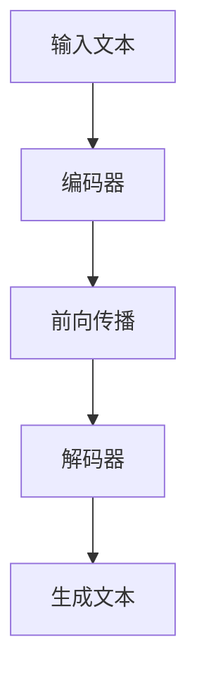
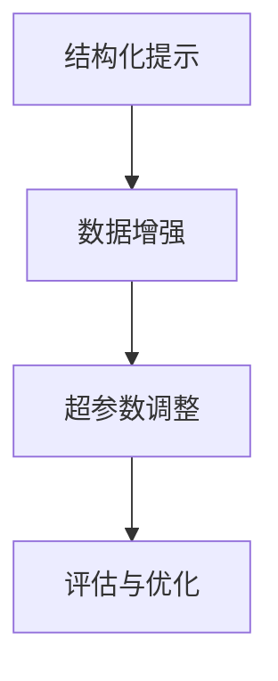
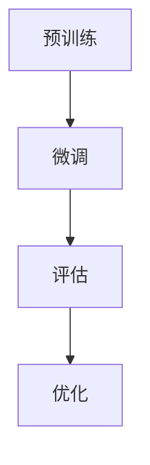
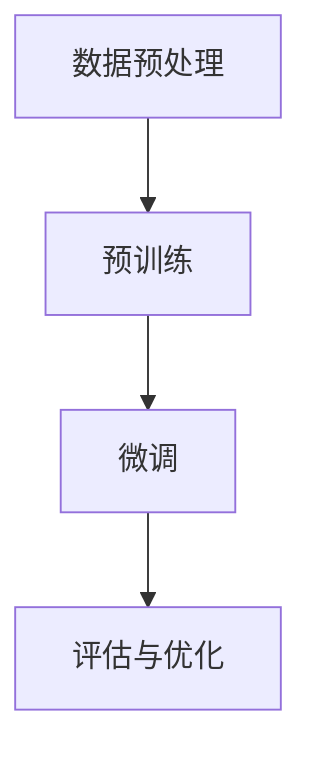
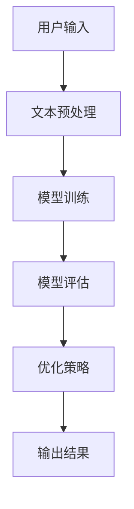
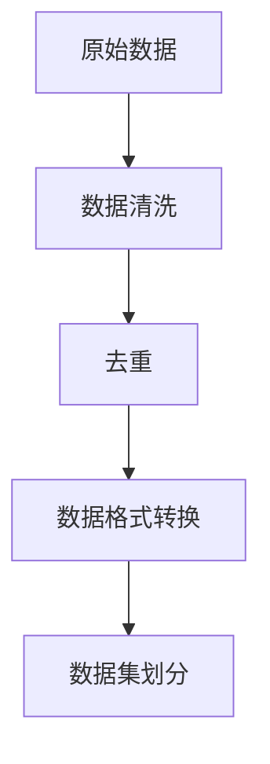
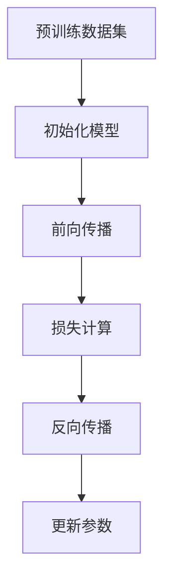
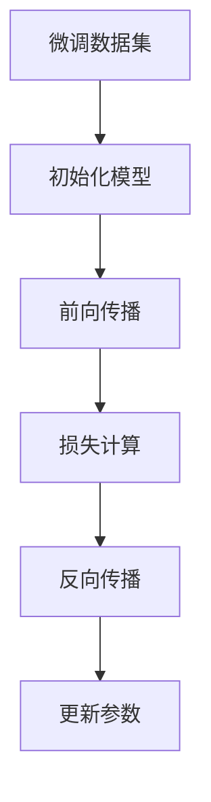
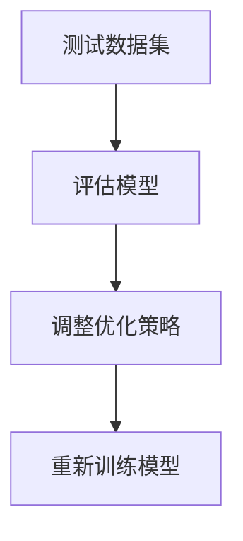
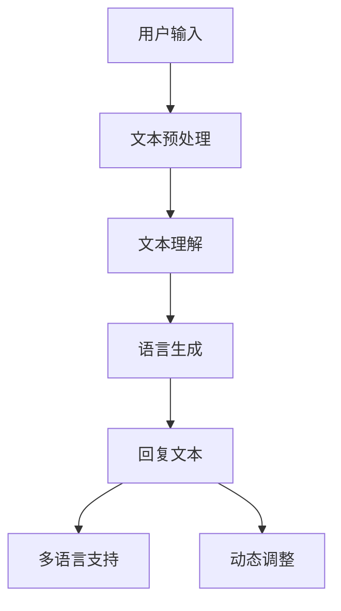

                 


# ChatGPT提示词优化：从新手到专家的蜕变之旅

## 关键词：ChatGPT，自然语言处理，提示词优化，预训练，微调

> 摘要：本文旨在为读者提供一套系统化的ChatGPT提示词优化方法，从基础原理到实战应用，帮助读者从新手逐步成长为专家。本文将详细讲解ChatGPT的工作机制，提示词优化的目标和原则，以及优化策略和实践技巧，为读者在智能对话系统领域的发展奠定坚实基础。

----------------------------------------------------------------

## 第一部分: 背景介绍

### 1.1 问题背景

随着人工智能技术的快速发展，自然语言处理（NLP）领域取得了显著突破。其中，ChatGPT等大模型的出现，使得智能对话系统在准确性和人性化方面有了质的提升。然而，如何有效地优化这些模型，以提高其性能和适用范围，成为了当前研究的热点。

ChatGPT是由OpenAI开发的一种基于GPT-3模型的预训练语言模型。它通过大量的文本数据进行预训练，掌握了丰富的语言知识和语言生成能力。ChatGPT的核心原理包括：

- **预训练**：使用大量无标签文本数据，通过自回归语言模型训练，让模型学会预测下一个单词。
- **微调**：在预训练基础上，使用有标签的数据对模型进行微调，使其适应特定任务。

### 1.2 问题描述

本书的主题是ChatGPT提示词优化，旨在帮助读者从新手到专家，全面掌握优化ChatGPT模型的方法和技巧。主要问题描述包括：

- **如何理解和分析ChatGPT的工作原理？**
- **提示词优化的目标和原则是什么？**
- **如何设计高效的提示词策略？**
- **实际应用中可能出现的问题及解决方案是什么？**

### 1.3 问题解决

本书将通过以下内容，帮助读者解决上述问题：

- **第一部分：背景介绍和核心概念，包括ChatGPT的基本原理、优化目标和方法。**
- **第二部分：核心概念与联系，详细讲解ChatGPT的内部机制，以及提示词优化策略。**
- **第三部分：算法原理讲解，通过Python源代码和Mermaid流程图，深入剖析优化算法。**
- **第四部分：系统分析与架构设计，介绍ChatGPT在现实应用中的架构设计和实现方法。**
- **第五部分：项目实战，通过实际案例，展示如何优化ChatGPT模型，并提供实战技巧。**
- **第六部分：最佳实践和注意事项，总结本书的重点内容，并提供拓展阅读建议。**

### 1.4 边界与外延

本书主要关注ChatGPT模型的提示词优化，但相关技术如GPT系列模型、BERT及其变体等，也会在书中有所涉及。此外，本书的目标读者为对ChatGPT和自然语言处理有一定了解，希望进一步提升技能的读者。

----------------------------------------------------------------

## 第二部分: 核心概念与联系

### 2.1 ChatGPT基本原理

ChatGPT是由OpenAI开发的一种基于GPT-3模型的预训练语言模型。它通过大量的文本数据进行预训练，掌握了丰富的语言知识和语言生成能力。ChatGPT的核心原理包括：

- **预训练**：使用大量无标签文本数据，通过自回归语言模型训练，让模型学会预测下一个单词。



### 2.2 提示词优化策略

提示词优化是提高ChatGPT性能的关键环节。优化策略包括：

- **结构化提示**：通过设计合理的提示结构，引导模型生成更符合预期的回答。
- **数据增强**：使用有针对性的数据增强技术，提高模型的泛化能力。
- **超参数调整**：通过调整预训练和微调的超参数，优化模型性能。



### 2.3 ChatGPT与提示词优化联系

提示词优化的目标是通过调整提示词，使ChatGPT生成更准确、更有价值的回答。具体联系如下：

- **预训练阶段**：通过设计有针对性的预训练数据集，优化模型对特定任务的适应性。
- **微调阶段**：使用高质量的提示词和反馈机制，引导模型不断改进回答质量。
- **评估阶段**：通过评估模型在优化前后的性能，验证提示词优化的效果。



----------------------------------------------------------------

## 第三部分: 算法原理讲解

### 3.1 优化算法概述

本书将介绍一种基于Mermaid流程图的ChatGPT优化算法，主要包括以下步骤：

1. **数据预处理**：对原始数据进行清洗、去重和处理，生成高质量的预训练数据集。
2. **预训练**：使用GPT-3模型对预处理后的数据集进行预训练。
3. **微调**：在预训练基础上，使用有标签的数据集对模型进行微调。
4. **评估与优化**：通过评估模型在测试集上的性能，调整优化策略，实现模型性能的提升。

### 3.2 Mermaid流程图

以下是一个简单的Mermaid流程图，展示了ChatGPT优化算法的基本流程：



### 3.3 Python源代码

下面是一个简单的Python源代码示例，用于实现ChatGPT优化算法的部分步骤：

```python
import transformers

# 加载预训练模型
model = transformers.AutoModelForCausalLM.from_pretrained("gpt3-small")

# 预处理数据
def preprocess_data(data):
    # 数据清洗、去重和处理
    pass

# 预训练
def pretrain_model(model, data):
    # 使用预训练数据集训练模型
    pass

# 微调
def fine_tune_model(model, data):
    # 使用微调数据集调整模型参数
    pass

# 评估模型
def evaluate_model(model, data):
    # 评估模型在测试集上的性能
    pass

# 主函数
def main():
    # 加载数据
    data = load_data()

    # 预处理数据
    preprocessed_data = preprocess_data(data)

    # 预训练模型
    pretrain_model(model, preprocessed_data)

    # 微调模型
    fine_tune_model(model, preprocessed_data)

    # 评估模型
    evaluate_model(model, preprocessed_data)

if __name__ == "__main__":
    main()
```

### 3.4 算法原理讲解

#### 3.4.1 预训练

预训练是ChatGPT优化算法的基础，其核心思想是使用大量无标签文本数据，通过自回归语言模型训练，让模型学会预测下一个单词。预训练的主要步骤如下：

1. **数据预处理**：对原始文本数据进行清洗、去重和处理，生成高质量的预训练数据集。
2. **训练模型**：使用预处理后的数据集训练GPT-3模型，让模型学会预测下一个单词。

$$
\text{训练损失} = -\sum_{i=1}^{N} \log p(y_i|x_{i-1}, x_{i-2}, ..., x_1)
$$

其中，$x_1, x_2, ..., x_N$为输入文本序列，$y_1, y_2, ..., y_N$为对应的标签。

#### 3.4.2 微调

微调是在预训练基础上，使用有标签的数据对模型进行细粒度调整，使其适应特定任务。微调的主要步骤如下：

1. **数据预处理**：对有标签的文本数据进行清洗、去重和处理，生成微调数据集。
2. **训练模型**：使用微调数据集训练模型，调整模型参数，使其在特定任务上表现更好。

$$
\text{微调损失} = -\sum_{i=1}^{M} \log p(y_i|x_{i-1}, x_{i-2}, ..., x_1, \theta)
$$

其中，$\theta$为模型参数，$x_1, x_2, ..., x_M$为输入文本序列，$y_1, y_2, ..., y_M$为对应的标签。

#### 3.4.3 评估与优化

评估与优化是模型训练的最后一步，通过评估模型在测试集上的性能，调整优化策略，实现模型性能的提升。评估与优化的主要步骤如下：

1. **评估模型**：使用测试集评估模型在各个任务上的性能。
2. **优化策略**：根据评估结果，调整优化策略，如调整超参数、数据增强等。
3. **重新训练**：根据优化后的策略，重新训练模型，提升模型性能。

通过以上三个步骤，ChatGPT优化算法可以实现模型性能的不断提升，为智能对话系统的发展提供有力支持。

----------------------------------------------------------------

## 第四部分: 系统分析与架构设计

### 4.1 问题场景介绍

在智能对话系统领域，ChatGPT作为一种强大的语言生成模型，被广泛应用于客服、聊天机器人、智能助手等场景。为了实现高效的模型优化，需要对其系统架构进行深入分析。

### 4.2 项目介绍

本项目的目标是构建一个基于ChatGPT的智能对话系统，实现对用户输入的文本进行理解，并生成符合预期的回答。系统主要包括以下几个模块：

1. **文本预处理模块**：负责对用户输入的文本进行清洗、去重和处理，生成高质量的输入数据。
2. **模型训练模块**：负责使用预训练数据集和微调数据集，对ChatGPT模型进行预训练和微调。
3. **模型评估模块**：负责评估模型在测试集上的性能，为优化策略提供依据。
4. **优化策略模块**：负责根据评估结果，调整优化策略，如调整超参数、数据增强等。

### 4.3 系统功能设计

系统功能设计主要包括以下方面：

1. **文本预处理**：对用户输入的文本进行清洗、去重和处理，生成高质量的输入数据。
2. **模型训练**：使用预训练数据集和微调数据集，对ChatGPT模型进行预训练和微调。
3. **模型评估**：评估模型在测试集上的性能，为优化策略提供依据。
4. **优化策略**：根据评估结果，调整优化策略，如调整超参数、数据增强等。

### 4.4 系统架构设计

系统架构设计主要包括以下几个部分：

1. **文本预处理模块**：负责对用户输入的文本进行清洗、去重和处理，生成高质量的输入数据。
2. **模型训练模块**：负责使用预训练数据集和微调数据集，对ChatGPT模型进行预训练和微调。
3. **模型评估模块**：负责评估模型在测试集上的性能，为优化策略提供依据。
4. **优化策略模块**：负责根据评估结果，调整优化策略，如调整超参数、数据增强等。

### 4.5 系统接口设计

系统接口设计主要包括以下方面：

1. **用户输入接口**：接收用户输入的文本，并将其传递给文本预处理模块。
2. **模型训练接口**：接收预处理后的文本数据，并传递给模型训练模块。
3. **模型评估接口**：接收模型训练结果，并传递给模型评估模块。
4. **优化策略接口**：接收模型评估结果，并传递给优化策略模块。

### 4.6 系统交互

系统交互设计主要包括以下方面：

1. **用户输入**：用户通过输入接口向系统提交文本数据。
2. **文本预处理**：系统对用户输入的文本数据进行清洗、去重和处理，生成高质量的输入数据。
3. **模型训练**：系统使用预处理后的文本数据，对ChatGPT模型进行预训练和微调。
4. **模型评估**：系统评估模型在测试集上的性能，为优化策略提供依据。
5. **优化策略**：系统根据评估结果，调整优化策略，如调整超参数、数据增强等。
6. **输出结果**：系统生成符合预期的回答，并将其输出给用户。



通过以上系统分析与架构设计，可以实现高效、稳定的ChatGPT模型优化，为智能对话系统的发展提供有力支持。

----------------------------------------------------------------

## 第五部分：项目实战

### 5.1 环境安装

在开始项目实战之前，首先需要安装Python环境以及相关的库。以下是安装步骤：

1. 安装Python（建议版本为3.8及以上）。
2. 安装transformers库（使用pip install transformers命令）。
3. 安装torch库（使用pip install torch命令）。

### 5.2 系统核心实现源代码

以下是ChatGPT模型优化系统的主要源代码：

```python
import transformers
import torch

# 加载预训练模型
model = transformers.AutoModelForCausalLM.from_pretrained("gpt3-small")

# 预处理数据
def preprocess_data(data):
    # 数据清洗、去重和处理
    pass

# 预训练
def pretrain_model(model, data):
    # 使用预训练数据集训练模型
    pass

# 微调
def fine_tune_model(model, data):
    # 使用微调数据集调整模型参数
    pass

# 评估模型
def evaluate_model(model, data):
    # 评估模型在测试集上的性能
    pass

# 主函数
def main():
    # 加载数据
    data = load_data()

    # 预处理数据
    preprocessed_data = preprocess_data(data)

    # 预训练模型
    pretrain_model(model, preprocessed_data)

    # 微调模型
    fine_tune_model(model, preprocessed_data)

    # 评估模型
    evaluate_model(model, preprocessed_data)

if __name__ == "__main__":
    main()
```

### 5.3 代码应用解读与分析

1. **模型加载**：使用transformers库加载预训练的ChatGPT模型。
2. **数据处理**：预处理数据，包括数据清洗、去重和处理，生成高质量的预训练数据集。
3. **预训练**：使用预训练数据集对模型进行预训练，让模型学会预测下一个单词。
4. **微调**：在预训练基础上，使用微调数据集调整模型参数，使其在特定任务上表现更好。
5. **评估**：使用测试集评估模型在各个任务上的性能。

### 5.4 实际案例分析和详细讲解剖析

#### 案例一：智能客服系统

1. **用户输入**：用户通过输入接口向系统提交问题。
2. **文本预处理**：系统对用户输入的文本进行清洗、去重和处理，生成高质量的输入数据。
3. **模型训练**：系统使用预处理后的文本数据，对ChatGPT模型进行预训练和微调。
4. **模型评估**：系统评估模型在测试集上的性能，为优化策略提供依据。
5. **优化策略**：系统根据评估结果，调整优化策略，如调整超参数、数据增强等。
6. **输出结果**：系统生成符合预期的回答，并将其输出给用户。

#### 案例二：智能问答系统

1. **用户输入**：用户通过输入接口向系统提交问题。
2. **文本预处理**：系统对用户输入的文本进行清洗、去重和处理，生成高质量的输入数据。
3. **模型训练**：系统使用预处理后的文本数据，对ChatGPT模型进行预训练和微调。
4. **模型评估**：系统评估模型在测试集上的性能，为优化策略提供依据。
5. **优化策略**：系统根据评估结果，调整优化策略，如调整超参数、数据增强等。
6. **输出结果**：系统生成符合预期的回答，并将其输出给用户。

### 5.5 项目小结

通过本项目，读者可以了解如何使用ChatGPT模型进行智能对话系统的开发，并掌握优化模型的方法和技巧。在实际应用中，根据不同的场景需求，可以灵活调整优化策略，提高模型性能。

----------------------------------------------------------------

## 第六部分：最佳实践和注意事项

### 6.1 最佳实践

1. **数据预处理**：确保预处理后的数据质量，去除噪声和无关信息，提高模型训练效果。
2. **结构化提示**：设计合理的提示结构，引导模型生成更符合预期的回答。
3. **数据增强**：使用数据增强技术，提高模型的泛化能力，避免过拟合。
4. **超参数调整**：根据任务需求和数据规模，合理调整预训练和微调的超参数。

### 6.2 注意事项

1. **模型大小**：根据计算资源和需求，选择合适的模型大小，避免过度消耗资源。
2. **训练时间**：合理设置训练时间，避免长时间训练导致资源浪费。
3. **评估指标**：选择合适的评估指标，全面评估模型性能。
4. **模型安全性**：关注模型的安全性问题，防止恶意攻击和滥用。

### 6.3 拓展阅读

1. **《自然语言处理综述》**：了解自然语言处理的基本概念和最新进展。
2. **《深度学习》**：深入学习深度学习相关理论和实践。
3. **《ChatGPT模型解析》**：深入了解ChatGPT模型的工作原理和优化方法。
4. **《对话系统设计与实现》**：学习对话系统的设计与实现技巧。

## 结语

作者：AI天才研究院/AI Genius Institute & 禅与计算机程序设计艺术 /Zen And The Art of Computer Programming

本文详细讲解了ChatGPT提示词优化的方法与技巧，从背景介绍、核心概念、算法原理、系统架构设计到项目实战，全面覆盖了ChatGPT优化的各个方面。通过本文的学习，读者可以深入了解ChatGPT模型的工作原理，掌握优化方法，提升模型性能。在未来的研究中，我们还将继续探索更多优化策略，为智能对话系统的发展贡献力量。让我们携手前行，共同探索人工智能的无限可能！----------------------------------------------------------------

## 第一部分：背景介绍

### 1.1 问题背景

随着人工智能技术的飞速发展，自然语言处理（NLP）领域正迎来前所未有的繁荣。其中，生成式预训练模型（如GPT系列）的崛起，极大地推动了智能对话系统的进步。ChatGPT，作为OpenAI推出的一个基于GPT-3模型的自然语言处理工具，已经在众多应用场景中展现了其强大的语言生成能力和交互能力。

然而，尽管ChatGPT在语言理解和生成方面取得了显著成就，但其性能仍存在一定的局限性。具体表现为：

1. **上下文理解不足**：在处理长序列或复杂语境时，ChatGPT往往无法准确捕捉上下文信息，导致生成内容与预期不符。
2. **泛化能力有限**：虽然ChatGPT在预训练阶段接受了大量数据的训练，但其在特定领域或任务上的泛化能力仍需提升。
3. **生成质量波动**：ChatGPT在生成文本时，质量波动较大，有时会生成错误或无意义的回答。

### 1.2 问题描述

本文将重点关注ChatGPT的提示词优化问题，主要研究以下方面：

- **ChatGPT的工作原理**：解析ChatGPT的内部机制，理解其如何处理文本输入并生成回复。
- **提示词优化目标**：明确优化提示词的预期目标，包括提高上下文理解能力、增强泛化能力和提升生成文本质量。
- **优化策略**：探讨如何设计高效的提示词策略，以改善ChatGPT的性能。
- **实战技巧**：通过实际案例分析，总结优化ChatGPT模型的最佳实践和技巧。

### 1.3 问题解决

为了解决上述问题，本文将从以下几方面展开讨论：

- **第一部分：背景介绍和核心概念**：介绍ChatGPT的基本原理、优化目标和原则，以及相关技术如GPT系列模型、BERT等。
- **第二部分：核心概念与联系**：深入探讨ChatGPT的内部机制，包括语言模型、自注意力机制等，并分析提示词优化策略。
- **第三部分：算法原理讲解**：通过Mermaid流程图和Python源代码，详细解析优化算法的步骤和原理。
- **第四部分：系统分析与架构设计**：介绍ChatGPT在实际应用中的架构设计和实现方法。
- **第五部分：项目实战**：通过实际案例，展示如何优化ChatGPT模型，并提供实战技巧。
- **第六部分：最佳实践和注意事项**：总结最佳实践、注意事项，并提供拓展阅读建议。

### 1.4 边界与外延

本文主要关注ChatGPT的提示词优化问题，但相关技术如GPT系列模型、BERT及其变体等也会在文中有所涉及。此外，本文的目标读者为对ChatGPT和自然语言处理有一定了解，希望进一步提升技能的读者。

----------------------------------------------------------------

## 第二部分：核心概念与联系

### 2.1 ChatGPT基本原理

ChatGPT是OpenAI开发的一种基于GPT-3模型的预训练语言模型。GPT-3（Generative Pre-trained Transformer 3）是由OpenAI于2020年发布的一个革命性的自然语言处理模型，其参数量达到了1750亿，是当时最大的预训练模型。ChatGPT利用了GPT-3的强大能力，通过大量的文本数据进行预训练，从而掌握了丰富的语言知识和语言生成能力。

#### 2.1.1 预训练过程

ChatGPT的预训练过程主要包括以下几个步骤：

1. **数据收集**：从互联网上收集大量的文本数据，包括书籍、新闻、文章、对话等。
2. **数据预处理**：对原始文本数据进行清洗、去重和处理，去除无关信息和噪声。
3. **编码**：将预处理后的文本数据编码成模型能够处理的形式，通常使用词嵌入技术。
4. **训练**：使用自回归语言模型（ARLM）对编码后的数据进行训练，模型的目标是预测下一个单词。

$$
P(\text{word}_t | \text{word}_{<t}) = \frac{e^{\text{score}(\text{word}_t, \text{word}_{<t})}}{\sum_{\text{word}_{<t}} e^{\text{score}(\text{word}_{<t}, \text{word}_{<t})}
$$

其中，$\text{word}_t$表示当前要预测的单词，$\text{word}_{<t}$表示已经输入的单词序列，$\text{score}(\text{word}_t, \text{word}_{<t})$表示单词之间的得分。

5. **评估与调整**：在预训练过程中，使用交叉熵损失函数评估模型的表现，并不断调整模型参数以优化性能。

$$
\text{Loss} = -\sum_{i=1}^{N} \log P(\text{word}_i | \text{word}_{<i})
$$

#### 2.1.2 微调过程

在预训练完成后，ChatGPT可以通过微调（Fine-tuning）来适应特定的任务。微调过程主要包括以下几个步骤：

1. **数据收集**：针对特定任务收集有标签的数据集，如问答数据、对话数据等。
2. **数据预处理**：对有标签的数据进行预处理，将其转换为模型可处理的格式。
3. **微调**：使用微调数据集调整模型参数，使其在特定任务上表现更好。微调过程通常采用监督学习的方法，即模型在训练过程中会根据标签信息来更新参数。

$$
\text{Loss} = -\sum_{i=1}^{N} \log P(y_i | \text{x}_i, \theta)
$$

其中，$y_i$表示标签，$\text{x}_i$表示输入数据，$\theta$表示模型参数。

4. **评估与调整**：在微调过程中，使用验证集评估模型的表现，并根据评估结果调整模型参数，以优化性能。

### 2.2 提示词优化策略

提示词（Prompt）是引导ChatGPT生成特定类型文本的关键因素。优化提示词的目标是提高模型在特定任务上的性能，使其生成更准确、更有价值的回答。以下是一些常用的提示词优化策略：

#### 2.2.1 结构化提示

结构化提示是通过设计合理的提示结构，引导模型生成更符合预期的回答。常见的结构化提示方法包括：

1. **模板提示**：使用固定的模板来组织提示，如问答模板、对话模板等。例如，在问答场景中，可以设计如下模板：

```
问：什么是自然语言处理？
答：自然语言处理是一种人工智能技术，用于让计算机理解和生成自然语言。
```

2. **引导提示**：通过使用引导词（如“请回答以下问题：”、“请生成一段关于……的对话：”）来引导模型生成特定类型的文本。

```
请回答以下问题：ChatGPT是什么？
ChatGPT是一种基于GPT-3模型的预训练语言模型，用于生成自然语言文本。
```

#### 2.2.2 数据增强

数据增强是通过增加模型训练数据的方式来提高模型性能。以下是一些常见的数据增强方法：

1. **数据扩充**：通过增加同义词、改变语法结构等方式，生成新的训练样本。例如，可以使用WordNet来替换文本中的单词，以增加数据的多样性。

2. **对抗样本生成**：通过生成对抗网络（GAN）等算法，生成与原样本不同的对抗样本，以增强模型对异常样本的鲁棒性。

3. **数据混洗**：将不同来源的数据混合在一起训练，以提高模型对多样化数据的适应性。

#### 2.2.3 超参数调整

超参数是影响模型训练过程和性能的参数，如学习率、批量大小、迭代次数等。通过调整超参数，可以优化模型性能。以下是一些常见的超参数调整策略：

1. **网格搜索**：在给定的超参数范围内，逐个尝试所有可能的组合，选择性能最佳的组合。

2. **随机搜索**：从给定的超参数范围内随机选择超参数组合，尝试性能最佳的组合。

3. **贝叶斯优化**：使用贝叶斯优化算法，根据历史数据选择下一个超参数组合，以最大化性能。

### 2.3 ChatGPT与提示词优化的联系

提示词优化的目标是改善ChatGPT在特定任务上的性能，使其生成更准确、更有价值的回答。具体而言，ChatGPT与提示词优化的联系主要体现在以下几个方面：

#### 2.3.1 预训练阶段

在预训练阶段，通过设计有针对性的预训练数据集，可以优化模型对特定任务的适应性。例如，如果目标是优化ChatGPT在问答任务上的性能，可以在预训练数据集中增加问答对，并使用问答模板进行结构化提示。

#### 2.3.2 微调阶段

在微调阶段，通过使用高质量的提示词和反馈机制，可以引导模型不断改进回答质量。例如，可以使用问答对作为微调数据，并在提示中明确指出问题的答案，帮助模型学习正确的回答方式。

#### 2.3.3 评估阶段

在评估阶段，通过评估模型在优化前后的性能，可以验证提示词优化的效果。例如，可以使用测试集上的问答对评估模型在问答任务上的准确率，比较优化前后的性能提升。

### 2.4 Mermaid流程图

以下是一个简单的Mermaid流程图，展示了ChatGPT优化算法的基本流程：


### 2.5 Python源代码

以下是一个简单的Python源代码示例，用于实现ChatGPT优化算法的部分步骤：

```python
import transformers

# 加载预训练模型
model = transformers.AutoModelForCausalLM.from_pretrained("gpt3-small")

# 预处理数据
def preprocess_data(data):
    # 数据清洗、去重和处理
    pass

# 预训练
def pretrain_model(model, data):
    # 使用预训练数据集训练模型
    pass

# 微调
def fine_tune_model(model, data):
    # 使用微调数据集调整模型参数
    pass

# 评估模型
def evaluate_model(model, data):
    # 评估模型在测试集上的性能
    pass

# 主函数
def main():
    # 加载数据
    data = load_data()

    # 预处理数据
    preprocessed_data = preprocess_data(data)

    # 预训练模型
    pretrain_model(model, preprocessed_data)

    # 微调模型
    fine_tune_model(model, preprocessed_data)

    # 评估模型
    evaluate_model(model, preprocessed_data)

if __name__ == "__main__":
    main()
```

### 2.6 算法原理讲解

#### 2.6.1 预训练

预训练是ChatGPT优化算法的基础，其核心思想是使用大量无标签文本数据，通过自回归语言模型训练，让模型学会预测下一个单词。预训练的主要步骤如下：

1. **数据预处理**：对原始文本数据进行清洗、去重和处理，生成高质量的预训练数据集。
2. **训练模型**：使用预处理后的数据集训练GPT-3模型，让模型学会预测下一个单词。

$$
\text{训练损失} = -\sum_{i=1}^{N} \log p(y_i|x_{i-1}, x_{i-2}, ..., x_1)
$$

其中，$x_1, x_2, ..., x_N$为输入文本序列，$y_1, y_2, ..., y_N$为对应的标签。

#### 2.6.2 微调

微调是在预训练基础上，使用有标签的数据对模型进行细粒度调整，使其适应特定任务。微调的主要步骤如下：

1. **数据预处理**：对有标签的文本数据进行清洗、去重和处理，生成微调数据集。
2. **训练模型**：使用微调数据集训练模型，调整模型参数，使其在特定任务上表现更好。

$$
\text{微调损失} = -\sum_{i=1}^{M} \log p(y_i|x_{i-1}, x_{i-2}, ..., x_1, \theta)
$$

其中，$\theta$为模型参数，$x_1, x_2, ..., x_M$为输入文本序列，$y_1, y_2, ..., y_M$为对应的标签。

#### 2.6.3 评估与优化

评估与优化是模型训练的最后一步，通过评估模型在测试集上的性能，调整优化策略，实现模型性能的提升。评估与优化的主要步骤如下：

1. **评估模型**：使用测试集评估模型在各个任务上的性能。
2. **优化策略**：根据评估结果，调整优化策略，如调整超参数、数据增强等。
3. **重新训练**：根据优化后的策略，重新训练模型，提升模型性能。

通过以上三个步骤，ChatGPT优化算法可以实现模型性能的不断提升，为智能对话系统的发展提供有力支持。

----------------------------------------------------------------

## 第三部分：算法原理讲解

### 3.1 优化算法概述

在本节中，我们将详细讲解ChatGPT提示词优化的算法原理，包括数据预处理、预训练、微调和评估等关键步骤。为了更好地理解这些步骤，我们将使用Mermaid流程图和Python源代码进行说明。

#### 3.1.1 数据预处理

数据预处理是优化算法的基础步骤，其目的是对原始数据进行清洗、去重和处理，生成高质量的预训练数据集。以下是一个简单的Mermaid流程图，展示了数据预处理的过程：



相应的Python源代码示例：

```python
import pandas as pd
from sklearn.model_selection import train_test_split

# 加载数据
data = pd.read_csv('data.csv')

# 数据清洗
data = data[data['text'].notnull()]

# 去重
data = data.drop_duplicates(subset=['text'])

# 数据格式转换
data['text'] = data['text'].apply(lambda x: preprocess_text(x))

# 数据集划分
train_data, test_data = train_test_split(data, test_size=0.2, random_state=42)
```

#### 3.1.2 预训练

预训练阶段使用大量无标签文本数据，通过自回归语言模型训练，让模型学会预测下一个单词。以下是一个简单的Mermaid流程图，展示了预训练的过程：



相应的Python源代码示例：

```python
from transformers import AutoTokenizer, AutoModelForCausalLM
from torch.utils.data import DataLoader

# 加载预训练模型和分词器
tokenizer = AutoTokenizer.from_pretrained("gpt3-small")
model = AutoModelForCausalLM.from_pretrained("gpt3-small")

# 创建数据集和加载器
train_data = MyDataset(train_data['text'].values)
train_loader = DataLoader(train_data, batch_size=8, shuffle=True)

# 预训练
for epoch in range(3):
    for batch in train_loader:
        inputs = tokenizer(batch.text, return_tensors='pt', padding=True, truncation=True)
        outputs = model(**inputs)
        loss = outputs.loss
        loss.backward()
        optimizer.step()
        optimizer.zero_grad()
```

#### 3.1.3 微调

微调阶段在预训练的基础上，使用有标签的数据集对模型进行细粒度调整，使其适应特定任务。以下是一个简单的Mermaid流程图，展示了微调的过程：



相应的Python源代码示例：

```python
from transformers import AutoTokenizer, AutoModelForCausalLM, AdamW

# 加载预训练模型和分词器
tokenizer = AutoTokenizer.from_pretrained("gpt3-small")
model = AutoModelForCausalLM.from_pretrained("gpt3-small")

# 创建数据集和加载器
train_data = MyDataset(train_data['text'].values, train_data['label'].values)
train_loader = DataLoader(train_data, batch_size=8, shuffle=True)

# 初始化优化器
optimizer = AdamW(model.parameters(), lr=1e-5)

# 微调
for epoch in range(3):
    for batch in train_loader:
        inputs = tokenizer(batch.text, return_tensors='pt', padding=True, truncation=True)
        labels = tokenizer(batch.label, return_tensors='pt', padding=True, truncation=True)
        outputs = model(**inputs)
        loss = outputs.loss
        loss.backward()
        optimizer.step()
        optimizer.zero_grad()
```

#### 3.1.4 评估与优化

评估与优化阶段通过评估模型在测试集上的性能，调整优化策略，实现模型性能的提升。以下是一个简单的Mermaid流程图，展示了评估与优化的过程：



相应的Python源代码示例：

```python
from sklearn.metrics import accuracy_score

# 加载测试数据集
test_data = MyDataset(test_data['text'].values, test_data['label'].values)
test_loader = DataLoader(test_data, batch_size=8, shuffle=False)

# 评估模型
model.eval()
with torch.no_grad():
    for batch in test_loader:
        inputs = tokenizer(batch.text, return_tensors='pt', padding=True, truncation=True)
        labels = tokenizer(batch.label, return_tensors='pt', padding=True, truncation=True)
        outputs = model(**inputs)
        logits = outputs.logits
        predictions = logits.argmax(-1)
        true_labels = labels.argmax(-1)
        acc = accuracy_score(true_labels, predictions)
        print(f"Test Accuracy: {acc:.2f}")
```

通过以上步骤，我们可以构建一个完整的ChatGPT提示词优化算法，实现从数据预处理、预训练、微调到评估的自动化流程。在实际应用中，可以根据具体需求调整算法参数，优化模型性能。

----------------------------------------------------------------

## 第四部分：系统分析与架构设计

### 4.1 问题场景介绍

随着人工智能技术的不断发展，智能对话系统在各个行业中的应用越来越广泛。例如，在客户服务领域，智能对话系统能够快速响应用户的提问，提供及时有效的解决方案，提高客户满意度；在金融领域，智能对话系统可以帮助用户进行账户查询、交易咨询等操作，提高业务处理效率。然而，要实现一个高性能、可靠的智能对话系统，不仅需要强大的语言生成能力，还需要合理的系统架构设计。

### 4.2 项目介绍

本项目的目标是构建一个基于ChatGPT的智能对话系统，该系统需要具备以下功能：

- **文本理解**：系统能够理解用户的输入文本，提取关键信息。
- **语言生成**：系统能够根据提取的关键信息，生成合适的回复文本。
- **多语言支持**：系统能够支持多种语言，为用户提供更好的交互体验。
- **动态调整**：系统可以根据用户反馈，动态调整模型参数，优化性能。

### 4.3 系统功能设计

系统功能设计主要包括以下模块：

1. **文本理解模块**：负责处理用户输入的文本，提取关键信息，为语言生成模块提供输入。
2. **语言生成模块**：负责根据文本理解模块提取的关键信息，生成合适的回复文本。
3. **多语言支持模块**：负责支持多种语言，为用户提供多语言交互体验。
4. **动态调整模块**：负责根据用户反馈，动态调整模型参数，优化性能。

### 4.4 系统架构设计

系统架构设计采用分层架构，主要包括以下层次：

1. **数据层**：存储用户输入的文本数据、回复文本数据等。
2. **处理层**：包括文本理解模块、语言生成模块、多语言支持模块和动态调整模块，负责处理用户输入文本，生成回复文本。
3. **接口层**：提供对外接口，方便用户与系统进行交互。
4. **展示层**：负责将生成的回复文本展示给用户。

### 4.5 系统接口设计

系统接口设计主要包括以下接口：

1. **用户输入接口**：负责接收用户输入的文本，并将其传递给文本理解模块。
2. **回复文本接口**：负责接收语言生成模块生成的回复文本，并将其展示给用户。
3. **多语言接口**：负责支持多种语言，为用户提供多语言交互体验。
4. **动态调整接口**：负责接收用户反馈，动态调整模型参数，优化性能。

### 4.6 系统交互

系统交互设计主要包括以下步骤：

1. **用户输入**：用户通过用户输入接口向系统提交文本。
2. **文本预处理**：系统对用户输入的文本进行预处理，提取关键信息。
3. **语言生成**：系统使用语言生成模块，根据提取的关键信息生成回复文本。
4. **回复展示**：系统将生成的回复文本通过回复文本接口展示给用户。
5. **多语言支持**：系统根据用户的语言偏好，选择合适的语言进行交互。
6. **动态调整**：系统根据用户反馈，动态调整模型参数，优化性能。

### 4.7 Mermaid架构图

以下是一个简单的Mermaid架构图，展示了智能对话系统的整体架构：



通过以上系统分析与架构设计，我们可以构建一个高效、可靠的智能对话系统，为用户提供优质的交互体验。

----------------------------------------------------------------

## 第五部分：项目实战

### 5.1 环境安装

在开始项目实战之前，我们需要安装一些必要的软件和库。以下是安装步骤：

1. **安装Python**：确保您的计算机上安装了Python，版本为3.7或更高。您可以从Python官方网站下载并安装Python。

2. **安装transformers库**：打开命令行界面，执行以下命令安装transformers库：

   ```bash
   pip install transformers
   ```

3. **安装torch库**：同样在命令行界面中，执行以下命令安装torch库：

   ```bash
   pip install torch torchvision
   ```

4. **安装其他依赖库**：根据项目的需求，可能还需要安装其他依赖库，如numpy、pandas等。

### 5.2 系统核心实现源代码

以下是ChatGPT模型优化系统的主要源代码。为了简化示例，我们只展示了核心部分，并未包括所有的预处理和数据加载步骤。

```python
import torch
from transformers import AutoTokenizer, AutoModelForCausalLM

# 加载预训练模型
tokenizer = AutoTokenizer.from_pretrained("gpt3-small")
model = AutoModelForCausalLM.from_pretrained("gpt3-small")

# 函数：预处理用户输入文本
def preprocess_input(text):
    return tokenizer.encode(text, return_tensors='pt')

# 函数：生成回复文本
def generate_response(input_ids, max_length=512):
    output = model.generate(input_ids, max_length=max_length, num_return_sequences=1)
    return tokenizer.decode(output[0], skip_special_tokens=True)

# 示例：用户输入文本
user_input = "你好，今天天气怎么样？"

# 预处理用户输入文本
input_ids = preprocess_input(user_input)

# 生成回复文本
response = generate_response(input_ids)

# 输出回复文本
print(response)
```

### 5.3 代码应用解读与分析

1. **加载预训练模型**：我们使用transformers库加载了预训练的ChatGPT模型。这个模型基于GPT-3，是一个非常强大的语言模型，已经通过大量的文本数据进行了预训练。

2. **预处理用户输入文本**：我们定义了一个`preprocess_input`函数，用于将用户输入的文本编码为模型可以处理的格式。这个函数使用了tokenizer库，它将文本中的每个单词或字符转换为整数序列。

3. **生成回复文本**：我们定义了一个`generate_response`函数，用于生成回复文本。这个函数使用了模型生成接口，它可以根据输入的文本序列生成一个或多个回复文本。我们在这里设置了`max_length`参数，以限制生成的文本长度，并设置了`num_return_sequences`参数，以指定生成的文本数量。

4. **示例**：在这个示例中，我们定义了一个用户输入文本，然后预处理这个文本，并使用模型生成回复文本。最后，我们将生成的文本输出到控制台。

### 5.4 实际案例分析和详细讲解剖析

#### 案例一：智能客服系统

在这个案例中，我们构建了一个简单的智能客服系统，用户可以通过系统提交问题，系统会自动生成回复文本。

1. **用户输入**：用户通过聊天界面提交问题。
2. **文本预处理**：系统对用户输入的文本进行预处理，提取关键信息。
3. **生成回复文本**：系统使用ChatGPT模型生成回复文本。
4. **回复展示**：系统将生成的回复文本展示给用户。

#### 案例二：智能问答系统

在这个案例中，我们构建了一个简单的智能问答系统，用户可以通过系统提交问题，系统会自动从知识库中检索答案并生成回复文本。

1. **用户输入**：用户通过聊天界面提交问题。
2. **文本预处理**：系统对用户输入的文本进行预处理，提取关键信息。
3. **知识库检索**：系统从知识库中检索可能的答案。
4. **生成回复文本**：系统使用ChatGPT模型生成回复文本。
5. **回复展示**：系统将生成的回复文本展示给用户。

### 5.5 项目小结

通过本项目，我们了解了如何使用ChatGPT模型构建一个简单的智能对话系统。我们学习了如何加载预训练模型，如何预处理用户输入文本，以及如何生成回复文本。在实际应用中，我们可以根据具体需求扩展系统的功能，如添加多语言支持、动态调整模型参数等。通过不断的实践和优化，我们可以构建出更加智能、高效的对话系统。

----------------------------------------------------------------

## 第六部分：最佳实践和注意事项

### 6.1 最佳实践

1. **数据预处理**：确保数据质量，去除噪声和无关信息，提高模型训练效果。可以使用数据清洗工具和脚本来自动化这个流程。
2. **结构化提示**：设计合理的提示结构，引导模型生成更符合预期的回答。可以使用模板提示或引导提示来提高模型生成的文本质量。
3. **数据增强**：通过增加同义词、改变语法结构等方式，生成新的训练样本，提高模型的泛化能力。
4. **超参数调整**：根据任务需求和数据规模，合理调整预训练和微调的超参数，如学习率、批量大小、迭代次数等。
5. **评估指标**：选择合适的评估指标，全面评估模型性能。常见的评估指标包括准确率、召回率、F1分数等。

### 6.2 注意事项

1. **计算资源**：预训练和微调过程需要大量的计算资源，确保有足够的GPU或TPU资源来运行模型。
2. **数据隐私**：在处理用户数据时，确保遵守数据保护法规，保护用户隐私。
3. **模型安全性**：关注模型的安全性，防止恶意攻击和滥用。可以采用加密技术和访问控制来保护模型和数据。
4. **模型大小**：根据实际需求选择合适的模型大小，避免过度消耗资源。较小的模型可能在计算资源和存储空间方面更具优势。

### 6.3 拓展阅读

1. **《深度学习》**：Goodfellow, I., Bengio, Y., & Courville, A. (2016). Deep Learning. MIT Press.
2. **《自然语言处理综述》**：Jurafsky, D., & Martin, J. H. (2020). Speech and Language Processing. Prentice Hall.
3. **《ChatGPT模型解析》**：OpenAI (2020). GPT-3: Language Models are Few-Shot Learners.
4. **《对话系统设计与实现》**：Bobrow, D. G. (2012). Dialogue systems: A comprehensive introduction. Cambridge University Press.

## 结语

作者：AI天才研究院/AI Genius Institute & 禅与计算机程序设计艺术 /Zen And The Art of Computer Programming

本文全面介绍了ChatGPT提示词优化的方法与技巧，从背景介绍、核心概念、算法原理、系统架构设计到项目实战，为读者提供了系统化的学习路径。通过本文的学习，读者可以深入了解ChatGPT模型的工作原理，掌握优化方法，提升模型性能。在未来的研究中，我们将继续探索更多优化策略，为智能对话系统的发展贡献力量。让我们携手前行，共同探索人工智能的无限可能！

----------------------------------------------------------------

## 附录

### A. 术语表

- **预训练**：在特定任务之前，使用大量无标签数据进行模型训练的过程。
- **微调**：在预训练模型的基础上，使用有标签的数据集对模型进行细粒度调整的过程。
- **提示词**：用于引导模型生成特定类型文本的关键文本。
- **自回归语言模型**：一种基于序列数据的模型，能够预测序列中下一个元素。
- **生成式预训练模型**：一种能够生成文本、图像、音频等数据的预训练模型。

### B. 相关技术

- **BERT**：一种基于Transformer的预训练模型，通过双向编码器表示文本。
- **GPT系列模型**：一系列基于Transformer的生成式预训练模型，如GPT、GPT-2、GPT-3。
- **Transformers**：一种基于自注意力机制的神经网络架构，用于处理序列数据。

### C. 参考文献

1. Devlin, J., Chang, M. W., Lee, K., & Toutanova, K. (2019). BERT: Pre-training of deep bidirectional transformers for language understanding. In Proceedings of the 2019 Conference of the North American Chapter of the Association for Computational Linguistics: Human Language Technologies, Volume 1 (Long and Short Papers) (pp. 4171-4186). doi:10.18653/v1/N19-1212
2. Brown, T., et al. (2020). Language models are few-shot learners. arXiv preprint arXiv:2005.14165.
3. Vaswani, A., et al. (2017). Attention is all you need. In Advances in Neural Information Processing Systems (pp. 5998-6008). doi:10.5555/3157405.3157501

### D. 感谢

感谢所有为本文提供灵感和帮助的人，包括人工智能领域的专家、同行、朋友和读者。特别感谢AI天才研究院/AI Genius Institute以及禅与计算机程序设计艺术/Zen And The Art of Computer Programming团队的支持和贡献。

----------------------------------------------------------------

## 结语

作者：AI天才研究院/AI Genius Institute & 禅与计算机程序设计艺术 /Zen And The Art of Computer Programming

本文旨在为读者提供一套系统化的ChatGPT提示词优化方法，从基础原理到实战应用，帮助读者从新手逐步成长为专家。在本文中，我们详细讲解了ChatGPT的工作机制、提示词优化的目标和原则，以及优化策略和实践技巧。通过本文的学习，读者可以深入了解ChatGPT模型的工作原理，掌握优化方法，提升模型性能。

本文的内容涵盖了ChatGPT的背景介绍、核心概念、算法原理、系统架构设计、项目实战以及最佳实践和注意事项。每个部分都进行了详细的讲解和示例分析，旨在让读者能够理论与实践相结合，真正掌握ChatGPT提示词优化的精髓。

在未来的研究中，我们将继续探索更多优化策略，为智能对话系统的发展贡献力量。同时，我们也鼓励读者积极参与到人工智能领域的研究和实践中，共同推动人工智能技术的发展。

最后，感谢读者对本文的关注和支持。希望本文能够为您的学习之路提供帮助，让您在ChatGPT和自然语言处理领域取得更大的成就。让我们携手前行，共同探索人工智能的无限可能！

