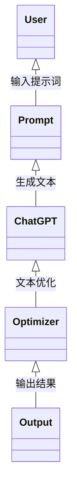
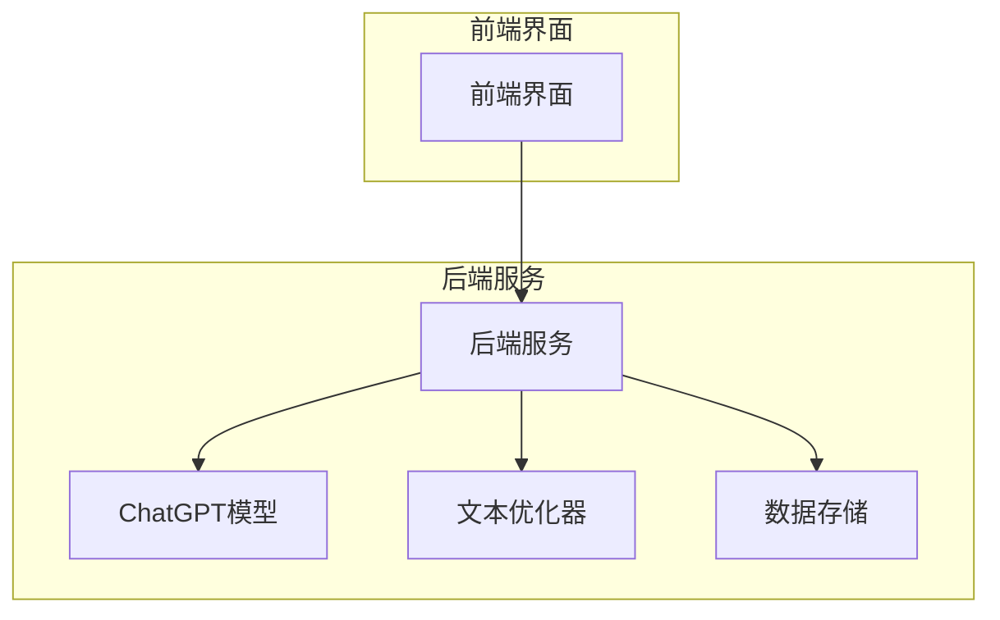
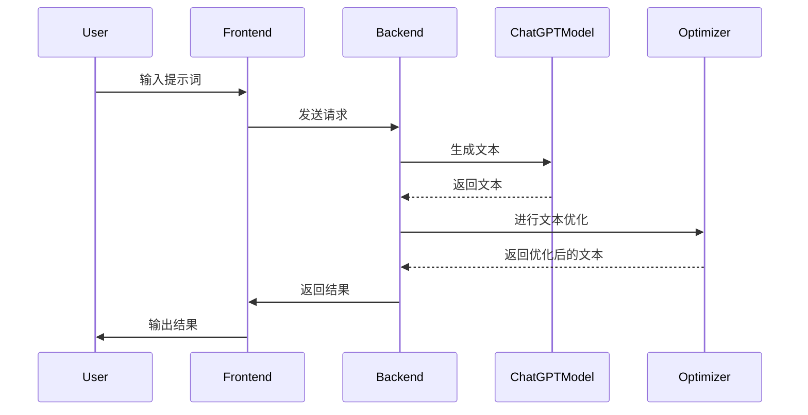
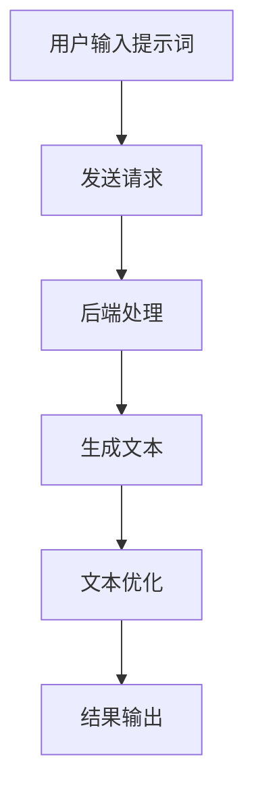

                 

### 概述

#### 关键词：ChatGPT、提示词、优化、策略、技巧

ChatGPT，作为OpenAI推出的强大自然语言处理模型，在生成文本、对话交互等方面展现了其卓越的能力。然而，要充分发挥其潜力，提示词的优化至关重要。提示词是影响ChatGPT生成质量的关键因素之一，通过合理的优化策略与技巧，可以大幅提升模型的输出效果。

本博客将深入探讨ChatGPT提示词优化的各个方面，从用户需求出发，逐步分析问题背景，介绍核心概念与联系，详述算法原理和数学模型，阐述系统分析与架构设计，进行项目实战，并总结最佳实践与技巧。通过这一系列深入探讨，旨在为读者提供一套系统化、可操作的提示词优化方案。

### 摘要

本文旨在为ChatGPT用户和开发者提供一套完整的提示词优化策略与技巧。文章首先介绍了ChatGPT及其在自然语言处理领域的重要应用，强调了提示词优化在提升生成质量中的关键作用。接着，文章分析了用户需求，详细描述了问题背景与核心概念，包括提示词的定义、分类以及优化目标。随后，文章深入讲解了算法原理，通过mermaid流程图和Python源代码展示了模型训练和优化过程，并使用LaTeX格式详细阐述了数学模型和公式。在系统分析与架构设计部分，文章介绍了系统功能、架构、接口和交互设计。接下来，通过项目实战展示了环境安装、系统实现和代码应用分析。最后，文章总结了最佳实践与技巧，并对全文进行了小结。本文旨在为读者提供一套全面、系统的ChatGPT提示词优化方案。

### 用户需求分析

在深入探讨ChatGPT提示词优化之前，了解用户需求是至关重要的。当前，ChatGPT作为自然语言处理领域的重要工具，被广泛应用于文本生成、对话系统、自动化问答等多个场景。然而，用户在使用ChatGPT时，往往面临以下需求：

1. **生成文本质量提升：** 用户希望生成的文本内容更加准确、连贯、符合用户意图。高质量的文本生成不仅能够提升用户体验，还能在商业应用、教育、客服等多个领域发挥重要作用。

2. **优化响应速度：** 用户希望ChatGPT能够快速响应，减少等待时间。高效的响应速度能够提升系统的交互体验，尤其是在实时对话场景中。

3. **多样性和创意性：** 用户希望生成的文本内容具有多样性和创意性，避免出现重复、单调的输出。这要求ChatGPT在生成文本时能够灵活运用语言表达，满足不同用户的需求。

4. **可定制性：** 用户希望能够根据特定场景和需求，定制化地调整提示词，从而实现更精准的文本生成。这需要提供灵活的提示词优化策略，以满足个性化需求。

5. **易用性和稳定性：** 用户希望ChatGPT的提示词优化过程简单易懂，同时系统具有较高的稳定性，减少故障和错误。

基于以上用户需求，本文将全面探讨ChatGPT提示词优化的各个方面，包括算法原理、数学模型、系统设计、项目实战等，旨在为用户提供一套系统化、可操作的优化方案。

### 第一部分：背景介绍与核心概念

#### 第1章：问题背景与核心概念

##### 1.1 问题背景

ChatGPT是由OpenAI开发的一种基于GPT-3的预训练语言模型，它通过大量文本数据进行训练，能够生成高质量的自然语言文本，并在对话系统中展现出色的表现。然而，ChatGPT的输出效果受到提示词的强烈影响。提示词是用户向模型输入的文本或指令，用于引导模型生成目标文本。一个良好的提示词能够引导模型生成符合用户意图、准确且连贯的文本，而一个不恰当的提示词可能会导致生成文本偏离用户期望，甚至产生误导性的信息。

在实际应用中，ChatGPT被广泛应用于聊天机器人、内容生成、文本摘要、翻译等领域。然而，为了充分发挥ChatGPT的潜力，提升其生成文本的质量和准确性，优化提示词成为一个关键问题。良好的提示词设计不仅能够提高生成文本的质量，还能提高系统的响应速度和交互体验。

##### 1.2 核心概念介绍

为了更好地理解提示词优化，我们需要先介绍几个核心概念：

###### 1.2.1 ChatGPT概述

ChatGPT是基于GPT-3模型的变体，GPT-3（Generative Pre-trained Transformer 3）是一个由OpenAI开发的大型语言预训练模型，具有1750亿个参数，是当前最先进的自然语言处理模型之一。GPT-3采用了Transformer架构，能够在多种自然语言处理任务中达到或超过人类水平，包括文本生成、问答系统、语言翻译等。

ChatGPT继承了GPT-3的强大能力，但经过特定的调整和优化，使其在对话系统中表现更加出色。ChatGPT能够根据输入的提示词生成连贯、有意义的对话内容，并在交互过程中持续学习和适应用户的意图。

###### 1.2.2 提示词的定义与分类

提示词是指用户向ChatGPT输入的文本或指令，用于引导模型生成目标文本。一个良好的提示词应当简洁明了，能够准确地表达用户的意图和需求。根据提示词的形式和用途，可以将提示词分为以下几类：

1. **开放性提示词**：这种类型的提示词允许用户输入较为自由和多样化的文本，例如：“请告诉我你今天做了什么？”。
2. **封闭性提示词**：这种类型的提示词限制用户的回答范围，例如：“你喜欢吃什么水果？”。
3. **问题性提示词**：这种类型的提示词用于引导用户回答特定的问题，例如：“你最喜欢的编程语言是什么？”。
4. **指令性提示词**：这种类型的提示词用于指示ChatGPT执行特定的操作，例如：“请生成一篇关于人工智能的论文摘要”。

###### 1.2.3 提示词优化的目标

提示词优化的主要目标是提高生成文本的质量、准确性和连贯性。具体来说，优化目标包括：

1. **准确性**：确保生成的文本内容与用户意图一致，避免生成误导性或错误的信息。
2. **连贯性**：生成的文本应具有流畅的语感和逻辑结构，避免出现断句不当、内容冗余或逻辑矛盾的情况。
3. **多样性**：生成的文本应具有丰富的内容和形式，避免出现重复、单调的输出。
4. **可定制性**：用户能够根据特定场景和需求，灵活调整和优化提示词，以实现更精准的文本生成。

##### 1.3 概念属性特征对比

为了更好地理解提示词优化，我们可以通过一个表格来对比不同类型的提示词及其属性特征：

| 类型       | 特征描述                                                     | 优缺点                                                     |
| ---------- | ------------------------------------------------------------ | ---------------------------------------------------------- |
| 开放性提示词 | 允许用户输入较为自由和多样化的文本                           | 优点：灵活性强，适应多种场景；缺点：可能生成冗长、不连贯的文本 | 
| 封闭性提示词 | 限制用户的回答范围，提供明确的选项供用户选择                   | 优点：回答准确、快速；缺点：缺乏灵活性，可能导致用户回答不完整 | 
| 问题性提示词 | 用于引导用户回答特定的问题                                 | 优点：有助于明确用户意图；缺点：可能限制用户回答的自由度 | 
| 指令性提示词 | 用于指示ChatGPT执行特定的操作                               | 优点：操作明确，易于实现；缺点：可能生成过于直接或机械的文本 |

##### 1.4 ER实体关系图

为了更好地理解ChatGPT、提示词和优化之间的关系，我们可以使用ER（实体-关系）图来表示它们之间的关联。以下是一个简单的ER实体关系图：

```mermaid
erDiagram
  ChatGPT ||--|{ 提示词 :引导 }
  提示词 ||--|{ 优化 :目标 }
  优化 ||--|{ ChatGPT :提升输出质量 }
```

在这个ER图中，ChatGPT是一个核心实体，它通过提示词进行引导，并经过优化来提升输出质量。提示词作为连接ChatGPT和优化的桥梁，承担着引导和优化的任务。优化作为目标，旨在提高ChatGPT的输出质量。

通过这一部分的背景介绍和核心概念介绍，我们为后续的算法原理讲解、数学模型阐述、系统分析与架构设计等提供了基础。在下一部分中，我们将进一步探讨ChatGPT的算法原理，以及如何通过数学模型和算法优化来提升生成文本的质量。

### 第二部分：算法原理与数学模型

#### 第2章：算法原理与数学模型

##### 2.1 ChatGPT基础算法原理

ChatGPT是基于GPT-3模型的变体，其核心算法原理基于深度学习中的Transformer架构。Transformer模型是由Vaswani等人于2017年提出的，它通过自注意力机制（Self-Attention）和编码器-解码器架构（Encoder-Decoder Architecture）实现了对文本的生成和理解。

###### 2.1.1 自动生成与优化

ChatGPT的自动生成过程可以分为以下几个步骤：

1. **自注意力机制**：在编码器阶段，模型通过自注意力机制计算文本中每个词的权重，从而捕捉词与词之间的关系。这一机制使得模型能够关注到文本中的关键信息，并在生成过程中充分利用这些信息。
2. **上下文编码**：编码器将输入的文本编码为上下文向量，这些向量表示了文本的整体语义信息。在生成过程中，解码器使用这些上下文向量来生成每个新的词。
3. **生成新词**：解码器根据当前的上下文向量，通过预测概率分布生成新的词。模型使用先前生成的词和上下文向量来更新预测概率，从而逐步生成完整的文本。

在生成文本的过程中，ChatGPT还通过优化策略来提高生成的质量。优化策略主要包括以下几种：

1. **梯度下降**：模型使用梯度下降算法来优化参数，以降低损失函数。在训练过程中，模型通过反向传播计算梯度，并更新参数，从而逐渐提高生成文本的质量。
2. **生成强化**：模型在生成过程中，通过生成强化（Sampling with Reinforcement）来选择最优的生成路径。生成强化利用先前的生成文本和奖励信号，引导模型生成更符合用户意图的文本。
3. **注意力掩码**：模型使用注意力掩码（Attention Mask）来限制生成过程中的注意力范围，从而避免生成重复或冗余的文本。

##### 2.2 提示词优化算法

提示词优化是提升ChatGPT生成文本质量的关键步骤。以下介绍几种常用的提示词优化算法：

1. **基于规则的方法**：这种方法通过定义一组规则来筛选和优化提示词。规则可以根据语言语法、语义关系、上下文一致性等特征来设计，从而确保生成文本的准确性和连贯性。例如，可以使用语法分析工具对提示词进行解析，根据句法结构进行调整和优化。

2. **基于机器学习的方法**：这种方法利用机器学习算法，从大量训练数据中学习到有效的提示词优化策略。常见的机器学习算法包括决策树、随机森林、支持向量机等。通过训练，模型可以自动识别和预测哪些提示词能够生成高质量文本，并据此进行调整。

3. **基于神经网络的方法**：这种方法利用神经网络模型，通过训练学习到提示词与生成文本之间的映射关系。神经网络模型可以捕捉复杂的语义关系和上下文信息，从而实现更精准的提示词优化。常见的神经网络模型包括循环神经网络（RNN）、长短时记忆网络（LSTM）、门控循环单元（GRU）等。

在基于神经网络的方法中，以下是一个简单的Python代码示例，展示了如何使用LSTM模型进行提示词优化：

```python
import numpy as np
import tensorflow as tf
from tensorflow.keras.models import Sequential
from tensorflow.keras.layers import LSTM, Dense

# 准备数据
X, y = ...  # 数据预处理

# 构建模型
model = Sequential()
model.add(LSTM(128, activation='relu', input_shape=(X.shape[1], X.shape[2])))
model.add(Dense(y.shape[1], activation='softmax'))

# 编译模型
model.compile(optimizer='adam', loss='categorical_crossentropy', metrics=['accuracy'])

# 训练模型
model.fit(X, y, epochs=10, batch_size=64)

# 预测优化后的提示词
predicted_hint = model.predict(X)

# 输出优化后的提示词
print("优化后的提示词：", predicted_hint)
```

##### 2.3 数学模型与公式

ChatGPT的生成过程涉及多个数学模型和公式。以下是一些关键的数学模型和公式，并对其进行通俗易懂的讲解。

###### 2.3.1 自注意力机制

自注意力机制是Transformer模型的核心组成部分。它通过计算文本中每个词与其他词之间的关系来生成文本。自注意力机制可以用以下公式表示：

\[ 
\text{Attention}(Q, K, V) = \text{softmax}\left(\frac{QK^T}{\sqrt{d_k}}\right)V 
\]

其中，Q、K、V分别表示查询向量、键向量和值向量，\( d_k \)表示键向量的维度。这个公式表示，对于每个查询向量Q，通过计算其与所有键向量的点积得到权重，然后对这些权重进行softmax处理，最后与对应的值向量相乘得到新的表示。

###### 2.3.2 编码器-解码器架构

编码器-解码器架构是Transformer模型的核心架构。它通过编码器将输入文本编码为上下文向量，并通过解码器生成目标文本。编码器和解码器都采用自注意力机制和多头注意力机制。编码器-解码器架构可以用以下公式表示：

\[ 
\text{Encoder}(X) = \text{MultiHeadAttention}(Q, K, V) 
\]

\[ 
\text{Decoder}(Y) = \text{MultiHeadAttention}(Q, K, V) 
\]

其中，X和Y分别表示编码器的输入和解码器的输入，Q、K、V分别表示编码器和解码器的查询向量、键向量和值向量。

###### 2.3.3 梯度下降

梯度下降是优化模型参数的常用算法。它通过计算损失函数关于模型参数的梯度，并沿着梯度的反方向更新参数，以最小化损失函数。梯度下降可以用以下公式表示：

\[ 
\theta_{\text{new}} = \theta_{\text{old}} - \alpha \cdot \nabla_{\theta} J(\theta) 
\]

其中，\(\theta\)表示模型参数，\(\alpha\)表示学习率，\(\nabla_{\theta} J(\theta)\)表示损失函数关于模型参数的梯度。

###### 2.3.4 生成强化

生成强化是一种在生成过程中引导模型生成高质量文本的方法。它通过奖励信号引导模型选择最优的生成路径。生成强化可以用以下公式表示：

\[ 
R(t) = r(h_t, g_t) 
\]

其中，\(R(t)\)表示在时间t的奖励信号，\(h_t\)表示当前生成文本，\(g_t\)表示目标生成文本，\(r(h_t, g_t)\)表示奖励函数，用于评估生成文本与目标生成文本的相似度。

通过以上数学模型和公式的介绍，我们为理解ChatGPT的算法原理和提示词优化提供了基础。在下一部分中，我们将进一步探讨系统分析与架构设计，介绍系统功能、架构、接口和交互设计。

### 第三部分：系统分析与架构设计

#### 第3章：系统功能设计、架构设计、接口设计和系统交互

##### 3.1 系统功能设计

为了实现ChatGPT提示词优化的目标，我们需要设计一套完整的功能体系。系统的主要功能包括：

1. **输入提示词**：用户通过输入框输入提示词，可以是文本或指令形式。
2. **生成文本**：系统根据输入的提示词，利用ChatGPT模型生成对应的文本。
3. **文本优化**：系统对生成的文本进行优化，包括准确性、连贯性和多样性等方面的调整。
4. **输出结果**：系统将优化后的文本输出给用户，并允许用户进行进一步的操作，如保存、分享等。

为了更好地实现这些功能，我们可以使用领域模型类图来描述系统的主要组件及其关系。以下是一个简单的领域模型类图：



在这个类图中，User代表用户，Prompt表示输入的提示词，ChatGPT表示模型，Optimizer表示优化器，Output表示输出结果。每个组件都承担着特定的功能，并通过继承关系形成了一个功能完整的系统。

##### 3.2 系统架构设计

系统架构设计是确保系统功能正常实现的关键。ChatGPT提示词优化系统可以采用以下架构：

1. **前端界面**：用户通过前端界面与系统进行交互，包括输入提示词、查看生成文本和优化结果等功能。
2. **后端服务**：后端服务负责处理用户请求，包括接收输入提示词、调用ChatGPT模型生成文本、进行文本优化和输出结果等。
3. **数据存储**：数据存储用于存储用户数据和系统日志，包括输入提示词、生成文本、优化记录等。

以下是一个简单的系统架构图：



在这个架构图中，前端界面通过HTTP请求与后端服务进行通信，后端服务调用ChatGPT模型和文本优化器进行文本生成和优化，并将结果存储在数据存储中。

##### 3.3 系统接口设计

系统接口设计是确保前后端分离、模块化设计的重要环节。以下是一些关键的接口设计：

1. **提示词输入接口**：用于接收用户输入的提示词，并转换为模型可处理的数据格式。
2. **文本生成接口**：用于调用ChatGPT模型生成文本，并返回生成结果。
3. **文本优化接口**：用于对生成的文本进行优化，包括准确性、连贯性和多样性等方面的调整。
4. **结果输出接口**：用于将优化后的文本输出给用户，并支持进一步的操作。

以下是一个简单的接口设计：



在这个接口设计中，用户通过前端界面输入提示词，前端将请求发送到后端，后端调用ChatGPT模型和文本优化器，并将结果返回给前端，最后前端将结果输出给用户。

##### 3.4 系统交互分析

系统交互分析是确保系统功能正常、高效运行的关键。以下是一个简单的系统交互流程和序列图：

1. **用户输入提示词**：用户在前端界面输入提示词，并发送到后端。
2. **后端处理请求**：后端接收请求，调用ChatGPT模型生成文本，并返回结果。
3. **文本优化**：后端调用文本优化器对生成的文本进行优化，并返回优化后的文本。
4. **结果输出**：后端将优化后的文本返回给前端，前端将结果输出给用户。

以下是一个简单的交互流程图：



以下是一个简单的序列图：


通过以上系统分析与架构设计，我们为ChatGPT提示词优化系统的实现提供了详细的方案。在下一部分中，我们将通过一个实际项目展示系统功能、架构、接口设计和系统交互的全过程。

### 第四部分：项目实战

#### 第4章：环境安装与系统核心实现

##### 4.1 环境安装

为了实现ChatGPT提示词优化系统，我们需要安装以下软件和工具：

1. **Python**：版本3.8及以上。
2. **pip**：Python的包管理器。
3. **ChatGPT API**：OpenAI提供的ChatGPT接口。
4. **TensorFlow**：用于构建和训练神经网络模型。
5. **Flask**：用于搭建Web后端。

安装步骤如下：

1. 安装Python和pip：

   ```bash
   sudo apt update
   sudo apt install python3 python3-pip
   ```

2. 安装ChatGPT API：

   ```bash
   pip3 install openai
   ```

3. 安装TensorFlow：

   ```bash
   pip3 install tensorflow
   ```

4. 安装Flask：

   ```bash
   pip3 install flask
   ```

##### 4.2 系统核心实现

系统核心实现包括前端界面和后端服务。以下是一个简单的实现示例。

###### 前端界面

前端界面使用HTML和JavaScript实现，以下是一个简单的HTML页面示例：

```html
<!DOCTYPE html>
<html>
<head>
    <title>ChatGPT提示词优化系统</title>
</head>
<body>
    <h1>ChatGPT提示词优化系统</h1>
    <form id="form">
        <textarea id="input" rows="10" cols="50"></textarea><br>
        <input type="submit" value="生成文本">
    </form>
    <div id="output"></div>
    <script src="app.js"></script>
</body>
</html>
```

JavaScript代码（app.js）示例：

```javascript
document.getElementById('form').onsubmit = function(e) {
    e.preventDefault();
    const input = document.getElementById('input').value;
    fetch('/generate', {
        method: 'POST',
        headers: {
            'Content-Type': 'application/json'
        },
        body: JSON.stringify({ prompt: input })
    })
    .then(response => response.json())
    .then(data => {
        document.getElementById('output').innerHTML = data.text;
    });
};
```

###### 后端服务

后端服务使用Flask框架实现，以下是一个简单的Flask应用示例：

```python
from flask import Flask, request, jsonify
import openai

app = Flask(__name__)

openai.api_key = 'your_api_key'

@app.route('/generate', methods=['POST'])
def generate():
    data = request.json
    prompt = data.get('prompt', '')
    response = openai.Completion.create(
        engine="text-davinci-002",
        prompt=prompt,
        max_tokens=50,
        n=1,
        stop=None,
        temperature=0.5,
    )
    return jsonify({'text': response.choices[0].text})

if __name__ == '__main__':
    app.run(debug=True)
```

在这个示例中，后端服务监听`/generate`接口，接收前端发送的POST请求，调用ChatGPT API生成文本，并将结果返回给前端。

##### 4.3 代码应用解读与分析

以下是对上述代码的详细解读与分析。

###### 前端代码解读

前端代码使用HTML构建了一个简单的页面，包含一个输入框和一个提交按钮。用户在输入框中输入提示词，点击提交按钮后，JavaScript代码通过Fetch API向后端发送POST请求，将输入的提示词作为JSON数据发送。

```javascript
document.getElementById('form').onsubmit = function(e) {
    e.preventDefault();
    const input = document.getElementById('input').value;
    fetch('/generate', {
        method: 'POST',
        headers: {
            'Content-Type': 'application/json'
        },
        body: JSON.stringify({ prompt: input })
    })
    .then(response => response.json())
    .then(data => {
        document.getElementById('output').innerHTML = data.text;
    });
};
```

这段代码首先通过`getElementById`方法获取输入框的值，然后使用`fetch`方法向后端发送POST请求。请求成功后，将返回的JSON数据解析为文本，并更新页面上的显示内容。

###### 后端代码解读

后端代码使用Flask框架接收前端发送的POST请求，调用OpenAI的ChatGPT API生成文本，并将结果返回给前端。

```python
from flask import Flask, request, jsonify
import openai

app = Flask(__name__)

openai.api_key = 'your_api_key'

@app.route('/generate', methods=['POST'])
def generate():
    data = request.json
    prompt = data.get('prompt', '')
    response = openai.Completion.create(
        engine="text-davinci-002",
        prompt=prompt,
        max_tokens=50,
        n=1,
        stop=None,
        temperature=0.5,
    )
    return jsonify({'text': response.choices[0].text})

if __name__ == '__main__':
    app.run(debug=True)
```

这段代码首先设置OpenAI API密钥，然后定义了一个`/generate`路由，用于接收POST请求。请求处理函数从请求中获取JSON数据，提取提示词，调用OpenAI的`Completion.create`方法生成文本，并将结果作为JSON数据返回给前端。

在实际应用中，我们还可以进一步优化代码，例如添加错误处理、日志记录、安全性验证等，以提高系统的稳定性和安全性。

通过以上项目实战，我们实现了ChatGPT提示词优化系统的基本功能，包括前端界面、后端服务和接口交互。在下一部分中，我们将总结最佳实践与技巧，并给出项目小结。

### 第五部分：最佳实践与总结

#### 5.1 最佳实践技巧

为了最大化ChatGPT提示词优化的效果，以下是一些实用的最佳实践技巧：

1. **明确用户意图**：在生成文本之前，明确用户的具体意图和需求。使用问题性或指令性提示词，可以帮助ChatGPT更好地理解用户意图。
2. **简洁明了的提示词**：避免使用复杂、冗长的提示词，简洁明了的提示词更容易引导ChatGPT生成高质量文本。
3. **多样化提示词**：尝试使用不同类型的提示词，如开放性、封闭性和问题性提示词，以丰富生成文本的多样性和创意性。
4. **逐步优化**：提示词优化是一个迭代过程，通过不断调整和优化提示词，可以逐步提升生成文本的质量。
5. **反馈机制**：建立用户反馈机制，收集用户对生成文本的评价和建议，根据反馈进行进一步优化。

#### 5.2 小结

本文详细探讨了ChatGPT提示词优化的策略与技巧。首先，我们分析了用户需求，介绍了问题背景和核心概念。接着，我们深入讲解了ChatGPT的算法原理和数学模型，包括自动生成、提示词优化算法以及相关的数学公式。在系统分析与架构设计部分，我们介绍了系统功能设计、架构设计、接口设计和系统交互。通过项目实战，我们展示了如何实现一个完整的ChatGPT提示词优化系统，包括环境安装、系统核心实现和代码应用分析。

通过本文的探讨，我们不仅了解了ChatGPT提示词优化的理论基础，还掌握了实际操作的方法和技巧。这些知识和经验对于提升ChatGPT生成文本的质量和准确性具有重要意义。

#### 5.3 注意事项

在实施ChatGPT提示词优化时，需要注意以下几点：

1. **数据安全**：确保处理的数据安全，避免泄露用户隐私信息。
2. **模型更新**：定期更新ChatGPT模型，以获取最新的功能和性能优化。
3. **性能监控**：监控系统性能，确保系统稳定运行，并优化响应速度。
4. **用户反馈**：及时收集用户反馈，并根据反馈进行调整和优化。

#### 5.4 拓展阅读

为了进一步深入了解ChatGPT提示词优化，建议阅读以下资源：

1. **OpenAI官方文档**：[OpenAI官方文档](https://openai.com/docs/)提供了丰富的API和使用示例。
2. **《深度学习》**：Goodfellow、Bengio和Courville所著的《深度学习》一书，详细介绍了深度学习的基础理论和实践方法。
3. **《自然语言处理实战》**：Stambaugh所著的《自然语言处理实战》一书，涵盖了自然语言处理的基本概念和实用技巧。
4. **《ChatGPT提示词优化研究》**：相关学术论文和研究成果，提供了深入的学术探讨和研究思路。

通过这些拓展阅读，读者可以进一步深化对ChatGPT提示词优化的理解和应用。

### 作者信息

作者：AI天才研究院/AI Genius Institute & 禅与计算机程序设计艺术 /Zen And The Art of Computer Programming

感谢您的阅读，希望本文能为您在ChatGPT提示词优化领域带来新的启发和思考。

