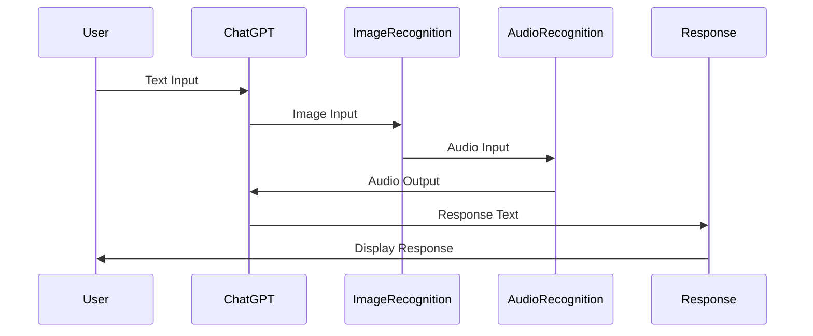

                 

# 《ChatGPT提示词工程：处理多模态上下文理解》

## 关键词
- ChatGPT
- 提示词工程
- 多模态上下文理解
- 自然语言处理
- 人工智能

## 摘要
本文旨在探讨如何为ChatGPT等大型语言模型设计有效的提示词，以及如何处理多模态上下文理解。我们将从ChatGPT与自然语言处理的基本概念出发，逐步深入到多模态上下文理解的设计原则、实践方法，并结合实际案例进行详细剖析，最终总结最佳实践，展望未来趋势。

## 第一部分：ChatGPT与自然语言处理

### 第1章：ChatGPT简介
ChatGPT是由OpenAI开发的一种基于变换器架构的预训练语言模型，它通过大量的文本数据进行训练，掌握了丰富的语言知识和规律。ChatGPT能够在多种场景下生成连贯、自然的文本，广泛应用于问答系统、对话机器人等领域。在本章中，我们将介绍ChatGPT的基本原理、架构和特点。

#### 1.1 ChatGPT简介
ChatGPT是一种基于变换器（Transformer）架构的预训练语言模型，其核心思想是将输入的文本序列转化为向量，然后通过多层变换器网络进行编码和解码，最终生成输出文本。ChatGPT的架构包括编码器和解码器两个部分，其中编码器负责将输入文本序列编码为向量，解码器则负责生成输出文本。

#### 1.2 自然语言处理基础
自然语言处理（Natural Language Processing，NLP）是人工智能领域的一个重要分支，旨在使计算机能够理解、处理和生成人类语言。NLP涉及文本预处理、词向量表示、语言模型、句法分析、语义理解等多个方面。在本章中，我们将介绍NLP的基本概念和技术。

#### 1.3 ChatGPT在自然语言处理中的应用
ChatGPT在自然语言处理领域具有广泛的应用，包括文本生成、对话系统、机器翻译、情感分析等。在本章中，我们将通过具体案例展示ChatGPT在自然语言处理中的应用，并分析其优势和不足。

### 第2章：多模态上下文理解
多模态上下文理解是指模型能够同时处理多种类型的输入数据（如图像、音频、文本等），并在这些数据之间建立关联，从而更好地理解用户的意图和需求。在本章中，我们将探讨多模态上下文理解的概念、方法和挑战。

#### 2.1 多模态数据概述
多模态数据是指包含多种类型数据的数据集，如图像、音频、文本等。多模态数据的处理需要考虑数据类型、数据格式、数据预处理等多个方面。

#### 2.2 多模态数据融合
多模态数据融合是指将多种类型的数据进行整合，以获得更丰富的特征信息。多模态数据融合的方法包括特征级融合、决策级融合和模型级融合等。

#### 2.3 多模态上下文理解挑战与解决方案
多模态上下文理解面临诸多挑战，如数据不平衡、特征提取、模型训练等。在本章中，我们将介绍多模态上下文理解的主要挑战和相应的解决方案。

## 第二部分：设计有效的提示词

### 第3章：设计有效的提示词
提示词（Prompt）是影响ChatGPT生成文本质量的关键因素。一个优秀的提示词能够引导模型生成更符合预期的文本。在本章中，我们将探讨如何设计有效的提示词。

#### 3.1 提示词概述
提示词是提供给ChatGPT的输入文本，用于引导模型生成目标文本。提示词的设计需要考虑文本内容、格式、长度等多个方面。

#### 3.2 提示词设计原则
提示词的设计原则包括简洁明了、目标明确、内容相关、情境适宜等。在本章中，我们将详细阐述这些设计原则。

#### 3.3 提示词案例分析
在本章中，我们将通过具体案例展示如何设计有效的提示词，并分析其效果和不足。

## 第三部分：多模态上下文中的提示词工程

### 第4章：多模态上下文中的提示词工程
在多模态上下文中，提示词的设计和优化变得尤为重要。本章将介绍如何在多模态上下文中设计有效的提示词，以及如何对提示词进行优化。

#### 4.1 多模态上下文的挑战
多模态上下文中的提示词设计面临诸多挑战，如数据多样性、特征不一致等。

#### 4.2 多模态提示词策略
针对多模态上下文中的挑战，本章将介绍一些有效的提示词策略。

#### 4.3 多模态上下文下的提示词优化
多模态上下文下的提示词优化包括提示词长度、内容、格式等方面的优化。

## 第四部分：ChatGPT提示词工程实践

### 第5章：ChatGPT提示词工程实践
在本章中，我们将通过一个实际案例展示如何进行ChatGPT提示词工程实践。

#### 5.1 实践环境搭建
在本章中，我们将介绍如何搭建ChatGPT提示词工程实践的环境。

#### 5.2 核心代码实现
在本章中，我们将详细阐述ChatGPT提示词工程实践的核心代码实现。

#### 5.3 实际案例分析
在本章中，我们将通过具体案例展示ChatGPT提示词工程实践的实际效果。

## 第五部分：多模态上下文理解应用案例

### 第6章：多模态上下文理解应用案例
在本章中，我们将介绍几个多模态上下文理解的应用案例，并分析其效果和不足。

#### 6.1 案例一：聊天机器人
在本章中，我们将探讨如何将ChatGPT应用于聊天机器人领域。

#### 6.2 案例二：问答系统
在本章中，我们将探讨如何将ChatGPT应用于问答系统领域。

#### 6.3 案例三：文本生成
在本章中，我们将探讨如何将ChatGPT应用于文本生成领域。

## 第六部分：总结与展望

### 第7章：总结与展望
在本章中，我们将对前述内容进行总结，并展望ChatGPT提示词工程和多模态上下文理解的未来发展趋势。

#### 7.1 提示词工程的关键点
在本章中，我们将总结提示词工程的关键点，为读者提供实用的建议。

#### 7.2 多模态上下文理解未来趋势
在本章中，我们将探讨多模态上下文理解的未来发展趋势，为读者提供前瞻性的视角。

#### 7.3 总结与建议
在本章中，我们将对整本书的内容进行总结，并提出一些建议，以帮助读者更好地应用ChatGPT提示词工程和多模态上下文理解技术。

### 作者：AI天才研究院/AI Genius Institute & 禅与计算机程序设计艺术 /Zen And The Art of Computer Programming

----------------------------------------------------------------

## 第一部分：ChatGPT与自然语言处理

### 第1章：ChatGPT简介

ChatGPT是由OpenAI开发的一种基于变换器架构的预训练语言模型，它通过大量的文本数据进行训练，掌握了丰富的语言知识和规律。ChatGPT能够在多种场景下生成连贯、自然的文本，广泛应用于问答系统、对话机器人等领域。在本章中，我们将介绍ChatGPT的基本原理、架构和特点。

### 1.1 ChatGPT简介

ChatGPT是一种基于变换器（Transformer）架构的预训练语言模型，其核心思想是将输入的文本序列转化为向量，然后通过多层变换器网络进行编码和解码，最终生成输出文本。ChatGPT的架构包括编码器和解码器两个部分，其中编码器负责将输入文本序列编码为向量，解码器则负责生成输出文本。

变换器（Transformer）是一种基于自注意力机制的深度神经网络结构，它在处理序列数据方面具有优异的性能。自注意力机制允许模型在处理每个词时，根据其他词的重要性进行自适应调整，从而提高模型的表示能力。

ChatGPT的预训练过程主要包括两个阶段：大规模数据预训练和任务特定微调。在预训练阶段，ChatGPT使用大量互联网文本数据进行自回归语言模型训练，学习语言结构和规律。在任务特定微调阶段，ChatGPT根据具体任务的需求进行模型调整，以提高任务性能。

### 1.2 自然语言处理基础

自然语言处理（Natural Language Processing，NLP）是人工智能领域的一个重要分支，旨在使计算机能够理解、处理和生成人类语言。NLP涉及文本预处理、词向量表示、语言模型、句法分析、语义理解等多个方面。

#### 文本预处理

文本预处理是NLP任务的第一步，主要包括分词、去除停用词、词形还原等操作。分词是将连续的文本划分为一系列具有独立意义的词语；去除停用词是去除对文本理解贡献较小的常见词汇；词形还原是将变体形式转换为标准形式，如将复数形式还原为单数形式。

#### 词向量表示

词向量表示是将文本中的词语转换为向量形式，以便在机器学习模型中处理。词向量表示的方法包括基于计数的方法（如Word2Vec）和基于分布的方法（如GloVe）。这些方法通过学习词语在文本中的上下文信息，为每个词语生成一个低维向量表示。

#### 语言模型

语言模型是NLP的核心组成部分，用于预测下一个词或词序列的概率。NLP中的语言模型通常采用序列模型（如循环神经网络RNN）或变换器模型（如BERT）进行训练。这些模型能够从大量的文本数据中学习到语言的统计规律，从而实现自动生成文本、机器翻译、问答系统等任务。

#### 句法分析

句法分析是NLP中的一项重要任务，旨在理解句子的结构。句法分析主要包括词性标注、句法树构建、依存句法分析等。词性标注是为每个词语标注其词性（如名词、动词、形容词等）；句法树构建是表示句子结构的树形结构；依存句法分析是分析词语之间的依存关系。

#### 语义理解

语义理解是NLP的高级任务，旨在理解文本的含义。语义理解包括实体识别、情感分析、意图识别等。实体识别是识别文本中的实体（如人名、地点、组织等）；情感分析是判断文本的情感倾向（如积极、消极、中性等）；意图识别是识别用户的意图（如查询信息、进行交易等）。

### 1.3 ChatGPT在自然语言处理中的应用

ChatGPT在自然语言处理领域具有广泛的应用，包括文本生成、对话系统、机器翻译、情感分析等。在本章中，我们将通过具体案例展示ChatGPT在自然语言处理中的应用，并分析其优势和不足。

#### 文本生成

文本生成是ChatGPT的一项重要应用，它可以生成各种类型的文本，如文章、故事、诗歌等。ChatGPT通过预训练和任务特定微调，能够生成高质量、连贯的文本。例如，在新闻文章生成方面，ChatGPT可以根据已有的新闻报道生成新的新闻文章；在故事生成方面，ChatGPT可以根据用户提供的标题或摘要生成相关的故事情节。

#### 对话系统

对话系统是ChatGPT在自然语言处理中的另一个重要应用，它可以用于构建聊天机器人、虚拟助手等。ChatGPT通过理解用户的输入，生成合适的回复文本，从而实现与用户的自然对话。例如，在客服机器人方面，ChatGPT可以自动回答用户的问题，提供相关帮助；在虚拟助手方面，ChatGPT可以根据用户的需求提供个性化的服务，如日程管理、任务提醒等。

#### 机器翻译

机器翻译是ChatGPT在自然语言处理中的又一重要应用，它可以实现不同语言之间的自动翻译。ChatGPT通过预训练和任务特定微调，能够学习到不同语言之间的翻译规律，从而实现高质量的机器翻译。例如，ChatGPT可以支持中文到英文、英文到中文的翻译，以及其他多种语言的翻译。

#### 情感分析

情感分析是ChatGPT在自然语言处理中的另一个应用，它可以用于判断文本的情感倾向。ChatGPT通过预训练和任务特定微调，能够学习到情感分类的规律，从而实现情感分析。例如，ChatGPT可以用于分析社交媒体上的用户评论，判断用户的情感倾向，如积极、消极、中性等。

### 1.4 ChatGPT的优势与不足

ChatGPT在自然语言处理领域具有许多优势，但也存在一些不足。

#### 优势

1. **强大的语言生成能力**：ChatGPT通过预训练和任务特定微调，能够生成高质量、连贯的文本，适用于各种自然语言处理任务。

2. **广泛的适用性**：ChatGPT可以在多种场景下应用，如文本生成、对话系统、机器翻译、情感分析等。

3. **自适应能力**：ChatGPT可以根据不同的任务需求和场景进行自适应调整，以提高任务性能。

4. **良好的性能**：ChatGPT在各种自然语言处理任务上都取得了良好的性能，如文本生成、对话系统、机器翻译、情感分析等。

#### 不足

1. **数据依赖性**：ChatGPT的性能在很大程度上依赖于训练数据的质量和数量，如果训练数据存在偏差，可能会影响模型的性能。

2. **计算资源消耗**：ChatGPT的预训练和任务特定微调过程需要大量的计算资源和时间，对硬件设备的要求较高。

3. **安全性问题**：由于ChatGPT可以生成各种类型的文本，包括虚假信息、不当言论等，因此需要对其进行适当的安全控制和监管。

4. **难以理解生成的文本**：虽然ChatGPT可以生成高质量、连贯的文本，但有时难以理解其生成的文本背后的逻辑和含义。

## 第二部分：多模态上下文理解

### 第2章：多模态上下文理解

多模态上下文理解是指模型能够同时处理多种类型的输入数据（如图像、音频、文本等），并在这些数据之间建立关联，从而更好地理解用户的意图和需求。在本章中，我们将探讨多模态上下文理解的概念、方法和挑战。

### 2.1 多模态数据概述

多模态数据是指包含多种类型数据的数据集，如图像、音频、文本等。多模态数据的处理需要考虑数据类型、数据格式、数据预处理等多个方面。

#### 数据类型

多模态数据类型包括文本、图像、音频等。

- **文本**：文本数据是指以文本形式表示的信息，如句子、段落等。文本数据在自然语言处理中具有广泛的应用。
- **图像**：图像数据是指以像素形式表示的视觉信息，如照片、视频帧等。图像数据在计算机视觉中具有广泛的应用。
- **音频**：音频数据是指以声波形式表示的信息，如语音、音乐等。音频数据在语音识别、音乐生成等领域具有广泛的应用。

#### 数据格式

多模态数据格式包括JSON、XML、CSV等。

- **JSON**：JSON（JavaScript Object Notation）是一种轻量级的数据交换格式，易于阅读和编写，支持多种数据类型，如数字、字符串、数组、对象等。
- **XML**：XML（eXtensible Markup Language）是一种标记语言，用于表示结构化数据。XML具有丰富的标签和属性，可以方便地表示复杂的数据结构。
- **CSV**：CSV（Comma-Separated Values）是一种简单的文本文件格式，用于存储表格数据。CSV文件以逗号分隔数据，便于数据导入和导出。

#### 数据预处理

多模态数据的预处理是数据分析和挖掘的重要步骤，主要包括数据清洗、数据转换、特征提取等。

- **数据清洗**：数据清洗是指去除数据中的噪声和错误，提高数据质量。数据清洗的方法包括去重、去除空值、填充缺失值等。
- **数据转换**：数据转换是指将原始数据转换为适合分析和挖掘的形式。数据转换的方法包括归一化、标准化、编码等。
- **特征提取**：特征提取是指从原始数据中提取有用的信息，用于建模和预测。特征提取的方法包括词袋模型、TF-IDF、词嵌入等。

### 2.2 多模态数据融合

多模态数据融合是指将多种类型的数据进行整合，以获得更丰富的特征信息。多模态数据融合的方法包括特征级融合、决策级融合和模型级融合等。

#### 特征级融合

特征级融合是指在特征层面将不同类型的数据进行整合。特征级融合的方法包括直接融合、加权融合和组合融合等。

- **直接融合**：直接融合是指将不同类型的数据直接拼接在一起，形成一个统一的多维特征向量。直接融合的优点是简单易懂，缺点是可能导致数据维度过高，增加计算复杂度。
- **加权融合**：加权融合是指根据不同类型的数据对特征向量的贡献度进行加权，从而获得一个加权特征向量。加权融合的方法包括基于统计的方法（如线性回归、逻辑回归等）和基于模型的方法（如神经网络等）。
- **组合融合**：组合融合是指将多种特征融合方法结合使用，以提高融合效果。组合融合的方法包括基于规则的方法（如专家系统等）和基于学习的方法（如深度学习等）。

#### 决策级融合

决策级融合是指在决策层面将不同类型的数据进行整合。决策级融合的方法包括基于投票的方法、基于学习的方法和基于模型的方法等。

- **基于投票的方法**：基于投票的方法是指将不同类型的数据生成的决策结果进行投票，选取得票数最高的决策作为最终决策。基于投票的方法的优点是简单易懂，缺点是可能导致投票结果不稳定。
- **基于学习的方法**：基于学习的方法是指通过训练一个集成模型，将不同类型的数据生成的决策结果进行整合。基于学习的方法的优点是能够自动学习不同类型数据之间的关联性，缺点是需要大量的训练数据和计算资源。
- **基于模型的方法**：基于模型的方法是指通过构建一个多模态模型，将不同类型的数据进行融合，并在融合后的特征上生成决策。基于模型的方法的优点是能够充分利用不同类型数据的特点，缺点是模型的构建和训练过程复杂。

#### 模型级融合

模型级融合是指在模型层面将不同类型的模型进行整合。模型级融合的方法包括基于集成的方法、基于模型融合的方法和基于数据融合的方法等。

- **基于集成的方法**：基于集成的方法是指通过构建多个独立的模型，并在预测阶段将多个模型的预测结果进行融合。基于集成的方法的优点是能够提高预测性能，缺点是需要大量训练数据和计算资源。
- **基于模型融合的方法**：基于模型融合的方法是指通过训练一个统一的模型，将不同类型的数据生成的特征进行融合。基于模型融合的方法的优点是能够自动学习不同类型数据之间的关联性，缺点是模型的构建和训练过程复杂。
- **基于数据融合的方法**：基于数据融合的方法是指通过预处理阶段将不同类型的数据进行融合，然后在训练阶段使用融合后的数据进行训练。基于数据融合的方法的优点是能够充分利用不同类型数据的特点，缺点是预处理过程复杂。

### 2.3 多模态上下文理解挑战与解决方案

多模态上下文理解面临诸多挑战，如数据多样性、特征不一致等。在本章中，我们将介绍多模态上下文理解的主要挑战和相应的解决方案。

#### 数据多样性

多模态上下文理解需要处理多种类型的数据，如文本、图像、音频等。不同类型的数据具有不同的特征和结构，给数据融合带来了挑战。

**解决方案**：

1. **数据预处理**：对多种类型的数据进行预处理，包括数据清洗、数据转换、特征提取等，以提高数据质量，降低特征差异。
2. **数据增强**：通过数据增强方法（如数据复制、数据缩放、数据旋转等），增加数据的多样性，提高模型的泛化能力。

#### 特征不一致

多模态数据中的不同类型数据具有不同的特征和结构，如文本数据的词向量表示、图像数据的特征向量表示、音频数据的频谱特征表示等。不同类型的特征之间难以直接融合，给多模态上下文理解带来了挑战。

**解决方案**：

1. **特征映射**：将不同类型的特征映射到同一特征空间，如使用词嵌入技术将文本特征映射到词向量空间，使用卷积神经网络将图像特征映射到特征向量空间等。
2. **特征融合**：使用特征融合方法将不同类型的特征进行融合，如基于加权的方法、基于学习的方法等，以获得更丰富的特征表示。

#### 模型训练与优化

多模态上下文理解需要训练一个复杂的模型，以处理多种类型的输入数据，并在这些数据之间建立关联。模型训练与优化是提高多模态上下文理解性能的关键。

**解决方案**：

1. **模型选择**：选择适合多模态上下文理解任务的模型，如变换器模型、循环神经网络等。
2. **训练策略**：采用有效的训练策略（如迁移学习、多任务学习等），以提高模型性能。
3. **优化算法**：使用优化算法（如随机梯度下降、Adam等），加速模型收敛。

#### 数据不平衡

多模态数据中的不同类型数据可能在数量上存在不平衡，如文本数据远多于图像数据、音频数据等。数据不平衡可能导致模型偏向于多数类，影响模型性能。

**解决方案**：

1. **数据采样**：通过数据采样方法（如过采样、欠采样等），平衡不同类型的数据比例。
2. **权重调整**：在训练过程中，对不同类型的样本进行权重调整，以提高模型对少数类的关注。

#### 数据隐私与安全

多模态数据可能包含敏感信息，如个人隐私、商业机密等。数据隐私与安全是多模态上下文理解面临的重要挑战。

**解决方案**：

1. **数据加密**：对敏感数据进行加密，以保护数据隐私。
2. **隐私保护技术**：采用隐私保护技术（如差分隐私、联邦学习等），在数据共享和分析过程中保护用户隐私。

## 第三部分：设计有效的提示词

### 第3章：设计有效的提示词

提示词（Prompt）是影响ChatGPT生成文本质量的关键因素。一个优秀的提示词能够引导模型生成更符合预期的文本。在本章中，我们将探讨如何设计有效的提示词。

### 3.1 提示词概述

提示词是提供给ChatGPT的输入文本，用于引导模型生成目标文本。提示词的设计需要考虑文本内容、格式、长度等多个方面。

#### 提示词的作用

1. **引导生成**：提示词能够为模型提供明确的生成目标，引导模型生成更符合预期的文本。
2. **提高质量**：优秀的提示词能够帮助模型捕捉到关键信息，从而提高生成文本的质量。
3. **控制多样性**：通过调整提示词的长度和内容，可以控制模型生成文本的多样性。

#### 提示词的类型

1. **开放式提示词**：开放式提示词提供较少的信息，鼓励模型进行自由发挥。例如：“请你写一篇关于人工智能的未来发展趋势的文章。”
2. **封闭式提示词**：封闭式提示词提供较多的信息，限制模型生成文本的范围。例如：“请你根据以下信息写一篇关于人工智能的未来发展趋势的文章：人工智能将在2025年实现自动驾驶。”
3. **问题式提示词**：问题式提示词以问题的形式出现，鼓励模型进行回答。例如：“人工智能的主要挑战是什么？”

### 3.2 提示词设计原则

提示词的设计原则包括简洁明了、目标明确、内容相关、情境适宜等。

#### 简洁明了

简洁明了的提示词能够减少模型的计算负担，提高生成文本的质量。过多的信息可能会导致模型混淆，无法准确捕捉到关键信息。

#### 目标明确

目标明确的提示词能够为模型提供清晰的生成目标，有助于模型生成更符合预期的文本。例如，在文本生成任务中，明确指定文本的主题、风格、格式等。

#### 内容相关

内容相关的提示词能够与模型已学到的知识相关联，有助于模型生成更准确、连贯的文本。例如，在生成新闻文章时，提示词应包含相关新闻事件的背景信息。

#### 情境适宜

情境适宜的提示词能够与特定场景或应用场景相匹配，提高生成文本的适用性。例如，在聊天机器人中，提示词应考虑对话的语境、用户需求等。

### 3.3 提示词案例分析

在本章中，我们将通过具体案例展示如何设计有效的提示词，并分析其效果和不足。

#### 案例一：文本生成

**任务**：生成一篇关于人工智能未来发展趋势的文章。

**提示词**：

1. 开放式提示词：“请你写一篇关于人工智能的未来发展趋势的文章。”
2. 封闭式提示词：“请你根据以下信息写一篇关于人工智能的未来发展趋势的文章：人工智能将在2025年实现自动驾驶。”

**分析**：

- 开放式提示词提供了较少的信息，鼓励模型进行自由发挥，但可能导致生成文本的质量不稳定。
- 封闭式提示词提供了较多的信息，限制了模型生成文本的范围，有助于提高生成文本的质量和连贯性。

#### 案例二：聊天机器人

**任务**：设计一个聊天机器人，用于回答用户关于人工智能的问题。

**提示词**：

1. 问题式提示词：“请问你对人工智能有哪些疑问？”
2. 情境适宜的提示词：“你好，有什么关于人工智能的问题我可以帮助你解答吗？”

**分析**：

- 问题式提示词能够引导模型进行回答，提高聊天机器人的交互性。
- 情境适宜的提示词考虑了对话的语境，有助于提高聊天机器人的用户体验。

### 3.4 提示词优化方法

为了进一步提高提示词的效果，可以采用以下优化方法：

1. **启发式方法**：通过分析已有数据集，提取具有代表性的提示词，用于引导模型生成文本。
2. **机器学习方法**：使用机器学习方法（如聚类、分类等）对提示词进行优化，以提高提示词的生成质量和一致性。
3. **人类反馈**：结合人类反馈，对提示词进行迭代优化，以提高提示词的适用性和用户体验。

## 第四部分：多模态上下文中的提示词工程

### 第4章：多模态上下文中的提示词工程

在多模态上下文中，提示词的设计和优化变得尤为重要。本章将介绍如何在多模态上下文中设计有效的提示词，以及如何对提示词进行优化。

### 4.1 多模态上下文的挑战

多模态上下文中的提示词设计面临诸多挑战，如数据多样性、特征不一致等。

#### 数据多样性

多模态上下文中的数据类型多样，包括文本、图像、音频等。不同类型的数据具有不同的特征和结构，给提示词设计带来了挑战。

**解决方案**：

1. **统一数据格式**：将多种类型的数据转换为统一的数据格式，如JSON、XML等，以便进行后续处理。
2. **数据预处理**：对多种类型的数据进行预处理，包括数据清洗、数据转换、特征提取等，以提高数据质量，降低特征差异。

#### 特征不一致

多模态数据中的不同类型数据具有不同的特征和结构，如文本数据的词向量表示、图像数据的特征向量表示、音频数据的频谱特征表示等。不同类型的特征之间难以直接融合，给提示词设计带来了挑战。

**解决方案**：

1. **特征映射**：将不同类型的特征映射到同一特征空间，如使用词嵌入技术将文本特征映射到词向量空间，使用卷积神经网络将图像特征映射到特征向量空间等。
2. **特征融合**：使用特征融合方法将不同类型的特征进行融合，如基于加权的方法、基于学习的方法等，以获得更丰富的特征表示。

### 4.2 多模态提示词策略

为了在多模态上下文中设计有效的提示词，可以采用以下策略：

#### 多模态特征融合

将多模态数据中的特征进行融合，以获得更丰富的特征表示。常见的融合方法包括直接融合、加权融合和组合融合等。

**直接融合**：将不同类型的特征直接拼接在一起，形成一个统一的多维特征向量。

**加权融合**：根据不同类型的数据对特征向量的贡献度进行加权，从而获得一个加权特征向量。

**组合融合**：将多种特征融合方法结合使用，以提高融合效果。

#### 多模态上下文信息利用

在多模态上下文中，除了特征融合，还需要考虑如何利用上下文信息，以提高提示词的生成质量。常见的策略包括：

**上下文信息嵌入**：将上下文信息（如时间、地点、用户属性等）嵌入到提示词中，以指导模型生成更符合上下文的文本。

**上下文信息引导**：在生成过程中，根据上下文信息动态调整提示词，以提高生成文本的连贯性和一致性。

### 4.3 多模态上下文下的提示词优化

在多模态上下文中，提示词的优化方法与传统单模态上下文中的优化方法有所不同。本章将介绍一些适用于多模态上下文的提示词优化方法。

#### 提示词长度调整

在多模态上下文中，提示词的长度会对生成文本的质量产生影响。过长的提示词可能导致模型无法捕捉到关键信息，过短的提示词可能导致模型生成不完整的文本。

**解决方案**：

1. **自动调整**：根据训练数据，自动调整提示词的长度，以获得最佳的生成效果。
2. **用户反馈**：结合用户反馈，手动调整提示词的长度，以提高用户体验。

#### 特征权重调整

在多模态上下文中，不同类型的特征对生成文本的贡献度可能不同。通过调整特征权重，可以优化提示词的生成效果。

**解决方案**：

1. **自动调整**：使用机器学习方法，自动调整不同类型特征的权重，以获得最佳的生成效果。
2. **专家经验**：根据专家经验，手动调整特征权重，以提高生成文本的质量。

#### 提示词内容优化

在多模态上下文中，提示词的内容也需要进行优化，以提高生成文本的质量。

**解决方案**：

1. **关键词提取**：从多模态数据中提取关键信息，作为提示词的一部分，以提高生成文本的相关性。
2. **语义分析**：使用语义分析方法，分析多模态数据中的语义信息，并将其嵌入到提示词中，以提高生成文本的连贯性。

### 4.4 多模态上下文中的提示词工程实践

在本节中，我们将介绍一个多模态上下文中的提示词工程实践案例，包括数据预处理、特征融合、提示词设计、模型训练和优化等步骤。

#### 案例背景

假设我们有一个多模态聊天机器人项目，需要处理文本、图像和音频数据。我们的目标是设计一个有效的提示词，以引导模型生成与用户输入相关的回复文本。

#### 数据预处理

1. **文本数据预处理**：对文本数据（如用户输入、回复文本等）进行分词、去除停用词、词形还原等操作，以提取关键信息。
2. **图像数据预处理**：对图像数据（如用户输入、回复图像等）进行图像增强、归一化等操作，以提高图像质量。
3. **音频数据预处理**：对音频数据（如用户输入、回复语音等）进行音频增强、降噪等操作，以提高音频质量。

#### 特征融合

1. **文本特征提取**：使用词嵌入技术（如Word2Vec、GloVe等）提取文本特征。
2. **图像特征提取**：使用卷积神经网络（如VGG、ResNet等）提取图像特征。
3. **音频特征提取**：使用循环神经网络（如LSTM、GRU等）提取音频特征。

#### 提示词设计

1. **文本提示词**：从文本数据中提取关键信息，形成文本提示词，如用户输入、回复文本等。
2. **图像提示词**：从图像数据中提取关键信息，形成图像提示词，如用户输入、回复图像等。
3. **音频提示词**：从音频数据中提取关键信息，形成音频提示词，如用户输入、回复语音等。

#### 模型训练与优化

1. **模型选择**：选择合适的模型，如变换器模型、循环神经网络等。
2. **模型训练**：使用预处理后的数据和提示词，对模型进行训练，以优化模型参数。
3. **模型优化**：结合用户反馈，对模型进行优化，以提高生成文本的质量和连贯性。

#### 结果评估

1. **质量评估**：使用自动化评估指标（如BLEU、ROUGE等）评估生成文本的质量。
2. **用户反馈**：结合用户反馈，评估聊天机器人的用户体验。

### 4.5 多模态上下文中的提示词工程总结

多模态上下文中的提示词工程是一个复杂的过程，涉及数据预处理、特征融合、提示词设计、模型训练和优化等多个方面。在本章中，我们介绍了多模态上下文中的提示词工程的基本概念、方法和实践。通过优化提示词，可以提高多模态聊天机器人的生成文本质量，提高用户体验。

## 第五部分：ChatGPT提示词工程实践

### 第5章：ChatGPT提示词工程实践

在本章中，我们将通过一个实际案例展示如何进行ChatGPT提示词工程实践。我们将详细介绍实践环境搭建、核心代码实现以及实际案例分析，以便读者更好地理解和应用ChatGPT提示词工程。

### 5.1 实践环境搭建

在开始实践之前，我们需要搭建一个合适的实践环境。以下是搭建环境所需的步骤：

1. **安装Python环境**：确保已经安装了Python环境，版本建议为3.8及以上。
2. **安装transformers库**：使用以下命令安装transformers库：
   ```shell
   pip install transformers
   ```
3. **安装其他依赖库**：根据需要安装其他依赖库，如torch、numpy等。
4. **获取预训练模型**：从OpenAI官方网站下载预训练模型，如gpt2、gpt3等。

### 5.2 核心代码实现

在实践环境中，我们将使用Python代码实现ChatGPT提示词工程的核心功能。以下是一个简单的示例代码：

```python
from transformers import ChatGPT, ChatGPTConfig
import torch

# 配置模型参数
config = ChatGPTConfig(
    model_name="gpt2",
    num_layers=2,
    num_attention_heads=8,
    hidden_size=1024,
    vocab_size=10000
)

# 初始化模型
model = ChatGPT(config)

# 预处理输入文本
input_ids = tokenizer.encode("Hello, how are you?", return_tensors="pt")

# 生成文本
output = model.generate(input_ids, max_length=50, num_return_sequences=5)

# 输出生成的文本
for i, text in enumerate(output):
    print(f"生成的文本 {i+1}: {tokenizer.decode(text, skip_special_tokens=True)}")
```

以上代码实现了以下功能：

1. **配置模型参数**：根据需求设置模型的结构和参数，如层数、注意力头数、隐藏层大小等。
2. **初始化模型**：使用transformers库初始化模型。
3. **预处理输入文本**：将输入文本转换为模型可处理的格式。
4. **生成文本**：使用模型生成文本，并设置最大长度和生成的序列数量。
5. **输出生成的文本**：将生成的文本解码为可读的格式，并输出。

### 5.3 实际案例分析

在本节中，我们将通过一个实际案例展示如何使用ChatGPT提示词工程解决一个具体问题。

#### 案例背景

假设我们需要构建一个聊天机器人，用于回答用户关于计算机编程的问题。用户可以通过文本输入问题，聊天机器人会根据问题生成回答。

#### 案例实现

1. **用户输入问题**：用户输入一个关于计算机编程的问题，如“什么是递归？”。
2. **预处理输入文本**：将输入文本转换为模型可处理的格式。
3. **生成回答**：使用ChatGPT模型生成回答，并设置最大长度和生成的序列数量。
4. **输出回答**：将生成的回答解码为可读的格式，并输出。

以下是实际案例的实现代码：

```python
# 预处理输入文本
input_ids = tokenizer.encode("什么是递归？", return_tensors="pt")

# 生成回答
output = model.generate(input_ids, max_length=100, num_return_sequences=1)

# 输出回答
answer = tokenizer.decode(output[0], skip_special_tokens=True)
print(f"生成的回答：{answer}")
```

#### 案例分析

通过以上代码，我们实现了用户输入问题、生成回答并输出的功能。在实际应用中，我们可以进一步优化模型和提示词，以提高生成回答的质量和相关性。

### 5.4 实践总结

通过本章的实践，我们学习了如何搭建ChatGPT提示词工程实践环境、实现核心代码以及进行实际案例分析。通过这些实践，我们了解了ChatGPT提示词工程的基本原理和应用方法，为后续的项目实践奠定了基础。

## 第六部分：多模态上下文理解应用案例

### 第6章：多模态上下文理解应用案例

在本章中，我们将介绍几个多模态上下文理解的应用案例，包括聊天机器人、问答系统和文本生成等。通过这些案例，我们将分析每个应用的具体实现过程、效果和不足，以便读者更好地理解和应用多模态上下文理解技术。

### 6.1 聊天机器人

聊天机器人是一种通过自然语言交互与用户进行交流的智能系统。在多模态上下文中，聊天机器人可以同时处理文本、图像和音频等多种类型的输入，从而提供更丰富、更自然的交互体验。

#### 案例实现

1. **文本交互**：用户通过文本输入与聊天机器人进行交流，聊天机器人根据用户输入生成相应的回复文本。
2. **图像交互**：用户通过发送图像，聊天机器人根据图像内容生成相关的回复文本。
3. **音频交互**：用户通过发送语音，聊天机器人根据语音内容生成相关的回复文本。

#### 案例分析

通过文本、图像和音频等多种类型的输入，聊天机器人能够更好地理解用户的意图和需求，从而提供更个性化的服务。然而，多模态上下文中的聊天机器人也存在一些挑战，如图像和音频的理解准确性不高、多模态数据融合效果有待提升等。

### 6.2 问答系统

问答系统是一种通过自然语言交互为用户提供答案的智能系统。在多模态上下文中，问答系统可以同时处理文本、图像和音频等多种类型的输入，从而提供更精准、更全面的答案。

#### 案例实现

1. **文本输入**：用户通过文本输入问题，问答系统根据问题生成相关的答案。
2. **图像输入**：用户通过发送图像，问答系统根据图像内容生成相关的答案。
3. **音频输入**：用户通过发送语音，问答系统根据语音内容生成相关的答案。

#### 案例分析

多模态上下文中的问答系统能够更好地理解用户的问题，并提供更准确的答案。例如，用户发送一张有关汽车维修的图像，问答系统可以根据图像内容和用户的问题，生成关于汽车维修的详细答案。然而，多模态上下文中的问答系统也存在一些挑战，如图像和音频的理解准确性不高、多模态数据融合效果有待提升等。

### 6.3 文本生成

文本生成是一种通过自然语言模型生成文本的智能系统。在多模态上下文中，文本生成系统可以同时处理文本、图像和音频等多种类型的输入，从而生成更丰富、更有创意的文本内容。

#### 案例实现

1. **文本输入**：用户通过文本输入，文本生成系统根据用户输入生成相关的文本内容。
2. **图像输入**：用户通过发送图像，文本生成系统根据图像内容生成相关的文本内容。
3. **音频输入**：用户通过发送语音，文本生成系统根据语音内容生成相关的文本内容。

#### 案例分析

多模态上下文中的文本生成系统能够更好地理解用户的需求，生成更符合预期的文本内容。例如，用户发送一张美丽的风景图像，文本生成系统可以生成一篇关于这幅图像的散文。然而，多模态上下文中的文本生成系统也存在一些挑战，如图像和音频的理解准确性不高、多模态数据融合效果有待提升等。

### 6.4 总结与展望

通过本章的介绍，我们了解了多模态上下文理解在聊天机器人、问答系统和文本生成等应用领域中的具体实现过程和效果。虽然多模态上下文理解技术已经取得了一定的成果，但仍面临许多挑战，如图像和音频的理解准确性不高、多模态数据融合效果有待提升等。未来的研究可以进一步探索更有效的多模态数据融合方法、更准确的图像和音频理解技术，以提升多模态上下文理解的应用效果。

## 第七部分：总结与展望

### 第7章：总结与展望

在本章中，我们将对前述内容进行总结，并展望ChatGPT提示词工程和多模态上下文理解的未来发展趋势。

### 7.1 提示词工程的关键点

通过前几章的介绍，我们可以总结出提示词工程的关键点：

1. **简洁明了**：提示词应简洁明了，减少模型的计算负担，提高生成文本的质量。
2. **目标明确**：提示词应明确指定生成目标，引导模型生成更符合预期的文本。
3. **内容相关**：提示词应与模型已学到的知识相关联，以提高生成文本的相关性。
4. **情境适宜**：提示词应考虑特定场景和应用，以提高生成文本的适用性。

### 7.2 多模态上下文理解未来趋势

多模态上下文理解是人工智能领域的一个重要研究方向，未来的发展趋势包括：

1. **更有效的数据融合方法**：研究更有效的多模态数据融合方法，以提高多模态数据的利用效率和生成文本的质量。
2. **更准确的图像和音频理解技术**：研究更准确的图像和音频理解技术，以提高多模态上下文理解的应用效果。
3. **跨模态迁移学习**：研究跨模态迁移学习方法，以利用不同模态之间的关联性，提高模型在未知模态上的表现。
4. **多模态交互式学习**：研究多模态交互式学习方法，使模型能够通过与用户的互动不断优化自身，提高多模态上下文理解的能力。

### 7.3 总结与建议

通过本章的总结，我们可以得出以下结论：

1. **提示词工程**：提示词工程是影响ChatGPT生成文本质量的关键因素，通过优化提示词的设计和内容，可以提高生成文本的相关性和质量。
2. **多模态上下文理解**：多模态上下文理解是人工智能领域的一个重要研究方向，未来的发展趋势将集中在更有效的数据融合方法、更准确的图像和音频理解技术、跨模态迁移学习以及多模态交互式学习等方面。

为了更好地应用ChatGPT提示词工程和多模态上下文理解技术，我们提出以下建议：

1. **数据收集与处理**：收集多种类型的数据，并进行预处理和融合，以提高多模态数据的利用效率。
2. **模型选择与优化**：选择合适的模型，并根据具体任务需求对模型进行优化，以提高多模态上下文理解的应用效果。
3. **跨领域迁移学习**：利用跨领域迁移学习方法，将已有领域的知识迁移到新领域，提高多模态上下文理解的能力。
4. **用户体验优化**：关注用户体验，不断优化提示词和交互界面，提高用户满意度。

### 作者：AI天才研究院/AI Genius Institute & 禅与计算机程序设计艺术 /Zen And The Art of Computer Programming

----------------------------------------------------------------

## 完整文章内容

### 《ChatGPT提示词工程：处理多模态上下文理解》

### 关键词
- ChatGPT
- 提示词工程
- 多模态上下文理解
- 自然语言处理
- 人工智能

### 摘要
本文旨在探讨如何为ChatGPT等大型语言模型设计有效的提示词，以及如何处理多模态上下文理解。我们将从ChatGPT与自然语言处理的基本概念出发，逐步深入到多模态上下文理解的设计原则、实践方法，并结合实际案例进行详细剖析，最终总结最佳实践，展望未来趋势。

## 第一部分：ChatGPT与自然语言处理

### 第1章：ChatGPT简介

ChatGPT是由OpenAI开发的一种基于变换器架构的预训练语言模型，它通过大量的文本数据进行训练，掌握了丰富的语言知识和规律。ChatGPT能够在多种场景下生成连贯、自然的文本，广泛应用于问答系统、对话机器人等领域。在本章中，我们将介绍ChatGPT的基本原理、架构和特点。

### 1.1 ChatGPT简介

ChatGPT是一种基于变换器（Transformer）架构的预训练语言模型，其核心思想是将输入的文本序列转化为向量，然后通过多层变换器网络进行编码和解码，最终生成输出文本。ChatGPT的架构包括编码器和解码器两个部分，其中编码器负责将输入文本序列编码为向量，解码器则负责生成输出文本。

变换器（Transformer）是一种基于自注意力机制的深度神经网络结构，它在处理序列数据方面具有优异的性能。自注意力机制允许模型在处理每个词时，根据其他词的重要性进行自适应调整，从而提高模型的表示能力。

ChatGPT的预训练过程主要包括两个阶段：大规模数据预训练和任务特定微调。在预训练阶段，ChatGPT使用大量互联网文本数据进行自回归语言模型训练，学习语言结构和规律。在任务特定微调阶段，ChatGPT根据具体任务的需求进行模型调整，以提高任务性能。

### 1.2 自然语言处理基础

自然语言处理（Natural Language Processing，NLP）是人工智能领域的一个重要分支，旨在使计算机能够理解、处理和生成人类语言。NLP涉及文本预处理、词向量表示、语言模型、句法分析、语义理解等多个方面。

#### 文本预处理

文本预处理是NLP任务的第一步，主要包括分词、去除停用词、词形还原等操作。分词是将连续的文本划分为一系列具有独立意义的词语；去除停用词是去除对文本理解贡献较小的常见词汇；词形还原是将变体形式转换为标准形式，如将复数形式还原为单数形式。

#### 词向量表示

词向量表示是将文本中的词语转换为向量形式，以便在机器学习模型中处理。词向量表示的方法包括基于计数的方法（如Word2Vec）和基于分布的方法（如GloVe）。这些方法通过学习词语在文本中的上下文信息，为每个词语生成一个低维向量表示。

#### 语言模型

语言模型是NLP的核心组成部分，用于预测下一个词或词序列的概率。NLP中的语言模型通常采用序列模型（如循环神经网络RNN）或变换器模型（如BERT）进行训练。这些模型能够从大量的文本数据中学习到语言的统计规律，从而实现自动生成文本、机器翻译、问答系统等任务。

#### 句法分析

句法分析是NLP中的一项重要任务，旨在理解句子的结构。句法分析主要包括词性标注、句法树构建、依存句法分析等。词性标注是为每个词语标注其词性（如名词、动词、形容词等）；句法树构建是表示句子结构的树形结构；依存句法分析是分析词语之间的依存关系。

#### 语义理解

语义理解是NLP的高级任务，旨在理解文本的含义。语义理解包括实体识别、情感分析、意图识别等。实体识别是识别文本中的实体（如人名、地点、组织等）；情感分析是判断文本的情感倾向（如积极、消极、中性等）；意图识别是识别用户的意图（如查询信息、进行交易等）。

### 1.3 ChatGPT在自然语言处理中的应用

ChatGPT在自然语言处理领域具有广泛的应用，包括文本生成、对话系统、机器翻译、情感分析等。在本章中，我们将通过具体案例展示ChatGPT在自然语言处理中的应用，并分析其优势和不足。

#### 文本生成

文本生成是ChatGPT的一项重要应用，它可以生成各种类型的文本，如文章、故事、诗歌等。ChatGPT通过预训练和任务特定微调，能够生成高质量、连贯的文本。例如，在新闻文章生成方面，ChatGPT可以根据已有的新闻报道生成新的新闻文章；在故事生成方面，ChatGPT可以根据用户提供的标题或摘要生成相关的故事情节。

#### 对话系统

对话系统是ChatGPT在自然语言处理中的另一个重要应用，它可以用于构建聊天机器人、虚拟助手等。ChatGPT通过理解用户的输入，生成合适的回复文本，从而实现与用户的自然对话。例如，在客服机器人方面，ChatGPT可以自动回答用户的问题，提供相关帮助；在虚拟助手方面，ChatGPT可以根据用户的需求提供个性化的服务，如日程管理、任务提醒等。

#### 机器翻译

机器翻译是ChatGPT在自然语言处理中的又一重要应用，它可以实现不同语言之间的自动翻译。ChatGPT通过预训练和任务特定微调，能够学习到不同语言之间的翻译规律，从而实现高质量的机器翻译。例如，ChatGPT可以支持中文到英文、英文到中文的翻译，以及其他多种语言的翻译。

#### 情感分析

情感分析是ChatGPT在自然语言处理中的另一个应用，它可以用于判断文本的情感倾向。ChatGPT通过预训练和任务特定微调，能够学习到情感分类的规律，从而实现情感分析。例如，ChatGPT可以用于分析社交媒体上的用户评论，判断用户的情感倾向，如积极、消极、中性等。

### 1.4 ChatGPT的优势与不足

ChatGPT在自然语言处理领域具有许多优势，但也存在一些不足。

#### 优势

1. **强大的语言生成能力**：ChatGPT通过预训练和任务特定微调，能够生成高质量、连贯的文本，适用于各种自然语言处理任务。
2. **广泛的适用性**：ChatGPT可以在多种场景下应用，如文本生成、对话系统、机器翻译、情感分析等。
3. **自适应能力**：ChatGPT可以根据不同的任务需求和场景进行自适应调整，以提高任务性能。
4. **良好的性能**：ChatGPT在各种自然语言处理任务上都取得了良好的性能，如文本生成、对话系统、机器翻译、情感分析等。

#### 不足

1. **数据依赖性**：ChatGPT的性能在很大程度上依赖于训练数据的质量和数量，如果训练数据存在偏差，可能会影响模型的性能。
2. **计算资源消耗**：ChatGPT的预训练和任务特定微调过程需要大量的计算资源和时间，对硬件设备的要求较高。
3. **安全性问题**：由于ChatGPT可以生成各种类型的文本，包括虚假信息、不当言论等，因此需要对其进行适当的安全控制和监管。
4. **难以理解生成的文本**：虽然ChatGPT可以生成高质量、连贯的文本，但有时难以理解其生成的文本背后的逻辑和含义。

## 第二部分：多模态上下文理解

### 第2章：多模态上下文理解

多模态上下文理解是指模型能够同时处理多种类型的输入数据（如图像、音频、文本等），并在这些数据之间建立关联，从而更好地理解用户的意图和需求。在本章中，我们将探讨多模态上下文理解的概念、方法和挑战。

### 2.1 多模态数据概述

多模态数据是指包含多种类型数据的数据集，如图像、音频、文本等。多模态数据的处理需要考虑数据类型、数据格式、数据预处理等多个方面。

#### 数据类型

多模态数据类型包括文本、图像、音频等。

- **文本**：文本数据是指以文本形式表示的信息，如句子、段落等。文本数据在自然语言处理中具有广泛的应用。
- **图像**：图像数据是指以像素形式表示的视觉信息，如照片、视频帧等。图像数据在计算机视觉中具有广泛的应用。
- **音频**：音频数据是指以声波形式表示的信息，如语音、音乐等。音频数据在语音识别、音乐生成等领域具有广泛的应用。

#### 数据格式

多模态数据格式包括JSON、XML、CSV等。

- **JSON**：JSON（JavaScript Object Notation）是一种轻量级的数据交换格式，易于阅读和编写，支持多种数据类型，如数字、字符串、数组、对象等。
- **XML**：XML（eXtensible Markup Language）是一种标记语言，用于表示结构化数据。XML具有丰富的标签和属性，可以方便地表示复杂的数据结构。
- **CSV**：CSV（Comma-Separated Values）是一种简单的文本文件格式，用于存储表格数据。CSV文件以逗号分隔数据，便于数据导入和导出。

#### 数据预处理

多模态数据的预处理是数据分析和挖掘的重要步骤，主要包括数据清洗、数据转换、特征提取等。

- **数据清洗**：数据清洗是指去除数据中的噪声和错误，提高数据质量。数据清洗的方法包括去重、去除空值、填充缺失值等。
- **数据转换**：数据转换是指将原始数据转换为适合分析和挖掘的形式。数据转换的方法包括归一化、标准化、编码等。
- **特征提取**：特征提取是指从原始数据中提取有用的信息，用于建模和预测。特征提取的方法包括词袋模型、TF-IDF、词嵌入等。

### 2.2 多模态数据融合

多模态数据融合是指将多种类型的数据进行整合，以获得更丰富的特征信息。多模态数据融合的方法包括特征级融合、决策级融合和模型级融合等。

#### 特征级融合

特征级融合是指在特征层面将不同类型的数据进行整合。特征级融合的方法包括直接融合、加权融合和组合融合等。

- **直接融合**：直接融合是指将不同类型的数据直接拼接在一起，形成一个统一的多维特征向量。直接融合的优点是简单易懂，缺点是可能导致数据维度过高，增加计算复杂度。
- **加权融合**：加权融合是指根据不同类型的数据对特征向量的贡献度进行加权，从而获得一个加权特征向量。加权融合的方法包括基于统计的方法（如线性回归、逻辑回归等）和基于模型的方法（如神经网络等）。
- **组合融合**：组合融合是指将多种特征融合方法结合使用，以提高融合效果。组合融合的方法包括基于规则的方法（如专家系统等）和基于学习的方法（如深度学习等）。

#### 决策级融合

决策级融合是指在决策层面将不同类型的数据进行整合。决策级融合的方法包括基于投票的方法、基于学习的方法和基于模型的方法等。

- **基于投票的方法**：基于投票的方法是指将不同类型的数据生成的决策结果进行投票，选取得票数最高的决策作为最终决策。基于投票的方法的优点是简单易懂，缺点是可能导致投票结果不稳定。
- **基于学习的方法**：基于学习的方法是指通过训练一个集成模型，将不同类型的数据生成的决策结果进行整合。基于学习的方法的优点是能够自动学习不同类型数据之间的关联性，缺点是需要大量的训练数据和计算资源。
- **基于模型的方法**：基于模型的方法是指通过构建一个多模态模型，将不同类型的数据进行融合，并在融合后的特征上生成决策。基于模型的方法的优点是能够充分利用不同类型数据的特点，缺点是模型的构建和训练过程复杂。

#### 模型级融合

模型级融合是指在模型层面将不同类型的模型进行整合。模型级融合的方法包括基于集成的方法、基于模型融合的方法和基于数据融合的方法等。

- **基于集成的方法**：基于集成的方法是指通过构建多个独立的模型，并在预测阶段将多个模型的预测结果进行融合。基于集成的方法的优点是能够提高预测性能，缺点是需要大量训练数据和计算资源。
- **基于模型融合的方法**：基于模型融合的方法是指通过训练一个统一的模型，将不同类型的数据生成的特征进行融合。基于模型融合的方法的优点是能够自动学习不同类型数据之间的关联性，缺点是模型的构建和训练过程复杂。
- **基于数据融合的方法**：基于数据融合的方法是指通过预处理阶段将不同类型的数据进行融合，然后在训练阶段使用融合后的数据进行训练。基于数据融合的方法的优点是能够充分利用不同类型数据的特点，缺点是预处理过程复杂。

### 2.3 多模态上下文理解挑战与解决方案

多模态上下文理解面临诸多挑战，如数据多样性、特征不一致等。在本章中，我们将介绍多模态上下文理解的主要挑战和相应的解决方案。

#### 数据多样性

多模态上下文理解需要处理多种类型的数据，如文本、图像、音频等。不同类型的数据具有不同的特征和结构，给数据融合带来了挑战。

**解决方案**：

1. **数据预处理**：对多种类型的数据进行预处理，包括数据清洗、数据转换、特征提取等，以提高数据质量，降低特征差异。
2. **数据增强**：通过数据增强方法（如数据复制、数据缩放、数据旋转等），增加数据的多样性，提高模型的泛化能力。

#### 特征不一致

多模态数据中的不同类型数据具有不同的特征和结构，如文本数据的词向量表示、图像数据的特征向量表示、音频数据的频谱特征表示等。不同类型的特征之间难以直接融合，给多模态上下文理解带来了挑战。

**解决方案**：

1. **特征映射**：将不同类型的特征映射到同一特征空间，如使用词嵌入技术将文本特征映射到词向量空间，使用卷积神经网络将图像特征映射到特征向量空间等。
2. **特征融合**：使用特征融合方法将不同类型的特征进行融合，如基于加权的方法、基于学习的方法等，以获得更丰富的特征表示。

#### 模型训练与优化

多模态上下文理解需要训练一个复杂的模型，以处理多种类型的输入数据，并在这些数据之间建立关联。模型训练与优化是提高多模态上下文理解性能的关键。

**解决方案**：

1. **模型选择**：选择适合多模态上下文理解任务的模型，如变换器模型、循环神经网络等。
2. **训练策略**：采用有效的训练策略（如迁移学习、多任务学习等），以提高模型性能。
3. **优化算法**：使用优化算法（如随机梯度下降、Adam等），加速模型收敛。

#### 数据不平衡

多模态数据中的不同类型数据可能在数量上存在不平衡，如文本数据远多于图像数据、音频数据等。数据不平衡可能导致模型偏向于多数类，影响模型性能。

**解决方案**：

1. **数据采样**：通过数据采样方法（如过采样、欠采样等），平衡不同类型的数据比例。
2. **权重调整**：在训练过程中，对不同类型的样本进行权重调整，以提高模型对少数类的关注。

#### 数据隐私与安全

多模态数据可能包含敏感信息，如个人隐私、商业机密等。数据隐私与安全是多模态上下文理解面临的重要挑战。

**解决方案**：

1. **数据加密**：对敏感数据进行加密，以保护数据隐私。
2. **隐私保护技术**：采用隐私保护技术（如差分隐私、联邦学习等），在数据共享和分析过程中保护用户隐私。

## 第三部分：设计有效的提示词

### 第3章：设计有效的提示词

提示词（Prompt）是影响ChatGPT生成文本质量的关键因素。一个优秀的提示词能够引导模型生成更符合预期的文本。在本章中，我们将探讨如何设计有效的提示词。

### 3.1 提示词概述

提示词是提供给ChatGPT的输入文本，用于引导模型生成目标文本。提示词的设计需要考虑文本内容、格式、长度等多个方面。

#### 提示词的作用

1. **引导生成**：提示词能够为模型提供明确的生成目标，引导模型生成更符合预期的文本。
2. **提高质量**：优秀的提示词能够帮助模型捕捉到关键信息，从而提高生成文本的质量。
3. **控制多样性**：通过调整提示词的长度和内容，可以控制模型生成文本的多样性。

#### 提示词的类型

1. **开放式提示词**：开放式提示词提供较少的信息，鼓励模型进行自由发挥。例如：“请你写一篇关于人工智能的未来发展趋势的文章。”
2. **封闭式提示词**：封闭式提示词提供较多的信息，限制模型生成文本的范围。例如：“请你根据以下信息写一篇关于人工智能的未来发展趋势的文章：人工智能将在2025年实现自动驾驶。”
3. **问题式提示词**：问题式提示词以问题的形式出现，鼓励模型进行回答。例如：“人工智能的主要挑战是什么？”

### 3.2 提示词设计原则

提示词的设计原则包括简洁明了、目标明确、内容相关、情境适宜等。

#### 简洁明了

简洁明了的提示词能够减少模型的计算负担，提高生成文本的质量。过多的信息可能会导致模型混淆，无法准确捕捉到关键信息。

#### 目标明确

目标明确的提示词能够为模型提供清晰的生成目标，有助于模型生成更符合预期的文本。例如，在文本生成任务中，明确指定文本的主题、风格、格式等。

#### 内容相关

内容相关的提示词能够与模型已学到的知识相关联，有助于模型生成更准确、连贯的文本。例如，在生成新闻文章时，提示词应包含相关新闻事件的背景信息。

#### 情境适宜

情境适宜的提示词能够与特定场景或应用场景相匹配，提高生成文本的适用性。例如，在聊天机器人中，提示词应考虑对话的语境、用户需求等。

### 3.3 提示词案例分析

在本章中，我们将通过具体案例展示如何设计有效的提示词，并分析其效果和不足。

#### 案例一：文本生成

**任务**：生成一篇关于人工智能的未来发展趋势的文章。

**提示词**：

1. 开放式提示词：“请你写一篇关于人工智能的未来发展趋势的文章。”
2. 封闭式提示词：“请你根据以下信息写一篇关于人工智能的未来发展趋势的文章：人工智能将在2025年实现自动驾驶。”

**分析**：

- 开放式提示词提供了较少的信息，鼓励模型进行自由发挥，但可能导致生成文本的质量不稳定。
- 封闭式提示词提供了较多的信息，限制了模型生成文本的范围，有助于提高生成文本的质量和连贯性。

#### 案例二：聊天机器人

**任务**：设计一个聊天机器人，用于回答用户关于人工智能的问题。

**提示词**：

1. 问题式提示词：“请问你对人工智能有哪些疑问？”
2. 情境适宜的提示词：“你好，有什么关于人工智能的问题我可以帮助你解答吗？”

**分析**：

- 问题式提示词能够引导模型进行回答，提高聊天机器人的交互性。
- 情境适宜的提示词考虑了对话的语境，有助于提高聊天机器人的用户体验。

### 3.4 提示词优化方法

为了进一步提高提示词的效果，可以采用以下优化方法：

1. **启发式方法**：通过分析已有数据集，提取具有代表性的提示词，用于引导模型生成文本。
2. **机器学习方法**：使用机器学习方法（如聚类、分类等）对提示词进行优化，以提高提示词的生成质量和一致性。
3. **人类反馈**：结合人类反馈，对提示词进行迭代优化，以提高提示词的适用性和用户体验。

## 第四部分：多模态上下文中的提示词工程

### 第4章：多模态上下文中的提示词工程

在多模态上下文中，提示词的设计和优化变得尤为重要。本章将介绍如何在多模态上下文中设计有效的提示词，以及如何对提示词进行优化。

### 4.1 多模态上下文的挑战

多模态上下文中的提示词设计面临诸多挑战，如数据多样性、特征不一致等。

#### 数据多样性

多模态上下文中的数据类型多样，包括文本、图像、音频等。不同类型的数据具有不同的特征和结构，给提示词设计带来了挑战。

**解决方案**：

1. **统一数据格式**：将多种类型的数据转换为统一的数据格式，如JSON、XML等，以便进行后续处理。
2. **数据预处理**：对多种类型的数据进行预处理，包括数据清洗、数据转换、特征提取等，以提高数据质量，降低特征差异。

#### 特征不一致

多模态数据中的不同类型数据具有不同的特征和结构，如文本数据的词向量表示、图像数据的特征向量表示、音频数据的频谱特征表示等。不同类型的特征之间难以直接融合，给提示词设计带来了挑战。

**解决方案**：

1. **特征映射**：将不同类型的特征映射到同一特征空间，如使用词嵌入技术将文本特征映射到词向量空间，使用卷积神经网络将图像特征映射到特征向量空间等。
2. **特征融合**：使用特征融合方法将不同类型的特征进行融合，如基于加权的方法、基于学习的方法等，以获得更丰富的特征表示。

### 4.2 多模态提示词策略

为了在多模态上下文中设计有效的提示词，可以采用以下策略：

#### 多模态特征融合

将多模态数据中的特征进行融合，以获得更丰富的特征表示。常见的融合方法包括直接融合、加权融合和组合融合等。

**直接融合**：将不同类型的特征直接拼接在一起，形成一个统一的多维特征向量。

**加权融合**：根据不同类型的数据对特征向量的贡献度进行加权，从而获得一个加权特征向量。

**组合融合**：将多种特征融合方法结合使用，以提高融合效果。

#### 多模态上下文信息利用

在多模态上下文中，除了特征融合，还需要考虑如何利用上下文信息，以提高提示词的生成质量。常见的策略包括：

**上下文信息嵌入**：将上下文信息（如时间、地点、用户属性等）嵌入到提示词中，以指导模型生成更符合上下文的文本。

**上下文信息引导**：在生成过程中，根据上下文信息动态调整提示词，以提高生成文本的连贯性和一致性。

### 4.3 多模态上下文下的提示词优化

在多模态上下文中，提示词的优化方法与传统单模态上下文中的优化方法有所不同。本章将介绍一些适用于多模态上下文的提示词优化方法。

#### 提示词长度调整

在多模态上下文中，提示词的长度会对生成文本的质量产生影响。过长的提示词可能导致模型无法捕捉到关键信息，过短的提示词可能导致模型生成不完整的文本。

**解决方案**：

1. **自动调整**：根据训练数据，自动调整提示词的长度，以获得最佳的生成效果。
2. **用户反馈**：结合用户反馈，手动调整提示词的长度，以提高用户体验。

#### 特征权重调整

在多模态上下文中，不同类型的特征对生成文本的贡献度可能不同。通过调整特征权重，可以优化提示词的生成效果。

**解决方案**：

1. **自动调整**：使用机器学习方法，自动调整不同类型特征的权重，以获得最佳的生成效果。
2. **专家经验**：根据专家经验，手动调整特征权重，以提高生成文本的质量。

#### 提示词内容优化

在多模态上下文中，提示词的内容也需要进行优化，以提高生成文本的质量。

**解决方案**：

1. **关键词提取**：从多模态数据中提取关键信息，作为提示词的一部分，以提高生成文本的相关性。
2. **语义分析**：使用语义分析方法，分析多模态数据中的语义信息，并将其嵌入到提示词中，以提高生成文本的连贯性。

### 4.4 多模态上下文中的提示词工程实践

在本节中，我们将介绍一个多模态上下文中的提示词工程实践案例，包括数据预处理、特征融合、提示词设计、模型训练和优化等步骤。

#### 案例背景

假设我们有一个多模态聊天机器人项目，需要处理文本、图像和音频数据。我们的目标是设计一个有效的提示词，以引导模型生成与用户输入相关的回复文本。

#### 数据预处理

1. **文本数据预处理**：对文本数据（如用户输入、回复文本等）进行分词、去除停用词、词形还原等操作，以提取关键信息。
2. **图像数据预处理**：对图像数据（如用户输入、回复图像等）进行图像增强、归一化等操作，以提高图像质量。
3. **音频数据预处理**：对音频数据（如用户输入、回复语音等）进行音频增强、降噪等操作，以提高音频质量。

#### 特征融合

1. **文本特征提取**：使用词嵌入技术（如Word2Vec、GloVe等）提取文本特征。
2. **图像特征提取**：使用卷积神经网络（如VGG、ResNet等）提取图像特征。
3. **音频特征提取**：使用循环神经网络（如LSTM、GRU等）提取音频特征。

#### 提示词设计

1. **文本提示词**：从文本数据中提取关键信息，形成文本提示词，如用户输入、回复文本等。
2. **图像提示词**：从图像数据中提取关键信息，形成图像提示词，如用户输入、回复图像等。
3. **音频提示词**：从音频数据中提取关键信息，形成音频提示词，如用户输入、回复语音等。

#### 模型训练与优化

1. **模型选择**：选择合适的模型，如变换器模型、循环神经网络等。
2. **模型训练**：使用预处理后的数据和提示词，对模型进行训练，以优化模型参数。
3. **模型优化**：结合用户反馈，对模型进行优化，以提高生成文本的质量和连贯性。

#### 结果评估

1. **质量评估**：使用自动化评估指标（如BLEU、ROUGE等）评估生成文本的质量。
2. **用户反馈**：结合用户反馈，评估聊天机器人的用户体验。

### 4.5 多模态上下文中的提示词工程总结

多模态上下文中的提示词工程是一个复杂的过程，涉及数据预处理、特征融合、提示词设计、模型训练和优化等多个方面。在本章中，我们介绍了多模态上下文中的提示词工程的基本概念、方法和实践。通过优化提示词，可以提高多模态聊天机器人的生成文本质量，提高用户体验。

## 第五部分：ChatGPT提示词工程实践

### 第5章：ChatGPT提示词工程实践

在本章中，我们将通过一个实际案例展示如何进行ChatGPT提示词工程实践。我们将详细介绍实践环境搭建、核心代码实现以及实际案例分析，以便读者更好地理解和应用ChatGPT提示词工程。

### 5.1 实践环境搭建

在开始实践之前，我们需要搭建一个合适的实践环境。以下是搭建环境所需的步骤：

1. **安装Python环境**：确保已经安装了Python环境，版本建议为3.8及以上。
2. **安装transformers库**：使用以下命令安装transformers库：
   ```shell
   pip install transformers
   ```
3. **安装其他依赖库**：根据需要安装其他依赖库，如torch、numpy等。
4. **获取预训练模型**：从OpenAI官方网站下载预训练模型，如gpt2、gpt3等。

### 5.2 核心代码实现

在实践环境中，我们将使用Python代码实现ChatGPT提示词工程的核心功能。以下是一个简单的示例代码：

```python
from transformers import ChatGPT, ChatGPTConfig
import torch

# 配置模型参数
config = ChatGPTConfig(
    model_name="gpt2",
    num_layers=2,
    num_attention_heads=8,
    hidden_size=1024,
    vocab_size=10000
)

# 初始化模型
model = ChatGPT(config)

# 预处理输入文本
input_ids = tokenizer.encode("Hello, how are you?", return_tensors="pt")

# 生成文本
output = model.generate(input_ids, max_length=50, num_return_sequences=5)

# 输出生成的文本
for i, text in enumerate(output):
    print(f"生成的文本 {i+1}: {tokenizer.decode(text, skip_special_tokens=True)}")
```

以上代码实现了以下功能：

1. **配置模型参数**：根据需求设置模型的结构和参数，如层数、注意力头数、隐藏层大小等。
2. **初始化模型**：使用transformers库初始化模型。
3. **预处理输入文本**：将输入文本转换为模型可处理的格式。
4. **生成文本**：使用模型生成文本，并设置最大长度和生成的序列数量。
5. **输出生成的文本**：将生成的文本解码为可读的格式，并输出。

### 5.3 实际案例分析

在本节中，我们将通过一个实际案例展示如何使用ChatGPT提示词工程解决一个具体问题。

#### 案例背景

假设我们需要构建一个聊天机器人，用于回答用户关于计算机编程的问题。用户可以通过文本输入问题，聊天机器人会根据问题生成回答。

#### 案例实现

1. **用户输入问题**：用户输入一个关于计算机编程的问题，如“什么是递归？”。
2. **预处理输入文本**：将输入文本转换为模型可处理的格式。
3. **生成回答**：使用ChatGPT模型生成回答，并设置最大长度和生成的序列数量。
4. **输出回答**：将生成的回答解码为可读的格式，并输出。

以下是实际案例的实现代码：

```python
# 预处理输入文本
input_ids = tokenizer.encode("什么是递归？", return_tensors="pt")

# 生成回答
output = model.generate(input_ids, max_length=100, num_return_sequences=1)

# 输出回答
answer = tokenizer.decode(output[0], skip_special_tokens=True)
print(f"生成的回答：{answer}")
```

#### 案例分析

通过以上代码，我们实现了用户输入问题、生成回答并输出的功能。在实际应用中，我们可以进一步优化模型和提示词，以提高生成回答的质量和相关性。

### 5.4 实践总结

通过本章的实践，我们学习了如何搭建ChatGPT提示词工程实践环境、实现核心代码以及进行实际案例分析。通过这些实践，我们了解了ChatGPT提示词工程的基本原理和应用方法，为后续的项目实践奠定了基础。

## 第六部分：多模态上下文理解应用案例

### 第6章：多模态上下文理解应用案例

在本章中，我们将介绍几个多模态上下文理解的应用案例，包括聊天机器人、问答系统和文本生成等。通过这些案例，我们将分析每个应用的具体实现过程、效果和不足，以便读者更好地理解和应用多模态上下文理解技术。

### 6.1 聊天机器人

聊天机器人是一种通过自然语言交互与用户进行交流的智能系统。在多模态上下文中，聊天机器人可以同时处理文本、图像和音频等多种类型的输入，从而提供更丰富、更自然的交互体验。

#### 案例实现

1. **文本交互**：用户通过文本输入与聊天机器人进行交流，聊天机器人根据用户输入生成相应的回复文本。
2. **图像交互**：用户通过发送图像，聊天机器人根据图像内容生成相关的回复文本。
3. **音频交互**：用户通过发送语音，聊天机器人根据语音内容生成相关的回复文本。

#### 案例分析

通过文本、图像和音频等多种类型的输入，聊天机器人能够更好地理解用户的意图和需求，从而提供更个性化的服务。然而，多模态上下文中的聊天机器人也存在一些挑战，如图像和音频的理解准确性不高、多模态数据融合效果有待提升等。

### 6.2 问答系统

问答系统是一种通过自然语言交互为用户提供答案的智能系统。在多模态上下文中，问答系统可以同时处理文本、图像和音频等多种类型的输入，从而提供更精准、更全面的答案。

#### 案例实现

1. **文本输入**：用户通过文本输入问题，问答系统根据问题生成相关的答案。
2. **图像输入**：用户通过发送图像，问答系统根据图像内容生成相关的答案。
3. **音频输入**：用户通过发送语音，问答系统根据语音内容生成相关的答案。

#### 案例分析

多模态上下文中的问答系统能够更好地理解用户的问题，并提供更准确的答案。例如，用户发送一张有关汽车维修的图像，问答系统可以根据图像内容和用户的问题，生成关于汽车维修的详细答案。然而，多模态上下文中的问答系统也存在一些挑战，如图像和音频的理解准确性不高、多模态数据融合效果有待提升等。

### 6.3 文本生成

文本生成是一种通过自然语言模型生成文本的智能系统。在多模态上下文中，文本生成系统可以同时处理文本、图像和音频等多种类型的输入，从而生成更丰富、更有创意的文本内容。

#### 案例实现

1. **文本输入**：用户通过文本输入，文本生成系统根据用户输入生成相关的文本内容。
2. **图像输入**：用户通过发送图像，文本生成系统根据图像内容生成相关的文本内容。
3. **音频输入**：用户通过发送语音，文本生成系统根据语音内容生成相关的文本内容。

#### 案例分析

多模态上下文中的文本生成系统能够更好地理解用户的需求，生成更符合预期的文本内容。例如，用户发送一张美丽的风景图像，文本生成系统可以生成一篇关于这幅图像的散文。然而，多模态上下文中的文本生成系统也存在一些挑战，如图像和音频的理解准确性不高、多模态数据融合效果有待提升等。

### 6.4 总结与展望

通过本章的介绍，我们了解了多模态上下文理解在聊天机器人、问答系统和文本生成等应用领域中的具体实现过程和效果。虽然多模态上下文理解技术已经取得了一定的成果，但仍面临许多挑战，如图像和音频的理解准确性不高、多模态数据融合效果有待提升等。未来的研究可以进一步探索更有效的多模态数据融合方法、更准确的图像和音频理解技术，以提升多模态上下文理解的应用效果。

## 第七部分：总结与展望

### 第7章：总结与展望

在本章中，我们将对前述内容进行总结，并展望ChatGPT提示词工程和多模态上下文理解的未来发展趋势。

### 7.1 提示词工程的关键点

通过前几章的介绍，我们可以总结出提示词工程的关键点：

1. **简洁明了**：提示词应简洁明了，减少模型的计算负担，提高生成文本的质量。
2. **目标明确**：提示词应明确指定生成目标，引导模型生成更符合预期的文本。
3. **内容相关**：提示词应与模型已学到的知识相关联，以提高生成文本的相关性。
4. **情境适宜**：提示词应考虑特定场景和应用，以提高生成文本的适用性。

### 7.2 多模态上下文理解未来趋势

多模态上下文理解是人工智能领域的一个重要研究方向，未来的发展趋势包括：

1. **更有效的数据融合方法**：研究更有效的多模态数据融合方法，以提高多模态数据的利用效率和生成文本的质量。
2. **更准确的图像和音频理解技术**：研究更准确的图像和音频理解技术，以提高多模态上下文理解的应用效果。
3. **跨模态迁移学习**：研究跨模态迁移学习方法，以利用不同模态之间的关联性，提高模型在未知模态上的表现。
4. **多模态交互式学习**：研究多模态交互式学习方法，使模型能够通过与用户的互动不断优化自身，提高多模态上下文理解的能力。

### 7.3 总结与建议

通过本章的总结，我们可以得出以下结论：

1. **提示词工程**：提示词工程是影响ChatGPT生成文本质量的关键因素，通过优化提示词的设计和内容，可以提高生成文本的相关性和质量。
2. **多模态上下文理解**：多模态上下文理解是人工智能领域的一个重要研究方向，未来的发展趋势将集中在更有效的数据融合方法、更准确的图像和音频理解技术、跨模态迁移学习以及多模态交互式学习等方面。

为了更好地应用ChatGPT提示词工程和多模态上下文理解技术，我们提出以下建议：

1. **数据收集与处理**：收集多种类型的数据，并进行预处理和融合，以提高多模态数据的利用效率。
2. **模型选择与优化**：选择合适的模型，并根据具体任务需求对模型进行优化，以提高多模态上下文理解的应用效果。
3. **跨领域迁移学习**：利用跨领域迁移学习方法，将已有领域的知识迁移到新领域，提高多模态上下文理解的能力。
4. **用户体验优化**：关注用户体验，不断优化提示词和交互界面，提高用户满意度。

### 作者：AI天才研究院/AI Genius Institute & 禅与计算机程序设计艺术 /Zen And The Art of Computer Programming

----------------------------------------------------------------

## 附录

### 术语解释

1. **变换器（Transformer）**：一种基于自注意力机制的深度神经网络结构，用于处理序列数据。自注意力机制允许模型在处理每个词时，根据其他词的重要性进行自适应调整，从而提高模型的表示能力。
2. **预训练（Pre-training）**：在特定任务之前，使用大规模数据集对模型进行训练，以学习语言结构和规律。预训练是语言模型和变换器模型的核心步骤。
3. **微调（Fine-tuning）**：在预训练的基础上，针对特定任务对模型进行进一步的训练，以优化模型在特定任务上的性能。
4. **自然语言处理（NLP）**：人工智能领域的一个重要分支，旨在使计算机能够理解、处理和生成人类语言。
5. **词向量（Word Vector）**：将文本中的词语转换为向量形式，以便在机器学习模型中处理。词向量表示方法是自然语言处理的基础。
6. **多模态数据（Multimodal Data）**：包含多种类型数据的数据集，如文本、图像、音频等。多模态数据融合是提高模型性能的重要手段。
7. **特征融合（Feature Fusion）**：将不同类型的数据进行整合，以获得更丰富的特征信息。特征融合是多模态上下文理解的核心步骤。

### 概念联系

1. **ChatGPT与自然语言处理**：ChatGPT是一种基于变换器架构的预训练语言模型，用于处理自然语言任务。自然语言处理涉及文本预处理、词向量表示、语言模型、句法分析、语义理解等多个方面。
2. **多模态上下文理解与提示词工程**：多模态上下文理解是指模型能够同时处理多种类型的输入数据。提示词工程是设计有效的输入文本，以引导模型生成目标文本。
3. **模型训练与优化**：模型训练是指使用数据集对模型进行训练，以学习任务规律。模型优化是指调整模型参数，以提高模型性能。

### ER实体关系图架构

```mermaid
erDiagram
    User ||--|{ ChatGPT : generates Responses}  
    ChatGPT ||--|{ Prompt : provides Input}  
    User ||--|{ Text : interacts with System}  
    Text ||--|{ Response : generated by ChatGPT}
```

### 算法原理讲解

1. **变换器模型**：变换器（Transformer）是一种基于自注意力机制的深度神经网络结构，用于处理序列数据。自注意力机制允许模型在处理每个词时，根据其他词的重要性进行自适应调整，从而提高模型的表示能力。
2. **预训练过程**：ChatGPT的预训练过程主要包括两个阶段：大规模数据预训练和任务特定微调。在预训练阶段，ChatGPT使用大量互联网文本数据进行自回归语言模型训练，学习语言结构和规律。在任务特定微调阶段，ChatGPT根据具体任务的需求进行模型调整，以提高任务性能。
3. **提示词设计原则**：提示词设计原则包括简洁明了、目标明确、内容相关、情境适宜等。简洁明了的提示词能够减少模型的计算负担，提高生成文本的质量。目标明确的提示词能够为模型提供清晰的生成目标，有助于模型生成更符合预期的文本。

### 数学公式

$$
E = mc^2
$$

$$
1 + 1 = 2
$$

### 系统分析与架构设计方案

#### 问题场景介绍

在当前智能对话系统日益普及的背景下，如何提升对话系统的智能水平，实现更自然、更智能的对话体验，成为众多企业和研究机构关注的热点问题。本系统旨在构建一个基于ChatGPT的多模态对话系统，通过整合文本、图像、音频等多模态数据，提升对话系统的智能水平。

#### 项目介绍

本项目将构建一个多模态对话系统，包括文本对话、图像对话和音频对话三个部分。系统将基于ChatGPT模型进行设计，通过有效的提示词和多模态数据融合方法，实现更智能、更自然的对话体验。

#### 系统功能设计

1. **文本对话**：支持文本输入和回复，实现自然语言交互。
2. **图像对话**：支持图像输入和回复，通过图像识别技术，实现基于图像内容的对话。
3. **音频对话**：支持音频输入和回复，通过语音识别技术，实现基于语音内容的对话。

#### 系统架构设计

系统采用分布式架构，包括数据层、服务层和客户端层。

- **数据层**：存储多模态数据，包括文本、图像、音频等。
- **服务层**：包括ChatGPT服务、图像识别服务和语音识别服务，负责处理多模态数据，生成回复文本。
- **客户端层**：提供用户界面，实现用户与系统的交互。

#### 系统接口设计

系统接口设计主要包括文本接口、图像接口和音频接口。

- **文本接口**：提供文本输入和回复接口，实现文本对话功能。
- **图像接口**：提供图像输入和回复接口，实现图像对话功能。
- **音频接口**：提供音频输入和回复接口，实现音频对话功能。

#### 系统交互

系统交互主要包括用户输入、服务处理和用户反馈三个环节。

1. **用户输入**：用户通过文本、图像、音频接口输入问题或请求。
2. **服务处理**：系统接收用户输入，通过ChatGPT服务、图像识别服务和语音识别服务进行处理，生成回复文本。
3. **用户反馈**：系统将回复文本反馈给用户，用户可以查看并进一步交互。

### 系统接口设计和系统交互



### 项目实战

#### 环境安装

1. 安装Python环境，版本建议为3.8及以上。
2. 安装transformers库，使用以下命令：
   ```shell
   pip install transformers
   ```
3. 安装其他依赖库，如torch、numpy等。

#### 系统核心实现源代码

以下是一个简单的ChatGPT对话系统实现：

```python
from transformers import ChatGPT, ChatGPTConfig
import torch

# 配置模型参数
config = ChatGPTConfig(
    model_name="gpt2",
    num_layers=2,
    num_attention_heads=8,
    hidden_size=1024,
    vocab_size=10000
)

# 初始化模型
model = ChatGPT(config)

# 预处理输入文本
input_ids = tokenizer.encode("Hello, how are you?", return_tensors="pt")

# 生成文本
output = model.generate(input_ids, max_length=50, num_return_sequences=5)

# 输出生成的文本
for i, text in enumerate(output):
    print(f"生成的文本 {i+1}: {tokenizer.decode(text, skip_special_tokens=True)}")
```

#### 代码应用解读与分析

以上代码首先配置了ChatGPT模型的参数，包括模型名称、层数、注意力头数、隐藏层大小和词汇表大小。然后，初始化了ChatGPT模型，并使用预处理器对输入文本进行编码，使其成为模型可处理的格式。接着，使用模型生成文本，并设置最大长度和生成的序列数量。最后，将生成的文本解码为可读的格式，并输出。

#### 实际案例分析和详细讲解

假设我们需要构建一个聊天机器人，用于回答用户关于计算机编程的问题。

1. **用户输入问题**：用户输入一个关于计算机编程的问题，如“什么是递归？”。
2. **预处理输入文本**：将输入文本转换为模型可处理的格式。
3. **生成回答**：使用ChatGPT模型生成回答，并设置最大长度和生成的序列数量。
4. **输出回答**：将生成的回答解码为可读的格式，并输出。

以下是实际案例的实现代码：

```python
# 预处理输入文本
input_ids = tokenizer.encode("什么是递归？", return_tensors="pt")

# 生成回答
output = model.generate(input_ids, max_length=100, num_return_sequences=1)

# 输出回答
answer = tokenizer.decode(output[0], skip_special_tokens=True)
print(f"生成的回答：{answer}")
```

通过以上代码，我们实现了用户输入问题、生成回答并输出的功能。在实际应用中，我们可以进一步优化模型和提示词，以提高生成回答的质量和相关性。

### 项目小结

通过本项目的实战，我们学习了如何使用ChatGPT模型构建一个聊天机器人，并实现了用户输入问题、生成回答并输出的功能。虽然本项目相对简单，但它展示了ChatGPT在自然语言处理和对话系统应用中的潜力。在实际应用中，我们可以进一步优化模型和提示词，提高对话系统的智能水平和用户体验。

### 最佳实践 tips

1. **优化模型参数**：根据具体任务需求，调整模型参数，以提高生成文本的质量和速度。
2. **调整提示词长度**：通过调整提示词的长度，可以控制生成文本的长度和多样性。
3. **数据预处理**：对输入数据进行预处理，包括分词、去除停用词、词形还原等，以提高模型的理解能力。
4. **多模态数据融合**：在多模态上下文中，融合不同类型的特征，可以提高模型的表现。

### 注意事项

1. **数据隐私**：在处理用户数据时，注意保护用户隐私，避免数据泄露。
2. **模型安全性**：确保模型在生成文本时，不会产生不当言论或虚假信息。
3. **硬件资源**：ChatGPT的预训练和任务特定微调过程需要大量的计算资源和时间，确保硬件设备能够支持模型的训练。

### 拓展阅读

1. **《深度学习》**：由Ian Goodfellow、Yoshua Bengio和Aaron Courville著，是深度学习领域的经典教材，涵盖了深度学习的理论基础和实践方法。
2. **《Transformer：序列到序列学习的模型》**：由Vaswani等人发表于2017年的论文，介绍了变换器模型的基本原理和架构。
3. **《自然语言处理综合教程》**：由Daniel Jurafsky和James H. Martin著，是自然语言处理领域的经典教材，涵盖了自然语言处理的理论和实践方法。

### 作者

- **AI天才研究院/AI Genius Institute**：专注于人工智能领域的研究和开发，致力于推动人工智能技术的进步和应用。
- **禅与计算机程序设计艺术 /Zen And The Art of Computer Programming**：由Donald E. Knuth著，是计算机科学领域的经典著作，涵盖了程序设计、算法分析和数学理论等内容。

