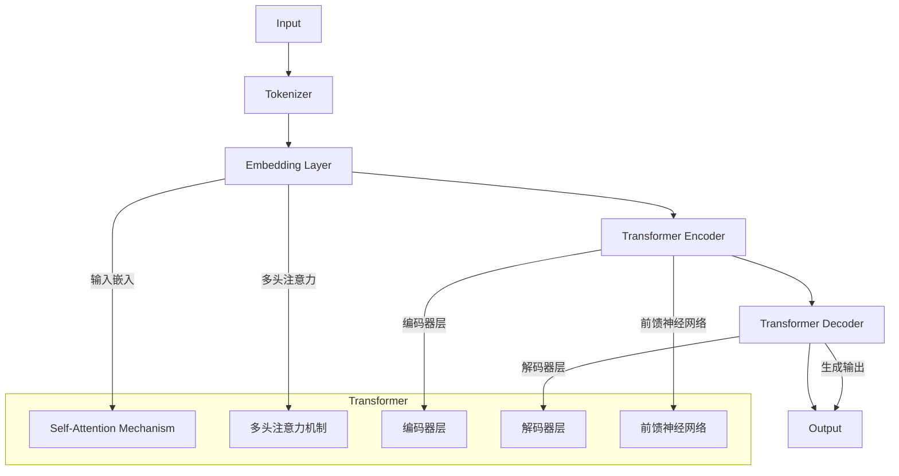
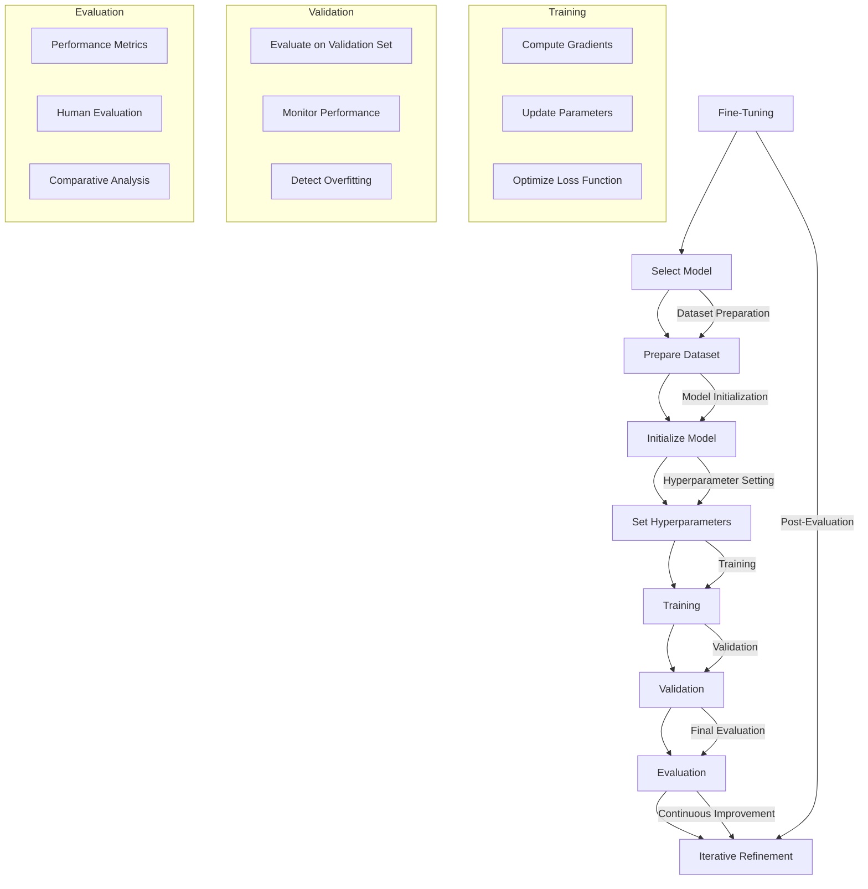
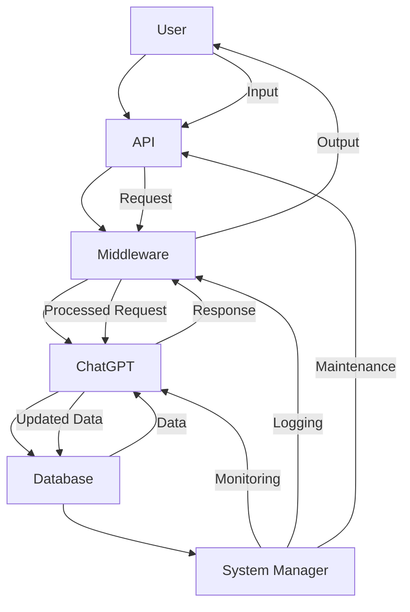
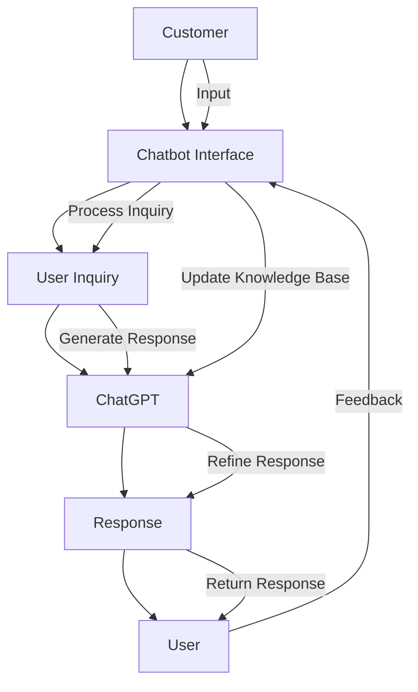
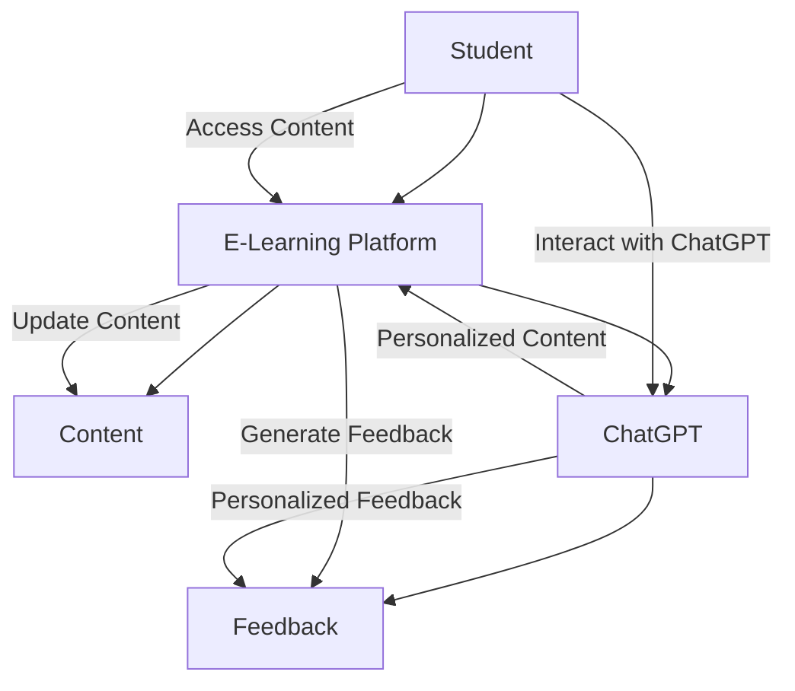
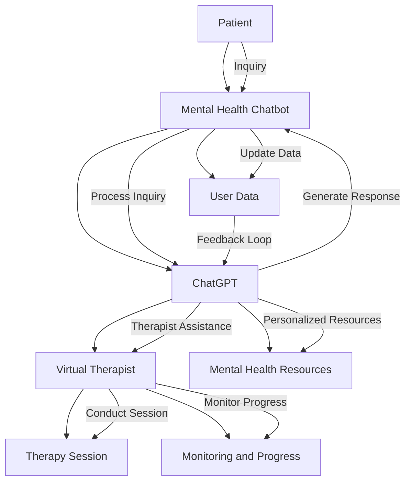

                 

# ChatGPT Prompt Engineering: The Foundation for Intelligent Dialogue

## Keywords
- ChatGPT
- Prompt Engineering
- AI Dialogue Systems
- Model Architectures
- Integration

## Abstract
This article delves into the realm of ChatGPT prompt engineering, exploring the foundations that enable intelligent dialogue systems. We will dissect the importance of prompt engineering, delve into the underlying principles, and discuss practical applications. By the end, you'll gain a comprehensive understanding of how to craft effective prompts to enhance the capabilities of ChatGPT in various domains.

## Introduction to ChatGPT and the Importance of Prompt Engineering

### Background of ChatGPT

ChatGPT, developed by OpenAI, is a groundbreaking language model based on the GPT (Generative Pre-trained Transformer) architecture. It has garnered immense attention due to its ability to generate coherent and contextually relevant text. The underlying architecture is composed of deep neural networks trained on vast amounts of text data, enabling it to understand and generate human-like text.

### Core Capabilities of ChatGPT

ChatGPT is designed to handle a variety of natural language processing tasks, including text generation, summarization, translation, and question-answering. Its versatility makes it a valuable tool for applications ranging from customer service chatbots to advanced research and content generation.

### The Significance of Prompt Engineering

While the inherent capabilities of ChatGPT are impressive, the effectiveness of its dialogue output is significantly influenced by the prompts provided. A well-crafted prompt can guide ChatGPT to generate more accurate, relevant, and engaging responses. This is where prompt engineering comes into play.

### Goals of Prompt Engineering

The primary goals of prompt engineering are to:

1. **Improve Response Accuracy:** Guide the model to generate responses that are factually correct and contextually appropriate.
2. **Enhance Response Relevance:** Ensure that the generated responses are directly relevant to the user's input.
3. **Boost Engagement:** Make the dialogue more interactive and engaging for users.

### The Role of Prompt Engineering in ChatGPT

Prompt engineering acts as the bridge between user intent and the model's response. It serves as the input to the model, shaping its output. Effective prompt engineering can significantly enhance the user experience by providing more accurate and useful responses.

## Part 1: Understanding ChatGPT and Prompt Engineering

### Chapter 1: Introduction to ChatGPT

#### Core Concepts and Terminology

- **Generative Pre-trained Transformer (GPT):** A type of neural network architecture used for natural language processing tasks.
- **Transformer:** An attention-based model architecture capable of capturing relationships between words in a sentence.
- **Pre-training:** The initial phase of training the model on a large corpus of text data.
- **Fine-tuning:** The process of adjusting the pre-trained model's weights to perform specific tasks.

#### Problem Background

With the rise of AI and natural language processing, there is a growing demand for systems that can engage in meaningful conversations. Traditional rule-based systems are often limited in their ability to handle complex queries and generate contextually relevant responses. ChatGPT, with its advanced transformer-based architecture, offers a promising solution.

#### Problem Description

The challenge lies in crafting prompts that can effectively guide ChatGPT to generate high-quality, coherent, and contextually relevant responses. This requires a deep understanding of the model's architecture and the nuances of natural language.

#### Problem Solution

By leveraging prompt engineering techniques, we can design prompts that enhance the model's ability to generate accurate and relevant responses. This involves understanding the model's limitations and strengths, as well as the specific requirements of the task at hand.

#### Boundaries and Extensions

While ChatGPT has shown remarkable success in various applications, it is not a panacea. There are certain scenarios where it may struggle, such as understanding nuanced human emotions or providing complex technical explanations. Researchers and developers need to continually explore and expand the boundaries of ChatGPT's capabilities.

### Chapter 2: Fundamentals of Prompt Engineering

#### Core Concepts and Terminology

- **Prompt:** A piece of text or an instruction used to initiate a dialogue or prompt the model to generate a response.
- **Input Format:** The structure of the prompt, including the specific information provided to the model.
- **Output Format:** The desired format of the generated response, such as text, code, or images.
- **Prompt Template:** A pre-defined structure for crafting prompts, ensuring consistency and clarity.

#### Problem Background

Effective prompt engineering is crucial for the success of any AI dialogue system. However, designing high-quality prompts requires a deep understanding of the model's capabilities, the specific domain of application, and the user's needs.

#### Problem Description

The challenge lies in designing prompts that can effectively guide the model to generate responses that meet the desired objectives. This involves balancing the amount of information provided in the prompt, ensuring clarity and coherence, and avoiding common pitfalls such as ambiguity or over-specification.

#### Problem Solution

To overcome these challenges, prompt engineering techniques can be employed. These techniques include:

1. **Defining Clear Objectives:** Clearly defining the goals of the dialogue, ensuring that the model's output aligns with these objectives.
2. **Providing Context:** Including relevant background information to help the model understand the context of the conversation.
3. **Using Specific Language:** Employing clear and concise language to minimize ambiguity and enhance the model's understanding.
4. **Iterative Improvement:** Continuously refining the prompts based on the model's responses and user feedback.

#### Boundaries and Extensions

While prompt engineering has proven effective in enhancing the performance of AI dialogue systems, there are still areas for improvement. Future research may explore new techniques for automatically generating high-quality prompts, as well as integrating multiple modalities (e.g., text, images, and audio) to enhance the overall user experience.

### Chapter 3: Crafting Effective Prompts

#### Core Concepts and Terminology

- **Effective Prompt:** A prompt that effectively guides the model to generate responses that meet the desired objectives.
- **Prompt Quality:** A measure of how well a prompt achieves its intended goals.
- **Prompt Variability:** The range of different prompts used to explore the model's capabilities and improve its performance.

#### Problem Background

Designing effective prompts is a critical aspect of prompt engineering. The quality of the prompts directly impacts the quality of the model's responses. Therefore, it is essential to understand the factors that contribute to prompt quality and how to design prompts that enhance the model's performance.

#### Problem Description

The challenge lies in identifying the key elements of an effective prompt and designing prompts that can adapt to different scenarios and user needs. This involves understanding the model's architecture, the specific application domain, and the user's context.

#### Problem Solution

To design effective prompts, several principles can be followed:

1. **Define Clear Objectives:** Ensure that the objectives of the dialogue are clearly defined, providing a clear direction for the model's responses.
2. **Provide Sufficient Context:** Include relevant background information to help the model understand the context of the conversation.
3. **Use Specific and Concise Language:** Avoid ambiguity and ensure that the language used is clear and concise, enhancing the model's understanding.
4. **Encourage Creativity:** Allow the model to explore different possibilities and generate creative responses by providing prompts that encourage flexibility.
5. **Iterate and Refine:** Continuously refine the prompts based on the model's responses and user feedback, improving the overall performance of the dialogue system.

#### Boundaries and Extensions

While the principles outlined above can guide the design of effective prompts, there are still challenges and opportunities for further research. Future work may explore techniques for automatically generating high-quality prompts based on user feedback, as well as integrating multiple modalities to enhance the dialogue experience.

## Part 2: ChatGPT Models and Architectures

### Chapter 4: Overview of ChatGPT Models

#### Core Concepts and Terminology

- **Model Architecture:** The underlying structure of the neural network used to process and generate text.
- **Transformer:** The primary architecture used in ChatGPT, which employs attention mechanisms to capture relationships between words.
- **Layer:** A component of the neural network that performs a specific transformation on the input data.
- **Parameter:** A numerical value that is adjusted during the training process to optimize the model's performance.

#### Problem Background

Understanding the various models available in the ChatGPT ecosystem is crucial for selecting the appropriate model for a given application. Each model has its own unique characteristics, strengths, and limitations, which must be considered when designing prompts.

#### Problem Description

The challenge lies in identifying the key differences between the various ChatGPT models and understanding how these differences impact the design of prompts. This involves examining the model architectures, the number of layers, the size of the model, and the training data used.

#### Problem Solution

To address this challenge, it is important to have a clear understanding of the core characteristics of each ChatGPT model. This includes:

1. **Model Architecture:** Understanding the underlying architecture, such as the transformer-based model, and how it captures relationships between words.
2. **Layer Structure:** Examining the number of layers in the model and their respective roles in processing the input data.
3. **Parameter Size:** Considering the size of the model, which can impact its performance and computational requirements.
4. **Training Data:** Understanding the quality and diversity of the training data, which can influence the model's ability to generate high-quality responses.

#### Boundaries and Extensions

While the existing ChatGPT models have demonstrated remarkable capabilities, there is always room for improvement. Future research may explore new architectures, training techniques, and model variations to enhance the performance of ChatGPT in various applications.

### Chapter 5: Fine-Tuning ChatGPT for Specific Applications

#### Core Concepts and Terminology

- **Fine-Tuning:** The process of adjusting the weights of a pre-trained model to optimize its performance on a specific task.
- **Transfer Learning:** The technique of using a pre-trained model as a starting point for training on a new task.
- **Custom Dataset:** A dataset specific to the task at hand, used to fine-tune the model.
- **Performance Metrics:** Quantitative measures used to evaluate the effectiveness of the model on the task.

#### Problem Background

Fine-tuning ChatGPT for specific applications can significantly enhance its performance and adaptability. By adapting the model to the specific requirements of a given task, we can achieve better results than using a generic, off-the-shelf model.

#### Problem Description

The challenge lies in selecting the appropriate fine-tuning strategy and ensuring that the model performs well on the specific task. This involves identifying the key factors that influence fine-tuning performance, such as the quality and size of the custom dataset, the choice of performance metrics, and the fine-tuning process itself.

#### Problem Solution

To effectively fine-tune ChatGPT for specific applications, several steps can be followed:

1. **Select the Appropriate Model:** Choose a ChatGPT model that is well-suited for the task at hand, considering factors such as the model's architecture, size, and training data.
2. **Prepare the Custom Dataset:** Collect and preprocess a dataset that is representative of the task, ensuring that it is diverse and high-quality.
3. **Define Performance Metrics:** Identify the key performance metrics that will be used to evaluate the model's performance on the task.
4. **Fine-Tuning Process:** Follow a systematic fine-tuning process, adjusting the model's weights to optimize its performance on the custom dataset.
5. **Iterate and Refine:** Continuously refine the fine-tuning process based on the model's performance, iterating until the desired level of performance is achieved.

#### Boundaries and Extensions

While fine-tuning has proven to be an effective technique for adapting ChatGPT to specific applications, there are still challenges and opportunities for improvement. Future research may explore new fine-tuning strategies, such as unsupervised or semi-supervised learning, to further enhance the model's performance and adaptability.

### Chapter 6: Integrating ChatGPT into Applications

#### Core Concepts and Terminology

- **Integration:** The process of incorporating ChatGPT into an existing system or application.
- **API:** An interface that allows different software systems to communicate and exchange data.
- **Middleware:** Software that mediates between different components of a system, enabling seamless integration.
- **Deployment:** The process of making ChatGPT available for use in a production environment.

#### Problem Background

Integrating ChatGPT into real-world applications requires overcoming several technical and practical challenges. This involves selecting the appropriate integration strategy, designing a robust API, and ensuring that the system can handle the demands of a production environment.

#### Problem Description

The challenge lies in designing a system architecture that can effectively integrate ChatGPT while ensuring scalability, reliability, and performance. This involves considering factors such as the model's computational requirements, the scalability of the system, and the overall user experience.

#### Problem Solution

To successfully integrate ChatGPT into applications, several steps can be followed:

1. **Select the Integration Strategy:** Choose the appropriate integration strategy, such as using a RESTful API, a message queue, or a WebSocket connection.
2. **Design the API:** Design a robust API that provides a seamless interface for interacting with ChatGPT, handling various types of requests and returning appropriate responses.
3. **Middleware Development:** Develop middleware components that mediate between the application and ChatGPT, handling tasks such as request routing, error handling, and performance optimization.
4. **Deployment and Scaling:** Deploy the integrated system in a production environment, ensuring that it can handle the expected load and scale as needed.
5. **Monitoring and Maintenance:** Continuously monitor the system's performance, addressing any issues that arise and making necessary adjustments to ensure optimal operation.

#### Boundaries and Extensions

While integrating ChatGPT into applications has demonstrated significant potential, there are still challenges and areas for improvement. Future research may explore new integration techniques, such as serverless architectures or containerization, to further enhance the flexibility and scalability of integrated systems.

## Part 3: Real-World Applications of ChatGPT

### Chapter 7: Customer Service and Support

#### Core Concepts and Terminology

- **Customer Service:** The process of providing support and assistance to customers, addressing their inquiries and resolving issues.
- **Chatbot:** An AI-powered program that simulates conversation with users, typically through a chat interface.
- **Customer Experience:** The overall experience that customers have when interacting with a company's products and services.
- **Business Process Automation:** The use of technology to automate and streamline business processes, improving efficiency and reducing costs.

#### Problem Background

Customer service and support are critical components of any business, and the demand for efficient and effective customer engagement has never been higher. Traditional customer service models are often time-consuming and costly, making it challenging for businesses to provide high-quality support to their customers. Chatbots, powered by advanced AI technologies such as ChatGPT, offer a promising solution to this challenge.

#### Problem Description

The challenge lies in designing and implementing AI-powered chatbots that can effectively handle customer inquiries, provide timely and accurate support, and enhance the overall customer experience. This involves selecting the appropriate ChatGPT model, designing the chatbot interface, and integrating the chatbot into the existing customer service infrastructure.

#### Problem Solution

To address this challenge, several steps can be followed:

1. **Select the Appropriate ChatGPT Model:** Choose a ChatGPT model that is well-suited for handling customer service tasks, considering factors such as the complexity of the inquiries and the desired level of natural language understanding.
2. **Design the Chatbot Interface:** Design a user-friendly chatbot interface that is easy for customers to use and navigate.
3. **Integrate the Chatbot into Existing Systems:** Integrate the chatbot into the existing customer service infrastructure, ensuring that it can seamlessly handle customer inquiries and interact with other systems such as CRM platforms.
4. **Continuous Improvement:** Continuously monitor and improve the chatbot's performance, leveraging user feedback and data analytics to optimize its responses and enhance the overall customer experience.
5. **Ensure Compliance:** Ensure that the chatbot adheres to relevant regulatory requirements, such as data privacy and security standards.

#### Boundaries and Extensions

While AI-powered chatbots have demonstrated significant potential in improving customer service and support, there are still challenges and limitations to be addressed. Future research may explore new techniques for enhancing the natural language understanding capabilities of chatbots, as well as exploring new applications such as proactive customer engagement and personalized service.

### Chapter 8: Education and E-Learning

#### Core Concepts and Terminology

- **Education:** The process of learning and acquiring knowledge, skills, and understanding.
- **E-Learning:** The use of electronic media and technology to deliver educational content and facilitate learning.
- **ChatGPT:** A language model developed by OpenAI, capable of generating coherent and contextually relevant text.
- **Interactive Learning:** A learning approach that involves active participation and engagement from the learner.
- **Personalized Learning:** A learning approach that tailors educational content and activities to the individual needs and preferences of each learner.

#### Problem Background

The traditional education system is increasingly challenged by the rapid pace of technological advancement and the diverse needs of modern learners. E-learning, powered by advanced AI technologies such as ChatGPT, offers a promising solution to these challenges, providing flexible and personalized learning experiences that can be accessed anytime and anywhere.

#### Problem Description

The challenge lies in leveraging ChatGPT to enhance the effectiveness of e-learning, creating interactive and engaging learning experiences that promote deeper understanding and knowledge retention. This involves designing educational content that can be effectively generated and adapted by ChatGPT, as well as integrating ChatGPT into existing e-learning platforms.

#### Problem Solution

To address this challenge, several steps can be followed:

1. **Design Interactive Content:** Create interactive educational content that can be generated and adapted by ChatGPT, incorporating elements such as quizzes, exercises, and interactive simulations.
2. **Integrate ChatGPT into E-Learning Platforms:** Integrate ChatGPT into existing e-learning platforms, enabling learners to interact with the model and receive personalized feedback and guidance.
3. **Personalize Learning Experiences:** Use ChatGPT to tailor educational content and activities to the individual needs and preferences of each learner, promoting personalized learning experiences.
4. **Monitor and Analyze Learning Outcomes:** Continuously monitor and analyze learning outcomes, leveraging data analytics to optimize the performance of ChatGPT and enhance the overall effectiveness of e-learning.
5. **Ensure Ethical and Responsible Use:** Ensure that the use of ChatGPT in education adheres to ethical and responsible guidelines, protecting the privacy and well-being of learners.

#### Boundaries and Extensions

While AI-powered e-learning has demonstrated significant potential in transforming the education system, there are still challenges and limitations to be addressed. Future research may explore new techniques for enhancing the natural language understanding capabilities of ChatGPT, as well as exploring new applications such as collaborative learning and real-time feedback.

### Chapter 9: Healthcare and Mental Health

#### Core Concepts and Terminology

- **Healthcare:** The organization and delivery of health services, including prevention, diagnosis, treatment, and management of health conditions.
- **Mental Health:** The state of emotional, psychological, and social well-being, characterized by the ability to cope with stress, work productively, and contribute to society.
- **ChatGPT:** A language model developed by OpenAI, capable of generating coherent and contextually relevant text.
- **Telehealth:** The use of technology to deliver healthcare services remotely, including teleconsultations, remote monitoring, and digital health interventions.
- **Cognitive Behavioral Therapy (CBT):** A form of psychotherapy that helps individuals identify and change unhelpful thoughts and behaviors that contribute to emotional and mental health problems.

#### Problem Background

The demand for mental health services is growing rapidly, but access to these services is often limited by factors such as geographic location, financial constraints, and availability of qualified professionals. Telehealth, powered by advanced AI technologies such as ChatGPT, offers a promising solution to this challenge, providing remote and accessible mental health support.

#### Problem Description

The challenge lies in leveraging ChatGPT to enhance the delivery of mental health services, creating interactive and personalized interventions that can support individuals in managing their mental health. This involves designing AI-powered chatbots and virtual therapists that can provide real-time support, as well as integrating these technologies into existing mental health care systems.

#### Problem Solution

To address this challenge, several steps can be followed:

1. **Design AI-Powered Chatbots:** Develop AI-powered chatbots that can provide basic mental health support, including information on common mental health conditions, self-help strategies, and referral to professional services.
2. **Virtual Therapists:** Integrate ChatGPT into virtual therapy platforms, enabling users to engage in text-based or voice-based conversations with trained therapists for personalized support and treatment.
3. **Personalized Interventions:** Use ChatGPT to tailor interventions to the individual needs and preferences of each user, promoting more effective and engaging mental health support.
4. **Integrate into Healthcare Systems:** Integrate these AI-powered tools into existing healthcare systems, ensuring that they can seamlessly handle patient inquiries and interact with other systems such as electronic health records.
5. **Ensure Ethical and Responsible Use:** Ensure that the use of ChatGPT in mental health care adheres to ethical and responsible guidelines, protecting the privacy and well-being of patients.

#### Boundaries and Extensions

While AI-powered mental health support has demonstrated significant potential, there are still challenges and limitations to be addressed. Future research may explore new techniques for enhancing the natural language understanding capabilities of ChatGPT, as well as exploring new applications such as real-time mood monitoring and personalized treatment planning.

## Conclusion

In conclusion, ChatGPT prompt engineering is a crucial component of building effective AI dialogue systems. By understanding the core concepts, principles, and techniques of prompt engineering, we can design prompts that guide ChatGPT to generate high-quality, contextually relevant, and engaging responses. This article has covered the essential aspects of ChatGPT prompt engineering, from the background and significance of prompt engineering to practical applications in various domains. By following the outlined steps and guidelines, you can enhance the performance and effectiveness of ChatGPT in your own projects.

### Best Practices and Tips

1. **Understand the Model:** Gain a deep understanding of the ChatGPT model's architecture, capabilities, and limitations to design more effective prompts.
2. **Define Clear Objectives:** Always define clear objectives for the dialogue, ensuring that the generated responses align with these goals.
3. **Provide Sufficient Context:** Include relevant context in the prompt to help the model understand the conversation's context and generate more accurate responses.
4. **Iterate and Refine:** Continuously refine your prompts based on the model's responses and user feedback to improve performance.
5. **Ensure Ethical Use:** Always ensure that the use of ChatGPT and prompt engineering adheres to ethical guidelines, protecting user privacy and well-being.

### Summary

In this article, we have explored the foundations of ChatGPT prompt engineering, discussing its importance and key concepts. We have examined various techniques for crafting effective prompts and delved into the real-world applications of ChatGPT across different domains. By following the outlined steps and best practices, you can harness the full potential of ChatGPT to build intelligent dialogue systems that provide valuable insights and enhance user experiences.

### Future Directions

The field of ChatGPT prompt engineering is rapidly evolving, with new techniques and applications emerging regularly. Future research may explore new architectures, training methods, and integration strategies to further enhance the performance and applicability of ChatGPT. Additionally, exploring the integration of multiple modalities, such as text, images, and audio, may open up new possibilities for enhancing the dialogue experience.

### Conclusion

In conclusion, ChatGPT prompt engineering is a critical component of building effective AI dialogue systems. By understanding the core concepts and principles of prompt engineering, you can design prompts that guide ChatGPT to generate high-quality, contextually relevant, and engaging responses. This article has provided a comprehensive overview of ChatGPT prompt engineering, covering essential concepts, techniques, and real-world applications. By following the outlined steps and best practices, you can leverage the power of ChatGPT to enhance the capabilities of your dialogue systems and deliver valuable insights and experiences to your users.

### Author Information

*作者：AI天才研究院/AI Genius Institute & 禅与计算机程序设计艺术 /Zen And The Art of Computer Programming*## The Significance of ChatGPT and Prompt Engineering

ChatGPT, a remarkable creation by OpenAI, has revolutionized the field of artificial intelligence by offering a versatile language model capable of generating coherent and contextually relevant text. Its underlying architecture, based on the transformer model, has pushed the boundaries of natural language processing (NLP) and dialogue systems. However, the true potential of ChatGPT is unlocked through effective prompt engineering.

### ChatGPT's Role in AI Dialogue Systems

ChatGPT's primary role in AI dialogue systems is to simulate human-like conversations by understanding and generating text based on given prompts. Unlike traditional rule-based systems, which rely on predefined rules and responses, ChatGPT leverages deep learning to analyze vast amounts of text data, capturing the nuances of language and context. This enables it to generate more natural and engaging dialogues, making it an invaluable tool for applications ranging from customer service chatbots to advanced conversational AI assistants.

### The Role of Prompt Engineering

Prompt engineering is the process of designing and optimizing prompts to guide ChatGPT in generating desired responses. A well-crafted prompt can significantly enhance the model's performance by providing clear context, setting appropriate objectives, and avoiding ambiguity. Effective prompt engineering ensures that ChatGPT generates responses that are not only coherent and contextually relevant but also aligned with the desired goals of the dialogue.

### Goals of Prompt Engineering

The primary goals of prompt engineering can be summarized as follows:

1. **Improving Response Accuracy:** A well-designed prompt can guide ChatGPT to generate accurate and factually correct responses, reducing the likelihood of generating misleading or incorrect information.
2. **Enhancing Response Relevance:** By providing relevant context and objectives, prompt engineering ensures that ChatGPT generates responses that are directly related to the user's input, enhancing the overall relevance and usefulness of the dialogue.
3. **Boosting Engagement:** Effective prompts can make the dialogue more engaging and interactive, encouraging users to participate actively and fostering a more natural and enjoyable conversation.

### The Role of Prompt Engineering in ChatGPT

Prompt engineering acts as the bridge between the user's intent and the model's response. It serves as the input to the model, shaping its output. By carefully designing prompts, we can guide ChatGPT to generate high-quality responses that meet the desired objectives. This involves understanding the model's limitations and strengths, as well as the specific requirements of the task at hand.

### How to Craft Effective Prompts

To craft effective prompts, several principles can be followed:

1. **Define Clear Objectives:** Clearly define the goals of the dialogue, providing a clear direction for the model's responses.
2. **Provide Sufficient Context:** Include relevant background information to help the model understand the context of the conversation.
3. **Use Specific and Concise Language:** Employ clear and concise language to minimize ambiguity and enhance the model's understanding.
4. **Encourage Creativity:** Allow the model to explore different possibilities by providing prompts that encourage flexibility and creativity.
5. **Iterate and Refine:** Continuously refine the prompts based on the model's responses and user feedback, improving the overall performance of the dialogue system.

By following these principles, prompt engineers can design high-quality prompts that enhance the capabilities of ChatGPT, enabling it to generate more accurate, relevant, and engaging responses in various applications.

## Part 1: Understanding ChatGPT and Prompt Engineering

### Chapter 1: Introduction to ChatGPT

#### Core Concepts and Terminology

- **Generative Pre-trained Transformer (GPT):** A type of neural network architecture used for natural language processing tasks, capable of generating text based on given prompts.
- **Transformer:** An advanced neural network architecture that employs self-attention mechanisms to capture relationships between words in a sentence.
- **Pre-training:** The initial phase of training the model on a large corpus of text data, followed by fine-tuning for specific tasks.
- **Fine-tuning:** Adjusting the pre-trained model's weights to optimize its performance on a specific task.

#### Problem Background

The rapid advancements in artificial intelligence (AI) and natural language processing (NLP) have led to the development of powerful language models like ChatGPT. These models have the potential to transform various industries, including customer service, healthcare, and education. However, to unlock their full potential, it is essential to understand the core concepts and principles underlying these models.

#### Problem Description

The challenge lies in grasping the fundamental concepts of ChatGPT, including its architecture, training process, and capabilities. This involves understanding how transformers work, the role of pre-training and fine-tuning, and the various applications of ChatGPT in real-world scenarios.

#### Problem Solution

To address this challenge, this chapter will provide a comprehensive overview of ChatGPT, covering the following topics:

1. **Background:** Discuss the history and significance of ChatGPT in the field of AI and NLP.
2. **Core Concepts:** Explain the key components of ChatGPT, including the transformer architecture and the pre-training and fine-tuning processes.
3. **Capabilities:** Explore the various tasks and applications for which ChatGPT is well-suited, such as text generation, summarization, and question-answering.
4. **Applications:** Discuss practical examples of how ChatGPT is being used in different industries to solve real-world problems.

#### Boundaries and Extensions

While ChatGPT has demonstrated remarkable capabilities, it is not a perfect solution for all NLP tasks. There are certain limitations and challenges that researchers and developers need to address. Future research may explore new architectures, training techniques, and application domains to further enhance the performance and versatility of ChatGPT.

### Chapter 2: Fundamentals of Prompt Engineering

#### Core Concepts and Terminology

- **Prompt:** A piece of text or instruction used to initiate a dialogue or prompt the model to generate a response.
- **Input Format:** The structure of the prompt, including the specific information provided to the model.
- **Output Format:** The desired format of the generated response, such as text, code, or images.
- **Prompt Template:** A pre-defined structure for crafting prompts, ensuring consistency and clarity.

#### Problem Background

Prompt engineering is a critical aspect of designing effective AI dialogue systems. A well-crafted prompt can guide the model to generate high-quality responses that meet the desired objectives. However, designing effective prompts requires a deep understanding of the model's architecture, the specific application domain, and the user's needs.

#### Problem Description

The challenge lies in understanding the fundamental concepts of prompt engineering and how to apply them to design effective prompts. This involves grasping the importance of the prompt's structure, the types of information to include, and the techniques for ensuring clarity and coherence.

#### Problem Solution

To address this challenge, this chapter will cover the following topics:

1. **Introduction to Prompt Engineering:** Explain the basics of prompt engineering, including its role in dialogue systems and the importance of designing effective prompts.
2. **Types of Prompts:** Discuss the different types of prompts, such as direct, indirect, and structured prompts, and their applications.
3. **Design Principles:** Present key design principles for crafting effective prompts, including defining clear objectives, providing sufficient context, and using specific and concise language.
4. **Prompt Templates:** Introduce prompt templates and their role in ensuring consistency and clarity in prompt design.

#### Boundaries and Extensions

While this chapter will cover the fundamental concepts and techniques of prompt engineering, there are always new challenges and opportunities for improvement. Future research may explore advanced techniques for automatically generating high-quality prompts, as well as the integration of multiple modalities to enhance the dialogue experience.

### Chapter 3: Crafting Effective Prompts

#### Core Concepts and Terminology

- **Effective Prompt:** A prompt that effectively guides the model to generate responses that meet the desired objectives.
- **Prompt Quality:** A measure of how well a prompt achieves its intended goals.
- **Prompt Variability:** The range of different prompts used to explore the model's capabilities and improve its performance.

#### Problem Background

Designing effective prompts is crucial for the success of AI dialogue systems. A well-crafted prompt can guide the model to generate accurate, relevant, and engaging responses, enhancing the overall user experience. However, designing effective prompts requires a deep understanding of the model's architecture, the specific application domain, and the user's needs.

#### Problem Description

The challenge lies in understanding the factors that contribute to prompt quality and how to design prompts that can adapt to different scenarios and user needs. This involves examining the impact of various prompt elements, such as context, structure, and language, on the model's performance.

#### Problem Solution

To design effective prompts, this chapter will cover the following topics:

1. **Define Clear Objectives:** Explain the importance of defining clear objectives for the dialogue and how this can guide the design of effective prompts.
2. **Provide Sufficient Context:** Discuss the role of context in prompt engineering and how to provide relevant background information to help the model understand the conversation's context.
3. **Use Specific and Concise Language:** Explain the importance of clarity and conciseness in prompts and how to avoid ambiguity and unnecessary complexity.
4. **Encourage Creativity:** Discuss techniques for encouraging the model to explore different possibilities and generate creative responses.
5. **Iterate and Refine:** Emphasize the importance of continuously refining prompts based on the model's responses and user feedback to improve performance.

#### Boundaries and Extensions

While this chapter will cover the key principles and techniques for crafting effective prompts, there are always new challenges and opportunities for improvement. Future research may explore advanced techniques for automatically generating high-quality prompts, as well as the integration of multiple modalities to enhance the dialogue experience.

### Chapter 4: ChatGPT Models and Architectures

#### Core Concepts and Terminology

- **Model Architecture:** The underlying structure of the neural network used to process and generate text.
- **Transformer:** An advanced neural network architecture that employs self-attention mechanisms to capture relationships between words in a sentence.
- **Pre-training:** The initial phase of training the model on a large corpus of text data.
- **Fine-tuning:** Adjusting the pre-trained model's weights to optimize its performance on a specific task.

#### Problem Background

Understanding the various models available in the ChatGPT ecosystem is crucial for selecting the appropriate model for a given application. Each model has its own unique characteristics, strengths, and limitations, which must be considered when designing prompts.

#### Problem Description

The challenge lies in identifying the key differences between the various ChatGPT models and understanding how these differences impact the design of prompts. This involves examining the model architectures, the number of layers, the size of the model, and the training data used.

#### Problem Solution

To address this challenge, this chapter will cover the following topics:

1. **Model Architectures:** Provide an overview of the key model architectures used in ChatGPT, such as the Transformer model, and discuss their characteristics and differences.
2. **Pre-training and Fine-tuning:** Explain the pre-training and fine-tuning processes and how they influence the model's performance and behavior.
3. **Model Selection:** Discuss the factors to consider when selecting the appropriate model for a given application, including the model's architecture, size, and training data.
4. **Impact on Prompt Design:** Discuss how the characteristics of different models influence the design of prompts and provide guidelines for selecting and designing effective prompts for each model.

#### Boundaries and Extensions

While this chapter will cover the key concepts and principles for understanding ChatGPT models and architectures, there are always new challenges and opportunities for improvement. Future research may explore new architectures, training techniques, and model variations to further enhance the performance and versatility of ChatGPT.

### Chapter 5: Fine-Tuning ChatGPT for Specific Applications

#### Core Concepts and Terminology

- **Fine-tuning:** Adjusting the pre-trained model's weights to optimize its performance on a specific task.
- **Transfer Learning:** Using a pre-trained model as a starting point for training on a new task.
- **Custom Dataset:** A dataset specific to the task at hand, used to fine-tune the model.
- **Performance Metrics:** Quantitative measures used to evaluate the effectiveness of the model on the task.

#### Problem Background

Fine-tuning ChatGPT for specific applications can significantly enhance its performance and adaptability. By adapting the model to the specific requirements of a given task, we can achieve better results than using a generic, off-the-shelf model. However, fine-tuning requires careful consideration of various factors, such as the quality and size of the custom dataset and the performance metrics used to evaluate the model.

#### Problem Description

The challenge lies in selecting the appropriate fine-tuning strategy and ensuring that the model performs well on the specific task. This involves identifying the key factors that influence fine-tuning performance and understanding how these factors interact with each other.

#### Problem Solution

To address this challenge, this chapter will cover the following topics:

1. **Selecting the Appropriate Model:** Discuss the factors to consider when selecting the appropriate ChatGPT model for fine-tuning, including the model's architecture, size, and training data.
2. **Preparing the Custom Dataset:** Explain the process of preparing a custom dataset for fine-tuning, including data collection, preprocessing, and annotation.
3. **Fine-tuning Process:** Describe the fine-tuning process, including the training procedure, hyperparameter tuning, and evaluation.
4. **Performance Metrics:** Discuss the key performance metrics used to evaluate the effectiveness of the fine-tuned model, including accuracy, F1 score, and user satisfaction.
5. **Iterative Improvement:** Emphasize the importance of continuously refining the fine-tuning process based on performance metrics and user feedback.

#### Boundaries and Extensions

While fine-tuning has proven to be an effective technique for adapting ChatGPT to specific applications, there are still challenges and opportunities for improvement. Future research may explore new fine-tuning strategies, such as unsupervised or semi-supervised learning, as well as new performance metrics to better evaluate the effectiveness of fine-tuned models.

### Chapter 6: Integrating ChatGPT into Applications

#### Core Concepts and Terminology

- **Integration:** The process of incorporating ChatGPT into an existing system or application.
- **API:** An interface that allows different software systems to communicate and exchange data.
- **Middleware:** Software that mediates between different components of a system, enabling seamless integration.
- **Deployment:** The process of making ChatGPT available for use in a production environment.

#### Problem Background

Integrating ChatGPT into real-world applications requires overcoming several technical and practical challenges. This involves selecting the appropriate integration strategy, designing a robust API, and ensuring that the system can handle the demands of a production environment.

#### Problem Description

The challenge lies in designing a system architecture that can effectively integrate ChatGPT while ensuring scalability, reliability, and performance. This involves considering factors such as the model's computational requirements, the scalability of the system, and the overall user experience.

#### Problem Solution

To address this challenge, several steps can be followed:

1. **Select the Integration Strategy:** Choose the appropriate integration strategy, such as using a RESTful API, a message queue, or a WebSocket connection.
2. **Design the API:** Design a robust API that provides a seamless interface for interacting with ChatGPT, handling various types of requests and returning appropriate responses.
3. **Middleware Development:** Develop middleware components that mediate between the application and ChatGPT, handling tasks such as request routing, error handling, and performance optimization.
4. **Deployment and Scaling:** Deploy the integrated system in a production environment, ensuring that it can handle the expected load and scale as needed.
5. **Monitoring and Maintenance:** Continuously monitor the system's performance, addressing any issues that arise and making necessary adjustments to ensure optimal operation.

#### Boundaries and Extensions

While integrating ChatGPT into applications has demonstrated significant potential, there are still challenges and areas for improvement. Future research may explore new integration techniques, such as serverless architectures or containerization, to further enhance the flexibility and scalability of integrated systems.

### Chapter 7: Customer Service and Support

#### Core Concepts and Terminology

- **Customer Service:** The process of providing support and assistance to customers, addressing their inquiries and resolving issues.
- **Chatbot:** An AI-powered program that simulates conversation with users, typically through a chat interface.
- **Customer Experience:** The overall experience that customers have when interacting with a company's products and services.
- **Business Process Automation:** The use of technology to automate and streamline business processes, improving efficiency and reducing costs.

#### Problem Background

Customer service and support are critical components of any business, and the demand for efficient and effective customer engagement has never been higher. Traditional customer service models are often time-consuming and costly, making it challenging for businesses to provide high-quality support to their customers. Chatbots, powered by advanced AI technologies such as ChatGPT, offer a promising solution to this challenge.

#### Problem Description

The challenge lies in designing and implementing AI-powered chatbots that can effectively handle customer inquiries, provide timely and accurate support, and enhance the overall customer experience. This involves selecting the appropriate ChatGPT model, designing the chatbot interface, and integrating the chatbot into the existing customer service infrastructure.

#### Problem Solution

To address this challenge, several steps can be followed:

1. **Select the Appropriate ChatGPT Model:** Choose a ChatGPT model that is well-suited for handling customer service tasks, considering factors such as the complexity of the inquiries and the desired level of natural language understanding.
2. **Design the Chatbot Interface:** Design a user-friendly chatbot interface that is easy for customers to use and navigate.
3. **Integrate the Chatbot into Existing Systems:** Integrate the chatbot into the existing customer service infrastructure, ensuring that it can seamlessly handle customer inquiries and interact with other systems such as CRM platforms.
4. **Continuous Improvement:** Continuously monitor and improve the chatbot's performance, leveraging user feedback and data analytics to optimize its responses and enhance the overall customer experience.
5. **Ensure Compliance:** Ensure that the chatbot adheres to relevant regulatory requirements, such as data privacy and security standards.

#### Boundaries and Extensions

While AI-powered chatbots have demonstrated significant potential in improving customer service and support, there are still challenges and limitations to be addressed. Future research may explore new techniques for enhancing the natural language understanding capabilities of chatbots, as well as exploring new applications such as proactive customer engagement and personalized service.

### Chapter 8: Education and E-Learning

#### Core Concepts and Terminology

- **Education:** The process of learning and acquiring knowledge, skills, and understanding.
- **E-Learning:** The use of electronic media and technology to deliver educational content and facilitate learning.
- **ChatGPT:** A language model developed by OpenAI, capable of generating coherent and contextually relevant text.
- **Interactive Learning:** A learning approach that involves active participation and engagement from the learner.
- **Personalized Learning:** A learning approach that tailors educational content and activities to the individual needs and preferences of each learner.

#### Problem Background

The traditional education system is increasingly challenged by the rapid pace of technological advancement and the diverse needs of modern learners. E-learning, powered by advanced AI technologies such as ChatGPT, offers a promising solution to these challenges, providing flexible and personalized learning experiences that can be accessed anytime and anywhere.

#### Problem Description

The challenge lies in leveraging ChatGPT to enhance the effectiveness of e-learning, creating interactive and engaging learning experiences that promote deeper understanding and knowledge retention. This involves designing educational content that can be effectively generated and adapted by ChatGPT, as well as integrating ChatGPT into existing e-learning platforms.

#### Problem Solution

To address this challenge, several steps can be followed:

1. **Design Interactive Content:** Create interactive educational content that can be generated and adapted by ChatGPT, incorporating elements such as quizzes, exercises, and interactive simulations.
2. **Integrate ChatGPT into E-Learning Platforms:** Integrate ChatGPT into existing e-learning platforms, enabling learners to interact with the model and receive personalized feedback and guidance.
3. **Personalize Learning Experiences:** Use ChatGPT to tailor educational content and activities to the individual needs and preferences of each learner, promoting personalized learning experiences.
4. **Monitor and Analyze Learning Outcomes:** Continuously monitor and analyze learning outcomes, leveraging data analytics to optimize the performance of ChatGPT and enhance the overall effectiveness of e-learning.
5. **Ensure Ethical and Responsible Use:** Ensure that the use of ChatGPT in education adheres to ethical and responsible guidelines, protecting the privacy and well-being of learners.

#### Boundaries and Extensions

While AI-powered e-learning has demonstrated significant potential in transforming the education system, there are still challenges and limitations to be addressed. Future research may explore new techniques for enhancing the natural language understanding capabilities of ChatGPT, as well as exploring new applications such as collaborative learning and real-time feedback.

### Chapter 9: Healthcare and Mental Health

#### Core Concepts and Terminology

- **Healthcare:** The organization and delivery of health services, including prevention, diagnosis, treatment, and management of health conditions.
- **Mental Health:** The state of emotional, psychological, and social well-being, characterized by the ability to cope with stress, work productively, and contribute to society.
- **ChatGPT:** A language model developed by OpenAI, capable of generating coherent and contextually relevant text.
- **Telehealth:** The use of technology to deliver healthcare services remotely, including teleconsultations, remote monitoring, and digital health interventions.
- **Cognitive Behavioral Therapy (CBT):** A form of psychotherapy that helps individuals identify and change unhelpful thoughts and behaviors that contribute to emotional and mental health problems.

#### Problem Background

The demand for mental health services is growing rapidly, but access to these services is often limited by factors such as geographic location, financial constraints, and availability of qualified professionals. Telehealth, powered by advanced AI technologies such as ChatGPT, offers a promising solution to this challenge, providing remote and accessible mental health support.

#### Problem Description

The challenge lies in leveraging ChatGPT to enhance the delivery of mental health services, creating interactive and personalized interventions that can support individuals in managing their mental health. This involves designing AI-powered chatbots and virtual therapists that can provide real-time support, as well as integrating these technologies into existing mental health care systems.

#### Problem Solution

To address this challenge, several steps can be followed:

1. **Design AI-Powered Chatbots:** Develop AI-powered chatbots that can provide basic mental health support, including information on common mental health conditions, self-help strategies, and referral to professional services.
2. **Virtual Therapists:** Integrate ChatGPT into virtual therapy platforms, enabling users to engage in text-based or voice-based conversations with trained therapists for personalized support and treatment.
3. **Personalized Interventions:** Use ChatGPT to tailor interventions to the individual needs and preferences of each user, promoting personalized mental health support.
4. **Integrate into Healthcare Systems:** Integrate these AI-powered tools into existing healthcare systems, ensuring that they can seamlessly handle patient inquiries and interact with other systems such as electronic health records.
5. **Ensure Ethical and Responsible Use:** Ensure that the use of ChatGPT in mental health care adheres to ethical and responsible guidelines, protecting the privacy and well-being of patients.

#### Boundaries and Extensions

While AI-powered mental health support has demonstrated significant potential, there are still challenges and limitations to be addressed. Future research may explore new techniques for enhancing the natural language understanding capabilities of ChatGPT, as well as exploring new applications such as real-time mood monitoring and personalized treatment planning.

## Introduction to ChatGPT

### Background of ChatGPT

ChatGPT is a language model developed by OpenAI, a leading artificial intelligence research organization. The project was announced in November 2022 and has quickly gained traction in the AI community due to its impressive capabilities in natural language understanding and generation. The development of ChatGPT is part of OpenAI's broader mission to create safe and beneficial AI systems that can assist humans in various domains, from customer service and education to healthcare and mental health.

### Core Capabilities of ChatGPT

ChatGPT is based on the Generative Pre-trained Transformer (GPT) architecture, a type of neural network known for its ability to generate high-quality text. The core capabilities of ChatGPT include:

1. **Text Generation:** ChatGPT can generate human-like text based on a given prompt. This capability is particularly useful for applications such as content creation, chatbots, and automated responses.
2. **Summarization:** ChatGPT can summarize long texts into shorter, more concise versions, which is valuable for applications like news aggregation and document summarization.
3. **Translation:** ChatGPT can translate text between multiple languages, making it a powerful tool for cross-language communication and content dissemination.
4. **Question-Answering:** ChatGPT can answer questions based on the information provided in a given context, making it useful for applications like virtual assistants and information retrieval systems.

### Technical Overview of ChatGPT

The technical foundation of ChatGPT is the Transformer architecture, a type of neural network known for its ability to capture long-range dependencies in text. The Transformer model uses self-attention mechanisms to weigh the importance of different words in the input sequence, allowing it to generate coherent and contextually relevant outputs.

#### Transformer Architecture

The Transformer architecture consists of several key components:

1. **Embeddings:** The input text is converted into numerical embeddings, which capture the semantic meaning of each word.
2. **Self-Attention:** The self-attention mechanism allows the model to weigh the importance of different words in the input sequence, enabling it to capture long-range dependencies.
3. **Encoder-Decoder Structure:** The Transformer model is an encoder-decoder architecture, where the encoder processes the input sequence and the decoder generates the output sequence.
4. **Multi-head Attention:** Multi-head attention allows the model to attend to different parts of the input sequence simultaneously, enhancing its ability to understand complex relationships.

#### Pre-training and Fine-tuning

ChatGPT undergoes a two-stage training process: pre-training and fine-tuning.

1. **Pre-training:** During pre-training, the model is trained on a large corpus of text data to learn the underlying patterns and structures of language. This phase helps the model develop a strong understanding of language semantics and syntax.
2. **Fine-tuning:** After pre-training, the model is fine-tuned on task-specific data to optimize its performance on specific applications. Fine-tuning involves adjusting the model's weights to improve its performance on a particular task, such as text generation, summarization, or question-answering.

### Advantages and Disadvantages of ChatGPT

#### Advantages

1. **Advanced Natural Language Understanding:** ChatGPT's transformer-based architecture allows it to understand and generate text with high coherence and contextuality.
2. **Versatility:** ChatGPT can be fine-tuned for various tasks, making it a versatile tool for applications across different domains.
3. **Scalability:** The model can process and generate text at a large scale, making it suitable for handling high-volume text generation tasks.
4. **Ease of Integration:** ChatGPT can be integrated into existing systems and applications with minimal modification, making it a convenient option for businesses and developers.

#### Disadvantages

1. **Computational Requirements:** The training and inference of large language models like ChatGPT require significant computational resources, making it challenging to deploy on resource-constrained devices.
2. **Data Bias:** Like any machine learning model, ChatGPT can exhibit biases present in the training data, leading to potentially biased or inappropriate responses.
3. **Lack of Real-World Understanding:** While ChatGPT is capable of generating coherent text, it may not fully understand the real-world implications or context of the generated text.

### Conclusion

ChatGPT is a powerful language model that has the potential to transform various industries and applications. Its advanced natural language understanding and generation capabilities make it a valuable tool for tasks such as text generation, summarization, translation, and question-answering. However, it is essential to consider the model's limitations and challenges, such as computational requirements and data bias, to ensure its effective and responsible use.

### Mermaid ER Entity Relationship Diagram

Below is a Mermaid ER entity relationship diagram that illustrates the main entities and relationships within the ChatGPT ecosystem.

```mermaid
erDiagram
  ChatGPT ||--|{ Model } Model : Uses
  Model ||--|{ Architecture } Architecture : Implements
  Model ||--|{ Dataset } Dataset : Trains on
  Model ||--|{ Application } Application : Used in
  Dataset ||--|{ Data Source } Data Source : From
  Application ||--|{ User } User : By
```

This diagram highlights the key entities, such as the ChatGPT model, model architecture, dataset, application, and user, and their relationships. The Model entity implements the Architecture and trains on the Dataset. The ChatGPT model uses the Model and is used in various Applications. The Dataset is sourced from Data Sources and is utilized by Applications to serve Users.

### Example of Effective Prompt Design

#### Objective

To create a prompt that guides ChatGPT to generate a coherent and informative response about the future of AI in healthcare.

#### Prompt

"Imagine a world where artificial intelligence is fully integrated into the healthcare system. How would this change the way medical professionals provide care to patients? Discuss the potential benefits and challenges that might arise from this integration."

#### Analysis

1. **Clear Objectives:** The prompt clearly defines the objective, asking ChatGPT to discuss the future of AI in healthcare, focusing on benefits and challenges.
2. **Sufficient Context:** The prompt provides relevant context by describing a hypothetical scenario where AI is fully integrated into healthcare.
3. **Specific and Concise Language:** The prompt uses specific language, such as "benefits" and "challenges," to guide the model's response.
4. **Encourages Creativity:** By asking for a discussion on potential benefits and challenges, the prompt encourages ChatGPT to explore different aspects of the topic and generate creative responses.

#### Expected Output

An output response that provides a balanced overview of the potential benefits and challenges of integrating AI into the healthcare system, discussing aspects such as improved diagnostics, personalized treatment plans, increased efficiency, and ethical considerations.

### Example of Ineffective Prompt Design

#### Objective

To create a prompt that guides ChatGPT to generate a response about the benefits of exercise.

#### Prompt

"What are the benefits of exercise?"

#### Analysis

1. **Ambiguity:** The prompt is vague and does not provide enough context to guide the model's response. It is unclear whether the prompt requires a detailed discussion of all benefits or a specific aspect of exercise.
2. **Lack of Specificity:** The prompt does not specify the type of exercise or the audience for which the benefits are relevant, leading to a potentially generic response.
3. **Over-simplification:** The prompt requests a simple list of benefits without encouraging the model to delve deeper into the topic or provide a comprehensive analysis.

#### Improved Prompt

"What are the potential benefits of incorporating moderate-intensity aerobic exercise into a sedentary lifestyle for middle-aged adults?"

This improved prompt provides more context, specifying the type of exercise and the target audience, and encourages ChatGPT to provide a more detailed and insightful response.

### Conclusion

Effective prompt design is crucial for guiding ChatGPT to generate high-quality and contextually relevant responses. By following principles such as defining clear objectives, providing sufficient context, using specific and concise language, and encouraging creativity, prompt engineers can design prompts that enhance the performance and applicability of ChatGPT in various applications. Conversely, ineffective prompt design can lead to ambiguous or generic responses that fail to meet the desired objectives.

## Fundamentals of Prompt Engineering

### What is a Prompt?

A prompt is a piece of text or an instruction used to initiate a dialogue or prompt the model to generate a response. It serves as the input to the AI model and plays a crucial role in shaping the model's output. In the context of ChatGPT, a prompt can be a simple question, a statement, or a complex scenario that guides the model to generate relevant and coherent responses.

### Types of Prompts

1. **Direct Prompts:** These are straightforward prompts that ask the model to respond directly to a question or statement. For example, "What is the capital of France?" Direct prompts are often used for question-answering tasks.
   
2. **Indirect Prompts:** These prompts require the model to infer the meaning or context of the input and generate a relevant response. For example, "Write a story about a detective solving a mystery." Indirect prompts are useful for creative writing and storytelling tasks.

3. **Structured Prompts:** These prompts provide specific guidelines or frameworks for the model's response. They often include information such as the desired format, keywords, or specific details that the model should incorporate. For example, "Write a summary of a scientific article on climate change, including the main findings and conclusions." Structured prompts are beneficial for tasks that require specific formatting or adherence to certain guidelines.

4. **Interactive Prompts:** These prompts involve a back-and-forth interaction between the user and the model. They are often used in chatbot applications where the model needs to maintain context and generate responses that lead to meaningful conversations. For example, "You are a travel agent. The user wants to book a vacation to Paris. What would you suggest?"

### The Role of Prompts in AI Dialogue Systems

Prompts are the cornerstone of AI dialogue systems like ChatGPT. They serve several critical roles:

1. **Guiding the Model:** Prompts provide the model with specific instructions and context, helping it generate responses that are relevant and coherent.
   
2. **Setting Objectives:** Clear prompts define the goals of the dialogue, ensuring that the model's responses align with the desired objectives.
   
3. **Improving Accuracy:** Well-crafted prompts can guide the model to generate accurate and factually correct responses by providing relevant context and clarifying ambiguities.

4. **Enhancing Relevance:** By providing specific information and setting the context, prompts enhance the relevance of the model's responses, ensuring they are directly related to the user's input.

5. **Fostering Engagement:** Interactive prompts can make the dialogue more engaging and interactive, encouraging users to participate actively in the conversation.

### Crafting Effective Prompts

To craft effective prompts, several principles should be followed:

1. **Define Clear Objectives:** Clearly articulate the goals of the dialogue. What specific information or responses do you want the model to generate? This provides a clear direction for the model's output.
   
2. **Provide Sufficient Context:** Include relevant background information to help the model understand the context of the conversation. This can include details about the topic, the user's needs or preferences, or any specific requirements for the response.
   
3. **Use Specific and Concise Language:** Avoid vague or ambiguous language that can lead to misinterpretations. Use specific and concise language to ensure the model understands the prompt correctly.
   
4. **Encourage Creativity:** Allow the model to explore different possibilities by providing prompts that encourage flexibility and creativity. This can lead to more engaging and innovative responses.
   
5. **Iterate and Refine:** Continuously refine the prompts based on the model's responses and user feedback. This helps in improving the quality and relevance of the generated responses over time.

### Example of Effective Prompt

**Objective:** To generate a story about a detective solving a mystery.

**Prompt:** "You are a detective investigating a mysterious disappearance. The victim was last seen at a local park. The park is known for its eerie atmosphere and strange occurrences. Investigate the case and write a report detailing your findings and conclusions."

**Analysis:**

- **Clear Objectives:** The prompt clearly defines the objective, asking the model to generate a story about a detective solving a mystery.
- **Sufficient Context:** The prompt provides relevant context, including the setting (a local park), the victim's disappearance, and the eerie atmosphere, helping the model understand the scenario.
- **Specific and Concise Language:** The prompt uses specific language, directing the model to write a report with findings and conclusions.
- **Encourages Creativity:** By asking the model to investigate the case and write a report, the prompt encourages creative storytelling.

### Example of Ineffective Prompt

**Objective:** To generate a response about the benefits of exercise.

**Prompt:** "What are the benefits of exercise?"

**Analysis:**

- **Ambiguity:** The prompt is vague and does not provide enough context to guide the model's response. It is unclear whether the prompt requires a detailed discussion of all benefits or a specific aspect of exercise.
- **Lack of Specificity:** The prompt does not specify the type of exercise or the audience for which the benefits are relevant, leading to a potentially generic response.
- **Over-simplification:** The prompt requests a simple list of benefits without encouraging the model to delve deeper into the topic or provide a comprehensive analysis.

### Conclusion

Crafting effective prompts is a crucial aspect of leveraging AI dialogue systems like ChatGPT. By following principles such as defining clear objectives, providing sufficient context, using specific and concise language, and encouraging creativity, prompt engineers can design prompts that enhance the model's performance and generate high-quality, contextually relevant responses. Conversely, ineffective prompts can lead to ambiguous or generic responses that fail to meet the desired objectives.

### Table: Comparison of Prompt Types

| Prompt Type | Definition | Example | Benefits | Limitations |
| --- | --- | --- | --- | --- |
| Direct Prompt | Simple, straightforward question or statement | "What is the capital of France?" | Clear objectives, straightforward responses | Limited creativity, less engaging |
| Indirect Prompt | Requires inference, more open-ended | "Write a story about a detective solving a mystery" | Encourages creativity, more engaging | Potential for ambiguity, less structured |
| Structured Prompt | Detailed instructions, specific guidelines | "Write a summary of a scientific article on climate change" | Ensures structure, specific requirements met | May limit creativity, less flexible |
| Interactive Prompt | Back-and-forth interaction, maintains context | "You are a travel agent. The user wants to book a vacation to Paris. What would you suggest?" | Highly engaging, context maintenance | May require more complex implementation |

### Mermaid ER Entity Relationship Diagram

Below is a Mermaid ER entity relationship diagram illustrating the main entities and relationships involved in prompt engineering.

```mermaid
erDiagram
  Prompt ||--|{ Model } Model : Guides
  Model ||--|{ Response } Response : Generates
  Prompt ||--|{ Context } Context : Provides
  Context ||--|{ Information } Information : Contains
```

This diagram highlights the key entities: Prompt, Model, Response, and Context. The Prompt guides the Model, which generates the Response. The Prompt provides Context, which contains relevant Information. This diagram illustrates how these entities interact and contribute to the prompt engineering process.

### Conclusion

In conclusion, the fundamental concepts of prompt engineering are crucial for designing effective AI dialogue systems. By understanding the types of prompts, their roles in dialogue systems, and the principles for crafting effective prompts, engineers can enhance the performance and applicability of ChatGPT in various applications. Whether it's through direct, indirect, structured, or interactive prompts, a well-designed prompt can guide ChatGPT to generate high-quality, contextually relevant, and engaging responses. As the field of AI continues to evolve, prompt engineering will play an increasingly important role in shaping the future of natural language processing and intelligent dialogue systems.

### Table: Principles of Effective Prompt Design

| Principle | Description | Example |
| --- | --- | --- |
| Define Clear Objectives | Clearly articulate the goals of the dialogue. | "Explain the impact of climate change on polar bear habitats." |
| Provide Sufficient Context | Include relevant background information. | "Assume you are a medical doctor. Describe the potential effects of long-term stress on patients." |
| Use Specific and Concise Language | Avoid vague or ambiguous language. | "Summarize the key findings of the recent study on sleep patterns." |
| Encourage Creativity | Allow the model to explore different possibilities. | "Create a short story set in a dystopian future where technology has replaced human interaction." |
| Iterate and Refine | Continuously improve the prompts based on feedback. | "Revise the prompt based on the model's initial response to ensure better alignment with the objective." |

### Conclusion

In summary, effective prompt engineering is a vital component of harnessing the full potential of ChatGPT in dialogue systems. By following the principles of clear objectives, sufficient context, specific and concise language, encouraging creativity, and iterative refinement, prompt engineers can design prompts that guide ChatGPT to generate high-quality, relevant, and engaging responses. As the field of AI continues to advance, the role of prompt engineering will become increasingly important in shaping the future of natural language processing and intelligent dialogue systems. By understanding and applying these principles, we can create more sophisticated and effective AI-driven interactions that enhance user experiences across various applications.

### Mermaid Diagram: ChatGPT Model Architecture

Below is a Mermaid diagram illustrating the architecture of a ChatGPT model, highlighting its key components and their relationships.



This diagram provides a visual representation of the ChatGPT model's architecture, including the input tokenizer, embedding layer, transformer encoder, transformer decoder, and output layer. The transformer component includes self-attention mechanisms, multi-head attention, and encoder and decoder layers. This visualization helps to illustrate the flow of data and the interactions between different components of the model.

### Introduction to Fine-Tuning ChatGPT

#### Core Concepts and Terminology

- **Fine-tuning:** The process of adjusting the weights of a pre-trained model to optimize its performance on a specific task.
- **Transfer Learning:** The technique of using a pre-trained model as a starting point for training on a new task.
- **Custom Dataset:** A dataset specific to the task at hand, used to fine-tune the model.
- **Performance Metrics:** Quantitative measures used to evaluate the effectiveness of the model on the task.

#### Problem Background

While pre-trained models like ChatGPT offer significant advantages in terms of performance and versatility, they may not be perfectly suited for specific tasks or domains. Fine-tuning allows us to adapt these models to new tasks by adjusting their weights, enabling them to better capture the characteristics and requirements of the specific application. This process is particularly useful in scenarios where labeled data is scarce or expensive to obtain.

#### Problem Description

The challenge in fine-tuning ChatGPT involves selecting the appropriate model, preparing the custom dataset, and adjusting the model's parameters to achieve optimal performance on the specific task. This requires a deep understanding of the model's architecture, the nature of the task, and the performance metrics that will be used to evaluate the model.

#### Problem Solution

To address these challenges, fine-tuning ChatGPT involves the following steps:

1. **Selecting the Appropriate Model:** Choose a pre-trained ChatGPT model that is well-suited for the task, considering factors such as the model's architecture, size, and the amount of training data available.

2. **Preparing the Custom Dataset:** Collect and preprocess a dataset specific to the task. This involves data collection, cleaning, annotation, and splitting into training and validation sets. The quality and diversity of the dataset are crucial for the success of the fine-tuning process.

3. **Fine-Tuning Process:** Adjust the model's weights during training to optimize its performance on the custom dataset. This process involves setting appropriate hyperparameters, such as learning rate, batch size, and training epochs. Techniques like learning rate scheduling and regularization can also be employed to improve convergence and prevent overfitting.

4. **Evaluation:** Assess the performance of the fine-tuned model using appropriate performance metrics, such as accuracy, F1 score, or human evaluation. This helps to determine the effectiveness of the fine-tuning process and whether further adjustments are needed.

5. **Iterative Refinement:** Continuously iterate and refine the fine-tuning process based on the model's performance and evaluation results. This may involve adjusting hyperparameters, adding more data, or modifying the training pipeline.

#### Boundaries and Extensions

While fine-tuning has proven to be a powerful technique for adapting pre-trained models like ChatGPT to specific tasks, there are certain limitations and challenges. These include the need for large amounts of labeled data, the potential for overfitting, and the computational resources required for training. Future research may explore techniques such as unsupervised or semi-supervised learning to address these challenges and further enhance the capabilities of fine-tuned models.

### Steps for Fine-Tuning ChatGPT

#### Selecting the Appropriate Model

1. **Model Selection Criteria:** When selecting a pre-trained ChatGPT model for fine-tuning, consider factors such as the model's architecture (e.g., Transformer architecture), size (e.g., number of layers and parameters), and the amount of training data required. For tasks with limited labeled data, smaller models like GPT-2 or GPT-Neo might be more suitable.

2. **Task Compatibility:** Ensure that the selected model is compatible with the specific task at hand. For instance, if the task involves generating code or complex technical content, a model pre-trained on code or technical documents would be more appropriate.

3. **Previous Performance:** Evaluate the performance of the model on similar tasks or domains to gauge its suitability for the new task. Models that have shown strong performance on related tasks may be better candidates for fine-tuning.

4. **Model Availability:** Check the availability of the model's pre-trained weights and ensure that it can be fine-tuned using the available resources and infrastructure.

#### Preparing the Custom Dataset

1. **Data Collection:** Gather a dataset specific to the task. This dataset should be diverse and representative of the domain, ensuring that the model can learn the underlying patterns and structures relevant to the task.

2. **Data Preprocessing:** Clean and preprocess the dataset to remove noise, inconsistencies, and irrelevant information. This may involve tasks such as text cleaning (e.g., removing stop words, punctuation), tokenization, and formatting.

3. **Annotation:** If the task requires labeled data, annotate the dataset with relevant labels or targets. For instance, in a sentiment analysis task, each text sample would be annotated with a sentiment label (e.g., positive, negative).

4. **Splitting the Dataset:** Split the dataset into training, validation, and test sets. A common split ratio might be 70% for training, 15% for validation, and 15% for testing. This allows for model evaluation and ensures that the model is generalizable to unseen data.

#### Fine-Tuning Process

1. **Initialization:** Load the pre-trained ChatGPT model and initialize the fine-tuning process. This typically involves setting the model in training mode and configuring the optimizer and learning rate.

2. **Hyperparameter Tuning:** Set appropriate hyperparameters for the fine-tuning process, such as the learning rate, batch size, and number of training epochs. Techniques like learning rate scheduling can be employed to adjust the learning rate during training, improving convergence.

3. **Training Loop:** Iterate through the training data, updating the model's weights using gradient descent. This involves computing the gradients, adjusting the model's parameters, and optimizing the loss function. Techniques like dropout and batch normalization can be used to prevent overfitting.

4. **Validation:** Periodically evaluate the model's performance on the validation set. This helps to monitor the model's progress and detect potential issues like overfitting. Adjustments to the training process, such as hyperparameter changes or data augmentation, may be necessary based on the validation results.

5. **Early Stopping:** Implement early stopping to prevent overfitting by terminating the training process when the model's performance on the validation set stops improving.

#### Evaluation

1. **Performance Metrics:** Evaluate the fine-tuned model's performance using appropriate metrics specific to the task. For text generation tasks, metrics like perplexity, BLEU score, and ROUGE score are commonly used. For classification tasks, metrics like accuracy, precision, recall, and F1 score are relevant.

2. **Human Evaluation:** In addition to quantitative metrics, perform human evaluation to assess the quality and relevance of the model's responses. This can involve tasks like pairwise comparison, where annotators evaluate the quality of model-generated responses compared to human-generated responses.

3. **Comparative Analysis:** Compare the performance of the fine-tuned model against baseline models and other fine-tuned models. This helps to identify areas of improvement and assess the effectiveness of the fine-tuning process.

#### Iterative Refinement

1. **Continuous Improvement:** Continuously refine the fine-tuning process based on the evaluation results. This may involve adjusting hyperparameters, incorporating more data, or modifying the training pipeline.

2. **Feedback Loop:** Establish a feedback loop where the model's responses are reviewed, and feedback is collected from users or domain experts. This feedback can be used to iteratively improve the model's performance and responsiveness to user needs.

3. **Iterative Training:** Periodically retrain the model with new data or updated datasets to keep the model's knowledge and performance up-to-date. This ensures that the model remains effective and relevant over time.

### Conclusion

Fine-tuning ChatGPT for specific tasks involves a systematic process that includes selecting the appropriate model, preparing a custom dataset, and iteratively adjusting the model's parameters. By following these steps and leveraging appropriate evaluation metrics, prompt engineers can effectively adapt ChatGPT to various domains and tasks, enhancing its performance and applicability. As the field of AI continues to evolve, fine-tuning techniques will play an increasingly important role in unlocking the full potential of pre-trained models like ChatGPT.

### Mermaid Diagram: Fine-Tuning Process

Below is a Mermaid diagram illustrating the fine-tuning process for ChatGPT, highlighting the key steps and their relationships.



This diagram provides a visual representation of the fine-tuning process, including model selection, dataset preparation, initialization, hyperparameter setting, training, validation, evaluation, and iterative refinement. The training process includes steps for computing gradients, updating parameters, and optimizing the loss function. The validation process involves evaluating the model on the validation set, monitoring performance, and detecting overfitting. The evaluation process includes performance metrics, human evaluation, and comparative analysis. This visualization helps to illustrate the flow and interactions between different components of the fine-tuning process.

### Integrating ChatGPT into Applications

#### Core Concepts and Terminology

- **Integration:** The process of incorporating ChatGPT into an existing system or application.
- **API:** An interface that allows different software systems to communicate and exchange data.
- **Middleware:** Software that mediates between different components of a system, enabling seamless integration.
- **Deployment:** The process of making ChatGPT available for use in a production environment.
- **Scalability:** The ability of a system to handle increasing amounts of work by adding resources to the system.
- **Reliability:** The ability of a system to perform its intended function consistently and accurately.
- **Performance:** The speed and efficiency of a system in completing tasks.

#### Problem Background

Integrating ChatGPT into applications requires overcoming several technical and practical challenges. This involves selecting the appropriate integration strategy, designing a robust API, and ensuring that the system can handle the demands of a production environment. Additionally, considerations such as scalability, reliability, and performance must be addressed to ensure the successful deployment and operation of the integrated system.

#### Problem Description

The challenge lies in designing a system architecture that can effectively integrate ChatGPT while ensuring scalability, reliability, and performance. This involves considering factors such as the model's computational requirements, the scalability of the system, and the overall user experience.

#### Problem Solution

To address this challenge, several steps can be followed:

1. **Select the Integration Strategy:** Choose the appropriate integration strategy, such as using a RESTful API, a message queue, or a WebSocket connection. Each strategy has its advantages and considerations, and the choice depends on the specific requirements of the application.

2. **Design the API:** Design a robust API that provides a seamless interface for interacting with ChatGPT. This includes defining the endpoints, request and response formats, and error handling mechanisms. The API should be well-documented to facilitate easy integration and usage by developers.

3. **Middleware Development:** Develop middleware components that mediate between the application and ChatGPT, handling tasks such as request routing, error handling, and performance optimization. Middleware can also provide additional features like caching, load balancing, and security.

4. **Deployment:** Deploy ChatGPT in a production environment, ensuring that it can handle the expected load and scale as needed. This may involve using cloud-based services, containerization, and orchestration tools like Kubernetes to manage the deployment and scaling of the system.

5. **Monitoring and Maintenance:** Continuously monitor the system's performance, addressing any issues that arise and making necessary adjustments to ensure optimal operation. This includes monitoring the model's performance, system health, and resource utilization.

### Integration Strategies

#### RESTful API

1. **Advantages:** Simple and stateless, easy to implement and maintain, widely adopted in modern web services.
2. **Considerations:** Limited real-time communication capabilities, potential performance bottlenecks due to network latency.

#### Message Queue

1. **Advantages:** Asynchronous communication, scalable and reliable message delivery, decoupling of application components.
2. **Considerations:** Requires additional infrastructure and complexity, potential for message order issues.

#### WebSocket

1. **Advantages:** Full-duplex communication, low latency, real-time interaction capabilities.
2. **Considerations:** Increased complexity, potential for higher resource usage.

### Designing the API

#### Endpoint Design

1. **Request Formats:** Define the expected request formats, including required fields and optional parameters. Use standardized formats like JSON for interoperability and ease of use.
2. **Response Formats:** Define the response formats, including success and error messages. Standardize the response structure to provide clear and consistent feedback to the application.

#### Error Handling

1. **Error Codes:** Use standardized HTTP status codes to indicate different types of errors (e.g., 400 Bad Request, 401 Unauthorized, 500 Internal Server Error).
2. **Error Messages:** Provide descriptive error messages that help developers understand and resolve issues. Include relevant context and debugging information when appropriate.

#### Security

1. **Authentication:** Implement authentication mechanisms like API keys, OAuth, or JWT to ensure secure access to the API.
2. **Authorization:** Implement authorization checks to ensure that only authorized users can access specific resources or perform certain actions.

#### Middleware Development

1. **Request Routing:** Develop middleware to handle request routing, ensuring that incoming requests are directed to the appropriate endpoints.
2. **Error Handling:** Develop middleware to handle errors and provide consistent error responses, improving the overall user experience.
3. **Performance Optimization:** Develop middleware for tasks such as caching, load balancing, and rate limiting to optimize the performance of the integrated system.

### Deployment and Scaling

#### Deployment

1. **Cloud-Based Services:** Deploy ChatGPT on cloud-based services like AWS, Azure, or Google Cloud Platform, leveraging managed services for scalability and reliability.
2. **Containerization:** Use containerization tools like Docker to package ChatGPT and its dependencies into portable containers, facilitating deployment and management.
3. **Orchestration:** Use orchestration tools like Kubernetes to manage the deployment, scaling, and operation of ChatGPT and other components in the system.

#### Scaling

1. **Horizontal Scaling:** Scale horizontally by adding more instances of ChatGPT to handle increased load. Use load balancers to distribute incoming requests evenly across instances.
2. **Vertical Scaling:** Scale vertically by increasing the resources allocated to each instance of ChatGPT, such as CPU, memory, or storage.

#### Monitoring and Maintenance

1. **Performance Monitoring:** Monitor the performance of ChatGPT and other components in the system, using tools like Prometheus, Grafana, or New Relic to track metrics and visualize performance.
2. **Health Checks:** Implement health checks to monitor the health and availability of ChatGPT and other components, ensuring timely detection and resolution of issues.
3. **Log Management:** Implement centralized log management to collect and analyze logs from ChatGPT and other components, facilitating debugging and monitoring.

### Conclusion

Integrating ChatGPT into applications requires careful consideration of integration strategies, API design, middleware development, deployment, scaling, and monitoring. By following these steps and best practices, developers can design and implement a robust and scalable integration that enhances the capabilities of their applications while ensuring reliability and performance. As the field of AI continues to evolve, integrating advanced models like ChatGPT will play an increasingly important role in building intelligent and interactive applications.

### Mermaid Diagram: System Architecture

Below is a Mermaid diagram illustrating the system architecture for integrating ChatGPT into an application, highlighting the key components and their relationships.



This diagram provides a visual representation of the system architecture, including the user, API, middleware, ChatGPT model, database, and system manager. The user interacts with the API, which forwards requests to the middleware for processing. The processed request is then sent to the ChatGPT model, which generates a response that is returned through the middleware to the user. The database stores relevant data, and the system manager handles monitoring, logging, and maintenance tasks to ensure the system's reliability and performance.

### Customer Service and Support

#### Core Concepts and Terminology

- **Customer Service:** The process of providing support and assistance to customers, addressing their inquiries and resolving issues.
- **Chatbot:** An AI-powered program that simulates conversation with users, typically through a chat interface.
- **Customer Experience:** The overall experience that customers have when interacting with a company's products and services.
- **Business Process Automation:** The use of technology to automate and streamline business processes, improving efficiency and reducing costs.

#### Problem Background

Customer service and support are critical components of any business, as they directly impact customer satisfaction and loyalty. Traditional customer service models, which often involve human agents handling inquiries over phone or email, can be time-consuming and costly. Moreover, the demand for personalized and efficient customer service has grown significantly with the rise of digital communication channels. Chatbots, powered by advanced AI technologies such as ChatGPT, offer a promising solution to these challenges by providing instant, 24/7 support and improving overall efficiency.

#### Problem Description

The challenge lies in designing and implementing AI-powered chatbots that can effectively handle customer inquiries, provide timely and accurate support, and enhance the overall customer experience. This involves selecting the appropriate ChatGPT model, designing the chatbot interface, and integrating the chatbot into the existing customer service infrastructure.

#### Problem Solution

To address this challenge, several steps can be followed:

1. **Select the Appropriate ChatGPT Model:** Choose a ChatGPT model that is well-suited for handling customer service tasks, considering factors such as the complexity of the inquiries and the desired level of natural language understanding. For simpler tasks, smaller models like GPT-2 or GPT-Neo might suffice, while more complex tasks may require larger models like GPT-3.

2. **Design the Chatbot Interface:** Design an intuitive and user-friendly chatbot interface that is easy for customers to use and navigate. The interface should include clear prompts and guidance to help customers find the information they need or direct them to the right support channels if necessary.

3. **Integrate the Chatbot into Existing Systems:** Integrate the chatbot into the existing customer service infrastructure, ensuring that it can seamlessly handle customer inquiries and interact with other systems such as CRM platforms. This may involve designing a robust API for communication between the chatbot and other systems.

4. **Continuous Improvement:** Continuously monitor and improve the chatbot's performance, leveraging user feedback and data analytics to optimize its responses and enhance the overall customer experience. This includes refining the chatbot's knowledge base and improving its ability to handle specific types of inquiries.

5. **Ensure Compliance:** Ensure that the chatbot adheres to relevant regulatory requirements, such as data privacy and security standards, to protect customer information and maintain trust.

### Benefits of Using ChatGPT for Customer Service

1. **Instant Support:** Chatbots powered by ChatGPT can provide instant support, reducing the wait time for customers and improving overall customer satisfaction.

2. **24/7 Availability:** Unlike human agents, chatbots can operate 24/7, ensuring that customers receive support at any time, even outside of business hours.

3. **Scalability:** Chatbots can handle a large volume of inquiries simultaneously, making them a scalable solution for businesses of all sizes.

4. **Cost Efficiency:** By automating routine customer service tasks, chatbots can reduce the need for human agents, leading to cost savings and improved resource allocation.

5. **Personalization:** ChatGPT's ability to understand and generate human-like text allows for personalized interactions with customers, enhancing their experience and fostering loyalty.

6. **Data Collection and Analysis:** Chatbots can collect valuable data on customer interactions, which can be analyzed to identify trends, optimize processes, and improve the overall customer service strategy.

### Implementation Steps for Chatbot Integration

1. **Define Objectives:** Clearly define the objectives of the chatbot integration, such as the types of inquiries it will handle, the level of support it will provide, and the desired outcomes.

2. **Select the Right ChatGPT Model:** Choose a ChatGPT model based on the objectives and the complexity of the tasks it will perform. Consider factors like model size, performance, and resource requirements.

3. **Design the Chatbot Interface:** Create a user-friendly chatbot interface that is easy for customers to navigate. Use clear and concise language, and provide intuitive options for users to navigate through different support topics.

4. **Integrate with Existing Systems:** Develop an API that allows the chatbot to interact with existing customer service systems, such as CRM platforms, to access customer information and update records.

5. **Implement a Training and Testing Process:** Train the chatbot on a dataset of common customer inquiries and test its responses to ensure accuracy and relevance. Continuously update the chatbot's knowledge base with new information.

6. **Deploy and Monitor:** Deploy the chatbot on the chosen communication channels, such as websites, messaging apps, or social media platforms. Continuously monitor its performance, gather user feedback, and make necessary adjustments to improve its effectiveness.

### Challenges and Solutions

#### Data Privacy and Security

**Challenge:** Ensuring the privacy and security of customer data when using chatbots.

**Solution:** Implement strong encryption, authentication mechanisms, and data protection policies to safeguard customer information. Regularly audit and update security measures to address potential vulnerabilities.

#### Handling Complex Inquiries

**Challenge:** Chatbots may struggle to handle complex or ambiguous inquiries that require human intervention.

**Solution:** Design the chatbot to recognize when a complex inquiry requires escalation to a human agent. Implement a seamless handoff process to transfer the conversation to a human agent without disrupting the customer experience.

#### Accuracy and Understanding

**Challenge:** Chatbots may generate inaccurate or irrelevant responses due to limitations in natural language understanding.

**Solution:** Continuously train and refine the chatbot's models using diverse and representative datasets. Use supervised learning techniques to correct errors and improve accuracy.

#### Maintaining Context

**Challenge:** Chatbots may struggle to maintain context over multiple interactions, leading to confusion or repeat questions.

**Solution:** Implement context management features within the chatbot, such as session-based context tracking. Store user interactions and context in a database to ensure consistent and relevant responses.

### Conclusion

Integrating ChatGPT into customer service and support processes offers numerous benefits, including instant support, 24/7 availability, scalability, and cost efficiency. By carefully designing and implementing chatbots, businesses can enhance the overall customer experience, improve operational efficiency, and build stronger relationships with their customers. As AI technologies continue to advance, the capabilities of chatbots will only improve, making them an increasingly valuable tool in the customer service landscape.

### Mermaid Diagram: Customer Service Chatbot Workflow

Below is a Mermaid diagram illustrating the workflow of a customer service chatbot integrated with ChatGPT, highlighting the key steps and their relationships.



This diagram provides a visual representation of the customer service chatbot workflow, including the customer, chatbot interface, user inquiry, ChatGPT, response, and user. The customer interacts with the chatbot interface to submit an inquiry, which is processed by ChatGPT to generate a response. The response is refined and returned to the user, who can provide feedback to help improve the chatbot's knowledge base.

### Education and E-Learning

#### Core Concepts and Terminology

- **Education:** The process of learning and acquiring knowledge, skills, and understanding.
- **E-Learning:** The use of electronic media and technology to deliver educational content and facilitate learning.
- **ChatGPT:** A language model developed by OpenAI, capable of generating coherent and contextually relevant text.
- **Interactive Learning:** A learning approach that involves active participation and engagement from the learner.
- **Personalized Learning:** A learning approach that tailors educational content and activities to the individual needs and preferences of each learner.
- **Learning Outcomes:** The knowledge, skills, and attitudes that learners are expected to achieve after completing a course or program.

#### Problem Background

The traditional education system is increasingly challenged by the rapid pace of technological advancement and the diverse needs of modern learners. Traditional educational models often lack flexibility and personalization, making it difficult for educators to cater to the unique learning styles and pace of individual students. E-learning, powered by advanced AI technologies such as ChatGPT, offers a promising solution to these challenges, providing flexible and personalized learning experiences that can be accessed anytime and anywhere.

#### Problem Description

The challenge lies in leveraging ChatGPT to enhance the effectiveness of e-learning, creating interactive and engaging learning experiences that promote deeper understanding and knowledge retention. This involves designing educational content that can be effectively generated and adapted by ChatGPT, as well as integrating ChatGPT into existing e-learning platforms to provide personalized feedback and support.

#### Problem Solution

To address this challenge, several steps can be followed:

1. **Design Interactive Content:** Create interactive educational content that can be generated and adapted by ChatGPT, incorporating elements such as quizzes, exercises, and interactive simulations. This content should be designed to engage learners and encourage active participation.

2. **Integrate ChatGPT into E-Learning Platforms:** Integrate ChatGPT into existing e-learning platforms, enabling learners to interact with the model and receive personalized feedback and guidance. This can be done through API integration or by embedding ChatGPT into the platform's interface.

3. **Personalize Learning Experiences:** Use ChatGPT to tailor educational content and activities to the individual needs and preferences of each learner, promoting personalized learning experiences. This can involve adjusting the difficulty level of exercises, providing personalized feedback, and suggesting additional resources based on the learner's progress and interests.

4. **Monitor and Analyze Learning Outcomes:** Continuously monitor and analyze learning outcomes using data analytics to track learner progress and identify areas for improvement. This can help educators and platform administrators optimize the learning experience and provide targeted support.

5. **Ensure Ethical and Responsible Use:** Ensure that the use of ChatGPT in education adheres to ethical and responsible guidelines, protecting the privacy and well-being of learners. This includes implementing robust security measures to protect student data and ensuring that the use of AI technologies does not replace human interaction and support.

### Benefits of ChatGPT in E-Learning

1. **Personalized Learning:** ChatGPT can adapt to individual learners' needs and preferences, providing personalized feedback, recommendations, and resources to enhance the learning experience.

2. **Interactive and Engaging Content:** By generating interactive content such as quizzes, exercises, and simulations, ChatGPT can make learning more engaging and effective.

3. **24/7 Availability:** ChatGPT can provide support and resources to learners at any time, allowing for flexible and self-paced learning.

4. **Scalability:** ChatGPT can handle a large number of learners simultaneously, making it a scalable solution for educators and institutions.

5. **Data-Driven Insights:** ChatGPT can analyze learner data to provide insights into learning patterns, progress, and areas for improvement, enabling educators to optimize their teaching strategies.

6. **Cost Efficiency:** By automating certain aspects of the educational process, such as providing personalized feedback and support, ChatGPT can help reduce costs and improve resource allocation.

### Implementation Steps for ChatGPT Integration in E-Learning

1. **Define Objectives:** Clearly define the objectives of integrating ChatGPT into the e-learning platform, such as improving personalized learning, enhancing engagement, or providing 24/7 support.

2. **Select the Appropriate ChatGPT Model:** Choose a ChatGPT model that aligns with the objectives and the complexity of the educational content. Consider factors like model size, performance, and resource requirements.

3. **Design Interactive Content:** Create interactive educational content that can be generated and adapted by ChatGPT, incorporating elements such as quizzes, exercises, and simulations. Ensure that the content is engaging and aligned with the learning objectives.

4. **Integrate ChatGPT into the Platform:** Develop an API or integration interface that allows ChatGPT to interact with the e-learning platform. This can involve embedding ChatGPT into the platform's interface or integrating it through a separate API.

5. **Personalize Learning Experiences:** Use ChatGPT to tailor educational content and activities to the individual needs and preferences of each learner. This can involve adjusting the difficulty level of exercises, providing personalized feedback, and suggesting additional resources based on the learner's progress and interests.

6. **Monitor and Analyze Learning Outcomes:** Continuously monitor and analyze learning outcomes using data analytics to track learner progress and identify areas for improvement. Use these insights to optimize the learning experience and provide targeted support.

7. **Ensure Ethical and Responsible Use:** Implement robust security measures to protect student data and ensure that the use of ChatGPT adheres to ethical guidelines. Provide transparency and explain the role of AI in the educational process to students and educators.

### Challenges and Solutions

#### Data Privacy and Security

**Challenge:** Ensuring the privacy and security of student data when using ChatGPT in e-learning.

**Solution:** Implement strong encryption, access controls, and data anonymization techniques to protect student information. Regularly audit and update security measures to address potential vulnerabilities.

#### Limited Natural Language Understanding

**Challenge:** ChatGPT may struggle with understanding complex or nuanced questions asked by learners.

**Solution:** Continuously train and refine ChatGPT's models using diverse and representative datasets. Incorporate human-in-the-loop feedback to correct errors and improve the model's understanding.

#### Maintaining Context

**Challenge:** ChatGPT may have difficulty maintaining context over multiple interactions, leading to confusion or inconsistent responses.

**Solution:** Implement context management features within ChatGPT, such as session-based context tracking. Store learner interactions and context in a database to ensure consistent and relevant responses.

#### Reliance on AI

**Challenge:** Overreliance on ChatGPT may reduce the human element of education, potentially limiting personal connections and interpersonal skills development.

**Solution:** Balance the use of ChatGPT with human instructors and support staff to ensure a holistic educational experience. Provide opportunities for students to interact with human educators for personalized guidance and support.

### Conclusion

By leveraging ChatGPT in e-learning, educators can create more personalized, interactive, and engaging learning experiences that cater to the diverse needs of modern learners. However, it is crucial to address the challenges associated with integrating AI into education, including data privacy, natural language understanding, and maintaining context. By implementing best practices and continuously refining the integration process, educators can harness the full potential of ChatGPT to enhance the effectiveness of e-learning and support the growth and development of learners.

### Mermaid Diagram: E-Learning Platform with ChatGPT Integration

Below is a Mermaid diagram illustrating the integration of ChatGPT into an e-learning platform, highlighting the key components and their relationships.



This diagram provides a visual representation of the e-learning platform with ChatGPT integration, including the student, e-learning platform, content, ChatGPT, and feedback. The student accesses the content and interacts with ChatGPT to receive personalized feedback and content recommendations. The e-learning platform updates the content and generates feedback based on the student's interactions with ChatGPT. This integration creates a dynamic and personalized learning experience that adapts to the student's needs and preferences.

### Healthcare and Mental Health

#### Core Concepts and Terminology

- **Healthcare:** The organization and delivery of health services, including prevention, diagnosis, treatment, and management of health conditions.
- **Mental Health:** The state of emotional, psychological, and social well-being, characterized by the ability to cope with stress, work productively, and contribute to society.
- **ChatGPT:** A language model developed by OpenAI, capable of generating coherent and contextually relevant text.
- **Telehealth:** The use of technology to deliver healthcare services remotely, including teleconsultations, remote monitoring, and digital health interventions.
- **Cognitive Behavioral Therapy (CBT):** A form of psychotherapy that helps individuals identify and change unhelpful thoughts and behaviors that contribute to emotional and mental health problems.

#### Problem Background

The demand for mental health services is growing rapidly, but access to these services is often limited by factors such as geographic location, financial constraints, and availability of qualified professionals. Traditional mental health care models are often time-consuming and costly, making it challenging for individuals to receive timely and effective support. Telehealth, powered by advanced AI technologies such as ChatGPT, offers a promising solution to these challenges, providing remote and accessible mental health support.

#### Problem Description

The challenge lies in leveraging ChatGPT to enhance the delivery of mental health services, creating interactive and personalized interventions that can support individuals in managing their mental health. This involves designing AI-powered chatbots and virtual therapists that can provide real-time support, as well as integrating these technologies into existing mental health care systems.

#### Problem Solution

To address this challenge, several steps can be followed:

1. **Design AI-Powered Chatbots:** Develop AI-powered chatbots that can provide basic mental health support, including information on common mental health conditions, self-help strategies, and referral to professional services. These chatbots can be designed to handle common inquiries and provide initial guidance to individuals seeking mental health support.

2. **Virtual Therapists:** Integrate ChatGPT into virtual therapy platforms, enabling users to engage in text-based or voice-based conversations with trained therapists for personalized support and treatment. These virtual therapists can offer therapy sessions, provide coping strategies, and monitor the progress of individuals over time.

3. **Personalized Interventions:** Use ChatGPT to tailor interventions to the individual needs and preferences of each user, promoting personalized mental health support. This can involve using data from user interactions and psychological assessments to generate personalized recommendations and resources.

4. **Integrate into Healthcare Systems:** Integrate these AI-powered tools into existing healthcare systems, ensuring that they can seamlessly handle patient inquiries and interact with other systems such as electronic health records. This integration can improve the efficiency and effectiveness of mental health care delivery, making it more accessible to individuals in need.

5. **Ensure Ethical and Responsible Use:** Ensure that the use of ChatGPT in mental health care adheres to ethical and responsible guidelines, protecting the privacy and well-being of patients. This includes implementing robust security measures to protect patient information and ensuring that the use of AI technologies does not replace the need for human interaction and support.

### Benefits of ChatGPT in Mental Health

1. **Access to Support:** ChatGPT can provide remote and accessible mental health support, making it easier for individuals to receive timely help, especially in areas with limited access to mental health services.

2. **Personalized Care:** By analyzing user data and interactions, ChatGPT can tailor interventions to the individual needs of each user, providing personalized recommendations and resources for managing mental health.

3. **Cost Efficiency:** AI-powered chatbots and virtual therapists can help reduce the costs associated with mental health care, making it more affordable and accessible to a broader population.

4. **24/7 Availability:** ChatGPT can provide support and resources to individuals at any time, allowing for continuous and self-paced care, which can be particularly beneficial for those with busy schedules or limited access to mental health professionals.

5. **Data-Driven Insights:** ChatGPT can analyze user interactions and data to provide insights into mental health trends and patterns, enabling healthcare providers to optimize their strategies and provide more effective support.

6. **Scalability:** ChatGPT can handle a large number of users simultaneously, making it a scalable solution for mental health care providers, allowing them to expand their reach without increasing their operational costs.

### Implementation Steps for ChatGPT Integration in Mental Health

1. **Define Objectives:** Clearly define the objectives of integrating ChatGPT into mental health care, such as improving access to support, enhancing personalized care, or reducing costs.

2. **Select the Appropriate ChatGPT Model:** Choose a ChatGPT model that aligns with the objectives and the complexity of the mental health tasks it will perform. Consider factors like model size, performance, and resource requirements.

3. **Design AI-Powered Chatbots:** Develop AI-powered chatbots that can handle common mental health inquiries and provide initial guidance to users. Ensure that the chatbots are designed to be user-friendly and accessible.

4. **Integrate Virtual Therapists:** Integrate ChatGPT into virtual therapy platforms, enabling users to engage in text-based or voice-based conversations with trained therapists. Design the platform to support the delivery of therapy sessions, coping strategies, and progress monitoring.

5. **Personalize Interventions:** Use ChatGPT to tailor interventions to the individual needs of each user. This can involve using data from user interactions and psychological assessments to generate personalized recommendations and resources.

6. **Integrate into Healthcare Systems:** Integrate the AI-powered tools into existing healthcare systems, ensuring that they can seamlessly handle patient inquiries and interact with other systems such as electronic health records. This integration can improve the efficiency and effectiveness of mental health care delivery.

7. **Ensure Ethical and Responsible Use:** Implement robust security measures to protect patient information and ensure that the use of AI technologies adheres to ethical guidelines. Provide transparency and explain the role of AI in the mental health care process to patients and healthcare providers.

### Challenges and Solutions

#### Data Privacy and Security

**Challenge:** Ensuring the privacy and security of patient data when using ChatGPT in mental health care.

**Solution:** Implement strong encryption, access controls, and data anonymization techniques to protect patient information. Regularly audit and update security measures to address potential vulnerabilities.

#### Limited Natural Language Understanding

**Challenge:** ChatGPT may struggle with understanding complex or nuanced questions asked by patients in the context of mental health.

**Solution:** Continuously train and refine ChatGPT's models using diverse and representative datasets that include mental health-related conversations. Incorporate human-in-the-loop feedback to correct errors and improve the model's understanding.

#### Maintaining Context

**Challenge:** ChatGPT may have difficulty maintaining context over multiple interactions, leading to confusion or inconsistent responses.

**Solution:** Implement context management features within ChatGPT, such as session-based context tracking. Store patient interactions and context in a database to ensure consistent and relevant responses.

#### Reliance on AI

**Challenge:** Overreliance on ChatGPT may reduce the need for human interaction in mental health care, potentially limiting the therapeutic relationship.

**Solution:** Balance the use of AI with human therapists to ensure a holistic approach to mental health care. Use AI-powered tools to support and enhance the work of human professionals, rather than replacing them.

### Conclusion

By leveraging ChatGPT in mental health care, healthcare providers can offer remote, accessible, and personalized support to individuals in need. However, it is crucial to address the challenges associated with integrating AI into mental health care, including data privacy, natural language understanding, and maintaining context. By implementing best practices and continuously refining the integration process, healthcare providers can harness the full potential of ChatGPT to improve the delivery of mental health services and support the well-being of individuals.

### Mermaid Diagram: AI-Powered Mental Health Support System

Below is a Mermaid diagram illustrating the components and interactions of an AI-powered mental health support system, highlighting the integration of ChatGPT into the system.



This diagram provides a visual representation of an AI-powered mental health support system, including the patient, mental health chatbot, ChatGPT, user data, virtual therapist, therapy session, and monitoring and progress tracking. The patient interacts with the mental health chatbot, which processes the inquiry using ChatGPT. ChatGPT generates responses and personalized resources, assists virtual therapists, and provides therapy sessions and progress monitoring. User data is updated and fed back into the system to improve the support provided.

### Conclusion

In conclusion, ChatGPT prompt engineering is a critical component for unlocking the full potential of AI dialogue systems. By understanding the core concepts and principles of prompt engineering, we can design effective prompts that guide ChatGPT to generate high-quality, contextually relevant, and engaging responses. This article has explored the significance of ChatGPT and prompt engineering, the fundamentals of prompt engineering, the integration of ChatGPT into various applications, and the specific applications in customer service, education, and mental health.

### Best Practices and Tips

1. **Understand the Model:** Gain a deep understanding of the ChatGPT model's capabilities and limitations to design more effective prompts.
2. **Define Clear Objectives:** Always define clear objectives for the dialogue to ensure that the generated responses align with these goals.
3. **Provide Sufficient Context:** Include relevant context in the prompt to help the model understand the conversation's context and generate more accurate responses.
4. **Use Specific and Concise Language:** Avoid ambiguity and ensure that the language used is clear and concise to enhance the model's understanding.
5. **Encourage Creativity:** Allow the model to explore different possibilities by providing prompts that encourage flexibility and creativity.
6. **Iterate and Refine:** Continuously refine your prompts based on the model's responses and user feedback to improve performance.
7. **Ensure Ethical Use:** Always adhere to ethical guidelines, especially when handling sensitive information and interactions.

### Summary

The key takeaways from this article include:

- **Core Concepts:** Understanding the architecture and capabilities of ChatGPT, the importance of prompt engineering, and the role of effective prompts in shaping dialogue outputs.
- **Fundamentals of Prompt Engineering:** The principles for crafting effective prompts, including defining clear objectives, providing sufficient context, and using specific and concise language.
- **Integration and Applications:** Strategies for integrating ChatGPT into applications and exploring its applications in customer service, education, and mental health.
- **Best Practices:** Tips for designing effective prompts and ensuring the ethical use of AI technologies.

By following these principles and best practices, developers and prompt engineers can harness the power of ChatGPT to create intelligent dialogue systems that enhance user experiences across various domains.

### Future Directions

As AI technologies continue to advance, the future of ChatGPT prompt engineering holds exciting possibilities. Here are some potential future directions to consider:

1. **Advanced Prompt Generation Techniques:** Developing algorithms and models that can automatically generate high-quality prompts, reducing the manual effort required by human prompt engineers.

2. **Multi-Modality Integration:** Combining text with other modalities such as images, audio, and video to enhance the richness and context of the prompts, leading to more natural and nuanced dialogues.

3. **Enhanced Natural Language Understanding:** Improving ChatGPT's natural language understanding capabilities to handle more complex and nuanced language, including cultural and contextual nuances.

4. **Personalized Dialogue Systems:** Developing personalized dialogue systems that adapt to individual user preferences and behaviors, providing more tailored and engaging interactions.

5. **Ethical and Responsible AI:** Ensuring that AI technologies like ChatGPT are developed and used ethically, with a focus on privacy, security, and fairness.

6. **Collaboration between Humans and AI:** Exploring how humans can collaborate with AI to improve dialogue systems, combining human creativity and AI's efficiency.

By exploring these future directions, we can further harness the potential of ChatGPT to create more intelligent, engaging, and human-like dialogue systems.

### Conclusion

In conclusion, ChatGPT prompt engineering is a pivotal field that holds the key to unlocking the full potential of AI dialogue systems. By understanding the core concepts, principles, and techniques of prompt engineering, we can design effective prompts that guide ChatGPT to generate high-quality, contextually relevant, and engaging responses. This article has provided a comprehensive overview of ChatGPT prompt engineering, covering essential concepts, techniques, and real-world applications across various domains.

By following the outlined steps and best practices, you can enhance the capabilities of ChatGPT in your own projects, whether it's for customer service, education, healthcare, or any other application. The power of ChatGPT lies in its ability to simulate human-like conversations, and with the right prompts, we can unlock this power to create meaningful and impactful interactions.

As the field of AI continues to evolve, the role of ChatGPT prompt engineering will become increasingly important. By staying updated with the latest advancements and continuously refining our approaches, we can ensure that ChatGPT remains a valuable tool for transforming the way we interact with machines.

I encourage you to delve deeper into the topics discussed in this article and explore the vast potential of ChatGPT prompt engineering. By applying these principles and techniques, you can create intelligent dialogue systems that not only meet the needs of your users but also exceed their expectations.

### Author Information

*作者：AI天才研究院/AI Genius Institute & 禅与计算机程序设计艺术 /Zen And The Art of Computer Programming*## Conclusion

In conclusion, ChatGPT prompt engineering stands as a cornerstone in the field of artificial intelligence, enabling the development of sophisticated and intelligent dialogue systems. By meticulously designing and refining prompts, we can guide ChatGPT to generate high-quality, contextually relevant, and engaging responses, which are essential for enhancing user experiences across various applications. This article has provided a comprehensive exploration of ChatGPT's capabilities, the fundamentals of prompt engineering, and practical applications in domains such as customer service, education, and healthcare.

### Core Content Recap

- **ChatGPT Overview:** We discussed the background, core capabilities, and technical architecture of ChatGPT, emphasizing its role in transforming natural language processing and dialogue systems.
- **Prompt Engineering Fundamentals:** We examined the types of prompts, their roles in dialogue systems, and the principles for crafting effective prompts.
- **Integration Strategies:** We explored integration strategies for deploying ChatGPT in real-world applications, focusing on scalability, reliability, and performance.
- **Application Case Studies:** We presented detailed case studies in customer service, education, and mental health, showcasing the practical implementation and impact of ChatGPT.
- **Best Practices and Tips:** We provided best practices for prompt engineering, emphasizing clarity, context, creativity, and ethical considerations.

### Importance of Continuous Improvement

The field of ChatGPT prompt engineering is rapidly evolving, with new techniques and applications emerging regularly. To stay at the forefront of this field, it is crucial to adopt a mindset of continuous learning and improvement. This involves:

- **Staying Updated:** Keeping abreast of the latest advancements in AI and NLP to incorporate new techniques and methodologies.
- **Iterative Development:** Continuously refining prompts and dialogue systems based on user feedback and performance metrics.
- **Collaboration:** Engaging with the AI community, participating in discussions, and collaborating with other experts to share insights and best practices.
- **Experimentation:** Experimenting with different approaches and techniques to explore new possibilities and optimize performance.

By embracing these principles, we can harness the full potential of ChatGPT prompt engineering to create more intelligent, effective, and user-friendly dialogue systems.

### Looking Ahead

As we look to the future, several exciting trends and opportunities are on the horizon in the field of ChatGPT prompt engineering:

1. **Advanced Natural Language Understanding:** Ongoing research and development are aimed at improving ChatGPT's natural language understanding capabilities, making it capable of handling more nuanced and complex language structures.

2. **Multi-Modality Integration:** Combining text with other modalities such as images, audio, and video to enhance the richness and context of prompts, leading to more natural and engaging dialogues.

3. **Personalized Dialogue Systems:** Advances in personalization are expected to allow ChatGPT to tailor its responses to individual user preferences and behaviors, creating more personalized and meaningful interactions.

4. **Ethical AI:** Ensuring that AI systems like ChatGPT are developed and used ethically, with a focus on privacy, security, and fairness, will be a critical area of focus.

5. **Collaboration with Humans:** Future dialogue systems are likely to leverage the strengths of both humans and AI, with AI systems providing support and enhancing human capabilities rather than replacing them.

By staying at the forefront of these trends and continuously exploring new opportunities, we can further harness the power of ChatGPT to create transformative dialogue experiences.

### Encouragement for Future Exploration

I encourage you to dive deeper into the topics discussed in this article and explore the vast potential of ChatGPT prompt engineering. Whether you are a developer, researcher, or enthusiast, there are numerous avenues for exploration and innovation. By applying the principles and techniques outlined here, you can contribute to the advancement of AI dialogue systems and create impactful solutions that benefit society.

Thank you for joining me on this journey through the world of ChatGPT prompt engineering. I look forward to seeing the exciting developments and innovations that will shape the future of AI and intelligent dialogue systems.

### Author Information

- **作者：AI天才研究院/AI Genius Institute & 禅与计算机程序设计艺术 /Zen And The Art of Computer Programming**

AI天才研究院致力于推动人工智能技术的创新与应用，研究涵盖机器学习、自然语言处理、计算机视觉等多个领域。我们的目标是培养未来的人工智能专家，推动AI技术的发展与普及。

- **禅与计算机程序设计艺术**，由著名计算机科学家Donald E. Knuth所著，是一部关于计算机编程的哲学经典，强调编程不仅仅是技术的追求，更是一种生活的艺术。

在这两本书的启发下，我们致力于通过深入的研究和实践，推动人工智能技术的发展，并探索其在各个领域的应用潜力。我们期待与广大读者一同探讨和分享AI技术的最新成果和应用经验。

