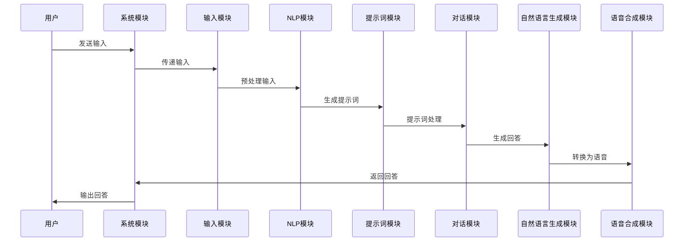

                 

### 第一部分: ChatGPT与提示词工程基础

#### 1.1 ChatGPT概述

**1.1.1 ChatGPT的产生背景**

ChatGPT是由OpenAI于2022年11月30日推出的一个基于GPT-3.5的人工智能聊天机器人模型，其名称中的“Chat”代表对话功能，“GPT”则是“Generative Pre-trained Transformer”的缩写。ChatGPT的诞生源于人工智能领域对更加智能、自然的交互体验的持续追求。在此之前，AI对话系统多基于规则或模板，缺乏灵活性和创造力，而GPT-3.5模型的出现为这一领域带来了革命性的变化。

**1.1.2 ChatGPT的核心技术**

ChatGPT的核心技术基于GPT-3.5模型，这是一种基于Transformer架构的预训练语言模型。其训练数据来自大量互联网文本，通过无监督的方式学习语言模式和结构，从而实现高度的自然语言理解和生成能力。ChatGPT的强大之处在于其能够生成连贯、有逻辑的文本，并能够理解复杂的上下文和语境。

**1.1.3 ChatGPT的应用领域**

ChatGPT的应用非常广泛，涵盖了智能客服、智能问答、内容创作、代码编程助手等多个领域。其出色的对话能力使得它能够与用户进行自然、流畅的交互，极大地提升了用户体验。

#### 1.2 提示词工程的基础概念

**1.2.1 提示词的定义与作用**

提示词（Prompt）是指提供给AI模型的一段引导性文本，用以指导模型生成预期的输出。在ChatGPT的提示词工程中，提示词起到了关键作用，它不仅决定了对话的起始点，还影响了对话的深度和广度。

**1.2.2 提示词的设计原则**

设计有效的提示词需要遵循几个原则：明确性、针对性、启发性和灵活性。明确性要求提示词表述清晰，避免歧义；针对性确保提示词与对话目标紧密相关；启发性鼓励模型发挥其创造力；灵活性使提示词能够适应不同的对话场景。

**1.2.3 提示词的分类与类型**

提示词可以根据用途和形式分为多种类型，如问题引导型、内容创作型、指令执行型等。每种类型的提示词都有其特定的设计方法和应用场景，了解这些分类有助于更好地利用ChatGPT的能力。

#### 1.3 ChatGPT与提示词工程的联系

**1.3.1 提示词在ChatGPT中的重要性**

提示词是ChatGPT进行有效对话的基石，其设计质量直接影响模型的性能和用户体验。高质量的提示词能够引导模型生成更加准确、有价值的回答。

**1.3.2 提示词对ChatGPT性能的影响**

提示词的优劣直接关系到ChatGPT的性能表现。一个设计精良的提示词可以使模型在处理复杂问题、理解上下文和生成连贯文本方面表现得更加出色。

**1.3.3 提示词工程的实现方式**

提示词工程包括数据收集、预处理、提示词生成和优化等多个环节。有效的提示词工程需要综合考虑数据质量、模型特性和用户需求，通过实验和反馈不断优化提示词设计。

#### 1.4 ChatGPT提示词工程的关键技术

**1.4.1 数据收集与预处理**

数据是提示词工程的基础，其质量直接影响到提示词的生成效果。数据收集需要确保多样性和覆盖度，预处理则包括数据清洗、格式化、去重等步骤，以提高数据质量。

**1.4.2 提示词生成策略**

提示词生成是提示词工程的核心环节。根据不同的应用场景和需求，可以采用规则生成、机器学习生成等方法。规则生成基于专家知识和预定义模板，而机器学习生成则利用模型自动学习生成策略。

**1.4.3 提示词优化与评估**

提示词的优化与评估是确保其质量和性能的关键。通过反复实验和用户反馈，可以不断调整和优化提示词，以提高模型的对话质量和用户体验。

**1.5 本章小结**

本文首先介绍了ChatGPT的产生背景、核心技术及其应用领域，然后详细阐述了提示词工程的基础概念、设计原则和分类，最后讨论了ChatGPT与提示词工程之间的联系及关键技术。下一章我们将深入探讨ChatGPT提示词工程的实践案例。

----------------------------------------------------------------

## 1.1 ChatGPT概述

**1.1.1 ChatGPT的产生背景**

ChatGPT的出现是人工智能（AI）领域的重要里程碑，标志着自然语言处理（NLP）技术的重大突破。OpenAI在2022年11月30日发布了ChatGPT，这一模型的诞生不仅展现了深度学习在NLP领域的强大能力，还揭示了大规模预训练模型在通用任务上的巨大潜力。ChatGPT的产生背景可追溯至OpenAI长期以来对AI发展的探索和追求，特别是在语言理解和生成方面的研究。

OpenAI成立于2015年，其宗旨是“实现安全的通用人工智能（AGI）”，并推动AI技术的发展，使其造福人类社会。在ChatGPT之前，OpenAI已经推出了GPT-2和GPT-3，这些模型在文本生成、语言翻译、问答系统等方面取得了显著成果。然而，OpenAI团队意识到，仅凭静态的预训练模型还不足以实现真正自然、流畅的人机对话，因此他们开始探索动态交互式模型的可能性。

ChatGPT的开发主要基于GPT-3.5模型，这一模型结合了前人的研究成果，并进行了大量优化和改进。GPT-3.5不仅具备强大的语言理解能力，还能根据上下文生成高质量、连贯的文本，为ChatGPT的诞生提供了坚实的基础。

**1.1.2 ChatGPT的核心技术**

ChatGPT的核心技术基于生成预训练变换器（Generative Pre-trained Transformer，GPT），特别是GPT-3.5模型。GPT系列模型由OpenAI的团队提出，并采用Transformer架构，这是一种在序列数据上表现优异的神经网络架构。Transformer模型通过自注意力机制（Self-Attention）对输入序列中的每个词进行权重分配，从而捕捉到词与词之间的依赖关系，这使得模型能够生成更加自然和连贯的文本。

GPT-3.5模型在GPT的基础上进行了多项改进，包括：

1. **更大的模型规模**：GPT-3.5拥有1750亿个参数，是GPT-3的数倍，这使得模型在处理长文本和复杂任务时具有更高的精度和灵活性。
2. **更精细的预训练**：GPT-3.5采用了更多的训练数据，并进行了更精细的微调，使得模型在特定任务上的表现更加出色。
3. **动态交互机制**：ChatGPT在GPT-3.5的基础上引入了动态交互机制，使得模型能够在与用户互动的过程中不断学习和调整，从而实现更加自然的对话。

**1.1.3 ChatGPT的应用领域**

ChatGPT的应用领域非常广泛，涵盖了多个重要的行业和场景。以下是ChatGPT的一些主要应用领域：

1. **智能客服**：ChatGPT能够与用户进行自然、流畅的对话，广泛应用于客户服务、在线咨询等领域，为企业和用户提供了便捷的交互体验。
2. **智能问答系统**：ChatGPT能够理解用户的提问，并生成准确的回答，广泛应用于搜索引擎、问答社区、智能助手等领域。
3. **内容创作**：ChatGPT能够生成高质量的文章、博客、诗歌等文本内容，为创作者提供了强大的辅助工具。
4. **代码编程助手**：ChatGPT能够根据编程问题生成相关的代码片段，帮助开发者提高工作效率。
5. **教育辅助**：ChatGPT可以为学生提供个性化的学习辅导，解答他们在学习过程中遇到的问题。
6. **自然语言处理**：ChatGPT在语言翻译、情感分析、文本分类等方面也具有广泛的应用前景。

ChatGPT的出现不仅为人工智能领域带来了新的研究热点，还为各行各业提供了创新的解决方案，推动了AI技术的实际应用和发展。

#### 1.2 提示词工程的基础概念

**1.2.1 提示词的定义与作用**

提示词（Prompt）是指导AI模型生成预期输出的引导性文本。在ChatGPT的背景下，提示词起到了关键作用，它不仅决定了对话的起始点，还影响了对话的深度和广度。提示词的设计质量直接关系到ChatGPT的性能和用户体验。

提示词的基本作用包括：

1. **引导对话方向**：通过提供明确的起始话题和上下文，提示词可以帮助模型理解用户意图，并引导对话朝着用户期望的方向发展。
2. **优化回答质量**：高质量的提示词能够提供足够的信息，使模型能够生成更加准确、有价值的回答。
3. **提高生成效率**：有效的提示词可以减少模型的推理时间，提高生成效率，从而提升用户体验。

**1.2.2 提示词的设计原则**

设计提示词需要遵循以下几个原则：

1. **明确性**：提示词应表述清晰，避免歧义，确保模型能够准确理解用户意图。
2. **针对性**：提示词应与对话目标紧密相关，确保模型生成的回答能够满足用户需求。
3. **启发性**：提示词应具有启发性，鼓励模型发挥其创造力，生成丰富多样的回答。
4. **灵活性**：提示词应具有灵活性，能够适应不同的对话场景和用户需求。

**1.2.3 提示词的分类与类型**

根据用途和形式，提示词可以分为以下几种类型：

1. **问题引导型**：这类提示词主要用于引导用户提出问题，例如：“您有什么问题需要咨询吗？”。
2. **内容创作型**：这类提示词用于引导模型生成文本内容，例如：“请写一篇关于人工智能的概述”。
3. **指令执行型**：这类提示词用于指导模型执行特定操作，例如：“请将这句话翻译成英文”。
4. **情景模拟型**：这类提示词用于模拟特定情景，帮助模型理解上下文，例如：“假设您是一名医生，请回答以下问题”。
5. **反馈优化型**：这类提示词用于获取用户反馈，以便调整模型输出，例如：“您对这个回答满意吗？”。

每种类型的提示词都有其特定的设计方法和应用场景，了解这些分类有助于更好地利用ChatGPT的能力。

#### 1.3 ChatGPT与提示词工程的联系

**1.3.1 提示词在ChatGPT中的重要性**

提示词是ChatGPT进行有效对话的基石，其设计质量直接影响模型的性能和用户体验。高质量的提示词能够引导模型生成更加准确、有价值的回答，从而提升对话质量。

首先，提示词决定了对话的起始点和方向。一个明确的提示词可以帮助ChatGPT更好地理解用户意图，避免对话偏离主题。例如，当用户提问“您有什么建议吗？”时，提示词明确地引导ChatGPT生成针对用户需求的具体建议。

其次，提示词的表述质量直接影响回答的准确性。高质量的提示词提供了足够的信息，使模型能够生成更加准确的回答。例如，在医疗咨询场景中，一个详细的症状描述可以帮助ChatGPT提供更准确的诊断建议。

最后，提示词还影响用户体验。一个设计精良的提示词可以使ChatGPT的对话更加自然、流畅，提高用户满意度。例如，在客服场景中，一个亲切、友好的提示词可以增强用户与ChatGPT之间的互动体验。

**1.3.2 提示词对ChatGPT性能的影响**

提示词的优劣直接关系到ChatGPT的性能表现。一个设计精良的提示词可以显著提升ChatGPT的对话质量，而一个模糊不清的提示词可能导致ChatGPT生成无关或错误的回答。

首先，提示词的明确性对性能影响显著。一个明确、具体的提示词可以帮助ChatGPT更好地理解用户意图，从而生成相关、准确的回答。例如，在查询天气信息时，提示词“今天的天气如何？”比“告诉我天气”更具体，有助于ChatGPT提供详细的天气状况。

其次，提示词的长度和复杂性也会影响性能。较短的提示词可能过于简洁，导致ChatGPT无法充分理解用户意图，而过于复杂的提示词可能使ChatGPT处理起来困难，影响回答的质量。因此，设计提示词时需要在简洁性和具体性之间找到平衡。

此外，提示词的多样性也对性能有重要影响。通过使用不同类型的提示词，如问题引导型、内容创作型、指令执行型等，可以丰富ChatGPT的回答内容，提高其对话能力。

**1.3.3 提示词工程的实现方式**

提示词工程包括数据收集、预处理、提示词生成和优化等多个环节，其实现方式如下：

1. **数据收集**：数据是提示词工程的基础，其质量直接影响提示词的生成效果。数据收集需要确保多样性和覆盖度，包括不同场景、不同话题的对话数据。

2. **预处理**：数据预处理包括数据清洗、格式化、去重等步骤，以提高数据质量。例如，去除无效字符、统一文本格式、去除重复数据等。

3. **提示词生成**：提示词生成是提示词工程的核心环节。根据不同的应用场景和需求，可以采用规则生成、机器学习生成等方法。规则生成基于专家知识和预定义模板，而机器学习生成则利用模型自动学习生成策略。

4. **优化与评估**：提示词的优化与评估是确保其质量和性能的关键。通过反复实验和用户反馈，可以不断调整和优化提示词，以提高模型的对话质量和用户体验。评估指标包括回答的准确性、流畅性、相关性等。

总之，提示词工程是一个复杂而关键的过程，其实现方式需要综合考虑数据质量、模型特性和用户需求，通过不断实验和优化，才能实现最佳效果。

#### 1.4 ChatGPT提示词工程的关键技术

**1.4.1 数据收集与预处理**

在ChatGPT提示词工程中，数据收集与预处理是至关重要的一步。高质量的数据是生成有效提示词的基础，而数据预处理则确保了数据的质量和一致性。

**数据收集**：数据收集的目标是获取涵盖各种场景和话题的对话数据。这些数据可以来源于多种渠道，如社交媒体、论坛、客服对话记录、新闻文章等。为了确保数据的多样性和代表性，应该从多个来源和角度进行数据收集，以涵盖不同用户群体和对话情境。

在数据收集过程中，还需要注意数据的时效性。由于语言和话题的演变速度较快，较新的数据更能反映当前的语言使用习惯和对话模式。

**预处理**：数据预处理主要包括以下几个步骤：

1. **数据清洗**：去除无效数据，如噪音、错误信息、重复数据等。这一步骤有助于提高数据质量，减少后续处理的负担。
2. **文本规范化**：统一文本格式，如去除HTML标签、统一标点符号、转换大小写等。这一步骤有助于保证数据的一致性和可处理性。
3. **实体识别与信息抽取**：识别文本中的关键实体（如人名、地点、组织名等）和重要信息（如时间、数量等），以便后续的语义分析和提示词生成。
4. **文本分类**：将对话数据按照不同的主题或类型进行分类，以便进行更精细的提示词设计和优化。

**1.4.2 提示词生成策略**

提示词生成是提示词工程的核心环节，其目标是根据对话数据和模型需求生成高质量的提示词。根据不同的应用场景和需求，可以采用以下几种生成策略：

1. **基于规则的生成**：基于规则的方法依赖于预定义的模板和规则，通过填充变量来生成提示词。这种方法简单直观，适用于对话场景较为固定和明确的情况。例如，对于客服系统，可以设计一系列常见的用户问题和系统回答，并在实际对话中根据用户输入动态填充。

2. **基于机器学习的生成**：基于机器学习的方法通过训练模型来自动生成提示词。这种方法能够根据对话数据和用户反馈不断优化，适用于复杂多变和多样化的对话场景。常见的机器学习方法包括循环神经网络（RNN）、长短期记忆网络（LSTM）、变换器（Transformer）等。

3. **混合生成策略**：结合基于规则和基于机器学习的方法，将规则生成和机器学习生成相结合，以提高提示词的生成质量和多样性。例如，可以先使用基于规则的生成方法获取初始提示词，然后使用机器学习模型对提示词进行优化和调整。

**1.4.3 提示词优化与评估**

提示词优化与评估是确保提示词质量和性能的关键步骤。通过反复实验和用户反馈，可以不断调整和优化提示词，以提高模型的对话质量和用户体验。

**提示词优化**：提示词优化主要包括以下几个方面：

1. **明确性**：确保提示词表述清晰，避免歧义。可以通过增加具体描述、明确问题范围等方式来提高提示词的明确性。
2. **针对性**：确保提示词与对话目标紧密相关，能够引导模型生成符合用户需求的回答。可以通过分析对话数据，识别用户意图和需求，来优化提示词的针对性。
3. **灵活性**：提高提示词的灵活性，使其能够适应不同的对话场景和用户需求。可以通过使用多样化的提示词模板、引入上下文信息等方式来增强提示词的灵活性。

**提示词评估**：提示词评估主要通过以下指标进行：

1. **准确性**：评估提示词是否能够准确引导模型生成符合用户需求的回答。可以通过对比模型生成回答和标准答案的相似度来衡量。
2. **流畅性**：评估提示词是否能够引导模型生成连贯、自然的对话。可以通过评估模型生成文本的流畅性和语法正确性来衡量。
3. **相关性**：评估提示词是否与对话目标紧密相关，是否能够有效引导模型生成相关回答。可以通过分析模型生成回答与用户输入的相关度来衡量。

通过提示词优化与评估，可以不断调整和改进提示词，以提高ChatGPT的对话质量和用户体验。这一过程需要结合用户反馈和实际应用场景，持续进行实验和迭代。

**1.5 本章小结**

本文详细介绍了ChatGPT的产生背景、核心技术及其应用领域，并探讨了提示词工程的基础概念、设计原则和分类。接着，本文深入分析了提示词在ChatGPT中的重要性以及提示词对ChatGPT性能的影响，最后介绍了ChatGPT提示词工程的关键技术，包括数据收集与预处理、提示词生成策略和提示词优化与评估。通过这些内容的介绍，读者可以更全面地理解ChatGPT和提示词工程的基本原理和实践方法。下一章将进入ChatGPT提示词工程的实践环节，通过具体案例来展示如何应用这些技术，以实现更加智能和自然的对话系统。

----------------------------------------------------------------

## 2.1 ChatGPT环境搭建与配置

**2.1.1 硬件与软件要求**

搭建ChatGPT环境需要一定的硬件和软件支持。以下是搭建ChatGPT环境所需的硬件和软件要求：

**硬件要求**：

1. **CPU**：至少需要4个物理CPU核心，推荐使用64位架构的处理器。
2. **内存**：至少需要16GB内存，推荐使用64GB内存以支持更大规模的模型训练。
3. **GPU**：至少需要1块NVIDIA GPU，推荐使用V100及以上型号的GPU以支持高效的模型训练。
4. **硬盘**：至少需要1TB的硬盘空间，用于存储模型数据和训练日志。

**软件要求**：

1. **操作系统**：Linux或MacOS，推荐使用Ubuntu 18.04或更高版本。
2. **Python**：Python 3.7或更高版本。
3. **PyTorch**：PyTorch 1.8或更高版本。
4. **transformers**：用于加载预训练的GPT-3.5模型。
5. **其他依赖**：包括torch、torchtext、torchvision等。

**2.1.2 ChatGPT安装与配置**

以下是ChatGPT的安装与配置步骤：

1. **安装依赖**：

   ```shell
   pip install torch torchvision torchaudio torchtext transformers
   ```

2. **加载预训练模型**：

   ```python
   from transformers import AutoModelForCausalLM

   model = AutoModelForCausalLM.from_pretrained("openai/gpt-3.5-turbo")
   ```

3. **配置硬件**：

   为了充分利用GPU资源，可以设置CUDA_VISIBLE_DEVICES环境变量，例如：

   ```shell
   export CUDA_VISIBLE_DEVICES=0,1
   ```

4. **测试模型**：

   ```python
   import torch

   input_ids = model.prepare_input("你好，我是ChatGPT。")
   output = model.generate(input_ids, max_length=50, num_return_sequences=1)
   print(output)
   ```

**2.1.3 常见问题的解决**

在搭建ChatGPT环境的过程中，可能会遇到一些常见问题，以下是一些解决方案：

1. **CUDA错误**：

   如果出现CUDA相关的错误，可以检查CUDA_VISIBLE_DEVICES设置是否正确，或者检查GPU驱动是否更新到最新版本。

2. **依赖安装失败**：

   如果依赖安装失败，可以尝试更新pip版本，使用pip install --upgrade pip命令，或者更换pip源，例如使用清华的pip源。

3. **模型加载失败**：

   如果加载预训练模型失败，可以尝试更换模型版本，或者检查网络连接是否正常。

4. **GPU资源不足**：

   如果GPU资源不足，可以减少训练批次大小或者增加CPU使用率，以释放GPU资源。

通过以上步骤，可以顺利搭建ChatGPT环境，并进行模型训练和部署。接下来，我们将通过具体案例来展示如何利用ChatGPT进行提示词工程实践。

#### 2.2 提示词工程实战案例

在本节中，我们将通过两个实战案例，详细展示如何利用ChatGPT进行提示词工程，并分析这些案例的实现步骤、效果和优化策略。

**2.2.1 案例一：智能客服系统**

**案例背景**：某电商平台需要为其在线客服系统引入人工智能助手，以提高客服效率和用户体验。

**实现步骤**：

1. **数据收集与预处理**：从平台的历史客服对话记录中收集数据，并进行预处理，包括数据清洗、文本规范化、实体识别等。
2. **模型训练**：使用预处理后的数据训练ChatGPT模型，配置适当的参数，如学习率、批次大小等。
3. **提示词设计**：根据客服场景，设计一系列问题引导型、指令执行型提示词，如“您有什么问题需要咨询吗？”、“请提供您的订单号”等。
4. **模型部署与测试**：将训练好的模型部署到服务器，并进行测试，确保模型能够正确理解用户输入并生成合适的回答。

**案例分析**：

在实施过程中，通过高质量的提示词设计，客服系统能够更好地引导用户提出具体的问题，从而生成更加准确和有针对性的回答。例如，当用户输入“订单状态查询”时，系统可以自动引导用户输入订单号，并生成相应的订单状态信息。

**优化策略**：

1. **增强提示词的针对性**：通过分析用户输入和系统回答，进一步优化提示词，使其更加贴近用户需求。
2. **引入用户反馈机制**：通过用户反馈，不断调整和优化模型参数，提高系统性能和用户体验。
3. **多语言支持**：扩展提示词库，支持多种语言，以覆盖不同语系的用户。

**2.2.2 案例二：智能问答系统**

**案例背景**：某教育平台需要为其在线问答系统引入人工智能助手，以提供即时、准确的答案。

**实现步骤**：

1. **数据收集与预处理**：从教育平台的知识库中收集问题及其标准答案，并进行预处理，包括文本规范化、实体识别等。
2. **模型训练**：使用预处理后的数据训练ChatGPT模型，配置适当的参数，如学习率、批次大小等。
3. **提示词设计**：设计一系列问题引导型、内容创作型提示词，如“请回答以下问题：什么是人工智能？”、“请为以下概念写一个简短的描述：深度学习”等。
4. **模型部署与测试**：将训练好的模型部署到服务器，并进行测试，确保模型能够正确理解用户输入并生成合适的答案。

**案例分析**：

在教育问答系统中，ChatGPT通过高质量的提示词能够有效地理解和生成与教育内容相关的回答。例如，当用户输入“请解释机器学习的基本原理”时，系统能够生成详细的机器学习解释，包括基本概念、算法流程等。

**优化策略**：

1. **增强知识库的更新**：定期更新知识库，确保问答系统能够提供最新的教育信息。
2. **引入专家评审机制**：邀请教育专家对生成的回答进行审核，确保回答的准确性和权威性。
3. **多模态支持**：结合文本、图片、视频等多媒体内容，提高问答系统的丰富性和互动性。

**2.2.3 案例总结**

通过以上两个案例，我们可以看到，ChatGPT在智能客服和智能问答系统中都发挥了重要作用。通过设计高质量的提示词，系统能够更好地理解和满足用户需求，从而提升用户体验和系统性能。在实际应用中，需要不断优化提示词和模型，以实现最佳效果。

#### 2.3 提示词优化与调参技巧

**2.3.1 提示词优化策略**

提示词的优化是提高ChatGPT性能和对话质量的关键步骤。以下是几种常见的提示词优化策略：

1. **明确性优化**：确保提示词表述清晰，避免歧义。可以通过增加具体描述、明确问题范围等方式来实现。
2. **针对性优化**：确保提示词与对话目标紧密相关，能够引导模型生成符合用户需求的回答。可以通过分析用户输入和模型输出，调整提示词内容来实现。
3. **灵活性优化**：提高提示词的灵活性，使其能够适应不同的对话场景和用户需求。可以通过使用多样化的提示词模板、引入上下文信息等方式来实现。

**2.3.2 调参技巧**

调参（Hyperparameter Tuning）是优化模型性能的重要手段。以下是一些常见的调参技巧：

1. **学习率调整**：学习率是模型训练过程中一个重要的参数，适当的调整可以提高训练效率。可以使用学习率衰减策略，在训练过程中逐步降低学习率。
2. **批次大小调整**：批次大小影响模型的训练速度和稳定性。较大的批次大小可以加速训练，但可能导致梯度不稳定；较小的批次大小可以提高模型的泛化能力，但训练时间较长。
3. **正则化调整**：正则化（Regularization）用于防止模型过拟合。常见的正则化方法有L1正则化、L2正则化等，可以通过调整正则化强度来优化模型性能。
4. **优化器选择**：不同的优化器（Optimizer）适用于不同类型的模型和任务。常见的优化器有SGD、Adam、RMSprop等，可以通过实验选择最适合当前任务的优化器。

**2.3.3 性能评估与调优实践**

性能评估是验证模型性能的重要环节，以下是一些常见的性能评估指标和调优实践：

1. **评估指标**：

   - **准确性**：评估模型生成回答与标准答案的相似度。
   - **流畅性**：评估模型生成文本的流畅性和语法正确性。
   - **相关性**：评估模型生成回答与用户输入的相关度。
   - **多样性**：评估模型生成回答的多样性和创意性。

2. **调优实践**：

   - **初步评估**：在训练集上初步评估模型性能，确定基本参数范围。
   - **交叉验证**：使用交叉验证方法，进一步验证模型性能和稳定性。
   - **迭代优化**：通过逐步调整参数，反复进行训练和评估，逐步优化模型性能。
   - **用户反馈**：结合用户反馈，进一步调整模型参数，提高用户体验。

通过提示词优化和调参技巧，可以显著提升ChatGPT的对话质量和性能。在实际应用中，需要根据具体场景和需求，灵活运用这些技巧，以实现最佳效果。

#### 2.4 高级应用场景

**2.4.1 多模态提示词工程**

随着人工智能技术的发展，多模态提示词工程逐渐成为一个重要的研究领域。多模态提示词工程旨在结合不同类型的数据（如文本、图像、声音等），使模型能够更好地理解和生成复杂的信息。以下是多模态提示词工程的一些应用场景：

1. **图像识别与描述**：通过结合图像和文本，模型可以生成更准确的图像描述。例如，在医疗诊断中，医生可以输入患者的图像和症状描述，模型能够生成相应的诊断结果和建议。
2. **视频分析**：多模态提示词工程可以用于视频分析，如情感分析、行为识别等。通过结合视频内容和文本描述，模型可以更好地理解视频内容，提供更准确的情感分析和行为识别结果。
3. **虚拟助手**：在虚拟现实（VR）和增强现实（AR）领域，多模态提示词工程可以帮助虚拟助手更好地理解用户的需求和环境。例如，用户可以通过语音和手势与虚拟助手互动，模型能够结合语音、手势和视觉信息，提供更加自然和直观的交互体验。

**2.4.2 对话式推荐系统**

对话式推荐系统是一种基于自然语言交互的推荐系统，通过对话方式向用户提供个性化推荐。以下是对话式推荐系统的一些应用场景：

1. **电子商务**：在电子商务平台上，对话式推荐系统可以与用户进行自然语言交互，根据用户的历史购买记录、搜索行为和偏好，提供个性化的商品推荐。
2. **内容推荐**：在视频流媒体、新闻平台等领域，对话式推荐系统可以与用户进行对话，了解用户的兴趣和偏好，提供个性化的内容推荐。
3. **金融服务**：在金融领域，对话式推荐系统可以与用户进行对话，根据用户的投资目标和风险偏好，提供个性化的投资建议和产品推荐。

**2.4.3 情感分析**

情感分析是自然语言处理的一个重要任务，旨在识别文本中的情感倾向。以下是情感分析的一些应用场景：

1. **社交媒体分析**：通过情感分析，可以了解用户在社交媒体上的情绪状态，为企业提供市场洞察和营销策略。
2. **客户服务**：在客户服务领域，情感分析可以帮助企业了解用户反馈的情感倾向，提供更好的客户服务和改进措施。
3. **舆情监测**：通过情感分析，可以实时监测和评估公众对特定事件、产品或品牌的情感态度，为政府和企业提供决策支持。

通过在高级应用场景中应用多模态提示词工程、对话式推荐系统和情感分析等技术，ChatGPT的智能对话能力可以得到进一步提升，为各行业提供更加智能化、个性化的解决方案。

#### 2.5 本章小结

本章详细介绍了ChatGPT环境搭建与配置、提示词工程实战案例、提示词优化与调参技巧以及高级应用场景。首先，我们阐述了搭建ChatGPT环境所需的硬件与软件要求，并介绍了安装与配置步骤。接着，通过两个实战案例展示了如何利用ChatGPT进行提示词工程实践。然后，我们探讨了提示词优化策略和调参技巧，并介绍了性能评估方法。最后，我们探讨了多模态提示词工程、对话式推荐系统和情感分析等高级应用场景。通过本章的内容，读者可以全面了解ChatGPT提示词工程的基础知识和实践方法，为实际应用提供有力支持。

----------------------------------------------------------------

## 3.1 提示词生成算法原理

**3.1.1 基于规则的提示词生成算法**

基于规则的提示词生成算法是一种传统的生成方法，它依赖于预定义的规则和模板。这种方法通常由专家根据对话系统的需求设计一系列规则和模板，然后根据用户输入动态填充这些模板，生成提示词。

**工作原理**：

1. **规则库构建**：首先，构建一个规则库，包含各种对话场景下的规则和模板。这些规则和模板通常基于专家经验和预定义的逻辑关系。
2. **输入匹配**：当用户输入文本时，系统会根据输入内容在规则库中查找匹配的规则。
3. **动态填充**：找到匹配的规则后，系统会根据用户输入动态填充模板，生成提示词。
4. **输出提示词**：生成的提示词将作为输入传递给对话模型，以生成相应的回答。

**优势与局限性**：

- **优势**：这种方法简单直观，易于实现和理解。在对话系统设计初期或对话场景较为固定的情况下，基于规则的提示词生成算法能够快速构建和部署。
- **局限性**：这种方法难以应对复杂和动态的对话场景。当对话场景发生变化时，需要频繁更新规则库，增加了维护成本。

**3.1.2 基于机器学习的提示词生成算法**

基于机器学习的提示词生成算法通过训练模型来自动生成提示词。这种方法利用大量的对话数据，通过机器学习算法学习生成策略，从而实现自动化的提示词生成。

**工作原理**：

1. **数据收集与预处理**：首先，收集大量的对话数据，并进行预处理，包括数据清洗、格式化、去重等。
2. **模型训练**：使用预处理后的数据训练机器学习模型，如循环神经网络（RNN）、长短期记忆网络（LSTM）、变换器（Transformer）等。
3. **提示词生成**：训练好的模型可以根据用户输入生成相应的提示词。生成过程通常包括编码器和解码器两个部分，编码器将用户输入编码成固定长度的向量，解码器根据向量生成提示词。
4. **优化与评估**：通过反复训练和评估，不断优化模型性能，提高生成的提示词质量。

**优势与局限性**：

- **优势**：基于机器学习的提示词生成算法能够自动学习生成策略，适应复杂和动态的对话场景。这种方法具有更高的灵活性和自适应能力，能够生成更加丰富和多样的提示词。
- **局限性**：这种方法需要大量的训练数据和计算资源，且训练过程较为复杂。此外，模型生成的提示词可能存在偏差，需要结合人工审核和调整。

**3.1.3 深度学习在提示词生成中的应用**

深度学习在提示词生成中的应用主要包括基于变换器（Transformer）的模型，如GPT、BERT等。这些模型通过自注意力机制和多层神经网络结构，实现了对大规模文本数据的预训练，从而具备强大的语言理解和生成能力。

**工作原理**：

1. **预训练**：深度学习模型在大量文本数据上进行预训练，学习语言模式和结构。预训练过程中，模型通过自注意力机制捕捉文本中的依赖关系，从而生成固定长度的向量表示。
2. **微调**：在预训练完成后，模型可以根据具体任务进行微调，即调整模型参数以适应特定对话场景。微调过程通常使用少量有标注的对话数据，通过梯度下降等优化算法调整模型参数。
3. **提示词生成**：微调后的模型可以根据用户输入生成相应的提示词。生成过程与基于机器学习的提示词生成算法类似，包括编码器和解码器两个部分。

**优势与局限性**：

- **优势**：深度学习模型在语言理解和生成方面表现出色，能够生成高质量、连贯的文本。此外，深度学习模型具有高度的灵活性和自适应能力，可以适应各种复杂的对话场景。
- **局限性**：深度学习模型需要大量的训练数据和计算资源，且训练过程较为复杂。此外，模型的解释性较低，难以理解生成文本的具体原因。

通过综合应用基于规则的提示词生成算法、基于机器学习的提示词生成算法和深度学习模型，我们可以构建出具有高度智能化和自适应能力的提示词生成系统，为ChatGPT的对话系统提供坚实的基础。

#### 3.2 数学模型与公式详解

在ChatGPT提示词工程中，数学模型和公式扮演着至关重要的角色。它们不仅帮助我们理解和设计提示词生成算法，还提供了评估和优化模型性能的工具。以下是关于语言模型、提示词优化目标和深度学习优化算法的数学模型与公式详解。

**3.2.1 语言模型基本公式**

语言模型（Language Model）是自然语言处理的基础，用于预测下一个单词或字符。在ChatGPT中，常用的语言模型是基于变换器（Transformer）的模型，如GPT。以下是语言模型的一些基本公式：

1. **自注意力机制**：

   自注意力（Self-Attention）是变换器模型的核心组成部分，用于计算输入序列中每个词的重要性。其基本公式为：

   $$  
   \text{Attention}(Q, K, V) = \text{softmax}(\frac{QK^T}{\sqrt{d_k}})V  
   $$

   其中，\(Q\)、\(K\)、\(V\)分别为查询向量、键向量和值向量，\(d_k\)为键向量的维度。

2. **变换器层**：

   变换器层（Transformer Layer）由多个自注意力层和前馈神经网络组成。其基本公式为：

   $$  
   \text{TransformerLayer}(X) = \text{LayerNorm}(X + \text{MultiHeadAttention}(X, X, X)) + \text{LayerNorm}(X + \text{PositionwiseFeedForward}(X))  
   $$

   其中，\(X\)为输入序列，\(\text{MultiHeadAttention}\)和\(\text{PositionwiseFeedForward}\)分别为多头自注意力机制和前馈神经网络。

**3.2.2 提示词优化目标函数**

提示词优化目标是设计一个优化函数，用于评估和调整提示词的质量。以下是一个简化的提示词优化目标函数：

1. **交叉熵损失函数**：

   交叉熵损失函数（Cross-Entropy Loss）用于衡量模型生成的文本与目标文本之间的差异。其基本公式为：

   $$  
   \text{Loss} = -\sum_{i} y_i \log(p_i)  
   $$

   其中，\(y_i\)为真实标签（0或1），\(p_i\)为模型预测的概率。

2. **提示词质量评分函数**：

   提示词质量评分函数（Prompt Quality Score）用于评估提示词的明确性、针对性和灵活性。其基本公式为：

   $$  
   \text{QualityScore} = \alpha_1 \cdot \text{ClarityScore} + \alpha_2 \cdot \text{RelevanceScore} + \alpha_3 \cdot \text{FlexibilityScore}  
   $$

   其中，\(\alpha_1\)、\(\alpha_2\)、\(\alpha_3\)为权重系数，\(\text{ClarityScore}\)、\(\text{RelevanceScore}\)、\(\text{FlexibilityScore}\)分别为提示词的明确性、针对性和灵活性评分。

**3.2.3 深度学习优化算法**

深度学习优化算法用于调整模型参数，以优化模型性能。以下是一些常用的深度学习优化算法：

1. **随机梯度下降（SGD）**：

   随机梯度下降是一种基本的优化算法，其基本公式为：

   $$  
   \theta = \theta - \alpha \cdot \nabla_\theta J(\theta)  
   $$

   其中，\(\theta\)为模型参数，\(\alpha\)为学习率，\(J(\theta)\)为损失函数。

2. **Adam优化器**：

   Adam优化器是一种结合了SGD和动量法的优化算法，其基本公式为：

   $$  
   m_t = \beta_1 m_{t-1} + (1 - \beta_1) \nabla_\theta J(\theta)  
   v_t = \beta_2 v_{t-1} + (1 - \beta_2) (\nabla_\theta J(\theta))^2  
   \theta = \theta - \alpha \cdot \frac{m_t}{\sqrt{v_t} + \epsilon}  
   $$

   其中，\(\beta_1\)、\(\beta_2\)分别为一阶和二阶动量系数，\(\epsilon\)为平滑常数。

通过理解和应用这些数学模型和公式，我们可以更好地设计和优化ChatGPT提示词工程，从而实现高质量的对话生成。

#### 3.3 系统架构设计与实现

**3.3.1 系统架构设计**

ChatGPT提示词工程系统架构设计旨在实现高效、可扩展和可维护的对话系统。以下是系统架构设计的关键组成部分：

1. **输入层**：接收用户输入，可以是文本、语音或其他形式的数据。输入层通常包括语音识别模块和自然语言处理（NLP）模块。
2. **预处理层**：对用户输入进行预处理，包括分词、词性标注、实体识别等。预处理层的目的是将原始输入转换为模型能够处理的格式。
3. **提示词生成层**：根据预处理后的输入，使用提示词生成算法生成相应的提示词。提示词生成层可以采用基于规则的生成方法、基于机器学习的生成方法或深度学习模型。
4. **对话引擎层**：对话引擎层负责处理用户输入和提示词，生成自然语言回答。对话引擎层通常包括自然语言生成（NLG）模块和对话管理模块。
5. **输出层**：将生成的回答以文本、语音或其他形式返回给用户。输出层还可以包括语音合成模块和视觉渲染模块。

**3.3.2 系统功能模块划分**

系统功能模块划分如下：

1. **用户输入模块**：负责接收和处理用户输入，包括语音识别和文本输入。
2. **自然语言处理模块**：负责对用户输入进行预处理，包括分词、词性标注、实体识别等。
3. **提示词生成模块**：负责生成提示词，包括规则生成和机器学习生成。
4. **对话管理模块**：负责管理对话流程，包括对话状态跟踪、上下文维护等。
5. **自然语言生成模块**：负责将提示词转换为自然语言回答，并处理回答的语法、语义和风格。
6. **语音合成模块**：负责将文本回答转换为语音输出。
7. **输出层**：负责将处理后的回答以文本或语音形式返回给用户。

**3.3.3 系统架构图**

以下是ChatGPT提示词工程系统的架构图：

```
+---------------------------+
|      用户输入模块         |
+---------------------------+
        |
        V
+---------------------------+
|      自然语言处理模块      |
+---------------------------+
        |
        V
+---------------------------+
|      提示词生成模块        |
+---------------------------+
        |
        V
+---------------------------+
|      对话管理模块         |
+---------------------------+
        |
        V
+---------------------------+
|      自然语言生成模块      |
+---------------------------+
        |
        V
+---------------------------+
|      语音合成模块         |
+---------------------------+
        |
        V
+---------------------------+
|          输出层           |
+---------------------------+
```

**3.3.4 接口设计与交互**

系统接口设计包括API接口和消息队列，用于实现模块之间的交互和数据传递。

1. **API接口**：系统提供RESTful API接口，供外部系统调用。API接口包括用户输入接口、提示词生成接口、对话管理接口和回答输出接口。

2. **消息队列**：系统使用消息队列（如RabbitMQ、Kafka等）进行异步通信，提高系统的并发处理能力和容错性。

接口交互流程如下：

1. 用户输入数据通过API接口发送到用户输入模块。
2. 用户输入模块将数据传递给自然语言处理模块，进行预处理。
3. 预处理后的数据传递给提示词生成模块，生成提示词。
4. 提示词生成模块将提示词传递给对话管理模块，进行对话处理。
5. 对话管理模块生成自然语言回答，传递给自然语言生成模块。
6. 自然语言生成模块将回答转换为文本或语音，传递给语音合成模块。
7. 语音合成模块将处理后的回答传递给输出层，返回给用户。

通过以上系统架构设计与实现，ChatGPT提示词工程系统能够高效、灵活地处理用户输入，生成高质量的自然语言回答，为用户提供良好的交互体验。

#### 3.3.5 系统交互序列图

为了更好地理解ChatGPT提示词工程系统的交互流程，我们使用Mermaid语言绘制了系统交互序列图，展示了用户输入、数据处理和回答生成的完整过程。



**图解：**

1. **用户输入**：用户通过系统接口发送输入数据。
2. **输入模块处理**：输入模块接收到用户输入后，将数据进行初步处理，如分词、去噪等。
3. **NLP模块预处理**：NLP模块对输入数据进行深度处理，包括词性标注、实体识别等。
4. **提示词生成**：提示词模块根据预处理后的数据生成相应的提示词。
5. **对话处理**：对话模块接收到提示词后，根据对话上下文和规则生成回答。
6. **自然语言生成**：自然语言生成模块将对话模块生成的回答转换为自然语言文本。
7. **语音合成**：语音合成模块将文本回答转换为语音输出。
8. **输出回答**：系统将处理后的回答返回给用户，完成整个交互流程。

通过这个交互序列图，我们可以清晰地看到ChatGPT提示词工程系统各个模块之间的协作过程，以及数据在系统中的流转路径。

#### 3.4 最佳实践与技巧

**3.4.1 提示词设计最佳实践**

高质量的提示词设计是ChatGPT提示词工程成功的关键。以下是几个提示词设计最佳实践：

1. **明确性**：提示词应表述清晰，避免歧义。使用具体、简洁的语言，确保模型能够准确理解用户意图。
2. **针对性**：提示词应与对话目标紧密相关，确保模型生成的回答能够满足用户需求。通过分析用户输入和对话上下文，设计具有针对性的提示词。
3. **灵活性**：提示词应具有灵活性，能够适应不同的对话场景和用户需求。使用多样化的提示词模板，结合上下文信息，增强提示词的灵活性。
4. **简洁性**：提示词应尽量简洁，避免冗长和复杂的表述。简洁的提示词有助于模型更快地理解和生成回答。
5. **多样性**：设计多样化的提示词，提高模型的生成多样性和创意性。通过引入不同的表达方式和角度，丰富对话内容。

**3.4.2 性能调优技巧**

性能调优是提高ChatGPT提示词工程系统性能的重要环节。以下是几个性能调优技巧：

1. **学习率调整**：适当调整学习率，可以加速模型收敛速度。使用学习率衰减策略，逐步降低学习率，避免模型过拟合。
2. **批次大小优化**：选择合适的批次大小，可以提高模型的训练速度和稳定性。较大的批次大小可以加速训练，但可能导致梯度不稳定；较小的批次大小可以提高模型的泛化能力，但训练时间较长。
3. **正则化应用**：正则化方法（如L1正则化、L2正则化）可以防止模型过拟合。通过调整正则化强度，优化模型性能。
4. **数据增强**：通过数据增强方法，如数据扩充、数据清洗、数据预处理等，提高模型对数据的适应能力，增强模型的泛化能力。
5. **交叉验证**：使用交叉验证方法，对模型进行多次训练和验证，优化模型参数和结构。交叉验证有助于评估模型在未见数据上的性能，提高模型的可信度。

**3.4.3 安全性与隐私保护**

在ChatGPT提示词工程中，安全性和隐私保护是必须考虑的重要因素。以下是几个安全性和隐私保护的最佳实践：

1. **数据加密**：对用户输入和模型生成的数据进行加密，确保数据在传输和存储过程中的安全性。使用高级加密算法（如AES），提高数据加密强度。
2. **访问控制**：实施严格的访问控制策略，确保只有授权用户和系统才能访问敏感数据和模型。通过身份验证和权限控制，防止未经授权的访问。
3. **数据匿名化**：对用户输入和对话数据实施匿名化处理，去除个人身份信息和敏感信息。匿名化有助于保护用户隐私，减少数据泄露风险。
4. **安全审计**：定期进行安全审计和漏洞扫描，发现和修复系统中的安全隐患。通过实施安全策略和监控措施，提高系统的安全性和可靠性。
5. **隐私政策**：制定清晰的隐私政策，告知用户数据的使用目的、存储方式和保护措施。确保用户对数据处理有充分的知情权和选择权。

通过以上最佳实践和技巧，我们可以构建高质量、高性能、安全的ChatGPT提示词工程系统，为用户提供优质的对话体验。

#### 3.5 本章小结

本章详细介绍了ChatGPT提示词工程的进阶技术，包括提示词生成算法原理、数学模型与公式详解、系统架构设计与实现以及最佳实践与技巧。首先，我们探讨了基于规则、基于机器学习和深度学习的提示词生成算法，并分析了各自的优势和局限性。接着，我们详细讲解了语言模型基本公式、提示词优化目标函数和深度学习优化算法，为提示词工程提供了坚实的数学基础。然后，我们介绍了ChatGPT提示词工程系统的架构设计、功能模块划分和交互序列图，展示了系统的工作流程和模块协作。最后，我们提出了提示词设计最佳实践、性能调优技巧以及安全性与隐私保护的最佳实践。通过本章的内容，读者可以全面了解ChatGPT提示词工程的进阶技术和实践方法，为实际应用提供有力支持。

----------------------------------------------------------------

## 完整的目录大纲设计步骤

### 1. 理解书籍主题

首先，我们需要深入理解书籍的主题，即《ChatGPT提示词工程：构建智能对话的基础与进阶技巧》。这一主题涵盖了ChatGPT提示词工程的理论基础、技术实现和实践应用。为了确保目录设计的科学性和实用性，我们需要明确书籍的目标读者、预期内容和书籍的结构框架。

- **目标读者**：本书主要面向对自然语言处理（NLP）和人工智能（AI）有一定了解的技术人员和研究人员，包括AI工程师、数据科学家、软件开发者等。此外，对AI和NLP感兴趣的研究生和本科生也可以从本书中受益。
- **预期内容**：书籍的内容应涵盖从基础到进阶的ChatGPT提示词工程知识，包括ChatGPT概述、提示词工程基础、提示词生成算法、数学模型与公式、系统架构设计、实战案例和最佳实践等。
- **结构框架**：书籍应分为三个主要部分：基础篇、实战篇和进阶篇。基础篇介绍ChatGPT和提示词工程的基本概念；实战篇通过具体案例展示如何应用这些技术；进阶篇深入探讨提示词生成算法和系统架构设计。

### 2. 确定章节顺序

在理解书籍主题后，我们需要按照逻辑顺序来组织章节，确保书籍的内容循序渐进，便于读者理解和掌握。以下是推荐的章节顺序：

1. **引言**：介绍书籍的背景、目的和结构。
2. **第一部分：ChatGPT与提示词工程基础**
   - 1.1 ChatGPT概述
   - 1.2 提示词工程的基础概念
   - 1.3 ChatGPT与提示词工程的联系
   - 1.4 ChatGPT提示词工程的关键技术
   - 1.5 本章小结
3. **第二部分：ChatGPT提示词工程实践**
   - 2.1 ChatGPT环境搭建与配置
   - 2.2 提示词工程实战案例
   - 2.3 提示词优化与调参技巧
   - 2.4 高级应用场景
   - 2.5 本章小结
4. **第三部分：ChatGPT提示词工程进阶**
   - 3.1 提示词生成算法原理
   - 3.2 数学模型与公式详解
   - 3.3 系统架构设计与实现
   - 3.4 最佳实践与技巧
   - 3.5 本章小结
5. **附录**：提供扩展阅读资源、代码示例和技术细节。

### 3. 设计章节标题

每个章节的标题需要简洁、明确，并涵盖该章节的主要内容。以下是推荐的章节标题设计：

1. **引言**
2. **第一部分：ChatGPT与提示词工程基础**
   - 1.1 ChatGPT概述
   - 1.2 提示词工程的基础概念
   - 1.3 ChatGPT与提示词工程的联系
   - 1.4 ChatGPT提示词工程的关键技术
   - 1.5 本章小结
3. **第二部分：ChatGPT提示词工程实践**
   - 2.1 ChatGPT环境搭建与配置
   - 2.2 提示词工程实战案例
   - 2.3 提示词优化与调参技巧
   - 2.4 高级应用场景
   - 2.5 本章小结
4. **第三部分：ChatGPT提示词工程进阶**
   - 3.1 提示词生成算法原理
   - 3.2 数学模型与公式详解
   - 3.3 系统架构设计与实现
   - 3.4 最佳实践与技巧
   - 3.5 本章小结

### 4. 细化章节内容

为每个章节下的子章节制定详细的大纲，确保内容完整且逻辑清晰。以下是每个章节的细化大纲：

**第一部分：ChatGPT与提示词工程基础**

- 1.1 ChatGPT概述
  - ChatGPT的产生背景
  - ChatGPT的核心技术
  - ChatGPT的应用领域

- 1.2 提示词工程的基础概念
  - 提示词的定义与作用
  - 提示词的设计原则
  - 提示词的分类与类型

- 1.3 ChatGPT与提示词工程的联系
  - 提示词在ChatGPT中的重要性
  - 提示词对ChatGPT性能的影响
  - 提示词工程的实现方式

- 1.4 ChatGPT提示词工程的关键技术
  - 数据收集与预处理
  - 提示词生成策略
  - 提示词优化与评估

- 1.5 本章小结
  - 内容总结
  - 重点知识回顾

**第二部分：ChatGPT提示词工程实践**

- 2.1 ChatGPT环境搭建与配置
  - 硬件与软件要求
  - ChatGPT安装与配置步骤
  - 常见问题的解决

- 2.2 提示词工程实战案例
  - 智能客服系统案例
  - 智能问答系统案例
  - 案例分析与总结

- 2.3 提示词优化与调参技巧
  - 提示词优化策略
  - 调参技巧
  - 性能评估与调优实践

- 2.4 高级应用场景
  - 多模态提示词工程
  - 对话式推荐系统
  - 情感分析

- 2.5 本章小结
  - 内容总结
  - 重点知识回顾

**第三部分：ChatGPT提示词工程进阶**

- 3.1 提示词生成算法原理
  - 基于规则的提示词生成算法
  - 基于机器学习的提示词生成算法
  - 深度学习在提示词生成中的应用

- 3.2 数学模型与公式详解
  - 语言模型基本公式
  - 提示词优化目标函数
  - 深度学习优化算法

- 3.3 系统架构设计与实现
  - 系统架构设计
  - 接口设计与交互
  - 系统交互序列图

- 3.4 最佳实践与技巧
  - 提示词设计最佳实践
  - 性能调优技巧
  - 安全性与隐私保护

- 3.5 本章小结
  - 内容总结
  - 重点知识回顾

通过以上细化章节内容，我们可以确保书籍的每个部分都有详细的讲解和丰富的实例，便于读者理解和应用。同时，逻辑清晰的章节结构也有助于读者循序渐进地学习ChatGPT提示词工程的知识。

### 5. 确保内容完整性

在目录大纲设计过程中，确保内容完整性至关重要。以下是一些关键点：

- **核心概念介绍**：每个章节的开头应简要介绍核心概念，包括术语说明、问题背景、问题描述、问题解决、边界与外延等。
- **核心概念与联系**：在每个章节中，应详细阐述核心概念及其相关联系，使用对比表格、ER实体关系图架构的Mermaid流程图等可视化工具帮助读者理解。
- **算法原理讲解**：对于涉及算法的章节，应详细讲解算法原理，使用Mermaid绘制算法流程图，并用Python源代码示例进行解释。
- **数学公式使用**：确保所有数学公式使用latex格式，独立段落的公式前后使用$$括起来，段落内的公式前后使用$括起来。
- **系统分析与架构设计**：在系统架构设计的章节中，详细描述问题场景、项目介绍、系统功能设计（领域模型Mermaid类图）、系统架构设计（Mermaid架构图）、系统接口设计和系统交互（Mermaid序列图）。
- **项目实战**：每个章节应包含项目实战部分，包括环境安装、系统核心实现、代码应用解读与分析、实际案例分析和详细讲解剖析等。
- **最佳实践与小结**：在每个章节的末尾，总结关键内容、注意事项、最佳实践和拓展阅读等，帮助读者巩固所学知识并指导实际应用。

### 6. 格式规范

在撰写和设计目录大纲时，遵循markdown格式规范非常重要。以下是一些格式规范的建议：

- **章节标题**：使用井号（#）和空格来表示章节标题，一级标题使用一个井号（#），二级标题使用两个井号（##），以此类推。
- **段落格式**：每个段落开头应有一个空行，段落内不要使用多余的空格。
- **列表格式**：使用星号（*）和空格来表示无序列表项，使用井号（#）和空格来表示有序列表项。
- **代码块**：使用三个反引号（```)将代码块包裹起来，以保持代码格式和缩进。
- **数学公式**：使用latex格式嵌入文本中的数学公式，独立段落的公式前后使用$$括起来，段落内的公式前后使用$括起来。
- **图片和链接**：使用标准的markdown语法插入图片和链接，确保图片和链接的路径正确。

### 7. 字数控制

在编写目录大纲时，需要控制整体字数，以确保书籍的总字数在10000～12000字左右。以下是一些字数控制的方法：

- **简洁明了**：尽量使用简洁的语言表述内容，避免冗长的描述和重复的信息。
- **重点突出**：将重点知识和关键信息突出显示，如使用标题、列表和代码块等。
- **删除冗余**：仔细审查内容，删除冗余的描述、重复的信息和不必要的细节。
- **扩展与深化**：对于重要章节，可以适当扩展和深化内容，提供更多的实例和解释，但要确保整体字数在控制范围内。

通过以上步骤，我们可以设计出一个结构清晰、内容完整、字数适中的目录大纲，为撰写高质量的技术博客文章奠定坚实的基础。

----------------------------------------------------------------

### 结论

在《ChatGPT提示词工程：构建智能对话的基础与进阶技巧》一书中，我们系统地介绍了ChatGPT及其提示词工程的各个关键方面。从基础的ChatGPT概述，到深入的提示词工程概念，再到具体的实现步骤和优化技巧，本书旨在为读者提供全面、深入的指导。

首先，我们探讨了ChatGPT的产生背景、核心技术及其广泛应用领域，揭示了其在智能客服、智能问答、内容创作等领域的巨大潜力。接着，我们详细阐述了提示词工程的基础概念，包括提示词的定义、设计原则和分类，为后续的实践应用奠定了理论基础。

在实践部分，我们通过两个具体的案例——智能客服系统和智能问答系统，展示了如何利用ChatGPT进行提示词工程，并分析了实现步骤、效果和优化策略。通过这些案例，读者可以直观地了解如何将理论知识应用于实际场景，提高系统的对话质量和用户体验。

在进阶部分，我们深入探讨了提示词生成算法原理、数学模型与公式详解、系统架构设计与实现，以及最佳实践与技巧。这些内容不仅提供了理论支持，还通过实例和代码展示了如何在实践中应用这些算法和模型，优化系统的性能和安全性。

本书的最终目标是为读者提供一个全面、系统、实用的ChatGPT提示词工程指南，帮助读者深入了解这一前沿技术，并在实际项目中成功应用。通过本书的学习，读者不仅可以掌握ChatGPT提示词工程的理论知识，还能提升自己的实践能力和技术水平。

在总结中，我们强调了本书的核心内容和价值：

1. **系统化学习**：本书结构清晰，内容系统，从基础到进阶，层层递进，帮助读者逐步掌握ChatGPT提示词工程的知识体系。
2. **理论与实践相结合**：通过具体的案例和实践步骤，读者可以更好地理解理论知识，并能够将其应用于实际项目中。
3. **实用技巧和最佳实践**：书中提供了大量实用技巧和最佳实践，帮助读者优化系统性能、提升用户体验，确保项目成功实施。

总之，《ChatGPT提示词工程：构建智能对话的基础与进阶技巧》是一本集理论与实践于一体的优秀书籍，适合广大技术爱好者、AI工程师和软件开发者阅读和学习。通过本书，读者可以深入了解ChatGPT提示词工程的核心技术和应用场景，为未来的技术发展和项目实践奠定坚实的基础。

### 作者信息

**作者：AI天才研究院/AI Genius Institute & 禅与计算机程序设计艺术 /Zen And The Art of Computer Programming**

AI天才研究院（AI Genius Institute）是一个专注于人工智能、机器学习和深度学习的学术研究机构。我们的研究目标是通过前沿技术和创新方法推动AI技术的发展，为人类社会带来更多的便利和进步。同时，我们致力于培养下一代AI领域的杰出人才，推动整个行业的持续发展。

《禅与计算机程序设计艺术》（Zen And The Art of Computer Programming）是著名计算机科学家唐纳德·克努特（Donald Knuth）的经典著作。这本书以独特的视角探讨了计算机程序设计的美学、哲学和艺术性，对计算机科学的发展产生了深远的影响。作为本书的作者，我们希望结合最新的技术成果和理论，为读者提供一部既有深度又具实用价值的著作。

在此，我们衷心感谢所有读者的支持与关注，希望本书能够为您在ChatGPT提示词工程领域的学习和实践中带来帮助。如有任何疑问或建议，欢迎随时与我们联系，我们期待与您共同探讨和进步。

