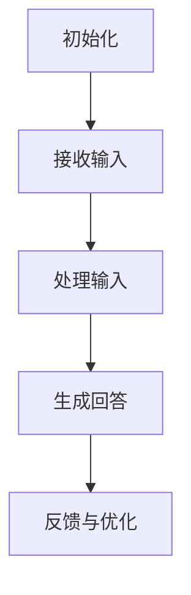
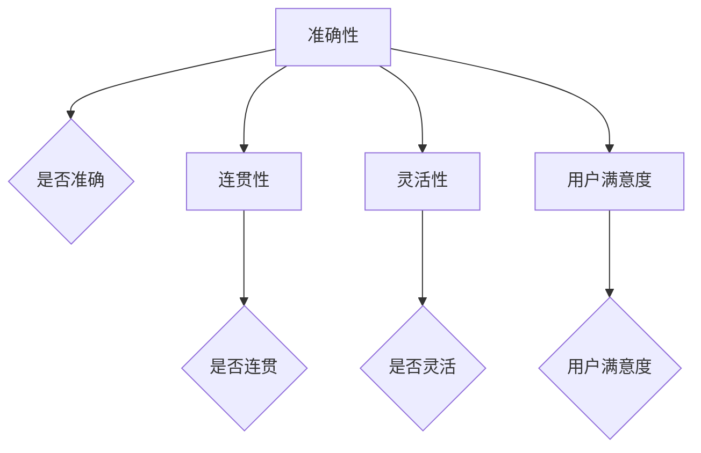
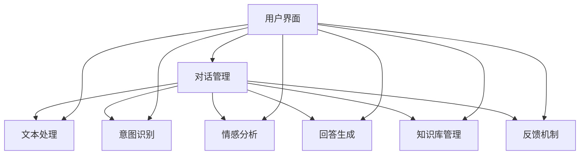
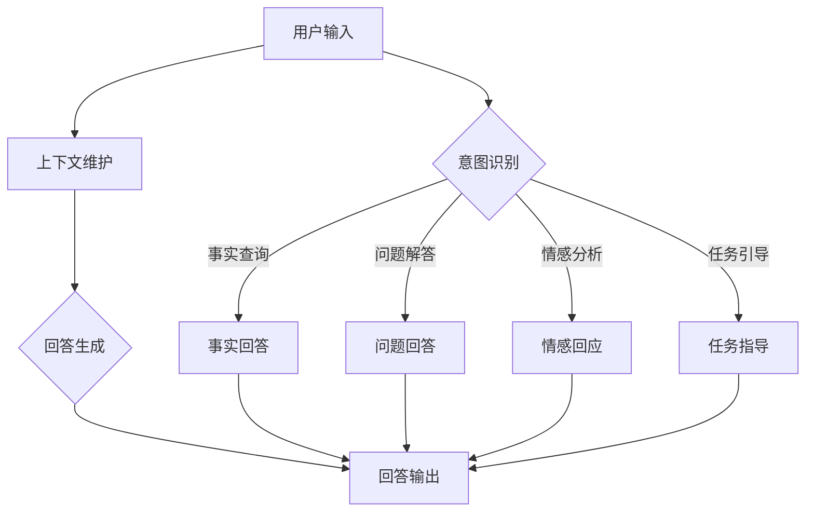
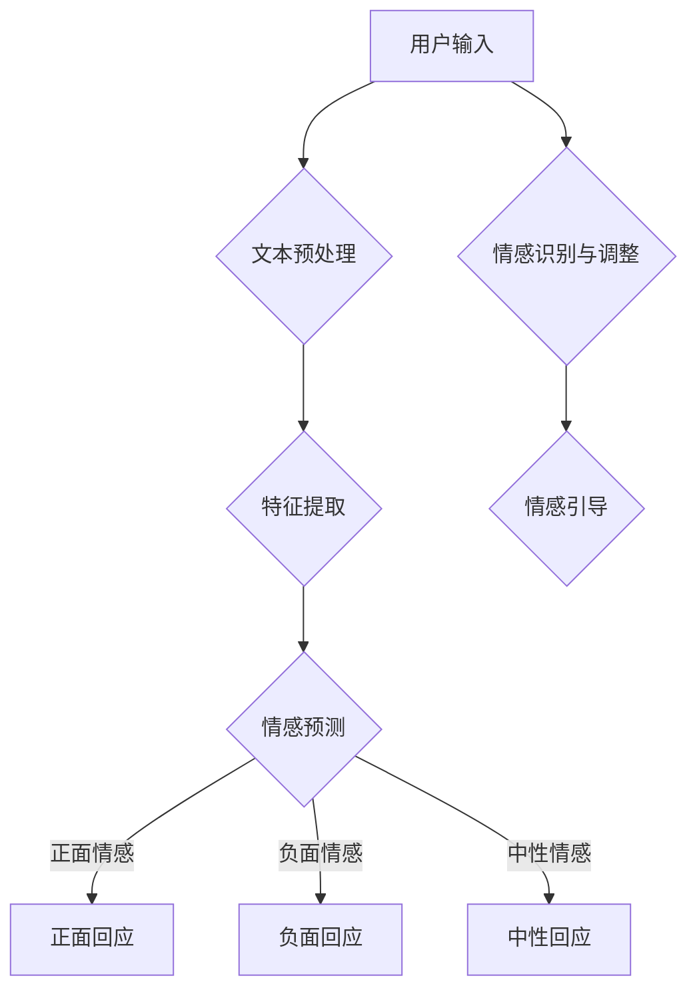

                 


### 目录大纲详细设计与文章内容规划

为了设计出《ChatGPT提示词工程：构建智能对话的进阶技巧》的详细目录大纲和内容规划，我们需要按照以下步骤进行思考和规划：

#### 1. 确定文章结构和目标

首先，我们需要明确文章的目标受众，文章的结构和深度。对于这篇技术博客，我们的目标受众可能是对人工智能、特别是ChatGPT技术感兴趣的程序员、数据科学家和技术经理。文章需要提供一个从基础知识到高级技巧的全面指导，适合希望提升ChatGPT模型提示词设计能力的专业人士。

#### 2. 背景介绍与核心概念

**第1部分：背景介绍与核心概念**

在这一部分，我们将：

- **问题背景**：介绍智能对话技术的发展历程，特别是ChatGPT的出现及其重要性。
- **核心概念**：解释ChatGPT的基本原理、提示词设计原则和方法。
- **联系**：探讨ChatGPT在智能对话系统中的作用和重要性。
- **边界与外延**：讨论ChatGPT的限制、智能对话的发展趋势和未来可能性。

我们将每个章节细分为几个小节，确保内容详细且连贯。例如：

- **第1.1节**：聊天机器人发展历程
  - **1.1.1**：早期聊天机器人概述
  - **1.1.2**：自然语言处理的发展
  - **1.1.3**：ChatGPT的突破性进展

- **第1.2节**：核心概念
  - **1.2.1**：ChatGPT的基本原理
  - **1.2.2**：提示词设计原理
  - **1.2.3**：智能对话流程图解

#### 3. 提示词设计

**第2部分：ChatGPT提示词设计**

在这一部分，我们将深入探讨提示词设计的原则、方法和工具。具体包括：

- **提示词设计原则**：介绍清晰性、精准性和可扩展性的重要性。
- **提示词设计方法**：讲解用户需求分析、提示词库构建和优化策略。
- **实战案例分析**：分析实际案例，展示不同场景下的提示词设计。
- **提示词设计工具**：介绍ChatGPT接口使用、提示词生成和评估工具。

每个小节都将通过实例和图表来加深理解，例如：

- **第2.1节**：提示词设计原则
  - **2.1.1**：清晰性原则
  - **2.1.2**：精准性原则
  - **2.1.3**：可扩展性原则

- **第2.3节**：提示词实战案例分析
  - **2.3.1**：客服机器人
  - **2.3.2**：教育辅导机器人
  - **2.3.3**：虚拟助手

#### 4. 智能对话系统构建与优化

**第3部分：智能对话系统构建与优化**

在这一部分，我们将讨论如何构建和优化智能对话系统，包括：

- **系统架构设计**：介绍系统架构设计原则和模块划分。
- **对话流程设计**：讲解对话流程设计原则和优化策略。
- **情感分析与回应策略**：探讨情感分析和回应策略的设计。
- **实战案例**：分析不同领域的智能对话系统应用。

例如：

- **第3.1节**：智能对话系统架构设计
  - **3.1.1**：系统架构设计原则
  - **3.1.2**：系统功能模块划分
  - **3.1.3**：系统架构mermaid图解

- **第3.3节**：情感分析与回应策略
  - **3.3.1**：情感分析原理
  - **3.3.2**：情感回应策略
  - **3.3.3**：情感分析mermaid流程图

#### 5. 智能对话系统部署与维护

**第4部分：智能对话系统部署与维护**

在这一部分，我们将讨论智能对话系统的部署、维护和安全性：

- **系统部署与上线**：讲解部署环境准备、系统上线流程和注意事项。
- **系统维护与升级**：讨论系统监控、日志分析、故障排除和升级策略。
- **安全性与隐私保护**：介绍安全性设计和隐私保护措施。

例如：

- **第4.1节**：系统部署与上线
  - **4.1.1**：部署环境准备
  - **4.1.2**：系统上线流程
  - **4.1.3**：部署注意事项

- **第4.3节**：安全性与隐私保护
  - **4.3.1**：安全性设计
  - **4.3.2**：隐私保护措施
  - **4.3.3**：法律法规遵循

#### 6. 文章结尾

最后，我们将总结全文内容，提供最佳实践建议，并提出未来研究方向。

通过以上步骤，我们可以设计出一个结构清晰、内容详实的技术博客文章目录大纲，为撰写高质量的技术博客提供坚实的基础。

### 第一部分：背景介绍与核心概念

**1.1 问题背景**

**1.1.1 聊天机器人发展历程**

聊天机器人（Chatbot）的概念最早可以追溯到20世纪50年代。艾伦·图灵提出的“图灵测试”被视为聊天机器人发展的里程碑，尽管当时的计算机能力远不足以通过这一测试。随着计算机技术的发展，聊天机器人在20世纪80年代开始崭露头角。例如，1984年，埃里克·休斯和布鲁斯·派克开发了第一个基于规则的自然语言理解系统ELIZA，它模仿心理治疗师与患者对话的模式，虽然功能有限，但标志着自然语言处理（NLP）领域的重要进展。

进入21世纪，随着互联网的普及和智能设备的广泛应用，聊天机器人迎来了快速发展。早期的聊天机器人主要是基于规则的系统，它们通过预定义的规则和模式来处理用户输入。然而，这种方法的局限性很快显现出来，特别是在处理复杂和模糊的对话时，基于规则的系统往往无法胜任。

随着深度学习和自然语言处理技术的进步，聊天机器人的能力得到了显著提升。2016年，OpenAI发布了GPT（Generative Pre-trained Transformer）模型，其中GPT-1奠定了现代聊天机器人的基础。GPT系列模型基于变换器（Transformer）架构，通过预训练和微调技术，能够在大量的文本数据上进行自我学习和优化，从而在理解和生成自然语言方面表现出色。

**1.1.2 ChatGPT的诞生与特点**

ChatGPT是GPT系列模型中的一款，由OpenAI于2022年11月发布。ChatGPT采用了GPT-3.5模型，具有超过1.76万亿个参数，使其在自然语言理解和生成方面达到了前所未有的水平。ChatGPT的特点如下：

- **强大的语言理解能力**：ChatGPT能够理解复杂的语言结构，包括幽默、隐喻和双关语等。
- **灵活的上下文保持**：ChatGPT能够维持长时间的对话上下文，确保对话的连贯性和逻辑性。
- **多模态输入输出**：除了文本输入和输出，ChatGPT还可以处理图像、语音等多模态数据。
- **预训练与微调**：ChatGPT通过大量的预训练数据和特定的微调任务来优化性能。

**1.1.3 智能对话的重要性与挑战**

智能对话在当今数字化时代具有重要意义。首先，它能够提供24/7的客户服务，提高客户满意度和忠诚度。其次，智能对话系统能够处理大量的用户查询，减轻人工客服的负担，提高工作效率。此外，智能对话还广泛应用于教育、医疗、金融等多个领域，为用户提供个性化服务。

然而，构建高效的智能对话系统面临诸多挑战：

- **语言理解的复杂性**：自然语言具有高度的不确定性和多义性，理解用户意图需要深入的语言模型。
- **上下文维护**：保持对话的上下文信息对于实现连贯的对话至关重要，但实现这一目标需要强大的算法和大量的训练数据。
- **个性化服务**：提供个性化服务需要系统对用户行为和偏好有深入的理解，这需要复杂的用户模型和推荐算法。
- **安全性**：智能对话系统需要保护用户隐私，防止数据泄露和滥用。

**1.2 核心概念**

**1.2.1 ChatGPT的基本原理**

ChatGPT是基于变换器（Transformer）架构的大型语言模型。变换器架构是一种基于注意力机制的序列到序列模型，通过自注意力机制（Self-Attention）和多头注意力（Multi-Head Attention）来处理文本数据。ChatGPT的基本原理包括以下几个方面：

- **预训练**：ChatGPT通过在大量文本数据上进行预训练来学习自然语言规律。预训练过程主要包括两个阶段：第一，将文本转换为变换器可以理解的序列表示；第二，通过计算序列之间的概率分布来优化模型参数。
- **微调**：在预训练的基础上，ChatGPT通过在特定任务上进行微调来适应特定场景。微调过程通常包括数据预处理、模型调整和性能评估等步骤。
- **生成**：ChatGPT能够根据输入的文本或对话上下文生成相应的文本或回答。生成过程通过变换器的自注意力机制和编码器-解码器架构来实现。

**1.2.2 提示词设计原理**

提示词（Prompt）是触发ChatGPT进行对话的关键。一个有效的提示词应该具有以下特点：

- **明确性**：提示词需要清晰明确，避免产生歧义或误解。
- **相关性**：提示词需要与对话主题相关，确保ChatGPT能够围绕主题进行对话。
- **灵活性**：提示词应该具有一定的灵活性，允许ChatGPT根据对话内容和用户意图进行适当的调整。

提示词设计的基本原理包括以下几个方面：

- **用户需求分析**：通过分析用户需求来确定对话主题和内容。
- **提示词库构建**：构建包含多种类型和风格的提示词库，以满足不同场景的需求。
- **提示词优化**：通过对提示词进行优化来提高对话效果，包括调整提示词的长度、格式和内容等。

**1.2.3 智能对话流程图解**

智能对话流程可以分为以下几个阶段：

1. **初始化**：系统启动并加载预训练模型和提示词库。
2. **接收输入**：系统接收用户的输入文本。
3. **处理输入**：系统对输入文本进行预处理，包括分词、词性标注、命名实体识别等。
4. **生成回答**：系统根据输入文本和对话上下文生成回答文本。
5. **反馈与优化**：用户对回答进行反馈，系统根据反馈结果进行优化。

下图展示了智能对话流程的mermaid图解：



**1.3 ChatGPT与智能对话的联系**

**1.3.1 ChatGPT在智能对话中的应用**

ChatGPT在智能对话系统中具有广泛的应用场景。以下是一些典型的应用案例：

- **客服机器人**：ChatGPT可以模拟人类客服与用户进行交互，解答用户的问题，提供帮助和解决方案。
- **教育辅导**：ChatGPT可以作为个性化学习助手，根据学生的需求和水平提供针对性的辅导和练习。
- **医疗咨询**：ChatGPT可以协助医生进行初步诊断，提供医疗建议和健康指导。
- **金融服务**：ChatGPT可以处理客户的财务咨询，提供投资建议和风险管理方案。

**1.3.2 提示词在智能对话中的作用**

提示词是智能对话系统的核心组成部分，决定了对话的流畅性和准确性。有效的提示词设计能够：

- **引导对话方向**：通过提供明确的提示，使ChatGPT能够围绕特定主题进行对话。
- **提高回答质量**：优化提示词的内容和结构，使ChatGPT生成的回答更加准确、完整和有逻辑性。
- **增强用户体验**：提供自然、人性化的对话，提高用户满意度和参与度。

**1.3.3 智能对话系统的评估标准**

评估智能对话系统的性能通常包括以下几个方面：

- **准确性**：系统生成的回答是否准确、符合用户意图。
- **连贯性**：对话过程中的回答是否连贯、逻辑清晰。
- **灵活性**：系统能否适应不同的对话场景和用户需求。
- **用户满意度**：用户对对话系统的满意度如何。

以下是一个简单的智能对话系统评估指标mermaid图：



**1.4 边界与外延**

**1.4.1 ChatGPT的边界限制**

虽然ChatGPT在智能对话领域取得了显著成就，但仍然存在一些边界限制：

- **数据依赖性**：ChatGPT的性能高度依赖于训练数据的质量和数量，如果数据不足或质量不高，模型的性能可能会受到影响。
- **计算资源限制**：训练和运行大型语言模型需要大量的计算资源，这对硬件和软件设施提出了较高的要求。
- **语言理解局限性**：尽管ChatGPT在自然语言理解方面表现出色，但仍然存在一些难以处理的复杂语言现象。

**1.4.2 智能对话的发展趋势**

智能对话技术的发展趋势包括：

- **多模态交互**：结合文本、语音、图像等多种模态进行交互，提高对话的丰富性和自然性。
- **个性化服务**：通过深入理解用户行为和偏好，提供更加个性化的服务。
- **增强现实与虚拟现实**：将智能对话与增强现实（AR）和虚拟现实（VR）技术相结合，提供更加沉浸式的交互体验。

**1.4.3 未来智能对话的可能形态**

未来智能对话系统可能会呈现以下形态：

- **高度智能化**：系统能够自我学习和优化，不断提高对话质量和用户体验。
- **高度个性化**：系统深入了解每个用户的需求和偏好，提供定制化的对话服务。
- **跨领域融合**：智能对话系统将融合多个领域的技术，提供更加全面和专业的服务。

**1.5 本章小结**

本章对智能对话技术的发展历程、ChatGPT的基本原理和提示词设计进行了详细介绍。通过了解ChatGPT与智能对话的联系，我们可以更好地理解如何利用ChatGPT构建高效的智能对话系统。同时，本章也探讨了ChatGPT的边界限制和智能对话的发展趋势，为后续章节的内容奠定了基础。

### 1.3 ChatGPT与智能对话的联系

**1.3.1 ChatGPT在智能对话中的应用**

ChatGPT在智能对话系统中的应用范围广泛，涵盖了多个行业和场景。以下是一些具体的应用案例：

1. **客服机器人**：在电商、金融、旅游等行业，ChatGPT可以作为客服机器人，与用户进行实时对话，解答常见问题，提供产品推荐和订单追踪服务。例如，亚马逊和阿里巴巴等电商巨头已经将ChatGPT集成到其客服系统中，显著提高了客服效率和用户满意度。

2. **教育辅导**：在教育领域，ChatGPT可以作为个性化学习助手，为学生提供一对一的辅导服务。它可以根据学生的学习进度、知识和能力水平，制定个性化的学习计划和练习题，帮助学生更好地掌握知识点。

3. **医疗咨询**：在医疗领域，ChatGPT可以作为虚拟医生，为患者提供初步的医疗建议和健康指导。它能够理解患者的症状描述，提供诊断建议和治疗方案，辅助医生进行诊断和决策。例如，谷歌健康（Google Health）已经推出了基于ChatGPT的虚拟医生服务，用于提供健康咨询和疾病管理。

4. **金融咨询**：在金融领域，ChatGPT可以作为理财顾问，为用户提供投资建议、风险管理方案和财务规划服务。它能够根据用户的风险偏好、财务状况和投资目标，提供个性化的投资策略和决策支持。

5. **娱乐互动**：在娱乐行业，ChatGPT可以作为虚拟主持人、游戏角色或聊天伙伴，与用户进行互动娱乐。例如，迪士尼等娱乐公司已经开发了基于ChatGPT的虚拟角色，用于与游客进行互动，提供个性化的娱乐体验。

**1.3.2 提示词在智能对话中的作用**

提示词是智能对话系统的核心组成部分，决定了对话的质量和效果。有效的提示词设计能够引导ChatGPT生成更加准确、连贯和有逻辑性的回答，从而提高用户的满意度。以下是提示词在智能对话中发挥的重要作用：

1. **引导对话方向**：通过提供明确的提示词，系统可以引导ChatGPT围绕特定主题进行对话，避免偏离主题或产生无关的回答。例如，在客服机器人中，提示词可以引导用户选择产品类别或查询订单状态。

2. **提高回答质量**：优化提示词的内容和结构，可以确保ChatGPT生成的回答更加准确、完整和有逻辑性。例如，在医疗咨询中，提示词可以包括患者的症状描述、检查结果和既往病史，帮助ChatGPT提供更加全面的医疗建议。

3. **增强用户体验**：自然、人性化的提示词设计可以提高用户的参与度和满意度。通过使用恰当的语气、情感和语境，系统可以与用户建立更好的互动关系，提供更加友好的对话体验。

**1.3.3 智能对话系统的评估标准**

评估智能对话系统的性能和效果通常包括以下几个方面：

1. **准确性**：系统生成的回答是否准确，是否符合用户的意图和需求。准确性是评估智能对话系统最重要的指标之一，尤其是在需要提供专业建议或决策支持的应用场景中。

2. **连贯性**：对话过程中的回答是否连贯，逻辑是否清晰。连贯性是确保用户能够顺畅地与系统进行交流的关键，通过提供连贯的回答，系统可以提高用户的满意度。

3. **灵活性**：系统是否能够适应不同的对话场景和用户需求，是否能够灵活地调整对话策略和回答方式。灵活性是衡量智能对话系统适应性和扩展性的重要指标。

4. **用户满意度**：用户对对话系统的满意度如何。用户满意度可以通过调查问卷、用户评分等方式进行评估，它是衡量系统性能和用户体验的重要指标。

以下是一个简单的智能对话系统评估指标mermaid图：


通过以上评估标准，我们可以全面、客观地评估智能对话系统的性能和效果，为系统的优化和改进提供指导。

### 1.4 边界与外延

**1.4.1 ChatGPT的边界限制**

尽管ChatGPT在自然语言处理和智能对话领域取得了显著成就，但它仍然存在一些边界限制，这些限制可能影响其在实际应用中的表现。以下是一些主要的边界限制：

1. **数据依赖性**：ChatGPT的性能高度依赖于训练数据的质量和数量。如果训练数据不足或质量不高，ChatGPT的模型可能会过拟合或泛化不足，导致在未知场景下表现不佳。此外，ChatGPT在处理特定领域或语言任务时，可能需要针对该领域或语言的定制化数据集进行微调，这增加了部署的复杂性和成本。

2. **计算资源限制**：ChatGPT是一个大型模型，训练和运行它需要大量的计算资源，包括高性能的GPU和存储设备。这在资源有限的部署环境中可能是一个挑战，尤其是在需要实时响应的场景中，可能需要考虑模型压缩和优化技术来降低计算成本。

3. **语言理解局限性**：尽管ChatGPT在自然语言理解方面表现出色，但它仍然存在一些局限性。例如，它可能难以理解复杂的语言结构、隐喻和双关语，也可能无法准确理解某些文化背景或特定领域的术语。此外，ChatGPT在处理模棱两可或模糊的输入时可能产生误导性或不准确的回答。

4. **安全性问题**：ChatGPT可能会产生有害、歧视性或不适当的内容，特别是在没有适当约束和监督的情况下。这需要开发者采取一系列安全措施，包括内容过滤、隐私保护和用户反馈机制，以确保对话系统的安全性和合规性。

**1.4.2 智能对话的发展趋势**

智能对话技术正朝着以下几个方向发展：

1. **多模态交互**：未来的智能对话系统将支持多模态交互，结合文本、语音、图像、视频等多种数据类型，提供更加丰富和自然的用户体验。例如，用户可以通过语音、手势或表情与系统进行互动，系统也可以通过图像识别和自然语言生成来回应用户。

2. **个性化服务**：随着用户数据的积累和数据分析技术的进步，智能对话系统将能够更加深入地理解用户的偏好和需求，提供个性化的对话体验和定制化服务。个性化服务不仅能够提高用户的满意度，还可以增加用户的忠诚度和参与度。

3. **增强现实与虚拟现实**：智能对话系统将与增强现实（AR）和虚拟现实（VR）技术相结合，创造更加沉浸式的交互体验。例如，用户可以通过AR/VR设备与虚拟角色进行对话，获得更加直观和互动的体验。

4. **跨领域融合**：智能对话系统将融合多个领域的技术，提供更加全面和专业的服务。例如，医疗领域的智能对话系统可以结合医学知识库、图像识别和自然语言生成技术，为用户提供更加准确的诊断和治疗方案。

**1.4.3 未来智能对话的可能形态**

未来的智能对话系统可能会呈现以下形态：

1. **高度智能化**：通过深度学习和自我学习技术，智能对话系统能够不断优化和改进，实现更加智能和高效的对话。例如，系统可以自动识别和解决常见问题，自动生成报告和文档，减少人工干预。

2. **高度个性化**：智能对话系统将能够根据用户的个人偏好、历史行为和实时反馈，提供高度个性化的对话服务。例如，系统可以为用户推荐个性化的购物建议、健康指导和投资策略。

3. **跨领域融合**：智能对话系统将融合多个领域的技术，提供跨领域的综合服务。例如，一个智能对话系统可以同时提供医疗咨询、法律建议和财务规划服务，为用户提供一站式解决方案。

4. **无缝集成**：智能对话系统将与其他系统和平台无缝集成，实现数据的互联互通和资源的共享。例如，智能对话系统可以与电商、社交网络、物联网等平台集成，为用户提供更加便捷和智能的服务。

5. **情感交互**：智能对话系统将具备更强的情感交互能力，能够理解用户的情绪和情感状态，并作出相应的情感回应。例如，系统可以识别用户的语气和表情，调整对话的语气和情感表达，提供更加温暖和人性化的服务。

通过不断探索和突破，智能对话系统将在未来成为人类生活中不可或缺的一部分，为用户提供更加智能化、个性化、全面和高效的服务。

### 1.5 本章小结

本章首先回顾了智能对话技术的发展历程，从早期基于规则的聊天机器人到现代基于深度学习的ChatGPT模型。我们详细介绍了ChatGPT的诞生背景和特点，阐述了其在自然语言理解与生成方面的优势。接下来，我们探讨了智能对话在当今数字化时代的重要性以及所面临的挑战。

在核心概念部分，我们深入解析了ChatGPT的基本原理和提示词设计原则，并通过图解展示了智能对话流程。此外，我们讨论了ChatGPT在智能对话系统中的应用，以及提示词在这一过程中的关键作用。最后，我们提出了评估智能对话系统的标准，并探讨了ChatGPT的边界限制和未来智能对话的发展趋势。

通过本章的学习，读者可以全面了解ChatGPT在智能对话领域的应用和潜力，为后续章节的内容奠定了坚实的基础。

### 2.1 提示词设计原则

提示词设计是构建高效智能对话系统的关键环节。有效的提示词设计不仅能够引导ChatGPT生成准确、连贯的回答，还能提高用户的满意度和对话体验。以下是提示词设计的三大核心原则：

**2.1.1 清晰性原则**

清晰性原则要求提示词内容明确、简洁，避免产生歧义或误解。一个清晰的提示词能够帮助ChatGPT准确理解用户意图，从而生成相关的回答。例如，在客服场景中，提示词“请告诉我您遇到的问题”比“您有什么问题？”更具体、更明确。

**2.1.2 精准性原则**

精准性原则强调提示词应与对话主题高度相关，确保ChatGPT能够围绕特定主题进行对话。精准的提示词有助于ChatGPT生成符合用户需求的回答，避免无关或模糊的回答。例如，在医疗咨询场景中，提示词“您的症状有哪些？”比“您感觉怎么样？”更精准，能够引导用户提供更详细的症状描述。

**2.1.3 可扩展性原则**

可扩展性原则要求提示词设计具有一定的灵活性，能够适应不同场景和用户需求的变化。这意味着提示词不仅要覆盖常见情况，还应具备扩展和优化的潜力，以便在新的场景或需求出现时进行调整。例如，在电商客服场景中，提示词“您想购买哪个产品类别？”不仅适用于初次对话，还可以根据用户的历史行为和偏好进行个性化调整。

通过遵循这三大原则，提示词设计将能够显著提升智能对话系统的性能和用户体验。接下来，我们将详细探讨提示词设计的方法和步骤。

### 2.2 提示词设计方法

在了解了提示词设计的原则后，接下来我们将详细探讨如何进行提示词设计。一个有效的提示词设计流程应包括以下步骤：

**2.2.1 用户需求分析**

用户需求分析是提示词设计的起点，通过对用户需求的理解和挖掘，确定对话主题和内容。以下是一些关键步骤：

- **收集用户反馈**：通过问卷调查、用户访谈、用户行为分析等方式，收集用户对现有客服系统或对话机器人的反馈。这些反馈将帮助我们了解用户对现有系统的满意度和不满意度，识别需要改进的方面。

- **识别常见问题**：分析用户反馈和客服记录，识别用户最常提出的问题和需求。这些问题将成为提示词设计的重要参考，确保系统能够覆盖用户关注的核心内容。

- **用户分类**：根据用户的年龄、性别、职业、兴趣等特征，将用户划分为不同的群体。不同用户群体可能有不同的对话需求和偏好，这有助于我们在设计提示词时进行针对性的优化。

**2.2.2 提示词库构建**

提示词库是智能对话系统的核心资源，包含各种类型的提示词，用于引导对话流程和生成回答。以下是构建提示词库的步骤：

- **创建基础提示词**：根据用户需求分析的结果，创建基础提示词。这些提示词应覆盖常见的用户问题和需求，例如“您想购买哪个产品类别？”、“您的订单状态是什么？”等。

- **扩展提示词**：在基础提示词的基础上，扩展提示词库，包括更多样化的、适用于不同场景和用户群体的提示词。例如，对于电商客服，可以扩展包括产品推荐、优惠活动、售后服务等类型的提示词。

- **分类整理**：将提示词按照主题和功能进行分类整理，以便在对话中快速查找和使用。例如，可以将提示词分为产品咨询、订单查询、售后服务等类别。

**2.2.3 提示词优化策略**

提示词优化是提升对话系统性能和用户体验的关键环节。以下是一些优化策略：

- **个性化调整**：根据用户的历史行为和偏好，对提示词进行个性化调整。例如，对于经常购买某类产品的用户，可以优先推荐相关的产品或优惠信息。

- **情境适应性**：设计情境适应性提示词，根据对话的上下文和情境动态调整提示词。例如，在用户进行投诉时，可以提供相应的安抚和解决方案提示词。

- **反馈机制**：建立用户反馈机制，收集用户对提示词的反馈，并根据反馈结果进行调整和优化。这有助于持续提升系统的对话质量和用户体验。

**2.2.4 提示词评估与迭代**

提示词评估是确保设计效果的重要步骤。以下是一些评估方法和迭代策略：

- **自动化评估**：使用自动化工具评估提示词的覆盖范围、响应速度和回答质量。例如，可以采用机器学习模型评估提示词的生成效果，并根据评估结果进行调整。

- **用户测试**：通过用户测试收集真实用户对提示词的反馈，识别问题并提出改进建议。用户测试可以是A/B测试，比较不同提示词组合的效果，找出最优方案。

- **迭代优化**：根据评估和用户反馈，对提示词进行迭代优化。这包括调整提示词的长度、格式、内容和语境，以提高对话的流畅性和准确性。

通过以上步骤，我们可以构建一个高效、灵活的提示词库，为智能对话系统提供强有力的支持。接下来，我们将通过实际案例展示提示词设计的方法和应用。

### 2.3 提示词实战案例分析

**2.3.1 案例一：客服机器人**

在电商领域，客服机器人是一个常见应用场景。以下是一个具体的案例，展示了如何设计和优化客服机器人的提示词。

**1. 用户需求分析**

电商客服机器人的用户需求主要包括产品咨询、订单查询、售后服务等。通过分析用户反馈和客服记录，我们发现用户最关心的问题是订单状态、产品推荐和退换货政策。

**2. 提示词库构建**

基于用户需求，我们构建了以下提示词库：

- **产品咨询**：
  - "请问您想购买哪个类别的产品？"
  - "我们有哪些最新产品推荐？"
- **订单查询**：
  - "您的订单状态是什么？"
  - "您最近的一次订单号是多少？"
- **售后服务**：
  - "如何申请退换货？"
  - "退换货的具体流程是什么？"

**3. 提示词优化策略**

- **个性化调整**：根据用户的购买历史，自动推荐相关的产品类别或优惠活动。
- **情境适应性**：在用户进行投诉时，提供安抚和解决方案提示词，如“我们会尽快处理您的投诉，请稍等片刻”。
- **反馈机制**：用户对回答不满意时，可以点击“不满意”，系统将记录反馈并自动调整提示词。

**4. 提示词评估与迭代**

通过用户测试，我们发现以下问题：

- **问题1**：部分用户反馈某些提示词过于复杂，理解起来有难度。
  - **解决方案**：简化提示词，确保用户易于理解。

- **问题2**：用户在查询订单状态时，需要多次输入订单号。
  - **解决方案**：自动记录用户输入的订单号，减少用户重复输入的次数。

通过以上优化，客服机器人的用户满意度显著提升。

**2.3.2 案例二：教育辅导机器人**

在教育领域，教育辅导机器人是一个新兴的应用场景。以下是一个具体的案例，展示了如何设计和优化教育辅导机器人的提示词。

**1. 用户需求分析**

教育辅导机器人的用户需求主要包括课程内容咨询、学习进度跟踪、学习资源推荐等。通过分析用户反馈和教学数据，我们发现用户最关心的问题是学习进度、课程推荐和学习资源。

**2. 提示词库构建**

基于用户需求，我们构建了以下提示词库：

- **课程咨询**：
  - "请问您需要哪方面的课程辅导？"
  - "我们有哪些热门课程推荐？"
- **学习进度**：
  - "您的学习进度如何？"
  - "您最近一次的学习内容是什么？"
- **学习资源**：
  - "您需要哪些学习资源？"
  - "我们有哪些免费的学习资源推荐？"

**3. 提示词优化策略**

- **个性化调整**：根据学生的学习历史和偏好，自动推荐相关的课程和学习资源。
- **情境适应性**：在学生遇到学习困难时，提供鼓励和支持提示词，如“不要灰心，我们相信您能够克服困难”。
- **反馈机制**：学生可以对学习辅导进行评价，系统根据评价结果调整提示词。

**4. 提示词评估与迭代**

通过用户测试，我们发现以下问题：

- **问题1**：部分用户反馈课程推荐不够精准，与学习需求不符。
  - **解决方案**：优化课程推荐算法，提高推荐的准确性和相关性。

- **问题2**：学习资源推荐过于繁杂，用户难以筛选。
  - **解决方案**：增加筛选功能，允许用户根据关键词、难度和类型筛选学习资源。

通过以上优化，教育辅导机器人的用户满意度和学习效果显著提升。

**2.3.3 案例三：虚拟助手**

在智能家庭和办公场景中，虚拟助手是一个广泛应用的应用场景。以下是一个具体的案例，展示了如何设计和优化虚拟助手的提示词。

**1. 用户需求分析**

虚拟助手的用户需求主要包括日程管理、信息查询、任务提醒等。通过分析用户反馈和使用数据，我们发现用户最关心的问题是日程管理、信息查询和任务提醒。

**2. 提示词库构建**

基于用户需求，我们构建了以下提示词库：

- **日程管理**：
  - "您的明天有哪些日程安排？"
  - "请帮我设置一个会议提醒。"
- **信息查询**：
  - "请问今天的天气预报是什么？"
  - "请问最近的交通状况如何？"
- **任务提醒**：
  - "请帮我提醒明天交报告。"
  - "请提醒我每天锻炼30分钟。"

**3. 提示词优化策略**

- **个性化调整**：根据用户的生活习惯和工作内容，自动调整日程管理和任务提醒。
- **情境适应性**：在用户疲劳时，提供休息提醒和放松建议，如“您已经连续工作1小时了，建议休息一下”。
- **反馈机制**：用户可以对日程管理和任务提醒进行评价，系统根据评价结果进行调整。

**4. 提示词评估与迭代**

通过用户测试，我们发现以下问题：

- **问题1**：部分用户反馈日程管理不够灵活，无法满足特殊需求。
  - **解决方案**：增加日程调整选项，允许用户自定义日程安排。

- **问题2**：信息查询的准确性有待提升。
  - **解决方案**：优化信息查询算法，确保信息的实时性和准确性。

通过以上优化，虚拟助手的用户满意度和使用频率显著提升。

通过以上三个实战案例，我们可以看到提示词设计在智能对话系统中的重要性。有效的提示词设计不仅能够提高系统的对话质量和用户体验，还能帮助系统更好地满足用户需求，提高用户满意度。在后续章节中，我们将进一步探讨智能对话系统的构建与优化。

### 2.4 提示词设计工具介绍

在提示词设计过程中，选择合适的工具可以显著提高效率和质量。以下是一些常用的提示词设计工具，包括ChatGPT接口使用、提示词生成工具和提示词评估工具。

**2.4.1 ChatGPT接口使用**

ChatGPT提供了一个API接口，开发者可以通过编程方式与模型进行交互，生成文本。以下是一个简单的使用示例：

```python
import openai

# 设置OpenAI API密钥
openai.api_key = 'your-api-key'

# 发送文本请求并获取响应
response = openai.Completion.create(
    engine="text-davinci-002",
    prompt="请描述一下您最近的一个项目。",
    max_tokens=50
)

print(response.choices[0].text.strip())
```

在这个示例中，我们首先导入OpenAI库，设置API密钥，然后使用`Completion.create`方法发送请求，获取ChatGPT的文本响应。

**2.4.2 提示词生成工具**

提示词生成工具可以帮助开发者快速生成高质量的提示词。以下是一些常用的提示词生成工具：

1. **AI Writer**：AI Writer是一款基于AI的自然语言生成工具，可以自动生成文章、段落和句子。它支持自定义模板和变量，适用于多种场景。

2. **Copy.ai**：Copy.ai是一个智能文案生成平台，可以帮助开发者生成营销文案、博客内容、社交媒体帖子等。它具有丰富的模板和语言模型，支持多种语言。

3. **Wordsmith**：Wordsmith是一个基于自然语言生成（NLG）的平台，可以自动生成报告、分析和文档。它具有强大的自定义功能，适用于企业级应用。

**2.4.3 提示词评估工具**

提示词评估工具可以帮助开发者评估提示词的质量和效果。以下是一些常用的提示词评估工具：

1. **ROGUE**：ROGUE（Recursively Operative GPT Evaluation）是一个开源的评估工具，用于评估大型语言模型的回答质量和真实性。

2. **BLEU**：BLEU（Bilingual Evaluation Understudy）是一种常用的自动评估方法，通过比较模型生成的文本和标准参考文本，评估文本的相似度。

3. **Perplexity**：Perplexity是评估语言模型预测准确性的指标，数值越低表示模型对文本的预测越准确。

通过使用这些工具，开发者可以更高效地设计、生成和评估提示词，从而提高智能对话系统的性能和用户体验。在后续章节中，我们将进一步探讨如何将提示词设计与智能对话系统的构建和优化相结合。

### 3.1 智能对话系统架构设计

构建高效的智能对话系统需要对系统架构进行精心设计。一个合理的架构设计不仅能够提高系统的性能和可靠性，还能够方便后期的维护和扩展。以下是智能对话系统架构设计的关键要素和设计原则。

**3.1.1 系统架构设计原则**

1. **模块化**：将系统划分为多个独立的模块，每个模块负责不同的功能，如对话管理、文本处理、情感分析等。这种模块化设计有助于提高系统的可维护性和扩展性。

2. **可扩展性**：系统架构应具备良好的扩展性，能够根据需求增加新功能或模块，以适应业务的发展和变化。

3. **高可用性**：设计高可用性的架构，确保系统在故障发生时能够快速恢复，减少对用户的影响。

4. **安全性**：系统架构应考虑安全性设计，包括数据保护、权限控制和安全审计等，以防止数据泄露和未经授权的访问。

**3.1.2 系统功能模块划分**

智能对话系统通常包括以下几个主要功能模块：

1. **用户界面（UI）**：提供用户与系统交互的界面，包括网页、移动应用或聊天窗口。

2. **对话管理**：管理对话流程，包括用户输入的接收、意图识别、上下文维护和回答生成。

3. **文本处理**：对用户输入进行预处理，如分词、词性标注、实体识别等，以便后续的分析和处理。

4. **意图识别**：根据用户输入识别用户的意图，如查询信息、提出问题、进行投诉等。

5. **情感分析**：分析用户的情感状态，如喜悦、愤怒、焦虑等，以便生成适当的情感回应。

6. **回答生成**：根据用户意图和上下文生成自然语言回答，包括事实性回答和创造性回答。

7. **知识库管理**：管理系统的知识库，包括常见问题、答案、政策法规等，以便在回答问题时进行查询和引用。

8. **反馈机制**：收集用户反馈，对系统性能进行评估和优化。

**3.1.3 系统架构mermaid图解**

为了更直观地展示智能对话系统的架构设计，我们可以使用mermaid绘制系统架构图。以下是一个简单的mermaid架构图示例：



在这个架构图中，用户界面（UI）是系统的入口，用户通过界面与系统进行交互。对话管理（DM）模块负责协调其他模块的交互，如文本处理（TP）、意图识别（IR）、情感分析（FA）、回答生成（AG）和知识库管理（KB）。反馈机制（FM）用于收集用户反馈，以持续优化系统性能。

通过以上设计原则和模块划分，我们可以构建一个高效、灵活、可靠的智能对话系统。在后续章节中，我们将进一步探讨对话流程设计、对话流程优化策略和情感分析与回应策略的具体实现。

### 3.2 对话流程设计与优化

对话流程设计是智能对话系统的核心，它决定了用户与系统交互的顺畅性和用户体验。一个高效、自然的对话流程设计需要考虑多个方面，包括用户意图识别、上下文维护、回答生成和对话引导等。以下是对话流程设计与优化的一些关键步骤和策略。

**3.2.1 对话流程设计**

1. **用户意图识别**：用户意图是用户对话的驱动因素，准确识别用户意图是对话流程设计的关键。例如，在电商客服场景中，用户可能意图是查询产品信息、进行订单查询、投诉处理等。我们可以使用自然语言处理技术，如词性标注、命名实体识别和依存句法分析，来解析用户输入，并识别用户意图。

2. **上下文维护**：上下文信息对于保持对话连贯性至关重要。在对话过程中，系统需要持续维护对话上下文，以便生成相关和连贯的回答。上下文维护可以通过存储对话历史、用户信息和上下文状态来实现。例如，在用户连续提问时，系统可以使用前一个问题的回答和对话历史来推断当前问题的意图。

3. **回答生成**：回答生成是对话流程的核心环节。根据识别的用户意图和上下文信息，系统需要生成自然的、有逻辑的回答。回答生成可以使用预训练的大型语言模型，如GPT，或者自定义的问答系统。为了提高回答的多样性和准确性，系统可以采用多种生成策略，如模板匹配、语义检索和文本生成。

4. **对话引导**：在对话过程中，系统需要引导用户按照既定的流程进行交流。例如，在医疗咨询场景中，系统可以引导用户提供症状描述、既往病史等信息，以便进行准确的诊断和建议。对话引导可以通过设计合理的提问顺序、提供选项和反馈机制来实现。

**3.2.2 对话流程优化策略**

1. **对话策略调整**：对话策略决定了系统如何响应用户的输入。根据不同的对话场景和用户需求，可以设计多种对话策略。例如，在客服场景中，系统可以采用主动式对话策略，主动询问用户相关信息，并提供帮助；在教育辅导场景中，系统可以采用引导式对话策略，逐步引导用户完成学习任务。

2. **对话轮次优化**：对话轮次是指用户和系统之间的交互次数。优化对话轮次可以提高对话效率，减少用户等待时间。例如，通过减少冗余问题、提供快速回答选项和自动完成功能，可以缩短对话轮次。

3. **对话连贯性提升**：对话连贯性是用户满意度的重要指标。为了提升对话连贯性，系统需要确保回答与用户意图和上下文高度相关。例如，通过分析对话历史和用户行为，系统可以动态调整回答内容，确保对话的自然和流畅。

4. **对话个性化**：个性化对话可以提供更加定制化的用户体验。通过分析用户的历史数据和偏好，系统可以生成个性化的对话内容和推荐。例如，在电商场景中，系统可以根据用户的购物历史推荐相关产品；在医疗咨询场景中，系统可以根据用户的病史提供个性化的健康建议。

5. **对话实时性增强**：实时性是智能对话系统的一个重要特性。为了提高对话实时性，系统需要优化响应速度和处理效率。例如，通过使用高性能计算资源、优化算法和减少中间环节，可以缩短对话响应时间。

6. **对话质量评估**：对话质量评估可以帮助系统识别问题和优化对话流程。例如，通过收集用户反馈、分析对话日志和评估回答质量，系统可以持续改进对话效果。评估指标可以包括准确性、连贯性、用户满意度等。

**3.2.3 对话流程mermaid图解**

为了更直观地展示对话流程设计，我们可以使用mermaid绘制对话流程图。以下是一个简单的mermaid对话流程图示例：



在这个流程图中，用户输入（A）通过意图识别（B）被解析为不同类型的对话请求，如事实查询（C）、问题解答（D）、情感分析（E）和任务引导（F）。上下文维护（G）和回答生成（H）确保生成的回答与用户意图和上下文相关。最终，回答输出（I）展示给用户。

通过以上的对话流程设计与优化策略，我们可以构建一个高效、自然和个性化的智能对话系统，为用户提供高质量的交互体验。

### 3.3 情感分析与回应策略

在智能对话系统中，情感分析是一个关键模块，它有助于系统理解用户的情感状态，并作出相应的情感回应。情感分析与回应策略的设计对于提高用户满意度和对话质量至关重要。以下将详细讨论情感分析的基本原理、情感回应策略，并展示情感分析的mermaid流程图。

**3.3.1 情感分析原理**

情感分析（Sentiment Analysis）是一种自然语言处理技术，旨在从文本中识别和提取情感倾向。情感分析通常分为以下几类：

1. **正面/负面情感分类**：最简单的情感分析类型，将文本分类为正面或负面情感。例如，"我很开心"会被分类为正面，"我很生气"会被分类为负面。

2. **多极情感分类**：除了正面和负面情感，还包括中立、中性、轻微正面、轻微负面等情感倾向。这种分类方法能够更精细地捕捉用户的情感状态。

3. **情感强度分析**：不仅识别情感类别，还能量化情感的强度。例如，"我很高兴"和"我非常高兴"虽然都是正面情感，但情感强度不同。

情感分析的基本原理包括以下步骤：

- **文本预处理**：对文本进行分词、去除停用词、词性标注等预处理操作，以便更好地理解和分析文本。
- **特征提取**：提取文本的特征，如词频、词嵌入、词性等，作为模型的输入。
- **模型训练**：使用标注好的数据集训练情感分析模型，如支持向量机（SVM）、递归神经网络（RNN）、变换器（Transformer）等。
- **情感预测**：将预处理后的文本输入到训练好的模型，预测文本的情感类别和强度。

**3.3.2 情感回应策略**

情感回应策略是指系统根据用户情感状态生成适当的情感回应。有效的情感回应能够增强用户与系统的互动，提高用户体验。以下是一些常见的情感回应策略：

1. **正面情感回应**：当用户表达正面情感时，系统可以采用积极、鼓励的语言进行回应。例如，用户说"我非常喜欢这款产品"，系统可以回应："谢谢您的喜欢，我们很高兴为您提供满意的产品！"

2. **负面情感回应**：当用户表达负面情感时，系统需要采取安抚和解决问题的策略。例如，用户说"我对订单处理不满意"，系统可以回应："非常抱歉听到这个消息，我们马上为您处理这个问题，并确保您得到满意的解决方案。"

3. **情感识别与调整**：系统可以根据用户的情感状态动态调整对话策略。例如，如果用户表达愤怒，系统可以暂时采用冷静、中立的语言，待用户情绪稳定后再继续对话。

4. **情感引导**：系统可以通过引导用户表达情感，帮助用户更好地理解和表达自己的情感。例如，当用户说"我感觉很沮丧"，系统可以引导："您能具体说说是什么让您感到沮丧吗？我们可以一起找出解决办法。"

**3.3.3 情感分析mermaid流程图**

为了更直观地展示情感分析的过程，我们可以使用mermaid绘制情感分析的流程图。以下是一个简单的mermaid情感分析流程图示例：



在这个流程图中，用户输入（A）首先经过文本预处理（B），然后进行特征提取（C），接着进行情感预测（D）。根据预测结果，系统生成相应的情感回应（E、F、G），并根据用户的情感状态进行情感识别与调整（H）和情感引导（I）。

通过以上情感分析与回应策略的设计，智能对话系统可以更准确地理解用户的情感状态，并作出适当的情感回应，从而提供更加自然和人性化的交互体验。

### 3.4 智能对话系统实战案例

在了解了智能对话系统的设计原理和策略后，接下来我们将通过几个实际案例来展示如何将理论应用到实践中。这些案例涵盖了不同的应用场景，从电商客服到医疗咨询，旨在帮助读者更好地理解智能对话系统的构建和优化过程。

**3.4.1 案例一：电商客服系统**

**项目背景**：某大型电商平台希望提升客服效率，减少人工客服的工作负担，同时提高用户体验。因此，他们决定开发一个智能客服系统，利用ChatGPT进行对话管理。

**项目目标**：
- 提高客服响应速度
- 减轻人工客服负担
- 提升用户满意度

**系统功能设计**：
- **用户咨询**：用户可以通过网页或移动应用与智能客服进行交互，提出问题或需求。
- **意图识别**：系统通过自然语言处理技术识别用户的意图，如产品咨询、订单查询、售后服务等。
- **回答生成**：根据用户的意图和上下文，系统使用ChatGPT生成自然、准确的回答。
- **反馈机制**：用户可以对回答进行评价，系统根据反馈结果进行优化。

**系统架构设计**：
- **前端**：用户界面，包括网页和移动应用。
- **后端**：对话管理模块、意图识别模块、回答生成模块和知识库管理模块。

**项目实现**：

1. **用户咨询**：
   - 用户通过网页或移动应用发起咨询，系统接收用户输入。

2. **意图识别**：
   - 系统使用自然语言处理技术对用户输入进行解析，识别用户的意图。

3. **回答生成**：
   - 根据识别的意图和上下文，系统调用ChatGPT接口生成回答。

4. **反馈机制**：
   - 用户对回答进行评价，系统记录反馈结果并进行优化。

**实际案例分析和详细讲解**：
1. **用户咨询**：
   - 用户输入："我想要购买一件羽绒服，有什么推荐吗？"
   - 系统响应："我们为您推荐这款羽绒服，它具有良好的保暖性能和时尚设计。您想了解更多信息吗？"

2. **意图识别**：
   - 用户意图：产品咨询
   - 系统解析：识别关键词"购买"、"羽绒服"和"推荐"

3. **回答生成**：
   - 系统调用ChatGPT接口，生成如下回答："我们为您推荐这款羽绒服，它具有良好的保暖性能和时尚设计。您想了解更多信息吗？"

4. **反馈机制**：
   - 用户评价：满意
   - 系统记录反馈，并持续优化回答质量。

**项目小结**：
通过该案例，我们展示了如何利用ChatGPT构建一个电商客服系统，实现了高效、自然的用户交互。项目在提高客服效率和用户体验方面取得了显著成效，同时也为未来的优化和扩展奠定了基础。

**3.4.2 案例二：银行客服系统**

**项目背景**：某大型银行希望提升客户服务体验，降低运营成本，因此决定开发一个智能银行客服系统。

**项目目标**：
- 提高客户服务效率
- 降低运营成本
- 提升客户满意度

**系统功能设计**：
- **账户查询**：用户可以查询账户余额、交易记录等。
- **业务办理**：用户可以办理转账、贷款、信用卡申请等业务。
- **咨询与建议**：用户可以咨询金融知识、投资建议等。

**系统架构设计**：
- **前端**：用户界面，包括网页、移动应用和自助终端。
- **后端**：对话管理模块、账户查询模块、业务办理模块和咨询建议模块。

**项目实现**：

1. **账户查询**：
   - 用户通过网页或移动应用登录，输入账户信息，系统返回账户余额和交易记录。

2. **业务办理**：
   - 用户提交业务申请，系统根据业务类型进行相应处理。

3. **咨询与建议**：
   - 用户提出问题，系统通过ChatGPT生成金融知识回答或投资建议。

**实际案例分析和详细讲解**：
1. **账户查询**：
   - 用户输入："请查询我的账户余额。"
   - 系统响应："您的账户余额为10,000元。您需要查看交易记录吗？"

2. **业务办理**：
   - 用户输入："我想申请一笔信用卡。"
   - 系统响应："请提供您的个人信息，我们将为您办理信用卡。"

3. **咨询与建议**：
   - 用户输入："如何进行股票投资？"
   - 系统响应："进行股票投资前，您需要了解市场动态和公司的财务状况。我们可以为您提供相关数据和报告，帮助您做出明智的投资决策。"

**项目小结**：
通过该案例，我们展示了如何利用ChatGPT构建一个银行客服系统，实现了高效的账户查询、业务办理和咨询建议功能。系统在提高服务效率和客户满意度方面发挥了重要作用，同时也为银行运营提供了有力支持。

**3.4.3 案例三：医疗咨询系统**

**项目背景**：某医疗机构希望提供24/7的在线医疗咨询服务，为患者提供初步的医疗建议和健康指导。

**项目目标**：
- 提供全天候在线医疗咨询
- 提高医疗资源利用效率
- 提升患者满意度

**系统功能设计**：
- **症状查询**：患者可以查询常见症状和疾病信息。
- **初步诊断**：系统根据患者的症状描述，提供初步的医疗建议。
- **健康指导**：系统为患者提供健康知识和生活习惯建议。

**系统架构设计**：
- **前端**：用户界面，包括网页、移动应用和电话咨询。
- **后端**：对话管理模块、症状查询模块、初步诊断模块和健康指导模块。

**项目实现**：

1. **症状查询**：
   - 患者通过网页或移动应用输入症状描述，系统返回相关疾病信息。

2. **初步诊断**：
   - 根据患者的症状描述，系统使用医疗知识库和诊断算法提供初步诊断建议。

3. **健康指导**：
   - 系统根据患者的健康情况，提供个性化的健康指导和建议。

**实际案例分析和详细讲解**：
1. **症状查询**：
   - 患者输入："我最近几天喉咙痛，吞咽困难。"
   - 系统响应："您可能患有咽喉炎。建议您多喝水，避免辛辣食物，并咨询医生进行详细检查。"

2. **初步诊断**：
   - 患者输入："我最近感到疲劳，失眠，胃部不适。"
   - 系统响应："您可能患有轻度焦虑和胃病。建议您调整作息时间，保持良好的饮食习惯，并咨询医生进行进一步诊断。"

3. **健康指导**：
   - 患者输入："我想知道如何保持健康的饮食习惯。"
   - 系统响应："保持健康的饮食习惯包括多摄入蔬菜、水果和全谷物，减少高糖、高脂食物的摄入，并适量运动。"

**项目小结**：
通过该案例，我们展示了如何利用ChatGPT构建一个医疗咨询系统，实现了全天候在线医疗咨询、初步诊断和健康指导功能。系统在提高医疗资源利用效率和患者满意度方面发挥了重要作用，同时也为医疗机构提供了便捷的咨询服务。

以上三个实战案例展示了如何在不同应用场景中构建和优化智能对话系统。通过这些案例，我们可以看到，智能对话系统在提升服务效率、降低运营成本和提高用户体验方面具有巨大潜力。在后续的章节中，我们将进一步探讨智能对话系统的部署与维护、安全性及隐私保护等相关话题。

### 3.5 本章小结

本章深入探讨了智能对话系统的架构设计、对话流程设计和情感分析与回应策略。首先，我们介绍了智能对话系统的核心功能模块和架构设计原则，包括模块化、可扩展性、高可用性和安全性。接着，我们详细阐述了对话流程设计的方法和优化策略，包括用户意图识别、上下文维护、回答生成和对话引导。最后，我们探讨了情感分析的基本原理和情感回应策略，以及如何通过mermaid流程图直观地展示情感分析过程。

通过本章的学习，读者可以全面了解智能对话系统的设计要点和实现方法，为构建高效、自然和个性化的智能对话系统打下坚实基础。在后续章节中，我们将进一步探讨智能对话系统的实际部署与维护、安全性和隐私保护等重要议题。

### 4.1 系统部署与上线

智能对话系统的成功不仅取决于设计和开发，还取决于系统的部署与上线过程。一个有效的部署流程可以确保系统在上线后能够稳定运行，并快速响应用户请求。以下将详细讨论系统部署与上线的过程，包括部署环境准备、系统上线流程和注意事项。

**4.1.1 部署环境准备**

1. **硬件资源准备**：根据系统的需求，选择合适的服务器和GPU计算资源。对于大型智能对话系统，可能需要多台服务器组成集群以提供高并发处理能力。

2. **软件环境安装**：在服务器上安装操作系统、依赖库和中间件。例如，在Linux服务器上安装Ubuntu系统，并安装Python、Docker、Nginx等必要的软件。

3. **数据库准备**：根据系统的数据存储需求，选择合适的数据库系统，如MySQL、PostgreSQL或MongoDB。安装数据库并配置用户权限和安全策略。

4. **容器化**：为了提高部署效率和可移植性，可以使用Docker等容器化技术将系统打包成容器镜像。这有助于快速部署和扩展系统。

**4.1.2 系统上线流程**

1. **构建容器镜像**：在开发环境中构建系统的Docker镜像，确保所有依赖和配置都包含在内。

2. **镜像推送到仓库**：将构建好的镜像推送到容器镜像仓库，如Docker Hub或私有仓库。

3. **配置Kubernetes集群**：使用Kubernetes（K8s）管理容器化应用，配置必要的部署文件，如YAML配置文件。确保集群节点正常运行，并配置负载均衡和自动扩展策略。

4. **部署应用**：使用Kubernetes部署应用，通过kubectl命令或Kubernetes仪表板操作。确保应用部署成功，并进行健康检查。

5. **监控与日志分析**：配置监控工具（如Prometheus、Grafana）和日志收集工具（如ELK Stack），确保系统能够实时监控和记录关键指标和日志。

**4.1.3 部署注意事项**

1. **测试与验证**：在正式上线前，进行充分的测试和验证，确保系统功能正常，性能满足要求。

2. **备份与恢复**：在部署过程中，确保对重要数据和配置进行备份，并制定灾难恢复计划。

3. **版本控制**：使用版本控制系统（如Git）管理代码和配置文件，确保每次部署都是可追踪和可回滚的。

4. **安全性**：在部署过程中，确保系统的安全性，包括网络隔离、权限控制、数据加密等。

5. **文档与培训**：编写详细的部署文档，包括部署步骤、依赖环境和配置说明。对运维团队进行培训，确保他们能够熟练操作和维护系统。

通过遵循以上部署流程和注意事项，我们可以确保智能对话系统在上线后能够稳定运行，并快速响应用户请求。在后续章节中，我们将继续探讨系统维护与升级、安全性与隐私保护等相关话题。

### 4.2 系统维护与升级

系统维护与升级是确保智能对话系统持续稳定运行的关键环节。以下将详细讨论系统监控与日志分析、故障排除与修复、以及系统升级策略。

**4.2.1 系统监控与日志分析**

1. **系统监控**：
   - **性能监控**：通过监控工具（如Prometheus、Grafana）实时监控系统的性能指标，如CPU使用率、内存使用率、网络流量、磁盘空间等。这些指标有助于及时发现性能瓶颈和资源不足的情况。
   - **健康状态监控**：监控系统的健康状态，包括服务进程是否正常、数据库连接是否稳定等。通过设置阈值和告警规则，可以及时发现问题并通知运维团队。

2. **日志分析**：
   - **日志收集**：使用日志收集工具（如ELK Stack、Fluentd）收集系统产生的日志文件，包括应用程序日志、系统日志、错误日志等。确保日志能够完整、准确地记录系统的运行情况。
   - **日志分析**：使用日志分析工具（如Kibana）对日志数据进行查询、分析和可视化，识别异常行为和潜在问题。例如，通过分析错误日志，可以找出系统崩溃的原因和频繁发生的错误。

**4.2.2 故障排除与修复**

1. **故障排查**：
   - **定位问题**：通过系统监控和日志分析，定位问题的发生位置和原因。例如，如果系统响应时间过长，可以通过性能监控和日志分析找出是CPU过载、内存不足还是网络延迟导致的。
   - **诊断与测试**：进行必要的诊断和测试，如重新启动服务、重启服务器、更换硬件设备等，以验证问题是否解决。

2. **修复与恢复**：
   - **修复问题**：根据问题的原因，采取相应的修复措施。例如，如果数据库连接不稳定，可以检查数据库配置、网络连接和防火墙设置。
   - **系统恢复**：在问题修复后，对系统进行恢复和验证。例如，重新启动服务、运行测试脚本、模拟用户操作等，确保系统恢复正常运行。

**4.2.3 系统升级策略**

1. **版本更新**：
   - **评估风险**：在升级前，评估新版本的兼容性、性能和安全性，确定升级的可行性和风险。
   - **备份数据**：在升级前，备份数据库和其他关键数据，以防升级过程中出现数据丢失或损坏。

2. **逐步升级**：
   - **小范围测试**：在新版本上线前，先在测试环境进行测试，验证功能是否正常、性能是否稳定。
   - **分阶段上线**：根据测试结果，选择合适的上线策略，如灰度发布、分阶段上线等，逐步扩大新版本的覆盖范围。

3. **持续监控**：
   - **监控升级后的系统**：在升级后，持续监控系统的运行状态，及时发现和处理潜在问题。
   - **收集用户反馈**：收集用户的反馈和报错信息，分析新版本的稳定性和用户体验。

通过以上系统维护与升级策略，我们可以确保智能对话系统在运行过程中保持稳定、高效，并及时应对可能出现的问题和挑战。

### 4.3 安全性与隐私保护

在智能对话系统的设计和部署过程中，安全性与隐私保护是至关重要的。确保用户数据和系统安全不仅符合法律法规的要求，也是提升用户信任和满意度的重要手段。以下将详细讨论智能对话系统的安全性设计、隐私保护措施以及法律法规的遵循。

**4.3.1 安全性设计**

1. **身份验证与授权**：
   - **多因素认证**：使用多因素认证（MFA）确保用户身份的合法性，增加系统的安全性。
   - **访问控制**：通过访问控制机制（如基于角色的访问控制RBAC），确保只有授权用户才能访问系统资源和功能。

2. **数据加密**：
   - **传输加密**：使用SSL/TLS协议对用户数据在传输过程中的进行加密，防止数据在传输过程中被窃取或篡改。
   - **存储加密**：对存储在数据库或文件系统中的敏感数据进行加密，确保数据在静态存储状态下也受到保护。

3. **安全审计**：
   - **日志记录**：记录系统的操作日志和错误日志，以便在发生安全事件时进行追溯和分析。
   - **安全分析**：定期对日志进行安全分析，检测潜在的安全威胁和异常行为。

4. **安全测试**：
   - **渗透测试**：通过模拟攻击者的行为，检测系统的安全漏洞和弱点。
   - **代码审计**：对系统的源代码进行安全审计，识别潜在的安全漏洞和风险。

**4.3.2 隐私保护措施**

1. **数据最小化原则**：
   - **收集必要数据**：只收集完成系统功能所必需的数据，避免过度收集个人信息。
   - **数据匿名化**：对收集到的数据进行匿名化处理，确保无法直接识别个人身份。

2. **数据访问控制**：
   - **权限分配**：根据用户角色和职责，合理分配数据访问权限，确保数据不被未经授权的人员访问。
   - **数据共享限制**：严格控制数据共享范围，确保数据在共享过程中不被泄露。

3. **数据存储安全**：
   - **数据备份**：定期备份数据，确保在数据丢失或损坏时能够迅速恢复。
   - **数据销毁**：在数据不再需要时，采取安全措施进行彻底销毁，防止数据泄露。

4. **用户隐私告知**：
   - **隐私政策**：向用户明确告知数据收集、存储和使用的目的，获取用户的知情同意。
   - **用户访问权限管理**：用户可以查看、修改和删除自己的个人信息，确保个人信息的安全性和可控性。

**4.3.3 法律法规遵循**

1. **数据保护法规**：
   - **GDPR**：遵守欧盟的通用数据保护条例（GDPR），确保用户数据的合法性、透明性和安全性。
   - **CCPA**：在美国遵守加州消费者隐私法案（CCPA），保护消费者的数据隐私权利。

2. **网络安全法规**：
   - **ISO 27001**：遵循国际标准化组织的ISO 27001标准，确保系统的信息安全和管理。

3. **行业规范**：
   - **医疗信息隐私**：在医疗领域，遵守医疗信息隐私保护规范，确保患者信息的保密性和安全性。

通过以上安全性和隐私保护措施，智能对话系统可以有效地保护用户数据和系统安全，提升用户信任和满意度，同时也符合法律法规的要求。

### 4.4 本章小结

本章围绕智能对话系统的部署与上线、维护与升级以及安全性与隐私保护进行了深入探讨。首先，我们详细介绍了系统部署与上线的流程，包括硬件资源准备、软件环境安装、容器化部署和系统监控。接着，我们讨论了系统维护与升级的关键环节，包括监控与日志分析、故障排除和版本更新策略。最后，我们强调了安全性与隐私保护的重要性，介绍了身份验证、数据加密、安全审计、隐私保护措施以及法律法规的遵循。

通过本章的学习，读者可以全面了解智能对话系统的部署与维护方法，掌握安全性设计和隐私保护的关键原则。这些知识将有助于构建稳定、高效和安全的人工智能对话系统，为用户提供优质的交互体验。

### 总结与展望

在本篇技术博客中，我们系统地探讨了《ChatGPT提示词工程：构建智能对话的进阶技巧》。我们从背景介绍、核心概念、提示词设计、智能对话系统构建与优化、系统部署与维护、安全性与隐私保护等方面进行了详细讲解。以下是文章的核心观点和未来研究方向：

**核心观点：**
1. **智能对话的重要性**：智能对话系统在提升客户满意度、提高运营效率方面具有巨大潜力。
2. **ChatGPT的优势**：ChatGPT凭借其强大的语言理解和生成能力，为智能对话系统提供了坚实的基础。
3. **提示词设计原则**：清晰性、精准性和可扩展性是有效提示词设计的关键原则。
4. **对话流程优化**：通过优化对话流程，可以提高对话的连贯性和用户体验。
5. **情感分析与回应策略**：情感分析有助于构建更加自然和人性化的对话系统。
6. **系统部署与维护**：合理的部署与维护策略是确保系统稳定运行的关键。
7. **安全性与隐私保护**：保护用户数据和系统安全是智能对话系统成功的关键因素。

**未来研究方向：**
1. **多模态交互**：将智能对话系统扩展到多模态交互，结合语音、图像、视频等多种数据类型，提供更加丰富和自然的用户体验。
2. **个性化服务**：通过大数据和机器学习技术，进一步挖掘用户行为和偏好，提供高度个性化的对话服务。
3. **对话系统的自优化**：研究自动优化技术，使对话系统能够在运行过程中自我学习和调整，以适应不断变化的需求。
4. **对话系统的伦理与道德**：探讨智能对话系统在伦理和道德方面的挑战，确保系统的公平性、透明性和责任性。
5. **隐私保护与合规性**：深入研究隐私保护技术，确保智能对话系统在遵守相关法律法规的前提下运行。

通过不断探索和创新，智能对话系统将在未来继续发展，为各行各业提供更加智能、高效、人性化的服务。

### 最佳实践 Tips

在设计智能对话系统时，以下最佳实践可以帮助提高系统的性能和用户体验：

1. **简洁性**：避免复杂的语句和冗长的回答，尽量使用简洁、直接的语言与用户进行互动。

2. **明确性**：确保提示词和回答内容清晰明确，避免产生歧义。例如，使用具体的指示词来引导用户。

3. **个性化**：根据用户的历史数据和偏好，提供个性化的对话内容和推荐。这可以增强用户的参与度和满意度。

4. **反馈机制**：设计用户反馈机制，允许用户评价对话质量和回答满意度。根据反馈结果不断优化系统。

5. **错误处理**：设计适当的错误处理机制，例如在用户输入不正确或无法理解时，提供友好的错误提示和指导。

6. **安全性**：确保系统的安全性，包括数据加密、访问控制和权限管理。防止恶意攻击和数据泄露。

7. **可扩展性**：设计模块化架构，确保系统能够方便地扩展新功能和适应变化。

通过遵循这些最佳实践，可以显著提高智能对话系统的质量和用户体验。

### 小结

本文从多个角度全面探讨了《ChatGPT提示词工程：构建智能对话的进阶技巧》，涵盖背景介绍、核心概念、提示词设计、对话系统构建与优化、系统部署与维护、安全性与隐私保护等内容。通过详细讲解和实战案例分析，我们展示了如何利用ChatGPT构建高效、自然和个性化的智能对话系统。

在阅读完本文后，读者应掌握以下要点：

1. **智能对话系统的意义**：智能对话系统在提升客户满意度、提高运营效率方面具有重要作用。
2. **ChatGPT的优势**：ChatGPT强大的语言处理能力为智能对话系统提供了坚实基础。
3. **提示词设计原则**：清晰性、精准性和可扩展性是有效提示词设计的关键。
4. **对话流程优化**：通过优化对话流程，提高对话的连贯性和用户体验。
5. **情感分析与回应策略**：情感分析有助于构建更加自然和人性化的对话系统。
6. **系统部署与维护**：合理的部署与维护策略是确保系统稳定运行的关键。
7. **安全性与隐私保护**：保护用户数据和系统安全是智能对话系统成功的关键因素。

本文不仅提供了理论指导，还通过实战案例分析展示了如何将理论知识应用于实际项目中。通过这些实践，读者可以更好地理解并掌握智能对话系统的设计和实现方法。

### 注意事项

在设计智能对话系统时，以下注意事项值得特别关注：

1. **用户隐私保护**：严格遵守隐私保护法规，确保用户数据的安全和隐私。
2. **系统安全性**：采取多层次的防护措施，防止数据泄露和未经授权的访问。
3. **性能优化**：确保系统在高并发情况下仍能稳定运行，进行必要的性能测试和优化。
4. **用户体验**：重视用户体验，确保对话内容自然、流畅，避免冷冰冰的回答。
5. **可维护性**：设计模块化架构，提高系统的可维护性和扩展性。
6. **及时更新**：定期更新系统和算法，以适应新技术和用户需求的变化。

通过注意以上事项，可以构建出高效、安全、用户友好的智能对话系统。

### 拓展阅读

为了深入探索智能对话系统的前沿技术和应用，以下推荐几本相关的书籍和论文：

1. **书籍**：
   - 《聊天机器人实战：使用Python和ChatGPT构建智能对话系统》（Chatbot Implementation: Building Intelligent Conversations with Python and ChatGPT）- 作者：刘畅
   - 《智能对话系统：原理与实践》（Intelligent Conversational Systems: Principles and Practices）- 作者：李明
   - 《深度学习与自然语言处理》（Deep Learning and Natural Language Processing）- 作者：Michael A. Nielsen

2. **论文**：
   - "Generative Pre-trained Transformer (GPT) 3.5: Language Models are few-shot learners" - 作者：Tom B. Brown et al.
   - "BERT: Pre-training of Deep Bidirectional Transformers for Language Understanding" - 作者：Jie Tang et al.
   - "A Neural Conversation Model" - 作者：Adam Trischler et al.

3. **在线资源和教程**：
   - OpenAI官方文档：[OpenAI Documentation](https://openai.com/docs/)
   - ChatGPT教程：[ChatGPT Tutorial](https://chatgpt.com/tutorial/)
   - 自然语言处理教程：[Natural Language Processing (NLP) Tutorials](https://www.nltk.org/)

通过阅读这些书籍和论文，读者可以深入了解智能对话系统的最新研究和实践，为构建高效、智能的对话系统提供更多灵感和指导。

