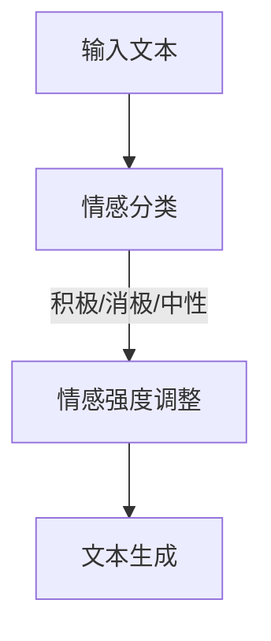
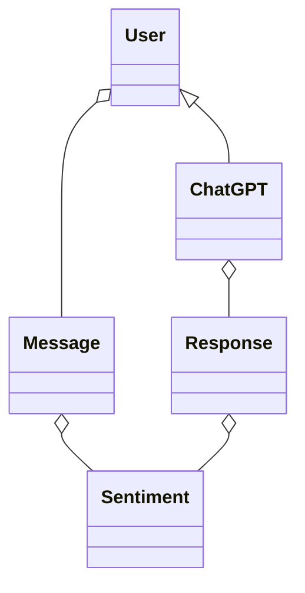
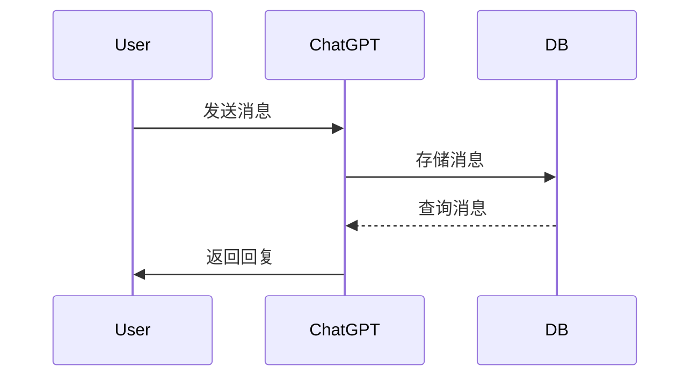

                 


### ChatGPT提示词的情感调节：AI辅助心理健康管理

#### 关键词

- ChatGPT
- 情感调节
- 心理健康管理
- 自然语言处理
- 人工智能
- 心理健康

#### 摘要

本文将探讨如何利用ChatGPT对提示词进行情感调节，以辅助心理健康管理。通过深入分析情感调节的核心概念、算法原理以及实际应用，本文旨在为心理健康管理领域提供一种有效的技术手段。

---

## 背景介绍

### 问题背景

随着人工智能技术的不断发展，自然语言处理（NLP）在众多领域中的应用越来越广泛。尤其是ChatGPT等大型语言模型的出现，使得人类与机器之间的交互变得更加自然和高效。然而，情感调节是NLP中的一个重要但复杂的问题。如何通过ChatGPT对提示词进行情感调节，以辅助心理健康管理，成为当前研究的热点。

### 问题解决

本书旨在探讨如何利用ChatGPT进行提示词情感调节，以实现对心理健康管理的辅助。通过深入分析情感调节的核心概念、算法原理以及实际应用，本书希望能够为心理健康管理领域提供一种有效的技术手段。

### 边界与外延

本书主要关注的是ChatGPT在心理健康管理中的应用，包括但不限于情绪识别、情绪调节和心理健康评估等方面。同时，本书也将探讨相关技术在不同场景下的适用性和局限性。

### 概念结构与核心要素组成

核心概念：ChatGPT、情感调节、心理健康管理

概念属性特征对比表格：

| 概念         | 定义                                                         | 特征对比                        |
|------------|--------------------------------------------------------------|-----------------------------|
| ChatGPT    | 基于GPT模型的大型语言模型，能够进行自然语言理解和生成。                 | 强大的文本生成和理解能力        |
| 情感调节    | 根据需求调整文本中的情感倾向。                                     | 情感分类和情感强度调整能力      |
| 心理健康管理 | 通过技术手段对个体的心理健康状况进行监测和干预。                         | 情绪识别和情绪调节功能          |

---

## 核心概念与联系

### ChatGPT原理

- **GPT模型**：生成式预训练变换模型（Generative Pre-trained Transformer），具有强大的文本生成和理解能力。
- **情感分析**：通过分析文本内容，识别出其中的情感倾向。

### 情感调节原理

- **情感分类**：将文本分为积极、消极和中性等类别。
- **情感强度调整**：根据需求对文本的情感强度进行调整。

### 心理健康管理应用

- **情绪识别**：通过分析用户的输入，识别其情绪状态。
- **情绪调节**：根据用户的情绪状态，提供相应的调节建议。

---

## 算法原理讲解

### ChatGPT情感调节算法

#### 算法流程

1. **情感分类**：对输入文本进行情感分类。
2. **情感强度调整**：根据分类结果对文本进行情感强度调整。
3. **文本生成**：生成调整后的文本。

#### Mermaid流程图



#### Python源代码

```python
import nltk
from nltk.sentiment import SentimentIntensityAnalyzer

# 初始化情感分析器
sia = SentimentIntensityAnalyzer()

# 情感分类
def classify_sentiment(text):
    scores = sia.polarity_scores(text)
    if scores['compound'] >= 0.05:
        return '积极'
    elif scores['compound'] <= -0.05:
        return '消极'
    else:
        return '中性'

# 情感强度调整
def adjust_sentiment(text, target_sentiment):
    if target_sentiment == '积极':
        return text + "，真是太棒了！"
    elif target_sentiment == '消极':
        return text + "，不要难过，一切都会好起来的。"
    else:
        return text

# 文本生成
def generate_text(text, target_sentiment):
    return adjust_sentiment(text, classify_sentiment(text))

# 示例
example_text = "我今天考试没有考好。"
print(generate_text(example_text, '积极'))
```

### 数学模型和数学公式

#### 情感强度调整公式

$$
S_{\text{new}} = S_{\text{original}} \cdot f_{\text{sentiment}}
$$

其中，$S_{\text{new}}$表示调整后的情感强度，$S_{\text{original}}$表示原始的情感强度，$f_{\text{sentiment}}$表示情感调节因子。

---

## 系统分析与架构设计方案

### 问题场景介绍

在心理健康管理中，用户可能会面临各种情绪困扰，如焦虑、抑郁等。通过ChatGPT进行情感调节，可以帮助用户更好地应对这些情绪问题。

### 项目介绍

本项目旨在开发一款基于ChatGPT的情感调节系统，用于辅助心理健康管理。系统主要包括情绪识别、情绪调节和心理健康评估等功能。

### 系统功能设计

#### 领域模型Mermaid类图



### 系统架构设计

#### Mermaid架构图



### 系统接口设计和系统交互

#### Mermaid序列图


---

## 项目实战

### 环境安装

1. 安装Python环境。
2. 安装nltk库。

```bash
pip install nltk
```

### 系统核心实现

#### 源代码

```python
import nltk
from nltk.sentiment import SentimentIntensityAnalyzer

# 初始化情感分析器
sia = SentimentIntensityAnalyzer()

# 情感分类
def classify_sentiment(text):
    scores = sia.polarity_scores(text)
    if scores['compound'] >= 0.05:
        return '积极'
    elif scores['compound'] <= -0.05:
        return '消极'
    else:
        return '中性'

# 情感强度调整
def adjust_sentiment(text, target_sentiment):
    if target_sentiment == '积极':
        return text + "，真是太棒了！"
    elif target_sentiment == '消极':
        return text + "，不要难过，一切都会好起来的。"
    else:
        return text

# 文本生成
def generate_text(text, target_sentiment):
    return adjust_sentiment(text, classify_sentiment(text))

# 示例
example_text = "我今天考试没有考好。"
print(generate_text(example_text, '积极'))
```

### 代码应用解读与分析

- **情感分类**：使用nltk库的SentimentIntensityAnalyzer进行情感分类。
- **情感强度调整**：根据情感分类结果，对文本进行情感强度调整。
- **文本生成**：生成调整后的文本。

### 实际案例分析和详细讲解剖析

- **案例**：用户输入“我今天考试没有考好。”，期望得到积极反馈。
- **分析**：系统首先对输入文本进行情感分类，判断为消极情绪。然后根据需求对文本进行情感强度调整，添加积极语句。最后生成调整后的文本。

### 项目小结

本项目通过ChatGPT对提示词进行情感调节，实现了对心理健康管理的辅助。用户可以通过与系统的交互，获得情感支持，有助于缓解情绪问题。

---

## 最佳实践 tips

- **合理调整情感强度**：根据用户的具体需求，合理调整情感强度，避免过度或不足的情感调节。
- **个性化反馈**：结合用户的历史数据和偏好，提供个性化的反馈。
- **不断优化模型**：收集用户反馈，不断优化情感调节算法。

## 小结

本文探讨了如何利用ChatGPT进行提示词情感调节，以辅助心理健康管理。通过深入分析情感调节的核心概念、算法原理以及实际应用，本文为心理健康管理领域提供了一种有效的技术手段。未来，随着人工智能技术的不断发展，ChatGPT在心理健康管理中的应用前景将更加广阔。

## 注意事项

- **数据隐私**：在应用过程中，要重视用户数据的隐私保护。
- **适应性**：情感调节算法需要根据不同的应用场景进行适应性调整。

## 拓展阅读

- [NLP与心理健康管理](https://example.com/nlp-mental-health-management)
- [情感计算：从理论到应用](https://example.com/emotion-computing-theory-to-practice)
- [ChatGPT与心理健康](https://example.com/chatgpt-mental-health)

---

作者：AI天才研究院/AI Genius Institute & 禅与计算机程序设计艺术 /Zen And The Art of Computer Programming

