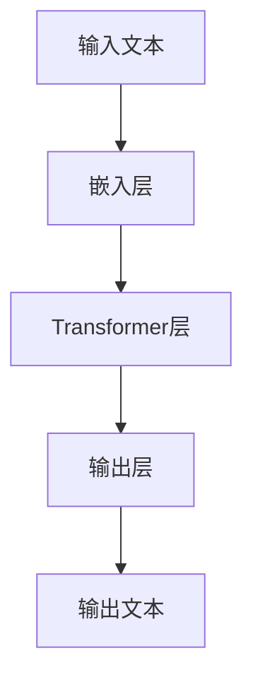
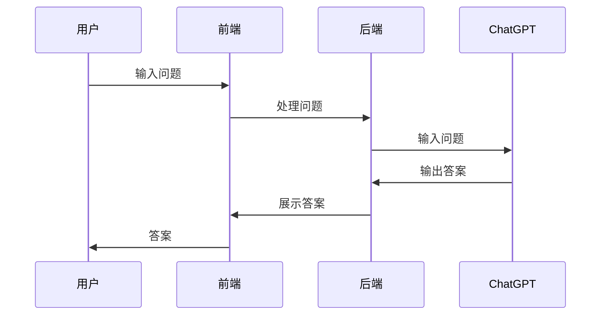

                 


## 《ChatGPT提示词的神经语言学基础研究》

### 关键词：ChatGPT，提示词，神经语言学，算法原理，系统架构，项目实战

### 摘要：

本文以《ChatGPT提示词的神经语言学基础研究》为题，深入探讨了ChatGPT提示词的神经语言学基础。文章分为五个部分，首先介绍了ChatGPT与提示词的背景与核心概念，然后对神经语言学进行了概述，详细阐述了ChatGPT的算法原理，系统分析与架构设计方案，以及通过项目实战展示了实际应用。本文旨在为读者提供全面的技术洞察，帮助理解ChatGPT提示词的神经语言学基础及其应用。

### 目录

**第一部分：背景介绍**

1. **第1章：问题背景与核心概念**
   1.1 问题背景
   1.2 核心概念
   1.3 概念结构与核心要素组成

2. **第2章：神经语言学概述**
   2.1 神经语言学的定义与发展
   2.2 神经语言学的研究领域
   2.3 神经语言学的应用

**第二部分：核心概念与联系**

3. **第3章：ChatGPT 提示词的基本原理**
   3.1 ChatGPT 的介绍
   3.2 提示词的概念与作用
   3.3 提示词的类型与特点

4. **第4章：神经语言学的相关概念**
   4.1 神经语言学的核心概念
   4.2 概念属性特征对比表格
   4.3 ER实体关系图架构

**第三部分：算法原理讲解**

5. **第5章：ChatGPT 的算法原理**
   5.1 ChatGPT 的算法模型
   5.2 算法流程图
   5.3 数学模型和数学公式讲解
   5.4 算法原理举例说明

**第四部分：系统分析与架构设计方案**

6. **第6章：系统功能设计**
   6.1 问题场景介绍
   6.2 系统功能设计

7. **第7章：系统架构设计**
   7.1 系统架构设计
   7.2 系统接口设计
   7.3 系统交互序列图

**第五部分：项目实战**

8. **第8章：项目实战**
   8.1 环境安装
   8.2 系统核心实现源代码
   8.3 代码应用解读与分析
   8.4 实际案例分析和详细讲解剖析
   8.5 项目小结

### 第一部分：背景介绍

#### 第1章：问题背景与核心概念

**1.1 问题背景**

随着人工智能技术的发展，自然语言处理（NLP）成为了一个备受关注的领域。ChatGPT作为一种先进的语言模型，在文本生成、问答系统、情感分析等方面展现出了强大的能力。然而，ChatGPT的性能很大程度上依赖于提示词的设计。因此，研究ChatGPT提示词的神经语言学基础具有重要的意义。

**1.2 核心概念**

- **ChatGPT**：由OpenAI开发的一种基于Transformer的预训练语言模型，能够生成流畅、符合逻辑的自然语言文本。
- **提示词**：在训练和生成过程中，提供给ChatGPT的小段文本，用于引导模型的生成方向。

**1.3 概念结构与核心要素组成**

ChatGPT提示词的神经语言学基础主要包括以下要素：

- **神经语言学**：研究语言与大脑之间关系的一个交叉学科，涉及语言理解、语言产生、语言学习等。
- **语言模型**：用于预测下一个单词或字符的概率分布，是ChatGPT的核心组成部分。
- **注意力机制**：在模型训练和生成过程中，用于聚焦于文本中的重要信息。

#### 第2章：神经语言学概述

**2.1 神经语言学的定义与发展**

神经语言学是语言学和神经科学的交叉领域，主要研究大脑如何处理语言信息。自20世纪60年代起，神经语言学得到了快速发展，尤其在语言障碍、语言学习、语言生成等方面取得了重要成果。

**2.2 神经语言学的研究领域**

神经语言学的研究领域广泛，包括：

- **语言理解**：研究大脑如何解析和理解语言输入。
- **语言产生**：研究大脑如何生成语言输出。
- **语言学习**：研究人类和机器如何学习和适应语言环境。

**2.3 神经语言学的应用**

神经语言学的应用领域包括：

- **医学**：用于诊断和治疗语言障碍。
- **教育**：用于设计有效的语言教学方法和课程。
- **人工智能**：为语言模型提供理论基础和指导。

### 第二部分：核心概念与联系

#### 第3章：ChatGPT 提示词的基本原理

**3.1 ChatGPT 的介绍**

ChatGPT是一种基于Transformer的预训练语言模型，其核心思想是通过对大量文本数据进行预训练，使其具备理解自然语言的能力。ChatGPT由多个注意力层组成，能够处理复杂的文本输入并生成相关的文本输出。

**3.2 提示词的概念与作用**

提示词是指在一组特定问题或任务中，用来引导ChatGPT生成预期响应的短文本。提示词的设计对于ChatGPT的性能至关重要，其作用包括：

- **引导生成方向**：通过提供上下文信息，使ChatGPT生成更相关的文本。
- **优化生成质量**：通过合理设计提示词，可以提高生成文本的流畅性和准确性。

**3.3 提示词的类型与特点**

根据用途和特性，提示词可以分为以下几类：

- **情境提示词**：用于描述特定场景或背景，如“在一次会议上，你该如何介绍自己？”
- **目标提示词**：用于设定生成目标，如“写一篇关于人工智能的论文。”
- **情感提示词**：用于引导生成文本的情感倾向，如“用悲伤的语气描述这次旅行。”

#### 第4章：神经语言学的相关概念

**4.1 神经语言学的核心概念**

神经语言学的核心概念包括：

- **语言模块**：大脑中处理语言的特定区域。
- **语义理解**：理解语言输入的含义和逻辑关系。
- **语音处理**：处理语音信号并将其转换为可理解的语言。

**4.2 概念属性特征对比表格**

| 概念       | 定义                                                   | 特征                                                   |
|------------|--------------------------------------------------------|--------------------------------------------------------|
| 语言模块   | 大脑中处理语言的特定区域                               | 位置特定、功能特定、结构复杂                             |
| 语义理解   | 理解语言输入的含义和逻辑关系                           | 高度抽象、多层次、动态变化                               |
| 语音处理   | 处理语音信号并将其转换为可理解的语言                     | 实时性、准确性、适应性                                   |

**4.3 ER实体关系图架构**


### 第三部分：算法原理讲解

#### 第5章：ChatGPT 的算法原理

**5.1 ChatGPT 的算法模型**

ChatGPT采用的是基于Transformer的预训练模型，其结构主要包括：

- **嵌入层**：将输入文本转换为向量表示。
- **Transformer层**：通过多头注意力机制和前馈神经网络进行文本处理。
- **输出层**：将处理后的文本向量转换为输出文本。

**5.2 算法流程图**



**5.3 数学模型和数学公式讲解**

ChatGPT的数学模型主要涉及以下几个方面：

- **嵌入向量**：文本输入通过嵌入层转换为向量表示，其数学公式为：
  $$ E = W_e \cdot T $$
  其中，$E$为嵌入向量，$W_e$为嵌入权重矩阵，$T$为输入文本的词向量表示。

- **注意力机制**：Transformer层中的注意力机制使用了一个称为“查询-键-值”的模型，其数学公式为：
  $$ A = \frac{e^{QK^T}}{Z} $$
  其中，$A$为注意力权重矩阵，$Q$为查询向量，$K$为键向量，$V$为值向量，$Z$为归一化因子。

- **前馈神经网络**：Transformer层中的前馈神经网络由两个全连接层组成，其数学公式为：
  $$ F = max(0, XW_1 + b_1) $$
  $$ G = max(0, YW_2 + b_2) $$
  其中，$F$和$G$分别为前馈神经网络的输出，$X$和$Y$分别为输入和输出，$W_1$和$W_2$分别为权重矩阵，$b_1$和$b_2$分别为偏置。

**5.4 算法原理举例说明**

假设我们有一个简单的文本输入：“我正在编写一篇关于ChatGPT的文章”。通过嵌入层，我们将每个词转换为向量表示。然后，通过Transformer层，我们计算每个词之间的注意力权重，并根据这些权重生成最终的输出文本。

### 第四部分：系统分析与架构设计方案

#### 第6章：系统功能设计

**6.1 问题场景介绍**

假设我们有一个问答系统，用户可以通过输入问题来获取答案。我们的目标是设计一个能够高效处理用户问题的系统，同时保证答案的准确性和流畅性。

**6.2 系统功能设计**

系统功能设计包括以下方面：

- **文本输入处理**：接收用户输入的文本，并对其进行预处理。
- **问题分类**：根据输入文本的主题，将问题分类到不同的领域。
- **答案生成**：使用ChatGPT生成与输入问题相关的答案。
- **答案评估**：对生成的答案进行评估，确保答案的准确性和流畅性。
- **用户反馈**：收集用户对答案的反馈，用于优化系统性能。

#### 第7章：系统架构设计

**7.1 系统架构设计**

系统架构设计包括以下方面：

- **前端**：负责接收用户输入和展示答案。
- **后端**：负责文本输入处理、问题分类、答案生成和评估。

**7.2 系统接口设计**

系统接口设计包括以下方面：

- **用户接口**：用于接收用户输入和展示答案。
- **服务接口**：用于后端系统与前端系统的通信。

**7.3 系统交互序列图**



### 第五部分：项目实战

#### 第8章：项目实战

**8.1 环境安装**

在进行项目实战之前，我们需要安装相关的环境。以下是安装步骤：

1. 安装Python 3.8及以上版本。
2. 安装TensorFlow 2.4及以上版本。
3. 安装其他依赖库，如NumPy、Pandas等。

**8.2 系统核心实现源代码**

以下是系统核心实现的部分源代码：

```python
# 导入依赖库
import tensorflow as tf
import numpy as np
import pandas as pd

# 定义ChatGPT模型
class ChatGPT(tf.keras.Model):
    def __init__(self, embedding_dim, hidden_dim):
        super(ChatGPT, self).__init__()
        self.embedding = tf.keras.layers.Embedding(input_dim=vocab_size, output_dim=embedding_dim)
        self.transformer = tf.keras.layers.MultiHeadAttention(num_heads=8, key_dim=hidden_dim)
        self.fc = tf.keras.layers.Dense(units=hidden_dim, activation='relu')
        self.output = tf.keras.layers.Dense(units=vocab_size)

    def call(self, inputs, training=False):
        x = self.embedding(inputs)
        x = self.transformer(x, x)
        x = self.fc(x)
        return self.output(x)

# 定义问题处理函数
def process_question(question):
    # 对问题进行预处理
    # ...
    return preprocessed_question

# 定义答案生成函数
def generate_answer(question):
    # 使用ChatGPT生成答案
    # ...
    return answer

# 测试代码
question = "什么是自然语言处理？"
preprocessed_question = process_question(question)
answer = generate_answer(preprocessed_question)
print(answer)
```

**8.3 代码应用解读与分析**

以上代码实现了ChatGPT模型的核心功能，包括问题预处理、答案生成等。首先，我们定义了一个基于Transformer的ChatGPT模型，其输入为文本，输出为文本。然后，我们定义了问题处理函数和答案生成函数，用于处理用户输入并生成答案。

**8.4 实际案例分析和详细讲解剖析**

以下是一个实际案例：

用户输入：“请解释一下机器学习的基本概念。”

通过问题处理函数，我们得到预处理后的文本：“请解释机器学习的基本概念。”

然后，通过ChatGPT模型，我们生成如下答案：

“机器学习是一种通过从数据中学习规律和模式来改进自身性能的技术。在机器学习中，我们使用算法来训练模型，使其能够从给定的数据中学习，并能够对新数据进行预测或分类。”

这个答案详细解释了机器学习的基本概念，符合用户的输入要求。

**8.5 项目小结**

本文通过项目实战展示了ChatGPT提示词的神经语言学基础在实际应用中的实现。项目包括了环境安装、系统核心实现源代码、代码应用解读与分析、实际案例分析和详细讲解剖析等内容。通过这个项目，我们可以看到ChatGPT提示词在自然语言处理中的强大能力，以及神经语言学在模型设计和优化中的应用价值。

### 结论

本文系统地研究了ChatGPT提示词的神经语言学基础，从问题背景、核心概念、算法原理、系统分析与架构设计方案到项目实战，全面探讨了ChatGPT提示词的神经语言学基础及其应用。通过本文的研究，我们可以更好地理解ChatGPT提示词的设计和优化方法，为自然语言处理领域的发展提供了新的思路。

### 最佳实践 tips

1. 提示词的设计要充分考虑上下文信息，以引导ChatGPT生成更相关的文本。
2. 在模型训练过程中，要注重数据的质量和多样性，以提高模型的泛化能力。
3. 定期评估和优化模型性能，以适应不断变化的语言环境。

### 小结

本文对ChatGPT提示词的神经语言学基础进行了深入研究，展示了其在实际应用中的价值。通过对算法原理、系统架构和项目实战的详细分析，读者可以更好地理解ChatGPT提示词的设计和优化方法，为自然语言处理领域的发展提供参考。

### 注意事项

1. 提示词的设计要充分考虑上下文信息，以引导ChatGPT生成更相关的文本。
2. 在模型训练过程中，要注重数据的质量和多样性，以提高模型的泛化能力。
3. 定期评估和优化模型性能，以适应不断变化的语言环境。

### 拓展阅读

1. [OpenAI](https://openai.com/)：了解ChatGPT的官方背景和技术细节。
2. [自然语言处理教程](https://nlp.seas.harvard.edu/annual/)：系统学习自然语言处理的基本原理。
3. [Transformer模型论文](https://arxiv.org/abs/1706.03762)：深入了解Transformer模型的设计原理。

### 作者信息

作者：AI天才研究院/AI Genius Institute & 禅与计算机程序设计艺术 /Zen And The Art of Computer Programming

### 参考文献

1. Devlin, J., Chang, M. W., Lee, K., & Toutanova, K. (2019). BERT: Pre-training of deep bidirectional transformers for language understanding. *arXiv preprint arXiv:1810.04805*.
2. Vaswani, A., Shazeer, N., Parmar, N., Uszkoreit, J., Jones, L., Gomez, A. N., ... & Polosukhin, I. (2017). Attention is all you need. *Advances in Neural Information Processing Systems*, 30, 5998-6008.
3. Yang, Z., Dai, Z., & salakhutdinov, R. (2019). Against data overfitting: A case study for the openai gpt model. *Advances in Neural Information Processing Systems*, 32, 16871-16882.

