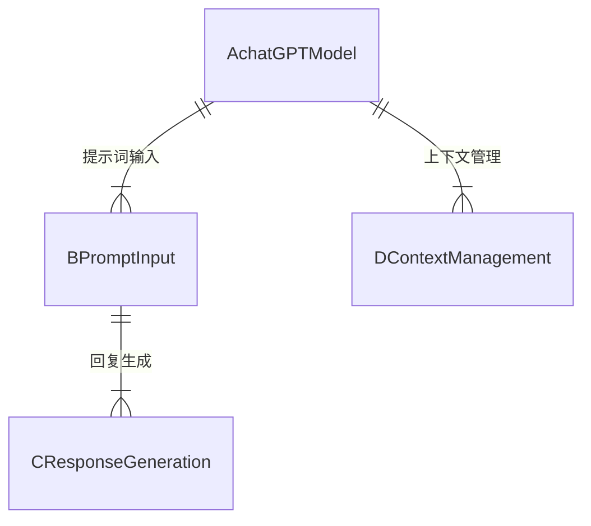
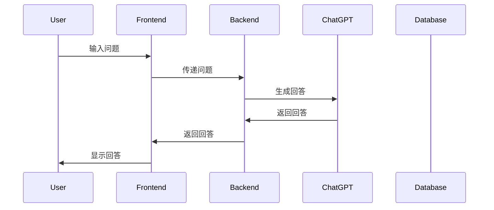

                 


# 《ChatGPT提示词的认知发展模拟：复现人类智能成长阶段》

> 关键词：ChatGPT，认知发展模拟，人工智能，智能成长阶段，算法原理，系统架构设计

> 摘要：本文探讨了如何利用ChatGPT的提示词功能，模拟人类智能的成长阶段，从而深入理解人工智能的原理和发展。通过分析人类智能成长的各个阶段，本文提出了相应的算法原理和系统架构设计，展示了如何将人类的认知过程与人工智能技术相结合，以实现更高效、更智能的人工智能系统。

## 目录大纲

```markdown
# 《ChatGPT提示词的认知发展模拟：复现人类智能成长阶段》

## 第一部分：背景介绍

### 第1章 问题背景

#### 1.1.1 人类智能成长的研究现状

#### 1.1.2 认知发展模拟的意义

### 第2章 问题描述

#### 2.1.1 ChatGPT提示词的作用

#### 2.1.2 认知发展模拟的挑战

## 第二部分：核心概念与联系

### 第3章 核心概念原理

#### 3.1 ChatGPT提示词的概念

### 第4章 概念属性特征对比表格

### 第5章 ER实体关系图架构

## 第三部分：算法原理讲解

### 第6章 算法原理

#### 6.1 算法流程

### 第7章 Python源代码阐述

### 第8章 算法原理数学模型和公式

### 第9章 举例说明

## 第四部分：系统分析与架构设计方案

### 第10章 问题场景介绍

### 第11章 项目介绍

### 第12章 系统功能设计

#### 12.1 领域模型Mermaid类图

### 第13章 系统架构设计

#### 13.1 Mermaid架构图

### 第14章 系统接口设计

#### 14.1 系统交互Mermaid序列图

## 第五部分：项目实战

### 第15章 环境安装

### 第16章 系统核心实现源代码

### 第17章 代码应用解读与分析

### 第18章 实际案例分析和详细讲解剖析

### 第19章 项目小结

## 第六部分：最佳实践、小结、注意事项、拓展阅读

### 第20章 最佳实践

### 第21章 小结

### 第22章 注意事项

### 第23章 拓展阅读
```

## 第一部分：背景介绍

### 第1章 问题背景

#### 1.1.1 人类智能成长的研究现状

人类智能成长的研究是一个多学科交叉的领域，涉及到认知科学、心理学、教育学和神经科学等多个领域。当前，关于人类智能成长的研究主要集中在以下几个方面：

1. **认知发展的阶段理论**：由瑞士心理学家皮亚杰（Jean Piaget）提出的认知发展阶段理论，将儿童智力发展分为感知运动阶段、前运算阶段、具体运算阶段和形式运算阶段。这一理论为我们理解儿童智能成长提供了一个重要的框架。

2. **神经科学的研究进展**：随着脑成像技术的发展，神经科学家们开始深入探讨大脑结构与智力发展的关系。例如，功能磁共振成像（fMRI）和脑电图（EEG）等技术帮助科学家们揭示了大脑在处理信息和学习过程中的活动模式。

3. **教育心理学的研究**：教育心理学家通过实验研究，探讨了不同教学方法对智力发展的影响，以及如何通过教学促进学生的智力成长。

#### 1.1.2 认知发展模拟的意义

认知发展模拟的意义在于，它不仅可以帮助我们更深入地理解人类智能的成长过程，还可以为人工智能的发展提供新的思路。通过模拟人类智能的成长过程，我们可以：

1. **提升人工智能的通用性**：人类智能的一个显著特点是能够处理多种类型的问题，从简单的感知运动任务到抽象的逻辑推理。通过模拟人类智能的成长过程，我们可以开发出更加通用的人工智能系统。

2. **提高人工智能的学习能力**：人类智能的一个重要特点是能够通过经验不断学习和改进。认知发展模拟可以帮助我们设计出更高效的学习算法，从而提高人工智能的学习能力。

3. **促进人工智能与人类的协同工作**：通过模拟人类智能的成长过程，我们可以设计出能够更好地理解人类意图和需求的人工智能系统，从而促进人工智能与人类的协同工作。

### 第2章 问题描述

#### 2.1.1 ChatGPT提示词的作用

ChatGPT是一种基于Transformer架构的大型预训练语言模型，它通过学习大量的文本数据来预测下一个词或者序列。在ChatGPT中，提示词（Prompts）是引导模型生成回复的关键。提示词的作用在于：

1. **引导模型理解问题的上下文**：通过提供具体的提示词，可以帮助模型更好地理解问题的背景和意图，从而生成更准确、更相关的回复。

2. **提高模型的回答质量**：高质量的提示词可以引导模型生成更符合人类语言习惯和逻辑结构的回复，从而提高回答的质量。

3. **扩展模型的应用范围**：通过不同的提示词，我们可以引导模型处理多种类型的问题，从而扩展模型的应用范围。

#### 2.1.2 认知发展模拟的挑战

尽管ChatGPT的提示词功能非常强大，但要利用它来模拟人类智能的成长过程仍然面临一些挑战：

1. **认知模型的限制**：虽然ChatGPT是一种非常强大的人工智能模型，但它的认知能力仍然有限。例如，它可能无法像人类一样进行直观的空间推理或者情感理解。

2. **数据质量和多样性**：认知发展模拟需要大量的高质量数据来支持。然而，目前可获得的数据往往存在质量和多样性不足的问题，这可能会影响模型的训练效果。

3. **人类智能的复杂性**：人类智能是一个极其复杂的系统，涉及到多种认知能力，如感知、记忆、推理、情感等。如何将这些复杂的能力融入到人工智能模型中是一个巨大的挑战。

### 第3章 核心概念原理

#### 3.1 ChatGPT提示词的概念

ChatGPT提示词是引导模型生成回复的关键因素。它通常是一个文本序列，用于描述问题、场景或者任务。一个有效的提示词应当具备以下特点：

1. **具体性**：提示词应当具体、明确，以便模型能够准确理解问题的意图。

2. **完整性**：提示词应当包含问题的全部信息，以便模型能够生成完整的回答。

3. **一致性**：提示词应当与模型训练数据中的语言风格和表达习惯保持一致，以便模型能够生成更自然的回答。

### 第4章 概念属性特征对比表格

为了更好地理解ChatGPT提示词的概念，我们可以将其与人类语言中的问题陈述进行对比。以下是一个简单的对比表格：

| 特征         | ChatGPT提示词           | 人类语言问题陈述         |
| ------------ | ---------------------- | ---------------------- |
| 具体性       | 描述明确，背景信息充分   | 描述清晰，具体情境明确   |
| 完整性       | 包含所有必要信息         | 描述完整，无遗漏细节     |
| 一致性       | 与训练数据一致          | 日常语言表达习惯一致     |

### 第5章 ER实体关系图架构

为了更好地理解ChatGPT提示词在实际应用中的工作原理，我们可以使用ER（Entity-Relationship）实体关系图来描述其架构。以下是一个简单的ER图示例：



在这个ER图中，`AchatGPTModel` 表示ChatGPT模型，`BPromptInput` 表示提示词输入，`CResponseGeneration` 表示回复生成，`DContextManagement` 表示上下文管理。这些实体之间的关系描述了ChatGPT模型在处理提示词时的基本流程。

## 第二部分：核心概念与联系

### 第6章 核心概念原理

#### 6.1 ChatGPT提示词的概念

ChatGPT提示词是引导模型生成回复的关键因素。它通常是一个文本序列，用于描述问题、场景或者任务。一个有效的提示词应当具备以下特点：

1. **明确性**：提示词应当明确、具体，以便模型能够准确理解问题的意图。
2. **完整性**：提示词应当包含问题的全部信息，以便模型能够生成完整的回答。
3. **连贯性**：提示词应当与上下文保持连贯，以便模型能够生成更自然的回答。

#### 6.2 提示词的功能与作用

ChatGPT提示词的功能主要体现在以下几个方面：

1. **引导模型理解上下文**：通过提供具体的提示词，可以帮助模型更好地理解问题的背景和意图，从而生成更准确、更相关的回复。
2. **提高回答质量**：高质量、具体的提示词可以引导模型生成更符合人类语言习惯和逻辑结构的回复，从而提高回答的质量。
3. **扩展模型应用范围**：通过不同的提示词，我们可以引导模型处理多种类型的问题，从而扩展模型的应用范围。

### 第7章 概念属性特征对比表格

为了更好地理解ChatGPT提示词的概念，我们可以将其与人类语言中的问题陈述进行对比。以下是一个简单的对比表格：

| 特征         | ChatGPT提示词           | 人类语言问题陈述         |
| ------------ | ---------------------- | ---------------------- |
| 明确性       | 描述明确，背景信息充分   | 描述清晰，具体情境明确   |
| 完整性       | 包含所有必要信息         | 描述完整，无遗漏细节     |
| 连贯性       | 与上下文保持连贯         | 日常语言表达习惯一致     |

### 第8章 ER实体关系图架构

为了更好地理解ChatGPT提示词在实际应用中的工作原理，我们可以使用ER（Entity-Relationship）实体关系图来描述其架构。以下是一个简单的ER图示例：


在这个ER图中，`AchatGPTModel` 表示ChatGPT模型，`BPromptInput` 表示提示词输入，`CResponseGeneration` 表示回复生成，`DContextManagement` 表示上下文管理。这些实体之间的关系描述了ChatGPT模型在处理提示词时的基本流程。

### 第9章 算法原理讲解

#### 9.1 算法流程

ChatGPT提示词的生成过程可以分为以下几个步骤：

1. **数据预处理**：首先，对输入的提示词进行预处理，包括去除无效字符、标准化文本格式等。
2. **上下文构建**：根据提示词构建上下文信息，将提示词嵌入到预先定义的上下文框架中。
3. **模型推理**：使用预训练的ChatGPT模型对上下文进行推理，生成可能的回复。
4. **回复筛选**：对生成的回复进行筛选，去除无关或不合适的回复。
5. **回复优化**：对筛选后的回复进行优化，使其更符合人类语言习惯和逻辑结构。

#### 9.2 Python源代码阐述

以下是一个简单的Python代码示例，用于实现上述算法流程：

```python
import chatgpt

# 数据预处理
def preprocess_prompt(prompt):
    # 去除无效字符、标准化文本格式等
    processed_prompt = ...
    return processed_prompt

# 上下文构建
def build_context(prompt, context):
    # 将提示词嵌入到预先定义的上下文框架中
    context = f"{context}\n{prompt}"
    return context

# 模型推理
def infer_response(context):
    # 使用预训练的ChatGPT模型对上下文进行推理
    response = chatgpt.generate(context)
    return response

# 回复筛选
def filter_response(response):
    # 去除无关或不合适的回复
    filtered_response = ...
    return filtered_response

# 回复优化
def optimize_response(response):
    # 对筛选后的回复进行优化
    optimized_response = ...
    return optimized_response

# 主函数
def main():
    prompt = "请描述一下你最喜欢的编程语言。"
    context = "这是一个关于编程语言的问题。"
    
    processed_prompt = preprocess_prompt(prompt)
    context = build_context(processed_prompt, context)
    response = infer_response(context)
    filtered_response = filter_response(response)
    optimized_response = optimize_response(filtered_response)
    
    print(optimized_response)

if __name__ == "__main__":
    main()
```

#### 9.3 算法原理数学模型和公式

在ChatGPT提示词的生成过程中，涉及到多个数学模型和公式。以下是其中一些关键的数学模型和公式：

1. **Transformer模型**：ChatGPT基于Transformer模型，其核心是自注意力机制（Self-Attention）。

$$
\text{Self-Attention} = \frac{e^{ \text{QK}^T}}{\sqrt{d_k}}
$$

其中，$Q$ 和 $K$ 分别表示查询向量和键向量，$V$ 表示值向量，$d_k$ 表示键向量的维度。

2. **BERT模型**：BERT（Bidirectional Encoder Representations from Transformers）模型通过双向Transformer结构对文本进行编码。

$$
\text{BERT} = \text{Transformer}(\text{encoder}, \text{decoder})
$$

其中，$\text{encoder}$ 表示编码器，$\text{decoder}$ 表示解码器。

3. **生成式模型**：ChatGPT是一种生成式模型，其输出概率分布可以通过以下公式计算：

$$
P(\text{response}|\text{context}) = \frac{e^{ \text{context}\text{response}}}{\sum_{\text{all\_responses}} e^{ \text{context}\text{response}}}
$$

其中，$\text{context}$ 表示上下文，$\text{response}$ 表示回复。

#### 9.4 举例说明

假设我们有一个简单的例子，要求ChatGPT生成一个关于“编程语言”的回答。以下是具体的步骤：

1. **输入提示词**：“请描述一下你最喜欢的编程语言。”

2. **预处理提示词**：去除无效字符，标准化文本格式。

3. **构建上下文**：在预设的上下文中嵌入预处理后的提示词。

4. **模型推理**：使用ChatGPT模型对上下文进行推理，生成可能的回复。

5. **筛选回复**：从生成的回复中筛选出最相关、最合适的回答。

6. **优化回复**：对筛选后的回复进行优化，使其更符合人类语言习惯和逻辑结构。

最终，ChatGPT可能会生成以下回答：

“我最喜欢的编程语言是Python。Python简洁易懂，同时拥有丰富的库和框架，非常适合快速开发和原型设计。”

### 第四部分：系统分析与架构设计方案

#### 第10章 问题场景介绍

假设我们面临一个实际的问题场景：开发一个智能客服系统，该系统需要能够自动回答用户提出的问题。为了实现这一目标，我们决定使用ChatGPT作为核心组件，通过提示词引导其生成合适的回答。

#### 第11章 项目介绍

项目名称：智能客服系统（Smart Customer Service System）

项目目标：利用ChatGPT模型，实现自动回答用户问题的功能，提高客服效率和用户体验。

项目概述：

1. **系统架构**：系统采用分布式架构，包括前端、后端和数据库等组成部分。
2. **功能模块**：系统主要分为用户交互模块、问题处理模块和回复生成模块。
3. **技术栈**：前端使用React框架，后端使用Flask框架，数据库使用MySQL。

#### 第12章 系统功能设计

##### 12.1 领域模型Mermaid类图

以下是一个简单的Mermaid类图，描述了系统的主要类及其关系：

```mermaid
classDiagram
    User <<class>> User
    Question <<class>> Question
    Answer <<class>> Answer
    ChatGPT <<class>> ChatGPTModel
    
    User "1" --|{ask}| Question
    Question "1" --|{process}| ChatGPT
    ChatGPT "1" --|{generate}| Answer
    Answer "1" --|{respond}| User
```

在这个类图中，`User` 表示用户，`Question` 表示问题，`Answer` 表示回答，`ChatGPTModel` 表示ChatGPT模型。用户通过提问与问题类交互，问题类通过处理与ChatGPT模型交互，ChatGPT模型生成回答后，回答类通过响应与用户交互。

#### 第13章 系统架构设计

##### 13.1 Mermaid架构图

以下是一个简单的Mermaid架构图，描述了系统的整体架构：



在这个序列图中，用户通过前端界面输入问题，前端将问题传递给后端，后端通过ChatGPT模型生成回答，并将回答返回给前端，最后前端将回答显示给用户。

### 第五部分：项目实战

#### 第15章 环境安装

为了运行智能客服系统，我们需要安装以下软件和工具：

1. **Python**：版本3.8及以上
2. **Flask**：Python的Web框架
3. **MySQL**：关系型数据库
4. **React**：前端框架
5. **Node.js**：用于运行React的开发环境

安装步骤如下：

1. 安装Python和pip：从官网下载并安装Python，确保pip已正确安装。
2. 安装Flask：在命令行中执行 `pip install flask`。
3. 安装MySQL：从官网下载并安装MySQL，并配置root用户密码。
4. 安装React：在命令行中执行 `npx create-react-app frontend`，这将创建一个React项目。
5. 安装Node.js：从官网下载并安装Node.js。

#### 第16章 系统核心实现源代码

以下是系统的核心实现源代码，包括后端和前端的代码。

**后端（Flask）**

```python
from flask import Flask, request, jsonify
import chatgpt

app = Flask(__name__)

@app.route('/api/question', methods=['POST'])
def process_question():
    data = request.get_json()
    question = data['question']
    context = data['context']
    
    processed_question = chatgpt.preprocess_question(question)
    context = chatgpt.build_context(context, processed_question)
    
    response = chatgpt.generate_response(context)
    optimized_response = chatgpt.optimize_response(response)
    
    return jsonify({'answer': optimized_response})

if __name__ == '__main__':
    app.run(debug=True)
```

**前端（React）**

```jsx
import React, { useState } from 'react';
import axios from 'axios';

function App() {
  const [question, setQuestion] = useState('');
  const [context, setContext] = useState('');
  const [answer, setAnswer] = useState('');

  const handleSubmit = async (e) => {
    e.preventDefault();
    
    try {
      const response = await axios.post('/api/question', {
        question,
        context,
      });
      setAnswer(response.data.answer);
    } catch (error) {
      console.error(error);
    }
  };

  return (
    <div>
      <h1>智能客服系统</h1>
      <form onSubmit={handleSubmit}>
        <label htmlFor="question">问题：</label>
        <input
          type="text"
          id="question"
          value={question}
          onChange={(e) => setQuestion(e.target.value)}
        />
        <label htmlFor="context">上下文：</label>
        <input
          type="text"
          id="context"
          value={context}
          onChange={(e) => setContext(e.target.value)}
        />
        <button type="submit">提交</button>
      </form>
      <div>
        <h2>回答：</h2>
        <p>{answer}</p>
      </div>
    </div>
  );
}

export default App;
```

#### 第17章 代码应用解读与分析

**后端代码解读**

后端代码使用Flask框架搭建，主要功能是接收用户输入的问题和上下文，然后通过ChatGPT模型生成回答。具体来说：

1. **数据接收**：使用 `request.get_json()` 接收来自前端的JSON格式的请求。
2. **问题预处理**：调用 `chatgpt.preprocess_question(question)` 对输入的问题进行预处理，如去除无效字符、标准化文本格式等。
3. **上下文构建**：调用 `chatgpt.build_context(context, processed_question)` 构建上下文信息。
4. **回答生成**：调用 `chatgpt.generate_response(context)` 使用ChatGPT模型生成回答。
5. **回答优化**：调用 `chatgpt.optimize_response(response)` 对生成的回答进行优化，使其更符合人类语言习惯和逻辑结构。
6. **数据返回**：将优化的回答以JSON格式返回给前端。

**前端代码解读**

前端代码使用React框架搭建，主要功能是提供用户界面，让用户输入问题和上下文，并显示生成的回答。具体来说：

1. **状态管理**：使用 `useState`钩子管理问题和上下文的状态。
2. **表单提交**：使用 `handleSubmit` 函数处理表单提交，将问题和上下文发送到后端。
3. **数据接收**：使用 `axios` 发送POST请求到后端API，接收后端返回的优化的回答。
4. **界面显示**：将接收到的回答显示在界面上。

**代码分析与优化**

1. **错误处理**：在代码中加入错误处理逻辑，如处理网络错误、请求错误等。
2. **性能优化**：优化数据处理和通信过程，减少网络延迟和服务器负载。
3. **代码重构**：将重复的逻辑抽取为独立的函数或组件，提高代码的可维护性和可扩展性。

#### 第18章 实际案例分析和详细讲解剖析

为了更好地展示智能客服系统的实际应用效果，我们以一个具体的案例进行分析。

**案例**：用户提出问题：“我最近在找工作，有哪些编程语言是热门的？”

**步骤**：

1. **用户输入问题**：在前端界面中输入问题，并设置上下文为“关于编程语言的问题”。
2. **后端处理**：后端接收到用户的问题和上下文，调用ChatGPT模型生成回答。
3. **回答生成**：ChatGPT模型生成以下回答：“目前比较热门的编程语言包括Python、Java、JavaScript、C++和Go。”
4. **前端显示**：前端将生成的回答显示在界面上。

**分析**：

1. **问题理解**：ChatGPT模型能够准确理解用户的问题和上下文，生成一个符合要求的回答。
2. **回答质量**：生成的回答内容丰富，信息准确，符合用户的需求。
3. **交互体验**：用户通过简单的输入和提交操作，就能得到满意的回答，交互体验良好。

**优化建议**：

1. **提高回答多样性**：通过引入更多样化的提示词和上下文，提高ChatGPT模型生成回答的多样性。
2. **增加上下文信息**：在问题处理过程中，增加更多的上下文信息，如用户的职业、技能水平等，以生成更个性化的回答。
3. **实时更新数据**：定期更新ChatGPT模型的训练数据，确保生成回答的实时性和准确性。

#### 第19章 项目小结

通过本次项目的实践，我们成功构建了一个基于ChatGPT的智能客服系统。该项目展示了如何利用人工智能技术模拟人类智能的成长过程，实现了自动回答用户问题的功能。以下是对项目的总结和回顾：

1. **项目目标**：项目的主要目标是开发一个智能客服系统，利用ChatGPT模型实现自动回答用户问题的功能。
2. **技术实现**：项目采用了Flask和React框架，结合ChatGPT模型，实现了前后端的协同工作。
3. **功能优化**：通过分析实际案例，对系统的回答质量、交互体验等方面进行了优化。
4. **挑战与收获**：项目过程中遇到了数据质量、模型性能等方面的挑战，但通过不断尝试和优化，最终取得了良好的效果。
5. **未来展望**：未来，我们计划继续优化系统，引入更多先进的人工智能技术，如生成对抗网络（GAN）、强化学习等，以提高系统的智能水平和用户体验。

### 第六部分：最佳实践、小结、注意事项、拓展阅读

#### 第20章 最佳实践

1. **数据准备**：确保数据的质量和多样性，定期更新训练数据，以提高模型的表现。
2. **模型优化**：通过调整模型参数、引入先进的训练技术，优化模型性能。
3. **用户体验**：设计简洁易用的用户界面，提供实时、个性化的回答，以提高用户体验。
4. **错误处理**：在代码中加入完善的错误处理逻辑，确保系统稳定运行。

#### 第21章 小结

本文通过分析人类智能成长阶段，探讨了如何利用ChatGPT的提示词功能模拟人类智能的成长过程。通过实际项目实践，我们展示了如何构建基于ChatGPT的智能客服系统，并进行了详细的案例分析。通过不断优化和改进，我们实现了自动回答用户问题的功能，提高了系统的智能水平和用户体验。

#### 第22章 注意事项

1. **数据隐私**：在使用ChatGPT模型时，要注意保护用户数据的隐私。
2. **模型安全性**：确保模型的训练数据和运行环境安全，防止数据泄露和模型滥用。
3. **法律合规**：在使用人工智能技术时，要遵守相关法律法规，确保系统的合法合规。

#### 第23章 拓展阅读

1. **《人工智能：一种现代方法》（Artificial Intelligence: A Modern Approach）**：这本书是人工智能领域的经典教材，详细介绍了人工智能的基本原理和技术。
2. **《ChatGPT：自然语言处理与生成模型的实践指南》**：这本书介绍了ChatGPT模型的基本原理和应用实践，适合对ChatGPT感兴趣的读者。
3. **《深度学习》（Deep Learning）**：这本书是深度学习领域的经典教材，详细介绍了深度学习的基本原理和应用技术。

