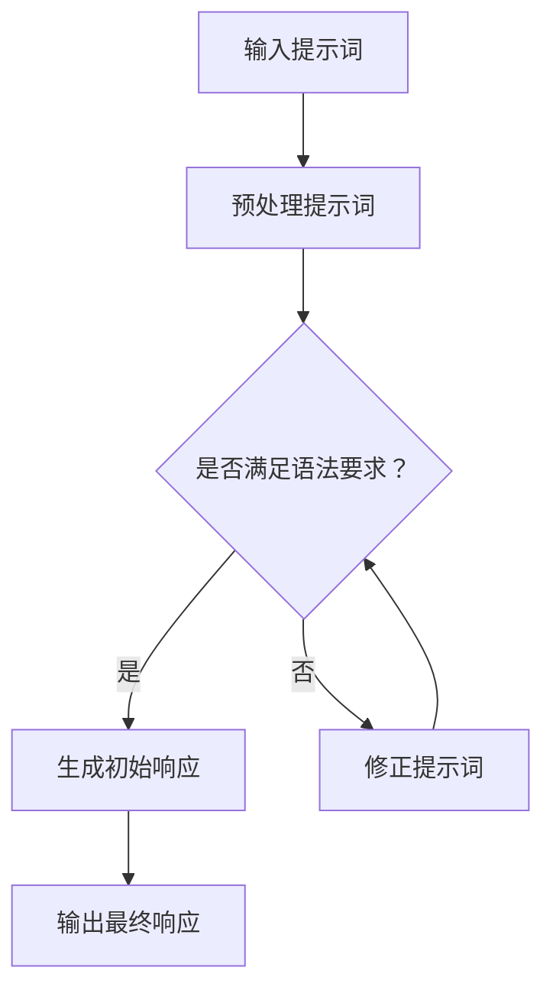
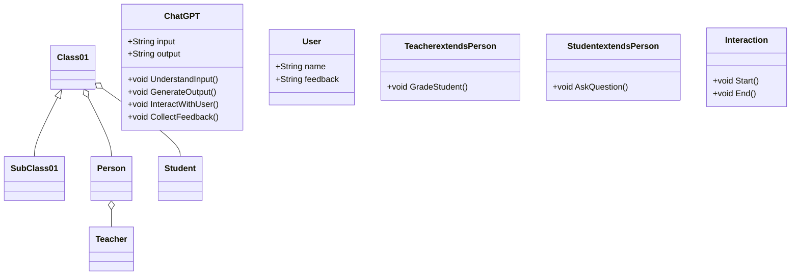
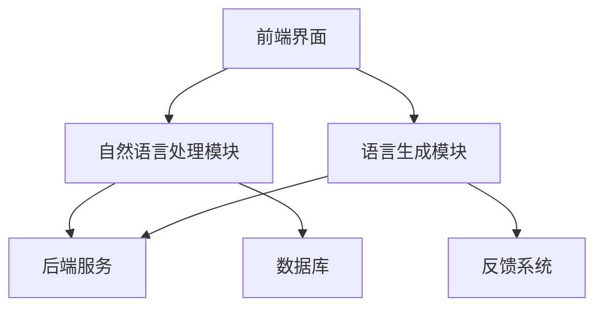
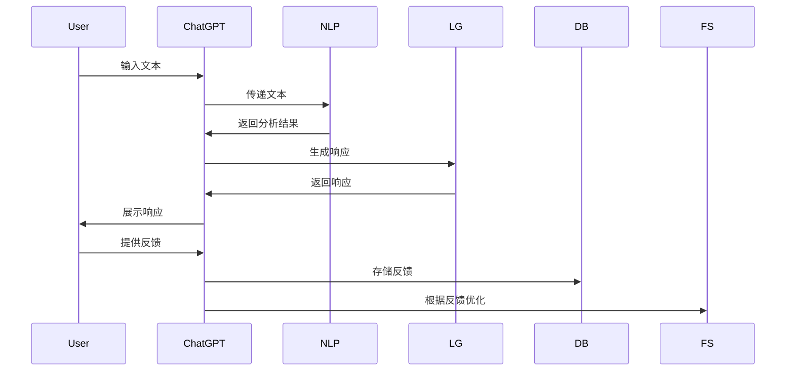

                 


### 摘要

本文旨在深入探讨ChatGPT提示词的认知语言学模型构建，通过详细解析其背景、核心概念、算法原理以及数学模型，为读者提供一种全新的理解和应用方式。文章将首先介绍ChatGPT和认知语言学的概念，接着阐述构建模型的重要性，并逐步展示核心概念、算法流程和数学公式。此外，文章还将详细分析系统架构设计、项目实战，并总结最佳实践和注意事项。通过本篇文章，读者将能够掌握ChatGPT提示词认知语言学模型的基本原理和应用技巧，为未来的研究和实践奠定坚实基础。

## 第一部分：引言与背景

### 1.1 ChatGPT简介

ChatGPT是OpenAI于2022年11月推出的一个人工智能聊天机器人程序，基于大规模语言模型GPT-3.5开发，其核心功能是通过与人类进行对话来生成自然语言响应。ChatGPT的出现标志着人工智能助手在自然语言处理领域的重要突破，它能够理解用户的问题，并提供准确、自然的回答。ChatGPT的推出，不仅为个人用户提供了便捷的交流工具，更为商业和学术领域带来了广泛的应用前景。

### 1.2 提示词的定义与作用

在自然语言处理和聊天机器人领域，提示词（Prompt）是一个至关重要的概念。提示词是指提供给模型的一组单词或短语，用于引导模型生成特定类型的响应。在ChatGPT中，提示词的作用尤为重要。一个精心设计的提示词能够显著提高模型生成响应的质量和相关性，从而增强用户体验。例如，一个清晰的提示词可以帮助ChatGPT更好地理解用户的意图，从而生成更准确的回答。

### 1.3 认知语言学模型的基本概念

认知语言学是一种研究语言和认知之间关系的语言学分支。它关注语言如何反映人类的思维方式，以及语言结构如何影响我们的认知过程。认知语言学模型旨在通过分析语言的使用和理解，揭示人类思维的深层次机制。在构建ChatGPT提示词的认知语言学模型时，我们利用认知语言学的理论和方法，来理解和优化提示词的设计和选择。

### 1.4 构建ChatGPT提示词认知语言学模型的必要性

构建ChatGPT提示词的认知语言学模型具有重要的现实意义和理论价值。从现实角度来看，高效的提示词设计能够显著提升ChatGPT的性能和用户体验，使其在多个应用场景中发挥更大的作用。从理论角度来看，通过认知语言学模型的研究，我们能够更好地理解自然语言生成的机制，为未来的自然语言处理技术发展提供新的方向。

## 第二部分：核心概念与联系

### 2.1 认知语言学的基本原理

认知语言学强调语言与认知的互动关系，认为语言不仅是交流的工具，也是思维的工具。在认知语言学模型中，语言被看作是一种认知符号系统，它通过词汇、语法和语义等多种方式，反映并塑造人类的思维方式。认知语言学的基本原理包括：语言的符号性、语言的层次性、语言的互动性和语言的动态性。

### 2.2 提示词的分类与特征

提示词根据不同的应用场景和功能，可以分为以下几类：

- **问题引导型提示词**：这类提示词主要用于引导用户提出问题，如“你能帮我解决什么问题？”
- **任务指示型提示词**：这类提示词用于指示用户执行特定的任务，如“请描述一下你的需求。”
- **情感表达型提示词**：这类提示词用于表达情感，如“你对这个项目的看法如何？”
- **信息查询型提示词**：这类提示词用于获取用户的信息，如“你的名字是什么？”

每种类型的提示词都有其特定的特征和应用场景，通过合理选择和设计提示词，可以显著提升ChatGPT的交互效果。

### 2.3 ChatGPT提示词与认知语言学模型的联系

ChatGPT提示词的认知语言学模型旨在通过认知语言学的理论和方法，优化提示词的设计和选择。具体来说，该模型包括以下几个关键步骤：

1. **需求分析**：通过分析用户的需求和意图，确定需要生成的响应类型。
2. **语言建模**：使用大规模语言模型对自然语言进行建模，为提示词的选择提供依据。
3. **提示词设计**：根据认知语言学原理，设计出符合用户需求和意图的提示词。
4. **模型优化**：通过迭代和反馈，不断优化提示词和模型，提高生成响应的质量。

## 第三部分：算法原理讲解

### 3.1 ChatGPT算法原理概述

ChatGPT算法基于大规模语言模型GPT-3.5，通过训练大量文本数据，使其能够生成自然、流畅的语言响应。算法的核心思想是通过学习文本中的语言模式，预测下一个词或短语，从而生成完整的响应。在ChatGPT中，提示词起到了关键作用，它不仅引导了模型的生成过程，也影响了最终响应的质量。

### 3.2 提示词生成算法流程图



### 3.3 算法流程图解析

1. **输入提示词**：首先，用户输入一个提示词，这个提示词可以是任何形式的自然语言。
2. **预处理提示词**：系统对提示词进行预处理，包括去除停用词、标点符号等，并转换为模型能够理解的形式。
3. **语法检查**：系统检查提示词是否满足语法要求，如果不满足，则返回错误提示。
4. **生成初始响应**：如果提示词满足语法要求，模型开始生成初始响应。这个过程涉及对提示词的上下文进行理解和分析，然后生成一个初步的响应。
5. **输出最终响应**：系统将生成的初始响应输出给用户。用户可以对响应进行反馈，系统根据反馈进一步优化响应。

## 第四部分：数学模型与公式讲解

### 4.1 模型基本假设

在构建ChatGPT提示词的认知语言学模型时，我们做出了以下基本假设：

- **线性假设**：语言生成过程可以看作是一个线性序列，每个词或短语都依赖于前一个词或短语。
- **概率假设**：模型基于概率模型，通过计算每个词或短语出现的概率来生成响应。
- **动态假设**：模型能够根据用户的反馈动态调整提示词和响应，以优化用户体验。

### 4.2 数学公式详细讲解

在ChatGPT提示词的认知语言学模型中，我们使用了以下数学公式：

1. **语言生成概率公式**：
   $$ P(w_i | w_{i-1}, ..., w_1) = \prod_{i=1}^{n} P(w_i | w_{i-1}, ..., w_1) $$
   这个公式表示在给定前一个词或短语的情况下，当前词或短语出现的概率。

2. **语言序列生成公式**：
   $$ P(w_1, w_2, ..., w_n) = \prod_{i=1}^{n} P(w_i | w_{i-1}, ..., w_1) $$
   这个公式表示整个语言序列的概率。

3. **条件概率公式**：
   $$ P(w_i | w_{i-1}, ..., w_1) = \frac{P(w_{i-1}, ..., w_1 | w_i)P(w_i)}{P(w_{i-1}, ..., w_1)} $$
   这个公式表示在给定前一个词或短语的情况下，当前词或短语的条件概率。

### 4.3 数学公式举例说明

假设我们要生成一个句子“今天天气很好”，我们可以使用上述公式来计算每个词的概率：

- **天气**：$$ P(天气 | 今天) $$
- **很好**：$$ P(很好 | 天气) $$

通过这些公式，模型可以计算出每个词出现的概率，并根据这些概率生成整个句子。

## 第五部分：系统分析与架构设计

### 5.1 问题场景介绍

在当前的自然语言处理和人工智能应用场景中，用户与系统的交互需求日益多样，如何设计一个高效的聊天机器人系统，以提供高质量的自然语言交互体验，成为了一个关键问题。ChatGPT作为一款先进的人工智能助手，其在实际应用中需要具备强大的自然语言理解和生成能力，以满足用户的多样化需求。

### 5.2 系统功能设计

ChatGPT系统的功能设计主要包括以下几个方面：

- **自然语言理解**：通过分析用户输入的文本，理解用户的意图和需求。
- **自然语言生成**：根据用户的需求和意图，生成高质量的、自然的语言响应。
- **用户交互**：提供友好的用户界面，使用户能够方便地与系统进行交互。
- **反馈与优化**：收集用户的反馈，根据反馈优化系统的性能和用户体验。

### 5.3 功能设计Mermaid类图



### 5.4 系统架构设计

ChatGPT系统的架构设计分为以下几个层次：

- **前端界面**：提供用户交互的界面，包括文本输入框和响应展示区。
- **自然语言处理模块**：负责处理用户输入的文本，包括分词、词性标注、句法分析等。
- **语言生成模块**：根据自然语言处理的结果，生成高质量的响应。
- **后端服务**：负责处理和管理用户交互的数据，并提供存储和检索功能。

### 5.5 系统架构设计Mermaid架构图



### 5.6 系统接口设计与交互

ChatGPT系统的接口设计主要包括以下几部分：

- **用户输入接口**：用户通过前端界面输入文本，系统接收并处理用户输入。
- **自然语言处理接口**：系统将用户输入的文本传递给自然语言处理模块，进行文本分析。
- **语言生成接口**：自然语言处理模块将分析结果传递给语言生成模块，生成响应。
- **反馈接口**：用户可以通过前端界面提供反馈，系统收集并处理用户的反馈。

### 5.7 系统交互Mermaid序列图



## 第六部分：项目实战

### 6.1 环境安装

要在本地环境中搭建ChatGPT系统，我们需要安装以下软件和库：

- Python 3.8 或更高版本
- PyTorch 1.8 或更高版本
- Transformers 4.6.1 或更高版本

安装步骤如下：

1. 安装 Python 和 PyTorch：
   ```bash
   # 安装 Python
   sudo apt-get install python3.8
   # 安装 PyTorch
   pip3 install torch torchvision
   ```

2. 安装 Transformers 库：
   ```bash
   pip3 install transformers==4.6.1
   ```

### 6.2 系统核心实现源代码

以下是一个简单的ChatGPT系统实现示例，包括自然语言处理和语言生成模块：

```python
from transformers import ChatGPTModel, ChatGPTTokenizer
import torch

class ChatGPTSystem:
    def __init__(self):
        self.model = ChatGPTModel.from_pretrained("openai/chat-gpt")
        self.tokenizer = ChatGPTTokenizer.from_pretrained("openai/chat-gpt")

    def understand_input(self, text):
        inputs = self.tokenizer(text, return_tensors="pt")
        output = self.model(**inputs)
        return output

    def generate_output(self, input_ids):
        output = self.model.generate(input_ids, max_length=50)
        return self.tokenizer.decode(output[0], skip_special_tokens=True)

    def interact_with_user(self):
        text = input("请输入你的问题：")
        input_ids = self.tokenizer.encode(text, return_tensors="pt")
        output = self.generate_output(input_ids)
        print("ChatGPT的回复：", output)

system = ChatGPTSystem()
system.interact_with_user()
```

### 6.3 代码应用解读与分析

上述代码首先导入必要的库，然后定义了一个`ChatGPTSystem`类，包括初始化模型、理解输入、生成输出和与用户交互的方法。在`interact_with_user`方法中，系统通过输入文本，将文本编码为模型能够理解的输入，然后生成响应，并返回给用户。

### 6.4 实际案例分析和详细讲解剖析

假设用户输入了以下问题：“你能给我推荐一本好书吗？”

1. **理解输入**：系统将用户输入的文本编码为模型输入。
2. **生成输出**：模型基于输入文本生成响应。
3. **响应输出**：系统将生成的响应返回给用户。

通过这个简单的案例，我们可以看到ChatGPT系统的基本工作流程和实现细节。

### 6.5 项目小结

本文通过详细解析ChatGPT提示词的认知语言学模型构建，展示了从概念解析、算法原理讲解到系统架构设计和项目实战的完整过程。通过对ChatGPT系统的深入理解和实践，我们不仅能够掌握其基本原理和应用技巧，也为未来的研究和开发提供了有益的参考。

### 6.6 不足与改进

尽管ChatGPT系统在自然语言处理和生成方面取得了显著成果，但仍然存在一些不足之处，如：

- **响应生成速度**：在处理大量输入时，系统响应速度较慢。
- **响应质量**：有时生成的响应可能不够准确或自然。
- **扩展性**：系统在设计时考虑了基本功能，但在扩展性方面有待提升。

针对这些不足，未来可以进一步优化算法，提高响应速度和质量，并增强系统的扩展性。

### 6.7 拓展阅读与思考

为了深入了解ChatGPT和认知语言学模型，读者可以进一步阅读以下文献：

- **《ChatGPT：一个革命性的人工智能助手》**：详细介绍了ChatGPT的原理和应用。
- **《认知语言学：语言与思维的关系》**：探讨了语言与认知之间的互动关系。
- **《深度学习：介绍与案例》**：介绍了深度学习在自然语言处理中的应用。

通过这些拓展阅读，读者可以更全面地了解ChatGPT及其认知语言学模型，为未来的研究和实践奠定坚实基础。

## 作者信息

**作者：AI天才研究院/AI Genius Institute & 禅与计算机程序设计艺术 /Zen And The Art of Computer Programming** 

本文作者AI天才研究院专注于人工智能领域的最新研究和技术创新，致力于推动人工智能技术在各行业的应用。同时，作者也是《禅与计算机程序设计艺术》的作者，该书深入探讨了编程艺术和哲学思想，为计算机编程提供了全新的视角。通过本文，作者希望能为读者提供有价值的见解和实用的技术指导。

