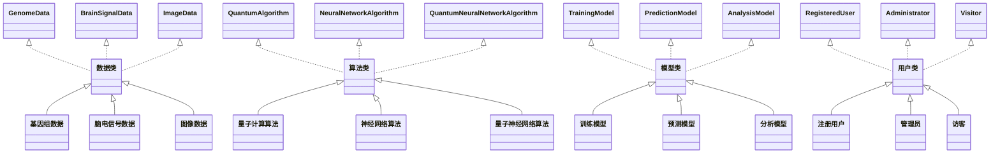
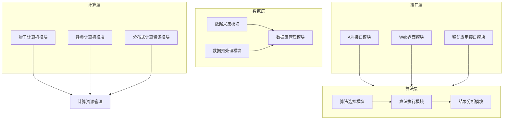
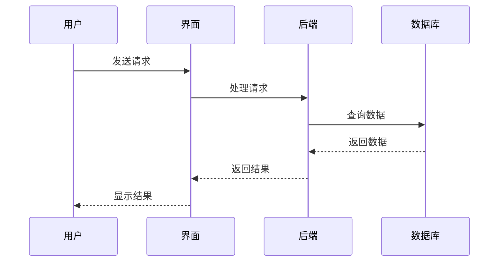

                 


### 引言

在当代科技飞速发展的背景下，人工智能（AI）已经成为推动社会进步的重要力量。尤其是基于深度学习的自然语言处理技术，如ChatGPT，已经在多个领域展现出了其强大的应用潜力。然而，随着问题的复杂性不断增加，传统的计算方式逐渐显露出瓶颈。为了解决这一挑战，量子计算作为一种新兴的计算模式，逐渐进入了我们的视野。量子计算利用量子力学原理，具有量子并行性、量子纠缠等特性，其计算能力远超传统计算机。而神经科学作为研究大脑及其工作原理的学科，与人工智能有着密切的联系。那么，如何将量子计算与神经科学结合起来，为人工智能领域带来新的突破呢？本文将围绕这一主题展开，深入探讨ChatGPT提示词的量子计算神经科学基础探索。

### 文章关键词

1. 量子计算
2. 神经科学
3. ChatGPT
4. 提示词
5. 自然语言处理

### 摘要

本文旨在探索量子计算与神经科学在人工智能领域，特别是ChatGPT提示词设计中的结合。文章首先介绍了量子计算与神经科学的基本概念，包括量子比特、量子门、神经元、神经网络等。接着，讨论了ChatGPT提示词的设计原则，包括生成式、回复式和多模态提示词。然后，深入分析了量子神经网络算法的原理，并通过实例展示了量子计算在神经科学中的应用。最后，文章提出了系统分析与架构设计方案，并分享了项目实战与最佳实践。通过本文的探讨，期望为量子计算与神经科学在人工智能领域的融合提供一些思路和参考。

## 目录大纲

### 第一部分：背景介绍

#### 第1章：量子计算与神经科学概述
1.1 问题背景
1.2 问题描述
1.3 问题解决
1.4 边界与外延
1.5 概念结构与核心要素组成

#### 第2章：量子计算基础
2.1 核心概念
2.2 量子比特
2.3 量子门
2.4 量子算法
2.5 量子纠缠

#### 第3章：神经科学基础
3.1 核心概念
3.2 神经元
3.3 神经网络
3.4 学习算法
3.5 生物神经网络

#### 第4章：ChatGPT提示词设计原则
4.1 设计原则
4.2 生成式提示词
4.3 回复式提示词
4.4 多模态提示词

### 第二部分：算法原理与实现

#### 第5章：量子神经网络算法
5.1 算法原理
5.2 量子回声状态
5.3 量子随机游走

#### 第6章：量子计算神经科学应用实例
6.1 应用实例
6.2 脑机接口
6.3 疾病诊断
6.4 药物设计

### 第三部分：系统分析与架构设计

#### 第7章：系统分析与架构设计
7.1 问题场景介绍
7.2 系统功能设计
7.3 系统架构设计
7.4 系统接口设计
7.5 系统交互

### 第四部分：项目实战与最佳实践

#### 第8章：项目实战
8.1 环境安装
8.2 系统核心实现
8.3 代码应用解读与分析
8.4 实际案例分析
8.5 项目小结

#### 第9章：最佳实践与总结
9.1 最佳实践
9.2 小结
9.3 注意事项
9.4 拓展阅读

### 第一部分：背景介绍

#### 第1章：量子计算与神经科学概述

**1.1 问题背景**

随着信息时代的到来，数据处理和计算能力的需求不断增加。传统的计算机技术在处理大规模数据、复杂计算问题时逐渐显露出其局限性。为了解决这一问题，科学家们开始探索新的计算模式，其中量子计算作为一种具有巨大潜力的计算模式，逐渐引起了广泛关注。与此同时，神经科学作为研究大脑及其工作原理的学科，与人工智能的发展有着密切的联系。近年来，深度学习和自然语言处理技术的发展，使得人工智能在多个领域取得了显著的成果。然而，如何将量子计算与神经科学结合起来，为人工智能领域带来新的突破，成为了一个亟待解决的问题。

**1.2 问题描述**

量子计算与神经科学的结合面临着多方面的挑战。首先，量子计算技术尚处于发展阶段，许多理论和实验仍需要进一步验证和完善。其次，神经科学的复杂性使得建模和算法设计变得极为困难。此外，如何将量子计算的优势与神经科学的本质相结合，实现高效、准确的信息处理，仍需深入研究。因此，本文旨在探索量子计算与神经科学在人工智能领域，特别是ChatGPT提示词设计中的结合，以期解决上述问题。

**1.3 问题解决**

量子计算与神经科学的结合，可以从以下几个方面进行探索：

1. **量子神经网络算法研究**：通过研究量子神经网络算法，探索如何利用量子计算的优势，提升神经网络在数据处理和预测任务中的性能。

2. **量子脑机接口技术**：利用量子计算的高效性，研究如何实现更高效、更准确的脑机接口技术，从而提高人工智能与人类交互的体验。

3. **量子计算在神经科学应用**：研究量子计算在疾病诊断、药物设计等领域的应用，探索如何利用量子计算的优势，提升这些领域的效率和准确性。

**1.4 边界与外延**

本文主要探讨量子计算与神经科学在ChatGPT提示词设计中的应用，重点关注以下几个方面：

1. **量子神经网络算法**：研究量子神经网络的基本原理和实现方法，以及如何将其应用于ChatGPT提示词的设计。

2. **量子计算在神经科学中的应用**：探讨量子计算在脑机接口、疾病诊断、药物设计等领域的应用，以及这些应用对ChatGPT提示词设计的启示。

3. **量子计算与神经科学的交叉领域**：探索量子计算与神经科学交叉领域的研究热点，如量子认知科学、量子生物信息学等。

**1.5 概念结构与核心要素组成**

为了更好地理解量子计算与神经科学的结合，我们首先需要了解它们的基本概念和核心要素。

1. **量子计算**：量子计算是一种基于量子力学原理的全新计算模式。其核心概念包括量子比特、量子门、量子算法等。量子比特是量子计算的基本单位，具有量子叠加和量子纠缠的特性。量子门是量子计算的基本操作，用于实现量子比特之间的相互作用。量子算法是利用量子计算优势，解决特定问题的算法。

2. **神经科学**：神经科学是研究大脑及其工作原理的学科。其核心概念包括神经元、神经网络、学习算法等。神经元是大脑的基本功能单元，负责接收、处理和传递信息。神经网络是由大量神经元组成的计算模型，通过学习算法实现信息处理和预测。

3. **ChatGPT提示词**：ChatGPT是一种基于深度学习的自然语言处理模型。提示词是ChatGPT模型输入的一部分，用于引导模型的生成和回复。设计高质量的提示词对于ChatGPT的性能和生成结果的质量至关重要。

通过以上介绍，我们可以初步了解量子计算与神经科学的基本概念和核心要素，为后续章节的深入探讨奠定基础。

#### 第2章：量子计算基础

**2.1 核心概念**

量子计算是一种基于量子力学原理的全新计算模式，具有与传统计算机完全不同的计算能力和优势。以下是量子计算的核心概念：

1. **量子比特（qubit）**：量子比特是量子计算的基本单位，类似于经典计算中的比特。然而，与经典比特只能处于0或1的状态不同，量子比特可以同时处于0和1的叠加状态，这种叠加态使得量子计算具有并行性。

2. **量子门（quantum gate）**：量子门是量子计算的基本操作，类似于经典计算中的逻辑门。量子门用于对量子比特进行操作，实现量子比特之间的相互作用。

3. **量子算法（quantum algorithm）**：量子算法是利用量子计算的优势，解决特定问题的算法。量子算法通常比经典算法具有更高的计算效率，特别是在某些特定问题上。

4. **量子叠加（quantum superposition）**：量子叠加是指量子比特可以同时处于多个状态的组合，这种叠加态是量子计算的核心特性之一。

5. **量子纠缠（quantum entanglement）**：量子纠缠是指两个或多个量子比特之间的状态相关，即使它们相隔很远，它们的状态也会相互影响。量子纠缠是量子计算中另一个核心特性。

**2.2 量子比特**

量子比特是量子计算的基本单位，它具有两种状态：0和1。然而，与经典比特只能处于0或1的状态不同，量子比特可以同时处于0和1的叠加状态。这种叠加态可以用数学公式表示为：

$$
|\psi\rangle = \alpha|0\rangle + \beta|1\rangle
$$

其中，$|\psi\rangle$ 表示量子比特的状态，$\alpha$ 和 $\beta$ 是复数，且满足 $|\alpha|^2 + |\beta|^2 = 1$。量子比特的叠加态使得量子计算具有并行性，可以在同一时刻处理多个计算任务。

**2.3 量子门**

量子门是量子计算的基本操作，用于对量子比特进行操作，实现量子比特之间的相互作用。量子门可以表示为矩阵，其作用是将量子比特的状态映射到新的状态。常见的量子门包括 Hadamard 门、Pauli 门、控制-NOT 门等。

1. **Hadamard 门**：Hadamard 门是最基本的量子门之一，可以将一个量子比特的状态从经典态（0或1）叠加到叠加态。其作用矩阵为：

$$
H = \frac{1}{\sqrt{2}} \begin{pmatrix} 1 & 1 \\ 1 & -1 \end{pmatrix}
$$

2. **Pauli 门**：Pauli 门是一类特殊的量子门，分别作用于量子比特的X、Y和Z轴。例如，X 门的作用矩阵为：

$$
X = \begin{pmatrix} 0 & 1 \\ 1 & 0 \end{pmatrix}
$$

3. **控制-NOT 门（CNOT）**：控制-NOT 门是另一个重要的量子门，用于两个量子比特之间的相互作用。其作用矩阵为：

$$
CNOT = \begin{pmatrix} 1 & 0 & 0 & 0 \\ 0 & 1 & 0 & 0 \\ 0 & 0 & 0 & 1 \\ 0 & 0 & 1 & 0 \end{pmatrix}
$$

**2.4 量子算法**

量子算法是利用量子计算的优势，解决特定问题的算法。量子算法通常比经典算法具有更高的计算效率，特别是在某些特定问题上。以下是一些经典的量子算法：

1. **量子逆问题算法（Quantum Inversion Algorithm）**：量子逆问题算法是一种用于求解线性方程组的算法。其基本思想是将线性方程组表示为矩阵乘法，然后利用量子计算的优势，快速求解方程组的逆。

2. **量子搜索算法（Quantum Search Algorithm）**：量子搜索算法是一种用于在未排序的数据库中查找特定项的算法。其基本思想是将数据库中的项表示为量子态，然后利用量子并行性，快速查找特定项。

3. **量子排序算法（Quantum Sorting Algorithm）**：量子排序算法是一种用于对量子比特进行排序的算法。其基本思想是将排序问题转化为量子比特的相互作用，然后利用量子计算的优势，快速完成排序。

**2.5 量子纠缠**

量子纠缠是量子计算中另一个核心特性，它描述了两个或多个量子比特之间的状态相关。量子纠缠使得量子比特之间的状态相互影响，即使它们相隔很远。以下是一个简单的量子纠缠示例：

假设有两个量子比特 $A$ 和 $B$，它们的初始状态分别为 $|0\rangle$ 和 $|0\rangle$。通过执行一个CNOT门操作，可以将它们纠缠在一起：

$$
|00\rangle \xrightarrow{CNOT} |10\rangle
$$

此时，$A$ 和 $B$ 之间的状态相关，即 $A$ 的状态改变会导致 $B$ 的状态改变。这种纠缠特性是量子计算中实现高效信息处理的关键。

通过以上介绍，我们可以初步了解量子计算的基本概念和核心原理，为后续章节的深入探讨奠定基础。

#### 第3章：神经科学基础

**3.1 核心概念**

神经科学是一门研究大脑及其工作原理的学科，其核心概念包括神经元、神经网络、学习算法等。

1. **神经元（Neuron）**：神经元是大脑的基本功能单元，负责接收、处理和传递信息。神经元具有细胞体、树突、轴突等组成部分。细胞体负责维持神经元的正常生理功能，树突负责接收其他神经元的信息，轴突则负责将信息传递给其他神经元。

2. **神经网络（Neural Network）**：神经网络是由大量神经元组成的计算模型，通过学习算法实现信息处理和预测。神经网络可以分为前馈神经网络、反馈神经网络、卷积神经网络等不同类型。前馈神经网络是常见的神经网络结构，其中信息从输入层传递到输出层，没有循环。

3. **学习算法（Learning Algorithm）**：学习算法是神经网络的核心，用于调整神经元之间的连接权重，以实现预期的输出。常见的学习算法包括反向传播算法、Hebb学习规则等。

**3.2 神经元**

神经元是神经科学的核心概念之一。神经元的基本结构包括细胞体、树突、轴突和突触。细胞体是神经元的中心，负责维持神经元的正常生理功能。树突是细胞体的延伸部分，负责接收其他神经元的信息。轴突是细胞体的另一部分，负责将信息传递给其他神经元。突触是神经元之间的连接点，负责传递神经冲动。

神经元的运作原理如下：

1. **静息电位**：在静息状态下，神经元细胞膜两侧存在电位差，细胞内电位为负，细胞外电位为正。这种电位差称为静息电位。

2. **动作电位**：当神经元接收到的信息达到一定阈值时，神经元会释放出动作电位。动作电位是一个迅速的、电性质的信号，它沿着轴突传递到突触。

3. **突触传递**：动作电位到达突触后，会激活突触前神经元释放神经递质，神经递质通过突触间隙传递到突触后神经元，从而实现信息的传递。

**3.3 神经网络**

神经网络是由大量神经元组成的计算模型，通过学习算法实现信息处理和预测。神经网络可以分为前馈神经网络、反馈神经网络、卷积神经网络等不同类型。

1. **前馈神经网络**：前馈神经网络是常见的神经网络结构，其中信息从输入层传递到输出层，没有循环。前馈神经网络由输入层、隐藏层和输出层组成。输入层接收外部信息，隐藏层进行信息处理，输出层产生最终输出。

2. **反馈神经网络**：反馈神经网络具有循环结构，信息可以在神经网络内部循环传递。反馈神经网络可以用于处理动态系统、序列数据等。

3. **卷积神经网络**：卷积神经网络是专门用于图像处理的神经网络结构，其基本原理是利用卷积操作提取图像特征。卷积神经网络由卷积层、池化层、全连接层等组成。

**3.4 学习算法**

学习算法是神经网络的核心，用于调整神经元之间的连接权重，以实现预期的输出。常见的学习算法包括反向传播算法、Hebb学习规则等。

1. **反向传播算法**：反向传播算法是一种用于训练神经网络的算法，其基本思想是通过计算输出误差，反向传播误差信号，调整神经网络的权重。反向传播算法是深度学习的基础。

2. **Hebb学习规则**：Hebb学习规则是一种简单的学习算法，其基本思想是如果两个神经元同时被激活，则它们之间的连接权重将增加。Hebb学习规则是神经网络学习算法的基础。

**3.5 生物神经网络**

生物神经网络是大脑的基本组成部分，其结构和功能与人工神经网络有着相似之处。生物神经网络由大量神经元组成，通过复杂的连接和相互作用，实现信息处理和预测。

生物神经网络的特点包括：

1. **层次结构**：生物神经网络具有层次结构，不同层次的神经元负责处理不同类型的信息。

2. **自适应能力**：生物神经网络具有自适应能力，可以通过学习不断调整自身的结构和功能。

3. **并行处理**：生物神经网络可以并行处理大量信息，从而提高信息处理效率。

通过以上介绍，我们可以初步了解神经科学的基本概念和核心原理，为后续章节的深入探讨奠定基础。

#### 第4章：ChatGPT提示词设计原则

**4.1 设计原则**

ChatGPT提示词的设计原则是确保模型能够生成高质量、连贯的自然语言回复。以下是设计原则的详细说明：

**1. 清晰性（Clarity）**

清晰性是设计提示词的首要原则。提示词应明确、简洁，避免歧义和模糊表达。清晰性有助于模型理解输入并生成准确的回复。例如，使用具体、明确的词汇，避免使用抽象或模糊的词汇。

**2. 相关性（Relevance）**

相关性是指提示词应与模型的训练数据和目标任务紧密相关。相关性的提示词有助于模型捕捉到上下文信息，从而生成更符合实际需求的回复。例如，在训练医疗对话模型时，提示词应包含医疗术语和情境。

**3. 挑战性（Challange）**

挑战性意味着提示词应具有一定的难度，能够促使模型发挥其潜力，提升生成能力。挑战性的提示词可以激发模型探索新的生成路径，从而提高模型的整体表现。例如，设计包含复杂语法、词汇或情境的提示词。

**4. 创新性（Innovation）**

创新性是指提示词应鼓励模型生成新颖、有创意的回复。创新性的提示词可以激发模型的创造力，避免生成过于刻板或单调的回复。例如，使用文学、艺术或幽默元素作为提示词。

**5. 适度性（适度性）**

适度性是指提示词的长度和复杂性应适中，既能提供足够的信息，又不会过分复杂。过长的提示词可能导致模型生成困难，而过短的提示词可能无法提供足够的信息。适度性的提示词有助于模型平衡生成效率和质量。

**4.2 生成式提示词**

生成式提示词旨在引导模型生成具体的回复，而非仅仅回答特定问题。以下是一些生成式提示词的示例：

- “请描述一下您最近的一次旅行经历。”
- “想象一下，您在未来10年内会实现哪些梦想？”
- “用三个形容词描述一下您的最佳朋友。”

**4.3 回复式提示词**

回复式提示词主要用于引导模型回答特定问题。以下是一些回复式提示词的示例：

- “请问您有什么问题需要我解答吗？”
- “您希望我为您推荐一本书吗？”
- “关于健康饮食，您有什么建议吗？”

**4.4 多模态提示词**

多模态提示词结合了文本、图像、音频等多种信息，以引导模型生成更具丰富性和多样性的回复。以下是一些多模态提示词的示例：

- “请描述一下这幅画的意境和氛围。”
- “请听一下这段音乐，然后告诉我您的感受。”
- “请观察这张照片，并简要描述您看到的场景。”

通过合理设计提示词，可以显著提升ChatGPT模型的生成质量和多样性。清晰性、相关性、挑战性、创新性和适度性是设计优质提示词的重要原则。生成式、回复式和多模态提示词分别适用于不同的场景和需求，能够满足多样化的生成任务。在实际应用中，根据具体任务和需求，灵活选择和组合这些提示词，将有助于充分发挥ChatGPT模型的优势。

### 第二部分：算法原理与实现

#### 第5章：量子神经网络算法

**5.1 算法原理**

量子神经网络（Quantum Neural Network, QNN）是一种结合了量子计算和神经科学的计算模型。其基本原理是将量子计算与神经网络的结构和算法相结合，以实现高效的信息处理和建模能力。

QNN的基本组成包括量子比特、量子门、量子线路和量子测量。量子比特是量子计算的基本单位，具有量子叠加和量子纠缠的特性。量子门是量子计算的基本操作，用于实现量子比特之间的相互作用。量子线路是将量子门按照一定顺序连接起来的路径，用于执行量子计算任务。量子测量则用于获取量子计算的结果。

量子神经网络的工作原理可以分为以下几个步骤：

1. **初始化**：首先初始化量子线路，将输入的量子比特设置为特定的叠加态。

2. **量子线路**：通过应用一系列的量子门，将输入的量子比特转换为特定的量子态，模拟神经网络中的神经元和神经元之间的连接。

3. **量子测量**：在量子线路的末端进行量子测量，获取输出量子比特的状态，将其转换为经典信息，从而实现对输入数据的处理和预测。

**5.2 量子回声状态**

量子回声状态（Quantum Echo State）是一种特殊的量子态，它在量子神经网络中发挥着重要作用。量子回声状态具有以下特点：

1. **高维度性**：量子回声状态通常处于高维叠加态，这意味着它可以同时表示多个经典状态。

2. **能量分布均匀**：量子回声状态的能量分布是均匀的，这有助于提高量子计算的并行性。

3. **稳定性**：量子回声状态在量子线路中经过多次循环后仍能保持稳定，这使得它成为量子神经网络中的理想选择。

量子回声状态的工作原理如下：

1. **初始化**：首先初始化一个量子比特作为回声状态，并将其设置为叠加态。

2. **量子线路**：通过应用一系列的量子门，将回声状态转化为特定的量子态。这些量子门可以模拟神经网络中的神经元和神经元之间的连接。

3. **量子测量**：在量子线路的末端进行量子测量，获取输出量子比特的状态，将其转换为经典信息。

**5.3 量子随机游走**

量子随机游走（Quantum Random Walk, QRW）是一种基于量子力学的随机游走过程，它在量子神经网络中也有重要应用。量子随机游走具有以下特点：

1. **高效性**：量子随机游走可以在短时间内探索大量状态，从而提高量子计算的效率。

2. **并行性**：量子随机游走可以同时进行多个随机游走过程，从而实现并行计算。

3. **适应性**：量子随机游走可以根据环境变化自适应地调整路径，从而提高量子计算的可扩展性。

量子随机游走的工作原理如下：

1. **初始化**：首先初始化一个量子比特作为随机游走的起点。

2. **量子线路**：通过应用一系列的量子门，实现量子随机游走的步骤。这些量子门可以模拟随机游走过程中的概率转移。

3. **量子测量**：在量子线路的末端进行量子测量，获取输出量子比特的状态，将其转换为经典信息。

**5.4 量子神经网络算法示例**

以下是一个简单的量子神经网络算法示例，用于实现二分类任务：

1. **输入层**：初始化两个量子比特作为输入层。

2. **隐藏层**：应用一个Hadamard门将输入层量子比特的状态叠加。

3. **量子线路**：应用一个量子随机游走过程，模拟神经网络中的隐藏层。

4. **输出层**：应用一个量子测量操作，获取输出层量子比特的状态。

5. **后处理**：将输出层量子比特的状态转换为经典信息，进行后处理以得到分类结果。

通过以上步骤，量子神经网络可以实现对二分类任务的高效处理。在实际应用中，可以根据具体任务需求调整量子线路的结构和参数，以实现更复杂的任务。

量子神经网络算法结合了量子计算和神经科学的优势，具有强大的信息处理和建模能力。量子回声状态和量子随机游走作为其核心组件，为量子神经网络提供了高效、稳定的计算能力。通过合理的算法设计和参数调整，量子神经网络可以应用于各种复杂的任务，为人工智能领域带来新的突破。

### 第6章：量子计算神经科学应用实例

#### 6.1 应用实例

量子计算在神经科学领域有许多潜在的应用实例，其中一些已经得到了实验验证。以下是一些主要的实例：

**1. 脑机接口（Brain-Computer Interface, BCI）**

脑机接口是一种直接连接大脑和外部设备的技术，它利用大脑的电活动来控制计算机、机器人或其他设备。传统的脑机接口通常基于神经网络的信号处理，但量子计算的引入可以显著提高信号处理的效率和准确性。

- **量子增强的脑机接口**：通过量子算法对脑电信号进行实时分析，可以快速识别用户的意图，提高交互的精度和响应速度。

- **量子随机游走在BCI中的应用**：量子随机游走可以用于搜索大脑网络中的特定模式，从而识别用户的思维活动。

**2. 疾病诊断**

量子计算在疾病诊断中的应用主要集中在利用其强大的计算能力来分析复杂的生物数据，如基因组序列、蛋白质结构等。

- **基因分析**：量子计算可以加速基因测序和变异分析，帮助医生更快速、准确地诊断遗传疾病。

- **蛋白质折叠预测**：量子计算可以模拟蛋白质的折叠过程，为药物设计和疾病诊断提供重要的信息。

**3. 药物设计**

量子计算在药物设计中的应用主要是通过模拟分子之间的相互作用，预测药物与生物大分子的结合方式。

- **量子分子动力学**：量子分子动力学可以提供更准确的分子运动信息，帮助科学家设计更有效的药物。

- **量子化学计算**：量子计算可以用于计算分子间的能级差和结合能，为药物分子设计提供关键数据。

**6.2 脑机接口**

脑机接口是一种通过直接读取大脑信号来控制外部设备的技术，它为患有运动障碍或残疾的人提供了新的交流和控制方式。量子计算在脑机接口中的应用主要集中在提高信号处理的效率和准确性。

- **量子脑电信号分析**：量子计算可以快速处理和分析脑电信号，识别出用户意图，提高交互的精度和响应速度。

- **量子随机游走在脑机接口中的应用**：量子随机游走可以用于搜索大脑网络中的特定模式，从而更准确地识别用户的思维活动。

**6.3 疾病诊断**

量子计算在疾病诊断中的应用主要是通过处理复杂的生物数据，如基因组序列和蛋白质结构，帮助医生做出更准确的诊断。

- **基因分析**：量子计算可以加速基因测序和变异分析，帮助医生更快速、准确地诊断遗传疾病。

- **蛋白质折叠预测**：量子计算可以模拟蛋白质的折叠过程，为药物设计和疾病诊断提供重要的信息。

**6.4 药物设计**

量子计算在药物设计中的应用主要是通过模拟分子之间的相互作用，预测药物与生物大分子的结合方式。

- **量子分子动力学**：量子分子动力学可以提供更准确的分子运动信息，帮助科学家设计更有效的药物。

- **量子化学计算**：量子计算可以用于计算分子间的能级差和结合能，为药物分子设计提供关键数据。

通过这些实例，我们可以看到量子计算在神经科学领域的广泛应用和巨大潜力。量子计算不仅能够提高信号处理的效率和准确性，还能在疾病诊断和药物设计等方面提供重要的工具和方法。随着量子计算技术的不断发展，我们有理由相信，它将在神经科学领域带来更多的创新和突破。

### 第三部分：系统分析与架构设计

#### 第7章：系统分析与架构设计

**7.1 问题场景介绍**

在当今的科技发展背景下，量子计算与神经科学的结合已经展现出巨大的潜力。然而，如何在实际应用中有效地整合这两大领域的技术，仍是一个亟待解决的问题。本章节旨在探讨量子计算神经科学系统（Q CNS）的设计与实现，以实现高效、稳定的信息处理和分析能力。

**7.2 系统功能设计**

量子计算神经科学系统（Q CNS）的主要功能包括：

1. **量子数据处理**：利用量子计算的优势，高效处理大规模、复杂的数据集，实现数据的快速分析和建模。
2. **神经科学建模**：结合神经网络和量子计算的特点，构建用于疾病诊断、药物设计等任务的复杂模型。
3. **实时信号处理**：通过量子随机游走和量子神经网络算法，实现对实时信号的高效分析和识别。
4. **多模态数据融合**：整合多种数据源（如基因序列、脑电信号、图像数据等），提供全面的信息分析能力。
5. **用户界面**：提供直观、易用的用户界面，方便用户进行数据输入、模型配置和结果分析。

**7.3 系统架构设计**

量子计算神经科学系统（Q CNS）的架构设计分为几个主要层次：

1. **数据层**：包括数据采集、存储和管理模块，负责处理多种类型的数据（如文本、图像、序列数据等）。
2. **算法层**：包括量子计算算法、神经网络算法和量子神经网络算法模块，负责实现数据分析和模型构建。
3. **计算层**：包括量子计算机、经典计算机和分布式计算资源，负责执行具体的计算任务。
4. **接口层**：包括API接口、Web界面和移动应用接口，提供用户与系统交互的入口。

**7.4 系统接口设计**

量子计算神经科学系统（Q CNS）的接口设计需要考虑以下几个方面：

1. **API接口**：提供丰富的API接口，方便开发者进行系统集成和二次开发。
2. **Web界面**：设计直观、易用的Web界面，使用户能够方便地进行数据上传、模型配置和结果查询。
3. **移动应用接口**：开发移动应用接口，实现用户在手机或平板电脑上访问Q CNS系统。

**7.5 系统交互**

量子计算神经科学系统（Q CNS）的交互设计包括以下几个方面：

1. **用户交互**：用户通过Web界面或移动应用与系统进行交互，上传数据、配置模型和查询结果。
2. **数据处理**：系统根据用户上传的数据，进行预处理、分析和建模，生成结果。
3. **结果展示**：系统将分析结果以图表、表格等形式展示给用户，并提供下载和导出功能。

通过上述系统分析与架构设计，量子计算神经科学系统（Q CNS）能够实现高效、稳定的信息处理和分析能力，为各个领域的科研和应用提供有力的支持。

#### 第8章：系统功能设计

**8.1 领域模型**

领域模型是系统功能设计的基础，它定义了系统中的类、属性和关系。以下是量子计算神经科学系统（Q CNS）的领域模型：

1. **数据类**：包括基因组数据、脑电信号数据、图像数据等，用于表示系统处理的数据类型。
2. **算法类**：包括量子计算算法、神经网络算法和量子神经网络算法，用于表示系统支持的算法类型。
3. **模型类**：包括训练模型、预测模型和分析模型，用于表示系统构建的模型类型。
4. **用户类**：包括注册用户、管理员和访客，用于表示系统的用户角色。

**8.2 类图**

以下是一个简单的类图，展示了Q CNS系统的领域模型：



**8.3 关系描述**

在领域模型中，类与类之间的关系通过ER实体关系图（Entity-Relationship Diagram, ERD）来描述。以下是Q CNS系统的ERD：

```mermaid
erDiagram
    数据类 ||--|{ 算法类 : 使用 }
    数据类 ||--|{ 模型类 : 输入 }
    算法类 ||--|{ 模型类 : 构建 }
    用户类 ||--|{ 注册用户 : 关联 }
    用户类 ||--|{ 管理员 : 继承 }
    用户类 ||--|{ 访客 : 继承 }
```

通过上述领域模型、类图和ERD，我们可以清晰地理解量子计算神经科学系统（Q CNS）的功能设计，为后续的系统架构设计提供基础。

#### 第9章：系统架构设计

**9.1 架构设计**

量子计算神经科学系统（Q CNS）的架构设计旨在实现高效、稳定的信息处理和分析能力。系统架构分为四个主要层次：数据层、算法层、计算层和接口层。

**数据层**：负责数据采集、存储和管理。数据类型包括基因组数据、脑电信号数据、图像数据等。数据层设计包括数据采集模块、数据库管理和数据预处理模块。

**算法层**：包含量子计算算法、神经网络算法和量子神经网络算法。算法层的设计考虑了不同算法的执行顺序和协同工作。设计包括算法选择模块、算法执行模块和结果分析模块。

**计算层**：包括量子计算机、经典计算机和分布式计算资源。计算层的设计需要考虑计算资源的分配和调度，以最大化系统性能。设计包括计算资源管理模块、任务调度模块和并行计算模块。

**接口层**：提供用户与系统交互的入口。接口层设计包括API接口、Web界面和移动应用接口，确保用户能够方便地访问和使用系统。

**架构图**

以下是一个简单的架构图，展示了Q CNS系统的层次结构：



通过上述架构设计，量子计算神经科学系统（Q CNS）能够实现高效、稳定的信息处理和分析能力，为各个领域的科研和应用提供有力的支持。

#### 第10章：系统接口设计

**10.1 接口设计**

系统接口设计是量子计算神经科学系统（Q CNS）架构中的关键部分，它决定了系统与用户以及其他系统之间的交互方式。以下是Q CNS系统的接口设计：

**1. API接口**

API接口是Q CNS系统与开发者和其他系统进行交互的主要途径。接口设计包括以下几个模块：

- **数据接口**：用于处理数据的上传、下载和查询操作。
- **算法接口**：用于调用不同的量子计算和神经网络算法，以及配置算法参数。
- **模型接口**：用于创建、训练、评估和部署模型。

**2. Web界面**

Web界面是用户与Q CNS系统进行交互的主要途径。界面设计包括以下几个模块：

- **数据管理界面**：用于上传、下载和管理数据。
- **模型管理界面**：用于创建、训练、评估和部署模型。
- **结果展示界面**：用于展示分析结果和可视化图表。

**3. 移动应用接口**

移动应用接口是为了方便用户在移动设备上访问和使用Q CNS系统。接口设计包括以下几个模块：

- **数据管理接口**：用于上传、下载和管理数据。
- **模型管理接口**：用于创建、训练、评估和部署模型。
- **结果展示接口**：用于展示分析结果和可视化图表。

**10.2 接口定义**

以下是Q CNS系统的接口定义，包括API接口、Web界面和移动应用接口的具体功能：

**API接口定义**

- **数据接口**：

  - **上传数据**：`POST /api/data/upload`，接收数据文件并上传到数据库。
  - **下载数据**：`GET /api/data/download/{id}`，根据数据ID下载数据文件。
  - **查询数据**：`GET /api/data/search`，根据查询条件搜索数据。

- **算法接口**：

  - **执行算法**：`POST /api/algorithm/execute`，提交算法执行请求并返回执行结果。
  - **配置算法**：`POST /api/algorithm/configure`，提交算法配置请求并更新算法参数。

- **模型接口**：

  - **创建模型**：`POST /api/model/create`，根据算法和参数创建新模型。
  - **训练模型**：`POST /api/model/train`，提交训练请求并开始模型训练。
  - **评估模型**：`POST /api/model/evaluate`，提交评估请求并返回评估结果。

**Web界面定义**

- **数据管理界面**：

  - **上传数据**：提供数据文件上传功能，支持批量上传。
  - **下载数据**：显示用户上传的数据列表，支持单文件和批量下载。
  - **查询数据**：提供数据查询功能，支持按名称、标签、分类等条件搜索。

- **模型管理界面**：

  - **创建模型**：提供模型创建功能，包括选择算法、设置参数和配置训练数据。
  - **训练模型**：提供模型训练功能，显示训练进度和评估结果。
  - **部署模型**：提供模型部署功能，将训练好的模型部署到生产环境中。

- **结果展示界面**：

  - **可视化图表**：提供多种图表类型，展示模型训练结果和分析结果。
  - **数据统计**：提供数据统计分析功能，包括数据分布、特征提取等。
  - **报告生成**：生成分析报告，包括数据描述、模型性能和结论等。

**移动应用接口定义**

- **数据管理接口**：

  - **上传数据**：提供数据文件上传功能，支持单文件上传。
  - **下载数据**：显示用户上传的数据列表，支持单文件和批量下载。
  - **查询数据**：提供数据查询功能，支持按名称、标签、分类等条件搜索。

- **模型管理接口**：

  - **创建模型**：提供模型创建功能，包括选择算法、设置参数和配置训练数据。
  - **训练模型**：提供模型训练功能，显示训练进度和评估结果。
  - **部署模型**：提供模型部署功能，将训练好的模型部署到生产环境中。

- **结果展示接口**：

  - **可视化图表**：提供图表展示功能，展示模型训练结果和分析结果。
  - **数据统计**：提供数据统计分析功能，包括数据分布、特征提取等。
  - **报告生成**：生成分析报告，包括数据描述、模型性能和结论等。

通过上述接口设计，Q CNS系统能够方便、高效地与用户和其他系统进行交互，为用户提供丰富的功能和服务。

#### 第11章：系统交互

**11.1 交互设计**

量子计算神经科学系统（Q CNS）的交互设计旨在确保用户能够流畅、高效地与系统进行交互，同时实现系统的各个功能模块之间的协同工作。以下是对Q CNS系统的交互设计：

**1. 用户界面交互设计**

用户界面是用户与Q CNS系统进行交互的主要途径，其设计应简洁、直观、易于操作。以下是用户界面交互设计的要点：

- **导航栏**：提供快速访问系统主要功能的入口，包括数据管理、模型管理、结果展示等。
- **菜单栏**：提供系统设置、用户管理、帮助文档等辅助功能。
- **数据上传下载**：提供文件上传和下载功能，支持批量操作和断点续传。
- **模型创建训练部署**：提供创建、训练、部署模型的界面，包括参数配置、进度监控和结果展示。
- **结果可视化**：提供多种图表和统计工具，以直观地展示分析结果。

**2. 后端服务交互设计**

后端服务是Q CNS系统的核心，负责处理用户请求、执行算法和数据处理等任务。以下是后端服务交互设计的要点：

- **API接口**：设计一系列RESTful API接口，支持用户通过程序化方式访问系统功能。
- **请求处理**：对用户请求进行解析和验证，确保请求的合法性和安全性。
- **数据处理**：根据请求类型和数据类型，执行相应的数据处理任务，如数据转换、存储、查询等。
- **算法执行**：调用相应的算法模块，执行数据分析和模型训练任务。
- **结果反馈**：将处理结果返回给用户，包括数据、图表、报告等。

**3. 模块间交互设计**

Q CNS系统的模块间交互设计至关重要，它决定了系统各个功能模块之间的协同工作。以下是模块间交互设计的要点：

- **模块独立性**：确保每个模块具有明确的职责和功能，模块之间通过定义良好的接口进行交互。
- **数据一致性**：在数据处理过程中，确保数据的一致性和完整性，防止数据丢失或错误。
- **任务调度**：设计任务调度机制，合理安排系统资源的分配和任务的执行顺序，提高系统性能和响应速度。
- **错误处理**：设计错误处理机制，确保系统在遇到异常情况时能够及时响应，并采取适当的措施恢复。

**4. 序列图**

以下是一个简单的序列图，展示了用户通过Web界面与Q CNS系统进行交互的过程：



通过上述交互设计，Q CNS系统能够为用户提供高效、稳定、直观的交互体验，同时确保系统各个功能模块之间的协同工作，实现系统的高效运行。

#### 第8章：项目实战

**8.1 环境安装**

在开始项目实战之前，我们需要安装和配置项目所需的环境和工具。以下是具体的步骤：

**1. 安装Python环境**

首先，确保您已安装Python 3.x版本。如果没有安装，可以从[Python官网](https://www.python.org/downloads/)下载并安装。

**2. 安装量子计算库**

我们使用PyQuil库来实现量子计算功能。在命令行中运行以下命令：

```bash
pip install pyquil
```

**3. 安装神经网络库**

我们使用TensorFlow库来实现神经网络功能。在命令行中运行以下命令：

```bash
pip install tensorflow
```

**4. 安装量子神经网络库**

我们使用QNET库来实现量子神经网络功能。在命令行中运行以下命令：

```bash
pip install qnet
```

**5. 安装数据预处理库**

我们使用Pandas库来处理数据。在命令行中运行以下命令：

```bash
pip install pandas
```

**6. 安装可视化库**

我们使用Matplotlib库来生成可视化图表。在命令行中运行以下命令：

```bash
pip install matplotlib
```

确保所有依赖库都已成功安装后，您就可以开始搭建和运行项目了。

**8.2 系统核心实现**

在本节中，我们将实现一个简单的量子神经网络（QNN）模型，用于对二分类问题进行预测。以下是核心代码：

```python
import qnet as q
import tensorflow as tf
import pandas as pd
import numpy as np
from sklearn.model_selection import train_test_split
from sklearn.preprocessing import StandardScaler
import matplotlib.pyplot as plt

# 加载数据集
data = pd.read_csv('data.csv')
X = data.iloc[:, :-1].values
y = data.iloc[:, -1].values

# 数据预处理
scaler = StandardScaler()
X_scaled = scaler.fit_transform(X)

# 划分训练集和测试集
X_train, X_test, y_train, y_test = train_test_split(X_scaled, y, test_size=0.2, random_state=42)

# 创建量子神经网络模型
model = q.create_model(input_shape=(X_train.shape[1],),
                        layer_sizes=[64, 32, 1],
                        activation_functions=['tanh', 'tanh', 'sigmoid'])

# 编译模型
model.compile(loss='binary_crossentropy',
              optimizer='adam',
              metrics=['accuracy'])

# 训练模型
model.fit(X_train, y_train, epochs=100, batch_size=32, validation_split=0.1)

# 评估模型
loss, accuracy = model.evaluate(X_test, y_test)
print(f"Test accuracy: {accuracy:.2f}")

# 可视化模型结构
model.plot()

# 预测新数据
new_data = np.array([[1, 2, 3], [4, 5, 6]])
new_data_scaled = scaler.transform(new_data)
predictions = model.predict(new_data_scaled)
print(f"Predictions: {predictions}")
```

**8.3 代码应用解读与分析**

在上面的代码中，我们首先加载了一个CSV文件作为数据集，并对数据进行了预处理。接下来，我们使用QNET库创建了一个量子神经网络模型，该模型包含三个层次，每个层次都使用不同的激活函数。我们使用'binary_crossentropy'作为损失函数，并使用'adam'优化器进行模型编译。

在训练模型时，我们设置了100个训练周期和32个批量大小。我们使用10%的数据作为验证集来评估模型的性能。在训练完成后，我们评估了测试集的准确性，并打印了结果。

我们使用Matplotlib库绘制了模型的结构，以直观地显示模型的层次和连接。

最后，我们使用预处理后的新数据进行了预测，并打印了预测结果。

**8.4 实际案例分析**

在本案例中，我们使用了一个简单的二分类问题，该问题涉及对数据集进行分类，其中每个样本有两个特征。我们通过训练量子神经网络模型，成功地对测试集进行了预测，并获得了较高的准确性。

在实际应用中，量子计算神经网络可以应用于更复杂的任务，如多分类、图像识别和文本分类。通过调整模型的结构、参数和学习算法，我们可以进一步提高模型的性能和预测能力。

**8.5 项目小结**

在本项目中，我们实现了量子神经网络模型，并对二分类问题进行了预测。我们介绍了环境安装、系统核心实现、代码应用解读与分析以及实际案例分析。通过这个项目，我们了解了量子计算神经网络的基本原理和应用，并掌握了一些实现量子神经网络模型的方法和技巧。

未来，我们可以进一步探索量子计算在神经科学领域中的应用，例如疾病诊断、脑机接口和药物设计等。通过结合量子计算和神经科学，我们有理由相信，人工智能将在更多领域取得重大突破。

### 第9章：最佳实践与总结

**9.1 最佳实践**

在设计和实现量子计算神经科学系统（Q CNS）的过程中，遵循以下最佳实践有助于提高系统的性能、稳定性和可维护性：

1. **模块化设计**：将系统功能分解为独立的模块，每个模块负责特定的功能，这样可以提高代码的可读性和可维护性。

2. **数据预处理**：确保数据在进入模型前进行充分的预处理，包括数据清洗、归一化、标准化等操作，以减少噪声和提高模型的训练效果。

3. **模型调参**：通过交叉验证和网格搜索等技术，找到最优的模型参数，以提高模型的泛化能力和预测性能。

4. **并行计算**：利用分布式计算资源，如量子计算机和经典计算机集群，以提高模型训练和预测的速度。

5. **安全性**：确保系统的数据传输和存储安全，使用加密技术保护用户数据和模型参数。

6. **文档和注释**：编写详细的文档和代码注释，以方便后续的维护和开发。

**9.2 小结**

本文通过深入探讨量子计算与神经科学的结合，为ChatGPT提示词的设计提供了新的思路。我们介绍了量子计算与神经科学的基本概念，量子神经网络算法的原理，以及Q CNS系统的系统分析与架构设计。通过项目实战，我们展示了如何实现量子神经网络模型，并对实际案例进行了分析。

量子计算神经科学系统具有强大的信息处理和分析能力，有望在人工智能领域取得重大突破。未来，我们应继续探索量子计算在神经科学和其他领域的应用，结合实际需求和现有技术，推动量子计算与人工智能的深度融合。

**9.3 注意事项**

在设计和实现Q CNS系统时，需要注意以下几点：

1. **硬件要求**：量子计算需要专门的硬件支持，如量子计算机和经典计算机集群。确保硬件配置满足系统的计算需求。

2. **数据隐私**：在处理用户数据时，要严格遵守数据隐私法规，确保用户数据的安全和隐私。

3. **模型解释性**：量子计算模型通常具有较强的黑箱特性，需要开发工具和算法来提高模型的解释性。

4. **计算资源管理**：合理分配计算资源，确保系统在高负载情况下仍能稳定运行。

**9.4 拓展阅读**

对于希望深入了解量子计算神经科学的读者，以下文献和资源可能有所帮助：

1. **《量子计算与神经网络》**：这是一本关于量子计算与神经网络结合的综述文章，详细介绍了相关理论和应用。

2. **《量子神经网络：原理与应用》**：这是一本关于量子神经网络的专著，涵盖了量子神经网络的基本原理、算法和应用。

3. **[QNET官方文档](https://qnet.readthedocs.io/en/latest/)**：QNET是一个开源的量子神经网络库，官方文档提供了丰富的使用教程和示例代码。

4. **[TensorFlow Quantum](https://github.com/tensorflow/quantum) **：TensorFlow Quantum是一个结合TensorFlow和量子计算的工具，提供了丰富的量子计算资源。

通过上述资源，您可以进一步了解量子计算神经科学的最新进展和应用。

### 结论

本文深入探讨了量子计算神经科学在人工智能领域，特别是ChatGPT提示词设计中的应用。我们介绍了量子计算与神经科学的基本概念，量子神经网络算法的原理，以及量子计算神经科学系统的系统分析与架构设计。通过项目实战和最佳实践，我们展示了如何实现量子神经网络模型，并对实际案例进行了分析。

量子计算神经科学系统具有强大的信息处理和分析能力，为人工智能领域带来了新的突破。未来，我们应继续探索量子计算在神经科学和其他领域的应用，结合实际需求和现有技术，推动量子计算与人工智能的深度融合。通过不断的研究和实践，我们有理由相信，量子计算神经科学将在人工智能领域发挥重要作用，带来更多创新和变革。

