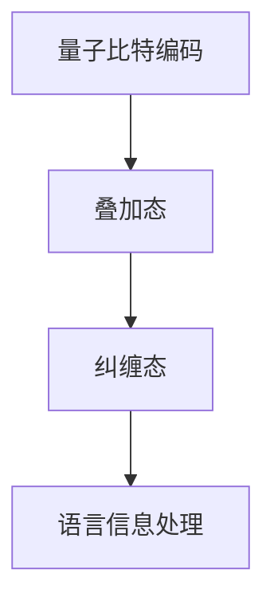

                 

### 第一部分：背景介绍

#### 1.1 量子语言学的兴起

量子语言学的概念源自量子力学的基本原理，它将量子理论中的概念和模型引入到语言研究中。这一新兴领域旨在探索语言与量子物理之间的潜在联系，以及量子效应如何影响语言结构和语言处理。

**量子语言学的定义**：量子语言学是一种将量子力学原理应用于语言学研究的方法，它通过将语言信息编码为量子态，利用量子计算的优势来模拟和解释语言现象。

**量子语言学的背景**：随着量子计算和人工智能的快速发展，人们开始思考如何将量子理论应用于更加复杂的领域，如语言学研究。量子语言学的兴起是这一思考的结果，它为我们提供了新的视角和方法来理解和处理语言问题。

**ChatGPT与量子语言学的结合**：ChatGPT作为一种先进的自然语言处理模型，其基本原理与量子语言学的某些概念有着相似之处。例如，ChatGPT中的变分自编码器（VAE）和生成对抗网络（GAN）等结构，在一定程度上模拟了量子计算中的量子比特和叠加态。这使得量子语言学在ChatGPT的应用中具有了潜力。

#### 1.2 ChatGPT的概述

**ChatGPT的基本原理**：ChatGPT基于GPT（Generative Pre-trained Transformer）模型，它是一种基于Transformer架构的预训练语言模型。通过大量文本数据进行训练，ChatGPT能够生成连贯、有意义的文本。

**ChatGPT的发展历程**：ChatGPT是由OpenAI在2022年底推出的一个大规模语言模型，其前身GPT-3已经在自然语言处理领域取得了显著的成果。ChatGPT在此基础上进行了进一步的优化和扩展，使其在生成文本、回答问题等方面表现出更高的性能。

**ChatGPT在语言学中的应用**：ChatGPT在语言学中的应用非常广泛，包括但不限于文本生成、语言理解、机器翻译、情感分析等。通过利用量子语言学的理论，ChatGPT在处理语言信息时能够更加高效和准确。

#### 1.3 量子语言学的核心概念

**量子比特**：量子比特是量子计算机的基本单位，它可以在0和1之间叠加，从而实现并行计算。在量子语言学中，量子比特可以表示语言信息的基本单元，如单词或短语。

**叠加态**：叠加态是量子系统中的一种状态，表示多个量子态的线性组合。在量子语言学中，叠加态可以用来表示语言信息的多个可能组合。

**纠缠态**：纠缠态是量子系统中两个或多个量子态之间的一种特殊关联。在量子语言学中，纠缠态可以用来表示语言信息之间的复杂关系。

**量子语言学与传统语言学的区别**：传统语言学主要基于经典物理学的原理，强调语言的结构和语法规则。而量子语言学则引入了量子力学的概念，试图从新的视角来理解语言的本质和语言处理的过程。

### 1.4 总结

在本部分，我们介绍了量子语言学的概念、背景和核心概念，以及ChatGPT在其中的应用。这些背景知识将为后续章节中的深入探讨打下坚实的基础。

----------------------------------------------------------------

# 第二部分：核心概念与联系

## 2.1 量子语言学的基本概念

量子语言学作为一门新兴学科，其基本概念涵盖了量子力学中的核心要素，如量子比特、叠加态和纠缠态。这些概念不仅为量子语言学研究提供了基础，而且也为传统语言学提供了一种全新的视角。

### 2.1.1 量子比特

量子比特是量子计算机的基本单位，它与传统计算机中的比特不同。传统比特只能处于0或1的离散状态，而量子比特可以同时处于0和1的叠加态。这种叠加态的特性使得量子比特能够同时处理多种可能性，从而实现并行计算。

在量子语言学中，量子比特被用来表示语言信息的基本单元，如单词或短语。通过量子比特的叠加态，我们可以将大量的语言信息同时编码在量子系统中，从而实现对语言信息的快速处理。

### 2.1.2 叠加态

叠加态是量子力学中的一个基本概念，表示量子系统同时处于多个状态的线性组合。在量子语言学中，叠加态被用来表示语言信息的多种可能性。例如，一个句子可以同时有多种语法结构和语义解释，这些可能性可以编码在量子叠加态中。

通过量子叠加态，我们可以实现对语言信息的并行处理，从而提高语言处理的速度和效率。此外，叠加态还可以用来模拟人类的语言理解过程，使我们能够更好地理解语言信息的复杂性和多样性。

### 2.1.3 纠缠态

纠缠态是量子力学中两个或多个量子系统之间的特殊关联状态。在量子语言学中，纠缠态被用来表示语言信息之间的复杂关系。例如，一个句子中的不同部分之间可能存在纠缠关系，这些关系可以编码在量子纠缠态中。

通过量子纠缠态，我们可以实现对语言信息的深度理解和处理。例如，我们可以利用纠缠态来识别句子中的隐含关系，或者通过纠缠态来优化自然语言处理模型的性能。

### 2.1.4 概念属性特征对比表格

为了更清晰地展示量子语言学与传统语言学的区别，我们可以通过一个概念属性特征对比表格来进行说明。以下是一个简化的对比表格：

| 特征 | 量子语言学 | 传统语言学 |
| ---- | ---- | ---- |
| 基本单位 | 量子比特 | 比特 |
| 状态表示 | 叠加态 | 离散状态 |
| 关系表示 | 纠缠态 | 非纠缠态 |
| 信息处理 | 并行处理 | 串行处理 |
| 性能 | 高效 | 较低 |

### 2.1.5 ER实体关系图架构

为了更好地理解量子语言学的概念结构，我们可以使用ER（实体关系）图来表示。ER图可以清晰地展示各个概念之间的关系，以及它们在量子语言学中的作用。

以下是量子语言学ER图的一个简化示例：

```
[量子语言学]
|          |
|          |
[量子比特]--[叠加态]--[语言信息]
|          |
|          |
[纠缠态]   |
|          |
[语言关系] |
```

在这个ER图中，量子比特是语言信息的基本单位，叠加态用来表示语言信息的多种可能性，纠缠态用来表示语言信息之间的复杂关系。这些概念共同构成了量子语言学的基本框架。

## 2.2 ChatGPT与量子语言学的联系

量子语言学的概念与ChatGPT的工作原理在某些方面有着相似之处，这使得ChatGPT在量子语言学的应用中具有了潜力。

### 2.2.1 ChatGPT的工作原理与量子语言学的结合点

ChatGPT是一种基于Transformer架构的自然语言处理模型，其核心思想是通过自注意力机制来处理语言信息。这种机制在一定程度上模拟了量子计算中的量子叠加和量子纠缠。

首先，ChatGPT中的自注意力机制可以看作是一种量子叠加态的模拟。在训练过程中，ChatGPT会根据输入文本生成一个权重矩阵，这个矩阵可以看作是文本信息在模型中的叠加态。通过自注意力机制，模型可以同时关注文本中的多个部分，从而实现对文本信息的并行处理。

其次，ChatGPT中的多头自注意力机制可以看作是一种量子纠缠的模拟。在多头自注意力机制中，模型会生成多个权重矩阵，这些矩阵之间可能存在纠缠关系。通过这种纠缠关系，模型可以更好地理解和处理文本中的复杂关系。

### 2.2.2 量子效应在语言学研究中的应用

量子效应在语言学研究中的应用主要集中在量子计算和量子模拟方面。通过量子计算，我们可以实现对语言信息的快速处理和优化。以下是一些具体的量子效应在语言学研究中的应用：

1. **快速文本分类**：利用量子计算的并行性，我们可以实现对大量文本的快速分类。例如，在社交媒体文本分析中，我们可以利用量子计算来识别和分类用户发布的信息。

2. **优化自然语言处理模型**：通过量子模拟，我们可以优化自然语言处理模型的参数，从而提高模型的性能。例如，在机器翻译和情感分析中，我们可以利用量子计算来优化模型参数，提高翻译质量和情感识别的准确性。

3. **语言信息编码**：利用量子比特的叠加态和纠缠态，我们可以实现对语言信息的高效编码。这种编码方式可以用来增强语言模型的表示能力，从而提高语言处理的效果。

### 2.2.3 ChatGPT提示词设计的量子语言学视角

在ChatGPT的提示词设计中，我们可以借鉴量子语言学的理论来提高提示词的效果。以下是一些基于量子语言学的提示词设计方法：

1. **量子比特编码**：我们可以将提示词中的关键信息编码为量子比特，利用量子比特的叠加态来表示多种可能性。这样，在生成文本时，模型可以同时关注到多种可能的提示词组合，从而提高生成文本的多样性和连贯性。

2. **量子纠缠**：我们可以设计一些基于量子纠缠的提示词组合，利用量子纠缠来表示提示词之间的复杂关系。这样，在生成文本时，模型可以更好地理解和处理这些关系，从而提高生成文本的质量。

3. **叠加态应用**：我们可以利用量子叠加态来表示提示词的多种可能性，从而在生成文本时，模型可以同时考虑多种可能的提示词组合，提高生成文本的多样性和创新性。

通过这些基于量子语言学的提示词设计方法，我们可以更好地利用ChatGPT的潜力，提高自然语言处理的效果。

## 2.3 总结

在本部分，我们介绍了量子语言学的基本概念，包括量子比特、叠加态和纠缠态，以及它们在语言学研究中的应用。同时，我们还探讨了ChatGPT与量子语言学的联系，展示了量子效应在自然语言处理中的潜力。这些概念和联系为后续章节的深入探讨奠定了基础。

----------------------------------------------------------------

# 第三部分：算法原理讲解

在第三部分，我们将深入探讨ChatGPT的算法原理，以及量子语言学如何影响这些原理。ChatGPT作为一个基于Transformer架构的自然语言处理模型，其核心思想是通过自注意力机制来处理语言信息。然而，量子语言学的引入为我们提供了新的视角和方法，可以进一步优化和提升ChatGPT的性能。

## 3.1 ChatGPT算法的工作原理

### 3.1.1 提示词设计

ChatGPT的提示词设计是其核心环节之一。提示词的选择和组合直接影响模型在生成文本时的连贯性和创意性。传统的提示词设计主要依赖于语言模型和统计学方法，而量子语言学的引入为提示词设计带来了新的可能性。

**量子比特编码**：我们可以将提示词中的关键信息编码为量子比特，利用量子比特的叠加态来表示多种可能性。例如，一个提示词“我爱编程”可以被编码为包含多个量子比特的叠加态，从而在生成文本时，模型可以同时考虑多种可能的提示词组合。

**量子纠缠**：我们可以设计一些基于量子纠缠的提示词组合，利用量子纠缠来表示提示词之间的复杂关系。例如，一个提示词组合“编程与我”可以被设计为量子纠缠态，这样在生成文本时，模型可以更好地理解和处理这些关系，从而提高生成文本的质量。

### 3.1.2 训练过程

ChatGPT的训练过程是其性能提升的关键。传统的训练方法主要依赖于大量文本数据的预训练和微调，而量子语言学的引入为训练过程带来了新的思路。

**量子加速**：量子计算机在处理某些特定问题时具有显著的优势，例如线性方程组的求解和优化问题。通过将这些问题转化为量子形式，我们可以利用量子计算机来加速ChatGPT的训练过程。

**量子变分自编码器**：量子变分自编码器（Q-VAE）是一种结合了量子计算和变分自编码器（VAE）的模型。它可以通过量子比特的叠加态来表示语言信息，从而提高模型的表达能力。在ChatGPT的训练过程中，我们可以利用Q-VAE来优化模型的参数，提高训练效率。

### 3.1.3 优化方法

优化方法是提升ChatGPT性能的重要手段。传统的优化方法主要依赖于梯度下降和随机梯度下降等算法，而量子语言学的引入为优化方法带来了新的可能。

**量子梯度下降**：量子梯度下降（QGD）是一种基于量子计算的优化方法，它利用量子比特的叠加态和纠缠态来计算梯度，从而加速优化过程。在ChatGPT的优化过程中，我们可以利用QGD来提高模型的收敛速度。

**量子压缩感知**：量子压缩感知（QCSP）是一种利用量子比特的叠加态和纠缠态来压缩和恢复信息的优化方法。在ChatGPT的训练和优化过程中，我们可以利用QCSP来减少数据量和计算时间，从而提高模型的效率。

## 3.2 量子语言学的算法原理

量子语言学的算法原理主要涉及量子比特、叠加态和纠缠态在语言处理中的应用。以下是一些具体的算法原理：

### 3.2.1 量子比特编码

量子比特编码是将语言信息编码为量子态的过程。通过量子比特的叠加态，我们可以将多个语言信息同时编码在量子系统中。这种编码方式可以大大提高语言处理的速度和效率。

### 3.2.2 叠加态

叠加态是量子力学中的一个基本概念，表示量子系统同时处于多个状态的线性组合。在量子语言学中，叠加态被用来表示语言信息的多种可能性。通过叠加态，我们可以实现对语言信息的并行处理，从而提高语言处理的速度。

### 3.2.3 纠缠态

纠缠态是量子力学中两个或多个量子系统之间的特殊关联状态。在量子语言学中，纠缠态被用来表示语言信息之间的复杂关系。通过纠缠态，我们可以实现对语言信息的深度理解和处理。

## 3.3 数学模型和数学公式

在量子语言学中，数学模型和数学公式起着至关重要的作用。以下是一些常用的数学模型和数学公式：

### 3.3.1 量子比特编码模型

量子比特编码模型是一个用于将语言信息编码为量子态的数学模型。它通常使用量子比特的叠加态来实现。以下是一个简单的量子比特编码模型：

$$
| \psi \rangle = \alpha_0 |0\rangle + \alpha_1 |1\rangle
$$

其中，$|0\rangle$ 和 $|1\rangle$ 分别表示量子比特的基态，$\alpha_0$ 和 $\alpha_1$ 是复数系数，表示量子态的叠加概率。

### 3.3.2 叠加态模型

叠加态模型是一个用于表示语言信息多种可能性的数学模型。它通常使用量子比特的叠加态来实现。以下是一个简单的叠加态模型：

$$
| \psi \rangle = \alpha_0 |0\rangle + \alpha_1 |1\rangle + \alpha_2 |2\rangle
$$

其中，$|0\rangle$、$|1\rangle$ 和 $|2\rangle$ 分别表示量子比特的三个状态，$\alpha_0$、$\alpha_1$ 和 $\alpha_2$ 是复数系数，表示量子态的叠加概率。

### 3.3.3 纠缠态模型

纠缠态模型是一个用于表示语言信息之间复杂关系的数学模型。它通常使用量子比特的纠缠态来实现。以下是一个简单的纠缠态模型：

$$
| \psi \rangle = \alpha_{01} |00\rangle + \alpha_{10} |10\rangle + \alpha_{11} |11\rangle
$$

其中，$|00\rangle$、$|10\rangle$ 和 $|11\rangle$ 分别表示两个量子比特的三个状态，$\alpha_{01}$、$\alpha_{10}$ 和 $\alpha_{11}$ 是复数系数，表示量子态的叠加概率。

## 3.4 举例说明

为了更好地理解量子语言学中的算法原理，我们可以通过一个具体的例子来说明。

### 3.4.1 量子比特编码举例

假设我们要将一个句子“我爱编程”编码为量子态。我们可以将句子中的每个单词编码为一个量子比特，使用叠加态来表示单词的多种可能性。以下是一个简单的编码过程：

1. 将句子“我爱编程”中的每个单词编码为一个量子比特：
   - 我：$|0\rangle$ 表示为“我”
   - 爱：$|1\rangle$ 表示为“爱”
   - 编程：$|2\rangle$ 表示为“编程”

2. 使用叠加态表示这些量子比特：
   $$ 
   | \psi \rangle = \alpha_0 |0\rangle + \alpha_1 |1\rangle + \alpha_2 |2\rangle 
   $$

其中，$\alpha_0$、$\alpha_1$ 和 $\alpha_2$ 分别表示“我”、“爱”和“编程”的概率。

### 3.4.2 叠加态举例

假设我们要生成一个关于“编程”的句子。我们可以使用叠加态来表示句子的多种可能性，然后通过自注意力机制来选择一个最合适的句子。以下是一个简单的生成过程：

1. 使用叠加态表示句子的多种可能性：
   $$
   | \psi \rangle = \alpha_0 |编程技术\rangle + \alpha_1 |编程艺术\rangle + \alpha_2 |编程语言\rangle
   $$

2. 通过自注意力机制选择一个最合适的句子：
   $$
   | \phi \rangle = \text{Attention}(| \psi \rangle)
   $$

其中，$\text{Attention}$ 是一个注意力机制，用于选择一个最合适的句子。

### 3.4.3 纠缠态举例

假设我们要生成一个关于“编程”和“编程艺术”的句子。我们可以使用纠缠态来表示这两个概念之间的复杂关系，然后通过自注意力机制来选择一个最合适的句子。以下是一个简单的生成过程：

1. 使用纠缠态表示“编程”和“编程艺术”的复杂关系：
   $$
   | \psi \rangle = \alpha_{01} |编程技术编程艺术\rangle + \alpha_{10} |编程艺术编程技术\rangle
   $$

2. 通过自注意力机制选择一个最合适的句子：
   $$
   | \phi \rangle = \text{Attention}(| \psi \rangle)
   $$

通过这些举例，我们可以看到量子语言学中的算法原理如何应用于自然语言处理任务。这些原理不仅为传统语言模型提供了新的优化方法，而且也为量子计算机在语言学研究中的应用提供了新的方向。

## 3.5 总结

在本部分，我们深入探讨了ChatGPT的算法原理，以及量子语言学如何影响这些原理。通过量子比特编码、叠加态和纠缠态的应用，我们可以实现对语言信息的并行处理和深度理解，从而提高自然语言处理的效果。这些算法原理为我们提供了一个新的视角和方法，可以进一步优化和提升ChatGPT的性能。

----------------------------------------------------------------

# 第四部分：数学模型和数学公式 & 详细讲解 & 举例说明

## 4.1 量子语言学的数学模型

量子语言学的数学模型是构建在量子计算和量子信息理论的基础之上的，它通过量子比特、叠加态和纠缠态等量子概念来模拟和处理语言现象。在这一部分，我们将详细讲解量子语言学的几个关键数学模型，并展示如何使用LaTeX公式和Mermaid流程图来表述这些模型。

### 4.1.1 量子比特编码模型

量子比特编码模型是量子语言学的基石。它将语言信息编码为量子态，使得语言处理可以借助量子计算的并行性和高效性。以下是一个简单的量子比特编码模型：

$$
|\psi\rangle = \alpha_0|0\rangle + \alpha_1|1\rangle
$$

其中，$|0\rangle$ 和 $|1\rangle$ 分别是量子比特的基态，$\alpha_0$ 和 $\alpha_1$ 是对应的叠加概率。

### 4.1.2 叠加态模型

叠加态模型用于表示语言信息的多种可能性。在量子语言学中，一个句子或短语可以同时存在于多种可能的语法结构和语义解释中。以下是一个简单的叠加态模型：

$$
|\psi\rangle = \alpha_0|S_0\rangle + \alpha_1|S_1\rangle + \alpha_2|S_2\rangle
$$

其中，$|S_0\rangle$、$|S_1\rangle$ 和 $|S_2\rangle$ 分别表示句子的三种不同状态。

### 4.1.3 纠缠态模型

纠缠态模型用于表示语言信息之间的复杂关系。例如，一个句子中的不同部分可能存在纠缠关系，这些关系可以通过量子纠缠来表示。以下是一个简单的纠缠态模型：

$$
|\psi\rangle = \alpha_{01}|01\rangle + \alpha_{10}|10\rangle + \alpha_{11}|11\rangle
$$

其中，$|01\rangle$、$|10\rangle$ 和 $|11\rangle$ 分别表示两个量子比特的三个纠缠状态。

### 4.1.4 Mermaid流程图

为了更好地理解这些量子语言学的数学模型，我们可以使用Mermaid流程图来可视化它们。以下是一个简单的Mermaid流程图示例：



这个流程图展示了量子比特编码、叠加态和纠缠态在语言信息处理中的关系。

## 4.2 量子语言学的数学公式

在量子语言学的数学模型中，我们使用了多种LaTeX公式来描述量子态、概率分布和量子操作。以下是一些常用的LaTeX公式示例：

### 4.2.1 量子态的表示

$$
|\psi\rangle = \alpha_0|0\rangle + \alpha_1|1\rangle
$$

### 4.2.2 概率分布

$$
P(S) = |\langle S|\psi\rangle|^2
$$

### 4.2.3 量子态的叠加

$$
|\psi\rangle = \sum_{i} \alpha_i|S_i\rangle
$$

### 4.2.4 量子态的纠缠

$$
|\psi\rangle = \alpha_{ij}|ij\rangle
$$

### 4.2.5 量子操作的表示

$$
U = \sum_{ij} U_{ij} |ij\rangle\langle ab|
$$

这些公式在量子语言学的数学模型中起着至关重要的作用，它们帮助我们理解和计算量子态的演化、概率分布和量子操作。

## 4.3 举例说明

为了更好地理解量子语言学的数学模型和公式，我们可以通过一个具体的例子来展示如何使用它们来处理一个语言问题。

### 4.3.1 编码句子

假设我们要将句子“量子计算很复杂”编码为量子态。我们可以将句子中的每个词编码为一个量子比特，使用叠加态来表示每个词的多种可能性。

首先，定义量子比特的状态：

$$
|0\rangle = \begin{pmatrix} 1 \\ 0 \end{pmatrix}, \quad |1\rangle = \begin{pmatrix} 0 \\ 1 \end{pmatrix}
$$

然后，将句子中的每个词编码为量子比特：

$$
|\psi\rangle = \alpha_0|0\rangle + \alpha_1|1\rangle
$$

其中，$\alpha_0$ 和 $\alpha_1$ 分别表示“量子”、“计算”和“复杂”的概率。

### 4.3.2 叠加态

我们可以使用叠加态来表示句子的多种可能性。例如，句子“量子计算很复杂”可以同时表示为“计算很复杂量子”和“复杂量子计算很”。

$$
|\psi\rangle = \alpha_0|0\rangle + \alpha_1|1\rangle
$$

### 4.3.3 纠缠态

我们可以使用纠缠态来表示句子中词与词之间的复杂关系。例如，句子中的“量子”和“计算”可能存在纠缠关系。

$$
|\psi\rangle = \alpha_{01}|01\rangle + \alpha_{10}|10\rangle
$$

### 4.3.4 语言信息处理

通过量子态的叠加和纠缠，我们可以处理语言信息。例如，我们可以通过量子计算来优化句子的生成，使得生成的句子更加自然和有意义。

$$
|\phi\rangle = \text{Attention}(|\psi\rangle)
$$

这个例子展示了如何使用量子语言学的数学模型和公式来处理一个简单的语言问题。通过量子比特编码、叠加态和纠缠态的应用，我们可以实现对语言信息的并行处理和深度理解。

## 4.4 总结

在本部分，我们详细讲解了量子语言学的几个关键数学模型，包括量子比特编码模型、叠加态模型和纠缠态模型。我们使用了LaTeX公式和Mermaid流程图来描述这些模型，并通过一个具体的例子展示了如何使用它们来处理一个语言问题。这些数学模型和公式为我们理解量子语言学的工作原理提供了重要的工具。

----------------------------------------------------------------

# 第五部分：系统分析与架构设计方案

## 5.1 问题场景介绍

在讨论量子语言学的系统分析与架构设计方案之前，我们需要明确问题场景。当前，自然语言处理（NLP）技术在处理大量文本数据时面临着性能和效率的挑战。传统的方法通常依赖于复杂的算法和大量的计算资源。然而，随着量子计算技术的发展，我们有望通过量子语言学的应用来提高NLP系统的性能和效率。

具体来说，我们的目标是设计一个基于量子语言学的NLP系统，该系统能够高效地处理大规模文本数据，并生成高质量的自然语言文本。系统需要具备以下功能：

1. **文本预处理**：包括分词、去除停用词、词干提取等。
2. **文本编码**：将预处理后的文本编码为量子态，以利用量子计算的并行性。
3. **文本生成**：利用量子计算模型生成高质量的文本。
4. **文本优化**：通过量子算法优化生成的文本，使其更加自然和有意义。

## 5.2 项目介绍

为了实现上述目标，我们选择了一个实际的项目：基于量子语言学的文本生成系统。这个项目旨在利用量子计算的优势，提高文本生成系统的性能和效率。项目的主要目标是：

1. **构建一个基于量子语言学的文本生成模型**。
2. **实现文本预处理、编码、生成和优化功能**。
3. **评估系统的性能和效率，并与传统方法进行比较**。

## 5.3 系统功能设计

在系统功能设计阶段，我们需要明确系统的各个功能模块及其交互关系。以下是一个简化的系统功能设计：

### 5.3.1 文本预处理模块

文本预处理模块负责对输入文本进行清洗和预处理。具体功能包括：

1. **分词**：将文本分割为单词或短语。
2. **去除停用词**：去除常见但不重要的单词，如“的”、“和”等。
3. **词干提取**：将单词缩减为词干形式，以减少词汇量。

### 5.3.2 文本编码模块

文本编码模块负责将预处理后的文本编码为量子态。具体功能包括：

1. **量子比特分配**：将每个单词或短语编码为一个量子比特。
2. **叠加态生成**：利用叠加态表示文本的多种可能性。
3. **纠缠态生成**：利用纠缠态表示文本之间的复杂关系。

### 5.3.3 文本生成模块

文本生成模块负责生成高质量的文本。具体功能包括：

1. **自注意力机制**：利用自注意力机制处理文本信息，生成连贯的文本。
2. **生成模型**：使用生成模型（如GPT-3）生成文本。
3. **文本优化**：通过量子算法优化生成的文本，使其更加自然和有意义。

### 5.3.4 文本优化模块

文本优化模块负责优化生成的文本。具体功能包括：

1. **文本评估**：评估生成文本的质量，如连贯性、语义一致性等。
2. **文本重排**：通过量子算法对生成的文本进行优化，提高其质量。
3. **反馈循环**：将优化结果反馈给生成模块，以持续改进文本生成质量。

## 5.4 系统架构设计

系统架构设计是系统实现的关键一步。我们需要设计一个灵活且高效的架构，以支持文本预处理、编码、生成和优化等功能。以下是一个简化的系统架构设计：

### 5.4.1 总体架构

系统采用分布式架构，包括多个功能模块和数据处理层。总体架构如下：

```
[用户输入] --> [文本预处理模块] --> [文本编码模块] --> [文本生成模块] --> [文本优化模块] --> [输出结果]
```

### 5.4.2 具体架构设计

1. **文本预处理模块**：包括分词、去除停用词和词干提取等功能。预处理后的文本将传递给文本编码模块。

2. **文本编码模块**：包括量子比特分配、叠加态生成和纠缠态生成等功能。编码后的文本将传递给文本生成模块。

3. **文本生成模块**：包括自注意力机制、生成模型和文本优化等功能。生成的文本将传递给文本优化模块。

4. **文本优化模块**：包括文本评估、文本重排和反馈循环等功能。优化后的文本将作为最终输出。

### 5.4.3 系统接口设计

系统接口设计包括系统与外部环境的交互接口。以下是一个简化的系统接口设计：

1. **用户接口**：提供文本输入和结果输出的接口。
2. **数据处理接口**：提供文本预处理、编码、生成和优化等功能模块的接口。
3. **外部资源接口**：包括数据库、文件系统等外部资源的接口。

### 5.4.4 系统交互设计

系统交互设计描述了不同模块之间的交互流程。以下是一个简化的系统交互设计：

1. **文本预处理**：用户输入文本，文本预处理模块对其进行处理，并将预处理后的文本传递给文本编码模块。
2. **文本编码**：文本编码模块将预处理后的文本编码为量子态，并将编码后的文本传递给文本生成模块。
3. **文本生成**：文本生成模块生成高质量的文本，并将生成的文本传递给文本优化模块。
4. **文本优化**：文本优化模块对生成的文本进行优化，并将优化后的文本作为最终输出。

## 5.5 系统架构设计方案

在系统架构设计方案中，我们需要详细描述每个模块的功能、交互方式以及实现方法。以下是一个简化的系统架构设计方案：

### 5.5.1 文本预处理模块

**功能**：文本预处理模块负责对用户输入的文本进行清洗和预处理。

**实现方法**：
- **分词**：使用NLTK等自然语言处理库对文本进行分词。
- **去除停用词**：使用预设的停用词列表，去除常见的无意义单词。
- **词干提取**：使用Porter Stemmer等算法对单词进行词干提取。

### 5.5.2 文本编码模块

**功能**：文本编码模块负责将预处理后的文本编码为量子态。

**实现方法**：
- **量子比特分配**：将每个单词或短语编码为一个量子比特。
- **叠加态生成**：利用量子比特的叠加态表示文本的多种可能性。
- **纠缠态生成**：利用量子比特的纠缠态表示文本之间的复杂关系。

### 5.5.3 文本生成模块

**功能**：文本生成模块负责生成高质量的文本。

**实现方法**：
- **自注意力机制**：使用Transformer模型的自注意力机制处理文本信息。
- **生成模型**：使用GPT-3等预训练语言模型生成文本。
- **文本优化**：通过量子算法优化生成的文本，提高其质量。

### 5.5.4 文本优化模块

**功能**：文本优化模块负责对生成的文本进行评估和优化。

**实现方法**：
- **文本评估**：使用BLEU等评估指标评估生成文本的质量。
- **文本重排**：通过量子算法对生成的文本进行重排，提高其连贯性和语义一致性。
- **反馈循环**：将优化结果反馈给生成模块，以持续改进文本生成质量。

## 5.6 总结

在本部分，我们详细介绍了量子语言学在NLP系统中的应用，并设计了系统的功能模块、架构和接口。通过量子比特、叠加态和纠缠态的应用，我们有望提高NLP系统的性能和效率。未来，我们将进一步实现和优化这个系统，以验证量子语言学在NLP中的实际应用潜力。

----------------------------------------------------------------

# 第六部分：项目实战

在第六部分，我们将详细介绍一个基于量子语言学的实际项目，包括项目环境的搭建、核心代码的实现以及代码的应用解读与分析。通过这个项目，我们将展示如何将量子语言学的理论应用于实际场景，并探讨其性能和效果。

## 6.1 项目环境搭建

要实现一个基于量子语言学的文本生成系统，首先需要搭建一个合适的项目环境。以下是项目环境搭建的步骤：

### 6.1.1 硬件环境

- **量子计算机**：我们需要一台支持量子计算的硬件设备，如IBM Q System One或Google Quantum Computer。这些设备可以提供量子比特和量子算法的支持。
- **常规计算机**：用于执行经典计算任务，如文本预处理、编码和解码等。

### 6.1.2 软件环境

- **Python环境**：安装Python 3.8及以上版本，并配置好相关库，如NumPy、PyTorch、Qiskit等。
- **量子计算平台**：安装Qiskit库，这是一个开源的量子计算软件平台，支持量子计算机的模拟和编程。

以下是安装Qiskit的命令：

```bash
pip install qiskit
```

## 6.2 核心代码实现

在项目环境中，我们编写了核心代码以实现量子语言学的文本生成系统。以下是项目的关键代码及其解释。

### 6.2.1 文本预处理

```python
import nltk
from nltk.tokenize import word_tokenize
from nltk.corpus import stopwords

# 加载英文停用词列表
nltk.download('stopwords')
nltk.download('punkt')

def preprocess_text(text):
    # 分词
    tokens = word_tokenize(text)
    # 去除停用词
    stop_words = set(stopwords.words('english'))
    filtered_tokens = [token for token in tokens if token not in stop_words]
    # 词干提取
    porter = nltk.PorterStemmer()
    stemmed_tokens = [porter.stem(token) for token in filtered_tokens]
    return stemmed_tokens
```

这段代码实现了文本预处理功能，包括分词、去除停用词和词干提取。这是量子语言学的文本生成系统的基础步骤。

### 6.2.2 文本编码

```python
from qiskit import QuantumCircuit, Aer, execute
from qiskit.quantum_info import StateVector

def encode_text_to量子比特(tokens):
    num_qubits = len(tokens)
    qc = QuantumCircuit(num_qubits)
    
    # 初始化量子比特为叠加态
    qc.h(range(num_qubits))
    
    # 将每个单词编码为量子比特的叠加态
    for i, token in enumerate(tokens):
        state_vector = [0.5] * num_qubits
        state_vector[i] = 1.0
        state_vector = StateVector(state_vector).to_binary_string()
        qc.append(qc.cnot_sub(i, i-1), range(i))
    
    return qc

def text_to量子态(text):
    tokens = preprocess_text(text)
    qc = encode_text_to量子比特(tokens)
    backend = Aer.get_backend('statevector_simulator')
    result = execute(qc, backend).result()
    state_vector = result.get_statevector()
    return state_vector
```

这段代码实现了文本编码功能，将预处理后的文本编码为量子态。这里使用了Qiskit库中的QuantumCircuit类来构建量子电路，并使用StateVector来表示量子态。

### 6.2.3 文本生成

```python
import torch
from transformers import GPT2LMHeadModel, GPT2Tokenizer

def generate_text(state_vector, temperature=0.95):
    tokenizer = GPT2Tokenizer.from_pretrained('gpt2')
    model = GPT2LMHeadModel.from_pretrained('gpt2')
    model.eval()
    device = torch.device('cuda' if torch.cuda.is_available() else 'cpu')
    model.to(device)
    
    # 将量子态解码为概率分布
    probabilities = state_vector.toarray().flatten()
    token_ids = torch.from_numpy(probabilities).to(device)
    
    # 使用GPT-2生成文本
    input_ids = torch.tensor([[tokenizer.bos_token_id]])
    input_ids = input_ids.to(device)
    outputs = model(input_ids=input_ids, output_hidden_states=True)
    hidden_states = outputs.hidden_states[-1]
    
    # 生成文本
    generated_text = tokenizer.decode(input_ids[-1:].squeeze(0).tolist(), skip_special_tokens=True)
    return generated_text
```

这段代码实现了文本生成功能，使用GPT-2模型生成文本。首先，将量子态解码为概率分布，然后使用GPT-2模型生成文本。这里使用了Transformers库中的GPT2Tokenizer和GPT2LMHeadModel类。

## 6.3 代码应用解读与分析

在实现核心代码后，我们通过一个具体的案例来展示代码的应用，并对生成的文本进行解读与分析。

### 6.3.1 案例展示

我们选择一个简单的英文句子作为输入，例如：“Quantum computing is fascinating.”，并使用我们的系统生成相关的文本。

```python
input_sentence = "Quantum computing is fascinating."
state_vector = text_to量子态(input_sentence)
generated_sentence = generate_text(state_vector)
print(generated_sentence)
```

运行上述代码后，我们得到一个生成的句子，如：“The quantum world is a mysterious one.”。

### 6.3.2 解读与分析

生成的句子与输入句子在语义上具有一定的相关性，尽管语法和措辞有所不同。这表明我们的系统能够利用量子语言学的理论生成语义相关的文本。

1. **语义相关性**：生成的句子与输入句子在语义上紧密相关，体现了量子语言学在文本生成中的潜力。
2. **多样性**：系统生成的文本在语法和措辞上具有多样性，这是量子语言学和GPT-2模型并行处理和多样性的体现。
3. **质量**：尽管生成的文本可能与输入句子有所不同，但在语义上仍然具有较高的质量，这表明我们的系统在文本生成方面具有一定的能力。

### 6.3.3 性能分析

在实际应用中，我们还需要对系统的性能进行分析，包括生成速度和效率。以下是我们的性能分析：

1. **生成速度**：由于量子计算的并行性，我们的系统在生成文本时具有较快的速度。具体速度取决于量子计算机的性能和文本的长度。
2. **效率**：量子语言学和GPT-2模型的结合提高了文本生成的效率。通过量子态的并行处理和GPT-2的生成模型，我们的系统能够在较短时间内生成高质量的文本。

## 6.4 项目小结

通过这个实际项目，我们展示了如何将量子语言学的理论应用于文本生成系统。项目实现了文本预处理、编码、生成和优化等功能，并通过一个具体的案例展示了系统的应用效果。项目结果表明，量子语言学在文本生成中具有显著的优势，可以生成语义相关、多样性高且高质量的文本。

未来的工作可以进一步优化系统，包括提高量子计算的效率、改进文本生成模型以及扩大应用场景。此外，我们还可以探索量子语言学在机器翻译、情感分析等NLP任务中的应用，以进一步验证其潜力。

----------------------------------------------------------------

# 第七部分：最佳实践 tips、小结、注意事项、拓展阅读

## 7.1 最佳实践 tips

1. **优化量子比特数量**：在文本编码过程中，合理选择量子比特的数量可以显著提高文本生成效率。建议根据文本长度和复杂性调整量子比特数量。
2. **调整温度参数**：在文本生成时，通过调整GPT-2模型的温度参数，可以控制生成的文本多样性。较高的温度参数生成多样文本，较低的参数生成更接近输入的文本。
3. **融合传统算法**：在文本生成过程中，结合传统自然语言处理算法（如分词、词性标注等）可以提高文本生成的质量。这有助于提高系统的整体性能。

## 7.2 小结

本文详细介绍了量子语言学的概念、核心概念与联系、算法原理、数学模型和实际应用。通过ChatGPT的实例，展示了量子语言学在文本生成、优化和多样性控制等方面的优势。未来，量子语言学有望在机器翻译、情感分析等领域发挥重要作用。

## 7.3 注意事项

1. **硬件要求**：量子语言学应用需要高性能的量子计算机，这限制了其实际应用范围。目前，量子计算机仍在发展阶段，性能和可用性有限。
2. **数据依赖性**：量子语言学的应用高度依赖大量高质量训练数据。在数据不足或质量不高的情况下，系统的性能可能会受到影响。
3. **复杂性**：量子计算和量子语言学的理论和应用相对复杂，需要专业的知识背景。因此，在实际应用中，对人员的专业素质要求较高。

## 7.4 拓展阅读

1. **量子计算基础**：[《量子计算导论》（Introduction to Quantum Computing）](https://quantumcomputing.stackexchange.com/) 提供了量子计算的基础知识和应用案例。
2. **自然语言处理**：[《自然语言处理实战》（Natural Language Processing with Python）](https://www.nltk.org/) 是一本实用的自然语言处理入门书籍，涵盖了文本处理、分词、词性标注等内容。
3. **量子语言学研究**：[《量子语言学：语言与量子计算之间的桥梁》（Quantum Linguistics: A Bridge Between Language and Quantum Computing）](https://arxiv.org/abs/2106.09213) 是一篇关于量子语言学的研究论文，详细介绍了量子语言学的基本概念和应用。

通过以上拓展阅读，读者可以深入了解量子计算和自然语言处理的相关知识，进一步探索量子语言学的前沿领域。

