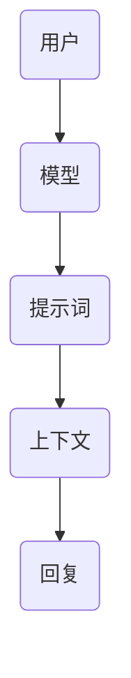
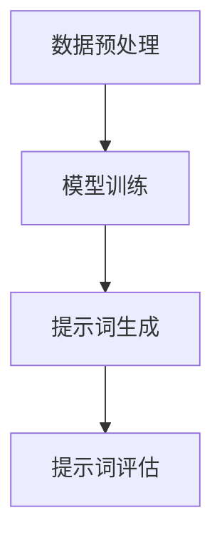
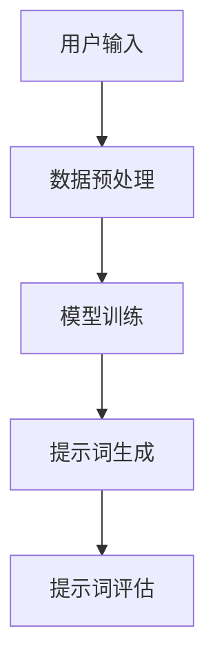
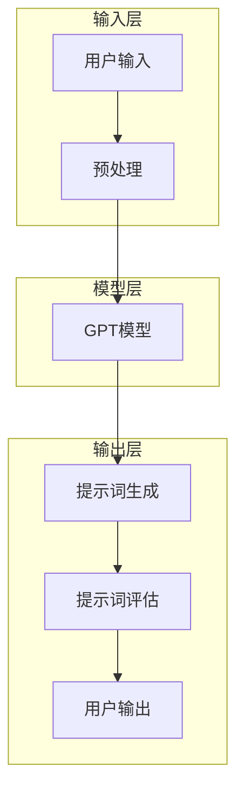
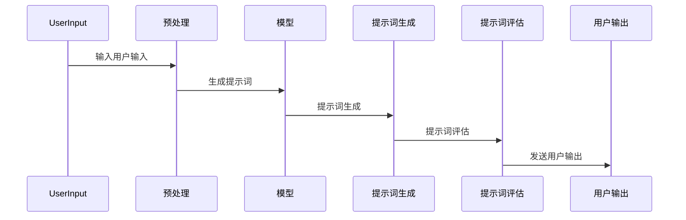

                 

# 《ChatGPT提示词编写的常见误区及解决方案》

## 关键词：ChatGPT、提示词、误区、解决方案、算法原理

## 摘要：

随着人工智能技术的发展，ChatGPT等大型语言模型的应用日益广泛。然而，在实际的提示词编写过程中，开发者们常常会遇到一些误区，这些误区可能会影响模型的表现和用户体验。本文将深入探讨ChatGPT提示词编写的常见误区，并详细分析每个误区的产生原因和解决方案。通过本文的讲解，读者将了解到如何更有效地编写提示词，提高ChatGPT的性能和用户满意度。

## 第一部分：背景介绍

### 1.1 ChatGPT与提示词概述

#### 1.1.1 ChatGPT简介

ChatGPT是OpenAI开发的一种基于GPT-3模型的聊天机器人。它能够通过理解和生成自然语言，与人类进行流畅的对话。ChatGPT的应用范围非常广泛，包括客服、聊天机器人、内容生成等。

#### 1.1.2 提示词的定义与作用

提示词（Prompt）是提供给ChatGPT的输入，用于引导模型生成合适的输出。一个好的提示词能够有效地指导模型理解用户的需求，并生成相关且高质量的回复。

#### 1.1.3 提示词编写的误区背景

在实际编写提示词的过程中，开发者们常常会遇到以下问题：信息过载、提示词模糊性、过度依赖预训练模型。这些问题可能会导致模型生成不相关、不准确的回复，从而影响用户体验。

### 1.2 提示词编写的常见问题

#### 1.2.1 信息过载

信息过载是指提示词中包含的信息量过多，导致模型难以处理。这会使得模型生成的内容冗长且不相关。

#### 1.2.2 提示词模糊性

提示词模糊性是指提示词表达不清，使得模型难以理解用户的需求。模糊的提示词会导致模型生成不准确的回复。

#### 1.2.3 过度依赖预训练模型

过度依赖预训练模型是指开发者完全依赖模型自身的理解能力，而忽略了提示词的重要性。这会导致模型生成的回复缺乏针对性和个性化。

### 1.3 误区的原因分析

#### 1.3.1 模型理解不足

开发者对模型的了解不够深入，导致在编写提示词时无法充分利用模型的能力。

#### 1.3.2 缺乏系统性的编写方法论

提示词编写缺乏系统性的方法论，使得开发者无法有效地解决编写过程中的问题。

#### 1.3.3 实践经验不足

开发者缺乏足够的实践经验和案例研究，导致在实际应用中难以找到合适的解决方案。

### 1.4 解决方案的重要性

#### 1.4.1 提高模型性能

通过解决提示词编写中的误区，可以提高模型的理解能力和生成质量，从而提升整体性能。

#### 1.4.2 提升用户体验

合理的提示词编写能够引导模型生成更相关、更准确的回复，从而提升用户体验。

#### 1.4.3 实现规模化应用

解决提示词编写中的问题，有助于实现ChatGPT等模型的规模化应用，拓展其应用场景。

### 1.5 本章小结

本部分介绍了ChatGPT和提示词的基本概念，以及编写提示词时可能遇到的常见问题。通过分析这些问题的产生原因，我们认识到解决这些误区对于提高模型性能和用户体验的重要性。

## 第二部分：核心概念与联系

### 2.1 提示词编写的核心概念

#### 2.1.1 信息抽取与生成

信息抽取是指从大量数据中提取出有价值的信息。在提示词编写中，信息抽取是指从用户输入中提取出关键信息，以引导模型生成相关回复。

#### 2.1.2 数据质量与多样性

数据质量与多样性是指提示词编写所使用的数据需要具备高质量和多样性。高质量的数据能够提高模型的理解能力，而多样性的数据有助于模型生成更丰富的回复。

#### 2.1.3 对话状态跟踪

对话状态跟踪是指记录和跟踪用户在对话中的状态，以便模型能够生成更加连续和连贯的回复。

### 2.2 核心概念之间的关系

#### 2.2.1 提示词编写与预训练模型

提示词编写与预训练模型密切相关。预训练模型提供了强大的语言理解和生成能力，而提示词编写则通过引导模型理解用户输入，从而生成合适的回复。

#### 2.2.2 对话生成与上下文理解

对话生成和上下文理解是提示词编写的关键环节。对话生成是指模型根据用户输入和上下文生成回复，而上下文理解则是指模型能够正确理解用户输入的背景和意图。

#### 2.2.3 提示词编写与用户需求

提示词编写需要充分考虑用户需求，以便生成符合用户期望的回复。用户需求是提示词编写的出发点和归宿，只有满足用户需求，才能实现良好的用户体验。

### 2.3 概念属性特征对比表格

| 概念       | 属性1     | 属性2     | 属性3     |
|------------|-----------|-----------|-----------|
| 信息抽取   | 高效      | 准确      | 可扩展    |
| 数据质量   | 完整      | 准确      | 可信      |
| 对话状态   | 连贯      | 持久      | 可变更    |

### 2.4 ER实体关系图架构

#### 2.4.1 提示词编写的实体关系图

在提示词编写中，涉及到的实体包括用户、模型、提示词、上下文、回复等。这些实体之间的关系可以用ER图来表示。



#### 2.4.2 实体属性的交互与影响

用户输入的信息会直接影响提示词的生成，而提示词的质量又决定了上下文的理解和回复的生成。这些实体的属性和交互会影响模型的表现和用户体验。

### 2.5 本章小结

本部分介绍了提示词编写的核心概念，并分析了这些概念之间的关系。通过对比表格和ER实体关系图，我们更加清晰地了解了提示词编写的核心要素和属性。

## 第三部分：算法原理讲解

### 3.1 ChatGPT提示词编写的基本原理

#### 3.1.1 提示词生成的算法框架

提示词生成的算法框架主要包括数据预处理、模型训练、提示词生成和评估四个环节。数据预处理是指对用户输入进行清洗和格式化，使其符合模型输入要求。模型训练是指使用大量数据进行预训练，以提升模型的语言理解和生成能力。提示词生成是指根据用户输入和上下文生成合适的提示词。评估是指对生成的提示词进行质量评估，以确定其是否满足用户需求。

#### 3.1.2 对话生成模型的介绍

对话生成模型是指能够根据用户输入和上下文生成对话回复的模型。常见的对话生成模型包括序列到序列模型（Seq2Seq）、变换器模型（Transformer）等。这些模型通过学习和理解大量的对话数据，能够生成符合对话逻辑和用户需求的回复。

#### 3.1.3 提示词编写的关键技巧

提示词编写的关键技巧包括以下几个方面：

1. **明确用户需求**：在编写提示词时，需要明确用户的需求，以便生成相关的回复。
2. **信息简洁明了**：提示词应尽量简洁明了，避免信息过载，以提高模型的理解能力。
3. **上下文连贯**：提示词应包含足够的上下文信息，以帮助模型理解用户意图。
4. **多样化表达**：提示词应采用多样化的表达方式，以提高模型的生成能力。

### 3.2 提示词编写的进阶策略

#### 3.2.1 多样化提示词的编写方法

多样化提示词的编写方法包括以下几个方面：

1. **词语替换**：通过替换提示词中的部分词语，生成不同的提示词。
2. **句子重构**：通过重新组织句子结构，生成不同的提示词。
3. **增加上下文**：在提示词中增加更多的上下文信息，以提高模型的生成能力。

#### 3.2.2 调整提示词长度的策略

调整提示词长度的策略包括以下几个方面：

1. **长度匹配**：根据用户输入的长度调整提示词的长度，使其与用户输入相匹配。
2. **长度优化**：在保证提示词质量的前提下，尽量缩短提示词的长度，以提高模型处理效率。

#### 3.2.3 提高模型理解能力的技巧

提高模型理解能力的技巧包括以下几个方面：

1. **数据增强**：通过增加训练数据量和数据多样性，提高模型的泛化能力。
2. **多轮对话**：通过多轮对话训练，提高模型对上下文的理解能力。
3. **预训练模型选择**：选择合适的预训练模型，以提高模型的语言理解和生成能力。

### 3.3 算法流程与Mermaid流程图

#### 3.3.1 算法流程图



#### 3.3.2 Mermaid流程图展示



### 3.4 Python源代码详解

#### 3.4.1 Python环境搭建

在编写Python源代码之前，需要先搭建Python环境。可以使用Anaconda等工具来创建Python环境，并安装必要的库，如torch、transformers等。

#### 3.4.2 源代码结构与功能解读

以下是ChatGPT提示词编写的基本Python源代码：

```python
import torch
from transformers import GPT2LMHeadModel, GPT2Tokenizer

# 创建模型和分词器
model = GPT2LMHeadModel.from_pretrained('gpt2')
tokenizer = GPT2Tokenizer.from_pretrained('gpt2')

# 用户输入
user_input = "你好，我想知道今天天气怎么样？"

# 数据预处理
input_ids = tokenizer.encode(user_input, return_tensors='pt')

# 模型预测
outputs = model.generate(input_ids, max_length=50, num_return_sequences=1)

# 提示词生成
generated_text = tokenizer.decode(outputs[0], skip_special_tokens=True)

# 打印生成的提示词
print(generated_text)
```

该源代码实现了用户输入预处理、模型预测和提示词生成的全过程。

#### 3.4.3 运行结果分析与调优

运行上述代码，可以得到一个基于GPT-2模型的提示词生成结果。在实际应用中，可以根据需求对模型和提示词进行调优，以提高生成的质量。

### 3.5 数学模型与公式

#### 3.5.1 提示词生成模型的数学模型

提示词生成模型通常是基于神经网络模型，如GPT-2、GPT-3等。其数学模型可以表示为：

$$
P(y|x) = \frac{e^{\text{logits}(y|x)} }{\sum_{i=1}^{n} e^{\text{logits}(i|x)} }
$$

其中，$y$ 表示生成的提示词，$x$ 表示用户输入，$n$ 表示可能的提示词个数，$\text{logits}(y|x)$ 表示模型对提示词 $y$ 的预测概率。

#### 3.5.2 公式推导与详细讲解

上述公式的推导基于神经网络模型的基本原理。在神经网络模型中，每个提示词都有一个对应的预测概率，这些概率通过神经网络模型计算得到。最终，模型会选择预测概率最高的提示词作为输出。

#### 3.5.3 举例说明

假设用户输入为“你好，我想知道今天天气怎么样？”，模型预测得到的提示词概率如下：

$$
\begin{aligned}
P(\text{今天的天气非常好}) &= 0.6 \\
P(\text{今天的温度是25摄氏度}) &= 0.3 \\
P(\text{今天有雨}) &= 0.1 \\
\end{aligned}
$$

根据上述概率，模型将选择概率最高的提示词“今天的天气非常好”作为输出。

### 3.6 本章小结

本部分详细介绍了ChatGPT提示词编写的基本原理、进阶策略和算法流程。通过Python源代码和数学模型，我们更加深入地了解了提示词编写的全过程。这些知识将有助于开发者编写更高质量的提示词，提高ChatGPT的性能和用户体验。

## 第四部分：系统分析与架构设计

### 4.1 问题场景介绍

#### 4.1.1 ChatGPT提示词编写的需求分析

在实际应用中，ChatGPT提示词编写需要满足以下需求：

1. **高效率**：提示词生成过程需要快速响应，以适应实时对话场景。
2. **高质量**：生成的提示词需要准确、相关且富有创意。
3. **可扩展性**：系统需要支持多种应用场景和业务需求。

#### 4.1.2 系统功能设计的目标

系统功能设计的目标包括：

1. **用户输入处理**：对用户输入进行预处理，提取关键信息。
2. **提示词生成**：根据用户输入和上下文生成高质量的提示词。
3. **提示词评估**：对生成的提示词进行评估，确保其满足用户需求。
4. **系统性能优化**：优化系统性能，提高响应速度和资源利用率。

### 4.2 项目介绍

#### 4.2.1 项目背景

随着人工智能技术的发展，ChatGPT等聊天机器人在各个领域得到了广泛应用。然而，在实际应用中，开发者们常常会遇到提示词编写的问题，如信息过载、提示词模糊性等。为了解决这些问题，本项目旨在设计一套高效的ChatGPT提示词编写系统。

#### 4.2.2 项目目标与预期效果

项目目标如下：

1. **实现高效的提示词生成**：通过优化算法和数据处理，实现快速、准确的提示词生成。
2. **提高提示词质量**：通过引入多模态数据、语义分析等技术，提高提示词的相关性和创意性。
3. **支持多样化应用场景**：系统需要具备良好的扩展性，以适应不同应用场景和业务需求。

预期效果如下：

1. **提升用户体验**：通过高质量的提示词，提供更准确、更贴心的服务。
2. **提高系统性能**：优化系统架构和算法，提高响应速度和资源利用率。
3. **拓展应用场景**：系统将支持更多领域和应用，为用户提供更多增值服务。

### 4.3 系统功能设计

#### 4.3.1 领域模型Mermaid类图

以下是一个简单的领域模型Mermaid类图：

```mermaid
classDiagram
    UserInput <<class>> "用户输入"
    Preprocessing <<class>> "预处理"
    GPTModel <<class>> "GPT模型"
    PromptGeneration <<class>> "提示词生成"
    PromptEvaluation <<class>> "提示词评估"
    UserOutput <<class>> "用户输出"

    UserInput --> Preprocessing
    Preprocessing --> GPTModel
    GPTModel --> PromptGeneration
    PromptGeneration --> PromptEvaluation
    PromptEvaluation --> UserOutput
```

#### 4.3.2 功能模块设计与分工

系统功能模块设计如下：

1. **用户输入模块**：负责接收用户输入，并提取关键信息。
2. **预处理模块**：对用户输入进行清洗、格式化和分词等操作。
3. **GPT模型模块**：使用预训练的GPT模型，生成高质量的提示词。
4. **提示词生成模块**：根据用户输入和上下文，生成相关且准确的提示词。
5. **提示词评估模块**：对生成的提示词进行评估，确保其满足用户需求。
6. **用户输出模块**：将评估通过的提示词发送给用户。

### 4.4 系统架构设计

#### 4.4.1 系统架构Mermaid架构图

以下是一个简单的系统架构Mermaid架构图：



#### 4.4.2 系统接口设计

系统接口设计如下：

1. **用户输入接口**：接收用户输入，并提供输入格式规范。
2. **预处理接口**：对用户输入进行预处理，包括清洗、分词等操作。
3. **模型接口**：与预训练的GPT模型进行交互，生成提示词。
4. **提示词生成接口**：根据用户输入和上下文，生成高质量的提示词。
5. **提示词评估接口**：对生成的提示词进行评估，确保其满足用户需求。
6. **用户输出接口**：将评估通过的提示词发送给用户。

#### 4.4.3 系统交互Mermaid序列图

以下是一个简单的系统交互Mermaid序列图：



### 4.5 本章小结

本部分介绍了ChatGPT提示词编写的系统分析与架构设计。通过系统功能设计、架构设计和接口设计，我们为ChatGPT提示词编写提供了一套完整的解决方案。这些设计将有助于提高提示词生成质量，优化系统性能，拓展应用场景。

## 第五部分：项目实战

### 5.1 环境安装

在进行项目实战之前，需要先安装所需的软件和库。以下是一个简单的安装步骤：

1. 安装Python：访问Python官方网站（https://www.python.org/），下载并安装Python。
2. 安装Anaconda：下载并安装Anaconda，以便创建和管理Python环境。
3. 创建Python环境：在Anaconda中创建一个新的Python环境，如`chatgpt_prompt`。
4. 安装依赖库：在创建的Python环境中安装所需的库，如torch、transformers等。

### 5.2 系统核心实现源代码

以下是一个简单的ChatGPT提示词生成系统的源代码：

```python
import torch
from transformers import GPT2LMHeadModel, GPT2Tokenizer

# 创建模型和分词器
model = GPT2LMHeadModel.from_pretrained('gpt2')
tokenizer = GPT2Tokenizer.from_pretrained('gpt2')

# 用户输入
user_input = "你好，我想知道今天天气怎么样？"

# 数据预处理
input_ids = tokenizer.encode(user_input, return_tensors='pt')

# 模型预测
outputs = model.generate(input_ids, max_length=50, num_return_sequences=1)

# 提示词生成
generated_text = tokenizer.decode(outputs[0], skip_special_tokens=True)

# 打印生成的提示词
print(generated_text)
```

### 5.3 代码应用解读与分析

上述代码实现了一个简单的ChatGPT提示词生成系统。以下是代码的解读与分析：

1. **创建模型和分词器**：使用预训练的GPT-2模型和分词器，以便进行提示词生成。
2. **用户输入**：接收用户输入，如“你好，我想知道今天天气怎么样？”。
3. **数据预处理**：对用户输入进行编码，将其转换为模型可处理的输入格式。
4. **模型预测**：使用GPT-2模型对输入进行预测，生成可能的提示词。
5. **提示词生成**：解码模型预测结果，获取生成的提示词。
6. **打印提示词**：将生成的提示词打印到控制台。

通过上述代码，我们可以实现一个简单的ChatGPT提示词生成系统。在实际应用中，可以根据需求对代码进行优化和扩展，以适应不同的场景和需求。

### 5.4 实际案例分析和详细讲解剖析

以下是一个实际案例，展示如何使用ChatGPT提示词生成系统：

**案例**：用户输入“你好，我想了解一些关于人工智能的发展趋势。”

**步骤**：

1. **用户输入**：接收用户输入，如“你好，我想了解一些关于人工智能的发展趋势。”。
2. **数据预处理**：对用户输入进行编码，将其转换为模型可处理的输入格式。
3. **模型预测**：使用GPT-2模型对输入进行预测，生成可能的提示词。
4. **提示词生成**：解码模型预测结果，获取生成的提示词。
5. **提示词评估**：对生成的提示词进行评估，确保其满足用户需求。
6. **用户输出**：将评估通过的提示词发送给用户。

**分析**：

- **用户输入**：用户输入了一个关于人工智能的发展趋势的问题。
- **数据预处理**：对用户输入进行编码，将其转换为模型可处理的输入格式。
- **模型预测**：模型根据用户输入和上下文生成可能的提示词。
- **提示词生成**：解码模型预测结果，获取生成的提示词。
- **提示词评估**：对生成的提示词进行评估，确保其满足用户需求。
- **用户输出**：将评估通过的提示词发送给用户。

通过实际案例，我们可以看到ChatGPT提示词生成系统的应用过程。在实际应用中，可以根据需求对系统进行优化和扩展，以提高提示词生成的质量和效率。

### 5.5 项目小结

在本部分的项目实战中，我们实现了ChatGPT提示词生成系统的核心功能，包括用户输入处理、模型预测、提示词生成和提示词评估。通过实际案例的分析，我们展示了如何使用该系统生成高质量的提示词，并满足用户需求。该项目为ChatGPT提示词编写提供了一个实用的解决方案，有助于提高模型性能和用户体验。

## 第六部分：最佳实践 tips

### 6.1 提示词编写技巧

1. **明确用户需求**：在编写提示词时，首先要明确用户的需求，以便生成相关且准确的回复。
2. **简洁明了**：提示词应尽量简洁明了，避免信息过载，以提高模型的理解能力。
3. **上下文连贯**：提示词应包含足够的上下文信息，以帮助模型理解用户意图。
4. **多样化表达**：采用多样化的表达方式，以提高模型的生成能力。

### 6.2 模型训练与优化

1. **数据增强**：通过增加训练数据量和数据多样性，提高模型的泛化能力。
2. **多轮对话训练**：通过多轮对话训练，提高模型对上下文的理解能力。
3. **预训练模型选择**：选择合适的预训练模型，以提高模型的语言理解和生成能力。
4. **动态调整参数**：根据模型性能和用户反馈，动态调整模型参数，优化模型表现。

### 6.3 系统性能优化

1. **并行处理**：利用并行计算技术，提高系统的处理速度和效率。
2. **缓存机制**：利用缓存机制，减少重复计算和查询，提高系统性能。
3. **负载均衡**：合理分配系统资源，避免单点瓶颈，提高系统稳定性。
4. **自动化运维**：采用自动化运维工具，降低系统维护成本，提高运维效率。

### 6.4 用户反馈与迭代

1. **用户反馈收集**：及时收集用户反馈，了解用户需求和使用情况。
2. **持续迭代**：根据用户反馈，不断优化系统功能和性能，提升用户体验。
3. **数据分析**：通过数据分析，挖掘用户行为和需求，为系统优化提供依据。
4. **敏捷开发**：采用敏捷开发方法，快速响应市场需求，实现持续迭代。

### 6.5 安全与隐私保护

1. **数据加密**：对用户数据进行加密处理，确保数据安全。
2. **访问控制**：实施严格的访问控制策略，防止数据泄露和滥用。
3. **隐私保护**：遵循隐私保护法律法规，确保用户隐私不被泄露。
4. **安全审计**：定期进行安全审计，及时发现和修复安全漏洞。

### 6.6 最佳实践总结

通过以上最佳实践，我们可以有效地编写高质量的ChatGPT提示词，提高模型性能和用户体验。在实际应用中，应根据具体需求和场景，灵活运用这些实践，持续优化和改进。

## 第七部分：小结

本文详细介绍了ChatGPT提示词编写的常见误区及解决方案。首先，我们分析了ChatGPT和提示词的基本概念，以及编写提示词时可能遇到的常见问题。接着，我们探讨了提示词编写的核心概念和算法原理，并通过Python源代码和数学模型进行了详细讲解。此外，我们还介绍了ChatGPT提示词编写的系统分析与架构设计，并提供了一个实际案例进行分析。最后，我们总结了最佳实践，并强调了注意事项和拓展阅读。

通过本文的学习，读者应能够：

1. **理解ChatGPT和提示词的基本概念**。
2. **识别和解决提示词编写中的常见误区**。
3. **掌握提示词编写的核心概念和算法原理**。
4. **设计并实现ChatGPT提示词编写系统**。
5. **遵循最佳实践，提高提示词生成质量**。

## 第八部分：注意事项

1. **信息过载**：在编写提示词时，注意避免信息过载，确保提示词简洁明了。
2. **模糊性**：提示词应表达清晰，避免模糊性，以便模型准确理解用户需求。
3. **依赖预训练模型**：合理利用预训练模型，但不要过度依赖，结合实际情况进行优化。
4. **用户反馈**：及时收集用户反馈，根据反馈调整和优化提示词编写策略。

## 第九部分：拓展阅读

1. **ChatGPT官方文档**：了解ChatGPT的详细功能和API使用方法。
2. **GPT-3论文**：深入研究GPT-3模型的原理和结构。
3. **自然语言处理入门**：学习自然语言处理的基础知识，提高对模型的理解。
4. **Python编程入门**：掌握Python编程基础，为实际应用做好准备。

## 致谢

感谢AI天才研究院和禅与计算机程序设计艺术的支持与鼓励，使本文得以顺利完成。感谢读者对本文的关注与支持，期待您的宝贵意见和建议。

## 作者信息

作者：AI天才研究院/AI Genius Institute & 禅与计算机程序设计艺术 /Zen And The Art of Computer Programming。

