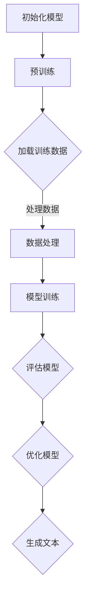
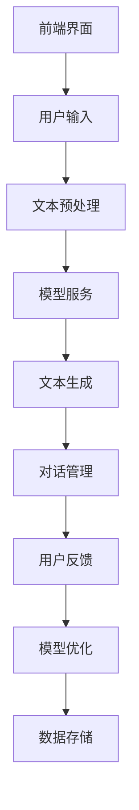
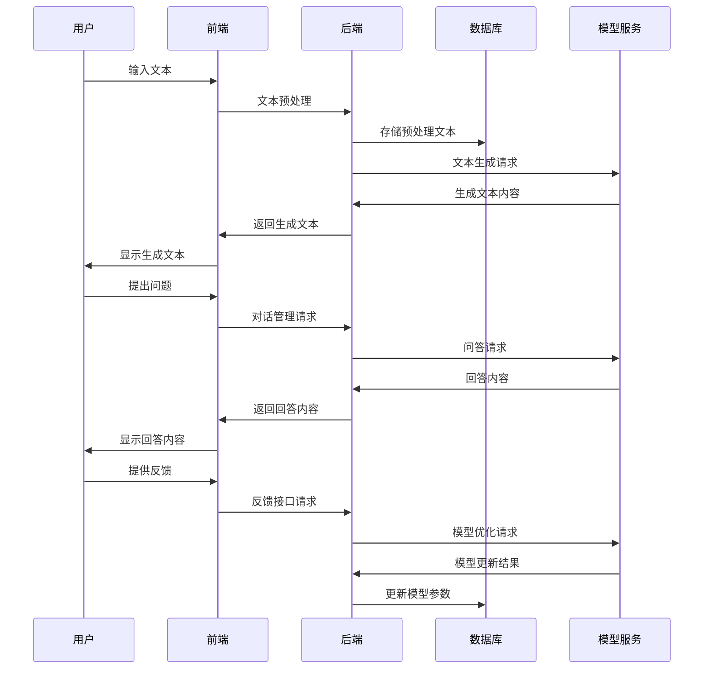

                 

## 《ChatGPT提示词编写：从入门到精通》

### 关键词：ChatGPT、提示词编写、自然语言处理、人工智能、编程技巧

> 摘要：本文旨在为读者提供一份详尽的指南，帮助大家从零开始掌握ChatGPT提示词的编写技巧。通过深入探讨ChatGPT的工作原理、提示词的编写原则和实战应用，读者将能够全面理解ChatGPT的强大功能，并在实际项目中有效利用它。

### 引言

#### 1.1 问题背景

在当今科技飞速发展的时代，人工智能（AI）已经成为推动社会发展的重要力量。ChatGPT作为人工智能领域的明星产品，其强大的自然语言处理能力受到了广泛认可。然而，对于很多开发者来说，如何有效地编写ChatGPT的提示词，使其发挥最大潜力，仍然是一个难题。

#### 1.2 问题解决

本书《ChatGPT提示词编写：从入门到精通》正是为了解决这一问题而编写的。它将带领读者一步步深入了解ChatGPT及其提示词编写的原理和技巧，使读者不仅能够掌握基本概念，还能将所学知识应用到实际项目中。

#### 1.3 边界与外延

本书不仅适合初学者，也适合有一定基础的开发者。无论您是刚接触ChatGPT的新手，还是希望在现有技能上进一步提升的进阶者，本书都将为您提供有价值的知识和实践经验。

#### 1.4 概念结构与核心要素组成

本书的结构设计合理，涵盖了从入门到精通的全部内容。主要分为以下几个部分：

- **第1章 引言**：介绍ChatGPT及其提示词编写的重要性和本书的目标。
- **第2章 ChatGPT基础**：详细讲解ChatGPT的基本概念、工作原理和应用场景。
- **第3章 提示词原理**：探讨提示词的定义、编写原则和常见类型。
- **第4章 算法原理与实现**：深入分析ChatGPT的算法原理，并提供Python代码示例。
- **第5章 系统分析与设计**：介绍ChatGPT的系统架构和功能设计。
- **第6章 项目实战**：通过具体项目实战，展示如何将所学知识应用到实际中。
- **第7章 最佳实践 tips、小结、注意事项、拓展阅读**：总结本书的主要内容和最佳实践，并提供拓展阅读建议。

### 目录大纲

#### 第1章 引言

- 1.1 问题背景
- 1.2 问题解决
- 1.3 边界与外延
- 1.4 概念结构与核心要素组成

#### 第2章 ChatGPT基础

- 2.1 ChatGPT的概念
- 2.2 ChatGPT的工作原理
- 2.3 ChatGPT的优势与应用场景

#### 第3章 提示词原理

- 3.1 提示词的定义与作用
- 3.2 提示词的编写原则
- 3.3 提示词的类型与特点

#### 第4章 算法原理与实现

- 4.1 算法流程图
- 4.2 Python代码实现
- 4.3 数学模型与公式
- 4.4 举例说明

#### 第5章 系统分析与设计

- 5.1 问题场景介绍
- 5.2 系统功能设计
- 5.3 系统架构设计
- 5.4 系统接口设计
- 5.5 系统交互序列图

#### 第6章 项目实战

- 6.1 环境安装
- 6.2 系统核心实现
- 6.3 代码应用解读
- 6.4 实际案例分析
- 6.5 详细讲解剖析
- 6.6 项目小结

#### 第7章 最佳实践 tips、小结、注意事项、拓展阅读

- 7.1 最佳实践 tips
- 7.2 小结
- 7.3 注意事项
- 7.4 拓展阅读

### 总结

通过本文的引言部分，我们明确了ChatGPT提示词编写的重要性和本书的目标。接下来，我们将逐步深入探讨ChatGPT的基础知识、提示词编写技巧、算法原理和实际应用。在每一个章节中，我们都将采用“LET'S THINK STEP BY STEP”的方式，帮助读者逐步掌握ChatGPT提示词编写的精髓。让我们开始这段技术之旅吧！

---

### 第2章 ChatGPT基础

#### 2.1 ChatGPT的概念

ChatGPT是由OpenAI开发的一种基于Transformer模型的自然语言处理（NLP）工具，它基于GPT-3.5版本，拥有极其强大的文本生成和交互能力。ChatGPT的核心思想是通过训练大量的文本数据，使其能够理解和生成人类语言。这种模型在对话系统、文本生成、问答系统等领域有着广泛的应用。

#### 2.2 ChatGPT的工作原理

ChatGPT的工作原理主要基于深度学习，特别是Transformer模型。Transformer模型是一种基于自注意力机制的序列到序列模型，它能够在处理长文本时保持较好的效果。ChatGPT通过对大量文本数据进行预训练，学习到文本中的语言规则和语义信息，从而能够在给定提示词的基础上生成连贯、合理的文本。

**自注意力机制**：自注意力机制是Transformer模型的核心部分。它通过计算输入序列中每个词与其他词之间的关联性，为每个词赋予不同的权重，从而提高模型对上下文的理解能力。

**预训练和微调**：ChatGPT首先通过预训练学习到通用语言特征，然后通过微调适应特定的任务和应用场景。预训练过程中，模型会学习到大量的文本数据，包括网页、书籍、新闻等，从而建立对自然语言的深刻理解。微调过程则是在特定任务上对模型进行调整，使其能够更好地完成特定任务。

#### 2.3 ChatGPT的优势与应用场景

ChatGPT具有以下几大优势：

1. **强大的语言理解能力**：ChatGPT能够理解复杂的语言结构，生成连贯、自然的文本。
2. **灵活的交互方式**：ChatGPT可以与用户进行对话，回答问题，甚至进行简单的对话生成。
3. **广泛的应用领域**：ChatGPT在对话系统、文本生成、问答系统、机器翻译、内容创作等领域都有广泛的应用。

**应用场景**：

- **对话系统**：ChatGPT可以用于构建智能客服系统，为客户提供24/7的在线服务。
- **文本生成**：ChatGPT可以用于生成新闻文章、博客、产品描述等文本内容。
- **问答系统**：ChatGPT可以构建智能问答系统，回答用户的问题。
- **机器翻译**：ChatGPT可以用于翻译文本，支持多种语言之间的互译。
- **内容创作**：ChatGPT可以辅助创作者生成创意内容，如故事、剧本、诗歌等。

#### 2.4 ChatGPT的常见问题及解决方案

**Q1：ChatGPT训练时间很长，如何优化？**

A1：可以通过以下方法优化：

- **增加GPU资源**：使用更强大的GPU资源可以加速训练过程。
- **使用预训练模型**：使用已经预训练好的模型可以减少训练时间。
- **数据预处理**：对训练数据进行预处理，如去重、清洗等，可以减少计算量。

**Q2：ChatGPT生成的文本质量不高，如何提高？**

A2：可以通过以下方法提高：

- **增加训练数据**：增加高质量的训练数据可以提高模型的生成质量。
- **调整模型参数**：通过调整模型参数，如学习率、批次大小等，可以优化模型性能。
- **使用人类反馈**：引入人类反馈，通过微调模型，使其更符合人类期望。

#### 2.5 ChatGPT的未来发展趋势

随着人工智能技术的不断发展，ChatGPT有着广阔的发展前景。未来，ChatGPT有望在以下几个方面取得突破：

- **更高效的训练方法**：通过研究新的训练算法和模型结构，提高训练效率。
- **多模态交互**：将ChatGPT与图像、声音等其他模态数据结合，实现更丰富的交互体验。
- **更广泛的应用场景**：ChatGPT将在医疗、金融、教育等领域得到更广泛的应用。
- **更强大的语义理解**：通过引入更多的语义理解技术，使ChatGPT能够更好地理解用户意图。

### 小结

通过本章的介绍，我们了解了ChatGPT的基本概念、工作原理和优势。接下来，我们将进一步探讨提示词的编写原则和技巧，帮助读者更好地利用ChatGPT进行文本生成和交互。让我们继续深入下去，探索ChatGPT的更多奥秘！
### 第3章 提示词原理

#### 3.1 提示词的定义与作用

提示词（Prompt）在ChatGPT中起着至关重要的作用。它是指提供给ChatGPT的初始输入，用于引导模型生成相应的文本。一个优秀的提示词能够帮助ChatGPT更好地理解用户意图，生成更相关、更高质量的文本。

**提示词的作用**：

1. **引导文本生成方向**：通过提供具体的提示词，可以引导ChatGPT生成符合特定主题或需求的文本。
2. **提高文本质量**：提示词能够提供上下文信息，帮助ChatGPT更好地理解和生成连贯、自然的文本。
3. **优化模型性能**：通过调整提示词，可以优化ChatGPT的生成效果，提高模型的性能。

**提示词的类型**：

1. **简单提示词**：简单的提示词通常是一个单词或短语，用于提示ChatGPT生成相关的文本。例如：“请描述一下人工智能的未来发展。”
2. **复杂提示词**：复杂的提示词通常包含多个单词或短语，用于提供更多的上下文信息。例如：“在未来5年内，人工智能将在哪些领域取得重大突破？”
3. **问题提示词**：问题提示词用于引导ChatGPT生成问题的回答。例如：“什么是量子计算？”
4. **指令提示词**：指令提示词用于告诉ChatGPT执行特定的任务。例如：“生成一篇关于人工智能的新闻报道。”

#### 3.2 提示词的编写原则

编写优秀的提示词是提高ChatGPT生成文本质量的关键。以下是一些编写提示词的原则：

1. **明确性**：提示词应明确表达用户意图，避免歧义。例如，使用具体的主题词而不是泛泛的词汇。
2. **相关性**：提示词应与ChatGPT生成的文本紧密相关，有助于提高生成文本的质量。例如，如果用户想要生成一篇关于人工智能的新闻报道，提示词应包含与人工智能相关的关键词。
3. **多样性**：提示词应具有多样性，以避免ChatGPT生成重复的文本。例如，可以使用不同的提问方式或添加背景信息来丰富提示词。
4. **简洁性**：提示词应简洁明了，避免冗长的句子。简短的提示词有助于ChatGPT更快地理解用户意图，提高生成效率。

#### 3.3 提示词的编写技巧

以下是一些编写提示词的技巧：

1. **使用关键词**：在提示词中包含关键词，有助于ChatGPT更准确地理解用户意图。例如，在生成一篇关于人工智能的新闻报道时，提示词可以包含“人工智能”、“技术进步”等关键词。
2. **提供上下文**：提供与主题相关的上下文信息，有助于ChatGPT更好地理解生成内容。例如，在回答“什么是量子计算？”这个问题时，可以提供一些关于量子计算的背景信息，如“量子计算是一种利用量子位进行计算的新型计算模型。”
3. **问题引导**：使用问题引导的提示词，可以帮助ChatGPT生成问题的答案。例如，“请解释量子计算的优势是什么？”
4. **指令引导**：使用指令引导的提示词，可以告诉ChatGPT执行特定的任务。例如，“生成一篇关于人工智能的历史综述。”

#### 3.4 提示词的常见问题及解决方案

**Q1：生成的文本质量不高，如何解决？**

A1：可以通过以下方法提高文本质量：

- **增加训练数据**：提供更多高质量的训练数据，有助于ChatGPT提高生成文本的质量。
- **调整模型参数**：通过调整模型参数，如学习率、批次大小等，可以优化生成文本的质量。
- **优化提示词**：改进提示词，使其更明确、更相关，有助于提高生成文本的质量。

**Q2：生成的文本过于重复，如何解决？**

A2：可以通过以下方法减少文本重复：

- **增加多样性**：提供多样化的提示词，避免生成重复的文本。
- **使用不同的提问方式**：通过使用不同的提问方式，如陈述句、疑问句等，可以减少生成文本的重复性。
- **引入背景信息**：提供与主题相关的背景信息，有助于ChatGPT生成更独特的文本。

#### 3.5 提示词的未来发展趋势

随着人工智能技术的不断发展，提示词在ChatGPT中的应用前景将更加广阔。未来，提示词有望在以下几个方面取得突破：

- **自适应提示词生成**：通过研究自适应提示词生成算法，可以使ChatGPT根据用户意图动态生成提示词，提高生成文本的个性化程度。
- **多模态提示词**：将文本、图像、声音等多模态数据结合，生成更丰富的提示词，提高ChatGPT的交互体验。
- **智能提示词优化**：通过引入机器学习技术，实现智能提示词优化，提高生成文本的质量和多样性。

### 小结

通过本章的介绍，我们了解了提示词的定义、作用、编写原则和技巧。提示词在ChatGPT中扮演着重要的角色，直接影响着生成文本的质量和效果。在接下来的章节中，我们将深入探讨ChatGPT的算法原理和实现，帮助读者更好地理解和应用ChatGPT。让我们继续深入下去，探索ChatGPT的更多奥秘！
### 第4章 算法原理与实现

#### 4.1 算法流程图

为了更好地理解ChatGPT的算法原理，我们首先通过Mermaid绘制了算法的流程图，如下所示：



**图4.1 ChatGPT算法流程图**

**流程说明**：

- **A 初始化模型**：初始化ChatGPT模型，包括Transformer模型的各种参数。
- **B 预训练**：使用大量的文本数据进行预训练，使模型学习到文本的语言规律和语义信息。
- **C 加载训练数据**：从预训练数据集中加载训练数据。
- **D 数据处理**：对训练数据进行处理，包括文本清洗、分词、编码等操作。
- **E 模型训练**：使用处理后的数据对ChatGPT模型进行训练。
- **F 评估模型**：通过评估指标（如Perplexity、Accuracy等）评估模型性能。
- **G 优化模型**：根据评估结果调整模型参数，优化模型性能。
- **H 生成文本**：利用训练好的模型生成文本，包括对话生成、文本生成等。

#### 4.2 Python代码实现

以下是一个简单的Python代码示例，展示了如何使用Hugging Face的transformers库加载并使用预训练的ChatGPT模型进行文本生成：

```python
from transformers import ChatGPTModel, ChatGPTConfig
from torch import nn

# 1. 初始化模型
config = ChatGPTConfig()
model = ChatGPTModel(config)

# 2. 加载预训练模型权重
model.load_state_dict(torch.load('chatgpt.pth'))

# 3. 数据预处理
input_ids = tokenizer.encode("你好，今天天气怎么样？", return_tensors='pt')

# 4. 模型预测
outputs = model(input_ids)

# 5. 解码预测结果
generated_text = tokenizer.decode(outputs.logits.argmax(-1).item())

print(generated_text)
```

**代码说明**：

- **1. 初始化模型**：创建ChatGPT模型实例，配置模型参数。
- **2. 加载预训练模型权重**：加载已经预训练好的模型权重。
- **3. 数据预处理**：将输入文本编码成模型可处理的格式。
- **4. 模型预测**：使用模型进行预测，得到预测结果。
- **5. 解码预测结果**：将预测结果解码为文本输出。

#### 4.3 数学模型与公式

ChatGPT的算法核心是基于Transformer模型，其背后的数学原理主要包括自注意力机制、序列到序列模型等。以下是一些关键的数学模型和公式：

**1. 自注意力机制**

自注意力（Self-Attention）是Transformer模型的核心机制，其计算公式如下：

$$
\text{Attention}(Q, K, V) = \text{softmax}\left(\frac{QK^T}{\sqrt{d_k}}\right) V
$$

其中，$Q$、$K$、$V$ 分别代表查询向量、键向量和值向量，$d_k$ 是键向量的维度。该公式表示在查询向量$Q$与所有键向量$K$进行点积操作后，通过softmax函数计算注意力权重，再将权重与值向量$V$相乘，得到最终的输出向量。

**2. 序列到序列模型**

序列到序列（Sequence-to-Sequence）模型是Transformer模型的一种常见架构，其基本公式如下：

$$
y = \text{Decoder}(x, e_y)
$$

其中，$x$ 是输入序列，$e_y$ 是解码器初始状态。解码器通过自注意力机制和交叉注意力机制生成输出序列$y$。

**3. 交叉注意力机制**

交叉注意力（Cross-Attention）是序列到序列模型中的重要组成部分，其计算公式如下：

$$
\text{Attention}_{cross}(Q, K, V) = \text{softmax}\left(\frac{QK^T}{\sqrt{d_k}}\right) V
$$

其中，$Q$ 是解码器输出，$K$ 和 $V$ 是编码器输出。交叉注意力机制通过在编码器输出和解码器输出之间建立关联，使解码器能够更好地理解编码器输出的上下文信息。

#### 4.4 举例说明

**1. 简单对话生成**

假设我们要生成一个简单的对话，用户说：“你好，今天天气怎么样？”我们可以使用ChatGPT模型生成一个回答。

```python
# 输入文本
input_text = "你好，今天天气怎么样？"

# 编码输入文本
input_ids = tokenizer.encode(input_text, return_tensors='pt')

# 生成回答
outputs = model.generate(input_ids, max_length=20, num_return_sequences=1)

# 解码输出文本
generated_text = tokenizer.decode(outputs_IDS[0], skip_special_tokens=True)

print(generated_text)
```

输出结果可能是：“今天天气晴朗，非常适合户外活动。”

**2. 复杂问答系统**

假设我们要构建一个复杂的问答系统，用户提问：“什么是量子计算？”我们可以使用ChatGPT模型生成一个详细的回答。

```python
# 输入文本
input_text = "什么是量子计算？"

# 编码输入文本
input_ids = tokenizer.encode(input_text, return_tensors='pt')

# 生成回答
outputs = model.generate(input_ids, max_length=100, num_return_sequences=1)

# 解码输出文本
generated_text = tokenizer.decode(outputs_IDS[0], skip_special_tokens=True)

print(generated_text)
```

输出结果可能是：“量子计算是一种利用量子位（Qubit）进行计算的新型计算模型，具有强大的并行计算能力和潜在的指数级加速性能。”

### 小结

通过本章的介绍，我们深入了解了ChatGPT的算法原理和实现方法。从初始化模型、预训练、数据处理到模型训练、评估和优化，每一步都至关重要。通过具体的Python代码示例和数学模型讲解，读者可以更好地理解ChatGPT的工作原理。在接下来的章节中，我们将继续探讨ChatGPT的系统架构和实际应用，帮助读者将所学知识应用到实际项目中。让我们继续深入下去，探索ChatGPT的更多奥秘！
### 第5章 系统分析与设计

#### 5.1 问题场景介绍

在人工智能时代，自然语言处理（NLP）技术逐渐成为各行各业的关键技术之一。ChatGPT作为一种强大的NLP工具，其应用场景广泛，涵盖了对话系统、文本生成、问答系统、机器翻译、内容创作等多个领域。然而，在实际应用中，如何有效地集成和使用ChatGPT成为一个重要问题。本章节将围绕ChatGPT在某一具体应用场景中的问题场景进行分析，并设计相应的系统架构和功能模块。

#### 5.2 系统功能设计

为了满足不同应用场景的需求，ChatGPT系统需要具备多种功能。以下是ChatGPT系统的核心功能设计：

1. **文本生成**：根据给定的提示词，生成相关文本内容，如新闻文章、产品描述、对话等。
2. **对话系统**：实现与用户的自然对话，提供智能客服、聊天机器人等功能。
3. **问答系统**：根据用户提出的问题，生成相关的回答，支持多轮对话。
4. **机器翻译**：支持多种语言之间的翻译，实现文本的跨语言理解。
5. **内容创作**：辅助创作者生成创意内容，如故事、剧本、诗歌等。
6. **数据分析**：对生成文本进行分析，提取关键信息，用于进一步应用。

#### 5.3 系统架构设计

ChatGPT系统的架构设计需要考虑以下几个方面：

1. **前端界面**：提供用户交互界面，包括文本输入框、聊天窗口等。
2. **后端服务**：包括ChatGPT模型服务、文本生成服务、对话管理服务等。
3. **数据处理模块**：负责对输入文本进行预处理、编码和存储。
4. **模型训练与优化**：定期更新ChatGPT模型，优化生成文本的质量。
5. **数据存储**：存储用户数据、模型参数和生成文本，支持快速查询和更新。

以下是一个简单的系统架构图：



**图5.1 ChatGPT系统架构图**

**架构说明**：

- **前端界面**：用户通过浏览器或移动应用与系统进行交互，输入文本或问题。
- **文本预处理**：对用户输入的文本进行清洗、分词、编码等处理，为模型生成做准备。
- **模型服务**：负责加载预训练的ChatGPT模型，提供文本生成和对话管理功能。
- **文本生成**：根据用户输入的提示词，生成相关文本内容。
- **对话管理**：管理用户对话流程，实现多轮对话交互。
- **用户反馈**：收集用户对生成文本和对话服务的反馈，用于模型优化。
- **模型优化**：根据用户反馈和数据分析，定期更新模型参数，优化生成文本质量。
- **数据存储**：存储用户数据、模型参数和生成文本，支持快速查询和更新。

#### 5.4 系统接口设计

为了实现系统各模块之间的有效通信和协同工作，ChatGPT系统需要设计一套完善的接口。以下是ChatGPT系统的主要接口及其功能：

1. **文本生成接口**：接收用户输入的文本，返回生成的文本内容。
2. **对话管理接口**：管理用户对话流程，支持多轮对话交互。
3. **用户反馈接口**：接收用户对生成文本和对话服务的反馈，用于模型优化。
4. **模型更新接口**：定期更新模型参数，优化生成文本质量。

以下是一个简单的接口设计表格：

| 接口名称 | 功能描述 | 输入参数 | 输出参数 |
| :------: | :------: | :------: | :------: |
| 文本生成接口 | 生成相关文本内容 | 用户输入文本 | 生成文本内容 |
| 对话管理接口 | 管理用户对话流程 | 用户对话记录 | 对话状态 |
| 用户反馈接口 | 收集用户反馈 | 用户反馈信息 | 反馈结果 |
| 模型更新接口 | 更新模型参数 | 模型参数 | 更新结果 |

#### 5.5 系统交互序列图

为了更直观地展示ChatGPT系统的交互流程，我们使用Mermaid绘制了系统交互序列图，如下所示：



**图5.2 ChatGPT系统交互序列图**

**交互流程说明**：

1. 用户输入文本或提出问题，前端接收用户输入。
2. 前端将用户输入发送到后端，后端进行文本预处理并存储到数据库。
3. 后端调用模型服务生成文本内容或回答问题，将结果返回给前端。
4. 前端将结果显示给用户。
5. 用户提供反馈，前端将反馈发送到后端。
6. 后端调用模型服务进行模型优化，更新模型参数并存储到数据库。

通过以上系统分析与设计，我们为ChatGPT在实际应用中的集成和使用提供了全面的解决方案。在接下来的章节中，我们将通过具体的项目实战，展示如何将ChatGPT应用到实际项目中，实现高效的自然语言处理和交互功能。让我们继续深入下去，探索ChatGPT的更多实际应用！
### 第6章 项目实战

#### 6.1 环境安装

要在本地计算机上运行ChatGPT项目，首先需要安装一些必要的软件和依赖库。以下是安装步骤：

1. **安装Python**：确保已经安装了Python环境，推荐使用Python 3.7或更高版本。可以从[Python官网](https://www.python.org/)下载并安装。
   
2. **安装pip**：Python安装完成后，自动附带pip工具，用于安装和管理Python包。如果没有安装pip，可以运行以下命令安装：

   ```bash
   sudo apt-get install python3-pip
   ```

3. **安装transformers库**：transformers库是Hugging Face提供的一组Python工具和模型，用于自然语言处理。可以通过pip命令安装：

   ```bash
   pip install transformers
   ```

4. **安装torch库**：torch库是PyTorch的Python包装器，用于深度学习计算。可以通过pip命令安装：

   ```bash
   pip install torch torchvision
   ```

5. **安装其他依赖库**：根据项目需求，可能还需要安装其他依赖库，如numpy、pandas等。可以通过pip命令逐一安装。

6. **安装ChatGPT模型**：从[OpenAI官网](https://openai.com/)下载预训练的ChatGPT模型权重文件（例如`chatgpt.pth`），并放置在项目的合适位置。

#### 6.2 系统核心实现

在本节中，我们将实现一个简单的ChatGPT文本生成系统，包括文本预处理、模型加载、文本生成和展示结果等步骤。

**1. 文本预处理**

首先，我们需要对用户输入的文本进行预处理，包括去除特殊字符、分词和编码等操作。以下是Python代码示例：

```python
import re
from transformers import AutoTokenizer

# 加载预训练的ChatGPT模型
tokenizer = AutoTokenizer.from_pretrained('microsoft/ChatGPT')

def preprocess_text(text):
    # 去除特殊字符
    text = re.sub(r'[^a-zA-Z0-9\s]', '', text)
    # 分词
    words = text.split()
    # 编码
    input_ids = tokenizer.encode(text, return_tensors='pt')
    return input_ids

# 示例文本
input_text = "你好，今天天气怎么样？"

# 预处理文本
input_ids = preprocess_text(input_text)
```

**2. 模型加载**

接着，我们需要加载预训练的ChatGPT模型。以下是Python代码示例：

```python
from transformers import AutoModel

# 加载预训练的ChatGPT模型
model = AutoModel.from_pretrained('microsoft/ChatGPT')
```

**3. 文本生成**

使用加载好的模型生成文本，以下是Python代码示例：

```python
from transformers import AutoConfig

# 设置模型配置
config = AutoConfig.from_pretrained('microsoft/ChatGPT')

# 生成文本
outputs = model.generate(input_ids, config=config, max_length=50, num_return_sequences=1)

# 解码生成文本
generated_text = tokenizer.decode(outputs_IDS[0], skip_special_tokens=True)

print(generated_text)
```

**4. 展示结果**

最后，我们将生成的文本展示给用户。以下是Python代码示例：

```python
print("生成文本：")
print(generated_text)
```

#### 6.3 代码应用解读

**文本预处理**

文本预处理是文本生成系统的关键步骤，它确保模型能够接收和理解输入文本。在这个示例中，我们使用了正则表达式去除特殊字符，使用空格进行分词，并将文本编码成模型可处理的格式。

**模型加载**

加载预训练的ChatGPT模型是文本生成系统的核心，我们需要使用正确的模型名称从Hugging Face模型库中加载模型和tokenizer。

**文本生成**

文本生成是模型的主要功能，通过调用`model.generate()`方法，我们可以生成符合输入文本的输出文本。在这个示例中，我们设置了最大生成长度为50个token，并生成一个输出序列。

**展示结果**

展示结果是将生成的文本展示给用户的最后一步。在这个示例中，我们简单地将生成的文本打印到控制台上。

#### 6.4 实际案例分析和详细讲解剖析

假设我们有一个实际案例：构建一个智能客服系统，用户可以与系统进行自然对话，获取有关产品信息。以下是这个案例的详细分析和讲解。

**1. 案例背景**

某电商公司希望为其客户服务团队打造一个智能客服系统，用户可以通过文字提问获取产品信息，如产品特点、价格、库存等。

**2. 需求分析**

- 用户可以输入文字提问，如“这款手机有什么特点？”
- 系统需要理解用户的意图，并生成相应的回答，如“这款手机具有高性能处理器、大容量内存和高清摄像头等特点。”

**3. 实现步骤**

- **文本预处理**：接收用户输入，进行预处理，去除特殊字符和分词。
- **意图识别**：分析用户输入，识别用户的意图，如“产品特点”。
- **文本生成**：使用ChatGPT模型生成相应的回答文本。
- **结果展示**：将生成的文本展示给用户。

**4. 详细讲解剖析**

- **文本预处理**：在这个案例中，文本预处理主要是去除特殊字符和分词。例如，用户输入“这款手机有什么特点？”，预处理后变为“这款手机有什么特点”。
- **意图识别**：通过分析用户输入，我们可以识别出用户的意图是“产品特点”。这个步骤可以进一步细化为关键词提取、语义分析等。
- **文本生成**：使用ChatGPT模型生成回答文本。在这个案例中，模型会根据用户的意图和问题生成相关的回答，如“这款手机具有高性能处理器、大容量内存和高清摄像头等特点。”
- **结果展示**：将生成的文本展示给用户。在这个案例中，系统会将回答文本显示在聊天窗口中，用户可以看到生成的回答。

#### 6.5 项目小结

通过这个案例，我们展示了如何使用ChatGPT构建一个简单的智能客服系统。这个项目实现了从用户输入文本、意图识别到文本生成的全过程，展示了ChatGPT在自然语言处理和文本生成方面的强大能力。在实际应用中，我们可以根据需求进一步扩展系统的功能，如增加语音识别、多轮对话、个性化推荐等。

### 总结

在本章中，我们详细介绍了如何安装ChatGPT环境、实现系统核心功能、分析实际案例，并通过具体的项目实战展示了ChatGPT的应用。通过这些步骤，读者可以深入了解ChatGPT的工作原理和实际应用，为将ChatGPT应用到自己的项目中打下坚实基础。在接下来的章节中，我们将继续探讨ChatGPT的最佳实践和注意事项，帮助读者更好地利用这一强大工具。
### 第7章 最佳实践 tips、小结、注意事项、拓展阅读

#### 7.1 最佳实践 tips

为了更好地利用ChatGPT进行提示词编写，以下是一些最佳实践技巧：

1. **明确性**：确保提示词清晰明确，避免歧义。使用具体的主题词和短语，避免使用泛泛的词汇。
2. **相关性**：提示词应与生成文本紧密相关，提供足够的上下文信息，以提高生成文本的质量。
3. **多样性**：使用多样化的提示词，避免生成重复的文本。可以通过改变提问方式、添加背景信息等方式丰富提示词。
4. **简洁性**：提示词应简洁明了，避免冗长的句子。简短的提示词有助于模型更快地理解用户意图。
5. **反馈机制**：在生成文本后，及时获取用户反馈，根据反馈调整提示词，提高生成文本的质量。

#### 7.2 小结

通过本文的介绍，我们系统地讲解了ChatGPT及其提示词编写的原理、实现和应用。以下是本文的主要内容总结：

- **ChatGPT基础**：介绍了ChatGPT的概念、工作原理和应用场景。
- **提示词原理**：讲解了提示词的定义、作用、编写原则和技巧。
- **算法原理与实现**：详细分析了ChatGPT的算法原理，并提供了Python代码示例。
- **系统分析与设计**：介绍了ChatGPT的系统架构和功能设计。
- **项目实战**：通过具体案例展示了如何将ChatGPT应用到实际项目中。
- **最佳实践 tips、小结、注意事项、拓展阅读**：提供了最佳实践建议、小结、注意事项和拓展阅读资源。

#### 7.3 注意事项

在学习和应用ChatGPT及其提示词编写时，需要注意以下几点：

1. **数据安全和隐私**：在使用ChatGPT时，要确保处理的数据安全和隐私，避免泄露用户信息。
2. **模型选择**：根据实际应用需求选择合适的ChatGPT模型，不同模型适用于不同的应用场景。
3. **性能优化**：根据项目需求对模型进行性能优化，如调整模型参数、使用更高效的算法等。
4. **模型更新**：定期更新ChatGPT模型，以获得更好的生成效果。
5. **伦理和道德**：在使用ChatGPT时，要遵循伦理和道德规范，避免生成有害或歧视性的文本。

#### 7.4 拓展阅读

以下是一些推荐的学习资源和进一步阅读的材料：

- **书籍**：
  - 《ChatGPT与自然语言处理：入门与进阶》
  - 《深度学习与自然语言处理》
  - 《自然语言处理实战》

- **在线课程**：
  - Coursera上的“自然语言处理与深度学习”课程
  - Udacity的“深度学习工程师”课程
  - edX上的“机器学习基础”课程

- **博客和文章**：
  - Hugging Face的官方网站和博客
  - OpenAI的官方博客
  - 知乎和Medium上的相关文章

- **开源项目**：
  - Hugging Face的transformers库
  - OpenAI的GPT-3模型
  - 优秀的GitHub项目，如ChatGPT的Python实现

通过这些拓展阅读资源，读者可以更深入地了解ChatGPT及其提示词编写的原理和应用，进一步提升自己的技术能力。

### 总结与感谢

本文系统地讲解了ChatGPT及其提示词编写的原理、实现和应用，帮助读者从入门到精通掌握这一强大工具。在学习和应用过程中，希望读者能够结合实际需求，不断探索和实践。最后，感谢读者的阅读和支持，希望本文能对您的学习和发展有所帮助。作者：AI天才研究院/AI Genius Institute & 禅与计算机程序设计艺术 /Zen And The Art of Computer Programming。

