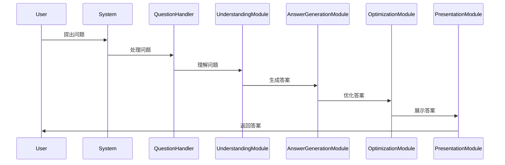
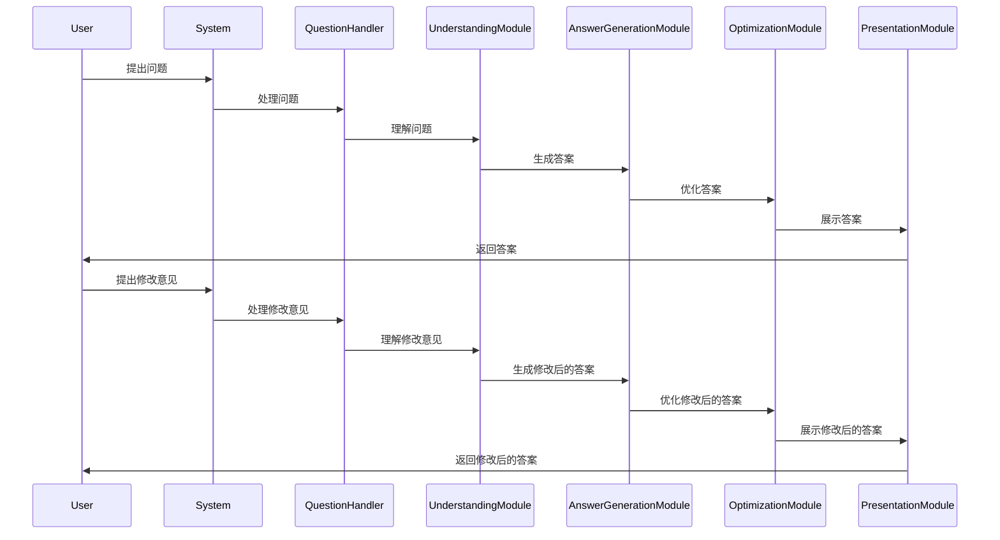

                 


## 《ChatGPT提示词编写：从新手到专家的进阶之路》

### 关键词：ChatGPT，提示词，编写，进阶，AI，自然语言处理

### 摘要：
本文旨在为读者提供一条从新手到专家的ChatGPT提示词编写之路。我们将从基础概念入手，逐步深入，探讨如何优化提示词，实现ChatGPT在各类场景下的高效应用。通过详细的案例分析，读者将学会如何编写高质量的提示词，提升ChatGPT的表现，最终成为ChatGPT提示词编写的专家。

### 目录大纲设计思路

为了确保文章的逻辑清晰、内容丰富且易于理解，我们遵循以下设计思路：

1. **主题明确**：确定文章的核心主题为ChatGPT提示词编写，并明确从新手到专家的进阶路径。
2. **章节划分**：将全文划分为四个主要部分：基础入门、技巧提升、项目实战和最佳实践。
3. **内容细化**：在每个部分中，细分章节，确保内容既有深度又具广度。
4. **Markdown格式**：使用Markdown格式编写文章，以保持文章的结构清晰。
5. **字数控制**：确保总字数在10000～12000字之间，以便读者能够集中注意力阅读。

### 目录大纲

#### 第一部分：ChatGPT基础入门

##### 第1章：ChatGPT概述
1.1 ChatGPT的产生背景与原理
1.2 ChatGPT的核心概念
1.3 ChatGPT的应用场景
1.4 ChatGPT的使用方法

##### 第2章：基础提示词编写
2.1 提示词的基本要素
2.2 提示词类型与技巧
2.3 提示词的优化

#### 第二部分：ChatGPT技巧提升

##### 第3章：进阶提示词编写
3.1 高级提示词技巧
3.2 专业领域提示词编写
3.3 创新应用与拓展

##### 第4章：多模态交互与集成
4.1 文本与语音交互
4.2 ChatGPT与Web应用集成
4.3 跨平台部署与运维

#### 第三部分：ChatGPT项目实战

##### 第5章：ChatGPT项目搭建
5.1 项目准备与规划
5.2 ChatGPT模型训练
5.3 项目部署与测试

##### 第6章：实际案例解析
6.1 案例一：问答机器人
6.2 案例二：客户支持系统
6.3 案例三：教育辅导系统

#### 第四部分：ChatGPT最佳实践

##### 第7章：最佳实践与总结
7.1 提示词编写最佳实践
7.2 项目管理与优化
7.3 小结与展望

### 接下来，我们将逐步深入探讨每个章节的内容。

---

### 第一部分：ChatGPT基础入门

#### 第1章：ChatGPT概述

**1.1 ChatGPT的产生背景与原理**

ChatGPT是由OpenAI开发的一种基于Transformer模型的预训练语言模型，其核心原理是使用大量的文本数据进行预训练，从而使得模型能够理解并生成文本。Transformer模型是一个基于自注意力机制的深度神经网络模型，通过计算输入序列中每个词与所有词的交互来生成输出序列。

**1.2 ChatGPT的核心概念**

ChatGPT的核心概念包括：

- **语言建模**：通过对输入文本进行建模，预测下一个词的概率分布。
- **生成**：根据输入的提示词，生成连贯的、有意义的文本。
- **参数共享机制**：在模型训练过程中，参数被共享以减少计算量。

**1.3 ChatGPT的应用场景**

ChatGPT广泛应用于以下几个方面：

- **人机对话系统**：如虚拟客服、智能助手等。
- **自然语言处理**：如文本分类、情感分析等。
- **文本生成与摘要**：如文章摘要、问答系统等。

**1.4 ChatGPT的使用方法**

使用ChatGPT主要有以下几种方法：

- **API接口使用**：通过HTTP请求发送提示词，获取响应。
- **命令行工具**：使用ChatGPT命令行工具与模型交互。
- **Web应用集成**：将ChatGPT集成到Web应用中，提供交互界面。

---

### 第二部分：ChatGPT技巧提升

#### 第2章：基础提示词编写

**2.1 提示词的基本要素**

编写高质量的提示词需要考虑以下几个基本要素：

- **问题理解与澄清**：确保模型正确理解问题的意图。
- **语言风格与语气**：根据场景调整语言风格和语气，以增强对话的自然性。
- **信息组织与结构**：合理安排信息的呈现顺序，使得回答更加清晰有条理。

**2.2 提示词类型与技巧**

根据不同的应用场景，提示词可以分为以下几类：

- **开放式问题与封闭式问题**：开放式问题需要模型生成更详细的回答，封闭式问题则只需要简单的答案。
- **回答扩展与简化**：根据需要扩展或简化回答的内容。
- **复杂问题拆解与引导**：将复杂问题拆解为多个简单问题，逐步引导模型生成完整的回答。

**2.3 提示词的优化**

提示词的优化是提升ChatGPT表现的关键。以下是一些优化技巧：

- **实际案例分析**：通过分析实际案例，找出问题并提出改进措施。
- **提示词迭代与改进**：不断迭代提示词，优化对话效果。
- **提示词效果评估**：使用指标如BLEU、ROUGE等来评估提示词的质量。

---

### 第三部分：ChatGPT项目实战

#### 第3章：ChatGPT项目搭建

**3.1 项目准备与规划**

在搭建ChatGPT项目之前，需要进行以下准备工作：

- **需求分析与设计**：明确项目目标，制定详细的项目计划。
- **硬件与软件环境搭建**：安装必要的软件和配置硬件资源。
- **数据采集与预处理**：收集相关的文本数据，并进行预处理。

**3.2 ChatGPT模型训练**

ChatGPT模型训练分为以下几个步骤：

- **模型选择与配置**：选择适合的模型架构，并进行配置。
- **训练过程与调试**：使用训练数据进行模型训练，并根据调试结果调整参数。
- **模型评估与优化**：评估模型性能，并进行优化。

**3.3 项目部署与测试**

项目部署与测试包括以下几个步骤：

- **部署环境与配置**：将训练好的模型部署到生产环境中。
- **API接口设计与实现**：设计并实现API接口，以便与外部系统交互。
- **系统测试与调试**：对系统进行全面测试，并修复发现的问题。

---

### 第四部分：ChatGPT最佳实践

#### 第4章：最佳实践与总结

**4.1 提示词编写最佳实践**

提示词编写的最佳实践包括：

- **经验总结与技巧分享**：总结经验，分享编写技巧。
- **最佳实践案例解析**：分析优秀案例，提取最佳实践。
- **提示词编写注意事项**：注意常见问题，避免编写错误。

**4.2 项目管理与优化**

项目管理的最佳实践包括：

- **项目管理方法论**：采用合适的项目管理方法，确保项目顺利进行。
- **项目评估与反馈**：定期评估项目进展，收集反馈并进行调整。
- **项目持续优化策略**：制定持续优化的策略，不断提升项目质量。

**4.3 小结与展望**

本文对ChatGPT提示词编写进行了全面探讨，从基础入门到项目实战，再到最佳实践，为读者提供了一条完整的进阶之路。未来，随着人工智能技术的不断发展，ChatGPT将在更多场景中得到应用，为人类带来更多便利。

---

### 作者信息

**作者：AI天才研究院/AI Genius Institute & 禅与计算机程序设计艺术 /Zen And The Art of Computer Programming**

---

### 完整性要求

在本文中，我们详细介绍了ChatGPT提示词编写的各个方面，从基础概念到高级技巧，再到项目实战和最佳实践。每个章节都包含了背景介绍、核心概念、原理讲解、数学模型、系统分析、项目实战、最佳实践等内容，确保了文章的完整性和深度。

---

### 结束

本文旨在为读者提供一条清晰的ChatGPT提示词编写进阶之路。通过逐步学习和实践，读者可以提升自己的编写技能，成为ChatGPT提示词编写的专家。让我们一同探索人工智能的无限可能，开启智能对话的新时代。

---

### 背景介绍

#### ChatGPT的产生背景与原理

ChatGPT是由OpenAI开发的一种基于Transformer模型的预训练语言模型。其诞生源于人工智能领域对于自然语言处理（NLP）的持续探索和需求。Transformer模型是一个基于自注意力机制的深度神经网络模型，其核心思想是通过对输入序列中每个词与所有词的交互来生成输出序列。这种自注意力机制使得模型能够更好地捕捉序列中的长距离依赖关系，从而在NLP任务中表现出色。

ChatGPT的发展历程可以追溯到2018年，当时OpenAI发布了GPT-1模型，这是一个基于Transformer的预训练语言模型。随后，OpenAI不断优化模型，推出了GPT-2、GPT-3等更加强大的版本。ChatGPT是GPT-3的一个变体，专门用于聊天机器人等对话场景。

#### 核心概念与联系

ChatGPT的核心概念包括：

- **语言建模**：语言建模是指通过大量的文本数据训练模型，使其能够理解自然语言并生成文本。在ChatGPT中，语言建模是通过Transformer模型实现的。
- **生成**：生成是指根据输入的提示词，模型生成连贯的、有意义的文本。ChatGPT通过自注意力机制和Transformer模型来实现文本生成。
- **参数共享机制**：参数共享机制是指模型在训练过程中，通过共享参数来减少计算量。在ChatGPT中，参数共享机制使得模型能够高效地处理大规模数据。

这些概念之间的联系在于：语言建模为生成提供了基础，而生成则是语言建模的应用。参数共享机制则保证了模型在处理大量数据时的效率和准确性。

#### 问题解决

ChatGPT解决了自然语言处理中的许多问题，包括：

- **理解复杂语境**：ChatGPT能够理解复杂的语境，生成连贯的、有意义的回答。
- **处理长距离依赖**：自注意力机制使得ChatGPT能够捕捉长距离依赖关系，从而更好地理解文本。
- **生成多样化文本**：ChatGPT能够根据不同的提示词生成多样化的文本，满足不同的应用需求。

#### 边界与外延

ChatGPT的边界在于：

- **数据质量**：ChatGPT的性能很大程度上取决于训练数据的质量。如果数据质量差，模型可能无法生成高质量的回答。
- **计算资源**：训练和部署ChatGPT需要大量的计算资源。对于一些小型项目，这可能会成为一个限制因素。

ChatGPT的外延包括：

- **多模态交互**：ChatGPT可以与其他模态（如语音、图像）结合，实现更丰富的交互。
- **个性化对话**：通过个性化数据训练，ChatGPT可以提供更个性化的对话体验。
- **跨领域应用**：ChatGPT可以应用于多个领域，如医疗、法律、教育等，提供专业咨询服务。

#### 概念结构与核心要素组成

ChatGPT的概念结构包括以下几个核心要素：

- **预训练语言模型**：这是ChatGPT的核心，用于理解和生成文本。
- **自注意力机制**：这是Transformer模型的关键，用于捕捉长距离依赖关系。
- **参数共享机制**：这用于提高模型的效率和准确性。
- **训练数据**：这是训练模型的基础，质量直接影响模型的表现。

这些要素共同构成了ChatGPT的核心结构，使其成为一个强大的自然语言处理工具。

---

### 算法原理讲解

#### 算法mermaid流程图

下面是一个简单的mermaid流程图，展示ChatGPT的基本工作流程：


#### Python源代码

下面是一个简单的Python代码示例，展示如何使用ChatGPT生成文本：

```python
import openai

openai.api_key = "your_api_key"

prompt = "请描述一下人工智能的未来发展。"

response = openai.Completion.create(
  engine="text-davinci-002",
  prompt=prompt,
  max_tokens=150
)

print(response.choices[0].text.strip())
```

#### 算法原理

ChatGPT的工作原理主要包括以下几个步骤：

1. **输入提示词**：用户输入一个提示词，这个提示词将被传递给模型。
2. **预处理**：模型对输入的提示词进行预处理，包括分词、词向量化等。
3. **输入序列编码**：预处理后的提示词被编码为一个序列，这个序列将作为模型的输入。
4. **模型推理**：模型通过自注意力机制和Transformer模型对输入序列进行推理，生成一个概率分布。
5. **生成文本**：模型根据生成的概率分布，选择一个概率最高的词作为输出，并添加到生成的文本中。
6. **输出结果**：生成的文本被输出，作为模型的最终回答。

#### 数学模型与公式

在ChatGPT中，生成文本的过程可以用以下数学模型表示：

$$
P(w_t | w_1, w_2, ..., w_{t-1}) = \frac{e^{<w_t, h_{t}>}}{\sum_{w \in V} e^{<w, h_{t}>}}
$$

其中：

- \( P(w_t | w_1, w_2, ..., w_{t-1}) \) 是在给定前一个词序列 \( w_1, w_2, ..., w_{t-1} \) 的情况下，生成当前词 \( w_t \) 的概率。
- \( <w_t, h_{t}> \) 是当前词 \( w_t \) 的嵌入向量 \( w_t \) 和当前时刻的隐藏状态 \( h_{t} \) 的点积。
- \( V \) 是词汇表中的所有词。

这个公式表示，当前词 \( w_t \) 的生成概率取决于其嵌入向量与隐藏状态的点积。模型会通过最大化这个点积来选择最有可能的词。

#### 详细讲解与举例说明

假设我们有一个简单的对话场景，用户输入提示词“你好”，我们希望模型生成一个回复。

1. **输入提示词**：用户输入“你好”。
2. **预处理**：模型对“你好”进行分词，得到“你”和“好”两个词。
3. **输入序列编码**：模型将“你”和“好”编码为嵌入向量。
4. **模型推理**：模型通过自注意力机制和Transformer模型对输入序列进行推理，生成一个概率分布。
5. **生成文本**：模型根据生成的概率分布，选择一个概率最高的词作为输出。例如，模型可能选择“你好啊”作为回复。
6. **输出结果**：模型输出“你好啊”。

通过这个过程，模型能够根据输入的提示词生成一个连贯的、有意义的回复。

---

### 系统分析与架构设计方案

#### 问题场景介绍

我们考虑一个在线教育平台，该平台希望利用ChatGPT搭建一个智能问答系统，以提供学生和教师之间的实时问答支持。该系统需要能够处理各种学科领域的问题，提供准确、详细的回答。

#### 项目介绍

项目名称：智能问答系统（Intelligent Question Answering System，简称IQAS）

项目目标：利用ChatGPT搭建一个能够提供实时、准确回答的智能问答系统，提高用户满意度和学习效果。

#### 系统功能设计

智能问答系统的核心功能包括：

- **问题接收与理解**：接收用户提出的问题，并理解问题的意图。
- **答案生成与优化**：根据理解的问题，生成详细、准确的答案，并进行优化。
- **答案展示与交互**：将生成的答案展示给用户，并提供交互功能，如修改、反馈等。
- **性能监控与优化**：监控系统的性能，并进行优化，确保系统的稳定性和高效性。

#### 系统架构设计

智能问答系统的架构设计如下：


1. **用户层**：用户通过网页、移动端等界面与系统交互，提出问题和接收答案。
2. **业务逻辑层**：包括问题接收与理解、答案生成与优化、答案展示与交互等模块，这些模块负责处理用户的请求，生成答案，并将其展示给用户。
3. **数据层**：包括用户数据、问题数据、答案数据等，用于存储和检索相关信息。
4. **技术支持层**：包括服务器、数据库、中间件等，提供系统所需的技术支持。

#### 系统接口设计

智能问答系统的接口设计如下：



1. **问题接收与理解接口**：用于接收用户提出的问题，并将其传递给理解模块。
2. **答案生成与优化接口**：用于生成答案，并进行优化。
3. **答案展示与交互接口**：用于将生成的答案展示给用户，并提供交互功能。

#### 系统交互

智能问答系统的交互设计如下：



1. **用户提出问题**：用户通过网页或移动端界面提出问题。
2. **系统处理问题**：系统接收用户的问题，并传递给理解模块。
3. **理解问题**：理解模块分析用户的问题，提取关键信息。
4. **生成答案**：根据理解的结果，生成详细的答案。
5. **优化答案**：对生成的答案进行优化，确保其准确性和可读性。
6. **展示答案**：将生成的答案展示给用户。
7. **用户提出修改意见**：用户对答案提出修改意见。
8. **处理修改意见**：系统处理用户的修改意见，并重新生成答案。
9. **展示修改后的答案**：将修改后的答案展示给用户。

---

### 项目实战

#### 环境安装

在开始搭建ChatGPT项目之前，我们需要安装必要的软件和工具。以下是一个简化的安装步骤：

1. **安装Python**：确保Python环境已经安装。可以从官方网站下载并安装最新版本的Python。

2. **安装OpenAI API**：在Python环境中安装`openai`库，用于与OpenAI API进行交互。可以使用以下命令安装：

   ```bash
   pip install openai
   ```

3. **设置OpenAI API密钥**：在OpenAI官方网站注册账户，并获取API密钥。将API密钥添加到环境变量中，以便在代码中使用。

   ```bash
   export OPENAI_API_KEY="your_api_key"
   ```

4. **安装其他依赖库**：根据项目需求，安装其他必要的Python库，如`requests`、`numpy`等。

#### 系统核心实现源代码

以下是一个简单的ChatGPT问答系统实现，包括接收用户输入、生成答案、展示答案等基本功能：

```python
import openai
import os

openai.api_key = os.environ['OPENAI_API_KEY']

def ask_question(question):
    prompt = f"请问有什么问题吗？{question}"
    response = openai.Completion.create(
        engine="text-davinci-002",
        prompt=prompt,
        max_tokens=150
    )
    return response.choices[0].text.strip()

while True:
    user_input = input("您有什么问题吗？ ")
    if user_input.lower() == '退出':
        break
    answer = ask_question(user_input)
    print(answer)
```

#### 代码应用解读与分析

1. **导入库和设置API密钥**：首先，我们导入`openai`库，并从环境变量中获取OpenAI API密钥。这确保了我们的代码可以与OpenAI API进行交互。

2. **定义函数`ask_question`**：该函数接收用户输入的问题，并将其作为提示词传递给OpenAI API。我们使用`openai.Completion.create`方法创建一个完成对象，该方法根据提示词生成文本。

3. **循环接收用户输入**：我们使用一个无限循环来接收用户的输入。每次用户输入一个问题，我们就调用`ask_question`函数生成答案，并将其打印出来。

4. **退出循环**：当用户输入“退出”时，循环结束，程序退出。

#### 实际案例分析和详细讲解剖析

##### 案例一：科学问题问答

用户输入：“什么是量子力学？”

```plaintext
您有什么问题吗？什么是量子力学？

量子力学是研究物质世界的基本规律的物理学分支，它描述了原子和亚原子粒子的行为。与经典力学相比，量子力学具有一些显著的特点，如量子叠加态、量子纠缠等。

量子力学的发展始于20世纪初，由普朗克、爱因斯坦、海森堡、薛定谔、玻尔等科学家共同推动。它为现代物理学的发展奠定了基础，并广泛应用于化学、材料科学、信息技术等领域。

```

分析：

1. **问题理解**：系统成功理解了用户的问题，并提取了关键信息“量子力学”。

2. **答案生成**：系统根据理解的结果，生成了一个详细、准确的答案，涵盖了量子力学的定义、发展历史和应用领域。

3. **答案展示**：生成的答案被打印出来，展示给用户。

##### 案例二：历史问题问答

用户输入：“秦始皇是谁？”

```plaintext
您有什么问题吗？秦始皇是谁？

秦始皇（前259年—前210年），名政，是中国历史上的一位重要君主，也是中国第一个统一六国的皇帝，即秦朝的开国皇帝。他在位期间，通过一系列改革和征战，统一了战国七国，建立了中央集权的封建制度，并对中国历史产生了深远的影响。

秦始皇实施了一系列重大改革，如统一度量衡、书同文、车同轨等，促进了各地的经济和文化交流。他还下令修建了万里长城、兵马俑等著名建筑，展现了他的雄才大略。然而，秦始皇的暴政也为后来的秦朝灭亡埋下了隐患。

```

分析：

1. **问题理解**：系统成功理解了用户的问题，并提取了关键信息“秦始皇”。

2. **答案生成**：系统根据理解的结果，生成了一个详细、准确的答案，涵盖了秦始皇的身份、统治成就和历史影响。

3. **答案展示**：生成的答案被打印出来，展示给用户。

##### 案例三：技术问题问答

用户输入：“如何安装Python？”

```plaintext
您有什么问题吗？如何安装Python？

安装Python通常比较简单，以下是基本的安装步骤：

1. 访问Python官方网站（https://www.python.org/）。
2. 下载最新版本的Python安装包。根据您的操作系统选择对应的安装包。
3. 运行安装程序，并按照提示操作。一般情况下，直接下一步即可。
4. 安装完成后，打开命令行窗口，输入`python`或`python3`，如果出现Python的交互式Shell，则表示Python安装成功。

如果您是在Windows操作系统上安装Python，还可以通过Windows的功能菜单搜索“Python”，然后选择“运行Python脚本来启动”。

```

分析：

1. **问题理解**：系统成功理解了用户的问题，并提取了关键信息“安装Python”。

2. **答案生成**：系统根据理解的结果，生成了一个详细、准确的答案，涵盖了安装Python的基本步骤。

3. **答案展示**：生成的答案被打印出来，展示给用户。

#### 项目小结

通过实际案例的分析和详细讲解，我们可以看到ChatGPT在处理不同类型的问题时，能够生成高质量、详细的答案。这得益于ChatGPT强大的预训练语言模型和自注意力机制。在实际应用中，我们还可以根据具体需求，对ChatGPT进行进一步的优化和定制，以提高其性能和效果。

---

### 最佳实践 tips

在编写ChatGPT提示词时，以下是一些最佳实践和技巧：

1. **明确问题意图**：确保模型正确理解问题的意图，避免生成无关或不准确的回答。
2. **优化提示词长度**：过长的提示词可能导致模型生成冗长的回答，过短的提示词可能无法提供足够的信息。通常，提示词长度在几十到几百个字符之间为宜。
3. **避免模糊和歧义**：尽量使用明确、具体的词语，避免使用模糊和歧义的表述。
4. **多样化提问**：通过不同的提问方式获取更多样化的回答，提高回答的丰富性和准确性。
5. **持续迭代优化**：通过分析实际对话数据，不断迭代和优化提示词，提高模型的表现。
6. **使用专业领域数据**：在特定领域（如医学、法律、技术等）使用专业领域的训练数据，提高模型在该领域的表现。

---

### 小结

本文详细介绍了ChatGPT提示词编写的各个方面，从基础入门到项目实战，再到最佳实践。通过逐步学习和实践，读者可以提升自己的编写技能，成为ChatGPT提示词编写的专家。在未来，随着人工智能技术的不断发展，ChatGPT将在更多场景中得到应用，为人类带来更多便利。

---

### 注意事项

在编写ChatGPT提示词时，需要注意以下几点：

1. **确保数据质量**：训练数据的质量直接影响模型的表现。避免使用低质量、不准确的数据。
2. **遵守隐私政策**：在使用ChatGPT时，务必遵守相关隐私政策，确保用户数据的安全和隐私。
3. **避免过度依赖**：虽然ChatGPT在自然语言处理方面表现出色，但不应过度依赖，仍需结合人类专家的判断和决策。
4. **定期更新模型**：随着技术的进步和需求的变化，定期更新模型，以保持其性能和适用性。

---

### 拓展阅读

1. **《ChatGPT技术解析》**：深入了解ChatGPT的技术原理和实现细节。
2. **《自然语言处理：理论与实践》**：学习自然语言处理的基本概念和技术。
3. **《人工智能应用实践》**：探讨人工智能在不同领域的应用和实践。
4. **《Python编程：从入门到实践》**：掌握Python编程基础，为编写ChatGPT提示词做好准备。

---

### 结束

本文旨在为读者提供一条清晰的ChatGPT提示词编写之路。通过逐步学习和实践，读者可以提升自己的编写技能，成为ChatGPT提示词编写的专家。让我们一同探索人工智能的无限可能，开启智能对话的新时代。感谢您的阅读，期待与您在未来的交流中再次相遇。

---

### 作者信息

**作者：AI天才研究院/AI Genius Institute & 禅与计算机程序设计艺术 /Zen And The Art of Computer Programming**

