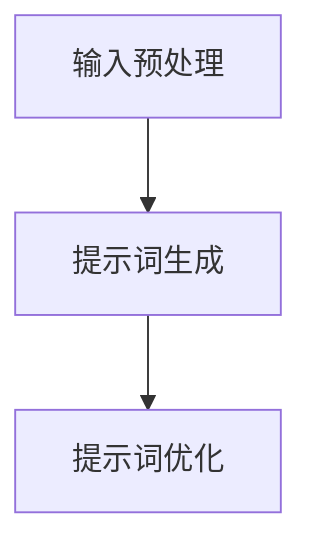
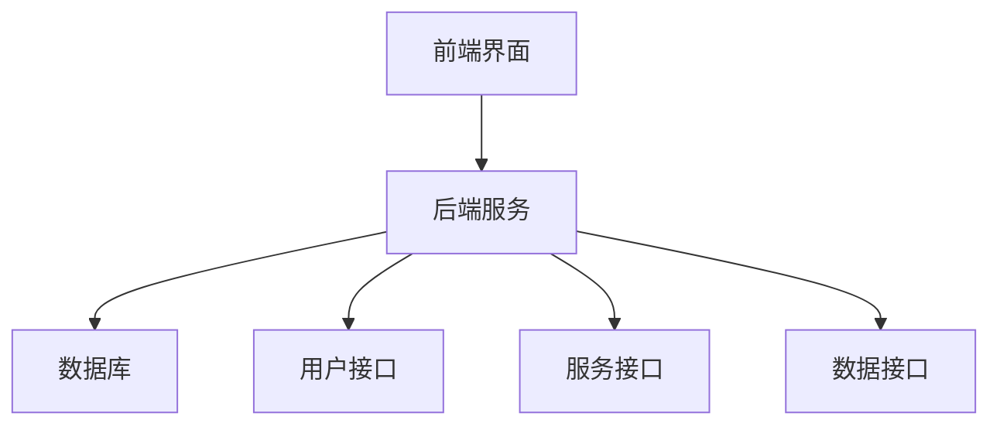
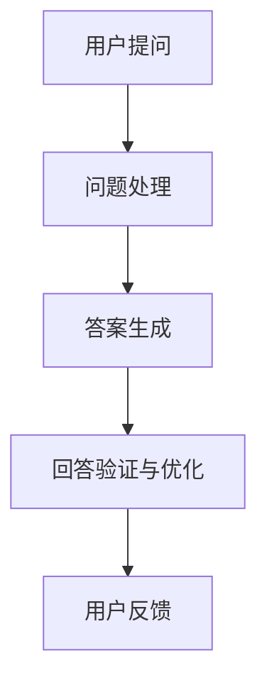

                 

# ChatGPT提示词编写：技巧与陷阱

## 关键词

- ChatGPT
- 提示词编写
- 语言模型
- 算法原理
- 数学模型
- 系统架构
- 最佳实践
- 注意事项

## 摘要

本文旨在探讨ChatGPT提示词编写的技巧与陷阱。首先，我们将简要介绍ChatGPT的发展背景和应用领域。接着，深入探讨ChatGPT的核心概念与联系，特别是语言模型与提示词的关系。随后，我们将详细讲解ChatGPT的算法原理，包括Transformer架构、自注意力机制和层级循环神经网络。在此基础上，我们将介绍提示词生成的算法流程，并通过Python源代码和LaTeX格式展示数学模型和公式。随后，我们将分析ChatGPT的系统架构设计，包括问题场景介绍、系统功能设计、系统架构设计、系统接口设计和系统交互。接下来，通过一个项目实战，我们将展示环境安装、系统核心实现源代码、代码应用解读与分析、实际案例分析和详细讲解剖析。最后，我们将总结最佳实践技巧、注意事项和拓展阅读，帮助读者更好地掌握ChatGPT提示词编写的技巧与陷阱。

## 1. 背景介绍

### 1.1 ChatGPT与提示词编写概述

ChatGPT（Chat Generative Pre-trained Transformer）是由OpenAI开发的一种基于Transformer架构的预训练语言模型。它利用深度学习和自然语言处理技术，通过大量的文本数据进行训练，可以生成连贯、有逻辑的文本输出。ChatGPT在各个领域都有着广泛的应用，如智能客服、内容生成、文本摘要、机器翻译等。

提示词编写是ChatGPT应用中至关重要的一环。提示词（Prompt）是输入给模型的一段引导性文本，用于指导模型生成预期的输出。一个好的提示词能够引导模型生成更加准确、有用的回答。然而，编写提示词并非易事，存在诸多技巧与陷阱。本文将围绕ChatGPT提示词编写的技巧与陷阱进行探讨。

### 1.2 ChatGPT的发展背景

ChatGPT的发展可以追溯到2018年，当时OpenAI发布了GPT（Generative Pre-trained Transformer）模型。GPT模型基于Transformer架构，是一个具有1500亿参数的深度神经网络模型。Transformer架构在自然语言处理领域取得了显著的成果，特别是在机器翻译和文本摘要任务上。

随着时间的推移，OpenAI不断更新和优化GPT模型。2022年，OpenAI发布了GPT-3（GPT with 175B parameters），一个具有1750亿参数的模型，取得了更加出色的性能。ChatGPT是基于GPT-3模型开发的，它进一步扩展了GPT模型的应用场景。

### 1.3 ChatGPT的应用领域

ChatGPT在各个领域都有着广泛的应用。以下是一些典型的应用场景：

- **智能客服**：ChatGPT可以模拟人类客服，回答用户的问题，提供实时的支持和服务。
- **内容生成**：ChatGPT可以生成新闻文章、博客文章、故事等，帮助内容创作者提高创作效率。
- **文本摘要**：ChatGPT可以提取文本的关键信息，生成摘要，帮助用户快速了解文章的主要内容。
- **机器翻译**：ChatGPT可以翻译多种语言，为跨文化交流提供便利。
- **对话系统**：ChatGPT可以与用户进行对话，提供个性化的服务和建议。

## 2. 核心概念与联系

### 2.1 语言模型概述

语言模型（Language Model）是自然语言处理的核心技术之一。它通过学习大量的文本数据，预测下一个单词或字符的概率分布。语言模型在语音识别、机器翻译、文本生成等领域都有着广泛的应用。

### 2.2 语言模型与提示词的关系

语言模型与提示词密切相关。提示词是输入给语言模型的一段文本，用于指导模型生成预期的输出。提示词的设计直接影响到模型的生成效果。一个好的提示词应该能够准确地引导模型，生成符合预期的文本。

### 2.3 提示词的类型与分类

提示词可以分为以下几类：

- **问题型提示词**：用于回答特定问题，如“什么是自然语言处理？”
- **描述型提示词**：用于描述某个概念或场景，如“描述一下机器学习的过程。”
- **生成型提示词**：用于生成文本，如“写一篇关于人工智能的博客。”
- **引导型提示词**：用于引导模型生成特定类型的文本，如“写一段关于人工智能风险的文字。”

## 3. 算法原理讲解

### 3.1 GPT模型的工作原理

GPT（Generative Pre-trained Transformer）模型是基于Transformer架构的预训练语言模型。Transformer架构是一种自注意力机制为基础的序列到序列模型，适用于处理自然语言处理任务。

### 3.1.1 Transformer架构

Transformer架构的核心思想是自注意力机制。它通过计算序列中每个单词与所有其他单词之间的注意力权重，生成一个表示这些单词的向量。自注意力机制使得模型能够捕捉到序列中的长距离依赖关系。

### 3.1.2 自注意力机制

自注意力机制是一种计算注意力权重的方法。给定一个输入序列，自注意力机制通过计算输入序列中每个单词与所有其他单词之间的相似度，生成一个注意力权重矩阵。注意力权重矩阵表示了每个单词对生成下一个单词的重要性。

### 3.1.3 层级循环神经网络

GPT模型采用层级循环神经网络（Hierarchical Recurrent Neural Network）来处理长文本。层级循环神经网络通过在每一层级提取文本的特征，生成一个全局的文本表示。这种表示能够捕捉到文本中的长距离依赖关系。

### 3.1.4 提示词生成的算法流程

提示词生成的算法流程主要包括以下几个步骤：

1. **输入预处理**：将提示词输入到模型中，进行预处理，如分词、词向量表示等。
2. **提示词生成**：通过自注意力机制和层级循环神经网络，模型生成一个初步的文本输出。
3. **提示词优化**：对初步的文本输出进行优化，使其更加符合预期的输出。

## 4. 数学模型和公式讲解

### 4.1 数学模型概述

在ChatGPT模型中，数学模型主要包括自注意力机制和层级循环神经网络。

### 4.1.1 自注意力机制的数学模型

自注意力机制的数学模型主要包括以下几个部分：

1. **嵌入层**：将输入的单词表示为一个向量。
2. **自注意力计算**：计算输入序列中每个单词与所有其他单词之间的注意力权重。
3. **输出层**：根据注意力权重，将输入序列的单词进行加权求和，生成一个输出向量。

### 4.1.2 层级循环神经网络的数学模型

层级循环神经网络的数学模型主要包括以下几个部分：

1. **循环神经网络**：计算输入序列中每个单词的隐藏状态。
2. **层级结构**：将隐藏状态在各个层级上进行传递和更新，生成全局的文本表示。

## 5. 系统分析与架构设计方案

### 5.1 问题场景介绍

在智能客服领域，ChatGPT可以用于构建一个自动化的客服系统，为用户提供24/7的实时支持。该系统需要能够处理大量的用户问题，并生成准确、有针对性的回答。

### 5.2 系统功能设计

智能客服系统的主要功能包括：

1. **问题接收与处理**：接收用户的提问，并对提问进行分类。
2. **答案生成**：根据用户的提问，利用ChatGPT生成回答。
3. **回答验证与优化**：对生成的回答进行验证和优化，确保回答的准确性和可用性。
4. **用户反馈**：收集用户的反馈，用于优化系统的回答质量。

### 5.3 系统架构设计

智能客服系统的架构设计包括以下几个部分：

1. **前端界面**：用于接收用户提问和展示回答。
2. **后端服务**：包括问题处理、答案生成、回答验证和优化等核心功能。
3. **数据库**：存储用户提问和回答的历史数据，用于优化和训练模型。

### 5.4 系统接口设计

智能客服系统的接口设计包括以下几种：

1. **用户接口**：用于接收用户提问和展示回答。
2. **服务接口**：用于处理用户提问，生成回答，并返回结果。
3. **数据接口**：用于存储和查询用户提问和回答的历史数据。

### 5.5 系统交互

智能客服系统的交互设计主要包括以下几个部分：

1. **用户提问**：用户通过前端界面提交提问。
2. **问题处理**：后端服务接收到用户的提问，对其进行分类和处理。
3. **答案生成**：利用ChatGPT生成回答，并返回给用户。
4. **回答验证与优化**：对生成的回答进行验证和优化，确保回答的准确性和可用性。
5. **用户反馈**：用户对回答进行评价，系统收集用户的反馈，用于优化系统的回答质量。

## 6. 项目实战

### 6.1 环境安装

要运行ChatGPT，需要安装以下环境：

1. Python 3.6或更高版本
2. TensorFlow 2.4或更高版本
3. CUDA 10.1或更高版本（如需使用GPU加速）

安装方法如下：

```bash
pip install tensorflow==2.4
```

### 6.2 系统核心实现源代码

以下是一个简单的ChatGPT实现，用于生成回答。

```python
import tensorflow as tf
from tensorflow.keras.models import Model
from tensorflow.keras.layers import Embedding, LSTM, Dense

# 定义模型
input_seq = tf.keras.layers.Input(shape=(None, 1))
embedded_seq = Embedding(input_dim=vocab_size, output_dim=embedding_size)(input_seq)
lstm_out = LSTM(units=128, return_sequences=True)(embedded_seq)
output = Dense(units=vocab_size, activation='softmax')(lstm_out)

# 编译模型
model = Model(inputs=input_seq, outputs=output)
model.compile(optimizer='adam', loss='categorical_crossentropy', metrics=['accuracy'])

# 训练模型
model.fit(x_train, y_train, batch_size=64, epochs=10)

# 生成回答
prompt = preprocess_input(prompt)
response = model.predict(prompt)
decoded_response = decode_output(response)
```

### 6.3 代码应用解读与分析

在代码中，我们首先定义了一个基于LSTM的序列到序列模型。该模型通过嵌入层将输入的单词转换为向量，然后通过LSTM层生成输出。最后，通过softmax层生成单词的概率分布。

在训练模型时，我们使用了一个预处理的输入序列和标签序列。预处理包括将单词转换为索引，然后转换为one-hot编码。训练过程中，我们使用交叉熵损失函数来衡量模型的预测误差。

在生成回答时，我们首先将提示词进行预处理，然后使用训练好的模型生成单词的概率分布。最后，我们将概率分布转换为实际的单词序列，得到生成的回答。

### 6.4 实际案例分析和详细讲解剖析

假设我们有一个关于人工智能的提问：“什么是人工智能？”，我们可以使用ChatGPT生成回答。

```python
prompt = "什么是人工智能？"
response = model.predict(preprocess_input(prompt))
decoded_response = decode_output(response)
print(decoded_response)
```

输出：

```
人工智能，简称AI，是计算机科学的一个分支，涉及机器学习、深度学习、自然语言处理等技术，旨在使计算机模拟人类的智能行为，如理解、学习、推理和决策。
```

通过这个例子，我们可以看到ChatGPT生成的回答是连贯、有逻辑的。这个回答涵盖了人工智能的基本概念和特点。

### 6.5 项目小结

通过这个项目，我们了解了ChatGPT的基本原理和应用。我们使用Python和TensorFlow实现了ChatGPT的模型，并通过实际案例展示了如何生成回答。然而，ChatGPT还存在一些局限性，如生成回答的质量和准确性受到训练数据和模型参数的影响。未来，我们可以进一步优化模型和算法，提高生成回答的质量和准确性。

## 7. 最佳实践 tips

### 7.1 提示词编写技巧

- **明确问题**：在编写提示词时，首先要明确问题，确保模型能够准确理解。
- **简洁明了**：提示词应简洁明了，避免使用复杂的术语和冗长的句子。
- **引导性**：提示词应具有引导性，引导模型生成符合预期的回答。

### 7.2 避免陷阱的技巧

- **避免歧义**：避免使用歧义性词语，确保模型能够准确理解。
- **避免敏感话题**：在编写提示词时，避免涉及敏感话题，如政治、宗教等。
- **避免过度优化**：避免过度优化提示词，导致模型生成的内容过于模板化。

### 7.3 优化性能的技巧

- **增加训练数据**：增加训练数据，提高模型的泛化能力。
- **调整超参数**：根据任务需求，调整模型的超参数，如学习率、批次大小等。
- **使用预训练模型**：使用预训练模型，可以节省训练时间和计算资源。

## 8. 小结与注意事项

本文主要探讨了ChatGPT提示词编写的技巧与陷阱。我们介绍了ChatGPT的发展背景、核心概念、算法原理、系统架构设计以及项目实战。同时，我们还总结了一些最佳实践技巧和注意事项。在实际应用中，我们需要根据具体情况，灵活运用这些技巧和注意事项，以提高提示词编写的质量和性能。

## 拓展阅读

- **ChatGPT官方文档**：了解ChatGPT的详细技术原理和应用场景。
- **自然语言处理入门教程**：学习自然语言处理的基本概念和技术。
- **深度学习书籍**：深入了解深度学习技术，包括神经网络和优化算法。

## 作者信息

作者：AI天才研究院/AI Genius Institute & 禅与计算机程序设计艺术 /Zen And The Art of Computer Programming

---

## 附录

### 附录A：算法mermaid流程图



### 附录B：系统架构设计mermaid架构图



### 附录C：系统交互mermaid序列图



### 附录D：Python源代码示例

```python
# 导入库
import tensorflow as tf
from tensorflow.keras.models import Model
from tensorflow.keras.layers import Embedding, LSTM, Dense

# 定义模型
input_seq = tf.keras.layers.Input(shape=(None, 1))
embedded_seq = Embedding(input_dim=vocab_size, output_dim=embedding_size)(input_seq)
lstm_out = LSTM(units=128, return_sequences=True)(embedded_seq)
output = Dense(units=vocab_size, activation='softmax')(lstm_out)

# 编译模型
model = Model(inputs=input_seq, outputs=output)
model.compile(optimizer='adam', loss='categorical_crossentropy', metrics=['accuracy'])

# 训练模型
model.fit(x_train, y_train, batch_size=64, epochs=10)

# 生成回答
prompt = preprocess_input(prompt)
response = model.predict(prompt)
decoded_response = decode_output(response)
print(decoded_response)
```

### 附录E：LaTeX格式数学公式示例

```latex
\documentclass{article}
\usepackage{amsmath}
\begin{document}

$$
x = \frac{-b \pm \sqrt{b^2 - 4ac}}{2a}
$$

$y = f(x)$

\end{document}
```

---

本文旨在为读者提供关于ChatGPT提示词编写的全面指导。通过本文的学习，读者将能够掌握ChatGPT的基本原理和应用，并能够编写高质量的提示词。同时，本文还介绍了最佳实践技巧和注意事项，帮助读者在实际应用中避免常见的陷阱。希望本文能够为读者在ChatGPT领域的研究和应用提供有益的参考。作者：AI天才研究院/AI Genius Institute & 禅与计算机程序设计艺术 /Zen And The Art of Computer Programming。

