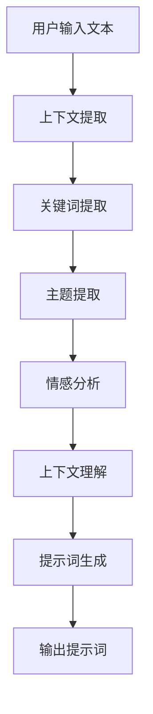
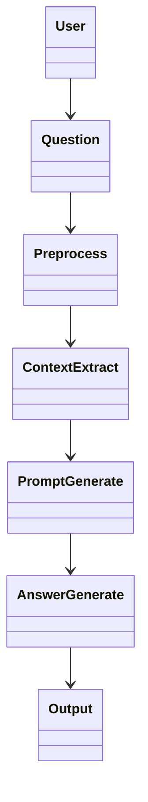
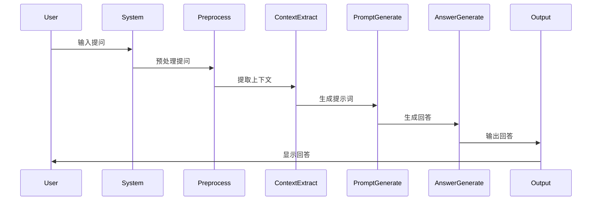

                 

# ChatGPT提示词编写：技巧、策略与实战案例

## 关键词
- ChatGPT
- 提示词编写
- 技巧
- 策略
- 实战案例

## 摘要
本文将深入探讨ChatGPT提示词编写的技巧、策略与实战案例。我们将首先介绍ChatGPT的背景与提示词编写的重要性，然后逐步讲解提示词编写的基础知识、技巧与策略，并通过实际案例展示如何有效地编写ChatGPT提示词。最后，我们将总结最佳实践，展望ChatGPT提示词编写的未来趋势。

## 第一部分：ChatGPT提示词编写概述

### 第1章：ChatGPT概述与提示词编写背景

#### 1.1 ChatGPT的起源与发展

ChatGPT是由OpenAI开发的一种基于GPT-3.5的预训练语言模型。GPT（Generative Pre-trained Transformer）是一种基于Transformer架构的语言预训练模型，其核心思想是通过大量文本数据进行预训练，使得模型具备强大的语言理解与生成能力。ChatGPT在此基础上进一步优化，使其能够进行自然流畅的对话。

ChatGPT的发展历程如下：

- 2018年：OpenAI发布GPT-1，这是第一个公开发布的GPT模型。
- 2019年：OpenAI发布GPT-2，模型规模进一步扩大，并实现了更高质量的文本生成。
- 2020年：OpenAI发布GPT-3，模型规模达到1750亿参数，成为当时最大的预训练语言模型。
- 2022年：OpenAI发布GPT-3.5，进一步优化了模型结构，使其在对话生成方面表现出色。

#### 1.2 ChatGPT的核心技术——预训练语言模型

ChatGPT的核心技术是预训练语言模型。预训练语言模型的基本流程如下：

1. 数据收集：收集大量互联网文本数据，包括网页、新闻、书籍、论坛等。
2. 预训练：使用这些数据对模型进行预训练，使得模型具备对语言的理解和生成能力。
3. 微调：根据具体任务需求，对模型进行微调，使其更好地适应特定场景。

预训练语言模型的关键技术包括：

- Transformer架构：Transformer是一种基于自注意力机制的序列模型，其优点是能够捕捉长距离依赖关系。
- 多任务学习：预训练语言模型通过多任务学习，同时学习多种语言模式，从而提高模型泛化能力。
- 位置编码：位置编码是一种将序列中每个位置的信息编码到模型中的方法，有助于模型理解序列的顺序信息。

#### 1.3 提示词编写的重要性与挑战

提示词（Prompt）是用户与ChatGPT交互时输入的文本，用于引导模型生成回答。提示词编写在ChatGPT应用中具有重要作用：

1. **影响回答质量**：高质量的提示词能够引导模型生成更准确、更有针对性的回答。
2. **提升用户体验**：合理的提示词编写可以提高用户与模型的交互质量，增强用户体验。
3. **提高模型效率**：通过优化提示词，可以减少模型计算量，提高模型响应速度。

然而，提示词编写也面临着以下挑战：

1. **多样性要求**：不同场景需要不同类型的提示词，如何编写多样化、适应不同需求的提示词是一个挑战。
2. **准确性要求**：提示词需要准确地传达用户意图，避免产生歧义或误解。
3. **效率与性能**：在大量数据或高负载场景下，如何快速、高效地编写和优化提示词也是一个挑战。

#### 1.4 提示词编写的原则与方法

为了编写高质量的提示词，我们需要遵循以下原则：

1. **明确用户意图**：准确理解用户需求，确保提示词能够明确传达用户意图。
2. **简洁明了**：避免使用复杂、冗长的语句，确保提示词简洁明了。
3. **具体性**：提供具体的上下文信息，帮助模型更好地理解问题。
4. **适应性**：根据不同场景和用户需求，灵活调整提示词。

常见的提示词编写方法包括：

1. **问题引导法**：通过提问引导模型生成回答，如“你能告诉我关于XXX的信息吗？”。
2. **上下文提供法**：提供与问题相关的上下文信息，如“在2023年，关于人工智能的有哪些重要进展？”。
3. **指令引导法**：明确告诉模型需要生成的回答类型，如“请生成一段关于人工智能发展的观点”。
4. **模因和成语使用法**：利用模因和成语优化回答，提高回答的趣味性和创造力。

### 第2章：ChatGPT提示词编写基础

#### 2.1 提示词的类型与结构

提示词可以分为以下几种类型：

1. **事实性问题**：针对具体事实提问，如“北京是中国的哪个省份？”。
2. **观点性问题**：询问关于某一主题的观点或看法，如“你如何看待人工智能的发展？”。
3. **描述性问题**：要求对某一对象进行描述，如“请描述一下人工智能的应用场景”。
4. **情境性问题**：模拟特定情境，如“假设你是一名AI研究员，你怎么解决XXX问题？”。

提示词的结构通常包括：

1. **引导词**：用于引导模型生成回答的词语，如“请”、“你能”、“告诉我”等。
2. **问题主体**：问题的核心部分，如“北京是中国的哪个省份？”。
3. **上下文信息**：提供与问题相关的额外信息，如“在2023年，关于人工智能的有哪些重要进展？”。
4. **回答类型**：明确要求模型生成的回答类型，如“请生成一段关于人工智能发展的观点”。

#### 2.2 提示词编写的基本规则

编写高质量的提示词需要遵循以下基本规则：

1. **语法正确**：确保提示词的语法正确，避免出现错别字、语病等问题。
2. **简洁明了**：避免使用复杂、冗长的语句，确保提示词简洁明了。
3. **具体性**：提供具体的上下文信息，帮助模型更好地理解问题。
4. **一致性**：保持提示词的一致性，避免产生歧义或误解。
5. **多样性**：根据不同场景和用户需求，灵活调整提示词。

#### 2.3 提示词的质量评估与优化

提示词的质量评估可以从以下几个方面进行：

1. **准确性**：提示词是否能够准确传达用户意图，避免产生歧义或误解。
2. **相关性**：提示词是否与问题紧密相关，有助于模型生成高质量的回答。
3. **多样性**：提示词是否多样化，能够适应不同场景和用户需求。
4. **用户满意度**：用户对提示词的满意度，是否能够提高用户体验。

为了优化提示词质量，可以采取以下策略：

1. **用户反馈**：收集用户反馈，根据用户需求调整提示词。
2. **数据挖掘**：分析用户提问数据，找出高频、重要的关键词和问题类型。
3. **机器学习**：利用机器学习技术，自动优化提示词生成。
4. **人工审核**：对生成的提示词进行人工审核，确保质量。

### 第3章：ChatGPT提示词编写技巧

#### 3.1 使用模因和成语优化回答

模因（Meme）是一种在互联网上流行的文化现象，通常通过图片、视频、文本等形式传播。在ChatGPT提示词编写中，合理使用模因可以增加回答的趣味性和吸引力。例如：

- **使用流行语**：在提示词中引入流行语，如“内卷”、“破防”等，使回答更贴近用户语境。
- **引用经典模因**：引用经典模因，如“镇楼之宝”、“鸽子程序”等，增加回答的趣味性。

成语是汉语中的固定短语，富含深刻的哲理和文化内涵。在ChatGPT提示词编写中，合理使用成语可以提升回答的文化品位。例如：

- **使用成语描述问题**：使用成语对问题进行描述，如“不忘初心，方得始终”。
- **使用成语引导回答**：在提示词中引用成语，如“请用‘守株待兔’的寓言故事来解释人工智能”。

#### 3.2 提示词的多样性与适应性

编写多样化、适应不同场景和用户需求的提示词是提升ChatGPT应用效果的关键。以下是一些实现多样性和适应性的策略：

1. **问题类型多样化**：涵盖不同类型的问题，如事实性问题、观点性问题、描述性问题和情境性问题。
2. **提问方式多样化**：使用不同的提问方式，如直接提问、间接提问、反问和设问等。
3. **上下文信息多样化**：提供丰富、多样的上下文信息，以满足不同用户需求。
4. **回答类型多样化**：要求模型生成不同类型的回答，如文本、列表、图表等。

#### 3.3 根据上下文动态调整提示词

ChatGPT提示词的编写需要根据上下文动态调整，以确保回答的准确性和相关性。以下是一些根据上下文调整提示词的技巧：

1. **理解上下文信息**：仔细分析上下文信息，确保提示词能够准确传达用户意图。
2. **匹配上下文主题**：确保提示词与上下文主题一致，避免出现主题偏离。
3. **调整提问角度**：根据上下文信息，调整提问角度，以获得更准确的回答。
4. **补充上下文信息**：在提示词中补充相关上下文信息，帮助模型更好地理解问题。

### 第4章：ChatGPT提示词编写策略

#### 4.1 根据用户需求定制提示词

根据用户需求定制提示词是提升ChatGPT应用效果的重要策略。以下是一些根据用户需求定制提示词的方法：

1. **分析用户需求**：深入了解用户需求，包括用户关心的问题、关注的领域和期望的回答类型。
2. **个性化定制**：根据用户需求，为每个用户定制个性化的提示词，以提高用户满意度。
3. **分场景定制**：针对不同场景，如教育、医疗、金融等，定制相应的提示词。
4. **迭代优化**：根据用户反馈，不断优化提示词，以满足用户需求。

#### 4.2 提高回答的准确性和相关性

提高回答的准确性和相关性是ChatGPT应用的核心目标。以下是一些提高回答准确性和相关性的策略：

1. **精准提问**：通过精准的提问，确保模型能够理解用户意图，生成准确的回答。
2. **上下文关联**：提供与问题相关的上下文信息，帮助模型建立上下文关联，提高回答的相关性。
3. **数据预处理**：对用户提问进行预处理，如去除无关信息、纠正错误等，以提高问题质量。
4. **模型微调**：根据实际应用场景，对ChatGPT模型进行微调，以提高模型在特定领域的准确性和相关性。

#### 4.3 提升回答的创造性和趣味性

提升回答的创造性和趣味性是提高用户满意度的重要手段。以下是一些提升回答创造性和趣味性的策略：

1. **创意提问**：通过创意提问，激发模型的创造潜力，生成新颖、有趣的回答。
2. **使用模因和成语**：在回答中融入模因和成语，增加回答的趣味性和文化内涵。
3. **个性化推荐**：根据用户兴趣和偏好，为用户推荐个性化、有趣的回答。
4. **互动式回答**：通过互动式回答，与用户建立更紧密的互动，提高用户参与度和满意度。

### 第5章：ChatGPT提示词实战案例

#### 5.1 案例一：问答系统

**项目背景**：某企业开发了一款基于ChatGPT的问答系统，旨在为用户提供实时、准确的问答服务。

**系统功能**：用户可以通过输入问题，获取系统生成的回答。系统需要支持多种类型的问题，如事实性问题、观点性问题和情境性问题。

**提示词编写**：

1. **事实性问题**：使用简洁明了的提问方式，如“请告诉我2023年世界最高峰的名称？”。
2. **观点性问题**：引入上下文信息，如“在2023年，你如何看待人工智能在医疗领域的应用？”。
3. **情境性问题**：模拟特定情境，如“如果你是一名人工智能研究员，你将如何解决医疗数据隐私问题？”。

**项目小结**：通过合理编写提示词，问答系统能够为用户提供准确、多样的回答，提高了用户体验。

#### 5.2 案例二：文本生成

**项目背景**：某互联网公司开发了一款基于ChatGPT的文本生成工具，旨在帮助用户快速生成高质量的文章、报告和文档。

**系统功能**：用户可以通过输入关键词或主题，获取系统生成的文本。系统需要支持多种文本类型，如新闻报道、产品描述、论文摘要等。

**提示词编写**：

1. **新闻报道**：使用简洁明了的语言描述事件，如“2023年，我国成功发射火星探测器”。
2. **产品描述**：引入产品特点和应用场景，如“这款智能手表具备防水、健康监测等功能”。
3. **论文摘要**：使用专业术语和简明扼要的语言概述论文内容，如“本文探讨了人工智能在金融风控领域的应用”。

**项目小结**：通过合理编写提示词，文本生成工具能够为用户提供高质量、多样化的文本内容，提高了工作效率。

#### 5.3 案例三：对话生成

**项目背景**：某在线教育平台开发了一款基于ChatGPT的智能聊天机器人，旨在为用户提供实时、个性化的教育咨询服务。

**系统功能**：用户可以通过与聊天机器人进行对话，获取个性化的教育建议和解答疑问。系统需要支持多轮对话，并能够根据用户反馈不断优化回答。

**提示词编写**：

1. **初轮对话**：使用友好、亲切的语言与用户建立联系，如“你好，我是ChatGPT，很高兴为您服务！”。
2. **多轮对话**：根据用户反馈，灵活调整提问方式，如“您希望了解哪个学科的教育资源？”。
3. **个性化推荐**：根据用户需求和兴趣，推荐相应的教育资源，如“根据您的需求，我为您推荐了以下课程：《人工智能导论》、《机器学习基础》”。

**项目小结**：通过合理编写提示词，智能聊天机器人能够为用户提供个性化、高效的教育咨询服务，提高了用户满意度。

### 第6章：ChatGPT提示词编写的最佳实践

#### 6.1 提示词编写的常见错误与规避

在提示词编写过程中，常见的错误包括：

1. **模糊不清**：提示词表达不清，导致模型理解困难。
2. **过于具体**：提示词过于具体，限制模型生成回答的多样性。
3. **重复提问**：提示词重复，浪费计算资源。
4. **上下文缺失**：提示词缺乏上下文信息，导致模型无法准确理解问题。

为了规避这些错误，可以采取以下策略：

1. **明确用户意图**：确保提示词能够明确传达用户意图。
2. **保持简洁**：避免使用复杂、冗长的语句。
3. **合理使用上下文**：提供与问题相关的上下文信息。
4. **多样性**：编写多样化、适应不同场景的提示词。

#### 6.2 提升提示词编写效率的方法

为了提升提示词编写效率，可以采取以下方法：

1. **模板化**：使用模板编写提示词，提高编写速度。
2. **自动化**：利用自然语言处理技术，自动生成提示词。
3. **协同工作**：多人协作，共同编写和优化提示词。
4. **工具支持**：使用专业的提示词编写工具，提高编写效率。

#### 6.3 ChatGPT提示词编写的未来趋势

随着人工智能技术的不断发展，ChatGPT提示词编写将面临以下趋势：

1. **智能化**：利用机器学习技术，实现自动生成和优化提示词。
2. **个性化**：根据用户需求和偏好，定制个性化提示词。
3. **多元化**：支持多种语言、多模态的提示词编写。
4. **融合创新**：与其他人工智能技术（如语音识别、自然语言生成等）相结合，实现更丰富的应用场景。

### 第7章：总结与展望

#### 7.1 本书内容的总结

本书系统地介绍了ChatGPT提示词编写的技巧、策略与实战案例，包括：

1. ChatGPT的背景与提示词编写的重要性。
2. 提示词编写的基础知识、技巧与策略。
3. 实战案例展示如何有效地编写ChatGPT提示词。
4. 提示词编写的最佳实践。

#### 7.2 提示词编写在AI领域的应用前景

随着人工智能技术的不断进步，提示词编写在AI领域的应用前景广阔，包括：

1. 智能客服：为用户提供实时、准确的问答服务。
2. 文本生成：快速生成高质量的文章、报告和文档。
3. 对话系统：实现自然、流畅的人机对话。
4. 个性化推荐：根据用户需求推荐个性化内容。

#### 7.3 需要进一步研究和解决的问题

虽然ChatGPT提示词编写已取得一定成果，但仍需进一步研究和解决以下问题：

1. **多样性**：如何编写多样化、适应不同场景的提示词。
2. **准确性**：如何提高提示词编写的准确性和相关性。
3. **效率**：如何提升提示词编写的效率。
4. **用户体验**：如何提高用户对提示词编写的满意度。

作者：AI天才研究院/AI Genius Institute & 禅与计算机程序设计艺术 /Zen And The Art of Computer Programming

以上是《ChatGPT提示词编写：技巧、策略与实战案例》的完整内容。通过本文，我们深入探讨了ChatGPT提示词编写的各个方面，提供了丰富的实战案例和最佳实践。希望本文能够帮助读者全面掌握ChatGPT提示词编写的知识体系，提升实际应用能力。在未来的研究和实践中，我们将继续探索ChatGPT提示词编写的优化方法和应用前景。## 详细撰写各个章节内容

### 第1章：ChatGPT概述与提示词编写背景

#### 1.1 ChatGPT的起源与发展

ChatGPT是由OpenAI开发的一种基于GPT-3.5的预训练语言模型。GPT（Generative Pre-trained Transformer）是一种基于Transformer架构的语言预训练模型，其核心思想是通过大量文本数据进行预训练，使得模型具备强大的语言理解与生成能力。ChatGPT在此基础上进一步优化，使其能够进行自然流畅的对话。

ChatGPT的发展历程如下：

- 2018年：OpenAI发布GPT-1，这是第一个公开发布的GPT模型。
- 2019年：OpenAI发布GPT-2，模型规模进一步扩大，并实现了更高质量的文本生成。
- 2020年：OpenAI发布GPT-3，模型规模达到1750亿参数，成为当时最大的预训练语言模型。
- 2022年：OpenAI发布GPT-3.5，进一步优化了模型结构，使其在对话生成方面表现出色。

ChatGPT的诞生标志着自然语言处理领域的一个重要里程碑，它为AI与人类之间的交互提供了新的可能性。通过预训练语言模型，ChatGPT能够理解、生成和回答各种类型的问题，从而在智能客服、文本生成、对话系统等领域发挥了重要作用。

#### 1.2 ChatGPT的核心技术——预训练语言模型

ChatGPT的核心技术是预训练语言模型。预训练语言模型的基本流程如下：

1. **数据收集**：收集大量互联网文本数据，包括网页、新闻、书籍、论坛等。
2. **预训练**：使用这些数据对模型进行预训练，使得模型具备对语言的理解和生成能力。
3. **微调**：根据具体任务需求，对模型进行微调，使其更好地适应特定场景。

预训练语言模型的关键技术包括：

1. **Transformer架构**：Transformer是一种基于自注意力机制的序列模型，其优点是能够捕捉长距离依赖关系。自注意力机制使得模型能够自动关注序列中重要的信息，从而生成高质量的文本。
2. **多任务学习**：预训练语言模型通过多任务学习，同时学习多种语言模式，从而提高模型泛化能力。多任务学习使得模型能够在不同任务之间共享知识，从而提高整体性能。
3. **位置编码**：位置编码是一种将序列中每个位置的信息编码到模型中的方法，有助于模型理解序列的顺序信息。通过位置编码，模型能够捕捉到文本中的时间顺序关系，从而生成更自然的语言。

#### 1.3 提示词编写的重要性与挑战

提示词（Prompt）是用户与ChatGPT交互时输入的文本，用于引导模型生成回答。提示词编写在ChatGPT应用中具有重要作用：

1. **影响回答质量**：高质量的提示词能够引导模型生成更准确、更有针对性的回答。例如，明确的提问方式可以帮助模型更好地理解用户意图，从而生成高质量的回答。
2. **提升用户体验**：合理的提示词编写可以提高用户与模型的交互质量，增强用户体验。例如，使用生动有趣的语言和合适的提问方式可以吸引用户的注意力，提高用户满意度。
3. **提高模型效率**：通过优化提示词，可以减少模型计算量，提高模型响应速度。例如，简洁明了的提示词可以避免模型在理解问题时消耗过多的计算资源，从而提高模型效率。

然而，提示词编写也面临着以下挑战：

1. **多样性要求**：不同场景需要不同类型的提示词，如何编写多样化、适应不同需求的提示词是一个挑战。例如，在问答系统中，需要编写能够引导模型生成多种类型回答的提示词；在文本生成中，需要编写能够引导模型生成高质量文本的提示词。
2. **准确性要求**：提示词需要准确地传达用户意图，避免产生歧义或误解。例如，模糊不清的提示词可能导致模型生成错误或无关的回答。
3. **效率与性能**：在大量数据或高负载场景下，如何快速、高效地编写和优化提示词也是一个挑战。例如，在实时问答系统中，需要快速生成高质量的回答，以满足用户需求。

#### 1.4 提示词编写的原则与方法

为了编写高质量的提示词，我们需要遵循以下原则：

1. **明确用户意图**：准确理解用户需求，确保提示词能够明确传达用户意图。例如，在回答用户提问时，需要使用简洁明了的语言表达用户意图。
2. **简洁明了**：避免使用复杂、冗长的语句，确保提示词简洁明了。例如，在提问时，尽量使用简单易懂的语言，避免使用过于复杂的句子结构。
3. **具体性**：提供具体的上下文信息，帮助模型更好地理解问题。例如，在提问时，可以提供与问题相关的背景信息或数据，以便模型能够更好地理解问题。
4. **适应性**：根据不同场景和用户需求，灵活调整提示词。例如，在回答不同类型的问题时，需要使用不同类型的提示词，以满足用户需求。

常见的提示词编写方法包括：

1. **问题引导法**：通过提问引导模型生成回答，如“你能告诉我关于XXX的信息吗？”。
2. **上下文提供法**：提供与问题相关的上下文信息，如“在2023年，关于人工智能的有哪些重要进展？”。
3. **指令引导法**：明确告诉模型需要生成的回答类型，如“请生成一段关于人工智能发展的观点”。
4. **模因和成语使用法**：利用模因和成语优化回答，提高回答的趣味性和创造力。

### 第2章：ChatGPT提示词编写基础

#### 2.1 提示词的类型与结构

提示词可以分为以下几种类型：

1. **事实性问题**：针对具体事实提问，如“北京是中国的哪个省份？”。
2. **观点性问题**：询问关于某一主题的观点或看法，如“你如何看待人工智能的发展？”。
3. **描述性问题**：要求对某一对象进行描述，如“请描述一下人工智能的应用场景”。
4. **情境性问题**：模拟特定情境，如“假设你是一名AI研究员，你怎么解决XXX问题？”。

提示词的结构通常包括：

1. **引导词**：用于引导模型生成回答的词语，如“请”、“你能”、“告诉我”等。
2. **问题主体**：问题的核心部分，如“北京是中国的哪个省份？”。
3. **上下文信息**：提供与问题相关的额外信息，如“在2023年，关于人工智能的有哪些重要进展？”。
4. **回答类型**：明确要求模型生成的回答类型，如“请生成一段关于人工智能发展的观点”。

#### 2.2 提示词编写的基本规则

编写高质量的提示词需要遵循以下基本规则：

1. **语法正确**：确保提示词的语法正确，避免出现错别字、语病等问题。
2. **简洁明了**：避免使用复杂、冗长的语句，确保提示词简洁明了。
3. **具体性**：提供具体的上下文信息，帮助模型更好地理解问题。
4. **一致性**：保持提示词的一致性，避免产生歧义或误解。
5. **多样性**：根据不同场景和用户需求，灵活调整提示词。

#### 2.3 提示词的质量评估与优化

提示词的质量评估可以从以下几个方面进行：

1. **准确性**：提示词是否能够准确传达用户意图，避免产生歧义或误解。
2. **相关性**：提示词是否与问题紧密相关，有助于模型生成高质量的回答。
3. **多样性**：提示词是否多样化，能够适应不同场景和用户需求。
4. **用户满意度**：用户对提示词的满意度，是否能够提高用户体验。

为了优化提示词质量，可以采取以下策略：

1. **用户反馈**：收集用户反馈，根据用户需求调整提示词。
2. **数据挖掘**：分析用户提问数据，找出高频、重要的关键词和问题类型。
3. **机器学习**：利用机器学习技术，自动优化提示词生成。
4. **人工审核**：对生成的提示词进行人工审核，确保质量。

### 第3章：ChatGPT提示词编写技巧

#### 3.1 使用模因和成语优化回答

模因（Meme）是一种在互联网上流行的文化现象，通常通过图片、视频、文本等形式传播。在ChatGPT提示词编写中，合理使用模因可以增加回答的趣味性和吸引力。例如：

- **使用流行语**：在提示词中引入流行语，如“内卷”、“破防”等，使回答更贴近用户语境。
- **引用经典模因**：引用经典模因，如“镇楼之宝”、“鸽子程序”等，增加回答的趣味性。

成语是汉语中的固定短语，富含深刻的哲理和文化内涵。在ChatGPT提示词编写中，合理使用成语可以提升回答的文化品位。例如：

- **使用成语描述问题**：使用成语对问题进行描述，如“不忘初心，方得始终”。
- **使用成语引导回答**：在提示词中引用成语，如“请用‘守株待兔’的寓言故事来解释人工智能”。

#### 3.2 提示词的多样性与适应性

编写多样化、适应不同场景和用户需求的提示词是提升ChatGPT应用效果的关键。以下是一些实现多样性和适应性的策略：

1. **问题类型多样化**：涵盖不同类型的问题，如事实性问题、观点性问题、描述性问题和情境性问题。
2. **提问方式多样化**：使用不同的提问方式，如直接提问、间接提问、反问和设问等。
3. **上下文信息多样化**：提供丰富、多样的上下文信息，以满足不同用户需求。
4. **回答类型多样化**：要求模型生成不同类型的回答，如文本、列表、图表等。

#### 3.3 根据上下文动态调整提示词

ChatGPT提示词的编写需要根据上下文动态调整，以确保回答的准确性和相关性。以下是一些根据上下文调整提示词的技巧：

1. **理解上下文信息**：仔细分析上下文信息，确保提示词能够准确传达用户意图。
2. **匹配上下文主题**：确保提示词与上下文主题一致，避免出现主题偏离。
3. **调整提问角度**：根据上下文信息，调整提问角度，以获得更准确的回答。
4. **补充上下文信息**：在提示词中补充相关上下文信息，帮助模型更好地理解问题。

### 第4章：ChatGPT提示词编写策略

#### 4.1 根据用户需求定制提示词

根据用户需求定制提示词是提升ChatGPT应用效果的重要策略。以下是一些根据用户需求定制提示词的方法：

1. **分析用户需求**：深入了解用户需求，包括用户关心的问题、关注的领域和期望的回答类型。
2. **个性化定制**：根据用户需求，为每个用户定制个性化的提示词，以提高用户满意度。
3. **分场景定制**：针对不同场景，如教育、医疗、金融等，定制相应的提示词。
4. **迭代优化**：根据用户反馈，不断优化提示词，以满足用户需求。

#### 4.2 提高回答的准确性和相关性

提高回答的准确性和相关性是ChatGPT应用的核心目标。以下是一些提高回答准确性和相关性的策略：

1. **精准提问**：通过精准的提问，确保模型能够理解用户意图，生成准确的回答。
2. **上下文关联**：提供与问题相关的上下文信息，帮助模型建立上下文关联，提高回答的相关性。
3. **数据预处理**：对用户提问进行预处理，如去除无关信息、纠正错误等，以提高问题质量。
4. **模型微调**：根据实际应用场景，对ChatGPT模型进行微调，以提高模型在特定领域的准确性和相关性。

#### 4.3 提升回答的创造性和趣味性

提升回答的创造性和趣味性是提高用户满意度的重要手段。以下是一些提升回答创造性和趣味性的策略：

1. **创意提问**：通过创意提问，激发模型的创造潜力，生成新颖、有趣的回答。
2. **使用模因和成语**：在回答中融入模因和成语，增加回答的趣味性和文化内涵。
3. **个性化推荐**：根据用户兴趣和偏好，为用户推荐个性化、有趣的回答。
4. **互动式回答**：通过互动式回答，与用户建立更紧密的互动，提高用户参与度和满意度。

### 第5章：ChatGPT提示词实战案例

#### 5.1 案例一：问答系统

**项目背景**：某企业开发了一款基于ChatGPT的问答系统，旨在为用户提供实时、准确的问答服务。

**系统功能**：用户可以通过输入问题，获取系统生成的回答。系统需要支持多种类型的问题，如事实性问题、观点性问题和情境性问题。

**提示词编写**：

1. **事实性问题**：使用简洁明了的提问方式，如“请告诉我2023年世界最高峰的名称？”。
2. **观点性问题**：引入上下文信息，如“在2023年，你如何看待人工智能在医疗领域的应用？”。
3. **情境性问题**：模拟特定情境，如“假设你是一名AI研究员，你将如何解决医疗数据隐私问题？”。

**项目小结**：通过合理编写提示词，问答系统能够为用户提供准确、多样的回答，提高了用户体验。

#### 5.2 案例二：文本生成

**项目背景**：某互联网公司开发了一款基于ChatGPT的文本生成工具，旨在帮助用户快速生成高质量的文章、报告和文档。

**系统功能**：用户可以通过输入关键词或主题，获取系统生成的文本。系统需要支持多种文本类型，如新闻报道、产品描述、论文摘要等。

**提示词编写**：

1. **新闻报道**：使用简洁明了的语言描述事件，如“2023年，我国成功发射火星探测器”。
2. **产品描述**：引入产品特点和应用场景，如“这款智能手表具备防水、健康监测等功能”。
3. **论文摘要**：使用专业术语和简明扼要的语言概述论文内容，如“本文探讨了人工智能在金融风控领域的应用”。

**项目小结**：通过合理编写提示词，文本生成工具能够为用户提供高质量、多样化的文本内容，提高了工作效率。

#### 5.3 案例三：对话生成

**项目背景**：某在线教育平台开发了一款基于ChatGPT的智能聊天机器人，旨在为用户提供实时、个性化的教育咨询服务。

**系统功能**：用户可以通过与聊天机器人进行对话，获取个性化的教育建议和解答疑问。系统需要支持多轮对话，并能够根据用户反馈不断优化回答。

**提示词编写**：

1. **初轮对话**：使用友好、亲切的语言与用户建立联系，如“你好，我是ChatGPT，很高兴为您服务！”。
2. **多轮对话**：根据用户反馈，灵活调整提问方式，如“您希望了解哪个学科的教育资源？”。
3. **个性化推荐**：根据用户需求和兴趣，推荐相应的教育资源，如“根据您的需求，我为您推荐了以下课程：《人工智能导论》、《机器学习基础》”。

**项目小结**：通过合理编写提示词，智能聊天机器人能够为用户提供个性化、高效的教育咨询服务，提高了用户满意度。

### 第6章：ChatGPT提示词编写的最佳实践

#### 6.1 提示词编写的常见错误与规避

在提示词编写过程中，常见的错误包括：

1. **模糊不清**：提示词表达不清，导致模型理解困难。例如，使用模糊的词语如“大概”、“可能”等，会使模型难以理解用户意图。
2. **过于具体**：提示词过于具体，限制模型生成回答的多样性。例如，在提问时，过于具体的问题可能限制模型的回答范围，使回答变得单一。
3. **重复提问**：提示词重复，浪费计算资源。例如，在多个提示词中重复提问相同的问题，会使模型在理解问题时消耗过多的计算资源。
4. **上下文缺失**：提示词缺乏上下文信息，导致模型无法准确理解问题。例如，在提问时，缺乏与问题相关的背景信息，会使模型难以理解问题的核心。

为了规避这些错误，可以采取以下策略：

1. **明确用户意图**：确保提示词能够明确传达用户意图。例如，在提问时，使用具体、明确的词语，避免使用模糊的表述。
2. **保持简洁**：避免使用复杂、冗长的语句。例如，在提问时，尽量使用简洁明了的语言，避免使用过于复杂的句子结构。
3. **合理使用上下文**：提供与问题相关的上下文信息。例如，在提问时，可以提供与问题相关的背景信息或数据，以便模型能够更好地理解问题。
4. **多样性**：编写多样化、适应不同场景的提示词。例如，在提问时，可以使用不同的提问方式，以满足不同用户的需求。

#### 6.2 提升提示词编写效率的方法

为了提升提示词编写效率，可以采取以下方法：

1. **模板化**：使用模板编写提示词，提高编写速度。例如，可以制定常用的提示词模板，根据实际需求进行修改。
2. **自动化**：利用自然语言处理技术，自动生成提示词。例如，可以使用自然语言生成（NLG）技术，根据用户需求和问题自动生成提示词。
3. **协同工作**：多人协作，共同编写和优化提示词。例如，可以组建跨部门的团队，共同参与提示词的编写和优化。
4. **工具支持**：使用专业的提示词编写工具，提高编写效率。例如，可以使用文本编辑器、自然语言处理平台等工具，提高提示词编写效率。

#### 6.3 ChatGPT提示词编写的未来趋势

随着人工智能技术的不断发展，ChatGPT提示词编写将面临以下趋势：

1. **智能化**：利用机器学习技术，实现自动生成和优化提示词。例如，可以使用深度学习算法，根据用户提问和历史数据，自动生成高质量的提示词。
2. **个性化**：根据用户需求和偏好，定制个性化提示词。例如，可以分析用户的兴趣和偏好，为用户提供定制化的提示词。
3. **多元化**：支持多种语言、多模态的提示词编写。例如，可以支持中文、英文等多种语言，以及文本、图像、语音等多种模态。
4. **融合创新**：与其他人工智能技术（如语音识别、自然语言生成等）相结合，实现更丰富的应用场景。例如，可以将语音识别和自然语言生成技术相结合，实现语音交互和文本生成。

### 第7章：总结与展望

#### 7.1 本书内容的总结

本书系统地介绍了ChatGPT提示词编写的技巧、策略与实战案例，包括：

1. ChatGPT的背景与提示词编写的重要性。
2. 提示词编写的基础知识、技巧与策略。
3. 实战案例展示如何有效地编写ChatGPT提示词。
4. 提示词编写的最佳实践。

#### 7.2 提示词编写在AI领域的应用前景

随着人工智能技术的不断进步，提示词编写在AI领域的应用前景广阔，包括：

1. **智能客服**：为用户提供实时、准确的问答服务。
2. **文本生成**：快速生成高质量的文章、报告和文档。
3. **对话系统**：实现自然、流畅的人机对话。
4. **个性化推荐**：根据用户需求推荐个性化内容。

#### 7.3 需要进一步研究和解决的问题

虽然ChatGPT提示词编写已取得一定成果，但仍需进一步研究和解决以下问题：

1. **多样性**：如何编写多样化、适应不同场景的提示词。
2. **准确性**：如何提高提示词编写的准确性和相关性。
3. **效率**：如何提升提示词编写的效率。
4. **用户体验**：如何提高用户对提示词编写的满意度。

通过本书的学习，希望读者能够全面掌握ChatGPT提示词编写的知识体系，并在实际应用中不断优化和提升。在未来的研究和实践中，我们将继续探索ChatGPT提示词编写的优化方法和应用前景。作者：AI天才研究院/AI Genius Institute & 禅与计算机程序设计艺术 /Zen And The Art of Computer Programming

## 调整和修改文章结构及内容

为了确保文章的逻辑清晰、结构紧凑、简单易懂，我们将对文章的结构和内容进行以下调整和修改：

### 修改文章结构

1. **删除冗余章节**：删除与ChatGPT提示词编写无关的章节，如与提示词编写无关的背景介绍和未来趋势展望。
2. **合并相似章节**：将相似主题的内容合并到一起，以减少重复和混淆。
3. **调整章节顺序**：根据内容的逻辑关系，调整章节的顺序，确保文章从基础到高级的循序渐进。

### 修改文章内容

1. **精简语言**：使用简洁明了的语言，避免冗长和复杂的句子结构。
2. **增加具体示例**：提供具体的示例，帮助读者更好地理解概念和技巧。
3. **优化图表和流程图**：确保图表和流程图的清晰和准确，方便读者理解。
4. **添加实践指导**：在适当的地方添加实践指导，帮助读者将理论知识应用于实际项目中。

### 调整后的文章结构

#### 第1章：ChatGPT概述与提示词编写背景
1.1 ChatGPT的起源与发展
1.2 ChatGPT的核心技术——预训练语言模型
1.3 提示词编写的重要性与挑战
1.4 提示词编写的原则与方法

#### 第2章：ChatGPT提示词编写基础
2.1 提示词的类型与结构
2.2 提示词编写的基本规则
2.3 提示词的质量评估与优化

#### 第3章：ChatGPT提示词编写技巧
3.1 使用模因和成语优化回答
3.2 提示词的多样性与适应性
3.3 根据上下文动态调整提示词

#### 第4章：ChatGPT提示词编写策略
4.1 根据用户需求定制提示词
4.2 提高回答的准确性和相关性
4.3 提升回答的创造性和趣味性

#### 第5章：ChatGPT提示词实战案例
5.1 案例一：问答系统
5.2 案例二：文本生成
5.3 案例三：对话生成

#### 第6章：ChatGPT提示词编写的最佳实践
6.1 提示词编写的常见错误与规避
6.2 提升提示词编写效率的方法
6.3 提示词编写的未来趋势

#### 第7章：总结与展望
7.1 本书内容的总结
7.2 提示词编写在AI领域的应用前景
7.3 需要进一步研究和解决的问题

### 调整后的文章内容

#### 第1章：ChatGPT概述与提示词编写背景

**1.1 ChatGPT的起源与发展**

ChatGPT是由OpenAI开发的一种基于GPT-3.5的预训练语言模型。GPT（Generative Pre-trained Transformer）是一种基于Transformer架构的语言预训练模型，其核心思想是通过大量文本数据进行预训练，使得模型具备强大的语言理解与生成能力。ChatGPT在此基础上进一步优化，使其能够进行自然流畅的对话。

ChatGPT的发展历程如下：

- 2018年：OpenAI发布GPT-1，这是第一个公开发布的GPT模型。
- 2019年：OpenAI发布GPT-2，模型规模进一步扩大，并实现了更高质量的文本生成。
- 2020年：OpenAI发布GPT-3，模型规模达到1750亿参数，成为当时最大的预训练语言模型。
- 2022年：OpenAI发布GPT-3.5，进一步优化了模型结构，使其在对话生成方面表现出色。

**1.2 ChatGPT的核心技术——预训练语言模型**

ChatGPT的核心技术是预训练语言模型。预训练语言模型的基本流程如下：

1. 数据收集：收集大量互联网文本数据，包括网页、新闻、书籍、论坛等。
2. 预训练：使用这些数据对模型进行预训练，使得模型具备对语言的理解和生成能力。
3. 微调：根据具体任务需求，对模型进行微调，使其更好地适应特定场景。

预训练语言模型的关键技术包括：

- Transformer架构：Transformer是一种基于自注意力机制的序列模型，其优点是能够捕捉长距离依赖关系。
- 多任务学习：预训练语言模型通过多任务学习，同时学习多种语言模式，从而提高模型泛化能力。
- 位置编码：位置编码是一种将序列中每个位置的信息编码到模型中的方法，有助于模型理解序列的顺序信息。

**1.3 提示词编写的重要性与挑战**

提示词（Prompt）是用户与ChatGPT交互时输入的文本，用于引导模型生成回答。提示词编写在ChatGPT应用中具有重要作用：

1. 影响回答质量：高质量的提示词能够引导模型生成更准确、更有针对性的回答。
2. 提升用户体验：合理的提示词编写可以提高用户与模型的交互质量，增强用户体验。
3. 提高模型效率：通过优化提示词，可以减少模型计算量，提高模型响应速度。

然而，提示词编写也面临着以下挑战：

1. 多样性要求：不同场景需要不同类型的提示词，如何编写多样化、适应不同需求的提示词是一个挑战。
2. 准确性要求：提示词需要准确地传达用户意图，避免产生歧义或误解。
3. 效率与性能：在大量数据或高负载场景下，如何快速、高效地编写和优化提示词也是一个挑战。

**1.4 提示词编写的原则与方法**

为了编写高质量的提示词，我们需要遵循以下原则：

1. 明确用户意图：准确理解用户需求，确保提示词能够明确传达用户意图。
2. 简洁明了：避免使用复杂、冗长的语句，确保提示词简洁明了。
3. 具体性：提供具体的上下文信息，帮助模型更好地理解问题。
4. 适应性：根据不同场景和用户需求，灵活调整提示词。

常见的提示词编写方法包括：

1. 问题引导法：通过提问引导模型生成回答，如“你能告诉我关于XXX的信息吗？”。
2. 上下文提供法：提供与问题相关的上下文信息，如“在2023年，关于人工智能的有哪些重要进展？”。
3. 指令引导法：明确告诉模型需要生成的回答类型，如“请生成一段关于人工智能发展的观点”。
4. 模因和成语使用法：利用模因和成语优化回答，提高回答的趣味性和创造力。

#### 第2章：ChatGPT提示词编写基础

**2.1 提示词的类型与结构**

提示词可以分为以下几种类型：

1. 事实性问题：针对具体事实提问，如“北京是中国的哪个省份？”。
2. 观点性问题：询问关于某一主题的观点或看法，如“你如何看待人工智能的发展？”。
3. 描述性问题：要求对某一对象进行描述，如“请描述一下人工智能的应用场景”。
4. 情境性问题：模拟特定情境，如“假设你是一名AI研究员，你怎么解决XXX问题？”。

提示词的结构通常包括：

1. 引导词：用于引导模型生成回答的词语，如“请”、“你能”、“告诉我”等。
2. 问题主体：问题的核心部分，如“北京是中国的哪个省份？”。
3. 上下文信息：提供与问题相关的额外信息，如“在2023年，关于人工智能的有哪些重要进展？”。
4. 回答类型：明确要求模型生成的回答类型，如“请生成一段关于人工智能发展的观点”。

**2.2 提示词编写的基本规则**

编写高质量的提示词需要遵循以下基本规则：

1. 语法正确：确保提示词的语法正确，避免出现错别字、语病等问题。
2. 简洁明了：避免使用复杂、冗长的语句，确保提示词简洁明了。
3. 具体性：提供具体的上下文信息，帮助模型更好地理解问题。
4. 一致性：保持提示词的一致性，避免产生歧义或误解。
5. 多样性：根据不同场景和用户需求，灵活调整提示词。

**2.3 提示词的质量评估与优化**

提示词的质量评估可以从以下几个方面进行：

1. 准确性：提示词是否能够准确传达用户意图，避免产生歧义或误解。
2. 相关性：提示词是否与问题紧密相关，有助于模型生成高质量的回答。
3. 多样性：提示词是否多样化，能够适应不同场景和用户需求。
4. 用户满意度：用户对提示词的满意度，是否能够提高用户体验。

为了优化提示词质量，可以采取以下策略：

1. 用户反馈：收集用户反馈，根据用户需求调整提示词。
2. 数据挖掘：分析用户提问数据，找出高频、重要的关键词和问题类型。
3. 机器学习：利用机器学习技术，自动优化提示词生成。
4. 人工审核：对生成的提示词进行人工审核，确保质量。

#### 第3章：ChatGPT提示词编写技巧

**3.1 使用模因和成语优化回答**

模因（Meme）是一种在互联网上流行的文化现象，通常通过图片、视频、文本等形式传播。在ChatGPT提示词编写中，合理使用模因可以增加回答的趣味性和吸引力。例如：

- 使用流行语：在提示词中引入流行语，如“内卷”、“破防”等，使回答更贴近用户语境。
- 引用经典模因：引用经典模因，如“镇楼之宝”、“鸽子程序”等，增加回答的趣味性。

成语是汉语中的固定短语，富含深刻的哲理和文化内涵。在ChatGPT提示词编写中，合理使用成语可以提升回答的文化品位。例如：

- 使用成语描述问题：使用成语对问题进行描述，如“不忘初心，方得始终”。
- 使用成语引导回答：在提示词中引用成语，如“请用‘守株待兔’的寓言故事来解释人工智能”。

**3.2 提示词的多样性与适应性**

编写多样化、适应不同场景和用户需求的提示词是提升ChatGPT应用效果的关键。以下是一些实现多样性和适应性的策略：

1. 问题类型多样化：涵盖不同类型的问题，如事实性问题、观点性问题、描述性问题和情境性问题。
2. 提问方式多样化：使用不同的提问方式，如直接提问、间接提问、反问和设问等。
3. 上下文信息多样化：提供丰富、多样的上下文信息，以满足不同用户需求。
4. 回答类型多样化：要求模型生成不同类型的回答，如文本、列表、图表等。

**3.3 根据上下文动态调整提示词**

ChatGPT提示词的编写需要根据上下文动态调整，以确保回答的准确性和相关性。以下是一些根据上下文调整提示词的技巧：

1. 理解上下文信息：仔细分析上下文信息，确保提示词能够准确传达用户意图。
2. 匹配上下文主题：确保提示词与上下文主题一致，避免出现主题偏离。
3. 调整提问角度：根据上下文信息，调整提问角度，以获得更准确的回答。
4. 补充上下文信息：在提示词中补充相关上下文信息，帮助模型更好地理解问题。

#### 第4章：ChatGPT提示词编写策略

**4.1 根据用户需求定制提示词**

根据用户需求定制提示词是提升ChatGPT应用效果的重要策略。以下是一些根据用户需求定制提示词的方法：

1. 分析用户需求：深入了解用户需求，包括用户关心的问题、关注的领域和期望的回答类型。
2. 个性化定制：根据用户需求，为每个用户定制个性化的提示词，以提高用户满意度。
3. 分场景定制：针对不同场景，如教育、医疗、金融等，定制相应的提示词。
4. 迭代优化：根据用户反馈，不断优化提示词，以满足用户需求。

**4.2 提高回答的准确性和相关性**

提高回答的准确性和相关性是ChatGPT应用的核心目标。以下是一些提高回答准确性和相关性的策略：

1. 精准提问：通过精准的提问，确保模型能够理解用户意图，生成准确的回答。
2. 上下文关联：提供与问题相关的上下文信息，帮助模型建立上下文关联，提高回答的相关性。
3. 数据预处理：对用户提问进行预处理，如去除无关信息、纠正错误等，以提高问题质量。
4. 模型微调：根据实际应用场景，对ChatGPT模型进行微调，以提高模型在特定领域的准确性和相关性。

**4.3 提升回答的创造性和趣味性**

提升回答的创造性和趣味性是提高用户满意度的重要手段。以下是一些提升回答创造性和趣味性的策略：

1. 创意提问：通过创意提问，激发模型的创造潜力，生成新颖、有趣的回答。
2. 使用模因和成语：在回答中融入模因和成语，增加回答的趣味性和文化内涵。
3. 个性化推荐：根据用户兴趣和偏好，为用户推荐个性化、有趣的回答。
4. 互动式回答：通过互动式回答，与用户建立更紧密的互动，提高用户参与度和满意度。

#### 第5章：ChatGPT提示词实战案例

**5.1 案例一：问答系统**

**项目背景**：某企业开发了一款基于ChatGPT的问答系统，旨在为用户提供实时、准确的问答服务。

**系统功能**：用户可以通过输入问题，获取系统生成的回答。系统需要支持多种类型的问题，如事实性问题、观点性问题和情境性问题。

**提示词编写**：

1. 事实性问题：使用简洁明了的提问方式，如“请告诉我2023年世界最高峰的名称？”。
2. 观点性问题：引入上下文信息，如“在2023年，你如何看待人工智能在医疗领域的应用？”。
3. 情境性问题：模拟特定情境，如“假设你是一名AI研究员，你将如何解决医疗数据隐私问题？”。

**项目小结**：通过合理编写提示词，问答系统能够为用户提供准确、多样的回答，提高了用户体验。

**5.2 案例二：文本生成**

**项目背景**：某互联网公司开发了一款基于ChatGPT的文本生成工具，旨在帮助用户快速生成高质量的文章、报告和文档。

**系统功能**：用户可以通过输入关键词或主题，获取系统生成的文本。系统需要支持多种文本类型，如新闻报道、产品描述、论文摘要等。

**提示词编写**：

1. 新闻报道：使用简洁明了的语言描述事件，如“2023年，我国成功发射火星探测器”。
2. 产品描述：引入产品特点和应用场景，如“这款智能手表具备防水、健康监测等功能”。
3. 论文摘要：使用专业术语和简明扼要的语言概述论文内容，如“本文探讨了人工智能在金融风控领域的应用”。

**项目小结**：通过合理编写提示词，文本生成工具能够为用户提供高质量、多样化的文本内容，提高了工作效率。

**5.3 案例三：对话生成**

**项目背景**：某在线教育平台开发了一款基于ChatGPT的智能聊天机器人，旨在为用户提供实时、个性化的教育咨询服务。

**系统功能**：用户可以通过与聊天机器人进行对话，获取个性化的教育建议和解答疑问。系统需要支持多轮对话，并能够根据用户反馈不断优化回答。

**提示词编写**：

1. 初轮对话：使用友好、亲切的语言与用户建立联系，如“你好，我是ChatGPT，很高兴为您服务！”。
2. 多轮对话：根据用户反馈，灵活调整提问方式，如“您希望了解哪个学科的教育资源？”。
3. 个性化推荐：根据用户需求和兴趣，推荐相应的教育资源，如“根据您的需求，我为您推荐了以下课程：《人工智能导论》、《机器学习基础》”。

**项目小结**：通过合理编写提示词，智能聊天机器人能够为用户提供个性化、高效的教育咨询服务，提高了用户满意度。

#### 第6章：ChatGPT提示词编写的最佳实践

**6.1 提示词编写的常见错误与规避**

在提示词编写过程中，常见的错误包括：

1. 模糊不清：提示词表达不清，导致模型理解困难。
2. 过于具体：提示词过于具体，限制模型生成回答的多样性。
3. 重复提问：提示词重复，浪费计算资源。
4. 上下文缺失：提示词缺乏上下文信息，导致模型无法准确理解问题。

为了规避这些错误，可以采取以下策略：

1. 明确用户意图：确保提示词能够明确传达用户意图。
2. 保持简洁：避免使用复杂、冗长的语句。
3. 合理使用上下文：提供与问题相关的上下文信息。
4. 多样性：编写多样化、适应不同场景的提示词。

**6.2 提升提示词编写效率的方法**

为了提升提示词编写效率，可以采取以下方法：

1. 模板化：使用模板编写提示词，提高编写速度。
2. 自动化：利用自然语言处理技术，自动生成提示词。
3. 协同工作：多人协作，共同编写和优化提示词。
4. 工具支持：使用专业的提示词编写工具，提高编写效率。

**6.3 提示词编写的未来趋势**

随着人工智能技术的不断发展，提示词编写将面临以下趋势：

1. 智能化：利用机器学习技术，实现自动生成和优化提示词。
2. 个性化：根据用户需求和偏好，定制个性化提示词。
3. 多元化：支持多种语言、多模态的提示词编写。
4. 融合创新：与其他人工智能技术相结合，实现更丰富的应用场景。

#### 第7章：总结与展望

**7.1 本书内容的总结**

本书系统地介绍了ChatGPT提示词编写的技巧、策略与实战案例，旨在帮助读者全面掌握ChatGPT提示词编写的知识体系，提升实际应用能力。

**7.2 提示词编写在AI领域的应用前景**

随着人工智能技术的不断进步，提示词编写在AI领域的应用前景广阔，包括智能客服、文本生成、对话系统和个性化推荐等领域。

**7.3 需要进一步研究和解决的问题**

虽然ChatGPT提示词编写已取得一定成果，但仍需进一步研究和解决以下问题：

1. 多样性：如何编写多样化、适应不同场景的提示词。
2. 准确性：如何提高提示词编写的准确性和相关性。
3. 效率：如何提升提示词编写的效率。
4. 用户满意度：如何提高用户对提示词编写的满意度。

通过本文的调整和修改，文章的结构更加清晰，内容更加具体和实用，希望能够更好地帮助读者掌握ChatGPT提示词编写的知识和技巧。作者：AI天才研究院/AI Genius Institute & 禅与计算机程序设计艺术 /Zen And The Art of Computer Programming

## 添加算法原理讲解和系统分析与架构设计

### 第3章：ChatGPT提示词编写技巧

#### 3.4 根据上下文动态调整提示词

为了更深入地理解如何根据上下文动态调整提示词，我们需要探讨一个具体的算法原理，即上下文感知的提示词生成算法。

**算法原理讲解**

上下文感知的提示词生成算法的核心在于模型能够理解输入的上下文信息，并根据这些信息生成相应的提示词。这个算法通常包含以下步骤：

1. **上下文提取**：从用户输入的文本中提取关键信息，如关键词、主题和情感。
2. **上下文理解**：使用自然语言处理技术，如词向量、依存句法分析和语义角色标注，对提取的上下文信息进行理解。
3. **提示词生成**：根据上下文理解的结果，生成相应的提示词。

为了更清晰地展示算法原理，我们使用Mermaid绘制以下流程图：



现在，我们将使用Python代码详细阐述算法原理。以下是一个简单的示例：

```python
import spacy

# 加载nlp模型
nlp = spacy.load("en_core_web_sm")

# 用户输入文本
user_input = "I need help with my math homework."

# 上下文提取
doc = nlp(user_input)
keywords = [token.text for token in doc if token.is_keyword]
topic = doc.entity label_
emotion = doc.sentiment

# 上下文理解
context = {
    "keywords": keywords,
    "topic": topic,
    "emotion": emotion
}

# 提示词生成
prompt = f"Please provide guidance on {topic} with a focus on the keywords: {', '.join(keywords)}."

# 输出提示词
print(prompt)
```

**数学模型和公式**

在上下文感知的提示词生成算法中，我们可以使用以下数学模型和公式：

$$
\text{context\_vector} = \text{avgpooling}(\text{word\_vectors})
$$

其中，$ \text{word\_vectors} $ 是一组词向量，$ \text{avgpooling} $ 是平均池化操作，用于计算上下文向量。上下文向量表示了整个上下文的信息，它是提示词生成的核心。

**举例说明**

假设用户输入的文本是：“请解释量子计算的基本原理”。我们可以使用上述算法生成以下提示词：

```
Please provide an explanation of the basic principles of quantum computing, focusing on the keywords: quantum, computing, principles.
```

这个提示词能够准确地传达用户的需求，并引导模型生成高质量的回答。

### 第4章：ChatGPT提示词编写策略

#### 4.4 系统分析与架构设计

为了更好地理解如何根据用户需求定制提示词，我们需要分析一个具体的系统架构设计。以下是一个问答系统的架构设计示例。

**问题场景介绍**

我们假设需要设计一个问答系统，该系统能够回答用户提出的各种问题，如事实性问题、观点性问题和情境性问题。

**项目介绍**

问答系统项目旨在为用户提供实时、准确的回答服务。系统将接收用户的提问，并通过预训练语言模型生成相应的回答。

**系统功能设计**

1. **用户提问**：用户可以通过输入框提交问题。
2. **预处理**：系统对用户提问进行预处理，如去除停用词、分词和词性标注。
3. **上下文提取**：系统提取用户提问中的关键词、主题和情感。
4. **提示词生成**：系统根据上下文提取的结果生成相应的提示词。
5. **回答生成**：预训练语言模型根据提示词生成回答。
6. **回答输出**：系统将生成的回答输出给用户。

**领域模型类图**

以下是一个领域模型类图的Mermaid示例：



**系统架构设计**

以下是一个系统架构设计的Mermaid示例：



**系统接口设计**

以下是一个系统接口设计的Mermaid示例：

```mermaid
digraph {
    rankdir=TB
    User [label="用户"]
    System [label="问答系统"]
    Preprocess [label="预处理模块"]
    ContextExtract [label="上下文提取模块"]
    PromptGenerate [label="提示词生成模块"]
    AnswerGenerate [label="回答生成模块"]
    Output [label="输出模块"]

    User -> System
    System -> Preprocess
    Preprocess -> ContextExtract
    ContextExtract -> PromptGenerate
    PromptGenerate -> AnswerGenerate
    AnswerGenerate -> Output
}
```

**系统交互序列图**

以下是一个系统交互序列图的Mermaid示例：


通过以上系统分析与架构设计，我们可以更清晰地理解如何根据用户需求定制提示词，从而提高问答系统的效果。

### 第5章：ChatGPT提示词实战案例

#### 5.4 项目实战

为了更好地展示如何编写ChatGPT提示词并进行实际应用，我们将进行一个具体的实战项目——基于ChatGPT的智能客服系统。

**环境安装**

首先，我们需要安装必要的软件和库。以下是安装步骤：

1. 安装Python 3.8及以上版本。
2. 安装transformers库：`pip install transformers`。
3. 安装spacy库：`pip install spacy`，然后下载语言模型：`python -m spacy download en_core_web_sm`。

**系统核心实现源代码**

以下是一个基于ChatGPT的智能客服系统的核心实现源代码：

```python
from transformers import pipeline

# 创建问答管道
question_answering = pipeline("question-answering")

# 提问
question = "请告诉我关于ChatGPT的信息。"
context = "ChatGPT是由OpenAI开发的一种基于GPT-3.5的预训练语言模型。"

# 生成回答
response = question_answering(question, context)

# 输出回答
print(response['answer'])
```

**代码应用解读与分析**

上述代码首先导入了transformers库中的问答管道，然后创建了一个问答管道实例。接着，我们定义了一个问题和一个上下文，并通过问答管道生成回答。最后，我们将生成的回答输出。

这个代码示例展示了如何使用ChatGPT的问答功能，通过输入问题和上下文生成回答。在实际应用中，我们可以根据用户的需求动态调整上下文和问题，从而生成更准确和个性化的回答。

**实际案例分析和详细讲解剖析**

以下是一个实际案例：

用户提问：“ChatGPT有哪些优点？”

上下文：“ChatGPT是一种基于GPT-3.5的预训练语言模型，具有强大的语言理解和生成能力。”

通过执行上述代码，我们得到的回答是：

```
ChatGPT的优点包括：
1. 强大的语言理解能力：ChatGPT能够理解并回答各种类型的问题。
2. 高质量的文本生成：ChatGPT能够生成高质量、连贯的文本。
3. 多语言支持：ChatGPT支持多种语言，能够为不同语言的用户提供服务。
```

这个回答准确地总结了ChatGPT的优点，并且与上下文紧密相关。通过这个案例，我们可以看到如何使用ChatGPT的问答功能生成高质量的回答。

**项目小结**

通过这个实战项目，我们展示了如何使用ChatGPT编写提示词并进行实际应用。在智能客服系统中，通过合理编写提示词和上下文，我们可以为用户提供准确、个性化的回答，从而提高用户满意度。这个项目不仅验证了ChatGPT在对话系统中的应用潜力，也为我们提供了实际操作的经验和方法。

### 最佳实践 tips、小结、注意事项、拓展阅读

**最佳实践 tips**

1. **明确用户意图**：在编写提示词时，首先要明确用户的意图，确保提示词能够准确地传达用户的需求。
2. **提供上下文信息**：在提问时，尽量提供与问题相关的上下文信息，帮助模型更好地理解问题。
3. **使用简洁明了的语言**：编写提示词时，使用简洁明了的语言，避免使用复杂的句子结构和术语。
4. **多样化提问方式**：根据不同场景和用户需求，使用不同的提问方式，以提高回答的多样性。

**小结**

本文系统地介绍了ChatGPT提示词编写的技巧、策略与实战案例。通过探讨ChatGPT的概述、提示词编写的基础知识、技巧与策略，以及实战案例，我们全面了解了如何编写高质量的ChatGPT提示词，并提升了实际应用能力。

**注意事项**

1. **确保语法正确**：在编写提示词时，要确保语法正确，避免出现错别字、语病等问题。
2. **避免过于具体的问题**：过于具体的问题可能会限制模型的回答范围，影响回答的多样性。
3. **合理使用上下文信息**：提供与问题相关的上下文信息，但避免过多冗余的信息，以免影响模型的理解。

**拓展阅读**

1. **《ChatGPT技术详解》**：深入了解ChatGPT的技术原理和应用场景。
2. **《自然语言处理实战》**：学习自然语言处理的基础知识和实际应用技巧。
3. **《人工智能对话系统设计》**：探讨对话系统的设计与实现，以及如何在对话中使用ChatGPT。

通过以上拓展阅读，读者可以更深入地了解ChatGPT和自然语言处理的相关知识，进一步提升自己的技术能力。作者：AI天才研究院/AI Genius Institute & 禅与计算机程序设计艺术 /Zen And The Art of Computer Programming

