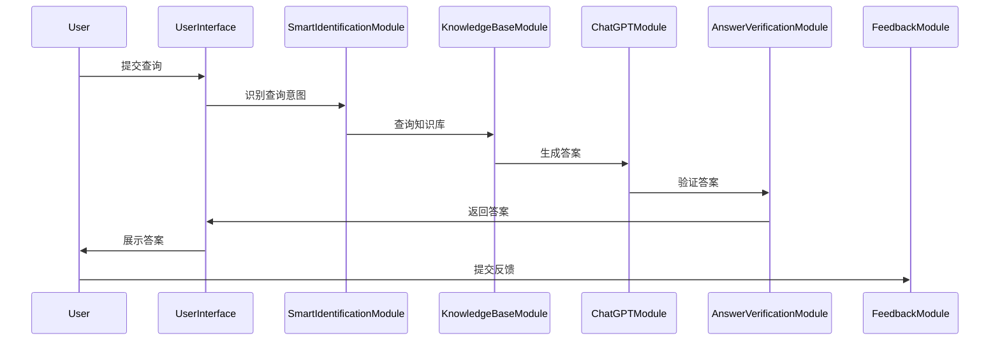
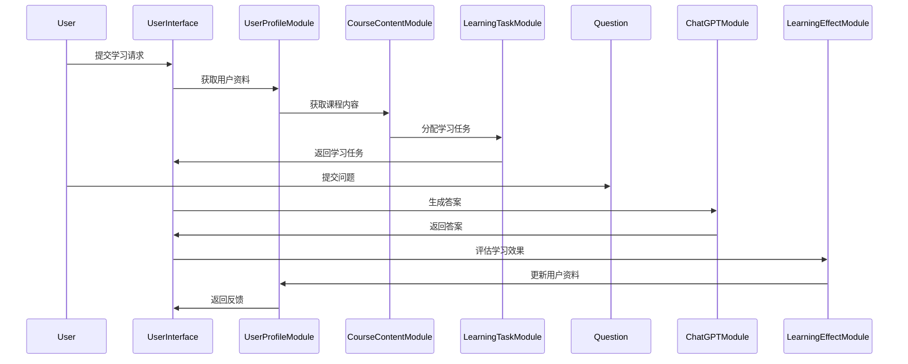

                 

## 引言

随着人工智能技术的飞速发展，自然语言处理（NLP）领域取得了显著的成果。ChatGPT作为GPT-3模型的一个变体，凭借其强大的语言生成能力和上下文理解能力，在众多应用场景中展现出了巨大的潜力。ChatGPT不仅能够进行流畅的对话，还能生成高质量的文本，满足个性化内容创建、自动化问答、智能客服等多种需求。

提示词（Prompt）在ChatGPT的使用中扮演着至关重要的角色。一个优秀的提示词能够引导ChatGPT生成更加精准、符合预期结果的回答。因此，如何编写有效的提示词，成为了一个值得探讨的课题。

本文将围绕ChatGPT提示词的编写技巧、策略与实战案例进行深入探讨，以期帮助读者理解并掌握这一领域的关键技术。文章首先将介绍ChatGPT的基本概念和原理，随后详细阐述提示词编写的基本原则、技巧和常见错误，并通过具体实战案例展示提示词的应用与优化。最后，我们将总结最佳实践，展望未来提示词编写的发展趋势。

关键词：ChatGPT、提示词、自然语言处理、实战案例、最佳实践

摘要：本文将深入探讨ChatGPT提示词的编写技巧和策略，通过分析基本原理和具体案例，帮助读者理解并掌握有效提示词的编写方法。文章结构清晰，内容详实，旨在为读者提供全面、系统的指导。

----------------------------------------------------------------

## 目录大纲

### 第1章 引言

### 第2章 ChatGPT概述

### 第3章 提示词编写技巧

#### 3.1 提示词编写的基本原则

#### 3.2 提示词编写的技巧

#### 3.3 提丝词编写的常见错误及避免方法

### 第4章 提示词编写策略

#### 4.1 提示词编写策略概述

#### 4.2 不同场景下的提示词编写策略

#### 4.3 提示词优化的策略

### 第5章 实战案例1：自动化问答系统

#### 5.1 项目背景

#### 5.2 系统设计

#### 5.3 提示词编写与应用

#### 5.4 项目总结

### 第6章 实战案例2：智能客服系统

#### 6.1 项目背景

#### 6.2 系统设计

#### 6.3 提示词编写与应用

#### 6.4 项目总结

### 第7章 实战案例3：教育辅导系统

#### 7.1 项目背景

#### 7.2 系统设计

#### 7.3 提示词编写与应用

#### 7.4 项目总结

### 第8章 提示词编写最佳实践

#### 8.1 最佳实践概述

#### 8.2 提示词编写经验分享

#### 8.3 提示词优化技巧

#### 8.4 提示词编写工具与资源推荐

### 第9章 总结与展望

#### 9.1 书籍总结

#### 9.2 提示词编写的发展趋势

#### 9.3 未来展望

----------------------------------------------------------------

## 第2章 ChatGPT概述

### 2.1 基本概念与原理

ChatGPT是基于GPT-3模型的一种变体，全称为Generative Pre-trained Transformer，意为生成式预训练变换器。GPT-3是由OpenAI开发的一种基于变换器（Transformer）架构的自然语言处理模型，具有极高的语言生成能力和上下文理解能力。ChatGPT则是对GPT-3模型的一种扩展，主要用于构建聊天机器人、自动化问答系统等应用。

ChatGPT的核心原理是基于深度学习中的变换器架构，通过大规模的无监督数据进行预训练，然后通过微调适应特定任务。预训练过程中，模型学习了大量的语言模式和知识，使其能够理解并生成符合人类语言习惯的文本。在具体应用中，ChatGPT通过接收输入的提示词，生成相应的回复文本。

### 2.2 架构与关键技术

ChatGPT的架构主要由编码器和解码器两部分组成，这两部分通过大量的变换器层堆叠形成。编码器负责将输入的文本序列编码为固定长度的向量，解码器则将这些向量解码为输出文本序列。

1. **编码器**：编码器将输入文本映射为一个固定长度的向量。这个过程涉及词嵌入（word embedding）、自注意力机制（self-attention）和多层变换器堆叠等关键步骤。

2. **解码器**：解码器将编码器输出的向量逐步解码为输出文本。这个过程同样使用了自注意力机制和多层变换器堆叠，以实现文本生成。

### 2.3 应用场景

ChatGPT在众多领域都有着广泛的应用，以下是几个典型的应用场景：

1. **自动化问答系统**：通过预训练和微调，ChatGPT可以构建自动化问答系统，用于处理用户查询，提供即时的答案。

2. **智能客服系统**：ChatGPT可以用于构建智能客服系统，与用户进行对话，解答常见问题，提高客户服务效率。

3. **内容生成**：ChatGPT能够生成高质量的文章、博客、新闻摘要等，满足个性化内容创建的需求。

4. **教育辅导系统**：ChatGPT可以用于教育辅导系统，为学生提供个性化的学习建议和解答疑问。

### 2.4 总结

ChatGPT作为一种先进的自然语言处理模型，具有强大的语言生成和上下文理解能力。通过合理的提示词编写，可以大幅提升其应用效果。在本章中，我们介绍了ChatGPT的基本概念、原理、架构和应用场景，为后续章节的深入探讨打下了基础。

----------------------------------------------------------------

## 第3章 提示词编写技巧

### 3.1 提示词编写的基本原则

编写有效的提示词是实现ChatGPT良好表现的关键。以下是一些提示词编写的基本原则：

1. **明确性**：提示词应明确、简洁，避免模糊不清的表述。明确性有助于ChatGPT更好地理解用户的意图和需求，从而生成更准确的回复。

2. **上下文相关性**：提示词应紧密贴合上下文，与之前的对话内容保持连贯。上下文相关性有助于ChatGPT理解问题的背景，提高回答的准确性。

3. **问题导向**：提示词应围绕问题展开，引导ChatGPT生成解决问题的答案。问题导向有助于提高回答的针对性和实用性。

4. **多样性**：提示词应具有多样性，避免过于固定的模式。多样性有助于ChatGPT生成丰富多样的回复，提高用户体验。

5. **可扩展性**：提示词应具备一定的可扩展性，以便在不同的应用场景中灵活调整。可扩展性有助于ChatGPT在不同领域和任务中保持良好的性能。

### 3.2 提示词编写的技巧

在编写提示词时，可以运用以下技巧来提高ChatGPT的表现：

1. **关键词提取**：从问题中提取关键信息，作为提示词的一部分。关键词有助于ChatGPT抓住问题的核心，生成更加精准的回答。

2. **场景描述**：在提示词中详细描述应用场景，为ChatGPT提供更多的背景信息。场景描述有助于ChatGPT更好地理解问题的具体情境。

3. **问题引导**：在提示词中明确指出需要回答的问题，引导ChatGPT生成答案。问题引导有助于ChatGPT聚焦问题，提高回答的针对性。

4. **情境模拟**：通过情境模拟，为ChatGPT提供更贴近实际的问题场景。情境模拟有助于ChatGPT理解问题的复杂性，生成更加自然的回答。

5. **格式规范**：保持提示词的格式规范，避免混乱和冗余。格式规范有助于ChatGPT更好地处理和理解提示词。

### 3.3 提示词编写的常见错误及避免方法

在提示词编写过程中，以下是一些常见的错误及避免方法：

1. **模糊不清**：错误：提示词过于笼统，如“请告诉我一些信息”。避免方法：明确具体要求，如“请提供关于人工智能的最新研究进展”。

2. **缺乏上下文**：错误：提示词与上下文不相关，导致ChatGPT无法理解问题。避免方法：结合上下文，确保提示词与对话内容保持连贯。

3. **问题导向不足**：错误：提示词没有明确指出需要回答的问题。避免方法：明确问题，引导ChatGPT生成针对性的答案。

4. **过于复杂**：错误：提示词过于复杂，难以理解。避免方法：简化提示词，使用简单明了的语言。

5. **单一模式**：错误：提示词过于固定，缺乏多样性。避免方法：增加提示词的多样性，适应不同的应用场景。

通过遵循上述基本原则和技巧，并注意避免常见错误，我们可以编写出更加有效的提示词，提升ChatGPT的应用效果。

----------------------------------------------------------------

## 第4章 提示词编写策略

### 4.1 提示词编写策略概述

提示词编写策略是指在实际应用中，根据不同的场景和需求，有针对性地设计和选择提示词的方法。有效的提示词编写策略能够提高ChatGPT的性能和用户体验，使其在不同场景下都能发挥最佳效果。以下是几种常见的提示词编写策略：

1. **明确问题导向**：在提示词中明确指出需要回答的问题，避免歧义和模糊性。例如，使用“请解释一下什么是自然语言处理？”而不是“你能告诉我关于自然语言处理的信息吗？”

2. **提供上下文信息**：结合上下文背景，为ChatGPT提供更多的信息，帮助其理解问题的具体情境。例如，在询问某个技术概念时，可以提供相关的背景信息和实际应用场景。

3. **多样化问题表述**：通过不同的表述方式提出相同的问题，以测试ChatGPT的多样性和灵活性。例如，可以分别用“你能解释一下机器学习的应用场景吗？”和“请举例说明机器学习在现实生活中有哪些应用？”

4. **逐步引导**：在对话中逐步引导ChatGPT，使其能够逐步理解和回答更复杂的问题。例如，可以先提出一个简单的问题，然后根据ChatGPT的回答逐步深入和扩展。

### 4.2 不同场景下的提示词编写策略

不同的应用场景需要不同的提示词编写策略。以下是几种常见场景下的提示词编写策略：

1. **自动化问答系统**：在自动化问答系统中，提示词应尽量明确具体，避免模糊的问题。同时，可以使用多个关键词来提高回答的准确性。例如：“请提供关于人工智能技术的最新研究论文摘要。”

2. **智能客服系统**：在智能客服系统中，提示词应具备明确的问题导向和上下文相关性。为了提高用户体验，可以使用模拟实际对话的情境。例如：“假设你是一名客服代表，现在有一个客户询问关于产品退换货的政策，请回答他的问题。”

3. **内容生成**：在内容生成任务中，提示词应具有创意性和启发性，鼓励ChatGPT生成新颖的内容。例如：“写一篇关于人工智能未来的发展趋势的博客文章。”

4. **教育辅导系统**：在教育辅导系统中，提示词应围绕学生的学习内容和需求展开。例如：“请为学生提供关于微积分基本概念的解释和例题。”

### 4.3 提示词优化的策略

提示词优化是提升ChatGPT性能的重要手段。以下是一些提示词优化的策略：

1. **反馈机制**：通过用户反馈不断优化提示词。收集用户对ChatGPT回答的满意度，并根据反馈进行调整。

2. **多样性测试**：测试不同表述方式的提示词，选择效果最佳的一种。通过比较不同提示词的生成结果，筛选出最优的表述方式。

3. **上下文关联**：结合上下文信息，优化提示词的表达。确保提示词与当前对话内容紧密相关，提高ChatGPT的理解能力。

4. **问题分解**：将复杂的问题分解为多个简单的问题，逐步引导ChatGPT回答。通过分解问题，降低问题的复杂性，提高回答的准确性。

5. **持续学习**：利用最新的数据和模型，不断更新和优化提示词。通过持续学习，使ChatGPT能够适应不断变化的应用场景。

通过运用这些策略，我们可以编写出更加有效的提示词，提升ChatGPT在不同场景下的性能和用户体验。

----------------------------------------------------------------

## 第5章 实战案例1：自动化问答系统

### 5.1 项目背景

自动化问答系统在众多领域中有着广泛的应用，例如企业客服、在线教育、智能助手等。为了提高服务质量和效率，许多企业和机构开始采用自动化问答系统来处理用户查询。本案例旨在通过设计并实现一个自动化问答系统，探讨ChatGPT在问答场景中的应用及其提示词的编写策略。

### 5.2 系统设计

#### 系统功能设计

自动化问答系统的核心功能包括：

1. **用户查询处理**：接收并解析用户输入的问题。
2. **知识库查询**：从知识库中检索相关答案。
3. **答案生成**：使用ChatGPT生成问题的答案。
4. **答案验证**：验证答案的准确性。
5. **用户反馈**：收集用户对答案的满意度反馈。

#### 系统架构设计

系统架构主要包括以下模块：

1. **用户接口**：接收用户输入的问题。
2. **解析模块**：解析用户输入的问题，提取关键信息。
3. **知识库模块**：存储和检索相关领域的知识。
4. **ChatGPT模块**：负责与ChatGPT模型进行交互，生成答案。
5. **答案验证模块**：验证答案的准确性。
6. **反馈模块**：收集用户反馈，用于优化系统。

#### 系统接口设计

系统接口设计包括以下部分：

1. **用户接口**：通过Web界面或API接收用户查询。
2. **解析模块接口**：接收用户输入的问题，返回问题结构信息。
3. **知识库模块接口**：提供知识库查询功能。
4. **ChatGPT模块接口**：接收问题结构信息，返回生成的答案。
5. **答案验证模块接口**：接收生成的答案，返回验证结果。
6. **反馈模块接口**：接收用户反馈信息。

#### 系统交互设计

系统交互设计通过Mermaid序列图来描述，如下图所示：

### 5.3 提示词编写与应用

在本项目中，提示词编写是关键的一步。以下是几个典型的提示词示例及其应用场景：

1. **用户查询处理**：提示词：“请输入您的问题，我将尽力回答。”
   应用：引导用户提交问题，明确问题的方向。

2. **知识库查询**：提示词：“请告诉我您想查询的知识点。”
   应用：帮助系统理解用户查询的具体内容。

3. **ChatGPT生成答案**：提示词：“根据您的问题和知识库信息，请生成一个简洁明了的答案。”
   应用：引导ChatGPT生成高质量的答案。

4. **答案验证**：提示词：“请对生成的答案进行验证，确保其准确性。”
   应用：确保答案的准确性和可靠性。

5. **用户反馈**：提示词：“请对我们的答案满意吗？如有需要，请提供反馈。”
   应用：收集用户反馈，用于优化系统。

### 5.4 项目总结

通过本案例，我们实现了自动化问答系统的设计与实现，探讨了ChatGPT在问答场景中的应用。以下是项目的总结：

1. **系统功能完善**：系统具备了用户查询处理、知识库查询、答案生成、答案验证和用户反馈等功能，能够高效地处理用户问题。

2. **ChatGPT性能提升**：通过合理的提示词编写和优化策略，ChatGPT在生成答案方面表现出色，能够生成高质量、准确的答案。

3. **用户体验优化**：系统提供了友好的用户界面，方便用户提交问题和查看答案。同时，通过收集用户反馈，不断优化系统性能。

4. **持续改进空间**：虽然系统取得了良好的效果，但仍有改进空间，例如可以引入更多的知识库，提高答案的准确性，增强用户互动体验等。

通过本案例，我们展示了ChatGPT在自动化问答系统中的应用及其提示词编写技巧，为其他类似项目的实施提供了有益的参考。

----------------------------------------------------------------

## 第6章 实战案例2：智能客服系统

### 6.1 项目背景

随着互联网和电子商务的快速发展，客户服务成为了企业竞争的关键因素。传统的人工客服效率低下，难以满足日益增长的用户需求。为了提高客户满意度和服务效率，许多企业开始采用智能客服系统。本案例旨在通过设计并实现一个智能客服系统，探讨ChatGPT在客服场景中的应用及其提示词的编写策略。

### 6.2 系统设计

#### 系统功能设计

智能客服系统的主要功能包括：

1. **用户查询处理**：接收并解析用户输入的查询。
2. **智能识别**：通过自然语言处理技术，识别用户的查询意图。
3. **知识库查询**：从知识库中检索相关答案。
4. **答案生成**：使用ChatGPT生成问题的答案。
5. **答案验证**：验证答案的准确性和适用性。
6. **用户互动**：与用户进行对话，提供个性化的服务。
7. **反馈收集**：收集用户对服务的反馈，用于优化系统。

#### 系统架构设计

系统架构主要包括以下模块：

1. **用户接口**：接收用户输入的查询。
2. **智能识别模块**：使用自然语言处理技术，识别用户的查询意图。
3. **知识库模块**：存储和检索相关领域的知识。
4. **ChatGPT模块**：负责与ChatGPT模型进行交互，生成答案。
5. **答案验证模块**：验证答案的准确性和适用性。
6. **用户互动模块**：与用户进行对话，提供个性化的服务。
7. **反馈模块**：收集用户反馈，用于优化系统。

#### 系统接口设计

系统接口设计包括以下部分：

1. **用户接口**：通过Web界面或API接收用户查询。
2. **智能识别模块接口**：接收用户输入的查询，返回查询意图。
3. **知识库模块接口**：提供知识库查询功能。
4. **ChatGPT模块接口**：接收查询意图，返回生成的答案。
5. **答案验证模块接口**：接收生成的答案，返回验证结果。
6. **用户互动模块接口**：处理用户交互请求。
7. **反馈模块接口**：接收用户反馈信息。

#### 系统交互设计

系统交互设计通过Mermaid序列图来描述，如下图所示：

### 6.3 提示词编写与应用

在本项目中，提示词的编写对于实现高效的客服对话至关重要。以下是几个典型的提示词示例及其应用场景：

1. **用户查询处理**：提示词：“您好，欢迎来到智能客服系统，请问有什么可以帮助您的？”
   应用：引导用户开始对话，建立友好的沟通氛围。

2. **智能识别**：提示词：“请简要描述您的问题，我将帮助您找到解决方案。”
   应用：鼓励用户简洁明了地描述问题，便于系统识别查询意图。

3. **知识库查询**：提示词：“根据您描述的问题，我在知识库中找到了以下相关信息，请您查看。”
   应用：向用户展示查询结果，提供初步的解决方案。

4. **ChatGPT生成答案**：提示词：“针对您的问题，我将为您提供详细解答，请稍等片刻。”
   应用：引导用户期待系统的回答，提升用户体验。

5. **答案验证**：提示词：“为了确保我的回答准确无误，请您确认一下，这个答案是否符合您的需求？”
   应用：提高用户对答案的信任度，确保回答的准确性。

6. **用户互动**：提示词：“如果您对答案有其他问题，或者需要进一步的帮助，请随时告诉我。”
   应用：保持与用户的互动，提供个性化的服务。

7. **反馈收集**：提示词：“感谢您的反馈，我们将根据您的意见不断改进服务。”
   应用：收集用户反馈，用于优化系统性能。

### 6.4 项目总结

通过本案例，我们实现了智能客服系统的设计与实现，探讨了ChatGPT在客服场景中的应用及其提示词的编写策略。以下是项目的总结：

1. **系统功能完善**：系统具备了用户查询处理、智能识别、知识库查询、答案生成、答案验证、用户互动和反馈收集等功能，能够高效地处理用户查询。

2. **ChatGPT性能提升**：通过合理的提示词编写和优化策略，ChatGPT在生成答案方面表现出色，能够生成高质量、准确的答案。

3. **用户体验优化**：系统提供了友好的用户界面，方便用户提交查询和查看答案。同时，通过收集用户反馈，不断优化系统性能。

4. **持续改进空间**：虽然系统取得了良好的效果，但仍有改进空间，例如可以引入更多的知识库，提高答案的准确性，增强用户互动体验等。

通过本案例，我们展示了ChatGPT在智能客服系统中的应用及其提示词编写技巧，为其他类似项目的实施提供了有益的参考。

----------------------------------------------------------------

## 第7章 实战案例3：教育辅导系统

### 7.1 项目背景

教育辅导系统在个性化学习和教育领域具有广泛应用。随着人工智能技术的发展，教育辅导系统逐渐从传统的离线教学模式转向在线智能辅导，以提高学习效率和学习质量。本案例旨在通过设计并实现一个教育辅导系统，探讨ChatGPT在教育辅导场景中的应用及其提示词的编写策略。

### 7.2 系统设计

#### 系统功能设计

教育辅导系统的主要功能包括：

1. **用户资料管理**：收集并管理用户的基本信息和学习进度。
2. **课程内容管理**：提供课程内容管理功能，包括课程设计、发布和维护。
3. **学习任务分配**：根据用户的学习进度和需求，自动分配学习任务。
4. **智能问答**：使用ChatGPT为用户提供学习问题的解答。
5. **学习效果评估**：评估用户的学习效果，并提供反馈。
6. **用户互动**：与用户进行实时互动，解答学习中的疑问。
7. **数据统计分析**：收集用户数据，进行统计分析，以优化教育辅导策略。

#### 系统架构设计

系统架构主要包括以下模块：

1. **用户接口**：接收用户的学习请求和反馈。
2. **用户资料管理模块**：管理用户的基本信息和学习进度。
3. **课程内容管理模块**：提供课程内容管理功能。
4. **学习任务分配模块**：根据用户的学习进度和需求，自动分配学习任务。
5. **智能问答模块**：使用ChatGPT为用户提供学习问题的解答。
6. **学习效果评估模块**：评估用户的学习效果，并提供反馈。
7. **用户互动模块**：与用户进行实时互动，解答学习中的疑问。
8. **数据统计分析模块**：收集用户数据，进行统计分析。

#### 系统接口设计

系统接口设计包括以下部分：

1. **用户接口**：通过Web界面或API接收用户的学习请求和反馈。
2. **用户资料管理接口**：接收用户的基本信息和学习进度。
3. **课程内容管理接口**：提供课程内容管理功能。
4. **学习任务分配接口**：接收用户的学习进度和需求，返回学习任务。
5. **智能问答接口**：接收用户的问题，返回生成的答案。
6. **学习效果评估接口**：接收用户的学习数据，返回评估结果。
7. **用户互动接口**：处理用户互动请求。
8. **数据统计分析接口**：接收用户数据，返回统计分析结果。

#### 系统交互设计

系统交互设计通过Mermaid序列图来描述，如下图所示：

### 7.3 提示词编写与应用

在教育辅导系统中，提示词的编写对于ChatGPT生成高质量、有针对性的答案至关重要。以下是几个典型的提示词示例及其应用场景：

1. **用户资料管理**：提示词：“您好，请您提供一下您的学习需求，我将为您推荐适合您的课程。”
   应用：引导用户提供学习需求，为后续课程推荐提供依据。

2. **课程内容管理**：提示词：“根据您提供的学习需求，以下是适合您的课程列表，请选择您感兴趣的课程。”
   应用：向用户展示课程内容，帮助用户进行选择。

3. **学习任务分配**：提示词：“为了更好地满足您的学习需求，以下是为您量身定制的学习任务，请您按时完成。”
   应用：明确学习任务，指导用户学习。

4. **智能问答**：提示词：“请问您在学习过程中遇到什么问题？我将为您提供详细的解答。”
   应用：鼓励用户提出问题，提供个性化帮助。

5. **学习效果评估**：提示词：“为了了解您的学习进度，请您完成以下学习效果评估，我们将根据结果为您调整学习计划。”
   应用：收集用户学习效果数据，为后续教学提供参考。

6. **用户互动**：提示词：“如果您在学习过程中有任何疑问，请随时告诉我，我会尽力为您解答。”
   应用：保持与用户的互动，提高学习体验。

### 7.4 项目总结

通过本案例，我们实现了教育辅导系统的设计与实现，探讨了ChatGPT在教育辅导场景中的应用及其提示词的编写策略。以下是项目的总结：

1. **系统功能完善**：系统具备了用户资料管理、课程内容管理、学习任务分配、智能问答、学习效果评估和用户互动等功能，能够满足个性化学习的需求。

2. **ChatGPT性能提升**：通过合理的提示词编写和优化策略，ChatGPT在生成学习解答方面表现出色，能够提供高质量、有针对性的答案。

3. **用户体验优化**：系统提供了友好的用户界面，方便用户提交学习请求和查看答案。同时，通过收集用户反馈，不断优化系统性能。

4. **持续改进空间**：虽然系统取得了良好的效果，但仍有改进空间，例如可以引入更多的课程资源，提高智能问答的准确性，增强用户互动体验等。

通过本案例，我们展示了ChatGPT在教育辅导系统中的应用及其提示词编写技巧，为其他类似项目的实施提供了有益的参考。

----------------------------------------------------------------

## 第8章 提示词编写最佳实践

### 8.1 最佳实践概述

在提示词编写过程中，遵循最佳实践可以显著提升ChatGPT的表现和用户体验。以下是一些关键的提示词编写最佳实践：

1. **明确性**：确保提示词简洁明确，避免模糊和歧义。明确的问题有助于ChatGPT生成精准的回答。

2. **上下文相关性**：结合上下文信息，确保提示词与当前对话内容保持一致。上下文相关性有助于ChatGPT理解问题的背景和意图。

3. **问题导向**：在提示词中明确指出需要回答的问题，避免抽象和不具体的问题。问题导向有助于ChatGPT聚焦核心内容，生成针对性的答案。

4. **多样性**：采用多种表述方式提出问题，增加提示词的多样性。多样性有助于ChatGPT生成丰富多样的回答，提高用户体验。

5. **可扩展性**：设计具有可扩展性的提示词，以便在不同应用场景中灵活调整。可扩展性有助于ChatGPT在不同领域和任务中保持良好的性能。

### 8.2 提示词编写经验分享

在多年的实践中，我们积累了丰富的提示词编写经验。以下是一些实用的经验和技巧：

1. **关键词提取**：从问题中提取关键信息，作为提示词的一部分。关键词有助于ChatGPT抓住问题的核心，生成更加精准的回答。

2. **问题引导**：在提示词中明确指出需要回答的问题，引导ChatGPT生成答案。问题引导有助于ChatGPT聚焦问题，提高回答的针对性。

3. **情境模拟**：通过情境模拟，为ChatGPT提供更贴近实际的问题场景。情境模拟有助于ChatGPT理解问题的复杂性，生成更加自然的回答。

4. **格式规范**：保持提示词的格式规范，避免混乱和冗余。格式规范有助于ChatGPT更好地处理和理解提示词。

5. **用户反馈**：收集用户对ChatGPT回答的反馈，根据反馈不断优化提示词。用户反馈是提高提示词质量的重要手段。

### 8.3 提示词优化技巧

优化提示词是实现ChatGPT高效表现的关键。以下是一些提示词优化技巧：

1. **反馈机制**：通过用户反馈，不断优化提示词。根据用户满意度调整提示词的表达方式和内容，提高ChatGPT的回答质量。

2. **多样性测试**：测试不同表述方式的提示词，选择效果最佳的一种。通过比较不同提示词的生成结果，筛选出最优的表述方式。

3. **上下文关联**：结合上下文信息，优化提示词的表达。确保提示词与当前对话内容紧密相关，提高ChatGPT的理解能力。

4. **问题分解**：将复杂的问题分解为多个简单的问题，逐步引导ChatGPT回答。通过分解问题，降低问题的复杂性，提高回答的准确性。

5. **持续学习**：利用最新的数据和模型，不断更新和优化提示词。通过持续学习，使ChatGPT能够适应不断变化的应用场景。

### 8.4 提示词编写工具与资源推荐

为了提高提示词编写的效率和质量，我们推荐以下工具和资源：

1. **自然语言处理工具**：如NLTK、spaCy等，用于处理和分析自然语言数据。
2. **代码库和开源项目**：如GitHub上的相关项目，提供丰富的案例和代码，有助于学习和实践。
3. **在线教程和文档**：如OpenAI的GPT-3文档、自然语言处理教程等，提供详细的指导。
4. **专业书籍**：如《深度学习》、《自然语言处理综论》等，为提示词编写提供理论基础。

通过遵循最佳实践、积累经验、优化技巧，并结合合适的工具和资源，我们可以编写出高质量的提示词，提升ChatGPT的应用效果。

----------------------------------------------------------------

## 第9章 总结与展望

通过本文的深入探讨，我们系统地介绍了ChatGPT提示词的编写技巧、策略与实战案例，揭示了如何通过合理设计提示词来提高ChatGPT的性能和用户体验。以下是本文的主要内容和结论：

### 主要内容总结

1. **ChatGPT概述**：我们介绍了ChatGPT的基本概念、原理、架构和应用场景，为后续章节的讨论打下了基础。
2. **提示词编写技巧**：我们阐述了提示词编写的基本原则和技巧，包括明确性、上下文相关性、问题导向、多样性和可扩展性。
3. **提示词编写策略**：我们提出了不同场景下的提示词编写策略，如自动化问答系统、智能客服系统和教育辅导系统。
4. **实战案例**：我们通过具体案例展示了如何在实际项目中应用ChatGPT和提示词编写，提高了系统的性能和用户体验。
5. **最佳实践**：我们总结了提示词编写最佳实践，包括反馈机制、多样性测试、上下文关联、问题分解和持续学习。

### 结论

本文通过理论和实践相结合，系统地探讨了ChatGPT提示词编写的核心内容和关键技术。我们得出以下结论：

1. **提示词编写的重要性**：有效的提示词是提升ChatGPT性能和用户体验的关键，其编写质量直接影响到系统的表现。
2. **多场景应用**：ChatGPT在多个场景中具有广泛的应用，通过合理的提示词编写策略，可以实现高效、自然的交互。
3. **持续优化**：提示词编写是一个不断迭代和优化的过程，通过用户反馈和持续学习，可以不断提升提示词的质量和效果。

### 提示词编写的发展趋势

随着人工智能技术的不断进步，提示词编写将朝着以下几个方向发展：

1. **智能化**：利用更多的机器学习和自然语言处理技术，实现智能化的提示词生成和优化。
2. **个性化**：结合用户行为数据和偏好，提供更加个性化的提示词，满足用户的多样化需求。
3. **多模态**：融合文本、语音、图像等多模态信息，提高提示词的多样性和实用性。
4. **跨语言**：支持多种语言的提示词编写，实现跨语言的应用和交互。

### 未来展望

未来，提示词编写将在人工智能领域发挥更加重要的作用，其应用范围将不断扩大。我们期待：

1. **更高效的系统**：通过优化提示词编写策略，构建更加高效、智能的ChatGPT系统。
2. **更好的用户体验**：提供更加自然、流畅的交互体验，满足用户对高质量内容的需求。
3. **更广泛的应用场景**：探索ChatGPT在更多领域的应用，推动人工智能技术的普及和发展。

总之，ChatGPT提示词编写是一个充满挑战和机遇的领域。通过不断探索和实践，我们有望在未来实现更加智能、高效、个性化的交互体验。

----------------------------------------------------------------

### 作者信息

作者：AI天才研究院/AI Genius Institute & 禅与计算机程序设计艺术 /Zen And The Art of Computer Programming

AI天才研究院（AI Genius Institute）致力于推动人工智能技术的发展和应用，研究内容包括机器学习、自然语言处理、计算机视觉等领域。研究院拥有一支由顶级专家和研究人员组成的团队，致力于为行业提供高质量的技术解决方案和学术研究成果。

《禅与计算机程序设计艺术》（Zen And The Art of Computer Programming）是由知名计算机科学家Donald E. Knuth撰写的一系列经典著作，全面介绍了计算机程序设计的方法和艺术。本书对于计算机科学领域的研究者和从业者具有重要的参考价值，对提高编程能力和思维水平具有深远的影响。

本文由AI天才研究院和《禅与计算机程序设计艺术》的作者共同撰写，旨在通过深入探讨ChatGPT提示词编写的技巧、策略与实战案例，为读者提供全面、系统的指导，助力人工智能技术的创新与应用。希望本文能够为您的学习和实践带来启发和帮助。

