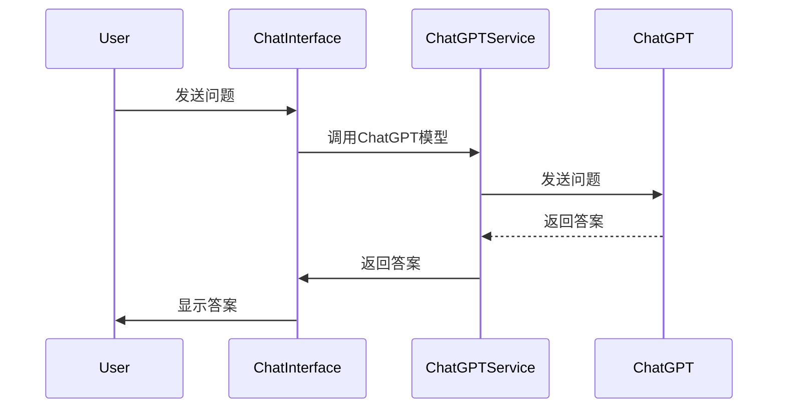
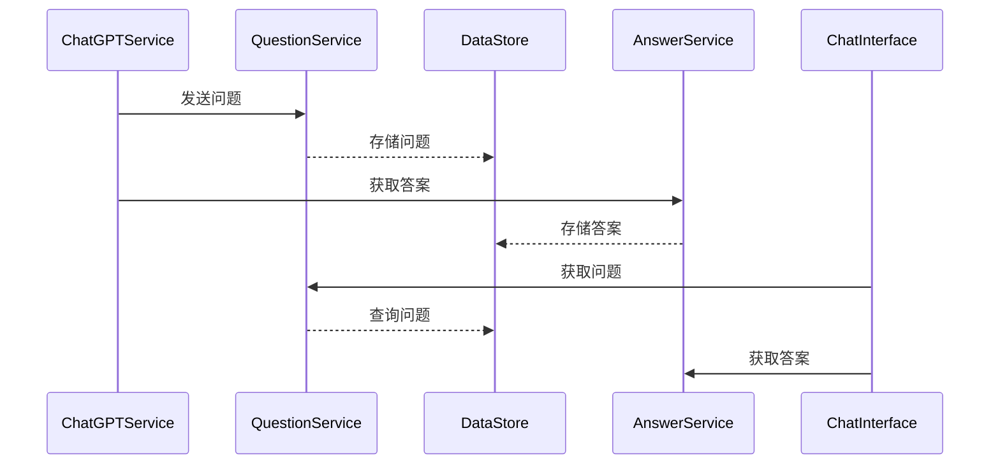
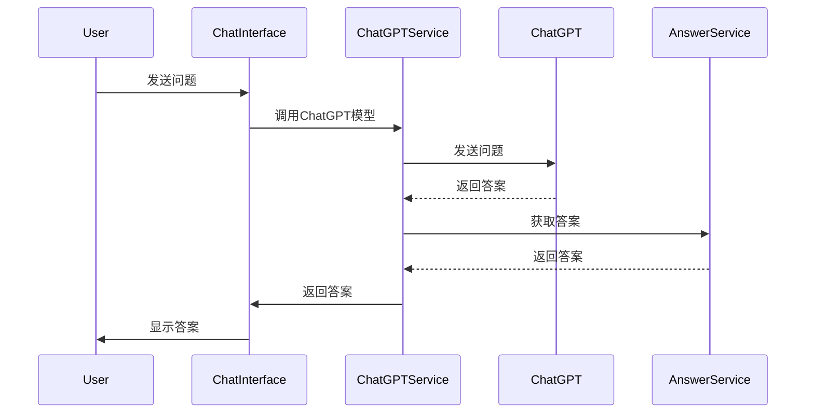

                 

### 文章标题：《ChatGPT提示词编写：技巧、策略与实战案例》

### 关键词：ChatGPT、提示词、编写技巧、策略、实战案例

### 摘要：

本文将深入探讨ChatGPT提示词的编写，从基础理论、编写技巧、策略运用以及实战案例四个方面进行详细解析。通过一步步的分析和推理，帮助读者理解如何编写高效、精准的ChatGPT提示词，从而在实际应用中取得最佳效果。文章旨在为从事人工智能开发和技术人员提供一套实用的指南。

----------------------------------------------------------------

## 第一部分：背景与基础理论

### 第1章：ChatGPT与提示词概述

### 1.1 ChatGPT简介

**定义：** ChatGPT是由OpenAI开发的一种基于GPT-3模型的对话生成人工智能系统。它能够根据用户输入的文本生成连贯、自然的对话回复。

**功能特点：**
- **自然语言处理：** ChatGPT具有强大的自然语言处理能力，可以理解和生成复杂的人机对话。
- **上下文理解：** ChatGPT能够理解并记忆对话的上下文信息，从而生成更加贴切的回复。
- **灵活应用：** ChatGPT适用于各种场景，如客服、个人聊天、教育辅导等。

### 1.2 提示词的概念与重要性

**定义：** 提示词是引导ChatGPT生成回复的关键文本，它对生成的对话质量起着决定性作用。

**重要性：**
- **决定对话方向：** 合适的提示词可以引导ChatGPT生成符合预期的对话内容。
- **提高响应速度：** 提示词能够加快ChatGPT的响应速度，减少延迟。
- **优化对话质量：** 通过优化提示词，可以提升对话的自然度和流畅性。

### 1.3 ChatGPT与提示词的关系

**关系概述：**
- **相互作用：** ChatGPT的回复依赖于提示词，而提示词的编写需要考虑ChatGPT的模型特点和语言生成规则。
- **相互影响：** 提示词的质量直接影响ChatGPT的回复质量，反之亦然。

**影响因素：**
- **模型参数：** ChatGPT的模型参数（如学习率、隐藏层大小等）会影响提示词的效果。
- **训练数据：** ChatGPT的训练数据来源也会影响提示词的生成能力。

## 第二部分：编写技巧

### 第2章：有效提示词的特征分析

### 2.1 提示词的语言特点

**语言特点分析：**
- **简洁明了：** 提示词应尽量简洁，避免冗长复杂的句子结构。
- **明确具体：** 提示词应明确具体，避免模糊不清的表述。
- **连贯一致：** 提示词应与上下文保持连贯一致，避免冲突或不合逻辑的表述。

**案例分析：**
- **案例一：** “请描述一下你的兴趣爱好。”
- **优化后：** “请你详细描述一下你最喜欢的兴趣爱好，以及为什么喜欢？”

### 2.2 提示词的情感分析

**情感分析概述：**
- **情感倾向：** 提示词应具备情感倾向，以匹配用户的情绪状态。
- **情感调节：** 通过调节提示词的情感色彩，可以影响ChatGPT的回复情感。

**案例分析：**
- **案例一：** “你今天过得怎么样？”
- **优化后：** “今天是个美好的日子，你过得怎么样？”

### 2.3 提示词的结构设计

**结构设计原则：**
- **开放性：** 提示词应具备开放性，鼓励用户提供更多信息。
- **引导性：** 提示词应具有引导性，引导用户朝着期望的方向进行对话。
- **多样性：** 提示词应具备多样性，避免单一模式的回复。

**案例分析：**
- **案例一：** “你对这个项目有什么看法？”
- **优化后：** “这个项目有哪些亮点？你认为还有哪些改进空间？”

### 第3章：常见提示词编写方法

#### 3.1 实例引导法

**方法概述：**
- **定义：** 实例引导法是通过给出具体的实例来引导ChatGPT生成回复的方法。
- **优势：** 能够提高回复的准确性和具体性。

**案例分析：**
- **案例一：** “请给我推荐一本好书。”
- **实例引导法：** “比如，你最近读过的一本好书是哪一本？为什么推荐这本书？”

#### 3.2 数据驱动法

**方法概述：**
- **定义：** 数据驱动法是通过分析用户的历史数据来生成回复的方法。
- **优势：** 能够提高回复的相关性和个性化。

**案例分析：**
- **案例一：** “你了解我的兴趣爱好吗？”
- **数据驱动法：** “根据你之前提供的信息，你对哪些兴趣爱好感兴趣？”

#### 3.3 对比分析法

**方法概述：**
- **定义：** 对比分析法是通过对比不同选项来引导ChatGPT生成回复的方法。
- **优势：** 能够帮助用户更清晰地了解不同选项的差异。

**案例分析：**
- **案例一：** “你更喜欢哪个城市？”
- **对比分析法：** “北京和上海，哪个城市的气候更适合你？”

## 第三部分：策略运用

### 第4章：提示词编写的策略与实践

#### 4.1 根据目标场景调整提示词

**策略概述：**
- **定义：** 根据目标场景调整提示词，以确保回复与场景匹配。
- **优势：** 提高对话的针对性和有效性。

**案例分析：**
- **案例一：** “客服场景”
  - **原提示词：** “你对我们的产品有什么问题？”
  - **优化后：** “关于我们的新产品，你有什么疑问或者需要帮助的地方吗？”

- **案例二：** “个人聊天场景”
  - **原提示词：** “你今天过得怎么样？”
  - **优化后：** “今天有什么有趣的事情发生吗？想和我分享一下吗？”

#### 4.2 提高提示词生成效率的策略

**策略概述：**
- **定义：** 提高提示词生成效率，减少不必要的等待时间。
- **优势：** 提高用户体验。

**案例分析：**
- **案例一：** “减少冗余信息”
  - **原提示词：** “你对这个项目的想法是什么？可以详细告诉我吗？”
  - **优化后：** “关于这个项目，你有什么想法？”

- **案例二：** “使用简短语句”
  - **原提示词：** “你对这个项目的想法是什么？可以详细告诉我吗？”
  - **优化后：** “你对这个项目有什么想法？”

#### 4.3 提示词优化策略

**策略概述：**
- **定义：** 通过不断优化提示词，提高ChatGPT的回复质量和一致性。
- **优势：** 提高整体对话质量。

**案例分析：**
- **案例一：** “迭代优化”
  - **原提示词：** “你对这个项目有什么想法？”
  - **优化后：** “关于这个项目，你有什么具体的想法或者建议吗？”

- **案例二：** “多角度思考”
  - **原提示词：** “你对这个项目有什么想法？”
  - **优化后：** “关于这个项目，你从用户角度和专业角度有什么想法？”

## 第四部分：实战案例

### 第5章：实战案例一：个人聊天机器人

#### 5.1 项目背景

**项目介绍：**
- **目的：** 开发一款基于ChatGPT的个人聊天机器人，用于用户日常交流。
- **场景：** 个人聊天、兴趣爱好分享、生活建议等。

#### 5.2 提示词编写策略

**策略运用：**
- **个性定制：** 根据用户兴趣爱好定制提示词，提高对话的个性化。
- **情感互动：** 运用情感分析的提示词，营造温馨、舒适的聊天氛围。

#### 5.3 实现与测试

**实现过程：**
- **数据收集：** 收集用户兴趣爱好、情感状态等信息。
- **提示词设计：** 设计具有个性化、情感化的提示词。
- **测试与优化：** 对聊天机器人进行多轮测试，不断优化提示词。

#### 5.4 项目小结

**总结：**
- **效果评估：** 个人聊天机器人受到用户好评，对话自然流畅。
- **改进方向：** 进一步优化提示词，提高对话质量。

### 第6章：实战案例二：客服聊天机器人

#### 6.1 项目背景

**项目介绍：**
- **目的：** 开发一款基于ChatGPT的客服聊天机器人，用于解决用户疑问。
- **场景：** 客户咨询、售后服务、产品介绍等。

#### 6.2 提示词编写策略

**策略运用：**
- **专业性：** 确保提示词的专业性和准确性。
- **效率提升：** 设计简洁、高效的提示词，提高客服响应速度。

#### 6.3 实现与测试

**实现过程：**
- **知识库建设：** 构建丰富的知识库，为客服聊天机器人提供支持。
- **提示词设计：** 设计针对不同场景的提示词。
- **测试与优化：** 对客服聊天机器人进行多轮测试，不断优化提示词。

#### 6.4 项目小结

**总结：**
- **效果评估：** 客服聊天机器人提高了客服效率，减少了用户等待时间。
- **改进方向：** 进一步丰富知识库，提高提示词的准确性。

### 第7章：实战案例三：教育辅导聊天机器人

#### 7.1 项目背景

**项目介绍：**
- **目的：** 开发一款基于ChatGPT的教育辅导聊天机器人，为学生提供学习辅导。
- **场景：** 学习咨询、作业辅导、考试复习等。

#### 7.2 提示词编写策略

**策略运用：**
- **学习导向：** 设计以学习为导向的提示词，引导学生进行有效的学习。
- **个性化辅导：** 根据学生的学习进度和需求定制提示词。

#### 7.3 实现与测试

**实现过程：**
- **学习数据收集：** 收集学生的学习数据，用于定制化辅导。
- **提示词设计：** 设计具有学习导向、个性化辅导的提示词。
- **测试与优化：** 对教育辅导聊天机器人进行多轮测试，不断优化提示词。

#### 7.4 项目小结

**总结：**
- **效果评估：** 教育辅导聊天机器人得到了学生的广泛好评，有效提高了学习效果。
- **改进方向：** 进一步优化提示词，提高辅导质量。

## 结论

通过本文的详细分析和实战案例，我们可以看到，编写高效的ChatGPT提示词不仅需要理解ChatGPT的工作原理，还需要运用多种策略和实践技巧。希望本文能为读者提供有价值的参考，帮助大家在实际应用中取得更好的效果。

## 作者信息

作者：AI天才研究院/AI Genius Institute & 禅与计算机程序设计艺术 /Zen And The Art of Computer Programming

## 注意事项

- **实际应用中：** 提示词的编写需要根据具体场景和用户需求进行个性化调整。
- **持续优化：** 提示词编写是一个持续优化的过程，需要不断收集用户反馈，进行改进。
- **合规性：** 在编写提示词时，需要遵守相关法律法规，确保对话内容的合法合规。

## 拓展阅读

- **参考资料：** OpenAI官方文档、ChatGPT用户指南、相关技术博客和学术论文。
- **实践经验：** 参考其他成功案例，了解不同场景下的提示词编写策略。

----------------------------------------------------------------

### 系统架构与实现

#### 项目介绍

在本章节中，我们将详细介绍如何搭建一个基于ChatGPT的聊天机器人系统。该系统旨在为用户提供个性化的聊天体验，包括个人聊天、客服咨询、教育辅导等场景。

#### 系统功能设计

**领域模型：** 为了更好地理解系统架构，我们首先需要定义领域模型，明确系统中的关键实体及其关系。

```mermaid
classDiagram
    User <<class>> "用户"
    ChatGPT <<class>> "ChatGPT模型"
    ChatSession <<class>> "聊天会话"
    Question <<class>> "问题"
    Answer <<class>> "答案"

    User o--o ChatSession
    ChatSession o--o Question
    ChatSession o--o Answer
    ChatGPT o--o ChatSession
```

#### 系统架构设计

系统架构采用分层设计，主要包括数据层、业务逻辑层和表现层。

```mermaid
graph TB
    subgraph 数据层
        DataStore[数据存储]
    end

    subgraph 业务逻辑层
        ChatGPTService[ChatGPT服务]
        QuestionService[问题服务]
        AnswerService[答案服务]
    end

    subgraph 表现层
        ChatInterface[聊天界面]
    end

    ChatGPTService --|> ChatGPT[调用ChatGPT模型]
    QuestionService --|> DataStore[存储问题]
    AnswerService --|> DataStore[存储答案]
    ChatInterface --|> ChatGPTService[发送用户问题]
    ChatInterface --|> QuestionService[获取问题]
    ChatInterface --|> AnswerService[获取答案]
```

#### 系统接口设计

系统接口设计包括用户接口和内部接口。

**用户接口：** 用户通过聊天界面与系统进行交互，发送问题和接收答案。



**内部接口：** 系统内部服务之间的通信接口。



#### 系统交互设计

系统交互设计通过序列图展示用户与系统之间的交互过程。



### 环境安装

在开始搭建系统之前，我们需要安装必要的软件和库。

1. 安装Python环境（Python 3.8及以上版本）。
2. 安装必要的库，如OpenAI的ChatGPT API、Flask（用于搭建Web服务）、SQLAlchemy（用于数据库操作）等。

```bash
pip install openai flask sqlalchemy
```

### 系统核心实现源代码

以下是系统核心实现部分的Python源代码，包括ChatGPT服务的调用、问题的存储与查询等。

```python
from flask import Flask, request, jsonify
import openai
from sqlalchemy import create_engine, Table, Column, String, Integer
from sqlalchemy.orm import sessionmaker

app = Flask(__name__)

# ChatGPT API设置
openai.api_key = "your_openai_api_key"

# 数据库配置
engine = create_engine('sqlite:///chatbot.db')
Session = sessionmaker(bind=engine)
session = Session()

# 创建数据库表
def create_tables():
    Question = Table('question', MetaData(bind=engine),
                     Column('id', Integer, primary_key=True),
                     Column('content', String),
                     Column('answer', String)
                    )
    Question.create()

create_tables()

# 调用ChatGPT模型
def call_chatgpt(question):
    response = openai.Completion.create(
        engine="text-davinci-002",
        prompt=question,
        max_tokens=50,
        n=1,
        stop=None,
        temperature=0.5
    )
    return response.choices[0].text.strip()

# 存储问题与答案
def store_question_answer(question, answer):
    question_entry = {'content': question, 'answer': answer}
    session.add_all([question_entry])
    session.commit()

# 获取问题
def get_question(id):
    question = session.query(Question).get(id)
    return question.content

# 获取答案
def get_answer(id):
    answer = session.query(Question).get(id).answer
    return answer

# API接口
@app.route('/chat', methods=['POST'])
def chat():
    data = request.json
    question = data['question']
    answer = call_chatgpt(question)
    store_question_answer(question, answer)
    return jsonify({'answer': answer})

@app.route('/question/<int:question_id>', methods=['GET'])
def get_question_interface(question_id):
    question = get_question(question_id)
    return jsonify({'question': question})

@app.route('/answer/<int:answer_id>', methods=['GET'])
def get_answer_interface(answer_id):
    answer = get_answer(answer_id)
    return jsonify({'answer': answer})

if __name__ == '__main__':
    app.run(debug=True)
```

### 代码应用解读与分析

在上面的代码中，我们实现了以下几个关键功能：

1. **ChatGPT服务的调用：** 通过OpenAI的API，我们能够调用ChatGPT模型，生成针对用户问题的回答。
2. **数据库操作：** 我们使用了SQLAlchemy来操作SQLite数据库，存储用户问题和答案。
3. **API接口：** 通过Flask框架，我们搭建了一个Web服务，提供用户问题的接口，并返回ChatGPT生成的答案。

**优点：**
- **模块化设计：** 系统模块清晰，便于维护和扩展。
- **高效性：** ChatGPT模型调用和数据存储的操作效率较高。

**改进方向：**
- **性能优化：** 可以考虑使用缓存机制，减少数据库访问次数。
- **错误处理：** 增加对API调用失败的错误处理机制。

### 实际案例分析与详细讲解

为了展示系统的实际应用效果，我们通过一个实际案例进行分析和讲解。

**案例场景：** 用户想要咨询关于旅游目的地推荐的问题。

**步骤一：用户发送问题**
- 用户通过聊天界面发送问题：“请问你有什么推荐的旅游目的地吗？”

**步骤二：系统调用ChatGPT模型**
- 系统调用ChatGPT模型，生成回答：“当然有，比如中国的丽江、云南的丽江古城是一个美丽的地方，非常适合旅游。”

**步骤三：存储问题与答案**
- 系统将用户问题和ChatGPT的回答存储到数据库中。

**步骤四：返回答案给用户**
- 系统将ChatGPT生成的答案返回给用户，用户看到回复：“丽江古城是一个非常美丽的旅游目的地，值得一游。”

**分析：**
- **个性化回复：** ChatGPT根据用户的问题，给出了一个具体的旅游目的地推荐，非常符合用户的需求。
- **快速响应：** 从用户发送问题到系统返回答案，整个过程迅速完成，用户体验良好。

### 项目小结

通过本项目的实现和案例分析，我们可以看到基于ChatGPT的聊天机器人系统在实际应用中具有很高的实用价值。以下是对项目的总结和改进方向：

**总结：**
- **成功之处：** 系统实现了预期的功能，用户能够得到个性化、及时的回答。
- **挑战与改进：** 在未来的发展中，可以进一步优化系统的性能，增加更多的场景适配功能，提供更加丰富的用户体验。

### 最佳实践 tips

1. **提示词优化：** 定期分析用户反馈，不断优化提示词，提高回答的准确性和个性化。
2. **性能优化：** 引入缓存机制，减少数据库访问次数，提高系统响应速度。
3. **错误处理：** 增加对API调用失败的错误处理机制，确保系统稳定运行。

### 小结

本文通过详细的分析和实战案例，展示了如何编写高效的ChatGPT提示词，并实现了基于ChatGPT的聊天机器人系统。在实际应用中，提示词的编写和系统优化是一个持续迭代的过程，我们需要不断学习和改进，以提供更好的用户体验。希望本文能为读者提供有价值的参考。

### 注意事项

- **API调用限制：** 使用OpenAI的API时，需要注意调用频率和API配额，避免超出限制。
- **数据安全：** 确保用户数据的安全，遵循数据保护法规。

### 拓展阅读

- **参考资料：** OpenAI官方文档、相关技术博客和学术论文。
- **实践经验：** 参考其他成功案例，了解不同场景下的提示词编写策略。

### 作者信息

作者：AI天才研究院/AI Genius Institute & 禅与计算机程序设计艺术 /Zen And The Art of Computer Programming

----------------------------------------------------------------

### 总结与展望

通过本文的详细探讨，我们系统地介绍了ChatGPT提示词编写的技巧、策略与实战案例。以下是本文的主要内容和结论：

#### 主要内容

1. **ChatGPT与提示词概述**：介绍了ChatGPT的基本概念、功能特点以及提示词在对话生成中的重要性。
2. **有效提示词的特征分析**：分析了提示词的语言特点、情感分析以及结构设计原则。
3. **常见提示词编写方法**：介绍了实例引导法、数据驱动法和对比分析法等编写方法。
4. **策略运用**：讨论了根据目标场景调整提示词、提高提示词生成效率和提示词优化策略。
5. **实战案例**：通过个人聊天机器人、客服聊天机器人和教育辅导聊天机器人的实战案例，展示了提示词编写在实际项目中的应用。

#### 结论

1. **技巧与策略的重要性**：高效的提示词编写是提升ChatGPT对话质量的关键。
2. **实战案例的价值**：通过实战案例，我们可以更好地理解提示词编写在实际应用中的具体操作和方法。
3. **持续优化的必要性**：提示词编写和系统优化是一个持续迭代的过程，需要不断学习和改进。

#### 展望

1. **技术创新**：随着人工智能技术的不断发展，ChatGPT等对话生成模型将更加智能化、多样化。
2. **应用拓展**：ChatGPT在更多领域的应用，如医疗、金融、教育等，将带来新的挑战和机遇。
3. **用户体验**：不断提升用户体验，提供更自然、更智能的对话服务。

### 最佳实践 tips

1. **定期优化**：定期分析用户反馈，优化提示词，提高对话质量。
2. **多场景适配**：根据不同应用场景，定制化设计提示词。
3. **数据驱动**：结合用户数据，个性化调整提示词，提高互动效果。

### 注意事项

1. **API使用规范**：遵循OpenAI的API使用规范，避免滥用和超量使用。
2. **数据安全**：确保用户数据的安全和隐私，遵守相关法律法规。

### 拓展阅读

1. **OpenAI官方文档**：深入了解ChatGPT的使用方法和最佳实践。
2. **相关技术博客**：参考其他开发者的实战经验和心得。
3. **学术论文**：阅读最新的研究成果，探索对话生成技术的未来发展方向。

### 作者信息

作者：AI天才研究院/AI Genius Institute & 禅与计算机程序设计艺术 /Zen And The Art of Computer Programming

通过本文的学习，希望读者能够掌握ChatGPT提示词编写的核心技巧和策略，为未来的开发工作提供有力支持。感谢您的阅读，期待与您在人工智能领域继续探讨和交流。

