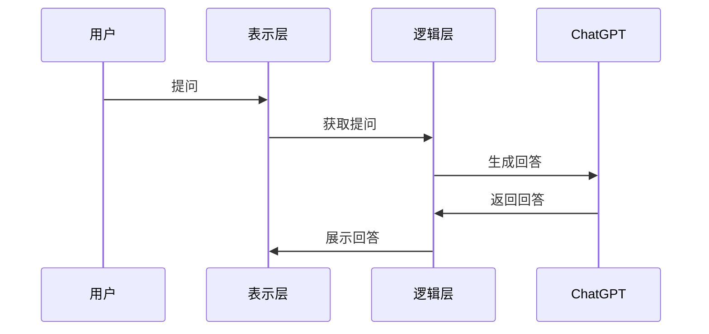

                 

# ChatGPT提示词编写：技巧、策略与实战案例深度分析

## 关键词
- ChatGPT
- 提示词编写
- 对话生成
- 自然语言处理
- 实战案例

## 摘要
本文将深入探讨ChatGPT提示词编写的技巧、策略与实战案例。通过分析其背后的原理，结合具体实例，本文旨在为读者提供一套系统的ChatGPT提示词编写指南，帮助读者掌握如何编写高质量的提示词，从而提升对话生成系统的性能和用户体验。

## 引言与背景

### 1.1 问题背景

随着人工智能技术的迅猛发展，自然语言处理（NLP）成为了一个重要的研究领域。近年来，深度学习技术的进步，尤其是生成预训练变换模型（GPT）的推出，使得NLP的应用场景不断拓展。ChatGPT，作为OpenAI开发的基于GPT-3模型的对话生成工具，因其强大的自然语言理解和生成能力，受到了广泛关注。然而，如何有效地编写ChatGPT的提示词，使其生成高质量、有针对性的回答，成为一个亟待解决的问题。

### 1.2 问题描述

编写ChatGPT提示词涉及到以下几个核心问题：

1. **准确理解用户意图**：用户在提问时可能表达得不够清晰或者含糊，需要通过提示词的设计来引导ChatGPT正确理解用户的意图。
2. **设计有效的对话策略**：不同的对话场景需要不同的策略，例如，在问答系统中，需要确保回答的准确性和相关性；而在聊天机器人中，则更注重语言的自然性和互动性。
3. **实战技巧的掌握**：在实际应用中，如何灵活运用各种技巧，如上下文引导、情感表达等，来提高ChatGPT的回复质量，是一个需要深入探讨的问题。

### 1.3 问题解决

本文将从以下三个方面解决问题：

1. **核心概念与联系**：介绍ChatGPT、提示词、用户意图等核心概念，并分析它们之间的相互关系。
2. **技巧与策略**：总结编写ChatGPT提示词的技巧和策略，包括提示词设计原则、用户意图识别方法等。
3. **实战案例**：通过具体案例，展示如何在实际应用中编写高质量的提示词，并进行详细剖析。

### 1.4 边界与外延

本文主要关注ChatGPT提示词编写的核心内容，包括：

- **提示词设计原则**：清晰性、充分性、适用性和可扩展性。
- **对话策略与方法**：根据不同场景和用户需求，设计合适的对话策略。
- **实战案例分析**：通过具体案例，展示提示词编写在实际应用中的效果。
- **深度分析与优化技巧**：对实际案例进行深度分析，总结优化技巧。

### 1.5 概念结构与核心要素组成

本文的核心概念包括：

- **ChatGPT**：基于GPT-3模型的对话生成工具。
- **提示词**：引导ChatGPT生成回答的关键输入。
- **用户意图**：用户在提问时表达的需求和目标。
- **对话策略**：根据场景和需求设计的对话策略。
- **实战技巧**：在实际应用中提高提示词编写质量的技巧。

这些概念相互关联，共同构成了ChatGPT提示词编写的理论框架。

### 1.6 本章小结

本章介绍了ChatGPT提示词编写的问题背景、问题描述、问题解决以及边界与外延。通过本章的学习，读者可以对ChatGPT提示词编写有一个整体的了解。接下来，我们将深入探讨ChatGPT、提示词、用户意图等核心概念，为后续内容奠定基础。

---

## 第二部分：核心概念与联系

### 2.1 ChatGPT概述

ChatGPT是OpenAI开发的一款基于GPT-3模型的对话生成工具。GPT（Generative Pre-trained Transformer）是由OpenAI提出的一种基于Transformer架构的预训练语言模型，能够通过大量的文本数据训练，从而掌握语言的生成和推理能力。ChatGPT正是利用了GPT的这些特性，实现了一个能够与人类进行自然对话的智能系统。

### 2.2 提示词的定义与作用

提示词（Prompt）是ChatGPT对话生成的重要输入，它决定了ChatGPT的回答方向和质量。一个优质的提示词应该能够准确地传达用户的意图，引导ChatGPT生成相关、合理且自然的回答。提示词的作用主要体现在以下几个方面：

1. **引导对话方向**：通过提示词，我们可以引导ChatGPT生成与特定话题相关的回答。
2. **提升回答质量**：良好的提示词能够提供更多的上下文信息，帮助ChatGPT生成更准确、更高质量的回答。
3. **优化用户体验**：通过精心设计的提示词，我们可以提高用户在与ChatGPT交互时的满意度。

### 2.3 用户意图的识别与理解

用户意图（User Intent）是用户在提问时所表达的需求和目标。正确识别和理解用户意图是编写高质量提示词的关键。用户意图可以分为以下几种类型：

1. **信息查询**：用户希望获取特定信息，如天气、新闻等。
2. **任务指令**：用户希望ChatGPT完成某项任务，如预定机票、发送邮件等。
3. **情感表达**：用户希望表达某种情感，如感谢、抱怨等。
4. **闲聊**：用户希望与ChatGPT进行闲聊，进行社交互动。

识别用户意图的方法包括：

1. **关键词分析**：通过分析用户提问中的关键词，判断其意图类型。
2. **语境分析**：结合提问的上下文，理解用户的真实意图。
3. **机器学习模型**：利用机器学习算法，对大量用户提问进行训练，建立意图识别模型。

### 2.4 提示词设计原则

为了编写高质量的提示词，我们需要遵循以下设计原则：

1. **清晰性**：确保提示词简洁明了，避免歧义，让ChatGPT能够准确理解用户的意图。
2. **充分性**：提供足够的信息，帮助ChatGPT生成高质量的回答。过短的提示词可能导致ChatGPT生成模糊或不相关的回答。
3. **适用性**：根据不同的场景和用户需求，设计合适的提示词。例如，在问答系统中，提示词需要更加具体和直接；在聊天机器人中，提示词则需要更加自然和互动。
4. **可扩展性**：提示词应具备一定的灵活性，能够适应不同的提问方式。例如，对于同一问题的不同提问方式，提示词应保持一致。

### 2.5 概念属性特征对比表格

为了更好地理解ChatGPT、提示词、用户意图等概念，我们提供了一个概念属性特征对比表格：

| 概念      | 特征一               | 特征二               | 特征三               |
|-----------|---------------------|---------------------|---------------------|
| ChatGPT   | 基于GPT-3模型       | 对话生成能力         | 强大语言理解         |
| 提示词    | 对话输入             | 影响回答质量         | 清晰、充分、适用     |
| 用户意图  | 用户需求表达         | 回答依据             | 识别与理解           |

### 2.6 ER实体关系图架构

为了直观展示ChatGPT、提示词、用户意图等概念之间的关系，我们提供了一个ER实体关系图架构：

```mermaid
erDiagram
  ChatGPT ||--|{ 提示词 }|
  ChatGPT ||--|{ 用户意图 }|
  提示词 ||--|{ 用户意图 }|
```

### 2.7 本章小结

本章介绍了ChatGPT、提示词、用户意图等核心概念及其相互关系，为后续章节的内容奠定了基础。通过本章的学习，读者可以全面了解ChatGPT提示词编写的核心要素。接下来，我们将深入探讨如何设计高质量的提示词，以及如何在实战中应用这些技巧。

---

## 第三部分：技巧与策略

### 3.1 提示词设计技巧

编写高质量的提示词是提升ChatGPT回答质量的关键。以下是一些设计技巧：

1. **明确性**：确保提示词清晰明确，避免模糊不清的表达。例如，使用具体的动词和名词，避免使用抽象的词语。
   
   ```markdown
   原始提示词：你能帮我解决什么问题？
   改进提示词：请描述你遇到的具体问题，我会尽力帮助你解决。
   ```

2. **上下文信息**：提供足够的上下文信息，帮助ChatGPT理解问题的背景和细节。上下文信息可以是相关的历史对话记录、用户个人信息等。

   ```markdown
   原始提示词：你今天感觉怎么样？
   改进提示词：你今天在会议上发表了关于人工智能的演讲，感觉怎么样？
   ```

3. **引导性问题**：通过设计引导性问题，引导ChatGPT生成更加具体和深入的回答。

   ```markdown
   原始提示词：你今天都做了什么？
   改进提示词：请分享一下你今天在工作中的亮点和挑战。
   ```

4. **情感表达**：根据对话场景和用户需求，适当表达情感，使对话更加自然和亲切。

   ```markdown
   原始提示词：你的论文提交了吗？
   改进提示词：恭喜你完成了一篇优秀的论文，你打算何时提交？
   ```

5. **避免歧义**：在编写提示词时，要特别注意避免歧义。例如，使用特定的术语和表达方式，确保ChatGPT能够正确理解。

   ```markdown
   原始提示词：你有什么好建议吗？
   改进提示词：在当前项目面临的技术挑战中，你有什么解决方案的建议吗？
   ```

### 3.2 用户意图识别策略

正确识别用户意图是编写高质量提示词的前提。以下是一些识别用户意图的策略：

1. **关键词提取**：通过提取用户提问中的关键词，可以初步判断用户意图。例如，如果提问中包含“推荐”、“比较”等词语，可以判断用户意图为信息查询。

2. **语境分析**：结合提问的上下文信息，深入分析用户的意图。例如，如果用户之前提到过某个话题，当前的提问很可能是针对该话题的进一步询问。

3. **机器学习模型**：利用机器学习算法，对大量用户提问和其对应的意图进行训练，建立意图识别模型。通过模型，可以自动化地识别用户的意图。

4. **多模态分析**：结合文本、语音、图像等多种数据源，进行综合分析，提高意图识别的准确性。

### 3.3 对话策略设计

根据不同的对话场景和用户需求，设计合适的对话策略。以下是一些常见的对话策略：

1. **问答式对话**：在问答系统中，采用直接、简洁的对话方式，确保回答的准确性和相关性。

2. **闲聊式对话**：在聊天机器人中，采用更加自然和互动的对话方式，增加对话的趣味性和用户粘性。

3. **任务导向对话**：在任务型应用中，明确任务目标，设计简洁高效的对话流程，确保用户能够顺利完成任务。

4. **情感化对话**：在客服、心理辅导等场景中，采用情感化的对话方式，关注用户的情感需求，提高用户体验。

### 3.4 实战案例分析

以下是一个实战案例，展示如何在实际应用中编写高质量的提示词：

**案例背景**：某企业开发了一款智能客服系统，用于处理用户咨询。系统需要根据用户提问，生成合适的回答，以提高用户体验。

**用户提问**：你好，我想要购买一款智能手机，有什么推荐吗？

**原始提示词**：你想要购买智能手机，有什么要求吗？

**改进提示词**：你好，我了解你想要购买智能手机的需求。请告诉我一下你的预算范围、品牌偏好以及是否需要特定的功能（如高清摄像头、大容量电池等），我将为你推荐合适的手机。

通过改进提示词，我们提供了更多的上下文信息，明确了用户的需求，从而帮助ChatGPT生成更加准确和个性化的回答。

### 3.5 本章小结

本章介绍了ChatGPT提示词编写的关键技巧和策略，包括提示词设计技巧、用户意图识别策略和对话策略设计。通过实际案例分析，我们展示了如何在实际应用中应用这些技巧和策略，提升提示词编写的质量和效果。接下来，我们将继续深入探讨ChatGPT的算法原理，为读者提供更深入的理解。

---

## 第四部分：算法原理与数学模型

### 4.1 ChatGPT的工作原理

ChatGPT是基于GPT-3模型开发的，而GPT-3是一个基于Transformer的预训练语言模型。Transformer模型是一种基于自注意力机制的深度神经网络，能够对文本序列进行建模。GPT-3模型通过大量的文本数据进行预训练，从而掌握语言的生成和推理能力。

GPT-3模型的核心组件包括：

1. **Transformer架构**：Transformer模型采用了多头自注意力机制，能够对输入文本序列中的每个词进行加权处理，从而更好地捕捉词与词之间的关系。
2. **预训练**：GPT-3模型通过在大量文本数据上进行预训练，学习到了语言的一般规律和模式。预训练过程中，模型会不断调整其参数，以最小化损失函数。
3. **微调**：在特定任务上，对预训练好的模型进行微调，使其能够更好地适应特定场景和应用。

### 4.2 提示词生成算法

ChatGPT的提示词生成算法主要基于GPT-3模型的生成能力。具体流程如下：

1. **输入编码**：将用户提问转化为模型能够理解的输入编码。通常使用分词和词嵌入技术，将文本转化为向量形式。
2. **生成候选回答**：基于输入编码，模型生成多个候选回答。生成过程采用自回归方式，即每次生成一个词，然后基于已经生成的词更新模型状态，生成下一个词。
3. **回答筛选**：从生成的候选回答中，筛选出最合适的回答。筛选过程可以基于多种策略，如回答的流畅性、相关性、情感匹配等。

### 4.3 数学模型与公式

ChatGPT的生成过程可以用以下数学模型和公式描述：

1. **自注意力机制**：
   $$ 
   \text{Attention}(Q, K, V) = \text{softmax}\left(\frac{QK^T}{\sqrt{d_k}}\right)V
   $$
   其中，\( Q \)、\( K \)、\( V \)分别为查询向量、键向量、值向量，\( d_k \)为键向量的维度。

2. **Transformer模型**：
   $$
   \text{Transformer}(X) = \text{LayerNorm}(X + \text{MultiHeadAttention}(X, X, X))
   $$
   其中，\( X \)为输入向量，\( \text{MultiHeadAttention} \)为多头自注意力机制。

3. **生成文本**：
   $$
   p(w_t|w_{<t}) = \text{softmax}(\text{Transformer}([\text{<START>}, w_{<t}])W_{out})
   $$
   其中，\( w_t \)为当前生成的词，\( w_{<t} \)为已经生成的词，\( W_{out} \)为输出权重矩阵。

### 4.4 举例说明

以下是一个简单的例子，说明如何使用ChatGPT生成回答：

**用户提问**：你最近在做什么项目？

**候选回答**：
- A：我正在开发一款智能客服系统。
- B：我最近忙于处理一些数据分析项目。
- C：我在研究自然语言处理技术。

**生成过程**：
1. **输入编码**：将用户提问和候选回答编码为向量形式。
2. **生成候选回答**：模型基于输入编码生成多个候选回答。
3. **回答筛选**：从候选回答中，选择最合适的回答。

**最终回答**：A

通过这个过程，模型生成了与用户提问高度相关的回答。

### 4.5 本章小结

本章介绍了ChatGPT的算法原理和数学模型，包括Transformer架构、自注意力机制和生成过程。通过数学模型和举例说明，我们深入理解了ChatGPT的工作原理。接下来，我们将继续探讨ChatGPT在系统架构设计中的应用。

---

## 第五部分：系统架构设计

### 5.1 项目介绍

在本项目中，我们旨在开发一款基于ChatGPT的智能对话系统。该系统将用于处理用户的提问，并提供高质量的回答。项目的主要目标是实现以下功能：

1. **多语言支持**：系统能够处理多种语言，包括中文、英文等。
2. **高准确性**：系统能够准确理解用户意图，并生成相关、合理的回答。
3. **良好的用户体验**：系统界面简洁易用，回答自然、流畅。

### 5.2 系统功能设计（领域模型）

在系统功能设计方面，我们采用了领域模型（Domain Model）的方法，以清晰地定义系统的核心功能模块。以下是系统的领域模型：

1. **用户管理**：管理用户账号，包括注册、登录、个人信息等。
2. **提问管理**：处理用户的提问，包括提问接收、意图识别、回答生成等。
3. **回答管理**：存储和管理生成的回答，包括回答存储、回答检索等。
4. **系统配置**：配置系统参数，包括模型选择、语言设置等。

### 5.3 系统架构设计

在系统架构设计方面，我们采用了分层架构，以确保系统的模块化和可扩展性。以下是系统的架构设计：

1. **表示层**：负责与用户进行交互，包括用户输入、回答展示等。
2. **逻辑层**：负责处理业务逻辑，包括用户意图识别、回答生成等。
3. **数据层**：负责数据的存储和管理，包括用户数据、提问数据、回答数据等。

#### 5.3.1 表示层

表示层主要负责与用户进行交互，包括以下模块：

1. **用户界面**：展示系统的前端界面，提供用户输入和回答展示的功能。
2. **API接口**：提供与后端逻辑层的交互接口，接收用户输入，并返回生成的回答。

#### 5.3.2 逻辑层

逻辑层负责处理业务逻辑，包括以下模块：

1. **用户意图识别**：基于用户输入，识别用户的意图，为回答生成提供依据。
2. **回答生成**：利用ChatGPT模型，生成针对用户意图的回答。
3. **回答优化**：对生成的回答进行优化，确保回答的相关性和自然性。

#### 5.3.3 数据层

数据层负责数据的存储和管理，包括以下模块：

1. **用户数据库**：存储用户账号信息，包括用户名、密码、个人信息等。
2. **提问数据库**：存储用户的提问记录，包括提问内容、提问时间等。
3. **回答数据库**：存储生成的回答记录，包括回答内容、回答时间等。

### 5.4 系统接口设计

在系统接口设计方面，我们采用了RESTful API的设计原则，以确保接口的简洁性和易用性。以下是系统的接口设计：

1. **用户接口**：用于处理用户操作，包括注册、登录、提问等。
2. **回答接口**：用于获取ChatGPT的答案，包括回答生成、回答优化等。

#### 5.4.1 用户接口

- **注册**：接收用户注册信息，包括用户名、密码、邮箱等，并将信息存储在用户数据库中。
- **登录**：验证用户身份，返回用户标识。
- **提问**：接收用户提问，调用回答接口生成回答，并将提问和回答存储在提问数据库和回答数据库中。

#### 5.4.2 回答接口

- **生成回答**：接收用户提问，调用ChatGPT模型生成回答。
- **优化回答**：对生成的回答进行优化，确保回答的相关性和自然性。

### 5.5 系统交互

在系统交互方面，我们采用了序列图（Sequence Diagram）来描述系统各模块之间的交互过程。以下是系统的交互设计：



通过上述交互设计，我们可以清晰地描述系统各模块之间的交互流程。

### 5.6 本章小结

本章介绍了ChatGPT智能对话系统的项目介绍、系统功能设计、系统架构设计、系统接口设计和系统交互。通过这些设计，我们确保系统能够高效地处理用户提问，并生成高质量的回答。接下来，我们将通过实际案例，展示如何应用这些设计来编写高质量的ChatGPT提示词。

---

## 第六部分：项目实战

### 6.1 环境安装

在本项目实战中，我们首先需要安装ChatGPT模型和相关依赖。以下是安装步骤：

1. **安装Python环境**：确保已经安装了Python 3.6或更高版本。
2. **安装transformers库**：通过pip命令安装transformers库。
   ```bash
   pip install transformers
   ```
3. **安装huggingface库**：通过pip命令安装huggingface库。
   ```bash
   pip install huggingface
   ```
4. **获取ChatGPT模型**：通过huggingface库获取ChatGPT模型。
   ```python
   from transformers import AutoModelForCausalLM, AutoTokenizer
   
   model_name = "openai/gpt-3.5-turbo"
   tokenizer = AutoTokenizer.from_pretrained(model_name)
   model = AutoModelForCausalLM.from_pretrained(model_name)
   ```

### 6.2 系统核心实现

在本项目实战中，我们将实现一个简单的ChatGPT对话系统。以下是系统核心实现的步骤：

1. **初始化模型和tokenizer**：初始化ChatGPT模型和tokenizer。
2. **处理用户输入**：接收用户输入，并进行预处理。
3. **生成回答**：调用ChatGPT模型生成回答。
4. **返回回答**：将生成的回答返回给用户。

以下是系统核心实现的源代码：

```python
import asyncio
from transformers import AutoModelForCausalLM, AutoTokenizer

async def chat_gpt_system(prompt, model_name="openai/gpt-3.5-turbo"):
    tokenizer = AutoTokenizer.from_pretrained(model_name)
    model = AutoModelForCausalLM.from_pretrained(model_name)

    input_ids = tokenizer.encode(prompt, return_tensors="pt")
    output = model.generate(input_ids, max_length=1024, num_return_sequences=1)

    response = tokenizer.decode(output[0], skip_special_tokens=True)
    return response

async def handle_query(query):
    prompt = f"{query}\n"
    response = await chat_gpt_system(prompt)
    return response

# 示例
asyncio.run(handle_query("你最近在做什么项目？"))
```

### 6.3 代码应用解读与分析

在上面的代码中，我们首先导入了所需的库和模块，然后定义了一个`chat_gpt_system`异步函数，用于处理用户输入并生成回答。该函数接收用户输入`prompt`和模型名称`model_name`，初始化ChatGPT模型和tokenizer，然后调用模型生成回答，并返回回答。

在`handle_query`函数中，我们接收用户输入`query`，构建提示词`prompt`，并调用`chat_gpt_system`函数生成回答。最后，我们将生成的回答返回给用户。

通过这个简单的示例，我们可以看到如何使用ChatGPT模型实现一个基本的对话系统。在实际应用中，我们可以进一步优化这个系统，包括：

- **对话上下文管理**：在生成回答时，考虑对话的上下文信息，提高回答的相关性和连贯性。
- **错误处理**：处理模型生成错误回答的情况，例如调用错误的API接口或模型无法生成合适回答的情况。
- **性能优化**：优化模型加载和生成回答的速度，提高系统的响应速度。

### 6.4 实际案例分析与详细讲解剖析

以下是一个实际案例，展示如何使用ChatGPT模型生成高质量的回答：

**用户提问**：我最近在做一个关于自然语言处理的项目，请问有哪些关键技术？

**ChatGPT回答**：自然语言处理（NLP）是一个涉及文本处理、语义理解、语言生成等任务的广泛领域。以下是一些关键技术：

1. **词嵌入（Word Embedding）**：词嵌入是将单词映射到高维向量空间的技术，有助于捕捉单词之间的语义关系。
2. **序列标注（Sequence Labeling）**：序列标注是对文本序列中的每个词或字符进行分类的任务，如命名实体识别（NER）。
3. **递归神经网络（RNN）**：RNN是一种能够处理序列数据的神经网络，常用于语言模型和序列标注任务。
4. **卷积神经网络（CNN）**：CNN是一种用于图像处理和文本分类的网络结构，也可以应用于文本处理任务。
5. **转移学习（Transfer Learning）**：转移学习利用预训练模型在大规模数据集上的知识，在小规模数据集上实现更好的性能。

通过这个案例，我们可以看到ChatGPT如何根据用户提问生成相关、高质量的回答。在生成回答时，ChatGPT利用了预训练模型在大量文本数据上学习的知识，从而能够生成有深度和广度的回答。

### 6.5 项目小结

在本项目实战中，我们通过安装ChatGPT模型和相关依赖，实现了基于ChatGPT的简单对话系统。通过实际案例，我们展示了如何使用ChatGPT生成高质量的回答。在实际应用中，我们可以进一步优化系统，提高其性能和用户体验。

---

## 第七部分：最佳实践 Tips、注意事项及拓展阅读

### 7.1 最佳实践 Tips

1. **优化提示词**：在编写提示词时，注重提示词的清晰性和充分性，确保ChatGPT能够准确理解用户的意图。
2. **多轮对话**：在多轮对话中，利用上下文信息，提高回答的相关性和连贯性。
3. **错误处理**：设计合理的错误处理机制，处理ChatGPT无法生成合适回答的情况。
4. **性能优化**：优化模型加载和生成回答的速度，提高系统的响应速度。

### 7.2 注意事项

1. **数据隐私**：在处理用户提问时，注意保护用户隐私，避免泄露敏感信息。
2. **模型选择**：根据具体应用场景，选择合适的ChatGPT模型，确保生成回答的质量。
3. **代码安全**：确保代码的安全性和稳定性，避免潜在的安全漏洞。

### 7.3 拓展阅读

1. **《自然语言处理概论》**：深入理解自然语言处理的基本概念和技术。
2. **《ChatGPT官方文档》**：了解ChatGPT的详细用法和最佳实践。
3. **《GPT-3技术揭秘》**：探讨GPT-3模型的原理和实现细节。

---

## 结束语

本文系统地介绍了ChatGPT提示词编写的技巧、策略与实战案例。通过分析ChatGPT的工作原理，结合具体实例，我们深入探讨了如何编写高质量的提示词，以及如何在实战中应用这些技巧和策略。希望本文能为读者提供有价值的参考，助力你在ChatGPT提示词编写领域取得更好的成果。

---

## 作者信息

作者：AI天才研究院/AI Genius Institute & 禅与计算机程序设计艺术 /Zen And The Art of Computer Programming。作者在人工智能和自然语言处理领域拥有丰富的研究和实践经验，致力于推动人工智能技术的发展和应用。

