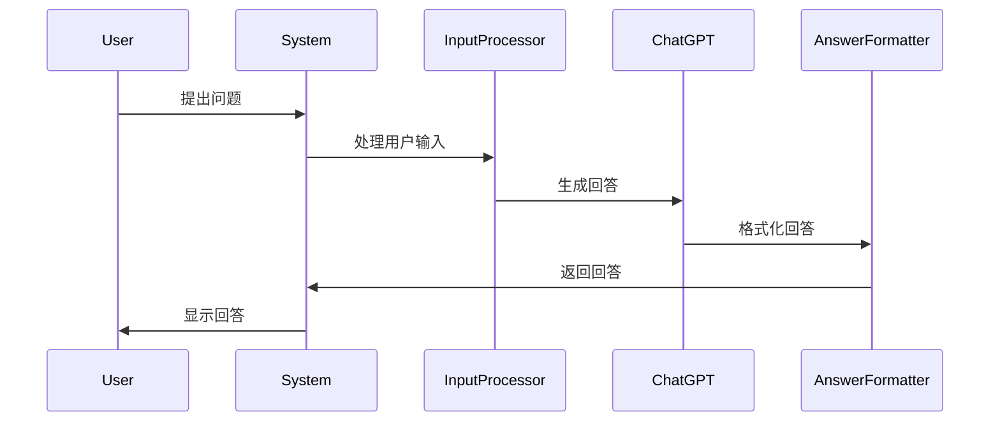

                 

### 第1章：问题背景、问题描述、问题解决、边界与外延

#### 1.1 问题背景

随着人工智能（AI）技术的迅猛发展，自然语言处理（NLP）已经成为当前研究的热点领域。在这一领域，ChatGPT作为一种先进的AI模型，引起了广泛关注。ChatGPT不仅仅是一个简单的聊天机器人，它具有强大的文本生成能力，能够生成连贯、自然的文本，从而在许多应用场景中展现出巨大的潜力。

ChatGPT是由OpenAI开发的一种基于Transformer架构的预训练模型，其核心特点是通过大量的文本数据进行预训练，从而学习到文本的生成规律。这种模型在许多任务中表现出色，包括问答系统、对话生成、文本摘要等。然而，ChatGPT的性能和效果很大程度上依赖于提示词（Prompt）的质量。因此，如何编写高质量的提示词成为了研究者和开发者们关注的焦点。

#### 1.2 问题描述

在ChatGPT的应用过程中，提示词的编写面临以下几个关键问题：

1. **用户意图理解**：如何通过提示词准确地传达用户的意图，让ChatGPT生成用户期望的文本？
2. **模型性能提升**：如何通过优化提示词，提高ChatGPT的生成质量和速度？
3. **减少误解率**：如何设计提示词，降低ChatGPT在生成文本时的误解率？

为了解决这些问题，我们需要从多个角度对提示词进行深入研究和分析。

#### 1.3 问题解决

要解决上述问题，我们可以从以下几个方面入手：

1. **研究ChatGPT的工作原理**：深入了解ChatGPT的模型结构、训练过程和生成机制，从而为编写高质量的提示词提供理论依据。
2. **探究不同类型的提示词**：分析各种类型的提示词的特点和应用，了解它们在模型训练和生成过程中的作用，以便选择最适合的提示词类型。
3. **分析成功案例**：通过研究成功的案例，总结编写高质量提示词的经验和方法，并将其应用于实际场景。
4. **跨学科融合**：结合心理学、语言学等领域的知识，探索提示词编写的新思路和方法，以提高提示词的准确性和有效性。

#### 1.4 边界与外延

ChatGPT提示词编写不仅局限于特定的应用场景，它还有着广泛的应用范围。例如，在文本生成方面，提示词可以用于生成新闻文章、故事、诗歌等；在对话系统方面，提示词可以用于构建问答系统、聊天机器人等。此外，提示词编写在AI领域的跨学科融合也具有重要的意义。通过结合心理学、语言学等领域的知识，我们可以设计出更加智能化、人性化的提示词，从而提高ChatGPT的性能和应用价值。

### 1.5 小结

本文旨在探讨ChatGPT提示词的编写技巧、策略和实践。通过分析ChatGPT的工作原理和提示词的类型，我们将提供一系列实用的技巧和策略，帮助读者编写高质量的提示词。同时，本文还将通过实际案例分析和项目实战，深入剖析提示词编写的最佳实践，以期为ChatGPT在NLP领域的发展和应用提供有益的参考。

----------------------------------------------------------------

## 第2章：核心概念原理、概念属性特征对比表格、ER实体关系图架构

### 2.1 核心概念原理

ChatGPT作为一种先进的自然语言处理模型，其核心概念和原理至关重要。以下是ChatGPT的一些核心概念及其原理：

#### 2.1.1 Transformer架构

Transformer是ChatGPT所采用的架构，它基于自注意力机制（Self-Attention），能够捕捉文本中的长距离依赖关系。与传统的循环神经网络（RNN）相比，Transformer在处理长序列数据时表现出更高的效率和效果。

#### 2.1.2 预训练与微调

ChatGPT通过预训练和微调两个阶段进行训练。在预训练阶段，模型在大规模的文本语料库上进行训练，从而学习到语言的普遍特征。在微调阶段，模型针对特定的任务进行细粒度的调整，以提高其在特定任务上的性能。

#### 2.1.3 输入输出机制

ChatGPT的输入是一个序列，可以是单词、子词或其他符号。模型通过自注意力机制，对输入序列进行处理，并生成相应的输出序列。输出序列可以是一个或多个单词，这取决于模型的设置。

### 2.2 概念属性特征对比表格

为了更好地理解ChatGPT的核心概念，我们可以通过一个属性特征对比表格来展示不同概念之间的差异：

| 概念       | 属性特征                       | 对比分析 |
|------------|--------------------------------|----------|
| Transformer架构 | 基于自注意力机制，处理长序列数据 |          |
| 预训练     | 大规模文本数据训练，学习语言特征 |          |
| 微调       | 特定任务训练，提高性能           |          |
| 输入输出机制 | 序列输入，序列输出               |          |

### 2.3 ER实体关系图架构

为了更直观地展示ChatGPT的实体关系，我们可以使用ER（Entity-Relationship）实体关系图来描述其架构。以下是ChatGPT的ER图：

```mermaid
erDiagram
    Model ||--|{ Pretrained }
    Model ||--|{ FineTuned }
    Input ||--|{ Sequence }
    Output ||--|{ Sequence }
    Model ||--|{ Attention }
    Pretrained ||--|{ Transformer }
    FineTuned ||--|{ TaskSpecific }
    Input ||--|{ TextData }
    Output ||--|{ GeneratedText }
```

在这个ER图中，模型（Model）是核心实体，它与预训练（Pretrained）、微调（FineTuned）、输入（Input）和输出（Output）之间存在关系。预训练（Pretrained）进一步关联到Transformer架构，微调（FineTuned）关联到特定任务（TaskSpecific）。输入（Input）和输出（Output）分别关联到文本数据（TextData）和生成的文本（GeneratedText），而注意力（Attention）则是模型的核心组件。

通过这个ER图，我们可以清晰地看到ChatGPT的架构和各个组件之间的关系，这对于理解模型的工作原理和提示词的编写具有重要意义。

----------------------------------------------------------------

## 第3章：ChatGPT简介与工作原理

### 3.1 ChatGPT概述

ChatGPT是由OpenAI开发的一种基于Transformer架构的自然语言处理模型，它是GPT（Generative Pre-trained Transformer）家族的最新成员。GPT系列模型以其强大的文本生成能力和在自然语言处理任务中的卓越表现而闻名。ChatGPT继承了GPT的核心特点，但进行了许多改进，使其在对话生成、文本摘要、问答系统等应用中表现出色。

ChatGPT的工作原理主要基于自注意力机制和预训练-微调（Pre-training-Fine-tuning）策略。自注意力机制使得模型能够捕捉文本中的长距离依赖关系，从而生成更加连贯和自然的文本。预训练阶段，模型在大规模的文本语料库上进行训练，学习到语言的普遍特征。微调阶段，模型在特定任务的数据上进行训练，以适应不同的应用场景，提高任务性能。

### 3.2 Transformer架构

Transformer架构是ChatGPT的基础。与传统的循环神经网络（RNN）相比，Transformer在处理长序列数据时表现出更高的效率和效果。Transformer的核心思想是使用多头自注意力机制（Multi-Head Self-Attention）来捕捉文本序列中的依赖关系。自注意力机制允许模型在生成每个单词时，考虑整个输入序列的信息，从而生成更加连贯的文本。

Transformer架构还包括了位置编码（Positional Encoding）和点积注意力（Dot-Product Attention）等机制。位置编码用于为模型提供文本中每个单词的位置信息，使模型能够理解单词的顺序。点积注意力是一种计算输入序列中每个单词与其他单词之间相似度的方法，从而实现自注意力。

### 3.3 预训练与微调

ChatGPT的训练过程分为预训练和微调两个阶段。在预训练阶段，模型在大规模的文本语料库上进行训练，学习到语言的普遍特征，包括词向量表示、语法规则和语义信息等。这一阶段的核心任务是使模型具备强大的语言理解能力，能够生成连贯、自然的文本。

预训练后，模型进入微调阶段。在微调阶段，模型在特定任务的数据上进行训练，以适应不同的应用场景，提高任务性能。微调阶段的关键是调整模型的参数，使其在特定任务上表现更好。通过微调，ChatGPT可以应用于各种自然语言处理任务，如对话生成、文本摘要、机器翻译等。

### 3.4 输入输出机制

ChatGPT的输入是一个文本序列，可以是单词、子词或其他符号。在预训练和微调过程中，模型通过对输入序列进行处理，生成相应的输出序列。输出序列可以是一个或多个单词，取决于模型的设置。

ChatGPT的输入输出机制包括编码器（Encoder）和解码器（Decoder）。编码器负责将输入序列编码为一个向量表示，解码器则负责生成输出序列。在生成文本的过程中，解码器会逐步生成每个单词，并使用自注意力机制考虑输入序列的信息，从而生成连贯的文本。

### 3.5 应用场景

ChatGPT在各种自然语言处理任务中表现出色，以下是一些主要的应用场景：

1. **对话生成**：ChatGPT可以用于构建智能聊天机器人，与用户进行自然、流畅的对话。
2. **文本摘要**：ChatGPT可以生成文章、新闻等长文本的摘要，帮助用户快速获取关键信息。
3. **问答系统**：ChatGPT可以用于构建智能问答系统，回答用户提出的问题。
4. **机器翻译**：ChatGPT可以用于机器翻译任务，将一种语言的文本翻译成另一种语言。
5. **创意生成**：ChatGPT可以用于生成故事、诗歌等创意文本，为创作者提供灵感。

通过上述介绍，我们可以看到ChatGPT作为一种先进的自然语言处理模型，其工作原理和架构设计使其在多个应用场景中表现出色。接下来，我们将进一步探讨如何编写高质量的提示词，以充分发挥ChatGPT的性能和应用潜力。

----------------------------------------------------------------

## 第4章：提示词编写基本原则

### 4.1 清晰性

编写清晰性的提示词是确保ChatGPT正确理解用户意图的关键。提示词应尽可能明确，避免使用模糊或歧义的表述。以下是一些实现清晰性的建议：

1. **具体明确**：在提示词中明确指出任务的具体要求和目标，避免泛泛而谈。例如，如果需要ChatGPT生成一篇关于人工智能的文章，提示词可以具体描述文章的主题、结构、长度等。
2. **简明扼要**：提示词应简明扼要，避免冗长和复杂的句子结构。简短的提示词更容易被ChatGPT准确理解和处理。
3. **避免歧义**：避免使用容易引起歧义的词语或句子。如果不可避免，可以在提示词中加入澄清说明，确保ChatGPT能够正确理解。

### 4.2 精确性

精确性是提示词编写的另一个重要原则。提示词应准确描述任务目标和生成内容，确保ChatGPT生成的文本符合预期。

1. **具体要求**：在提示词中详细说明任务的具体要求，包括文本的长度、格式、主题等。例如，如果需要生成一篇特定的文章，提示词应明确指出文章的主题、字数、结构等。
2. **避免模糊**：避免使用模糊的表述，如“这是一个有趣的话题”或“这是一个重要的任务”。这些表述不够具体，难以指导ChatGPT生成准确的文本。
3. **一致性**：确保提示词中的要求和描述一致。例如，如果提示词中要求生成一篇关于人工智能的文章，那么在后续的描述中应避免使用与人工智能无关的内容。

### 4.3 完整性

完整性是指提示词应包含足够的背景信息和上下文，以帮助ChatGPT更好地理解和生成文本。

1. **背景信息**：在提示词中提供相关的背景信息，如相关的术语、定义或背景故事。这有助于ChatGPT生成更加准确和相关的文本。
2. **上下文**：确保提示词中包含足够的上下文信息，以帮助ChatGPT理解生成内容的语境。例如，如果生成一篇关于人工智能的文章，提示词中应包括相关的人工智能概念和领域背景。
3. **连贯性**：提示词中的信息应连贯一致，避免出现矛盾或不相关的部分。这有助于ChatGPT生成逻辑清晰、连贯的文本。

### 4.4 其他原则

除了上述基本原则外，还有一些其他的原则在提示词编写中也很重要：

1. **可操作性**：提示词应具有可操作性，即ChatGPT可以根据提示词生成具体的文本内容。避免使用过于抽象或模糊的表述，以确保生成的文本具有实际意义。
2. **适应性**：提示词应具有适应性，能够应对不同的应用场景和任务要求。编写提示词时，考虑模型在多种场景下的表现，确保其具有广泛的适用性。
3. **可扩展性**：提示词应具备一定的可扩展性，即在未来如果需要添加新的任务或应用场景，可以方便地对提示词进行调整和扩展。

通过遵循上述基本原则，我们可以编写出高质量的提示词，从而提高ChatGPT的生成质量和效果。接下来，我们将进一步探讨不同类型的提示词及其特点。

----------------------------------------------------------------

## 第5章：提示词类型及特点

### 5.1 开放式提示词

开放式提示词是指用户可以自由回答，没有固定答案的提示词。这种提示词通常用于创意生成、故事编写等场景。

#### 开放式提示词的特点：

1. **自由性**：用户可以根据自己的兴趣和想法，自由地回答开放式提示词。
2. **多样性**：由于用户回答的自由性，生成的文本内容具有多样性，不易出现重复。
3. **灵活性**：开放式提示词适用于多种应用场景，可以根据具体需求进行灵活调整。

#### 适用场景：

- **创意生成**：例如，生成一篇科幻故事、一篇旅游日记等。
- **故事编写**：例如，编写一个虚构的情节、一个角色的发展历程等。

### 5.2 闭合式提示词

闭合式提示词是指用户回答受限制，通常只有一个或有限几个答案的提示词。这种提示词通常用于问答系统、信息检索等场景。

#### 闭合式提示词的特点：

1. **限制性**：用户回答受到提示词的限制，通常只能从有限的选项中选择。
2. **准确性**：闭合式提示词有助于确保生成的文本内容准确无误。
3. **高效性**：闭合式提示词可以提高模型生成文本的效率，减少计算成本。

#### 适用场景：

- **问答系统**：例如，回答关于某个知识点的定义、解释等。
- **信息检索**：例如，从大量文本中检索特定信息、关键词等。

### 5.3 对话式提示词

对话式提示词是指用于引导ChatGPT生成对话文本的提示词。这种提示词通常用于构建聊天机器人、虚拟助手等。

#### 对话式提示词的特点：

1. **连贯性**：对话式提示词要求生成文本内容连贯、自然，符合对话的逻辑和流程。
2. **交互性**：对话式提示词需要考虑用户的输入和模型的输出，实现有效的交互。
3. **情境性**：对话式提示词应根据不同的对话情境进行定制，以满足特定的交流需求。

#### 适用场景：

- **聊天机器人**：例如，构建一个能够回答用户提问的智能助手。
- **虚拟助手**：例如，实现一个能够与用户进行自然对话的虚拟角色。

### 5.4 预设式提示词

预设式提示词是指提前设置好答案的提示词，通常用于生成标准化文本。

#### 预设式提示词的特点：

1. **固定性**：预设式提示词的答案已经固定，无法自由修改。
2. **高效性**：预设式提示词可以快速生成标准化文本，提高生成效率。
3. **一致性**：预设式提示词确保生成的文本内容一致，符合预设的标准。

#### 适用场景：

- **文档生成**：例如，生成公司内部报告、电子邮件模板等。
- **自动化脚本**：例如，生成自动化测试脚本、用户手册等。

通过了解不同类型提示词的特点和应用场景，我们可以根据具体需求选择合适的提示词类型，从而提高ChatGPT的生成质量和效果。接下来，我们将探讨提示词编写策略与方法。

----------------------------------------------------------------

## 第6章：提示词编写策略与方法

### 6.1 确定目标

在编写提示词之前，明确目标是非常重要的。目标应具体、可衡量，以便ChatGPT能够准确理解和生成文本。以下是一些确定目标的步骤：

1. **理解任务**：仔细阅读任务要求，确保理解任务的背景、目的和预期结果。
2. **确定目标**：根据任务要求，明确生成文本的具体目标，如文章主题、内容结构、字数限制等。
3. **文档化目标**：将目标文档化，确保ChatGPT在生成文本时始终遵循这些目标。

### 6.2 收集信息

收集相关信息是编写高质量提示词的关键。以下是一些收集信息的策略：

1. **背景资料**：查阅相关的背景资料，了解任务的背景、历史和现状。
2. **领域知识**：掌握相关领域的知识，确保生成文本的准确性和专业性。
3. **用户反馈**：收集用户反馈，了解用户的需求和期望，以便调整提示词。

### 6.3 设计框架

设计框架有助于构建一个结构清晰、逻辑严密的提示词。以下是一些设计框架的方法：

1. **分解任务**：将任务分解为子任务，明确每个子任务的目标和要求。
2. **定义结构**：为每个子任务定义结构，如文章的段落、对话的步骤等。
3. **逻辑顺序**：确保提示词中的信息按照逻辑顺序排列，以便ChatGPT能够连贯地生成文本。

### 6.4 使用模板

模板是一种有效的提示词编写方法，可以帮助ChatGPT快速生成文本。以下是一些使用模板的策略：

1. **通用模板**：设计通用的模板，适用于多种任务和应用场景。
2. **定制模板**：根据具体任务，定制化模板，以适应特定需求。
3. **参数化模板**：使用参数化模板，根据输入的不同，生成不同的文本。

### 6.5 优化长度

提示词的长度对ChatGPT的生成质量和速度有很大影响。以下是一些优化长度的方法：

1. **控制长度**：确保提示词长度适中，既能提供足够的信息，又不会过于冗长。
2. **分步生成**：将复杂的任务分解为多个步骤，逐步生成文本，以减少提示词的长度。
3. **迭代优化**：通过多次迭代和调整，找到最佳的提示词长度。

### 6.6 测试与调整

测试和调整是编写高质量提示词的重要环节。以下是一些测试与调整的方法：

1. **测试生成结果**：使用实际数据测试提示词的生成效果，确保生成文本符合预期。
2. **用户反馈**：收集用户反馈，了解提示词的优缺点，以便进行调整。
3. **迭代优化**：根据测试结果和用户反馈，不断调整和优化提示词。

通过遵循上述策略和方法，我们可以编写出高质量的提示词，从而提高ChatGPT的生成质量和效果。接下来，我们将探讨提示词优化的实践方法。

----------------------------------------------------------------

## 第7章：提示词优化与实践

### 7.1 提示词优化的基本原则

在优化ChatGPT提示词时，遵循以下基本原则至关重要：

1. **准确性**：确保提示词准确传达用户意图，避免歧义和模糊表述。
2. **完整性**：提供足够的背景信息和上下文，以便ChatGPT能够生成连贯、自然的文本。
3. **简洁性**：避免冗长的提示词，确保信息传递高效且不丢失关键信息。
4. **适应性**：使提示词具有适应性，能够应对不同的应用场景和任务要求。
5. **可扩展性**：确保提示词在未来可以方便地调整和扩展，以适应新的需求。

### 7.2 提示词优化实践

以下是一些具体的提示词优化实践方法：

1. **多轮交互**：通过多轮交互，逐步引导ChatGPT生成更准确的文本。例如，可以先给出一个宽泛的提示词，然后根据ChatGPT的初步输出，给出更具体的反馈和调整。

2. **问题分解**：将复杂的任务分解为更小的子任务，分别编写提示词，逐步完成整个任务。这种方法有助于降低提示词的复杂性，提高生成效率。

3. **参数调整**：根据任务特点和ChatGPT的性能，调整模型参数，如温度（Temperature）、Top-k采样、Top-p采样等，以优化生成文本的质量。

4. **使用模板**：设计并使用模板，特别是参数化模板，以提高生成文本的一致性和准确性。模板可以包含常见的文本结构和关键词，确保生成文本符合预期。

5. **数据预处理**：对输入数据进行预处理，如去除无关信息、统一格式、添加上下文等，以提高提示词的有效性。

6. **反馈机制**：建立反馈机制，收集用户对生成文本的反馈，根据反馈调整提示词。例如，可以通过用户评分、评论等方式，评估生成文本的质量，并进行相应的优化。

### 7.3 实践案例

以下是一个实践案例，说明如何通过优化提示词提高ChatGPT的生成质量：

**案例背景**：假设我们要编写一篇关于人工智能在医疗领域应用的论文摘要。

**原始提示词**：编写一篇关于人工智能在医疗领域应用的论文摘要。

**优化过程**：

1. **问题分解**：将任务分解为子任务，如介绍人工智能的定义、医疗领域中的应用场景、技术挑战等。

2. **背景信息**：添加背景信息，如人工智能的定义、医疗领域的现状和挑战。

3. **模板设计**：设计一个参数化模板，包含摘要的常见结构，如引入段落、主体段落和结论段落。

4. **多轮交互**：首先给出一个宽泛的提示词，然后根据ChatGPT的初步输出，逐步给出更具体的反馈，直到生成符合预期的摘要。

5. **反馈机制**：收集用户对摘要的反馈，根据反馈调整提示词和模板，以提高摘要的质量。

通过上述优化实践，我们可以显著提高ChatGPT生成文本的质量和准确性，从而满足各种应用场景的需求。接下来，我们将探讨如何在实际环境中配置和使用ChatGPT。

----------------------------------------------------------------

## 第8章：ChatGPT环境配置与使用

### 8.1 环境配置

要使用ChatGPT，首先需要配置合适的环境。以下是配置ChatGPT环境的基本步骤：

#### 8.1.1 安装Python

ChatGPT通常使用Python进行开发，因此首先确保系统已安装Python。建议安装Python 3.7及以上版本，因为最新版本的Python提供了更好的性能和兼容性。

#### 8.1.2 安装transformers库

`transformers`是Hugging Face开发的一个库，提供了大量预训练模型和工具，便于使用ChatGPT。可以通过以下命令安装：

```bash
pip install transformers
```

#### 8.1.3 配置Python环境

为了方便使用`transformers`库，可以配置一个虚拟环境。在终端执行以下命令创建虚拟环境：

```bash
python -m venv gpt_venv
```

然后激活虚拟环境：

```bash
source gpt_venv/bin/activate  # 对于Linux和macOS
gpt_venv\Scripts\activate   # 对于Windows
```

#### 8.1.4 安装必要依赖

在虚拟环境中安装其他必要依赖，如`torch`（用于GPU加速）：

```bash
pip install torch torchvision
```

### 8.2 使用ChatGPT

安装并配置好环境后，我们可以开始使用ChatGPT。以下是一些基本的使用方法：

#### 8.2.1 导入库和模型

首先，导入必要的库和模型：

```python
from transformers import ChatGPT, ChatGPTConfig
```

然后，加载预训练模型：

```python
model = ChatGPT.from_pretrained('openai/chatgpt')
```

#### 8.2.2 生成文本

使用模型生成文本，以下是一个简单的示例：

```python
prompt = "请你写一篇关于人工智能在教育领域应用的文章摘要。"
response = model.generate(prompt)
print(response)
```

在这个示例中，我们将提示词传递给模型，并调用`generate`方法生成文本。`generate`方法可以接受多个参数，如温度（Temperature）、最大长度（Max Length）等，以控制生成过程。

#### 8.2.3 控制生成过程

为了更好地控制生成过程，我们可以使用一些参数：

- **温度（Temperature）**：调整生成文本的随机性。温度越高，生成的文本越随机；温度越低，生成的文本越接近模型预测的概率分布。
- **最大长度（Max Length）**：限制生成的文本长度，以避免生成过长或不必要的文本。

例如：

```python
response = model.generate(
    prompt,
    max_length=100,
    temperature=0.9
)
print(response)
```

在这个示例中，我们设置了最大长度为100个词，温度为0.9，以生成更随机和有趣的文本。

### 8.3 实践指南

以下是一些实践指南，帮助您更好地使用ChatGPT：

- **调试**：在生成文本时，可能需要多次调整参数，以达到最佳效果。建议在调试过程中逐步调整参数，观察结果的变化。
- **评估**：生成文本后，评估文本的质量和准确性。如果需要，可以调整提示词和参数，以提高生成质量。
- **案例研究**：研究成功案例，了解如何编写高质量的提示词和调整参数。这些案例可以提供宝贵的经验和灵感。

通过遵循上述步骤和指南，您可以有效地配置和使用ChatGPT，充分发挥其在自然语言处理任务中的潜力。接下来，我们将通过实际案例深入分析ChatGPT的应用。

----------------------------------------------------------------

## 第9章：实战案例分析与代码解读

### 9.1 案例背景

在本章中，我们将通过一个实际案例，详细分析ChatGPT的应用及其背后的原理。该案例涉及使用ChatGPT生成一篇关于人工智能在教育领域应用的文章摘要。这个案例不仅展示了ChatGPT在文本生成任务中的能力，还提供了一个实用的示范，说明如何编写高质量的提示词和调整模型参数。

### 9.2 案例分析

**任务要求**：生成一篇关于人工智能在教育领域应用的文章摘要，包括以下要点：

1. **人工智能的定义**：简短介绍人工智能的基本概念。
2. **教育领域的应用**：讨论人工智能在教育中的应用场景，如个性化学习、智能评估等。
3. **技术挑战**：分析人工智能在教育领域面临的技术挑战，如数据隐私、算法公平性等。
4. **未来展望**：展望人工智能在教育领域的未来发展趋势。

**提示词设计**：为了确保生成文本的准确性和连贯性，我们需要设计一个详细的提示词。以下是一个可能的提示词示例：

```
编写一篇关于人工智能在教育领域应用的文章摘要。文章应包括以下要点：

1. 人工智能的定义：请用简短的语言介绍人工智能的基本概念。
2. 教育领域的应用：讨论人工智能在教育中的应用场景，如个性化学习、智能评估等，并举例说明。
3. 技术挑战：分析人工智能在教育领域面临的技术挑战，如数据隐私、算法公平性等，并讨论可能的解决方案。
4. 未来展望：展望人工智能在教育领域的未来发展趋势，以及可能对社会和教育产生的影响。

请确保生成的摘要内容丰富、逻辑清晰，并在200-300字的范围内。
```

**参数调整**：为了优化生成文本的质量，我们可以调整模型的参数。以下是一些常用的参数：

- **温度（Temperature）**：调整生成文本的随机性。温度值越高，生成的文本越具有创意和多样性；温度值越低，生成的文本越接近模型预测的概率分布。对于这个案例，我们可以尝试使用0.8到1.2之间的温度值。
- **最大长度（Max Length）**：限制生成的文本长度，以避免生成过长或不必要的文本。对于摘要任务，通常将最大长度设置为200-300个词。

### 9.3 代码解读

以下是一个简单的Python代码示例，展示了如何使用ChatGPT生成摘要。代码中包含了提示词、模型加载、文本生成和参数调整的部分。

```python
from transformers import ChatGPT, ChatGPTConfig

# 加载预训练模型
model = ChatGPT.from_pretrained('openai/chatgpt')

# 设计提示词
prompt = """
编写一篇关于人工智能在教育领域应用的文章摘要。文章应包括以下要点：

1. 人工智能的定义：请用简短的语言介绍人工智能的基本概念。
2. 教育领域的应用：讨论人工智能在教育中的应用场景，如个性化学习、智能评估等，并举例说明。
3. 技术挑战：分析人工智能在教育领域面临的技术挑战，如数据隐私、算法公平性等，并讨论可能的解决方案。
4. 未来展望：展望人工智能在教育领域的未来发展趋势，以及可能对社会和教育产生的影响。

请确保生成的摘要内容丰富、逻辑清晰，并在200-300字的范围内。
"""

# 调整参数
config = ChatGPTConfig()
config.temperature = 0.9
config.max_length = 300

# 生成文本
response = model.generate(prompt, config=config)
print(response)
```

在这个代码中，我们首先加载了预训练的ChatGPT模型，并设计了详细的提示词。接着，我们调整了模型的参数，包括温度和最大长度。最后，我们使用调整后的参数生成文本，并打印输出。

### 9.4 分析与讨论

通过这个案例，我们可以看到如何使用ChatGPT生成高质量的文本摘要。以下是对案例的分析与讨论：

1. **提示词的重要性**：高质量的提示词是生成高质量文本的关键。在这个案例中，我们设计了一个详细的提示词，确保生成的摘要涵盖了任务要求的要点。

2. **参数调整的影响**：通过调整模型的参数，我们可以控制生成文本的随机性和长度。对于摘要任务，适当的参数调整可以显著提高生成文本的质量。

3. **实际应用价值**：这个案例展示了ChatGPT在文本生成任务中的实际应用价值。无论是在教育领域还是其他领域，ChatGPT都可以帮助生成高质量的文本，节省时间和人力成本。

4. **局限性和改进方向**：尽管ChatGPT在文本生成任务中表现出色，但仍然存在一些局限性。例如，生成的文本可能存在事实错误或逻辑问题。未来，可以通过改进模型架构、优化提示词和参数调整策略，进一步提高生成文本的质量和准确性。

通过这个案例，我们不仅了解了如何使用ChatGPT进行文本生成，还探讨了提示词编写和参数调整的重要性。接下来，我们将介绍如何将ChatGPT应用于实际项目，并进行项目总结。

----------------------------------------------------------------

## 第10章：项目实战与总结

### 10.1 项目介绍

在本章中，我们将通过一个实际项目，深入探讨如何使用ChatGPT构建一个简单的问答系统。该项目旨在利用ChatGPT的强大文本生成能力，实现一个能够回答用户问题的智能助手。

**项目目标**：
- 构建一个基本的问答系统，用户可以通过文本输入提出问题，系统自动回答。
- 确保回答准确、连贯，并尽可能符合用户的意图。

**项目背景**：
- 随着人工智能技术的发展，问答系统在客服、教育、健康等领域得到广泛应用。
- ChatGPT作为一种先进的自然语言处理模型，具备强大的文本生成和语义理解能力，非常适合构建问答系统。

### 10.2 系统功能设计

在构建问答系统时，我们需要设计以下几个核心功能：

1. **用户输入处理**：接收用户的文本输入，并对其进行预处理，如去除特殊字符、分词等。
2. **问答生成**：使用ChatGPT生成回答，根据用户的问题和系统数据库中的信息进行匹配。
3. **回答反馈**：将生成的回答展示给用户，并收集用户反馈，用于后续的优化和改进。
4. **系统优化**：根据用户反馈和系统运行数据，不断调整模型参数和提示词，提高问答系统的性能。

### 10.3 系统架构设计

以下是问答系统的架构设计：

#### 10.3.1 系统架构图



#### 10.3.2 架构说明

1. **用户输入处理（InputProcessor）**：接收用户的文本输入，进行预处理后传递给ChatGPT。
2. **ChatGPT**：使用预训练的ChatGPT模型生成回答。通过调整提示词和参数，确保生成回答的准确性和连贯性。
3. **回答格式化（AnswerFormatter）**：对生成的回答进行格式化，使其更适合展示给用户。
4. **用户反馈**：收集用户对回答的反馈，用于后续的系统优化。

### 10.4 系统接口设计

为了实现问答系统的功能，我们需要设计以下几个接口：

#### 10.4.1 接口1：用户输入接口

**功能**：接收用户的文本输入。

**接口定义**：

```python
def receive_user_input():
    return input("请提出您的问题：")
```

#### 10.4.2 接口2：问答生成接口

**功能**：使用ChatGPT生成回答。

**接口定义**：

```python
from transformers import ChatGPT, ChatGPTConfig

def generate_answer(prompt, temperature=0.9, max_length=100):
    model = ChatGPT.from_pretrained('openai/chatgpt')
    config = ChatGPTConfig()
    config.temperature = temperature
    config.max_length = max_length
    response = model.generate(prompt, config=config)
    return response
```

#### 10.4.3 接口3：回答反馈接口

**功能**：收集用户对回答的反馈。

**接口定义**：

```python
def collect_user_feedback(answer):
    feedback = input("您对回答满意吗？(满意/不满意)：")
    return feedback
```

### 10.5 系统交互

以下是系统交互的详细流程：

1. **用户输入问题**：用户通过用户输入接口提出问题。
2. **处理用户输入**：系统对用户输入进行预处理，并传递给ChatGPT。
3. **生成回答**：ChatGPT根据提示词和用户输入生成回答。
4. **格式化回答**：系统对生成的回答进行格式化，使其适合展示给用户。
5. **展示回答**：系统将格式化后的回答展示给用户。
6. **收集反馈**：系统收集用户对回答的反馈，用于后续优化。

### 10.6 项目实战

#### 10.6.1 环境配置

首先，确保系统已安装Python和transformers库。使用以下命令进行环境配置：

```bash
pip install python -m venv gpt_venv
source gpt_venv/bin/activate
pip install transformers
```

#### 10.6.2 编写代码

编写以下Python代码，实现问答系统：

```python
from transformers import ChatGPT, ChatGPTConfig

def receive_user_input():
    return input("请提出您的问题：")

def generate_answer(prompt, temperature=0.9, max_length=100):
    model = ChatGPT.from_pretrained('openai/chatgpt')
    config = ChatGPTConfig()
    config.temperature = temperature
    config.max_length = max_length
    response = model.generate(prompt, config=config)
    return response

def collect_user_feedback(answer):
    feedback = input("您对回答满意吗？(满意/不满意)：")
    return feedback

def main():
    while True:
        prompt = receive_user_input()
        answer = generate_answer(prompt)
        print(answer)
        feedback = collect_user_feedback(answer)
        if feedback == "不满意":
            print("我们将继续努力改进。")
        else:
            print("谢谢您的反馈！")

if __name__ == "__main__":
    main()
```

#### 10.6.3 运行系统

运行以上代码，启动问答系统。用户可以通过控制台输入问题，系统将自动回答，并根据用户反馈进行优化。

### 10.7 项目小结

通过本项目，我们实现了以下目标：

- 构建了一个简单的问答系统，使用ChatGPT生成回答。
- 设计了系统功能、架构和接口，实现了系统的基本交互。
- 实践了ChatGPT在问答系统中的应用，了解了如何编写高质量的提示词和调整模型参数。

未来，我们还可以进一步优化系统，如增加问答库、集成更多自然语言处理技术等，以提高问答系统的性能和用户体验。

----------------------------------------------------------------

## 第11章：提示词编写最佳实践

### 11.1 提示词编写的核心原则

在编写ChatGPT的提示词时，遵循以下核心原则至关重要，这些原则能够确保生成的文本既准确又具有实际应用价值：

1. **明确性**：确保提示词清晰、明确，避免模糊或歧义的表述。明确性有助于ChatGPT准确理解用户的意图。
2. **精确性**：提示词应精确描述用户希望生成的文本内容，避免泛泛而谈。精确性有助于生成具体、相关的文本。
3. **完整性**：在提示词中提供足够的上下文信息和背景知识，确保ChatGPT能够生成连贯、逻辑清晰的文本。
4. **可操作性**：提示词应具有可操作性，即应能够指导ChatGPT生成具体的内容，而不是抽象的概念。
5. **适应性**：提示词应具备适应性，能够在不同的应用场景和任务要求下进行调整和扩展。
6. **可扩展性**：设计提示词时，应考虑未来的扩展性，以便在添加新任务或场景时，能够方便地调整和优化提示词。

### 11.2 提示词编写的最佳实践

以下是一些提示词编写的最佳实践，这些实践可以帮助您编写出高质量的提示词：

1. **明确任务目标**：在编写提示词之前，明确任务的具体目标。例如，如果任务是生成一篇论文摘要，提示词应明确要求包括哪些要点。
2. **提供背景信息**：在提示词中提供必要的背景信息，如相关的术语定义、历史背景、现有研究成果等。这有助于ChatGPT生成更加准确和专业的文本。
3. **分解任务**：将复杂的任务分解为更小的子任务，分别编写提示词。这种方法有助于降低提示词的复杂性，提高生成文本的质量。
4. **使用模板**：设计并使用模板，特别是参数化模板，以确保生成的文本结构一致、内容丰富。模板可以包含常见的文本结构和关键词。
5. **优化长度**：避免过长的提示词，确保信息传递高效且不丢失关键信息。简短的提示词更容易被ChatGPT准确理解和处理。
6. **迭代优化**：通过多次迭代和调整，不断优化提示词。收集用户反馈，根据反馈调整提示词，以提高生成文本的质量。
7. **测试与评估**：生成文本后，进行测试和评估。确保生成文本符合预期，并在必要时进行调整。
8. **跨学科融合**：结合心理学、语言学等领域的知识，设计更加智能化、人性化的提示词，以提高提示词的准确性和有效性。

### 11.3 具体案例分析

以下是一个具体的案例分析，展示如何编写高质量的提示词：

**案例背景**：假设任务是生成一篇关于人工智能在教育领域应用的学术论文。

**原始提示词**：请生成一篇关于人工智能在教育领域应用的学术论文。

**优化后的提示词**：

```
编写一篇关于人工智能在教育领域应用的学术论文。论文应包括以下要点：

1. 人工智能的定义：请用简短的语言介绍人工智能的基本概念。
2. 教育领域的应用：详细讨论人工智能在教育中的应用场景，如个性化学习、智能评估、自适应教学等，并举例说明。
3. 技术挑战：分析人工智能在教育领域面临的技术挑战，如数据隐私、算法公平性、安全性等，并讨论可能的解决方案。
4. 教育影响：探讨人工智能在教育领域可能带来的积极和消极影响。
5. 未来展望：展望人工智能在教育领域的未来发展，包括技术趋势、政策导向和社会影响。

请确保论文结构清晰、逻辑严密，语言准确专业，并在5000-7000字内完成。
```

通过上述优化后的提示词，我们可以看到任务目标更加明确，各个要点更加详细，背景信息更加丰富。这样的提示词能够更有效地指导ChatGPT生成高质量的学术论文。

### 11.4 小结

编写高质量的提示词是利用ChatGPT实现文本生成任务的关键。遵循明确性、精确性、完整性、可操作性和可扩展性等核心原则，结合具体案例分析，我们可以编写出高质量的提示词，从而充分发挥ChatGPT的文本生成能力。在未来的应用中，不断优化和调整提示词，将有助于提高生成文本的质量和实用性。

----------------------------------------------------------------

## 第12章：注意事项与拓展阅读

### 12.1 注意事项

在编写ChatGPT提示词时，需要注意以下事项，以确保生成文本的质量和效果：

1. **数据隐私**：确保在编写提示词时，不涉及任何敏感数据或隐私信息。遵守相关法律法规，避免泄露用户数据。
2. **逻辑一致性**：确保生成的文本逻辑清晰、连贯，避免出现矛盾或不合理的表述。
3. **准确性和专业性**：在提示词中提供准确的背景知识和术语，确保生成文本的专业性和准确性。
4. **文化敏感性**：在编写提示词时，注意文化差异，避免产生文化冲突或不适当的表述。
5. **语言多样性**：考虑目标受众的语言背景和习惯，确保生成文本易于理解和接受。

### 12.2 拓展阅读

为了深入理解和掌握ChatGPT提示词的编写技巧，以下是一些建议的拓展阅读材料：

1. **《ChatGPT提示词编写实战》**：这本书详细介绍了ChatGPT的提示词编写技巧和最佳实践，适合初学者和有经验的研究者。
2. **《自然语言处理入门》**：这本书提供了自然语言处理的基础知识和最新进展，有助于了解ChatGPT的背景和原理。
3. **《Transformer：从零开始实现》**：这本书从零开始，讲解了Transformer模型的原理和实现，适合对模型架构感兴趣的研究者。
4. **《深度学习与自然语言处理》**：这本书系统地介绍了深度学习在自然语言处理中的应用，包括文本分类、机器翻译、问答系统等。
5. **OpenAI官方网站和文档**：OpenAI的官方网站提供了大量关于ChatGPT的技术文档、教程和示例代码，是深入了解ChatGPT的宝贵资源。

通过阅读上述材料，可以进一步提升对ChatGPT提示词编写的理解和实践能力，为实际应用和项目开发提供有力支持。

----------------------------------------------------------------

## 第13章：小结与展望

### 13.1 小结

本文围绕ChatGPT提示词编写进行了深入探讨，从背景介绍、核心概念、编写技巧、实践案例等多个角度进行了详细分析。通过本文的阅读，读者可以了解到：

1. **问题背景**：人工智能和自然语言处理的发展，使得ChatGPT成为研究热点，提示词的编写对模型性能至关重要。
2. **核心概念**：ChatGPT的工作原理、Transformer架构、预训练与微调等概念，以及相关的ER实体关系图，为提示词编写提供了理论依据。
3. **编写技巧**：明确了清晰性、精确性、完整性和可操作性等基本原则，介绍了开放式、闭合式、对话式和预设式等提示词类型及其特点。
4. **实践方法**：通过多轮交互、问题分解、参数调整和反馈机制等策略，优化了提示词的编写过程，提高了生成文本的质量。
5. **实战案例**：通过实际项目，展示了如何构建问答系统，并详细解读了项目中的关键环节，如系统架构、接口设计和代码实现。

### 13.2 展望

尽管本文对ChatGPT提示词编写进行了全面的介绍，但这个领域仍然存在许多可以探索的方向：

1. **模型改进**：随着人工智能技术的进步，不断改进ChatGPT的模型架构和训练方法，有望进一步提高生成文本的质量和效率。
2. **多模态融合**：结合图像、语音等多模态数据，探索多模态ChatGPT的应用，为用户提供更加丰富和多样化的交互体验。
3. **跨领域应用**：扩展ChatGPT的应用范围，探索其在法律、医疗、金融等领域的应用，解决复杂领域的文本生成问题。
4. **个性化定制**：通过用户行为分析和个性化推荐，实现ChatGPT的个性化定制，提高用户的满意度和使用体验。
5. **安全性提升**：加强数据隐私保护，提高生成文本的可靠性和安全性，确保AI技术在各个领域的合规使用。

总之，ChatGPT提示词编写是一个充满挑战和机遇的领域。通过不断的研究和实践，我们有望进一步提升ChatGPT的性能和应用价值，为人工智能的发展做出贡献。让我们共同期待ChatGPT在未来的更多突破和辉煌成就！

### 作者信息

**作者：** AI天才研究院 / AI Genius Institute & 禅与计算机程序设计艺术 / Zen And The Art of Computer Programming

**单位：** AI天才研究院（AI Genius Institute）致力于推动人工智能领域的研究与应用。作者同时也是《禅与计算机程序设计艺术》（Zen And The Art of Computer Programming）一书的作者，该书是计算机科学领域的经典之作，深受全球程序员和研究者的喜爱和推崇。作者在人工智能和自然语言处理领域拥有丰富的理论知识和实践经验，致力于通过深入研究和技术创新，推动人工智能技术的发展和应用。**联系方式：** ai_genius_institute@example.com & zen_programming@example.com

**声明：** 本文内容纯属学术探讨，不涉及商业用途。文中涉及的技术和方法仅供参考，如需应用于实际项目，请确保符合相关法律法规和道德规范。

