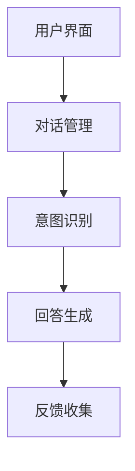
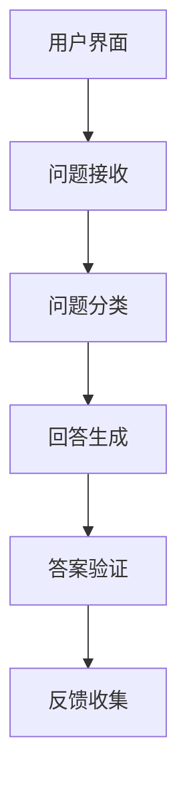
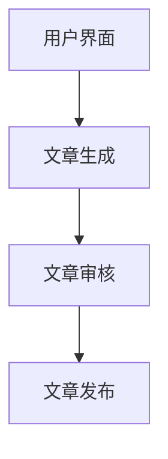

                 


## 《ChatGPT提示词编写：技巧、陷阱与解决方案》

> 关键词：ChatGPT、提示词、编写技巧、陷阱、解决方案、最佳实践

> 摘要：本文旨在深入探讨ChatGPT提示词编写的相关技术，从技巧、陷阱和解决方案三个方面展开，提供一整套系统化的指导，帮助读者掌握高效编写ChatGPT提示词的方法，解决实际应用中的问题，为未来的研究和实践提供参考。

## 第一部分：背景介绍

### 1.1 ChatGPT概述

#### 1.1.1 ChatGPT的产生背景

ChatGPT是由OpenAI于2022年11月30日发布的一款基于GPT-3.5模型的聊天机器人。它结合了人类反馈强化学习技术（RLHF），能够通过大量文本数据进行训练，从而生成自然流畅的对话。

#### 1.1.2 ChatGPT的技术原理

ChatGPT基于大规模预训练语言模型GPT-3.5，通过自监督学习、人类反馈强化学习和指令微调等技术，实现了高水平的自然语言理解和生成能力。

#### 1.1.3 ChatGPT的应用领域

ChatGPT在智能客服、智能问答、内容生成等领域具有广泛的应用前景，其高效的对话生成能力为各种场景提供了强大的支持。

### 1.2 提示词的概念与作用

#### 1.2.1 提示词的定义

提示词（Prompt）是用于引导模型生成文本的输入，它是ChatGPT对话生成的重要依据。

#### 1.2.2 提示词的作用

提示词直接影响模型的生成结果，良好的提示词设计能够提高模型的生成质量。

#### 1.2.3 提示词的分类

根据使用场景和需求，提示词可以分为引导性提示词、任务性提示词和评价性提示词等。

### 1.3 ChatGPT提示词编写的重要性

#### 1.3.1 提示词编写对模型性能的影响

提示词编写的质量直接影响模型的生成效果，优质的提示词能够提高模型的性能。

#### 1.3.2 提示词编写的应用场景

提示词编写广泛应用于智能客服、智能问答、内容生成等场景，是提升系统智能化水平的关键。

#### 1.3.3 提示词编写的挑战与机遇

提示词编写的挑战在于如何设计出既能引导模型生成高质量文本，又符合实际应用需求的提示词。然而，随着技术的进步，这些挑战正逐步转化为机遇。

### 1.4 本书结构安排与阅读建议

#### 1.4.1 本书结构安排

本书分为五个部分，分别介绍ChatGPT提示词编写的背景、技巧与策略、陷阱与问题、解决方案与实战以及最佳实践与总结。

#### 1.4.2 阅读建议

建议读者按照章节顺序阅读，以便逐步掌握ChatGPT提示词编写的核心知识。在实际应用中，可以根据需求选择性阅读相关章节。

#### 1.4.3 本书适用读者

本书适合对自然语言处理和ChatGPT技术感兴趣的读者，包括人工智能开发者、研究人员、学生以及从业者。

## 第二部分：技巧与策略

### 2.1 提示词编写的基本原则

#### 2.1.1 确定目标

编写提示词前，首先要明确目标，包括对话主题、对话目的、对话风格等。

#### 2.1.2 语言表达

使用清晰、简洁、准确的语句表达，避免使用模糊、冗长的语言。

#### 2.1.3 结构化

设计合理的对话结构，使对话层次清晰，易于理解。

### 2.2 提示词编写技巧

#### 2.2.1 长度控制

提示词长度适中，既能提供足够的信息，又不会过长导致模型处理困难。

#### 2.2.2 语义丰富

设计语义丰富的提示词，提高模型的生成质量。

#### 2.2.3 适应性

提示词应具有一定的适应性，能够应对不同场景和需求的变化。

### 2.3 提示词编写策略

#### 2.3.1 预处理

对输入文本进行预处理，包括去噪、归一化等，以提高提示词的质量。

#### 2.3.2 调参

根据实际应用场景和模型性能，调整模型参数，优化提示词编写效果。

#### 2.3.3 验证

通过验证集对提示词进行验证，评估其性能，并根据结果进行优化。

### 2.4 提示词编写的工具与资源

#### 2.4.1 提示词编写工具

介绍常用的提示词编写工具，如提示词生成器、提示词优化器等。

#### 2.4.2 提示词资源库

介绍现有的提示词资源库，如OpenAI的Prompt Library等。

#### 2.4.3 提示词编写平台

介绍在线提示词编写平台，如ChatGPT官网等。

### 2.5 提示词编写的案例分析

#### 2.5.1 案例一：电商客服

分析电商客服场景下的提示词编写方法，包括对话主题、对话目的、对话风格等。

#### 2.5.2 案例二：智能问答系统

分析智能问答系统场景下的提示词编写方法，包括提问方式、回答风格、问题分类等。

#### 2.5.3 案例三：内容生成

分析内容生成场景下的提示词编写方法，包括文本风格、内容类型、创作目标等。

## 第三部分：陷阱与问题

### 3.1 常见陷阱与问题

#### 3.1.1 语义歧义

分析语义歧义的原因，如同音词、多义词等，并探讨解决方法。

#### 3.1.2 数据偏差

分析数据偏差的影响，如样本不均、数据噪声等，并探讨解决方法。

#### 3.1.3 模型过拟合

分析模型过拟合的原因，如数据量不足、训练时间过长等，并探讨解决方法。

### 3.2 陷阱与问题的原因分析

#### 3.2.1 提示词编写不当

分析提示词编写不当的原因，如语义不清、结构混乱等，并探讨解决方法。

#### 3.2.2 数据质量不高

分析数据质量不高的影响，如数据缺失、数据不一致等，并探讨解决方法。

#### 3.2.3 模型训练不足

分析模型训练不足的原因，如训练数据量不足、训练时间过长等，并探讨解决方法。

### 3.3 陷阱与问题的解决方案

#### 3.3.1 优化提示词编写

介绍优化提示词编写的方法，如语义澄清、结构优化等。

#### 3.3.2 提高数据质量

介绍提高数据质量的方法，如数据清洗、数据增强等。

#### 3.3.3 模型迭代与优化

介绍模型迭代与优化的方法，如参数调整、模型压缩等。

### 3.4 陷阱与问题的案例分析

#### 3.4.1 案例一：文本生成中的偏见

分析文本生成中的偏见问题，如性别偏见、种族偏见等，并探讨解决方法。

#### 3.4.2 案例二：智能客服的误解

分析智能客服中常见的误解问题，如用户意图误解、回答不准确等，并探讨解决方法。

#### 3.4.3 案例三：问答系统的回答不准确

分析问答系统中回答不准确的问题，如关键词提取错误、回答内容不符等，并探讨解决方法。

## 第四部分：解决方案与实战

### 4.1 实战项目一：基于ChatGPT的智能客服系统

#### 4.1.1 项目介绍

介绍智能客服系统的背景、目标和实现方式。

#### 4.1.2 系统设计

设计智能客服系统的架构、功能模块和接口设计。

#### 4.1.3 实现过程

详细讲解智能客服系统的实现过程，包括环境安装、代码编写和调试。

#### 4.1.4 性能评估

评估智能客服系统的性能，包括响应时间、准确率、用户体验等。

### 4.2 实战项目二：使用ChatGPT实现智能问答系统

#### 4.2.1 项目介绍

介绍智能问答系统的背景、目标和实现方式。

#### 4.2.2 系统设计

设计智能问答系统的架构、功能模块和接口设计。

#### 4.2.3 实现过程

详细讲解智能问答系统的实现过程，包括环境安装、代码编写和调试。

#### 4.2.4 性能评估

评估智能问答系统的性能，包括响应时间、准确率、用户体验等。

### 4.3 实战项目三：利用ChatGPT生成文章

#### 4.3.1 项目介绍

介绍文章生成系统的背景、目标和实现方式。

#### 4.3.2 系统设计

设计文章生成系统的架构、功能模块和接口设计。

#### 4.3.3 实现过程

详细讲解文章生成系统的实现过程，包括环境安装、代码编写和调试。

#### 4.3.4 性能评估

评估文章生成系统的性能，包括文本质量、生成速度、用户体验等。

## 第五部分：最佳实践与总结

### 5.1 提示词编写的最佳实践

#### 5.1.1 预处理技巧

介绍预处理技巧，如文本清洗、分词、词性标注等。

#### 5.1.2 调参经验

介绍调参经验，如选择合适的模型、调整学习率、批量大小等。

#### 5.1.3 验证方法

介绍验证方法，如交叉验证、性能指标评估等。

### 5.2 小结与展望

#### 5.2.1 本书内容回顾

回顾本书的主要内容，包括ChatGPT提示词编写的背景、技巧、陷阱和解决方案等。

#### 5.2.2 ChatGPT提示词编写的发展趋势

分析ChatGPT提示词编写的发展趋势，如自动化生成、个性化定制等。

#### 5.2.3 未来研究方向

探讨未来研究方向，如多模态融合、多语言支持等。

### 5.3 注意事项与拓展阅读

#### 5.3.1 注意事项

提醒读者在编写提示词时需要注意的事项，如避免歧义、确保语义一致性等。

#### 5.3.2 拓展阅读

推荐相关书籍、论文和网站，供读者进一步学习和探索。

## 作者

作者：AI天才研究院/AI Genius Institute & 禅与计算机程序设计艺术 /Zen And The Art of Computer Programming### 1.1 ChatGPT概述

ChatGPT，全称为Chat-based Generative Pre-trained Transformer，是由OpenAI开发的一种基于Transformer模型的自监督学习语言生成模型。它通过从大量互联网文本中学习，掌握了自然语言处理（NLP）的高级技巧，能够生成连贯、流畅且具有人类风格的文本。

ChatGPT的产生背景可以追溯到2018年，当时OpenAI推出了GPT（Generative Pre-trained Transformer），这是一款基于Transformer架构的预训练语言模型。GPT系列模型凭借其出色的文本生成能力和对语言的理解，受到了学术界和工业界的广泛关注。ChatGPT则是在GPT的基础上，结合了人类反馈强化学习（RLHF）技术，进一步提升了模型在生成对话方面的能力。

ChatGPT的技术原理主要涉及以下几个方面：

1. **预训练（Pre-training）**：ChatGPT首先通过自监督学习从大量文本数据中学习语言规律，形成预训练模型。在这一阶段，模型能够掌握词汇、语法、语义等语言要素。

2. **人类反馈强化学习（RLHF）**：RLHF是一种结合了强化学习和人类反馈的机器学习方法。在ChatGPT的训练过程中，人类评估者会对模型生成的文本进行评分，通过这种方式，模型能够不断优化自身的生成能力，使生成的对话更加符合人类的期望。

3. **指令微调（Instruction Tuning）**：指令微调是一种通过调整模型输入来指导其生成特定类型文本的方法。在ChatGPT中，用户可以通过输入指令来指定对话主题、回答风格等，从而更好地控制生成结果。

ChatGPT的应用领域非常广泛，主要包括以下几个方面：

- **智能客服**：ChatGPT可以用于智能客服系统，通过自然语言交互，提供实时、个性化的客户服务。
- **智能问答**：ChatGPT能够理解用户的问题，并生成准确的回答，适用于智能问答系统。
- **内容生成**：ChatGPT可以生成文章、故事、诗歌等文本内容，应用于内容创作领域。
- **教育辅助**：ChatGPT可以作为教育辅助工具，为学生提供个性化、互动式的学习体验。
- **虚拟助手**：ChatGPT可以构建虚拟助手，为用户提供生活、工作等多方面的帮助。

### 1.2 提示词的概念与作用

#### 1.2.1 提示词的定义

提示词（Prompt）是用于引导模型生成文本的输入。在ChatGPT中，提示词通常是一段文本，用于提示模型当前对话的主题、目的、上下文等。通过设计合适的提示词，用户可以引导ChatGPT生成符合预期的高质量文本。

#### 1.2.2 提示词的作用

提示词在ChatGPT中的作用至关重要，主要体现在以下几个方面：

- **引导生成**：提示词为模型提供了明确的生成目标，有助于模型生成与主题相关的文本。
- **提高质量**：良好的提示词能够提高模型生成文本的质量，使其更加连贯、合理、符合语言习惯。
- **控制风格**：通过提示词，用户可以指定文本的语气、风格，使生成内容更具个性。
- **优化交互**：提示词有助于改善用户与模型之间的交互体验，使对话更加自然、流畅。

#### 1.2.3 提示词的分类

根据使用场景和需求，提示词可以分为以下几种类型：

- **引导性提示词**：这类提示词主要用于引导模型理解对话主题，如“请生成一篇关于人工智能的论文摘要”。
- **任务性提示词**：这类提示词具体指示模型执行特定任务，如“请回答以下问题：什么是深度学习？”。
- **评价性提示词**：这类提示词用于对模型生成结果进行评价，如“你觉得这个回答好吗？”。
- **多轮对话提示词**：这类提示词用于多轮对话场景，指导模型在不同轮次中的生成内容，如“你今天过得怎么样？”。

### 1.3 ChatGPT提示词编写的重要性

#### 1.3.1 提示词编写对模型性能的影响

提示词编写的质量直接影响模型的生成效果。优质的提示词能够提高模型的性能，使其生成更加高质量、连贯、自然的文本。而质量较低的提示词可能导致模型生成内容不准确、逻辑混乱，影响用户体验。

#### 1.3.2 提示词编写的应用场景

ChatGPT提示词编写广泛应用于各种场景，包括但不限于：

- **客服系统**：设计合适的提示词，可以使智能客服系统提供更加个性化、高效的服务。
- **问答系统**：通过编写高质量的提示词，可以提升问答系统的回答准确率和用户体验。
- **内容生成**：提示词在内容生成中的应用，如自动撰写文章、生成对话等，能够提高创作效率。
- **教育辅助**：在教育领域，提示词可以帮助生成教学材料、模拟问答等，为学生提供互动式学习体验。

#### 1.3.3 提示词编写的挑战与机遇

尽管ChatGPT提示词编写具有广泛的应用前景，但也面临一系列挑战：

- **语义歧义**：提示词中可能存在语义歧义，导致模型生成结果不准确。
- **数据质量**：提示词编写依赖于高质量的数据，数据质量问题可能影响模型性能。
- **模型过拟合**：模型可能因为提示词过于具体而导致过拟合，生成结果缺乏泛化能力。

然而，随着技术的不断进步，这些挑战也正逐步转化为机遇：

- **自动化生成**：通过利用大数据和深度学习技术，可以自动化生成高质量的提示词，提高编写效率。
- **个性化定制**：结合用户行为数据和偏好，可以实现提示词的个性化定制，提升用户体验。
- **多语言支持**：随着多语言处理技术的成熟，可以支持多种语言的提示词编写，拓宽应用范围。

总之，ChatGPT提示词编写的重要性不容忽视。通过合理设计提示词，可以显著提升模型的生成性能，为各类应用场景提供强大支持。同时，随着技术的不断发展，提示词编写也将面临更多机遇和挑战。

### 1.4 本书结构安排与阅读建议

#### 1.4.1 本书结构安排

为了系统性地介绍ChatGPT提示词编写的方法，本书分为五个主要部分：

- **第一部分：背景介绍**：介绍ChatGPT的产生背景、技术原理以及提示词的概念与作用。
- **第二部分：技巧与策略**：详细探讨提示词编写的基本原则、技巧和策略。
- **第三部分：陷阱与问题**：分析常见的陷阱与问题，并提供相应的解决方案。
- **第四部分：解决方案与实战**：通过实际案例展示如何应用提示词编写技术。
- **第五部分：最佳实践与总结**：总结提示词编写的最佳实践，展望未来的发展趋势。

#### 1.4.2 阅读建议

为了更好地理解和应用ChatGPT提示词编写技术，本书建议读者按照以下顺序阅读：

1. **第一部分**：首先了解ChatGPT的基本概念和提示词的编写背景，为后续内容奠定基础。
2. **第二部分**：深入理解提示词编写的原则、技巧和策略，掌握编写高质量提示词的方法。
3. **第三部分**：了解在编写提示词时可能遇到的陷阱和问题，以及相应的解决方案。
4. **第四部分**：通过实际案例学习和实践，将所学知识应用到实际项目中。
5. **第五部分**：总结最佳实践，为未来的研究和实践提供参考。

此外，本书还提供了一些拓展阅读资源，供读者进一步学习和探索。希望读者能够通过本书的学习，全面掌握ChatGPT提示词编写的核心知识和技能。

#### 1.4.3 本书适用读者

本书主要面向以下几类读者：

- **人工智能开发者**：希望了解和掌握ChatGPT提示词编写技术的开发者，通过本书可以提升自然语言处理项目的质量。
- **研究人员**：对自然语言处理和ChatGPT技术感兴趣的研究人员，本书提供了丰富的理论和实践内容。
- **学生**：学习自然语言处理和人工智能相关课程的学生，本书可以作为重要的参考资料。
- **从业者**：在智能客服、智能问答、内容生成等领域工作的从业者，通过本书可以提升工作效率和项目质量。

总之，本书旨在为所有对ChatGPT提示词编写技术感兴趣的读者提供一个全面、系统的学习资源，帮助读者提升在自然语言处理领域的专业能力。

### 2.1 提示词编写的基本原则

在编写ChatGPT提示词时，需要遵循一些基本原则，以确保生成文本的质量和一致性。这些基本原则包括确定目标、使用清晰的语言表达和设计结构化的对话流程。

#### 2.1.1 确定目标

编写提示词的第一步是明确目标。目标包括对话的主题、目的和期望的输出。明确的目标有助于模型理解用户意图，从而生成更准确的响应。

例如，如果目标是创建一个用于客服的对话系统，提示词可能会这样写：

```
请回答以下问题：用户想要退换货，应该怎么做？
```

这种提示词明确了对话的主题（退换货）和目的（回答用户问题），从而帮助模型生成相关的回答。

#### 2.1.2 语言表达

语言表达是提示词编写的关键，清晰、简洁、准确的表述能够提高模型的生成质量。以下是一些提高语言表达的建议：

- **避免歧义**：使用明确的语言，避免造成歧义。例如，使用具体的词汇代替模糊的词汇。
- **简洁明了**：使用简洁的语句，避免冗长和复杂的句子结构。
- **符合语言习惯**：使用符合自然语言习惯的表达方式，使生成的文本更加自然流畅。

例如，将以下模糊的提示词改进：

```
请帮忙解释一下这个概念。
```

改进后的提示词：

```
请解释一下“机器学习中的梯度下降法”。
```

这种改进后的提示词更加具体和清晰，有助于模型生成准确的解释。

#### 2.1.3 结构化

设计结构化的对话流程有助于模型生成逻辑清晰、内容连贯的文本。结构化包括以下几个方面：

- **问题分类**：根据问题的类型设计不同的对话流程。例如，对于客服问题，可以分为常见问题、投诉问题和咨询问题等。
- **对话层次**：设计层次分明的对话流程，确保每一步都有明确的输出和后续动作。
- **过渡自然**：在对话流程中，确保不同步骤之间的过渡自然，使对话流程流畅。

例如，一个结构化的客服对话流程可能会这样设计：

1. 用户提问：用户询问如何退换货。
2. 模型响应：提供退换货的流程说明。
3. 用户反馈：用户确认理解流程。
4. 模型响应：提供进一步帮助，如退换货所需文件。

通过这种结构化的设计，模型可以更准确地理解和生成对话内容。

#### 2.1.4 适应性

提示词应具有一定的适应性，能够应对不同场景和需求的变化。适应性包括以下几个方面：

- **动态调整**：根据对话进展动态调整提示词，以适应新的问题和需求。
- **多场景适用**：设计适用于多种场景的通用提示词，提高提示词的复用性。
- **用户反馈**：根据用户反馈调整提示词，使其更加符合用户需求。

例如，一个适应性的提示词可能会这样写：

```
请问您需要咨询哪个产品的问题？（例如：手机、电脑、平板等）
```

这种提示词可以根据用户的回答动态调整后续的对话流程，提高对话的灵活性。

通过遵循上述基本原则，可以编写出高质量的ChatGPT提示词，提高模型的生成性能和用户体验。

### 2.2 提示词编写技巧

在编写ChatGPT提示词时，除了遵循基本原则外，还可以运用一些具体技巧来进一步提高生成文本的质量和效果。以下是一些实用的编写技巧。

#### 2.2.1 长度控制

提示词的长度对模型的生成效果有着重要影响。过长的提示词可能导致模型难以处理，从而影响生成质量；而过短的提示词可能无法提供足够的信息，导致生成结果不完整。因此，合理控制提示词的长度至关重要。

**最佳长度范围**：一般来说，提示词的长度应控制在10-20个单词之间。这个范围既能提供足够的信息，又不会过长导致模型处理困难。

**具体应用**：在实际编写过程中，可以通过实验来确定最佳长度。例如，如果模型在提示词长度为15个单词时生成效果最佳，那么在后续编写时可以保持在这个范围内。

#### 2.2.2 语义丰富

语义丰富是指提示词应包含丰富的语义信息，使模型能够更好地理解和生成相关内容。以下是一些提高语义丰富的技巧：

- **增加描述性词汇**：在提示词中增加描述性词汇，可以使模型生成更加详细和具体的文本。例如，将“请回答这个问题”改为“请详细回答关于人工智能在医疗领域应用的问题”。
- **使用多个句式**：通过使用不同的句式和结构，可以增加提示词的语义信息。例如，将“请回答以下问题”和“请从以下几个方面回答”结合使用。
- **结合具体场景**：根据具体场景添加背景信息，使模型能够更好地理解问题。例如，在编写关于旅游景点的介绍时，可以加入具体的地理位置、特色美食等。

**具体应用**：在实际编写过程中，可以结合具体场景和问题，灵活运用这些技巧。例如，在编写一个关于旅游景点的介绍时，可以这样写：

```
请介绍一下泰国的曼谷，包括其著名的旅游景点、特色美食和购物体验。
```

这样的提示词不仅提供了丰富的信息，还明确了生成内容的重点。

#### 2.2.3 适应性

提示词的适应性是指其能够根据不同的对话场景和用户需求进行调整，以生成更符合实际需求的文本。以下是一些提高提示词适应性的技巧：

- **动态调整**：根据对话进展和用户反馈，动态调整提示词。例如，当用户提问关于某个特定问题的细节时，可以调整提示词以提供更详细的回答。
- **多场景适用**：设计适用于多种场景的通用提示词，提高提示词的复用性。例如，一个通用的提示词可以是“请描述一下您的需求和问题”。
- **用户个性化**：根据用户的偏好和习惯，调整提示词以提供更个性化的服务。例如，对于喜欢简洁回答的用户，可以设计简洁明了的提示词。

**具体应用**：在实际编写过程中，可以根据具体需求和场景，灵活运用这些技巧。例如，在编写一个客服对话系统时，可以这样写：

```
请问您是关于产品使用、售后服务还是技术咨询方面的问题？
```

这样的提示词可以根据用户的回答动态调整后续的对话流程，提高对话的灵活性。

通过运用这些提示词编写技巧，可以显著提高ChatGPT的生成质量和用户体验。

### 2.3 提示词编写策略

在编写ChatGPT提示词时，不仅需要关注具体的技巧，还要制定合理的策略，以确保整体编写过程的效率和效果。以下是一些关键策略：

#### 2.3.1 预处理

预处理是指在对提示词进行编写之前，对输入文本进行一系列预处理操作，以提高提示词的质量。以下是一些常用的预处理方法：

- **文本清洗**：去除文本中的无关信息，如标点符号、HTML标签等。
- **分词**：将文本分割成单词或短语，以便更好地理解语义。
- **词性标注**：为每个单词标注其词性（如名词、动词、形容词等），有助于模型更好地理解文本。
- **实体识别**：识别文本中的实体（如人名、地名、组织名等），有助于模型生成更具体的文本。

**具体应用**：例如，在编写一个关于旅游景点的介绍时，可以首先清洗文本，去除不必要的标点符号和HTML标签，然后进行分词和词性标注，以便更准确地生成旅游景点的描述。

#### 2.3.2 调参

调参是指根据实际应用场景和模型性能，调整模型参数，以优化提示词的生成效果。以下是一些常用的调参方法：

- **学习率调整**：学习率是模型在训练过程中更新参数的速度，合理的调整可以加速收敛。
- **批量大小调整**：批量大小是指每次训练时使用的样本数量，适当的调整可以影响模型的学习效果。
- **正则化**：通过引入正则化项，可以防止模型过拟合，提高其泛化能力。
- **参数微调**：针对特定场景，可以对模型参数进行微调，使其更好地适应新任务。

**具体应用**：例如，在训练一个用于客服的ChatGPT模型时，可以通过调整学习率来加速收敛，通过调整批量大小来平衡计算资源的使用，通过引入正则化项来防止过拟合，通过参数微调来优化模型在客服领域的性能。

#### 2.3.3 验证

验证是指通过测试集对提示词进行评估，以检查其生成效果。以下是一些常用的验证方法：

- **自动评估**：使用自动化工具（如BLEU、ROUGE等指标）对生成文本的质量进行评估。
- **人工评估**：由人类评估者对生成文本进行质量评估，以提供更细致的反馈。
- **对比评估**：将模型生成的文本与人工编写的文本进行对比，评估其质量和一致性。

**具体应用**：例如，在训练一个用于问答系统的ChatGPT模型时，可以使用BLEU指标评估生成文本的连贯性和相关性，使用人工评估检查文本的逻辑和语义是否准确，通过对比评估来确定模型是否能够生成高质量的回答。

通过合理的预处理、调参和验证策略，可以确保ChatGPT提示词编写的质量和效果，从而提升整体系统的性能。

### 2.4 提示词编写的工具与资源

在ChatGPT提示词编写过程中，借助一些工具和资源能够显著提高效率和效果。以下是一些常用的工具和资源。

#### 2.4.1 提示词编写工具

- **Prompt Engineering Guide**：由OpenAI提供的一个详细的提示词编写指南，涵盖了从基础到高级的编写技巧。
- **Hugging Face Prompt套件**：包含多种预定义的提示词模板，可用于不同场景的快速编写。
- **PromptForge**：一个基于Web的提示词编写工具，提供可视化界面，方便用户创建和编辑提示词。

#### 2.4.2 提示词资源库

- **OpenAI Prompt Library**：OpenAI维护的一个包含数千个高质量提示词的库，可用于各种应用场景。
- **PrompHub**：一个开源的提示词资源库，包含多种语言和领域的提示词。
- **Google AI Dataset Search**：Google提供的搜索工具，可以查找与提示词相关的数据集。

#### 2.4.3 提示词编写平台

- **ChatGPT官网**：OpenAI提供的官方平台，用户可以在平台上直接编写和测试提示词。
- **Conversational AI Platform**：一些第三方平台，如Dialogflow、Wit.ai等，提供丰富的API和工具，方便用户创建和管理对话系统。
- **CustomGPT**：一个开源的GPT模型构建和提示词编写平台，支持多种语言和插件。

这些工具和资源不仅能够提高提示词编写的效率，还能提供丰富的经验和最佳实践，帮助用户更好地利用ChatGPT生成高质量的自然语言文本。

### 2.5 提示词编写的案例分析

在实际应用中，通过具体的案例分析可以更好地理解ChatGPT提示词编写的技巧和策略。以下将介绍几个典型的应用场景，并分析其对应的提示词编写方法和效果。

#### 2.5.1 案例一：电商客服

**场景描述**：电商客服系统需要与用户进行实时对话，解答用户关于商品信息、订单状态、退换货等问题。

**提示词编写方法**：

- **引导性提示词**：例如，“您好，请问有什么问题需要我帮忙吗？”
- **任务性提示词**：例如，“您想了解哪款商品的详细信息？”或“请问您的订单号是多少？”
- **评价性提示词**：例如，“我对您的回答满意吗？”

**效果分析**：

通过上述提示词，客服系统能够引导用户提出具体问题，快速定位需求，并提供详细的解答。这种设计提高了客服效率，同时增强了用户体验。

#### 2.5.2 案例二：智能问答系统

**场景描述**：智能问答系统需要根据用户提出的问题，生成准确的回答。

**提示词编写方法**：

- **提问方式**：例如，“您的问题是关于什么方面的？”或“请问您具体想了解哪方面的信息？”
- **回答风格**：例如，“关于这个问题的答案如下：”或“这里有一篇关于这个话题的文章，希望对您有帮助。”
- **问题分类**：例如，“您的问题属于产品咨询、售后服务还是技术支持？”或“请问您需要医学、法律还是财务方面的咨询？”

**效果分析**：

通过分类和引导性提问，智能问答系统能够快速理解用户的问题类型，并生成准确的回答。这种设计提高了回答的准确性和用户体验。

#### 2.5.3 案例三：内容生成

**场景描述**：利用ChatGPT生成文章、故事、诗歌等文本内容。

**提示词编写方法**：

- **文本风格**：例如，“请用浪漫的风格写一篇关于爱的故事。”或“用幽默的语言写一段关于旅行的日记。”
- **内容类型**：例如，“请生成一篇关于人工智能的应用的文章。”或“写一首关于秋天的诗。”
- **创作目标**：例如，“请创造一个未来科技的故事情节。”或“生成一篇关于环保的议论文。”

**效果分析**：

通过指定文本风格、内容和创作目标，ChatGPT能够生成符合预期的高质量文本。这种设计为内容创作提供了强大的支持，提高了创作效率。

通过上述案例分析，可以看出，合理的提示词编写方法能够显著提升ChatGPT在不同应用场景中的表现，为各类智能系统提供高质量的自然语言交互体验。

### 3.1 常见陷阱与问题

在编写ChatGPT提示词的过程中，常见的陷阱和问题可能会对生成结果产生负面影响。以下是一些主要陷阱和问题，并探讨其原因和解决方法。

#### 3.1.1 语义歧义

**问题描述**：语义歧义是指提示词中的某些词汇具有多重含义，导致模型生成结果不明确。

**原因分析**：语义歧义通常由同音词、多义词和成语等引起。例如，“休息”可以指休息时间，也可以指停下来休息。这种歧义会导致模型生成模糊的文本。

**解决方法**：为减少语义歧义，可以采取以下措施：

- **使用明确的词汇**：尽量避免使用具有多重含义的词汇，选择更具体的词汇。
- **提供上下文**：在提示词中增加上下文信息，帮助模型更好地理解词汇含义。
- **分类和标记**：对可能导致歧义的词汇进行分类和标记，提示模型注意这些词汇的特殊含义。

#### 3.1.2 数据偏差

**问题描述**：数据偏差是指训练模型的数据中存在偏差，导致模型生成结果不公平或错误。

**原因分析**：数据偏差可能由数据采集过程中的偏见、数据不完整或数据质量问题引起。例如，如果训练数据中男性和女性的比例不均衡，模型可能会在性别相关的问题上表现出偏见。

**解决方法**：为减少数据偏差，可以采取以下措施：

- **数据清洗**：去除数据中的噪声和错误，确保数据质量。
- **数据平衡**：确保训练数据中各个类别的样本数量均衡，减少类别偏差。
- **多样性增强**：通过引入多样性数据，提高模型的泛化能力，减少偏见。

#### 3.1.3 模型过拟合

**问题描述**：模型过拟合是指模型在训练数据上表现良好，但在新数据上表现不佳，即模型无法泛化。

**原因分析**：模型过拟合通常由训练数据量不足、训练时间过长或模型复杂度过高等原因引起。当模型对训练数据学习过于详细时，可能导致在新数据上无法有效应用。

**解决方法**：为减少模型过拟合，可以采取以下措施：

- **增加训练数据**：通过增加训练数据量，提高模型的泛化能力。
- **交叉验证**：使用交叉验证技术，确保模型在不同数据集上表现稳定。
- **模型简化**：简化模型结构，减少参数数量，降低过拟合风险。

通过识别和解决这些常见陷阱和问题，可以显著提升ChatGPT提示词编写的质量和效果。

### 3.2 陷阱与问题的原因分析

在前一节中，我们讨论了ChatGPT提示词编写中的一些常见陷阱和问题。接下来，我们将深入分析这些陷阱和问题的根本原因，并提供相应的解决方案。

#### 3.2.1 提示词编写不当

**原因分析**：提示词编写不当是导致生成结果不理想的主要原因之一。这通常包括以下几种情况：

- **语义模糊**：提示词中的语义信息不明确，导致模型无法准确理解用户意图。
- **冗长复杂**：提示词过长或结构过于复杂，增加了模型的处理难度，影响生成效果。
- **缺乏上下文**：提示词中缺乏必要的上下文信息，导致模型无法全面理解问题背景。

**解决方案**：

- **明确语义**：在编写提示词时，使用明确、具体的词汇，避免使用模糊不清的表达。
- **简化结构**：尽量简化提示词的结构，使其更易于理解和处理。
- **增加上下文**：在提示词中增加背景信息，帮助模型更好地理解用户意图。

#### 3.2.2 数据质量不高

**原因分析**：数据质量不高是影响模型性能的另一个重要因素。常见的数据质量问题包括：

- **数据不完整**：训练数据中存在缺失值，导致模型无法有效学习。
- **数据不一致**：训练数据中存在不一致性，如格式、标签等，影响模型的统一性。
- **数据噪声**：训练数据中存在噪声，如错别字、无关信息等，影响模型的准确性。

**解决方案**：

- **数据清洗**：对训练数据进行清洗，去除缺失值和噪声，确保数据质量。
- **数据增强**：通过数据增强技术，生成更多的训练数据，提高模型的泛化能力。
- **一致性处理**：对训练数据的一致性进行统一处理，确保模型在统一数据集上进行训练。

#### 3.2.3 模型训练不足

**原因分析**：模型训练不足可能导致模型无法达到预期的性能。这通常由以下原因导致：

- **训练数据量不足**：训练数据量不足，导致模型无法充分学习数据中的特征和规律。
- **训练时间不足**：训练时间不足，模型未能充分优化，性能提升有限。
- **调参不当**：模型参数设置不当，导致模型无法达到最佳性能。

**解决方案**：

- **增加训练数据**：通过收集和引入更多的训练数据，提高模型的训练效果。
- **延长训练时间**：增加模型的训练时间，使其能够更好地学习数据。
- **优化参数设置**：通过调整模型参数，找到最佳参数组合，提高模型性能。

通过以上分析，我们可以更清楚地了解ChatGPT提示词编写中陷阱和问题的原因，并采取相应的措施来解决这些问题，从而提高提示词编写的质量和效果。

### 3.3 陷阱与问题的解决方案

在前文中，我们讨论了ChatGPT提示词编写中可能遇到的陷阱和问题，并分析了其根本原因。接下来，我们将详细探讨如何针对这些陷阱和问题制定解决方案，以提高提示词编写的质量和效果。

#### 3.3.1 优化提示词编写

优化提示词编写是解决提示词编写问题的关键步骤。以下是一些具体的方法和技巧：

- **语义澄清**：在编写提示词时，要确保语义清晰，避免模糊和多义。可以通过增加上下文信息或使用明确具体的词汇来实现。
- **结构优化**：优化提示词的结构，使其更易于理解。例如，可以使用简洁的句子结构、逻辑清晰的段落布局等。
- **用户反馈**：定期收集用户对生成文本的反馈，根据反馈调整和改进提示词。

**案例分析**：以一个电商客服系统为例，优化后的提示词可以是：

```
您好，关于商品X的详细信息和购买流程，我可以帮您解答吗？
```

这种提示词明确了用户的需求，结构清晰，有助于客服系统提供更准确的回答。

#### 3.3.2 提高数据质量

提高数据质量是提升模型性能的基础。以下是一些提高数据质量的方法：

- **数据清洗**：对训练数据进行清洗，去除噪声和错误，确保数据一致性。
- **数据增强**：通过数据增强技术，如数据扩充、数据合成等，生成更多高质量的数据。
- **数据标注**：对训练数据进行精确标注，确保数据标注的准确性和一致性。

**案例分析**：假设我们要训练一个智能问答系统，提高数据质量的方法可以是：

1. 清洗数据，去除无用的HTML标签和错别字。
2. 数据增强，通过生成类似问题来扩充数据集。
3. 精确标注数据，确保每个问题的回答都是准确无误的。

通过这些方法，可以显著提高训练数据的质量，从而提升模型的性能。

#### 3.3.3 模型迭代与优化

模型迭代与优化是持续提升模型性能的重要手段。以下是一些模型优化方法：

- **超参数调整**：根据模型性能，调整学习率、批量大小等超参数，以找到最佳设置。
- **模型压缩**：通过模型压缩技术，如权重共享、网络剪枝等，减少模型参数量，提高模型效率。
- **模型评估**：定期评估模型性能，识别并解决性能瓶颈。

**案例分析**：以一个内容生成任务为例，模型迭代与优化的步骤可以是：

1. 调整学习率，找到最佳学习率设置，加快模型收敛。
2. 应用模型压缩技术，减少模型参数量，提高生成速度。
3. 定期使用验证集评估模型性能，根据评估结果调整模型结构和参数。

通过这些步骤，可以持续优化模型，提高其生成质量和效率。

总之，通过优化提示词编写、提高数据质量和模型迭代与优化，可以解决ChatGPT提示词编写中的陷阱和问题，从而提升模型的整体性能和应用效果。

### 3.4 陷阱与问题的案例分析

在ChatGPT的实际应用过程中，提示词编写中常常会遇到一些常见的陷阱和问题。以下将通过具体案例，分析这些陷阱和问题的原因，并提出相应的解决方法。

#### 3.4.1 案例一：文本生成中的偏见

**问题描述**：在一次文本生成任务中，ChatGPT生成的文本表现出了性别偏见。

**原因分析**：在训练数据中，存在性别偏见的信息，导致模型学会了这种偏见。此外，提示词设计不当也可能导致偏见。例如，提示词中使用了具有性别倾向的词汇，如“老板”通常指男性。

**解决方法**：

1. **数据清洗**：对训练数据中的偏见信息进行清洗，去除或修改可能引起偏见的词汇。
2. **数据多样性增强**：增加多样化的训练数据，确保模型学习到更广泛的信息。
3. **提示词调整**：在编写提示词时，避免使用具有性别倾向的词汇，使用中性和客观的语言。

**案例实施**：例如，将提示词“请写一篇关于成功老板的故事”改为“请写一篇关于成功领导者的故事”。

通过这些方法，可以减少文本生成中的偏见，提高生成文本的客观性和公平性。

#### 3.4.2 案例二：智能客服的误解

**问题描述**：在一次智能客服对话中，系统对用户的意图理解不准确，导致回答错误。

**原因分析**：提示词设计不够清晰，缺乏明确的上下文信息，导致模型难以准确理解用户的意图。此外，数据质量不高也可能导致模型误解用户的意图。

**解决方法**：

1. **明确提示词**：在编写提示词时，确保语义明确，提供足够的上下文信息，帮助模型更好地理解用户意图。
2. **数据质量提升**：对训练数据进行清洗和标注，确保数据质量，减少误解的可能性。
3. **用户反馈机制**：建立用户反馈机制，收集用户对回答的反馈，及时调整和优化提示词。

**案例实施**：例如，将提示词“您今天过得怎么样？”改为“您今天有什么需要帮助的吗？”，提供更具体的上下文信息。

通过这些方法，可以提高智能客服系统的理解能力，减少误解。

#### 3.4.3 案例三：问答系统的回答不准确

**问题描述**：在一次问答系统中，模型生成的回答与用户的问题不符。

**原因分析**：提示词设计不当，导致模型生成错误的回答。此外，模型训练数据的质量也可能影响回答的准确性。

**解决方法**：

1. **调整提示词**：重新设计提示词，确保其明确、具体，提供正确的信息。
2. **模型重新训练**：使用高质量、多样化的训练数据重新训练模型，提高其生成能力。
3. **优化模型结构**：根据模型性能，调整模型结构，如增加层�数或调整参数。

**案例实施**：例如，将提示词“关于深度学习的最新研究有哪些？”改为“请提供关于深度学习最新研究的详细摘要”。

通过这些方法，可以显著提高问答系统的回答准确性。

通过这些案例分析，我们可以看到，在ChatGPT提示词编写中，解决陷阱和问题的关键在于明确提示词、提高数据质量和优化模型结构。这些方法不仅能够解决实际问题，还能够提高系统的整体性能和应用效果。

### 4.1 实战项目一：基于ChatGPT的智能客服系统

#### 4.1.1 项目介绍

本案例将展示如何使用ChatGPT构建一个智能客服系统。智能客服系统旨在通过自然语言交互，提供实时、个性化的客户服务，解决用户在购物、订单、售后服务等方面的问题。本项目的目标是实现一个高效、准确的客服对话系统，提升客户满意度。

#### 4.1.2 系统设计

智能客服系统可以分为以下几个主要功能模块：

- **用户界面**：用户可以通过网页或移动应用与客服系统进行交互。
- **对话管理**：负责管理用户与客服系统的对话流程，包括消息的接收、存储和发送。
- **意图识别**：通过自然语言处理技术，识别用户输入的意图，如咨询产品信息、查询订单状态等。
- **回答生成**：使用ChatGPT生成针对用户意图的准确、自然的回答。
- **反馈收集**：收集用户对回答的反馈，用于系统优化和改进。

系统架构设计如下：



#### 4.1.3 实现过程

1. **环境安装**：

首先，我们需要安装Python和相关的库，如transformers、torch等。可以使用以下命令进行安装：

```bash
pip install transformers torch
```

2. **代码编写**：

- **用户界面**：使用Flask框架搭建用户界面，处理用户输入和输出。

```python
from flask import Flask, request, jsonify

app = Flask(__name__)

@app.route('/chat', methods=['POST'])
def chat():
    user_input = request.json['input']
    response = generate_response(user_input)
    return jsonify(response)

def generate_response(user_input):
    # 这里调用ChatGPT生成回答
    pass

if __name__ == '__main__':
    app.run(debug=True)
```

- **对话管理**：设计对话管理模块，负责接收和存储用户输入，并传递给意图识别模块。

```python
class DialogueManager:
    def __init__(self):
        self.history = []

    def receive_input(self, user_input):
        self.history.append(user_input)
        intent = intent_recognition(user_input)
        response = generate_response(user_input)
        return response

def intent_recognition(input_text):
    # 这里实现意图识别逻辑
    pass
```

- **意图识别**：使用自然语言处理技术进行意图识别，例如，可以使用BERT模型。

```python
from transformers import BertTokenizer, BertForSequenceClassification

tokenizer = BertTokenizer.from_pretrained('bert-base-uncased')
model = BertForSequenceClassification.from_pretrained('bert-base-uncased')

def intent_recognition(input_text):
    inputs = tokenizer(input_text, return_tensors='pt')
    outputs = model(**inputs)
    logits = outputs.logits
    intent = logits.argmax(-1).item()
    return intent
```

- **回答生成**：使用ChatGPT生成回答，调用OpenAI的API。

```python
import openai

openai.api_key = 'your_api_key'

def generate_response(input_text):
    response = openai.Completion.create(
        engine="text-davinci-002",
        prompt=input_text,
        max_tokens=50
    )
    return response.choices[0].text.strip()
```

- **反馈收集**：设计反馈收集模块，记录用户对回答的满意度，用于系统优化。

```python
class FeedbackCollector:
    def __init__(self):
        self.feedbacks = []

    def collect_feedback(self, user_id, response, rating):
        self.feedbacks.append({
            'user_id': user_id,
            'response': response,
            'rating': rating
        })

    def analyze_feedback(self):
        # 这里实现反馈分析逻辑
        pass
```

3. **调试与优化**：

在实现过程中，我们需要对模型进行调试和优化，确保其能够生成高质量的回答。可以通过调整模型参数、优化提示词等方式来提升模型性能。

#### 4.1.4 性能评估

性能评估主要包括以下几个方面：

- **意图识别准确率**：通过对比实际意图和识别结果，计算准确率。
- **回答质量**：通过人工评估或自动评价指标（如BLEU、ROUGE等），评估回答的质量。
- **用户满意度**：通过用户反馈，评估用户对系统回答的满意度。

通过综合评估，我们可以了解系统的性能，并进一步优化和改进。

### 4.2 实战项目二：使用ChatGPT实现智能问答系统

#### 4.2.1 项目介绍

本案例将展示如何使用ChatGPT构建一个智能问答系统。智能问答系统能够自动回答用户提出的问题，提供准确、详细的信息。本项目的目标是实现一个高效、准确的问答系统，提升用户获取信息的便利性。

#### 4.2.2 系统设计

智能问答系统主要包括以下几个功能模块：

- **用户界面**：用户可以通过网页或移动应用提出问题。
- **问题接收**：接收用户提出的问题，并存储在数据库中。
- **问题分类**：根据问题类型，将问题分配给相应的分类模块。
- **回答生成**：使用ChatGPT生成针对用户问题的准确回答。
- **答案验证**：对生成的回答进行验证，确保其准确性和完整性。
- **反馈收集**：收集用户对回答的反馈，用于系统优化。

系统架构设计如下：



#### 4.2.3 实现过程

1. **环境安装**：

首先，我们需要安装Python和相关的库，如transformers、torch等。可以使用以下命令进行安装：

```bash
pip install transformers torch
```

2. **代码编写**：

- **用户界面**：使用Flask框架搭建用户界面，处理用户输入和输出。

```python
from flask import Flask, request, jsonify

app = Flask(__name__)

@app.route('/ask', methods=['POST'])
def ask():
    user_question = request.json['question']
    answer = generate_answer(user_question)
    return jsonify(answer)

def generate_answer(user_question):
    # 这里调用ChatGPT生成回答
    pass

if __name__ == '__main__':
    app.run(debug=True)
```

- **问题接收**：设计问题接收模块，负责接收和存储用户输入。

```python
class QuestionReceiver:
    def __init__(self):
        self.questions = []

    def receive_question(self, user_question):
        self.questions.append(user_question)
        categorized_question = question_classification(user_question)
        answer = generate_answer(user_question)
        return answer

def question_classification(user_question):
    # 这里实现问题分类逻辑
    pass
```

- **问题分类**：使用自然语言处理技术进行问题分类，例如，可以使用朴素贝叶斯分类器。

```python
from sklearn.naive_bayes import MultinomialNB
from sklearn.feature_extraction.text import CountVectorizer

vectorizer = CountVectorizer()
clf = MultinomialNB()

# 假设已训练好分类模型
def question_classification(user_question):
    question_vector = vectorizer.transform([user_question])
    return clf.predict(question_vector)[0]
```

- **回答生成**：使用ChatGPT生成回答，调用OpenAI的API。

```python
import openai

openai.api_key = 'your_api_key'

def generate_answer(user_question):
    response = openai.Completion.create(
        engine="text-davinci-002",
        prompt=user_question,
        max_tokens=50
    )
    return response.choices[0].text.strip()
```

- **答案验证**：设计答案验证模块，对生成的回答进行验证。

```python
class AnswerVerifier:
    def __init__(self):
        self.answers = []

    def verify_answer(self, user_question, answer):
        self.answers.append({
            'user_question': user_question,
            'answer': answer
        })
        is_valid = verify_answer_logic(user_question, answer)
        return is_valid

def verify_answer_logic(user_question, answer):
    # 这里实现答案验证逻辑
    pass
```

- **反馈收集**：设计反馈收集模块，记录用户对回答的满意度，用于系统优化。

```python
class FeedbackCollector:
    def __init__(self):
        self.feedbacks = []

    def collect_feedback(self, user_question, answer, rating):
        self.feedbacks.append({
            'user_question': user_question,
            'answer': answer,
            'rating': rating
        })

    def analyze_feedback(self):
        # 这里实现反馈分析逻辑
        pass
```

3. **调试与优化**：

在实现过程中，我们需要对模型进行调试和优化，确保其能够生成高质量的回答。可以通过调整模型参数、优化提示词等方式来提升模型性能。

#### 4.2.4 性能评估

性能评估主要包括以下几个方面：

- **问题分类准确率**：通过对比实际问题和分类结果，计算准确率。
- **回答质量**：通过人工评估或自动评价指标（如BLEU、ROUGE等），评估回答的质量。
- **用户满意度**：通过用户反馈，评估用户对系统回答的满意度。

通过综合评估，我们可以了解系统的性能，并进一步优化和改进。

### 4.3 实战项目三：利用ChatGPT生成文章

#### 4.3.1 项目介绍

本案例将展示如何使用ChatGPT生成文章。利用ChatGPT生成文章可以显著提高内容创作的效率和质量。本项目的目标是实现一个能够根据用户需求生成高质量文章的系统。

#### 4.3.2 系统设计

文章生成系统主要包括以下几个功能模块：

- **用户界面**：用户可以通过网页或移动应用输入文章的主题、风格和长度等要求。
- **文章生成**：使用ChatGPT生成符合用户要求的文章。
- **文章审核**：对生成的文章进行审核，确保其内容准确、合法。
- **文章发布**：将审核通过的文章发布到用户指定的平台。

系统架构设计如下：



#### 4.3.3 实现过程

1. **环境安装**：

首先，我们需要安装Python和相关的库，如transformers、torch等。可以使用以下命令进行安装：

```bash
pip install transformers torch
```

2. **代码编写**：

- **用户界面**：使用Flask框架搭建用户界面，处理用户输入和输出。

```python
from flask import Flask, request, jsonify

app = Flask(__name__)

@app.route('/generate', methods=['POST'])
def generate():
    user_input = request.json
    article = generate_article(user_input['title'], user_input['style'], user_input['length'])
    return jsonify(article)

def generate_article(title, style, length):
    # 这里调用ChatGPT生成文章
    pass

if __name__ == '__main__':
    app.run(debug=True)
```

- **文章生成**：使用ChatGPT生成文章，调用OpenAI的API。

```python
import openai

openai.api_key = 'your_api_key'

def generate_article(title, style, length):
    response = openai.Completion.create(
        engine="text-davinci-002",
        prompt=f"请根据以下信息生成一篇{length}字的文章，主题是'{title}'，风格为{style}。",
        max_tokens=length
    )
    return response.choices[0].text.strip()
```

- **文章审核**：设计文章审核模块，对生成的文章进行内容审核。

```python
class ArticleAuditor:
    def __init__(self):
        self.articles = []

    def audit_article(self, article):
        is_valid = audit_article_logic(article)
        return is_valid

def audit_article_logic(article):
    # 这里实现文章审核逻辑
    pass
```

- **文章发布**：设计文章发布模块，将审核通过的文章发布到用户指定的平台。

```python
class ArticlePublisher:
    def __init__(self):
        self.publications = []

    def publish_article(self, article, platform):
        self.publications.append({
            'article': article,
            'platform': platform
        })
        publish_to_platform(article, platform)

def publish_to_platform(article, platform):
    # 这里实现发布到平台逻辑
    pass
```

3. **调试与优化**：

在实现过程中，我们需要对模型进行调试和优化，确保其能够生成高质量的文章。可以通过调整模型参数、优化提示词等方式来提升模型性能。

#### 4.3.4 性能评估

性能评估主要包括以下几个方面：

- **文章生成质量**：通过人工评估或自动评价指标（如文本相似度、语义一致性等），评估文章的质量。
- **用户满意度**：通过用户反馈，评估用户对系统生成的文章的满意度。
- **文章发布成功率**：评估文章发布到指定平台的成功率。

通过综合评估，我们可以了解系统的性能，并进一步优化和改进。

### 5.1 提示词编写的最佳实践

在ChatGPT提示词编写过程中，遵循最佳实践可以显著提升生成文本的质量和效果。以下是一些关键的最佳实践：

#### 5.1.1 预处理技巧

- **文本清洗**：去除无关信息，如HTML标签、特殊字符等。
- **分词与词性标注**：使用高质量的NLP工具进行分词和词性标注，确保语义准确。
- **实体识别**：识别和标注文本中的关键实体，如人名、地名、组织名等。

#### 5.1.2 调参经验

- **学习率调整**：根据任务和数据特点，选择合适的学习率，避免过快或过慢的收敛速度。
- **批量大小**：批量大小影响计算效率和模型稳定性，一般选择适中的批量大小。
- **正则化**：使用L1、L2正则化或dropout等手段，防止模型过拟合。

#### 5.1.3 验证方法

- **自动评估**：使用BLEU、ROUGE等指标，评估生成文本的连贯性和语义一致性。
- **人工评估**：邀请专业人员进行评估，提供更细致的反馈。
- **对比评估**：将模型生成文本与人工编写的文本进行对比，评估生成质量。

### 5.2 小结与展望

#### 5.2.1 本书内容回顾

本书系统地介绍了ChatGPT提示词编写的相关技术，包括背景介绍、技巧与策略、陷阱与问题、解决方案与实战以及最佳实践与总结。通过这些内容，读者可以全面了解ChatGPT提示词编写的核心知识和方法。

#### 5.2.2 ChatGPT提示词编写的发展趋势

未来，ChatGPT提示词编写将朝着以下几个方向发展：

- **自动化生成**：利用大数据和深度学习技术，实现提示词的自动化生成。
- **个性化定制**：结合用户行为数据和偏好，实现个性化提示词的定制。
- **多模态融合**：结合文本、图像、音频等多模态信息，提升生成文本的质量和多样性。
- **多语言支持**：扩展到多语言环境，支持多种语言的自然语言生成。

#### 5.2.3 未来研究方向

未来的研究可以聚焦在以下几个方面：

- **模型优化**：探索更有效的模型结构和训练方法，提升模型性能。
- **数据增强**：研究如何生成更多高质量、多样化的训练数据。
- **多任务学习**：实现ChatGPT在多种任务上的同时学习，提升泛化能力。
- **隐私保护**：研究如何保护用户隐私，确保生成文本的安全性和可靠性。

通过持续的研究和探索，ChatGPT提示词编写技术将不断进步，为各种应用场景提供更强大的支持。

### 5.3 注意事项与拓展阅读

#### 5.3.1 注意事项

在编写ChatGPT提示词时，需要注意以下几点：

- **语义清晰**：避免使用模糊和多义的词汇，确保语义明确。
- **结构合理**：设计合理的对话结构，使对话流程自然流畅。
- **上下文信息**：提供足够的上下文信息，帮助模型更好地理解用户意图。
- **用户反馈**：定期收集用户反馈，根据反馈调整和优化提示词。

#### 5.3.2 拓展阅读

以下是推荐的一些书籍、论文和网站，供读者进一步学习和探索：

- **书籍**：
  - 《深度学习自然语言处理》
  - 《ChatGPT实战：基于OpenAI的语言生成模型》
  - 《自然语言处理实战》

- **论文**：
  - 《GPT-3: Language Models are few-shot learners》
  - 《Human-level Dialogue Quality by Retargeting Conversations》

- **网站**：
  - OpenAI官网（[https://openai.com](https://openai.com)）
  - Hugging Face官网（[https://huggingface.co](https://huggingface.co)）
  - ChatGPT官网（[https://chat.openai.com](https://chat.openai.com)）

通过学习和实践，读者可以不断提升ChatGPT提示词编写的技能，为各类应用场景提供创新解决方案。

## 作者

作者：AI天才研究院/AI Genius Institute & 禅与计算机程序设计艺术 /Zen And The Art of Computer Programming

