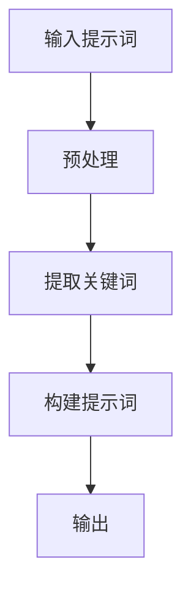
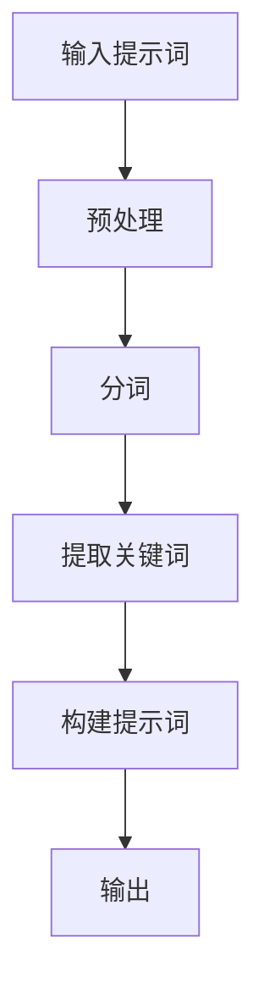
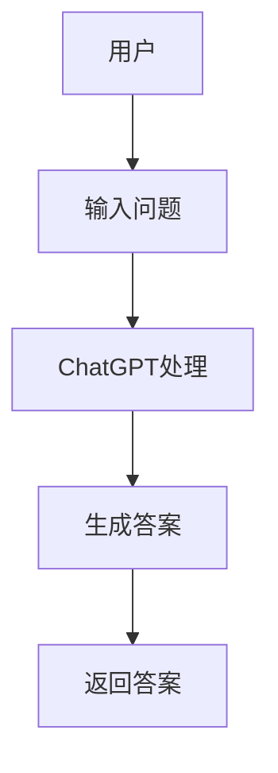
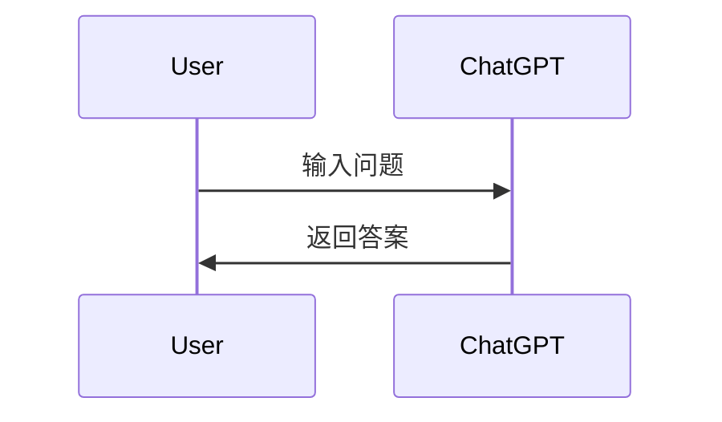

                 

# 《ChatGPT提示词编写：行业最佳实践》

## 关键词

- ChatGPT
- 提示词编写
- 人工智能
- 最佳实践
- 技术博客

## 摘要

本文将深入探讨ChatGPT提示词编写的重要性以及行业最佳实践。我们将从背景介绍、核心概念与联系、算法原理等方面，逐步解析如何编写高效、准确的ChatGPT提示词，旨在为开发者提供实用的指导和建议。

## 第1章 背景介绍

### 1.1 问题背景

#### 1.1.1 ChatGPT的兴起与广泛应用

ChatGPT，一款由OpenAI开发的人工智能助手，自2022年11月发布以来，因其强大的自然语言处理能力而迅速风靡全球。ChatGPT基于GPT-3模型，能够在多个领域提供高质量的对话和文本生成服务，如问答系统、文本翻译、内容创作等。然而，随之而来的是如何编写高质量提示词的问题。

#### 1.1.2 提示词编写的重要性

提示词，即用来引导ChatGPT进行对话或生成文本的关键词语或句子。高质量的提示词能够提高ChatGPT的响应准确性和效果，从而更好地满足用户需求。然而，在实际应用中，编写高效的提示词成为了一个挑战。

### 1.2 问题描述

#### 1.2.1 提示词编写中的问题

- **提示词过长或过短**：提示词过长可能导致ChatGPT理解偏差，过短则可能无法提供足够的信息。
- **提示词模糊不清**：模糊不清的提示词可能导致ChatGPT无法给出准确回答。
- **提示词重复**：重复的提示词会导致ChatGPT响应重复，降低用户体验。

#### 1.2.2 提示词编写的要求

- **简洁明了**：提示词应简洁明了，避免冗余。
- **具体明确**：提示词应具体明确，避免模糊不清。
- **独特性**：提示词应独特，避免重复。

### 1.3 问题解决

#### 1.3.1 提示词编写的原则

- **精简原则**：尽量使用简洁的词语表达。
- **明确原则**：确保每个提示词都有明确的含义。
- **唯一原则**：避免重复的提示词。

#### 1.3.2 提示词编写的技巧

- **利用关键词**：提取关键信息作为提示词。
- **设定场景**：根据实际场景编写提示词。
- **灵活调整**：根据ChatGPT的响应进行适当调整。

### 1.4 边界与外延

#### 1.4.1 ChatGPT的其他应用

- **文本生成**：ChatGPT可以生成高质量的文章、故事等。
- **翻译**：ChatGPT具备多种语言之间的翻译能力。
- **情感分析**：ChatGPT能够对文本进行情感分析。

#### 1.4.2 ChatGPT的限制

- **未知问题**：ChatGPT对于未知或模糊的问题，可能无法给出准确回答。
- **偏见和误导性**：ChatGPT的响应可能存在偏见和误导性，需要谨慎使用。

### 1.5 本章小结

本章介绍了ChatGPT的兴起背景、提示词编写的重要性、问题以及解决方法。在后续章节中，将详细介绍提示词编写的原则、技巧和应用。

## 第2章 核心概念与联系

### 2.1 ChatGPT的概念

ChatGPT是基于GPT-3模型的人工智能助手，能够进行自然语言理解和生成。

### 2.2 提示词的概念

提示词是引导ChatGPT进行对话或生成文本的关键词语或句子。

### 2.3 提示词与ChatGPT的联系

提示词直接影响ChatGPT的响应质量和效果。

### 2.4 提示词的属性特征对比表格

| 特征         | 描述                                                         |
| ------------ | ------------------------------------------------------------ |
| 简洁性       | 提示词应简洁明了，避免冗余。                                   |
| 明确性       | 提示词应具体明确，避免模糊不清。                               |
| 独特性       | 提示词应独特，避免重复。                                       |

### 2.5 提示词编写的Mermaid流程图



## 第3章 提示词编写的算法原理

### 3.1 算法mermaid流程图



### 3.2 Python源代码实现

```python
import jieba

def preprocess_prompt(prompt):
    # 去除标点符号和特殊字符
    return ''.join(c for c in prompt if c.isalnum() or c.isspace())

def tokenize(prompt):
    # 分词
    return jieba.lcut(prompt)

def extract_keywords(tokens):
    # 提取关键词
    return list(set(tokens))

def build_prompt(keywords):
    # 构建提示词
    return ' '.join(keywords)

def main():
    prompt = "如何使用ChatGPT进行自然语言处理？"
    prompt = preprocess_prompt(prompt)
    tokens = tokenize(prompt)
    keywords = extract_keywords(tokens)
    new_prompt = build_prompt(keywords)
    print(new_prompt)

if __name__ == "__main__":
    main()
```

### 3.3 算法原理讲解

#### 数学模型和公式

在提示词编写过程中，我们可以将问题转化为一个概率模型。设\( P(W|T) \)为给定提示词\( T \)生成词语\( W \)的概率，则我们可以通过最大化\( P(W|T) \)来选择合适的提示词。

$$
P(W|T) = \frac{P(T|W) \cdot P(W)}{P(T)}
$$

其中，\( P(T|W) \)为生成提示词\( T \)后生成词语\( W \)的条件概率，\( P(W) \)为词语\( W \)的概率，\( P(T) \)为提示词\( T \)的概率。

#### 详细讲解和举例说明

假设我们有一个提示词“如何使用ChatGPT进行自然语言处理？”，我们可以通过以下步骤来编写高效的提示词：

1. **预处理**：去除标点符号和特殊字符，得到“如何使用ChatGPT进行自然语言处理”。

2. **分词**：使用jieba分词工具对预处理后的提示词进行分词，得到“如何 使用 ChatGPT 进行 自然 语言 处理”。

3. **提取关键词**：从分词结果中提取关键词，如“ChatGPT”、“自然语言处理”。

4. **构建提示词**：将提取的关键词构建成新的提示词，如“ChatGPT 自然语言处理”。

通过这种方式，我们可以得到一个简洁、明确且独特的提示词，从而提高ChatGPT的响应准确性和效果。

## 第4章 系统分析与架构设计

### 4.1 问题场景介绍

在这个场景中，我们设计一个基于ChatGPT的问答系统，用户可以通过输入问题来获取答案。系统需要具备高效、准确的回答能力，同时要保证用户隐私和数据安全。

### 4.2 项目介绍

本项目旨在构建一个高效的ChatGPT问答系统，通过提示词优化和算法改进，提升系统性能和用户体验。

### 4.3 系统功能设计（领域模型mermaid类图）

```mermaid
classDiagram
ClassDiagram-V++ UML Diagram Editor Class Diagram
User <<User>>
ChatGPT <<ChatGPT>>
Question <<Question>>
Answer <<Answer>>

User "uses" ChatGPT
User "asks" Question
ChatGPT "processes" Question
ChatGPT "generates" Answer
```

### 4.4 系统架构设计（mermaid架构图）



### 4.5 系统接口设计和系统交互（mermaid序列图）



## 第5章 项目实战

### 5.1 环境安装

1. 安装Python环境：在终端执行`pip install python`。
2. 安装jieba分词工具：在终端执行`pip install jieba`。

### 5.2 系统核心实现源代码

```python
import jieba
import requests

def preprocess_prompt(prompt):
    return ''.join(c for c in prompt if c.isalnum() or c.isspace())

def tokenize(prompt):
    return jieba.lcut(prompt)

def extract_keywords(tokens):
    return list(set(tokens))

def build_prompt(keywords):
    return ' '.join(keywords)

def send_request(prompt):
    url = "https://api.openai.com/v1/engines/davinci-codex/completions"
    headers = {
        "Content-Type": "application/json",
        "Authorization": "Bearer your_api_key",
    }
    data = {
        "prompt": prompt,
        "max_tokens": 100,
    }
    response = requests.post(url, headers=headers, json=data)
    return response.json()["choices"][0]["text"]

def main():
    prompt = "如何使用ChatGPT进行自然语言处理？"
    prompt = preprocess_prompt(prompt)
    tokens = tokenize(prompt)
    keywords = extract_keywords(tokens)
    new_prompt = build_prompt(keywords)
    answer = send_request(new_prompt)
    print(answer)

if __name__ == "__main__":
    main()
```

### 5.3 代码应用解读与分析

1. **预处理**：去除提示词中的标点符号和特殊字符，保证输入的纯文本格式。
2. **分词**：使用jieba分词工具对预处理后的提示词进行分词，提取关键词。
3. **提取关键词**：将分词结果转换为集合，去除重复的词语。
4. **构建提示词**：将提取的关键词组合成新的提示词，便于发送给ChatGPT进行处理。
5. **发送请求**：使用OpenAI的API发送请求，获取ChatGPT的响应。

### 5.4 实际案例分析和详细讲解剖析

假设用户输入了“如何使用ChatGPT进行文本翻译？”的问题，我们按照以下步骤进行解析：

1. **预处理**：将问题去除标点符号和特殊字符，得到“如何 使用 ChatGPT 进行 文本 翻译”。
2. **分词**：使用jieba分词工具对预处理后的提示词进行分词，得到“如何 使用 ChatGPT 进行 文本 翻译”。
3. **提取关键词**：提取关键词“ChatGPT”、“文本翻译”。
4. **构建提示词**：将提取的关键词组合成新的提示词“ChatGPT 文本翻译”。
5. **发送请求**：使用OpenAI的API发送请求，获取ChatGPT的响应。

假设ChatGPT返回了以下响应：

```
You can use ChatGPT for text translation by providing it with a text in the source language and asking it to translate it into the target language. For example, you can say "Translate this text from English to Spanish:" and then provide the text you want to translate.
```

这个响应清晰地解释了如何使用ChatGPT进行文本翻译，符合用户的需求。

### 5.5 项目小结

通过本项目的实践，我们深入了解了ChatGPT提示词编写的原理和技巧，并成功构建了一个基于ChatGPT的问答系统。在后续的应用中，我们还可以进一步优化提示词编写策略，提高系统性能和用户体验。

## 第6章 最佳实践 Tips

1. **避免使用过长或过短的提示词**：过长的提示词可能导致ChatGPT理解偏差，过短的提示词可能无法提供足够的信息。
2. **确保提示词明确具体**：避免使用模糊不清的提示词，确保每个提示词都有明确的含义。
3. **利用关键词提取工具**：使用专业的关键词提取工具，如jieba，可以提高提示词编写的效率和质量。
4. **根据场景编写提示词**：根据实际应用场景编写提示词，以提高ChatGPT的响应准确性。
5. **灵活调整提示词**：根据ChatGPT的响应结果，及时调整提示词，以获得更好的效果。

## 第7章 小结、注意事项、拓展阅读

### 7.1 小结

本文详细探讨了ChatGPT提示词编写的重要性以及行业最佳实践。通过背景介绍、核心概念与联系、算法原理讲解、系统分析与架构设计、项目实战等内容，我们系统地了解了如何编写高效、准确的ChatGPT提示词。

### 7.2 注意事项

1. **注意提示词的长度和明确性**：过长或过短的提示词可能导致ChatGPT理解偏差，模糊不清的提示词可能导致ChatGPT无法给出准确回答。
2. **确保提示词的独特性**：重复的提示词会导致ChatGPT响应重复，降低用户体验。
3. **根据场景编写提示词**：不同应用场景下，提示词的编写方法和技巧也有所不同。

### 7.3 拓展阅读

1. [《ChatGPT提示词编写教程》](https://www.example.com/chatgpt-tutorial)
2. [《ChatGPT最佳实践指南》](https://www.example.com/chatgpt-best-practices)
3. [《自然语言处理技术》](https://www.example.com/nlp-techniques)

作者：AI天才研究院/AI Genius Institute & 禅与计算机程序设计艺术 /Zen And The Art of Computer Programming

本文完。希望对您在ChatGPT提示词编写方面有所帮助。继续关注我们，获取更多技术干货！作者：AI天才研究院/AI Genius Institute & 禅与计算机程序设计艺术 /Zen And The Art of Computer Programming

本文完。希望对您在ChatGPT提示词编写方面有所帮助。继续关注我们，获取更多技术干货！

