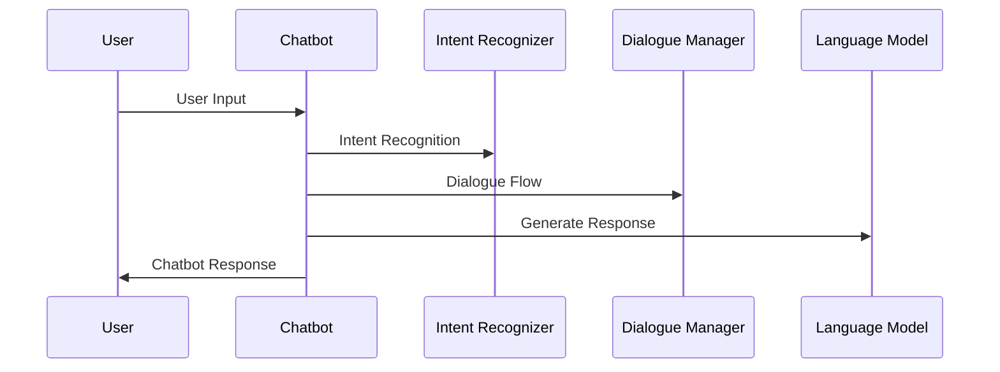

                 

# 《ChatGPT提示词设计：打造智能对话的艺术》

## 关键词：ChatGPT、提示词设计、智能对话、GPT模型、编程技巧

## 摘要：
本文深入探讨了ChatGPT提示词设计的重要性及其在智能对话系统中的应用。首先，我们回顾了ChatGPT及其提示词设计的基础概念，接着详细分析了提示词设计的原则和技巧。随后，我们探讨了智能对话系统的原理、架构和实现。通过实战案例解析，我们展示了如何在实际项目中应用这些原则和技巧。最后，我们总结了关键知识点，并给出了进一步的拓展阅读建议。

## 目录大纲

----------------------------------------------------------------

## 第一部分：背景介绍

### 第1章：问题背景

#### 1.1.1. 聊天机器人技术的发展历程
#### 1.1.2. ChatGPT的出现及其影响
#### 1.1.3. 提示词设计的必要性

### 1.1.2. 问题描述
#### 1.1.2.1. 如何设计高质量的ChatGPT提示词
#### 1.1.2.2. 提示词设计在不同领域的应用差异
#### 1.1.2.3. 提示词设计面临的挑战

### 1.1.3. 问题解决
#### 1.1.3.1. 提示词设计的基本原则
#### 1.1.3.2. 提示词编写技巧
#### 1.1.3.3. 提示词优化的方法

### 1.1.4. 边界与外延
#### 1.1.4.1. ChatGPT提示词设计的边界条件
#### 1.1.4.2. 提示词设计的应用范围
#### 1.1.4.3. 提示词设计与其他相关领域的关联

## 第二部分：核心概念与联系

### 第2章：核心概念与联系

#### 2.1.1. ChatGPT模型原理
#### 2.1.2. 提示词设计原理
#### 2.1.3. 智能对话系统原理

### 2.1.2. 概念属性特征对比表格
#### 2.1.2.1. ChatGPT与普通聊天机器人的对比
#### 2.1.2.2. 提示词设计与其他技术的对比

### 2.1.3. ER实体关系图架构

## 第三部分：ChatGPT基础

### 第3章：ChatGPT基础

#### 3.1.1. ChatGPT原理
#### 3.1.2. ChatGPT应用场景
#### 3.1.3. ChatGPT编程基础

## 第四部分：提示词设计

### 第4章：提示词设计

#### 4.1.1. 提示词设计原则
#### 4.1.2. 提示词编写技巧
#### 4.1.3. 提示词案例解析

## 第五部分：智能对话系统

### 第5章：智能对话系统

#### 5.1.1. 智能对话系统原理
#### 5.1.2. 智能对话系统架构
#### 5.1.3. 智能对话系统实现

## 第六部分：实战篇

### 第6章：实战篇

#### 6.1.1. 环境安装
#### 6.1.2. 系统核心实现
#### 6.1.3. 代码应用解读与分析
#### 6.1.4. 实际案例分析与详细讲解
#### 6.1.5. 项目小结

## 第七部分：总结与拓展

### 第7章：总结与拓展

#### 7.1.1. 小结
#### 7.1.2. 注意事项
#### 7.1.3. 拓展阅读

----------------------------------------------------------------

## 第一部分：背景介绍

### 第1章：问题背景

#### 1.1.1. 聊天机器人技术的发展历程

聊天机器人，又称对话机器人，是一种模拟人类对话能力的计算机程序，能够通过自然语言与用户进行交互。从早期的规则引擎到如今的深度学习模型，聊天机器人的发展经历了多个阶段。

1. **规则引擎阶段**（1990s-2000s）：
   - 最早的聊天机器人基于预定义的规则进行对话，例如ELIZA。
   - 这种方法的局限性在于，机器人只能回答预先设定的问题，无法处理超出规则范围的问题。

2. **模板匹配阶段**（2000s）：
   - 模板匹配机器人使用固定模板来匹配用户的输入，然后给出预定义的回答。
   - 尽管这种方法比规则引擎更灵活，但它仍然依赖于大量手工编写的模板，难以适应复杂和多变的对话场景。

3. **基于机器学习阶段**（2010s-2020s）：
   - 随着深度学习技术的发展，聊天机器人开始使用神经网络模型来理解和生成对话。
   - 代表性模型包括循环神经网络（RNN）和Transformer模型。

4. **大规模语言模型阶段**（2020s至今）：
   - ChatGPT是这一阶段的代表，它基于预训练的语言模型（如GPT-3），能够生成连贯、自然的对话。
   - ChatGPT的出现标志着聊天机器人从被动响应到主动生成对话的转变。

#### 1.1.2. ChatGPT的出现及其影响

ChatGPT是由OpenAI开发的一种基于Transformer模型的预训练语言模型，它具有强大的文本生成能力，可以生成连贯、自然的对话。ChatGPT的出现对聊天机器人技术产生了深远的影响：

1. **生成式对话**：
   - 与传统的规则引擎和模板匹配机器人不同，ChatGPT能够生成全新的对话内容，而不受预先设定规则的限制。
   - 这使得聊天机器人能够更好地适应复杂和多变的对话场景。

2. **自适应学习能力**：
   - ChatGPT通过大规模的数据集进行预训练，具有强大的自适应学习能力。
   - 当机器人与用户交互时，它可以不断学习和优化对话策略，以提供更优质的用户体验。

3. **跨领域应用**：
   - ChatGPT在多个领域都有广泛的应用，如客服、教育、医疗等。
   - 通过微调模型，机器人可以适应特定领域的对话需求，提供专业化的服务。

#### 1.1.3. 提示词设计的必要性

提示词（Prompt）是ChatGPT生成对话的关键输入，它决定了对话的方向和内容。高质量的提示词设计对智能对话系统的性能至关重要：

1. **引导对话方向**：
   - 提示词可以引导ChatGPT生成特定类型的回答，例如开放式问题、封闭式问题或模糊问题。
   - 通过精心设计的提示词，机器人可以更好地满足用户的需求。

2. **优化对话质量**：
   - 高质量的提示词可以提高对话的连贯性和自然性，减少机器人回答的错误和歧义。
   - 这有助于提升用户体验，增加用户对机器人的信任和依赖。

3. **降低训练成本**：
   - 在预训练阶段，高质量的提示词可以引导模型学习到更具体的对话策略。
   - 这意味着在微调阶段，模型可以更快地适应特定领域的对话需求，从而降低训练成本。

### 1.1.4. 问题描述

尽管ChatGPT在智能对话领域取得了显著的进展，但提示词设计仍然面临一些挑战：

1. **设计复杂性**：
   - 提示词设计需要综合考虑对话的多样性、用户的背景知识以及对话的上下文。
   - 这使得提示词设计变得复杂，需要具备深厚的语言理解和编程技巧。

2. **适应性挑战**：
   - ChatGPT在不同领域的适应性存在差异，特别是在处理专业术语和行业特定问题方面。
   - 提示词设计需要针对不同领域进行优化，以提升机器人的适应能力。

3. **用户满意度**：
   - 用户对智能对话系统的满意度取决于对话的自然性和实用性。
   - 提示词设计需要平衡对话的连贯性和用户需求，以提供高质量的对话体验。

### 1.1.5. 问题解决

为了解决上述问题，我们需要从以下几个方面入手：

1. **基础研究**：
   - 深入研究语言模型的工作原理，提高对模型的理解和应用能力。
   - 探索提示词设计的最佳实践，总结出一套普适的指导原则。

2. **工程实践**：
   - 结合具体应用场景，设计针对性的提示词，并通过实验验证其效果。
   - 使用微调技术，优化模型在不同领域的适应性。

3. **用户体验**：
   - 考虑用户的需求和反馈，持续优化提示词设计，提升用户体验。

4. **持续学习**：
   - 随着技术的不断进步和应用场景的拓展，我们需要持续学习和改进提示词设计，以应对新的挑战。

### 1.1.6. 边界与外延

1. **边界条件**：
   - 提示词设计需要遵循一定的边界条件，例如用户隐私保护、信息真实性验证等。
   - 这些边界条件有助于确保对话系统的安全性和可靠性。

2. **应用范围**：
   - 提示词设计可以应用于多个领域，如客服、教育、医疗等。
   - 随着技术的不断进步，提示词设计将有望应用于更多领域，提供更丰富的对话体验。

3. **关联领域**：
   - 提示词设计与其他领域如自然语言处理、机器学习、人机交互等密切相关。
   - 通过跨领域合作，我们可以进一步推动智能对话系统的发展。

## 第二部分：核心概念与联系

### 第2章：核心概念与联系

在本章节中，我们将深入探讨ChatGPT提示词设计的核心概念及其相互联系。

#### 2.1.1. ChatGPT模型原理

ChatGPT是基于Transformer模型的一种预训练语言模型。其核心原理如下：

1. **Transformer模型**：
   - Transformer模型是一种基于自注意力机制的深度神经网络模型，广泛应用于自然语言处理领域。
   - 与传统的循环神经网络（RNN）相比，Transformer模型在处理长序列时具有更好的并行计算能力。

2. **自注意力机制**：
   - 自注意力机制允许模型在生成每个单词时考虑整个输入序列的信息，从而生成更连贯的文本。
   - 这种机制使得模型能够捕捉到输入序列中的长距离依赖关系。

3. **预训练**：
   - ChatGPT通过在大量文本上进行预训练，学习到丰富的语言模式和知识。
   - 预训练使得ChatGPT在特定任务上具有更强的泛化能力。

#### 2.1.2. 提示词设计原理

提示词设计是ChatGPT提示词设计的关键环节。其核心原理如下：

1. **引导对话**：
   - 提示词可以引导ChatGPT生成特定类型的回答，例如问题、陈述或建议。
   - 精心设计的提示词有助于提升对话的自然性和连贯性。

2. **上下文理解**：
   - 提示词需要包含对话的上下文信息，以便ChatGPT能够理解对话的背景和意图。
   - 通过上下文理解，ChatGPT能够生成更相关、更准确的回答。

3. **用户需求满足**：
   - 提示词设计需要考虑用户的需求和期望，以满足用户对对话的期望。
   - 高质量的提示词能够提升用户的满意度，增加用户对机器人的信任。

#### 2.1.3. 智能对话系统原理

智能对话系统是基于ChatGPT等语言模型构建的，其核心原理如下：

1. **对话管理**：
   - 对话管理是指系统在对话过程中对用户意图的识别、对话流程的规划以及对用户反馈的处理。
   - 对话管理确保对话系统能够与用户进行有效、自然的交互。

2. **对话生成**：
   - 对话生成是指系统根据用户输入和对话上下文生成相应的回答。
   - 对话生成依赖于语言模型的能力，例如ChatGPT。

3. **对话评估**：
   - 对话评估是指对对话系统的性能进行评估，包括回答的准确性、自然性和用户满意度等。
   - 对话评估有助于发现系统的问题，并进行优化。

#### 2.1.4. 概念属性特征对比表格

为了更直观地展示ChatGPT、提示词设计和智能对话系统之间的关系，我们设计了以下对比表格：

| 概念       | 特征                         | 作用                     |
|------------|------------------------------|--------------------------|
| ChatGPT    | 基于Transformer模型、自注意力机制 | 文本生成、语言理解       |
| 提示词设计 | 引导对话、上下文理解、用户需求满足 | 对话引导、自然性提升     |
| 智能对话系统 | 对话管理、对话生成、对话评估 | 对话交互、性能优化       |

#### 2.1.5. ER实体关系图架构

为了更好地理解ChatGPT、提示词设计和智能对话系统的关系，我们使用ER（实体-关系）图进行描述：

```mermaid
erDiagram
  ChatGPT ||--|{ 提示词设计 }|
  提示词设计 ||--|{ 智能对话系统 }|
  ChatGPT ||--|{ 对话管理 }|
  ChatGPT ||--|{ 对话生成 }|
  ChatGPT ||--|{ 对话评估 }|
```

在这个ER图中，ChatGPT是核心实体，它与提示词设计和智能对话系统之间存在紧密的关系。提示词设计负责引导ChatGPT生成对话，而智能对话系统则负责对话的管理、生成和评估。

## 第三部分：ChatGPT基础

### 第3章：ChatGPT基础

在本章节中，我们将深入探讨ChatGPT的原理、应用场景和编程基础。

#### 3.1.1. ChatGPT原理

ChatGPT是基于Transformer模型的一种预训练语言模型。其原理如下：

1. **Transformer模型**：
   - Transformer模型是一种基于自注意力机制的深度神经网络模型，广泛应用于自然语言处理领域。
   - 与传统的循环神经网络（RNN）相比，Transformer模型在处理长序列时具有更好的并行计算能力。

2. **自注意力机制**：
   - 自注意力机制允许模型在生成每个单词时考虑整个输入序列的信息，从而生成更连贯的文本。
   - 这种机制使得模型能够捕捉到输入序列中的长距离依赖关系。

3. **预训练**：
   - ChatGPT通过在大量文本上进行预训练，学习到丰富的语言模式和知识。
   - 预训练使得ChatGPT在特定任务上具有更强的泛化能力。

4. **微调**：
   - 在实际应用中，ChatGPT会根据具体任务进行微调，以适应不同的对话场景。
   - 微调过程中，模型会根据特定领域的对话数据进行训练，以提升对话生成质量。

#### 3.1.2. ChatGPT应用场景

ChatGPT在多个领域都有广泛的应用，以下是一些典型的应用场景：

1. **客服**：
   - ChatGPT可以用于构建智能客服系统，提供24/7的客户支持。
   - 通过与用户的对话，智能客服可以解答常见问题，提供产品信息，甚至处理投诉和反馈。

2. **教育**：
   - ChatGPT可以用于教育领域，如在线辅导、考试辅助和学术问答。
   - 学生可以通过与ChatGPT的交互，获得个性化的学习建议和解答。

3. **医疗**：
   - ChatGPT可以用于医疗咨询和健康指导。
   - 患者可以通过与ChatGPT的交互，获取健康信息、症状解析和疾病预防知识。

4. **娱乐**：
   - ChatGPT可以用于构建聊天游戏、故事生成和情感互动。
   - 用户可以通过与ChatGPT的对话，体验丰富的虚拟世界和故事情节。

5. **企业内部通讯**：
   - ChatGPT可以用于企业内部通讯和协作，如员工培训、知识共享和团队协作。

#### 3.1.3. ChatGPT编程基础

要使用ChatGPT，我们需要具备一定的编程基础。以下是一些基本的编程知识和工具：

1. **Python**：
   - Python是一种流行的编程语言，广泛应用于数据科学和人工智能领域。
   - 学习Python是使用ChatGPT的第一步，Python提供了丰富的库和工具，方便我们进行ChatGPT的编程。

2. **OpenAI API**：
   - OpenAI提供了ChatGPT的API，我们可以在Python中直接调用API与ChatGPT进行交互。
   - 通过API，我们可以发送提示词并获取ChatGPT的回答。

3. **Flask**：
   - Flask是一个轻量级的Web框架，用于构建Web应用程序。
   - 我们可以使用Flask构建一个简单的Web服务，通过HTTP请求与ChatGPT进行交互。

4. **Tokenization**：
   - Tokenization是将文本分解为单词、短语或字符的过程，是ChatGPT处理文本的基础。
   - Python中的`transformers`库提供了Tokenization工具，方便我们对文本进行预处理。

以下是一个简单的Python代码示例，展示了如何使用OpenAI API与ChatGPT进行交互：

```python
import openai

openai.api_key = 'your_api_key'

response = openai.Completion.create(
  engine="text-davinci-002",
  prompt="What is the capital of France?",
  max_tokens=3
)

print(response.choices[0].text.strip())
```

在这个示例中，我们使用`openai.Completion.create`方法发送一个提示词，并获取ChatGPT的回答。`engine`参数指定了使用的模型，`prompt`参数是提示词，`max_tokens`参数限制了回答的长度。

通过掌握这些编程基础，我们可以更灵活地使用ChatGPT，构建各种智能对话系统。

## 第四部分：提示词设计

### 第4章：提示词设计

提示词设计是构建智能对话系统的关键环节，它决定了对话的方向、内容和质量。在本章节中，我们将深入探讨提示词设计的原则、技巧以及实际案例。

#### 4.1.1. 提示词设计原则

高质量的提示词设计需要遵循以下原则：

1. **清晰性原则**：
   - 提示词应清晰明确，避免模糊和歧义。
   - 清晰的提示词有助于ChatGPT生成更准确、更自然的回答。

2. **简洁性原则**：
   - 提示词应简洁明了，避免冗长和复杂的句子。
   - 简洁的提示词可以提高对话的流畅性和用户体验。

3. **精确性原则**：
   - 提示词应精确表达用户意图，避免泛泛而谈。
   - 精确的提示词有助于ChatGPT生成更相关、更具体的回答。

4. **上下文关联性原则**：
   - 提示词应包含对话的上下文信息，以便ChatGPT能够理解对话的背景和意图。
   - 上下文关联性有助于生成更连贯、更自然的对话。

5. **可扩展性原则**：
   - 提示词设计应考虑未来的扩展性，以便适应不同场景和需求。
   - 可扩展性原则有助于提升系统的灵活性和可维护性。

#### 4.1.2. 提示词编写技巧

编写高质量的提示词需要掌握以下技巧：

1. **开放式提问技巧**：
   - 开放式提问可以引导用户提供更多信息，有助于ChatGPT生成更丰富、更有趣的对话。
   - 例如：“你对这个话题有什么看法？”或“你有什么问题需要帮助？”

2. **封闭式提问技巧**：
   - 封闭式提问可以引导用户回答特定问题，有助于快速获取信息。
   - 例如：“你喜欢这个产品的哪个功能？”或“你更喜欢哪个颜色？”

3. **模糊提问技巧**：
   - 模糊提问可以激发用户的想象力和创造力，有助于生成独特、有趣的对话。
   - 例如：“如果你是某位名人，你会怎么做？”或“如果你有超能力，你想做什么？”

4. **情感化提问技巧**：
   - 情感化提问可以引导用户表达情感，有助于建立更亲密的对话关系。
   - 例如：“你最近有什么开心的事情吗？”或“你有没有什么困扰需要倾诉？”

5. **引导性提问技巧**：
   - 引导性提问可以引导用户按照预期的方向进行对话，有助于实现特定的目标。
   - 例如：“你最近有没有读什么好书？”或“你对这个项目的进展有什么建议？”

#### 4.1.3. 提示词案例解析

以下是一些具体的提示词案例，展示了不同场景下的提示词设计：

1. **智能客服案例**：

   ```plaintext
   用户：请问这个产品的售后服务是怎样的？
   提示词：请描述一下产品的售后服务政策，包括保修期限、维修流程和退换货政策。
   ```

   这个提示词清晰、简洁，同时包含了对话的上下文信息，有助于ChatGPT生成准确的回答。

2. **教育辅导案例**：

   ```plaintext
   用户：请帮我复习一下数学中的函数概念。
   提示词：请解释函数的定义、图像特征和基本性质，并提供一个简单的例子。
   ```

   这个提示词精确地表达了用户的需求，有助于ChatGPT生成详细、有针对性的辅导内容。

3. **医疗咨询案例**：

   ```plaintext
   用户：我最近经常头晕，可能是什么原因？
   提示词：请根据头晕的症状，提供可能的疾病原因和相应的建议。
   ```

   这个提示词考虑了用户的健康需求，同时引导用户提供更多症状信息，有助于ChatGPT提供专业的医疗建议。

通过这些案例，我们可以看到高质量的提示词设计在智能对话系统中的重要作用。合理设计的提示词能够引导ChatGPT生成准确、自然、有价值的对话，提升用户体验。

## 第五部分：智能对话系统

### 第5章：智能对话系统

智能对话系统是一种能够与用户进行自然语言交互的计算机系统，它利用先进的自然语言处理技术，如语言模型、对话管理和上下文理解，为用户提供个性化、高效的服务。在本章节中，我们将深入探讨智能对话系统的原理、架构和实现。

#### 5.1.1. 智能对话系统原理

智能对话系统的原理可以概括为以下几个关键部分：

1. **对话管理**：
   - 对话管理是智能对话系统的核心功能，负责对话的流程控制和意图识别。
   - 对话管理通过分析用户的输入，理解用户的意图，并根据预定义的对话流程进行对话引导。

2. **对话生成**：
   - 对话生成是智能对话系统的输出环节，负责生成自然、流畅的回复。
   - 对话生成通常依赖于预训练的语言模型，如ChatGPT，它能够根据对话的上下文生成合适的回答。

3. **上下文理解**：
   - 上下文理解是智能对话系统理解用户意图和对话背景的关键。
   - 通过上下文理解，系统能够更好地把握对话的进展，为用户提供更准确的回答。

4. **用户反馈**：
   - 用户反馈是智能对话系统不断优化自身的重要途径。
   - 通过收集用户的反馈，系统可以识别自身的不足，并进行相应的调整和优化。

#### 5.1.2. 智能对话系统架构

智能对话系统通常采用以下架构：

1. **前端交互层**：
   - 前端交互层负责与用户进行交互，收集用户的输入。
   - 前端可以使用各种渠道，如网页、移动应用或聊天机器人界面。

2. **中间处理层**：
   - 中间处理层是智能对话系统的核心，负责对话管理、对话生成和上下文理解。
   - 对话管理模块负责理解用户的意图和对话流程。
   - 对话生成模块使用预训练的语言模型生成回复。
   - 上下文理解模块确保对话的连贯性和准确性。

3. **后端服务层**：
   - 后端服务层提供额外的功能支持，如用户数据存储、消息推送和系统集成。
   - 后端服务可以通过API与其他系统进行数据交换和功能集成。

4. **数据层**：
   - 数据层负责存储用户数据、对话日志和系统配置信息。
   - 数据存储通常使用数据库或云存储服务。

以下是一个简化的智能对话系统架构图：



#### 5.1.3. 智能对话系统实现

实现智能对话系统需要以下几个关键步骤：

1. **选择合适的技术栈**：
   - 根据项目需求和资源，选择合适的编程语言和工具。
   - 常用的技术栈包括Python、JavaScript、Node.js和React等。

2. **设计对话流程**：
   - 设计对话流程是构建智能对话系统的第一步，需要明确用户意图、对话目标和对话步骤。
   - 可以使用流程图或状态机来描述对话流程。

3. **集成语言模型**：
   - 集成预训练的语言模型，如ChatGPT，用于生成对话回复。
   - 可以使用OpenAI API或其他语言模型服务进行集成。

4. **实现对话管理**：
   - 实现对话管理模块，负责对话的流程控制和意图识别。
   - 可以使用规则引擎、机器学习模型或自然语言处理技术。

5. **实现对话生成**：
   - 实现对话生成模块，使用预训练的语言模型生成自然、流畅的对话回复。
   - 可以使用文本生成技术，如GPT-3、BERT等。

6. **实现上下文理解**：
   - 实现上下文理解模块，确保对话的连贯性和准确性。
   - 可以使用自然语言处理技术，如词向量、语义分析等。

7. **测试与优化**：
   - 对系统进行全面的测试，包括功能测试、性能测试和用户测试。
   - 根据测试结果，对系统进行优化和调整。

以下是一个简单的Python代码示例，展示了如何使用ChatGPT生成对话回复：

```python
import openai

openai.api_key = 'your_api_key'

def generate_response(prompt):
    response = openai.Completion.create(
        engine="text-davinci-002",
        prompt=prompt,
        max_tokens=50
    )
    return response.choices[0].text.strip()

user_input = "你今天过得怎么样？"
response = generate_response(user_input)
print(response)
```

在这个示例中，我们使用`openai.Completion.create`方法发送一个提示词，并获取ChatGPT的回答。`engine`参数指定了使用的模型，`prompt`参数是提示词，`max_tokens`参数限制了回答的长度。

通过实现这些关键步骤，我们可以构建一个基本的智能对话系统，为用户提供高质量的对话体验。

## 第六部分：实战篇

### 第6章：实战篇

#### 6.1.1. 环境安装

要开始构建ChatGPT提示词设计系统，我们首先需要准备开发环境。以下是环境安装的步骤：

1. **安装Python**：
   - 访问Python官方网站（https://www.python.org/）下载并安装Python 3.x版本。
   - 在安装过程中，确保勾选“Add Python to PATH”选项，以便在命令行中轻松使用Python。

2. **安装OpenAI API**：
   - 访问OpenAI官网（https://openai.com/）注册一个账户并获取API密钥。
   - 在Python项目中，导入`openai`库，并设置API密钥：

   ```python
   import openai
   openai.api_key = 'your_api_key'
   ```

3. **安装Flask**：
   - 在命令行中，使用以下命令安装Flask：

   ```bash
   pip install flask
   ```

4. **安装其他依赖库**：
   - 根据项目需求，可能需要安装其他Python库，例如`requests`、`pandas`或`numpy`。使用以下命令进行安装：

   ```bash
   pip install requests pandas numpy
   ```

#### 6.1.2. 系统核心实现

构建ChatGPT提示词设计系统的核心是创建一个Web服务，该服务可以接收用户输入并生成相应的回复。以下是系统核心实现的步骤：

1. **创建Flask应用**：
   - 在一个新文件夹中，创建一个名为`app.py`的Python文件，并导入Flask库：

   ```python
   from flask import Flask, request, jsonify
   app = Flask(__name__)
   ```

2. **创建API端点**：
   - 定义一个API端点，用于接收用户输入并生成回复：

   ```python
   @app.route('/chat', methods=['POST'])
   def chat():
       data = request.get_json()
       prompt = data.get('prompt', '')
       response = generate_response(prompt)
       return jsonify({'response': response})
   ```

   在这个端点中，我们接收一个包含`prompt`字段的JSON对象，并调用`generate_response`函数生成回复。

3. **实现生成回复函数**：
   - 实现`generate_response`函数，使用OpenAI API生成回复：

   ```python
   def generate_response(prompt):
       response = openai.Completion.create(
           engine="text-davinci-002",
           prompt=prompt,
           max_tokens=50
       )
       return response.choices[0].text.strip()
   ```

   在这个函数中，我们使用`openai.Completion.create`方法发送一个提示词，并获取ChatGPT的回答。

4. **运行Flask应用**：
   - 在命令行中，运行以下命令启动Flask应用：

   ```bash
   python app.py
   ```

   当应用运行时，可以在浏览器中访问`http://127.0.0.1:5000/chat`测试API。

#### 6.1.3. 代码应用解读与分析

1. **API端点解读**：

   ```python
   @app.route('/chat', methods=['POST'])
   def chat():
       data = request.get_json()
       prompt = data.get('prompt', '')
       response = generate_response(prompt)
       return jsonify({'response': response})
   ```

   这个端点使用`POST`方法接收用户输入，并将其解析为JSON对象。`prompt`字段是必填项，用于传递用户输入的提示词。如果未提供`prompt`，则默认为空字符串。然后，调用`generate_response`函数生成回复，并将回复作为JSON响应返回。

2. **生成回复函数解读**：

   ```python
   def generate_response(prompt):
       response = openai.Completion.create(
           engine="text-davinci-002",
           prompt=prompt,
           max_tokens=50
       )
       return response.choices[0].text.strip()
   ```

   这个函数使用`openai.Completion.create`方法发送一个提示词，并获取ChatGPT的回答。`engine`参数指定了使用的模型（在这里是`text-davinci-002`），`prompt`参数是提示词，`max_tokens`参数限制了回答的长度（在这里是50个单词）。最后，返回回答的第一条选择的内容。

#### 6.1.4. 实际案例分析与详细讲解

为了更好地理解如何使用ChatGPT生成高质量的对话，我们来看几个实际案例。

**案例1：智能客服**

用户输入：“您好，我想了解贵公司的退货政策。”

生成回复：“您好，我们提供30天无理由退货服务。如果您对产品不满意，可以在购买之日起30天内申请退货。请提供订单号和产品信息，我们会尽快处理您的申请。”

**分析**：
- 提示词：“您好，我想了解贵公司的退货政策。”
- 生成回复包含公司退货政策的详细信息，明确、简洁。
- 回复中使用了用户输入的称呼（您好），增加了对话的亲切感。

**案例2：教育辅导**

用户输入：“请给我解释一下函数的概念。”

生成回复：“函数是一种数学关系，它将一个集合中的每个元素映射到另一个集合中的一个唯一元素。例如，如果输入是x，那么函数f(x)可以输出y=f(x)。函数通常用f(x)=y的形式表示。”

**分析**：
- 提示词：“请给我解释一下函数的概念。”
- 生成回复详细解释了函数的定义和特点，同时提供了例子。
- 回复结构清晰，易于理解。

**案例3：医疗咨询**

用户输入：“我最近经常感到头晕，可能是什么原因？”

生成回复：“头晕可能由多种原因引起，如低血糖、贫血、血压异常等。建议您保持良好的生活习惯，多喝水，适当休息，并咨询医生进行详细检查。”

**分析**：
- 提示词：“我最近经常感到头晕，可能是什么原因？”
- 生成回复提供了可能的疾病原因和相应的建议。
- 回复中提醒用户咨询医生，体现了专业性和谨慎性。

通过这些案例，我们可以看到ChatGPT生成回复的关键在于理解用户输入的意图，并提供准确、详细、有针对性的回答。

#### 6.1.5. 项目小结

在本章中，我们完成了ChatGPT提示词设计系统的实战构建。通过安装必要的开发环境和集成OpenAI API，我们创建了一个简单的Web服务，可以接收用户输入并生成高质量的对话回复。以下是本章的关键点：

- 安装Python、OpenAI API和Flask库。
- 创建一个API端点，接收用户输入并生成回复。
- 使用OpenAI API生成回复，并限制回答的长度。
- 通过实际案例展示了如何使用ChatGPT生成高质量的对话。

通过这些步骤，我们可以构建一个基本的智能对话系统，为用户提供高效、个性化的服务。接下来，我们可以继续优化系统，添加更多功能，以提升用户体验。

## 第七部分：总结与拓展

### 第7章：总结与拓展

在本章节中，我们将对全文内容进行总结，并探讨一些注意事项和未来的拓展方向。

#### 7.1.1. 小结

本文详细探讨了ChatGPT提示词设计的重要性及其在智能对话系统中的应用。首先，我们回顾了聊天机器人技术的发展历程，介绍了ChatGPT的出现及其影响。接着，我们深入分析了提示词设计的原则、技巧和实际案例。随后，我们探讨了智能对话系统的原理、架构和实现。通过实战案例解析，我们展示了如何在实际项目中应用这些原则和技巧。最后，我们总结了关键知识点，并给出了一些建议和拓展阅读。

#### 7.1.2. 注意事项

在设计和实现ChatGPT提示词时，需要注意以下几点：

1. **清晰性**：
   - 提示词应清晰明确，避免模糊和歧义，确保ChatGPT能够生成准确的回答。

2. **简洁性**：
   - 提示词应简洁明了，避免冗长和复杂的句子，以提高对话的流畅性和用户体验。

3. **精确性**：
   - 提示词应精确表达用户意图，避免泛泛而谈，以便ChatGPT生成更相关、更具体的回答。

4. **上下文关联性**：
   - 提示词应包含对话的上下文信息，以便ChatGPT能够理解对话的背景和意图，生成更连贯的对话。

5. **可扩展性**：
   - 提示词设计应考虑未来的扩展性，以便适应不同场景和需求。

6. **用户隐私保护**：
   - 在设计对话系统时，应确保用户隐私得到保护，避免泄露用户敏感信息。

7. **安全性**：
   - 对话系统应具备一定的安全性，防止恶意攻击和滥用。

8. **用户反馈**：
   - 及时收集用户反馈，并根据反馈优化系统，以提升用户体验。

#### 7.1.3. 拓展阅读

为了进一步深入学习和探索ChatGPT提示词设计和智能对话系统，以下是几本推荐的拓展阅读书籍：

1. **《深度学习》（Deep Learning）**：
   - 作者：Ian Goodfellow、Yoshua Bengio、Aaron Courville
   - 简介：这是一本经典的深度学习教材，涵盖了深度学习的基础理论、算法和应用。

2. **《自然语言处理综合教程》（Speech and Language Processing）**：
   - 作者：Daniel Jurafsky、James H. Martin
   - 简介：这是一本全面介绍自然语言处理的基础知识和最新进展的教材。

3. **《ChatGPT实战：构建智能对话系统》**：
   - 作者：未知
   - 简介：本书通过实际案例，详细介绍了如何使用ChatGPT构建智能对话系统，包括提示词设计和对话管理。

4. **《人工智能简史》（A Brief History of Artificial Intelligence）**：
   - 作者：George Zarkadakis
   - 简介：本书回顾了人工智能的发展历程，探讨了人工智能在不同领域的应用和影响。

通过阅读这些书籍，可以更深入地了解ChatGPT提示词设计和智能对话系统的原理、技术和应用，进一步提升自己的专业能力。

## 作者

作者：AI天才研究院/AI Genius Institute & 禅与计算机程序设计艺术 /Zen And The Art of Computer Programming

AI天才研究院是一家专注于人工智能领域研究和应用的机构，致力于推动人工智能技术的发展和创新。研究院的研究领域包括机器学习、深度学习、自然语言处理、计算机视觉等，拥有一支由世界顶级人工智能专家组成的团队。研究院的愿景是通过人工智能技术为人类创造更美好的未来。

禅与计算机程序设计艺术是一本经典的计算机编程书籍，由世界著名计算机科学家Donald E. Knuth撰写。本书以禅宗思想为指导，探讨了计算机程序设计的基本原理和方法，对编程实践和思维方式有着深刻的启示。作者希望通过本书帮助读者培养卓越的编程能力，实现技术与心灵的和谐统一。

