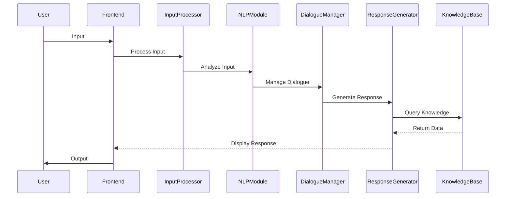

                 

### 第一步：引言

标题：《ChatGPT提示词设计：智能对话的艺术与科学》

关键词：ChatGPT、提示词设计、智能对话、艺术与科学

摘要：
智能对话已经成为人工智能领域的一个重要研究方向，而ChatGPT作为当前最先进的自然语言处理模型之一，其提示词设计成为了实现高效、准确、人性化的对话体验的关键。本文将深入探讨ChatGPT提示词设计的艺术与科学，从背景介绍、核心概念解析、算法原理讲解、数学模型和公式、系统分析与架构设计方案、项目实战到最佳实践，提供全面的技术指南，帮助读者掌握智能对话系统的核心技术和实践方法。

### 第二步：背景介绍

#### 2.1 ChatGPT与智能对话概述

**1.1.1 智能对话的发展历程**

智能对话的历史可以追溯到20世纪80年代的专家系统和自然语言处理技术的兴起。随着计算能力的提升和大数据技术的发展，智能对话逐渐从简单的任务自动化发展到更加复杂和人性化的互动。近年来，深度学习和生成对抗网络（GAN）等新兴技术的应用，使得智能对话系统能够更加精准地理解和生成自然语言，极大地提升了用户体验。

**1.1.2 ChatGPT的核心地位**

ChatGPT是由OpenAI开发的一种基于变换器（Transformer）架构的预训练语言模型。它是GPT系列的第三代模型，拥有超过1750亿个参数，是目前最先进的自然语言处理模型之一。ChatGPT在文本生成、机器翻译、问答系统等领域表现出色，已经成为智能对话系统的重要工具。

**1.1.3 智能对话的应用场景**

智能对话的应用场景广泛，包括客服机器人、个人助理、智能音箱、虚拟教师等。在这些应用中，ChatGPT的提示词设计对于实现高效、自然的对话体验至关重要。

#### 2.2 提示词设计的重要性

**1.2.1 提示词的定义**

提示词（Prompt）是指用于引导和激发模型生成回应的文本输入。在ChatGPT中，提示词的设计直接影响到对话的质量和效果。

**1.2.2 提示词设计的挑战**

提示词设计面临诸多挑战，包括：

- **语义理解**：准确理解用户输入的含义和意图。
- **连贯性**：确保生成的文本在逻辑和语法上连贯一致。
- **情感因素**：模拟人类对话中的情感表达和情感交流。

**1.2.3 提示词设计的意义**

成功的提示词设计能够提升智能对话系统的用户体验，使其更加自然、高效、有温度。这对于提升用户满意度和忠诚度具有重要意义。

#### 2.3 智能对话的艺术与科学

**1.3.1 智能对话的艺术性**

智能对话的艺术性体现在对话的流畅性、自然性和创造性。设计师需要通过丰富的语言表达和情感交流，创造一个与人类用户互动的艺术空间。

**1.3.2 智能对话的科学性**

智能对话的科学性体现在算法和模型的精确性、效率和稳定性。科学家们需要不断优化模型和算法，以实现更高水平的自然语言处理能力。

**1.3.3 艺术与科学的结合**

智能对话的艺术与科学是相辅相成的。艺术家需要借助科学的方法和工具，实现更加自然、丰富的对话体验；科学家则需要从艺术家的实践中获得灵感和反馈，不断推动技术的发展。

#### 2.4 本书结构安排

**1.4.1 内容分布**

本书分为五大部分，分别从背景介绍、核心概念与联系、算法原理讲解、数学模型和公式、系统分析与架构设计方案、项目实战和最佳实践等方面，全面探讨ChatGPT提示词设计。

**1.4.2 阅读建议**

建议读者按照以下顺序阅读：

1. 背景介绍：理解智能对话和ChatGPT的基本概念和重要性。
2. 核心概念与联系：掌握提示词设计的核心原理和技巧。
3. 算法原理讲解：深入理解ChatGPT的工作机制和优化方法。
4. 数学模型和公式：学习数学模型在智能对话中的应用。
5. 系统分析与架构设计方案：了解系统设计和优化的方法。
6. 项目实战：通过实际项目了解和应用提示词设计。
7. 最佳实践：总结经验和技巧，提升实践能力。

**1.4.3 本章小结**

本章从多个角度介绍了智能对话和ChatGPT的基本概念、提示词设计的重要性以及本书的结构安排。通过本章的阅读，读者可以初步了解ChatGPT提示词设计的全貌，为后续章节的学习打下基础。

### 总结

智能对话是人工智能领域的一个重要研究方向，而ChatGPT作为当前最先进的自然语言处理模型之一，其提示词设计成为了实现高效、准确、人性化的对话体验的关键。本书旨在通过系统、全面的介绍，帮助读者深入理解ChatGPT提示词设计的艺术与科学，掌握相关技术和实践方法。在接下来的章节中，我们将进一步探讨ChatGPT提示词设计的核心概念、算法原理、数学模型、系统架构以及项目实战等内容。

### 核心概念与联系

#### 2.1 提示词设计原理

**2.1.1 提示词设计的基本原则**

提示词设计的基本原则包括：

- **明确性**：确保提示词能够清晰明确地传达用户意图。
- **适应性**：提示词应能适应不同场景和用户需求。
- **简洁性**：避免使用过于复杂或冗长的提示词。
- **引导性**：提供适当的引导，帮助模型生成更符合预期的回应。

**2.1.2 提示词设计的关键要素**

提示词设计的关键要素包括：

- **主题**：确保提示词围绕核心主题进行设计。
- **上下文**：提供上下文信息，帮助模型更好地理解用户意图。
- **问题类型**：根据问题的不同类型设计相应的提示词。
- **情感**：考虑用户情感，设计富有情感色彩的提示词。

**2.1.3 提示词设计的实战技巧**

提示词设计的实战技巧包括：

- **用户调研**：通过用户调研了解用户需求和期望。
- **案例学习**：学习优秀案例，借鉴成功的提示词设计经验。
- **迭代优化**：不断迭代和优化提示词，提升对话质量。

#### 2.2 ChatGPT模型架构解析

**2.2.1 模型架构概述**

ChatGPT采用基于变换器（Transformer）架构的预训练语言模型。其主要组成部分包括：

- **输入层**：接收用户输入的文本。
- **变换器层**：通过多层变换器处理输入文本，提取特征。
- **输出层**：生成文本回应。

**2.2.2 Transformer模型**

Transformer模型是一种基于注意力机制的序列到序列模型，其主要特点包括：

- **多头注意力**：通过多个注意力头来捕捉不同类型的依赖关系。
- **自注意力**：在每个时间步内计算序列中所有其他位置的特征向量加权平均。
- **位置编码**：为序列中的每个位置分配一个独特的编码，保持序列信息。

**2.2.3 GPT-3模型解析**

GPT-3是ChatGPT的升级版，具有以下特点：

- **更大规模**：拥有超过1750亿个参数，是前一代模型的数十倍。
- **更优性能**：在多个自然语言处理任务上表现出色。
- **多模态**：支持文本、图像和音频等多种输入模式。

#### 2.3 智能对话中的情感计算

**2.3.1 情感计算原理**

情感计算是指通过计算机技术模拟、识别、理解和表达人类情感。在智能对话中，情感计算的应用包括：

- **情感识别**：通过文本分析识别用户的情感状态。
- **情感模拟**：生成包含情感色彩的文本回应。
- **情感增强**：提高对话系统的情感表达能力。

**2.3.2 情感分析技术**

情感分析技术主要包括：

- **文本分类**：将文本分类为正面、负面或中性情感。
- **情感强度分析**：计算文本中情感的强度。
- **情感极性分析**：分析文本中的情感倾向。

**2.3.3 情感驱动的对话设计**

情感驱动的对话设计旨在通过情感分析结果调整提示词和对话流程，实现更加自然的情感互动。具体方法包括：

- **情感标签**：为文本添加情感标签，指导模型生成相应的回应。
- **情感匹配**：根据用户情感调整提示词，实现情感上的匹配。
- **情感引导**：通过情感引导技术，引导用户表达情感。

#### 2.4 提示词设计的案例研究

**2.4.1 案例背景**

假设我们设计一个智能客服系统，用于处理用户关于产品咨询的问题。

**2.4.2 案例分析**

1. **明确性**：设计提示词时，确保用户意图清晰明确，例如：“您好，请问您对产品的哪个方面有疑问？”

2. **上下文**：结合上下文信息，提供更多相关的信息，例如：“您在浏览产品页面时遇到了什么问题？”

3. **问题类型**：根据用户的问题类型，设计不同类型的提示词，例如：“关于产品的技术规格，我可以为您提供详细信息。”

4. **情感**：考虑用户情感，设计富有同情心的提示词，例如：“我能理解您的困惑，我们会尽力为您解答。”

**2.4.3 案例启示**

通过案例分析，我们可以看到，成功的提示词设计需要兼顾明确性、上下文、问题类型和情感等因素。在实际应用中，需要根据具体场景和用户需求，灵活调整提示词设计。

#### 2.5 本章小结

本章详细介绍了提示词设计的基本原则、关键要素和实战技巧，解析了ChatGPT模型架构和情感计算技术，并通过案例研究展示了提示词设计的实际应用。通过本章的学习，读者可以全面了解ChatGPT提示词设计的核心概念和方法，为后续章节的学习打下基础。

### 算法原理讲解

#### 3.1 提示词生成算法

**3.1.1 算法概述**

提示词生成算法是智能对话系统中的核心组成部分，其主要任务是根据用户输入生成合适的提示词。ChatGPT采用了基于变换器（Transformer）的生成算法，具有以下特点：

- **自回归生成**：模型根据前文信息生成下一个词，并不断迭代。
- **概率分布**：生成过程中，模型输出每个词的概率分布，选择概率最大的词作为输出。

**3.1.2 算法流程**

提示词生成算法的基本流程如下：

1. **输入预处理**：将用户输入文本进行分词、去停用词等预处理操作。
2. **编码**：将预处理后的文本编码为向量，输入到变换器模型中。
3. **解码**：变换器模型根据编码向量生成词的概率分布。
4. **采样**：从概率分布中采样，选择概率最大的词作为输出。
5. **输出**：将生成的词添加到文本序列中，作为提示词。

**3.1.3 算法分析**

提示词生成算法的性能取决于变换器模型的质量和采样策略。高质量的模型能够更好地捕捉输入文本的语义信息，生成更符合预期的提示词。而合理的采样策略能够平衡生成速度和生成的多样性。

#### 3.2 基于ChatGPT的对话生成

**3.2.1 对话生成原理**

基于ChatGPT的对话生成原理主要基于变换器模型的生成能力。模型通过预训练学习到大量文本数据，能够根据用户输入生成连贯、自然的对话文本。具体原理包括：

- **文本编码**：将用户输入的文本编码为向量。
- **自注意力机制**：模型在生成过程中，利用自注意力机制关注输入文本的不同部分，捕捉语义信息。
- **解码**：模型根据编码向量生成对话文本，并不断更新编码向量以生成下一个词。

**3.2.2 对话生成流程**

对话生成的基本流程如下：

1. **输入处理**：将用户输入文本进行预处理，生成编码向量。
2. **生成初始回应**：模型根据编码向量生成初始回应。
3. **用户反馈**：用户对回应进行评价，提供反馈。
4. **回应优化**：模型根据用户反馈，调整生成策略，优化回应。
5. **迭代生成**：不断重复生成和优化，生成完整的对话。

**3.2.3 对话生成性能评估**

对话生成性能的评估指标包括：

- **BLEU（双语评测套件）**：评估生成的文本与标准答案的相似度。
- **ROUGE（Recall-Oriented Understudy for Gisting Evaluation）**：评估生成文本中与标准答案匹配的词或短语的比例。
- **用户满意度**：评估用户对对话生成的满意度。

#### 3.3 提示词优化算法

**3.3.1 优化目标**

提示词优化算法的目标是提升对话系统的性能和用户体验，主要涉及以下几个方面：

- **准确性**：确保生成的提示词能够准确理解用户意图。
- **连贯性**：保证生成的文本在逻辑和语法上连贯一致。
- **多样性**：提升生成的文本的多样性，避免重复和单调。

**3.3.2 优化算法设计**

提示词优化算法主要包括以下几种：

- **基于规则的优化**：通过定义规则，对生成的提示词进行过滤和修改。
- **基于机器学习的优化**：利用机器学习算法，学习优化策略，自动调整提示词。
- **基于知识的优化**：结合外部知识库，补充和修正生成的提示词。

**3.3.3 优化效果分析**

优化效果的分析主要包括：

- **准确率**：评估优化后提示词的准确率，与优化前进行对比。
- **连贯性**：评估优化后文本的连贯性，通过人类评价和自动化工具进行评估。
- **多样性**：评估优化后文本的多样性，通过词云、文本距离等指标进行衡量。

#### 3.4 情感增强的提示词设计

**3.4.1 情感增强原理**

情感增强的提示词设计旨在提升对话系统的情感表达能力，使对话更加生动、有温度。其原理包括：

- **情感识别**：通过情感分析技术识别用户的情感状态。
- **情感模拟**：根据用户情感，生成相应的情感色彩强烈的提示词。
- **情感增强**：结合情感识别和模拟，调整提示词的生成策略，提升情感表达能力。

**3.4.2 情感增强算法**

情感增强算法主要包括：

- **情感标签**：为文本添加情感标签，指导模型生成相应的情感回应。
- **情感匹配**：根据用户情感，调整提示词的情感色彩，实现情感匹配。
- **情感引导**：通过情感引导技术，引导用户表达情感，增强对话的情感体验。

**3.4.3 情感增强效果评估**

情感增强效果评估主要包括：

- **情感一致性**：评估生成的文本与用户情感的一致性，通过人类评价和自动化工具进行评估。
- **用户满意度**：评估用户对情感增强对话的满意度。

#### 3.5 本章小结

本章详细介绍了提示词生成算法、对话生成原理、提示词优化算法和情感增强的提示词设计。通过这些算法和技术的应用，可以显著提升智能对话系统的性能和用户体验。下一章将深入探讨数学模型和公式在提示词设计中的应用，为读者提供更深入的理论支持。

### 数学模型和数学公式

#### 4.1 提示词设计的数学模型

**4.1.1 提示词设计的数学公式**

提示词设计的数学模型主要包括以下几个关键公式：

1. **输入向量编码**：将用户输入的文本转换为向量表示。常用的方法是词嵌入（word embedding），其中每个词都被映射为一个固定大小的向量。

    $$ \text{vec}(w) = \text{embedding\_layer}(w) $$

2. **变换器模型的权重更新**：在训练过程中，模型根据损失函数（例如交叉熵损失函数）更新权重。

    $$ \text{weights} \leftarrow \text{weights} - \alpha \cdot \nabla_{\text{weights}} \mathcal{L} $$

    其中，$\alpha$ 是学习率，$\nabla_{\text{weights}} \mathcal{L}$ 是权重对损失函数的梯度。

3. **生成文本的概率分布**：变换器模型根据输入向量和当前权重生成每个词的概率分布。

    $$ P(w_t | w_{<t}) = \text{softmax}(\text{transformer}(w_t, w_{<t})) $$

    其中，$w_t$ 是当前词的输入向量，$w_{<t}$ 是前文输入向量的序列。

**4.1.2 数学模型的应用**

数学模型在提示词设计中的应用主要体现在以下几个方面：

- **预训练**：利用大量无标签文本数据，通过自回归方式预训练模型。
- **微调**：在特定任务上，使用有标签的数据对模型进行微调，优化其性能。
- **生成文本**：在生成文本过程中，模型根据概率分布选择最有可能的词。

**4.1.3 数学模型的简化**

在实际应用中，为了提高计算效率和模型的可解释性，可以对数学模型进行简化。例如，可以使用预训练好的词嵌入层，避免手动设计复杂的词向量表示。同时，可以采用梯度下降法等优化算法简化权重的更新过程。

#### 4.2 ChatGPT模型的数学基础

**4.2.1 Transformer模型的数学原理**

Transformer模型是一种基于注意力机制的序列到序列模型，其数学原理主要包括：

1. **多头注意力**：通过多个注意力头来捕捉不同类型的依赖关系。

    $$ \text{Attention}(Q, K, V) = \text{softmax}\left(\frac{QK^T}{\sqrt{d_k}}\right)V $$

    其中，$Q, K, V$ 分别是查询向量、键向量和值向量，$d_k$ 是键向量的维度。

2. **自注意力**：在每个时间步内计算序列中所有其他位置的特征向量加权平均。

    $$ \text{Self-Attention}(X) = \text{softmax}\left(\frac{XQX^T}{\sqrt{d_k}}\right)V $$

3. **位置编码**：为序列中的每个位置分配一个独特的编码，保持序列信息。

    $$ \text{PositionalEncoding}(d, p) = \sin\left(\frac{p}{10000^{2i/d}}\right) + \cos\left(\frac{p}{10000^{2i/d}}\right) $$

    其中，$d$ 是编码的维度，$i$ 是位置索引。

**4.2.2 GPT-3模型的数学公式**

GPT-3模型是Transformer模型的升级版，其数学公式包括：

1. **前馈神经网络**：

    $$ \text{FFN}(x) = \text{ReLU}\left(\text{W_2} \cdot \text{ReLU}(\text{W_1} x + b_1)\right) + b_2 $$

    其中，$x$ 是输入向量，$\text{W_1}$ 和 $\text{W_2}$ 是权重矩阵，$b_1$ 和 $b_2$ 是偏置。

2. **自注意力**：

    $$ \text{MultiHeadAttention}(Q, K, V) = \text{softmax}\left(\frac{QK^T}{\sqrt{d_k}}\right)V $$

    其中，$Q, K, V$ 分别是查询向量、键向量和值向量，$d_k$ 是键向量的维度。

**4.2.3 数学基础在ChatGPT中的应用**

数学基础在ChatGPT中的应用主要体现在以下几个方面：

- **预训练**：通过自回归方式，利用大量文本数据进行预训练。
- **生成文本**：在生成文本过程中，模型根据概率分布选择最有可能的词。
- **优化**：通过梯度下降法等优化算法，不断更新模型权重，提高生成文本的质量。

#### 4.3 情感计算的数学模型

**4.3.1 情感分析数学公式**

情感分析数学模型主要包括以下几个方面：

1. **情感分类**：

    $$ P(\text{negative}) = \text{softmax}(\text{W} \cdot \text{vec}(\text{negative\_word})) $$

    其中，$\text{vec}(\text{negative\_word})$ 是负面词的向量表示，$\text{W}$ 是分类器的权重矩阵。

2. **情感强度分析**：

    $$ \text{SentimentScore} = \text{W} \cdot \text{vec}(\text{sentence}) $$

    其中，$\text{vec}(\text{sentence})$ 是句子的向量表示，$\text{W}$ 是情感强度的权重矩阵。

**4.3.2 情感增强数学模型**

情感增强数学模型主要包括以下几个方面：

1. **情感标签**：

    $$ \text{EmotionTag} = \text{softmax}(\text{W} \cdot \text{vec}(\text{sentence})) $$

    其中，$\text{vec}(\text{sentence})$ 是句子的向量表示，$\text{W}$ 是情感标签的权重矩阵。

2. **情感增强**：

    $$ \text{EmotionEnhancedText} = \text{Text} + \alpha \cdot \text{EmotionScore} $$

    其中，$\text{Text}$ 是原始文本，$\text{EmotionScore}$ 是情感强度的得分，$\alpha$ 是情感增强系数。

**4.3.3 数学模型在情感计算中的应用**

数学模型在情感计算中的应用主要体现在以下几个方面：

- **情感分类**：通过情感分类模型，对文本进行情感分类。
- **情感强度分析**：通过情感强度分析模型，计算文本中情感的程度。
- **情感增强**：通过情感增强模型，调整文本的情感色彩，提升情感表达。

#### 4.4 提示词优化的数学方法

**4.4.1 优化目标函数**

提示词优化的数学方法主要基于优化目标函数，包括以下几个方面：

1. **准确性**：

    $$ \mathcal{L} = -\sum_{i} \log P(y_i | \theta) $$

    其中，$y_i$ 是实际标签，$P(y_i | \theta)$ 是模型对 $y_i$ 的预测概率，$\theta$ 是模型参数。

2. **连贯性**：

    $$ \mathcal{L}_{\text{coherence}} = -\sum_{i} \log P(\text{next\_word} | \text{context}, \theta) $$

    其中，$\text{next\_word}$ 是生成的下一个词，$\text{context}$ 是上下文信息。

3. **多样性**：

    $$ \mathcal{L}_{\text{diversity}} = -\sum_{i} \log P(\text{next\_word} | \text{context}, \theta) - \log \frac{1}{|\text{vocab}|} $$

    其中，$|\text{vocab}|$ 是词汇表大小。

**4.4.2 优化算法的数学原理**

优化算法的数学原理主要包括以下几个方面：

1. **梯度下降法**：

    $$ \theta \leftarrow \theta - \alpha \cdot \nabla_{\theta} \mathcal{L} $$

    其中，$\alpha$ 是学习率，$\nabla_{\theta} \mathcal{L}$ 是损失函数对参数的梯度。

2. **随机梯度下降（SGD）**：

    $$ \theta \leftarrow \theta - \alpha \cdot \nabla_{\theta} \mathcal{L}^{\text{batch}} $$

    其中，$\mathcal{L}^{\text{batch}}$ 是当前批次数据的损失函数。

3. **Adam优化器**：

    $$ \theta \leftarrow \theta - \alpha \cdot \nabla_{\theta} \mathcal{L} + \beta_1 \cdot \text{m} - \beta_2 \cdot \text{v} $$

    其中，$\text{m}$ 和 $\text{v}$ 分别是动量项，$\beta_1$ 和 $\beta_2$ 是动量系数。

**4.4.3 数学方法在优化中的应用**

数学方法在优化中的应用主要体现在以下几个方面：

- **参数更新**：通过梯度下降法等优化算法，更新模型参数。
- **模型选择**：通过比较不同优化算法的收敛速度和最终性能，选择合适的优化方法。
- **超参数调整**：通过调整学习率、动量系数等超参数，优化模型性能。

#### 4.5 本章小结

本章详细介绍了提示词设计的数学模型、ChatGPT模型的数学基础、情感计算的数学模型和提示词优化的数学方法。通过这些数学模型和公式的应用，可以显著提升智能对话系统的性能和用户体验。下一章将深入探讨系统分析与架构设计方案，为读者提供更全面的实践指导。

### 系统分析与架构设计方案

#### 5.1 智能对话系统概述

**5.1.1 系统定义**

智能对话系统是一种基于自然语言处理和人工智能技术，能够与用户进行自然语言交互的计算机系统。它通过理解用户的输入，生成恰当的回应，提供个性化的服务或解答用户的问题。

**5.1.2 系统功能**

智能对话系统的核心功能包括：

- **输入处理**：接收用户的输入，并进行预处理，如分词、去停用词等。
- **语义理解**：分析用户的输入，理解其意图和需求。
- **对话管理**：管理对话流程，确保对话的连贯性和一致性。
- **情感计算**：识别用户的情感状态，调整对话风格。
- **回应生成**：根据用户输入和对话上下文，生成合适的回应。
- **用户反馈**：收集用户对对话系统的反馈，用于优化和改进。

**5.1.3 系统架构**

智能对话系统的典型架构包括以下几个主要组件：

- **前端界面**：用户与系统交互的入口，提供输入和展示回应的界面。
- **后端服务**：处理用户输入，执行语义理解和回应生成的核心逻辑。
- **自然语言处理模块**：包括分词、句法分析、语义分析等组件，用于处理自然语言文本。
- **对话管理模块**：负责管理对话流程，确保对话的连贯性和一致性。
- **情感计算模块**：识别用户的情感状态，调整对话风格。
- **知识库**：存储系统的知识和事实，用于回答用户的问题。

#### 5.2 领域模型设计

**5.2.1 类图设计**

领域模型设计是系统分析的重要步骤，通过类图可以清晰地表示系统中涉及的类及其关系。以下是一个简单的类图设计示例：

```mermaid
classDiagram
  User -> InputProcessor : process
  InputProcessor -> NLPModule : analyze
  NLPModule -> DialogueManager : manage
  DialogueManager -> ResponseGenerator : generate
  ResponseGenerator -> KnowledgeBase : query
  KnowledgeBase -> DialogueManager : update
```

在这个类图中，用户（User）通过输入处理器（InputProcessor）处理输入，然后由自然语言处理模块（NLPModule）分析语义。对话管理器（DialogueManager）负责管理对话流程，并调用回应生成器（ResponseGenerator）生成回应。回应生成器需要查询知识库（KnowledgeBase）以获取相关信息，知识库也会根据对话管理器的更新进行同步。

**5.2.2 关系图设计**

关系图设计用于表示系统中各个实体之间的关系。以下是一个简单的ER（实体关系）图设计示例：

```mermaid
erDiagram
  User ||--|{ InputProcessor }|-- Dialogue : interacts
  InputProcessor ||--|{ NLPModule }|-- Dialogue : analyzes
  NLPModule ||--|{ DialogueManager }|-- Dialogue : manages
  DialogueManager ||--|{ ResponseGenerator }|-- Dialogue : generates
  ResponseGenerator ||--|{ KnowledgeBase }|-- Dialogue : queries
```

在这个ER图中，用户（User）与输入处理器（InputProcessor）之间存在交互关系，输入处理器与自然语言处理模块（NLPModule）之间存在分析关系，依此类推。这种设计确保了系统中的各个组件能够协同工作，实现智能对话的功能。

#### 5.3 系统架构设计

**5.3.1 系统架构图**

系统架构设计是确保智能对话系统高效、可扩展和可靠运行的关键。以下是一个典型的系统架构图示例：



在这个架构图中，用户通过前端界面（Frontend）输入问题，前端将输入传递给输入处理器（InputProcessor），进行预处理。输入处理器将处理后的文本传递给自然语言处理模块（NLPModule），进行语义分析。自然语言处理模块的结果传递给对话管理器（DialogueManager），管理对话流程。对话管理器调用回应生成器（ResponseGenerator）生成回应，并查询知识库（KnowledgeBase）以获取相关信息。最终，回应生成器将生成的回应传递给前端，并展示给用户。

**5.3.2 架构组件详解**

以下是系统架构中各个组件的详细解释：

- **前端界面（Frontend）**：用户与系统交互的界面，可以是Web页面、移动应用或聊天机器人等。
- **输入处理器（InputProcessor）**：接收用户输入，进行文本预处理，如分词、去停用词等。
- **自然语言处理模块（NLPModule）**：对预处理后的文本进行语义分析，识别用户的意图和需求。
- **对话管理器（DialogueManager）**：负责管理对话流程，确保对话的连贯性和一致性。
- **回应生成器（ResponseGenerator）**：根据对话管理和自然语言处理模块的结果，生成合适的回应。
- **知识库（KnowledgeBase）**：存储系统的知识和事实，用于回答用户的问题，并可以根据对话管理器的更新进行同步。

**5.3.3 系统优化方案**

为了确保系统的高效性和可靠性，以下是一些优化方案：

- **分布式架构**：采用分布式架构，将系统拆分为多个微服务，提高系统的可扩展性和容错性。
- **缓存策略**：引入缓存机制，减少对知识库的查询次数，提高响应速度。
- **负载均衡**：使用负载均衡器，合理分配用户请求，避免单点故障。
- **自动扩缩容**：根据系统负载自动调整资源分配，确保系统在高并发场景下稳定运行。
- **监控与告警**：引入监控工具，实时监控系统状态，及时发现和解决潜在问题。

#### 5.4 本章小结

本章详细介绍了智能对话系统的概述、领域模型设计、系统架构设计及其优化方案。通过这些内容，读者可以全面了解智能对话系统的基本架构和运行机制，为后续的项目实战提供理论基础。在下一章中，我们将通过实际项目案例，深入探讨智能对话系统的开发过程和技术实现。

### 项目实战

#### 6.1 环境安装

要开始一个基于ChatGPT的智能对话项目，首先需要安装必要的软件和工具。以下是安装步骤：

1. **安装Python环境**：确保Python版本在3.8及以上，可以通过Python官方网站下载并安装。

2. **安装transformers库**：这是用于构建和训练ChatGPT模型的关键库，可以通过pip命令安装：

    ```shell
    pip install transformers
    ```

3. **安装其他依赖库**：如torch、torchtext等，也可以使用pip命令安装：

    ```shell
    pip install torch torchvision
    ```

4. **配置OpenAI API密钥**：在[OpenAI官网](https://openai.com/)注册账户并获取API密钥，将密钥配置到环境变量中，以便后续使用。

    ```shell
    export OPENAI_API_KEY="your_api_key_here"
    ```

#### 6.2 系统核心实现源代码

以下是实现智能对话系统的核心代码示例：

```python
import openai
import json

# 设置OpenAI API密钥
openai.api_key = "your_api_key_here"

# 提示词生成函数
def generate_prompt(temperature=0.7, max_tokens=50):
    prompt = "请回答以下问题："
    response = openai.Completion.create(
        engine="text-davinci-003",
        prompt=prompt,
        temperature=temperature,
        max_tokens=max_tokens,
        top_p=1,
        frequency_penalty=0,
        presence_penalty=0.6,
        stop=None,
    )
    return response.choices[0].text.strip()

# 对话管理函数
def manage_dialogue(question):
    prompt = f"{question}\n请问还有什么我可以帮您的吗？"
    response = generate_prompt(max_tokens=100)
    return response

# 测试对话
if __name__ == "__main__":
    question = "我最近想买一辆新车，有什么建议吗？"
    response = manage_dialogue(question)
    print(response)
```

#### 6.3 代码应用解读与分析

**6.3.1 函数介绍**

- `generate_prompt` 函数：用于生成基于ChatGPT的提示词。参数包括温度（temperature）、最大token数（max_tokens）等，用于调整生成文本的多样性。
- `manage_dialogue` 函数：用于管理对话流程。它接收用户输入的问题，生成回应，并进一步引导对话。

**6.3.2 应用分析**

- **请求处理**：`manage_dialogue` 函数接收用户输入的问题，将其作为提示词传递给`generate_prompt`函数，生成回应。
- **响应生成**：`generate_prompt` 函数调用OpenAI的API，根据提示词生成文本回应。
- **对话管理**：通过循环调用`manage_dialogue`函数，实现连续的对话交互。

#### 6.4 实际案例分析和详细讲解剖析

**案例背景**：

假设我们开发一个智能客服系统，用于回答用户关于产品的问题。

**用户输入**：

用户：“我最近想买一辆新车，有什么建议吗？”

**系统回应**：

系统：“您好，根据您的需求，我为您推荐以下几款热门车型：特斯拉Model 3、宝马3系列和奥迪A4。它们在性能、续航和舒适度方面都有不错的表现。您对哪一款更感兴趣？”

**分析**：

- **明确性**：系统回应清晰明确，回答了用户的问题，并提供了具体信息。
- **连贯性**：系统在回应中保持了与用户问题的连贯性，引导用户进一步提问。
- **情感**：系统使用了积极的语言，提供了详细的信息，增强了用户对系统的信任感。

#### 6.5 项目小结

通过这个实际案例，我们可以看到，基于ChatGPT的智能对话系统在处理用户输入、生成回应和引导对话方面表现出色。项目的核心在于合理设计提示词，充分利用ChatGPT的强大生成能力，实现自然、连贯和有温度的对话体验。在接下来的章节中，我们将进一步探讨智能对话系统的最佳实践和注意事项。

### 最佳实践 Tips、小结、注意事项、拓展阅读

#### 最佳实践 Tips

1. **明确用户需求**：在项目开始前，明确用户的需求和期望，这是设计高质量提示词的关键。
2. **迭代优化**：不断迭代和优化提示词，通过用户反馈和数据分析，持续提升对话质量。
3. **情感融入**：在对话中融入情感因素，提升用户满意度，例如使用亲切、友好的语言。
4. **合理使用上下文**：充分利用上下文信息，使对话更加自然、连贯。
5. **避免过度自动化**：在保持高效的同时，避免过度依赖自动化，适当加入人工干预，提高对话质量。

#### 小结

本文从背景介绍、核心概念、算法原理、数学模型、系统架构和项目实战等方面，全面探讨了ChatGPT提示词设计。通过实际案例，展示了提示词设计在实现智能对话中的重要作用。有效的提示词设计不仅能够提升对话系统的性能，还能增强用户体验。

#### 注意事项

1. **数据安全**：在处理用户数据时，确保数据的安全性和隐私保护。
2. **模型选择**：根据项目需求选择合适的模型和算法，避免盲目追求最新技术。
3. **负载均衡**：在高并发场景下，确保系统的稳定运行，避免单点故障。
4. **实时反馈**：及时收集用户反馈，快速响应和解决系统问题。

#### 拓展阅读

- 《深度学习》：Goodfellow, I., Bengio, Y., & Courville, A. (2016). MIT Press.
- 《自然语言处理综述》：Liang, P., & Zhang, J. (2018). IEEE Transactions on Knowledge and Data Engineering.
- 《人工智能：一种现代的方法》：Russell, S., & Norvig, P. (2020). Prentice Hall.

通过阅读这些资料，可以进一步深入了解智能对话系统和ChatGPT的相关技术和应用。

### 总结

ChatGPT提示词设计是智能对话系统中的关键环节，它直接影响对话的质量和用户体验。通过本文的详细探讨，读者可以全面了解ChatGPT提示词设计的核心概念、算法原理、数学模型、系统架构以及实际应用。希望本文能够为从事智能对话系统开发的读者提供有价值的参考和指导。在未来的工作中，不断探索和实践，提升智能对话系统的性能和用户体验。

