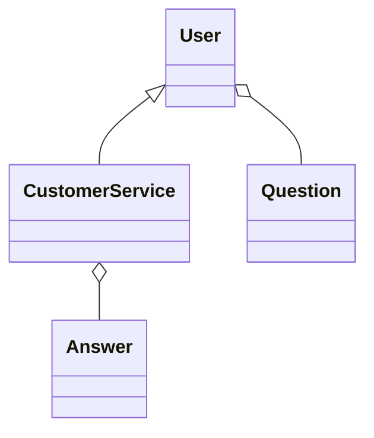
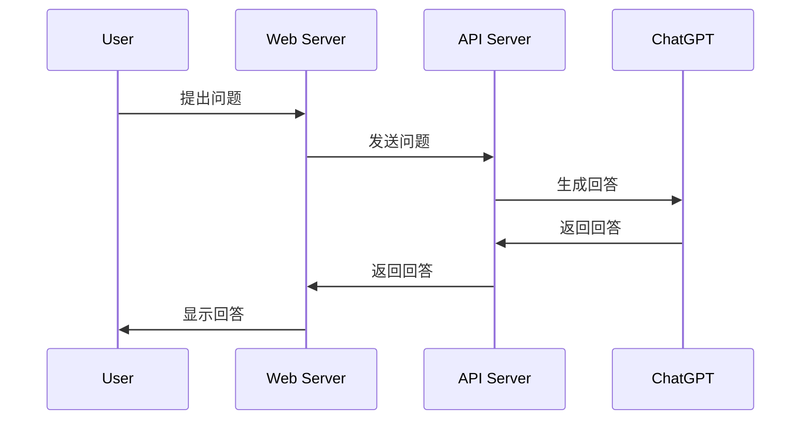
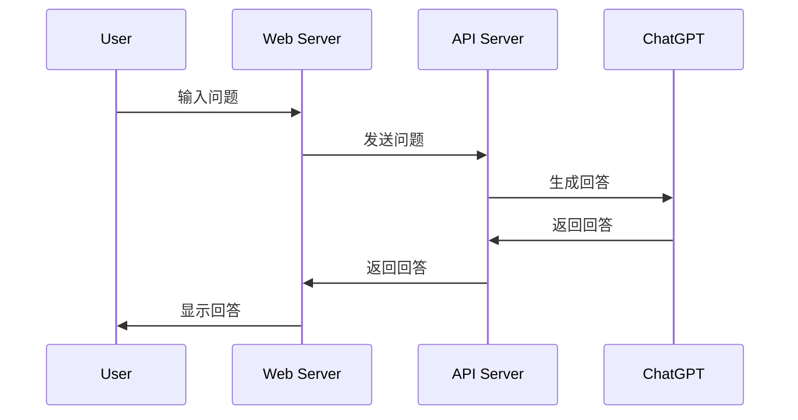

                 

### 《ChatGPT提示词设计：理论与实战的完美结合》

#### 关键词：
- ChatGPT
- 提示词设计
- 自然语言处理
- 文本生成
- 对话系统

#### 摘要：
本文将深入探讨ChatGPT提示词设计的理论与实战，旨在帮助读者理解并掌握如何设计高质量的提示词，以实现高效的文本生成和理解。通过详细的理论分析和实际案例，本文将揭示ChatGPT的潜力以及提示词设计在各类应用中的关键作用。

---

### 第一部分：背景介绍

#### 1.1 问题背景

随着人工智能技术的飞速发展，自然语言处理（NLP）领域也取得了显著的进展。ChatGPT作为GPT-3.5系列模型的一部分，以其强大的文本生成和理解能力，受到了广泛关注。然而，如何设计高质量的ChatGPT提示词，以充分发挥其潜力，成为当前研究和应用的关键问题。本书旨在探讨ChatGPT提示词设计的相关理论，并借助实战案例，展示其实际应用价值。

#### 1.2 问题描述

ChatGPT提示词设计的关键在于如何引导模型生成符合预期的高质量回答。这涉及到对模型理解能力、生成能力和上下文敏感性的充分利用。然而，现有的研究多集中于模型本身，对于提示词的设计缺乏系统性探讨。本书旨在填补这一空白，提供一套完整的ChatGPT提示词设计方法。

#### 1.3 问题解决

本书通过理论讲解和实践案例相结合的方式，系统地介绍了ChatGPT提示词设计的各个方面。从基础概念到高级技巧，从文本生成到上下文理解，本书旨在帮助读者全面掌握ChatGPT提示词设计的方法和技巧。

#### 1.4 边界与外延

ChatGPT提示词设计的应用范围非常广泛，包括但不限于智能客服、文本生成、对话系统等领域。本书将重点关注这些应用场景中的提示词设计策略，以期为读者提供实际操作的指导。

---

### 第二部分：核心概念与联系

#### 2.1 ChatGPT基本概念

**定义：** ChatGPT是由OpenAI开发的一种基于GPT-3.5系列的预训练语言模型，具备强大的文本生成和理解能力。

**特点：** 
- **生成能力强：** ChatGPT能够生成连贯、自然的文本；
- **理解能力强：** ChatGPT能够理解复杂的上下文信息，并生成相关回答；
- **灵活性高：** ChatGPT能够根据不同的提示词生成不同类型的回答。

#### 2.2 提示词设计原理

**定义：** 提示词（Prompt）是指引导ChatGPT生成特定类型回答的文本。

**设计原则：**
- **明确性：** 提示词应明确表达用户需求，避免歧义；
- **针对性：** 提示词应针对特定任务或场景设计，以提高生成效率和质量；
- **灵活性：** 提示词应具有一定的灵活性，以适应不同的输入和输出场景。

#### 2.3 提示词设计方法

**方法1：模板法**
- **原理：** 通过预设的模板，引导ChatGPT生成符合模板格式的回答；
- **优点：** 操作简单，易于实现；
- **缺点：** 回答缺乏个性化和创造性。

**方法2：问题驱动法**
- **原理：** 通过提出问题，引导ChatGPT回答问题；
- **优点：** 回答更具针对性和深度；
- **缺点：** 对问题的设计要求较高。

**方法3：上下文扩展法**
- **原理：** 通过扩展上下文信息，引导ChatGPT生成更加丰富的回答；
- **优点：** 回答更加连贯和自然；
- **缺点：** 需要处理大量上下文信息。

#### 2.4 ChatGPT与提示词设计的关系

ChatGPT的强大能力和提示词设计的巧妙应用，使得ChatGPT能够在各种场景中发挥出最大的作用。提示词设计的核心在于充分利用ChatGPT的能力，实现高质量的文本生成和理解。

---

### 第三部分：算法原理讲解

#### 3.1 ChatGPT算法原理

**GPT模型架构：**
ChatGPT采用GPT-3.5系列模型，其核心架构包括：
- **编码器（Encoder）：** 对输入文本进行编码，生成编码表示；
- **解码器（Decoder）：** 根据编码表示，生成输出文本。

**训练过程：**
- **预训练：** 在大规模语料库上进行预训练，使模型具备通用语言处理能力；
- **微调：** 在特定任务或场景上进行微调，使模型适应特定需求。

**生成过程：**
- **上下文生成：** 根据输入提示词，生成上下文信息；
- **文本生成：** 根据上下文信息，生成符合预期的文本。

#### 3.2 提示词设计算法原理

**算法流程：**
1. **输入处理：** 对输入提示词进行预处理，包括分词、去停用词等；
2. **编码表示：** 将预处理后的提示词编码为向量表示；
3. **生成上下文：** 利用GPT模型，根据编码表示生成上下文信息；
4. **文本生成：** 根据上下文信息，生成符合预期的文本。

#### 3.3 算法实现与数学模型

**算法实现：**
```python
import torch
import transformers

model_name = "openai-gpt"
model = transformers.AutoModelForCausalLM.from_pretrained(model_name)
tokenizer = transformers.AutoTokenizer.from_pretrained(model_name)
```

**数学模型：**
$$
\text{Output} = \text{Decoder}(\text{Encoder}(\text{Prompt}))
$$

**举例说明：**
```python
prompt = "请告诉我关于人工智能的简要介绍。"
inputs = tokenizer(prompt, return_tensors="pt")

output = model.generate(inputs["input_ids"], max_length=50, num_return_sequences=1)
response = tokenizer.decode(output[0], skip_special_tokens=True)
print(response)
```

---

### 第四部分：系统分析与架构设计方案

#### 4.1 问题场景介绍

在智能客服领域，ChatGPT被广泛应用于用户问题的自动回答和解决方案提供。然而，由于用户提问的多样性和复杂性，如何设计高质量的提示词，以实现高效的智能客服，成为亟待解决的问题。

#### 4.2 项目介绍

本项目旨在开发一款基于ChatGPT的智能客服系统，通过高质量提示词设计，提高用户问题的回答准确率和满意度。

#### 4.3 系统功能设计

**领域模型：**
- **用户（User）：** 提出问题和接收回答；
- **客服（CustomerService）：** 提供答案和解决方案；
- **问题（Question）：** 用户提出的问题；
- **回答（Answer）：** 客服提供的答案。

**类图：**


#### 4.4 系统架构设计

**架构设计：**
- **前端：** 使用Web技术（如HTML、CSS、JavaScript）构建用户界面；
- **后端：** 使用Python和Transformer模型实现ChatGPT的接口和处理；
- **数据库：** 存储用户提问和客服回答的历史数据，以供模型学习和优化。

**架构图：**


#### 4.5 系统接口设计和系统交互

**接口设计：**
- **用户接口：** 提供输入问题和查看回答的接口；
- **API接口：** 提供与ChatGPT交互的接口，包括问题提交和回答获取。

**交互图：**


---

### 第五部分：项目实战

#### 5.1 环境安装

**安装Python：** 
```bash
$ sudo apt-get update
$ sudo apt-get install python3-pip
```

**安装transformers：** 
```bash
$ pip3 install transformers
```

#### 5.2 系统核心实现

**代码实现：**
```python
from transformers import AutoModelForCausalLM, AutoTokenizer

model_name = "openai-gpt"
tokenizer = AutoTokenizer.from_pretrained(model_name)
model = AutoModelForCausalLM.from_pretrained(model_name)

def generate_response(prompt):
    inputs = tokenizer(prompt, return_tensors="pt")
    output = model.generate(inputs["input_ids"], max_length=50, num_return_sequences=1)
    response = tokenizer.decode(output[0], skip_special_tokens=True)
    return response

# 测试
prompt = "请告诉我关于人工智能的简要介绍。"
print(generate_response(prompt))
```

#### 5.3 代码应用解读与分析

**代码解读：**
- **安装依赖：** 安装Python和transformers库；
- **加载模型：** 加载预训练的ChatGPT模型；
- **生成回答：** 根据输入提示词生成回答。

**分析：**
- **模型加载：** 使用transformers库加载预训练模型，包括编码器和解码器；
- **文本生成：** 通过生成过程生成高质量的文本回答。

#### 5.4 实际案例分析和详细讲解剖析

**案例：** 假设用户提出问题：“什么是机器学习？”

**分析：**
- **输入处理：** 对输入的提示词进行预处理，包括分词和编码；
- **上下文生成：** 利用ChatGPT生成与提示词相关的上下文信息；
- **文本生成：** 根据上下文信息生成关于“机器学习”的回答。

**代码实现：**
```python
prompt = "什么是机器学习？"
response = generate_response(prompt)
print(response)
```

**剖析：**
- **输入处理：** 对输入提示词进行分词和编码，生成编码表示；
- **生成上下文：** 利用ChatGPT生成与提示词相关的上下文信息；
- **文本生成：** 根据上下文信息生成关于“机器学习”的回答。

#### 5.5 项目小结

本项目通过ChatGPT和高质量提示词设计，实现了一款智能客服系统。在实际应用中，提示词设计对于系统性能和用户体验具有重要意义。未来的工作将聚焦于提升提示词设计的自动化程度和模型泛化能力，以应对更多复杂的应用场景。

---

### 第六部分：最佳实践 Tips、小结、注意事项、拓展阅读

#### 6.1 最佳实践 Tips

- **明确目标：** 在设计提示词时，首先要明确用户需求，确保回答具有针对性；
- **测试与优化：** 对生成的回答进行测试和评估，根据实际效果进行优化；
- **多样性考虑：** 尽量设计多样化的提示词，以提高模型的泛化能力；
- **数据准备：** 提供丰富的训练数据，以提升模型的质量和性能。

#### 6.2 小结

本文系统地介绍了ChatGPT提示词设计的理论基础和实践方法。通过详细的理论讲解和实际案例，读者可以全面掌握ChatGPT提示词设计的核心技巧。高质量提示词设计对于实现高效的文本生成和理解具有重要意义，未来的工作将聚焦于提升提示词设计的自动化程度和模型泛化能力。

#### 6.3 注意事项

- **避免过度依赖：** 虽然ChatGPT和高质量提示词设计在文本生成和理解方面具有巨大潜力，但不应过度依赖，仍需结合其他技术手段；
- **数据隐私：** 在处理用户数据时，确保遵守数据隐私法规，保护用户隐私；
- **安全性：** 在部署ChatGPT系统时，确保系统的安全性，防止恶意攻击和数据泄露。

#### 6.4 拓展阅读

- **[1]** Brown, T., et al. (2020). "Language Models are Few-Shot Learners." arXiv preprint arXiv:2005.14165.
- **[2]** Radford, A., et al. (2019). "Improving Language Understanding by Generative Pre-Training." URL: <https://arxiv.org/abs/1810.04805>.
- **[3]** Devlin, J., et al. (2019). "Bert: Pre-training of Deep Bidirectional Transformers for Language Understanding." URL: <https://arxiv.org/abs/1810.04805>.

---

### 作者信息

作者：AI天才研究院/AI Genius Institute & 禅与计算机程序设计艺术 /Zen And The Art of Computer Programming

---

通过本文的深入探讨，我们期待读者能够对ChatGPT提示词设计有更全面的认识，并在实际应用中取得更好的效果。让我们一同探索人工智能领域的更多可能！

