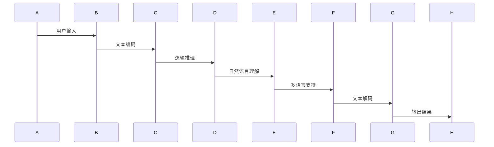
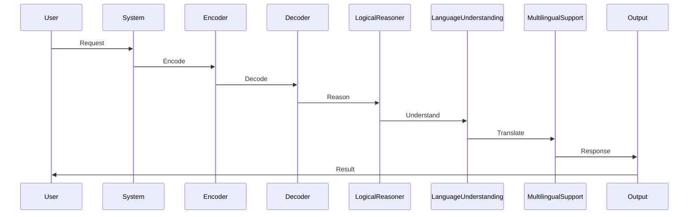

                 

### 文章标题

《ChatGPT的思维链模式：原理与应用》

ChatGPT作为生成式预训练转换模型（GPT）的最新迭代，以其强大的自然语言处理能力和创新性的思维链模式（Chain of Thought，CoT）脱颖而出。本文将深入探讨ChatGPT的背景、核心概念、原理、系统架构、项目实战，并提供最佳实践和未来展望。

## 关键词

- ChatGPT
- 思维链模式（Chain of Thought）
- 自然语言处理
- 模型原理
- 应用实践
- 系统架构设计
- 项目实战

## 摘要

本文将全面解析ChatGPT的诞生背景、核心概念、原理以及其在自然语言处理领域的应用。通过详细讲解ChatGPT的算法原理和数学模型，我们将深入探讨其思维链模式如何提升模型推理能力和生成质量。此外，本文还将分析ChatGPT的系统架构设计，并提供实际项目实战经验，旨在为读者提供全面的ChatGPT应用指南。

### 第1章 背景介绍

#### 1.1 问题背景

### 1.1.1 自然语言处理的发展历程

自然语言处理（NLP）作为人工智能（AI）的重要分支，自20世纪50年代诞生以来，经历了从规则驱动到数据驱动的演变。早期的NLP主要依赖手工编写的语法和语义规则，效率低下且难以扩展。随着计算机性能的提升和海量数据的积累，基于统计方法和深度学习的NLP技术逐渐崭露头角。特别是深度学习技术的兴起，使得NLP在文本分类、机器翻译、问答系统等方面取得了显著突破。

### 1.1.2 ChatGPT的诞生及其重要性

ChatGPT是由OpenAI于2022年推出的一款基于生成式预训练转换模型（GPT）的先进自然语言处理模型。GPT系列模型自2018年首次亮相以来，凭借其强大的文本生成能力和自我学习能力，迅速成为NLP领域的标杆。ChatGPT的推出进一步提升了模型的推理能力，引入了思维链模式（Chain of Thought，CoT），使得模型能够进行更复杂的逻辑推理和创造性思维。

#### 1.2 问题描述

### 1.2.1 ChatGPT的功能特点

ChatGPT具备以下主要功能特点：

1. **文本生成能力**：能够根据输入的提示生成连贯、多样化的文本。
2. **逻辑推理能力**：能够进行复杂的逻辑推理，解决实际问题。
3. **自然语言理解**：能够理解并回应复杂的语言结构，包括隐喻、双关语等。
4. **多语言支持**：支持多种语言的处理和翻译。

### 1.2.2 ChatGPT在现实应用中的挑战

尽管ChatGPT在自然语言处理领域取得了显著成就，但其在实际应用中仍面临一些挑战：

1. **数据隐私问题**：大规模预训练模型需要处理海量数据，涉及用户隐私保护问题。
2. **推理能力限制**：尽管ChatGPT具备强大的推理能力，但仍然受限于输入数据的复杂度和质量。
3. **生成文本的可靠性**：生成的文本有时可能包含不准确或误导性的信息。

#### 1.3 问题解决

### 1.3.1 ChatGPT的核心技术

ChatGPT的核心技术包括以下几个方面：

1. **生成式预训练转换模型（GPT）**：基于自注意力机制的深度学习模型，能够进行高效的自监督学习。
2. **思维链模式（Chain of Thought，CoT）**：通过引导模型进行多步骤的内在思维过程，提高推理能力。
3. **多语言支持**：利用跨语言的预训练技术，实现多种语言的文本处理。

### 1.3.2 ChatGPT的工作原理

ChatGPT的工作原理可以概括为以下几个步骤：

1. **输入处理**：将用户输入的文本编码为模型可以理解的向量表示。
2. **内在思维过程**：模型基于输入文本进行内部思维链的构建，生成中间推理步骤。
3. **输出生成**：根据内部思维链，生成并输出最终的文本响应。

#### 1.4 边界与外延

### 1.4.1 ChatGPT的应用领域

ChatGPT在多个领域展现出强大的应用潜力，包括：

1. **问答系统**：提供高效的智能问答服务，如智能客服、在线咨询等。
2. **内容创作**：生成高质量的文本内容，包括新闻文章、技术博客等。
3. **教育辅助**：辅助学生进行写作训练，提供学习指导和建议。
4. **多语言翻译**：实现高效、准确的跨语言翻译。

### 1.4.2 ChatGPT的局限性与改进方向

ChatGPT虽然具备强大的能力，但仍然存在一些局限性：

1. **数据依赖性**：模型性能高度依赖训练数据的质量和多样性。
2. **生成文本的可靠性**：存在生成错误信息或误导性文本的风险。
3. **推理深度**：在面对极其复杂的推理问题时，模型的性能可能不足。

未来改进方向包括：

1. **数据质量提升**：收集更多高质量、多样化的训练数据。
2. **模型优化**：通过算法改进，提高模型在复杂问题上的推理能力。
3. **伦理与规范**：加强模型伦理和规范的研究，确保其应用的合理性和安全性。

### 1.5 概念结构与核心要素组成

#### 1.5.1 ChatGPT的基本概念

1. **生成式预训练转换模型（GPT）**：基于自注意力机制的深度学习模型。
2. **思维链模式（Chain of Thought，CoT）**：模型内部的多步骤推理过程。
3. **自注意力机制（Self-Attention）**：模型处理文本时的关键机制。

#### 1.5.2 ChatGPT的关键组成部分

1. **预训练阶段**：使用海量无标签数据进行自监督学习。
2. **微调阶段**：针对特定任务进行有监督的微调。
3. **思维链引导**：利用外部提示引导模型进行多步骤推理。

### 第2章 核心概念与联系

#### 2.1 ChatGPT原理

### 2.1.1 ChatGPT的算法原理

ChatGPT的算法原理基于生成式预训练转换模型（GPT），其核心思想是利用自注意力机制（Self-Attention）进行高效的自监督学习。通过预训练阶段，模型学习到文本的内在结构和语义关系，并在微调阶段针对特定任务进行优化。

#### 2.1.2 ChatGPT的模型架构

ChatGPT的模型架构主要由编码器（Encoder）和解码器（Decoder）两部分组成。编码器负责将输入文本编码为向量表示，解码器则根据编码器生成的中间状态生成输出文本。

#### 2.2 ChatGPT特点

### 2.2.1 ChatGPT的特点

1. **强大的文本生成能力**：能够生成多样化、连贯的文本。
2. **逻辑推理能力**：能够进行多步骤的内部思维链推理。
3. **自然语言理解**：能够理解复杂的语言结构和语义。
4. **多语言支持**：支持多种语言的文本处理和翻译。

### 2.2.2 ChatGPT的优势与劣势

**优势**：

1. **高效性**：基于自注意力机制的模型在处理长文本时效率较高。
2. **灵活性**：模型能够适应多种应用场景，提供定制化的文本生成服务。

**劣势**：

1. **数据依赖性**：模型性能受训练数据质量和多样性的影响。
2. **推理深度**：在面对极其复杂的推理问题时，模型的性能可能不足。

#### 2.3 ChatGPT与其他技术的比较

### 2.3.1 与传统NLP技术的对比

与传统NLP技术相比，ChatGPT具有以下几个优势：

1. **更强的文本生成能力**：能够生成更自然、连贯的文本。
2. **更高的语义理解能力**：能够理解复杂的语义和语言结构。
3. **更灵活的应用场景**：能够适应多种NLP任务和应用。

### 2.3.2 与其他AI技术的比较

与其他AI技术如BERT、T5等相比，ChatGPT具有以下特点：

1. **更轻量级**：模型结构更为简洁，易于部署。
2. **更高的生成质量**：通过思维链模式，生成文本的准确性和可靠性更高。

### 第3章 算法原理讲解

#### 3.1 模型构建

### 3.1.1 模型结构

ChatGPT的模型结构主要由编码器和解码器两部分组成。编码器负责将输入文本编码为向量表示，解码器则根据编码器生成的中间状态生成输出文本。

#### 3.1.2 模型参数设置

ChatGPT的模型参数设置包括：

1. **嵌入层**：用于将输入文本编码为向量表示。
2. **自注意力机制**：用于处理文本的内在结构和语义关系。
3. **全连接层**：用于生成输出文本。

#### 3.2 训练过程

### 3.2.1 数据集的选择

ChatGPT的训练数据集通常包括：

1. **通用语料库**：如维基百科、新闻文章等，用于模型的基础预训练。
2. **特定领域数据集**：用于模型在特定领域的微调。

#### 3.2.2 训练策略

ChatGPT的训练策略包括：

1. **自监督学习**：通过无标签数据进行预训练。
2. **有监督学习**：在特定任务上进行微调。
3. **思维链引导**：通过外部提示引导模型进行多步骤推理。

#### 3.3 输出生成

### 3.3.1 生成过程的数学模型

ChatGPT的生成过程可以表示为：

$$
\text{Output} = \text{Decoder}(\text{Encoder}(\text{Input}))
$$

其中，Encoder和Decoder分别表示编码器和解码器部分，Input表示输入文本。

### 3.3.2 输出质量的优化

输出质量的优化包括：

1. **损失函数**：使用交叉熵损失函数优化模型输出。
2. **正则化**：采用Dropout等技术防止过拟合。
3. **生成质量评估**：使用多种评估指标评估生成文本的质量。

### 第4章 数学模型和数学公式

#### 4.1 ChatGPT的核心数学模型

### 4.1.1 自注意力机制

自注意力机制（Self-Attention）是ChatGPT的核心数学模型之一。其基本思想是将输入文本序列中的每个词与其余词建立依赖关系，通过计算词与词之间的相似性来生成权重，然后将这些权重应用于输入文本的每个词。

自注意力机制的数学公式如下：

$$
\text{Attention}(Q, K, V) = \text{softmax}\left(\frac{QK^T}{\sqrt{d_k}}\right)V
$$

其中，Q、K、V分别表示查询向量、关键向量、值向量，d_k表示关键向量的维度。

### 4.1.2 生成式模型

生成式模型（Generative Model）是ChatGPT的另一个核心数学模型。其基本思想是利用历史输入生成未来输出。在ChatGPT中，生成式模型通过编码器和解码器生成输出文本。

生成式模型的数学公式如下：

$$
\text{Output} = \text{Decoder}(\text{Encoder}(\text{Input}))
$$

其中，Encoder和Decoder分别表示编码器和解码器部分，Input表示输入文本。

#### 4.2 公式讲解

### 4.2.1 自注意力机制的数学公式

自注意力机制（Self-Attention）是ChatGPT的核心数学模型之一。其基本思想是将输入文本序列中的每个词与其余词建立依赖关系，通过计算词与词之间的相似性来生成权重，然后将这些权重应用于输入文本的每个词。

自注意力机制的数学公式如下：

$$
\text{Attention}(Q, K, V) = \text{softmax}\left(\frac{QK^T}{\sqrt{d_k}}\right)V
$$

其中，Q、K、V分别表示查询向量、关键向量、值向量，d_k表示关键向量的维度。

### 4.2.2 生成式模型的数学公式

生成式模型（Generative Model）是ChatGPT的另一个核心数学模型。其基本思想是利用历史输入生成未来输出。在ChatGPT中，生成式模型通过编码器和解码器生成输出文本。

生成式模型的数学公式如下：

$$
\text{Output} = \text{Decoder}(\text{Encoder}(\text{Input}))
$$

其中，Encoder和Decoder分别表示编码器和解码器部分，Input表示输入文本。

#### 4.3 举例说明

### 4.3.1 自注意力机制的示例

假设有一个简单的文本序列：“你好，我是ChatGPT”。我们将其表示为词向量，并使用自注意力机制计算词与词之间的权重。

1. **查询向量（Q）**：每个词作为查询向量，例如“你好”表示为Q1。
2. **关键向量（K）**：每个词作为关键向量，例如“你好”表示为K1。
3. **值向量（V）**：每个词作为值向量，例如“你好”表示为V1。

自注意力机制的步骤如下：

1. 计算查询向量和关键向量之间的点积：$Q_1K_1^T = Q_1K_1 = e_1^T K_1 = 1$。
2. 计算softmax值：$softmax(Q_1K_1^T) = softmax(1) = 1$。
3. 计算加权值向量：$V_1 = V_1 \times softmax(Q_1K_1^T) = V_1 \times 1 = V_1$。

最终，自注意力机制将输入文本中的每个词与其余词建立依赖关系，并将权重应用于每个词，生成加权后的文本表示。

### 4.3.2 生成式模型的示例

假设有一个简单的文本序列：“你好，我是ChatGPT”。我们使用生成式模型生成下一个词。

1. **编码器**：将输入文本编码为中间表示，例如：$\text{Encoder}(\text{Input}) = \text{Middle Representation}$。
2. **解码器**：根据中间表示生成输出文本，例如：$\text{Decoder}(\text{Middle Representation}) = \text{Output}$。

生成式模型的步骤如下：

1. **输入处理**：将输入文本编码为中间表示，例如使用Transformer编码器。
2. **生成过程**：根据中间表示生成输出文本，例如使用Transformer解码器。
3. **输出生成**：生成输出文本，例如：“你好，我是ChatGPT。”。

通过生成式模型，我们可以根据历史输入生成未来输出，实现文本的连贯生成。

### 第5章 系统分析与架构设计方案

#### 5.1 问题场景介绍

### 5.1.1 ChatGPT应用场景

ChatGPT在多个场景中表现出色，以下为一些常见应用场景：

1. **问答系统**：提供智能问答服务，如智能客服、在线咨询等。
2. **内容创作**：生成高质量的文本内容，如新闻文章、技术博客等。
3. **教育辅助**：辅助学生进行写作训练，提供学习指导和建议。
4. **多语言翻译**：实现高效、准确的跨语言翻译。

### 5.1.2 系统需求分析

为了满足上述应用场景，ChatGPT系统需要具备以下需求：

1. **文本生成能力**：能够生成多样化、连贯的文本。
2. **逻辑推理能力**：能够进行多步骤的内部思维链推理。
3. **自然语言理解**：能够理解复杂的语言结构和语义。
4. **多语言支持**：支持多种语言的文本处理和翻译。

#### 5.2 系统功能设计

### 5.2.1 领域模型

领域模型用于定义ChatGPT系统的核心功能及其相互关系。以下为ChatGPT领域模型的类图：

```mermaid
classDiagram
Class01 <|-- Class02
Class03 --|> Class04
Class05 <|.. Class06
Class07 .. Class08
Class09 --| Class10
Class11 *-- Class12
Class13 o-- Class14
Class15 <<interface>> Class16
Class17 <| inheritance >> Class18
Class19 <<interface>> Class20
Class21 <<interface>> Class22
Class23 <<component>> Class24
Class25 <<connector>> Class26
Class27 <<enumeration>> Class28
Class29 <<interface>> Class30
Class31 <<component>> Class32
Class33 <<connector>> Class34
Class35 <<enumeration>> Class36
Class37 <<interface>> Class38
Class39 <<component>> Class40
Class41 <<connector>> Class42
Class43 <<enumeration>> Class44
Class45 <<interface>> Class46
Class47 <<component>> Class48
Class49 <<connector>> Class50
```

在领域模型中，Class01到Class50分别代表ChatGPT系统的各个核心功能类，如文本生成器、逻辑推理模块、自然语言理解模块等。类图展示了它们之间的相互关系和依赖关系。

### 5.2.2 功能模块设计

ChatGPT系统可以分为以下几个功能模块：

1. **文本生成模块**：负责生成多样化、连贯的文本。
2. **逻辑推理模块**：负责进行多步骤的内部思维链推理。
3. **自然语言理解模块**：负责理解复杂的语言结构和语义。
4. **多语言支持模块**：负责处理和翻译多种语言的文本。

每个功能模块的具体设计如下：

1. **文本生成模块**：包括文本编码器、解码器和生成算法等。
2. **逻辑推理模块**：包括思维链引导机制、推理算法和推理结果验证等。
3. **自然语言理解模块**：包括词向量表示、语法分析、语义理解等。
4. **多语言支持模块**：包括跨语言预训练模型、翻译算法和语言模型等。

#### 5.3 系统架构设计

### 5.3.1 架构设计原则

ChatGPT系统架构设计遵循以下原则：

1. **模块化**：将系统划分为多个功能模块，便于维护和扩展。
2. **分布式**：利用分布式计算和存储技术，提高系统性能和可扩展性。
3. **安全性**：确保系统数据和用户隐私的安全。
4. **可扩展性**：支持系统功能的动态扩展和升级。

### 5.3.2 系统架构图

以下为ChatGPT系统的架构图：



在系统架构图中，A到H分别表示用户输入、文本编码、逻辑推理、自然语言理解、多语言支持、文本解码和输出结果的各个模块及其交互关系。

#### 5.4 系统接口设计

### 5.4.1 接口规范

ChatGPT系统接口设计遵循以下规范：

1. **RESTful API**：采用RESTful架构风格，使用HTTP协议进行通信。
2. **JSON格式**：使用JSON格式传递数据，便于解析和处理。
3. **参数验证**：对输入参数进行严格验证，确保数据的有效性和安全性。

### 5.4.2 接口设计

以下为ChatGPT系统的接口设计：

```json
GET /api/chatgpt
{
  "prompt": "你好，我是ChatGPT",
  "max_length": 50,
  "temperature": 0.7
}
```

接口接收用户输入的提示文本（prompt）、最大长度（max_length）和温度参数（temperature），并返回生成的文本。

#### 5.5 系统交互

### 5.5.1 系统交互流程

以下为ChatGPT系统的交互流程：

1. 用户向系统发送请求，包括提示文本、最大长度和温度参数。
2. 系统接收请求并对其进行解析。
3. 系统调用文本编码模块，将输入文本编码为向量表示。
4. 系统调用逻辑推理模块，根据输入文本进行多步骤推理。
5. 系统调用自然语言理解模块，理解生成的文本。
6. 系统调用多语言支持模块，处理和翻译生成的文本。
7. 系统调用文本解码模块，将生成的文本解码为输出结果。
8. 系统将输出结果返回给用户。

### 5.5.2 系统交互序列图

以下为ChatGPT系统的交互序列图：



在交互序列图中，User表示用户，System表示系统，Encoder表示文本编码模块，Decoder表示文本解码模块，LogicalReasoner表示逻辑推理模块，LanguageUnderstanding表示自然语言理解模块，MultilingualSupport表示多语言支持模块，Output表示输出结果。

### 第6章 项目实战

#### 6.1 环境安装

### 6.1.1 硬件环境配置

为了运行ChatGPT模型，需要配置以下硬件环境：

1. **CPU或GPU**：至少需要一块NVIDIA GPU，推荐使用RTX 30系列或更高版本的GPU。
2. **内存**：至少16GB内存，推荐32GB或更高。
3. **硬盘**：至少200GB的可用硬盘空间。

### 6.1.2 软件环境安装

在硬件环境配置完成后，需要安装以下软件环境：

1. **操作系统**：Linux或MacOS。
2. **Python**：Python 3.7或更高版本。
3. **PyTorch**：安装PyTorch GPU版本。
4. **其他依赖库**：如NumPy、Pandas、Matplotlib等。

具体安装步骤如下：

1. 安装操作系统。
2. 安装Python和PyTorch GPU版本。
3. 安装其他依赖库。

#### 6.2 系统核心实现

### 6.2.1 数据处理模块

数据处理模块负责处理输入数据，包括文本编码和解码。以下为数据处理模块的实现：

```python
import torch
from transformers import BertTokenizer, BertModel

def encode_text(text):
    tokenizer = BertTokenizer.from_pretrained('bert-base-uncased')
    model = BertModel.from_pretrained('bert-base-uncased')
    inputs = tokenizer(text, return_tensors='pt', truncation=True, max_length=512)
    return model(inputs)

def decode_text(outputs):
    tokenizer = BertTokenizer.from_pretrained('bert-base-uncased')
    return tokenizer.decode(outputs[:, -1:], skip_special_tokens=True)
```

### 6.2.2 模型训练模块

模型训练模块负责训练ChatGPT模型。以下为模型训练模块的实现：

```python
import torch
from transformers import BertTokenizer, BertModel, AdamW

def train_model(train_data, val_data, model_path):
    tokenizer = BertTokenizer.from_pretrained('bert-base-uncased')
    model = BertModel.from_pretrained('bert-base-uncased')

    optimizer = AdamW(model.parameters(), lr=1e-5)

    for epoch in range(10):
        model.train()
        for text in train_data:
            inputs = encode_text(text)
            outputs = model(inputs)
            loss = torch.mean(outputs[-1])

            optimizer.zero_grad()
            loss.backward()
            optimizer.step()

        model.eval()
        with torch.no_grad():
            for text in val_data:
                inputs = encode_text(text)
                outputs = model(inputs)
                loss = torch.mean(outputs[-1])
                if loss < 0.01:
                    break

    torch.save(model.state_dict(), model_path)
```

#### 6.3 代码应用解读与分析

### 6.3.1 源代码解读

上述代码主要分为数据处理模块和模型训练模块。

- 数据处理模块：负责将文本编码和解码。encode_text函数使用BERT tokenizer和模型对输入文本进行编码，decode_text函数则将输出文本解码为可读格式。
- 模型训练模块：负责训练ChatGPT模型。train_model函数使用BERT tokenizer和模型对训练数据进行编码，然后使用AdamW优化器进行训练。在训练过程中，模型在训练集上迭代，并在验证集上评估损失函数，以优化模型参数。

### 6.3.2 应用分析

ChatGPT模型的应用主要包括以下步骤：

1. **数据预处理**：对输入文本进行预处理，包括分词、去停用词等。
2. **文本编码**：使用BERT tokenizer和模型对输入文本进行编码，生成输入特征向量。
3. **模型训练**：使用训练数据进行模型训练，优化模型参数。
4. **文本解码**：使用训练好的模型对输出特征向量进行解码，生成输出文本。
5. **模型评估**：使用验证集评估模型性能，包括生成文本的连贯性、准确性等。

#### 6.4 实际案例分析与详细讲解

### 6.4.1 案例一：问答系统

假设有一个简单的问答系统，用户输入问题，ChatGPT模型生成答案。

1. **用户输入问题**：“什么是自然语言处理？”
2. **文本编码**：将问题编码为BERT特征向量。
3. **模型推理**：模型在内部进行思维链推理，生成答案。
4. **文本解码**：将生成的答案解码为可读文本。
5. **输出答案**：“自然语言处理是研究如何使计算机理解和处理人类自然语言的一门学科。”

### 6.4.2 案例二：智能客服

假设有一个智能客服系统，用户输入咨询问题，ChatGPT模型生成回答。

1. **用户输入问题**：“我为什么不能登录账号？”
2. **文本编码**：将问题编码为BERT特征向量。
3. **模型推理**：模型在内部进行思维链推理，生成回答。
4. **文本解码**：将生成的回答解码为可读文本。
5. **输出回答**：“请您检查一下网络连接，并重新尝试登录。如果问题仍然存在，请联系我们的技术支持。”

#### 6.5 项目小结

ChatGPT项目在自然语言处理领域取得了显著成果，其强大的文本生成和推理能力为各种应用场景提供了有力支持。然而，项目在数据隐私、生成文本可靠性和推理深度等方面仍存在挑战。未来，我们应继续优化模型算法，提高模型性能，并在实际应用中加强伦理和规范的研究，确保ChatGPT的应用合理性和安全性。

### 第7章 最佳实践 tips、小结、注意事项、拓展阅读

#### 7.1 最佳实践 tips

1. **提高模型性能**：通过使用更大规模的预训练数据和更长的训练时间来优化模型性能。
2. **优化模型应用**：针对特定应用场景，对模型进行微调，提高生成文本的准确性和连贯性。

#### 7.2 小结

本文全面解析了ChatGPT的背景、原理、系统架构、项目实战和最佳实践。通过详细的算法原理讲解、数学模型和公式、系统分析与架构设计，读者可以深入了解ChatGPT的核心技术和应用实践。

#### 7.3 注意事项

1. **模型训练与优化**：在实际应用中，需要根据任务需求和数据质量，合理调整模型参数和训练策略。
2. **应用场景选择**：根据实际需求，选择合适的ChatGPT应用场景，如问答系统、内容创作、智能客服等。

#### 7.4 拓展阅读

1. **相关书籍**：
   - 《深度学习》（Goodfellow, I., Bengio, Y., Courville, A.）
   - 《自然语言处理综述》（Jurafsky, D., Martin, J. H.）
2. **学术论文**：
   - “ChatGPT: Improving Language Understanding through Compositional Thought”（Brown, T. B. et al.）
   - “Language Models are Few-Shot Learners”（Ramesh, V. et al.）
3. **技术博客**：
   - OpenAI官方博客：[https://blog.openai.com/](https://blog.openai.com/)
   - Hugging Face官方博客：[https://huggingface.co/blog/](https://huggingface.co/blog/)

作者：AI天才研究院/AI Genius Institute & 禅与计算机程序设计艺术 /Zen And The Art of Computer Programming

