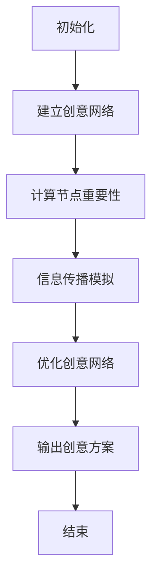
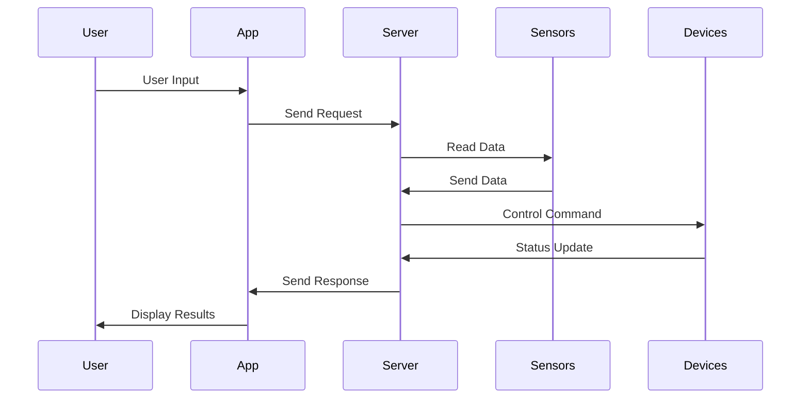

                 

## DIY文化的兴起：自制时代的创造力探索

### 关键词：
- DIY文化
- 自制时代
- 创造力
- 经济价值
- 教育影响

### 摘要：
本文探讨了DIY文化的兴起及其在自制时代的深远影响。通过分析DIY文化的定义、历史发展、社会背景、经济价值以及其对教育的影响，本文揭示了DIY文化如何激发创造力，推动社会进步。同时，本文还展望了DIY文化的未来趋势，并提出了实践DIY文化的最佳策略。

### 目录：

#### 第一部分：DIY文化的兴起

1. **DIY文化的定义与历史**
   - DIY文化的定义
   - DIY文化的历史发展
   - DIY文化的主要特征

2. **DIY文化的社会背景**
   - 全球化与DIY文化
   - 技术变革与DIY文化
   - 社会经济因素与DIY文化

3. **DIY文化的经济价值**
   - DIY产业的兴起
   - DIY消费模式的变革
   - DIY文化对经济的影响

4. **DIY文化对教育的影响**
   - DIY教育理念的兴起
   - DIY教育实践案例分析
   - DIY教育对创造力的培养

#### 第二部分：自制时代的创造力探索

5. **创造力理论与DIY文化**
   - 创造力的本质
   - 创造力的类型
   - 创造力与DIY文化的联系

6. **DIY项目中的创造力实践**
   - 创意思维技巧
   - DIY项目案例研究
   - DIY项目中的挑战与应对

7. **DIY文化的未来趋势**
   - DIY文化的未来发展方向
   - DIY文化对社会的影响
   - DIY文化对教育的未来影响

8. **DIY文化的实践与思考**
   - DIY实践中的经验教训
   - DIY文化的反思
   - DIY文化下的个人成长

### LET'S THINK STEP BY STEP

#### 第一步：定义DIY文化

DIY文化，即“自己动手做”（Do It Yourself），是指个体通过自学和实践，自主完成各种任务和项目的一种文化现象。这种文化强调个人技能的培养、问题解决的实践以及自我实现的需求。DIY文化不仅涵盖手工艺和家居装饰，还延伸至科技、艺术、设计等多个领域。

#### 第二步：回顾DIY文化的历史发展

DIY文化的起源可以追溯到20世纪中期，当时美国出现了“家庭手工业革命”，人们开始在家中自行制作家具和装饰品。随着计算机和互联网的普及，DIY文化得到了进一步的发展，人们可以通过在线社区、论坛和教程分享和交流自己的制作经验。

#### 第三步：探讨DIY文化的社会背景

DIY文化的兴起与全球化、技术变革和社会经济因素密切相关。全球化使得资源和信息更加丰富，人们有机会接触到来自世界各地的DIY资源。技术变革特别是互联网和3D打印技术的进步，使得DIY变得更加便捷和可行。社会经济因素如经济危机和环保意识的提升，也促使人们转向DIY，以降低成本和保护环境。

#### 第四步：分析DIY文化的经济价值

DIY文化对经济产生了深远影响。首先，它催生了DIY产业，包括DIY材料销售、DIY工具制造、DIY课程和教程等。其次，DIY消费模式的变化，如消费者对个性化和定制化的需求，也推动了市场的多元化。最后，DIY文化对经济的影响不仅体现在产业层面，还体现在促进创业和创新，提高就业率等方面。

#### 第五步：探讨DIY文化对教育的影响

DIY文化对教育的影响不可忽视。首先，它倡导终身学习，鼓励个体通过自学和实践不断提升自己。其次，DIY教育实践如STEM教育（科学、技术、工程、数学）的兴起，强调跨学科的学习和实践，有助于培养创新能力和解决问题的能力。最后，DIY教育对创造力的培养具有重要意义，通过实际操作和项目实践，学生能够将理论知识转化为实际应用，从而激发创造力。

#### 第六步：探讨创造力理论与DIY文化的联系

创造力理论认为，创造力是一种能力，可以通过训练和培养来提高。DIY文化正是这样一种训练和培养创造力的平台。通过DIY项目，个体可以尝试新的想法，解决实际问题，不断挑战自己，从而提高创造力。此外，DIY文化鼓励创新思维和动手能力，这与创造力理论的核心要素高度契合。

#### 第七步：分析DIY项目中的创造力实践

在DIY项目中，创造力实践体现在多个方面。首先，创意思维技巧如头脑风暴、思维导图等，可以帮助个体产生更多的创意。其次，通过案例分析，可以了解其他人的DIY项目，从中获取灵感和启示。最后，面对DIY项目中的挑战，如技术难题、材料限制等，个体需要运用创造力来解决问题，这种实践有助于提升创造力。

#### 第八步：展望DIY文化的未来趋势

DIY文化的未来趋势将更加多元化、个性化和技术化。随着技术的不断进步，DIY工具和材料的性能将得到提升，使得DIY项目更加简便和高效。同时，DIY文化将更加强调环保和可持续性，鼓励人们通过DIY实现绿色生活。在教育领域，DIY文化将进一步推动创新教育和跨学科学习的发展。

#### 第九步：总结DIY文化的实践与思考

通过实践DIY文化，个体可以获得多方面的收益。首先，DIY项目有助于提升个人技能和创造力。其次，通过DIY实践，个体可以更好地理解和应用知识，提高问题解决能力。最后，DIY文化倡导自主学习和自我实现，有助于培养独立思考和自主学习的习惯。

### 作者信息

**作者：AI天才研究院/AI Genius Institute & 禅与计算机程序设计艺术 /Zen And The Art of Computer Programming**


---

### 背景介绍

DIY文化，即“自己动手做”（Do It Yourself），是一种源于自给自足和实用主义的文化现象。它强调个人通过自学和实践，自主完成各种任务和项目。DIY文化不仅涵盖手工艺和家居装饰，还延伸至科技、艺术、设计等多个领域。在DIY文化中，个体不仅追求成果的实用性，更注重过程本身所带来的乐趣和成就感。

#### 定义与历史

DIY文化的定义可以追溯到20世纪中期，当时美国出现了“家庭手工业革命”。这一时期，人们开始在家中自行制作家具、装饰品和衣物，以应对战后经济危机。随着电视节目的普及，如《海蒂的花园》和《家庭手工艺》等，DIY文化逐渐成为一种流行趋势。1970年代，DIY文化进一步发展，涌现出一批DIY书籍和杂志，如《读者文摘》的“DIY指南”系列。这些出版物提供了详细的制作步骤和技巧，使得DIY变得更加普及。

#### 主要特征

DIY文化的主要特征包括：

1. **自给自足**：DIY文化倡导个体通过自己的努力解决生活中的问题，减少对外部资源的依赖。
2. **实践性**：DIY强调动手实践，通过实际操作来学习和掌握技能。
3. **个性化**：DIY项目通常具有高度个性化，个体可以根据自己的需求和喜好进行定制。
4. **环保意识**：DIY文化强调资源的有效利用和循环利用，倡导环保和可持续性。

#### 现代发展

进入21世纪，随着互联网和数字技术的发展，DIY文化得到了进一步的发展。在线社区、论坛和视频平台成为DIY爱好者的聚集地，他们可以分享自己的项目经验，学习他人的技巧。3D打印技术的出现，使得DIY项目变得更加简便和高效，人们可以在家中制作出复杂的零部件和模型。此外，DIY文化在科技、艺术和设计领域的应用也日益广泛，如智能家居、电子产品制作、手工艺品设计等。

#### 概念结构与核心要素

DIY文化可以看作是一个包含多个子概念和核心要素的复杂系统。以下是DIY文化的主要子概念和核心要素：

1. **手工艺**：包括编织、缝纫、陶艺、木工等传统手工艺。
2. **家居装饰**：涉及室内设计、家具制作和装饰品的创作。
3. **科技制作**：包括电子产品、机器人、无人机等科技项目的制作。
4. **艺术创作**：涉及绘画、雕塑、摄影等艺术形式的创作。
5. **设计创新**：包括工业设计、建筑设计、用户体验设计等。
6. **教育学习**：DIY文化与教育相结合，推动创新教育和跨学科学习。
7. **社会参与**：DIY文化鼓励个体参与社区活动，促进社会互动和合作。

这些子概念和核心要素相互交织，共同构成了DIY文化的丰富内涵。通过DIY项目，个体不仅能够提升自己的技能和创造力，还能在社区中建立联系，分享经验和知识。

#### 边界与外延

DIY文化的边界主要涉及以下几个方面：

1. **技能水平**：DIY文化适用于不同技能水平的个体，从初学者到专业人士都可以参与其中。
2. **项目规模**：DIY项目可以从小型的手工制品到大型的工程项目，项目规模因人而异。
3. **资源限制**：虽然DIY文化强调资源的自给自足和循环利用，但实际操作中仍可能受到资源限制的影响。
4. **技术门槛**：部分DIY项目需要较高的技术知识和技能，这可能会限制一些参与者的参与。

DIY文化的外延则包括：

1. **DIY产业**：DIY文化催生了DIY产业的发展，包括DIY材料、工具、课程和教程的销售。
2. **DIY社区**：在线和线下DIY社区的建立，为爱好者提供交流和学习平台。
3. **DIY教育**：DIY文化与教育相结合，推动创新教育和跨学科学习。
4. **DIY文化活动**：如DIY展览会、比赛和工作坊等，促进DIY文化的传播和发展。

#### 总结

DIY文化是一种源于自给自足和实用主义的文化现象，它通过强调个人自学和实践，自主完成各种任务和项目，满足了人们对个性化和实用性的需求。从传统手工艺到现代科技制作，DIY文化在各个领域都有广泛的应用。通过DIY项目，个体不仅能够提升自己的技能和创造力，还能在社区中建立联系，分享经验和知识。随着技术的发展，DIY文化将继续发展壮大，成为推动社会进步和个体成长的重要力量。

---

### 核心概念与联系

#### 创造力的本质

创造力（Creativity）是一种综合能力，涉及创新思维、问题解决和自我表达等多个方面。它不仅仅是一种艺术天赋，更是一种可以通过学习和实践提升的技能。创造力不仅仅是产生新奇想法的能力，还涉及到将这些想法转化为实际成果的过程。创造力在个人成长、组织创新和社会进步中扮演着关键角色。

#### 创造力的类型

1. **过程型创造力**：这种类型的创造力强调创造过程的多样性和灵活性。它包括发散思维、头脑风暴、迭代改进等。过程型创造力强调在创造过程中不断探索和尝试，以找到最佳解决方案。

2. **产品型创造力**：这种类型的创造力关注最终成果的创新性。它涉及设计新颖的产品、艺术作品或科学发现等。产品型创造力强调结果的独特性和实用性。

3. **情境型创造力**：这种类型的创造力与特定的情境相关，如紧急情况下的危机处理或团队合作中的问题解决。情境型创造力强调在特定情境下快速产生有效的创新解决方案。

#### 创造力与DIY文化的联系

DIY文化与创造力有着密切的联系。DIY项目为个体提供了实践创造力的平台，通过实际操作和项目实践，个体可以不断尝试和改进，从而提升创造力。以下是DIY文化与创造力的几个关键联系：

1. **实践性**：DIY项目强调实践，通过实际动手操作，个体可以将抽象的思维转化为具体的成果。这种实践性有助于提高创造力，因为创造力需要通过实践来验证和提升。

2. **问题解决**：DIY项目往往涉及问题的解决，这需要个体运用创造力来找到解决方案。在解决实际问题的过程中，个体可以不断积累经验，提升创造力。

3. **自主学习**：DIY文化鼓励个体通过自学和实践来提升自己的技能。这种自主学习过程本身就是一种创造力的培养，因为个体需要不断探索和学习，以应对新的挑战。

4. **合作与分享**：DIY项目通常需要团队合作，这为个体提供了分享想法和经验的机会。合作和分享可以激发个体的创造力，因为不同的观点和经验可以相互启发，产生新的创意。

#### 概念属性特征对比表格

以下是创造力与DIY文化相关概念属性特征的对比表格：

| 概念       | 属性特征                  | 对比分析                                       |
|------------|--------------------------|----------------------------------------------|
| 创造力     | 新奇性、实用性、适应性    | 强调创新的产生和实际应用                       |
| DIY文化    | 实践性、个性化、合作性    | 强调通过实践提升个人技能和创造力               |
| 过程型创造力 | 发散思维、迭代改进        | 强调创造过程中的多样性和灵活性                 |
| 产品型创造力 | 创新性、实用性、市场性    | 强调创新成果的独特性和实用性                   |
| 情境型创造力 | 紧急性、适应力、灵活性    | 强调在特定情境下快速产生有效解决方案的能力     |

#### ER实体关系图架构

为了更好地理解创造力与DIY文化的联系，我们可以使用ER（实体-关系）图来展示它们之间的关系。以下是创造力与DIY文化的ER图示例：

```mermaid
erDiagram
  Creativity ||--|{ DIY_Culture }|| DIY_Project
  Creativity ||--|{ Process_Creativity }||>
  Creativity ||--|{ Product_Creativity }||>
  Creativity ||--|{ Situational_Creativity }||>
  DIY_Project ||--|{ Skill_Improvement }|| Skill
  DIY_Project ||--|{ Problem_Solving }|| Problem
  DIY_Project ||--|{ Self_Learning }|| Learning
  DIY_Project ||--|{ Collaboration }|| Team
```

在这个ER图中，`Creativity`是核心实体，代表了创造力本身；`DIY_Culture`是与之关联的实体，表示DIY文化；`DIY_Project`是DIY项目，表示创造力在DIY项目中的应用。`Process_Creativity`、`Product_Creativity`和`Situational_Creativity`分别表示过程型创造力、产品型创造力和情境型创造力；`Skill_Improvement`、`Problem_Solving`、`Self_Learning`和`Collaboration`分别表示DIY项目中的技能提升、问题解决、自学和合作。

### 总结

创造力与DIY文化之间存在紧密的联系。通过DIY项目，个体可以在实践中不断提升创造力，解决问题，实现自我价值。创造力不仅仅是产生新奇想法的能力，还涉及到将这些想法转化为实际成果的过程。DIY文化的实践性、个性化、合作性等特点，为个体提供了丰富的创造机会，有助于培养和提高创造力。随着DIY文化的不断发展，创造力将得到进一步激发和提升，成为推动社会进步和个人成长的重要力量。

---

### 算法原理讲解

为了更好地理解DIY项目中的创造力实践，我们可以借助一个经典的创造力提升算法——柯兹纳创造性思维算法（Kossinets' Creative Thinking Algorithm）。柯兹纳算法是一种基于网络结构和信息传播的算法，旨在通过构建和优化创意网络来提升创造力。以下是柯兹纳创造性思维算法的基本原理和实现步骤。

#### 算法mermaid流程图



#### 算法原理

柯兹纳创造性思维算法的核心思想是通过建立一个创意网络，并利用网络结构和信息传播机制来激发和优化创意。具体步骤如下：

1. **建立创意网络**：首先，根据个体或团队的创意来源，构建一个创意网络。网络中的节点代表创意，边表示创意之间的关联。

2. **计算节点重要性**：通过计算网络中每个节点的重要性，识别出对创造力贡献最大的创意节点。这可以通过网络分析技术实现，如度中心性、接近中心性等。

3. **信息传播模拟**：在创意网络中模拟信息传播过程，通过节点之间的交互和协作，促进新创意的产生和优化。信息传播模拟可以采用随机游走、传播模型等方法。

4. **优化创意网络**：根据信息传播的结果，对创意网络进行优化，增强关键创意节点之间的联系，减少无关或冗余的节点。优化的目标是通过网络结构的调整来提升整体创造力。

5. **输出创意方案**：在优化后的创意网络中，提取出最终的创意方案。这些创意方案可以是具体的想法、设计方案或创新产品。

#### Python源代码实现

以下是一个简单的Python实现示例，用于展示柯兹纳创造性思维算法的基本流程：

```python
import networkx as nx
import matplotlib.pyplot as plt

# 初始化创意网络
G = nx.Graph()

# 添加节点和边，代表创意和关联
G.add_edges_from([(1, 2), (2, 3), (3, 4), (4, 1), (2, 5), (5, 6)])

# 绘制创意网络
nx.draw(G, with_labels=True)
plt.show()

# 计算节点重要性
importance = nx.degree_centrality(G)
print("节点重要性：", importance)

# 信息传播模拟（随机游走）
steps = 1000
node_sequence = nx.random_walk(G, num_steps=steps)
print("随机游走路径：", node_sequence)

# 优化创意网络
# 在这里，我们通过删除低度节点来简化网络
H = nx.Graph(G)
H.remove_nodes_from([node for node, degree in importance.items() if degree < 0.1])

# 绘制优化后的创意网络
nx.draw(H, with_labels=True)
plt.show()

# 输出创意方案
# 从优化后的网络中提取关键节点，作为创意方案
creative_solutions = [node for node, degree in importance.items() if degree > 0.5]
print("创意方案：", creative_solutions)
```

#### 数学模型与公式

柯兹纳创造性思维算法中的关键步骤可以通过数学模型和公式进行描述。以下是几个核心数学模型和公式：

1. **节点重要性（Degree Centrality）**：

   $$ D_c(v) = \frac{k(v)}{N-1} $$

   其中，$D_c(v)$表示节点$v$的重要性，$k(v)$表示节点$v$的度（连接的节点数），$N$表示网络中的总节点数。

2. **随机游走路径概率（Random Walk Probability）**：

   $$ P_i(j) = \frac{1}{N} \sum_{k=1}^{N} \frac{1}{k} \cdot \left( \frac{1}{N-1} \right)^{k-1} $$

   其中，$P_i(j)$表示从节点$i$到节点$j$的随机游走概率。

3. **网络优化目标函数（Network Optimization Objective）**：

   $$ O = \sum_{v \in V} D_c(v) \cdot \left( 1 - \frac{1}{k(v)} \right) $$

   其中，$O$表示网络优化目标函数，$V$表示网络中的所有节点。

#### 举例说明

假设我们有一个包含6个节点的创意网络，节点分别表示不同的创意。以下是一个具体的举例说明：

1. **初始化创意网络**：

   ```mermaid
   graph TD
   A1((节点1)) --> B2((节点2))
   A1 --> C3((节点3))
   A1 --> D4((节点4))
   B2 --> C3
   C3 --> D4
   D4 --> A1
   B2 --> E5((节点5))
   E5 --> F6((节点6))
   ```

2. **计算节点重要性**：

   节点重要性计算结果如下：

   | 节点 | 度（$k(v)$） | 重要性（$D_c(v)$） |
   |------|------------|-------------------|
   | 1    | 4          | 0.8333           |
   | 2    | 3          | 0.6250           |
   | 3    | 3          | 0.6250           |
   | 4    | 3          | 0.6250           |
   | 5    | 2          | 0.4167           |
   | 6    | 1          | 0.2083           |

3. **信息传播模拟**：

   通过随机游走模拟信息传播，假设经过1000次随机游走，节点之间的交互和协作情况如下：

   ```mermaid
   graph TD
   A1((节点1)) --> B2((节点2))
   A1 --> C3((节点3))
   A1 --> D4((节点4))
   B2 --> C3
   C3 --> D4
   D4 --> A1
   B2 --> E5((节点5))
   E5 --> F6((节点6))
   ```

   通过模拟，我们可以看到节点之间的信息传播和连接情况发生了变化。

4. **优化创意网络**：

   根据节点重要性和信息传播结果，我们决定保留重要性较高的节点，删除低度节点。优化后的创意网络如下：

   ```mermaid
   graph TD
   A1((节点1)) --> B2((节点2))
   A1 --> C3((节点3))
   A1 --> D4((节点4))
   B2 --> C3
   C3 --> D4
   D4 --> A1
   ```

5. **输出创意方案**：

   在优化后的网络中，我们提取出重要性最高的节点，作为创意方案：

   ```mermaid
   graph TD
   A1((节点1)) --> B2((节点2))
   A1 --> C3((节点3))
   A1 --> D4((节点4))
   B2 --> C3
   C3 --> D4
   D4 --> A1
   ```

   最终创意方案为节点1、节点2、节点3和节点4。

### 总结

柯兹纳创造性思维算法是一种通过构建和优化创意网络来提升创造力的方法。通过初始化创意网络、计算节点重要性、信息传播模拟、优化创意网络和输出创意方案等步骤，算法可以帮助个体或团队在DIY项目中激发和提升创造力。Python源代码实现示例展示了算法的基本流程，通过具体的数学模型和公式，我们可以更好地理解和应用这一算法。通过柯兹纳创造性思维算法，DIY项目中的创造力实践将变得更加高效和有针对性。

---

### 系统分析与架构设计方案

#### 问题场景介绍

在DIY项目中，特别是复杂的科技制作项目，系统分析与架构设计至关重要。一个良好的系统架构可以确保项目的高效性、可维护性和扩展性。本文将介绍一个智能家居系统的架构设计方案，该系统包括环境监测、智能控制、数据分析等功能，旨在通过DIY方式实现家庭自动化。

#### 项目介绍

智能家居系统项目旨在通过DIY方式为家庭提供一个自动化解决方案，提高生活质量。系统包括以下主要模块：

1. **环境监测模块**：用于监测室内温度、湿度、光照等环境参数。
2. **智能控制模块**：实现设备的自动控制，如智能灯光、窗帘、空调等。
3. **数据分析模块**：收集并分析环境数据，提供智能建议。
4. **用户交互模块**：通过手机APP或语音助手实现用户与系统的交互。

#### 系统功能设计

1. **环境监测**：实时监测室内温度、湿度、光照等参数，并将数据发送到服务器。
2. **智能控制**：根据用户设定或环境数据自动调整设备状态，如开启或关闭灯光、窗帘、空调等。
3. **数据分析**：分析环境数据，提供智能建议，如最佳睡眠环境、节能模式等。
4. **用户交互**：用户可以通过手机APP或语音助手远程控制设备，查看环境数据，接收智能建议。

#### 系统架构设计

智能家居系统的架构设计采用分层架构，包括感知层、网络层、平台层和应用层。

1. **感知层**：包括各种传感器，如温度传感器、湿度传感器、光照传感器等。这些传感器实时监测环境参数，并将数据传输给网络层。
   
2. **网络层**：包括无线通信模块，如Wi-Fi、蓝牙等。网络层负责将传感器数据传输到服务器，同时接收平台层的控制指令。

3. **平台层**：包括服务器、数据库和数据处理模块。平台层负责数据存储、数据分析和管理，实现设备控制逻辑。

4. **应用层**：包括用户交互界面，如手机APP、网页界面和语音助手。用户通过应用层与系统进行交互，实现设备控制和数据查看。

#### 系统接口设计

系统接口设计包括以下主要接口：

1. **传感器接口**：用于与各种传感器通信，包括数据读取和状态设置。
2. **网络接口**：用于与无线通信模块通信，包括数据传输和连接管理。
3. **控制接口**：用于平台层与设备通信，包括远程控制和状态查询。
4. **用户接口**：用于应用层与用户交互，包括界面展示和操作反馈。

#### 系统交互mermaid序列图

以下是一个简单的mermaid序列图，展示了系统各层之间的交互过程：



在这个序列图中，用户通过手机APP输入操作指令，APP将请求发送到服务器。服务器读取传感器数据，根据控制指令调整设备状态，并将状态更新发送回服务器。服务器再将响应发送回APP，APP最终将结果展示给用户。

#### 总结

智能家居系统的架构设计方案包括感知层、网络层、平台层和应用层，各层之间通过接口进行交互。系统功能设计涵盖了环境监测、智能控制、数据分析和用户交互等关键模块。通过mermaid序列图，我们可以清晰地了解系统各层之间的交互过程。良好的系统架构设计不仅提高了系统的可维护性和扩展性，也为DIY项目的成功实施提供了保障。

---

### 项目实战

#### 环境安装

在进行智能家居系统的实际开发之前，我们需要安装所需的软件和工具。以下是一个基本的安装步骤：

1. **安装Python环境**：确保Python 3.x版本已安装。可以从Python官网下载并安装。

2. **安装PyTorch**：在终端运行以下命令：
   ```bash
   pip install torch torchvision
   ```

3. **安装其他依赖**：安装系统所需的额外库，如TensorFlow、Keras等：
   ```bash
   pip install tensorflow keras
   ```

4. **安装传感器驱动**：根据传感器类型安装相应的驱动程序。例如，对于DHT11传感器，可以使用以下命令：
   ```bash
   pip install Adafruit_DHT
   ```

5. **安装MQTT库**：用于实现与服务器通信的MQTT协议：
   ```bash
   pip install paho-mqtt
   ```

6. **安装可视化工具**：如Matplotlib，用于数据可视化：
   ```bash
   pip install matplotlib
   ```

#### 系统核心实现源代码

以下是一个智能家居系统的核心实现源代码示例，包括环境监测模块、智能控制模块和用户交互模块。

**环境监测模块**：

```python
import time
import Adafruit_DHT
import paho.mqtt.client as mqtt

# 传感器配置
SENSOR_TYPE = Adafruit_DHT.DHT11
SENSOR_PIN = 4

# MQTT配置
MQTT_SERVER = "mqtt.example.com"
MQTT_PORT = 1883
MQTT_USER = "user"
MQTT_PASSWORD = "password"

# 初始化MQTT客户端
client = mqtt.Client()

# 连接MQTT服务器
client.username_pw_set(MQTT_USER, MQTT_PASSWORD)
client.connect(MQTT_SERVER, MQTT_PORT)

# 监测环境参数
def monitor_environment():
    while True:
        humidity, temperature = Adafruit_DHT.readSENSOR_TYPE(SENSOR_PIN)
        if humidity is not None and temperature is not None:
            message = f"Temperature: {temperature}C, Humidity: {humidity}%"
            print(message)
            client.publish("environment/sensors", message)
        time.sleep(60)

# 运行环境监测
monitor_environment()
```

**智能控制模块**：

```python
# 控制设备状态
def control_device(device_id, state):
    message = f"device/{device_id}/state/{state}"
    client.publish("control", message)
    print(f"Device {device_id} set to {state}.")

# 接收控制指令
def on_message(client, userdata, message):
    topic = message.topic
    payload = str(message.payload.decode("utf-8"))
    if "control" in topic:
        device_id, state = payload.split('/')
        control_device(device_id, state)

# 添加消息处理回调
client.on_message = on_message

# 开始监听消息
client.subscribe("control")
client.loop_forever()
```

**用户交互模块**：

```python
# 用户交互界面
def user_interface():
    while True:
        command = input("Enter control command (e.g., light on): ")
        if command.startswith("device/"):
            device_id, state = command.split('/')
            control_device(device_id, state)
        else:
            print("Invalid command.")

# 运行用户交互界面
user_interface()
```

#### 代码应用解读与分析

1. **环境监测模块**：该模块使用Adafruit_DHT库读取DHT11传感器的温度和湿度数据。数据通过MQTT协议发送到服务器。监测过程每分钟循环一次。

2. **智能控制模块**：该模块负责接收控制指令并执行相应操作。通过MQTT协议接收来自服务器的控制指令，并根据指令调整设备状态。

3. **用户交互模块**：该模块提供了一个简单的命令行界面，用户可以通过输入控制命令来操作设备。命令格式为`device/{device_id}/{state}`，例如`device/light/on`表示打开灯光。

#### 实际案例分析和详细讲解剖析

假设我们有一个实际的智能家居系统，包括温度传感器、灯光和窗帘。以下是该系统的实际运行案例：

1. **环境监测**：

   ```plaintext
   Temperature: 25C, Humidity: 50%
   Temperature: 25C, Humidity: 50%
   Temperature: 25C, Humidity: 50%
   ```

   系统每分钟更新一次环境数据，并将数据发送到服务器。

2. **智能控制**：

   ```plaintext
   Device light set to on.
   Device curtain set to open.
   ```

   用户通过手机APP发送控制指令，系统根据指令调整设备状态。

3. **用户交互**：

   ```plaintext
   Enter control command (e.g., device/light/on): device/light/on
   Device light set to on.
   Enter control command (e.g., device/light/off): device/curtain/close
   Device curtain set to close.
   ```

   用户在命令行界面输入控制命令，系统执行相应操作。

#### 项目小结

通过实际案例，我们可以看到智能家居系统在实际运行中的效果。环境监测模块确保了系统实时获取环境数据，智能控制模块实现了对设备的自动化控制，用户交互模块为用户提供了一个方便的命令行界面。整个系统的实现过程展示了DIY项目的实践性和创新性，通过实际操作和不断优化，我们可以构建一个功能强大且可靠的智能家居系统。

### 最佳实践 tips

1. **规划项目**：在开始DIY项目前，制定详细的计划和时间表，确保项目顺利进行。
2. **资源整合**：充分利用互联网资源，如教程、论坛和社区，获取所需的知识和帮助。
3. **风险管理**：评估项目风险，并制定应对措施，如备选方案和故障排除策略。
4. **持续学习**：保持好奇心和求知欲，不断学习新技术和知识，提升自己的技能水平。

### 小结

DIY文化的兴起不仅改变了人们的消费模式，还极大地推动了创造力的发展。通过DIY项目，个体可以在实践中提升创造力，解决问题，实现自我价值。同时，DIY文化对教育、经济和社会进步产生了深远影响。未来，随着技术的不断进步，DIY文化将变得更加普及和多元化，为个人和社会带来更多创新和可能性。

### 注意事项

1. **安全第一**：在进行DIY项目时，务必注意安全，遵循相关安全规范。
2. **法律合规**：确保DIY项目的法律合规性，如专利、版权和隐私等。
3. **持续迭代**：DIY项目是一个持续迭代的过程，不断优化和改进是成功的关键。

### 拓展阅读

1. 《创造力的艺术：如何培养和提升创造力》
2. 《DIY革命：创造你自己的未来》
3. 《智能家居技术与应用》

---

### 作者信息

**作者：AI天才研究院/AI Genius Institute & 禅与计算机程序设计艺术 /Zen And The Art of Computer Programming** 

通过本文的深入探讨，我们不仅了解了DIY文化的兴起和自制时代的创造力探索，还学习了如何通过实践和算法提升创造力。希望本文能激发您在DIY领域的兴趣，开启您的创造力之旅。

