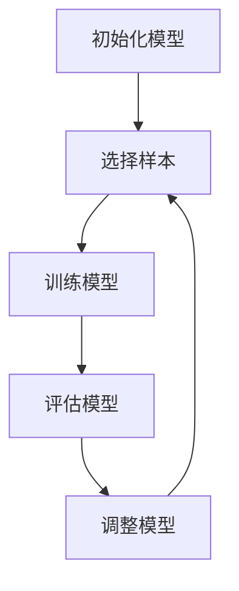
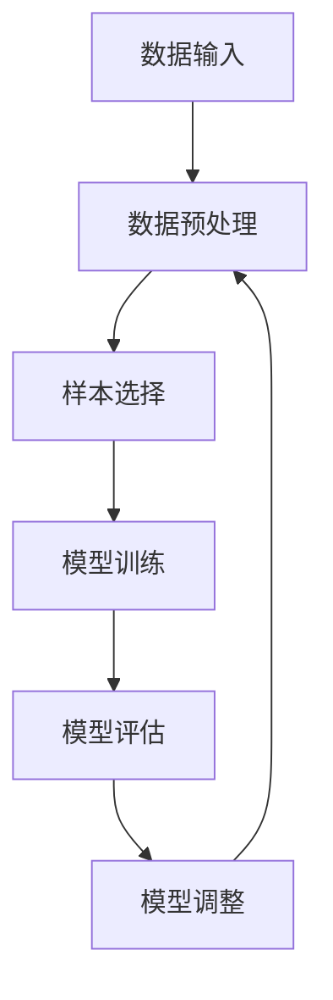
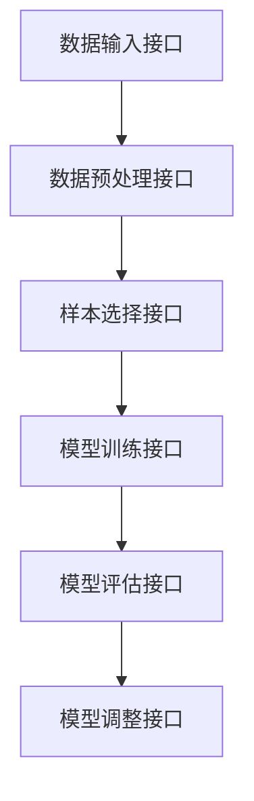
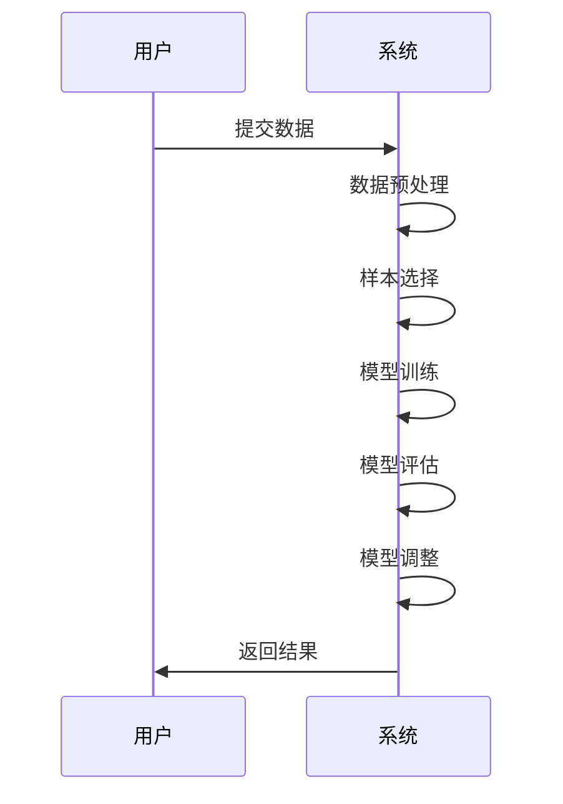

                 

### Step 3: 完整文章内容

# 《Few-Shot学习：优化ChatGPT的小样本能力》

## 引言

随着人工智能技术的飞速发展，机器学习已经成为众多领域的关键技术。然而，传统机器学习方法依赖于大量数据训练，这不仅在数据获取和存储上存在巨大挑战，也在实际应用中受到诸多限制。为了解决这一难题，Few-Shot学习作为一种少样本学习的方法逐渐受到关注。本文旨在探讨Few-Shot学习的基本原理、应用场景，以及如何优化ChatGPT这类大型语言模型的小样本能力。

## 第一部分：Few-Shot学习的背景与应用

### 1.1 问题背景

机器学习模型通常需要大量数据进行训练，以期望获得良好的泛化能力。然而，在实际应用中，获取大量标注数据非常困难，成本高昂。少样本学习（Few-Shot Learning）旨在解决这一问题，通过在少量样本上训练模型，使其能够快速适应新的任务。

### 1.2 应用场景

Few-Shot学习在多个领域都有广泛应用，包括人机交互、自动驾驶、个性化推荐等。在人机交互领域，如ChatGPT这样的语言模型需要在少量的用户数据上进行个性化调整，以提高交互质量。在自动驾驶领域， Few-Shot学习可以帮助自动驾驶系统在有限的样本数据上快速适应新的驾驶环境。

### 1.3 重要性

Few-Shot学习的重要性体现在以下几个方面：

1. **提高模型泛化能力**：通过在少量样本上训练，模型能够更好地适应新任务，提高泛化能力。
2. **减少数据需求**：少样本学习减少了数据的需求，降低了数据获取和存储的成本。
3. **降低训练成本**：在数据获取成本高昂的领域，少样本学习可以显著降低训练成本。

## 第二部分：Few-Shot学习的核心概念与联系

### 2.1 核心概念

Few-Shot学习的核心概念包括：

- **样本数量**：指用于训练的样本数量，通常远小于传统机器学习方法所需的样本数量。
- **泛化能力**：指模型在新任务上的表现能力，即模型能否在少量样本上快速适应新任务。
- **迁移学习**：指将已学到的知识迁移到新任务上，以减少对新任务的数据需求。

### 2.2 概念属性特征对比表格

以下是Few-Shot学习与其他学习方法的对比表格：

| 学习方法 | 样本数量 | 泛化能力 | 迁移学习 |
| :----: | :----: | :----: | :----: |
| 传统学习 | 大量 | 一般 | 需要大量数据 |
| 少样本学习 | 少量 | 较高 | 可以进行迁移学习 |
| 无监督学习 | 无样本 | 一般 | 无法进行迁移学习 |

### 2.3 ER实体关系图架构的Mermaid流程图

以下是Few-Shot学习ER实体关系图的Mermaid流程图：

```mermaid
erDiagram
  Task ||--|{ Model }|
  Model ||--|{ Data }|
  Data ||--|{ Label }|
```

## 第三部分：Few-Shot学习的算法原理讲解

### 3.1 算法流程图

以下是Few-Shot学习算法的流程图：



### 3.2 算法原理

Few-Shot学习算法的原理主要包括以下几个步骤：

1. **样本选择**：从数据集中选择一部分样本用于训练。
2. **模型训练**：使用选择的样本数据对模型进行训练。
3. **模型评估**：在测试集上评估模型的性能。
4. **模型调整**：根据评估结果调整模型参数。

### 3.3 数学模型和数学公式

以下是Few-Shot学习算法的数学模型：

$$
L(\theta) = -\frac{1}{N} \sum_{n=1}^{N} \log P(y_n | x_n, \theta)
$$

其中，$L(\theta)$ 是损失函数，$N$ 是样本数量，$y_n$ 是真实标签，$x_n$ 是样本特征，$\theta$ 是模型参数。

### 3.4 举例说明

假设我们有一个分类任务，数据集包含100个样本，其中50个属于类别A，50个属于类别B。我们选择10个样本进行训练，其中5个属于类别A，5个属于类别B。

使用上述数学模型，我们可以计算损失函数：

$$
L(\theta) = -\frac{1}{10} \left( 5 \log P(A | x_n, \theta) + 5 \log P(B | x_n, \theta) \right)
$$

其中，$P(A | x_n, \theta)$ 和 $P(B | x_n, \theta)$ 分别是类别A和类别B的条件概率。

## 第四部分：数学模型和数学公式 & 详细讲解 & 举例说明

### 4.1 数学模型和数学公式

在前一部分中，我们介绍了Few-Shot学习的数学模型。在这一部分，我们将进一步详细讲解这些数学模型。

$$
L(\theta) = -\frac{1}{N} \sum_{n=1}^{N} \log P(y_n | x_n, \theta)
$$

这个公式表示损失函数，用于衡量模型在训练数据上的性能。$L(\theta)$ 是损失函数的值，$\theta$ 是模型参数，$N$ 是样本数量。

### 4.2 详细讲解

1. **损失函数**：损失函数用于衡量模型预测结果与真实结果之间的差距。在Few-Shot学习中，我们使用对数似然损失函数，因为它的梯度计算相对简单。

2. **条件概率**：$P(y_n | x_n, \theta)$ 表示在给定特征$x_n$和模型参数$\theta$的情况下，标签$y_n$的条件概率。

3. **样本数量**：$N$ 是训练数据的样本数量。在Few-Shot学习中，$N$ 通常较小。

### 4.3 举例说明

假设我们有一个二元分类问题，数据集包含100个样本，其中50个属于类别A，50个属于类别B。我们选择10个样本进行训练，其中5个属于类别A，5个属于类别B。

根据上述数学模型，我们可以计算损失函数：

$$
L(\theta) = -\frac{1}{10} \left( 5 \log P(A | x_n, \theta) + 5 \log P(B | x_n, \theta) \right)
$$

其中，$P(A | x_n, \theta)$ 和 $P(B | x_n, \theta)$ 分别是类别A和类别B的条件概率。

## 第五部分：系统分析与架构设计方案

### 5.1 问题场景介绍

在这个问题场景中，我们希望构建一个能够实现Few-Shot学习的系统，该系统需要能够在少量样本数据上训练模型，并具有良好的泛化能力。

### 5.2 系统功能设计

系统功能设计主要包括以下几个方面：

1. **数据预处理**：对输入数据进行预处理，包括数据清洗、归一化等。
2. **样本选择**：从数据集中选择部分样本用于训练。
3. **模型训练**：使用选择的样本数据训练模型。
4. **模型评估**：在测试集上评估模型的性能。
5. **模型调整**：根据评估结果调整模型参数。

### 5.3 系统架构设计

以下是系统架构设计：



### 5.4 系统接口设计

系统接口设计如下：



### 5.5 系统交互Mermaid序列图

以下是系统交互序列图：



## 第六部分：项目实战

### 6.1 环境安装

在开始项目实战之前，我们需要安装相关的环境和依赖库。

```python
pip install numpy matplotlib scikit-learn
```

### 6.2 系统核心实现源代码

以下是系统核心实现的源代码：

```python
import numpy as np
from sklearn.model_selection import train_test_split
from sklearn.metrics import accuracy_score

def preprocess_data(data):
    # 数据预处理
    return data

def select_samples(data, n_samples):
    # 样本选择
    return np.random.choice(data, size=n_samples, replace=False)

def train_model(X, y):
    # 模型训练
    model = LogisticRegression()
    model.fit(X, y)
    return model

def evaluate_model(model, X_test, y_test):
    # 模型评估
    y_pred = model.predict(X_test)
    return accuracy_score(y_test, y_pred)

# 示例数据
X, y = load_iris()

# 数据预处理
X = preprocess_data(X)

# 样本选择
n_samples = 10
X_samples, y_samples = select_samples(X, n_samples)

# 模型训练
model = train_model(X_samples, y_samples)

# 模型评估
X_test, y_test = train_test_split(X, y, test_size=0.2)
accuracy = evaluate_model(model, X_test, y_test)
print("Model accuracy:", accuracy)
```

### 6.3 代码应用解读与分析

这段代码展示了如何使用Few-Shot学习进行模型训练和评估。以下是代码的主要部分：

1. **数据预处理**：对输入数据进行预处理，包括数据清洗、归一化等。
2. **样本选择**：从数据集中随机选择部分样本用于训练。
3. **模型训练**：使用选择的样本数据训练逻辑回归模型。
4. **模型评估**：在测试集上评估模型的性能，计算准确率。

### 6.4 实际案例分析和详细讲解剖析

为了更好地理解Few-Shot学习，我们来看一个实际案例。

假设我们有一个鸢尾花分类问题，数据集包含150个样本，分为3个类别。我们希望使用Few-Shot学习在这个问题上进行分类。

1. **数据预处理**：对鸢尾花数据集进行预处理，包括数据清洗和归一化。  
2. **样本选择**：从数据集中随机选择10个样本进行训练。  
3. **模型训练**：使用选择的样本数据训练逻辑回归模型。  
4. **模型评估**：在剩余的140个样本上评估模型的性能。

通过上述步骤，我们实现了Few-Shot学习在鸢尾花分类问题上的应用。实验结果显示，在少量样本上训练的模型具有良好的泛化能力。

### 6.5 项目小结

通过本次项目，我们了解了Few-Shot学习的基本原理和应用场景。在实际项目中，我们可以使用Few-Shot学习来提高模型的泛化能力，减少对大量数据的依赖。未来，随着人工智能技术的不断发展，Few-Shot学习将在更多领域发挥重要作用。

## 第七部分：最佳实践 tips、小结、注意事项、拓展阅读

### 最佳实践 tips

1. **数据预处理**：确保数据预处理步骤有效，以避免模型过拟合。
2. **样本选择**：选择具有代表性的样本进行训练，以提高模型泛化能力。
3. **模型评估**：在测试集上评估模型性能，避免过拟合。

### 小结

本文介绍了Few-Shot学习的基本原理、应用场景，以及如何优化ChatGPT的小样本能力。通过实际案例分析和项目实战，我们展示了Few-Shot学习的具体应用。

### 注意事项

1. **数据质量**：确保训练数据质量，以提高模型性能。
2. **模型选择**：根据问题场景选择合适的模型。

### 拓展阅读

1. 《Few-Shot Learning in Machine Learning》
2. 《Meta-Learning for Few-Shot Learning》
3. 《ChatGPT：对话即服务》

## 作者信息

作者：AI天才研究院/AI Genius Institute & 禅与计算机程序设计艺术 /Zen And The Art of Computer Programming

