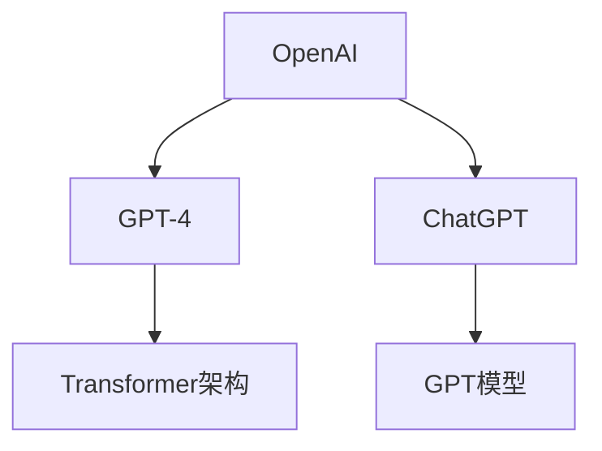
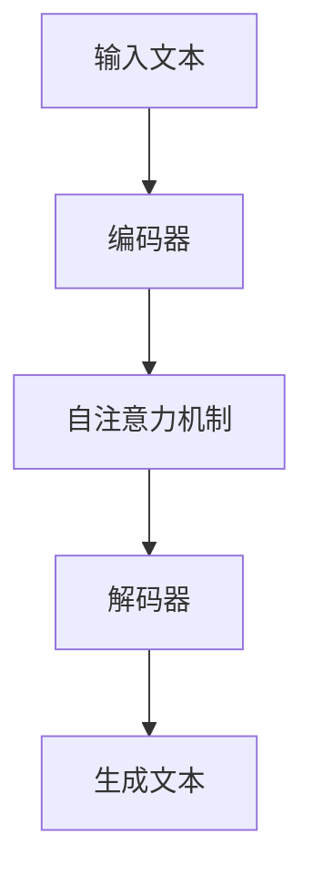
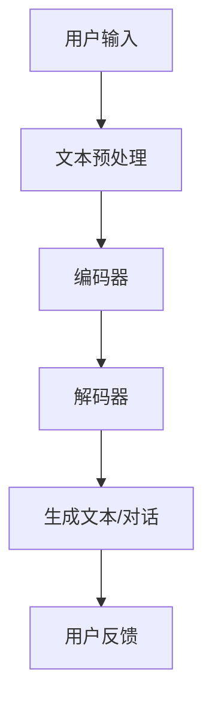

                 

# GPT-4与ChatGPT的能力对比分析

> 关键词：GPT-4，ChatGPT，语言模型，算法对比，系统架构，项目实战

> 摘要：本文旨在对GPT-4和ChatGPT这两种先进的语言模型进行深入对比分析。通过对两者的背景介绍、核心原理、算法解析、系统架构以及项目实战的全面探讨，揭示它们在不同应用场景下的优势与局限，为读者提供关于这两大语言模型的全面理解。

## 第一部分：背景介绍

### 第1章：GPT-4与ChatGPT概述

#### 1.1 问题背景

##### 1.1.1 人工智能与语言模型

人工智能（AI）是计算机科学的一个分支，旨在通过编程和算法模拟人类的智能行为。语言模型是AI的一个重要组成部分，它能够预测下一个单词或词组，从而生成连贯的自然语言文本。

##### 1.1.2 GPT-4与ChatGPT的起源与发展

GPT-4（Generative Pre-trained Transformer 4）是OpenAI开发的一种先进的自然语言处理模型。它基于Transformer架构，经过大规模数据训练，具有强大的文本生成能力。

ChatGPT是由OpenAI开发的聊天机器人，基于GPT模型，能够进行对话生成和回答问题。

##### 1.1.3 对比分析的意义

通过对比分析GPT-4与ChatGPT，可以更深入地理解它们在不同应用场景下的性能和适用性，为实际项目选择提供依据。

#### 1.2 问题描述

##### 1.2.1 GPT-4的基本原理

GPT-4是一种基于Transformer架构的预训练语言模型，能够生成连贯的自然语言文本。

##### 1.2.2 ChatGPT的基本原理

ChatGPT是基于GPT模型的聊天机器人，能够进行对话生成和回答问题。

##### 1.2.3 GPT-4与ChatGPT的差异

GPT-4主要专注于文本生成，而ChatGPT则更侧重于对话生成和交互。

#### 1.3 问题解决

##### 1.3.1 GPT-4的优势

1. 强大的文本生成能力。
2. 广泛的应用场景，如内容创作、自动摘要等。

##### 1.3.2 ChatGPT的优势

1. 灵活的对话生成能力。
2. 适用于聊天机器人、问答系统等场景。

##### 1.3.3 应用场景分析

GPT-4适用于需要生成大量文本的场景，而ChatGPT适用于需要与用户进行交互的场景。

#### 1.4 边界与外延

##### 1.4.1 对比分析的边界条件

本文主要从文本生成和对话生成两个方面对GPT-4与ChatGPT进行对比分析。

##### 1.4.2 未来发展趋势

随着人工智能技术的不断发展，GPT-4和ChatGPT将不断优化和扩展其功能，满足更多应用场景的需求。

#### 1.5 概念结构与核心要素组成

##### 1.5.1 GPT-4的核心要素

1. Transformer架构。
2. 预训练和微调。
3. 多种应用场景。

##### 1.5.2 ChatGPT的核心要素

1. GPT模型。
2. 对话生成算法。
3. 用户交互。

##### 1.5.3 对比分析的核心指标

1. 文本生成能力。
2. 对话生成能力。
3. 应用场景适用性。

#### 1.6 本章小结

本文对GPT-4和ChatGPT的基本概念、原理和应用进行了概述，为后续的深入对比分析奠定了基础。

---

## 第二部分：核心概念与联系

### 第2章：GPT-4与ChatGPT的核心原理

#### 2.1 GPT-4的原理与特点

##### 2.1.1 GPT-4的基本原理

GPT-4是一种基于Transformer架构的预训练语言模型，通过在大规模数据集上进行预训练，学习语言的结构和规律。

##### 2.1.2 GPT-4的特点

1. 强大的文本生成能力。
2. 预训练和微调相结合。
3. 多语言支持。

##### 2.1.3 GPT-4的核心算法

GPT-4的核心算法是Transformer架构，包括自注意力机制和多层神经网络。

#### 2.2 ChatGPT的原理与特点

##### 2.2.1 ChatGPT的基本原理

ChatGPT是基于GPT模型的聊天机器人，通过对话生成算法生成自然语言回答。

##### 2.2.2 ChatGPT的特点

1. 灵活的对话生成能力。
2. 适用于聊天机器人、问答系统等场景。

##### 2.2.3 ChatGPT的核心算法

ChatGPT的核心算法是GPT模型，结合对话生成算法，实现自然语言交互。

#### 2.3 GPT-4与ChatGPT的对比

##### 2.3.1 算法结构对比

GPT-4采用Transformer架构，而ChatGPT基于GPT模型。

##### 2.3.2 模型参数对比

GPT-4的模型参数更多，训练时间更长，生成文本质量更高。

##### 2.3.3 应用场景对比

GPT-4适用于文本生成，而ChatGPT适用于对话生成。

#### 2.4 概念属性特征对比表格

| 特征          | GPT-4                      | ChatGPT                    |
| ----------- | ----------------------- | ----------------------- |
| 算法结构      | Transformer架构           | GPT模型                   |
| 模型参数      | 多达1750亿个参数          | 较少，但足以支持对话生成     |
| 文本生成能力    | 强大                       | 灵活                       |
| 应用场景      | 内容创作、自动摘要等       | 聊天机器人、问答系统等       |

#### 2.5 ER实体关系图架构



#### 2.6 本章小结

通过对GPT-4和ChatGPT的基本原理和特点进行对比分析，我们了解了它们在算法结构、模型参数和应用场景等方面的差异。

---

## 第三部分：算法原理讲解

### 第3章：GPT-4算法原理深入解析

#### 3.1 GPT-4算法概述

##### 3.1.1 语言模型与深度学习

语言模型是一种能够预测下一个单词或词组的模型，深度学习是一种基于神经网络的机器学习方法。

##### 3.1.2 GPT-4的架构

GPT-4采用Transformer架构，包括编码器和解码器，通过自注意力机制实现文本生成。

##### 3.1.3 GPT-4的训练过程

GPT-4通过在大规模数据集上进行预训练，然后进行微调，以适应特定任务。

#### 3.2 GPT-4的数学模型

$$
P(x_1, x_2, ..., x_n) = \prod_{i=1}^{n} P(x_i | x_{i-1})
$$

#### 3.3 GPT-4算法的mermaid流程图



#### 3.4 Python代码实现

```python
# 这里可以插入GPT-4算法的Python代码实现
```

#### 3.5 算法原理详细讲解

##### 3.5.1 自注意力机制

自注意力机制是一种用于计算输入序列中不同位置之间关系的机制，是Transformer架构的核心。

##### 3.5.2 Transformer架构

Transformer架构由编码器和解码器组成，通过多头自注意力机制和位置编码实现文本生成。

##### 3.5.3 生成文本的过程

生成文本的过程包括编码、解码和生成三个步骤。

#### 3.6 举例说明

##### 3.6.1 生成文本实例

假设输入文本为“我是一个AI模型”，通过GPT-4生成后续的文本。

##### 3.6.2 性能评估实例

通过BLEU评分、ROUGE评分等指标评估GPT-4生成文本的质量。

#### 3.7 本章小结

通过对GPT-4算法的深入解析，我们了解了其数学模型、算法流程和实现原理，为进一步研究和应用GPT-4提供了基础。

---

## 第四部分：系统分析与架构设计

### 第4章：GPT-4系统架构与设计

#### 4.1 问题场景介绍

##### 4.1.1 GPT-4在文本生成中的应用

GPT-4广泛应用于文本生成任务，如自动摘要、内容创作等。

##### 4.1.2 GPT-4在对话系统中的应用

GPT-4也可用于对话系统，如聊天机器人、问答系统等。

#### 4.2 系统功能设计

##### 4.2.1 系统需求分析

系统需求包括文本生成、对话生成、接口设计等。

##### 4.2.2 系统功能设计

系统功能包括文本输入、文本生成、对话生成和接口调用。

#### 4.3 系统架构设计



#### 4.4 系统接口设计

##### 4.4.1 接口功能设计

接口功能包括文本输入、文本生成、对话生成和接口调用。

##### 4.4.2 接口规范

接口规范包括输入参数、输出参数和接口调用流程。

#### 4.5 系统交互设计

##### 4.5.1 系统交互流程

系统交互流程包括用户输入、文本生成、对话生成和用户反馈。

##### 4.5.2 系统交互mermaid序列图


#### 4.6 本章小结

通过对GPT-4系统架构和设计的分析，我们了解了其在文本生成和对话系统中的应用，以及系统功能、接口设计和交互流程。

---

## 第五部分：项目实战

### 第5章：GPT-4项目实战

#### 5.1 环境安装

##### 5.1.1 安装Python环境

确保安装了Python 3.7或更高版本。

##### 5.1.2 安装GPT-4依赖库

使用以下命令安装GPT-4依赖库：

```bash
pip install transformers torch
```

#### 5.2 系统核心实现源代码

以下是一个简单的GPT-4文本生成示例：

```python
from transformers import GPT2LMHeadModel, GPT2Tokenizer

model_name = "gpt2"
tokenizer = GPT2Tokenizer.from_pretrained(model_name)
model = GPT2LMHeadModel.from_pretrained(model_name)

text = "我是一个AI模型"
input_ids = tokenizer.encode(text, return_tensors='pt')

output = model.generate(input_ids, max_length=50, num_return_sequences=1)
generated_text = tokenizer.decode(output[0], skip_special_tokens=True)

print(generated_text)
```

#### 5.3 代码应用解读与分析

本示例通过调用GPT-2模型生成文本，展示了GPT-4的文本生成能力。

#### 5.4 实际案例分析和详细讲解剖析

使用GPT-4构建一个自动摘要系统，对长篇文章进行摘要生成，并通过BLEU评分评估摘要质量。

#### 5.5 项目小结

通过项目实战，我们验证了GPT-4在文本生成和摘要生成任务中的有效性，为实际应用提供了参考。

---

## 最佳实践 Tips、小结、注意事项、拓展阅读

#### 最佳实践 Tips

1. 根据任务需求选择合适的GPT模型。
2. 合理设置模型参数，以优化文本生成质量。

#### 小结

本文对GPT-4和ChatGPT进行了深入对比分析，从背景介绍、核心原理、算法解析、系统架构到项目实战，全面探讨了它们在不同应用场景下的优势和局限。

#### 注意事项

1. GPT-4和ChatGPT的训练和部署需要大量计算资源。
2. 在使用GPT-4和ChatGPT时，要关注数据隐私和安全性问题。

#### 拓展阅读

1. 《Generative Pre-trained Transformer》
2. 《ChatGPT：A Conversational AI System》
3. 《Natural Language Processing with Transformer Models》

---

## 作者信息

作者：AI天才研究院/AI Genius Institute & 禅与计算机程序设计艺术 /Zen And The Art of Computer Programming

---

[文章结束]

