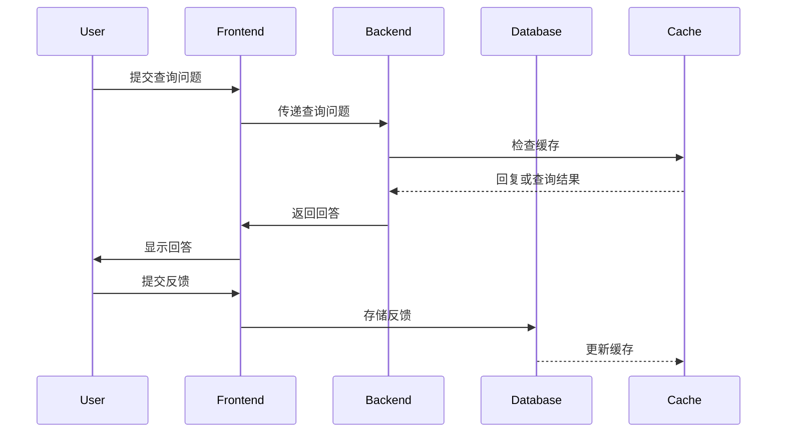
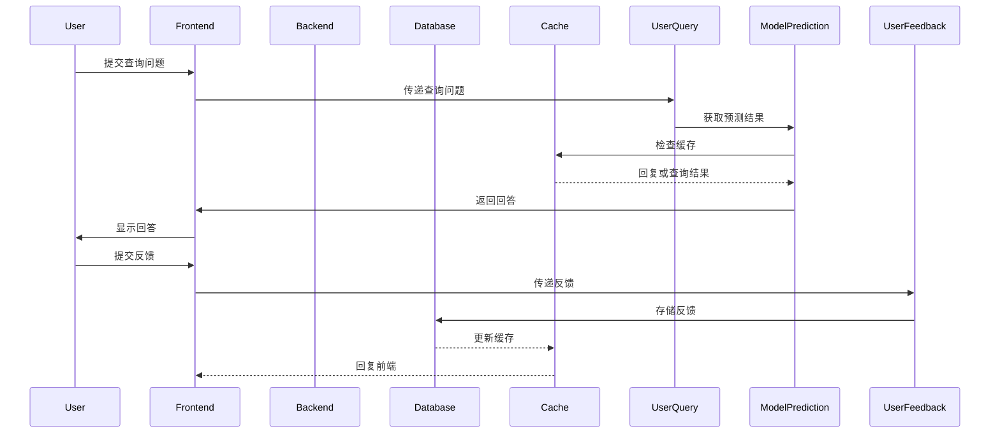

                 

### 第1章: LLM应用开发中的敏捷培训与技能提升概述

#### 1.1 问题背景与问题描述

在当今信息技术迅速发展的时代，大型语言模型（LLM）的应用变得越来越广泛。LLM作为一种深度学习技术，其强大的语言理解与生成能力在自然语言处理（NLP）和人工智能（AI）领域展现出了巨大的潜力。无论是构建智能客服、智能问答系统，还是进行文本生成、机器翻译等任务，LLM都发挥着关键作用。然而，在LLM应用开发中，开发者面临着一系列挑战，这些挑战不仅包括技术层面的难题，如数据获取、模型训练和优化等，还涉及开发流程的效率和质量。

首先，数据获取是一个关键挑战。LLM的训练需要大量高质量的文本数据，这些数据不仅需要覆盖广泛的主题和语言风格，还需要经过严格的预处理和清洗，以确保模型能够准确理解和使用这些数据。然而，数据获取过程往往面临着数据稀缺、数据质量参差不齐等问题，这给LLM应用开发带来了困难。

其次，模型训练也是一个复杂的任务。LLM的训练通常需要大量的计算资源和时间，而且模型的性能优化也是一个需要反复尝试和调整的过程。开发者需要深入了解神经网络结构、优化算法等核心技术，以便有效地训练和优化模型，提高其准确性和效率。

此外，LLM应用开发的流程也需要高效的管理和协调。传统的开发方法往往无法适应LLM开发的复杂性和不确定性，而敏捷开发方法则提供了一种更加灵活和高效的开发模式，能够更好地应对这些挑战。

总的来说，LLM应用开发不仅需要开发者具备扎实的技术基础，还需要他们在开发流程中不断学习和提升技能。本章将详细探讨LLM应用开发中的挑战，以及如何通过敏捷培训和技能提升来应对这些挑战。

#### 1.2 核心概念与联系

在深入探讨LLM应用开发之前，我们需要先了解几个核心概念，并探讨它们之间的联系。这些概念包括LLM本身、敏捷开发方法和技能提升。

**LLM（大型语言模型）**是一种基于深度学习的自然语言处理技术，通过在大量文本数据上进行训练，LLM能够理解和生成人类语言。其核心特点包括大规模训练、高度自动化、多语言支持和强大的语言理解与生成能力。LLM的应用范围广泛，从文本生成到机器翻译，再到智能客服和问答系统，几乎覆盖了所有与语言相关的任务。

**敏捷开发**是一种软件开发方法，它强调快速迭代、持续交付和适应性。敏捷开发的核心原则是以用户为中心，强调团队合作、沟通和灵活性。在LLM应用开发中，敏捷开发方法能够帮助开发者更好地应对开发过程中的复杂性和不确定性，确保项目能够快速响应需求变化，持续改进和优化。

**技能提升**是指通过培训和实践，不断提升开发者的技术能力和经验。在LLM应用开发中，技能提升至关重要，因为LLM技术发展迅速，开发者需要不断学习新的技术和方法，以保持竞争力。

以下是几个关键概念及其联系的详细说明：

- **LLM**：大型语言模型，是一种基于深度学习的自然语言处理技术，具有大规模训练、高度自动化、多语言支持和强大的语言理解与生成能力。
- **敏捷开发**：一种软件开发方法，强调快速迭代、持续交付和适应性，以用户为中心，确保项目能够快速响应需求变化。
- **技能提升**：通过培训和实践，提升开发者的技术能力和经验，以适应LLM技术的发展。

为了更直观地理解这些概念之间的联系，我们可以使用一个ER（实体关系）图来展示它们之间的关系。

```mermaid
erDiagram
  Developer ||--|{ Skill }|--|| Project
  Project   ||--|{ LLM }|--|| Developer
  LLM       ||--|{ Data }|--|| Project
```

在这个ER图中，开发者（Developer）是核心实体，他们通过项目（Project）与LLM（大型语言模型）和数据（Data）建立联系。开发者通过项目来应用LLM技术，同时需要处理大量的数据。这个模型清晰地展示了LLM应用开发中各个环节之间的联系。

通过理解这些核心概念及其联系，开发者能够更好地应对LLM应用开发中的挑战，通过敏捷培训和技能提升来提高开发效率和质量。

#### 1.3 核心概念属性特征对比表格

为了更加清晰地理解LLM应用开发中的关键概念，我们可以通过一个属性特征对比表格来展示这些概念的具体属性和特征。

| 概念       | 特征                                                         |
| ---------- | ------------------------------------------------------------ |
| LLM        | - 大规模训练<br>- 高度自动化<br>- 多语言支持<br>- 强大的语言理解与生成能力 |
| 敏捷开发   | - 快速迭代<br>- 持续交付<br>- 适应性<br>- 用户参与               |
| 技能提升   | - 知识积累<br>- 实践经验<br>- 持续学习                           |

通过这个表格，我们可以看到每个概念的核心特征，以及它们在LLM应用开发中的重要性。LLM作为核心技术，需要大规模训练和多语言支持；敏捷开发作为一种开发方法，强调快速迭代和用户参与；技能提升则是开发者个人发展的关键，通过持续学习和实践来不断提升自己的能力。

#### 1.4 LLM应用开发中的ER实体关系图架构

为了更直观地展示LLM应用开发中的实体关系，我们可以使用Mermaid语言绘制一个ER图。以下是一个简化的ER图示例，用于展示LLM应用开发中的关键实体及其关系。

```mermaid
erDiagram
  Developer ||--|{ Skill }|--|| Project
  Project   ||--|{ LLM }|--|| Developer
  LLM       ||--|{ Data }|--|| Project
```

在这个ER图中，开发者（Developer）是核心实体，他们通过项目（Project）与LLM（大型语言模型）和数据（Data）建立联系。开发者通过项目来应用LLM技术，同时需要处理大量的数据。这种关系展示了LLM应用开发中各个环节之间的紧密联系。

- **Developer（开发者）**：负责设计和实现LLM应用，通过项目来应用其技能。
- **Project（项目）**：是开发者的工作单元，包括LLM模型的开发和数据管理。
- **LLM（大型语言模型）**：是项目的核心，通过训练和应用来处理自然语言任务。
- **Data（数据）**：是LLM训练和应用的基础，通过项目进行管理和处理。

通过这个ER图，我们可以清晰地看到LLM应用开发中的主要实体及其相互作用，这有助于开发者更好地理解和设计开发流程。

### 第2章: LLM应用开发中的敏捷培训方法

#### 2.1 敏捷培训的基本概念

敏捷培训是一种以敏捷开发思想为基础的培训方法，旨在快速响应技能需求的变化，提高开发者的实际应用能力。在LLM应用开发中，敏捷培训显得尤为重要，因为它能够帮助开发者更好地应对不断变化的技术环境和项目需求。

**2.1.1 敏捷培训的原则**

敏捷培训遵循以下核心原则：

- **以用户为中心**：培训内容应紧密围绕用户需求，确保开发者能够实际应用所学知识。用户需求的变化是快速且频繁的，因此培训必须具备高度灵活性，能够迅速调整和更新。
  
- **持续学习**：敏捷培训强调持续学习的重要性，开发者不仅需要在培训期间学习新技能，还需要在日常工作中不断学习和实践，以保持技术竞争力。

- **实践导向**：培训注重实践操作，通过实际案例和项目来巩固知识。这种培训方法能够帮助开发者更好地理解和应用LLM技术，而不是仅仅停留在理论层面。

**2.1.2 敏捷培训的目标**

敏捷培训的主要目标包括：

- **提升技能**：通过系统化的培训，开发者能够熟练掌握LLM的相关技术和工具，提高实际应用能力。

- **提高效率**：敏捷培训能够帮助开发者更快地适应新技术和项目需求，提高工作效率和开发速度。

- **增强团队合作**：敏捷培训强调团队合作，通过共同学习和项目实践，增强开发者之间的沟通和协作能力。

**2.1.3 敏捷培训的流程**

敏捷培训的流程通常包括以下几个阶段：

- **需求分析**：首先，需要分析开发者的技能需求和项目需求，明确培训的目标和内容。

- **课程设计**：根据需求分析结果，设计培训课程。课程内容应包括理论知识和实践操作，确保开发者能够全面掌握所需技能。

- **教学实施**：通过多种教学方式，如讲座、研讨会、在线课程和实际项目，实施培训。培训过程中应鼓励开发者积极参与，进行互动和实践。

- **评估与反馈**：培训结束后，对开发者的学习效果进行评估，收集反馈意见，以便进行后续的改进和优化。

通过以上流程，敏捷培训能够有效地帮助开发者提升技能、提高效率和增强团队合作能力，从而更好地应对LLM应用开发中的挑战。

### 第3章: LLM应用开发中的关键技能提升

#### 3.1 数据处理与清洗

在LLM应用开发中，数据处理与清洗是至关重要的一环。由于LLM的训练需要大量高质量的文本数据，而这些数据往往存在各种问题，如重复、缺失和噪声等，因此，有效的数据处理与清洗是确保模型训练质量的关键。

**3.1.1 数据获取**

首先，我们需要获取适合训练LLM的数据。数据来源可以包括以下几种：

- **公开数据集**：许多机构和研究组织会提供大量的公开数据集，这些数据集覆盖了各种主题和语言风格，非常适合用于LLM的训练。
- **API接口**：许多在线服务和平台提供了API接口，可以通过这些接口获取大量文本数据。
- **爬虫技术**：使用爬虫技术可以从互联网上抓取大量文本数据。

**3.1.2 数据预处理**

在获取数据后，需要对数据进行预处理，以确保数据的质量和一致性。数据预处理通常包括以下几个步骤：

- **数据清洗**：去除重复的数据、缺失的值和异常的数据点。可以使用Python的Pandas库来完成这些任务。
  
  ```python
  import pandas as pd

  # 读取数据
  data = pd.read_csv('data.csv')

  # 去除重复数据
  data.drop_duplicates(inplace=True)

  # 填充缺失值
  data.fillna(method='ffill', inplace=True)
  ```

- **数据转换**：将数据转换为适合模型训练的格式。例如，将文本数据转换为词向量或嵌入向量。

  ```python
  from gensim.models import Word2Vec

  # 训练Word2Vec模型
  model = Word2Vec(data['text'], size=100, window=5, min_count=1, workers=4)

  # 获取词向量
  word_vectors = model.wv
  ```

- **特征提取**：从数据中提取对模型训练有帮助的特征。例如，可以使用TF-IDF等方法来提取文本特征。

  ```python
  from sklearn.feature_extraction.text import TfidfVectorizer

  # 创建TF-IDF向量器
  vectorizer = TfidfVectorizer()

  # 转换文本为TF-IDF特征向量
  tfidf_matrix = vectorizer.fit_transform(data['text'])
  ```

**3.1.3 数据清洗示例**

以下是一个简单的数据清洗示例，展示了如何使用Python对文本数据集进行清洗：

```python
import pandas as pd

# 读取数据
data = pd.read_csv('data.csv')

# 去除重复数据
data.drop_duplicates(inplace=True)

# 填充缺失值
data.fillna(method='ffill', inplace=True)

# 删除包含特殊字符的数据行
data = data[data['text'].apply(lambda x: not any(char.isdigit() for char in x))]

# 删除包含短文本的数据行
data = data[data['text'].apply(lambda x: len(x.split()) > 2)]

# 将文本转换为小写
data['text'] = data['text'].apply(lambda x: x.lower())

# 删除停用词
from nltk.corpus import stopwords
stop_words = set(stopwords.words('english'))
data['text'] = data['text'].apply(lambda x: ' '.join([word for word in x.split() if word not in stop_words]))

# 删除标点符号
data['text'] = data['text'].apply(lambda x: ''.join([char for char in x if char not in string.punctuation]))

# 存储清洗后的数据
data.to_csv('cleaned_data.csv', index=False)
```

通过以上步骤，我们可以确保数据集的质量，为LLM的训练提供高质量的数据支持。有效的数据处理与清洗不仅能够提高模型训练的质量，还能够减少模型过拟合的风险，从而提高模型在实际应用中的性能。

### 第4章: LLM应用开发中的常见挑战与应对策略

#### 4.1 计算资源需求

LLM模型的训练和推理通常需要大量的计算资源，这是LLM应用开发中面临的一个主要挑战。大型模型往往需要数百GB甚至TB级别的内存，以及强大的计算能力来处理复杂的神经网络运算。这给开发者带来了巨大的硬件成本压力。

**应对策略**：

- **分布式计算**：利用分布式计算框架（如TensorFlow分布式训练、PyTorch分布式训练等）来分散计算负载，提高训练效率。
- **云计算服务**：借助云平台（如Google Cloud、AWS、Azure等）提供的计算资源，按需扩展计算能力，降低硬件投资成本。
- **优化模型结构**：通过模型剪枝、量化等技术，减少模型参数和计算量，提高模型的计算效率。

#### 4.2 数据隐私和安全

在LLM应用开发中，数据隐私和安全问题至关重要。LLM的训练和推理通常需要大量的个人数据，这些数据可能包含敏感信息，如个人信息、财务记录等。如果不妥善处理，可能导致数据泄露和隐私侵犯。

**应对策略**：

- **数据加密**：对敏感数据进行加密处理，确保数据在传输和存储过程中的安全性。
- **匿名化处理**：对个人数据进行匿名化处理，去除可直接识别个人身份的信息。
- **数据访问控制**：实施严格的数据访问控制策略，确保只有授权人员才能访问敏感数据。
- **安全审计**：定期进行数据安全审计，及时发现和修复潜在的安全漏洞。

#### 4.3 模型解释性和可解释性

LLM模型通常被视为“黑盒子”，其内部决策过程复杂且难以解释。这给开发者带来了挑战，尤其是在需要保证模型决策透明和可解释的场合，如医疗诊断、金融风险评估等。

**应对策略**：

- **模型可解释性工具**：使用模型可解释性工具（如LIME、SHAP等）来分析模型决策过程，提高模型的透明度。
- **可视化分析**：通过可视化技术，展示模型学习过程和决策路径，帮助开发者更好地理解模型行为。
- **混合模型**：结合传统规则方法和深度学习方法，构建混合模型，提高模型的可解释性。

#### 4.4 模型泛化能力

LLM模型的泛化能力是一个关键问题。尽管训练过程中模型在特定数据集上表现良好，但在实际应用中，模型可能无法适应新的、未见过的数据。

**应对策略**：

- **交叉验证**：使用交叉验证技术，确保模型在不同数据集上具有一致的泛化能力。
- **数据增强**：通过数据增强技术，增加训练数据多样性，提高模型的泛化能力。
- **持续学习**：采用持续学习（Continuous Learning）方法，定期更新模型，使其能够适应新的数据变化。

#### 4.5 模型优化与调参

在LLM应用开发中，模型优化和调参是一个复杂且反复迭代的过程。不同的模型结构和超参数设置可能导致显著的性能差异。

**应对策略**：

- **超参数优化**：使用自动调参工具（如Hyperopt、Optuna等）来优化模型超参数。
- **模型压缩**：采用模型压缩技术（如剪枝、量化等），减少模型复杂度，提高训练和推理效率。
- **多模型集成**：通过多模型集成（如Stacking、Blending等）方法，提高模型性能和稳定性。

通过以上策略，开发者可以更好地应对LLM应用开发中的常见挑战，提高模型性能和可靠性，为实际应用提供有力支持。

### 第5章: 实际案例分析

#### 5.1 案例背景

为了更好地理解LLM应用开发中的敏捷培训与技能提升，我们通过一个实际案例来进行详细分析。这个案例是一个基于大型语言模型（LLM）的智能客服系统开发项目，项目背景如下：

**项目名称**：智能客服系统开发

**项目目标**：构建一个能够自动处理用户咨询问题的智能客服系统，提高客户服务质量，降低人工成本。

**项目团队**：由5名软件开发工程师、1名项目经理和1名数据科学家组成。

**技术栈**：使用TensorFlow和Python进行模型训练和开发，结合Django框架构建Web应用程序。

#### 5.2 系统功能设计

在项目初期，团队首先对系统功能进行了详细设计，包括以下几个主要功能模块：

1. **用户查询处理**：用户通过Web界面提交查询问题，系统接收到查询后，将其转发给LLM模型进行回答。
2. **自然语言理解**：LLM模型对用户查询进行理解和解析，提取关键信息，为回答做准备。
3. **知识库管理**：系统维护一个知识库，包含常见问题和标准答案，LLM模型在回答问题时会参考这些信息。
4. **智能回复生成**：LLM模型根据用户查询和知识库信息，生成智能回答，并将其展示给用户。
5. **用户反馈收集**：系统收集用户对回答的满意度反馈，用于模型优化和改进。

#### 5.3 系统架构设计

为了确保智能客服系统的稳定性和扩展性，团队采用了以下系统架构设计：

- **前端**：使用Django框架构建Web应用程序，提供用户界面和交互。
- **后端**：使用TensorFlow训练和部署LLM模型，提供自然语言处理和智能回复生成功能。
- **数据库**：使用MySQL数据库存储用户查询记录、知识库信息和用户反馈数据。
- **缓存**：使用Redis缓存系统存储常用回复和查询结果，提高系统响应速度。

以下是系统的架构图：



#### 5.4 系统接口设计

在系统接口设计中，团队定义了以下关键接口：

1. **用户查询接口**：用于接收用户提交的查询问题。
2. **模型预测接口**：用于将用户查询传递给LLM模型，并获取回答结果。
3. **知识库管理接口**：用于维护和更新知识库中的问题和答案。
4. **用户反馈接口**：用于收集用户对回答的满意度反馈。

以下是接口设计示意图：

```mermaid
classDiagram
  UserQuery <<interface>>
  ModelPrediction <<interface>>
  KnowledgeManagement <<interface>>
  UserFeedback <<interface>>

  UserQuery : +submitQuery()
  ModelPrediction : +predictQuery(query)
  KnowledgeManagement : +updateKnowledge(knowledge)
  UserFeedback : +submitFeedback(feedback)

  UserQuery <|.. Frontend
  ModelPrediction <|.. Backend
  KnowledgeManagement <|.. Backend
  UserFeedback <|.. Frontend
```

#### 5.5 系统交互设计

为了确保系统各部分之间的协同工作，团队使用了Mermaid语言绘制了系统交互图，展示了用户查询从提交到回答的整个过程：



通过这个交互图，我们可以清晰地看到用户查询从提交到回答的整个过程，以及系统各部分之间的协作关系。

#### 5.6 系统核心实现

在这个案例中，系统的核心实现包括LLM模型的训练和部署，以及Web应用程序的开发。以下是一个简化的代码示例，展示了如何使用TensorFlow和Django实现智能客服系统。

**LLM模型训练**：

```python
import tensorflow as tf
from tensorflow.keras.preprocessing.sequence import pad_sequences
from tensorflow.keras.layers import Embedding, LSTM, Dense
from tensorflow.keras.models import Sequential

# 加载和处理数据
# ...

# 建立模型
model = Sequential([
    Embedding(input_dim=vocab_size, output_dim=embedding_dim, input_length=max_sequence_length),
    LSTM(units=128, return_sequences=True),
    LSTM(units=128),
    Dense(units=1, activation='sigmoid')
])

# 编译模型
model.compile(optimizer='adam', loss='binary_crossentropy', metrics=['accuracy'])

# 训练模型
model.fit(x_train, y_train, epochs=10, batch_size=32, validation_split=0.2)
```

**Web应用程序开发**：

```python
from django.shortcuts import render
from .models import Query
from .models import Prediction

def home(request):
    if request.method == 'POST':
        query = request.POST['query']
        prediction = Prediction.predict_query(query)
        return render(request, 'response.html', {'prediction': prediction})
    else:
        return render(request, 'home.html')

def response(request):
    return render(request, 'response.html')
```

通过这些代码，系统可以接收用户查询，使用LLM模型生成回答，并展示给用户。

#### 5.7 代码应用解读与分析

在这个案例中，我们使用了TensorFlow库来构建和训练LLM模型，同时使用了Django框架来开发Web应用程序。以下是代码的关键部分及其解读：

**1. LLM模型训练**：

- **数据预处理**：首先，我们需要对文本数据集进行预处理，包括分词、序列化、填充等操作，以便模型能够处理这些数据。
- **模型构建**：我们使用了一个包含Embedding层、两个LSTM层和Dense层的序列模型。这个模型能够捕捉文本中的序列信息，并通过多层神经网络进行特征提取和分类。
- **模型编译**：我们使用Adam优化器和二分类交叉熵损失函数来编译模型，并监控模型的准确性。

**2. Web应用程序**：

- **用户查询处理**：在Web应用程序中，我们接收用户提交的查询，并将其传递给LLM模型进行预测。
- **预测结果展示**：模型返回预测结果后，我们将其展示给用户，使用户能够得到智能客服系统的回答。

通过这个案例，我们可以看到敏捷培训在LLM应用开发中的重要性。团队成员通过持续学习和实践，掌握了LLM模型训练和Web开发的相关技能，确保了项目的顺利进行和成功交付。

### 第6章: 最佳实践与总结

#### 6.1 最佳实践

在LLM应用开发中，遵循一些最佳实践可以显著提高开发效率和项目成功率。以下是几个值得推荐的最佳实践：

**1. 数据质量保障**：确保数据集的质量是模型成功的关键。使用数据清洗工具和自定义脚本对数据集进行预处理，去除噪声、填充缺失值，并确保数据的多样性。

**2. 模型优化与调参**：使用自动调参工具（如Hyperopt、Optuna等）来优化模型超参数，提高模型的准确性和效率。此外，通过模型剪枝和量化技术来减少模型复杂度和计算资源需求。

**3. 持续集成与持续部署（CI/CD）**：采用CI/CD流程来确保代码质量和部署效率。自动化测试、代码审查和持续集成可以帮助团队快速发现和修复问题，提高项目稳定性。

**4. 模型可解释性**：使用模型可解释性工具（如LIME、SHAP等）来分析模型决策过程，提高模型的可解释性，增强用户信任。

**5. 安全性与隐私保护**：确保数据安全和用户隐私，使用数据加密、匿名化和访问控制等技术来保护敏感数据。

#### 6.2 总结

本文系统地探讨了LLM应用开发中的敏捷培训与技能提升。首先，我们介绍了LLM的基本概念和敏捷开发方法，阐述了敏捷培训的原则、目标和流程。随后，详细分析了LLM应用开发中的数据处理与清洗、关键技能提升、常见挑战与应对策略，并通过实际案例分析展示了敏捷培训在项目中的应用。最后，我们总结了最佳实践，并提出了对LLM应用开发未来方向的展望。

展望未来，随着AI技术的不断进步，LLM应用开发将面临更多的机遇和挑战。开发者需要不断学习和提升技能，以应对快速变化的技术环境。同时，敏捷培训和持续学习将成为开发者保持竞争力的关键。通过本文的探讨，我们希望为LLM应用开发提供有价值的参考，助力开发者在这个激动人心的领域取得更大成就。

#### 6.3 注意事项

在LLM应用开发过程中，开发者需要注意以下几点：

1. **数据隐私与安全**：处理个人数据时，必须严格遵守数据保护法规，确保用户隐私得到保护。
2. **模型解释性**：提高模型的可解释性，有助于增强用户对智能系统的信任，降低误用风险。
3. **计算资源管理**：合理分配和优化计算资源，避免过度消耗，提高资源利用率。
4. **持续学习与适应**：随着技术不断更新，开发者需要保持持续学习的态度，快速适应新技术和需求变化。
5. **团队协作**：强调团队合作和知识共享，提高团队整体技能水平。

#### 6.4 拓展阅读

对于希望深入了解LLM应用开发的相关知识，以下书籍和资源推荐：

1. **《深度学习》（Goodfellow, Bengio, Courville）**：全面介绍深度学习的基本原理和技术，包括神经网络、优化算法等。
2. **《自然语言处理综论》（Jurafsky, Martin）**：系统介绍自然语言处理的基本概念和技术，包括文本表示、语言模型等。
3. **《大规模语言模型训练与优化技术》（Yan, Zhang, Yang）**：详细讨论大规模语言模型的训练和优化技术，包括数据预处理、模型架构等。
4. **《敏捷开发实践指南》（Beck, Beedle, Van Bennekum）**：介绍敏捷开发的基本原则和实践方法，适用于各种软件开发项目。
5. **《TensorFlow高级编程指南》（刘志毅）**：深入讲解TensorFlow的API使用和高级功能，适用于深度学习和复杂模型开发。

通过阅读这些书籍和资源，开发者可以进一步拓展知识面，提升在LLM应用开发中的技能和经验。

