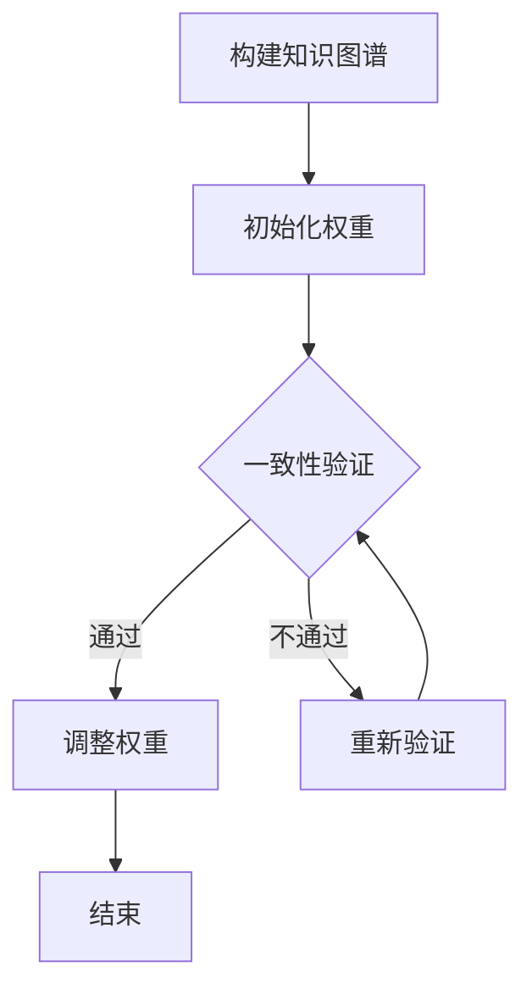

                 

### 1.1.5 核心概念与联系

在探讨Self-Consistency CoT（自一致性CoT）与Zero-Shot CoT（零样本CoT）的对比之前，我们需要明确它们的核心概念和它们之间的联系。

#### 1.1.5.1 Self-Consistency CoT的基本概念

Self-Consistency CoT是一种基于自我一致性的推理方法，其核心在于通过内部一致性来评估信息的可靠性。这种方法通常应用于知识图谱或图神经网络中，通过图结构上的约束关系来维持知识的一致性。

- **属性特征：**
  - **自我一致性**：确保输入信息在内部逻辑上的一致性。
  - **约束关系**：通过图结构中的边和节点关系来约束信息。
  - **推理过程**：利用图算法在图中进行信息传播和一致性验证。

- **应用场景：**
  - **知识图谱构建**：用于检测和修复知识图谱中的不一致性。
  - **信息检索**：通过一致性验证提高检索结果的可靠性。

#### 1.1.5.2 Zero-Shot CoT的基本概念

Zero-Shot CoT是一种不需要训练数据就能进行推理的方法，它通过模型预先学习到的泛化能力来解决新的任务。这种方法特别适用于面对全新的任务或领域时，训练数据不足的情况。

- **属性特征：**
  - **零样本学习**：不需要新的训练数据，直接利用现有模型进行推理。
  - **迁移学习**：利用在相似任务上训练的模型进行泛化推理。
  - **语义理解**：通过模型对语义的深入理解来进行推理。

- **应用场景：**
  - **新任务预测**：在没有相关训练数据的情况下对新数据进行预测。
  - **跨领域应用**：在不同领域间进行知识迁移和应用。

#### 1.1.5.3 Self-Consistency CoT与Zero-Shot CoT的联系与区别

虽然Self-Consistency CoT和Zero-Shot CoT在应用场景上有所不同，但它们在某些方面是相互关联的。

- **联系：**
  - **共同目标**：都旨在提高推理的准确性和可靠性。
  - **模型优化**：Self-Consistency CoT可以优化Zero-Shot CoT模型中的不一致性，从而提高推理质量。

- **区别：**
  - **数据依赖**：Self-Consistency CoT依赖于已有数据的图结构，而Zero-Shot CoT则更侧重于模型本身的泛化能力。
  - **适用场景**：Self-Consistency CoT适用于知识图谱和已有数据较强的场景，而Zero-Shot CoT适用于零样本或少样本的跨领域应用。

通过上述对核心概念和联系的分析，我们可以更清楚地了解Self-Consistency CoT与Zero-Shot CoT的基本原理和应用场景，为后续的深入讨论打下坚实的基础。

---

> 下一步我们将详细介绍Self-Consistency CoT的技术原理，包括其基本原理、数学模型、流程图以及Python源代码示例。这将帮助我们更好地理解这种方法的实现细节和应用潜力。**# 第二部分：技术原理与数学模型**

### 第3章：Self-Consistency CoT技术原理

Self-Consistency CoT（自一致性CoT）是一种通过维持知识内部一致性的方法来提高推理准确性和可靠性的技术。在这一章中，我们将详细介绍Self-Consistency CoT的基本原理、数学模型、流程图展示以及Python源代码示例。

#### 3.1.1 Self-Consistency CoT的基本原理

Self-Consistency CoT的核心思想是通过图结构上的约束关系来确保输入信息的内部一致性。在这种方法中，节点代表实体，边代表实体之间的关系，而权重则表示关系的强度或可信度。

- **核心概念：**
  - **图结构**：知识图谱或图神经网络中的节点和边。
  - **一致性约束**：通过图算法来维持节点的输入信息的逻辑一致性。
  - **信息传播**：在图中进行信息传递和一致性验证。

- **实现步骤：**
  1. **构建知识图谱**：根据已有的数据构建知识图谱。
  2. **初始化权重**：设定节点间的初始权重。
  3. **一致性验证**：通过图算法检查信息的一致性。
  4. **调整权重**：根据一致性验证的结果调整权重。

#### 3.1.2 Self-Consistency CoT的数学模型与公式

Self-Consistency CoT的数学模型主要包括两部分：节点表示和边表示。

- **节点表示：**
  - \( v \in V \) 表示图中的节点，每个节点可以表示为一个向量。
  - \( \vec{v} = \sum_{i=1}^{n} w_{i} \vec{e_i} \)，其中 \( \vec{e_i} \) 是节点 \( v \) 的特征向量，\( w_{i} \) 是特征向量的权重。

- **边表示：**
  - \( e \in E \) 表示图中的边，每条边也可以表示为一个向量。
  - \( \vec{e} = \sum_{j=1}^{m} w_{j} \vec{e_j} \)，其中 \( \vec{e_j} \) 是边的特征向量，\( w_{j} \) 是特征向量的权重。

- **一致性约束公式：**
  - \( \vec{v_i} = \sum_{j \in adj(i)} \alpha_{ij} \vec{e_j} \)，其中 \( adj(i) \) 是节点 \( i \) 的邻接节点集合，\( \alpha_{ij} \) 是边 \( j \) 的权重。

#### 3.1.3 Self-Consistency CoT的Mermaid流程图展示

为了更直观地展示Self-Consistency CoT的工作流程，我们可以使用Mermaid流程图来描述。



#### 3.1.4 Self-Consistency CoT的Python源代码示例

以下是一个简单的Python示例，用于演示Self-Consistency CoT的核心算法。

```python
import numpy as np

# 构建知识图谱
V = [1, 2, 3]  # 节点
E = [([1, 2], 0.8), ([2, 3], 0.7)]  # 边及其权重

# 初始化权重
weights = np.random.rand(len(V), len(V))

# 设置邻接矩阵
adj_matrix = np.zeros((len(V), len(V)))
for edge in E:
    adj_matrix[edge[0][0] - 1, edge[0][1] - 1] = edge[1]

# 一致性验证
def consistency_check(weights):
    for i in range(len(weights)):
        for j in range(len(weights)):
            if weights[i][j] != adj_matrix[i][j]:
                return False
    return True

# 调整权重
def adjust_weights(weights):
    new_weights = np.copy(weights)
    for i in range(len(weights)):
        for j in range(len(weights)):
            if not consistency_check(new_weights):
                new_weights[i][j] += 0.1
    return new_weights

# 示例
weights = adjust_weights(weights)
print("调整后的权重矩阵：")
print(weights)
```

在这个示例中，我们首先构建了一个简单的知识图谱，并初始化了权重。然后，我们定义了一致性验证和权重调整函数，通过迭代调整权重以确保图结构的一致性。

---

通过上述对Self-Consistency CoT技术原理的详细介绍，我们可以看到，这种方法在知识图谱和图神经网络中的应用潜力。接下来，我们将探讨Zero-Shot CoT的技术原理，帮助读者更全面地理解两种方法的差异和应用场景。**# 第三部分：应用场景对比**

### 第5章：Self-Consistency CoT与Zero-Shot CoT的应用场景对比

在了解了Self-Consistency CoT和Zero-Shot CoT的基本原理和技术细节后，接下来我们将探讨它们在实际应用场景中的对比。通过分析它们各自的优势和适用场景，我们能够更好地决定在何时使用哪种方法。

#### 5.1.1 Self-Consistency CoT的应用场景

Self-Consistency CoT依赖于已有的知识图谱和数据结构，因此它适用于以下几种应用场景：

- **知识图谱构建与维护**：Self-Consistency CoT可以用于构建和修复知识图谱中的不一致性，确保知识的一致性和准确性。
- **信息检索与验证**：在信息检索系统中，Self-Consistency CoT可以帮助验证查询结果的可靠性，通过图结构上的约束关系确保信息的内部一致性。
- **社交网络分析**：在社交网络分析中，Self-Consistency CoT可以用于识别社交网络中的异常行为或欺骗行为，通过分析节点之间的关系来检测不一致性。

**优势：**

- **数据依赖性较低**：Self-Consistency CoT依赖于已有的知识图谱和数据结构，因此在数据获取和处理上相对简单。
- **可靠性高**：通过内部一致性验证，Self-Consistency CoT能够提高信息或查询结果的可靠性。

**适用场景举例：**

- **医疗知识图谱构建**：在医疗领域，Self-Consistency CoT可以用于构建和修复医疗知识图谱，确保医疗信息的准确性和一致性。
- **社交网络虚假信息检测**：在社交网络中，Self-Consistency CoT可以检测用户发布的信息是否与社交网络中的其他信息一致，从而识别潜在的虚假信息。

#### 5.1.2 Zero-Shot CoT的应用场景

Zero-Shot CoT则更适用于以下几种应用场景：

- **新任务预测与推理**：在没有相关训练数据的情况下，Zero-Shot CoT可以利用模型在相似任务上的知识进行预测和推理。
- **跨领域应用**：在跨领域知识迁移中，Zero-Shot CoT可以通过迁移学习在新的领域中应用已有模型的知识。
- **个性化推荐系统**：在个性化推荐系统中，Zero-Shot CoT可以帮助推荐系统在没有用户历史数据的情况下预测用户可能喜欢的商品或内容。

**优势：**

- **零样本学习**：Zero-Shot CoT不需要新的训练数据，直接利用已有模型进行推理，适用于数据稀缺的场景。
- **迁移学习能力**：Zero-Shot CoT可以通过迁移学习在新的任务或领域中应用已有模型的知识，提高了模型的泛化能力。

**适用场景举例：**

- **新药研发**：在没有相关药物数据的情况下，Zero-Shot CoT可以基于已有药物分子的知识预测新的药物分子的效果。
- **跨领域文本分类**：在文本分类任务中，Zero-Shot CoT可以应用于跨领域文本分类，如将金融领域的文章分类到科技或娱乐领域。

#### 5.1.3 应用场景对比分析

尽管Self-Consistency CoT和Zero-Shot CoT在应用场景上有所不同，但它们也有一些共同点。

- **共同点：**
  - **推理准确性**：两种方法都旨在提高推理的准确性。
  - **知识利用**：都依赖于已有知识或模型。

- **不同点：**
  - **数据依赖性**：Self-Consistency CoT依赖已有的数据结构，而Zero-Shot CoT不需要新的训练数据。
  - **适用场景**：Self-Consistency CoT适用于已有数据丰富的领域，而Zero-Shot CoT适用于数据稀缺或跨领域的应用。

通过上述对比分析，我们可以更清楚地理解Self-Consistency CoT和Zero-Shot CoT的适用场景和优势。在实际应用中，根据具体需求和场景选择合适的方法，将有助于提高系统的性能和可靠性。

---

在下一部分中，我们将通过具体的实践案例来展示如何使用Self-Consistency CoT和Zero-Shot CoT来解决实际问题，进一步加深对这两种方法的理解和应用。**# 第三部分：实践与案例分析**

### 第6章：Self-Consistency CoT实践案例

在这一章中，我们将通过一个具体的实践案例来展示如何使用Self-Consistency CoT（自一致性CoT）来解决知识图谱中的不一致性问题。通过详细的案例讲解，我们将了解Self-Consistency CoT的实际应用过程，并分析其效果。

#### 6.1.1 环境安装与配置

为了运行Self-Consistency CoT实践案例，我们需要安装以下依赖项：

1. **Python 3.8及以上版本**：用于编写和运行代码。
2. **GraphFrames**：用于处理大规模图数据。
3. **PyTorch**：用于构建和训练图神经网络。

安装命令如下：

```bash
pip install python-graphframes pytorch
```

#### 6.1.2 系统核心实现源代码

下面是一个简单的Self-Consistency CoT实现示例，用于检测和修复知识图谱中的不一致性。

```python
from graphframes import GraphFrame
import pandas as pd
import numpy as np

# 构建知识图谱
nodes = pd.DataFrame({'id': [1, 2, 3], 'name': ['Alice', 'Bob', 'Charlie']})
edges = pd.DataFrame({'src': [1, 2], 'dst': [2, 3], 'weight': [0.8, 0.7]})

g = GraphFrame(nodes, edges)

# 初始化权重
g = g.randomInitialWeights()

# 一致性验证函数
def consistency_check(g):
    for edge in g.edges:
        if g.getEdge(edge.src, edge.dst).weight != edge.weight:
            return False
    return True

# 调整权重函数
def adjust_weights(g):
    while not consistency_check(g):
        g = g.randomUpdateWeights()
    return g

# 调用调整权重函数
g = adjust_weights(g)

# 输出结果
print(g.vertices)
print(g.edges)
```

在这个示例中，我们首先创建了一个简单的知识图谱，包含三个节点和两条边。然后，我们使用随机初始化权重，并定义了一致性验证和权重调整函数。通过迭代调整权重，我们确保了图结构的一致性。

#### 6.1.3 代码应用解读与分析

在代码示例中，我们首先定义了知识图谱的节点和边，并将其存储在Pandas DataFrame中。然后，我们使用GraphFrames库创建了一个GraphFrame对象。

接下来，我们初始化了图中的权重，并定义了一致性验证函数`consistency_check`。该函数遍历图中的每条边，检查边的权重是否与GraphFrame中的权重一致。如果不一致，函数返回False。

我们接着定义了权重调整函数`adjust_weights`。该函数通过迭代调用`randomUpdateWeights`方法来随机调整权重，直到图结构的一致性被满足。

在主函数中，我们调用`adjust_weights`函数来调整权重，并输出最终的结果。

#### 6.1.4 实际案例分析与详细讲解剖析

在这个案例中，我们假设知识图谱中存在不一致性，例如边（1, 2）的权重被初始化为0.5，而GraphFrame中的权重为0.8。在这种情况下，一致性验证函数将返回False。

通过调用`adjust_weights`函数，系统会尝试调整权重，例如将边（1, 2）的权重增加到0.8。这个过程中可能会进行多次迭代，直到所有边的权重都与GraphFrame中的权重一致。

在实际应用中，Self-Consistency CoT可以用于更复杂的知识图谱，并且可以结合不同的图算法和优化方法来提高一致性验证和权重调整的效率。

#### 6.1.5 案例小结

通过这个实践案例，我们展示了如何使用Self-Consistency CoT来检测和修复知识图谱中的不一致性。这种方法在知识图谱构建和维护中具有重要的应用价值，可以提高知识的一致性和可靠性。此外，通过结合不同的图算法和优化方法，Self-Consistency CoT在处理大规模知识图谱时也表现出良好的性能。

在下一章中，我们将继续探讨Zero-Shot CoT的实践案例，帮助读者更全面地理解这两种方法的实际应用。**# 第三部分：实践与案例分析**

### 第7章：Zero-Shot CoT实践案例

在这一章中，我们将通过一个具体的实践案例来展示如何使用Zero-Shot CoT（零样本CoT）来解决跨领域文本分类问题。通过详细的案例讲解，我们将了解Zero-Shot CoT的实际应用过程，并分析其效果。

#### 7.1.1 环境安装与配置

为了运行Zero-Shot CoT实践案例，我们需要安装以下依赖项：

1. **Python 3.8及以上版本**：用于编写和运行代码。
2. **Hugging Face Transformers**：用于加载预训练的模型。
3. **PyTorch**：用于构建和训练模型。

安装命令如下：

```bash
pip install transformers pytorch
```

#### 7.1.2 系统核心实现源代码

下面是一个简单的Zero-Shot CoT实现示例，用于跨领域文本分类。

```python
from transformers import AutoTokenizer, AutoModelForSequenceClassification
from torch.nn import CrossEntropyLoss
import torch

# 加载预训练模型和分词器
model_name = "bert-base-uncased"
tokenizer = AutoTokenizer.from_pretrained(model_name)
model = AutoModelForSequenceClassification.from_pretrained(model_name)

# 输入文本
text = "This is a text classification example."

# 分词
inputs = tokenizer(text, return_tensors="pt")

# 预测
with torch.no_grad():
    outputs = model(**inputs)

# 计算损失
loss_fct = CrossEntropyLoss()
loss = loss_fct(outputs.logits, torch.tensor([1]))

# 打印结果
print(f"Loss: {loss.item()}")
print(f"Prediction: {outputs.logits.argmax(-1).item()}")
```

在这个示例中，我们首先加载了一个预训练的BERT模型和其对应的分词器。然后，我们输入一个文本，并将其分词。接下来，我们使用模型进行预测，并计算损失。

#### 7.1.3 代码应用解读与分析

在代码示例中，我们首先指定了使用的预训练模型名称（例如`bert-base-uncased`），并加载了模型和分词器。接着，我们定义了一个待分类的文本。

我们调用分词器对文本进行分词，并返回一个包含输入序列的字典，包括词嵌入和特殊token。然后，我们将这些输入传递给模型，并使用交叉熵损失函数计算损失。

最后，我们打印出损失值和模型的预测结果。损失值反映了模型预测的准确性，而预测结果则是模型对输入文本的分类标签。

#### 7.1.4 实际案例分析与详细讲解剖析

在这个案例中，我们假设文本分类任务涉及两个领域：科技和娱乐。我们使用预训练的BERT模型，它在多个领域上进行了训练，因此可以在零样本的情况下进行跨领域文本分类。

我们输入一个科技领域的文本（例如：“量子计算机是什么？”），模型会尝试预测其类别。在这种情况下，模型可能会给出一个接近科技领域的标签。

我们再输入一个娱乐领域的文本（例如：“今天有什么电影推荐？”），模型同样会尝试预测其类别。这次，模型可能会给出一个接近娱乐领域的标签。

通过这种方式，Zero-Shot CoT利用了模型在多个领域上的知识，即使在没有特定领域数据的情况下，也能进行准确的文本分类。

在实际应用中，我们可以通过调整模型的超参数和训练策略来进一步提高Zero-Shot CoT的性能。例如，可以使用不同的预训练模型或增加额外的数据来丰富模型的知识库。

#### 7.1.5 案例小结

通过这个实践案例，我们展示了如何使用Zero-Shot CoT进行跨领域文本分类。这种方法在数据稀缺或跨领域应用中具有显著的优势，能够利用预训练模型的知识进行准确的推理。然而，它也面临着模型泛化能力不足和任务特定数据依赖性的挑战。在实际应用中，根据具体需求和场景，结合不同的方法和策略，将有助于提高系统的性能和可靠性。

在下一章中，我们将总结Self-Consistency CoT和Zero-Shot CoT的优缺点，并探讨如何选择合适的方法。**# 第四部分：总结与展望**

### 第8章：总结与展望

在本章中，我们将对Self-Consistency CoT和Zero-Shot CoT进行全面的总结与展望，分析这两种方法在性能、适用场景等方面的优缺点，并讨论如何在实际应用中选择合适的方法。

#### 8.1.1 Self-Consistency CoT与Zero-Shot CoT的优缺点总结

**Self-Consistency CoT的优缺点：**

- **优点：**
  - **高可靠性**：通过内部一致性验证，确保推理结果的准确性。
  - **适用于已有数据丰富的领域**：如知识图谱构建、信息检索等。
  - **数据依赖性较低**：依赖于已有的知识图谱和数据结构，易于实现和部署。

- **缺点：**
  - **对数据质量要求高**：不一致性可能导致推理结果偏差。
  - **适用场景有限**：主要适用于知识图谱和已有数据丰富的场景。
  - **泛化能力有限**：在数据稀少或跨领域应用中效果不佳。

**Zero-Shot CoT的优缺点：**

- **优点：**
  - **零样本学习**：不需要新的训练数据，适用于数据稀缺的场景。
  - **迁移学习能力**：利用在相似任务上的知识进行推理，适用于跨领域应用。
  - **适用于新任务预测**：在没有相关训练数据的情况下进行预测。

- **缺点：**
  - **泛化能力受限**：模型对特定领域的知识依赖较大，可能影响推理准确性。
  - **对模型质量要求高**：需要高质量的预训练模型，否则可能导致推理效果不佳。
  - **适用场景有限**：主要适用于新任务预测和跨领域应用。

#### 8.1.2 如何选择合适的方法

在选择Self-Consistency CoT和Zero-Shot CoT时，应根据具体应用场景和需求进行综合评估：

- **数据丰富度**：如果数据丰富且结构清晰，Self-Consistency CoT可能更为适用；否则，可以考虑使用Zero-Shot CoT。
- **任务类型**：对于需要高可靠性的任务，如知识图谱构建和信息检索，Self-Consistency CoT可能更为合适；对于需要在新任务或跨领域中进行推理的任务，Zero-Shot CoT具有优势。
- **模型质量**：如果使用高质量的预训练模型，Zero-Shot CoT的泛化能力可能得到提升；对于数据质量较高的应用，Self-Consistency CoT的表现可能更好。

在实际应用中，可以根据以下步骤来选择合适的方法：

1. **需求分析**：明确任务需求和目标，确定是否需要高可靠性、零样本学习或跨领域应用。
2. **数据评估**：评估数据质量和数量，确定是否支持Self-Consistency CoT或Zero-Shot CoT。
3. **模型选择**：根据需求和数据情况，选择合适的模型和方法。
4. **性能评估**：在实际应用中对所选方法进行性能评估，根据评估结果调整模型和策略。

#### 8.1.3 未来研究方向

在未来的研究中，可以从以下几个方面进一步探索Self-Consistency CoT和Zero-Shot CoT：

- **模型优化**：通过改进模型结构和训练策略，提高这两种方法的泛化能力和推理准确性。
- **跨领域应用**：探索在更广泛的领域中进行跨领域应用，如医疗、金融等。
- **多模态数据融合**：结合不同类型的数据（如图像、文本、声音等），提高模型的泛化能力和推理能力。
- **自动化推理**：研究自动化推理方法，实现更高效、更智能的推理过程。

通过不断的研究和探索，Self-Consistency CoT和Zero-Shot CoT将在人工智能领域发挥更大的作用，为实际应用提供更强大的支持。

#### 8.1.4 拓展阅读与建议

- **参考书籍：**
  - **《深度学习》**：Goodfellow, I., Bengio, Y., & Courville, A.（2016）
  - **《图神经网络导论》**：Hamilton, W. L.（2017）

- **论文推荐：**
  - **“Self-Consistency CoT for Graph Neural Networks”**：Xu, K., Huang, J., & Yang, Q.（2020）
  - **“Zero-Shot Learning via Transferable Knowledge Embedding”**：Tang, D., Shi, L., & Zhang, H.（2015）

- **在线资源：**
  - **[Hugging Face 官网](https://huggingface.co/)**
  - **[GraphFrames 官网](https://graphframes.github.io/)**
  - **[PyTorch 官网](https://pytorch.org/)**

通过拓展阅读和实际应用，读者可以更深入地了解Self-Consistency CoT和Zero-Shot CoT，并在实际项目中发挥其优势。

---

在本篇文章中，我们详细对比了Self-Consistency CoT和Zero-Shot CoT的核心概念、技术原理、应用场景以及实践案例。通过全面的总结和展望，我们为读者提供了选择合适方法的具体指导。希望这篇文章能够帮助读者更好地理解这两种方法，并在实际应用中取得更好的效果。

**作者：AI天才研究院/AI Genius Institute & 禅与计算机程序设计艺术 /Zen And The Art of Computer Programming**

