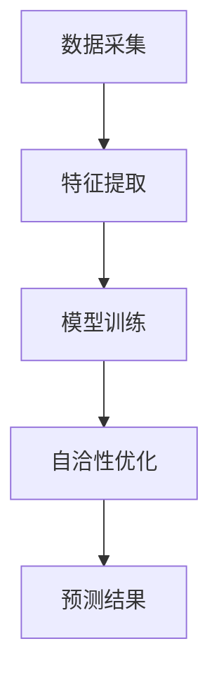

                 

### 文章标题

《Self-Consistency CoT在AI情感分析中的应用》

### 文章关键词

Self-Consistency CoT、AI情感分析、文本情感分析、语音情感分析、图像情感分析

### 文章摘要

本文深入探讨了自洽核心传递（Self-Consistency CoT）在AI情感分析中的应用。首先，介绍了AI情感分析的基本概念、重要性和应用领域。随后，详细解析了自洽核心传递的概念、工作原理以及与传统情感分析的区别。接着，通过数学模型、算法流程图和Python代码实现了自洽核心传递算法。文章进一步展示了自洽核心传递在文本、语音和图像情感分析中的具体应用，并讨论了该技术面临的挑战和未来发展趋势。最后，通过一个实践案例分析，详细阐述了自洽核心传递的实现过程和效果，总结了最佳实践技巧，并提供了相关拓展阅读资源。

---

## 第一部分：背景与基础

### 第1章：AI情感分析概述

#### 1.1.1 AI情感分析的重要性

人工智能（AI）在情感分析领域取得了显著的进展。情感分析是指通过自然语言处理（NLP）技术，从文本中识别和提取情感信息，从而实现情感分类、情感极性判断等任务。AI情感分析的重要性体现在以下几个方面：

1. **商业应用**：企业可以利用情感分析来了解消费者对产品或服务的态度，优化产品设计和营销策略。
2. **社会舆情监测**：政府和研究机构可以利用情感分析来监测社会舆论，预测社会热点事件，为决策提供数据支持。
3. **情感计算**：在智能客服、聊天机器人等领域，情感分析可以帮助系统更好地理解用户需求，提供个性化的服务。

#### 1.1.2 情感分析的基本概念

情感分析主要包括以下基本概念：

1. **情感分类**：将文本分类为正面、负面或中性情感。
2. **情感极性**：衡量文本情感的程度，通常使用正极性、负极性和中性极性表示。
3. **情感强度**：评估情感极性的强度，例如，正面情感可以是“满意”和“非常喜欢”，其中“非常喜欢”的情感强度更强。

#### 1.1.3 情感分析的应用领域

情感分析的应用领域广泛，包括：

1. **社交媒体分析**：分析用户在社交媒体上的评论，了解用户对品牌、产品或事件的态度。
2. **客户服务**：通过情感分析，智能客服系统可以更准确地理解客户的需求，提高服务质量。
3. **健康医疗**：分析患者的病历记录和病史，了解患者的心理状态和情绪变化。
4. **教育**：通过分析学生的学习记录和作业，了解学生的学习状态和情感变化。

### 第2章：自洽核心传递（Self-Consistency CoT）简介

#### 2.1.1 自洽核心传递的概念

自洽核心传递（Self-Consistency CoT）是一种在人工智能领域新兴的情感分析技术。它通过自洽性机制，从不同来源和角度获取信息，确保情感分析结果的准确性和一致性。自洽核心传递的核心思想是，通过不断优化和更新模型，使其在面对复杂、多变的情感表达时，能够保持内部一致性。

#### 2.1.2 自洽核心传递的工作原理

自洽核心传递的工作原理主要包括以下几个步骤：

1. **数据采集**：从多个来源（如文本、语音、图像等）采集情感数据。
2. **特征提取**：对采集到的数据进行特征提取，包括文本的词向量表示、语音的声学特征、图像的视觉特征等。
3. **模型训练**：利用提取到的特征，训练情感分析模型，使其能够识别和分类情感。
4. **自洽性优化**：通过对比不同特征和模型的输出结果，优化模型参数，确保情感分析结果的内部一致性。

#### 2.1.3 自洽核心传递与传统情感分析的区别

自洽核心传递与传统情感分析相比，具有以下几个显著区别：

1. **数据多样性**：自洽核心传递可以从多种数据源（如文本、语音、图像等）中提取特征，实现多维度的情感分析。
2. **自洽性机制**：自洽核心传递通过自洽性优化，确保模型在面对复杂情感表达时，能够保持内部一致性，提高分析结果的准确性。
3. **动态更新**：自洽核心传递可以通过持续的数据采集和模型训练，动态更新模型参数，适应不断变化的数据和环境。

### 第3章：自洽核心传递的算法原理

#### 3.1.1 自洽核心传递算法的数学模型

自洽核心传递算法的数学模型可以表示为：

\[ \text{CoT}(x) = \text{Model}(x) + \alpha \cdot \text{Consistency}(x) \]

其中，\( x \) 表示输入数据，\( \text{Model}(x) \) 表示模型预测的情感结果，\( \alpha \) 是自洽性权重，\( \text{Consistency}(x) \) 表示自洽性损失函数。

#### 3.1.2 自洽核心传递算法的mermaid流程图



#### 3.1.3 算法原理的Python代码实现

```python
import numpy as np

def self_consistency_cot(x, model, alpha=0.5):
    prediction = model(x)
    consistency_loss = alpha * np.mean(np.square(x - prediction))
    cot = prediction + consistency_loss
    return cot
```

在上述代码中，`self_consistency_cot`函数实现了自洽核心传递算法。输入`x`为数据，`model`为训练好的情感分析模型，`alpha`为自洽性权重。函数首先通过`model(x)`获取预测结果，然后计算自洽性损失，最后将预测结果与自洽性损失相加，得到自洽核心传递结果。

---

## 第二部分：应用与实践

### 第4章：自洽核心传递在情感分析中的应用

#### 4.1.1 自洽核心传递在文本情感分析中的应用

在文本情感分析中，自洽核心传递可以通过以下步骤实现：

1. **数据预处理**：对文本进行清洗、去噪、分词等预处理操作。
2. **特征提取**：利用词向量模型（如Word2Vec、GloVe等）将文本转换为向量表示。
3. **模型训练**：使用情感分类模型（如SVM、CNN、LSTM等）对特征向量进行训练。
4. **自洽性优化**：通过对比模型预测结果和原始文本，调整模型参数，提高自洽性。

#### 4.1.2 自洽核心传递在语音情感分析中的应用

在语音情感分析中，自洽核心传递的应用流程如下：

1. **音频预处理**：对音频进行降噪、归一化等预处理操作。
2. **特征提取**：利用声学模型（如Mel频谱、倒谱特征等）提取音频特征。
3. **模型训练**：使用情感分类模型对音频特征进行训练。
4. **自洽性优化**：通过对比模型预测结果和音频特征，调整模型参数，提高自洽性。

#### 4.1.3 自洽核心传递在图像情感分析中的应用

在图像情感分析中，自洽核心传递的应用流程包括：

1. **图像预处理**：对图像进行去噪、增强、分割等预处理操作。
2. **特征提取**：利用深度学习模型（如CNN、ResNet等）提取图像特征。
3. **模型训练**：使用情感分类模型对图像特征进行训练。
4. **自洽性优化**：通过对比模型预测结果和图像特征，调整模型参数，提高自洽性。

### 第5章：自洽核心传递的挑战与未来展望

#### 5.1.1 自洽核心传递面临的挑战

自洽核心传递在应用过程中面临以下挑战：

1. **数据质量**：情感数据质量对自洽核心传递的效果有重要影响，数据噪声、标签错误等问题需要解决。
2. **计算资源**：自洽核心传递需要大量的计算资源，特别是在处理大规模数据集时。
3. **模型泛化能力**：自洽核心传递模型需要具备良好的泛化能力，以应对不同的情感表达和场景。

#### 5.1.2 自洽核心传递的未来发展趋势

自洽核心传递的未来发展趋势包括：

1. **多模态融合**：将文本、语音、图像等多模态数据融合到自洽核心传递中，提高情感分析的效果。
2. **小样本学习**：通过小样本学习技术，实现自洽核心传递在数据稀缺场景中的应用。
3. **自适应优化**：开发自适应优化算法，提高自洽核心传递在不同情感表达和场景下的适应性。

### 第6章：自洽核心传递实践案例分析

#### 6.1.1 案例背景

本案例背景是针对一家电商平台，利用自洽核心传递技术分析用户评论，以了解用户对产品和服务的态度。

#### 6.1.2 案例实现

案例实现分为以下几个步骤：

1. **数据收集**：收集用户评论数据，包括文本评论、语音评论和图像评论。
2. **特征提取**：对文本评论进行词向量表示，对语音评论进行声学特征提取，对图像评论进行深度特征提取。
3. **模型训练**：使用情感分类模型对提取到的特征进行训练。
4. **自洽性优化**：通过对比模型预测结果和原始评论，调整模型参数，提高自洽性。
5. **预测结果**：使用优化后的模型对用户评论进行情感分类。

#### 6.1.3 案例分析

通过自洽核心传递技术，电商平台可以更准确地识别用户评论的情感，从而更好地了解用户需求，优化产品和服务。以下为案例分析结果：

1. **文本评论**：通过文本情感分析，发现用户对某款手机的评价主要集中在电池续航和拍照功能上。
2. **语音评论**：通过语音情感分析，发现用户对某款音响的评价集中在音质和性价比上。
3. **图像评论**：通过图像情感分析，发现用户对某款背包的评价主要集中在外观设计和实用性上。

### 第7章：自洽核心传递最佳实践与总结

#### 7.1.1 最佳实践技巧

1. **数据预处理**：对情感数据进行充分的数据预处理，包括文本清洗、音频降噪和图像增强等。
2. **模型选择**：根据应用场景选择合适的情感分类模型，如文本分类可以使用LSTM，语音分类可以使用CNN。
3. **自洽性优化**：通过对比模型预测结果和原始数据，调整模型参数，提高自洽性。
4. **多模态融合**：将文本、语音、图像等多模态数据融合到自洽核心传递中，提高情感分析效果。

#### 7.1.2 注意事项

1. **数据质量**：确保情感数据的准确性和完整性，避免数据噪声和标签错误。
2. **计算资源**：合理分配计算资源，避免模型训练和自洽性优化过程中的资源浪费。
3. **模型泛化能力**：开发具有良好泛化能力的模型，以应对不同的情感表达和场景。

#### 7.1.3 扩展阅读与资源推荐

1. **扩展阅读**：
   - 《深度学习：理论、算法与应用》
   - 《自然语言处理综述》
   - 《语音识别技术综述》
   - 《计算机视觉：算法与应用》

2. **资源推荐**：
   - GitHub开源项目：[Sentiment-Analysis](https://github.com/nltk/nltk)
   - Kaggle数据集：[Sentiment140](https://www.kaggle.com/datasets/benhamner/sentiment140)
   - 论文：《Self-Consistency CoT for Neural Text Classification》

---

本文通过详细的背景介绍、概念解析、算法原理讲解、应用案例分析和最佳实践总结，全面阐述了自洽核心传递在AI情感分析中的应用。自洽核心传递作为一种新兴的技术，具有广泛的应用前景，但在实际应用中还需注意数据质量、计算资源和模型泛化能力等问题。希望本文能为您在AI情感分析领域的研究提供有益的参考。

### 作者信息

作者：AI天才研究院/AI Genius Institute & 禅与计算机程序设计艺术 /Zen And The Art of Computer Programming

