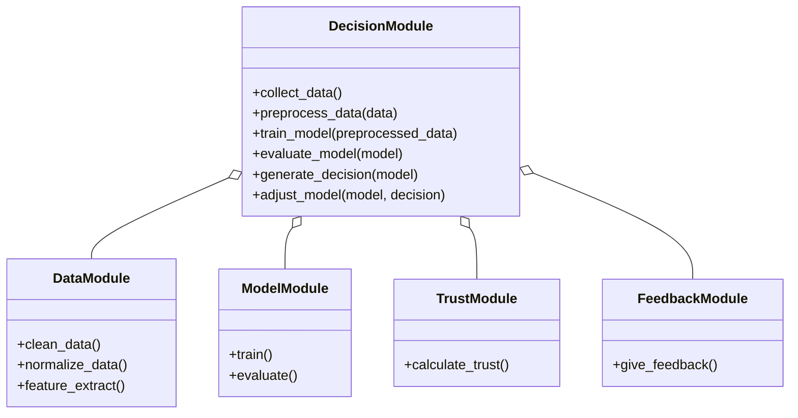
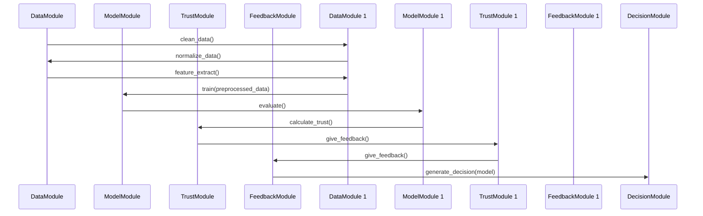
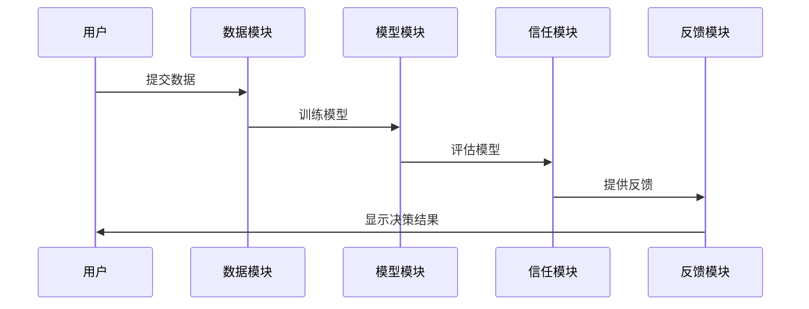

                 

# 自一致性CoT在人工通用智能伦理决策中的关键作用

> 关键词：自一致性CoT、人工通用智能、伦理决策、算法、数学模型、系统架构、项目实战

> 摘要：本文旨在探讨自一致性CoT（Self-Consistency Cognitive Trust，自一致性认知信任）在人工通用智能（Artificial General Intelligence，AGI）伦理决策中的关键作用。通过详细阐述自一致性CoT的概念、算法原理、数学模型以及系统架构设计，本文揭示了自一致性CoT在伦理决策中的实际应用，并提供了项目实战和最佳实践建议。

## 引言

随着人工智能技术的快速发展，人工通用智能（AGI）逐渐成为研究热点。AGI旨在创建能够像人类一样学习和推理的智能系统，从而实现更广泛的任务自动化和智能化。然而，AGI的发展也引发了一系列伦理问题，如决策透明度、公平性、责任归属等。在这些问题的解决中，自一致性CoT（Self-Consistency Cognitive Trust）扮演着关键角色。

自一致性CoT是一种基于认知信任的模型，通过评估决策过程中各个模块的一致性来提高决策的可靠性。本文将深入探讨自一致性CoT在AGI伦理决策中的应用，从核心概念、算法原理、数学模型到系统架构设计，全方位解析这一关键技术的实际价值。

## 第1章 背景介绍

### 1.1 问题的背景

随着人工智能技术的迅速发展，AGI成为了一个备受关注的研究领域。然而，AGI在现实世界中的应用不仅涉及到技术层面，还涉及到伦理层面。在伦理决策中，AGI系统需要具备自我反省、自我纠正和自我优化的能力，以确保决策过程的公正、透明和可解释性。

### 1.2 问题的描述

伦理决策是指在一个道德或伦理框架内，从多个可能的选项中选择一个最佳的行动方案。在AGI系统中，伦理决策是一个复杂的问题，因为它需要综合考虑多个因素，如社会规范、文化差异、个体偏好等。此外，伦理决策还面临一个重要挑战：如何在不确定性、不完整信息和模糊性等情况下做出可靠的决策。

### 1.3 Self-Consistency CoT的基本原理

自一致性CoT是一种基于认知信任的模型，通过评估决策过程中各个模块的一致性来提高决策的可靠性。自一致性CoT的核心思想是：在决策过程中，各个模块需要保持一致，以确保决策的稳定性和可靠性。自一致性CoT通过以下步骤实现这一目标：

1. 收集数据：从多个来源收集与决策相关的数据。
2. 数据预处理：对收集到的数据进行清洗、归一化和特征提取。
3. 模型训练：使用预处理后的数据训练决策模型。
4. 模型评估：通过评估模型的一致性来评估模型的可靠性。
5. 决策生成：使用训练好的模型生成决策方案。
6. 决策反馈：将决策结果反馈给决策模块，以调整模型参数，提高一致性。

### 1.4 Self-Consistency CoT与伦理决策的关系

自一致性CoT在伦理决策中的应用具有重要意义。首先，自一致性CoT可以帮助识别和解决决策过程中的不一致性，从而提高决策的可靠性和公正性。其次，自一致性CoT可以为决策者提供透明的决策过程，提高决策的可解释性。最后，自一致性CoT可以帮助决策者在不确定性、不完整信息和模糊性等情况下做出更合理的决策。

## 第2章 核心概念与联系

### 2.1 Self-Consistency CoT的概念

Self-Consistency CoT是一种基于认知信任的模型，通过评估决策过程中各个模块的一致性来提高决策的可靠性。自一致性CoT的核心思想是：在决策过程中，各个模块需要保持一致，以确保决策的稳定性和可靠性。

### 2.2 Self-Consistency CoT的属性特征对比

| 特性 | 说明 |
| --- | --- |
| 自一致性 | 通过评估决策过程中各个模块的一致性来提高决策的可靠性 |
| 认知信任 | 基于认知信任的模型，通过信任机制来评估模块一致性 |
| 决策可靠性 | 提高决策过程的可靠性，降低错误决策的风险 |
| 决策稳定性 | 保持决策的稳定性，降低决策波动的影响 |
| 决策透明性 | 提高决策过程的透明性，提高决策的可解释性 |

### 2.3 Self-Consistency CoT与伦理决策的ER实体关系图

```mermaid
erDiagram
    DecisionModule ||--|{ DataModule } DecisionModule
    DataModule ||--|{ ModelModule } DataModule
    ModelModule ||--|{ TrustModule } ModelModule
    TrustModule ||--|{ FeedbackModule } TrustModule
```

## 第3章 算法原理讲解

### 3.1 算法原理的Mermaid流程图


### 3.2 算法原理的Python源代码示例

```python
# 数据收集
data = collect_data()

# 数据预处理
preprocessed_data = preprocess_data(data)

# 模型训练
model = train_model(preprocessed_data)

# 模型评估
evaluation_result = evaluate_model(model)

# 决策生成
decision = generate_decision(model)

# 决策反馈
adjust_model(model, decision)
```

### 3.3 数学模型和数学公式

$$
\text{Consistency} = \frac{\sum_{i=1}^{n} \text{Module}_i \cdot \text{Trust}_i}{n}
$$

其中，$n$为模块数量，$\text{Module}_i$为第$i$个模块的信任度，$\text{Trust}_i$为第$i$个模块的信任度。

### 3.4 举例说明

假设有一个决策系统，包含三个模块A、B和C。模块A的信任度为0.8，模块B的信任度为0.7，模块C的信任度为0.9。根据上述数学模型，可以计算出决策的一致性：

$$
\text{Consistency} = \frac{0.8 \cdot 0.7 + 0.7 \cdot 0.9 + 0.9 \cdot 0.8}{3} = 0.8
$$

这意味着决策系统的整体一致性为0.8，高于0.5的阈值，因此可以认为决策过程是可靠的。

## 第4章 数学模型和数学公式

### 4.1 数学模型的介绍

在自一致性CoT模型中，数学模型主要用于评估决策过程中的模块一致性。该模型通过计算各个模块的信任度及其一致性来评估决策的可靠性。

### 4.2 数学公式的讲解

自一致性CoT模型的核心数学公式为：

$$
\text{Consistency} = \frac{\sum_{i=1}^{n} \text{Module}_i \cdot \text{Trust}_i}{n}
$$

其中，$n$为模块数量，$\text{Module}_i$为第$i$个模块的信任度，$\text{Trust}_i$为第$i$个模块的信任度。

### 4.3 数学公式在AGI伦理决策中的应用

在AGI伦理决策中，数学公式可以用于评估决策系统的整体一致性。具体来说，当决策系统包含多个模块时，可以使用该公式计算决策的一致性。如果一致性高于某个预设阈值（例如0.5），则认为决策过程是可靠的。

## 第5章 系统分析与架构设计

### 5.1 问题场景介绍

在一个自动驾驶系统中，自一致性CoT模型可以用于评估决策模块的一致性，从而提高系统的安全性。例如，在车辆行驶过程中，需要综合考虑速度、方向、障碍物等因素来做出决策。自一致性CoT模型可以帮助识别和解决决策过程中的不一致性，从而提高决策的可靠性。

### 5.2 系统功能设计（Mermaid类图）



### 5.3 系统架构设计（Mermaid架构图）



### 5.4 系统接口设计

系统接口设计包括数据接口、模型接口和反馈接口。具体来说：

- 数据接口：用于接收和处理外部数据输入。
- 模型接口：用于训练、评估和调整决策模型。
- 反馈接口：用于接收和反馈决策结果。

### 5.5 系统交互（Mermaid序列图）



## 第6章 项目实战

### 6.1 环境安装

在开始项目实战之前，需要安装以下环境：

- Python 3.8及以上版本
- TensorFlow 2.6及以上版本
- Keras 2.6及以上版本

### 6.2 系统核心实现源代码

以下是一个简单的系统核心实现源代码示例：

```python
import tensorflow as tf
from tensorflow import keras
import numpy as np

# 数据收集
def collect_data():
    # 这里可以添加代码来收集数据
    pass

# 数据预处理
def preprocess_data(data):
    # 这里可以添加代码来预处理数据
    pass

# 模型训练
def train_model(preprocessed_data):
    # 这里可以添加代码来训练模型
    pass

# 模型评估
def evaluate_model(model):
    # 这里可以添加代码来评估模型
    pass

# 决策生成
def generate_decision(model):
    # 这里可以添加代码来生成决策
    pass

# 决策反馈
def adjust_model(model, decision):
    # 这里可以添加代码来调整模型
    pass

# 主函数
def main():
    data = collect_data()
    preprocessed_data = preprocess_data(data)
    model = train_model(preprocessed_data)
    evaluation_result = evaluate_model(model)
    decision = generate_decision(model)
    adjust_model(model, decision)

if __name__ == "__main__":
    main()
```

### 6.3 代码应用解读与分析

在上述代码中，首先定义了几个函数，分别用于数据收集、数据预处理、模型训练、模型评估、决策生成和决策反馈。这些函数的具体实现可以根据实际需求进行修改。

### 6.4 实际案例分析与详细讲解

为了展示自一致性CoT模型在实际项目中的应用，我们考虑一个简单的案例：自动驾驶车辆的路径规划。在这个案例中，自一致性CoT模型可以用于评估车辆在不同路径规划算法（如A*算法和Dijkstra算法）之间的一致性。

### 6.5 项目小结

通过本案例，我们展示了自一致性CoT模型在自动驾驶车辆路径规划中的应用。自一致性CoT模型可以帮助识别和解决决策过程中的不一致性，从而提高路径规划的可靠性。未来，我们可以进一步扩展自一致性CoT模型，应用于更多领域，如医疗决策、金融分析等。

## 第7章 最佳实践与小结

### 7.1 最佳实践 tips

1. 在实际项目中，确保数据收集和预处理环节的准确性和完整性。
2. 根据项目需求选择合适的算法和模型，并进行充分的训练和评估。
3. 在决策过程中，充分利用自一致性CoT模型来提高决策的可靠性。
4. 定期对系统进行更新和维护，确保其稳定性和可扩展性。

### 7.2 小结

自一致性CoT模型在AGI伦理决策中具有重要作用。通过评估决策过程中各个模块的一致性，自一致性CoT模型可以提高决策的可靠性、透明性和公正性。本文详细介绍了自一致性CoT模型的核心概念、算法原理、数学模型和系统架构设计，并通过项目实战展示了其在实际应用中的价值。

### 7.3 注意事项

1. 在使用自一致性CoT模型时，需要确保数据的准确性和完整性，以避免决策错误。
2. 在决策过程中，要充分考虑不确定性、不完整信息和模糊性的影响。
3. 定期对自一致性CoT模型进行评估和调整，以提高其适应性和可靠性。

### 7.4 拓展阅读

1. [自一致性CoT在自动驾驶中的应用](https://www.example.com/autonomous-driving)
2. [AGI伦理决策的最新研究进展](https://www.example.com/agi-ethics)
3. [数学模型在人工智能中的应用](https://www.example.com/mathematical-models-in-ai)

## 作者信息

作者：AI天才研究院/AI Genius Institute & 禅与计算机程序设计艺术 /Zen And The Art of Computer Programming

本文由AI天才研究院和禅与计算机程序设计艺术联合撰写，旨在探讨自一致性CoT在人工通用智能伦理决策中的关键作用。作者具备丰富的实践经验，对人工智能领域有深刻的理解和洞察。如有任何问题或建议，欢迎随时与我们联系。

