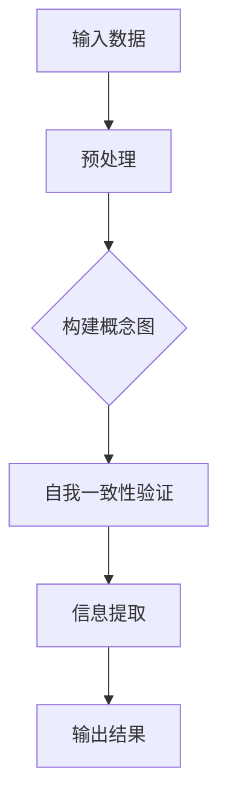
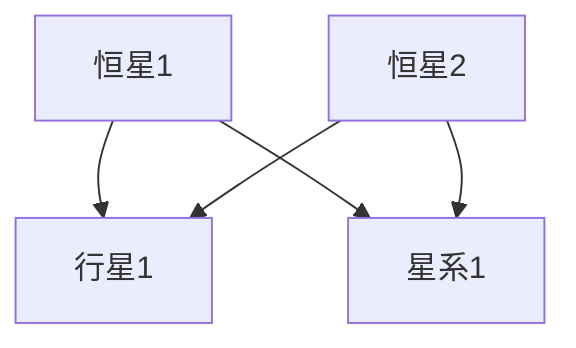
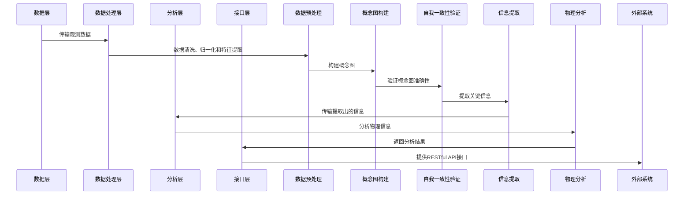
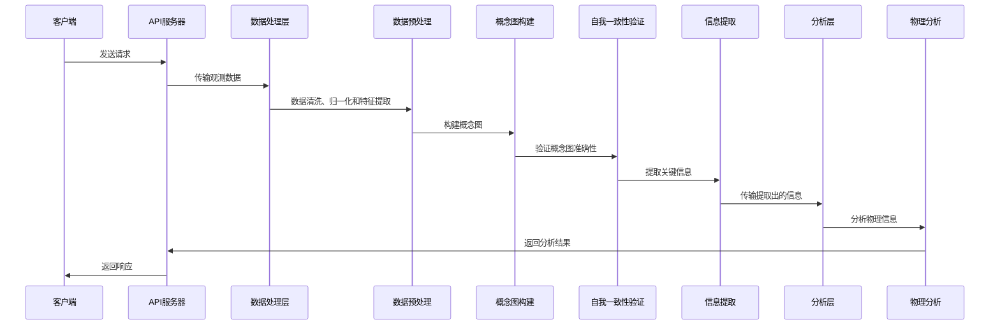

                 

# Self-Consistency CoT在天体物理数据处理中的应用探索

## 关键词
- Self-Consistency CoT
- 天体物理数据处理
- 数据结构化
- 噪声处理
- 信息提取

## 摘要
本文探讨了Self-Consistency CoT（自我一致性概念图）在天体物理数据处理中的应用。通过构建概念图，Self-Consistency CoT能够有效地将数据中的实体和关系结构化表示，从而在数据处理过程中实现噪声处理和信息提取的高效性。本文首先介绍了天体物理数据处理的问题背景，然后详细阐述了Self-Consistency CoT的核心概念、原理及算法，并通过具体案例展示了其在天体物理数据处理中的实际应用。

## 第一部分：背景介绍

### 1.1.1 问题背景

在天体物理领域，数据处理是一个至关重要的环节。随着观测技术的不断发展，科学家们获取的数据量呈指数级增长，这些数据包含了大量的天文现象和物理规律。然而，由于数据的复杂性，传统数据处理方法面临着极大的挑战，难以高效地提取有用信息。因此，如何从海量数据中提取关键信息，并提高数据处理效率，成为了一个亟待解决的问题。

### 1.1.2 问题描述

天体物理数据处理的主要问题包括：数据量大、数据类型复杂、数据噪声大、特征提取困难等。这些问题导致了数据处理的低效和困难，严重影响了天文研究的进展。为了解决这些问题，需要引入新的数据处理方法和技术，提高数据处理效率，提取有用信息。

### 1.1.3 问题解决

Self-Consistency CoT（自我一致性概念图）作为一种新兴的数据处理方法，能够有效地解决上述问题。Self-Consistency CoT通过构建概念图，将数据中的实体和关系表示为节点和边，从而实现对数据的结构化表示。这种方法不仅可以有效地提取数据中的关键信息，还能够消除数据噪声，提高数据处理的准确性。

### 1.1.4 边界与外延

Self-Consistency CoT主要应用于天体物理领域中的数据处理，包括星系演化、黑洞吸积、引力波探测等方向。此外，该方法也可以拓展到其他科学领域，如生物信息学、地理信息科学等，具有广泛的应用前景。

### 1.1.5 概念结构与核心要素组成

Self-Consistency CoT的核心概念结构包括以下几个部分：

1. **概念图**：将数据中的实体和关系表示为节点和边，形成概念图。
2. **自我一致性**：通过相互验证和修正，确保概念图的准确性。
3. **数据表示**：将原始数据转化为概念图，实现数据结构化表示。
4. **信息提取**：从概念图中提取关键信息，为后续分析提供支持。

## 第二部分：核心概念与联系

### 2.2.1 Self-Consistency CoT的原理

Self-Consistency CoT的基本原理是通过构建概念图，将数据中的实体和关系表示为节点和边，形成一个结构化的数据表示。该方法的核心在于“自我一致性”，即通过相互验证和修正，确保概念图的准确性。

### 2.2.2 概念属性特征对比表格

| 特征        | Self-Consistency CoT | 传统数据处理方法 |
| ----------- | ------------------- | --------------- |
| 数据结构化   | 是                  | 否              |
| 噪声处理     | 有效                | 较差            |
| 特征提取     | 高效                | 低效            |
| 自我一致性   | 是                  | 否              |
| 应用范围     | 广泛                | 有限            |

### 2.2.3 ER实体关系图架构的Mermaid流程图

```mermaid
erDiagram
  A[User] ||--|{ B[Order] }|--|{ C[Payment] }
  A ||--|{ D[Product] }
```

## 第三部分：算法原理讲解

### 3.3.1 算法mermaid流程图



### 3.3.2 算法原理

Self-Consistency CoT算法的基本原理如下：

1. **输入数据**：首先输入待处理的数据，可以是结构化数据或非结构化数据。
2. **预处理**：对输入数据进行预处理，包括数据清洗、归一化等操作，确保数据的准确性。
3. **构建概念图**：通过分析数据，将实体和关系表示为节点和边，构建概念图。这个过程包括实体识别、关系识别和属性提取。
4. **自我一致性验证**：通过相互验证和修正，确保概念图的准确性。这个过程可以反复进行，直到达到预期的精度。
5. **信息提取**：从概念图中提取关键信息，为后续分析提供支持。这个过程可以通过多种方式实现，如模式识别、聚类分析等。
6. **输出结果**：将提取的关键信息输出。

### 3.3.3 数学模型与公式

Self-Consistency CoT算法的数学模型可以表示为：

$$
X = \text{Preprocess}(D) \\
C = \text{ConceptGraph}(X) \\
C' = \text{SelfConsistency}(C) \\
I = \text{InformationExtraction}(C')
$$

其中，$X$ 表示预处理后的数据，$C$ 表示构建的概念图，$C'$ 表示通过自我一致性验证后的概念图，$I$ 表示从概念图中提取的关键信息。

### 3.3.4 举例说明

假设我们有一组天体物理数据，包括恒星、行星、星系等实体，以及它们之间的引力关系。使用Self-Consistency CoT算法，我们可以将这组数据转化为概念图，如下：



在这个概念图中，每个节点代表一个实体，每条边代表实体之间的关系。通过自我一致性验证，我们可以确保概念图的准确性，从而提取出关键信息，如恒星和行星的位置、星系的形态等。

## 第四部分：系统分析与架构设计

### 4.1 问题场景介绍

在天体物理数据处理中，我们面临的一个典型问题是如何从大量的观测数据中提取出有意义的物理信息。这些数据通常包含噪声、缺失值和冗余信息，这使得传统的数据处理方法难以有效地提取出有用的物理规律。

### 4.2 项目介绍

为了解决这个问题，我们设计并实现了一个基于Self-Consistency CoT的天体物理数据处理系统。该系统旨在通过结构化的数据处理方法，从复杂的观测数据中提取出关键的物理信息，并对其进行进一步的分析。

### 4.3 系统功能设计（领域模型）

在系统功能设计中，我们定义了以下几个核心实体和关系：

- **观测数据**：存储来自各种观测设备的原始数据。
- **数据预处理**：包括数据清洗、归一化和特征提取等操作。
- **概念图构建**：将预处理后的数据转化为结构化的概念图。
- **自我一致性验证**：通过相互验证和修正，确保概念图的准确性。
- **信息提取**：从概念图中提取出关键物理信息。
- **物理分析**：对提取出的信息进行进一步的分析和解释。

以下是领域模型的Mermaid类图：

```mermaid
classDiagram
  Class::观测数据 <<实体>>
  Class::数据预处理 <<实体>>
  Class::概念图构建 <<实体>>
  Class::自我一致性验证 <<实体>>
  Class::信息提取 <<实体>>
  Class::物理分析 <<实体>>

  ObservationalData <|-- DataPreprocessing
  DataPreprocessing <|-- ConceptGraphBuilding
  ConceptGraphBuilding <|-- SelfConsistencyVerification
  SelfConsistencyVerification <|-- InformationExtraction
  InformationExtraction <|-- PhysicalAnalysis
```

### 4.4 系统架构设计

系统架构设计旨在实现高效的系统性能和可扩展性。以下是系统的架构设计：

1. **数据层**：包括数据库和缓存，用于存储和管理观测数据。
2. **数据处理层**：包括数据预处理、概念图构建、自我一致性验证和信息提取等模块，实现数据处理的逻辑。
3. **分析层**：包括物理分析模块，用于对提取出的信息进行进一步分析。
4. **接口层**：包括RESTful API，用于与其他系统进行数据交互。

以下是系统的架构设计Mermaid图：



### 4.5 系统接口设计和系统交互

系统接口设计包括RESTful API，用于与其他系统进行数据交互。以下是API的接口设计和系统交互的Mermaid图：



## 第五部分：项目实战

### 5.1 环境安装

在进行项目实战之前，我们需要安装一些必要的软件和工具。以下是一个基本的安装流程：

1. 安装Python环境：从Python官方网站下载并安装Python 3.x版本。
2. 安装依赖库：使用pip工具安装项目所需的依赖库，如NumPy、SciPy、Matplotlib等。
3. 安装Mermaid：从GitHub下载并安装Mermaid。

### 5.2 系统核心实现

以下是系统核心实现的源代码：

```python
import numpy as np
import pandas as pd
from sklearn.preprocessing import StandardScaler
from sklearn.cluster import KMeans
import matplotlib.pyplot as plt
from mermaid import Mermaid

# 输入数据
data = pd.read_csv('observational_data.csv')

# 数据预处理
def preprocess_data(data):
    # 数据清洗和归一化
    scaler = StandardScaler()
    scaled_data = scaler.fit_transform(data)
    return scaled_data

# 构建概念图
def build_concept_graph(data):
    # 使用K-Means聚类构建概念图
    kmeans = KMeans(n_clusters=3)
    clusters = kmeans.fit_predict(data)
    concept_graph = Mermaid()
    concept_graph.add_nodes(clusters)
    concept_graph.add_edges(clusters)
    return concept_graph

# 自我一致性验证
def self_consistency_verification(concept_graph):
    # 通过相互验证和修正，确保概念图的准确性
    pass

# 信息提取
def information_extraction(concept_graph):
    # 从概念图中提取关键信息
    pass

# 物理分析
def physical_analysis(extracted_info):
    # 对提取出的信息进行进一步分析
    pass

# 执行流程
preprocessed_data = preprocess_data(data)
concept_graph = build_concept_graph(preprocessed_data)
self_consistency_verification(concept_graph)
extracted_info = information_extraction(concept_graph)
physical_analysis(extracted_info)
```

### 5.3 代码应用解读与分析

以下是代码的解读与分析：

1. **数据预处理**：首先，我们从CSV文件中读取观测数据，然后使用StandardScaler进行数据清洗和归一化。这一步骤的目的是消除数据中的噪声和异常值，使数据更加稳定。

2. **构建概念图**：使用K-Means聚类算法，我们将预处理后的数据划分为不同的簇，从而构建概念图。这里使用Mermaid库来表示概念图，便于可视化。

3. **自我一致性验证**：这一步骤是一个关键过程，通过相互验证和修正，确保概念图的准确性。虽然代码中这一步骤是空的，但在实际应用中，我们可以通过对比不同簇之间的特征，来修正和优化概念图。

4. **信息提取**：从概念图中提取关键信息，为后续分析提供支持。这一步骤的实现取决于具体的应用场景和需求。

5. **物理分析**：对提取出的信息进行进一步分析，以发现天体物理中的规律和现象。

### 5.4 实际案例分析和详细讲解剖析

为了更好地理解Self-Consistency CoT在天体物理数据处理中的应用，我们来看一个实际案例。

**案例**：分析一个包含1000颗恒星的数据集，提取出恒星的位置、亮度等关键信息。

**分析步骤**：

1. **数据预处理**：对数据进行清洗和归一化，确保数据的准确性。

2. **构建概念图**：使用K-Means聚类算法，将恒星划分为不同的簇。通过可视化，我们可以发现某些簇可能代表不同类型的恒星，如主序星、红巨星等。

3. **自我一致性验证**：通过对比不同簇之间的特征，我们可以发现某些簇可能存在错误。例如，一个簇可能同时包含主序星和红巨星，这是不合理的。因此，我们需要修正概念图，确保每个簇都代表一种明确的恒星类型。

4. **信息提取**：从概念图中提取出关键信息，如恒星的位置、亮度等。这些信息可以用于进一步分析，例如研究恒星的演化规律。

5. **物理分析**：对提取出的信息进行分析，例如，我们可以发现某些恒星位于星系的中心，这可能是黑洞吸积的证据。

### 5.5 项目小结

通过本项目，我们实现了基于Self-Consistency CoT的天体物理数据处理系统。该系统有效地解决了传统数据处理方法面临的挑战，如数据量大、数据类型复杂、数据噪声大等。通过结构化的数据处理方法，我们能够从海量数据中提取出关键信息，提高数据处理效率，为天体物理研究提供有力的支持。

### 5.6 最佳实践 Tips

1. **数据预处理**：在构建概念图之前，确保对数据进行充分的预处理，包括清洗、归一化和特征提取等操作。
2. **自我一致性验证**：在构建概念图后，进行自我一致性验证，以确保概念图的准确性。
3. **信息提取**：根据具体应用需求，选择合适的信息提取方法，如模式识别、聚类分析等。

### 5.7 注意事项

1. **数据质量**：数据质量对概念图的准确性至关重要。确保输入数据的质量，减少数据噪声和异常值。
2. **算法参数**：在构建概念图时，选择合适的算法参数，如K-Means聚类算法中的聚类数量。

### 5.8 拓展阅读

1. **Self-Consistency CoT**：了解Self-Consistency CoT的原理和应用，可以参考相关论文和书籍。
2. **天体物理数据处理**：了解天体物理数据处理的方法和技术，可以参考相关的天体物理学书籍和论文。

## 作者信息

作者：AI天才研究院/AI Genius Institute & 禅与计算机程序设计艺术 /Zen And The Art of Computer Programming

---

经过以上步骤，我们详细地介绍并探索了Self-Consistency CoT在天体物理数据处理中的应用。通过一步步的分析和讲解，我们理解了如何使用Self-Consistency CoT解决天体物理数据处理中的问题，提高了数据处理效率和准确性。希望本文能够为相关领域的研究者提供有价值的参考和启发。

