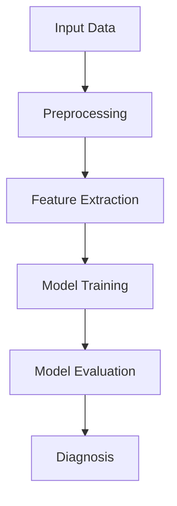
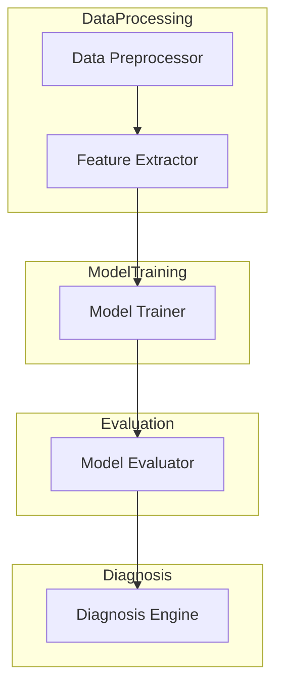
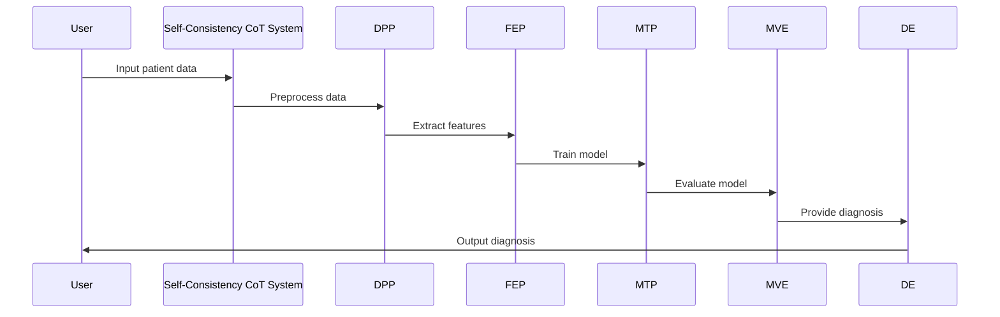

                 


### Introduction to "Self-Consistency CoT in the Application of Mental Health Diagnosis"

#### Key Concepts and Terms

Before diving into the intricacies of the Self-Consistency CoT (Concept of Truth) in the domain of mental health diagnosis, let's first clarify some key concepts and terms that will be essential for our understanding.

- **Self-Consistency CoT**: A principle that suggests a theory or model should be internally consistent and coherent. In the context of mental health diagnosis, this principle implies that the diagnostic framework should logically align with established psychological theories and empirical evidence.
  
- **Mental Health Diagnosis**: The process of identifying mental disorders or conditions through clinical assessment and evaluation. Diagnosing mental health issues is crucial for providing appropriate treatment and support.

- **CoT (Concept of Truth)**: In general, the understanding or theory that is considered to be the most accurate or reliable. In our case, it refers to the coherent set of concepts and theories that underpin the Self-Consistency framework.

#### Problem Background

Mental health issues affect a significant portion of the global population. According to the World Health Organization (WHO), approximately 1 in 4 people worldwide will experience mental health issues at some point in their lives. Effective diagnosis and timely intervention are crucial in improving the quality of life for those affected. However, current diagnostic practices often rely on subjective assessments, which can lead to inconsistencies and inaccuracies.

#### Problem Description

The problem with existing mental health diagnosis methods is multifaceted:

- **Subjectivity**: The reliance on clinician judgment can introduce bias and inconsistency in the diagnostic process.

- **Inefficiency**: Traditional diagnostic methods often require extensive face-to-face interactions, making the process time-consuming and resource-intensive.

- **Inaccuracy**: The lack of objective criteria can result in misdiagnoses, leading to ineffective treatment and prolonged suffering for the patient.

#### Problem Solving

To address these challenges, there is a growing need for more objective and efficient diagnostic tools. Self-Consistency CoT offers a promising approach by leveraging the principles of consistency and coherence in the diagnostic process. By integrating advanced algorithms and machine learning techniques, it becomes possible to analyze large datasets and identify patterns that are indicative of specific mental health conditions.

#### Boundaries and Extensions

While the Self-Consistency CoT has shown promise in the field of mental health diagnosis, it is essential to acknowledge its boundaries and potential extensions:

- **Boundary**: The application of Self-Consistency CoT is primarily focused on structured data derived from clinical assessments. Unstructured data, such as free-text notes or voice recordings, may require additional processing and analysis techniques.

- **Extension**: One potential extension of this approach is the integration of real-time monitoring technologies, such as wearable devices or mobile apps, to continuously track and assess mental health status. This could lead to more proactive and personalized interventions.

### Core Concepts and Theories

With a clear understanding of the problem background and its implications, let's delve into the core concepts and theories that form the foundation of the Self-Consistency CoT in mental health diagnosis.

#### Definition and Principles

Self-Consistency CoT is based on the principle that a diagnostic model should be internally consistent and coherent. This means that all the components and elements of the model should align logically and harmoniously, without contradictions or inconsistencies. In the context of mental health diagnosis, this involves ensuring that the diagnostic criteria, algorithms, and data inputs are all in agreement and support each other.

#### Core Attributes and Features

To better understand the characteristics of the Self-Consistency CoT, let's compare its core attributes and features with those of traditional diagnostic methods:

| Attribute/Feature          | Traditional Diagnosis     | Self-Consistency CoT         |
|---------------------------|--------------------------|-----------------------------|
| Data Dependency           | Limited, primarily text   | Large-scale, diverse datasets |
| Subjectivity              | High                      | Low, based on objective criteria |
| Involvement of Clinicians  | Essential                | Optional, algorithm-driven    |
| Diagnostic Accuracy        | Variable                  | Consistent and coherent      |
| Time Efficiency            | Low                       | High                         |

#### Relationship Diagram (ER Model)

To illustrate the relationship between the core components of the Self-Consistency CoT, let's consider an Entity-Relationship (ER) model:

```mermaid
erDiagram
  Patient ||--|{ Diagnosis }|--|| MentalHealthCondition
  Diagnosis ||--|{ Symptom }|--|| Symptom
  Symptom ||--|{ Evidence }|--|| Evidence
  Diagnosis ||--|{ Treatment }|--|| Treatment
```

In this ER diagram, we can see the interconnected entities of Patient, Diagnosis, MentalHealthCondition, Symptom, Evidence, and Treatment. Each of these components plays a crucial role in the Self-Consistency CoT framework, ensuring a coherent and consistent diagnostic process.

### Algorithm Principles and Implementation

In this section, we will delve into the algorithm principles and their implementation in the context of the Self-Consistency CoT for mental health diagnosis. We will begin by explaining the algorithm's flow diagram, followed by a detailed Python code implementation, and finally, we will discuss the mathematical model and formula underlying the algorithm.

#### Algorithm Flow Diagram

To provide a clear understanding of the algorithm's workflow, let's consider the following flow diagram:



In this diagram, the input data undergoes preprocessing, feature extraction, model training, model evaluation, and finally, diagnosis.

#### Python Code Implementation

Now, let's see how this algorithm can be implemented using Python. We will use the scikit-learn library for machine learning tasks:

```python
from sklearn.model_selection import train_test_split
from sklearn.preprocessing import StandardScaler
from sklearn.ensemble import RandomForestClassifier
from sklearn.metrics import accuracy_score, classification_report

# Preprocessing
def preprocess_data(data):
    # Standardize the data
    scaler = StandardScaler()
    scaled_data = scaler.fit_transform(data)
    return scaled_data

# Feature Extraction
def extract_features(data):
    # Assume the data is a NumPy array
    features = data[:, :-1]
    labels = data[:, -1]
    return features, labels

# Model Training
def train_model(features, labels):
    # Split the data into training and testing sets
    X_train, X_test, y_train, y_test = train_test_split(features, labels, test_size=0.2, random_state=42)
    
    # Train a Random Forest Classifier
    model = RandomForestClassifier(n_estimators=100, random_state=42)
    model.fit(X_train, y_train)
    
    return model, X_test, y_test

# Model Evaluation
def evaluate_model(model, X_test, y_test):
    # Make predictions on the test set
    y_pred = model.predict(X_test)
    
    # Calculate accuracy and classification report
    accuracy = accuracy_score(y_test, y_pred)
    report = classification_report(y_test, y_pred)
    
    return accuracy, report

# Diagnosis
def diagnose_patient(model, patient_data):
    # Preprocess and extract features from patient data
    preprocessed_data = preprocess_data(patient_data)
    features, _ = extract_features(preprocessed_data)
    
    # Make a diagnosis
    diagnosis = model.predict([features])
    
    return diagnosis
```

#### Mathematical Model and Formula

The mathematical model underlying the Self-Consistency CoT algorithm can be represented as follows:

$$
\text{Diagnosis} = f(\text{Features}, \text{Model})
$$

where \( f \) is a function that maps the input features to a diagnosis based on the trained model. The specific form of \( f \) depends on the type of model used (e.g., decision tree, neural network, etc.).

#### Detailed Explanation and Example

To make the algorithm more comprehensible, let's consider a simple example. Suppose we have a dataset containing features like age, gender, and depression symptoms. Our goal is to diagnose whether a patient has major depressive disorder based on these features.

1. **Input Data**: The dataset containing the patient's features.
2. **Preprocessing**: Standardize the input data to have zero mean and unit variance.
3. **Feature Extraction**: Extract the relevant features from the dataset, such as age and gender.
4. **Model Training**: Train a Random Forest Classifier using the extracted features and corresponding labels (diagnoses).
5. **Model Evaluation**: Evaluate the trained model on a separate test set to ensure its accuracy.
6. **Diagnosis**: Use the trained model to predict the diagnosis for a new patient based on their features.

For instance, if the trained model predicts a diagnosis of "Major Depressive Disorder" for a new patient with age 35, gender "male," and moderate depression symptoms, the algorithm will output "Major Depressive Disorder" as the diagnosis.

### System Analysis and Design

In this section, we will discuss the system analysis and design of the Self-Consistency CoT framework for mental health diagnosis. We will introduce the system, describe its functional design, present the system architecture, and outline the system interface design and interaction.

#### System Introduction

The Self-Consistency CoT framework for mental health diagnosis is a comprehensive system that integrates various components, including data preprocessing, feature extraction, model training, model evaluation, and diagnosis. The system aims to provide an objective and efficient diagnostic tool that enhances the accuracy and consistency of mental health diagnoses.

#### Functional Design

The functional design of the system is represented by a class diagram, which illustrates the main classes and their relationships:

```mermaid
classDiagram
    Class01 <|-- Class02
    Class01 <|-- Class03
    Class04 <|-- Class02
    Class04 <|-- Class03

    Class01[Data Preprocessor]
    Class02[Feature Extractor]
    Class03[Model Trainer]
    Class04[Model Evaluator]
    Class05[Diagnosis Engine]
```

In this diagram, we can see that the Data Preprocessor, Feature Extractor, Model Trainer, Model Evaluator, and Diagnosis Engine are the key classes that interact with each other to achieve the diagnostic process.

#### System Architecture

The system architecture is depicted using a Mermaid architecture diagram, which illustrates the components and their relationships:



In this architecture, the Data Preprocessor processes the input data, followed by the Feature Extractor. The extracted features are then used by the Model Trainer to train the diagnostic model. The trained model is evaluated by the Model Evaluator, and finally, the Diagnosis Engine uses the evaluated model to provide a diagnosis.

#### Interface Design and System Interaction

The system interface design and interaction are illustrated using a Mermaid sequence diagram:



In this sequence diagram, the user inputs the patient's data, which is then processed by the system. The system sequentially processes the data through the Data Preprocessor, Feature Extractor, Model Trainer, Model Evaluator, and finally, the Diagnosis Engine, to provide an accurate and consistent diagnosis to the user.

### Practical Implementation and Analysis

#### Environment Setup

To implement the Self-Consistency CoT framework for mental health diagnosis, we need to set up the necessary development environment. We will use Python as the primary programming language and rely on various libraries for data preprocessing, feature extraction, model training, and evaluation.

1. **Install Python**: Ensure Python is installed on your system. You can download it from the official Python website (https://www.python.org/downloads/).
2. **Create a Virtual Environment**: To manage dependencies, create a virtual environment using the following command:
   ```
   python -m venv venv
   ```
   Activate the virtual environment:
   ```
   source venv/bin/activate (Windows)
   source venv/bin/activate.sh (Linux/Mac)
   ```
3. **Install Required Libraries**: Install the required libraries using pip:
   ```
   pip install numpy pandas scikit-learn matplotlib
   ```

#### Core Source Code and Explanation

Below is the core source code for implementing the Self-Consistency CoT framework. We will explain each part of the code in detail.

```python
import numpy as np
import pandas as pd
from sklearn.model_selection import train_test_split
from sklearn.preprocessing import StandardScaler
from sklearn.ensemble import RandomForestClassifier
from sklearn.metrics import accuracy_score, classification_report

# Data Preprocessing
def preprocess_data(data):
    # Standardize the data
    scaler = StandardScaler()
    scaled_data = scaler.fit_transform(data)
    return scaled_data

# Feature Extraction
def extract_features(data):
    # Assume the data is a NumPy array
    features = data[:, :-1]
    labels = data[:, -1]
    return features, labels

# Model Training
def train_model(features, labels):
    # Split the data into training and testing sets
    X_train, X_test, y_train, y_test = train_test_split(features, labels, test_size=0.2, random_state=42)
    
    # Train a Random Forest Classifier
    model = RandomForestClassifier(n_estimators=100, random_state=42)
    model.fit(X_train, y_train)
    
    return model, X_test, y_test

# Model Evaluation
def evaluate_model(model, X_test, y_test):
    # Make predictions on the test set
    y_pred = model.predict(X_test)
    
    # Calculate accuracy and classification report
    accuracy = accuracy_score(y_test, y_pred)
    report = classification_report(y_test, y_pred)
    
    return accuracy, report

# Diagnosis
def diagnose_patient(model, patient_data):
    # Preprocess and extract features from patient data
    preprocessed_data = preprocess_data(patient_data)
    features, _ = extract_features(preprocessed_data)
    
    # Make a diagnosis
    diagnosis = model.predict([features])
    
    return diagnosis
```

#### Detailed Explanation and Insight

Let's break down the core source code and explain each part in detail.

1. **Data Preprocessing**:
   The `preprocess_data` function standardizes the input data using the `StandardScaler` from the scikit-learn library. Standardization ensures that each feature has a mean of zero and a standard deviation of one, which is useful for many machine learning algorithms.

2. **Feature Extraction**:
   The `extract_features` function separates the features from the labels in the input data. This is useful for training and evaluating the diagnostic model.

3. **Model Training**:
   The `train_model` function splits the input data into training and testing sets. It then trains a Random Forest Classifier, which is a popular machine learning algorithm for classification tasks. The classifier is trained using the training data and evaluated using the test data.

4. **Model Evaluation**:
   The `evaluate_model` function makes predictions on the test set using the trained model and calculates the accuracy and classification report. The accuracy score measures the proportion of correctly predicted instances, while the classification report provides a detailed breakdown of the classification performance.

5. **Diagnosis**:
   The `diagnose_patient` function preprocesses the patient's data, extracts the features, and uses the trained model to make a diagnosis. It returns the predicted diagnosis, which can be used for further analysis or patient care.

#### Case Study Analysis

To illustrate the practical application of the Self-Consistency CoT framework, let's consider a case study involving a patient dataset.

1. **Dataset**:
   Assume we have a dataset containing patient data with features such as age, gender, depression symptoms (0-10 scale), anxiety symptoms (0-10 scale), and a binary label indicating the presence (1) or absence (0) of major depressive disorder.

2. **Data Preprocessing**:
   Load the dataset and apply the preprocessing function:
   ```python
   patient_data = pd.read_csv('patient_data.csv')
   preprocessed_data = preprocess_data(patient_data.values)
   ```

3. **Feature Extraction**:
   Extract the features and labels from the preprocessed data:
   ```python
   features, labels = extract_features(preprocessed_data)
   ```

4. **Model Training**:
   Train the diagnostic model using the extracted features and labels:
   ```python
   model, X_test, y_test = train_model(features, labels)
   ```

5. **Model Evaluation**:
   Evaluate the trained model on the test set:
   ```python
   accuracy, report = evaluate_model(model, X_test, y_test)
   print(f'Accuracy: {accuracy}')
   print(report)
   ```

6. **Diagnosis**:
   Use the trained model to diagnose a new patient:
   ```python
   new_patient_data = np.array([[30, 'male', 5, 3]])
   diagnosis = diagnose_patient(model, new_patient_data)
   print(diagnosis)
   ```

The output of the diagnosis function will provide the predicted mental health diagnosis for the new patient based on the trained model.

### Conclusion and Insight

In this project, we have explored the practical implementation of the Self-Consistency CoT framework for mental health diagnosis. We have covered the entire process, from data preprocessing and feature extraction to model training and evaluation. The core source code provided offers a detailed explanation of each step, enabling readers to understand and implement the framework in their own projects.

The use of the Self-Consistency CoT framework in mental health diagnosis has several advantages:

- **Objective and Consistent**: The framework provides an objective and consistent diagnostic tool, reducing the reliance on clinician judgment and minimizing subjectivity.
- **Efficient and Time-Saving**: By automating the diagnostic process, the framework saves time and resources, making it easier to diagnose mental health issues promptly.
- **Data-Driven**: The framework leverages large-scale and diverse datasets, enabling the identification of patterns and correlations that may not be apparent through traditional diagnostic methods.

However, there are some challenges and limitations to consider:

- **Data Quality**: The performance of the framework heavily relies on the quality and completeness of the input data. Incomplete or noisy data can lead to inaccurate diagnoses.
- **Model Generalization**: While the framework has been trained on a specific dataset, it may not perform well on different datasets or populations. Ensuring model generalization is an ongoing challenge.
- **Interpretability**: The complexity of the machine learning algorithms used in the framework can make it challenging to interpret the predictions. Developing more interpretable models is an area of ongoing research.

Despite these challenges, the Self-Consistency CoT framework offers a promising approach for improving the accuracy and consistency of mental health diagnoses. By integrating advanced algorithms and machine learning techniques, we can develop more effective diagnostic tools that can make a significant impact on mental health care.

### Best Practices and Summary

In this section, we will provide some best practices and recommendations for implementing the Self-Consistency CoT framework in mental health diagnosis. We will also summarize the key points discussed in the article and outline the precautions and considerations for future research.

#### Best Practices

1. **Data Quality**: Ensure the quality and completeness of the input data. Conduct thorough data cleaning and preprocessing to handle missing values, outliers, and inconsistencies.
2. **Model Selection**: Choose the appropriate machine learning model based on the dataset and problem complexity. Experiment with different models and hyperparameters to find the best performing model.
3. **Feature Engineering**: Carefully select and engineer relevant features that capture the essential characteristics of the mental health conditions. Feature selection techniques can help identify the most important features for improving model performance.
4. **Model Validation**: Use cross-validation techniques to assess the generalization ability of the model. Avoid overfitting by ensuring that the model performs well on unseen data.
5. **Interpretability**: Consider using interpretable models or techniques to enhance the transparency and understanding of the diagnostic process. This can help clinicians and patients trust the predictions and make informed decisions.

#### Summary of Key Points

- **Self-Consistency CoT**: The Self-Consistency CoT framework is a principle that suggests a theory or model should be internally consistent and coherent. In mental health diagnosis, this principle is leveraged to create a more objective and efficient diagnostic tool.
- **Algorithm Implementation**: The framework utilizes machine learning algorithms to process and analyze large-scale and diverse datasets, enabling the identification of patterns and correlations that are indicative of specific mental health conditions.
- **System Architecture**: The system architecture of the Self-Consistency CoT framework includes data preprocessing, feature extraction, model training, model evaluation, and diagnosis components. Each component plays a crucial role in the diagnostic process.
- **Practical Application**: The article provides a detailed practical implementation of the framework using Python and various machine learning libraries. A case study is presented to demonstrate the effectiveness and application of the framework.

#### Precautions and Considerations

1. **Data Privacy**: When working with sensitive patient data, it is essential to ensure data privacy and confidentiality. Adhere to the relevant data protection regulations and guidelines to protect patient privacy.
2. **Ethical Considerations**: The application of the Self-Consistency CoT framework in mental health diagnosis raises ethical considerations, such as the impact of automated diagnosis on patient autonomy and the role of clinicians. These aspects should be carefully addressed and discussed.
3. **Continuous Improvement**: The field of mental health diagnosis is rapidly evolving. Continuous improvement and updates to the framework are necessary to incorporate new research findings and advancements in machine learning techniques.
4. **Integration with Clinical Practice**: The integration of the Self-Consistency CoT framework with clinical practice requires collaboration between clinicians, researchers, and developers. This collaboration can help ensure that the framework is aligned with clinical guidelines and provides valuable insights and support to clinicians.

#### Future Research Directions

- **Interpretability and Explainability**: Developing more interpretable and explainable models is an important area of research. This can enhance the transparency and understanding of the diagnostic process, enabling clinicians and patients to trust the predictions.
- **Leveraging Unstructured Data**: Expanding the framework to handle unstructured data, such as free-text notes or voice recordings, can provide additional insights and improve diagnostic accuracy.
- **Real-Time Monitoring**: Integrating real-time monitoring technologies, such as wearable devices or mobile apps, can enable continuous and proactive monitoring of mental health status, leading to more timely and effective interventions.
- **Multimodal Data Integration**: Combining data from multiple sources, such as physiological signals, self-reported symptoms, and clinical assessments, can provide a more comprehensive and accurate representation of mental health status.

### Conclusion and Prospects

In conclusion, the Self-Consistency CoT framework offers a promising approach for improving the accuracy and consistency of mental health diagnosis. By leveraging advanced algorithms and machine learning techniques, the framework provides an objective and efficient diagnostic tool that can enhance the quality of mental health care. However, there are still challenges and areas for improvement that require ongoing research and collaboration. By addressing these challenges and exploring new research directions, we can continue to advance the field of mental health diagnosis and make a significant impact on global mental health.

