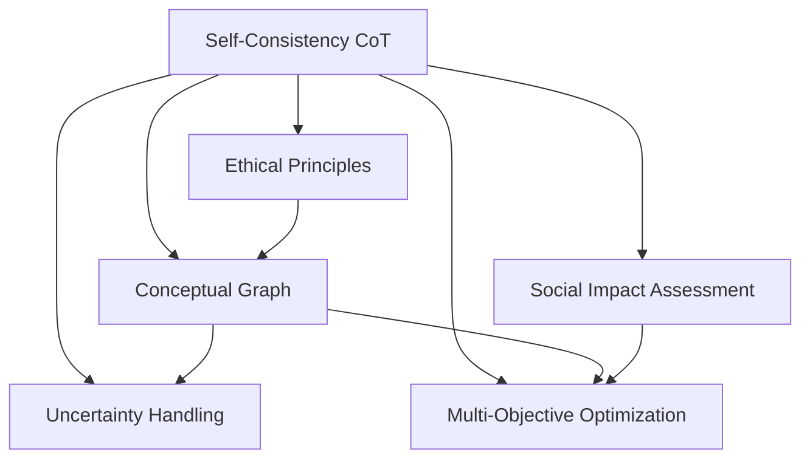

                 

### 自一致性CoT增强AI在伦理困境中的决策能力

随着人工智能（AI）技术的飞速发展，AI系统在各个领域得到广泛应用，从自动驾驶汽车到智能医疗诊断，从金融交易到社交网络管理。然而，随着AI系统在更复杂和更敏感的环境中的部署，其决策过程面临诸多挑战，尤其是在伦理困境中。伦理困境是指在决策过程中，涉及多方利益冲突，且没有明确正确答案的情况。例如，自动驾驶汽车在面临紧急情况时，需要在保护乘客安全与遵守交通规则之间做出选择；在医疗诊断中，医生需要平衡患者的最佳治疗与医疗资源的有限性。

面对这些伦理困境，传统的AI决策方法往往无法提供可靠的支持，因为它们缺乏处理复杂社会道德问题和不确定性问题的能力。为了解决这一问题，Self-Consistency CoT（自一致性概念图构建）作为一种新兴的AI决策增强方法应运而生。Self-Consistency CoT通过构建和维护自一致的概念图，提高AI在伦理困境中的决策能力。

本文将系统地介绍Self-Consistency CoT增强AI在伦理困境中的决策能力。首先，我们将讨论伦理困境的背景和特点，解释为什么AI系统在处理这些困境时面临挑战。接着，我们将详细描述Self-Consistency CoT的概念和特性，并探讨其在增强AI决策能力方面的潜力。随后，我们将分析Self-Consistency CoT在不同领域的应用实例，展示其实际效果。最后，我们将讨论Self-Consistency CoT的边界与外延，探讨其未来发展方向和研究方向。

通过本文的阅读，读者将了解Self-Consistency CoT的基本原理和应用方法，掌握如何在伦理困境中利用AI系统做出更加合理和可靠的决策。这不仅对研究人员和开发者具有重要意义，也为伦理学家和政策制定者提供了新的思考角度。

## 关键词

- 自一致性概念图构建（Self-Consistency Conceptual Graph Construction）
- 伦理困境（Ethical Dilemmas）
- AI决策增强（AI Decision Enhancement）
- 不确定性处理（Uncertainty Handling）
- 多目标优化（Multi-Objective Optimization）
- 社会影响评估（Social Impact Assessment）

## 摘要

本文旨在探讨Self-Consistency CoT（自一致性概念图构建）在增强AI系统在伦理困境中的决策能力方面的应用。随着AI技术的广泛应用，AI系统在处理复杂的伦理困境时面临诸多挑战，如不确定性、多目标优化和社会影响评估等。Self-Consistency CoT通过构建和维护自一致的概念图，提供了一种有效的决策增强方法，能够在复杂和不确定的环境中做出更符合伦理原则的决策。本文首先介绍了伦理困境的背景和特点，随后详细阐述了Self-Consistency CoT的概念和特性。通过实际应用实例的分析，本文展示了Self-Consistency CoT在不同领域的有效性。最后，本文讨论了Self-Consistency CoT的边界与外延，并提出了未来研究方向。通过本文的研究，读者可以更好地理解如何在伦理困境中利用AI系统做出合理和可靠的决策。

## 第一部分：引言

### 1.1 书籍背景

随着人工智能（AI）技术的飞速发展，AI系统在各个领域的应用日益广泛，从自动驾驶汽车到智能医疗诊断，从金融交易到社交网络管理。然而，随着AI系统在更复杂和更敏感的环境中的部署，其决策过程面临诸多挑战，尤其是在伦理困境中。伦理困境是指在决策过程中，涉及多方利益冲突，且没有明确正确答案的情况。例如，自动驾驶汽车在面临紧急情况时，需要在保护乘客安全与遵守交通规则之间做出选择；在医疗诊断中，医生需要平衡患者的最佳治疗与医疗资源的有限性。

面对这些伦理困境，传统的AI决策方法往往无法提供可靠的支持，因为它们缺乏处理复杂社会道德问题和不确定性问题的能力。为了解决这一问题，Self-Consistency CoT（自一致性概念图构建）作为一种新兴的AI决策增强方法应运而生。Self-Consistency CoT通过构建和维护自一致的概念图，提高AI在伦理困境中的决策能力。

本书旨在系统地介绍Self-Consistency CoT增强AI在伦理困境中的决策能力，为相关领域的研究者和从业者提供理论指导与实践参考。本书将详细探讨Self-Consistency CoT的理论基础、实现方法和应用实例，为AI在伦理困境中的决策提供新的思路。通过本书的阅读，读者将了解Self-Consistency CoT的基本原理和应用方法，掌握如何在伦理困境中利用AI系统做出更加合理和可靠的决策。这不仅对研究人员和开发者具有重要意义，也为伦理学家和政策制定者提供了新的思考角度。

### 1.2 问题背景与描述

伦理困境在现实世界中普遍存在，且随着AI技术的广泛应用，其复杂性不断增加。伦理困境是指在决策过程中，涉及多方利益冲突，且没有明确正确答案的情况。这类问题通常需要权衡不同的价值观、道德准则和利益相关者的需求，因此具有高度的不确定性和复杂性。

#### 自动驾驶汽车

自动驾驶汽车是伦理困境的一个典型例子。在紧急情况下，自动驾驶汽车可能需要做出生死攸关的决策。例如，如果一辆自动驾驶汽车在繁忙的街道上遇到一名突然冲入道路的行人，它必须在保护乘客和行人之间做出选择。这个决策不仅需要考虑物理安全，还要考虑法律和道德规范。在许多国家，法律明确规定了驾驶员必须遵守的道路规则，但这些规则在复杂情况下可能存在模糊性和争议性。

#### 医疗决策

在医疗领域，医生经常面临伦理困境。例如，在面对有限的医疗资源时，医生需要决定哪些患者应该接受治疗，哪些患者需要被优先考虑。这种决策不仅涉及患者的健康状况，还需要考虑社会资源分配的公平性。此外，医生在诊断和治疗过程中，可能需要处理患者的隐私权和知情同意权，这些权利与患者的最佳利益可能存在冲突。

#### 金融交易

在金融领域，交易系统和算法需要做出快速决策，以应对市场变化和风险。然而，这些决策可能涉及到违反伦理和法律的风险。例如，高频交易算法可能通过不正当手段获得竞争优势，从而损害其他市场参与者的利益。这种情况下，如何在追求高收益的同时遵守伦理和法律规范，是一个复杂的问题。

#### 社交网络

在社交网络领域，平台算法需要处理大量的用户生成内容，并做出内容审核、推荐和广告投放等决策。这些决策不仅需要考虑内容是否符合平台规定，还需要考虑用户的隐私权和言论自由。例如，如何在保护用户隐私的同时，有效过滤有害信息和虚假信息，是一个具有挑战性的伦理问题。

这些伦理困境的共同特点是涉及多方利益，且没有明确的正确答案。传统的AI决策方法，如基于规则的方法、机器学习算法等，往往无法在复杂和不确定的环境中提供可靠的决策支持。因此，需要新的方法来增强AI系统在伦理困境中的决策能力。

### 1.3 问题解决

Self-Consistency CoT（自一致性概念图构建）作为一种新兴的AI决策增强方法，旨在解决伦理困境中AI决策的挑战。Self-Consistency CoT通过构建和维护自一致的概念图，为AI系统提供一种新的决策框架，使其能够在复杂和不确定的环境中做出更符合伦理原则的决策。

#### 自一致性概念图构建

Self-Consistency CoT的核心是构建和维护自一致的概念图。概念图是一种图形化的知识表示方法，用于描述概念之间的关系和属性。在Self-Consistency CoT中，概念图不仅用于表示事实和规则，还用于表示伦理原则和道德准则。

1. **知识表示**：通过概念图，可以直观地表示各种领域的知识，如事实、规则、关系等。这种图形化的表示方法有助于理解和分析复杂的信息。
   
2. **伦理原则融入**：在概念图中融入伦理原则，使得AI系统能够在决策过程中考虑道德准则和价值观。例如，可以定义“公平性”、“尊重隐私”等伦理原则，并在决策过程中进行评估。

3. **自一致性检测**：通过自一致性检测，可以确保概念图的内部一致性。这包括检测概念之间的冲突和不一致，并采取相应的措施进行修复。

#### 自适应性

Self-Consistency CoT具有自适应性，能够根据新的信息和数据动态调整概念图的内容和结构。这种自适应性使得AI系统能够适应变化的环境，并做出更准确的决策。

1. **更新机制**：在接收到新的信息和数据时，Self-Consistency CoT能够自动更新概念图的内容，确保其与当前环境保持一致。

2. **反馈机制**：通过用户反馈和系统评估，Self-Consistency CoT能够不断优化概念图的准确性和可靠性。这种反馈机制有助于提高AI系统在伦理困境中的决策能力。

#### 决策支持

Self-Consistency CoT通过提供决策支持，帮助AI系统在伦理困境中做出更符合伦理原则的决策。

1. **多目标优化**：在伦理困境中，通常涉及多个目标，如安全性、公平性和效率等。Self-Consistency CoT能够考虑这些目标，并通过多目标优化算法找到最优解。

2. **社会影响评估**：在做出决策时，Self-Consistency CoT能够评估决策对社会的影响，从而确保其符合伦理和社会责任。

#### 应用实例

Self-Consistency CoT已经在多个领域得到了应用，并取得了显著的效果。例如，在自动驾驶汽车中，Self-Consistency CoT可以帮助汽车在紧急情况下做出更合理的决策；在医疗诊断中，Self-Consistency CoT可以提高医生的决策质量，确保患者得到最佳治疗；在金融交易中，Self-Consistency CoT可以确保交易系统的决策符合伦理和法律规范。

通过Self-Consistency CoT的应用，AI系统在处理伦理困境时能够表现出更高的决策能力和可靠性。这不仅有助于提高AI系统的整体性能，也为解决现实世界中的伦理问题提供了新的思路和方法。

### 1.4 边界与外延

Self-Consistency CoT（自一致性概念图构建）在增强AI系统在伦理困境中的决策能力方面具有广泛的应用潜力。然而，在实际应用中，Self-Consistency CoT也面临一些边界和限制，需要进一步探讨和解决。

#### 伦理原则的融入

首先，Self-Consistency CoT需要考虑如何将伦理原则有效地融入到AI决策过程中。伦理原则是指导决策行为的基本准则，包括公平性、公正性、尊重个人隐私等。在具体应用中，如何准确理解和表达这些伦理原则，并将其纳入到概念图中，是一个挑战。这需要开发专门的方法和技术，确保伦理原则能够在AI决策中得到有效体现和执行。

#### 不确定性的处理

伦理困境通常伴随着高度的不确定性，例如，自动驾驶汽车在遇到紧急情况时的决策，医疗诊断中的不确定性等。Self-Consistency CoT需要具备处理不确定性的能力，以确保在复杂和不确定的环境中做出可靠的决策。这包括开发相应的概率模型和不确定性推理方法，以增强AI系统的适应性和鲁棒性。

#### 多目标优化

在伦理困境中，通常涉及多个目标，如安全性、公平性和效率等。Self-Consistency CoT需要实现多目标优化，以找到在多个目标之间取得平衡的最优解。这需要设计高效的多目标优化算法，并确保这些算法能够在实际应用中有效地运行。

#### 社会影响的评估

在做出决策时，AI系统需要评估其对社会的影响，以确保其符合伦理和社会责任。Self-Consistency CoT需要开发相应的评估方法，以评估决策对社会各方面的潜在影响。这包括经济、环境、社会等方面的评估，以确保决策的全面性和可持续性。

#### 可解释性

尽管Self-Consistency CoT通过概念图提高了决策的可解释性，但在实际应用中，如何向用户解释AI系统的决策过程和依据，仍然是一个挑战。这需要开发相应的可解释性技术，使AI系统的决策过程更加透明和易于理解。

#### 法律和监管问题

Self-Consistency CoT在应用过程中，还需要遵守相关的法律和监管要求。例如，在医疗领域，AI系统的决策需要符合医疗法规和隐私保护规定；在金融领域，AI系统的决策需要遵守金融法规和合规要求。这需要与法律和监管机构合作，确保AI系统的决策符合法律和道德要求。

#### 技术挑战

Self-Consistency CoT在实现过程中，也面临一些技术挑战。例如，如何高效地构建和维护概念图，如何处理大规模数据和复杂的推理问题等。这些技术挑战需要进一步研究和解决，以实现Self-Consistency CoT的有效应用。

#### 应用场景

Self-Consistency CoT在不同领域的应用场景和需求有所不同。例如，在医疗领域，需要处理大量患者数据和复杂的医疗信息；在金融领域，需要处理高频交易和大量市场数据。这需要根据不同领域的需求，设计相应的应用方案和算法，以实现Self-Consistency CoT在不同领域的有效应用。

### 1.5 概念结构与核心要素组成

Self-Consistency CoT（自一致性概念图构建）作为一种AI决策增强方法，其核心概念和要素组成包括以下几个方面：

#### Self-Consistency CoT

Self-Consistency CoT是指通过构建和维护自一致的概念图，增强AI系统在伦理困境中的决策能力。概念图是一种图形化的知识表示方法，用于描述概念之间的关系和属性。

#### 伦理原则

伦理原则是指导决策行为的基本准则，包括公平性、公正性、尊重个人隐私等。在Self-Consistency CoT中，伦理原则被融入到概念图中，以指导AI系统的决策过程。

#### 概念图

概念图是Self-Consistency CoT的核心组件，用于表示各种领域的知识，包括事实、规则、关系等。概念图通过图形化的方式，使得复杂的信息更加直观和易于理解。

#### 自适应性

自适应性是指Self-Consistency CoT能够根据新的信息和数据，动态调整概念图的内容和结构，以适应变化的环境。这种自适应性使得AI系统能够在复杂和不确定的环境中做出更准确的决策。

#### 多目标优化

多目标优化是指在决策过程中，同时考虑多个目标，如安全性、公平性和效率等，并找到在这些目标之间取得平衡的最优解。多目标优化是Self-Consistency CoT的一个重要组成部分，有助于在伦理困境中做出更全面和优化的决策。

#### 社会影响评估

社会影响评估是指对AI系统决策对社会各方面的影响进行评估，以确保其符合伦理和社会责任。这包括经济、环境、社会等方面的评估，有助于确保AI系统的决策具有可持续性和社会责任感。

#### 可解释性

可解释性是指AI系统的决策过程和依据能够被用户理解和解释。在Self-Consistency CoT中，通过概念图和自适应性机制，提高了决策的可解释性，使得AI系统的决策过程更加透明和易于理解。

### 1.6 核心概念与联系

在探讨Self-Consistency CoT增强AI在伦理困境中的决策能力时，理解核心概念之间的联系至关重要。以下是对核心概念及其相互关系的详细分析：

#### 1.6.1 Self-Consistency CoT的定义与特性

Self-Consistency CoT（自一致性概念图构建）是一种通过构建和维护自一致的概念图，以增强AI系统在复杂决策环境中可靠性和可解释性的方法。其定义可以概括为：在AI决策过程中，利用概念图这一图形化知识表示方法，动态更新和维护自一致的知识库，从而提高决策的准确性和可靠性。Self-Consistency CoT具有以下特性：

1. **自适应性**：Self-Consistency CoT能够根据新的信息和数据，动态调整概念图的结构和内容，以适应不断变化的环境。这种自适应性使得AI系统能够在复杂和不确定的环境中灵活应对，做出更准确的决策。

2. **一致性**：在Self-Consistency CoT中，概念图内部的一致性是一个关键问题。通过定期检测和维护概念图的一致性，可以避免冲突和不一致的情况，确保AI系统的决策基于准确和一致的知识基础。

3. **可解释性**：Self-Consistency CoT通过概念图提供了决策过程的可视化和解释，使得决策过程更加透明和易于理解。这种可解释性不仅有助于提高用户对AI系统的信任，也为后续的优化和改进提供了明确的指导。

#### 1.6.2 伦理困境与伦理原则

伦理困境是指在决策过程中，涉及多方利益冲突，且没有明确正确答案的情况。例如，在医疗决策中，医生需要平衡患者的最佳治疗与医疗资源的有限性；在自动驾驶汽车中，系统需要在保护乘客安全和遵守交通规则之间做出选择。伦理困境的复杂性在于其涉及多个道德原则和价值观的冲突。

伦理原则是指导决策行为的基本准则，包括公平性、公正性、尊重个人隐私等。在Self-Consistency CoT中，伦理原则被融入到概念图中，成为决策过程的重要依据。以下是如何将伦理原则融入Self-Consistency CoT的几个关键步骤：

1. **定义伦理原则**：首先，需要明确具体的伦理原则，例如“最小伤害原则”、“公正分配原则”等。

2. **嵌入伦理原则**：将伦理原则嵌入到概念图中，作为决策过程中的约束条件。这可以通过定义特定的概念和关系来实现，例如将“公平性”定义为“所有个体应受到同等对待”。

3. **评估和选择**：在决策过程中，通过评估不同选项对伦理原则的满足程度，选择最符合伦理原则的决策。

#### 1.6.3 AI决策与概念图

AI决策是指利用人工智能技术，在复杂环境中做出合理决策的过程。传统AI决策方法通常依赖于算法和模型，但在处理伦理困境时，这些方法往往缺乏处理复杂社会道德问题和不确定性问题的能力。概念图作为一种图形化的知识表示方法，可以用于描述概念之间的关系和属性，为AI决策提供了新的思路。

在Self-Consistency CoT中，概念图用于构建和维护自一致的知识库，为AI决策提供支持。具体来说，概念图具有以下作用：

1. **知识表示**：概念图可以用于表示各种领域的知识，包括事实、规则、关系等。这种图形化的表示方法有助于理解和分析复杂的信息。

2. **推理过程**：通过概念图，可以模拟人类思维过程，进行推理和决策。例如，可以使用因果图或控制流图来表示决策过程中的条件关系和依赖关系。

3. **决策支持**：概念图可以帮助AI系统在复杂情境中，根据伦理原则和知识库，做出合理的决策。这种图形化的表示方法不仅提高了决策过程的透明性，也有助于发现和解决潜在的问题。

#### 1.6.4 自一致性机制

自一致性机制是Self-Consistency CoT的核心，包括以下几个方面：

1. **一致性检测**：定期检测概念图的一致性，发现并修复冲突和不一致的情况。这可以通过定义一致性规则和一致性检查算法来实现。

2. **更新机制**：根据新的信息和数据，动态更新概念图的内容和结构。这可以通过数据流处理技术和知识更新算法来实现。

3. **反馈机制**：通过用户反馈和系统评估，不断优化概念图的准确性和可靠性。这可以通过用户反馈收集、系统评估和优化算法来实现。

通过上述机制，Self-Consistency CoT能够确保概念图的内部一致性和自适应性，从而提高AI系统在伦理困境中的决策能力。

#### 1.6.5 概念属性特征对比表格

为了更好地理解Self-Consistency CoT与其他相关方法的区别和联系，以下是一个概念属性特征对比表格：

| 方法                 | 定义和特性                                                         | 关联概念                        | 优势                           | 劣势                          |
|----------------------|--------------------------------------------------------------------|--------------------------------|--------------------------------|-------------------------------|
| Self-Consistency CoT | 通过构建和维护自一致的概念图，增强AI决策能力                         | 概念图、伦理原则、自适应性        | 提高决策准确性和可解释性       | 需要开发高效的概念图构建方法 |
| 基于规则的决策方法    | 利用预定义的规则进行决策，适用于简单和确定性环境                      | 规则、条件、后果                 | 实现简单，易于理解             | 缺乏适应性和灵活性           |
| 机器学习算法         | 通过学习数据中的模式进行决策，适用于复杂和不确定性环境                | 特征工程、模型训练、预测         | 高效处理复杂问题               | 决策过程不透明               |
| 多目标优化方法       | 同时考虑多个目标进行决策，适用于多目标优化问题                       | 目标函数、约束条件、优化算法     | 寻找最优解                     | 需要明确的优化目标和约束     |
| 概念图方法           | 利用概念图表示知识，进行推理和决策                                   | 概念、关系、属性                 | 提高决策透明性和理解能力       | 需要处理复杂的概念图         |

通过这个表格，我们可以看到Self-Consistency CoT在自适应性、可解释性和决策准确性方面具有显著优势，但同时也需要开发高效的概念图构建方法。与其他方法相比，Self-Consistency CoT提供了在伦理困境中做出更符合伦理原则的决策的新途径。

### 1.6.6 概念属性特征对比表格和ER实体关系图架构的Mermaid流程图

为了进一步理解Self-Consistency CoT与其他相关方法的不同，我们提供了一个概念属性特征对比表格，以及一个ER（实体关系）实体关系图架构的Mermaid流程图。这些工具和图表有助于展示Self-Consistency CoT在伦理困境中决策能力的独特性。

#### 概念属性特征对比表格

以下是一个概念属性特征对比表格，展示了Self-Consistency CoT与其他方法的异同：

| 方法                 | 特性                                  | 应用领域             | 优势                          | 劣势                          |
|----------------------|---------------------------------------|----------------------|------------------------------|------------------------------|
| Self-Consistency CoT | 自适应性、一致性、可解释性           | 伦理决策、复杂系统   | 提高决策透明度和适应性         | 算法复杂度较高                 |
| 基于规则的决策方法    | 简单、直观、易于实现                   | 确定性环境           | 实现成本低、决策速度快         | 缺乏灵活性和适应能力           |
| 机器学习算法         | 学习能力强、处理复杂数据               | 复杂不确定环境        | 自动学习、适应性强             | 决策过程不透明、需要大量数据   |
| 多目标优化方法       | 考虑多个目标、优化目标                | 多目标优化问题       | 寻找最优解、处理多目标问题     | 需要明确的优化目标和约束       |
| 概念图方法           | 图形化表示、直观理解                   | 知识表示和推理       | 提高理解和推理能力             | 复杂关系难以处理               |

#### ER实体关系图架构的Mermaid流程图

以下是一个ER实体关系图架构的Mermaid流程图，展示了Self-Consistency CoT中各个核心实体和它们之间的关系：

在这个流程图中，Self-Consistency CoT作为核心系统，通过概念图（B）来表示知识和伦理原则（C），并利用不确定性处理（D）和多目标优化（E）算法来增强决策能力。同时，社会影响评估（F）确保决策符合伦理和社会责任。这种架构展示了Self-Consistency CoT在处理伦理困境时，如何整合多个核心组件，以提供全面和优化的决策支持。

通过概念属性特征对比表格和ER实体关系图，我们可以更清晰地理解Self-Consistency CoT在伦理困境中的决策能力，以及它在结构上的独特性和优势。

### 1.7 核心概念之间的联系

在Self-Consistency CoT（自一致性概念图构建）中，各个核心概念之间存在着紧密的联系和相互作用，这些联系对于理解其在伦理困境中的决策能力至关重要。

#### 自一致性机制与概念图

自一致性机制是Self-Consistency CoT的核心，其核心目标是确保概念图内部的一致性和可靠性。概念图作为一种图形化的知识表示方法，用于描述各个概念之间的关系和属性。自一致性机制通过以下方式与概念图相互作用：

1. **一致性检测**：定期检测概念图内部的一致性，识别并修复冲突和不一致的情况。这包括检查概念之间的关系是否逻辑上自洽，确保知识库的完整性。
   
2. **更新机制**：根据新的信息和数据，动态更新概念图的内容和结构，以反映环境的变化。这涉及对概念图节点的添加、删除和修改，以及重新评估概念之间的关系。

3. **反馈机制**：通过用户反馈和系统评估，不断优化概念图的准确性和可靠性。这种反馈循环确保概念图能够持续适应新的信息和环境变化。

#### 自一致性机制与伦理原则

伦理原则是指导AI决策行为的基本准则，如公平性、公正性和尊重个人隐私等。自一致性机制通过以下方式与伦理原则相互作用：

1. **伦理原则嵌入**：将伦理原则作为概念图中的约束条件，确保决策过程中始终考虑伦理原则。这可以通过定义特定的概念和关系来实现，例如将“公平性”定义为“所有个体应受到同等对待”。

2. **决策评估**：在决策过程中，通过评估不同选项对伦理原则的满足程度，选择最符合伦理原则的决策。这涉及对伦理原则的量化评估和权重分配，以确保决策的伦理可行性。

3. **伦理约束**：在概念图中嵌入伦理约束条件，确保AI系统在处理伦理困境时不会违反基本的道德准则。例如，在医疗决策中，确保隐私保护和患者利益得到充分考虑。

#### 自一致性机制与不确定性处理

在伦理困境中，不确定性是一个重要挑战。自一致性机制通过以下方式与不确定性处理机制相互作用：

1. **概率模型**：使用概率模型来表示和处理不确定性，例如贝叶斯网络或概率图模型。这些模型可以帮助AI系统在不确定性环境中做出更可靠的决策。

2. **不确定性推理**：通过不确定性推理算法，如贝叶斯推理或马尔可夫链蒙特卡罗（MCMC）方法，处理概念图中不确定的信息。这有助于降低决策过程中的不确定性，提高决策的准确性和鲁棒性。

3. **实时更新**：在接收到新的数据和观察时，实时更新概率模型和不确定性评估，以反映最新的环境信息。这种实时更新机制确保AI系统能够动态适应环境变化，提高决策的适应性。

#### 自一致性机制与多目标优化

在伦理困境中，通常涉及多个目标，如安全性、公平性和效率等。自一致性机制通过以下方式与多目标优化机制相互作用：

1. **目标函数**：定义多个目标函数，以同时考虑不同目标。这些目标函数可以是线性的或非线性的，并可以包含伦理原则和不确定性因素。

2. **优化算法**：使用多目标优化算法，如加权求和法、Pareto优化或多目标遗传算法，找到在多个目标之间取得平衡的最优解。这些算法确保在决策过程中，各个目标得到综合考虑和优化。

3. **权重分配**：通过用户反馈和系统评估，动态调整目标函数的权重，以适应特定场景的需求。这种权重分配机制有助于在伦理困境中找到最优的决策方案。

#### 自一致性机制与社会影响评估

社会影响评估是确保AI系统决策符合伦理和社会责任的重要手段。自一致性机制通过以下方式与社会影响评估相互作用：

1. **评估指标**：定义一系列评估指标，以衡量决策对社会各方面的影响。这些指标可以是经济、环境、社会等方面的。

2. **影响分析**：通过社会影响评估方法，分析决策对社会各方面的潜在影响。这包括对经济成本、环境影响和社会公平性的评估。

3. **反馈机制**：将社会影响评估结果反馈到概念图中，作为决策优化的依据。这种反馈机制确保AI系统能够在决策过程中持续考虑社会影响，做出更负责任和可持续的决策。

通过上述相互作用，Self-Consistency CoT将自一致性机制与伦理原则、不确定性处理、多目标优化和社会影响评估有机地结合起来，形成了一个综合的决策框架，使其在伦理困境中能够提供更合理和可靠的决策支持。这种综合机制不仅提高了AI系统的决策能力，也为解决复杂的伦理问题提供了新的思路和方法。

