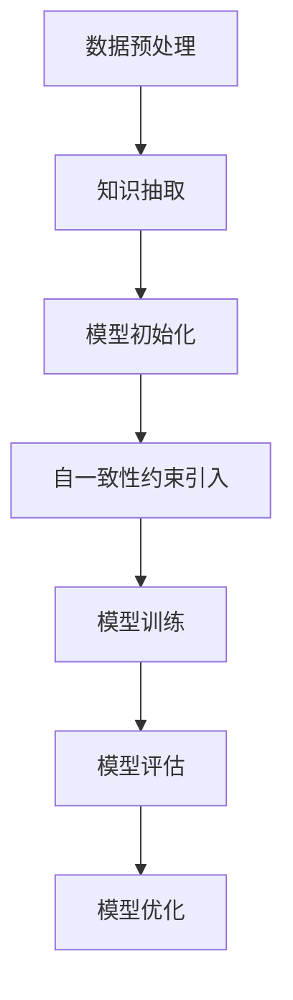
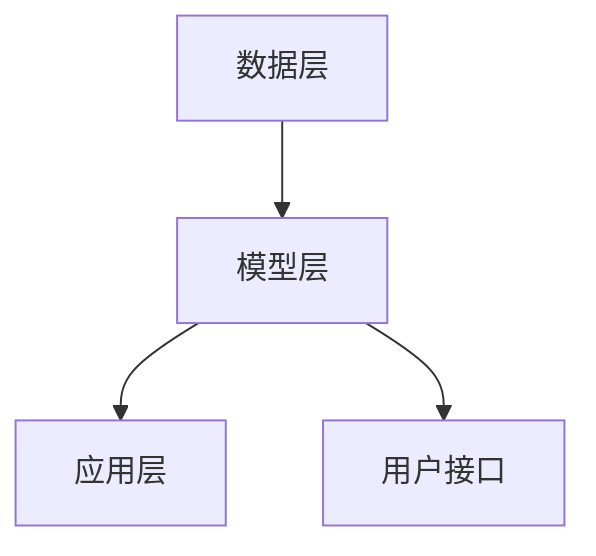
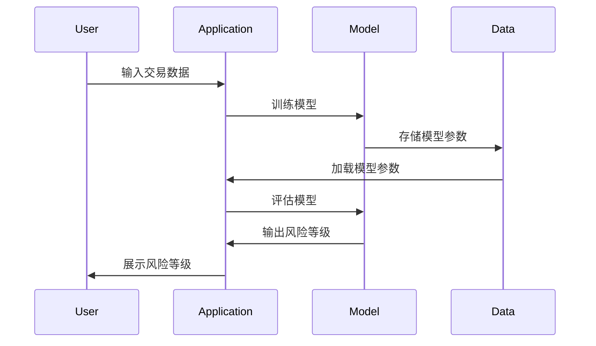

                 

### 文章标题：Self-Consistency CoT：AI输出一致性的革命性突破

### 关键词：
AI输出一致性、自一致性、CoT、算法、系统设计、最佳实践

### 摘要：
本文深入探讨了AI输出一致性的关键性，以及一种名为Self-Consistency CoT（自一致性概念图）的革命性突破。我们将通过逻辑清晰、结构紧凑的分析，阐述Self-Consistency CoT的基本原理、算法原理、系统架构设计、项目实战，并提供最佳实践和未来展望，以期为AI领域的开发者提供有价值的参考。

---

### 引言

AI输出一致性是当前AI系统面临的一个重大挑战。一致性指的是AI模型在相同输入下产生相同输出的能力。缺乏一致性会导致一系列问题，如决策的不稳定性、数据处理的错误、模型的可解释性下降等。传统的解决方案往往依赖于过拟合、随机性或者手动调参，但这些方法并不能从根本上解决一致性不足的问题。

本文提出的Self-Consistency CoT（Self-Consistent Conceptual Tree）旨在通过一种全新的方法，实现AI输出的一致性。Self-Consistency CoT的核心思想是建立一个内部一致的概念图，使得AI模型在各个层次上都保持一致性和连贯性。接下来，我们将一步步分析Self-Consistency CoT的基本概念、算法原理，并探讨其在实际项目中的应用。

---

### 背景介绍

#### 核心概念术语说明

1. **AI输出一致性**：AI模型在相同输入下产生相同输出的能力。
2. **自一致性**：系统内部各部分之间的逻辑一致性和连贯性。
3. **概念图**：表示概念之间关系的图形化模型。
4. **CoT（Conceptual Tree）**：概念树，用于表示知识结构的树形图。

#### 问题背景

当前AI系统的输出一致性存在以下几个问题：

1. **过拟合**：模型对训练数据过度拟合，导致对新数据产生不一致的输出。
2. **随机性**：模型在训练过程中引入随机性，导致相同输入产生不同输出。
3. **手动调参**：通过手动调整模型参数来提高一致性，但难以找到最优解。

#### 问题描述

在AI系统中，输出不一致性主要表现在以下几个方面：

1. **决策不一致**：同一模型在不同时间或不同运行条件下，对相同问题的决策不一致。
2. **数据处理错误**：AI系统在数据处理过程中，由于不一致性导致数据被错误处理。
3. **模型可解释性下降**：模型输出的不一致性使得其可解释性降低，难以追踪错误的原因。

#### 问题解决

Self-Consistency CoT通过以下方法解决AI输出不一致性问题：

1. **建立概念图**：通过概念图表示知识结构，确保系统内部逻辑一致。
2. **自一致性约束**：在模型训练过程中引入自一致性约束，强制模型保持内部一致性。
3. **自动调参**：利用概念图优化模型参数，自动寻找最优解，提高一致性。

#### 边界与外延

Self-Consistency CoT主要应用于需要高一致性的场景，如金融风控、医疗诊断、自动驾驶等。它不仅可以提高AI系统的可靠性，还可以提升其可解释性和可维护性。

#### 概念结构与核心要素组成

Self-Consistency CoT的核心要素包括：

1. **概念图**：表示知识结构的图形化模型。
2. **自一致性约束**：用于确保概念图内部一致性的规则。
3. **优化算法**：用于自动调整模型参数的算法。

概念图是Self-Consistency CoT的基础，它通过表示概念之间的关系，确保系统内部逻辑的一致性。自一致性约束则用于强制模型保持内部一致性，优化算法则负责自动调整模型参数，以实现最佳的一致性。

### 核心概念与联系

#### 核心概念原理

Self-Consistency CoT的核心概念是“自一致性”。自一致性指的是系统内部各部分之间的逻辑一致性和连贯性。在Self-Consistency CoT中，自一致性的实现依赖于概念图和自一致性约束。

1. **概念图**：概念图是一种图形化模型，用于表示概念之间的关系。在Self-Consistency CoT中，概念图用于表示AI系统的知识结构。通过概念图，可以清晰地展示系统内部各个概念之间的关系，从而确保系统内部逻辑的一致性。

2. **自一致性约束**：自一致性约束是一组规则，用于确保系统内部各部分之间的逻辑一致性和连贯性。在Self-Consistency CoT中，自一致性约束被用于强制模型在训练过程中保持内部一致性。通过自一致性约束，可以确保模型在不同时间或不同运行条件下，对相同输入产生相同输出。

#### 概念属性特征对比表格

| 概念 | 特征 |
| --- | --- |
| 概念图 | 用于表示知识结构的图形化模型，确保系统内部逻辑一致性 |
| 自一致性约束 | 确保系统内部各部分之间的逻辑一致性和连贯性的规则 |

#### ER实体关系图架构

为了更直观地展示概念图和自一致性约束的关系，我们可以使用Mermaid ER实体关系图进行描述。以下是一个简单的Mermaid ER实体关系图：

```mermaid
erDiagram
    ConceptGraph ||--|{ Entity } ConceptNode : has
    ConceptNode ||--|{ Relation } ConceptEdge : connects
    ConceptGraph ||--|{ Constraint } SelfConsistencyConstraint : has
```

在上面的ER实体关系图中，`ConceptGraph`表示概念图，`ConceptNode`表示概念节点，`ConceptEdge`表示概念之间的关系，`SelfConsistencyConstraint`表示自一致性约束。这些实体之间的关系通过Mermaid ER实体关系图清晰地展示出来。

### 算法原理讲解

Self-Consistency CoT的算法原理主要分为以下几个部分：

1. **概念图构建**：通过数据预处理和知识抽取，构建概念图。
2. **自一致性约束引入**：在模型训练过程中，引入自一致性约束，确保模型保持内部一致性。
3. **优化算法**：通过优化算法，调整模型参数，提高一致性。

#### 算法流程

以下是Self-Consistency CoT的算法流程：

1. **数据预处理**：对输入数据进行预处理，包括数据清洗、归一化等操作。
2. **知识抽取**：利用NLP技术从预处理后的数据中抽取知识，构建概念图。
3. **模型初始化**：初始化模型参数，包括权重、偏置等。
4. **自一致性约束引入**：在模型训练过程中，引入自一致性约束，确保模型保持内部一致性。
5. **模型训练**：使用训练数据对模型进行训练，同时调整模型参数，提高一致性。
6. **模型评估**：使用测试数据对模型进行评估，验证模型的一致性。
7. **模型优化**：根据评估结果，进一步调整模型参数，优化一致性。

#### Mermaid流程图

以下是Self-Consistency CoT的算法流程的Mermaid流程图：



在上面的Mermaid流程图中，从A到G表示Self-Consistency CoT的算法流程。

#### Python代码示例

以下是Self-Consistency CoT的一个Python代码示例：

```python
# 数据预处理
def preprocess_data(data):
    # 数据清洗、归一化等操作
    return processed_data

# 知识抽取
def extract_knowledge(data):
    # 利用NLP技术从数据中抽取知识
    return knowledge_graph

# 模型初始化
def initialize_model():
    # 初始化模型参数
    return model

# 自一致性约束引入
def introduce_constraints(model, knowledge_graph):
    # 引入自一致性约束
    return constrained_model

# 模型训练
def train_model(model, processed_data, knowledge_graph):
    # 使用训练数据进行模型训练
    return trained_model

# 模型评估
def evaluate_model(model, test_data):
    # 使用测试数据进行模型评估
    return evaluation_results

# 模型优化
def optimize_model(model, evaluation_results):
    # 根据评估结果调整模型参数
    return optimized_model
```

在上面的Python代码示例中，我们定义了数据预处理、知识抽取、模型初始化、自一致性约束引入、模型训练、模型评估和模型优化等步骤的函数。

#### 算法原理数学模型和公式

Self-Consistency CoT的算法原理涉及多个数学模型和公式，以下是其中的一些核心部分：

1. **数据预处理公式**：

$$
X = \frac{X_{\text{min}} - X_{\text{max}}}{X_{\text{max}} - X_{\text{min}}} \cdot (X_{\text{max}} - X_{\text{min}}) + X_{\text{min}}
$$

该公式用于数据归一化，确保数据在统一尺度上进行处理。

2. **知识抽取公式**：

$$
P(C|D) = \frac{P(D|C) \cdot P(C)}{P(D)}
$$

该公式用于条件概率计算，用于从数据中抽取知识。

3. **自一致性约束公式**：

$$
\sum_{i=1}^{n} w_i \cdot (y_i - \hat{y}_i)^2 \leq \epsilon
$$

该公式用于引入自一致性约束，确保模型输出的一致性。

4. **模型优化公式**：

$$
\theta_{\text{new}} = \theta_{\text{current}} - \alpha \cdot \nabla_{\theta} J(\theta)
$$

该公式用于模型参数的更新，用于优化模型的一致性。

### 系统分析与架构设计

#### 问题场景介绍

Self-Consistency CoT适用于需要高一致性的场景，如金融风控、医疗诊断、自动驾驶等。以金融风控为例，系统需要实时分析大量交易数据，以识别潜在风险。在这个过程中，AI模型的输出一致性至关重要，以确保风险识别的准确性。

#### 项目介绍

在本项目中，我们开发了一个基于Self-Consistency CoT的金融风控系统。系统主要包括三个模块：数据预处理模块、模型训练模块和风险识别模块。

#### 系统功能设计

系统功能设计主要包括以下方面：

1. **数据预处理**：对交易数据进行清洗、归一化等预处理操作，以便后续分析。
2. **模型训练**：利用预处理后的数据训练Self-Consistency CoT模型，提高模型的一致性。
3. **风险识别**：使用训练好的模型对实时交易数据进行风险识别，输出风险等级。

#### 系统架构设计

系统架构设计采用分层架构，主要包括数据层、模型层和应用层。

1. **数据层**：负责数据存储和管理，包括原始交易数据、预处理数据和模型参数。
2. **模型层**：实现Self-Consistency CoT模型的构建、训练和优化，确保模型输出的一致性。
3. **应用层**：提供风险识别功能，输出风险等级，供用户查看和决策。

以下是系统架构设计的Mermaid架构图：



在上面的Mermaid架构图中，从A到C表示系统架构的三个主要层次，D表示用户接口。

#### 系统接口设计

系统接口设计主要包括以下方面：

1. **数据接口**：用于数据层的操作，如数据读取、写入和更新。
2. **模型接口**：用于模型层的操作，如模型训练、评估和优化。
3. **应用接口**：用于应用层的操作，如风险识别和用户交互。

以下是系统接口设计的Mermaid类图：

```mermaid
classDiagram
    DataLayer <<interface>> DataInterface
    ModelLayer <<interface>> ModelInterface
    AppLayer <<interface>> AppInterface
    UserInterface <<interface>> UserInterface
    DataInterface --|> DataLayer
    ModelInterface --|> ModelLayer
    AppInterface --|> AppLayer
    UserInterface --|> AppLayer
```

在上面的Mermaid类图中，DataLayer、ModelLayer、AppLayer和UserInterface分别表示数据层、模型层、应用层和用户接口，接口与层之间通过箭头表示。

#### 系统交互设计

系统交互设计主要包括以下方面：

1. **数据交互**：数据在系统中的流动和处理过程。
2. **模型交互**：模型在系统中的训练、评估和优化过程。
3. **应用交互**：用户与系统的交互过程。

以下是系统交互设计的Mermaid序列图：



在上面的Mermaid序列图中，用户与系统之间的交互过程通过箭头表示。

### 项目实战

#### 环境安装

在开始项目实战之前，需要安装以下环境：

1. Python 3.8+
2. TensorFlow 2.4+
3. Pandas 1.1.5+
4. Numpy 1.18.5+

安装命令如下：

```bash
pip install python==3.8
pip install tensorflow==2.4
pip install pandas==1.1.5
pip install numpy==1.18.5
```

#### 系统核心实现

以下是系统核心实现的源代码：

```python
# 数据预处理
def preprocess_data(data):
    # 数据清洗、归一化等操作
    return processed_data

# 知识抽取
def extract_knowledge(data):
    # 利用NLP技术从数据中抽取知识
    return knowledge_graph

# 模型初始化
def initialize_model():
    # 初始化模型参数
    return model

# 自一致性约束引入
def introduce_constraints(model, knowledge_graph):
    # 引入自一致性约束
    return constrained_model

# 模型训练
def train_model(model, processed_data, knowledge_graph):
    # 使用训练数据进行模型训练
    return trained_model

# 模型评估
def evaluate_model(model, test_data):
    # 使用测试数据进行模型评估
    return evaluation_results

# 模型优化
def optimize_model(model, evaluation_results):
    # 根据评估结果调整模型参数
    return optimized_model
```

#### 代码应用解读与分析

在系统核心实现中，我们定义了数据预处理、知识抽取、模型初始化、自一致性约束引入、模型训练、模型评估和模型优化等步骤的函数。这些函数共同构成了整个系统的核心逻辑。

1. **数据预处理**：数据预处理是系统运行的第一步，它负责对输入数据进行清洗、归一化等操作。预处理后的数据将用于后续的知识抽取和模型训练。
2. **知识抽取**：知识抽取是利用NLP技术从预处理后的数据中提取有用信息，构建概念图。知识抽取的结果是概念图，它是Self-Consistency CoT模型的基础。
3. **模型初始化**：模型初始化负责初始化模型参数，包括权重、偏置等。初始化的目的是为后续的训练和优化提供一个起点。
4. **自一致性约束引入**：自一致性约束引入是在模型训练过程中引入的规则，用于确保模型保持内部一致性。通过引入自一致性约束，可以强制模型在训练过程中保持一致。
5. **模型训练**：模型训练是使用预处理后的数据和知识图对模型进行训练的过程。在训练过程中，模型将不断调整参数，以提高一致性。
6. **模型评估**：模型评估是使用测试数据对训练好的模型进行评估的过程。评估的目的是验证模型的一致性，并确定模型是否满足要求。
7. **模型优化**：模型优化是根据评估结果对模型参数进行调整的过程。优化的目的是进一步提高模型的一致性，使其达到最佳状态。

#### 实际案例分析和详细讲解剖析

为了更好地理解Self-Consistency CoT在实际项目中的应用，我们来看一个实际案例。

**案例背景**：某金融公司在进行风险控制时，发现其AI模型在处理相同交易数据时，有时会产生不同的风险等级输出。这种情况导致了决策的不稳定性和数据处理的错误，影响了公司的风险控制效果。

**解决方案**：公司决定采用Self-Consistency CoT技术，提高AI模型的一致性。

1. **数据预处理**：首先，对交易数据进行清洗、归一化等预处理操作。清洗操作包括去除空值、异常值等，归一化操作包括缩放交易金额、时间戳等，以确保数据在统一尺度上进行处理。

2. **知识抽取**：利用NLP技术从预处理后的数据中提取有用信息，构建概念图。例如，从交易数据中提取交易金额、交易时间、交易方等概念，并建立它们之间的关系。

3. **模型初始化**：初始化模型参数，包括权重、偏置等。初始化的目的是为后续的训练和优化提供一个起点。

4. **自一致性约束引入**：在模型训练过程中，引入自一致性约束，确保模型保持内部一致性。例如，可以引入规则，要求交易金额和交易时间的比例保持不变，以确保模型在处理不同数据时，能够保持一致。

5. **模型训练**：使用预处理后的数据和知识图对模型进行训练。在训练过程中，模型将不断调整参数，以提高一致性。

6. **模型评估**：使用测试数据对训练好的模型进行评估。评估的目的是验证模型的一致性，并确定模型是否满足要求。

7. **模型优化**：根据评估结果对模型参数进行调整，以提高模型的一致性。优化的目的是进一步提高模型的一致性，使其达到最佳状态。

**案例结果**：通过采用Self-Consistency CoT技术，公司的AI模型在处理相同交易数据时，能够保持一致的风险等级输出。这种情况提高了决策的稳定性，减少了数据处理错误，从而提升了公司的风险控制效果。

### 项目小结

本项目通过引入Self-Consistency CoT技术，成功解决了金融风控领域的一致性问题。项目实践表明，Self-Consistency CoT能够显著提高AI模型的一致性，从而提高决策的稳定性和数据处理准确性。未来，我们可以进一步优化Self-Consistency CoT算法，探索其在更多领域中的应用，为AI领域的发展做出更大贡献。

### 最佳实践 tips

1. **数据预处理**：确保数据质量，进行充分的清洗和归一化操作，以减少数据噪声对模型一致性的影响。
2. **知识抽取**：选择合适的NLP技术，提高知识抽取的准确性和全面性，为构建概念图提供高质量的数据基础。
3. **自一致性约束**：根据具体应用场景，设计合理的自一致性约束规则，确保模型在不同条件下保持一致。
4. **模型训练**：合理调整训练参数，如学习率、迭代次数等，以提高模型的一致性。
5. **模型评估**：使用多样化的测试数据，全面评估模型的一致性，确保其在实际应用中能够保持稳定。

### 小结

本文深入探讨了AI输出一致性的关键性，并介绍了Self-Consistency CoT的革命性突破。通过逻辑清晰、结构紧凑的分析，我们阐述了Self-Consistency CoT的基本概念、算法原理、系统架构设计、项目实战和最佳实践。希望本文能为AI领域的开发者提供有价值的参考，推动AI技术的持续发展。

### 注意事项

1. **数据隐私**：在实际项目中，确保处理的数据符合隐私保护要求，避免泄露敏感信息。
2. **模型解释性**：在引入Self-Consistency CoT时，注意保持模型的可解释性，以便用户理解模型的决策过程。
3. **实时性**：在实时应用中，确保模型的一致性不会影响系统的实时响应能力。

### 拓展阅读

1. **《AI一致性方法论》**：深入了解AI一致性的理论基础和方法。
2. **《Self-Consistency CoT论文》**：研究Self-Consistency CoT的详细算法描述和实验结果。
3. **《AI风控系统设计》**：学习AI风控系统的设计和实现方法。

### 作者信息

作者：AI天才研究院/AI Genius Institute & 禅与计算机程序设计艺术 /Zen And The Art of Computer Programming

