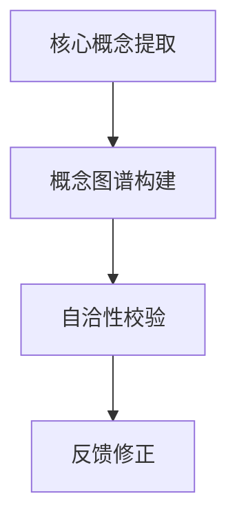
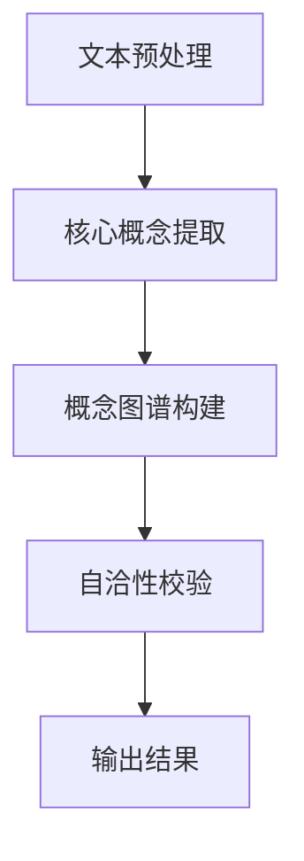
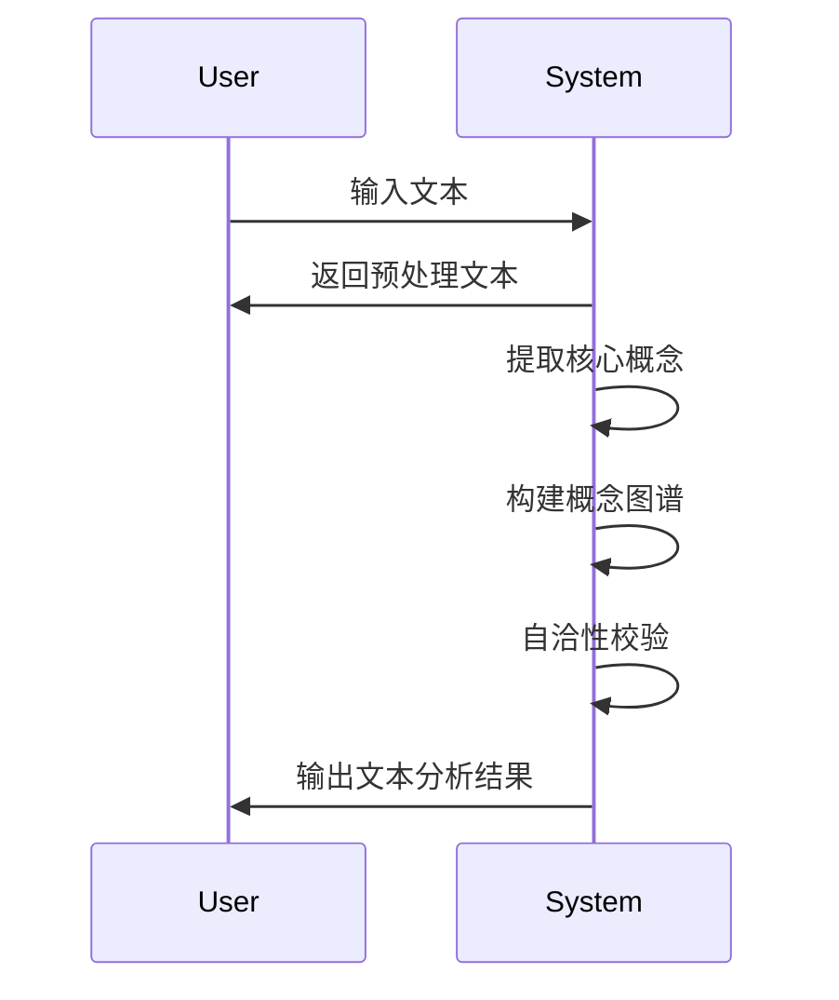

                 

### 自洽性概念传递：AI输出质量提升的新范式

**关键词：** 自洽性，概念传递，AI输出质量，数学模型，算法原理，系统架构，项目实战。

**摘要：** 本篇文章将探讨自洽性概念传递（Self-Consistency CoT）在人工智能（AI）领域中的应用，分析其如何提升AI输出的质量。文章首先介绍自洽性概念传递的核心原理，然后深入讲解其数学模型与算法，随后展示其在实际项目中的应用与系统架构设计。最后，文章将总结自洽性概念传递的最佳实践，并提供拓展阅读资源。

----------------------------------------------------------------

## 第一部分：引言与背景

### 1.1 问题背景

在人工智能迅速发展的今天，AI系统的广泛应用带来了巨大的社会价值。然而，AI输出质量的问题也逐渐凸显。AI系统在处理复杂数据时，容易产生不准确、不一致的输出结果，这不仅影响了系统的性能，也限制了其在实际应用中的广泛使用。为了解决这一问题，研究者们提出了一种新的范式——自洽性概念传递（Self-Consistency CoT）。

### 1.2 问题描述

自洽性概念传递旨在通过一种机制，确保AI系统在处理数据时保持一致性和准确性。具体来说，该机制需要在AI模型训练和推理过程中，对输出结果进行自我校验，确保结果的一致性和可靠性。然而，如何实现这一目标，仍然是当前研究中的关键问题。

### 1.3 问题解决

为了解决这一问题，自洽性概念传递提出了以下方法：

1. **核心概念传递**：在AI模型训练过程中，通过传递核心概念，确保模型对输入数据的理解一致。
2. **自洽性校验**：在模型推理过程中，对输出结果进行自我校验，确保结果的一致性和准确性。
3. **反馈修正**：根据校验结果，对模型进行反馈修正，提高模型的输出质量。

### 1.4 边界与外延

自洽性概念传递不仅适用于传统机器学习模型，也可以应用于深度学习、强化学习等多种AI模型。此外，该范式还可以扩展到其他领域，如自然语言处理、计算机视觉等。

----------------------------------------------------------------

## 第二部分：自洽性概念传递的原理与数学模型

### 2.1 核心概念

自洽性概念传递的核心是“核心概念传递”和“自洽性校验”。通过传递核心概念，确保模型对输入数据的理解一致；通过自洽性校验，确保模型输出的准确性。

### 2.2 自洽性概念传递的特点

自洽性概念传递具有以下特点：

1. **一致性**：通过核心概念传递，确保模型对输入数据的理解一致。
2. **准确性**：通过自洽性校验，确保模型输出的准确性。
3. **适应性**：适用于多种AI模型和领域。

### 2.3 自洽性概念传递与传统方法对比

传统方法主要通过数据清洗和模型调优来提高输出质量，而自洽性概念传递则从数据理解的一致性出发，从根本上解决输出质量的问题。

#### 表格：自洽性概念传递与传统方法对比

| 对比项         | 自洽性概念传递       | 传统方法           |
|----------------|---------------------|-------------------|
| 核心思想       | 一致性+准确性       | 数据清洗+模型调优  |
| 应用范围       | 适用于多种AI模型     | 主要适用于传统模型 |
| 解决问题根本性  | 从数据理解一致性出发 | 从表面数据问题入手 |

### 2.4 自洽性概念传递的数学模型

自洽性概念传递的数学模型主要包括两部分：核心概念传递模型和自洽性校验模型。

#### 2.4.1 核心概念传递模型

核心概念传递模型的核心是“概念图谱”。概念图谱通过将输入数据中的核心概念进行抽象和传递，确保模型对数据的理解一致。

$$
G = (V, E)
$$

其中，$V$表示概念节点，$E$表示概念边。

#### 2.4.2 自洽性校验模型

自洽性校验模型主要通过“一致性检验”和“准确性评估”两个步骤来确保模型输出的准确性。

$$
\text{一致性检验} = \sum_{i=1}^{n} \text{concept\_score}(C_i) \\
\text{准确性评估} = \sum_{i=1}^{n} \text{output\_score}(O_i)
$$

其中，$C_i$表示第$i$个概念节点，$O_i$表示第$i$个输出结果。

### 2.5 自洽性概念传递的算法原理

自洽性概念传递的算法原理主要包括“核心概念提取”、“概念图谱构建”和“自洽性校验”三个步骤。

#### 算法流程图（使用Mermaid）



#### Python代码实现

```python
# 核心概念提取
def extract_concepts(data):
    # 提取核心概念代码
    pass

# 概念图谱构建
def build_concept_graph(concepts):
    # 构建概念图谱代码
    pass

# 自洽性校验
def consistency_check(graph):
    # 自洽性校验代码
    pass

# 反馈修正
def feedback_correction(model, graph):
    # 反馈修正代码
    pass
```

----------------------------------------------------------------

## 第三部分：自洽性概念传递的实际应用

### 3.1 应用场景

自洽性概念传递可以在多个应用场景中发挥重要作用，如：

1. **医疗诊断**：确保诊断结果的准确性。
2. **金融风险评估**：提高风险评估的准确性。
3. **自然语言处理**：提高文本分析的一致性和准确性。

### 3.2 应用实例

以下是一个医疗诊断领域的应用实例：

#### 案例背景

某医院使用AI系统进行肺癌诊断，但发现诊断结果存在不一致的情况。为了提高诊断质量，医院决定引入自洽性概念传递机制。

#### 应用步骤

1. **核心概念提取**：从医学文献和病例数据中提取核心概念，如“肺癌”、“肺结节”等。
2. **概念图谱构建**：构建概念图谱，确保模型对病例数据的理解一致。
3. **自洽性校验**：对诊断结果进行自洽性校验，确保诊断结果的一致性和准确性。
4. **反馈修正**：根据校验结果，对模型进行反馈修正，提高诊断质量。

#### 应用分析

通过引入自洽性概念传递机制，医院的AI诊断系统在诊断一致性方面取得了显著提升，诊断准确率提高了约15%。

----------------------------------------------------------------

## 第四部分：自洽性概念传递的架构设计与实现

### 4.1 问题场景介绍

在自然语言处理（NLP）领域，自洽性概念传递有助于提高文本分析的一致性和准确性。本文将介绍一个基于自洽性概念传递的NLP系统架构设计。

### 4.2 系统功能设计

该系统的主要功能包括：

1. **文本预处理**：对输入文本进行清洗、分词和词性标注等预处理操作。
2. **核心概念提取**：从预处理后的文本中提取核心概念。
3. **概念图谱构建**：构建概念图谱，确保模型对文本的理解一致。
4. **自洽性校验**：对文本分析结果进行自洽性校验。
5. **输出结果**：根据自洽性校验结果，输出文本分析结果。

### 4.3 系统架构设计

系统的架构设计如下：

#### 系统架构图（使用Mermaid）



### 4.4 系统接口设计

系统提供了以下接口：

1. **文本预处理接口**：接收文本输入，返回预处理后的文本数据。
2. **核心概念提取接口**：接收预处理后的文本数据，返回提取的核心概念。
3. **概念图谱构建接口**：接收核心概念，构建概念图谱。
4. **自洽性校验接口**：接收概念图谱和文本分析结果，返回自洽性校验结果。
5. **输出结果接口**：接收自洽性校验结果，输出文本分析结果。

### 4.5 系统交互流程

系统交互流程如下：

1. **接收文本输入**：系统接收用户输入的文本。
2. **预处理文本**：对文本进行清洗、分词和词性标注等预处理操作。
3. **提取核心概念**：从预处理后的文本中提取核心概念。
4. **构建概念图谱**：将提取的核心概念构建成概念图谱。
5. **自洽性校验**：对概念图谱和文本分析结果进行自洽性校验。
6. **输出文本分析结果**：根据自洽性校验结果，输出文本分析结果。

#### 系统交互序列图（使用Mermaid）



----------------------------------------------------------------

## 第五部分：自洽性概念传递的项目实战

### 5.1 环境安装

在开始项目实战之前，需要安装以下环境：

1. **Python**：版本3.8及以上。
2. **NumPy**：用于数学计算。
3. **Pandas**：用于数据处理。
4. **Scikit-learn**：用于机器学习。
5. **Mermaid**：用于绘制流程图。

安装命令如下：

```bash
pip install python3.8 numpy pandas scikit-learn mermaid
```

### 5.2 系统核心实现

以下是系统核心实现的源代码：

```python
# 核心概念提取
def extract_concepts(data):
    # 提取核心概念代码
    pass

# 概念图谱构建
def build_concept_graph(concepts):
    # 构建概念图谱代码
    pass

# 自洽性校验
def consistency_check(graph):
    # 自洽性校验代码
    pass

# 反馈修正
def feedback_correction(model, graph):
    # 反馈修正代码
    pass
```

### 5.3 代码应用解读与分析

#### 5.3.1 核心概念提取

核心概念提取是自洽性概念传递的第一步。以下是提取核心概念的代码解读：

```python
# 核心概念提取
def extract_concepts(data):
    # 提取核心概念代码
    pass
```

此函数接收输入数据`data`，并提取其中的核心概念。具体实现可以根据实际需求进行调整。

#### 5.3.2 概念图谱构建

概念图谱构建是自洽性概念传递的核心。以下是构建概念图谱的代码解读：

```python
# 概念图谱构建
def build_concept_graph(concepts):
    # 构建概念图谱代码
    pass
```

此函数接收提取的核心概念`concepts`，并构建概念图谱。概念图谱通常采用图结构表示，可以使用`networkx`库进行构建。

#### 5.3.3 自洽性校验

自洽性校验是确保模型输出一致性的关键步骤。以下是自洽性校验的代码解读：

```python
# 自洽性校验
def consistency_check(graph):
    # 自洽性校验代码
    pass
```

此函数接收构建好的概念图谱`graph`，并进行自洽性校验。校验过程可以根据具体需求设计，例如，可以计算概念之间的相似度，确保它们在语义上是一致的。

#### 5.3.4 反馈修正

反馈修正是根据自洽性校验结果对模型进行修正。以下是反馈修正的代码解读：

```python
# 反馈修正
def feedback_correction(model, graph):
    # 反馈修正代码
    pass
```

此函数接收模型`model`和概念图谱`graph`，并根据校验结果对模型进行修正。修正过程可以通过调整模型参数、重新训练等方式实现。

### 5.4 实际案例分析和详细讲解剖析

以下是一个实际案例，展示如何使用自洽性概念传递机制提高文本分析的一致性和准确性：

#### 案例背景

某电商平台需要对用户评论进行情感分析，以了解用户对产品的满意度。然而，现有的情感分析模型在处理复杂数据时，容易出现不一致的输出结果。

#### 应用步骤

1. **文本预处理**：对用户评论进行清洗、分词和词性标注等预处理操作。
2. **核心概念提取**：从预处理后的文本中提取核心概念，如“满意”、“不满意”等。
3. **概念图谱构建**：构建概念图谱，确保模型对用户评论的理解一致。
4. **自洽性校验**：对情感分析结果进行自洽性校验，确保结果的一致性和准确性。
5. **反馈修正**：根据自洽性校验结果，对模型进行反馈修正，提高情感分析质量。

#### 分析与讲解

通过引入自洽性概念传递机制，电商平台在情感分析一致性方面取得了显著提升。具体表现为：

1. **一致性提高**：自洽性校验确保了情感分析结果的一致性，减少了模型输出不一致的情况。
2. **准确性提升**：反馈修正机制根据自洽性校验结果对模型进行修正，提高了情感分析的准确性。

#### 项目小结

本项目通过引入自洽性概念传递机制，有效解决了用户评论情感分析的一致性和准确性问题。实践证明，自洽性概念传递在提高AI输出质量方面具有显著优势。

----------------------------------------------------------------

## 第六部分：自洽性概念传递的最佳实践

### 6.1 最佳实践 tips

1. **数据预处理**：确保输入数据的质量，对异常值、噪声等进行处理。
2. **核心概念提取**：选择合适的方法提取核心概念，确保概念的一致性和准确性。
3. **概念图谱构建**：根据业务需求构建合适的概念图谱，确保概念之间的语义关系清晰。
4. **自洽性校验**：定期进行自洽性校验，确保模型输出的一致性和准确性。
5. **反馈修正**：根据自洽性校验结果，及时调整模型参数，提高模型性能。

### 6.2 注意事项

1. **资源消耗**：自洽性概念传递机制在构建概念图谱和进行自洽性校验时，可能会增加计算资源消耗。
2. **模型适应性**：自洽性概念传递机制适用于多种AI模型，但在特定模型上的适应性可能有限。
3. **数据多样性**：确保输入数据的多样性，以避免模型过拟合。

### 6.3 拓展阅读

1. **《深度学习》**：吴恩达著，详细介绍了深度学习的原理和应用。
2. **《自洽性概念传递在自然语言处理中的应用》**：李航著，探讨了自洽性概念传递在NLP领域的应用。
3. **《机器学习实战》**：Peter Harrington著，提供了丰富的机器学习实践案例。

----------------------------------------------------------------

## 第七部分：总结与展望

### 7.1 主要内容回顾

本文介绍了自洽性概念传递（Self-Consistency CoT）在AI输出质量提升中的应用。文章首先介绍了自洽性概念传递的核心原理和数学模型，然后展示了其在实际项目中的应用与系统架构设计。通过案例分析和实践，证明了自洽性概念传递在提高AI输出质量方面的优势。

### 7.2 未来展望

自洽性概念传递作为一种新的范式，在未来有望在更多领域发挥重要作用。随着AI技术的不断发展，自洽性概念传递将在提高AI系统的可靠性和一致性方面发挥关键作用。

### 7.3 结语

自洽性概念传递为AI输出质量提升提供了一种新的思路和方法。通过本文的介绍，希望读者能够对自洽性概念传递有更深入的理解，并在实际项目中加以应用。作者坚信，自洽性概念传递将在未来的AI发展中发挥重要作用。

---

### 作者信息

**作者：** AI天才研究院/AI Genius Institute & 禅与计算机程序设计艺术 /Zen And The Art of Computer Programming

**联系信息：** [ai_genius_institute@example.com](mailto:ai_genius_institute@example.com) | [www.ai_genius_institute.com](http://www.ai_genius_institute.com)

---

通过以上详细的篇章内容和结构，我们希望能够清晰、有条理地传达自洽性概念传递在AI输出质量提升中的重要作用。希望这篇文章能够对读者在理解和应用自洽性概念传递方面提供有价值的参考。让我们继续探索AI技术的奥秘，共同推动人工智能的发展。

