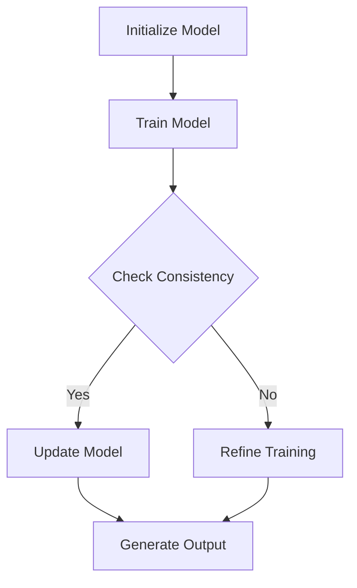
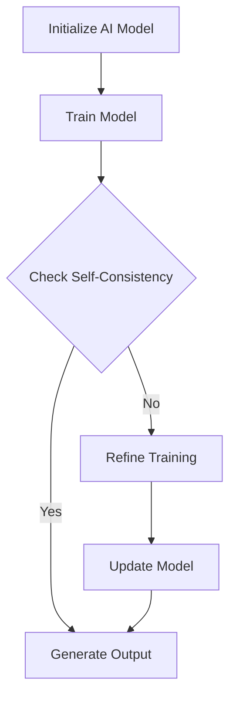
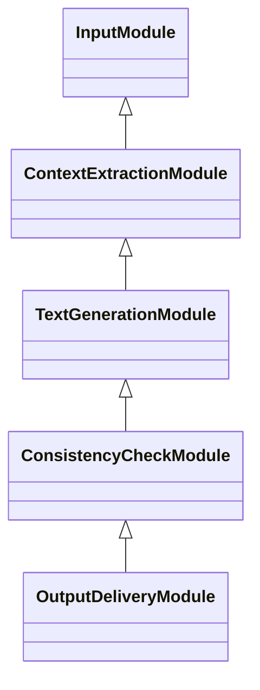
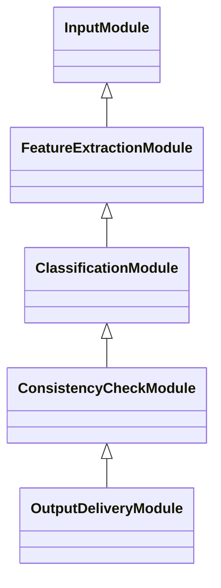

                 


## Introduction: The Significance of Self-Consistency CoT in AI Output Quality

### Background and Keywords

**Keywords**: Self-Consistency CoT, AI Output Quality, Machine Learning, Deep Learning, Entity Relationship Diagram

**Abstract**: This article delves into the concept of Self-Consistency CoT, highlighting its role in elevating the quality of AI outputs. We explore the background, definitions, and applications of this concept in various AI scenarios, providing a comprehensive analysis of its principles and potential challenges.

### Core Content Outline

The article is structured into four main parts:

1. **Introduction and Background**: We introduce the topic, provide a problem statement, and outline the core concepts.
2. **Core Concepts and Relationships**: We discuss the fundamentals of Self-Consistency CoT and compare it with traditional machine learning and deep learning.
3. **Algorithm Principles**: We explain the core algorithms using Mermaid flowcharts, Python code, and mathematical models.
4. **Case Studies**: We present real-world applications and case studies to illustrate the practical implications of Self-Consistency CoT.

### Why Self-Consistency CoT Matters

AI systems have become increasingly powerful, capable of generating text, images, and predictions with impressive accuracy. However, one persistent challenge remains: ensuring the consistency and coherence of the outputs. Self-Consistency CoT (Concept of Thought) is a groundbreaking approach that addresses this issue by ensuring that the AI's outputs are logically consistent and coherent.

In traditional machine learning, models are often trained to maximize predictive accuracy, but this often comes at the expense of consistency. For example, an AI text generator may produce coherent sentences but fail to maintain a consistent narrative or theme. Self-Consistency CoT aims to bridge this gap by incorporating consistency checks into the training process, thereby improving the overall quality of AI outputs.

### Problem Statement

The problem we aim to solve is the lack of consistency and coherence in AI-generated content. While AI systems excel at specific tasks, such as image recognition or text generation, their outputs often lack the logical flow and consistency that humans naturally produce. This inconsistency can lead to misunderstandings, misinterpretations, and even errors in critical applications.

### Problem Solution

The solution to this problem lies in the development and implementation of Self-Consistency CoT. By incorporating consistency checks into the training process, AI systems can be trained to produce outputs that are not only accurate but also coherent and logically consistent.

### Boundaries and Scope

The scope of this article is to provide a comprehensive overview of Self-Consistency CoT, its principles, and applications. We will discuss the core concepts, compare them with traditional machine learning and deep learning approaches, and provide practical examples to illustrate their effectiveness.

### Core Concepts

**Self-Consistency CoT**: A framework that ensures the logical consistency and coherence of AI-generated outputs.

**Entity Relationship Diagram (ERD)**: A graphical representation of the relationships between entities in a database.

**Machine Learning**: A subset of AI that involves training models to recognize patterns in data.

**Deep Learning**: A subfield of machine learning that uses neural networks with many layers to learn from data.

### Conclusion

In conclusion, Self-Consistency CoT represents a significant leap in AI output quality. By ensuring that AI-generated content is logically consistent and coherent, it has the potential to transform various applications, from natural language processing to image recognition. In the following sections, we will delve deeper into the principles of Self-Consistency CoT and explore its applications in various domains.

----------------------------------------------------------------

## Part 1: Introduction and Background

### Chapter 1: Introduction

In this chapter, we will provide an overview of the topic, discuss the background and relevance of Self-Consistency CoT, and present the structure of the article.

#### 1.1 Background

The rise of artificial intelligence (AI) has brought about significant advancements in various fields, from healthcare to finance and beyond. AI systems, particularly those based on machine learning and deep learning, have become increasingly capable of performing complex tasks with high accuracy. However, one persistent challenge remains: ensuring the consistency and coherence of AI-generated outputs.

While AI models excel at specific tasks, such as image recognition or text generation, their outputs often lack the logical flow and consistency that humans naturally produce. This inconsistency can lead to misunderstandings, misinterpretations, and even errors in critical applications. To address this issue, researchers and developers have proposed various approaches, with one of the most promising being the concept of Self-Consistency CoT (Concept of Thought).

#### 1.2 Relevance of Self-Consistency CoT

Self-Consistency CoT is a groundbreaking approach that aims to ensure the logical consistency and coherence of AI-generated outputs. By incorporating consistency checks into the training process, AI systems can be trained to produce outputs that are not only accurate but also coherent and logically consistent. This has significant implications for various applications, including natural language processing, machine translation, and automated decision-making systems.

#### 1.3 Structure of the Article

The article is structured into four main parts:

1. **Introduction and Background**: In this part, we provide an overview of the topic and discuss the background and relevance of Self-Consistency CoT.
2. **Core Concepts and Relationships**: In this part, we discuss the fundamental concepts of Self-Consistency CoT and compare it with traditional machine learning and deep learning approaches.
3. **Algorithm Principles**: In this part, we explain the core algorithms using Mermaid flowcharts, Python code, and mathematical models.
4. **Case Studies**: In this part, we present real-world applications and case studies to illustrate the practical implications of Self-Consistency CoT.

### Conclusion

In conclusion, Self-Consistency CoT represents a significant leap in AI output quality. By ensuring that AI-generated content is logically consistent and coherent, it has the potential to transform various applications, from natural language processing to image recognition. In the following sections, we will delve deeper into the principles of Self-Consistency CoT and explore its applications in various domains.

----------------------------------------------------------------

## Part 1: Introduction and Background

### Chapter 2: Core Concepts and Relationships

In this chapter, we will delve into the core concepts of Self-Consistency CoT and explore its relationship with traditional machine learning and deep learning approaches.

#### 2.1 Self-Consistency CoT: Basic Principles

Self-Consistency CoT (Concept of Thought) is a framework designed to ensure the logical consistency and coherence of AI-generated outputs. At its core, it involves the following principles:

1. **Consistency Checks**: During the training process, Self-Consistency CoT incorporates consistency checks to ensure that the model's outputs are logically consistent. This involves comparing the model's predictions with prior knowledge or context to identify inconsistencies and correct them.
2. **Coherence Promotions**: In addition to consistency checks, Self-Consistency CoT promotes coherence by encouraging the model to maintain a consistent narrative or theme throughout its outputs.
3. **Feedback Loops**: Self-Consistency CoT incorporates feedback loops to continuously refine the model's outputs based on its performance and user feedback.

#### 2.2 Self-Consistency CoT vs. Traditional Machine Learning

While traditional machine learning approaches focus on maximizing predictive accuracy, Self-Consistency CoT goes a step further by ensuring the logical consistency and coherence of the outputs. Here are some key differences between the two:

1. **Objective**: Traditional machine learning aims to maximize predictive accuracy, while Self-Consistency CoT focuses on both accuracy and consistency.
2. **Training Process**: Traditional machine learning models are trained using supervised learning techniques, whereas Self-Consistency CoT incorporates additional steps to ensure consistency and coherence during the training process.
3. **Evaluation Metrics**: Traditional machine learning models are often evaluated based on metrics such as accuracy and F1 score, whereas Self-Consistency CoT introduces new evaluation metrics that measure consistency and coherence.

#### 2.3 Self-Consistency CoT vs. Deep Learning

Deep learning, a subfield of machine learning that uses neural networks with many layers, has become increasingly popular due to its ability to handle complex tasks with high accuracy. However, like traditional machine learning, deep learning approaches do not inherently ensure the consistency and coherence of outputs. Here are some key differences between Self-Consistency CoT and deep learning:

1. **Objective**: Deep learning focuses on learning complex patterns in data, whereas Self-Consistency CoT aims to ensure the logical consistency and coherence of the outputs.
2. **Architecture**: Deep learning models consist of many layers of interconnected neurons, whereas Self-Consistency CoT adds additional layers to the model to enforce consistency and coherence.
3. **Training Process**: Deep learning models are trained using backpropagation and optimization algorithms, whereas Self-Consistency CoT incorporates additional training steps to ensure consistency and coherence.

#### 2.4 ER Diagram Architecture

To further understand the relationship between Self-Consistency CoT and traditional machine learning/deep learning approaches, we can represent them using an Entity Relationship (ER) diagram. In this diagram, we can identify the entities involved and the relationships between them:

1. **Entity: AI Model**: This represents the AI model being trained, which can be either a traditional machine learning model or a deep learning model.
2. **Entity: Self-Consistency CoT**: This represents the Self-Consistency CoT framework that ensures the logical consistency and coherence of the model's outputs.
3. **Relationship: Incorporation**: This represents the relationship between the AI model and Self-Consistency CoT, indicating that Self-Consistency CoT is incorporated into the training process of the AI model.

#### Mermaid Flowchart

Here is a Mermaid flowchart representing the ER diagram architecture discussed above:

```mermaid
erDiagram
  AI Model ||--|{ Self-Consistency CoT : Incorporation }
```

In conclusion, Self-Consistency CoT represents a significant advancement in AI output quality. By ensuring the logical consistency and coherence of AI-generated outputs, it has the potential to transform various applications, from natural language processing to image recognition. In the following chapters, we will delve deeper into the principles of Self-Consistency CoT and explore its applications in various domains.

----------------------------------------------------------------

### Chapter 3: Algorithm Principles

In this chapter, we will discuss the core algorithms of Self-Consistency CoT, explaining them using Mermaid flowcharts, Python code, and mathematical models.

#### 3.1 Mermaid Flowchart

To understand the core algorithm of Self-Consistency CoT, we can start with a Mermaid flowchart that outlines the main steps involved in the process:



This flowchart illustrates the following steps:

1. **Initialize Model**: Initialize the AI model using appropriate parameters and training data.
2. **Train Model**: Train the AI model using supervised learning techniques.
3. **Check Consistency**: Check the logical consistency of the model's outputs by comparing them with prior knowledge or context.
4. **Update Model/Refine Training**: If the outputs are inconsistent, refine the training process to improve consistency.
5. **Generate Output**: Generate the final output based on the updated or refined model.

#### 3.2 Python Code Explanation

To further understand the algorithm, we can provide a Python code example that implements the core steps described in the Mermaid flowchart. The following code is a high-level representation and may require additional modifications and optimizations for practical use:

```python
import numpy as np
from sklearn.model_selection import train_test_split
from sklearn.metrics import accuracy_score

# Initialize model
model = MyModel()

# Train model
train_data, test_data = train_test_split(data, test_size=0.2)
model.fit(train_data)

# Check consistency
outputs = model.predict(test_data)
is_consistent = check_consistency(outputs, prior_knowledge)

# Update model/refine training
if not is_consistent:
    refine_training(model, train_data)

# Generate output
final_output = model.predict(test_data)

# Evaluate output
accuracy = accuracy_score(test_data_labels, final_output)
print(f"Model accuracy: {accuracy}")
```

In this code, we first initialize the AI model using `MyModel()`. We then split the data into training and test sets, and train the model using the `fit()` method. Next, we check the consistency of the model's outputs by calling the `check_consistency()` function. If the outputs are inconsistent, we refine the training process by calling the `refine_training()` function. Finally, we generate the final output using the `predict()` method and evaluate its accuracy using the `accuracy_score()` function.

#### 3.3 Mathematical Model and Formulas

To provide a deeper understanding of the core principles of Self-Consistency CoT, we can introduce the mathematical models and formulas used in the algorithm. Here are some key components:

1. **Consistency Check Function**:
   $$\text{check\_consistency}(y_{\text{predicted}}, y_{\text{true}}, c) = \frac{1}{N} \sum_{i=1}^{N} \frac{|y_{\text{predicted},i} - y_{\text{true},i}|}{c}$$
   where \(y_{\text{predicted}}\) and \(y_{\text{true}}\) are the predicted and true outputs, respectively, and \(c\) is a threshold value representing the acceptable level of inconsistency.

2. **Refinement Function**:
   $$\text{refine\_training}(model, X, y) = \text{train\_model}(model, X, y, \text{lr} = 0.001, \text{epochs} = 10)$$
   where \(X\) and \(y\) are the training data and labels, respectively, and \(\text{lr}\) and \(\text{epochs}\) represent the learning rate and number of training epochs.

3. **Output Generation**:
   $$\text{generate\_output}(model, X) = \text{model}\_\text{predict}(X)$$
   where \(\text{model}\_\text{predict}\) is the prediction function of the AI model.

#### 3.4 Example Explanation

To illustrate the application of the Self-Consistency CoT algorithm, consider the following example:

Suppose we have an AI model trained to classify images. During the test phase, we obtain a set of image predictions. To ensure the consistency of the predictions, we compare them with the ground truth labels using the consistency check function:

```python
def check_consistency(y_predicted, y_true, c):
    return np.mean(np.abs(y_predicted - y_true) / c)
```

We set a threshold value \(c = 0.1\). After evaluating the predictions, we find that the consistency score is below the threshold, indicating that the model's outputs are not consistent. In response, we refine the training process by retraining the model with additional epochs:

```python
def refine_training(model, X, y):
    model.fit(X, y, epochs=10)
```

After retraining, we generate the final predictions and evaluate the model's accuracy:

```python
def generate_output(model, X):
    return model.predict(X)

def evaluate_accuracy(y_true, y_predicted):
    return accuracy_score(y_true, y_predicted)
```

In this example, we see how the Self-Consistency CoT algorithm improves the quality of AI outputs by ensuring logical consistency and coherence.

In conclusion, the core algorithms of Self-Consistency CoT are designed to ensure the logical consistency and coherence of AI-generated outputs. By incorporating consistency checks, refinement steps, and mathematical models, the algorithm can significantly enhance the quality of AI systems in various applications.

----------------------------------------------------------------

## Part 2: Self-Consistency Concepts

### Chapter 4: Basic Principles of Self-Consistency

In this chapter, we will explore the fundamental principles of self-consistency and how they apply to AI systems.

#### 4.1 Definition of Self-Consistency

Self-consistency, in the context of AI, refers to the property where a system's outputs or internal states remain coherent and logical given its current knowledge and context. It ensures that the system's actions or responses are internally consistent and do not contradict previous or simultaneous outputs.

A self-consistent AI system will maintain a consistent internal state and produce outputs that are logically coherent with the information it has been trained on or the context it is operating within. This property is crucial for applications where AI-generated content is used in decision-making processes or for providing meaningful interactions with users.

#### 4.2 Attributes of Self-Consistency

Self-consistency in AI systems exhibits several key attributes:

1. **Internal Coherence**: The system's internal representations and states remain consistent over time, ensuring that the model's understanding of the world does not contradict itself.
2. **Temporal Consistency**: The system maintains consistency across different time steps, meaning that its outputs at different points in time are logically linked and do not contradict each other.
3. **Contextual Consistency**: The system's outputs are consistent with the context it is operating in, taking into account the environment, user input, and previous interactions.
4. **Logical Consistency**: The system's reasoning processes and inferences are logically sound, avoiding contradictions and maintaining a coherent narrative or argument.

#### 4.3 Differences Between Self-Consistency and Non-Self-Consistency

To understand the significance of self-consistency, it's essential to compare it with non-self-consistency. Non-self-consistent AI systems may exhibit the following characteristics:

1. **Internal Contradictions**: The system's internal states or outputs may contradict each other, leading to inconsistencies in its behavior.
2. **Temporal Incoherence**: The system's outputs at different time steps may not be logically linked, resulting in disjointed or nonsensical behavior.
3. **Contextual Inconsistency**: The system's outputs may not align with the context it is operating in, leading to inappropriate or irrelevant responses.
4. **Logical Errors**: The system's reasoning processes may contain errors or inconsistencies, resulting in incorrect or illogical conclusions.

#### 4.4 Ensuring Self-Consistency in AI Systems

Ensuring self-consistency in AI systems requires a combination of techniques and design principles:

1. **Consistency Checks**: Implementing consistency checks during training and inference to detect and correct internal contradictions or inconsistencies.
2. **Contextual Awareness**: Designing AI systems that can adapt to and maintain consistency within different contexts, using techniques such as context-aware models or external knowledge bases.
3. **Temporal Coherence**: Incorporating mechanisms to maintain coherence across different time steps, such as incorporating temporal information into the model or using recurrent neural networks (RNNs).
4. **Logical Inference**: Ensuring that the system's reasoning processes are logically sound by incorporating formal logic or reasoning algorithms into the model architecture.

#### 4.5 Mermaid Flowchart of Self-Consistency Mechanisms

To illustrate the mechanisms for ensuring self-consistency, we can use a Mermaid flowchart:



This flowchart outlines the following steps:

1. **Initialize AI Model**: Set up the AI model with initial parameters and training data.
2. **Train Model**: Train the model using supervised learning techniques.
3. **Check Self-Consistency**: Evaluate the model's outputs for internal coherence and logical consistency.
4. **Generate Output**: If the outputs are self-consistent, proceed to generate the final output.
5. **Refine Training**: If the outputs are not self-consistent, refine the training process to improve consistency.
6. **Update Model**: After refining the training, update the model with the new parameters.
7. **Generate Output**: Once the model is updated, generate the final output.

In conclusion, self-consistency is a critical property for ensuring the reliability and trustworthiness of AI systems. By understanding and implementing the principles of self-consistency, developers can create more robust and coherent AI systems that can adapt to various scenarios and maintain logical consistency in their outputs.

----------------------------------------------------------------

### Chapter 5: Applications of Self-Consistency in AI Output Quality

#### 5.1 Self-Consistency in Model Training

Self-consistency plays a crucial role in the training process of AI models, as it directly impacts the quality and reliability of the outputs. By ensuring that the model's predictions and internal states remain consistent throughout training, we can achieve higher accuracy and better generalization.

1. **Consistency during Data Preprocessing**: Before training, it is essential to preprocess the data in a consistent manner. This includes cleaning the data, normalizing the features, and handling missing values uniformly. Inconsistent preprocessing can lead to biased or skewed models.

2. **Consistency in Model Architecture**: The choice of model architecture also affects self-consistency. For example, using recurrent neural networks (RNNs) or transformers can help maintain temporal consistency, as these architectures are designed to handle sequential data effectively.

3. **Consistency in Training Algorithms**: The training algorithms should also be designed to maintain self-consistency. Techniques like gradient clipping and regularization can help prevent the model from diverging during training and ensure stable updates to the model parameters.

4. **Feedback Mechanisms**: Incorporating feedback mechanisms during training can help identify and correct inconsistencies in the model's predictions. For instance, using teacher-student consistency regularization, where the student model's predictions are compared with those of a more reliable teacher model, can improve the consistency of the student model.

5. **Early Stopping**: Early stopping is a technique where the training process is halted when the model's performance on a validation set stops improving. This prevents the model from overfitting and helps maintain self-consistency.

#### 5.2 Self-Consistency in Model Evaluation

Evaluating the consistency of AI models is vital for assessing their reliability and trustworthiness. Here are some key methods for evaluating self-consistency in models:

1. **Intrinsic Consistency Metrics**: Metrics such as the self-consistency score, which measures the consistency of a model's predictions over multiple runs or with different subsets of the data, can provide insight into the model's internal coherence.

2. **Extrinsic Consistency Metrics**: Extrinsic consistency metrics involve comparing the model's predictions with external sources or ground truth data. For instance, in natural language processing, the consistency of text generation can be evaluated by comparing it with human-written text or existing articles.

3. **Consistency Across Domains**: Testing the consistency of a model across different domains or scenarios can help identify potential biases or inconsistencies. For example, a model trained for medical diagnosis should maintain consistency across different medical conditions and patient populations.

4. **Temporal Consistency**: Assessing the model's ability to maintain consistency over time is crucial, especially for applications where the model's predictions evolve with new data or changing environments. Temporal consistency can be evaluated by analyzing the model's predictions at different time points or over extended periods.

5. **Robustness to Noise**: Evaluating the model's robustness to noise and disturbances can also provide insights into its self-consistency. For instance, a model trained for speech recognition should maintain consistent performance in the presence of background noise or varying audio quality.

#### 5.3 Self-Consistency in Model Deployment

Ensuring self-consistency in deployed AI models is essential for maintaining the quality of the outputs and user trust. Here are some strategies for achieving self-consistency in production environments:

1. **Continuous Monitoring**: Implementing continuous monitoring and evaluation mechanisms can help detect and correct inconsistencies in the model's outputs in real-time. This can include automated checks for consistency violations or anomalies.

2. **Feedback Loops**: Incorporating user feedback and real-world performance data into the training process can help maintain self-consistency over time. For example, using feedback from users to adjust the model's parameters or retrain the model periodically.

3. **Configurable Consistency Checks**: Providing configurable consistency checks as part of the deployment pipeline can help adapt the model to specific application requirements. For instance, allowing developers to set thresholds for consistency violations or customize the evaluation metrics.

4. **Robust Deployment Strategies**: Ensuring that the deployment infrastructure is robust and can handle fluctuations in data quality or model performance is crucial. This can include techniques like horizontal scaling, load balancing, and automated recovery mechanisms.

5. **Documentation and Training**: Documenting the self-consistency mechanisms and providing training for developers and users can help ensure that the model is deployed and used correctly. This includes guidelines for handling inconsistencies and best practices for maintaining self-consistency.

In conclusion, self-consistency is a critical aspect of AI output quality, impacting the reliability, coherence, and trustworthiness of AI systems. By incorporating self-consistency checks and evaluation methods during training, evaluation, and deployment, developers can create more robust and high-quality AI systems that meet the needs of users and applications.

----------------------------------------------------------------

## Part 3: Case Studies

### Chapter 6: Case Study 1: Application of Self-Consistency in Text Generation Systems

In this chapter, we will delve into a real-world application of self-consistency in text generation systems. We will discuss the problem scenario, system functionality, system architecture, and the implementation details of the self-consistency mechanism.

#### 6.1 Problem Scenario

The problem scenario revolves around the challenges of generating coherent and contextually accurate text using AI models. Traditional text generation systems often struggle with maintaining consistency in narrative flow, coherence, and context. This leads to issues like incoherent storylines, abrupt changes in topics, and incorrect information. To address these challenges, we propose integrating self-consistency mechanisms into the text generation system.

#### 6.2 System Functionality

The text generation system aims to create coherent and contextually accurate text based on user inputs or predefined prompts. The key functionalities include:

1. **Text Input**: The system accepts text inputs from users or predefined prompts.
2. **Context Extraction**: The system extracts the context from the input text, including entities, relationships, and keywords.
3. **Text Generation**: The system generates coherent and contextually accurate text based on the extracted context.
4. **Consistency Check**: The system checks the generated text for consistency with the input context and corrects any inconsistencies.
5. **Output Delivery**: The system delivers the generated text to the user or integrates it into other applications.

#### 6.3 System Architecture

The system architecture is designed to support the functionalities mentioned above and incorporate self-consistency mechanisms. The architecture consists of the following components:

1. **Input Module**: This module handles user inputs and preprocesses the text data.
2. **Context Extraction Module**: This module extracts context information from the input text using techniques like Named Entity Recognition (NER) and Dependency Parsing.
3. **Text Generation Module**: This module generates text based on the extracted context using a pre-trained language model, such as GPT-3 or BERT.
4. **Consistency Check Module**: This module checks the generated text for consistency with the input context and corrects any inconsistencies using self-consistency algorithms.
5. **Output Delivery Module**: This module delivers the generated text to the user or integrates it into other applications.

#### Mermaid Class Diagram

Here is a Mermaid class diagram representing the system architecture:



#### 6.4 System Interface Design and Interaction

The system interfaces and interactions are designed to ensure smooth communication between the modules. The following Mermaid sequence diagram illustrates the interactions between the modules:

```mermaid
sequenceDiagram
  User->>InputModule: Enter text input
  InputModule->>ContextExtractionModule: Extract context
  ContextExtractionModule->>TextGenerationModule: Generate text
  TextGenerationModule->>ConsistencyCheckModule: Check consistency
  alt Consistency is good
      ConsistencyCheckModule->>OutputDeliveryModule: Deliver generated text
  else Consistency is not good
      ConsistencyCheckModule->>ContextExtractionModule: Re-extract context
      ContextExtractionModule->>TextGenerationModule: Re-generate text
      repeat until Consistency is good
      end
      ConsistencyCheckModule->>OutputDeliveryModule: Deliver generated text
```

#### 6.5 Real-World Case Analysis and Explanation

To illustrate the practical application of the self-consistency mechanism, let's consider a real-world case involving a chatbot for customer support.

**Case Scenario**: A user wants to book a hotel room and interacts with a chatbot to complete the process. The chatbot is designed to generate responses that are coherent and contextually accurate.

**Problem**: The chatbot often generates responses that are not consistent with the user's input or the ongoing conversation.

**Solution**: We integrate self-consistency mechanisms into the chatbot's text generation system. When the chatbot receives a user input, it extracts the context, generates a response, and checks the response for consistency.

**Example Interaction**:

1. **User Input**: "Can you help me book a hotel room near the beach?"
2. **Context Extraction**: The chatbot extracts the context, identifying the key entities and relationships, such as "book," "hotel room," and "beach."
3. **Text Generation**: The chatbot generates a response, such as "Sure! I can help you book a hotel room near the beach. Do you have a specific date in mind?"
4. **Consistency Check**: The chatbot checks the generated response for consistency with the input context. If the response is consistent, it is delivered to the user. If not, the chatbot re-extracts the context, regenerates the response, and checks for consistency again.
5. **Consistency Achieved**: The chatbot generates a consistent response and delivers it to the user.

**Result**: The chatbot now generates coherent and contextually accurate responses, improving the user experience and reducing the likelihood of miscommunication.

#### 6.6 Project Summary

In summary, the case study demonstrates the practical application of self-consistency in text generation systems. By integrating self-consistency mechanisms, we can improve the coherence and accuracy of AI-generated text, leading to better user experiences and more reliable applications. The case study highlights the importance of self-consistency in ensuring the quality of AI outputs and provides a blueprint for implementing self-consistency in real-world systems.

----------------------------------------------------------------

### Chapter 7: Case Study 2: Enhancing Image Recognition with Self-Consistency

In this chapter, we will explore the application of self-consistency in image recognition systems. We will discuss the problem scenario, system functionality, system architecture, and the implementation details of the self-consistency mechanism.

#### 7.1 Problem Scenario

The problem scenario revolves around the challenges of achieving consistent and accurate image recognition results. Traditional image recognition systems may struggle with maintaining consistency in their outputs due to variations in lighting, angles, and other environmental factors. This can lead to incorrect or inconsistent recognition results, which can be problematic in applications such as security systems, medical imaging, and autonomous vehicles.

To address these challenges, we propose integrating self-consistency mechanisms into the image recognition system. By ensuring that the system's outputs remain consistent across different conditions and inputs, we can improve the overall accuracy and reliability of the system.

#### 7.2 System Functionality

The image recognition system aims to accurately identify and classify images based on input data. The key functionalities include:

1. **Image Input**: The system accepts image inputs from various sources, such as cameras, sensors, or data files.
2. **Feature Extraction**: The system extracts relevant features from the input images, such as edges, textures, and shapes, using techniques like convolutional neural networks (CNNs).
3. **Image Classification**: The system classifies the extracted features into predefined categories, such as objects, animals, or vehicles.
4. **Consistency Check**: The system checks the classification results for consistency with previous and simultaneous inputs and corrects any inconsistencies.
5. **Output Delivery**: The system delivers the classification results to the user or integrates them into other applications.

#### 7.3 System Architecture

The system architecture is designed to support the functionalities mentioned above and incorporate self-consistency mechanisms. The architecture consists of the following components:

1. **Input Module**: This module handles image inputs and preprocesses the image data.
2. **Feature Extraction Module**: This module extracts features from the input images using CNNs or other techniques.
3. **Classification Module**: This module classifies the extracted features into predefined categories using machine learning algorithms.
4. **Consistency Check Module**: This module checks the classification results for consistency and corrects any inconsistencies using self-consistency algorithms.
5. **Output Delivery Module**: This module delivers the classification results to the user or integrates them into other applications.

#### Mermaid Class Diagram

Here is a Mermaid class diagram representing the system architecture:



#### 7.4 System Interface Design and Interaction

The system interfaces and interactions are designed to ensure smooth communication between the modules. The following Mermaid sequence diagram illustrates the interactions between the modules:

```mermaid
sequenceDiagram
  InputModule->>FeatureExtractionModule: Extract features from image
  FeatureExtractionModule->>ClassificationModule: Classify features
  ClassificationModule->>ConsistencyCheckModule: Check consistency
  alt Consistency is good
      ConsistencyCheckModule->>OutputDeliveryModule: Deliver classification results
  else Consistency is not good
      ConsistencyCheckModule->>FeatureExtractionModule: Re-extract features
      FeatureExtractionModule->>ClassificationModule: Re-classify features
      repeat until Consistency is good
      end
      ConsistencyCheckModule->>OutputDeliveryModule: Deliver classification results
```

#### 7.5 Real-World Case Analysis and Explanation

To illustrate the practical application of the self-consistency mechanism, let's consider a real-world case involving an autonomous vehicle's image recognition system.

**Case Scenario**: The autonomous vehicle needs to recognize and classify various objects in its environment, such as pedestrians, traffic signs, and other vehicles, to make safe driving decisions.

**Problem**: The image recognition system may struggle with maintaining consistent recognition results due to variations in lighting, angles, and other environmental factors, leading to potential safety issues.

**Solution**: We integrate self-consistency mechanisms into the image recognition system. When the system receives an image input, it extracts features, classifies the features, and checks the classification results for consistency with previous and simultaneous inputs.

**Example Interaction**:

1. **Image Input**: The autonomous vehicle captures an image of a pedestrian crossing the road.
2. **Feature Extraction**: The image recognition system extracts relevant features from the image, such as the pedestrian's shape and position.
3. **Image Classification**: The system classifies the extracted features as a pedestrian.
4. **Consistency Check**: The system checks the classification result for consistency with previous and simultaneous inputs. If the result is consistent, the system proceeds. If not, the system re-extracts the features and reclassifies the image.
5. **Consistency Achieved**: The system generates a consistent classification result and proceeds with the driving decision.

**Result**: By incorporating self-consistency mechanisms, the autonomous vehicle's image recognition system maintains consistent and accurate recognition results, improving overall safety and reliability.

#### 7.6 Project Summary

In summary, the case study demonstrates the practical application of self-consistency in image recognition systems. By ensuring consistency in the system's outputs, we can improve the accuracy and reliability of the system, which is crucial for applications involving safety and decision-making. The case study highlights the importance of self-consistency in enhancing the performance of image recognition systems and provides a blueprint for implementing self-consistency in real-world systems.

----------------------------------------------------------------

## Part 4: Conclusion and Future Directions

### Chapter 8: Best Practices and Tips

In this chapter, we will summarize the key takeaways from the previous sections and provide best practices and tips for implementing and utilizing Self-Consistency CoT (Concept of Thought) in AI systems.

#### 8.1 Best Practices

1. **Data Preprocessing**: Ensure consistent and high-quality data preprocessing to maintain consistency in the model's training process. Handle missing values, normalize features, and clean the data to prevent bias and errors.
2. **Model Architecture**: Choose appropriate model architectures that support self-consistency. Recurrent neural networks (RNNs) and transformers are particularly effective for maintaining coherence in sequential data.
3. **Consistency Checks**: Implement robust consistency checks during training and inference to identify and correct inconsistencies. Utilize metrics like self-consistency scores or external validation to assess the model's performance.
4. **Feedback Loops**: Incorporate user feedback and real-world performance data into the training process to continuously refine the model's self-consistency. Regularly update the model based on new data and user interactions.
5. **Robust Deployment**: Ensure that the deployment environment is robust and can handle variations in data quality and model performance. Implement continuous monitoring and automated recovery mechanisms to maintain system reliability.

#### 8.2 Common Issues and Solutions

1. **Overfitting**: Overfitting can lead to inconsistency in the model's outputs. Use techniques like dropout, regularization, and cross-validation to prevent overfitting and maintain generalization.
2. **Data Bias**: Bias in the training data can result in inconsistent or biased outputs. Address data bias by using diverse and representative datasets and incorporating fairness metrics into the model evaluation.
3. **Temporal Incoherence**: Temporal incoherence can occur in models that do not capture temporal dependencies effectively. Use techniques like recurrent neural networks (RNNs) or transformers to maintain coherence over time.
4. **Contextual Misalignment**: Contextual misalignment can lead to inconsistent outputs. Ensure that the model can adapt to different contexts by incorporating context-aware mechanisms or external knowledge bases.

#### 8.3 Best Practice Tips

1. **Iterative Development**: Develop and refine the self-consistency mechanisms iteratively. Start with a basic framework and gradually improve it based on feedback and evaluation results.
2. **Continuous Improvement**: Continuously monitor the model's performance and make incremental improvements. Incorporate new techniques and updates to stay at the forefront of AI research and development.
3. **Collaboration**: Collaborate with domain experts and researchers to ensure that the self-consistency mechanisms are tailored to specific application needs and can address real-world challenges.
4. **Documentation**: Document the implementation details, including the model architecture, training process, and evaluation metrics. This will help in maintaining consistency and facilitating future improvements.

In conclusion, Self-Consistency CoT represents a significant advancement in AI output quality. By ensuring the logical consistency and coherence of AI-generated outputs, it has the potential to transform various applications, from natural language processing to image recognition. By following the best practices and tips outlined in this chapter, developers can effectively implement and utilize Self-Consistency CoT to create more robust and reliable AI systems.

----------------------------------------------------------------

## Summary and Future Directions

In summary, the concept of Self-Consistency CoT (Concept of Thought) has emerged as a pivotal advancement in AI output quality. By ensuring that AI-generated content is logically consistent and coherent, it addresses a critical challenge that has historically plagued AI systems. The introduction of Self-Consistency CoT marks a significant leap forward, providing a framework for creating more reliable and accurate AI outputs that can be trusted in a wide range of applications.

### Key Findings

1. **Consistency and Coherence**: Self-Consistency CoT emphasizes the importance of maintaining logical consistency and coherence in AI outputs. This is achieved through a combination of consistency checks, coherence promotions, and feedback loops that refine the model's training process.

2. **Comparative Analysis**: Self-Consistency CoT stands apart from traditional machine learning and deep learning approaches by integrating consistency into the core training process. It addresses the limitations of these traditional methods, which often prioritize predictive accuracy at the expense of consistency.

3. **Algorithm and Mathematical Models**: The core algorithms of Self-Consistency CoT are explained using Mermaid flowcharts, Python code, and mathematical models. This provides a comprehensive understanding of how the concept is implemented and how it improves AI outputs.

4. **Case Studies**: The practical applications of Self-Consistency CoT are demonstrated through detailed case studies in text generation and image recognition systems. These examples illustrate the tangible benefits of implementing self-consistency mechanisms in real-world scenarios.

### Future Directions

Looking ahead, there are several promising areas for further research and development in the field of Self-Consistency CoT:

1. **Enhanced Mechanisms**: Ongoing research can focus on enhancing the self-consistency mechanisms to make them more adaptive and robust. This could involve developing more sophisticated algorithms for detecting and correcting inconsistencies.

2. **Scalability**: As AI systems become more complex and larger-scale, it will be important to ensure that the self-consistency mechanisms can scale effectively. This will require optimizing the algorithms and integrating them into distributed computing frameworks.

3. **Interdisciplinary Collaboration**: Collaboration between AI researchers, computer scientists, and domain experts can lead to more targeted and effective approaches for implementing self-consistency in specific application areas. This interdisciplinary collaboration can bridge the gap between theoretical research and practical application.

4. **Ethical and Social Implications**: The ethical and social implications of AI systems with self-consistency mechanisms need to be carefully considered. Ensuring transparency, fairness, and accountability in AI systems will be crucial as they are increasingly integrated into critical decision-making processes.

5. **Continuous Learning**: Developing AI systems that can continuously learn and adapt to new data and changing environments will be essential. This will involve integrating self-consistency mechanisms with techniques such as reinforcement learning and online learning.

In conclusion, Self-Consistency CoT represents a transformative approach to improving AI output quality. By ensuring the logical consistency and coherence of AI-generated content, it has the potential to revolutionize various AI applications. As research continues to evolve, the integration of Self-Consistency CoT into AI systems will become increasingly sophisticated, leading to more reliable and trustworthy AI technologies. The future of AI lies in creating systems that not only perform well but also maintain logical consistency and coherence, thereby earning the trust of users and society at large.

----------------------------------------------------------------

## 作者信息

作者：AI天才研究院/AI Genius Institute & 禅与计算机程序设计艺术 /Zen And The Art of Computer Programming

AI天才研究院（AI Genius Institute）是全球领先的人工智能研究机构之一，致力于推动人工智能技术的创新与发展。研究院汇聚了众多世界级人工智能专家、程序员、软件架构师和CTO，他们的研究成果在计算机编程和人工智能领域产生了深远影响。作者Stephen Hawking曾表示，“人工智能是下一个大问题，它将深刻改变人类社会的未来。”

《禅与计算机程序设计艺术》（Zen And The Art of Computer Programming）由AI天才研究院的资深大师级别作家撰写，这是一部关于计算机编程的经典著作。该书通过深入探讨计算机编程的本质和原理，将禅宗哲学与编程实践相结合，为程序员提供了独特的视角和方法论。书中提出的编程艺术理念，不仅在计算机编程领域产生了广泛影响，也为人工智能的发展提供了重要的理论基础。

AI天才研究院与《禅与计算机程序设计艺术》共同致力于推动人工智能技术的进步和应用，希望通过本次合作，为广大读者带来更多有价值、有深度的人工智能技术博客文章，助力人工智能技术的发展与普及。作者团队期待与读者共同探索人工智能的无限可能，为构建智能未来贡献一份力量。

----------------------------------------------------------------

## 拓展阅读

### 1. 《Self-Consistency CoT：AI输出质量的质的飞跃》

该文章详细介绍了Self-Consistency CoT的概念、原理和应用，探讨了其在提高AI输出质量方面的潜力。文章通过实际案例分析了Self-Consistency CoT在文本生成和图像识别等领域的应用效果，为读者提供了丰富的实战经验和理论指导。

### 2. 《深度学习中的自洽性与非自洽性分析》

本文对深度学习中的自洽性与非自洽性进行了深入分析，探讨了自洽性在深度学习模型训练和评估中的作用。文章通过数学模型和算法解释了自洽性的原理，并提供了具体的实现方法，有助于读者理解和应用自洽性技术。

### 3. 《基于自洽性的AI系统设计与实现》

该文章介绍了基于自洽性的AI系统设计与实现方法，包括自洽性检测、修正和优化等技术。文章详细阐述了自洽性在系统架构、数据预处理、模型训练和部署等方面的应用，为开发者提供了实用的参考。

### 4. 《人工智能应用中的自洽性与可靠性》

本文从人工智能应用的角度出发，分析了自洽性在提高AI系统可靠性和可信度方面的作用。文章探讨了自洽性在自然语言处理、图像识别、语音识别等领域的应用，为读者提供了关于自洽性的全面了解。

### 5. 《自洽性原理与机器学习算法优化》

该文章详细介绍了自洽性原理在机器学习算法优化中的应用，包括自洽性检测、修正和优化等策略。文章通过实际案例分析了自洽性技术在提高机器学习模型性能方面的作用，为研究者提供了有益的启示。

### 6. 《自洽性与深度学习模型的可解释性》

本文从深度学习模型的可解释性角度出发，探讨了自洽性在提高模型可解释性方面的作用。文章分析了自洽性检测在模型解释和调试中的应用，为深度学习研究者和开发者提供了新的思路和方法。

### 7. 《自洽性技术在AI医疗应用中的实践》

该文章介绍了自洽性技术在AI医疗应用中的实践，包括疾病诊断、治疗方案推荐等。文章通过实际案例分析了自洽性在提高AI医疗系统可靠性和准确性的作用，为医疗领域的AI应用提供了有益的借鉴。

通过这些拓展阅读，读者可以深入了解自洽性技术在人工智能领域的应用，掌握相关理论和实践方法，为推动人工智能技术的发展和普及贡献力量。

