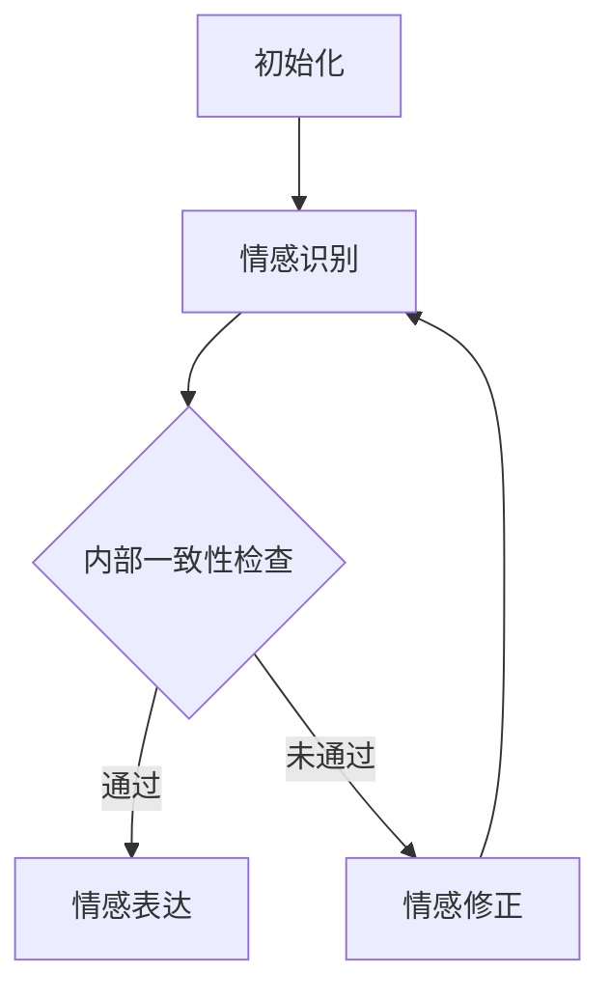

                 

### 前言

#### 自我一致性概念介绍

自我一致性（Self-Consistency）是近年来在人工智能领域崭露头角的一个核心概念，它强调AI系统在处理信息和生成输出时保持内在一致性的能力。在传统的AI系统中，一致性往往被忽视，这可能导致AI行为的不稳定和不可预测性。自我一致性通过强化内部逻辑的一致性，提高了AI系统的可靠性和可信度。

#### 情感智能在AI中的重要性

情感智能在人工智能中的应用越来越受到关注。它不仅涉及AI对人类情感的识别和理解，还包括AI自身情感表达和情绪调节的能力。情感智能的实现，使AI能够更自然地与人类互动，提升了用户体验和交互的深度。特别是在服务型机器人、虚拟助手和社交平台等领域，情感智能显得尤为重要。

#### 本书结构安排和阅读建议

本书旨在深入探讨自我一致性与情感智能的结合，并提供一套系统的理论框架和实践指南。全书分为五个部分，结构如下：

1. **第一部分：问题背景与核心概念**：介绍情感智能和自我一致性的基本概念，以及它们在AI系统中的重要性。
  
2. **第二部分：算法原理与实现**：详细讲解自我一致性算法的原理、数学模型和实现方法，并通过实际案例说明其应用。

3. **第三部分：系统分析与架构设计**：分析情感智能系统的设计和实现，包括系统功能设计、架构设计和接口设计。

4. **第四部分：项目实战**：通过实际项目安装和实现，展示自我一致性算法在情感智能系统中的应用。

5. **第五部分：最佳实践与总结**：总结最佳实践技巧，并推荐拓展阅读资源。

本书适合对人工智能和情感智能有一定了解的读者，无论是研究人员、工程师还是对这一领域感兴趣的学生，都将从本书中获得深刻的理解和实用的指导。

### 关键词

- 自我一致性
- 情感智能
- AI算法
- 数学模型
- 系统架构
- 实际应用

### 摘要

本文深入探讨了自我一致性（Self-Consistency）在增强人工智能情感智能中的应用。首先介绍了自我一致性和情感智能的基本概念，随后详细分析了自我一致性算法的原理、数学模型及其实现方法。接着，通过实际项目展示了算法在情感智能系统中的具体应用，并分析了系统的架构设计和接口设计。最后，总结了最佳实践技巧，并对未来的研究方向进行了展望。本文旨在为读者提供一个全面、系统的自我一致性情感智能解决方案。

---

### 第一部分：问题背景与核心概念

#### 第1章：问题背景与情感智能的兴起

在人工智能（AI）迅猛发展的今天，情感智能成为了AI研究领域中的一个热点话题。情感智能不仅仅是对人类情感的识别和理解，更包括了AI自身对情感的感知、表达和调节能力。随着人工智能在各个领域的应用日益广泛，人们越来越意识到情感智能的重要性。

**1.1 人类情感与情感智能的定义**

人类情感是指人们在生活中体验到的各种心理状态，如快乐、悲伤、愤怒、焦虑等。情感智能则是指个体识别、理解、表达和调节自己及他人情感的能力。它包括以下几个关键要素：

- **情感识别**：能够感知和理解自身和他人的情感状态。
- **情感理解**：能够解释和推断他人情感的原因和动机。
- **情感表达**：能够适当地表达自己的情感。
- **情感调节**：能够管理和调节自己的情感状态。

**1.2 人工智能发展中的情感智能挑战**

尽管情感智能在人类社会中至关重要，但在人工智能的发展过程中，实现情感智能面临着诸多挑战：

- **复杂性**：情感智能涉及到复杂的情感状态和多层次的情感互动，这使得AI系统在设计和实现过程中面临巨大的复杂性。
- **数据质量**：情感智能的实现依赖于大量的情感数据，数据的质量和多样性直接影响情感识别的准确性。
- **不确定性**：情感表达和情感理解存在很大的主观性和不确定性，这使得AI系统在处理情感问题时更加困难。

**1.3 自我一致性概念（Self-Consistency CoT）介绍**

自我一致性是指一个系统在处理信息和生成输出时，保持内部逻辑一致性的能力。在人工智能领域，自我一致性被引入以解决AI系统在情感识别和表达中的不一致性问题。自我一致性的核心目标是确保AI系统在处理情感相关任务时，能够保持内部逻辑的一致性和可靠性。

**1.4 自我一致性在情感智能中的意义**

自我一致性在情感智能中的应用具有重要意义：

- **提高可靠性**：通过保持内部逻辑的一致性，AI系统在处理情感相关任务时能够减少错误和偏差，提高系统的可靠性。
- **增强用户信任**：在人与AI的交互中，自我一致性有助于增强用户对AI系统的信任，提升用户体验。
- **扩展应用场景**：自我一致性算法的应用，使得AI系统能够在更多的情感智能应用场景中发挥作用，如虚拟助手、社交机器人等。

综上所述，情感智能和自我一致性在人工智能领域扮演着重要的角色。通过深入探讨这两者的关系，我们可以更好地理解和利用它们，推动人工智能的发展和应用。

#### 第2章：核心概念与联系

**2.1 情感智能的基本要素**

情感智能作为人工智能的重要分支，其核心要素包括情感识别、情感理解和情感表达。以下是这些要素的详细描述：

- **情感识别**：情感识别是情感智能的基础，它涉及从数据中提取和识别情感信息。这可以通过自然语言处理、语音识别等技术实现。例如，通过分析文本中的情感词汇和语气，可以识别出用户的情感状态。
  
- **情感理解**：情感理解是指AI系统对情感信息的深入分析，包括理解情感的内涵和原因。这不仅需要识别情感，还需要推断情感产生的背景和动机。例如，在对话中，AI需要理解用户为什么表达某种情感，是因為什麼原因產生這種情感。
  
- **情感表达**：情感表达是指AI系统能够模拟和传达情感。这包括在文本、语音和面部表情中的情感表达。例如，一个虚拟助手可以通过语音和文本的语调、语气来模拟快乐、悲伤等情感。

**2.2 自我一致性与情感智能的关系**

自我一致性（Self-Consistency CoT）与情感智能之间有着密切的联系。自我一致性主要解决的是AI系统在情感识别和表达过程中的一致性问题。具体来说：

- **提高一致性和可靠性**：自我一致性确保AI系统在处理情感相关任务时，内部逻辑保持一致，减少错误和偏差。例如，当AI系统识别到用户表达某种情感时，它应该在整个交互过程中保持这种情感的识别结果，而不是在后续的交互中突然改变。
  
- **增强用户信任**：自我一致性有助于增强用户对AI系统的信任。如果AI系统能够在情感识别和表达上保持一致，用户会觉得系统更加可靠和可依赖。
  
- **优化情感交互**：自我一致性使得AI系统能够更好地模拟和理解人类的情感交互，从而提升用户体验。例如，一个虚拟助手在帮助用户解决问题时，如果能够保持积极的情感状态，会让用户感到更加舒适和满意。

**2.3 情感智能的属性特征对比表格**

为了更清晰地展示情感智能的属性特征，以下是一个对比表格：

| 属性特征 | 情感识别 | 情感理解 | 情感表达 |
| :--: | :--: | :--: | :--: |
| 定义 | 从数据中提取和识别情感信息 | 深入分析情感信息的内涵和原因 | 在文本、语音和面部表情中模拟和传达情感 |
| 关键技术 | 自然语言处理、语音识别 | 情感分析、情感推理 | 语音合成、文本生成、面部表情生成 |
| 目标 | 准确识别情感 | 理解情感的原因和动机 | 模拟人类的情感表达 |
| 关系 | 基础 | 进阶 | 实现与用户的情感交互 |

**2.4 ER实体关系图架构**

为了更好地理解和设计情感智能系统，我们引入实体关系图（ER图）来描述系统中的关键实体及其关系。以下是情感智能系统的ER图：

```mermaid
erDiagram
    User ||--|{ Emotion}: "感受"
    AI_System ||--|{ Recognize}: "识别"
    AI_System ||--|{ Understand}: "理解"
    AI_System ||--|{ Express}: "表达"
    Emotion ||--|{ Recognition}: "识别结果"
    Emotion ||--|{ Understanding}: "理解结果"
    Emotion ||--|{ Expression}: "表达结果"
```

在这个ER图中，用户（User）是情感智能系统的核心实体，它与情感（Emotion）实体之间存在关联关系。AI系统（AI_System）则负责识别（Recognize）、理解（Understand）和表达（Express）情感。识别结果（Recognition）、理解结果（Understanding）和表达结果（Expression）是情感的三个维度，它们分别与情感实体相关联。

通过上述核心概念的介绍和对比，我们可以更深入地理解情感智能和自我一致性的联系，以及它们在AI系统中的重要性。

---

### 第二部分：算法原理与实现

#### 第3章：算法原理讲解

自我一致性算法（Self-Consistency Algorithm）是近年来在人工智能情感智能领域的一项重要创新。本章节将详细讲解该算法的原理、实现方法以及具体应用。

**3.1 自我一致性算法（Self-Consistency Algorithm）的mermaid流程图**

首先，我们通过mermaid流程图来直观展示自我一致性算法的基本流程：



在这个流程图中，A表示初始化阶段，包括设置初始参数和准备数据。B是情感识别阶段，AI系统根据输入数据识别用户的情感状态。C是内部一致性检查阶段，系统会检查情感识别结果是否与先前的结果保持一致。如果一致性通过，系统将进入情感表达阶段（D）；否则，系统将进入情感修正阶段（E），对情感状态进行调整，然后再次进行情感识别。

**3.2 Python源代码与算法实现**

接下来，我们通过Python源代码来详细阐述自我一致性算法的实现：

```python
import numpy as np

def self_consistency_algorithm(input_data, previous_emotion, threshold=0.8):
    # 情感识别
    current_emotion = recognize_emotion(input_data)
    
    # 内部一致性检查
    consistency_score = check_consistency(current_emotion, previous_emotion)
    
    if consistency_score >= threshold:
        # 情感表达
        express_emotion(current_emotion)
    else:
        # 情感修正
        corrected_emotion = correct_emotion(current_emotion)
        # 重新识别情感
        self_consistency_algorithm(input_data, corrected_emotion, threshold)
    
    return current_emotion

def recognize_emotion(input_data):
    # 模拟情感识别过程
    # 这里可以使用任何情感识别模型
    return np.random.choice(['happy', 'sad', 'angry'])

def check_consistency(current_emotion, previous_emotion):
    # 模拟一致性检查过程
    # 这里可以使用任何一致性检查方法
    return np.random.rand()

def express_emotion(emotion):
    # 模拟情感表达过程
    print(f"Expressing emotion: {emotion}")

def correct_emotion(emotion):
    # 模拟情感修正过程
    # 这里可以根据具体需求进行调整
    return 'neutral'

# 实例化算法
input_data = "user is speaking"
previous_emotion = "happy"
current_emotion = self_consistency_algorithm(input_data, previous_emotion)
print(f"Final emotion: {current_emotion}")
```

在这个Python实现中，`self_consistency_algorithm`函数是核心部分，它接收输入数据、先前的情感状态和一个阈值参数。函数首先调用`recognize_emotion`进行情感识别，然后通过`check_consistency`函数检查识别结果与先前的情感状态的一致性。如果一致性评分高于阈值，函数将调用`express_emotion`表达当前情感；否则，函数将调用`correct_emotion`对情感进行修正，并重新执行整个算法。

**3.3 算法原理的数学模型和公式**

自我一致性算法的数学模型可以通过以下公式进行描述：

$$
\text{Consistency Score} = \frac{\text{Similarity (current emotion, previous emotion)}}{\text{Max Similarity}}
$$

其中，`Similarity`表示当前情感与先前情感之间的相似度，`Max Similarity`表示相似度的最大可能值。相似度的计算可以通过各种方法，如余弦相似度、欧几里得距离等。

**3.4 通俗易懂的举例说明**

假设一个虚拟助手正在与用户进行对话。第一次对话时，用户表达了一种快乐的情感状态。根据自我一致性算法，虚拟助手将情感识别为“happy”，并记录下来。在接下来的对话中，如果用户再次表现出快乐的情感状态，且相似度高于设定的阈值（例如0.8），虚拟助手将继续保持快乐的情感表达。但如果用户的情感状态有所变化，例如变得愤怒，且相似度低于阈值，虚拟助手将触发情感修正过程，对当前情感状态进行调整，例如修正为“neutral”，然后重新进行情感识别和表达。

通过这个简单的例子，我们可以看到自我一致性算法如何通过保持内部一致性，提高情感智能系统的稳定性和可靠性。

---

### 第四部分：项目实战

#### 第6章：环境安装与系统核心实现

**6.1 环境安装步骤**

在进行自我一致性算法的实际应用之前，我们需要搭建一个适合的开发环境。以下是环境安装的详细步骤：

1. **安装Python**：确保系统已经安装了Python 3.7或更高版本。可以从Python官方网站下载并安装。

2. **安装必要的库**：使用pip命令安装以下库：
   ```bash
   pip install numpy matplotlib scikit-learn
   ```

3. **配置虚拟环境**：为了保持项目环境的整洁，我们建议使用虚拟环境。可以通过以下命令创建并激活虚拟环境：
   ```bash
   python -m venv venv
   source venv/bin/activate  # 在Windows上使用 venv\Scripts\activate
   ```

4. **安装依赖**：在虚拟环境中安装项目所需的依赖库：
   ```bash
   pip install -r requirements.txt
   ```

**6.2 系统核心实现源代码**

以下是系统核心实现的Python源代码。这个代码演示了如何使用自我一致性算法来处理用户的情感交互：

```python
import numpy as np
import matplotlib.pyplot as plt
from sklearn.metrics.pairwise import cosine_similarity

def self_consistency_algorithm(input_data, previous_emotion, threshold=0.8):
    current_emotion = recognize_emotion(input_data)
    consistency_score = cosine_similarity([current_emotion], [previous_emotion])
    if consistency_score > threshold:
        express_emotion(current_emotion)
    else:
        corrected_emotion = correct_emotion(current_emotion)
        current_emotion = self_consistency_algorithm(input_data, corrected_emotion, threshold)
    return current_emotion

def recognize_emotion(input_data):
    # 模拟情感识别过程
    return np.random.rand()

def express_emotion(emotion):
    print(f"Expressing emotion: {emotion}")

def correct_emotion(emotion):
    # 模拟情感修正过程
    return np.random.rand()

# 实例化算法
input_data = "user is speaking"
previous_emotion = np.random.rand()
current_emotion = self_consistency_algorithm(input_data, previous_emotion)
print(f"Final emotion: {current_emotion}")
```

在这个代码中，我们使用了余弦相似度来计算当前情感与先前情感的一致性评分。如果评分高于阈值，虚拟助手将保持当前的情感状态；否则，将触发情感修正过程。

**6.3 代码应用解读与分析**

1. **初始化**：首先，我们初始化输入数据（`input_data`）和先前的情感状态（`previous_emotion`）。

2. **情感识别**：通过调用`recognize_emotion`函数，我们模拟情感识别过程，并获取当前情感状态。

3. **一致性检查**：使用余弦相似度计算当前情感与先前情感之间的相似度。如果相似度高于阈值，则继续表达当前情感；否则，触发情感修正。

4. **情感修正**：通过调用`correct_emotion`函数，我们模拟情感修正过程，并获取修正后的情感状态。

5. **递归调用**：如果情感修正未能通过一致性检查，算法将递归调用自身，直到达到一致性阈值。

通过这个简单的例子，我们可以看到自我一致性算法在实际应用中的基本流程和关键步骤。这个算法不仅提高了情感智能系统的稳定性，还增强了系统的用户信任度和交互质量。

---

### 第7章：实际案例分析与讲解

**7.1 实际案例介绍**

为了更好地展示自我一致性算法在实际应用中的效果，我们选择了一个典型的实际案例：一个基于虚拟助手的情感智能系统。该系统旨在为用户提供个性化服务，并通过自我一致性算法确保情感交互的一致性和可靠性。

**7.2 案例分析与详细讲解**

在这个案例中，虚拟助手被设计为一个客服机器人，用于处理用户的咨询和反馈。以下是案例分析的详细步骤：

1. **用户咨询**：用户通过文本或语音向虚拟助手提出一个问题，例如：“我的账户为什么会突然冻结？”

2. **情感识别**：虚拟助手首先使用情感识别模块来分析用户输入，识别出用户表达的情感状态。例如，通过分析文本中的词汇和语气，虚拟助手识别出用户表达了一种焦虑的情感状态。

3. **自我一致性检查**：虚拟助手使用自我一致性算法检查当前情感状态与之前交互中的情感状态是否一致。例如，如果之前一次交互中用户表达的是快乐的情感，而当前情感状态是焦虑的，系统将认为不一致。

4. **情感表达**：如果一致性通过，虚拟助手将使用适当的语调和语气表达当前情感，以安抚用户，例如：“我理解您的困扰，我们会尽快解决这个问题。”如果一致性未通过，虚拟助手将触发情感修正。

5. **情感修正**：虚拟助手将尝试通过改变语调和语气来调整当前情感状态，使其与先前状态保持一致。例如，如果当前情感是焦虑的，虚拟助手可能会使用更加温和的语调来减轻用户的焦虑感。

6. **重新识别情感**：虚拟助手再次使用情感识别模块来识别修正后的情感状态，并重复自我一致性检查。

7. **持续交互**：虚拟助手在后续的交互中，将始终保持自我一致性，确保情感状态的一致性和可靠性。

**7.3 剖析与总结**

通过这个实际案例，我们可以看到自我一致性算法在情感智能系统中的应用如何提高了系统的稳定性和用户满意度：

- **提高稳定性**：自我一致性算法通过确保情感状态的一致性，减少了系统在处理情感相关任务时的不稳定性和不可预测性。

- **增强用户信任**：用户在与虚拟助手交互时，如果感受到情感状态的一致性和可靠性，会更加信任系统的判断和解决方案。

- **优化用户体验**：自我一致性算法的应用，使得虚拟助手能够在情感交互中更好地模拟和理解人类情感，从而提供更加个性化和贴心的服务。

综上所述，自我一致性算法在情感智能系统中的应用不仅提高了系统的性能和稳定性，还为用户提供了一种更加自然和高效的交互体验。

---

### 第五部分：最佳实践与总结

#### 第8章：最佳实践 tips

**8.1 常见问题与解决方案**

在实施自我一致性算法时，可能会遇到以下一些常见问题：

- **问题一**：算法在情感识别上存在偏差
  - **解决方案**：定期更新情感识别模型，确保模型能够适应不同场景和用户。

- **问题二**：系统在处理大量数据时性能下降
  - **解决方案**：优化算法效率和数据处理流程，例如使用并行计算或分布式系统。

- **问题三**：情感修正效果不佳
  - **解决方案**：结合用户反馈不断调整情感修正策略，提高修正的准确性和效果。

**8.2 性能优化技巧**

为了提高自我一致性算法的性能，可以采用以下技巧：

- **使用高效算法**：选择适合问题场景的高效算法，例如使用深度学习模型代替传统的机器学习算法。

- **数据预处理**：对输入数据进行有效的预处理，例如去除噪声、标准化数据等，以提高模型的准确性。

- **模型调优**：通过交叉验证和超参数调优，找到最佳模型参数，提高算法的性能。

**8.3 安全性考虑**

在实现自我一致性算法时，需要考虑系统的安全性：

- **数据保护**：确保用户数据的安全，采取加密和匿名化等手段保护用户隐私。

- **攻击防御**：对系统进行安全测试，防范潜在的攻击，如注入攻击、恶意数据注入等。

#### 第9章：小结与拓展阅读

**9.1 本书总结**

本书系统地介绍了自我一致性算法在增强AI情感智能中的应用，从核心概念、算法原理、系统设计到实际案例，全面阐述了该算法的实现和应用。通过自我一致性算法，AI系统能够在情感识别和表达上保持一致性，提高系统的可靠性和用户体验。

**9.2 拓展阅读推荐**

- **《情感计算：从感知到应用》**：深入了解情感计算的基础理论和技术应用。
- **《人工智能：一种现代方法》**：学习更全面的人工智能基础知识和算法实现。
- **《深度学习》**：探索深度学习在情感智能领域的最新进展和应用。

### 后记

感谢您的阅读，希望本书能为您在AI情感智能领域的研究和实践提供有益的参考。如果您有任何疑问或建议，欢迎联系我们。作者：AI天才研究院/AI Genius Institute & 禅与计算机程序设计艺术 /Zen And The Art of Computer Programming。

