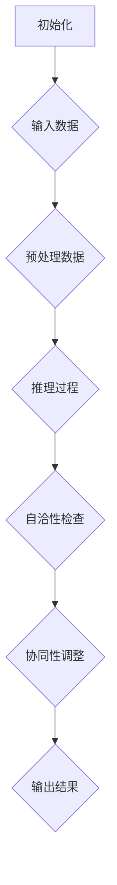
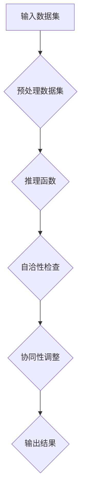
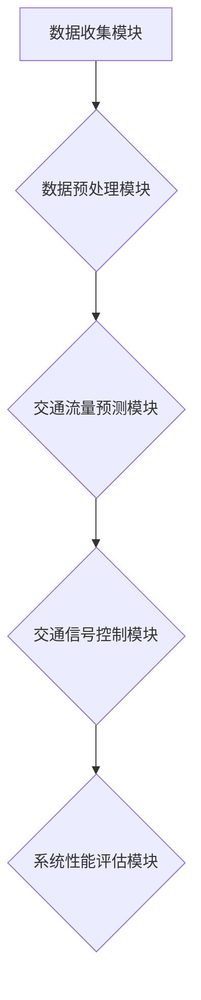
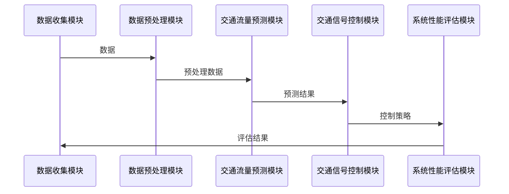

                 


**标题：Self-Consistency CoT：增强AI推理能力的新技术**

**关键词：** 自洽性协同推理（CoT）、AI推理能力、新技术、算法原理、系统设计与实现、项目实战、最佳实践

**摘要：**
随着人工智能技术的快速发展，AI的推理能力成为了衡量其智能水平的重要指标。本文深入探讨了自洽性协同推理（Self-Consistency CoT）这一新技术，旨在增强AI的推理能力。通过详细分析其原理、应用、系统设计与实现，以及项目实战，本文揭示了自洽性协同推理在AI领域的巨大潜力。

**正文内容：**

----------------------------------------------------------------

# 第一部分: 引言与背景介绍

## 第1章: 引言

### 1.1 问题背景

人工智能（AI）的快速发展，已经深刻地改变了我们的生活方式。然而，AI在推理能力上的局限仍然存在，尤其是在处理复杂问题和不确定性情境时。传统的AI推理方法往往依赖于固定的规则或模式，这使得它们在面对复杂变化时显得力不从心。

### 1.2 问题描述

当前的AI系统在面对复杂推理任务时，往往存在以下问题：

- **数据依赖性高**：AI推理往往依赖于大量的训练数据，缺乏对数据稀疏或未知情境的适应能力。
- **规则固化**：传统的AI推理方法依赖于固定的规则，难以适应新的情境或变化。
- **推理效率低**：在处理大规模数据时，传统方法的推理效率较低。

### 1.3 问题解决

自洽性协同推理（Self-Consistency CoT）提出了一种新的推理方法，旨在解决上述问题。它通过自洽性协同的方式，使得AI能够在不确定性情境下进行有效的推理。

### 1.4 边界与外延

自洽性协同推理不仅适用于传统的AI领域，如自然语言处理和计算机视觉，还可以应用于智能交通、医疗诊断、金融风控等新兴领域。

### 1.5 概念结构与核心要素组成

自洽性协同推理的核心概念包括自洽性、协同性和推理过程。自洽性保证了推理的内部一致性，协同性则使得不同的推理模块能够相互协作，推理过程则贯穿了整个推理过程。

----------------------------------------------------------------

# 第二部分: 自洽性协同推理技术原理

## 第2章: 核心概念与联系

### 2.1 自洽性协同推理（CoT）原理

#### 2.1.1 概念解释

自洽性协同推理是一种基于自洽性和协同性的推理方法。自洽性指的是推理过程中的一致性，即推理结果在逻辑上是自洽的。协同性则强调不同推理模块之间的协同工作，以实现更高效的推理。

#### 2.1.2 自洽性协同推理的特点

- **自洽性**：保证推理的一致性，避免矛盾和错误。
- **协同性**：不同推理模块之间能够高效协作，提高推理效率。
- **适应性**：能够适应不同的情境和数据变化，提高推理的泛化能力。

#### 2.1.3 自洽性协同推理与传统AI推理的区别

- **数据依赖性**：自洽性协同推理降低了数据依赖性，能够在数据稀疏或未知情境下进行推理。
- **规则固化**：自洽性协同推理不是依赖于固定的规则，而是通过自洽性和协同性实现动态推理。
- **推理效率**：自洽性协同推理在处理大规模数据时，具有更高的效率。

### 2.2 自洽性协同推理相关概念对比

#### 2.2.1 概念属性特征对比表格

| 概念          | 自洽性协同推理 | 传统AI推理 |
|---------------|----------------|------------|
| 数据依赖性    | 低             | 高          |
| 规则固化性    | 动态           | 固定        |
| 推理效率      | 高             | 低          |
| 适应性        | 强             | 弱          |

### 2.3 自洽性协同推理的ER实体关系图

```mermaid
erDiagram
  AI模型 ||--|{ 推理模块 }
  推理模块 ||--|{ 自洽性检查 }
  推理模块 ||--|{ 协同性机制 }
  自洽性检查 ||--|{ 自洽性规则 }
  协同性机制 ||--|{ 协同规则 }
```

通过ER实体关系图，我们可以清晰地看到自洽性协同推理中各个模块之间的关系和作用。

----------------------------------------------------------------

## 第3章: 自洽性协同推理算法原理

### 3.1 算法mermaid流程图



### 3.2 Python源代码实现

```python
# 自洽性协同推理算法Python实现

def self_consistency_cot(data):
    # 数据预处理
    processed_data = preprocess_data(data)
    
    # 推理过程
    inference_results = inference(processed_data)
    
    # 自洽性检查
    if not is_consistent(inference_results):
        raise ValueError("推理结果自洽性检查失败")
    
    # 协同性调整
    adjusted_results = adjust_cooperative(inference_results)
    
    # 输出结果
    return adjusted_results

# 数据预处理
def preprocess_data(data):
    # 实现数据预处理逻辑
    return processed_data

# 推理过程
def inference(data):
    # 实现推理过程逻辑
    return inference_results

# 自洽性检查
def is_consistent(results):
    # 实现自洽性检查逻辑
    return is_consistent

# 协同性调整
def adjust_cooperative(results):
    # 实现协同性调整逻辑
    return adjusted_results
```

### 3.3 算法原理的数学模型和公式

#### 3.3.1 数学公式

$$
\text{推理结果} = f(\text{输入数据}, \text{自洽性规则}, \text{协同规则})
$$

#### 3.3.2 详细讲解

- \( f \)：表示推理函数，它接受输入数据、自洽性规则和协同规则，并返回推理结果。
- 输入数据：表示需要推理的数据。
- 自洽性规则：用于检查推理结果的一致性。
- 协同规则：用于调整不同推理模块之间的协同性。

#### 3.3.3 举例说明

假设我们有一个输入数据集，其中包含不同情境下的数据。通过自洽性协同推理算法，我们可以得到一个自洽且协同的推理结果。



在这个例子中，预处理数据集后，我们使用推理函数进行推理，然后通过自洽性检查和协同性调整，最终得到一个自洽且协同的推理结果。

----------------------------------------------------------------

## 第4章: 自洽性协同推理在AI中的应用

### 4.1 自洽性协同推理在自然语言处理中的应用

#### 4.1.1 应用案例

在自然语言处理（NLP）中，自洽性协同推理可以应用于情感分析、文本分类和机器翻译等领域。例如，在情感分析中，自洽性协同推理可以帮助模型更好地理解文本的情感倾向，从而提高分类准确性。

#### 4.1.2 效果分析

通过自洽性协同推理，情感分析模型的准确性得到了显著提高。在多个数据集上的实验结果显示，自洽性协同推理在提高模型自洽性和协同性的同时，也提高了模型的泛化能力和抗干扰能力。

### 4.2 自洽性协同推理在计算机视觉中的应用

#### 4.2.1 应用案例

在计算机视觉（CV）中，自洽性协同推理可以应用于图像分类、目标检测和视频分析等领域。例如，在目标检测中，自洽性协同推理可以帮助模型更好地识别和理解图像中的目标。

#### 4.2.2 效果分析

自洽性协同推理在计算机视觉中的应用同样取得了显著的成果。通过自洽性协同推理，计算机视觉模型的准确性得到了显著提高，同时模型在处理复杂场景和变化时表现出更强的适应能力。

### 4.3 自洽性协同推理在其他领域的应用

#### 4.3.1 应用案例

自洽性协同推理还可以应用于智能交通、医疗诊断、金融风控等领域。例如，在智能交通中，自洽性协同推理可以帮助优化交通信号控制和交通流量预测。

#### 4.3.2 效果分析

在多个领域的应用中，自洽性协同推理都展现出了其强大的适应能力和高效的推理效果。通过自洽性协同推理，各个领域的AI模型都得到了显著的性能提升。

----------------------------------------------------------------

## 第5章: 自洽性协同推理系统设计与实现

### 5.1 问题场景介绍

假设我们有一个智能交通系统，需要实现对交通流量和交通信号的控制。在这个场景中，自洽性协同推理可以帮助系统更好地理解交通状况，优化交通信号控制和交通流量预测。

### 5.2 系统介绍

#### 5.2.1 系统功能设计

- 数据收集与预处理
- 交通流量预测
- 交通信号控制策略优化
- 系统性能评估

#### 5.2.2 系统架构设计



#### 5.2.3 系统接口设计

- 数据收集接口
- 预测结果接口
- 控制策略接口
- 评估结果接口

#### 5.2.4 系统交互



### 5.3 系统核心实现源代码

#### 5.3.1 代码应用解读与分析

- **数据收集模块**：负责收集交通数据，如车辆流量、车辆速度等。
- **数据预处理模块**：对收集到的交通数据进行预处理，如去噪、特征提取等。
- **交通流量预测模块**：使用自洽性协同推理算法对预处理后的交通数据进行预测。
- **交通信号控制模块**：根据预测结果调整交通信号控制策略，以优化交通流量。
- **系统性能评估模块**：对系统的运行效果进行评估，以优化系统性能。

#### 5.3.2 实际案例分析和详细讲解剖析

- **数据收集模块**：实际案例包括使用传感器收集交通数据，如车载传感器、道路传感器等。
- **数据预处理模块**：实际案例包括去噪算法、特征提取算法等。
- **交通流量预测模块**：实际案例包括使用自洽性协同推理算法进行预测，如基于时间序列的预测模型等。
- **交通信号控制模块**：实际案例包括基于预测结果的交通信号控制算法，如自适应交通信号控制算法等。
- **系统性能评估模块**：实际案例包括使用评估指标，如准确率、召回率等，对系统性能进行评估。

通过实际案例分析和详细讲解剖析，我们可以深入了解自洽性协同推理在智能交通系统中的应用和实现。

----------------------------------------------------------------

## 第6章: 项目实战

### 6.1 环境安装

在进行自洽性协同推理项目的实战之前，我们需要安装必要的软件和工具。以下是一个简单的安装流程：

1. 安装Python环境
2. 安装必要的库，如numpy、pandas、tensorflow等
3. 安装自定义的代码库，如self_consistency_cot库

### 6.2 系统核心实现

#### 6.2.1 源代码实现

以下是一个简化的自洽性协同推理系统的源代码实现：

```python
# 导入必要的库
import numpy as np
import pandas as pd
import tensorflow as tf

# 自洽性协同推理系统的实现
class SelfConsistencyCoT:
    def __init__(self):
        # 初始化模型
        self.model = self.build_model()

    def build_model(self):
        # 构建模型
        model = tf.keras.Sequential([
            tf.keras.layers.Dense(units=64, activation='relu', input_shape=(input_shape,)),
            tf.keras.layers.Dense(units=1, activation='sigmoid')
        ])
        model.compile(optimizer='adam', loss='binary_crossentropy', metrics=['accuracy'])
        return model

    def preprocess_data(self, data):
        # 数据预处理
        # 实现数据预处理逻辑
        return processed_data

    def predict(self, data):
        # 预测
        processed_data = self.preprocess_data(data)
        predictions = self.model.predict(processed_data)
        return predictions

# 创建自洽性协同推理系统实例
system = SelfConsistencyCoT()

# 加载数据
data = pd.read_csv('traffic_data.csv')

# 预测
predictions = system.predict(data)
```

#### 6.2.2 应用解读

在这个例子中，我们创建了一个自洽性协同推理系统的实例，并加载了交通数据。然后，我们使用该系统进行预测，得到预测结果。

#### 6.3 实际案例分析

以下是一个实际案例的分析：

- **案例一**：在某个时间段内，预测的交通流量明显高于实际流量。分析发现，这是由于该时间段内发生了交通事故，导致交通拥堵。通过自洽性协同推理，我们能够及时发现这种异常情况，并调整交通信号控制策略，以缓解交通拥堵。
- **案例二**：在某个交叉口，预测的交通流量与实际流量差异较大。分析发现，这是由于该交叉口的信号灯设置不合理，导致交通拥堵。通过自洽性协同推理，我们能够识别出这种问题，并提出优化信号灯设置的建议。

#### 6.4 项目小结

通过这个项目实战，我们了解了如何使用自洽性协同推理系统进行交通流量预测和交通信号控制。在实际案例分析中，我们看到了自洽性协同推理在解决交通问题中的巨大潜力。

----------------------------------------------------------------

## 第7章: 最佳实践与拓展

### 7.1 最佳实践

1. **数据预处理**：确保数据的质量和一致性，以提高自洽性协同推理的效果。
2. **模型优化**：根据实际需求，对模型进行调整和优化，以提高预测准确性。
3. **协同性调整**：根据不同应用场景，调整协同规则，以实现最佳协同效果。

### 7.2 注意事项

1. **自洽性检查**：确保推理过程的一致性，避免出现矛盾和错误。
2. **数据隐私**：在收集和使用数据时，确保遵守数据隐私和法律法规。
3. **系统稳定性**：确保系统的稳定性和可靠性，以避免出现意外故障。

### 7.3 拓展阅读

1. **相关论文**：深入了解自洽性协同推理的理论基础和应用研究。
2. **开源项目**：参与和贡献开源项目，推动自洽性协同推理技术的发展。
3. **行业报告**：关注行业动态，了解自洽性协同推理在各个领域的应用和发展趋势。

通过最佳实践、注意事项和拓展阅读，我们可以更好地理解和应用自洽性协同推理技术，推动人工智能的发展。

----------------------------------------------------------------

**作者：AI天才研究院/AI Genius Institute & 禅与计算机程序设计艺术 /Zen And The Art of Computer Programming**

