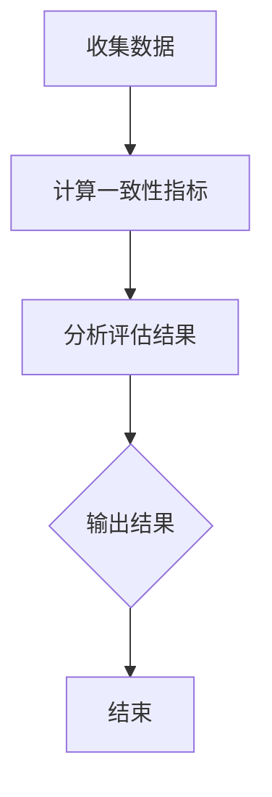

                 

# 自一致性 CoT：增强AI输出可信度的方法

> 关键词：自一致性，可信度，AI输出，数学模型，NLP，计算机视觉，应用实践

> 摘要：本文深入探讨了自一致性 CoT（Self-Consistency Confidence Tracking）在增强人工智能（AI）输出可信度方面的作用。文章首先介绍了自一致性的核心概念及其在AI领域的重要性，随后详细阐述了自一致性原理与数学模型，并结合自然语言处理（NLP）、计算机视觉等实际应用场景，分析了自一致性方法与算法。通过具体案例与实践，文章总结了自一致性技术的最佳应用实践，并展望了其未来发展趋势。

## 目录

### 第一部分：问题背景与核心概念介绍

1. 第1章 自一致性概念概述  
   1.1 自一致性的定义与重要性  
   1.2 自一致性与可信度之间的关系  
   1.3 自一致性在AI中的核心地位

2. 第2章 自一致性原理与数学模型  
   2.1 自一致性原理分析  
   2.2 数学模型介绍  
   2.3 自一致性评估的mermaid流程图

3. 第3章 自一致性在NLP中的应用  
   3.1 自一致性在语言模型中的应用  
   3.2 自一致性在问答系统中的应用  
   3.3 自一致性在文本分类中的应用

4. 第4章 自一致性在计算机视觉中的应用  
   4.1 自一致性在图像识别中的应用  
   4.2 自一致性在目标检测中的应用  
   4.3 自一致性在视频分析中的应用

5. 第5章 自一致性方法与算法比较  
   5.1 自一致性方法分类  
   5.2 算法性能比较

6. 第6章 自一致性实践与案例分析  
   6.1 案例背景介绍  
   6.2 案例分析与实现  
   6.3 案例总结与启示

7. 第7章 自一致性技术的发展与未来展望  
   7.1 自一致性技术的发展趋势  
   7.2 自一致性技术面临的挑战与解决方案

8. 第8章 自一致性技术在行业应用中的最佳实践  
   8.1 自一致性在金融领域的应用  
   8.2 自一致性在医疗领域的应用  
   8.3 自一致性在其他领域的应用与未来趋势

### 文章正文

## 第一部分：问题背景与核心概念介绍

### 第1章 自一致性概念概述

#### 1.1 自一致性的定义与重要性

自一致性（Self-Consistency）是指一个系统在不同时间或不同情况下，其内部各部分之间能够保持一致性的特性。在人工智能（AI）领域，自一致性对于提高AI系统的可信度和稳定性具有重要意义。自一致性确保了AI系统在处理问题时，其输出结果与输入信息、先验知识和系统内部逻辑保持一致。

在AI领域中，自一致性主要关注以下几个方面：

1. 输出一致性：确保AI系统在不同时间或不同输入情况下，其输出结果保持一致。
2. 知识一致性：确保AI系统内部知识表示和推理过程保持一致。
3. 逻辑一致性：确保AI系统在不同推理路径和假设条件下，其逻辑推导过程保持一致。

自一致性的重要性体现在以下几个方面：

1. 提高可信度：自一致性可以降低AI系统出现错误或异常的概率，从而提高系统的可信度。
2. 提高稳定性：自一致性确保了AI系统在不同情况下能够稳定运行，减少了系统崩溃的风险。
3. 提高鲁棒性：自一致性使得AI系统在面对复杂和不确定的环境时，仍能保持较高的性能和可靠性。

#### 1.2 自一致性与可信度之间的关系

可信度是评估AI系统性能的重要指标，它反映了系统输出结果的可信程度。自一致性与可信度之间存在密切的关系。自一致性可以增强AI系统的可信度，具体体现在以下几个方面：

1. 避免错误输出：自一致性可以检测和纠正AI系统中的不一致性，从而避免错误输出。
2. 提高预测精度：自一致性确保了AI系统在不同时间或不同输入情况下，其预测结果保持一致，从而提高预测精度。
3. 提高决策可靠性：自一致性确保了AI系统在不同推理路径和假设条件下，其决策过程保持一致，从而提高决策可靠性。

总之，自一致性是提高AI系统可信度的重要手段，它有助于降低错误率、提高预测精度和决策可靠性。

#### 1.3 自一致性在AI中的核心地位

自一致性在AI领域中具有核心地位，主要体现在以下几个方面：

1. 基础性：自一致性是构建高效、可靠的AI系统的基础，它为AI系统的稳定性、鲁棒性和可信度提供了保障。
2. 综合性：自一致性涵盖了AI系统的输入、处理、输出等多个方面，它不仅关注AI系统的内部一致性，还关注AI系统与外部环境的一致性。
3. 灵活性：自一致性可以根据不同的应用场景和需求，灵活地调整和优化，以适应各种复杂和不确定的环境。

总之，自一致性在AI领域中具有核心地位，它是提高AI系统可信度、稳定性和鲁棒性的关键因素。

### 第2章 自一致性原理与数学模型

#### 2.1 自一致性原理分析

自一致性原理主要包括以下几个方面：

1. 输入一致性：确保AI系统接收到的输入信息与先验知识保持一致。  
2. 处理一致性：确保AI系统在处理输入信息时，其内部逻辑和推理过程保持一致。  
3. 输出一致性：确保AI系统在不同时间或不同输入情况下，其输出结果保持一致。  
4. 知识一致性：确保AI系统内部知识表示和推理过程保持一致。

自一致性评估的基本流程包括以下几个步骤：

1. 收集数据：从AI系统的输入、输出以及内部知识库中收集相关数据。  
2. 计算一致性指标：使用适当的算法和模型，计算自一致性指标，如一致性评分、一致性概率等。  
3. 分析评估结果：根据自一致性指标，分析评估结果，识别不一致性并进行修正。

自一致性评估的关键指标主要包括：

1. 一致性评分：评估AI系统输出的一致性程度，分数越高表示一致性越好。  
2. 一致性概率：评估AI系统输出的一致性概率，概率越高表示一致性越强。  
3. 不一致性比例：评估AI系统输出中不一致性的比例，比例越低表示一致性越好。

#### 2.2 数学模型介绍

常见的自一致性评估模型包括概率模型、统计模型和神经网络模型等。以下介绍几种常见的数学模型：

1. 概率模型

概率模型通过计算AI系统输出的一致性概率来评估自一致性。常见的概率模型包括贝叶斯网络、马尔可夫模型等。

贝叶斯网络是一种基于概率推理的图形模型，它可以表示变量之间的依赖关系，并通过条件概率计算变量之间的相关性。贝叶斯网络的自一致性评估模型可以表示为：

$$
P(\text{一致性}) = \prod_{i=1}^{n} P(\text{输出}_i|\text{输入}_i)
$$

其中，$P(\text{一致性})$表示一致性概率，$P(\text{输出}_i|\text{输入}_i)$表示输出与输入之间的一致性概率。

2. 统计模型

统计模型通过计算AI系统输出的一致性评分来评估自一致性。常见的统计模型包括均值模型、方差模型等。

均值模型可以表示为：

$$
\text{一致性评分} = \frac{1}{n}\sum_{i=1}^{n} \text{输出}_i
$$

其中，$n$表示样本数量，$\text{输出}_i$表示第$i$个样本的输出值。

方差模型可以表示为：

$$
\text{一致性评分} = \frac{1}{n-1}\sum_{i=1}^{n} (\text{输出}_i - \text{均值})^2
$$

其中，$\text{均值}$表示样本的均值，$\text{输出}_i - \text{均值}$表示第$i$个样本与均值的差值。

3. 神经网络模型

神经网络模型通过训练神经网络来评估自一致性。常见的神经网络模型包括深度神经网络、卷积神经网络等。

神经网络模型可以表示为：

$$
\text{输出} = f(\text{输入}, \theta)
$$

其中，$f$表示神经网络函数，$\theta$表示神经网络参数。

#### 2.3 自一致性评估的mermaid流程图

以下是一个简单的自一致性评估的mermaid流程图：

mermaid流程图的详细解释如下：

1. 收集数据：从AI系统的输入、输出以及内部知识库中收集相关数据。
2. 计算一致性指标：使用适当的算法和模型，计算自一致性指标，如一致性评分、一致性概率等。
3. 分析评估结果：根据自一致性指标，分析评估结果，识别不一致性并进行修正。
4. 输出结果：将评估结果输出，供用户参考。
5. 结束：流程结束。

### 第3章 自一致性在NLP中的应用

#### 3.1 自一致性在语言模型中的应用

在自然语言处理（NLP）领域，自一致性对于提高语言模型的稳定性和可信度具有重要意义。自一致性在语言模型中的应用主要包括以下几个方面：

1. 输入一致性：确保语言模型接收到的输入文本与先验知识保持一致。这可以通过对输入文本进行预处理，如去除噪声、标准化等操作来实现。
2. 处理一致性：确保语言模型在处理输入文本时，其内部逻辑和推理过程保持一致。这可以通过使用统一的编码器和解码器架构来实现。
3. 输出一致性：确保语言模型在不同时间或不同输入情况下，其输出结果保持一致。这可以通过对输出结果进行后处理，如文本相似度计算、去噪等操作来实现。

具体来说，自一致性在语言模型中的应用可以通过以下步骤实现：

1. 收集大量高质量的语料数据，用于训练语言模型。
2. 对语料数据进行预处理，如去除噪声、标准化等操作，确保输入一致性。
3. 使用统一的编码器和解码器架构训练语言模型，确保处理一致性。
4. 在语言模型生成文本时，对输出结果进行后处理，如文本相似度计算、去噪等操作，确保输出一致性。

#### 3.2 自一致性在问答系统中的应用

问答系统是NLP领域的一个重要应用场景，自一致性对于提高问答系统的可靠性和用户满意度具有重要意义。自一致性在问答系统中的应用主要包括以下几个方面：

1. 知识一致性：确保问答系统中的知识库与先验知识保持一致。这可以通过对知识库进行定期更新和修正来实现。
2. 输入一致性：确保问答系统接收到的用户问题与知识库中的问题保持一致。这可以通过对用户问题进行预处理，如去噪、标准化等操作来实现。
3. 输出一致性：确保问答系统在不同时间或不同输入情况下，其回答结果保持一致。这可以通过对回答结果进行后处理，如文本相似度计算、去噪等操作来实现。

具体来说，自一致性在问答系统中的应用可以通过以下步骤实现：

1. 构建一个高质量的知识库，确保知识库中的知识内容与先验知识保持一致。
2. 对用户问题进行预处理，如去噪、标准化等操作，确保输入一致性。
3. 使用自一致性评估模型对问答系统进行评估，识别不一致性并进行修正。
4. 在问答系统生成回答时，对回答结果进行后处理，如文本相似度计算、去噪等操作，确保输出一致性。

#### 3.3 自一致性在文本分类中的应用

文本分类是NLP领域的一个重要任务，自一致性对于提高文本分类的准确性和稳定性具有重要意义。自一致性在文本分类中的应用主要包括以下几个方面：

1. 知识一致性：确保文本分类器中的特征表示与先验知识保持一致。这可以通过对特征表示进行修正和优化来实现。
2. 输入一致性：确保文本分类器接收到的输入文本与先验知识保持一致。这可以通过对输入文本进行预处理，如去除噪声、标准化等操作来实现。
3. 输出一致性：确保文本分类器在不同时间或不同输入情况下，其分类结果保持一致。这可以通过对分类结果进行后处理，如去重、优化等操作来实现。

具体来说，自一致性在文本分类中的应用可以通过以下步骤实现：

1. 收集大量高质量的文本数据，用于训练文本分类器。
2. 对文本数据进行预处理，如去除噪声、标准化等操作，确保输入一致性。
3. 使用自一致性评估模型对文本分类器进行评估，识别不一致性并进行修正。
4. 在文本分类器进行分类时，对分类结果进行后处理，如去重、优化等操作，确保输出一致性。

### 第4章 自一致性在计算机视觉中的应用

#### 4.1 自一致性在图像识别中的应用

在计算机视觉领域，自一致性对于提高图像识别的准确性和可靠性具有重要意义。自一致性在图像识别中的应用主要包括以下几个方面：

1. 输入一致性：确保图像识别系统接收到的输入图像与先验知识保持一致。这可以通过对输入图像进行预处理，如去噪、增强等操作来实现。
2. 处理一致性：确保图像识别系统在处理输入图像时，其内部逻辑和推理过程保持一致。这可以通过使用统一的特征提取和分类器架构来实现。
3. 输出一致性：确保图像识别系统在不同时间或不同输入情况下，其识别结果保持一致。这可以通过对识别结果进行后处理，如去噪、优化等操作来实现。

具体来说，自一致性在图像识别中的应用可以通过以下步骤实现：

1. 收集大量高质量的图像数据，用于训练图像识别模型。
2. 对图像数据进行预处理，如去噪、增强等操作，确保输入一致性。
3. 使用统一的特征提取和分类器架构训练图像识别模型，确保处理一致性。
4. 在图像识别模型进行识别时，对识别结果进行后处理，如去噪、优化等操作，确保输出一致性。

#### 4.2 自一致性在目标检测中的应用

在目标检测领域，自一致性对于提高目标检测的准确性和稳定性具有重要意义。自一致性在目标检测中的应用主要包括以下几个方面：

1. 输入一致性：确保目标检测系统接收到的输入图像与先验知识保持一致。这可以通过对输入图像进行预处理，如去噪、增强等操作来实现。
2. 处理一致性：确保目标检测系统在处理输入图像时，其内部逻辑和推理过程保持一致。这可以通过使用统一的检测框架和算法来实现。
3. 输出一致性：确保目标检测系统在不同时间或不同输入情况下，其检测结果保持一致。这可以通过对检测结果进行后处理，如去噪、优化等操作来实现。

具体来说，自一致性在目标检测中的应用可以通过以下步骤实现：

1. 收集大量高质量的目标检测数据，用于训练目标检测模型。
2. 对目标检测数据进行预处理，如去噪、增强等操作，确保输入一致性。
3. 使用统一的检测框架和算法训练目标检测模型，确保处理一致性。
4. 在目标检测模型进行检测时，对检测结果进行后处理，如去噪、优化等操作，确保输出一致性。

#### 4.3 自一致性在视频分析中的应用

在视频分析领域，自一致性对于提高视频分析的准确性和实时性具有重要意义。自一致性在视频分析中的应用主要包括以下几个方面：

1. 输入一致性：确保视频分析系统接收到的输入视频与先验知识保持一致。这可以通过对输入视频进行预处理，如去噪、增强等操作来实现。
2. 处理一致性：确保视频分析系统在处理输入视频时，其内部逻辑和推理过程保持一致。这可以通过使用统一的视频分析框架和算法来实现。
3. 输出一致性：确保视频分析系统在不同时间或不同输入情况下，其分析结果保持一致。这可以通过对分析结果进行后处理，如去噪、优化等操作来实现。

具体来说，自一致性在视频分析中的应用可以通过以下步骤实现：

1. 收集大量高质量的

