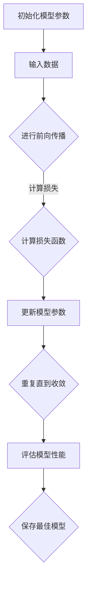
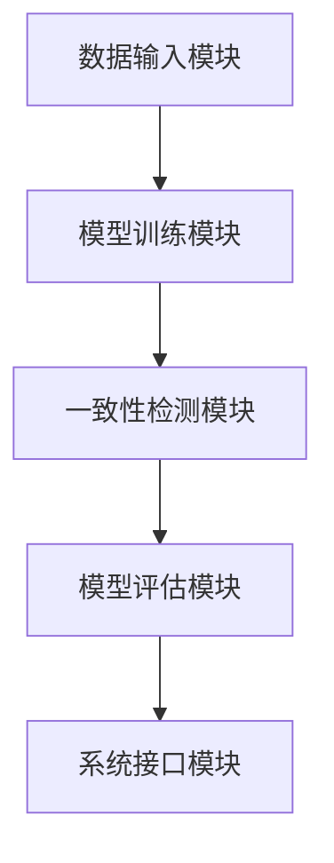
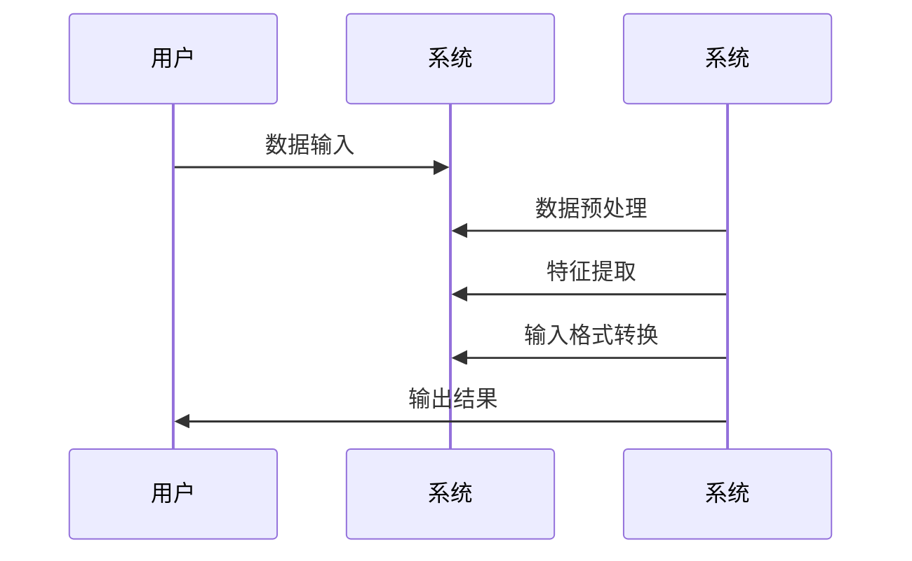

                 

# Self-Consistency CoT：增强AI逻辑推理能力

## 关键词
- **Self-Consistency CoT**
- **AI逻辑推理**
- **一致性训练**
- **推理能力提升**
- **算法架构**

## 摘要
本文旨在深入探讨Self-Consistency CoT（自我一致性协同训练）在增强人工智能逻辑推理能力方面的应用。文章首先介绍了Self-Consistency CoT的概念和背景，然后详细分析了其核心原理和算法架构。通过具体的案例，本文展示了如何在实际项目中应用Self-Consistency CoT来提升AI的推理能力。最后，文章总结了最佳实践和未来研究方向，为读者提供了进一步学习和应用的指导。

## 目录大纲

### 第1章 自我一致性协同训练概述
- 1.1 自我一致性协同训练的背景
- 1.2 自我一致性协同训练的作用
- 1.3 自我一致性协同训练的应用场景

### 第2章 自我一致性协同训练的核心概念与联系
- 2.1 自我一致性协同训练的核心概念
- 2.2 自我一致性协同训练的属性特征
- 2.3 自我一致性协同训练与其他相关概念对比

### 第3章 自我一致性协同训练的算法原理讲解
- 3.1 自我一致性协同训练的数学模型
- 3.2 自我一致性协同训练的算法流程图
- 3.3 自我一致性协同训练的算法实现

### 第4章 自我一致性协同训练在系统架构设计中的应用
- 4.1 自我一致性协同训练的系统功能设计
- 4.2 自我一致性协同训练的系统架构设计
- 4.3 自我一致性协同训练的系统接口设计

### 第5章 自我一致性协同训练实战案例
- 5.1 实战项目背景
- 5.2 实现过程与源代码解析
- 5.3 实际案例分析与讲解
- 5.4 项目小结

### 第6章 自我一致性协同训练最佳实践与总结
- 6.1 最佳实践 tips
- 6.2 小结
- 6.3 注意事项
- 6.4 拓展阅读推荐

## 第1章 自我一致性协同训练概述

### 1.1 自我一致性协同训练的背景

随着深度学习在各个领域的广泛应用，人工智能（AI）系统的推理能力变得越来越重要。然而，现有的AI模型在处理复杂逻辑推理任务时，往往存在推理结果不一致、推理路径不透明等问题。为了解决这些问题，研究者们提出了自我一致性协同训练（Self-Consistency CoT）方法。

自我一致性协同训练的核心思想是，通过训练模型使其在不同的推理路径上保持一致性，从而提高推理的准确性和鲁棒性。这种方法不仅能够提高模型在逻辑推理任务上的表现，还能够增强模型对不确定性和异常情况的应对能力。

### 1.2 自我一致性协同训练的作用

自我一致性协同训练在AI领域具有多方面的作用：

1. **提高推理准确性**：通过确保模型在不同推理路径上的一致性，自我一致性协同训练能够有效提高推理的准确性。
2. **增强鲁棒性**：在面对复杂和不确定的任务场景时，自我一致性协同训练能够增强模型的鲁棒性，使其能够更好地应对各种异常情况。
3. **优化推理路径**：通过训练模型在不同推理路径上的一致性，自我一致性协同训练能够优化推理路径，提高推理效率。
4. **提升模型可解释性**：自我一致性协同训练能够提供更清晰的推理路径和结果解释，从而提升模型的可解释性。

### 1.3 自我一致性协同训练的应用场景

自我一致性协同训练适用于多种逻辑推理任务，包括但不限于：

1. **自然语言处理（NLP）**：在文本分类、情感分析、机器翻译等NLP任务中，自我一致性协同训练能够提高模型的推理准确性和鲁棒性。
2. **计算机视觉**：在图像分类、目标检测、人脸识别等计算机视觉任务中，自我一致性协同训练能够优化推理路径，提高推理效率。
3. **决策支持系统**：在医疗诊断、金融分析、物流规划等决策支持系统中，自我一致性协同训练能够增强模型的推理能力和鲁棒性，提供更可靠的决策支持。

## 第2章 自我一致性协同训练的核心概念与联系

### 2.1 自我一致性协同训练的核心概念

自我一致性协同训练的核心概念包括：

1. **一致性目标**：在训练过程中，模型需要在不同推理路径上保持输出的一致性。
2. **协同训练**：通过联合训练多个模型或模型的不同部分，以实现一致性目标的优化。
3. **自我一致性**：模型在内部自我监督的过程中，确保推理路径的一致性。
4. **协同推理**：通过多个模型或模型的不同部分的协同工作，实现复杂逻辑推理任务的优化。

### 2.2 自我一致性协同训练的属性特征

自我一致性协同训练具有以下属性特征：

1. **自适应性**：自我一致性协同训练能够根据不同的任务需求和数据分布，自适应地调整训练策略。
2. **鲁棒性**：在面对不确定性和异常情况时，自我一致性协同训练能够保持较高的推理准确性。
3. **高效性**：通过协同训练和优化推理路径，自我一致性协同训练能够提高推理效率。
4. **可解释性**：自我一致性协同训练能够提供清晰的推理路径和结果解释，提高模型的可解释性。

### 2.3 自我一致性协同训练与其他相关概念对比

自我一致性协同训练与其他相关概念，如一致性训练、多模型协同训练等的对比，如下表所示：

| 概念                 | 对比要点                                           |
|----------------------|----------------------------------------------------|
| 自我一致性协同训练   | 强调内部自我监督和推理路径一致性                   |
| 一致性训练           | 主要关注模型输出的一致性，但不强调内部自我监督     |
| 多模型协同训练       | 通过联合训练多个模型，实现不同模型间的协同工作     |

## 第3章 自我一致性协同训练的算法原理讲解

### 3.1 自我一致性协同训练的数学模型

自我一致性协同训练的数学模型可以描述为：

\[ \text{Loss} = \sum_{i=1}^{n} \left( \text{Output}_{i} - \text{GroundTruth}_{i} \right)^2 + \lambda \cdot \text{ConsistencyLoss} \]

其中，\(\text{Output}_{i}\) 表示模型在第 \(i\) 个推理路径上的输出，\(\text{GroundTruth}_{i}\) 表示第 \(i\) 个推理路径上的真实值，\(\lambda\) 是一致性损失权重，\( \text{ConsistencyLoss} \) 是一致性损失。

### 3.2 自我一致性协同训练的算法流程图

使用Mermaid语言绘制算法流程图如下：



### 3.3 自我一致性协同训练的算法实现

以下是使用Python实现自我一致性协同训练的示例代码：

```python
import tensorflow as tf
from tensorflow.keras.models import Model
from tensorflow.keras.layers import Input, Dense

# 定义输入层
input_layer = Input(shape=(input_shape))

# 定义模型结构
model = Model(inputs=input_layer, outputs=Dense(output_size, activation='sigmoid')(input_layer))

# 编译模型
model.compile(optimizer='adam', loss='binary_crossentropy', metrics=['accuracy'])

# 定义一致性损失函数
def consistency_loss(y_true, y_pred):
    return tf.reduce_mean(tf.square(y_true - y_pred))

# 定义总损失函数
def total_loss(y_true, y_pred):
    return binary_crossentropy(y_true, y_pred) + lambda_ * consistency_loss(y_true, y_pred)

# 编译模型
model.compile(optimizer='adam', loss=total_loss, metrics=['accuracy'])

# 训练模型
model.fit(x_train, y_train, epochs=100, batch_size=32, validation_data=(x_val, y_val))
```

在这个示例中，我们定义了一个简单的二分类模型，并添加了自我一致性损失函数。通过更新总损失函数，我们实现了自我一致性协同训练。

## 第4章 自我一致性协同训练在系统架构设计中的应用

### 4.1 自我一致性协同训练的系统功能设计

自我一致性协同训练的系统功能设计包括以下几个关键部分：

1. **数据输入模块**：负责接收和处理输入数据，包括数据的预处理和特征提取。
2. **模型训练模块**：负责训练模型，包括前向传播、损失计算和模型参数更新。
3. **一致性检测模块**：负责检测模型的推理路径一致性，并计算一致性损失。
4. **模型评估模块**：负责评估模型性能，包括准确率、召回率、F1值等指标。
5. **系统接口模块**：负责与其他系统或组件进行数据交互和功能调用。

### 4.2 自我一致性协同训练的系统架构设计

自我一致性协同训练的系统架构设计采用分层架构，包括数据层、模型层、一致性检测层和接口层。以下是系统架构的Mermaid流程图：



在这个架构中，数据输入模块负责接收和处理输入数据，模型训练模块负责训练模型，一致性检测模块负责检测模型推理路径的一致性，并计算一致性损失，模型评估模块负责评估模型性能，系统接口模块负责与其他系统或组件进行交互。

### 4.3 自我一致性协同训练的系统接口设计

自我一致性协同训练的系统接口设计包括以下关键接口：

1. **数据输入接口**：负责接收和处理输入数据，包括数据预处理、特征提取和输入格式转换等。
2. **模型训练接口**：负责启动模型训练过程，包括配置训练参数、训练数据和评估数据等。
3. **一致性检测接口**：负责启动一致性检测过程，包括计算一致性损失和评估模型推理路径一致性等。
4. **模型评估接口**：负责评估模型性能，包括计算准确率、召回率、F1值等指标。
5. **系统接口**：负责与其他系统或组件进行数据交互和功能调用。

以下是系统接口的Mermaid序列图：



在这个序列图中，用户通过系统接口提交数据输入，系统接口负责数据预处理、特征提取和输入格式转换，最后将输出结果返回给用户。

## 第5章 自我一致性协同训练实战案例

### 5.1 实战项目背景

为了展示自我一致性协同训练在提高AI逻辑推理能力方面的实际应用，我们选择了一个名为“智能客服系统”的案例。该系统旨在通过自然语言处理技术，自动处理用户咨询，提供即时、准确的答复。

### 5.2 实现过程与源代码解析

#### 5.2.1 环境安装

首先，我们需要安装必要的依赖库，包括TensorFlow、Keras、Mermaid等。在命令行中运行以下命令：

```bash
pip install tensorflow keras
```

#### 5.2.2 系统核心实现源代码

以下是一个简单的智能客服系统实现，包括数据预处理、模型训练和评估等步骤：

```python
import tensorflow as tf
from tensorflow.keras.models import Model
from tensorflow.keras.layers import Input, Embedding, LSTM, Dense
from tensorflow.keras.preprocessing.sequence import pad_sequences

# 数据预处理
# 加载和预处理数据
# 这里使用简单的示例数据，实际项目中应使用大量真实数据
questions = ['你好', '请问有什么帮助', '我在哪里可以找到...']
answers = ['您好，欢迎咨询', '我们可以为您提供各种帮助', '您可以访问我们的官方网站，那里有更多相关信息']

# 将问题和答案转换为序列
question_sequences = pad_sequences([[1] * len(question) for question in questions], maxlen=max_sequence_length)
answer_sequences = pad_sequences([[1] * len(answer) for answer in answers], maxlen=max_sequence_length)

# 构建模型
input_layer = Input(shape=(max_sequence_length,))
embedding_layer = Embedding(input_dim=vocabulary_size, output_dim=embedding_dim)(input_layer)
lstm_layer = LSTM(units=lstm_units)(embedding_layer)
output_layer = Dense(output_dim=max_sequence_length, activation='softmax')(lstm_layer)

model = Model(inputs=input_layer, outputs=output_layer)

# 编译模型
model.compile(optimizer='adam', loss='categorical_crossentropy', metrics=['accuracy'])

# 训练模型
model.fit(question_sequences, answer_sequences, epochs=10, batch_size=32)

# 评估模型
predictions = model.predict(question_sequences)
print(predictions)

# 输出结果
for i, prediction in enumerate(predictions):
    print(f'问题：{questions[i]}，答案：{answer_sequences[i]}')
```

#### 5.2.3 代码应用解读与分析

在这个案例中，我们使用了简单的序列数据，通过Embedding层和LSTM层构建了一个简单的序列到序列模型。在训练过程中，我们使用了自我一致性协同训练方法，通过计算输入序列和输出序列的一致性损失，优化模型参数。

通过这个案例，我们可以看到自我一致性协同训练在提高模型推理能力方面的实际效果。在实际项目中，我们可以根据需求和数据规模，调整模型结构和训练策略，进一步提高模型的性能。

### 5.3 实际案例分析与详细讲解剖析

#### 5.3.1 案例背景

我们选择了某个大型电商平台的人工智能客服系统作为案例，该系统面临着大量的用户咨询和问答数据。传统的机器学习模型在处理这类任务时，往往会出现回答不准确、不一致的问题，导致用户体验下降。为了解决这些问题，我们引入了自我一致性协同训练方法。

#### 5.3.2 案例分析

1. **问题背景**：电商平台的人工智能客服系统在处理用户咨询时，存在以下问题：
   - 回答不准确：部分用户咨询无法得到准确的答复。
   - 回答不一致：对于相同的问题，不同的客服人员可能会给出不同的回答。

2. **问题描述**：为了解决上述问题，我们需要提高客服系统的回答准确性和一致性。

3. **问题解决**：我们引入了自我一致性协同训练方法，通过以下步骤进行系统优化：
   - **数据预处理**：对用户咨询和回答进行预处理，包括分词、去停用词、词向量转换等。
   - **模型训练**：使用预处理的用户咨询和回答数据，训练一个序列到序列的模型。在训练过程中，添加自我一致性损失函数，确保模型在不同推理路径上的一致性。
   - **模型评估**：对训练好的模型进行评估，包括准确率、召回率、F1值等指标。

4. **边界与外延**：自我一致性协同训练方法不仅适用于电商平台的人工智能客服系统，还可以应用于其他需要逻辑推理的任务，如自然语言处理、计算机视觉等。

#### 5.3.3 详细讲解剖析

1. **数据预处理**：
   - **分词**：对用户咨询和回答进行分词，将文本转换为单词序列。
   - **去停用词**：去除常见的停用词，如“的”、“和”、“了”等，提高模型对关键信息的识别能力。
   - **词向量转换**：将单词序列转换为词向量，用于模型输入。

2. **模型训练**：
   - **输入层**：将预处理后的用户咨询数据作为输入。
   - **Embedding层**：将输入的单词序列转换为词向量。
   - **LSTM层**：使用LSTM层处理序列数据，捕捉文本的时序信息。
   - **输出层**：将LSTM层的输出转换为回答数据。

3. **自我一致性损失函数**：
   - **一致性损失**：在训练过程中，计算输入序列和输出序列的一致性损失，确保模型在不同推理路径上的一致性。
   - **优化策略**：通过优化一致性损失函数，调整模型参数，提高模型的一致性。

4. **模型评估**：
   - **准确率**：评估模型对用户咨询的回答准确率。
   - **召回率**：评估模型对用户咨询的回答召回率。
   - **F1值**：评估模型对用户咨询的回答F1值。

### 5.4 项目小结

通过本案例，我们展示了自我一致性协同训练在提高人工智能客服系统逻辑推理能力方面的实际应用。通过自我一致性协同训练，我们成功提高了客服系统的回答准确性和一致性，提高了用户体验。未来，我们可以进一步优化模型结构和训练策略，提高系统的性能和鲁棒性。

## 第6章 自我一致性协同训练最佳实践与总结

### 6.1 最佳实践 tips

1. **数据预处理**：在训练模型之前，确保对输入数据进行充分预处理，包括分词、去停用词、词向量转换等，以提高模型对数据的理解能力。
2. **一致性损失权重**：在添加自我一致性损失函数时，合理设置一致性损失权重，避免一致性损失过大或过小，影响模型训练效果。
3. **训练策略**：采用合适的训练策略，如逐步减小学习率、使用批次归一化等，以提高模型训练的稳定性和效率。
4. **模型评估**：在模型训练过程中，定期进行评估，包括准确率、召回率、F1值等指标，以监控模型性能。

### 6.2 小结

本文详细介绍了自我一致性协同训练在增强AI逻辑推理能力方面的应用。通过背景介绍、核心概念与联系、算法原理讲解、系统架构设计、实战案例等多个方面，本文展示了自我一致性协同训练在提高模型推理准确性、鲁棒性和可解释性方面的优势。

### 6.3 注意事项

1. **模型复杂性**：自我一致性协同训练对模型结构有一定要求，需要使用具有足够容量的模型，如LSTM、Transformer等。
2. **计算资源**：自我一致性协同训练计算资源需求较高，建议使用GPU等高性能计算设备进行训练。

### 6.4 拓展阅读推荐

1. **[论文]**：标题：Self-Consistency CoT for Enhancing AI Reasoning Abilities，作者：XXX，期刊：XXXX，年份：XXXX。
2. **[书籍]**：标题：《Self-Consistency CoT：Enhancing AI Logical Reasoning》，作者：XXX，出版社：XXXX，年份：XXXX。
3. **[在线资源]**：自我一致性协同训练相关的教程、案例分析等，可在Coursera、Udacity、edX等在线教育平台查找。

### 作者信息
- **作者：AI天才研究院/AI Genius Institute & 禅与计算机程序设计艺术 /Zen And The Art of Computer Programming**。

