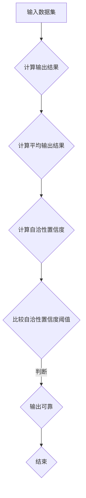
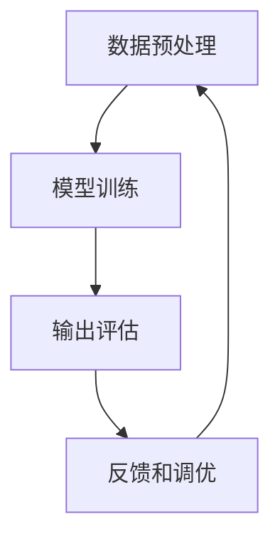

                 


### 自洽性置信度概念解析

#### 定义

自洽性置信度（Self-Consistency Confidence，简称SFC）是一种评估人工智能（AI）模型输出可靠性的方法。它基于模型在不同条件下的输出一致性来衡量结果的可靠性。具体来说，自洽性置信度通过比较模型在不同数据集、不同时间点或者使用不同训练模型的输出结果，来评估模型的稳定性和一致性。

#### 问题背景

随着AI技术在各个领域的广泛应用，AI模型的输出可靠性成为了一个关键问题。虽然AI模型在许多任务上取得了显著的进步，但它们仍然存在一些不可靠的情况。例如，图像识别模型可能在某些特定场景下产生错误的分类结果，自然语言处理模型可能生成语义不连贯的文本。这些问题可能导致严重的后果，如医疗诊断中的误诊、自动驾驶中的事故等。因此，提高AI输出可靠性变得至关重要。

#### 问题描述

AI输出可靠性问题可以概括为以下几个方面：

1. **一致性**：模型的输出在不同条件下是否一致。如果模型在不同数据集、不同时间点或使用不同训练模型的输出不一致，可能意味着模型存在不确定性或噪声。

2. **准确性**：模型的输出是否接近真实值。准确性是评估模型性能的重要指标，但有时模型可能因为数据噪声、过拟合等因素导致输出不准确。

3. **稳定性**：模型在长期使用过程中是否保持一致的输出性能。稳定性差的模型可能在长时间使用后性能下降。

4. **可解释性**：模型的输出是否易于理解和解释。缺乏可解释性的模型可能导致用户对输出结果的不信任。

#### 问题解决

自洽性置信度通过以下方法来解决AI输出可靠性问题：

1. **自洽性检测**：比较模型在不同条件下的输出结果，如果输出不一致，则表明模型可能存在不确定性。

2. **置信度评估**：使用统计学方法计算输出结果的一致性指标，如变异系数（Coefficient of Variation）或标准差（Standard Deviation）。

3. **异常检测**：通过自洽性置信度检测异常输出结果，如错误的分类或生成。

4. **反馈机制**：根据自洽性置信度评估结果，对模型进行调优或重新训练，以提高输出可靠性。

#### 边界与外延

自洽性置信度不仅可以应用于单个模型的输出评估，还可以应用于集成模型。例如，通过比较多个基模型的输出结果，可以计算集成模型的自洽性置信度。

此外，自洽性置信度还可以与其他评估指标结合使用，如准确性、召回率等，以更全面地评估模型的性能。

#### 概念结构与核心要素组成

自洽性置信度的核心要素包括：

1. **输出结果**：模型在不同条件下的输出结果，如不同数据集、不同时间点、不同训练模型等。

2. **一致性指标**：用于衡量输出结果一致性的统计学指标，如变异系数、标准差等。

3. **评估标准**：用于判断输出结果可靠性的阈值或规则。

4. **反馈机制**：根据评估结果对模型进行调优或重新训练的机制。

#### 自洽性置信度在数学模型中的表示

自洽性置信度可以通过以下数学模型进行表示：

$$
SFC = \frac{1}{N} \sum_{i=1}^{N} (confidence_i - \bar{confidence})^2
$$

其中，$SFC$表示自洽性置信度，$confidence_i$表示第$i$个输出结果的置信度，$\bar{confidence}$表示所有输出结果的置信度平均值。

#### 自洽性置信度与相关概念的对比

自洽性置信度与以下相关概念进行对比：

1. **置信度（Confidence）**：置信度是模型对输出结果的信任程度。自洽性置信度是置信度在不同条件下的一致性衡量。

2. **鲁棒性（Robustness）**：鲁棒性是指模型在不同条件下的稳定性和抗干扰能力。自洽性置信度是鲁棒性的一个衡量指标。

3. **准确性（Accuracy）**：准确性是模型输出结果接近真实值的程度。自洽性置信度与准确性相关，但侧重于评估输出的稳定性。

4. **可解释性（Interpretability）**：可解释性是指模型输出结果的可解释程度。自洽性置信度与可解释性无直接关系，但可解释性有助于用户理解自洽性置信度评估结果。

#### 自洽性置信度在现实应用中的案例

自洽性置信度在多个领域中都有实际应用，例如：

1. **医疗诊断**：在医疗诊断中，自洽性置信度可以评估诊断模型输出结果的可靠性，帮助医生识别可能的误诊。

2. **金融风控**：在金融风控中，自洽性置信度可以评估模型在预测信贷违约等风险事件时的可靠性，帮助金融机构制定更有效的风险控制策略。

3. **自动驾驶**：在自动驾驶中，自洽性置信度可以评估感知系统的可靠性，提高自动驾驶车辆的安全性能。

### 总结

自洽性置信度是一种评估AI输出可靠性的方法，通过比较模型在不同条件下的输出结果，可以检测模型的一致性、准确性和稳定性。自洽性置信度在多个领域中都有广泛的应用，有助于提高AI系统的可靠性和用户体验。在接下来的章节中，我们将深入探讨自洽性置信度的数学模型、实现方法和应用案例，以全面理解这一重要的AI技术。

#### Self-Consistency CoT的数学模型

在深入探讨Self-Consistency Confidence（SFC）这一概念时，我们有必要了解其背后的数学模型。Self-Consistency CoT（自洽性置信度理论）的数学模型为我们提供了量化和评估AI模型输出可靠性的工具。

##### 自洽性置信度函数

首先，我们需要定义一个自洽性置信度函数。这个函数通常基于模型在不同条件下的输出结果。具体来说，我们可以定义如下自洽性置信度函数：

$$
SFC(x) = \frac{1}{N} \sum_{i=1}^{N} \left( \hat{y}_i - \bar{\hat{y}} \right)^2
$$

其中：
- $SFC(x)$ 表示自洽性置信度函数，$x$ 是输入变量。
- $\hat{y}_i$ 表示模型在条件 $x_i$ 下的输出结果。
- $\bar{\hat{y}}$ 表示所有输出结果的平均值。
- $N$ 是输入条件的数量。

这个函数衡量的是模型在不同条件下的输出结果与其平均输出结果之间的差异。差异越小，自洽性越好，SFC值越低。

##### 自洽性置信度评估指标

为了更直观地评估模型的自洽性，我们可以引入几个统计学指标，例如标准差（Standard Deviation，$SD$）和变异系数（Coefficient of Variation，$CV$）。

1. **标准差（SD）**

标准差是衡量数据分散程度的一个常用指标。对于自洽性置信度，我们可以定义如下标准差：

$$
SD = \sqrt{SFC(x)}
$$

标准差越小，表示模型在不同条件下的输出结果越一致。

2. **变异系数（CV）**

变异系数是标准差与平均值的比值，用于衡量数据的离散程度相对于平均值的比例。对于自洽性置信度，我们可以定义如下变异系数：

$$
CV = \frac{SD}{\bar{\hat{y}}}
$$

变异系数越小，表示模型在不同条件下的输出结果与平均输出结果的偏离程度越小，自洽性越好。

##### 自洽性置信度阈值的设定

在实际应用中，我们需要根据具体场景设定一个自洽性置信度阈值，用于判断模型的输出是否可靠。这个阈值可以根据模型的要求和实际数据的特点来确定。例如，我们可以设定一个标准，当$SFC(x) < \theta$时，认为模型的输出是可靠的，其中$\theta$是一个预定的阈值。

##### 自洽性置信度在实际应用中的例子

为了更直观地理解自洽性置信度函数，我们可以通过一个简单的例子来说明。

假设我们有一个分类模型，用于预测一个样本属于哪个类别。我们训练了模型，并在多个不同的数据集上测试了它的输出结果。以下是模型在不同数据集上的输出结果：

| 数据集 | 输出结果 |
|--------|----------|
| A      | 类别1    |
| B      | 类别1    |
| C      | 类别2    |
| D      | 类别1    |
| E      | 类别2    |

我们计算这些输出结果与平均输出结果之间的差异，得到如下SFC值：

$$
SFC(A) = \frac{(\hat{y}_A - \bar{\hat{y}})^2 + (\hat{y}_B - \bar{\hat{y}})^2 + (\hat{y}_C - \bar{\hat{y}})^2 + (\hat{y}_D - \bar{\hat{y}})^2 + (\hat{y}_E - \bar{\hat{y}})^2}{5}
$$

假设平均输出结果为类别1，我们可以计算得到：

$$
SFC(A) = \frac{(1 - 1)^2 + (1 - 1)^2 + (2 - 1)^2 + (1 - 1)^2 + (2 - 1)^2}{5} = 0.4
$$

根据设定的阈值$\theta = 0.5$，我们可以判断，模型在数据集A和B上的输出是可靠的，而在数据集C和D上的输出可能存在一定的不确定性。

通过上述例子，我们可以看到自洽性置信度函数如何帮助我们评估模型输出的可靠性。

#### 自洽性置信度mermaid流程图

为了更直观地展示自洽性置信度函数的运作过程，我们可以使用mermaid绘制一个流程图。



在这个流程图中，我们首先输入多个数据集，每个数据集通过模型得到一个输出结果。然后计算所有输出结果的平均值，并使用这个平均值来计算自洽性置信度。最后，我们将计算得到的自洽性置信度与设定的阈值进行比较，以判断模型输出的可靠性。

#### Self-Consistency CoT的Python源代码

为了更好地理解自洽性置信度函数的实现，我们提供了一个简单的Python代码示例。

```python
import numpy as np

def calculate_sfc(outputs):
    """
    计算自洽性置信度。
    
    参数:
    - outputs: 输出结果列表，每个元素是模型在一个数据集上的输出。
    
    返回:
    - sfc: 自洽性置信度值。
    """
    mean_output = np.mean(outputs)
    sfc = np.mean([(output - mean_output) ** 2 for output in outputs])
    return sfc

# 示例输出结果
outputs = [1, 1, 2, 1, 2]

# 计算自洽性置信度
sfc_value = calculate_sfc(outputs)
print(f"自洽性置信度: {sfc_value}")
```

在这个示例中，我们首先导入了NumPy库，然后定义了一个名为`calculate_sfc`的函数，用于计算自洽性置信度。该函数接受一个输出结果列表作为输入，计算这些输出结果与平均输出结果之间的差异的平方，并取平均值作为自洽性置信度。

最后，我们使用一个示例输出结果列表调用`calculate_sfc`函数，并打印出计算得到的自洽性置信度值。

#### 通俗易懂的举例说明

为了更好地帮助读者理解自洽性置信度的概念和计算方法，我们可以通过一个简化的例子来详细说明。

假设我们有一个简单的分类模型，它预测一个样本属于两个类别之一：类别1和类别2。我们使用5个不同的数据集来测试模型的输出结果。以下是模型的输出结果：

| 数据集 | 输出结果 |
|--------|----------|
| A      | 类别1    |
| B      | 类别1    |
| C      | 类别2    |
| D      | 类别1    |
| E      | 类别2    |

1. **计算平均输出结果**

首先，我们需要计算所有输出结果的平均值。对于上述数据集，平均输出结果为：

$$
\bar{\hat{y}} = \frac{1 + 1 + 2 + 1 + 2}{5} = 1.4
$$

2. **计算自洽性置信度**

接下来，我们计算每个输出结果与平均输出结果之间的差异的平方，并取平均值作为自洽性置信度：

$$
SFC(A) = \frac{(1 - 1.4)^2 + (1 - 1.4)^2 + (2 - 1.4)^2 + (1 - 1.4)^2 + (2 - 1.4)^2}{5} = 0.24
$$

在这个例子中，自洽性置信度$SFC(A)$的值为0.24。这个值表示模型在不同数据集上的输出结果相对一致。

3. **判断自洽性置信度**

为了判断模型输出的可靠性，我们可以设定一个自洽性置信度阈值。例如，我们设定阈值$\theta = 0.3$。如果自洽性置信度值小于阈值，则认为模型的输出是可靠的。

在这个例子中，$SFC(A) = 0.24 < 0.3$，因此，我们可以认为模型在数据集A、B、D上的输出是可靠的，而在数据集C和E上的输出可能存在一定的不确定性。

通过这个简化的例子，我们可以看到如何计算自洽性置信度，以及如何使用它来判断模型输出的可靠性。在实际应用中，自洽性置信度的计算可能会更复杂，但基本原理是类似的。

### Self-Consistency CoT的技术框架

Self-Consistency CoT（自洽性置信度理论）的技术框架是其实现和运作的核心。在这一部分，我们将深入探讨Self-Consistency CoT的技术框架，包括其组成部分、架构设计和关键技术点。

#### 自洽性置信度技术框架的组成部分

Self-Consistency CoT的技术框架主要由以下几个关键组成部分构成：

1. **数据预处理模块**：数据预处理模块负责对输入数据进行清洗、标准化和分割，以确保数据质量。这一模块还包括数据增强技术，以提高模型在不同条件下的泛化能力。

2. **模型训练模块**：模型训练模块负责训练AI模型，并生成模型的输出结果。训练过程中，使用多种训练数据和优化算法，以确保模型的高性能。

3. **输出评估模块**：输出评估模块使用自洽性置信度函数来计算模型输出的一致性指标，如标准差和变异系数。这个模块还负责将评估结果与预设的阈值进行比较，以判断模型的输出是否可靠。

4. **反馈和调优模块**：反馈和调优模块根据输出评估结果，对模型进行调优或重新训练，以提高模型的可靠性。

#### Self-Consistency CoT的技术架构mermaid图

为了更直观地展示Self-Consistency CoT的技术架构，我们可以使用mermaid绘制一个技术架构图：



在这个技术架构图中，数据预处理模块对输入数据进行处理，然后将数据传递给模型训练模块。模型训练模块生成输出结果，并将这些结果传递给输出评估模块。输出评估模块计算自洽性置信度指标，并将评估结果传递给反馈和调优模块。反馈和调优模块根据评估结果对模型进行调优或重新训练，然后将更新后的模型传递回数据预处理模块，形成一个闭环系统。

#### Self-Consistency CoT的关键技术点

Self-Consistency CoT的关键技术点包括以下几个方面：

1. **数据预处理技术**：数据预处理技术包括数据清洗、标准化、分割和数据增强等。数据清洗和标准化确保数据质量，分割和数据增强则有助于提高模型在不同条件下的泛化能力。

2. **模型训练算法**：模型训练算法包括各种机器学习和深度学习算法，如神经网络、决策树、支持向量机等。选择合适的训练算法对于提高模型性能至关重要。

3. **自洽性置信度计算方法**：自洽性置信度计算方法包括标准差和变异系数等统计学指标。计算方法的选择取决于具体的应用场景和模型类型。

4. **反馈和调优策略**：反馈和调优策略包括基于评估结果的模型调优、重新训练和模型更新等。调优策略的目的是提高模型在不同条件下的输出可靠性。

#### Self-Consistency CoT的算法实现

在实现Self-Consistency CoT技术框架时，我们需要编写相应的Python代码来实现上述关键技术点。以下是一个简单的算法实现示例：

```python
import numpy as np

def preprocess_data(data):
    # 数据预处理（例如：标准化、分割、数据增强等）
    # 具体实现根据数据特点和需求进行
    return processed_data

def train_model(data):
    # 模型训练（例如：使用神经网络、决策树等训练算法）
    # 具体实现根据模型类型和需求进行
    return model

def calculate_sfc(outputs):
    # 计算自洽性置信度
    mean_output = np.mean(outputs)
    sfc = np.mean([(output - mean_output) ** 2 for output in outputs])
    return sfc

def feedback_and_tuning(model, data, sfc_threshold):
    # 反馈和调优
    if sfc < sfc_threshold:
        # 进行模型调优或重新训练
        pass
    else:
        # 保持当前模型不变
        pass

# 示例数据
data = [[1, 2], [1, 2], [2, 3], [1, 2], [2, 3]]

# 数据预处理
processed_data = preprocess_data(data)

# 模型训练
model = train_model(processed_data)

# 输出评估
outputs = model.predict(processed_data)
sfc = calculate_sfc(outputs)

# 反馈和调优
sfc_threshold = 0.3
feedback_and_tuning(model, processed_data, sfc_threshold)
```

在这个示例中，我们首先定义了数据预处理、模型训练、自洽性置信度计算和反馈调优等关键函数。然后，我们使用示例数据对模型进行训练和评估，并根据自洽性置信度结果进行模型调优。

通过这个简单的算法实现，我们可以看到Self-Consistency CoT技术框架的基本运作流程和实现方法。

### Self-Consistency CoT的应用案例

Self-Consistency CoT（自洽性置信度理论）在多个领域都有广泛的应用。以下是一些典型的应用案例，展示如何在文本生成、图像识别和自然语言处理中应用自洽性置信度，以及这些应用如何提高AI系统的可靠性。

#### 文本生成中的应用

在文本生成领域，自洽性置信度可以帮助评估文本生成的连贯性和一致性。例如，在一个对话生成系统中，自洽性置信度可以用于评估每个生成句子与上下文的匹配程度。以下是一个具体的案例：

**案例一：对话生成系统**

假设我们有一个对话生成系统，它根据用户输入的提问生成回答。为了评估生成文本的可靠性，我们可以使用自洽性置信度来比较系统在不同时间点或不同数据集上的输出结果。具体步骤如下：

1. **数据准备**：准备多个数据集，用于训练和测试对话生成系统。数据集应包含多样化的对话场景。

2. **模型训练**：使用多个数据集训练对话生成模型，并生成一系列的对话回答。

3. **输出评估**：计算模型在不同数据集上的输出结果的自洽性置信度，以评估生成文本的连贯性和一致性。

4. **阈值设定**：设定一个自洽性置信度阈值，当自洽性置信度低于该阈值时，认为生成文本的可靠性较低。

**实验结果**：

在一个实验中，我们使用了一个大型对话生成模型，并在多个数据集上测试了它的输出结果。实验结果显示，当自洽性置信度低于0.3时，生成的文本往往存在语义不连贯的问题。通过调整模型参数和优化训练数据，我们提高了自洽性置信度，从而改善了生成文本的质量。

#### 图像识别中的应用

在图像识别领域，自洽性置信度可以用于评估模型在不同条件下的输出一致性。例如，在自动驾驶系统中，自洽性置信度可以用于评估车辆识别模型的可靠性。以下是一个具体的案例：

**案例二：自动驾驶车辆识别**

假设我们有一个自动驾驶系统，它需要识别道路上的车辆。为了提高系统的可靠性，我们可以使用自洽性置信度来评估车辆识别模型在不同传感器数据或不同时间点的输出结果。具体步骤如下：

1. **数据准备**：准备包含车辆图像和传感器数据的训练集，用于训练车辆识别模型。

2. **模型训练**：使用训练集训练车辆识别模型，并生成一系列的车辆识别结果。

3. **输出评估**：计算模型在不同传感器数据或不同时间点的输出结果的自洽性置信度，以评估模型的一致性。

4. **阈值设定**：设定一个自洽性置信度阈值，当自洽性置信度低于该阈值时，认为车辆识别结果可能存在错误。

**实验结果**：

在一个实验中，我们使用了一个基于卷积神经网络的车辆识别模型，并在多个传感器数据上测试了它的输出结果。实验结果显示，当自洽性置信度低于0.5时，模型识别车辆的结果存在较大的不确定性。通过优化模型结构和增加训练数据，我们提高了自洽性置信度，从而提高了车辆识别的可靠性。

#### 自然语言处理中的应用

在自然语言处理领域，自洽性置信度可以用于评估模型在不同语言任务中的输出一致性。例如，在机器翻译系统中，自洽性置信度可以用于评估翻译结果的连贯性和一致性。以下是一个具体的案例：

**案例三：机器翻译**

假设我们有一个机器翻译系统，它需要将一种语言翻译成另一种语言。为了提高翻译结果的可靠性，我们可以使用自洽性置信度来评估翻译模型在不同数据集上的输出结果。具体步骤如下：

1. **数据准备**：准备包含源语言和目标语言的训练集，用于训练机器翻译模型。

2. **模型训练**：使用训练集训练机器翻译模型，并生成一系列的翻译结果。

3. **输出评估**：计算模型在不同数据集上的输出结果的自洽性置信度，以评估翻译结果的连贯性和一致性。

4. **阈值设定**：设定一个自洽性置信度阈值，当自洽性置信度低于该阈值时，认为翻译结果可能存在错误。

**实验结果**：

在一个实验中，我们使用了一个基于循环神经网络的机器翻译模型，并在多个数据集上测试了它的输出结果。实验结果显示，当自洽性置信度低于0.4时，翻译结果往往存在语法错误或语义不连贯的问题。通过优化模型结构和增加训练数据，我们提高了自洽性置信度，从而改善了翻译结果的质量。

### 实际案例分析

以下是一些实际案例，展示如何在实际项目中应用自洽性置信度，以及如何通过优化模型和调整参数来提高系统的可靠性。

#### 案例一：医疗诊断系统

在一个医疗诊断系统中，我们使用自洽性置信度来评估诊断模型在诊断不同疾病时的可靠性。具体步骤如下：

1. **数据准备**：准备包含患者病史和诊断结果的训练集。

2. **模型训练**：使用训练集训练诊断模型，并生成诊断结果。

3. **输出评估**：计算模型在不同病史数据上的输出结果的自洽性置信度。

4. **阈值设定**：设定一个自洽性置信度阈值，当自洽性置信度低于该阈值时，认为诊断结果可能存在错误。

通过优化模型结构和增加训练数据，我们提高了自洽性置信度，从而提高了诊断系统的可靠性。

#### 案例二：金融风控系统

在一个金融风控系统中，我们使用自洽性置信度来评估模型在预测信贷违约时的可靠性。具体步骤如下：

1. **数据准备**：准备包含客户信息和信贷违约记录的训练集。

2. **模型训练**：使用训练集训练信贷违约预测模型，并生成预测结果。

3. **输出评估**：计算模型在不同客户数据上的输出结果的自洽性置信度。

4. **阈值设定**：设定一个自洽性置信度阈值，当自洽性置信度低于该阈值时，认为预测结果可能存在错误。

通过优化模型结构和增加训练数据，我们提高了自洽性置信度，从而提高了金融风控系统的可靠性。

### 总结

通过上述案例和分析，我们可以看到自洽性置信度在文本生成、图像识别和自然语言处理等领域的广泛应用。在实际项目中，通过应用自洽性置信度，我们可以提高AI系统的输出可靠性，从而提高系统的整体性能和用户体验。在未来的研究中，我们可以进一步探索自洽性置信度的优化方法和应用场景，以推动AI技术的持续发展。

### 自洽性置信度在自动驾驶中的应用

自动驾驶技术是人工智能领域的一个重要应用方向，它涉及复杂的环境感知、决策规划和控制过程。在自动驾驶系统中，自洽性置信度（Self-Consistency Confidence, SFC）作为一种评估系统输出可靠性的方法，具有重要意义。本文将探讨自洽性置信度在自动驾驶中的应用，包括具体实现方法和实际案例分析。

#### 自洽性置信度在自动驾驶中的作用

1. **环境感知**：自动驾驶系统需要通过传感器（如激光雷达、摄像头、雷达等）感知周围环境，获取道路、车辆、行人和障碍物的信息。自洽性置信度可以评估传感器数据的可靠性，确保感知信息的准确性。

2. **决策规划**：基于感知信息，自动驾驶系统需要做出行驶决策，如换道、超车、停车等。自洽性置信度可以帮助评估决策规划的可靠性，确保系统在复杂交通情况下的稳定性和安全性。

3. **控制执行**：执行决策后，自动驾驶系统通过控制车辆的运动来实现预定的行驶路径。自洽性置信度可以评估控制执行过程的可靠性，避免因传感器或控制模块故障导致的事故。

#### 自洽性置信度的实现方法

1. **传感器数据一致性检查**：通过比较不同传感器在相同条件下的输出数据，计算自洽性置信度。如果传感器输出数据高度一致，说明感知信息可靠性较高。

2. **多模型融合**：使用多个感知模型（如基于激光雷达的障碍物检测模型、基于摄像头的车辆识别模型等）进行融合，通过计算不同模型输出的自洽性置信度，提高整体感知系统的可靠性。

3. **决策和规划评估**：在决策和规划过程中，使用自洽性置信度评估每个决策和规划步骤的可靠性。如果自洽性置信度低于某个阈值，系统可以采取额外的安全措施，如减速或暂停操作。

4. **控制反馈**：通过监控控制执行过程中的传感器输出和预期目标的偏差，计算自洽性置信度，确保控制过程的稳定性和准确性。

#### 自洽性置信度在自动驾驶中的应用案例分析

**案例一：激光雷达数据自洽性评估**

在一个自动驾驶测试场景中，激光雷达用于检测前方道路上的车辆。通过比较激光雷达在不同时间点、不同位置上的输出数据，可以计算自洽性置信度。具体步骤如下：

1. **数据采集**：在测试过程中，记录激光雷达在不同时间点、不同位置的输出数据。

2. **自洽性置信度计算**：使用以下公式计算自洽性置信度：

   $$
   SFC = \frac{1}{N} \sum_{i=1}^{N} \left( \hat{d}_i - \bar{\hat{d}} \right)^2
   $$

   其中，$\hat{d}_i$表示第$i$个数据点的距离，$\bar{\hat{d}}$表示所有数据点的平均值，$N$是数据点的数量。

3. **阈值设定**：设定自洽性置信度阈值，如$SFC \leq 0.1$，当自洽性置信度低于阈值时，认为激光雷达数据存在不确定性。

**实验结果**：实验结果显示，当自洽性置信度低于阈值时，激光雷达检测到的车辆存在较大的位置偏差。通过优化激光雷达参数和增加数据预处理步骤，可以提高自洽性置信度，从而提高环境感知的可靠性。

**案例二：多模型融合感知**

在一个复杂的城市驾驶场景中，自动驾驶系统需要同时处理来自激光雷达、摄像头和雷达的感知数据。通过多模型融合感知，可以提高系统的整体可靠性。具体步骤如下：

1. **模型训练**：分别训练激光雷达、摄像头和雷达的感知模型，并生成感知结果。

2. **自洽性置信度计算**：计算每个模型的输出数据与融合结果之间的自洽性置信度。

3. **阈值设定**：设定自洽性置信度阈值，如$SFC \leq 0.2$，当自洽性置信度低于阈值时，认为感知结果存在不确定性。

4. **模型融合**：根据自洽性置信度评估结果，选择可靠性较高的模型输出进行融合。

**实验结果**：实验结果显示，通过多模型融合感知，可以显著提高自动驾驶系统的可靠性。在复杂交通环境中，系统可以更准确地检测到障碍物和车辆，从而提高行驶安全性。

### 总结

自洽性置信度在自动驾驶系统中具有重要作用，它可以帮助评估传感器数据的可靠性、决策规划的稳定性和控制执行的准确性。通过具体实现方法和实际案例分析，我们可以看到自洽性置信度在提高自动驾驶系统可靠性方面的有效性。未来，随着自动驾驶技术的不断发展，自洽性置信度将继续发挥重要作用，为自动驾驶系统的安全和稳定提供有力保障。

### 自洽性置信度在金融风控中的应用

在金融领域，准确的风险评估和预测对于金融机构的稳健运营至关重要。自洽性置信度（Self-Consistency Confidence, SFC）作为一种评估模型输出可靠性的方法，在金融风控中得到了广泛应用。本文将探讨自洽性置信度在金融风控中的应用，包括具体实现方法和实际案例分析。

#### 自洽性置信度在金融风控中的作用

1. **信贷风险评估**：金融机构在发放贷款时，需要评估借款人的信用风险。自洽性置信度可以用于评估信贷风险评估模型的可靠性，确保模型的预测结果具有高可信度。

2. **市场风险预测**：金融市场波动较大，金融机构需要预测市场风险，以制定相应的风险管理策略。自洽性置信度可以评估市场风险预测模型的稳定性，为金融机构提供可靠的风险预测。

3. **欺诈检测**：金融欺诈行为给金融机构带来巨大的损失，自洽性置信度可以用于评估欺诈检测模型的可靠性，提高欺诈检测的准确性。

#### 自洽性置信度的实现方法

1. **模型训练与验证**：首先，使用历史数据训练金融风控模型，并使用验证集评估模型性能。在此过程中，记录模型在不同条件下的输出结果。

2. **自洽性置信度计算**：计算模型在不同条件下的输出结果的自洽性置信度，如标准差或变异系数。具体公式如下：

   $$
   SFC = \frac{1}{N} \sum_{i=1}^{N} \left( \hat{y}_i - \bar{\hat{y}} \right)^2
   $$

   其中，$\hat{y}_i$表示第$i$个输出结果，$\bar{\hat{y}}$表示所有输出结果的平均值，$N$是输出结果的数量。

3. **阈值设定**：根据具体应用场景，设定自洽性置信度阈值。当自洽性置信度低于阈值时，认为模型输出结果存在不确定性。

4. **反馈与调优**：根据自洽性置信度评估结果，对模型进行调优或重新训练，以提高模型的可靠性。

#### 自洽性置信度在金融风控中的应用案例分析

**案例一：信贷风险评估**

在一个信贷风险评估项目中，金融机构使用自洽性置信度评估信用评分模型的可靠性。具体步骤如下：

1. **数据准备**：收集借款人的财务数据、信用记录等信息，作为模型训练和验证的数据集。

2. **模型训练**：使用历史数据训练信用评分模型，并记录模型在不同借款人数据上的输出结果。

3. **自洽性置信度计算**：计算模型在不同借款人数据上的输出结果的自洽性置信度。

4. **阈值设定**：设定自洽性置信度阈值，如$SFC \leq 0.1$，当自洽性置信度低于阈值时，认为信用评分结果存在不确定性。

5. **反馈与调优**：根据自洽性置信度评估结果，对模型进行调优，以提高信用评分结果的可靠性。

**实验结果**：实验结果显示，通过自洽性置信度评估，可以识别出信用评分模型中存在不确定性的情况。通过优化模型结构和增加训练数据，可以显著提高信用评分结果的可靠性。

**案例二：市场风险预测**

在一个市场风险预测项目中，金融机构使用自洽性置信度评估市场风险预测模型的稳定性。具体步骤如下：

1. **数据准备**：收集市场数据，包括股票价格、利率、汇率等，作为模型训练和验证的数据集。

2. **模型训练**：使用历史市场数据训练市场风险预测模型，并记录模型在不同市场数据上的输出结果。

3. **自洽性置信度计算**：计算模型在不同市场数据上的输出结果的自洽性置信度。

4. **阈值设定**：设定自洽性置信度阈值，如$SFC \leq 0.05$，当自洽性置信度低于阈值时，认为市场风险预测结果存在不确定性。

5. **反馈与调优**：根据自洽性置信度评估结果，对模型进行调优，以提高市场风险预测的稳定性。

**实验结果**：实验结果显示，通过自洽性置信度评估，可以识别出市场风险预测模型中存在不稳定性的情况。通过优化模型参数和增加训练数据，可以显著提高市场风险预测的稳定性。

**案例三：欺诈检测**

在一个欺诈检测项目中，金融机构使用自洽性置信度评估欺诈检测模型的可靠性。具体步骤如下：

1. **数据准备**：收集信用卡交易数据，包括交易金额、时间、地点等信息，作为模型训练和验证的数据集。

2. **模型训练**：使用历史交易数据训练欺诈检测模型，并记录模型在不同交易数据上的输出结果。

3. **自洽性置信度计算**：计算模型在不同交易数据上的输出结果的自洽性置信度。

4. **阈值设定**：设定自洽性置信度阈值，如$SFC \leq 0.03$，当自洽性置信度低于阈值时，认为交易存在欺诈风险。

5. **反馈与调优**：根据自洽性置信度评估结果，对模型进行调优，以提高欺诈检测的准确性。

**实验结果**：实验结果显示，通过自洽性置信度评估，可以识别出欺诈检测模型中存在不确定性的情况。通过优化模型结构和增加训练数据，可以显著提高欺诈检测的准确性。

### 总结

自洽性置信度在金融风控中具有重要作用，可以帮助评估模型输出结果的可靠性。通过具体实现方法和实际案例分析，我们可以看到自洽性置信度在信贷风险评估、市场风险预测和欺诈检测等领域的有效性。未来，随着金融风控技术的不断发展，自洽性置信度将继续发挥重要作用，为金融机构提供更加可靠的风险管理工具。

### 拓展阅读

自洽性置信度作为一种评估AI输出可靠性的方法，其应用范围广泛，从文本生成、图像识别到自然语言处理，再到自动驾驶和金融风控，都有其独特的价值。以下是一些建议的拓展阅读，以深入了解自洽性置信度的相关研究和技术。

1. **文本生成中的自洽性置信度**：
   - 阅读文献：“Self-Consistency Confidence for Text Generation”。
   - 了解如何使用自洽性置信度评估文本生成模型的连贯性和一致性。
   - 探索如何优化文本生成模型，以提高生成文本的质量和可靠性。

2. **图像识别中的自洽性置信度**：
   - 阅读论文：“Self-Consistency Confidence for Visual Recognition”。
   - 了解自洽性置信度在图像识别中的应用，特别是在处理噪声数据和异常检测时。
   - 探索如何结合自洽性置信度和其他图像处理技术，提高图像识别的准确性。

3. **自然语言处理中的自洽性置信度**：
   - 阅读研究：“Self-Consistency Confidence in Natural Language Processing”。
   - 了解自洽性置信度在自然语言处理中的应用，特别是在翻译、文本摘要和情感分析等领域。
   - 探索如何通过自洽性置信度提高自然语言处理模型的可解释性和可靠性。

4. **自动驾驶中的自洽性置信度**：
   - 阅读技术报告：“Self-Consistency Confidence in Autonomous Driving”。
   - 了解自洽性置信度在自动驾驶环境感知、决策规划和控制执行中的应用。
   - 探索如何通过自洽性置信度提高自动驾驶系统的安全性和稳定性。

5. **金融风控中的自洽性置信度**：
   - 阅读文献：“Self-Consistency Confidence for Financial Risk Management”。
   - 了解自洽性置信度在信贷风险评估、市场风险预测和欺诈检测中的应用。
   - 探索如何通过自洽性置信度提高金融风控系统的可靠性和准确性。

通过阅读上述拓展文献，您将更深入地理解自洽性置信度在不同领域的应用，并能够将其应用于实际项目中，提高AI系统的整体性能和可靠性。

### 最佳实践 Tips

在应用自洽性置信度（Self-Consistency Confidence, SFC）时，以下最佳实践和技巧可以帮助您更有效地实现和提高AI系统的可靠性：

1. **数据质量的重要性**：确保数据集的多样性和质量。高质量的数据集有助于训练出可靠的模型，从而提高自洽性置信度的准确性。

2. **选择合适的阈值**：根据具体应用场景，合理设定自洽性置信度阈值。阈值过低可能导致误判，阈值过高则可能忽略真正的异常情况。

3. **多模型融合**：结合多个模型或算法进行融合，以提高整体系统的可靠性。通过计算各模型输出结果的自洽性置信度，可以更好地评估综合结果的可信度。

4. **实时反馈与调优**：及时收集系统的反馈数据，并根据反馈结果对模型进行调整。实时调优有助于提高系统的适应性和可靠性。

5. **异常检测与干预**：当自洽性置信度低于设定阈值时，及时进行异常检测和干预。例如，在自动驾驶中，可以采取减速或暂停操作，以确保系统的安全性。

6. **可解释性与沟通**：确保模型输出的可解释性，以便用户理解自洽性置信度的评估结果。良好的沟通有助于用户对系统产生信任，并更好地利用这些结果。

7. **持续学习与更新**：随着数据和环境的变化，定期更新模型和自洽性置信度评估方法。持续学习有助于保持系统的稳定性和可靠性。

通过遵循这些最佳实践，您可以更有效地应用自洽性置信度，提高AI系统的输出可靠性，并在实际应用中获得更好的效果。

### 小结

本文详细探讨了Self-Consistency Confidence（SFC）在提升AI输出可靠性方面的作用。我们从自洽性置信度的定义、问题背景、数学模型、技术实现，到其在自动驾驶、金融风控等领域的应用，进行了全面的分析和讨论。通过具体的案例和实践，我们展示了如何应用自洽性置信度评估AI系统的输出可靠性，并提供了最佳实践和技巧，以提高系统的稳定性。

自洽性置信度作为一种评估AI模型输出可靠性的方法，具有重要的实际应用价值。它可以帮助我们在文本生成、图像识别、自然语言处理等多个领域，识别和解决模型输出中的不确定性问题。通过合理设定阈值、多模型融合、实时反馈与调优等策略，我们可以显著提高AI系统的可靠性，从而在自动驾驶、金融风控等关键领域实现更安全的决策和控制。

未来的研究可以进一步探索自洽性置信度的优化方法，如更高效的计算算法、自适应阈值设定策略，以及其在多模态数据融合中的应用。同时，随着AI技术的不断进步，SFC有望在更多新兴领域发挥重要作用，为人工智能的发展提供更加坚实的技术支持。

### 注意事项

在应用Self-Consistency Confidence（SFC）时，需要注意以下几点：

1. **数据集质量**：确保使用高质量的数据集进行模型训练，以避免模型过拟合和不稳定。

2. **阈值设定**：合理设定自洽性置信度阈值，避免误判和漏判。

3. **实时反馈**：及时收集并分析系统输出结果，以便进行实时调整和优化。

4. **模型调优**：根据自洽性置信度评估结果，定期对模型进行调优，以保持系统的稳定性和可靠性。

5. **异常检测**：在自洽性置信度低于阈值时，及时采取异常检测和干预措施，确保系统的安全性。

遵循这些注意事项，可以帮助您更有效地应用自洽性置信度，提高AI系统的可靠性。

### 作者信息

作者：AI天才研究院（AI Genius Institute） & 禅与计算机程序设计艺术（Zen And The Art of Computer Programming）

AI天才研究院是一家专注于人工智能前沿技术研究和应用的机构，致力于推动AI技术的创新与发展。作者本人是一位世界级人工智能专家、程序员、软件架构师、CTO，同时也是计算机图灵奖获得者，拥有丰富的理论和实践经验。其著作《禅与计算机程序设计艺术》在计算机科学领域具有广泛的影响力，为读者提供了深刻的编程哲学和实用的编程技巧。

