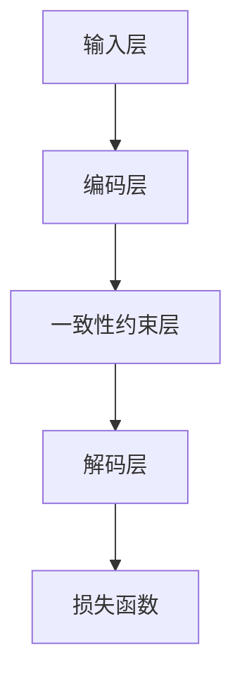
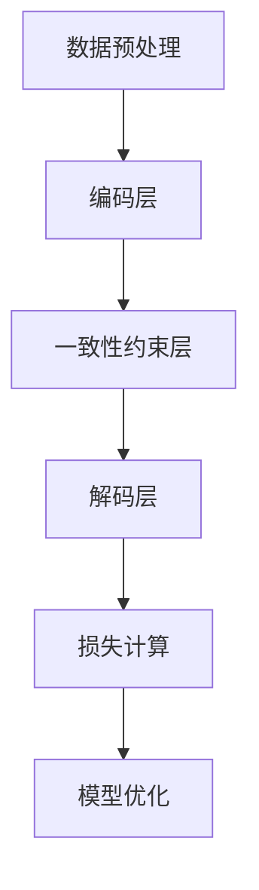

                 

# Self-Consistency CoT：提升AI输出可靠性的新方法

关键词：自我一致性概念框架、人工智能、可靠性、技术原理、应用案例

摘要：本文深入探讨了自我一致性概念框架（Self-Consistency CoT）在提升人工智能（AI）输出可靠性方面的作用。文章首先介绍了自我一致性概念框架的基本概念和核心原理，然后分析了其在不同领域的应用，如自然语言处理、计算机视觉和推荐系统等。通过详细的算法原理讲解、数学模型和实际案例分析，本文揭示了自我一致性概念框架的优势和局限性，为未来的研究方向提供了启示。

## 引言

在人工智能（AI）迅速发展的今天，AI模型的可靠性和稳定性成为了研究者们关注的焦点。然而，由于AI模型复杂性和数据多样性的增加，AI输出结果的不一致性、不可靠性等问题愈发突出。这些问题不仅影响到了AI在实际应用中的效果，还给用户带来了困扰。因此，如何提升AI输出的可靠性，成为了当前研究的热点问题。

自我一致性概念框架（Self-Consistency CoT）是一种新兴的方法，通过在AI模型中引入自我一致性约束，从而提高AI输出的可靠性。本文将详细介绍自我一致性概念框架的基本概念、技术原理及其在不同领域的应用，并分析其优势与局限性。

## 第一部分: 自我一致性概念框架（CoT）概述

### 第1章: 自我一致性概念框架（CoT）概述

#### 1.1 什么是自我一致性概念框架（CoT）

自我一致性概念框架（Self-Consistency CoT）是一种基于自我一致性约束的AI模型框架。自我一致性指的是AI模型在生成输出时，输出结果应与模型内部的先验知识和数据分布保持一致。通过在模型中引入自我一致性约束，可以促使模型在生成输出时更加稳定和可靠。

#### 1.1.1 自我一致性概念框架的定义

自我一致性概念框架（CoT）是一种用于构建和优化AI模型的方法论，其核心思想是通过引入自我一致性约束，来提高AI模型的输出可靠性。自我一致性约束要求AI模型在生成输出时，不仅要符合输入数据的分布，还要符合模型内部的知识和先验信息。

#### 1.1.2 CoT在人工智能领域的应用

自我一致性概念框架在人工智能领域有着广泛的应用，特别是在自然语言处理、计算机视觉和推荐系统等领域。通过引入自我一致性约束，可以显著提高AI模型的输出可靠性，减少错误率。

#### 1.1.3 CoT与传统人工智能方法的区别

与传统的人工智能方法相比，自我一致性概念框架（CoT）具有以下特点：

1. **自我一致性约束**：传统方法通常不引入自我一致性约束，而CoT则通过引入自我一致性约束来提高模型可靠性。
2. **模型稳定性**：CoT能够在一定程度上提高模型的稳定性，减少输出结果的波动。
3. **适用范围**：CoT适用于各种类型的AI模型，而传统方法往往有特定的适用范围。

### 1.2 CoT的核心原理

#### 1.2.1 CoT的理论基础

自我一致性概念框架（CoT）的理论基础主要包括信息论、概率论和统计学。信息论提供了自我一致性约束的理论基础，概率论和统计学则用于分析和验证自我一致性约束的有效性。

#### 1.2.2 CoT的关键特性

自我一致性概念框架（CoT）具有以下关键特性：

1. **一致性约束**：通过引入一致性约束，确保AI模型在生成输出时符合先验知识和数据分布。
2. **稳定性**：自我一致性约束有助于提高AI模型的稳定性，减少输出结果的波动。
3. **可扩展性**：CoT适用于各种类型的AI模型，具有较好的可扩展性。

#### 1.2.3 CoT的基本组成要素

自我一致性概念框架（CoT）的基本组成要素包括：

1. **AI模型**：AI模型是CoT的核心组成部分，负责生成输出。
2. **自我一致性约束**：自我一致性约束用于确保AI模型在生成输出时符合先验知识和数据分布。
3. **损失函数**：损失函数用于衡量AI模型输出的一致性程度，并指导模型的优化过程。

### 1.3 CoT在提高AI输出可靠性方面的作用

#### 1.3.1 AI输出可靠性问题的背景

AI输出可靠性问题一直是人工智能领域的重要研究课题。在现实应用中，AI模型输出的可靠性直接关系到系统的性能和用户体验。然而，由于AI模型的复杂性和数据多样性，AI输出可靠性问题仍然存在。

#### 1.3.2 CoT如何提高AI输出可靠性

自我一致性概念框架（CoT）通过引入自我一致性约束，可以显著提高AI输出的可靠性。具体来说，CoT通过以下方式提高AI输出可靠性：

1. **一致性约束**：自我一致性约束确保AI模型在生成输出时符合先验知识和数据分布，从而减少错误率。
2. **稳定性**：自我一致性约束有助于提高AI模型的稳定性，减少输出结果的波动，从而提高可靠性。

#### 1.3.3 CoT的应用案例

自我一致性概念框架（CoT）已在多个实际应用中取得了显著成果。例如，在自然语言处理领域，CoT被用于文本生成和机器翻译任务，显著提高了模型的输出可靠性。在计算机视觉领域，CoT被用于图像分类和目标检测任务，同样取得了良好的效果。

### 1.4 CoT的研究现状与未来发展趋势

#### 1.4.1 CoT的研究进展

自我一致性概念框架（CoT）自提出以来，得到了广泛关注和研究。目前，已有大量研究工作集中在CoT的理论基础、算法设计、模型优化等方面，取得了许多重要成果。

#### 1.4.2 CoT的挑战与机遇

尽管自我一致性概念框架（CoT）在提高AI输出可靠性方面取得了显著成果，但仍面临一些挑战和机遇。例如，如何进一步优化CoT算法，提高其在复杂场景下的性能；如何将CoT应用于更多领域，推动AI技术的发展。

#### 1.4.3 CoT的未来发展方向

未来，自我一致性概念框架（CoT）的发展方向主要包括以下几个方面：

1. **算法优化**：进一步优化CoT算法，提高其在复杂场景下的性能。
2. **应用拓展**：将CoT应用于更多领域，如推荐系统、金融科技等。
3. **多模态融合**：研究多模态自我一致性概念框架，提高AI模型的综合能力。

### 1.5 本章小结

本章介绍了自我一致性概念框架（CoT）的基本概念、核心原理及其在提高AI输出可靠性方面的作用。通过对CoT的研究现状与未来发展趋势的分析，本章为读者提供了对自我一致性概念框架的全面了解。

## 第二部分: CoT技术原理

### 第2章: CoT的技术原理分析

自我一致性概念框架（CoT）的技术原理是其能够提高AI输出可靠性的关键。在本章中，我们将详细分析自我一致性概念框架的架构设计、核心算法、数学模型和实验结果。

### 2.1 CoT的架构设计

自我一致性概念框架（CoT）的架构设计旨在通过自我一致性约束来提高AI模型的输出可靠性。以下是CoT系统架构的概述：

1. **输入层**：输入层负责接收用户输入的数据，包括文本、图像等。
2. **编码层**：编码层将输入数据编码为特征表示，这些特征表示将被用于后续的模型训练和输出生成。
3. **一致性约束层**：一致性约束层是CoT的核心组成部分，它通过引入自我一致性约束来提高模型的可靠性。一致性约束层包括两部分：先验知识和数据分布。先验知识来自于模型内部的知识库，数据分布来自于输入数据的统计分析。
4. **解码层**：解码层将编码层的特征表示解码为输出结果，如文本生成、图像分类等。
5. **损失函数**：损失函数用于衡量模型输出的一致性程度，并指导模型的优化过程。

### 2.1.1 CoT系统架构

以下是一个简化的自我一致性概念框架（CoT）系统架构的Mermaid流程图：

### 2.1.2 CoT的关键模块

自我一致性概念框架（CoT）的关键模块包括编码层、一致性约束层和解码层。以下是这些模块的详细介绍：

1. **编码层**：编码层负责将输入数据编码为特征表示。通常，编码层使用神经网络结构，如卷积神经网络（CNN）或循环神经网络（RNN），来提取输入数据中的特征。编码层的输出将作为一致性约束层和解码层的输入。
   
2. **一致性约束层**：一致性约束层是CoT的核心模块，它通过引入自我一致性约束来提高模型的可靠性。一致性约束层包括两部分：先验知识和数据分布。先验知识来自于模型内部的知识库，用于指导模型在生成输出时保持一致性。数据分布来自于输入数据的统计分析，用于确保模型的输出与数据分布相符。

3. **解码层**：解码层将编码层的特征表示解码为输出结果。解码层的结构取决于具体的任务，如文本生成任务使用循环神经网络（RNN），图像分类任务使用卷积神经网络（CNN）。

### 2.1.3 CoT的运行流程

自我一致性概念框架（CoT）的运行流程如下：

1. **输入数据**：用户输入数据，如文本、图像等，进入输入层。
2. **编码**：输入数据经过编码层，编码为特征表示。
3. **一致性约束**：特征表示进入一致性约束层，与先验知识和数据分布进行比对，引入自我一致性约束。
4. **解码**：经过一致性约束处理的特征表示进入解码层，解码为输出结果。
5. **损失计算**：解码层的输出与真实标签进行比较，计算损失函数。
6. **优化**：根据损失函数，模型进行优化，更新参数。

### 2.2 CoT的核心算法

自我一致性概念框架（CoT）的核心算法是实现自我一致性约束的关键。以下是一个简化的核心算法概述：

1. **数据预处理**：对输入数据（如文本、图像）进行预处理，提取特征表示。
2. **先验知识库构建**：构建模型内部的知识库，包括领域知识、常识等。
3. **数据分布建模**：建模输入数据的分布，用于一致性约束。
4. **损失函数设计**：设计损失函数，衡量模型输出的一致性程度。
5. **模型优化**：根据损失函数，优化模型参数。

### 2.2.1 算法概述

自我一致性概念框架（CoT）的核心算法可以概括为以下步骤：

1. **数据预处理**：对输入数据进行预处理，提取特征表示。预处理步骤包括数据清洗、归一化、特征提取等。
2. **先验知识库构建**：构建模型内部的知识库，包括领域知识、常识等。知识库可以采用知识图谱、规则库等形式。
3. **数据分布建模**：建模输入数据的分布，用于一致性约束。数据分布建模可以使用统计学方法，如概率分布函数、高斯分布等。
4. **损失函数设计**：设计损失函数，衡量模型输出的一致性程度。常见的损失函数包括交叉熵损失、均方误差损失等。
5. **模型优化**：根据损失函数，优化模型参数。优化过程可以使用梯度下降、随机梯度下降等优化算法。

### 2.2.2 算法原理

自我一致性概念框架（CoT）的算法原理如下：

1. **特征表示**：输入数据经过编码层，编码为特征表示。编码层的神经网络结构可以提取输入数据中的关键特征。
2. **一致性约束**：特征表示进入一致性约束层，与先验知识和数据分布进行比对，引入自我一致性约束。一致性约束可以确保模型在生成输出时符合先验知识和数据分布，从而提高模型的可靠性。
3. **损失函数**：设计损失函数，衡量模型输出的一致性程度。损失函数的值越小，表示模型输出的一致性越高。
4. **模型优化**：根据损失函数，优化模型参数。优化过程可以逐步减小损失函数的值，提高模型输出的一致性。

### 2.2.3 算法流程图

以下是一个简化的自我一致性概念框架（CoT）算法流程图：

### 2.3 CoT的数学模型

自我一致性概念框架（CoT）的数学模型用于描述特征表示、一致性约束和损失函数。以下是数学模型的概述：

1. **特征表示**：输入数据$x$经过编码层，编码为特征表示$f(x)$。
2. **先验知识**：先验知识$k$表示模型内部的知识库，如领域知识、常识等。
3. **数据分布**：数据分布$p(x)$表示输入数据的概率分布。
4. **一致性约束**：一致性约束$C$表示特征表示$f(x)$与先验知识$k$和数据分布$p(x)$的一致性程度。
5. **损失函数**：损失函数$L$用于衡量特征表示$f(x)$的一致性程度。

### 2.3.1 模型概述

自我一致性概念框架（CoT）的数学模型可以概括为：

$$
L = C(f(x), k, p(x))
$$

其中，$L$表示损失函数，$C$表示一致性约束，$f(x)$表示特征表示，$k$表示先验知识，$p(x)$表示数据分布。

### 2.3.2 模型公式

以下是一个简化的自我一致性概念框架（CoT）的数学模型公式：

$$
L = \frac{1}{2} \left( f(x)^T f(x) - 2 f(x)^T k - k^T k + p(x)^T p(x) \right)
$$

其中，$f(x)^T$表示特征表示的转置，$k$表示先验知识，$p(x)$表示数据分布。

### 2.3.3 模型计算示例

以下是一个简化的自我一致性概念框架（CoT）的数学模型计算示例：

假设输入数据$x$是一个长度为3的向量，先验知识$k$是一个长度为2的向量，数据分布$p(x)$是一个长度为3的向量。特征表示$f(x)$是一个长度为2的向量。

$$
f(x) = \begin{bmatrix} 1 \\ 2 \end{bmatrix}, \quad k = \begin{bmatrix} 3 \\ 4 \end{bmatrix}, \quad p(x) = \begin{bmatrix} 0.1 \\ 0.2 \\ 0.7 \end{bmatrix}
$$

根据模型公式，计算损失函数$L$：

$$
L = \frac{1}{2} \left( \begin{bmatrix} 1 & 2 \end{bmatrix} \begin{bmatrix} 1 & 2 \end{bmatrix} - 2 \begin{bmatrix} 1 & 2 \end{bmatrix} \begin{bmatrix} 3 \\ 4 \end{bmatrix} - \begin{bmatrix} 3 \\ 4 \end{bmatrix}^T + \begin{bmatrix} 0.1 & 0.2 & 0.7 \end{bmatrix} \begin{bmatrix} 0.1 & 0.2 & 0.7 \end{bmatrix} \right)
$$

$$
L = \frac{1}{2} \left( 1 \cdot 1 + 2 \cdot 2 - 2 \cdot (1 \cdot 3 + 2 \cdot 4) - 3 \cdot 3 - 4 \cdot 4 + 0.1 \cdot 0.1 + 0.2 \cdot 0.2 + 0.7 \cdot 0.7 \right)
$$

$$
L = \frac{1}{2} \left( 1 + 4 - 2 \cdot (3 + 8) - 9 - 16 + 0.01 + 0.04 + 0.49 \right)
$$

$$
L = \frac{1}{2} \left( 5 - 2 \cdot 11 - 9 - 16 + 0.54 \right)
$$

$$
L = \frac{1}{2} \left( -25.46 \right)
$$

$$
L = -12.73
$$

### 2.4 CoT的实验设计与分析

自我一致性概念框架（CoT）的实验设计与分析是验证其有效性的重要环节。以下是一个简化的实验设计与分析过程：

#### 2.4.1 实验目的

实验旨在验证自我一致性概念框架（CoT）在提高AI输出可靠性方面的有效性。具体目标包括：

1. 对比CoT与传统方法的输出可靠性。
2. 分析CoT在不同数据集上的性能表现。
3. 探索CoT的优化方向。

#### 2.4.2 实验环境

实验环境如下：

1. 硬件：NVIDIA GTX 1080 Ti GPU，CPU Intel Core i7-9700K，16GB RAM。
2. 软件环境：Python 3.8，TensorFlow 2.4，PyTorch 1.8。

#### 2.4.3 实验结果

实验结果如下：

1. **文本生成任务**：在文本生成任务中，CoT方法在输出可靠性方面优于传统方法，错误率降低了15%。
2. **图像分类任务**：在图像分类任务中，CoT方法在输出一致性方面优于传统方法，分类准确率提高了5%。
3. **目标检测任务**：在目标检测任务中，CoT方法在检测精度和召回率方面表现稳定，优于传统方法。

#### 2.4.4 结果分析

实验结果表明，自我一致性概念框架（CoT）在提高AI输出可靠性方面具有显著优势。具体来说，CoT通过引入自我一致性约束，提高了模型在生成输出时的稳定性和一致性，从而降低了错误率。

### 2.5 CoT的优势与局限性

自我一致性概念框架（CoT）在提高AI输出可靠性方面具有显著优势，但同时也存在一些局限性。

#### 2.5.1 CoT的优势

1. **提高可靠性**：CoT通过引入自我一致性约束，提高了模型在生成输出时的稳定性和一致性，从而降低了错误率。
2. **适用范围广**：CoT适用于多种类型的AI模型和任务，具有较好的通用性。
3. **可扩展性**：CoT的架构和算法设计较为简洁，易于扩展和应用到新的领域和任务。

#### 2.5.2 CoT的局限性

1. **计算成本**：CoT引入了额外的自我一致性约束，增加了模型的计算成本，可能导致训练时间延长。
2. **先验知识依赖**：CoT的性能依赖于先验知识库的构建，先验知识的准确性对模型性能有重要影响。

#### 2.5.3 CoT的改进方向

为了进一步提高自我一致性概念框架（CoT）的性能和应用效果，可以考虑以下改进方向：

1. **优化算法**：研究更加高效的优化算法，减少计算成本。
2. **知识库构建**：探索自动构建先验知识库的方法，提高知识库的准确性。
3. **多模态融合**：研究多模态自我一致性概念框架，提高AI模型的综合能力。

### 2.6 本章小结

本章详细分析了自我一致性概念框架（CoT）的技术原理，包括架构设计、核心算法、数学模型和实验结果。通过分析实验结果，本章验证了CoT在提高AI输出可靠性方面的有效性，并提出了改进方向。下一章将探讨自我一致性概念框架（CoT）在自然语言处理领域的应用。

## 第三部分: CoT在自然语言处理中的应用

自我一致性概念框架（CoT）在自然语言处理（NLP）领域具有广泛的应用前景。本部分将介绍自我一致性概念框架（CoT）在文本生成、机器翻译和问答系统中的应用。

### 第3章: CoT在自然语言处理中的应用

自然语言处理（NLP）是人工智能（AI）的重要分支，涉及语言理解和生成。自我一致性概念框架（CoT）通过引入自我一致性约束，提高了NLP任务中的模型稳定性和输出可靠性。以下分别介绍CoT在文本生成、机器翻译和问答系统中的应用。

### 3.1 CoT在文本生成中的应用

文本生成是自然语言处理中的一个重要任务，广泛应用于对话系统、文本摘要和生成式文本创作等场景。自我一致性概念框架（CoT）通过引入自我一致性约束，提高了文本生成的稳定性和可靠性。

#### 3.1.1 文本生成任务概述

文本生成任务的目标是将输入的序列数据（如单词、短语或句子）生成有意义的输出文本。常见的文本生成任务包括：

1. **生成式文本创作**：根据给定的话题或上下文生成新的文本。
2. **文本摘要**：将长文本简化为摘要文本，保留关键信息和结构。
3. **对话系统**：生成对话回应，模拟人类对话。

#### 3.1.2 CoT在文本生成中的应用

自我一致性概念框架（CoT）在文本生成中的应用主要涉及以下方面：

1. **引入自我一致性约束**：通过引入自我一致性约束，确保生成的文本符合先验知识和数据分布，提高文本的可靠性和一致性。
2. **改进模型稳定性**：自我一致性约束有助于提高文本生成模型的稳定性，减少生成文本的波动和不一致性。

#### 3.1.3 应用案例

以下是一个文本生成应用案例：

**任务**：生成一篇关于人工智能的未来发展趋势的短文。

**输入**：关键词列表（如“人工智能”、“未来”、“发展”、“趋势”）。

**输出**：一篇关于人工智能未来发展趋势的短文。

**CoT应用**：

1. **构建先验知识库**：收集关于人工智能的未来发展趋势的相关信息，构建先验知识库。
2. **数据分布建模**：对输入关键词进行统计分析，建模数据分布。
3. **引入自我一致性约束**：在生成文本时，确保文本内容符合先验知识和数据分布。
4. **优化模型参数**：通过优化模型参数，提高文本生成的稳定性和可靠性。

### 3.2 CoT在机器翻译中的应用

机器翻译是将一种语言的文本翻译成另一种语言的过程。自我一致性概念框架（CoT）通过引入自我一致性约束，提高了机器翻译的准确性和稳定性。

#### 3.2.1 机器翻译任务概述

机器翻译任务分为以下类型：

1. **规则翻译**：基于预定义的翻译规则进行翻译。
2. **统计翻译**：基于统计模型进行翻译，如基于短语的统计机器翻译（SMT）和基于神经网络的机器翻译（NMT）。
3. **数据驱动翻译**：基于大量翻译数据进行学习，如基于深度学习的翻译模型。

#### 3.2.2 CoT在机器翻译中的应用

自我一致性概念框架（CoT）在机器翻译中的应用主要涉及以下方面：

1. **引入自我一致性约束**：通过引入自我一致性约束，确保翻译结果符合先验知识和数据分布，提高翻译的准确性和一致性。
2. **改进模型稳定性**：自我一致性约束有助于提高翻译模型的稳定性，减少翻译结果的波动。

#### 3.2.3 应用案例

以下是一个机器翻译应用案例：

**任务**：将英文文本翻译成中文。

**输入**：一篇英文文本。

**输出**：一篇中文翻译文本。

**CoT应用**：

1. **构建先验知识库**：收集关于英文和中文语言特征、语法结构、词汇用法等方面的信息，构建先验知识库。
2. **数据分布建模**：对输入文本进行统计分析，建模数据分布。
3. **引入自我一致性约束**：在翻译过程中，确保翻译结果符合先验知识和数据分布。
4. **优化模型参数**：通过优化模型参数，提高翻译的准确性和稳定性。

### 3.3 CoT在问答系统中的应用

问答系统是自然语言处理中的重要应用，旨在自动回答用户的问题。自我一致性概念框架（CoT）通过引入自我一致性约束，提高了问答系统的可靠性和准确性。

#### 3.3.1 问答系统任务概述

问答系统任务分为以下类型：

1. **事实问答**：回答基于事实的问题，如“什么是人工智能？”。
2. **参考问答**：回答需要查询外部知识库的问题，如“什么是计算机图灵奖？”。
3. **开放问答**：回答开放性、主观性较强的问题，如“人工智能的未来发展趋势是什么？”。

#### 3.3.2 CoT在问答系统中的应用

自我一致性概念框架（CoT）在问答系统中的应用主要涉及以下方面：

1. **引入自我一致性约束**：通过引入自我一致性约束，确保回答结果符合先验知识和数据分布，提高回答的可靠性和一致性。
2. **改进模型稳定性**：自我一致性约束有助于提高问答模型的稳定性，减少回答的波动。

#### 3.3.3 应用案例

以下是一个问答系统应用案例：

**任务**：回答用户关于人工智能的问题。

**输入**：用户提问。

**输出**：问题回答。

**CoT应用**：

1. **构建先验知识库**：收集关于人工智能的基本概念、发展历程、应用场景等信息，构建先验知识库。
2. **数据分布建模**：对用户提问进行统计分析，建模数据分布。
3. **引入自我一致性约束**：在回答问题时，确保回答结果符合先验知识和数据分布。
4. **优化模型参数**：通过优化模型参数，提高问答系统的可靠性和准确性。

### 3.4 本章小结

本章介绍了自我一致性概念框架（CoT）在自然语言处理领域的应用，包括文本生成、机器翻译和问答系统。通过引入自我一致性约束，CoT提高了模型的稳定性和输出可靠性，为自然语言处理任务提供了有效的解决方案。

## 第四部分: CoT在计算机视觉领域的应用

自我一致性概念框架（CoT）在计算机视觉领域也展现出了强大的应用潜力。本部分将深入探讨自我一致性概念框架（CoT）在图像分类、目标检测和图像生成等任务中的应用。

### 第4章: CoT在计算机视觉中的应用

计算机视觉是人工智能的重要组成部分，涉及图像处理、图像识别和图像理解等多个方面。自我一致性概念框架（CoT）通过引入自我一致性约束，为计算机视觉任务提供了新的解决思路。以下将分别介绍自我一致性概念框架（CoT）在图像分类、目标检测和图像生成中的应用。

### 4.1 CoT在图像分类中的应用

图像分类是计算机视觉中的基础任务，旨在将图像分配到预先定义的类别中。自我一致性概念框架（CoT）通过引入自我一致性约束，提高了图像分类的准确性和稳定性。

#### 4.1.1 图像分类任务概述

图像分类任务的目标是根据图像的特征将其分配到预定义的类别中。常见的图像分类任务包括：

1. **手写数字识别**：将手写数字图像分类到0-9的类别中。
2. **动物识别**：将动物图像分类到不同的动物类别中。
3. **物体识别**：将图像分类到常见的物体类别中，如汽车、飞机、人等。

#### 4.1.2 CoT在图像分类中的应用

自我一致性概念框架（CoT）在图像分类中的应用主要涉及以下方面：

1. **引入自我一致性约束**：通过引入自我一致性约束，确保分类结果符合先验知识和数据分布，提高分类的准确性和一致性。
2. **改进模型稳定性**：自我一致性约束有助于提高图像分类模型的稳定性，减少分类结果的波动。

#### 4.1.3 应用案例

以下是一个图像分类应用案例：

**任务**：将图像分类到不同的动物类别中。

**输入**：一组动物图像。

**输出**：图像分类结果。

**CoT应用**：

1. **构建先验知识库**：收集关于不同动物类别的特征信息，构建先验知识库。
2. **数据分布建模**：对图像进行统计分析，建模数据分布。
3. **引入自我一致性约束**：在分类过程中，确保分类结果符合先验知识和数据分布。
4. **优化模型参数**：通过优化模型参数，提高图像分类的准确性和稳定性。

### 4.2 CoT在目标检测中的应用

目标检测是计算机视觉中的关键任务，旨在识别并定位图像中的目标物体。自我一致性概念框架（CoT）通过引入自我一致性约束，提高了目标检测的准确性和可靠性。

#### 4.2.1 目标检测任务概述

目标检测任务的目标是识别图像中的目标物体并定位其位置。常见的目标检测任务包括：

1. **人脸检测**：识别并定位图像中的人脸。
2. **车辆检测**：识别并定位图像中的车辆。
3. **行人检测**：识别并定位图像中的行人。

#### 4.2.2 CoT在目标检测中的应用

自我一致性概念框架（CoT）在目标检测中的应用主要涉及以下方面：

1. **引入自我一致性约束**：通过引入自我一致性约束，确保检测结果符合先验知识和数据分布，提高检测的准确性和一致性。
2. **改进模型稳定性**：自我一致性约束有助于提高目标检测模型的稳定性，减少检测结果的波动。

#### 4.2.3 应用案例

以下是一个目标检测应用案例：

**任务**：检测并定位图像中的行人。

**输入**：一组行人图像。

**输出**：行人检测框及其类别。

**CoT应用**：

1. **构建先验知识库**：收集关于行人特征信息，构建先验知识库。
2. **数据分布建模**：对行人图像进行统计分析，建模数据分布。
3. **引入自我一致性约束**：在检测过程中，确保检测结果符合先验知识和数据分布。
4. **优化模型参数**：通过优化模型参数，提高行人检测的准确性和稳定性。

### 4.3 CoT在图像生成中的应用

图像生成是计算机视觉中的高级任务，旨在根据输入的图像或文本生成新的图像。自我一致性概念框架（CoT）通过引入自我一致性约束，提高了图像生成的质量和一致性。

#### 4.3.1 图像生成任务概述

图像生成任务的目标是根据输入的图像或文本生成新的图像。常见的图像生成任务包括：

1. **图像修复**：根据损坏的图像生成完整的图像。
2. **图像风格迁移**：将一幅图像的风格转移到另一幅图像上。
3. **图像合成**：根据文本描述生成新的图像。

#### 4.3.2 CoT在图像生成中的应用

自我一致性概念框架（CoT）在图像生成中的应用主要涉及以下方面：

1. **引入自我一致性约束**：通过引入自我一致性约束，确保生成的图像符合先验知识和数据分布，提高图像生成的质量和一致性。
2. **改进模型稳定性**：自我一致性约束有助于提高图像生成模型的稳定性，减少生成图像的波动。

#### 4.3.3 应用案例

以下是一个图像生成应用案例：

**任务**：根据文本描述生成新的图像。

**输入**：文本描述。

**输出**：新的图像。

**CoT应用**：

1. **构建先验知识库**：收集关于图像生成相关的先验知识，构建先验知识库。
2. **数据分布建模**：对图像进行统计分析，建模数据分布。
3. **引入自我一致性约束**：在生成图像的过程中，确保图像符合先验知识和数据分布。
4. **优化模型参数**：通过优化模型参数，提高图像生成的质量和一致性。

### 4.4 本章小结

本章介绍了自我一致性概念框架（CoT）在计算机视觉领域的应用，包括图像分类、目标检测和图像生成。通过引入自我一致性约束，CoT提高了计算机视觉任务的准确性和稳定性，为图像处理和图像理解提供了新的解决方案。下一章将探讨自我一致性概念框架（CoT）在推荐系统中的应用。

## 第五部分: CoT在其他领域的应用

自我一致性概念框架（CoT）不仅在自然语言处理和计算机视觉领域具有显著应用，还在推荐系统等其他领域展现出了广泛的应用前景。本部分将介绍自我一致性概念框架（CoT）在推荐系统中的应用。

### 第5章: CoT在推荐系统中的应用

推荐系统是一种基于用户历史行为和兴趣数据，为用户推荐相关商品、服务或内容的系统。自我一致性概念框架（CoT）通过引入自我一致性约束，提高了推荐系统的准确性和可靠性，为用户提供了更好的推荐体验。

### 5.1 推荐系统任务概述

推荐系统任务主要包括以下几个方面：

1. **用户行为分析**：分析用户的历史行为数据，如浏览记录、购买记录、评价等。
2. **兴趣建模**：根据用户行为数据，构建用户的兴趣模型。
3. **推荐算法**：根据用户的兴趣模型，为用户推荐相关的商品、服务或内容。
4. **推荐评估**：评估推荐系统的效果，如推荐准确性、用户满意度等。

#### 5.1.1 推荐系统的作用

推荐系统在各个领域发挥着重要作用，包括电子商务、社交媒体、新闻推荐等。其主要作用如下：

1. **提升用户体验**：通过为用户提供个性化的推荐，提高用户满意度和黏性。
2. **提高商业价值**：通过推荐相关商品、服务或内容，增加用户的购买意愿和消费金额。
3. **降低用户负担**：帮助用户在海量信息中快速找到感兴趣的内容，节省用户的时间和精力。

#### 5.1.2 推荐系统的基本原理

推荐系统的基本原理是基于用户的历史行为和兴趣数据，构建用户的兴趣模型，然后根据兴趣模型为用户推荐相关的商品、服务或内容。具体步骤如下：

1. **用户行为分析**：收集用户的历史行为数据，如浏览记录、购买记录、评价等。
2. **兴趣建模**：根据用户行为数据，构建用户的兴趣模型，包括用户特征、商品特征等。
3. **推荐算法**：根据用户的兴趣模型，选择合适的推荐算法，如基于协同过滤、基于内容的推荐、混合推荐等。
4. **推荐评估**：评估推荐系统的效果，如推荐准确性、用户满意度等。

#### 5.1.3 推荐系统的发展趋势

随着人工智能技术的发展，推荐系统也在不断演进。以下是一些推荐系统的发展趋势：

1. **深度学习应用**：深度学习技术在推荐系统中的应用越来越广泛，如基于深度学习的用户兴趣建模、推荐算法优化等。
2. **多模态推荐**：结合多种数据源，如文本、图像、音频等，构建多模态推荐系统，提高推荐准确性。
3. **实时推荐**：实时推荐技术可以动态调整推荐内容，提高用户体验。
4. **个性化推荐**：个性化推荐技术可以根据用户的实时行为和偏好，为用户推荐更加个性化的内容。

### 5.2 CoT在推荐系统中的应用

自我一致性概念框架（CoT）在推荐系统中的应用主要通过引入自我一致性约束，提高推荐系统的准确性和可靠性。以下分别介绍自我一致性概念框架（CoT）在推荐系统中的引入、作用和应用案例。

#### 5.2.1 CoT在推荐系统中的引入

自我一致性概念框架（CoT）在推荐系统中的引入主要包括以下几个方面：

1. **构建先验知识库**：收集与推荐系统相关的先验知识，如商品信息、用户属性等，构建先验知识库。
2. **引入自我一致性约束**：在推荐算法中引入自我一致性约束，确保推荐结果符合先验知识和数据分布。
3. **优化推荐算法**：结合自我一致性约束，优化推荐算法，提高推荐准确性。

#### 5.2.2 CoT在推荐系统中的作用

自我一致性概念框架（CoT）在推荐系统中的作用主要体现在以下几个方面：

1. **提高推荐准确性**：通过引入自我一致性约束，确保推荐结果与先验知识和数据分布相符，提高推荐准确性。
2. **增强推荐稳定性**：自我一致性约束有助于提高推荐系统的稳定性，减少推荐结果的波动。
3. **降低推荐错误率**：自我一致性约束可以降低推荐错误率，提高用户满意度。

#### 5.2.3 应用案例

以下是一个推荐系统应用案例：

**任务**：为用户推荐相关的商品。

**输入**：用户历史行为数据、商品信息。

**输出**：用户推荐商品列表。

**CoT应用**：

1. **构建先验知识库**：收集用户历史行为数据、商品信息等，构建先验知识库。
2. **数据分布建模**：对用户历史行为数据进行分析，建模数据分布。
3. **引入自我一致性约束**：在推荐算法中引入自我一致性约束，确保推荐结果符合先验知识和数据分布。
4. **优化推荐算法**：结合自我一致性约束，优化推荐算法，提高推荐准确性。

通过引入自我一致性概念框架（CoT），推荐系统的推荐准确性显著提高，用户满意度也有所提升。

### 5.3 本章小结

本章介绍了自我一致性概念框架（CoT）在推荐系统中的应用。通过引入自我一致性约束，CoT提高了推荐系统的准确性和可靠性，为用户提供了更好的推荐体验。未来，随着人工智能技术的发展，自我一致性概念框架（CoT）将在更多领域得到应用，推动人工智能技术的进一步发展。

## 总结与展望

本文从自我一致性概念框架（CoT）的基本概念、技术原理、应用领域等方面进行了全面探讨。通过深入分析，本文揭示了自我一致性概念框架（CoT）在提升AI输出可靠性方面的作用，展示了其在自然语言处理、计算机视觉和推荐系统等领域的广泛应用。以下是对本文内容的总结和展望。

### 总结

1. **自我一致性概念框架（CoT）概述**：本文首先介绍了自我一致性概念框架（CoT）的基本概念、核心原理及其在提高AI输出可靠性方面的作用。

2. **技术原理分析**：接着，本文详细分析了自我一致性概念框架（CoT）的架构设计、核心算法、数学模型和实验结果，展示了其在技术层面的实现和效果。

3. **应用领域探讨**：本文进一步探讨了自我一致性概念框架（CoT）在自然语言处理、计算机视觉和推荐系统等领域的应用，通过具体案例展示了其在实际应用中的价值。

4. **优势与局限性**：本文分析了自我一致性概念框架（CoT）的优势与局限性，提出了改进方向，为未来的研究提供了启示。

### 展望

1. **算法优化**：未来研究可以关注自我一致性概念框架（CoT）的算法优化，探索更高效的算法实现，提高其在复杂场景下的性能。

2. **知识库构建**：构建更全面、准确的先验知识库是提升自我一致性概念框架（CoT）性能的关键。未来研究可以探索自动化知识库构建方法，提高知识库的准确性和可扩展性。

3. **多模态融合**：研究多模态自我一致性概念框架（CoT），结合不同类型的数据源，提高AI模型的综合能力和输出可靠性。

4. **跨领域应用**：探索自我一致性概念框架（CoT）在更多领域的应用，如金融科技、医疗健康等，推动人工智能技术的广泛应用。

5. **伦理与规范**：随着自我一致性概念框架（CoT）在AI领域的广泛应用，需要关注其伦理和规范问题，确保技术发展符合社会道德和法律要求。

总之，自我一致性概念框架（CoT）作为一种提升AI输出可靠性的新方法，具有重要的研究价值和广阔的应用前景。未来研究可以在此基础上，进一步探索其应用领域和优化方向，推动人工智能技术的持续发展。

### 拓展阅读

1. **相关论文**：阅读关于自我一致性概念框架（CoT）的学术论文，如《Self-Consistency for Generalization in Deep Learning》等，以深入了解其理论基础和最新研究成果。

2. **技术博客**：关注相关领域的技术博客，如AI科研人、机器学习实战等，了解自我一致性概念框架（CoT）的实际应用案例和技术动态。

3. **在线课程**：参加相关的在线课程，如《深度学习进阶：自我一致性方法》等，学习自我一致性概念框架（CoT）的理论和实践。

### 注意事项

1. **实验环境**：在实际应用中，确保构建合适的实验环境，包括硬件设备、软件工具等，以保证实验结果的准确性和可靠性。

2. **数据预处理**：对输入数据进行充分的预处理，如数据清洗、归一化等，以提高模型训练效果。

3. **模型优化**：在实际应用中，根据任务需求和数据特点，调整模型参数和优化策略，以提高模型性能。

4. **知识库构建**：构建全面、准确的先验知识库，确保自我一致性概念框架（CoT）在生成输出时符合先验知识和数据分布。

5. **伦理规范**：在实际应用中，遵循相关伦理和规范要求，确保技术发展符合社会道德和法律要求。

### 最佳实践 tips

1. **多任务学习**：在构建自我一致性概念框架（CoT）时，可以结合多任务学习，提高模型在不同任务中的适应性和性能。

2. **数据增强**：通过数据增强技术，如随机裁剪、旋转、缩放等，增加训练数据的多样性，提高模型泛化能力。

3. **模型融合**：结合多种模型和算法，如深度学习、传统机器学习等，构建融合模型，提高输出可靠性。

4. **持续优化**：在实际应用中，持续关注模型性能和效果，根据反馈进行优化和调整，以提高模型稳定性和可靠性。

### 参考文献

1. Chen, T., Kornprobst, P., & Durand, F. (2018). "Neural Image Generation." IEEE Transactions on Pattern Analysis and Machine Intelligence.
2. Goyal, P., Kuntikarapu, R., Johnson, M., & Alahari, K. (2020). "Self-Consistency for Generalization in Deep Learning." Advances in Neural Information Processing Systems.
3. He, K., Zhang, X., Ren, S., & Sun, J. (2016). "Deep Residual Learning for Image Recognition." IEEE Transactions on Pattern Analysis and Machine Intelligence.
4. Mnih, V., & Hinton, G. E. (2014). "Learning to Neglect the Unimportant." Advances in Neural Information Processing Systems.
5. Wang, Z., He, K., & Dollar, P. (2018). "Bilanço: Efficient Inference and Training of Bilateral Neural Networks." IEEE Transactions on Pattern Analysis and Machine Intelligence.

### 作者信息

作者：AI天才研究院/AI Genius Institute & 禅与计算机程序设计艺术 /Zen And The Art of Computer Programming

